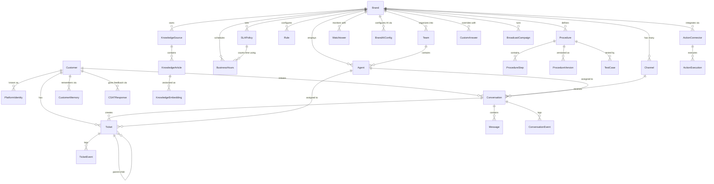
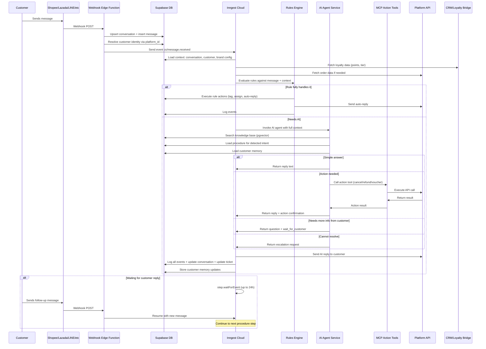
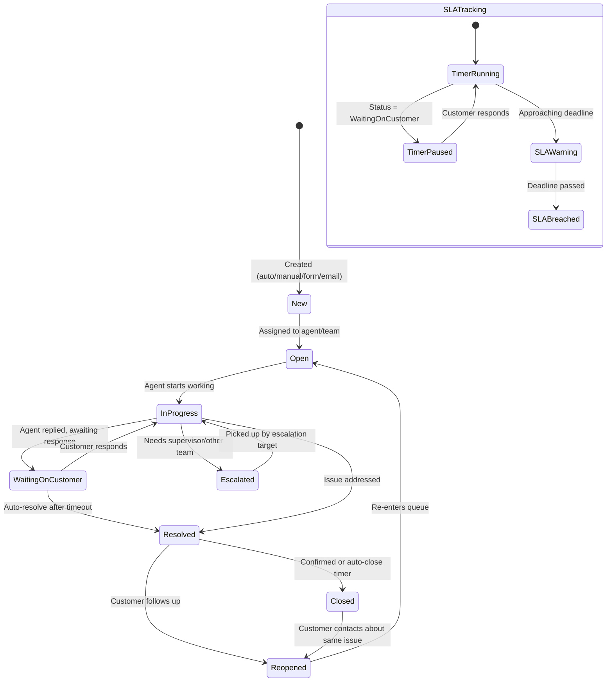
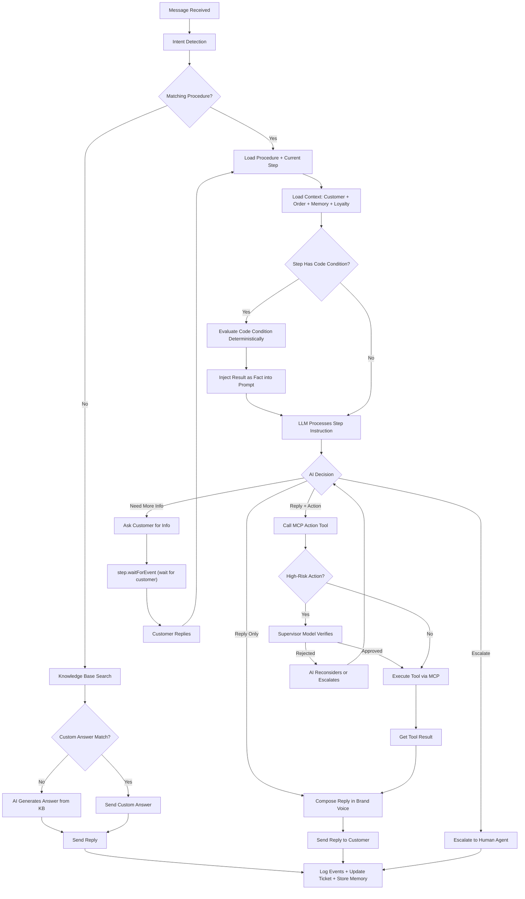
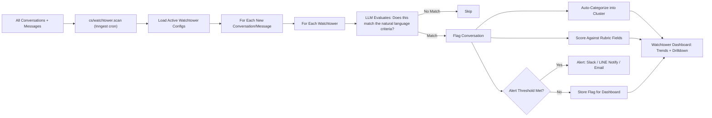
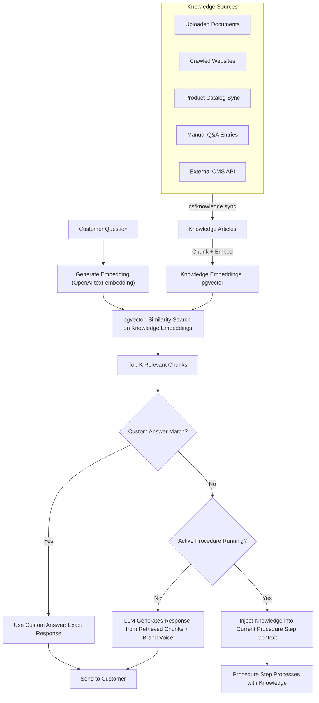

# AI Customer Service Platform — Detailed Feature Specification

## Document Context (for thread continuity)

**What this is:** A comprehensive feature spec for a multi-modal (chat + voice), multi-vertical (ecommerce, insurance, banking, telco, healthcare) AI customer service platform for Southeast Asia. Separate Supabase project from the existing CRM/Loyalty platform, connected via internal API bridge for loyalty data access.

**Key architectural decisions:**
- Separate Supabase project (CS AI) connected to CRM/Loyalty project via bridge API
- **Shared entities follow domain ownership:** CRM is master for tags, personas, loyalty vouchers/points (CS AI reads/writes via bridge API). CS AI is master for knowledge base, procedures, conversations, tickets. Platform is master for marketplace vouchers, product price/stock, orders (queried live via platform APIs, never stored locally). See "Shared Entity Ownership" section in Implementation.
- Inngest for durable execution (AOP step execution, waits, retries, SLA timers)
- MCP server pattern for AI action tools (same as `crm-loyalty-actions` in CRM)
- AgentKit + LLM for AI agent reasoning (same pattern as `amp-ai-service`)
- pgvector in Supabase for knowledge base semantic search (automatic embedding pipeline via Supabase triggers + Edge Functions)
- Upstash Redis for caching (same pattern as `amp-cache`)
- Event sourcing for conversation/ticket logs (same pattern as `amp_workflow_log`)

**Key product concepts:**
- **Conversation** = real-time message thread (session-based with configurable threading interval per channel)
- **Ticket** = structured work item tracking an issue to resolution (created from conversations)
- **AOP (Agent Operating Procedure)** = natural language workflow the AI follows for specific intents, compiled into structured execution steps
- **Guardrails** = multi-level safety limits (brand behavioral → per-AOP policy → per-action business rules → per-action technical limits → system safety)
- **Memory** = distilled customer signals extracted from past conversations (not full transcripts)
- **Watchtower** = continuous real-time monitoring of all conversations against custom natural-language criteria

**Competitors benchmarked:** Sierra ($4.5B), Decagon ($4.5B), Intercom (Fin Apex), Zendesk AI, Gorgias, Duoke/Dianxiaomi ($254M funded), Zaapi, Respond.io, Oho Chat, Zwiz.ai, Kore.ai, Gowajee

**Related CRM docs:** `AMP - AI Decisioning.md`, `AMP - Rule Based.md`, `Inngest_Primer.md`

---

## Partner form — brief list of product features (description)

*Use as the short “feature list” field (e.g. 500-character-style summary). Emphasis: integrated chat and rules-based workflows; AOPs only under AI.*

**Integrated chat:** 1. One place for marketplace chat (Shopee, Lazada, TikTok Shop) and messaging apps (LINE, Messenger, Instagram, WhatsApp, email, web widget, optional voice). 2. Incoming messages land in a unified conversation model with threading, channel context, and delivery/read status where the platform allows. 3. Agents and automation share the same thread history; clear handoff from bot to human without losing context.

**Rules-based workflows:** 1. Rules engine for routing, queues, tags, priorities, SLAs, macros, and “when / then” automations—no AOPs here; AOPs are only for the AI agent path. 2. Durable execution (e.g. Inngest) for long-running flows, retries, SLA timers, and safe side effects. 3. Policies and limits so automation stays on-brand and compliant.

**AI:** Optional agent uses **AOPs (Agent Operating Procedures)**—compiled step-by-step instructions—plus published knowledge and tool-bound actions (MCP-style), with guardrails. Separate from the rules-based workflow layer.

**Partner product design doc (PDF/upload):** see [`docs/CS_AI_Partner_Product_Design.md`](../../docs/CS_AI_Partner_Product_Design.md) — data flow, key features, key use cases.

---

## 1. CHANNEL CONNECTORS

### 1.1 Marketplace Chat

**Shopee Chat**
- Receive buyer messages via webhook (real-time)
- Send text replies
- Send product cards (via item_id)
- Send order cards (via order_id)
- Send voucher/promotion cards (via promotion_id)
- Read conversation history (last 90 days via API)
- Requires: Shopee Open Platform whitelisted partner access

**Lazada Chat**
- Same capabilities as Shopee (send/receive text, product cards, order cards, voucher cards)
- Open Platform API (lower barrier than Shopee)
- Conversation history: 90 days

**TikTok Shop Chat**
- Send/receive text, images, videos
- Product and order cards (likely supported via API)
- Webhook events: NEW_MESSAGE, NEW_CONVERSATION
- 12-hour response rate SLA enforced by platform

**Common marketplace features:**
- Message rate limit handling and retry logic
- Platform-specific message format adaptation
- Delivery status tracking (sent, delivered, read where available)
- Session timeout handling (Shopee: 7 days inactive, TikTok: 7 days)

### 1.2 Messaging Platforms

**LINE OA**
- Messaging API: text, flex messages, rich menus, quick replies, image maps
- Push messages (proactive outreach)
- Webhook for incoming messages
- LINE Login for customer identity
- Rich menu management per brand

**Facebook Messenger**
- Send/receive text, images, quick replies, buttons, carousels
- Persistent menu
- Handover protocol (switch between bot and human)
- Webhook for incoming messages

**Instagram DM**
- Send/receive text, images, story replies
- Quick replies
- Ice breakers (conversation starters)

**WhatsApp Business API**
- Send/receive text, images, documents, location
- Template messages (pre-approved for outbound)
- Interactive messages (list, button, product)
- 24-hour messaging window rules
- Catalog integration

**Email**
- IMAP/SMTP or Gmail/Outlook API integration
- Thread detection and conversation grouping
- HTML rendering for rich email replies
- Attachment handling
- Signature management per brand

### 1.3 Web Chat Widget

- Embeddable JavaScript widget for brand websites
- Customizable: colors, position, avatar, greeting message
- Pre-chat form (name, email, topic)
- File/image upload from customer
- Typing indicators
- Chat transcript download for customer
- Proactive triggers (time on page, exit intent, specific URL)

### 1.4 Voice

**Inbound Voice**
- SIP trunk integration (Twilio, local Thai telco)
- IVR menu (press 1 for X) — optional, can go straight to AI
- AI picks up the call, converses naturally
- Speech-to-Text: streaming real-time (Typhoon Whisper for Thai, Deepgram/Whisper for English)
- Text-to-Speech: natural voice output (ElevenLabs or Gowajee for Thai)
- DTMF tone detection (for entering account numbers)
- Call recording with transcription
- Hold music / transfer music
- Warm transfer to human with AI-generated summary

**Outbound Voice**
- Campaign-based: upload list, define script, schedule
- Event-triggered: appointment reminder, payment due, delivery follow-up
- Voicemail detection: leave message or retry later
- Robocall screener handling
- Call outcome logging (answered, voicemail, no answer, busy)
- Compliance: time-of-day restrictions, do-not-call list

**Voice-specific AI features:**
- Barge-in handling (customer interrupts AI mid-sentence)
- Silence detection (customer not responding)
- Background noise tolerance
- Code-switching (Thai-English mixed speech)
- Tone/sentiment detection from voice

---

## 2. UNIFIED INBOX

### 2.0 Conversations vs Tickets — Two Distinct Concepts

The system has two core objects that work together but have different purposes and lifecycles:

**Conversation** = the real-time message thread with the customer
- Contains the actual messages (text, images, cards, voice transcripts)
- Lives on the channel (Shopee chat, LINE, WhatsApp, email thread)
- Can be quick and transient ("What are your store hours?" → answered → done)
- One customer can have many conversations over time

**Conversation Session Logic (inspired by [Freshdesk threading interval](https://support.freshdesk.com/support/solutions/articles/50000011687-understand-threading-logic)):**

When does a new conversation start vs continuing an existing one?

For **marketplace channels** (Shopee, Lazada, TikTok Shop): follow the platform's own threading. They provide a `conversation_id` via API — your system maps 1:1.

For **channels you control** (LINE, WhatsApp, web chat, email, voice):

| Current Status | Customer Messages Again | What Happens |
|---|---|---|
| Resolved/Closed, within threading interval | Same conversation **reopens** |
| Resolved/Closed, after threading interval | **New conversation** created |
| Open/Pending, within session timeout | Message **appended** to same conversation |
| Open/Pending, after session timeout | Old closed as "inactive", **new conversation** created |
| Waiting on Customer | Always **appended** (no timeout — we're expecting their reply) |

Default intervals (configurable per brand, per channel):
- LINE: session_timeout = 24h, threading_interval = 48h
- WhatsApp: session_timeout = 24h, threading_interval = 24h
- Email: threading_interval = 72h
- Web chat: session_timeout = 30 min
- Voice: every call is always a new conversation

When customer changes topic mid-conversation: AI does NOT split the conversation (that would disrupt the customer's chat). Instead, AI creates a new **ticket** for the second issue while continuing the same conversation thread. Agent can also manually "Split" a message into a new ticket ([Freshdesk Split Ticket](https://support.freshdesk.com/en/support/solutions/articles/228992)).

**Ticket** = a structured work item that tracks an issue to resolution
- Created from a conversation (agent/AI clicks "Create Ticket") or independently (web form, email, internal)
- Has structured fields: type, status, priority, assignee, SLA, custom fields, description
- Has its own lifecycle: Open → In Progress → Waiting on Customer → Resolved → Closed
- Can span multiple conversations (customer follows up days later — same ticket, new messages)
- Can exist without a conversation (e.g., internal ticket created by supervisor)
- Can be transferred between teams, escalated, linked to other tickets

**Relationships:**
- A conversation can exist without a ticket (simple question answered immediately — no ticket needed)
- A ticket is always linked to at least one conversation (the originating chat)
- One conversation can create multiple tickets (customer raises two separate issues in one chat)
- One ticket can span multiple conversations (customer contacts again about same issue — new conversation linked to existing ticket)
- Agents see both: the live chat (to reply) and the ticket sidebar (to track the structured work item)

**When does a ticket get created?**
- **Automatically**: when rules engine detects an issue that needs tracking (refund request, complaint, escalation)
- **Automatically**: when AI agent determines the issue requires multi-step resolution or human involvement
- **Manually**: agent clicks "Create Ticket" from a conversation
- **From web form**: customer submits a support request via contact form → ticket created directly
- **From email**: inbound email → ticket created automatically
- **Internally**: supervisor creates a ticket without a customer conversation (e.g., proactive outreach task)

**Ticket Lifecycle:**

```
[New] → [Open] → [In Progress] → [Waiting on Customer] → [Resolved] → [Closed]
                       ↑                    |
                       |                    ↓
                       ←──── [Reopened] ←────
```

- **New**: just created, not yet assigned
- **Open**: assigned to an agent/team, not yet worked on
- **In Progress**: agent is actively working on it
- **Waiting on Customer**: agent replied, waiting for customer response (SLA pauses)
- **Resolved**: issue addressed, pending confirmation or auto-close timer
- **Closed**: fully complete, no further action (can be reopened if customer contacts again)
- **Reopened**: customer followed up after resolution — ticket returns to Open

**Ticket Fields (structured data — like Duoke's right sidebar):**
- Ticket Type (dropdown: refund, complaint, product inquiry, shipping, account, etc. — configurable per brand)
- Status (lifecycle above)
- Priority (urgent, high, normal, low)
- Assignee (agent or team)
- Description (rich text: agent/AI summary of the issue)
- SLA policy (auto-assigned based on rules)
- Due date (derived from SLA)
- Tags
- Custom fields (configurable per brand — e.g., "Order Number", "Product Category", "Refund Amount")
- Related customer (linked customer profile)
- Related store/brand
- Related order(s) (linked to marketplace orders)
- Follow-up assignee (who should follow up after resolution)
- Resolution category (filled on resolve: "refunded", "replaced", "explained", "escalated")
- Root cause (filled on resolve: "product defect", "shipping delay", "customer error", etc.)

**Agent Workspace Layout (inspired by Duoke):**
```
┌──────────────┬──────────────────────────┬────────────────────┐
│              │                          │                    │
│  Conversation│    Chat Window           │   Ticket Sidebar   │
│  List        │                          │                    │
│              │  [customer messages]     │  Ticket Type       │
│  - Store A   │  [AI/agent replies]      │  Status            │
│  - Store B   │  [system events]         │  Priority          │
│  - Channel   │                          │  Assignee          │
│              │                          │  Description       │
│  Filters:    │                          │  Custom Fields     │
│  - Unread    │                          │  Related Order     │
│  - Assigned  │                          │  Related Customer  │
│  - Priority  │  [reply composer]        │  SLA Timer         │
│              │  [quick actions]         │  [Save] [Create]   │
│              │                          │                    │
└──────────────┴──────────────────────────┴────────────────────┘
```

**How Conversations and Tickets Flow Together:**

```
Scenario 1: Simple question (no ticket needed)
  Customer asks "What are your store hours?" on Shopee chat
  → Conversation created
  → AI answers from knowledge base
  → Conversation resolved
  → No ticket created

Scenario 2: Issue requiring tracking (ticket auto-created)
  Customer says "I want a refund" on LINE
  → Conversation created
  → AI detects refund intent → AOP activates
  → Ticket auto-created: type=Refund, priority=Normal, status=In Progress
  → AI collects info, processes refund via @Process Refund
  → Ticket updated: status=Resolved, resolution=Refunded
  → CSAT survey sent

Scenario 3: Escalation (ticket transfers between teams)
  Customer reports product defect on TikTok Shop chat
  → Conversation created
  → AI creates ticket: type=Complaint, priority=High
  → AI cannot resolve → escalates to human
  → Ticket assigned to CS Agent → agent investigates
  → Agent needs warehouse team → creates child ticket for warehouse
  → Warehouse confirms replacement → parent ticket updated
  → Agent replies to customer → ticket resolved

Scenario 4: Follow-up across conversations
  Day 1: Customer reports issue on Shopee → Ticket #123 created → agent promises resolution
  Day 3: Customer messages again on Shopee → new conversation
         → System detects open ticket #123 for this customer
         → New conversation auto-linked to ticket #123
         → Agent sees full history (both conversations + ticket timeline)

Scenario 5: Multi-issue conversation
  Customer says "I want to return item A and also ask about item B's ingredients"
  → One conversation
  → Two tickets created:
    - Ticket #124: type=Return, related to item A
    - Ticket #125: type=Product Inquiry, related to item B
  → Each ticket can be assigned to different agents/teams
  → Both linked to the same conversation
```

---

### 2.1 Conversation View

- All channels in a single inbox (marketplace chat, LINE, WhatsApp, voice, email)
- Conversation threading: group messages by customer + channel into one thread
- Cross-channel threading: if same customer contacts on Shopee AND LINE, linked under one profile
- Real-time message updates (WebSocket/SSE)
- Message status indicators: sent, delivered, read (where supported)
- Internal notes: agents add private notes visible only to team
- Conversation tagging (manual + auto)
- Conversation priority: urgent, high, normal, low
- Conversation status: open, pending, snoozed, resolved, closed
- Snooze: hide conversation until a specific time, then resurface
- Merge conversations: combine duplicate threads from same customer
- Split conversation: separate a message into a new conversation (customer raises a new issue in an existing thread)
- Linked conversations: connect related conversations (same issue reported by multiple customers, or same customer across channels)
- Parent-child conversations: break a complex issue into sub-tasks assigned to different teams, parent resolves when all children are resolved
- Conversation history: full timeline view with messages, internal notes, status changes, actions taken, agent assignments — all in chronological order
- Forwarding: forward a conversation or specific messages to external email (e.g., forward to supplier, logistics partner)
- Side conversations: start a private thread with an external party (supplier, courier) linked to the main conversation without the customer seeing it
- Conversation export: export conversation transcript as PDF or email

### 2.2 Ticket / Conversation Fields

- Default fields: status, priority, channel, assignee, team, brand, created date, updated date, SLA deadline
- Custom fields: add custom fields per brand (dropdown, text, number, date, checkbox, multi-select)
- Custom forms: different intake forms per channel or topic (e.g., refund form asks for order number + reason; product inquiry form asks for product name + question type)
- Required fields: enforce certain fields must be filled before resolving (e.g., resolution category, root cause)
- Field-based views: filter and sort conversations by any field (show me all "refund" conversations that are "high priority" and "unassigned")
- Field-based triggers: use custom field values in rules engine conditions and actions

### 2.3 Views and Filters

**Conversation Views:**
- Pre-built views: My Open, Unassigned, All Open, Recently Resolved, Overdue, Due Soon
- Custom views: create saved filters using any combination of fields (channel + status + priority + tag + assignee + date range + custom fields)
- Shared views: share custom views with the team or keep them private
- View counts: show number of conversations in each view (badge count)

**Ticket Views:**
- Pre-built views: My Tickets, Unassigned Tickets, All Open Tickets, Overdue Tickets, Waiting on Customer, Resolved (pending close)
- Custom views: filter by ticket type, status, priority, assignee, SLA status, custom fields, created date, brand
- Ticket board view: Kanban-style columns by status (New → Open → In Progress → Waiting → Resolved)
- Ticket table view: spreadsheet-style with sortable columns and inline editing

**Common:**
- Bulk actions: select multiple conversations/tickets and apply actions (assign, tag, change status, close, merge) in bulk
- Search: full-text search across all conversations, messages, internal notes, ticket descriptions, and customer names
- Search filters: narrow search by date range, channel, agent, status, tags, ticket type, custom fields
- Saved searches: save frequently used search queries for quick access

### 2.4 Assignment and Routing

**Auto-assignment:**
- Round-robin across available agents
- Least-busy assignment (fewest open conversations)
- Skills-based routing (language, product expertise, platform knowledge)
- Load balancing with configurable max concurrent conversations per agent

**Rule-based routing:**
- Route by channel (Shopee tickets go to ecommerce team, voice calls go to call center team)
- Route by brand/store (multi-brand support)
- Route by language (Thai vs English)
- Route by intent (AI-detected: refund goes to refund team)
- Route by customer tier (VIP customers go to senior agents)
- Route by time of day / business hours

**Manual assignment:**
- Agent claims unassigned conversation
- Supervisor assigns/reassigns
- Transfer between agents with context preserved
- Shared ownership: multiple agents collaborate on one conversation (one primary, others as collaborators)

### 2.5 Agent Workspace

- Customer profile sidebar: name, email, phone, platform IDs, loyalty tier, order history, past conversations, tags
- Order lookup: search and view order details from connected platforms without leaving the inbox
- Quick actions panel: one-click cancel, refund, create voucher, send tracking
- AI-suggested replies: agent sees draft, edits/approves, sends
- Canned responses / saved replies: searchable library of pre-written responses
- Macro execution: one-click multi-step actions (tag + reply + close)
- Collision detection: see if another agent is viewing/typing in the same conversation
- CSAT survey insertion: trigger satisfaction survey after resolution
- Timer/SLA indicator: visual countdown showing time remaining to respond
- Focus mode: agent sees only their assigned conversations, distractions minimized
- Keyboard shortcuts: navigate, reply, assign, tag, close without touching the mouse
- Conversation tabs: work on multiple conversations simultaneously in tabs
- Rich text editor: formatting, inline images, links, code blocks in replies (for email channel especially)
- Attachment handling: send/receive files, images, documents — preview inline
- Emoji and sticker support: per channel where supported
- Undo send: brief window to recall a sent message (where platform allows)

### 2.6 Supervisor View

- Team dashboard: who is online, how many conversations each agent has
- Real-time monitoring: listen in on active conversations (shadow mode)
- Queue metrics: unassigned conversations, average wait time, oldest unanswered
- Agent performance: response time, resolution time, CSAT, conversations handled
- Conversation takeover: supervisor can jump into any conversation

---

## 3. SLA MANAGEMENT

### 3.1 SLA Policies

- Define SLA policies with target response time and target resolution time
- Multiple SLA policies per brand (e.g., VIP customers get 1-hour response, standard customers get 4-hour)
- SLA assignment rules: automatically apply the right SLA based on customer tier, channel, priority, conversation topic, or custom field
- SLA applies only during business hours (not counting nights/weekends/holidays)
- SLA pause: timer pauses when conversation is in "waiting on customer" or "snoozed" status

**SLA consequences on execution (SLAs determine WHEN to act, not WHAT to do):**

| SLA Event | Automated Consequence |
|---|---|
| Approaching deadline (e.g., 10 min before) | Notify assigned agent, bump priority to urgent, highlight in queue |
| Deadline breached | Escalate to supervisor, auto-reassign to available agent, alert via Slack/LINE Notify |
| Timer paused | Status = "waiting on customer" or "snoozed" → timer stops, resumes when customer replies |
| Different SLA per tier | VIP → 1-hour response. Standard → 4-hour. AI can be instructed to prioritize accordingly |

SLAs create urgency and routing changes. They do NOT change the resolution logic (the AOP handles what to do; the SLA handles how fast to do it).

### 3.2 Business Hours

- Define business hours per brand (e.g., Mon-Fri 9am-6pm Bangkok time)
- Multiple schedules: different hours for different teams, channels, or customer tiers (e.g., VIP support is 24/7, standard is business hours only)
- Holiday calendar: define holidays per country/brand — SLA timers pause on holidays
- Timezone support: each schedule has its own timezone; agents and customers can be in different zones
- After-hours behavior: configure what happens outside business hours (AI agent takes over, auto-reply with expected response time, route to different team in another timezone)

### 3.3 SLA Reporting

- SLA compliance rate: % of conversations that met response and resolution targets
- SLA breach report: which conversations breached, by how much, who was assigned
- SLA trend: compliance over time (improving or degrading)
- Per-agent SLA performance
- Per-channel SLA performance
- SLA by customer tier: are VIP SLAs being met?

---

## 4. RULES ENGINE (Deterministic Automation)

*Note: Section numbers shifted — SLA Management is now section 3, Rules Engine is section 4, AI Agent is section 5, Actions is section 6, etc.*

### 3.1 Triggers

Triggers fire automation based on events:
- New conversation created
- New message received
- Conversation assigned / unassigned
- Conversation status changed (opened, resolved, etc.)
- SLA breach approaching (e.g., 10 min before deadline)
- SLA breached
- Customer identified (loyalty data loaded)
- Specific keyword detected
- Specific intent detected (AI classification)
- Specific sentiment detected (negative, angry)
- Time-based: X hours since last response
- Platform-specific: order status changed, return requested

### 3.2 Conditions

Conditions filter when the rule applies:
- Channel is / is not (Shopee, LINE, voice, email, etc.)
- Brand / store is
- Customer tag is / has
- Customer tier is (VIP, Gold, etc.)
- Conversation tag contains
- Message contains keyword / phrase
- AI intent is (refund, tracking, complaint, pre-sale, etc.)
- AI sentiment is (positive, neutral, negative, angry)
- Language is (Thai, English, etc.)
- Business hours: during / outside
- Agent assigned: yes / no
- Conversation count for this customer: first time / returning
- Order exists: yes / no
- Order status is (pending, shipped, delivered, cancelled)

### 3.3 Actions

What the rule executes:
- Send auto-reply (text, template with variables)
- Assign to agent / team / AI agent
- Add tag / remove tag
- Set priority
- Set status (pending, snoozed)
- Send internal note
- Trigger webhook (notify external system)
- Create ticket in external system
- Escalate to supervisor
- Send CSAT survey
- Close conversation
- Send notification to Slack/Teams/LINE Notify
- Execute API action (cancel order, create voucher, etc.)

### 3.4 Rule Management

- Visual rule builder (no-code)
- Rule ordering / priority (first match wins, or execute all matching)
- Rule enable/disable toggle
- Rule activity log: see how many times each rule fired
- Rule testing: simulate with sample conversation
- Rule templates: pre-built rules for common scenarios (e.g., "Auto-close after customer confirms resolution")

---

## 4. AI AGENT

### 4.1 Knowledge Library

**Content Sources (unstructured — for semantic search via pgvector):**
- Upload documents: PDF, DOCX, TXT, CSV
- Website scraper: crawl brand website, product pages, FAQ pages
- Help center integration: import existing help articles
- Manual entries: write Q&A pairs directly
- Product catalog sync: import from Shopee/Lazada/Shopify (name, description, specs — as text articles for semantic search)
- API connector: pull knowledge from external CMS or knowledge base

**Structured Data Access (for exact queries — via MCP tools, NOT knowledge base):**
- Product catalog queries: `@Search Products` with filters (category, price, skin_type, in_stock) → queries local product table or live marketplace API
- Order lookups: `@Lookup Order` → queries marketplace API directly (always live, never cached)
- Account details: `@Get Customer Profile` → queries CRM bridge
- Policy lookups: `@Check Policy` with product_category → queries policy table
- Rule: unstructured knowledge (descriptions, FAQs, guides) → embed and vector search. Structured data (orders, prices, stock, policy tables) → MCP tool queries.

**Product Catalog Strategy — Separate Knowledge from Platform Listings**

Inspired by [Gorgias](https://docs.gorgias.com/en-US/manage-your-product-information-for-ai-agent-4036592) (syncs product data locally from Shopify + crawls website + custom info).

**Multi-platform challenge:** "Collagen 360 Cream" is `item_id: SH_123` on Shopee, `LZ_456` on Lazada, `TT_789` on TikTok. Same product, different IDs, different prices.

**Solution: split product knowledge (platform-agnostic) from platform listings (platform-specific).**

| Data | Where It Lives | How AI Accesses | Why |
|---|---|---|---|
| Product knowledge (descriptions, ingredients, specs, usage) | **CS AI knowledge base** — one article per product, platform-agnostic | Vector search (pgvector) | Rarely changes. Needed for semantic search ("what's good for oily skin?"). Can't vector-search a live API. Synced from brand website or uploaded by brand. |
| Price, stock, availability | **Platform** — queried live | `@Get Product Price` / `@Check Stock` MCP tool → calls the marketplace API for whichever platform the conversation is on | Changes frequently. Must be real-time. |
| Orders, status, tracking | **Platform** — queried live | `@Lookup Order` MCP tool → marketplace API | Always transactional. Always real-time. |

The AI knows which platform the conversation is on (from the channel/conversation record) and calls the right platform API. No master product table with cross-platform ID mapping needed.

Product knowledge sync runs daily or on webhook. Synced content auto-chunked and embedded by the Supabase automatic embedding pipeline.

**Knowledge Management:**
- Organize by categories/folders (Products, Policies, Shipping, Returns, etc.)
- Version control: track changes, rollback
- Per-brand knowledge isolation (multi-tenant: Brand A knowledge never leaks to Brand B)
- Knowledge gap detection: AI identifies questions it couldn't answer and suggests content to create (like Decagon's Suggestions)
- Knowledge freshness: flag stale content, auto-detect when source URL changes
- Priority: admin can mark certain content as authoritative (always preferred over general knowledge)

**Custom Answers (Override AI):**
- For specific questions, admin writes exact answer to use instead of AI-generated response
- Supports rich media: images, links, buttons
- Conditional: different answer based on customer segment, platform, language
- Higher priority than AI-generated responses
- Training: provide 10+ example question variations per answer so AI recognizes different phrasings
- Temporary answers: quick to create and delete for temporary issues (product recalls, outages, promotions) — like Intercom's Snippets concept

**Guidance Rules (Fine-Tuning AI Behavior):**
- Natural language instructions that shape how the AI behaves across all conversations (unlike Procedures which are per-topic)
- Organized by category:
  - **Communication style**: tone, terminology, formality level, emoji usage, response length — "speak like our best-trained agent"
  - **Context and clarification**: when and how the AI should ask follow-up questions before answering — "always ask for order number before looking up order status"
  - **Content and sources**: which knowledge sources the AI should prefer or avoid for specific topics — "for ingredient questions, always reference the product spec sheet, not the marketing page"
  - **Escalation rules**: when to hand off — "if customer mentions legal action, escalate immediately"
  - **Spam handling**: how to detect and handle spam/bot messages
  - **Sensitive topics**: what not to discuss, how to redirect
- Guidance effectiveness reporting: AI tracks how well it follows each guidance rule, surfaces which rules are being ignored or causing issues
- AI-suggested guidance improvements: based on conversation patterns, AI suggests new rules — "customers asking about ingredient X are frequently unsatisfied with the current answer — consider adding more detail"

### 4.2 Customer Context

**Context is lazy-loaded — not all data goes into every prompt.**

Three tiers:

**Always loaded (small, cheap — every prompt):**
- Customer profile: name, language, tier, tags (a few lines)
- Current conversation: last 10-20 messages
- Active ticket: status, type, priority
- Customer memory: key-value pairs from past interactions (see 4.3)

**Loaded on demand (fetched only when an AOP step needs it):**
- Order data: only when procedure step calls `@Lookup Order` — fetches the specific order being discussed, not all orders ever
- Loyalty data: only when relevant — fetched via CRM bridge when customer asks about points/tier/rewards
- Product details: only when answering product questions — fetched via vector search or `@Get Product Details`

**Never loaded into prompt (too large):**
- Full past conversation transcripts — replaced by distilled memory (see 4.3)
- Full order history — queried on demand via MCP tools
- Full product catalog — searched via vector search or MCP query

**Customer Identity Resolution:**
- Match across platforms by phone number, email, or LINE user ID
- Manual linking by agent (confirm "is this the same person?")
- Automatic suggestion: "This Shopee buyer has the same phone as this LINE user — link?"
- Unified profile view across all linked identities

### 4.3 Conversation Memory

**Short-term memory**: full conversation context within the current session. All messages in the current conversation are in the prompt. Standard — every chat system does this.

**Long-term memory**: persistent, distilled signals about a customer across sessions (like Decagon User Memory). This is NOT storing full past transcripts — it's storing extracted facts.

**How memory is created (the distillation process):**

After every conversation resolves, a separate, asynchronous LLM call reads the full transcript and extracts only facts worth remembering:

```
Conversation transcript (30 messages about anti-aging products):
    ↓
Memory extraction prompt: "Extract persistent facts about this customer.
    Ignore: greetings, order-specific details, transactional back-and-forth.
    Focus on: preferences, allergies, communication style, product interests, complaints."
    ↓
LLM returns structured key-value pairs:
    {category: "health", key: "allergy", value: "Allergic to marine collagen", confidence: 0.95}
    {category: "preference", key: "fragrance", value: "Prefers fragrance-free products", confidence: 0.9}
    {category: "logistics", key: "delivery", value: "Ship to office, not home", confidence: 0.85}
    {category: "interest", key: "product_line", value: "Interested in Stem Cell line", confidence: 0.9}
    ↓
Stored as rows in customer_memory table
```

**Memory categories (platform-defined + merchant-customizable):**

Platform-defined (available to all brands out of the box):
- `health`: allergies, sensitivities, medical conditions
- `preference`: product preferences, communication preferences
- `interest`: product interests, categories
- `logistics`: delivery preferences, address notes
- `issue`: past problems, complaints
- `feedback`: product opinions, satisfaction
- `communication`: how they like to interact
- `purchase_pattern`: buying behavior

Merchant-defined (custom per brand): brands add categories relevant to their industry. A skincare brand adds `skin_type`, `treatment_history`. An insurance company adds `policy_type`, `claim_history`.

**How memory is used in the next conversation:**

```
Customer contacts again 2 weeks later
    ↓
Load customer_memory rows (5-15 entries):
    - ⚠️ Allergic to marine collagen
    - Prefers fragrance-free
    - Interested in Stem Cell line
    - Prefers office delivery
    ↓
Injected into AI prompt as "what you know about this customer":
    "CUSTOMER MEMORY:
     - ⚠️ ALLERGY: Allergic to marine collagen — never recommend marine collagen products
     - PREFERENCE: Prefers fragrance-free products
     - INTEREST: Previously interested in Stem Cell line
     Use this knowledge naturally. Don't say 'I remember you told me...' — just apply it."
    ↓
AI recommends fragrance-free Stem Cell products, avoids Collagen 360. Customer feels recognized.
```

**Memory governance:**
- Expiration: configurable per brand (default 1 year), auto-deleted after expiry
- Updates: if customer says something contradicting old memory, extraction updates the entry
- Deletion: customer can request "forget me" → all memory entries deleted (PDPA)
- Isolation: per-customer, per-brand — Brand A's memory never visible to Brand B
- Values are free-text (not dropdowns) — "Allergic to marine collagen" is richer than "Allergy: Yes"

### 4.4 Agent Reasoning

**Model Strategy:**
- Start with frontier models (OpenAI, Anthropic) for reasoning and response generation
- Over time, fine-tune or post-train a domain-specific model using proprietary conversation data (similar to Intercom's Fin Apex 1.0 approach — they post-trained on millions of real conversations using RLHF to teach what "successful resolution" looks like)
- Domain-specific model advantages: lower cost per resolution, lower latency, fewer hallucinations, better at following brand-specific procedures
- Multi-model architecture: use the best model per task (fast model for intent classification, powerful model for complex reasoning, small model for QA scoring)

**Intent Understanding:**
- Multi-intent: customer asks about tracking AND wants to cancel — AI handles both
- Implicit intent: "This is the third time I'm asking" — AI understands frustration and escalation need
- Context-dependent: "same issue" — AI looks up what the previous issue was
- Multi-language: Thai, English, Bahasa, Vietnamese with code-switching support

**Decision Logic:**
- AI decides: reply only, reply + take action, ask for clarification, or escalate
- Multi-step reasoning: "Customer wants to return item A, exchange for item B. Check if B is in stock. If not, suggest alternatives. If yes, process the return and create new order."
- Policy adherence: AI follows brand-defined rules (e.g., "refund only within 7 days of delivery," "max voucher value 500 THB without approval")
- Confirmation before irreversible actions: "I'll cancel order #12345 and process a full refund. Shall I proceed?"

**Guardrails (Three-Level Model):**

Guardrails are NOT part of AOPs. They apply across all conversations and are enforced at three levels with three different editors:

**Level 1: Brand guardrails (CX team controls via brand settings UI)**

Stored in `brand_ai_config.guardrails` JSONB. Behavioral rules:
- Topic boundaries: "Never discuss competitor products", "Never give medical advice"
- Communication rules: "Never say 'I'm just an AI'", "Never blame the customer"
- Escalation triggers: customer asks for human, customer sends 2+ angry messages, customer mentions legal action
- Required behaviors: "Always apologize first when customer reports a problem"
- Language rules: "Always use formal Thai (ครับ/ค่ะ) unless customer uses casual first"

**Level 2: Per-action business-rule guardrails (CX team configures via condition-builder UI)**

Stored in `action_connectors.business_guardrails` JSONB. Business policy limits configured via UI (dropdowns, number inputs, toggles — like the AMP workflow condition builder):
- `@Process Refund`: max_amount = 5000 THB without approval, require_supervisor_above = 5000, allowed_order_statuses = ["delivered"]
- `@Create Voucher`: max_value = 1000, max_per_customer_per_month = 2
- `@Cancel Order`: blocked_statuses = ["shipped", "delivered"]
- These are business decisions the CX team owns. Format: condition builder UI, NOT natural language.

**Level 3: Per-action technical guardrails (Engineer sets during integration setup)**

Stored in `action_connectors.technical_guardrails` JSONB. Technical/API limitations:
- API rate limits (max 100 calls/minute to Shopee API)
- Authentication and credential config
- Parameter validation schemas
- Idempotency checks (prevent duplicate refunds)
- Platform-specific constraints (Shopee won't cancel shipped orders regardless of our config)
- These require understanding the API's technical limitations. CX team doesn't see or edit these.

**Level 4: System guardrails (Platform engineer controls via application code)**

Not in any database config — in the codebase:
- PII detection and masking (credit card numbers, national IDs auto-masked in logs)
- LLM content filtering, token limits, API rate limits per brand
- Data encryption, request authentication

**Per-AOP guardrails (CX team controls, inside the procedure)**

Each procedure can have inline policy rules in natural language as part of the AOP steps:
- "If delivered more than 7 days ago, offer store credit instead of cash refund"
- "Require customer confirmation before processing"
- These are POLICY rules written into the procedure flow, distinct from action-level limits.

**Guardrail format by type:**

| Guardrail Type | Format | Configured By |
|---|---|---|
| Topic/communication rules | Natural language (injected into system prompt) | CX team |
| Escalation triggers | Condition builder UI (dropdown + threshold) | CX team |
| Per-action business rules | Condition builder UI (numbers, dropdowns, toggles) | CX team |
| Per-AOP policy rules | Natural language (inside AOP steps) or code conditions | CX team |
| Per-action technical limits | Config fields (set once during integration) | Engineer |
| System safety | Application code | Platform team |

**How guardrails are applied at runtime — not all go into the prompt:**

| Guardrail Type | In prompt? | In code? | Separate model? |
|---|---|---|---|
| Brand voice / tone / topics | Yes (always injected) | No | No |
| Escalation on sentiment/keywords | Yes (always) | Also pre-checked before AI | No |
| Per-AOP policy rules | Yes (only when that AOP is active) | No | No |
| Customer memory warnings (allergies) | Yes (when memory loaded) | No | No |
| Hard max amounts on actions | Yes (as guidance) AND code (as enforcement) | Yes (hard stop in MCP tool) | No |
| Rate limits, allowed statuses | No (AI doesn't need to know) | Yes | No |
| Bad actor detection | No | No | Yes (parallel model) |
| Response hallucination check | No | No | Yes (supervisor model, post-generation) |
| PII masking | No | Yes (post-processing) | No |

Supervisor verification model: a separate, cheaper LLM call (e.g., GPT-4o-mini) that independently evaluates proposed high-risk actions before execution. It checks: does the amount match the actual order? Is the customer actually requesting this? Is the policy condition met? Adds ~500ms, used only for refunds/cancellations/account changes — not every message.

### 4.5 Brand Voice

- Voice presets: Professional, Friendly, Casual, Formal, Playful
- Custom voice description: "Speak like a friendly skincare expert who uses simple language, avoids jargon, and adds gentle humor"
- Per-channel voice: can be different on LINE (casual) vs email (formal)
- Language style: formal Thai (ครับ/ค่ะ), casual Thai, English, mixed
- Response length preference: concise vs detailed
- Emoji usage: on/off/moderate
- Forbidden phrases: list of words/phrases the AI must never use

### 4.6 Agent Operating Procedures (AOPs)

Inspired by [Decagon's AOP model](https://decagon.ai/product/aop) and the [Leena.ai AOP format specification](https://docs.leena.ai/docs/understanding-aop-format). AOPs are natural language instructions that compile into structured, validated workflows. The core idea: translate human SOPs into executable AI logic — CX teams write the business logic, engineers control the integrations and guardrails.

---

#### AOP Principles

1. **Natural language, not code** — AOPs are written the way you would explain a process to a new hire, but with more explicit detail about edge cases. No JSON, YAML, or programming syntax required.
2. **Sequential steps with clear naming** — every AOP is a numbered sequence of steps, each with a descriptive name and a clear action.
3. **Tools referenced explicitly** — every integration/API/action is referenced with an `@` prefix (`@Cancel Order`, `@Lookup Order`, `@Send LINE Message`). This makes it unambiguous which system capability each step uses.
4. **Deterministic where it matters** — critical operations (refunds, identity verification, account changes) use code-level validation, not AI judgment. The AI handles the conversational flexibility; code handles the execution safety.
5. **Composable** — complex procedures are built from reusable sub-procedures (Helper AOPs). A "Verify Customer Identity" sub-procedure can be called from any parent procedure.
6. **Explicit data flow** — each step declares what data it needs (inputs) and what it produces (outputs). Data flows forward through the steps.
7. **Error handling is mandatory** — every step that touches an external system must define what happens on failure.
8. **Auditable** — every step execution is logged with inputs, outputs, timing, and the AI's reasoning at that step.

---

#### AOP Format Specification

**Header:**

```
AOP Name: Refund Request Handler
Description: Handle customer refund requests for delivered orders,
             following the 7-day refund policy with store credit fallback.
Trigger Intent: refund_request
Audience: All customers with at least one delivered order
Flexibility: Guided (AI follows the flow but adapts phrasing)
```

Header fields:
- **AOP Name**: human-readable identifier
- **Description**: what this procedure does and when it applies
- **Trigger Intent**: which AI-detected intent activates this AOP (maps to intent detection system)
- **Audience**: which customers this applies to (optional pre-condition filter)
- **Flexibility**: Strict / Guided / Agentic (see 4.6.5 below)

**Steps:**

Each step follows this structure:

```
<Step Number>. Step "<Step Name>": <Action Description>. <@Tool Reference>. <Conditions/Context>.
```

**Complete AOP Example — Refund Request:**

```
AOP Name: Refund Request Handler
Description: Handle customer refund requests for delivered orders
Trigger Intent: refund_request
Flexibility: Guided

1. Step "Collect Order Info": Ask the customer for their order number.
   If the customer provides it in the initial message, skip asking.
   Validate format: order number should be 8-16 alphanumeric characters.

2. Step "Lookup Order": Use @Lookup Order with the order number to retrieve
   order details including items, delivery date, payment method, and status.
   - If order not found: Inform customer and ask them to double-check the number.
     Allow 2 retries. After 2 failed lookups, escalate to human agent.
   - If order found: Continue to next step.

3. Step "Check Refund Eligibility":
   - If order status is not "delivered": Inform customer that refund is only
     available for delivered orders. Offer to help with cancellation instead
     via @Cancel Order if status is "processing" or "shipped".
   - If delivered more than 7 days ago: Go to Step 5 (Store Credit path).
   - If delivered within 7 days: Go to Step 4 (Full Refund path).

4. Step "Process Full Refund": Confirm with customer: "I'll process a full
   refund of {{order.total_amount}} to your original payment method. This
   typically takes 3-5 business days. Shall I proceed?"
   - If customer confirms: Use @Process Refund with order_id and
     refund_type="full". Inform customer of refund confirmation and
     expected timeline. Go to Step 7.
   - If customer declines: Ask what they'd prefer instead. Listen and adapt.

5. Step "Offer Store Credit": Inform customer: "This order was delivered more
   than 7 days ago, so a cash refund isn't available under our policy. However,
   I can offer store credit worth {{order.total_amount * 1.1}} (110% of your
   order value). Would you like that?"
   - If customer accepts: Use @Create Voucher with amount={{order.total_amount * 1.1}}
     and type="store_credit". Send voucher details. Go to Step 7.
   - If customer insists on cash refund: Go to Step 6.

6. Step "Escalate to Supervisor": Use @Escalate to Human with summary:
   "Customer requesting cash refund for order {{order.id}} delivered
   {{order.days_since_delivery}} days ago. Store credit offered at 110%
   but declined. Needs supervisor approval for exception refund."
   End procedure.

7. Step "Close and Survey": Thank the customer. Use @Trigger CSAT Survey.
   Mark conversation as resolved.
```

**Key format conventions:**
- `@Tool Name` — references a connected tool/action (maps to MCP tools)
- `{{variable.field}}` — references data from previous steps or customer context
- `If/else` — natural language branching (AI interprets)
- `Go to Step N` — explicit flow control when needed
- `End procedure` — explicit termination point

---

#### AOP Format — Advanced Patterns

**Loops:**
```
5. Step "Process Each Return Item": Loop through each item in
   {{order.items}} where item.return_requested = true.
   For each item, use @Process Item Return with item_id.
   Collect results (pass/fail) for each item.
   After loop completes, compile summary of all results.
```

**Code Conditions (deterministic, not AI-interpreted):**
```
3. Step "Check Eligibility":
   CODE CONDITION:
     days_since_delivery = (today - order.delivered_at).days
     eligible = days_since_delivery <= 7 AND order.status == "delivered"
                AND order.total_amount > 0
   - If eligible == true: Go to Step 4.
   - If eligible == false: Go to Step 5.
```
Code conditions use strict logic — the AI does not interpret them. They evaluate to true/false deterministically. Used for policy-critical checks where AI judgment should not be involved.

**Sub-Procedure (Helper AOP) Call:**
```
2. Step "Verify Identity": Use @Verify Customer Identity with:
     CUSTOMER_ID = {{customer.id}}
     VERIFICATION_METHOD = "order_history"
   - If returned status is "verified": Continue to Step 3.
   - If returned status is "failed": Inform customer we cannot proceed
     without verification. Offer to try again or escalate.
```

Where the Helper AOP is defined separately:

```
Helper AOP Name: Verify Customer Identity
Description: Verify a customer's identity using their order history
Inputs:
  - CUSTOMER_ID: the customer to verify
  - VERIFICATION_METHOD: "order_history" | "email_otp" | "phone_otp"

1. Step "Ask Verification Question": Ask the customer to confirm their
   most recent order amount or the last 4 digits of their phone number.

2. Step "Check Answer": Use @Lookup Customer with CUSTOMER_ID.
   Compare customer's answer against stored data.
   - If match: Return status = "verified"
   - If no match: Allow 1 retry. If second attempt fails:
     Return status = "failed"

Output:
  - status: "verified" | "failed"
  - verification_method_used: which method was actually used
```

**Attachments (reference external documents):**
```
Attachment: "Refund_Policy_Matrix.csv"
  Columns: product_category, max_refund_days, refund_type, requires_approval
  Maintained by: Operations team

3. Step "Check Policy": Look up {{order.product_category}} in the
   attached "Refund_Policy_Matrix.csv" using @Document Lookup.
   Use the matching row's max_refund_days and refund_type to determine
   the correct refund path.
   - If product_category not found in matrix: Flag as "unknown category"
     and escalate to human agent.
```

**Error Handling Pattern:**
```
4. Step "Process Refund":
   Use @Process Refund with order_id={{order.id}}, type="full".

   Error Handling:
   - If API returns success: Confirm to customer and continue.
   - If API returns "insufficient_balance": Inform customer of delay,
     create internal ticket via @Create Ticket, and apologize.
   - If API timeout or 5xx error: Retry once after 3 seconds.
     If second attempt fails: Inform customer "I'm having trouble
     processing this right now. Let me connect you with a team member
     who can complete this for you." Escalate to human.
   - If API returns unknown error: Log error details, escalate to human
     with full context.
```

---

#### How AOPs Are Technically Interpreted and Executed

This is how the system processes an AOP at runtime, connecting the natural language format to the actual execution engine.

**Step 1: AOP Storage and Compilation**

When an AOP is saved (authored by CX team or generated by Copilot):

```
AOP natural language text
    → Parser validates structure:
        - All steps numbered sequentially
        - All @Tool references map to registered tools (MCP tools)
        - All {{variables}} reference valid data paths
        - All branches have outcomes (no dead ends)
        - All code conditions are syntactically valid
        - All sub-procedure calls reference existing Helper AOPs
    → Compiled representation stored:
        - Step index (ordered list of steps with metadata)
        - Tool dependency graph (which tools each step needs)
        - Variable dependency graph (which data each step needs from prior steps)
        - Branch map (which steps lead to which other steps)
        - Code conditions (pre-parsed into executable expressions)
    → Both the raw natural language AND the compiled representation are stored
    → Validation errors surfaced to the author before saving
```

The raw natural language is what the LLM reads at runtime. The compiled representation is what the execution engine uses for flow control, validation, and auditing.

**Step 2: AOP Activation (Message Arrives)**

```
Customer message arrives ("I want a refund for order 12345")
    → Intent detection classifies: "refund_request"
    → System looks up active AOP with trigger_intent = "refund_request"
    → If found: load the AOP and begin execution
    → If multiple AOPs match: use priority ranking or conditions (e.g.,
      different AOP for VIP customers vs standard customers)
    → If none found: fall back to knowledge base answer or escalate
```

**Step 3: Step-by-Step Execution via Inngest**

Each AOP step maps to an Inngest execution step. The AI agent service processes one AOP step per conversation turn.

```
Inngest function: cs/procedure.execute

For each AOP step:
    1. LOAD STEP CONTEXT
       - Read current AOP step from compiled representation
       - Load the natural language instruction for this step
       - Load all data collected so far (previous step outputs, customer
         responses, tool results) into a context object

    2. BUILD PROMPT
       The LLM receives a structured prompt:

       [System Instruction]
       You are executing Step 3 of the "Refund Request Handler" procedure.
       Brand voice: {brand_voice_config}
       Guardrails: {guardrail_rules}

       [Current Step Instruction]
       Step "Check Refund Eligibility":
       - If order status is not "delivered": Inform customer that refund
         is only available for delivered orders...
       - If delivered more than 7 days ago: Go to Step 5...
       - If delivered within 7 days: Go to Step 4...

       [Available Data]
       Customer said: "I want a refund for order 12345"
       Order lookup result: {order_id: "12345", status: "delivered",
         delivered_at: "2026-03-28", total_amount: 590, items: [...]}
       Customer profile: {name: "สมชาย", tier: "Gold", language: "th"}
       Loyalty data: {points: 2400, tier: "Gold"}

       [Available Tools]
       @Process Refund: {parameters: order_id, refund_type}
       @Create Voucher: {parameters: amount, type}
       @Escalate to Human: {parameters: summary}

       [Instructions]
       Based on the step instruction and available data:
       1. If there is a CODE CONDITION, evaluate it deterministically first
       2. Determine which branch applies
       3. Generate a customer-facing response
       4. If this step requires a tool call, specify which tool and parameters
       5. Indicate the next step (step number or "wait_for_customer" or "end")

       Respond in JSON:
       {
         "reasoning": "why this branch was chosen",
         "customer_message": "the reply to send to customer",
         "tool_calls": [{"tool": "@Process Refund", "params": {...}}],
         "next_step": 4,
         "data_collected": {"refund_eligible": true}
       }

    3. CODE CONDITION CHECK (if applicable)
       Before the LLM processes, the execution engine checks if this step
       has a CODE CONDITION block. If yes:
       - Evaluate the code expression against available data
       - The result (true/false) is injected into the prompt as a fact
       - The LLM does NOT re-evaluate it — it's told "the code condition
         evaluated to: eligible = true"
       This ensures deterministic policy checks cannot be overridden by
       AI interpretation.

    4. LLM PROCESSES AND RESPONDS
       The LLM reads the step instruction + data + code condition result,
       generates:
       - A customer-facing message (in the right language, brand voice)
       - Tool call(s) if the step requires an action
       - The next step to go to (or "wait for customer reply")

    5. TOOL EXECUTION (via MCP)
       If the LLM specified tool calls:
       - The execution engine calls the MCP tool (same pattern as AMP)
       - Tool validates brand scope and parameters
       - Tool executes (e.g., calls Shopee cancel_order API)
       - Tool returns result
       - Result is added to the context for subsequent steps

    6. SEND REPLY
       The customer_message is sent back via the appropriate channel
       (Shopee chat API, LINE Messaging API, etc.)

    7. WAIT OR CONTINUE
       - If next_step is a number: immediately proceed to that step
         (within the same Inngest run)
       - If next_step is "wait_for_customer": the Inngest function uses
         step.waitForEvent("customer-reply", {
           event: "cs/message.received",
           match: "data.conversation_id",
           timeout: "24h"
         })
         When the customer replies, Inngest resumes the function and
         the next step processes the customer's new message.
       - If next_step is "end": mark procedure complete, log outcome

    8. LOG EVERYTHING
       For every step:
       - Input context (what data was available)
       - The LLM's reasoning (why it chose this branch)
       - Customer message sent
       - Tool calls made and their results
       - Next step decision
       - Timestamp and latency
       Written to conversation event log (same event sourcing pattern
       as amp_workflow_log)
```

**Step 4: Conversation Flow Across Multiple Turns**

A typical refund conversation plays out across multiple Inngest executions:

```
Turn 1: Customer says "I want a refund"
  → Intent: refund_request → Load AOP
  → Step 1: "Collect Order Info" → AI asks for order number
  → step.waitForEvent (wait for customer reply)

Turn 2: Customer says "Order 12345"
  → Inngest resumes → Step 2: "Lookup Order" → @Lookup Order → found
  → Step 3: "Check Eligibility" → CODE CONDITION: 6 days → eligible
  → Step 4: "Process Full Refund" → AI asks "Shall I proceed with ฿590 refund?"
  → step.waitForEvent (wait for confirmation)

Turn 3: Customer says "Yes please"
  → Inngest resumes → Step 4 continues → @Process Refund → success
  → Step 7: "Close and Survey" → AI thanks customer → @Trigger CSAT
  → Procedure complete
```

Each turn is a separate Inngest invocation. Between turns, Inngest holds the state (which step we're on, all collected data, all tool results). No state is lost even if the server restarts.

**Step 5: Supervisor Verification (Optional)**

For high-risk actions (configured per tool), a separate verification model checks the AI's intended action before execution:

```
AI decides: @Process Refund with order_id="12345", type="full", amount=590

Before execution:
  → Supervisor model receives: the AOP step instruction, the customer
    conversation, the data context, and the proposed action
  → Supervisor evaluates: "Is this action consistent with the step
    instruction and the data? Is the amount correct? Is the customer
    actually asking for this?"
  → If approved: execute the tool
  → If rejected: log the rejection reason, ask the AI to reconsider,
    or escalate to human

This is a separate, smaller model call — adds ~500ms latency but
prevents costly mistakes on irreversible actions.
```

**4.6.1b Alternatives for SMEs (who can't write full AOPs)**

| Approach | Complexity | How It Works |
|---|---|---|
| **Knowledge-only mode** | Lowest | Just upload product docs, FAQs, policies. AI answers from knowledge base. No procedures. Smart FAQ bot. |
| **Template AOPs** | Low (5 min setup) | Pre-built templates: "Refund Handler", "Order Tracking", "Product Inquiry". Brand fills in a few blanks (refund window days, max amount). |
| **Copilot auto-generation** | Medium (10 min) | Brand describes process in 2-3 sentences. Copilot generates the full AOP. Brand reviews and activates. |
| **Learning from agents** | Medium-Low (passive) | System watches human agents for 1-2 weeks, identifies patterns, suggests AOPs based on observed behavior. |
| **Full AOP authoring** | Highest | CX team writes detailed procedures from scratch. For larger brands with complex policies. |

Phase 1: build knowledge-only + template AOPs. Covers most SME sellers.

**4.6.2 Procedure Copilot (AI-Assisted Authoring)**

- Import existing SOP documents (PDF, DOCX, text) and auto-generate a structured procedure from them
- Describe a workflow from scratch in a few sentences, Copilot expands it into a complete procedure with all branches and edge cases
- Copilot identifies gaps: "You haven't defined what happens if the order is already cancelled" or "What should the AI do if the customer doesn't have their order number?"
- Validates structural soundness: ensures no dead ends, all branches have outcomes, required data sources are connected
- Suggests improvements based on conversation analytics: "80% of refund escalations happen because customers are outside the 7-day window — consider adding a 7-14 day grace period path"

**4.6.3 Hybrid Architecture (CX Team + Engineering)**

- **CX team controls**: business logic, policies, tone, escalation criteria, customer-facing language
- **Engineering controls**: API integrations, authentication, data security, rate limits, system guardrails
- Separation of concerns: CX team cannot accidentally expose insecure APIs; engineers cannot override business policies without CX review
- Change approval workflow: procedure changes can require approval from both CX lead and engineering lead before going live
- Role-based editing: CX team edits the natural language logic; engineers edit the connected actions and system configurations

**4.6.4 Per-Topic Procedures**

- Map procedures to specific intents: each customer intent (refund, tracking, product question, complaint, pre-sale inquiry, account change, etc.) has its own procedure
- Default procedure: catch-all for intents without a specific procedure (knowledge base answer or escalate)
- Priority routing: when a message matches multiple intents, define which procedure takes priority
- Intent override: admin can force a specific procedure for certain keywords or customer segments regardless of AI intent detection

**4.6.5 Flexibility Spectrum**

Per procedure, configure how strictly the AI follows the script vs. uses its own reasoning. **Two mechanisms change simultaneously**: the textual prompt (guidance for the LLM) AND the Inngest execution engine behavior (hard enforcement). The prompt alone isn't enough because the AI could ignore it — the engine is the enforcement layer.

**Strict/Deterministic:**
- Prompt includes: "Follow the procedure EXACTLY step by step. Do not skip, deviate, or improvise."
- Execution engine: ENFORCES step order — if AI tries to skip from step 1 to step 4, engine rejects and re-runs step 2. Every branch must be explicitly defined in the AOP. AI cannot improvise a path for an undefined scenario — must escalate.
- Tool restriction: only tools listed in the current step's `tool_references` are available.
- For: identity verification, financial transactions, compliance-sensitive workflows.

**Guided (default):**
- Prompt includes: "Follow the general flow. You may skip steps if info was already provided. Adapt phrasing naturally."
- Execution engine: ALLOWS step skipping if data dependencies are already satisfied (customer gave order number in first message → skip "ask for order number" step, because the engine sees `order_number` is already in the data context). Still validates tool calls are procedure-appropriate. Still evaluates code conditions deterministically.
- For: most customer service workflows (refunds, tracking, complaints).

**Agentic:**
- Prompt includes: "Use this procedure as a guideline. Reason freely, combine steps, take initiative, suggest alternatives."
- Execution engine: MINIMAL enforcement — all registered MCP tools available at every step. Engine still evaluates code conditions and enforces action-level guardrails (hard limits). But AI drives the conversation based on its reasoning.
- For: pre-sale conversations, product recommendations, complex problem-solving.

Flexibility can vary by step within a single procedure (strict for identity verification step, agentic for product recommendation step).

**4.6.6 Procedure Testing**

- **Chat simulator**: test the procedure by typing as a mock customer, see how the AI responds at each step
- **Voice simulator**: test voice procedures with simulated speech input
- **Scenario simulation at scale**: define 50-100 test scenarios (diverse customer inputs), run all simultaneously, review AI behavior across all scenarios
- **Auto-generated test cases**: AI generates test cases from the procedure itself, including edge cases and adversarial inputs (like Sierra's auto-test generation)
- **Sandbox mode**: procedure executes against mock APIs (no real orders cancelled, no real refunds processed)
- **Regression testing**: save test suites, run them automatically before any procedure update goes live
- **Independent evaluator**: a separate AI model "judges" the agent's responses against the procedure's intended outcomes (like Sierra's judge agent)

**4.6.7 Procedure Versioning and Deployment**

- Every edit creates a new version with timestamp, author, and change description
- Diff view: compare any two versions side by side (what changed)
- Rollback: instantly revert to any previous version
- Staged deployment: deploy new version to 10% of traffic first, monitor, then gradually roll out
- A/B testing: run two versions simultaneously, split traffic by percentage, measure resolution rate, CSAT, escalation rate, average handle time
- Statistical significance calculation: know when you have enough data to declare a winner
- One-click promote: make the winning version the default
- Deployment log: full history of which version was live when, who deployed it

**4.6.8 Procedure Analytics**

- Per-procedure metrics: resolution rate, escalation rate, average handle time, CSAT, customer effort score
- Step-level analytics: which step do customers drop off or escalate? Which step takes the longest?
- Branch analysis: which decision paths are most common? Are there branches that never get triggered (dead code)?
- Failure analysis: which steps fail most often? Why? (API error, missing data, customer abandonment)
- Comparison: performance of current version vs. previous versions over time
- Knowledge gap surfacing: when the AI within a procedure says "I don't know" or falls back to generic response, log the question for knowledge library improvement

**4.6.9 Continuous Improvement Flywheel**

The platform should enable a self-reinforcing cycle (inspired by Intercom's "Fin Flywheel"):

1. **Analyze**: unresolved questions report + procedure analytics surface what's not working
2. **Improve**: knowledge gap detection suggests content to create; procedure copilot suggests workflow changes; guidance rules updated based on conversation patterns
3. **Test**: simulations validate changes at scale before deployment; regression tests catch regressions
4. **Deploy**: staged rollout with A/B testing measures impact
5. **Monitor**: QA scorecards + CSAT + resolution rate track whether the change actually helped
6. **Repeat**: the cycle runs continuously, with AI proactively suggesting the next highest-impact improvement

- AI-generated improvement recommendations: "Adding an article about 'shipping to rural areas' would resolve an estimated 120 conversations/month that currently escalate"
- Priority ranking: recommendations ranked by estimated impact (conversations deflected, cost saved, CSAT improvement)
- One-click implementation: from recommendation to draft article/procedure/custom answer with a single click
- Impact tracking: after implementing a recommendation, track whether it actually reduced escalations as predicted

---

## 5. ACTIONS

### 5.1 Integrated Platform Actions (via API)

**Marketplace actions (Shopee, Lazada, TikTok Shop):**
- View order details
- Cancel unfulfilled order
- Accept buyer cancellation request
- Accept return/refund request
- Propose partial refund
- Recall cancellation/refund (Duoke has this)
- Create voucher/discount code (fixed amount, percentage, min order, product-specific)
- Send product card in chat
- Send order card in chat
- Send voucher card in chat
- Update shipping status / mark as shipped
- View and reply to product reviews

**Shopify actions:**
- All of the above plus: edit order items, update shipping address, reship, manage subscriptions (via Recharge/Loop)

**LINE OA actions:**
- Send flex message, rich message, push notification
- Update rich menu per customer segment
- Issue loyalty points (via CRM bridge)
- Send reward notification

**CRM/Loyalty actions (via internal API bridge — CRM is master for loyalty domain):**

Tags, personas, and loyalty vouchers/points are owned by the CRM. CS AI reads/writes via bridge API. This ensures shared constraints/budgets and one audit trail across AMP and CS AI.

Bridge endpoints:
- READ: `GET /loyalty/{user_id}/context` → points, tier, rewards
- READ: `GET /assets/tags` → available tag definitions
- READ: `GET /assets/personas` → available persona definitions
- WRITE: `POST /loyalty/{user_id}/points` → issue bonus points
- WRITE: `POST /loyalty/{user_id}/voucher` → create loyalty voucher from template
- WRITE: `POST /users/{user_id}/tags` → assign tag
- WRITE: `POST /users/{user_id}/tags/remove` → remove tag
- WRITE: `POST /users/{user_id}/persona` → update persona

Maps to existing CRM functions (`post_wallet_transaction`, `fn_execute_amp_action`) — same execution path as AMP.

**Important distinction — loyalty vouchers vs platform vouchers:**

| Voucher Type | Master | Created Via | Example |
|---|---|---|---|
| **Loyalty voucher** | CRM | Bridge API → CRM function | "฿200 store credit in loyalty app", "100 bonus points" |
| **Shopee shop voucher** | Shopee platform | `@Create Shopee Voucher` → Shopee `v2.voucher.add_voucher` API directly | "10% off Shopee shop voucher" |
| **Lazada voucher** | Lazada platform | `@Create Lazada Voucher` → Lazada `/promotion/voucher/create` API directly | "฿50 Lazada discount code" |
| **TikTok discount** | TikTok platform | `@Create TikTok Voucher` → TikTok API directly | Platform promotion |

Platform vouchers do NOT go through CRM. They're created directly on the marketplace platform via its API. CRM doesn't need to know about Shopee vouchers — they exist in a different system.

The AI picks the right type based on context: customer on Shopee → platform voucher. Loyalty member on LINE → loyalty voucher. Tags and personas assigned by CS AI are immediately visible in CRM analytics and vice versa.

### 5.2 Custom API Action Builder

For any system with an API that doesn't have a pre-built connector:
- Visual builder: configure method (GET/POST/PUT/DELETE), URL, headers, body
- Variable injection: use customer data, conversation data, AI-collected data in the request
- AI information collection: define what the AI needs to ask the customer before calling the API
- Response mapping: AI interprets the API response and crafts a natural reply
- Conditional paths: different follow-up based on API response (success, error, partial)
- Error handling: retry logic, fallback message, escalate on failure
- Test mode: try the action with sample data before going live
- Rate limiting: configure max calls per minute
- Audit log: every API call logged with request, response, timestamp, conversation ID

### 5.3 Computer Use Agent (Browser Automation)

For legacy systems without APIs (insurance claim portals, hospital booking systems, government portals, old CRM):
- AI agent controls a browser to navigate UIs like a human agent
- Powered by: Anthropic Claude computer use / Amazon Nova Act / similar
- Isolated sandboxed browser session per action
- Credential vault: secure storage, credentials never exposed to the LLM
- URL whitelist: agent can only access pre-approved systems
- Action recording: every click, keystroke, page load captured as screenshots + log
- Human-in-the-loop option: AI proposes the action, human approves, AI executes
- Fallback: if browser automation fails, escalate to human with context
- Use cases: submit insurance claim in legacy portal, book appointment in hospital system, update customer record in old CRM

### 5.4 Action Governance

- **Approval workflows**: certain actions require human approval (refund above threshold, account closure, policy cancellation)
- **Confirmation with customer**: AI asks "Shall I proceed?" before irreversible actions
- **Undo / rollback**: where possible, provide undo within a time window
- **Audit trail**: every action logged (who initiated, what was done, when, outcome)
- **Action analytics**: track which actions are executed most, success/failure rates

---

## 6. LIVE ASSIST (Human Agent Augmentation)

### 6.1 AI-Drafted Replies

- AI generates suggested reply based on conversation context and knowledge base
- Agent sees the draft, can edit, approve, or discard
- Multiple suggestions: AI offers 2-3 options with different tones or approaches
- One-click send: approve and send without editing
- Learning: track which drafts agents accept vs modify to improve quality

### 6.2 Conversation Summary

- When AI escalates to human, it generates a summary: what the customer wants, what was already tried, what data was collected
- Running summary updates as conversation progresses
- Summary available for supervisor review

### 6.3 Knowledge Assist (Copilot Sidebar)

- AI copilot available as a sidebar panel in the agent workspace (like Intercom's Copilot)
- Agent can ask the copilot questions in natural language: "What's our return policy for electronics?" — copilot searches knowledge base and past conversations, returns the answer
- Source filtering: agent selects which sources the copilot searches (internal articles only, public articles, past conversations, product docs)
- Copilot cites sources: every answer includes links to the knowledge articles or past conversations it used
- Agent can insert copilot's answer directly into the reply composer with one click
- Suggested macros: copilot recommends relevant canned responses based on conversation intent
- Internal Q&A: copilot can answer internal/operational questions (not just customer-facing) — "What's the escalation process for fraud cases?"
- Copilot learns from agent behavior: tracks which suggestions agents accept/modify/reject to improve over time

### 6.4 Action Suggestions

- AI recommends actions: "This customer is asking for a refund on order #12345. The order was delivered 3 days ago. Refund is within policy. Click to process."
- Agent clicks to execute, or modifies before executing
- Reduces decision fatigue and ensures policy compliance

### 6.5 Real-Time Translation

- For multi-language support: customer writes in Thai, agent sees English translation alongside
- Agent writes in English, AI translates to Thai before sending
- Language detection is automatic

---

## 7. ANALYTICS AND INSIGHTS

### 7.1 Operational Metrics

- Total conversations (by channel, brand, time period)
- Average first response time
- Average resolution time
- AI resolution rate (% resolved without human)
- Human escalation rate and reasons
- Conversations per agent (workload distribution)
- SLA compliance rate
- Busiest hours / days heatmap
- Queue depth over time

### 7.2 AI Performance

- AI resolution rate by intent type (refund: 85%, product question: 92%, complaint: 40%)
- AI confidence score distribution
- Hallucination rate (detected via QA)
- **Unresolved questions report** (inspired by Intercom Fin):
  - Auto-groups unresolved questions by topic (AI-generated topic names)
  - Shows volume per topic group, trend over time
  - Breakdown: AI didn't know the answer vs. customer requested human vs. conversation abandoned vs. negative feedback
  - "Related content" view: shows which knowledge sources the AI attempted to use (helps identify if the content exists but is insufficient vs. missing entirely)
  - Drill into individual conversations per topic group
  - One-click: create knowledge article or custom answer directly from an unresolved topic
  - Filter by language, channel, brand
- Action success/failure rates
- Average AI response time (latency)
- Cost per resolution (LLM token cost + action cost)

### 7.3 Customer Insights

- Top customer intents (what are people asking about most)
- Sentiment trend over time
- Repeat contact rate (customers who come back for same issue)
- CSAT scores by channel, agent, intent, brand
- Customer effort score
- Feature request extraction: AI identifies and aggregates feature requests from conversations
- Product feedback extraction: AI identifies product complaints and compliments

### 7.4 Quality Assurance

- **Auto QA**: AI evaluates 100% of conversations (not just a sample) against configurable quality criteria
- **Configurable scorecards**: define scoring criteria per brand or team:
  - Accuracy: did the agent/AI give correct information?
  - Tone: was the response on-brand and empathetic?
  - Policy compliance: did the agent follow the defined procedure?
  - Resolution quality: was the issue actually resolved?
  - Empathy and effort: did the agent acknowledge the customer's frustration?
  - Technical accuracy: for product/technical questions, was the answer factually correct?
  - Custom criteria: add brand-specific scoring dimensions
- Scorecard scores: overall score, pass rate, per-criteria breakdown
- Score trends over time: are scores improving or degrading? (per agent, per AI, per team)
- QA scorecards: per-agent and per-AI performance side by side
- Flagged conversations: auto-surface conversations that need review (low confidence, negative sentiment, policy deviation, low QA score)
- **AI-generated CSAT prediction**: AI predicts customer satisfaction from conversation content without needing an explicit survey (useful when survey response rate is low)
- Coaching insights: identify patterns where specific agents need improvement, with timestamped examples linking to coachable moments
- AI self-improvement: conversations where AI was corrected feed back into training
- Quality comparison: AI agent quality vs. human agent quality on the same scorecard dimensions

### 7.5 Watchtower (Always-On Monitoring)

Inspired by [Decagon's Watchtower](https://decagon.ai/product/watchtower). A configurable monitoring layer that continuously reviews every conversation — AI and human — against custom criteria, surfacing what matters without manual QA overhead.

**Natural Language Monitoring Criteria:**
- Define what to watch for in plain language, not keywords:
  - "Customer expresses frustration or anger"
  - "Agent promises a refund or discount outside of policy"
  - "Customer mentions a competitor product"
  - "Conversation involves a data privacy or legal concern"
  - "Customer signals purchase intent or upsell opportunity"
  - "AI hallucinated or gave incorrect product information"
  - "Customer has contacted more than 3 times about the same issue"
- The system interprets intent contextually (LLM-based evaluation), not keyword matching
- Multiple Watchtower monitors can run simultaneously (one for compliance, one for sales signals, one for product feedback, etc.)

**Scoping and Filters:**
- Filter which conversations to monitor: by channel, brand, agent (human or AI), CSAT score, resolution status, customer tier, language, time range
- Continuous mode: monitor all new conversations in real-time going forward
- Historical mode: run a monitor against past conversations to surface retroactive insights (e.g., "how many data privacy issues did we have last month?")

**Auto-Categorization:**
- Flagged conversations are automatically grouped into meaningful clusters
- Example clusters: "data privacy violations", "purchase intent", "product defect reports", "shipping complaints", "competitor mentions"
- Categories are AI-generated based on the flagged content, not pre-defined

**Rubric Scoring:**
- Define multiple scoring fields per Watchtower (e.g., "accuracy: 1-5", "empathy: 1-5", "policy compliance: pass/fail")
- Each field has its own scoring scale and point values
- Track average scores over time — per agent, per AI, per team, per brand
- Detect score trends: "Agent X's empathy score has dropped 15% this week"

**Alerting:**
- Real-time alerts when critical criteria are flagged (e.g., "legal concern detected" → immediately notify supervisor via Slack/LINE Notify)
- Alert thresholds: "If more than 5 compliance flags in one hour, alert the compliance team"
- Escalation: auto-assign flagged conversations to a supervisor for review

**Dashboards and Drilldown:**
- Real-time trend dashboard: flag volume over time, by category, by severity
- Click from a trend line into individual flagged conversations with full transcript and context
- Cross-reference with CSAT: "Do flagged conversations correlate with low CSAT?"

**Beyond QA — Business Intelligence:**
- Product feedback extraction: "Which product gets the most complaints and why?"
- Feature request aggregation: "What are customers asking for that we don't offer?"
- Conversion signal detection: "Which conversations showed purchase intent that we missed?"
- Competitive intelligence: "What are customers saying about competitor products?"
- Churn risk detection: "Which customers are showing signs of leaving?"

### 7.6 CSAT Surveys

- Auto-trigger survey after conversation resolution
- Configurable survey: 1-5 stars, thumbs up/down, NPS, free text
- Per-channel survey format (LINE quick reply, email link, in-chat widget)
- Results linked to conversation for drill-down analysis
- Alert on low CSAT: notify supervisor in real-time

---

## 8. TESTING AND SIMULATION

### 8.1 Agent Simulator

- Test the AI agent without real customers
- Chat simulator: type messages as a mock customer, see AI responses
- Voice simulator: test voice agent with text-to-speech simulation
- Test specific procedures/journeys end-to-end
- Verify action execution in sandbox mode (no real API calls)

### 8.2 Automated Test Suites

- Define test cases: input message, expected behavior (reply content, action taken, escalation)
- Regression testing: run test suite before deploying changes
- Auto-generated tests: AI creates test cases from existing procedures and knowledge base (like Sierra)
- Coverage report: which intents/procedures have tests, which don't

### 8.3 A/B Experimentation

- Run two versions of a procedure simultaneously
- Split traffic by percentage (e.g., 80% current, 20% new)
- Measure: resolution rate, CSAT, escalation rate, average handle time
- Statistical significance calculation
- One-click promote winner

---

## 9. NOTIFICATIONS AND COLLABORATION

### 9.1 Agent Notifications

- Desktop / browser push notifications for new conversations and messages
- Mobile push notifications (if mobile app exists)
- Sound alerts: configurable per event type (new message, SLA warning, escalation)
- Notification preferences: each agent configures what they want to be notified about
- @mention in internal notes: notify a specific colleague to look at a conversation
- Digest emails: daily summary of unresolved conversations, SLA breaches, pending items

### 9.2 External Notifications

- Slack integration: post new conversations, escalations, SLA breaches to a Slack channel
- Microsoft Teams integration: same as Slack
- LINE Notify: alert Thai teams via LINE (common in Thai workplaces)
- Webhook notifications: push events to any external system
- Email notifications: send email alerts to supervisors/managers for critical events

### 9.3 Time Tracking

- Track time spent on each conversation (auto-timer starts when agent opens, pauses when switches away)
- Manual time entry: agent logs additional time spent on offline research
- Billable vs non-billable time (for agencies or BPO teams billing clients)
- Time reports: total time per agent, per brand, per conversation type
- Average handle time by intent type, channel, agent

---

## 10. SELF-SERVICE AND CUSTOMER PORTAL

### 9.1 Knowledge Base (Customer-Facing)

- Public help center / FAQ site per brand (separate URL or embedded in brand's website)
- Articles organized by categories and sections
- Rich content: text, images, videos, embedded content
- Search: customers search articles before contacting support
- AI-powered search: natural language search, not just keyword match
- Suggested articles: when customer starts a conversation, AI suggests relevant articles before connecting to an agent
- Multi-language: articles in Thai, English, and other languages per brand
- Article feedback: customers rate "was this helpful?" — feeds into knowledge gap detection
- SEO: articles are indexable by search engines (drives organic traffic, reduces inbound volume)

### 9.2 Customer Portal

- Customers log in to view their conversation history and status
- Submit new support requests via web form (with custom fields per topic)
- Track open conversations: see status (open, pending, resolved) without having to message
- View past resolutions: searchable history of all past interactions
- Self-service actions: before contacting support, customer can check order status, track shipment, view loyalty points — pulled from connected systems
- Portal branding: customizable per brand (logo, colors, domain)

### 9.3 Web Form / Contact Form

- Embeddable contact form for brand websites
- Custom fields per form (topic dropdown, order number, description, file upload)
- Auto-routing: form submissions create conversations routed based on topic and fields
- Pre-submission deflection: before submitting, show AI-suggested answers from knowledge base — resolve without creating a conversation

---

## 10. ADMINISTRATION AND MULTI-TENANCY

### 9.1 Brand/Tenant Management

- Each brand is an isolated tenant: separate knowledge, rules, procedures, agents, analytics
- Brand-level settings: business hours, language, default channel, SLA targets
- Brand onboarding wizard: connect channels, upload knowledge, configure brand voice
- Cross-brand analytics for platform admin (aggregate view)

### 9.2 Team and Roles

- Roles: Platform Admin, Brand Admin, Supervisor, Agent, Viewer
- Permissions: configurable per role (who can access settings, who can take actions, who can view analytics)
- Team creation: group agents by skill, language, brand
- Agent availability status: online, away, do not disturb, offline
- Agent capacity: max concurrent conversations

### 9.3 Integrations

- Pre-built: Shopee, Lazada, TikTok Shop, LINE, Facebook, WhatsApp, Shopify, Slack, Google Sheets
- Custom: webhook builder, API action builder
- CRM bridge: internal API to loyalty/CRM system
- SSO: Google, Microsoft for team login

### 9.4 Security and Compliance

- Data encryption at rest and in transit
- PII masking in logs and analytics
- PDPA compliance: data retention policies, deletion requests, consent management
- Role-based access control
- Audit log: every action, configuration change, data access logged
- IP allowlisting (for enterprise)
- SOC 2 readiness (Phase 3+)
- On-premise deployment option for regulated industries (Phase 3+)

---

## 10. PROACTIVE ENGAGEMENT (Outbound)

### 10.1 Broadcast Messaging

- Send bulk messages to customer segments via LINE, WhatsApp, email
- Segmentation: by tag, tier, last purchase date, last conversation topic, CSAT score
- Template management with personalization variables
- Scheduling: send now or schedule for later
- Delivery tracking: sent, delivered, read, replied
- Compliance: opt-in/opt-out management, frequency caps

### 10.2 Event-Triggered Outreach

- Automated messages triggered by events:
  - Order shipped: send tracking info
  - Delivery completed: ask for review / satisfaction
  - Return approved: confirm refund timeline
  - Loyalty tier upgrade: congratulations message
  - Points expiring: reminder
  - Appointment reminder (healthcare/insurance)
  - Payment due reminder
- Multi-channel: choose which channel to send based on customer preference

### 10.3 Outbound Voice Campaigns

- Upload call list with customer data
- Define call script as an AI procedure
- Schedule campaign with time-of-day constraints
- AI handles the call autonomously
- Outcomes logged: answered, voicemail, no answer, callback requested
- Compliance: do-not-call list, consent verification

---

## COMPETITOR FEATURE MATRIX

| Feature Area | Us | Sierra | Decagon | Intercom | Zendesk | Gorgias | Duoke | Zaapi | Respond.io |
|---|---|---|---|---|---|---|---|---|---|
| **Channels** | | | | | | | | | |
| Shopee/Lazada/TikTok chat | Yes | No | No | No | No | No | Yes | Yes | No |
| LINE OA | Yes | No | No | No | No | No | No | Yes | Yes |
| Voice inbound | Yes | Yes | Yes | No | Yes (new) | No | No | No | WhatsApp |
| Voice outbound | Yes | Yes | Yes | No | Yes (new) | No | No | No | WhatsApp |
| Email | Yes | Yes | Yes | Yes | Yes | Yes | No | Yes | Yes |
| Web widget | Yes | Yes | Yes | Yes | Yes | Yes | No | No | Yes |
| **AI Agent** | | | | | | | | | |
| Knowledge library | Yes | Yes | Yes | Yes | Yes | Yes | Add-on | Basic | Yes |
| Knowledge gap detection | Yes | Yes | Yes | No | No | No | No | No | No |
| Customer memory (cross-session) | Yes | Yes | Yes | Partial | Partial | No | No | No | No |
| Multi-step reasoning | Yes | Yes | Yes | Yes | Yes | No | No | No | Partial |
| Brand voice config | Yes | Yes | Yes | Yes | No | No | No | Yes | No |
| Procedures (natural language) | Yes | Yes (Journeys) | Yes (AOPs) | Yes (Procedures) | Yes (Generative) | No | No | Scripts | No |
| Guardrails and limits | Yes | Yes | Yes | Partial | Partial | No | No | No | No |
| Supervisor verification model | Yes | Yes | No | No | No | No | No | No | No |
| **Actions** | | | | | | | | | |
| Cancel order | Yes | Yes | Yes | Via connector | Via action | Shopify | Yes | No | If wired |
| Process refund | Yes | Yes | Yes | Via connector | Via action | Shopify | Yes | No | If wired |
| Create voucher | Yes | N/A | N/A | Via connector | Via action | Shopify | No | No | If wired |
| Custom API builder | Yes | SDK | Yes | Data Connectors | Action Builder | Custom Actions | No | No | HTTP Actions |
| Computer use (browser) | Yes | No | Partial | No | No | No | No | No | No |
| **Automation** | | | | | | | | | |
| Rules engine | Yes | Yes | Yes | Yes (Workflows) | Yes (Triggers) | Yes | Basic | Basic | Yes |
| Intent detection | Yes | Yes | Yes | Yes | Yes | Yes (23+) | Basic | No | No |
| Sentiment detection | Yes | Yes | Yes | No | No | No | Yes (96%) | No | Yes |
| SLA management | Yes | Yes | Yes | Yes | Yes | Yes | No | No | Yes |
| **Human Agent** | | | | | | | | | |
| Live Assist (AI drafts) | Yes | Yes | Partial | No | Yes | No | No | No | Yes |
| Conversation summary | Yes | Yes | Yes | Partial | Yes | No | No | No | No |
| Action suggestions | Yes | Yes | Yes | No | No | No | No | No | No |
| Real-time translation | Yes | No | No | No | No | No | Yes | No | No |
| **QA and Insights** | | | | | | | | | |
| Auto QA (100%) | Yes | Yes | Yes | Partial | Yes | No | No | No | No |
| CSAT surveys | Yes | Yes | Yes | Yes | Yes | Yes | No | No | No |
| Knowledge gap report | Yes | Yes | Yes | No | No | No | No | No | No |
| Agent coaching insights | Yes | Yes | No | No | Yes | No | No | No | No |
| Sentiment trends | Yes | Yes | Yes | No | No | No | Yes | No | Yes |
| **Testing** | | | | | | | | | |
| Agent simulator | Yes | Yes | Yes | Yes (Simulations) | No | No | No | Yes (test chat) | No |
| Automated test suites | Yes | Yes (auto-gen) | Yes | Yes | No | No | No | No | No |
| A/B experimentation | Yes | Yes | No | No | No | No | No | No | No |
| **Proactive** | | | | | | | | | |
| Broadcast messaging | Yes | No | No | Yes | No | No | No | Yes | Yes |
| Event-triggered outreach | Yes | Yes | Yes (Proactive) | Yes | Yes | No | Yes | No | Yes |
| Outbound voice | Yes | Yes | Yes | No | Yes (new) | No | No | No | No |
| **Traditional Helpdesk** | | | | | | | | | |
| Custom ticket fields | Yes | No | No | Yes | Yes | Yes | No | No | Yes |
| Views and filters | Yes | No | No | Yes | Yes | Yes | No | No | Yes |
| Parent-child tickets | Yes | No | No | Yes | Yes | No | No | No | No |
| Merge / split / link | Yes | No | No | Yes | Yes | Yes | No | No | No |
| SLA policies | Yes | Yes | Yes | Yes | Yes | Yes | No | No | Yes |
| Business hours / holidays | Yes | No | No | Yes | Yes | Yes | No | No | Yes |
| Time tracking | Yes | No | No | No | Yes | No | No | No | No |
| Knowledge base (customer) | Yes | Yes | Yes | Yes | Yes | No | No | No | No |
| Customer portal | Yes | No | No | Yes | Yes | No | No | No | No |
| Contact form / web form | Yes | Yes | Yes | Yes | Yes | Yes | No | No | Yes |
| Canned responses / macros | Yes | No | No | Yes | Yes | Yes | Yes | Yes | Yes |
| Collision detection | Yes | No | No | Yes | Yes | No | No | No | No |
| Bulk actions | Yes | No | No | Yes | Yes | Yes | No | No | Yes |
| Side conversations | Yes | No | No | Yes | Yes | No | No | No | No |
| **Enterprise** | | | | | | | | | |
| Multi-tenant | Yes | Yes | Yes | Yes | Yes | Yes | Yes | Yes | Yes |
| Computer use agent | Yes | No | Partial | No | No | No | No | No | No |
| On-premise deploy | Future | Yes | No | No | No | No | No | No | No |
| Thai language optimized | Yes | No | No | Partial | Partial | No | Partial | Yes | Partial |
| CRM/Loyalty native bridge | Yes | No | No | No | No | No | No | No | No |

---

## IMPLEMENTATION OVERVIEW (High-Level)

This section describes the technical architecture at a systems level — database table groups, service components, event flows, and how they connect. No field-level schema or function signatures.

### Separate Supabase Project

New Supabase project dedicated to the CS AI platform. Connected to the existing CRM/Loyalty project via internal API bridge for loyalty data access.

### Reusable Patterns from CRM/Loyalty

The existing CRM architecture provides proven patterns to reuse:

| CRM Pattern | CS AI Application |
|---|---|
| **Inngest durable execution** (workflow steps, sleeps, retries, cancellation) | Conversation processing pipeline, SLA timers, procedure execution with waits, outbound campaigns |
| **CDC pipeline** (Debezium → Kafka → Render consumer → dispatcher) | Real-time message ingestion from marketplace webhooks (not CDC here, but same consumer pattern on Render for processing inbound webhooks at scale) |
| **MCP server for AI tools** (resources + action tools, agent-scoped filtering) | Expose CS actions (cancel order, create voucher, lookup order) as MCP tools for the AI agent — same pattern as `crm-loyalty-actions` |
| **AgentKit + Groq/LLM orchestration** (pre-fetch data, embed in prompt, structured JSON output) | AI agent reasoning: pre-fetch customer context + knowledge + order data, embed in prompt, AI decides reply + action |
| **Rules engine** (condition grammar, triggers, actions, edges) | CS rules engine: if-then automation on conversations (auto-tag, auto-route, auto-reply, SLA escalation) |
| **Event sourcing logs** (INSERT per status change, funnel analytics) | Conversation event log: message received, AI responded, action taken, escalated, resolved — same pattern as `amp_workflow_log` |
| **Redis cache layer** (Upstash, TTL-based, BFF invalidation) | Cache frequently-read configs: brand voice, procedures, knowledge base, SLA policies |
| **Multi-tenant RLS** (merchant-scoped via `get_current_merchant_id()`) | Brand-scoped data isolation: each brand's conversations, knowledge, procedures, analytics are isolated |
| **Deliberation loop** (observe-wait-act cycles with Inngest step.sleep) | Procedure execution: multi-step workflows where AI collects info, waits for customer reply, takes action — uses same step.sleep + step.invoke pattern |

### Database Table Groups

All tables in the new Supabase project. Organized by domain.

**Conversations and Messages**
- Conversations table (id, brand_id, channel, status, priority, assigned_agent, assigned_team, customer_id, sla_policy_id, tags, custom_fields, created_at, resolved_at)
- Messages table (id, conversation_id, sender_type [customer/agent/ai/system], content, message_type [text/image/card/voice_transcript], platform_message_id, created_at)
- Conversation events log (event sourcing: status changes, assignments, escalations, actions taken — same pattern as amp_workflow_log)
- Internal notes table
- Side conversations table

**Customer Identity**
- Customer profiles (id, brand_id, display_name, email, phone, language_preference, tags, custom_fields)
- Platform identities (customer_id → platform_type + platform_user_id mapping — Shopee buyer ID, LINE user ID, etc.)
- Identity linking rules and suggestions

**Channel Connections**
- Channel configs (brand_id, channel_type, credentials, webhook_url, is_active)
- Platform API credentials (encrypted: Shopee app key, Lazada app key, TikTok Shop key, LINE channel access token, etc.)

**Knowledge Base**
- Knowledge articles (id, brand_id, category, title, content, language, status, version)
- Knowledge sources (id, brand_id, source_type [document/url/catalog/api], source_config, last_synced)
- Custom answers (id, brand_id, question_patterns, answer_content, conditions, priority)
- Knowledge embeddings (article_id, embedding_vector — pgvector for semantic search)

**Procedures (AOPs)**
- Procedures table (id, brand_id, name, intent_trigger, procedure_content [natural language], compiled_logic [structured], flexibility_level, version, is_active)
- Procedure versions (id, procedure_id, version_number, content, compiled_logic, created_by, created_at)
- Procedure test cases (id, procedure_id, input_scenario, expected_behavior)
- Sub-procedures (procedure_id → sub_procedure_id linking)

**Rules Engine**
- Rules table (id, brand_id, name, trigger_event, conditions [JSONB — same grammar as AMP conditions], actions [JSONB], priority, is_active)
- Rule execution log

**AI Agent Configuration**
- Brand AI config (brand_id, voice_preset, custom_voice_description, language, guardrails [JSONB], model_config, guidance_rules [JSONB])
- Action connectors (id, brand_id, platform_type, action_type, api_config, is_enabled)

**SLA and Business Hours**
- SLA policies (id, brand_id, name, response_target_minutes, resolution_target_minutes, conditions [JSONB — when this SLA applies])
- Business hours schedules (id, brand_id, name, timezone, hours [JSONB per day], is_default)
- Holiday calendar (id, schedule_id, date, name)

**Team Management**
- Agents (id, brand_id, name, email, role, status, max_concurrent_conversations, skills [JSONB])
- Teams (id, brand_id, name, members)
- Agent availability (agent_id, status [online/away/offline], updated_at)

**Analytics**
- Conversation metrics (pre-aggregated: per-brand, per-channel, per-agent rollups — hourly/daily)
- AI performance metrics (resolution rate, confidence distribution, action success rates — per-brand, per-procedure)
- QA scorecards (conversation_id, scores [JSONB per criteria], evaluator [ai/human], created_at)
- CSAT responses (conversation_id, rating, feedback_text, created_at)

### Service Components

```
┌─────────────────────────────────────────────────────────────────────┐
│                     SUPABASE (CS AI Project)                        │
│                                                                     │
│   Database (Postgres + pgvector)                                    │
│   ├── All tables above                                             │
│   ├── RLS: brand-scoped                                            │
│   └── DB functions: bff_*, fn_*, api_*                             │
│                                                                     │
│   Edge Functions                                                    │
│   ├── webhook-shopee         ← receives Shopee chat webhooks       │
│   ├── webhook-lazada         ← receives Lazada chat webhooks       │
│   ├── webhook-tiktok         ← receives TikTok Shop chat webhooks  │
│   ├── webhook-line           ← receives LINE webhook events        │
│   ├── webhook-whatsapp       ← receives WhatsApp webhook events    │
│   ├── inngest-cs-serve       ← Inngest function executor           │
│   ├── send-marketplace-msg   ← sends replies to Shopee/Lazada/TT  │
│   ├── send-line-message      ← sends LINE messages                 │
│   ├── send-whatsapp-message  ← sends WhatsApp messages             │
│   ├── send-email             ← sends email via SendGrid/SES        │
│   └── cs-loyalty-bridge      ← internal API to CRM/Loyalty project │
│                                                                     │
│   Upstash Redis (cs-cache)                                         │
│   ├── Brand configs, procedures, knowledge, SLA policies           │
│   └── Same cache-aside pattern as amp-cache                        │
│                                                                     │
└─────────────────────────────────────────────────────────────────────┘

┌─────────────────────────────────────────────────────────────────────┐
│                RENDER (cs-ai-service) — NEW                         │
│                                                                     │
│   AI Agent Service (Node.js)                                        │
│   ├── /api/inngest       ← Inngest function: CS AI agent           │
│   ├── /mcp               ← MCP server: CS-specific action tools    │
│   │   └── marketplace, messaging, CS-internal tools                │
│   └── /health                                                       │
│                                                                     │
│   CS AI Agent connects to TWO MCP servers:                          │
│   ├── localhost /mcp     ← CS tools (marketplace, messaging, CS)   │
│   └── amp-ai-service /mcp ← CRM tools (points, tags, personas)    │
│       (existing crm-loyalty-actions — shared with AMP agent)       │
│                                                                     │
│   Uses same patterns as amp-ai-service:                             │
│   ├── AgentKit + LLM (OpenAI/Anthropic/Groq)                      │
│   ├── Pre-fetch context, embed in prompt                           │
│   ├── Structured JSON output                                       │
│   └── Persistent connection pools                                   │
│                                                                     │
└─────────────────────────────────────────────────────────────────────┘

┌─────────────────────────────────────────────────────────────────────┐
│                RENDER (amp-ai-service) — EXISTING, unchanged        │
│                                                                     │
│   ├── /api/inngest       ← AMP agent functions (existing)          │
│   ├── /mcp               ← crm-loyalty-actions MCP server          │
│   │   └── CRM tools: points, tags, personas, messaging             │
│   │   └── Used by: AMP agent + CS AI agent + n8n + Claude Desktop  │
│   └── /health                                                       │
│                                                                     │
└─────────────────────────────────────────────────────────────────────┘

┌─────────────────────────────────────────────────────────────────────┐
│                      INNGEST CLOUD                                   │
│                                                                     │
│   Functions (registered via inngest-cs-serve):                      │
│   ├── cs/conversation.process    ← main pipeline per message       │
│   ├── cs/sla.check               ← periodic SLA breach detection   │
│   ├── cs/procedure.execute       ← multi-step procedure runner     │
│   ├── cs/outbound.campaign       ← broadcast / outbound voice      │
│   ├── cs/analytics.aggregate     ← hourly/daily metric rollups     │
│   ├── cs/knowledge.sync          ← crawl URLs, sync catalogs       │
│   └── cs/qa.evaluate             ← auto-QA scoring on conversations│
│                                                                     │
└─────────────────────────────────────────────────────────────────────┘

┌─────────────────────────────────────────────────────────────────────┐
│              SUPABASE (CRM/Loyalty Project — existing)               │
│                                                                     │
│   cs-loyalty-bridge edge function calls into:                       │
│   ├── fn_get_user_loyalty_context(user_id)                         │
│   │     → points balance, tier, active rewards, purchase history   │
│   ├── fn_issue_loyalty_points(user_id, amount, reason)             │
│   ├── fn_create_loyalty_voucher(user_id, config)                   │
│   └── fn_get_user_by_platform_id(platform_type, platform_id)      │
│         → cross-reference marketplace buyer to CRM customer        │
│                                                                     │
└─────────────────────────────────────────────────────────────────────┘
```

### Event-Driven Flows (Inngest)

**Flow 1: Inbound Message Processing**

```
Marketplace/LINE/WhatsApp sends webhook
    → Edge Function (webhook-shopee / webhook-line / etc.)
    → Validates signature, parses message
    → Upserts conversation + inserts message in DB
    → Sends Inngest event: "cs/message.received"

Inngest triggers: cs/conversation.process
    → step.run("load-context")
        Load: conversation history, customer profile, loyalty data (via bridge),
              order data (via marketplace API), brand config, procedures, knowledge
    → step.run("rules-engine")
        Evaluate rules: auto-tag, auto-route, check if auto-reply matches
        If rule fully handles it → send reply, log, done
    → step.run("ai-agent")
        If rules didn't resolve → invoke AI agent service (step.invoke)
        AI receives: full context + procedures + knowledge + tools
        AI decides: reply content + action to take (or escalate)
    → step.run("execute-action")
        If AI decided an action: call marketplace API (cancel, refund, voucher)
        via MCP tools on cs-ai-service
    → step.run("send-reply")
        Send AI's response back to the platform via send-marketplace-msg
    → step.run("log-and-update")
        Log conversation event, update metrics, check if resolved
```

**Flow 2: SLA Management**

```
Inngest cron function: cs/sla.check (runs every 5 minutes)
    → step.run("find-approaching-breaches")
        Query conversations where SLA deadline is within 10 minutes
        (accounting for business hours and holidays)
    → For each approaching breach:
        step.run("escalate-{conversation_id}")
            Execute SLA escalation rule: notify supervisor, reassign, change priority
    → For each breached conversation:
        step.run("breach-{conversation_id}")
            Log SLA breach, send alert notification
```

**Flow 3: Multi-Step Procedure Execution**

```
AI agent decides a procedure requires multiple steps with waits
(e.g., "Collect order number → Look up order → Confirm with customer → Process refund")

cs/procedure.execute function:
    → step.run("step-1-collect-info")
        AI asks customer for order number
    → step.waitForEvent("customer-reply-1", {
        event: "cs/message.received",
        match: "data.conversation_id",
        timeout: "24h"
      })
        Wait for customer's reply (Inngest manages the wait)
    → step.run("step-2-lookup")
        Call marketplace API to look up order
    → step.run("step-3-confirm")
        AI sends confirmation message: "I'll process a refund of ฿590. Proceed?"
    → step.waitForEvent("customer-reply-2", { ... })
    → step.run("step-4-execute")
        Call refund API, send confirmation to customer
    → step.run("step-5-resolve")
        Mark conversation as resolved, trigger CSAT survey
```

This uses the same Inngest `step.waitForEvent` + `step.sleep` pattern as the AMP deliberation loop, but adapted for conversational back-and-forth.

**Flow 4: Outbound Voice Campaign**

```
cs/outbound.campaign function (triggered by campaign schedule):
    → step.run("load-campaign")
        Load call list, script (procedure), schedule constraints
    → For each customer in batch:
        step.run("call-{customer_id}")
            Initiate outbound call via Twilio SIP
            STT streams audio → AI agent processes
            AI follows procedure (script) with flexibility
            TTS generates voice response
            Log outcome (answered, voicemail, no answer)
        step.sleep("throttle", "2s")  // rate limit between calls
```

### MCP Server for CS Actions

Same architecture as `crm-loyalty-actions` MCP server. Deployed on Render alongside the AI agent service.

**Read Tools (context for AI):**
- `get_customer_context` — profile, platform IDs, conversation history, loyalty data
- `get_order_details` — order from Shopee/Lazada/TikTok (calls marketplace API)
- `search_knowledge` — semantic search over knowledge base (pgvector)
- `get_procedure` — load the active procedure for this intent
- `get_brand_config` — voice, guardrails, guidance rules

**Action Tools (organized by backend):**

Loyalty/shared actions (proxy to CRM bridge — CRM is master):
- `award_points` → CRM bridge → `post_wallet_transaction`
- `create_loyalty_voucher` → CRM bridge → voucher creation function
- `assign_tag` / `remove_tag` → CRM bridge → `fn_execute_amp_action`
- `assign_persona` → CRM bridge → `fn_execute_amp_action`
- `search_products` / `get_product_details` → CRM bridge → product catalog query

Marketplace actions (direct API calls):
- `lookup_order` → Shopee/Lazada/TikTok Order API
- `cancel_order` → marketplace cancel API
- `accept_return` / `process_refund` → marketplace return/refund API
- `create_marketplace_voucher` → marketplace voucher API (platform voucher, distinct from loyalty voucher)
- `send_product_card` / `send_order_card` → marketplace chat API

Messaging actions (direct API calls):
- `send_line_message` → LINE Messaging API
- `send_whatsapp_message` → Twilio/WhatsApp API
- `send_email` → SendGrid/SES

CS-internal actions:
- `escalate_to_human` — assigns conversation to human agent with AI summary
- `create_ticket` — creates structured ticket from conversation
- `trigger_csat_survey` — sends satisfaction survey
- `close_conversation` — marks resolved

**Two MCP servers, one AI agent connecting to both (multi-MCP pattern):**

The CS AI agent connects to TWO MCP servers simultaneously. AgentKit supports multiple MCP connections — the AI sees all tools as one flat list.

```
CS AI Agent (cs-ai-service, Render):
├── MCP Server 1: crm-loyalty-actions (on amp-ai-service, existing)
│   └── award_points, award_tickets, assign_tag, remove_tag,
│       assign_persona, assign_earn_factor, send_line_message, send_sms
│       (SAME server AMP agent already uses — no duplication)
│
├── MCP Server 2: cs-actions (on cs-ai-service, localhost /mcp, new)
│   └── lookup_order, cancel_order, process_refund,
│       create_shopee_voucher, create_lazada_voucher,
│       send_product_card, send_order_card,
│       send_whatsapp_message, send_email,
│       search_knowledge, create_ticket,
│       escalate_to_human, trigger_csat, close_conversation
│
└── AI sees all tools as one flat list — doesn't know which server each came from
```

**Why two servers, not one:**
- No duplication — CRM tools exist once in `crm-loyalty-actions`, used by both AMP and CS AI
- No coupling — cs-ai-service and amp-ai-service are independent processes, scale independently
- No monolith risk — if marketplace API calls are slow, AMP performance is unaffected
- The existing `crm-loyalty-actions` MCP server doesn't change at all
- Each agent connects to the MCP servers it needs: AMP agent → CRM MCP only. CS AI agent → CRM MCP + CS MCP.

**Tool scoping:**
- CRM MCP validates `agent_id` (for AMP) or `brand_id` (for CS AI) on every call
- CS MCP validates `brand_id` + `conversation_id` on every call
- Platform credentials for marketplace APIs stored in CS AI's `channel_connections` table

All action tools validate brand scope before executing. Loyalty actions go through the existing CRM MCP to ensure shared constraints/budgets are respected across both AMP and CS AI.

### Voice Pipeline (Phase 3)

```
Inbound call → Twilio SIP → WebSocket to cs-ai-service
    → STT (Typhoon Whisper / Gowajee) streams transcription
    → AI agent processes text (same agent as chat, different voice config)
    → AI generates text response
    → TTS (ElevenLabs / Gowajee) generates audio
    → Audio streamed back to caller via WebSocket

All audio recorded → stored in Supabase Storage
Transcription stored as messages in conversation (type: voice_transcript)
Same conversation threading as chat — voice and chat can be linked
```

### Shared Entity Ownership

Three masters — each owns the entities in its domain:

**CRM is master for (CS AI reads/writes via bridge API):**
- Tag definitions + user-tag assignments
- Persona definitions + user-persona assignments
- Loyalty vouchers, points, tier, rewards
- Purchase history
- User accounts (loyalty member profile)

**CS AI is master for (CRM does not access):**
- Conversations + messages
- Tickets
- Knowledge base (articles, embeddings, custom answers)
- AOPs / Procedures
- Customer memory
- Brand AI config (voice, guardrails, guidance)
- SLA policies, business hours
- Watchtower configs
- CS analytics (QA scores, CSAT, resolution metrics)
- Customer records (support contacts — linked to CRM users via crm_user_id)

**Platform is master for (queried live via API, never stored locally):**
- Platform vouchers (Shopee/Lazada/TikTok vouchers — created directly on platform)
- Product price, stock, availability
- Order data, status, tracking
- Conversation threading on marketplace channels

**How the bridge handles writes:**
When CS AI assigns a tag or creates a loyalty voucher, it calls the CRM bridge which calls existing CRM functions. Both AMP and CS AI share the same constraint/usage tracking — if AMP used 800 of a 1000-voucher budget, CS AI sees 200 remaining.

**Product knowledge is CS AI's domain** (not CRM's) because CRM doesn't need product descriptions — it deals with transaction data. Product knowledge (descriptions, ingredients, specs) is synced into the CS AI knowledge base as platform-agnostic articles. Product transactional data (price, stock) is queried live from whichever platform the conversation is on.

---

### Key Infrastructure Decisions

| Decision | Choice | Why |
|---|---|---|
| Orchestration | **Inngest** | Proven in CRM project. Durable execution, sleeps, retries, cancellation. Perfect for multi-step procedures and SLA timers. |
| AI framework | **AgentKit + MCP** | Same pattern as AMP. Agent uses MCP tools for actions. Pre-fetch context, embed in prompt. |
| LLM | **OpenAI / Anthropic** (start), fine-tuned model (later) | Start with best reasoning models. Fine-tune over time with conversation data (Intercom Apex approach). |
| Vector search | **pgvector in Supabase** | Knowledge base semantic search. No separate vector DB needed at initial scale. |
| Cache | **Upstash Redis** | Same pattern as amp-cache. Cache brand configs, procedures, knowledge, SLA policies. |
| Message queue for webhooks | **Inngest event queue** | Marketplace webhooks → Edge Function → Inngest event. Inngest handles queuing, deduplication, retry. Simpler than running a separate Kafka pipeline for this. |
| Voice STT | **Typhoon Whisper** (Thai), **Deepgram** (English) | Best Thai accuracy (open source). Deepgram for low-latency English. |
| Voice TTS | **ElevenLabs** (multi-language) or **Gowajee API** (Thai-specific) | Evaluate both; ElevenLabs for breadth, Gowajee for Thai quality. |
| Hosting | **Supabase** (DB + Edge Functions) + **Render** (AI service) | Same split as CRM. Edge Functions for lightweight webhook handling. Render for persistent AI service with connection pools. |

---

## BUILDING BLOCKS — Object Model

Every feature in the system is built from a set of distinct object types. This section defines each object, its purpose, its relationships to other objects, and how they compose into the full system.

### Object Relationship Diagram (ER)



### System Architecture — How Everything Fits Together

```mermaid
graph TB
    subgraph externalChannels [External Channels]
        Shopee[Shopee Chat]
        Lazada[Lazada Chat]
        TikTok[TikTok Shop Chat]
        LINE[LINE OA]
        WhatsApp[WhatsApp]
        Facebook[Facebook Messenger]
        Instagram[Instagram DM]
        EmailIn[Email Inbound]
        WebWidget[Web Chat Widget]
        WebForm[Web Contact Form]
        VoiceIn[Voice Inbound]
    end

    subgraph webhookLayer [Webhook Receivers: Edge Functions]
        WHShopee[webhook-shopee]
        WHLazada[webhook-lazada]
        WHTikTok[webhook-tiktok]
        WHLINE[webhook-line]
        WHWhatsApp[webhook-whatsapp]
        WHFacebook[webhook-facebook]
        WHEmail[webhook-email]
        WHWeb[webhook-web]
        WHVoice[webhook-voice]
    end

    subgraph supabaseDB [Supabase Database]
        Conversations[(Conversations)]
        Messages[(Messages)]
        Tickets[(Tickets)]
        Customers[(Customers)]
        PlatformIds[(Platform Identities)]
        Events[(Event Logs)]
        Knowledge[(Knowledge Articles)]
        Embeddings[(Embeddings: pgvector)]
        Procedures[(Procedures / AOPs)]
        Rules[(Rules)]
        Connectors[(Action Connectors)]
        SLAs[(SLA Policies)]
        BrandConfig[(Brand AI Config)]
        Watchtowers[(Watchtowers)]
        Memory[(Customer Memory)]
        CSATData[(CSAT Responses)]
    end

    subgraph inngestCloud [Inngest Cloud: Durable Execution]
        ConvProcess["cs/conversation.process"]
        ProcExec["cs/procedure.execute"]
        SLACheck["cs/sla.check"]
        OutboundCamp["cs/outbound.campaign"]
        Analytics["cs/analytics.aggregate"]
        KnowledgeSync["cs/knowledge.sync"]
        QAEval["cs/qa.evaluate"]
        WatchtowerScan["cs/watchtower.scan"]
    end

    subgraph renderService [Render: cs-ai-service]
        AIAgent[AI Agent Engine]
        MCPServer[MCP Server: Action Tools]
        VoicePipeline[Voice Pipeline: STT + TTS]
    end

    subgraph externalAPIs [External Platform APIs]
        ShopeeAPI[Shopee Order/Voucher API]
        LazadaAPI[Lazada Order/Voucher API]
        TikTokAPI[TikTok Order API]
        LINEAPI[LINE Messaging API]
        WhatsAppAPI[WhatsApp Business API]
        EmailAPI[Email: SendGrid/SES]
    end

    subgraph crmBridge [CRM/Loyalty Project: Bridge]
        LoyaltyAPI[Loyalty Data API]
    end

    subgraph llmProviders [LLM Providers]
        OpenAI[OpenAI / Anthropic]
        STT[Typhoon Whisper / Gowajee]
        TTS[ElevenLabs / Gowajee]
    end

    Shopee --> WHShopee
    Lazada --> WHLazada
    TikTok --> WHTikTok
    LINE --> WHLINE
    WhatsApp --> WHWhatsApp
    Facebook --> WHFacebook
    EmailIn --> WHEmail
    WebWidget --> WHWeb
    WebForm --> WHWeb
    VoiceIn --> WHVoice

    WHShopee --> Conversations
    WHLazada --> Conversations
    WHTikTok --> Conversations
    WHLINE --> Conversations
    WHWhatsApp --> Conversations
    WHFacebook --> Conversations
    WHEmail --> Conversations
    WHWeb --> Conversations
    WHVoice --> VoicePipeline

    WHShopee -->|Inngest event| ConvProcess
    WHLazada -->|Inngest event| ConvProcess
    WHTikTok -->|Inngest event| ConvProcess
    WHLINE -->|Inngest event| ConvProcess
    WHWhatsApp -->|Inngest event| ConvProcess
    WHFacebook -->|Inngest event| ConvProcess
    WHEmail -->|Inngest event| ConvProcess
    WHWeb -->|Inngest event| ConvProcess
    VoicePipeline -->|Inngest event| ConvProcess

    ConvProcess -->|"1. load context"| supabaseDB
    ConvProcess -->|"2. evaluate rules"| Rules
    ConvProcess -->|"3. invoke AI"| AIAgent
    ConvProcess -->|"4. execute action"| MCPServer
    ConvProcess -->|"5. send reply"| externalAPIs
    ConvProcess -->|"6. log events"| Events

    AIAgent --> OpenAI
    AIAgent --> Knowledge
    AIAgent --> Embeddings
    AIAgent --> Procedures
    AIAgent --> BrandConfig
    AIAgent --> Memory
    AIAgent --> LoyaltyAPI
    AIAgent --> MCPServer

    MCPServer --> ShopeeAPI
    MCPServer --> LazadaAPI
    MCPServer --> TikTokAPI
    MCPServer --> LINEAPI
    MCPServer --> Connectors

    VoicePipeline --> STT
    VoicePipeline --> TTS
    VoicePipeline --> AIAgent

    ProcExec -->|"multi-turn"| AIAgent
    SLACheck --> SLAs
    SLACheck --> Conversations
    SLACheck --> Tickets
    QAEval --> Events
    QAEval --> Watchtowers
    WatchtowerScan --> Watchtowers
    WatchtowerScan --> Messages
    Analytics --> Events
    Analytics --> CSATData
    KnowledgeSync --> Knowledge
    KnowledgeSync --> Embeddings
    OutboundCamp --> externalAPIs
```



### Inbound Message Processing Flow — Detailed



### Ticket Lifecycle Flow



### AI Agent Decision Flow Within a Procedure



### Watchtower Monitoring Flow



### Knowledge Retrieval Flow



### Core Objects

---

#### 1. Brand (Tenant)

The top-level isolation unit. Everything is scoped to a brand.

| Aspect | Detail |
|---|---|
| **What it is** | A business/company using the platform. In multi-tenant terms, this is the tenant. |
| **Examples** | "Mesoestetic Thailand", "FuturePark", "Ajinomoto" |
| **Key attributes** | Name, business hours, default language, SLA targets, subscription plan |
| **Owns** | Channels, agents, teams, knowledge, procedures, rules, SLA policies, AI config, Watchtowers |
| **Isolation** | Brand A's data is never visible to Brand B (RLS enforced) |
| **Maps to CRM** | Equivalent to `merchant_master` in the CRM project. Can be linked via merchant_id for loyalty bridge. |

---

#### 2. Customer

A person who contacts the brand for support.

| Aspect | Detail |
|---|---|
| **What it is** | The end-customer/buyer — the person on the other side of the conversation |
| **Key attributes** | Display name, email, phone, language preference, tags, custom fields, first contact date, last contact date |
| **Has many** | Platform identities, conversations, tickets, customer memory records |
| **Identity problem** | One person can appear as different users across platforms (Shopee buyer ID, LINE user ID, WhatsApp phone, email). The customer record unifies these. |
| **Enrichment** | Loyalty data (points, tier, rewards) fetched from CRM bridge on demand. Order data fetched from marketplace APIs. |

---

#### 3. Platform Identity

A customer's identity on a specific platform.

| Aspect | Detail |
|---|---|
| **What it is** | A mapping from a platform-specific user ID to the unified customer record |
| **Examples** | Shopee buyer_id "abc123", LINE user_id "U1234", WhatsApp phone "+6681234567", email "john@example.com" |
| **Key attributes** | Platform type, platform user ID, customer_id (FK), display name on platform, linked_at |
| **Belongs to** | Customer |
| **Purpose** | When a message arrives from Shopee buyer "abc123", look up which customer this is. If no match, create a new customer and link. |

---

#### 4. Channel

A connected communication channel for a brand.

| Aspect | Detail |
|---|---|
| **What it is** | A configured connection to a messaging platform |
| **Examples** | "Shopee Store: Rocket Innovation", "LINE OA: @mesoestetic_th", "WhatsApp: +6621234567" |
| **Key attributes** | Channel type (shopee/lazada/tiktok/line/whatsapp/facebook/instagram/email/web_widget/voice), credentials (encrypted), webhook URL, is_active, brand_id |
| **Has many** | Conversations (all conversations on this channel) |
| **Belongs to** | Brand |
| **Per-channel config** | Message format rules (what can be sent — product cards on Shopee, flex messages on LINE), rate limits, platform-specific constraints |

---

#### 5. Conversation

A real-time message thread between a customer and the brand.

| Aspect | Detail |
|---|---|
| **What it is** | The live chat session — the actual back-and-forth communication |
| **Key attributes** | Channel, customer_id, status (open/pending/snoozed/resolved/closed), assigned_agent, assigned_team, priority, tags, started_at, last_message_at, resolved_at |
| **Has many** | Messages, conversation events (status changes, assignments), linked tickets |
| **Belongs to** | Brand, Channel, Customer |
| **Lifecycle** | Created when customer sends first message. Resolved when issue is handled. Closed after inactivity timeout or manual close. Can be reopened. |
| **Cross-channel** | If same customer contacts on Shopee and LINE, these are separate conversations but linked via the same customer record. Agent sees all conversations for a customer. |

---

#### 6. Message

A single message within a conversation.

| Aspect | Detail |
|---|---|
| **What it is** | One message — a text, image, card, voice transcript, or system event |
| **Key attributes** | Conversation_id, sender_type (customer/agent/ai/system), content, message_type (text/image/product_card/order_card/voucher_card/voice_transcript/file/system_event), platform_message_id, created_at |
| **Belongs to** | Conversation |
| **Sender types** | **customer**: the buyer. **agent**: human agent reply. **ai**: AI-generated reply. **system**: automated notifications (assignment change, SLA warning, etc.) |
| **Platform mapping** | When sent, the message is formatted for the platform (plain text for Shopee, flex message for LINE, HTML for email) and the platform_message_id is stored for delivery tracking. |

---

#### 7. Ticket

A structured work item that tracks an issue to resolution.

| Aspect | Detail |
|---|---|
| **What it is** | A trackable record of a customer issue with structured fields, lifecycle, and SLA |
| **Key attributes** | Ticket type, status (new/open/in_progress/waiting/resolved/closed/reopened), priority, assignee (agent or team), SLA policy, due date, description, custom fields, resolution_category, root_cause, created_at, resolved_at |
| **Has many** | Ticket events (status changes), linked conversations, child tickets |
| **Belongs to** | Brand, Customer, Conversation (originating) |
| **Relationships** | Can have parent ticket (for complex multi-team issues). Can link to multiple conversations. Can link to marketplace orders. |
| **Differs from conversation** | Conversation is the communication. Ticket is the work tracking. A simple question needs no ticket. A refund needs a ticket. |

---

#### 8. Conversation Event / Ticket Event

An immutable log entry recording something that happened.

| Aspect | Detail |
|---|---|
| **What it is** | An event-sourced log entry — INSERT only, never updated |
| **Examples** | "conversation_created", "message_received", "assigned_to_agent", "ticket_status_changed", "action_executed", "sla_breached", "escalated", "resolved" |
| **Key attributes** | Event type, entity_id (conversation or ticket), actor (customer/agent/ai/system/rule), event_data (JSONB payload), created_at |
| **Purpose** | Full audit trail. Funnel analytics (how many conversations reached each stage). Agent performance tracking. AI decision logging. |
| **Pattern** | Same as `amp_workflow_log` in the CRM project |

---

#### 9. Agent (Human)

A person on the brand's team who handles conversations and tickets.

| Aspect | Detail |
|---|---|
| **What it is** | A human support agent, supervisor, or admin |
| **Key attributes** | Name, email, role (admin/supervisor/agent/viewer), status (online/away/offline), max_concurrent_conversations, skills (language, product expertise, platform knowledge), brand_id |
| **Belongs to** | Brand, Team(s) |
| **Assigned to** | Conversations, Tickets |
| **Availability** | Online/away/offline status affects auto-assignment. Max capacity prevents overload. |

---

#### 10. Team

A group of agents organized by function, skill, or brand.

| Aspect | Detail |
|---|---|
| **What it is** | An organizational grouping of agents |
| **Examples** | "Refund Team", "Thai Language Team", "VIP Support", "Brand A Team" |
| **Key attributes** | Name, description, brand_id, members (agent_ids) |
| **Has many** | Agents |
| **Purpose** | Routing target ("assign to Refund Team"), workload balancing, reporting by team |

---

#### 11. Knowledge Source

A source of information the AI uses to answer questions.

| Aspect | Detail |
|---|---|
| **What it is** | A configured connection to a body of knowledge |
| **Types** | Document upload (PDF/DOCX/TXT), website URL (crawled), product catalog (synced from marketplace), manual Q&A entries, API connector (external CMS) |
| **Key attributes** | Source type, source config (URL, file path, API endpoint), brand_id, last_synced, sync_status, article_count |
| **Has many** | Knowledge articles (extracted/imported content) |
| **Belongs to** | Brand |

---

#### 12. Knowledge Article

A single piece of knowledge content.

| Aspect | Detail |
|---|---|
| **What it is** | One article, FAQ, product description, or policy document |
| **Key attributes** | Title, content, category, language, source_id, brand_id, status (active/draft/archived), version |
| **Has many** | Knowledge embeddings (vector representations for semantic search) |
| **Belongs to** | Knowledge Source, Brand |
| **Used by** | AI agent (retrieves relevant articles during conversation via pgvector semantic search), customer-facing help center, agent copilot sidebar |

---

#### 13. Knowledge Embedding

A vector representation of a knowledge article chunk. **Generated automatically — not created manually.**

| Aspect | Detail |
|---|---|
| **What it is** | A pgvector embedding of a text chunk from an article |
| **Key attributes** | Article_id, chunk_text, embedding_vector (vector(1536) via pgvector), chunk_index |
| **Purpose** | Enables semantic search: "what moisturizer is good for oily skin?" finds relevant product articles even if the exact words don't match |
| **How it's generated (fully automatic pipeline)** | 1) Article inserted/updated in knowledge_articles table → 2) DB trigger fires, enqueues to pgmq → 3) pg_cron picks up queue items, calls Edge Function → 4) Edge Function chunks text (~500 tokens each), calls OpenAI embedding API per chunk, writes chunk + vector to knowledge_embeddings table → 5) On article update, old chunks auto-deleted, new chunks generated. Uses [Supabase automatic embeddings](https://supabase.com/docs/guides/ai/automatic-embeddings). You never write to this table directly. |
| **Vector search at query time** | Customer question → embed question via same OpenAI API → pgvector cosine similarity search → returns top 5 most relevant chunks |
| **Storage** | All in Postgres (pgvector extension in Supabase). No separate vector database needed at launch scale. Consider Pinecone/Qdrant at millions of embeddings. |

---

#### 14. Custom Answer

An admin-defined exact answer that overrides AI-generated responses.

| Aspect | Detail |
|---|---|
| **What it is** | A hand-crafted response for a specific question pattern |
| **Key attributes** | Question patterns (list of example phrasings), answer content (rich text), conditions (when to use this — by customer segment, platform, language), priority, brand_id |
| **Purpose** | Guarantees a specific answer for sensitive/important questions ("What is your return policy?" always gets the approved answer, not an AI interpretation) |
| **Priority** | Checked before AI-generated answers. If a custom answer matches, it's used. |

---

#### 15. Procedure (AOP)

An Agent Operating Procedure that defines how the AI handles a specific intent.

| Aspect | Detail |
|---|---|
| **What it is** | A multi-step workflow written in natural language that the AI follows |
| **Key attributes** | Name, description, trigger_intent, audience, flexibility_level (strict/guided/agentic), raw_content (natural language text), compiled_logic (parsed structure), brand_id, is_active, current_version |
| **Has many** | Procedure steps, procedure versions, test cases, sub-procedures |
| **Belongs to** | Brand |
| **Activated by** | Intent detection matches trigger_intent. E.g., customer says "I want a refund" → intent "refund_request" → loads the Refund Procedure. |

---

#### 16. Procedure Step

A single step within a procedure.

| Aspect | Detail |
|---|---|
| **What it is** | One numbered step from the AOP — extracted from the raw natural language during compilation |
| **Key attributes** | Step number, step name, instruction_text, tool_references (list of @Tool names), condition_type (natural_language/code), condition_expression, next_step_map (which step follows based on branch), requires_customer_input (boolean), data_inputs, data_outputs |
| **Belongs to** | Procedure |
| **Execution** | Each step maps to an Inngest `step.run()` or `step.waitForEvent()`. The LLM reads the instruction_text and acts accordingly. |

---

#### 17. Procedure Version

A snapshot of a procedure at a point in time.

| Aspect | Detail |
|---|---|
| **What it is** | A versioned copy of the procedure's content and compiled logic |
| **Key attributes** | Procedure_id, version_number, raw_content, compiled_logic, created_by, created_at, change_description |
| **Purpose** | Rollback, diff comparison, A/B testing (run version 3 for 80% of traffic, version 4 for 20%) |

---

#### 18. Test Case

A test scenario for validating a procedure.

| Aspect | Detail |
|---|---|
| **What it is** | A defined input + expected output for testing a procedure |
| **Key attributes** | Procedure_id, input_messages (list of simulated customer messages), mock_data (simulated order data, customer profile), expected_behavior (which steps should execute, which tools should be called, what the AI should reply), expected_outcome (resolved/escalated/etc.) |
| **Purpose** | Regression testing before deploying procedure changes. Simulation at scale. |

---

#### 19. Rule

A deterministic automation rule (if-then).

| Aspect | Detail |
|---|---|
| **What it is** | An automated reaction to a conversation event |
| **Key attributes** | Name, trigger_event (new_message/conversation_created/sla_approaching/etc.), conditions (JSONB — same grammar as AMP conditions), actions (JSONB — tag/assign/reply/escalate/etc.), priority, is_active, brand_id |
| **Belongs to** | Brand |
| **Executes** | Before the AI agent. Rules are fast and deterministic. If a rule fully handles the situation (e.g., auto-reply to "What are your store hours?"), the AI agent is not invoked. |
| **Pattern** | Same condition grammar and action execution as AMP workflows' condition/action nodes |

---

#### 20. Action Connector

A configured connection to an external system for taking actions.

| Aspect | Detail |
|---|---|
| **What it is** | An API integration that the AI or rules engine can use to take actions |
| **Types** | Pre-built (Shopee Order API, Lazada Voucher API, LINE Messaging) and custom (HTTP action builder) |
| **Key attributes** | Platform type, action type (cancel_order/process_refund/create_voucher/send_message/etc.), API config (endpoint, auth, parameter mapping), brand_id, is_enabled |
| **Belongs to** | Brand |
| **Used by** | Procedure steps (as @Tool references), rules engine actions, AI agent MCP tools |
| **Registered as** | MCP tools in the cs-ai-service. Each connector becomes a callable tool the AI can use. |

---

#### 21. Action Execution

A record of an action that was taken.

| Aspect | Detail |
|---|---|
| **What it is** | A log entry for every action executed on behalf of the brand |
| **Key attributes** | Connector_id, conversation_id, ticket_id, initiated_by (ai/agent/rule/system), action_type, parameters, result (success/failure), error_message, response_data, latency_ms, created_at |
| **Purpose** | Audit trail (who initiated what, when, what happened), action analytics (success rates, most common actions), cost tracking |

---

#### 22. SLA Policy

A service level agreement defining response and resolution time targets.

| Aspect | Detail |
|---|---|
| **What it is** | A set of time targets for how fast the brand should respond to and resolve issues |
| **Key attributes** | Name, response_target_minutes, resolution_target_minutes, conditions (JSONB — when this SLA applies: by channel, priority, customer tier, ticket type), brand_id |
| **Belongs to** | Brand |
| **Applied to** | Conversations and tickets. Auto-assigned based on conditions. |
| **Depends on** | Business hours (SLA timer only counts during business hours) |

---

#### 23. Business Hours Schedule

A schedule defining when the brand's support is available.

| Aspect | Detail |
|---|---|
| **What it is** | A time schedule with timezone, daily hours, and holiday exceptions |
| **Key attributes** | Name, timezone, hours (JSONB: per day of week, start/end times), is_default, brand_id |
| **Has many** | Holiday entries (date, name) |
| **Used by** | SLA policies (timer pauses outside hours), rules engine (route differently after hours), AI agent (adjust behavior after hours) |

---

#### 24. Brand AI Config

The AI agent's configuration for a specific brand.

| Aspect | Detail |
|---|---|
| **What it is** | All settings that shape how the AI behaves for this brand |
| **Key attributes** | Voice preset (professional/friendly/casual/formal/playful), custom voice description, language, guardrails (JSONB: topic boundaries, action limits, escalation triggers, forbidden phrases), guidance rules (JSONB: communication style, clarification rules, content source preferences, spam handling), model_config (which LLM, temperature, max tokens), brand_id |
| **Belongs to** | Brand |
| **One per brand** | Singleton per brand |

---

#### 25. Customer Memory

Persistent memory about a customer across conversations.

| Aspect | Detail |
|---|---|
| **What it is** | Structured data the AI remembers about a customer between sessions |
| **Key attributes** | Customer_id, brand_id, memory_type (preference/issue/feedback/request), key, value, source_conversation_id, created_at, expires_at |
| **Examples** | "prefers email communication", "allergic to fragrance ingredients", "requested feature: subscription option", "had bad experience with shipping in March" |
| **Used by** | AI agent reads memories when starting a new conversation with a returning customer. Personalizes responses. |
| **Governance** | Expiration policies. Customer can request deletion (PDPA). Per-brand isolation. |

---

#### 26. Watchtower

A monitoring configuration that scans conversations for specific criteria.

| Aspect | Detail |
|---|---|
| **What it is** | A configured monitor that continuously reviews conversations against custom criteria |
| **Key attributes** | Name, criteria (natural language descriptions of what to flag), scope_filters (channel, brand, agent type, time window), scoring_rubric (JSONB: fields with scoring scales), alert_config (who to notify, thresholds), brand_id, is_active |
| **Belongs to** | Brand |
| **Produces** | Flagged conversations (with category, score, reason), trend dashboards, alerts |

---

#### 27. Asset (Voucher / Offer / Template)

Things the brand has pre-created that the AI can offer or send to customers — like a menu of options.

| Aspect | Detail |
|---|---|
| **What it is** | A pre-configured item the AI can give, offer, or send to a customer during a conversation |
| **Types** | Loyalty voucher templates, platform voucher templates, product recommendation lists, rich message templates (LINE flex cards), canned offers |
| **Key attributes** | Asset type, name, configuration (amount, discount %, conditions, expiry), brand_id, is_active, source (crm / shopee / lazada / tiktok) |
| **Belongs to** | Brand |
| **Used by** | AI agent (picks from available assets based on AOP instructions, situation, and which platform the conversation is on), human agents (quick actions panel), rules engine |

**Two kinds of voucher assets with different masters:**

| Voucher Type | Where Defined | Where Created | AI Action |
|---|---|---|---|
| **Loyalty voucher templates** | CRM (fetched via bridge: `GET /assets/vouchers`) | CRM (via bridge: `POST /loyalty/{user_id}/voucher`) | `@Create Loyalty Voucher` |
| **Platform voucher templates** | Marketplace platform (Shopee/Lazada/TikTok) | Platform API directly | `@Create Shopee Voucher` / `@Create Lazada Voucher` |

The AI knows the context: if the customer is on Shopee chat, offer a Shopee voucher. If the customer is a loyalty member on LINE, offer a loyalty voucher. The AOP can specify which type, or the AI can choose in agentic mode.

**Why it's separate from Action Connectors:** Action Connectors define HOW to create a voucher (which API to call). Assets define WHAT voucher options exist and their parameters. The AI needs both: it picks an Asset, then uses the Action Connector to execute it.

---

#### 28. CSAT Response

A customer satisfaction survey response.

| Aspect | Detail |
|---|---|
| **What it is** | A customer's feedback after a conversation/ticket is resolved |
| **Key attributes** | Conversation_id, ticket_id, customer_id, rating (1-5 or thumbs), feedback_text, survey_type (stars/thumbs/nps), agent_id (who handled), was_ai_resolved (boolean), created_at |
| **Belongs to** | Conversation/Ticket |
| **Used by** | Analytics (CSAT by channel, agent, intent), QA scoring, Watchtower filters, AI improvement loop |

---

#### 28. Broadcast Campaign

An outbound messaging campaign.

| Aspect | Detail |
|---|---|
| **What it is** | A bulk message sent to a segment of customers |
| **Key attributes** | Name, channel (LINE/WhatsApp/email/voice), segment_criteria (JSONB: who to target), template (message content with variables), schedule (when to send), status (draft/scheduled/sending/complete), brand_id |
| **Produces** | Outbound messages, delivery tracking records, reply conversations |

---

### How Objects Compose Into Features

| Feature | Objects Involved |
|---|---|
| **Unified Inbox** | Brand → Channel → Conversation → Message + Customer + Platform Identity + Agent + Team |
| **Ticketing** | Ticket → Conversation → Customer → Agent → Team + Ticket Events |
| **AI Agent answering a question** | Conversation + Message + Customer + Knowledge Article + Knowledge Embedding + Brand AI Config + Custom Answer |
| **AI Agent executing a procedure** | Conversation + Message + Procedure + Procedure Step + Action Connector + Asset + Action Execution + Customer Memory |
| **Rules Engine** | Rule → Conversation/Message (trigger) → Tag/Assign/Reply/Escalate (action) |
| **SLA Management** | SLA Policy + Business Hours + Conversation/Ticket + Conversation Events |
| **Knowledge Base** | Knowledge Source → Knowledge Article → Knowledge Embedding |
| **Watchtower** | Watchtower + Conversation + Message + Conversation Events |
| **Analytics** | Conversation Events + Ticket Events + Action Executions + CSAT Responses |
| **Live Assist** | Agent + Conversation + Knowledge Article + Brand AI Config (copilot drafts) |
| **Outbound** | Broadcast Campaign + Customer + Channel + Message |
| **CRM Bridge** | Customer + Platform Identity → CRM loyalty data (external) |

---

## DATABASE SCHEMA DESIGN — CS Module

This section covers the conceptual model, naming conventions, and table schemas for the CS module. These are decisions that affect every feature built on top.

---

### 1. Conceptual Framework

#### 1.1 The CS AI is a Composition, Not an Agent

The CRM's marketing AI (`amp_agent`) is an **autonomous decision-maker** — it has objectives (drive_purchase), KPIs, deliberation cycles, and chooses actions independently. It IS an agent.

The CS AI is fundamentally different. It is an **orchestrated composition** of independent components:

```
CS AI behavior at runtime =
    Merchant config (voice, tone, language, model)      — from cs_merchant_config
  + Guardrails (topic rules, escalation triggers)      — from cs_merchant_guardrails + procedure.guardrails + cs_actions.guardrails
  + Knowledge (articles, embeddings)                   — from cs_knowledge_articles
  + Procedure (step-by-step AOP for this intent)       — from cs_procedures
  + Available tools (with per-tool constraints)         — from cs_actions
  + Customer memory (cross-session facts)              — from cs_customer_memory
  + Conversation context (messages, history)            — from cs_conversations + cs_messages
```

No single "agent" entity owns all of this. The components are independent, each with their own lifecycle and table. They converge on the **conversation** at runtime.

**Why this matters for schema design**: There is no `cs_agent` table. The AI behavior emerges from composing components, not from configuring a standalone entity. Config in `cs_merchant_config`, guardrails in `cs_merchant_guardrails` + `cs_procedures.guardrails` + `cs_actions.guardrails`, knowledge in `cs_knowledge_articles`, procedures in `cs_procedures`, tools in `cs_actions`.

#### 1.1b Multi-Model Pipeline ("Sub-Agents") — Infrastructure, Not Entities

Sierra, Decagon, and (to a lesser degree) Intercom all describe "sub-agents" or "specialized models." This is often misunderstood as separate configurable agents per topic. It is not. It is **multi-model orchestration within a single processing pipeline** — different models handling different computational tasks per request.

**Sierra's "constellation of models"** (15+ models per agent):

| Pipeline stage | Specialized for | Model type |
|---|---|---|
| Intent/classification | Fast, high-precision categorization | Small fine-tuned model |
| Tool calling | Low-latency API decisions (orders, inventory) | Fast model with tight latency constraints |
| Long-context reasoning | Complex policies, dense info, multi-step logic | Large frontier model (high reasoning) |
| Tone/voice generation | On-brand, warm, conversational output | Fine-tuned or prompted for brand voice |
| Supervisor ("Jiminy Cricket") | Validates actions, enforces guardrails, catches errors | Separate model with independent evaluation |

**Decagon's "specialized model network"** (80%+ proprietary models):

| Pipeline stage | Specialized for | Training method |
|---|---|---|
| Intent classifier | What does the customer want? | Fine-tuned (SFT + RL) |
| Workflow executor | Follow AOP steps, generate response | Fine-tuned on conversation data |
| Hallucination detector | Check response before sending | Fine-tuned classifier |
| Bad actor detector | Screen for manipulation, adversarial prompts | Fine-tuned at conversation start |
| Escalation decider | Should this go to a human? | Fine-tuned on escalation patterns |

**Intercom Fin**: Single-agent system. No multi-model orchestration. Simpler but less optimizable.

**Key distinction**: These "sub-agents" are invisible to the CX team. They don't configure them. They don't create them. They're infrastructure that the platform manages. The CX team configures ONE thing per brand (voice, guardrails, knowledge, procedures) and the platform decides which model handles which stage.

**How this maps to our architecture — the processing pipeline:**

```
Message arrives
    → [Stage 1: Bad Actor Screening]     — fast classifier, runs in parallel
    → [Stage 2: Intent Classification]   — fast model (GPT-4o-mini or fine-tuned)
    → [Stage 3: Knowledge Retrieval]     — embedding model + pgvector similarity search
    → [Stage 4: Main Reasoning]          — powerful model (GPT-4o / Claude), follows procedure
    → [Stage 5: Response Generation]     — same model or tone-specific model
    → [Stage 6: Hallucination Check]     — separate model validates factual accuracy
    → [Stage 7: Supervisor Verification] — for high-risk actions only (refunds, cancellations)
    → Send response
```

**Where this lives in the schema**: Not in separate tables — in `cs_brand_config.model_config`:

```json
{
  "intent_model": {"provider": "openai", "model": "gpt-4o-mini"},
  "reasoning_model": {"provider": "anthropic", "model": "claude-sonnet-4"},
  "embedding_model": {"provider": "openai", "model": "text-embedding-3-small"},
  "verification_model": {"provider": "openai", "model": "gpt-4o-mini"},
  "hallucination_check_enabled": true,
  "bad_actor_screening_enabled": true,
  "supervisor_verification": {
    "enabled": true,
    "for_action_types": ["process_refund", "cancel_order", "account_change"]
  }
}
```

No new tables for the multi-model pipeline. It's an execution concern handled in the AI service code (Render). The database stores which models and which stages are enabled.

#### 1.1c Our Approach: Context Injection on General LLMs (Not Specialized Models)

Sierra and Decagon achieve precision by **fine-tuning small specialized models** — one for intent classification, one for hallucination detection, one for escalation, etc. Each model is trained on millions of real conversations using supervised fine-tuning (SFT) and reinforcement learning (RL). The result: each model is an expert at its one job, fast, cheap per call, and highly accurate.

We cannot start there. Fine-tuning requires:
- Millions of labeled conversations (we have zero at launch)
- ML engineering team to train, evaluate, and maintain each model
- Infrastructure for model serving, versioning, A/B testing models
- Months of iteration per model

**Our approach: one general-purpose LLM + context injection.** Instead of training a specialized model for each task, we inject the right context into one powerful model's prompt and let it handle everything.

**How it works — same pipeline stages, different execution:**

| Pipeline stage | Sierra/Decagon approach | Our approach (Phase 1) |
|---|---|---|
| **Intent classification** | Fine-tuned classifier → returns `refund_request` in ~50ms | Same LLM, first call with a classification prompt: "Given this message, classify the intent." ~200ms. Or use a structured output schema. |
| **Knowledge retrieval** | Proprietary RAG with fine-tuned reranker | pgvector semantic search + OpenAI embeddings. Standard RAG. Same architecture, off-the-shelf models. |
| **Main reasoning** | Fine-tuned model trained on successful resolutions | General frontier model (GPT-4o / Claude) with full context injected: brand config + procedure + knowledge chunks + customer memory + guardrails. The prompt IS the specialization. |
| **Hallucination check** | Fine-tuned binary classifier: "does this response contradict sources?" | Second LLM call (fast model like GPT-4o-mini): "Given these source chunks and this response, are there any factual contradictions?" ~300ms. |
| **Bad actor screening** | Fine-tuned classifier at conversation start | Prompt-based check: include screening instructions in the system prompt. Or a separate fast model call with adversarial detection prompt. |
| **Supervisor verification** | Separate model evaluates proposed action against policy | Separate LLM call (fast model): "Given this procedure step, this customer data, and this proposed action — is this consistent and within policy?" ~500ms. Only for high-risk actions. |
| **Tone/voice** | Separate fine-tuned model for brand-specific tone | Brand voice config injected into the system prompt. Procedure tone_override layered on top. The main model handles tone. |

**The trade-off:**

| | Specialized models (Sierra/Decagon) | Context injection (Our Phase 1) |
|---|---|---|
| **Accuracy** | Higher for each task (expert model) | Good — frontier models are strong generalists. Guardrails catch edge cases. |
| **Latency** | Lower (~50ms per sub-task) | Higher (~200-500ms per LLM call). Mitigated by running stages in parallel where possible. |
| **Cost per conversation** | Lower (small models are cheap) | Higher (frontier model tokens are expensive). ~$0.02-0.10 per conversation depending on complexity. |
| **Setup effort** | Months (training data, ML pipeline, evaluation) | Days (prompt engineering, context injection, guardrail config) |
| **Training data required** | Millions of labeled conversations | Zero — works from day 1 |
| **Improvement mechanism** | Retrain models on new data periodically | Improve prompts, add knowledge articles, refine procedures. Immediate feedback loop. |

**The evolution path:**

```
Phase 1: One frontier model + context injection
    → Ship fast. Learn what works. Accumulate conversations.

Phase 2: Add specialized stages where data justifies
    → Fine-tune intent classifier (you now have 50K+ labeled conversations)
    → Fine-tune hallucination detector (you have flagged conversations as training data)
    → Keep frontier model for main reasoning (hardest to replace)

Phase 3: Full multi-model pipeline
    → Fine-tune main reasoning model on successful resolutions (Intercom's Apex approach)
    → Proprietary models for most traffic, frontier model as fallback
    → Per-brand model customization for largest customers
```

**This is the same path Intercom followed**: they launched Fin with GPT-4 + RAG (context injection). After processing millions of conversations, they post-trained their own "Fin Apex 1.0" model using RLHF on real resolution data. Sierra and Decagon started the same way — general models first, then specialized.

**Why context injection works well enough for Phase 1:**
- Frontier models (GPT-4o, Claude) are remarkably good at following instructions when given clear context
- The procedure system (AOPs) gives the model structured guidance — it's not free-form reasoning
- Guardrails + supervisor verification catch the dangerous mistakes
- Knowledge grounding (RAG) reduces hallucination without needing a separate detector
- The conversation data you accumulate becomes your training set for Phase 2 specialization

#### 1.2 Brand Defaults + Procedure Overrides (Not Separate Agents Per Intent)

Competitive validation (Sierra, Decagon, Intercom): none use separate AI agents per topic/intent. They all use:

| Layer | What it controls | Example |
|---|---|---|
| **Brand defaults** (cs_brand_config) | Voice, tone, language, model, guardrails — applies to ALL conversations | "Professional tone, Thai language, never discuss competitors" |
| **Procedure overrides** (cs_procedures) | Per-intent behavior AND per-intent tone/voice adjustments | Refund Handler: "Be empathetic and apologetic." Product Advisor: "Be enthusiastic and knowledgeable." |
| **Channel adjustments** (cs_channels.config) | Per-channel voice variations | LINE: casual. Email: formal. |

At runtime, the override chain is: **procedure override > channel adjustment > brand default**.

A brand wanting different voice per intent doesn't need separate agents — they add `tone_override` in the procedure. A brand wanting different voice per channel sets it in the channel config. The brand default covers everything else.

#### 1.3 Distributed Guardrails (Not One Guardrails Table)

Guardrails live where they belong, not in a centralized table:

| Level | Where it's stored | Who configures | Example |
|---|---|---|---|
| **Brand behavioral** | `cs_merchant_guardrails` table (rows per rule) | CX team | "Never discuss competitors", "Always use ครับ/ค่ะ" |
| **Per-action business rules** | `cs_actions.guardrails` JSONB | CX team | max_refund = 5000 THB, require_supervisor_above = 5000 |
| **Per-procedure policy** | `cs_procedures.guardrails` JSONB + inline in `raw_content` | CX team | "If delivered > 7 days, offer store credit instead" |
| **Per-action technical** | `cs_actions.technical_config` JSONB | Engineer | 100 calls/min to Shopee API, validation schemas |
| **System safety** | Application code | Platform team | PII masking, token limits |

Each level has a different owner, different change frequency, and different enforcement mechanism. Centralizing them in one table would conflate these concerns.

#### 1.4 Procedures ≠ Workflows

Two different automation paradigms coexist in the platform:

| | Workflows (workflow_master) | Procedures (cs_procedures) |
|---|---|---|
| **Authoring model** | Visual canvas: drag nodes, connect edges | Natural language: write steps in plain text |
| **Use in CS** | Deterministic rules: "if X, do Y" | AI-guided conversations: multi-step, multi-turn |
| **Flexibility** | Rigid — follows the graph exactly | Configurable — strict / guided / agentic |
| **AI involvement** | None (or minimal — a node can invoke AI) | Core — AI interprets and executes each step |
| **Examples** | "If channel=Shopee AND keyword=tracking → auto-reply" | "Refund Handler: collect order number, check eligibility, process or escalate" |
| **Execution** | Inngest runs the graph, evaluates conditions, fires actions | Inngest runs procedure steps, AI reasons at each step |
| **Tables** | `workflow_master` + nodes + edges + triggers | `cs_procedures` (raw_content + compiled_steps) |

Both are needed. Workflows handle the fast, deterministic layer (fires BEFORE AI). Procedures handle the intelligent, conversational layer. They are complementary, not competing.

---

### 2. Platform & Naming Conventions

#### 2.1 Product Framing

The platform has grown beyond "CRM" (which traditionally means contacts + sales pipeline). It now encompasses:

| Module | What it does |
|---|---|
| **Loyalty** | Points, tiers, rewards, missions, referrals, stored value cards, earn conditions |
| **Marketing Automation** | Workflows, campaigns, audiences, AI-driven outreach (AMP) |
| **Customer Service** | Conversations, knowledge base, procedures, AI-powered support (CS) |

**Recommendation**: Externally, "CRM" is fine — it's what the market searches for and HubSpot has proven "CRM" can be an umbrella (HubSpot has Marketing Hub, Sales Hub, Service Hub under "CRM"). Internally and in architecture docs, think of it as a **CX Platform** (Customer Experience Platform) with modules.

| Context | Term |
|---|---|
| External / marketing | CRM |
| Internal / architecture | CX Platform |
| Module names | Loyalty, CS (Customer Service), AMP (Marketing Automation) |
| Database project | "CRM" Supabase project (one project, both modules) |

#### 2.2 Table Naming Convention

**Decision: CS lives in the same Supabase project as Loyalty.** One database, shared auth, shared admin users. Tables are distinguished by prefix and domain column.

**Why same project (final, after evaluating separate):**
1. **Auth is free** — shared `auth.users`, same JWT, same session, same `get_current_merchant_id()` RLS.
2. **Cross-domain workflows are the product differentiator** — a single workflow can trigger from CS (complaint resolved), check loyalty data (is VIP?), and execute actions in both domains (assign VIP team + award apology points). Separate projects would require cross-project bridge calls for every cross-domain workflow, turning a simple graph into distributed systems engineering exposed to CX teams.
3. **No user table duplication** — `admin_users` + `admin_roles` + `admin_role_permissions` work directly for both modules.
4. **CS-only customers** — brands that only use CS get the same project. Loyalty tables exist but are empty. Empty tables cost nothing.
5. **Separation-ready design** — all CS tables use `cs_` prefix with no enforced FKs to loyalty tables. If separation is ever needed, the `cs_` tables are a clean extraction unit.

Since the automation tables (`amp_*`) are not yet in production use, we rename them now to establish a clean convention before code depends on them.

| Category | Prefix | Examples | Who uses |
|---|---|---|---|
| **Shared automation** | `workflow_` | `workflow_master`, `workflow_node`, `workflow_edge`, `workflow_trigger`, `workflow_log`, `workflow_action_type_config` | Both Loyalty and CS, filtered by `domain` column |
| **Shared admin** | `admin_` | `admin_users`, `admin_roles`, `admin_role_permissions` | Both |
| **CS domain** | `cs_` | `cs_conversations`, `cs_messages`, `cs_brand_config`, etc. | CS only |
| **Loyalty domain** | (no prefix — legacy) | `user_master`, `wallet_ledger`, `reward_master`, `tier_master` | Loyalty only |
| **Loyalty automation (agent)** | `amp_` | `amp_agent`, `amp_agent_action`, `amp_constraint_usage`, `amp_audience_master` | Loyalty only — the AMP agent is a marketing-specific concept |

**Naming rationale**:
- `workflow_` = shared platform automation infrastructure. Both loyalty campaigns and CS rules are workflows — visual canvas, nodes, edges, triggers. The `domain` column distinguishes them.
- `amp_` = retained for loyalty-only automation tables (the autonomous marketing agent, audiences, constraints, outcomes). "AMP" means the marketing automation module.
- `cs_` = CS-only domain tables. Everything new for customer service.
- `admin_` = shared user management.
- No prefix = legacy loyalty domain tables. Too many to rename, well-established.

**Rename map** (from current amp_ tables):

| Current name | New name | Reason |
|---|---|---|
| `amp_workflow` | `workflow_master` | Shared. Aligns with `merchant_master`, `reward_master` naming pattern. |
| `amp_workflow_node` | `workflow_node` | Shared |
| `amp_workflow_edge` | `workflow_edge` | Shared |
| `amp_workflow_trigger` | `workflow_trigger` | Shared |
| `amp_workflow_log` | `workflow_log` | Shared |
| `amp_action_type_config` | `workflow_action_type_config` | Shared — registry of action types for both domains |
| `amp_agent` | `amp_agent` | Keep — loyalty-only autonomous agent concept |
| `amp_agent_action` | `amp_agent_action` | Keep — tools for the loyalty agent |
| `amp_constraint_usage` | `amp_constraint_usage` | Keep — marketing frequency constraints |
| `amp_audience_master` | `amp_audience_master` | Keep — marketing audience segmentation |
| `amp_audience_member` | `amp_audience_member` | Keep |
| `amp_outcome_*` | `amp_outcome_*` | Keep — marketing outcome tracking |
| `amp_agent_outcome` | `amp_agent_outcome` | Keep |
| `amp_agent_performance_summary` | `amp_agent_performance_summary` | Keep |

#### 2.3 Domain Column Convention

Shared `workflow_` tables use a `domain` column to filter by module:

```
workflow_master.domain = 'loyalty'   → marketing automation workflows
workflow_master.domain = 'cs'        → CS deterministic rules

workflow_action_type_config.domain = 'loyalty'  → send_line, issue_voucher, assign_tag
workflow_action_type_config.domain = 'cs'       → cancel_order, process_refund, auto_reply
```

`workflow_master.scope` distinguishes the target entity:

```
scope = 'user'          → loyalty workflows target individual users
scope = 'conversation'  → CS workflows target conversations
```

Child tables (`workflow_node`, `workflow_edge`, `workflow_log`) inherit domain from their parent `workflow_master` via `workflow_id` FK — no own domain column needed.

---

### 3. How CS Uses Shared Tables — Detailed

#### 3.1 Workflow Tables (CS Deterministic Rules)

CS uses the same workflow infrastructure as loyalty marketing automation. The visual workflow builder works identically — different trigger events and action node types.

**`workflow_master`** — a CS rule is a workflow with `domain='cs'`:

| Column | CS usage | Example value |
|---|---|---|
| `domain` | `'cs'` | `'cs'` |
| `scope` | `'conversation'` (not 'user') | `'conversation'` |
| `name` | Rule name | "Auto-reply to tracking inquiries" |
| `run_mode` | Same as loyalty | `'once_per_trigger'` |
| `is_active` | Toggle rule on/off | `true` |
| `config` | CS-specific config | `{"channels": ["shopee","lazada"]}` |

**`workflow_trigger`** — CS trigger events:

| trigger_type | trigger_table | trigger_operation | Fires when |
|---|---|---|---|
| `cs_message_received` | `cs_messages` | `INSERT` | Customer sends a message |
| `cs_conversation_created` | `cs_conversations` | `INSERT` | New conversation starts |
| `cs_status_changed` | `cs_conversations` | `UPDATE` | Conversation status changes |
| `cs_sla_approaching` | — | `CRON` | SLA deadline within threshold |
| `cs_customer_identified` | `cs_customers` | `UPDATE` | Customer identity resolved |

**`workflow_node`** — CS node types (in addition to existing `condition`, `wait`):

| node_type | node_config contains | What it does |
|---|---|---|
| `cs_auto_reply` | `{template: "...", variables: [...]}` | Send canned reply to customer |
| `cs_assign` | `{target_type: "team", target_id: "...", method: "round_robin"}` | Route conversation to agent/team |
| `cs_set_priority` | `{priority: "high"}` | Change conversation priority |
| `cs_tag` | `{add: ["vip","complaint"], remove: []}` | Tag/untag conversation |
| `cs_escalate` | `{target_team: "...", summary_template: "..."}` | Escalate with AI summary |
| `cs_invoke_ai` | `{procedure_id: "...", flexibility: "guided"}` | Hand off to AI + procedure |
| `cs_close` | `{resolution: "auto_resolved"}` | Close conversation |
| `cs_notify` | `{channel: "slack", template: "..."}` | Send notification |
| `condition` | Same grammar as loyalty | If/else branching |
| `wait` | Same as loyalty | Delay before next step |

**`workflow_edge`** — No changes. Same `from_node_id → to_node_id` linking.

**`workflow_log`** — CS workflow executions logged here:

| Column | CS usage |
|---|---|
| `workflow_id` | FK to the CS rule (workflow_master with domain='cs') |
| `user_id` | The `cs_customers.id` (not loyalty user_id) |
| `inngest_run_id` | Inngest execution ID |
| `node_id`, `node_type` | Which CS node executed |
| `action_type` | `cs_auto_reply`, `cs_assign`, etc. |
| `status` | `success`, `failed`, `skipped` |
| `event_data` | Full context: conversation_id, message content, action result |

**Example CS rule as workflow graph:**

```
"If VIP customer sends message on Shopee and no agent available → auto-reply + assign to VIP team + set priority high"

Trigger: cs_message_received
    → Node 1 (condition): customer.tags CONTAINS 'vip' AND channel = 'shopee'
        → YES edge → Node 2 (condition): conversation.assigned_agent_id IS NULL
            → YES edge → Node 3 (cs_auto_reply): "Thank you for contacting us. A VIP support specialist will be with you shortly."
            → Node 4 (cs_assign): target=VIP Team, method=least_busy
            → Node 5 (cs_set_priority): priority=high
        → NO edge → (end, already assigned)
    → NO edge → (end, not VIP)
```

#### 3.2 Admin Tables (Auth & RBAC)

CS uses the existing admin user system with no changes to table structure. Only new permission resources added.

**Existing tables used as-is:**
- `admin_users` — identity (name, email, role, merchant_id)
- `admin_roles` — role definitions (can add CS-specific roles like `cs_agent`, `cs_supervisor`)
- `admin_role_permissions` — resource + actions per role

**New permission resources for CS** (rows in `admin_role_permissions`):

| resource | Typical actions | Who gets it |
|---|---|---|
| `cs_conversation` | `[read, reply, assign, resolve, close]` | CS agents, supervisors |
| `cs_knowledge` | `[read, create, update, delete]` | CS admins |
| `cs_procedure` | `[read, create, update, activate]` | CS admins |
| `cs_brand_config` | `[read, update]` | Brand admins |
| `cs_analytics` | `[read]` | Managers, supervisors |
| `cs_team` | `[read, create, update]` | Supervisors, admins |

A single `admin_user` can have both loyalty and CS permissions. An `owner` role gets everything. A custom `cs_agent` role gets only `cs_conversation: [read, reply]`.

---

### 4. CS Domain Tables — Phase 1 Schema

16 new CS tables + modifications to 3 shared existing tables. All in the same Supabase project, all RLS-scoped via `merchant_id` using the existing `get_current_merchant_id()` function. No enums — all status/type fields use `text` (values not yet stable).

---

#### 4.1 `cs_merchant_config` — Merchant AI Configuration

One row per merchant. AI behavior defaults.

| Column | Type | Notes |
|---|---|---|
| `id` | uuid PK | default `gen_random_uuid()` |
| `merchant_id` | uuid FK → merchant_master | **UNIQUE** — one per merchant |
| `voice_preset` | text | `professional`, `friendly`, `casual`, `formal`, `playful` |
| `voice_description` | text | "Speak like a friendly skincare expert who avoids jargon and adds gentle humor" |
| `language` | text | `th`, `en`, `mixed` |
| `guidance_rules` | jsonb | Communication style, clarification rules, content source preferences, spam handling |
| `model_config` | jsonb | `{provider, model, temperature, max_tokens, intent_model, embedding_model}` |
| `outbound_config` | jsonb | Quiet hours, cooldown, blackout dates — for proactive outreach |
| `created_at` | timestamptz | default `now()` |
| `updated_at` | timestamptz | default `now()` + trigger_set_updated_at |

Business hours managed via dedicated `cs_business_hours` table (assigned per team). Guardrails managed via `cs_merchant_guardrails` table. Action config managed via `cs_action_config` table.

#### 4.1b `cs_merchant_guardrails` — Global Behavioral Guardrails

Each row is one guardrail rule. Enables queryability, individual enable/disable, priority ordering.

| Column | Type | Notes |
|---|---|---|
| `id` | uuid PK | |
| `merchant_id` | uuid FK → merchant_master | |
| `category` | text | `topic_boundary`, `escalation_trigger`, `forbidden_phrase`, `required_behavior`, `language_rule`, `communication_style` |
| `rule_content` | text | Natural language: "Never discuss competitor products" |
| `rule_config` | jsonb | Structured config for rules that need parameters (keyword lists, sentiment thresholds) |
| `is_active` | boolean DEFAULT true | Toggle without deleting |
| `priority` | int DEFAULT 0 | Higher = evaluated first |
| `created_at` | timestamptz | |
| `updated_at` | timestamptz | |

At runtime, all active guardrails for the merchant are loaded. Natural language rules go into the system prompt. Structured rules (escalation triggers, keyword matches) are evaluated by code before/after LLM calls.

#### 4.1c `cs_action_config` — Per-Merchant Action Configuration (Seeded)

Per-merchant action overrides. Same pattern as `amp_agent_action`. Registry is `workflow_action_type_config` with `domain='cs'`. Rows seeded when merchant connects a platform or enables CS.

| Column | Type | Notes |
|---|---|---|
| `id` | uuid PK | |
| `merchant_id` | uuid FK → merchant_master | |
| `action_type` | text | References `workflow_action_type_config.action_type`. E.g. `cs_cancel_order`, `cs_process_refund`, `cs_award_points` |
| `name` | text | Display name: "Process Refund" |
| `is_enabled` | boolean DEFAULT true | |
| `is_custom` | boolean DEFAULT false | true = merchant-created custom action |
| `variable_config` | jsonb DEFAULT '{}' | Parameter values. Same convention as `amp_agent_action.variable_config` |
| `action_constraints` | jsonb DEFAULT '{}' | **Migrated to `action_caller_config.rules_code`** — rule keys must exist in `rule_type_registry`. E.g. `{max_amount: 5000, blocked_statuses: ["shipped"]}`. Old table dropped. |
| `api_config` | jsonb | Null for predefined actions. Required for custom: `{endpoint, method, auth, parameter_mapping}` |
| `sort_order` | int DEFAULT 0 | |
| `created_at` | timestamptz | |
| `updated_at` | timestamptz | + trigger_set_updated_at |

`UNIQUE (merchant_id, action_type)`

**Seeding**: Merchant connects Shopee → auto-create rows for all `domain='cs'` registry entries where `required_credential='shopee'` with default values. CRM/internal actions seeded on CS module activation. Same pattern as `amp_agent_action` — no override-merge logic needed. Simple query: `SELECT * FROM cs_action_config WHERE merchant_id = :id AND is_enabled = true`.

**Custom actions**: CX team adds via UI with `is_custom = true` and `api_config` filled in. Custom actions also get a corresponding `action_registry` entry with `domain='cs'` for the schema definition (applicable_variables, applicable_rules).

> **Migration note:** `cs_action_config` will be unified into `action_caller_config` (shared with AMP). `action_constraints` → `rules` (keys validated against `rule_type_registry`). See `docs/universal_action_system.md` for full architecture.

#### 4.2 `cs_contacts` — Unified Contact Record

| Column | Type | Notes |
|---|---|---|
| `id` | uuid PK | |
| `merchant_id` | uuid FK | |
| `display_name` | text | |
| `email` | text | |
| `phone` | text | |
| `language` | text | Detected or stated preference |
| `crm_user_id` | uuid | Link to loyalty `user_master.id`. Nullable — not all contacts are loyalty members. |
| `tags` | text[] | |
| `custom_fields` | jsonb | |
| `first_contact_at` | timestamptz | |
| `last_contact_at` | timestamptz | |
| `created_at` | timestamptz | |
| `updated_at` | timestamptz | + trigger_set_updated_at |

**Identity merge**: When two contacts are identified as the same person, merge operation re-points all platform_identities, conversations, tickets, and customer_memory from secondary to primary contact. Secondary is soft-deleted.

#### 4.3 `cs_platform_identities` — Cross-Platform Identity Resolution

| Column | Type | Notes |
|---|---|---|
| `id` | uuid PK | |
| `merchant_id` | uuid FK → merchant_master | Denormalized for fast lookup and RLS |
| `contact_id` | uuid FK → cs_contacts | |
| `platform_type` | text | `shopee`, `lazada`, `tiktok`, `line`, `whatsapp`, `facebook`, `instagram`, `email`, `web`, `voice` |
| `platform_user_id` | text | Buyer ID, LINE UID, phone number, email address |
| `platform_display_name` | text | |
| `linked_at` | timestamptz | |

`UNIQUE (merchant_id, platform_type, platform_user_id)` — one platform identity maps to one contact per merchant.

Lookup: `SELECT contact_id FROM cs_platform_identities WHERE merchant_id=:mid AND platform_type='shopee' AND platform_user_id=:buyer_id`. Single index scan.

#### 4.4 `cs_conversations` — Core Conversation Thread

Covers all modalities: chat, email, voice.

| Column | Type | Notes |
|---|---|---|
| `id` | uuid PK | |
| `merchant_id` | uuid FK | |
| `credential_id` | uuid FK → merchant_credentials | Which connected platform/channel |
| `contact_id` | uuid FK → cs_contacts | |
| `modality` | text | `chat`, `email`, `voice` |
| `status` | text | `open`, `pending`, `snoozed`, `resolved`, `closed` |
| `priority` | text | `urgent`, `high`, `normal`, `low` |
| `assigned_agent_id` | uuid FK → admin_users | Nullable. Routing uses admin_users + cs columns for skills/capacity. |
| `assigned_team_id` | uuid FK → admin_teams | Nullable |
| `ticket_id` | uuid FK → cs_tickets | Nullable. Links conversation to a ticket. Multiple conversations can point to same ticket. |
| `tags` | text[] | |
| `intent` | text | AI-detected intent. Nullable. |
| `active_procedure_id` | uuid FK → cs_procedures | Which AOP is running. Nullable. |
| `procedure_state` | jsonb | Denormalized UI snapshot. Inngest is source of truth. Nullable. |
| `platform_conversation_id` | text | Shopee/Lazada native thread ID |
| `custom_fields` | jsonb | |
| `last_message_at` | timestamptz | |
| `resolved_at` | timestamptz | |
| `updated_at` | timestamptz | + trigger_set_updated_at |
| `created_at` | timestamptz | |

#### 4.5 `cs_messages` — Messages Within Conversations

| Column | Type | Notes |
|---|---|---|
| `id` | uuid PK | |
| `conversation_id` | uuid FK → cs_conversations | |
| `sender_type` | text | `contact`, `agent`, `ai`, `system` |
| `sender_id` | uuid | `admin_users.id` for agents. Null for contact/ai/system. |
| `content` | text | Message body |
| `message_type` | text | `text`, `image`, `product_card`, `order_card`, `voice_transcript`, `file`, `note` |
| `metadata` | jsonb | platform_message_id, delivery_status, attachments, card_data |
| `created_at` | timestamptz | |

`message_type = 'note'` replaces a separate internal_notes table.

#### 4.6 `cs_conversation_events` — Audit Trail / Event Sourcing

| Column | Type | Notes |
|---|---|---|
| `id` | uuid PK | |
| `merchant_id` | uuid | For direct RLS without joins |
| `conversation_id` | uuid FK → cs_conversations | |
| `event_type` | text | `created`, `message_received`, `assigned`, `status_changed`, `action_executed`, `escalated`, `resolved`, `procedure_step_completed`, `csat_submitted` |
| `actor_type` | text | `contact`, `agent`, `ai`, `system`, `rule` |
| `actor_id` | uuid | |
| `event_data` | jsonb | Full payload: what changed, tool call details, AI reasoning, action results, CSAT rating |
| `created_at` | timestamptz | |

**INSERT-only, never updated.** Analytics source, audit trail, and action execution log combined.

#### 4.7 `cs_tickets` — Structured Work Items (Trimmed for Phase 1)

Tickets track issues to resolution. Separate from conversations — different lifecycle, can span multiple conversations.

| Column | Type | Notes |
|---|---|---|
| `id` | uuid PK | |
| `merchant_id` | uuid FK | |
| `ticket_number` | text | `UNIQUE (merchant_id, ticket_number)`. Auto-generated: "TKT-2026-00001" |
| `ticket_type` | text | `refund`, `cancellation`, `complaint`, `product_inquiry`, `shipping`, `account`, `general` |
| `status` | text | `new`, `open`, `in_progress`, `waiting_on_customer`, `escalated`, `resolved`, `closed`, `reopened` |
| `priority` | text | `urgent`, `high`, `normal`, `low` |
| `subject` | text | "Refund for order #12345" |
| `description` | text | AI-generated or agent-written |
| `contact_id` | uuid FK → cs_contacts | |
| `assigned_agent_id` | uuid FK → admin_users | Nullable |
| `assigned_team_id` | uuid FK → admin_teams | Nullable |
| `parent_ticket_id` | uuid FK → cs_tickets | Nullable — for parent-child tickets |
| `sla_policy_id` | uuid FK → cs_sla_policies | Nullable |
| `sla_response_due_at` | timestamptz | Calculated from SLA policy |
| `sla_resolution_due_at` | timestamptz | |
| `source` | text | `conversation`, `email`, `web_form`, `internal`, `api` |
| `tags` | text[] | |
| `custom_fields` | jsonb | |
| `created_at` | timestamptz | |
| `updated_at` | timestamptz | + trigger_set_updated_at |
| `first_response_at` | timestamptz | |
| `resolved_at` | timestamptz | |
| `closed_at` | timestamptz | |

Conversations link to tickets via `cs_conversations.ticket_id` FK. Multiple conversations can point to the same ticket. No junction table needed.

**Ticket lifecycle:**
```
[New] → [Open] → [In Progress] → [Waiting on Customer] → [Resolved] → [Closed]
                       ↑                    |                    ↑          |
                       |                    ↓                    |          ↓
                  [Escalated]         customer replies       auto-close  [Reopened] → [Open]
```

**Parent-child tickets:** Complex issues needing multiple teams. Parent resolves when all children resolve.

#### 4.7b `cs_ticket_events` — Ticket Audit Trail

| Column | Type | Notes |
|---|---|---|
| `id` | uuid PK | |
| `merchant_id` | uuid | For RLS |
| `ticket_id` | uuid FK → cs_tickets | |
| `event_type` | text | `created`, `status_changed`, `assigned`, `escalated`, `priority_changed`, `sla_warning`, `sla_breached`, `note_added`, `action_taken`, `child_created`, `resolved`, `closed`, `reopened` |
| `actor_type` | text | `contact`, `agent`, `ai`, `system`, `rule` |
| `actor_id` | uuid | |
| `event_data` | jsonb | `{from_status: "open", to_status: "in_progress"}` |
| `created_at` | timestamptz | |

**INSERT-only, never updated.**

#### 4.8 `cs_sla_policies` — Response/Resolution Time Targets

| Column | Type | Notes |
|---|---|---|
| `id` | uuid PK | |
| `merchant_id` | uuid FK | |
| `name` | text | "VIP 1-hour response", "Standard 4-hour" |
| `response_target_minutes` | int | 60, 240 |
| `resolution_target_minutes` | int | 1440 (24h), 4320 (72h) |
| `conditions` | jsonb | When this SLA applies: `{priority: ["urgent","high"], channel: ["shopee"], customer_tier: ["VIP"]}` |
| `is_active` | boolean DEFAULT true | |
| `created_at` | timestamptz | |
| `updated_at` | timestamptz | |

SLA assigned to tickets on creation based on matching conditions. Timer uses the assigned team's business hours. Pauses when status = waiting_on_customer.

#### 4.9 `cs_business_hours` — Timezone-Aware Schedules + Holidays

Assigned per team (like Freshdesk). Schedule AND holidays in one row.

| Column | Type | Notes |
|---|---|---|
| `id` | uuid PK | |
| `merchant_id` | uuid FK | |
| `name` | text | "Bangkok Office Hours", "24/7 Support" |
| `timezone` | text | "Asia/Bangkok" |
| `schedule` | jsonb | `{mon: {start: "09:00", end: "18:00"}, sat: null, ...}` |
| `holidays` | jsonb | `[{date: "2026-04-13", name: "Songkran"}]` |
| `is_default` | boolean DEFAULT false | Merchant-level fallback |
| `created_at` | timestamptz | |
| `updated_at` | timestamptz | |

SLA timer: ticket → assigned_team → `admin_teams.business_hours_id` → check schedule. Fallback: `cs_business_hours` where `is_default = true`.

#### 4.10 `cs_knowledge_sources` — Knowledge Source Lifecycle

| Column | Type | Notes |
|---|---|---|
| `id` | uuid PK | |
| `merchant_id` | uuid FK | |
| `source_type` | text | `document`, `url`, `catalog`, `api`, `manual` |
| `name` | text | "Product Catalog", "Return Policy PDF" |
| `config` | jsonb | URL, file path, API endpoint, sync schedule, auth |
| `sync_status` | text | `synced`, `syncing`, `failed`, `pending` |
| `last_synced_at` | timestamptz | |
| `article_count` | int DEFAULT 0 | |
| `is_active` | boolean DEFAULT true | |
| `created_at` | timestamptz | |
| `updated_at` | timestamptz | |

#### 4.10b `cs_knowledge_articles` — Knowledge Base Content

| Column | Type | Notes |
|---|---|---|
| `id` | uuid PK | |
| `merchant_id` | uuid FK | |
| `title` | text | |
| `content` | text | Full article body |
| `category` | text | `products`, `policies`, `shipping`, `returns`, `faq` |
| `language` | text | |
| `source_id` | uuid FK → cs_knowledge_sources | Nullable — manual articles have no source |
| `source_type` | text | `document`, `url`, `catalog`, `manual` |
| `source_url` | text | Nullable |
| `status` | text | `active`, `draft`, `archived` |
| `is_custom_answer` | boolean DEFAULT false | If true, overrides AI responses for matching questions |
| `question_patterns` | text[] | For custom answers — trigger phrases |
| `priority` | int | Higher = checked first |
| `created_at` | timestamptz | |
| `updated_at` | timestamptz | |

#### 4.11 `cs_knowledge_embeddings` — Vector Search (Auto-Generated)

| Column | Type | Notes |
|---|---|---|
| `id` | uuid PK | |
| `article_id` | uuid FK → cs_knowledge_articles | |
| `chunk_index` | int | Position in article |
| `chunk_text` | text | ~500 token chunk |
| `embedding` | vector(1536) | pgvector |
| `created_at` | timestamptz | |

**Never manually written.** Auto-generated by Supabase embedding pipeline.

#### 4.12 `cs_procedures` — Agent Operating Procedures

| Column | Type | Notes |
|---|---|---|
| `id` | uuid PK | |
| `merchant_id` | uuid FK | |
| `name` | text | "Refund Request Handler" |
| `description` | text | |
| `trigger_intent` | text | `refund_request`, `order_tracking`, `product_inquiry`, `complaint` |
| `flexibility` | text | `strict`, `guided`, `agentic` |
| `raw_content` | text | Natural language AOP (what the LLM reads at runtime) |
| `compiled_steps` | jsonb | Parsed: step list, tool refs, branch map, code conditions, data flow |
| `config` | jsonb | Operational: `{tone_override, max_turns, timeout}` |
| `guardrails` | jsonb | Safety constraints for execution engine: `{require_confirmation_before_action, blocked_actions, escalate_after_turns, supervisor_verification, policy_conditions}` |
| `is_active` | boolean | |
| `version` | int | Increment on edit. Old versions kept as `is_active = false`. |
| `created_by` | uuid | |
| `created_at` | timestamptz | |

`config` = how to run. `guardrails` = what to constrain. Natural language version of guardrails also in `raw_content` for LLM. Structured version in `guardrails` for execution engine.

**Versioning**: New edit = new row with version+1, old row set `is_active = false`.

**Uniqueness**: `UNIQUE (merchant_id, trigger_intent) WHERE is_active = true`

#### 4.13 `cs_customer_memory` — Cross-Session Personalization

| Column | Type | Notes |
|---|---|---|
| `id` | uuid PK | |
| `contact_id` | uuid FK → cs_contacts | |
| `merchant_id` | uuid FK | |
| `category` | text | `health`, `preference`, `interest`, `logistics`, `issue`, `feedback`, `communication`, or merchant-custom |
| `key` | text | `allergy`, `delivery_preference`, `skin_type` |
| `value` | text | "Allergic to marine collagen" |
| `confidence` | float | 0.0–1.0 |
| `source_conversation_id` | uuid | Which conversation extracted this |
| `expires_at` | timestamptz | PDPA compliance. Nullable = no expiry. |
| `created_at` | timestamptz | |

Extracted asynchronously after conversation resolves via separate LLM call.

---

### 5. Schema Summary

#### New CS Tables (16)

```
MERCHANT CONFIGURATION (3)
cs_merchant_config           ← Merchant AI configuration (1 per merchant)
cs_merchant_guardrails       ← Global behavioral guardrails (rows per rule)
cs_action_config             ← Per-merchant action config (seeded, same pattern as amp_agent_action)

CONTACTS (3)
cs_contacts                  ← Unified contact record
  └── cs_platform_identities ← Cross-platform identity mapping
cs_customer_memory           ← Cross-session personalization

CONVERSATIONS (3)
cs_conversations             ← All modalities (chat/email/voice), +ticket_id, +modality
  ├── cs_messages            ← Messages within conversations
  └── cs_conversation_events ← Audit trail (insert-only)

TICKETS (2)
cs_tickets                   ← Structured work items (trimmed for Phase 1)
  └── cs_ticket_events       ← Ticket audit trail (insert-only)

SLA (2)
cs_sla_policies              ← Response/resolution time targets
cs_business_hours            ← Per-team schedules + holidays (assigned via admin_teams)

KNOWLEDGE (3)
cs_knowledge_sources         ← Source lifecycle (sync tracking)
cs_knowledge_articles        ← Content + custom answers
  └── cs_knowledge_embeddings ← Vector search (auto-generated)

PROCEDURES (1)
cs_procedures                ← AOPs with config + guardrails columns
```

#### Knowledge and Resource — Content Access Functions

| Content type | AI can search | AI can send | Human can search | Human can send |
|---|---|---|---|---|
| Knowledge articles | `cs_fn_search_knowledge` (embeddings) | N/A — reference only | `cs_fn_search_knowledge_articles` (text) | N/A — reference only |
| Resources (quick reply, media, etc.) | `cs_fn_search_resources` | `cs_fn_send_resource` | `cs_fn_search_resources` (same) | `cs_fn_send_resource` (same) |
| Pattern auto-match | `cs_fn_match_resource` | — | — | — |

#### Universal Action System Tables (new, shared across modules)

See `docs/universal_action_system.md` for full architecture.

```
REGISTRIES (✅ ALL LIVE — deployed 2026-04-07)
action_category              ← Behavioral patterns (read, destructive, etc.) with rules_prompt + rules_code
rule_type_registry           ← Central registry of rule key vocabulary (how to verify each rule)
action_caller_config         ← Unified caller config (replaced cs_action_config + amp_agent_action — both dropped)
intent_registry              ← System + merchant intents with descriptions + variable_extractors (7 system intents seeded)
entity_registry              ← Entity definitions — 14 entities seeded (renamed from entity_type due to PG type conflict)
action_macro                 ← Now supports system-level macros (merchant_id nullable) + domain column. 5 system macros seeded.

RENAMES (✅ DONE)
workflow_action_type_config  → action_registry (added: action_category FK, rules_code, target_entity, supported_platforms — 32 actions)

DROPPED (✅ DONE — pre-launch, no migration needed)
cs_action_config             → replaced by action_caller_config WHERE caller_type='merchant_cs'
amp_agent_action             → replaced by action_caller_config WHERE caller_type='amp_agent'
```

#### Shared Tables — Modified (not new)

```
action_registry (renamed ✅)  ← Added: action_category FK, rules_code jsonb, target_entity, supported_platforms
admin_users                  ← Add nullable: cs_online_status, cs_max_concurrent, cs_skills
admin_teams                  ← Add: domain, business_hours_id FK → cs_business_hours
merchant_credentials         ← Add: scope, channel_config (for messaging channels)
```

#### Shared Workflow Tables (already exist, both domains)

```
workflow_master                  ← Automation rules (domain='loyalty'|'cs')
  ├── workflow_node              ← Rule/workflow nodes
  ├── workflow_edge              ← Node connections
  ├── workflow_trigger           ← Trigger events
  └── workflow_log               ← Execution log
```

#### Shared Admin Tables

```
admin_users                 ← Shared identity + CS columns (cs_online_status, cs_max_concurrent, cs_skills)
  ├── admin_roles              ← Shared roles (add CS roles: cs_admin, cs_supervisor, cs_agent)
  ├── admin_role_permissions   ← Shared RBAC (add CS resources)
  └── admin_teams              ← Shared team grouping (domain + business_hours_id)
```

#### Dropped from earlier versions
- `cs_channels` → merged into `merchant_credentials` (add `scope` + `channel_config`)
- `cs_agent_profiles` → merged into `admin_users` (add 3 nullable CS columns)
- `cs_ticket_conversations` → replaced by `cs_conversations.ticket_id` FK
- `cs_action_config` → replaced by `action_caller_config` (2026-04-07)
- `amp_agent_action` → replaced by `action_caller_config` (2026-04-07)
- `workflow_action_type_config` → renamed to `action_registry` (2026-04-07)

#### Key conventions
- All status/type fields use `text` — no enums until values stabilize
- All agent assignment FKs reference `admin_users.id`
- `action_caller_config` replaces both `cs_action_config` and `amp_agent_action` (unified caller config)
- Action registry renamed from `workflow_action_type_config` — universal, not workflow-specific
- `rules_code` keys in any rules jsonb column must exist in `rule_type_registry`
- Business hours assigned per team via `admin_teams.business_hours_id`
- `cs_conversations.ticket_id` links conversations to tickets (multiple convos → same ticket)
- `updated_at` + `trigger_set_updated_at` on all config/master tables

#### Rules — Three Types (replaces "Guardrails")

The term "rules" replaces "guardrails" across the system. See `docs/universal_action_system.md` for full rules architecture including `rule_type_registry`.

| Type | Consumed by | Where it lives | Example |
|---|---|---|---|
| `rules_prompt` | LLM only | `action_category.rules_prompt`, `cs_procedures.raw_content`, `cs_merchant_config` | "Lookup state → verify → confirm → execute" |
| `rules_code` | Code only | `action_category.rules_code`, `action_registry.rules_code`, `action_caller_config.rules_code` | `{ requires_confirmation: true, max_amount: 5000 }` |
| `rules` (both) | LLM + Code | `cs_merchant_guardrails` | "Never discuss competitors" — LLM self-censors, code keyword-watches |

Rules exist at three levels that can only narrow, never widen:

| Level | Scope | Where | Who controls |
|---|---|---|---|
| 1 — System | Per category / per action | `action_category.rules_code` + `action_registry.rules_code` | Platform engineers |
| 2 — Caller | Merchant + action / Merchant global | `action_caller_config.rules_code` + `cs_merchant_guardrails` | CX team per merchant |
| 3 — Runtime | Computed per execution | Idempotency, rate limit, platform health | System (code) |

`rules_code` verification uses `rule_type_registry` — a central table that defines what rule keys exist, what values they accept, and how to verify them. The handler, admin UI, and rule-creation functions all read from this single source of truth.

#### Pipeline Architecture

The CS AI message pipeline runs across two services. See `docs/universal_action_system.md` section 8 for the full verified pipeline.

| Step | Name | Runs on | What |
|---|---|---|---|
| Webhook | — | Supabase Edge Function | Receive message, resolve customer/convo, fire Inngest event |
| 1 | Auto-resolve | Supabase (inngest-cs-serve) | Parallel: basic context + custom answer + workflow engine. Resolve without AI if possible. |
| 2 | AI prep | Supabase (inngest-cs-serve) | Only if Step 1 didn't resolve. Load: AI rules, knowledge (vector search), resources, action config. |
| 3 | Understand | Render (cs-ai-service) | Variable extraction (regex) + intent classification (fast LLM) + tool generation from registries |
| 4 | AOP | Render (cs-ai-service) | Load merchant procedure for classified intent |
| 5 | Agent decide | Render (cs-ai-service) | AgentKit loop: LLM reasoning + tool calls (rules_code check → credential resolver → platform adapter) |
| 6 | Save + deliver | Supabase (inngest-cs-serve) | Save reply, deliver via messaging-service, save state, resolve if done |
| 7 | Post-processing | Supabase (separate function) | Memory extraction (via Render), CSAT survey |

#### Why CS Doesn't Create amp_agent Rows

| Aspect | amp_agent (loyalty) | CS AI |
|---|---|---|
| Nature | Autonomous agent with objectives | Orchestrated composition |
| Config lives in | `amp_agent` row | `cs_merchant_config` + `cs_procedures` + `cs_knowledge_articles` |
| Actions defined in | `amp_agent_action` → `action_caller_config` | `action_caller_config` (caller_type='merchant_cs') |
| Multiple per brand? | Yes (different campaign agents) | No (one AI config per brand, per-intent behavior via procedures) |
