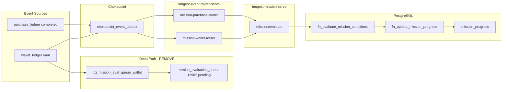

# Mission Feature — Review & Cleanup Plan

**Date:** 2026-07-08  
**Status:** IMPLEMENTED 2026-07-08 — P1 + P2 (Option A) + P3 shipped and verified; P4 remains backlog. P3-6 (FE RPC confirmation for the Outcomes dropdown) is the only open item and sits with FE. Durable docs: `requirements/Mission.md` §Architecture / §Event Flow / §Operational Notes, `requirements/REGISTRY_RENDER.md` §Mission, `requirements/CHANGELOG.md` 2026-07-08.  
**Context:** Two reported bugs + comprehensive architecture review before Syngenta launch

---

## Executive Summary

Mission evaluation **partially works**: wallet-based conditions (`points_earned`, `tickets_earned`) progress correctly via the Inngest path. **Purchase-based conditions are broken** due to a regression in the Confluent→Inngest router port (missing `amount` in event payload) and a pre-existing gap for SKU/product-filtered purchase missions (no line-item data reaches the evaluator).

The reward dropdown bug is **not a backend filter bug** on this merchant — all configured outcome rewards are `visibility = 'user'`; zero `campaign` rewards exist.

Several **latent bugs** would surface at launch (loop-mission crash, broken admin claim, dead queue bloat, double-count risk for manual missions).

---

## Reported Bugs

### Bug 1 — Completed purchase does not move mission progress

**Example:** `ORD20260707000727` — 60,000 THB, status `completed`, mission bar unchanged.

| Check | Result |
|-------|--------|
| Order exists, completed | ✅ `purchase_ledger` row `f530d0e1-049d-4c22-8fd4-e8835aa19524` |
| Chokepoint outbox emitted | ✅ `crm.events.purchase` published |
| User mission progress | ❌ Zero rows in `mission_progress` for this user |
| Purchase-type progress events | ❌ Zero `mission_progress_events` with `trigger_type = 'purchase'` (wallet types work) |

**Root cause A — Router payload regression (blocks ALL purchase sum missions)**

`mission-purchase-router` (`inngest-event-router-serve` v5, `lib/mission-router.ts`) forwards only:

```json
{ "id", "user_id", "merchant_id", "event", "status" }
```

Legacy `MissionConsumer` forwarded `amount: final_amount || total_amount`.  
`fn_evaluate_mission_conditions` reads `p_event_data->>'amount'` for `measurement_type = 'sum'`.  
Missing amount → increment is null → **silent zero progress** for every purchase condition, including unfiltered missions (e.g. Grand Total).

**Root cause B — SKU/product filters never receive line-item data (pre-existing)**

Four Syngenta missions filter by `sku_ids` (Insecticide, Fungicide, Biostim, MC). Evaluator checks `event_data.sku_id`, but:

- Purchase header event has no SKU fields
- `crm.events.purchase_item` payload has `item_id` only — no `sku_id`, no line amount
- `purchase_ledger` has no `sku_id` column (legacy Kafka path had same gap)

Even after fixing Root cause A, only **unfiltered** missions progress: Grand Total + on-top loops.

---

### Bug 2 — Mission Outcomes reward dropdown shows only `visibility = 'user'`

**Reported:** Admin → Mission → Outcomes reward dropdown excludes `visibility = 'campaign'`.

**Live DB finding:**

| Function | Filter |
|----------|--------|
| `bff_list_rewards_for_mission_outcomes` | `visibility IN ('user', 'campaign')`, campaign sorted first |

| Merchant (Syngenta) | Count |
|---------------------|-------|
| Active `user` rewards | 13 |
| Active `campaign` rewards | **0** |
| All 7 configured mission-outcome rewards | `visibility = 'user'` |

**Conclusion:** Backend already supports campaign rewards. Dropdown behavior matches data on this merchant. **FE must confirm** which RPC the Outcomes screen calls — if it uses `bff_list_rewards` or client-side `visibility = 'user'` filter, that's a separate FE fix.

---

## Additional Bugs (Pre-Launch)

| # | Severity | Issue | Impact |
|---|----------|-------|--------|
| 1 | **Critical** | `fn_update_mission_progress` calls `fn_reset_condition_progress(condition_progress)` for loop missions — function signature is `(user_id, mission_id)` only | On-top loop missions (Veg 5k, Corn 7.5k) **crash on completion**; transaction rolls back |
| 2 | **High** | `bff_claim_mission` admin branch checks `admin_users.role` and `admin_users.is_active` — columns don't exist (`active_status` is correct) | Admin claim-on-behalf **always fails** |
| 3 | **Medium** | `mission_evaluation_queue`: **13,982 pending rows**, no consumer cron | Dead write path; table bloat since Feb 2026 |
| 4 | **Medium** | `trg_mission_eval_realtime_wallet` + Inngest wallet router both evaluate manual-activation missions | **Double progress** when manual missions are used |
| 5 | **Medium** | `form_submission`, `referral_*` condition types have no chokepoint event source post-CDC | Missions configured with these **never progress** |
| 6 | **Low** | Wallet router: non-`points` currency → `tickets_earned` (no currency guard) | Store-credit earns could match ticket missions |
| 7 | **Low** | `bff_upsert_mission` runs blocking `REFRESH MATERIALIZED VIEW` (non-concurrent) on every save | Blocks concurrent evaluation during admin saves |
| 8 | **Hygiene** | Active mission named `test`; backup table `mission_conditions_backup_20250930`; duplicate RPCs/overloads | Confusion, tech debt |

---

## Architecture (Current State)



**What works:** Wallet → router → evaluate → progress (verified via `points_earned` / `tickets_earned` events).  
**What's broken:** Purchase amount missing in router payload; SKU filters have no item-level pipeline.  
**What to remove:** Queue trigger + `mission_evaluation_queue` (superseded by Inngest).

---

## Proposed Fixes (Priority Order)

### Phase 1 — Hot fixes (ship first, small diffs)

| ID | Change | Target | Approval |
|----|--------|--------|----------|
| P1-1 | Add `amount` (final_amount ?? total_amount), `seller_id` to `mission-purchase-router` event_data | `inngest-event-router-serve` deploy | Required |
| P1-2 | Fix loop reset: call `fn_reset_condition_progress(p_user_id, p_mission_id)` not jsonb arg | `fn_update_mission_progress` migration | Required |
| P1-3 | Fix admin claim: use `active_status` + real role/permission check | `bff_claim_mission` migration | Required |
| P1-4 | Backfill test order `ORD20260707000727` after P1-1 | Manual re-emit or one-off eval | After P1-1 |

**Expected outcome after Phase 1:** Grand Total + on-top loop **amount** missions progress on purchase complete. Loop completion no longer crashes.

---

### Phase 2 — Purchase item pipeline (SKU/product missions)

**Design decision required before implementation.**

| Option | Description | Pros | Cons |
|--------|-------------|------|------|
| **A (recommended)** | Extend chokepoint `purchase_item` emit with `sku_id`, line `amount`, `status`; add `mission-purchase-item-router`; evaluator uses item events for scoped filters, header events for plain sum | Correct semantics; matches admin UX | Touches chokepoint + router + evaluator |
| **B** | Aggregate matching line amounts in purchase router before evaluate | Single event per order | Complex aggregation; harder to maintain |

**Recommended approach (Option A):**

1. Chokepoint: enrich `crm.events.purchase_item` payload with `sku_id`, `product_id`, `category_id`, `brand_id`, line `amount`, `item_status`
2. Router: new `mission-purchase-item-router` on `crm/purchase_item.event`, completed items only
3. Evaluator: `fn_evaluate_mission_conditions` — if condition has `sku_ids`/`product_ids`/etc., require `p_event_type = 'purchase_item'`; header `purchase` events skip scoped conditions
4. Idempotency: per `item_id` + `status` (mirror purchase router pattern)

**Missions affected:** SYN-2026-MIS-LB-L01 through L04 (SKU-filtered groups).

---

### Phase 3 — Cleanup & hardening

| ID | Change | Notes |
|----|--------|-------|
| P3-1 | Drop `trg_mission_eval_queue_wallet`; archive/truncate `mission_evaluation_queue` | Dead path since Inngest |
| P3-2 | Resolve double-eval: drop `trg_mission_eval_realtime_wallet` OR gate Inngest router to auto-only | Pick one owner for manual missions |
| P3-3 | Block or hide dead condition types in `bff_upsert_mission` until chokepoint exists | form_submission, referral_* |
| P3-4 | `bff_upsert_mission`: use `REFRESH MATERIALIZED VIEW CONCURRENTLY` via async job, not inline blocking refresh | Or rely on nightly cron only + invalidate cache |
| P3-5 | Deactivate `test` mission; drop `mission_conditions_backup_20250930` | Hygiene |
| P3-6 | FE: confirm Outcomes dropdown calls `bff_list_rewards_for_mission_outcomes` | Bug 2 closure |
| P3-7 | Docs: update `requirements/Mission.md` event flow (CDC → chokepoint/Inngest); `REGISTRY_RENDER.md`; `CHANGELOG.md` | Per `06-update-docs.mdc` |

---

### Phase 4 — Optional enhancements (post-launch)

- Re-wire `form_submission` via chokepoint at `submit_form_*` write sites
- Re-wire `referral_*` when referral chokepoint exists
- Wallet router: explicit currency → condition_type mapping (guard store_credit)
- Deprecate `claim_mission_outcomes` if unused (duplicate of `fn_process_mission_outcomes`)
- Consolidate duplicate function overloads (`fn_check_milestone_progression`, `fn_batch_reset_global_missions`)

---

## Test Plan (Pre-Launch)

### Purchase progress

- [ ] Complete order ≥ 60,000 THB on unfiltered mission → progress increases by order amount
- [ ] Complete order with SKU in Insecticide group list → only L01 mission progresses
- [ ] Grand Total mission accumulates across multiple orders
- [ ] On-top loop mission: complete at 5,000 THB → progress resets, `unclaimed_completions` increments, no error

### Outcomes

- [ ] Create reward with `visibility = 'campaign'` → appears in Outcomes dropdown (after FE RPC confirmed)
- [ ] Manual claim mission: user claims → `fn_dispatch_outcome` fires, reward granted
- [ ] Admin claim-on-behalf works after P1-3

### Regression

- [ ] Points earn still advances `points_earned` missions
- [ ] Manual-activation mission: accept → then purchase → progress once only (after P3-2)
- [ ] `mission_evaluation_queue` row count stable (no new inserts after P3-1)

---

## Approval Checklist

Reply with approved phase IDs, e.g. **"Approve P1 + P3, defer P2 design"**.

| Phase | Scope | Est. effort |
|-------|-------|-------------|
| **P1** | Hot fixes (router amount, loop crash, admin claim) | ~1 session |
| **P2** | SKU/item purchase pipeline | Design + 1–2 sessions |
| **P3** | Dead path removal, hardening, docs | ~1 session |
| **P4** | Optional / post-launch | Backlog |

---

## Reference Data (Investigation)

| Entity | Value |
|--------|-------|
| Merchant | `8f67aa08-dfce-454d-bfb1-effc4ee45f1f` (Syngenta) |
| User | `b015a838-d253-4f23-aa95-07a15b953078` |
| Purchase | `f530d0e1-049d-4c22-8fd4-e8835aa19524` / `ORD20260707000727` |
| Insecticide mission | `25f65431-7df6-49e6-b3b2-837bd33097a9` (target 60,000, SKU-filtered) |
| Grand Total mission | `052b42ff-88f7-4900-88f2-5322c240a4bd` (target 1,300,000, no SKU filter) |
| Router | `inngest-event-router-serve` v5, `mission-purchase-router` |
| Evaluator | `inngest-mission-serve` v62, `mission-evaluate` workflow |

---

## Next Step After Approval

1. **P1-1:** Deploy updated `lib/mission-router.ts` via Supabase MCP `deploy_edge_function`
2. **P1-2, P1-3:** `apply_migration` for function fixes
3. **P1-4:** Re-emit or manual eval for backfill order
4. **P2:** Short design sign-off on item-level pipeline, then implement chokepoint + router + evaluator changes
