# Samitivej CRM Center — Loyalty Platform Proposal

---

## Table of Contents

- [Executive Summary](#executive-summary)
- [Part I: Coin Economy & Privilege Platform](#part-i-coin-economy--privilege-platform) *(TOR Section B)*
- [Part II: Member Type & Benefits Architecture](#part-ii-member-type--benefits-architecture) *(TOR Section C)*
- [Part III: Marketing Automation](#part-iii-marketing-automation) *(TOR Section D)*
- [Part IV: Omni-Channel Experience](#part-iv-omni-channel-experience) *(TOR Section E)*
- [Part V: Back Office Console](#part-v-back-office-console) *(TOR Section F)*
- [Part VI: Dashboards & Analytics](#part-vi-dashboards--analytics)
- [Part VII: Technical Architecture & Security](#part-vii-technical-architecture--security) *(TOR Section G)*
- [Part VIII: Integration Architecture & Open API](#part-viii-integration-architecture--open-api)
- [Part IX: Pre-Go-Live & Migration](#part-ix-pre-go-live--migration)
- [Part X: Operations & Support](#part-x-operations--support)
- [Part XI: Reward Sourcing](#part-xi-reward-sourcing)

---

## Executive Summary

### Key Pillars

**1. Unified Member Type Management**

| | |
|---|---|
| **Current** | Member types are managed across separate systems — HIS holds patient records, insurance data lives with insurers, corporate rosters sit with HR. When multiple membership benefits overlap (e.g. a patient with both VIP and Corporate discounts), there is no automated way to determine which benefit applies. |
| **Future** | Six member types (VIP, Paid, Engagement/Tier, Corporate, Insurance, Exclusive Partner) coexist on one patient profile. When the patient checks in, HIS queries the platform — all active benefits returned in one call, highest value auto-selected. |
| **Impact** | One API call resolves the right discount at every visit — across all member types simultaneously. |

**2. Unified Privilege & Package System**

| | |
|---|---|
| **Current** | eCoupons, entitlements, and service packages are managed through different workflows depending on channel. Marketplace purchases produce email vouchers redeemed at the counter. Multi-use entitlements (e.g. 5-session physiotherapy) require separate tracking. There is no single view of all privileges a patient holds across sources. |
| **Future** | All privileges — eCoupons, multi-use entitlements, partner rewards, seasonal coupons, health package bundles — managed in one system. Patients see everything in their wallet with QR codes. Packages are a bundle layer: purchase triggers automatic issuance of all included privileges. Buy on Well app, Hospital E-Commerce, Shopee, or at the counter — privileges appear in the wallet. |
| **Impact** | One wallet for everything. Buy → receive → use → track, digitally, across every channel. |

**3. Omni-Channel Coin Economy**

| | |
|---|---|
| **Current** | Hospital visits, marketplace purchases, and online engagement are disconnected — there is no shared currency that rewards patients across all touchpoints or incentivizes cross-channel behavior. |
| **Future** | Single coin balance earned from hospital visits, Shopee/Lazada purchases, Hospital E-Commerce, content engagement, and behavioral activities. Spendable on privileges, package discounts, or partner rewards through any channel. |
| **Impact** | Every patient interaction becomes measurable and rewardable. Marketplace spend builds hospital loyalty. |

**4. Marketing Automation — A Personal Marketing Expert for Every Patient**

| | |
|---|---|
| **Current** | Campaigns are planned and executed manually with limited ability to personalize at scale. Lifecycle communications (post-visit follow-up, birthday rewards, win-back) require manual coordination. |
| **Future** | Rule-based journey automation handles lifecycle campaigns across LINE, SMS, Email, and Push. An optional AI Decisioning layer — the first globally deployed AI system for mass retention marketing — evaluates each patient individually and determines the next-best-action in real time. |
| **Impact** | From periodic manual campaigns to continuous, intelligent, per-patient engagement. |

---

### Platform Differentiation

#### 1. Deep Functionality — High TOR Coverage from Standard Modules

The Rocket Loyalty CRM platform is built as a modular system with deep, configurable features. Of the **over 150 functional requirements** in the TOR, approximately **85% are addressed by standard platform modules** — coin earning, wallet management, privilege systems, tier progression, member type management, missions, referrals, form builder, marketing automation, and multi-language support all exist as production-ready, configurable modules.

The remaining ~15% is concentrated in **integration adapters** (HIS event processing, Well SSO token validation, Rocket payment gateway) and **Samitivej-specific configuration** (hospital department mappings, branch rules, content). The core loyalty logic does not require custom development.

This means faster time-to-market, lower implementation risk, and a platform that benefits from continuous product improvements — not a one-off custom build that freezes at delivery.

#### 2. Architecture Built for Hospital Scale

The Rocket Loyalty CRM Platform runs on a modern, event-driven stack with clear performance guarantees:

| Metric | Guarantee |
|---|---|
| System uptime | **99.9%** (< 9 hours unplanned downtime per year) |
| Concurrent active users | **10,000+** simultaneous users performing transactions |
| Wallet / eligibility queries | **< 50ms** response time |
| Coin earning (end-to-end) | **< 1 second** from HIS event to wallet credit |
| Flash reward redemption | **10,000+ concurrent** users competing for limited stock without degradation |

The stack is built around four principles that distinguish it from traditional loyalty platforms:

- **Real-time, not batch** — When a patient pays at the counter, coins appear in their wallet within one second. No overnight jobs. No next-day updates.
- **Durable execution** — A state-of-the-art workflow orchestration technology adopted by the world's most innovative companies (Netflix, Stripe, Uber). Operations that span days or weeks — marketing journeys, monthly privilege issuance, payment flows — are guaranteed to complete even through server restarts and deployments. No lost transactions. No missing privileges.
- **Always-current data** — Patient segments, dashboards, and eligibility update continuously as data changes — not from nightly reports that are stale by morning.
- **Instant responses** — Wallet balance and eligibility queries return in under 50 milliseconds. HIS gets a discount answer before the billing screen finishes loading.

**Infrastructure:** API services run on **AWS ECS** with auto-scaling up to **20,000 tasks** — one of the highest available task allocations for a startup in Thailand. Each task runs at **4 vCPU / 8 GB RAM** standard. Scaling threshold is set at **30% utilization** — conservative by design, ensuring headroom for traffic spikes (flash reward events, campaign launches). PostgreSQL uses **sharding and Row-Level Security (RLS)** to isolate both at the logic layer and infrastructure layer.

#### 3. AI Decisioning — A Personal Marketing Expert for Every Patient

Beyond rule-based automation, the Rocket Loyalty CRM Platform offers an AI Decisioning layer — **the first globally deployed AI system for mass retention marketing in a loyalty platform**. Instead of marketers defining every campaign path, an AI agent evaluates each patient's full context on every event and determines the most effective action for that individual.

The system learns from outcomes: which actions drive return visits, which offers convert, which timing works. This transforms marketing from periodic campaign planning into continuous, intelligent, per-patient engagement — as if every patient had their own dedicated marketing expert watching their behavior 24/7.

---

### Platform Journey Overview

**The Rocket Loyalty CRM Platform is organized into five layers. Each layer has a distinct role, but none works alone — they feed into each other to create a continuous loop where every patient interaction leads to better engagement, which leads to the next interaction.**

> 📊 **[Diagram: Platform Architecture — see attached platform architecture diagram. Green sections will include live mockups.]**

**Layer 1 — Purchase Channels** (Hospital Visit, Well App, Shopee/Lazada, Website)
Where patient activity enters the system. A hospital visit, a marketplace purchase, an article read — every touchpoint across every channel feeds into the same system as a structured event.

**Layer 2 — Transactional Layer** (Package Engine, Privilege Engine, Coin Wallet)
The core loyalty engines. When an event arrives, this layer processes it immediately: coins are calculated and credited, privileges are issued, packages are activated, entitlements are deducted. This is where the tangible value exchange happens — the patient does something, and receives something in return, in real time.

**Layer 3 — Functional Layer** (Member Type Engine, Tier Engine)
Determines *who the patient is* — which member types they hold (VIP, Corporate, Insurance, etc.), what tier they are in, and what standing benefits apply. When HIS asks "what discount does this patient get?", this layer resolves the answer. Without it, the transactional layer would not know what each patient deserves.

**Layer 4 — Non-Transactional Layer** (Campaign Engine, Missions, Content)
Keeps patients engaged *between* visits. Missions give patients goals ("complete 3 checkups, earn 500 coins"). Campaigns deliver relevant content and offers. This layer turns a patient who visits once a year into someone who interacts with Samitivej weekly — and every interaction generates data that makes the other layers smarter.

**Layer 5 — Personalized Automation** (Rules-Based Marketing, AI Decisioning)
The intelligence layer. Rules-based automation handles lifecycle journeys (welcome, post-visit follow-up, win-back). AI Decisioning goes further — evaluating each patient individually and choosing the single best action for that person at that moment. Every action this layer takes loops back: it awards coins (Layer 2), issues privileges (Layer 2), assigns tags that change segmentation (Layer 3), and triggers new missions (Layer 4).

**Example — one patient, all five layers:**
A patient visits Sukhumvit branch for a dental checkup. The transactional layer earns her 150 coins and deducts one use from her 5-session entitlement. The functional layer knows she's a Corporate Gold member with a 15% standing discount — HIS applies it at billing. That evening, the automation layer sends her a LINE message: "You've visited dental 3 times this year — complete 2 more for a free whitening session." That's a mission from the non-transactional layer. She books the next visit. The cycle continues.

> 📱 **[Mockup: Home Dashboard — coin balance, tier badge, personalized package offer, privilege carousel]**

---

## Part I: Coin Economy & Privilege Platform

*TOR Section B — eCoupon / Coin Management*

**Samitivej's coin economy spans every channel — hospital visits, marketplace purchases, website engagement, and behavioral activities — all crediting a single wallet. The privilege system unifies eCoupons, entitlements, partner rewards, and health package bundles under one framework. This part covers how coins are earned, stored, spent, and how privileges flow from issuance to redemption.**

---

### 1.1 Omni-Channel Coin Earning

*TOR B1.3, B2.4, A2.1, A2.4*

**Patients earn coins from every interaction with Samitivej — hospital visits, marketplace purchases, Hospital E-Commerce, and Well app transactions. All earnings credit the same wallet, regardless of channel.**

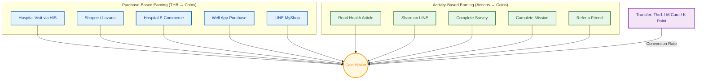

**Purchase-based** (left) — spend at hospital, marketplace, e-commerce, app, or LINE earns coins proportional to amount spent. **Activity-based** (right) — read articles, share content, complete surveys, finish missions, refer friends earns fixed coin rewards. **Transfer** — inbound point conversion from partner loyalty programs (The1, M Card, K Point) at configured exchange rates.

**Integration surface per channel:**

| Channel | Integration Method |
|---|---|
| Hospital Visit | HIS API — purchase events, service delivery |
| Shopee / Lazada | Marketplace Webhooks — order data |
| Hospital E-Commerce | E-Commerce API — website purchase events |
| Well App | Well SSO + Rocket Backend — app purchases |
| LINE MyShop | LINE Messaging API + LIFF — engagement events |
| Partner Transfer | Partner Transfer API — point conversion endpoints |

#### Purchase-Based Earning

| Channel | How Coins Are Earned | Example |
|---|---|---|
| **Hospital visit** | HIS sends purchase event after payment → earning engine calculates | OPD consultation 3,000 THB → 45 coins (Gold: 1.5 per 100 THB) |
| **Shopee / Lazada** | Order matched to patient via: (1) phone number if not masked by marketplace, (2) OrderSet code verified by staff at hospital, or (3) patient self-claims by entering order ID in app | Health package 5,990 THB → 60 coins |
| **Hospital E-Commerce** | Purchase event via API → coins credited | Supplement order 1,200 THB → 12 coins |
| **Well App** | Package purchased via Rocket package backend → coins credited | Executive Checkup 14,500 THB → 217 coins (Platinum) |

#### Who Earns What — Configuration by Example

The earning system is configured through rules that define *who qualifies* and *what they receive*. The tier names and member types below are illustrative — the actual names and thresholds will be configured to match Samitivej's program design.

| Rule | Who Qualifies | What They Receive |
|---|---|---|
| Base earn rate | All members | 1 coin per 100 THB spent |
| Higher-tier bonus | Higher-tier members | Multiplied rate (e.g. 1.5× or 2×) |
| Department special | Members visiting a specific department | Bonus multiplier for that visit |
| Weekend promo | Any member on Sat–Sun | 2× bonus during campaign dates |
| New branch launch | Members at a specific branch | 3× bonus for launch period |

**Stacking:** When multiple bonuses apply, Samitivej decides whether they compound or only the highest applies — a single configuration toggle per campaign.

**Caps and safeguards:** Maximum coins per transaction, minimum transaction amount, and frequency limits (e.g. max 1 earning event per patient per day).

**Delayed award (optional):** Coins held for a configurable period (e.g. 24 hours) before entering the wallet — preventing earn-then-cancel-same-day scenarios where services may be adjusted after initial billing.

> 📱 **[Mockup: Wallet — Coin History showing earn events from different channels with source labels]**

---

### 1.2 Behavioral & Content Earning

*TOR B1.3a*

**Beyond purchases, patients earn coins from engaging with Samitivej's health content and completing activities — driving engagement between hospital visits.**

| Activity | How It Works | Coins |
|---|---|---|
| **Read health article** | Logged-in patient scrolls past 75% of article on website | 5 coins |
| **Share on LINE** | Share article via LINE share dialog — confirmed delivery via LIFF API | 10 coins |
| **Complete survey** | Post-visit satisfaction survey (NPS, rating, open text). Surveys link to marketing automation — responses auto-enrich the patient profile and trigger follow-up journeys (e.g. low NPS → service recovery workflow). With AI Decisioning enabled, the system goes further: the AI evaluates each patient's **profile completeness** and **data enrichment goals** to determine not only *whether* to send a survey and *when*, but *which questions to ask*. A patient with no dietary preference data receives nutrition-related questions; a patient whose preferred department is unknown gets department preference questions. This turns surveys from generic feedback forms into targeted data collection instruments that progressively build a complete patient profile — each survey is different because each patient's data gaps are different. | 50 coins |
| **Invite a friend** | Referral code shared → friend registers successfully | 200 coins |
| **On-site gamification** | Complete department-specific tasks (visit 3 departments, attend wellness workshop) | 500 coins |
| **Complete health assessment** | Pre-visit health questionnaire or lifestyle assessment form | 30 coins |
| **First purchase** | Complete first package purchase through any channel | 100 coins |

The patient must be logged in for content tracking to work. Anonymous activity cannot be attributed.

> 📱 **[Mockup: Article Read Page — coin earned toast, like/share buttons with coin rewards]**

---

### 1.3 Coin Wallet & Balance

*TOR B1.2*

**Every patient has one wallet with one coin balance visible across Well app, LINE, and website.**

**What the wallet displays:**

- Current coin balance (real-time)
- Full transaction history with source attribution: "45 coins from OPD visit on 15 Mar," "200 coins used for Starbucks privilege"
- Upcoming expirations with countdown
- Burn rate context: "Your coins are worth 0.50 THB each (Gold tier)"

**Coin expiry** — three configurable modes:

| Mode | Example |
|---|---|
| **Days after earn** | Each batch expires 365 days after earning |
| **Fixed calendar date** | All coins expire 31 December each year |
| **End of period** | Coins earned in Q1 expire 31 March |

Patients receive advance notifications (30 days, 7 days, 1 day before — configurable) through their preferred channel. Expiry processing runs daily as a scheduled job.

> 📱 **[Mockup: Wallet Main Page — coin balance, burn rate context, quick actions, history]**

---

### 1.4 Coin Transfer & Partner Points

*TOR B1.5*

**Samitivej accepts inbound coin/point transfers from marketplace platforms and partner loyalty programs. The technology is ready — accept credit, apply conversion rate, credit wallet. Each partner requires a commercial agreement.**

| Approach | Status | How It Works |
|---|---|---|
| **Purchase-based earning** from Shopee/Lazada | Ready | Order data → coins credited based on spend amount |
| **Direct coin transfer** from The1 / M Card / K Point | Technology ready, partnership required | Transfer endpoint with per-partner conversion rates. Activated when agreements are signed. |

**Recommendation:** Launch with purchase-based earning (works immediately). Activate direct transfer endpoints as partnerships are signed. The1 has existing hospital partnerships (The1 × Bumrungrad) as precedent.

---

### 1.5 Privilege System

*TOR B1.4, B1.6, B2.1, B2.2, B2.6*

**Everything a patient "receives" — whether earned from coins, auto-issued after a hospital visit, or included in a membership — is a privilege. The privilege system handles issuance, tracking, usage, expiry, and QR presentation uniformly across all types.**

#### Samitivej Terminology → Platform Mapping

| Samitivej Term | Platform Concept | Category |
|---|---|---|
| eCoupon (single-use) | Privilege — single-use mode | Consumable |
| eCoupon (multi-use / Entitlement) | Privilege — multi-use mode with per-use deduction | Consumable |
| Package mandatory coupon (คูปองบังคับ) | Privilege — auto-issued via package bundle | Consumable |
| Package elective coupon (คูปองเลือก) | Privilege — patient-selected from package pool | Consumable |
| Seasonal coupon (birthday, anniversary) | Privilege — triggered by marketing journey | Consumable |
| Reward from coin redemption | Privilege — redeemed from catalog | Consumable |
| Partner reward (Starbucks, etc.) | Privilege — partner code pool | Consumable |
| Physical gift | Privilege — shipping fulfillment | Consumable |
| Flash reward | Privilege — time-limited, stock-limited | Consumable |
| **Standing discount (ส่วนลดใช้ไม่จำกัด)** | **Standing Benefit** — unlimited-use, period-based, queried by HIS | **Non-consumable** |

**Standing benefits** (unlimited-use discounts like "15% off OPD for 1 year") are fundamentally different from consumable privileges — they are never depleted. Their architecture and eligibility resolution are covered in **Part II, Section 2.7**.

Rather than building separate systems for eCoupons, entitlements, partner rewards, and seasonal coupons, all privilege types run through one engine with shared eligibility resolution, pricing logic, stock management, and audit trail. Any new privilege type Samitivej introduces in the future (a new partner program, a new seasonal campaign, a new package structure) is configured — not developed. The engine handles the full range from a simple restaurant voucher to a complex multi-use cross-branch entitlement with stackability rules.

#### Privilege Engine Structure

The Privilege Engine is the unified system that handles every type of benefit Samitivej issues. The diagram below reads in 4 layers: examples at top, Samitivej concepts, configuration layer, and Rocket platform objects at bottom — with sources feeding in.

> 📊 **[Diagram: Privilege Engine Architecture — see attached privilege engine diagram. Full 4-layer visual: Examples → Samitivej Concepts → Config → Rocket Objects, with Sources feeding in.]**

**Layer 1 — Samitivej Concepts → Examples**

| # | Samitivej Concept | Example |
|---|---|---|
| 1 | **Entitlement (always on)** | VIP 30% off OPD every visit for 1 year; Divine Elite 15% off pharmacy |
| 2 | **eCoupon (single use)** | 100 THB off café; Free parking 1 time; 10% off next dermatology visit |
| 3 | **Entitlement (multi-use)** | 5× physiotherapy sessions; 12× monthly restaurant coupons; 3× parking |
| 4 | **Reward in-house (burn coin)** | Dental cleaning voucher (500 coins); Annual checkup 20% off (2,000 coins) |
| 5 | **Reward partner (burn coin)** | Starbucks 100 THB (400 coins); Grab 50 THB (200 coins); After You cake (600 coins) |
| 6 | **Flash reward** | Dyson hair dryer (20,000 coins, 50 units); Executive checkup 50% off (100 units) |
| 7 | **Package mandatory coupon (คูปองบังคับ)** | Buy Executive Checkup → auto-receive: 1× blood test + 1× X-ray + 3× café |
| 8 | **Package elective coupon (คูปองเลือก)** | "เลือกสิทธิ์ 3 จาก 8 รายการ" — patient picks: spa, dental, eye exam, massage... |
| 9 | **Seasonal / Journey coupon** | Birthday: 500 THB spa voucher; Post-visit: 10% off next visit within 30 days |

**Layer 2 — Configuration per Concept**

| # | Concept | Config |
|---|---|---|
| 1 | Entitlement (always on) | Category (OPD / Pharmacy / Dental), Discount type (% / fixed), Amount, Validity period, Member type eligibility, Branch scope |
| 2 | eCoupon (single use) | Discount type (% / fixed), Amount, Expiry date, Eligible branches, Min spend, Usage limit = 1 |
| 3 | Entitlement (multi-use) | Total uses, Per-use value, Validity period, Cross-branch allowed (Y/N), Anti-double-spend lock |
| 4 | Reward in-house | Coin price per tier (Gold: 400, Platinum: 250), Stock quantity, Eligibility (tier / member type), Visibility mode (public / campaign / admin-only) |
| 5 | Reward partner | Coin price per tier, Partner code pool ID, Auto-procurement (Y/N), Code expiry, Partner reconciliation |
| 6 | Flash reward | Stock limit, Sale window (start / end datetime), Coin price, Max per person = 1, Concurrency mode (first-come-first-served) |
| 7 | Package mandatory | Parent package ID, Auto-issue on purchase = Yes, Quantity per package, Expiry = package expiry |
| 8 | Package elective | Parent package ID, Pool size (e.g. 8 options), Pick count (e.g. 3), Selection deadline, Expiry = package expiry |
| 9 | Seasonal / Journey | Trigger journey ID, Issuing condition (birthday / post-visit / tier upgrade), Expiry (e.g. end of month), One-time per trigger |

**Layer 3 — Rocket Platform Objects**

| Rocket Object | Maps To | Description |
|---|---|---|
| **Standing Benefit** | Concept #1 (Entitlement always on) | Never depleted. Period-based. Queried by HIS at billing. Precedence engine selects highest. |
| **Privilege Engine** | Concepts #2–#9 (all consumable types) | Depletes on use. Tracks usage count, stock, expiry. Shared eligibility + pricing logic. |

**Layer 4 — Sources (what triggers issuance)**

| Source | What It Does | Feeds Concepts |
|---|---|---|
| **Burn coin** | Patient redeems coins from catalog | #4 Reward in-house, #5 Reward partner, #6 Flash reward |
| **Package** | Package purchase triggers auto-issuance | #7 Package mandatory, #8 Package elective |
| **Automation** | Marketing journey issues privilege at a step | #9 Seasonal/Journey coupon, #2 eCoupon |
| **Manual** | Admin issues directly (VIP gesture, service recovery) | #2 eCoupon, #3 Entitlement |
| **HIS Event** | Hospital event triggers auto-issuance rule | #2 eCoupon (post-visit café), #3 Entitlement (post-surgery follow-up) |
| **Member Type Assignment** | Patient assigned to VIP / Paid / Corporate | #1 Standing benefit, #3 Entitlement (contract benefits) |

#### Privilege Lifecycle

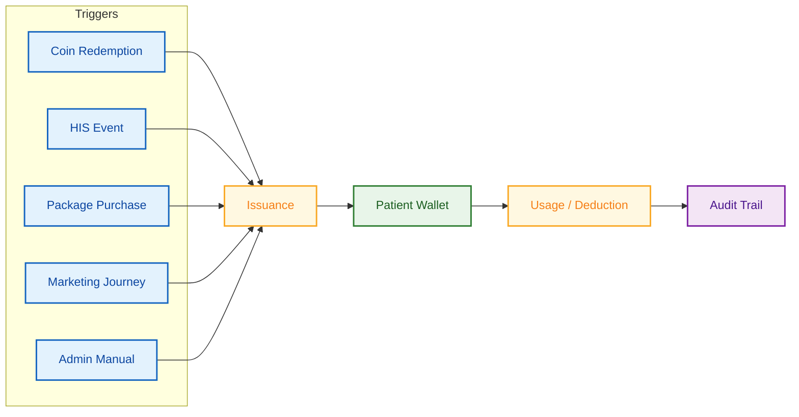

#### Eligibility & Dynamic Pricing

Every privilege has two independent layers:

**WHO can receive it** — conditions based on tier, member type, tags, or segment. A privilege can be restricted to specific member types (e.g. only Gold+ or only Corporate Executive).

**HOW MANY coins it costs** — dynamic pricing by the same dimensions. A Starbucks voucher costs 400 coins for lower tiers and 250 coins for higher tiers. The system applies the most favorable price the patient qualifies for.

#### Multi-Use Entitlements (Critical Requirement)

*TOR B1.6c*

A physiotherapy entitlement with 5 sessions is a privilege in multi-use mode. Each hospital visit consumes one use:

1. Patient arrives for physiotherapy session #3
2. Hospital staff records the visit in HIS
3. HIS sends `service_delivered` event → platform validates: exists? not expired? uses > 0? no concurrent use?
4. One use deducted → remaining: 2/5
5. Patient sees in app: "เหลือ 2/5 ครั้ง ●●●○○"

**Anti-double-spend:** Database-level row locking prevents concurrent deductions. Cross-branch usage supported — entitlements follow the patient.

| Edge Case | Handling |
|---|---|
| **Branch transfer** | Entitlement follows patient. HIS event includes branch code. |
| **Concurrent use at 2 locations** | Row locking — second request fails, must retry. |
| **Doctor grants bonus sessions** | HIS sends adjustment event → uses added. |
| **Package swap** | Old entitlement cancelled (remaining logged), new issued with adjusted balance. Full audit trail. |
| **Expiry extension** | Admin extends with reason logged. Approval flow required for extensions > 30 days. |
| **Branch change for package** | Admin reassigns branch — all entitlements in the package follow. Audit logged. |

#### Auto-Issuance After Hospital Service

| HIS Event | Privileges Auto-Issued |
|---|---|
| Executive Checkup purchased | 1× blood test + 1× X-ray + 1× consultation + 3× café 100 THB |
| OPD visit completed | 1× café 50 THB voucher (retention) |
| Dermatology visit | 1× 10% off next dermatology within 30 days |
| Post-surgical discharge | 1× follow-up consultation + 5× pharmacy discount + 3× parking |
| Prenatal visit (first trimester) | 1× nutrition consultation + pregnancy wellness guide |

#### Flash Rewards — Limited Drops

Our experience in markets like China shows that flash rewards drive significant engagement — premium items (e.g. Dyson hair dryer, exclusive hospital wellness packages) released at midnight in small quantities create anticipation, excitement, and virality. Users log in at specific times to compete for limited stock.

This behavior pattern is well-suited to the Thai market, as demonstrated by another Rocket client, **Pop Mart**, where limited drops generate massive concurrent activity. The Rocket Loyalty CRM Platform handles **10,000+ concurrent users** competing for limited-stock privileges without degradation — ensuring fair, first-come-first-served redemption even during peak flash events.

Samitivej could use flash rewards for exclusive checkup packages, premium wellness retreats, or partner luxury items — creating buzz and driving app engagement.

#### Privilege Visibility

| Mode | Who Sees It | Use Case |
|---|---|---|
| **Public** | Patient sees in catalog and wallet | Self-service browsing and redemption |
| **Admin-only** | Staff issues; patient sees after receiving | VIP gifts, patient relations gestures |
| **Campaign** | Only matching patients | Member-type-specific offers, segment-targeted |

> 📱 **[Mockup: Wallet — Coupons & Entitlements tab with single-use, multi-use progress bars, categories]**

> 📱 **[Mockup: Privilege Detail — slip/voucher with QR code, usage counter (3/5), conditions, history]**

> 📱 **[Mockup: Redeem Privileges — catalog grid with tier-specific pricing, stock indicators]**

---

### 1.6 Health Package Layer & Online Store

*TOR F3, B1.6e*

**Health packages are bundles built on top of the privilege system. A package purchase triggers automatic issuance of multiple privileges — mandatory coupons, elective selections, and standing benefits. The package layer handles bundling, commerce (browse, pay, confirm), and auto-issuance.**

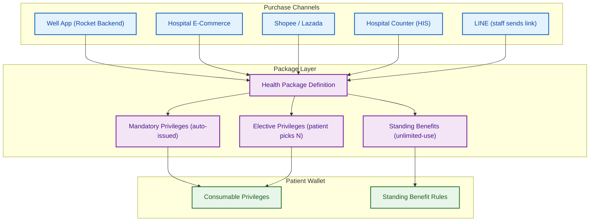

#### Purchase Channels

| Channel | Flow | Coin Earning |
|---|---|---|
| **Well App** | Browse catalog → pay via Rocket backend → privileges auto-issued | Immediate |
| **Hospital E-Commerce** | Purchase on website → API event → privileges issued | On confirmation |
| **Shopee / Lazada** | Buy on marketplace → email voucher → visit hospital → staff verifies OrderSet + phone + national ID → HN created → privileges issued in wallet | After hospital verification |
| **Hospital Counter** | Staff processes in HIS → HIS sends event → privileges auto-issued | Immediate |
| **LINE** | Staff sends E-Commerce link via chat → patient purchases | Same as E-Commerce |

Note: The hospital's preferred channel is Hospital E-Commerce (lowest GP). The earn engine supports **different earn rates per channel** — for example, Samitivej could offer a higher coin rate for Hospital E-Commerce purchases (2 coins per 100 THB) vs marketplace purchases (1 coin per 100 THB) to incentivize the preferred channel. Well App (new) uses the Rocket backend for end-to-end purchase capability.

#### Package Online Store (in Well App / E-Commerce)

**Browse:** Category filters (ตรวจสุขภาพ, ทันตกรรม, กายภาพบำบัด, ผิวหนัง, ตา), gender, age range, price range, branch. Sort by recommended / price / newest.

**Package detail:** Service breakdown (CBC, FBS, X-ray, Pap Smear, etc.), pricing with promo badge, coin discount toggle with live net-price calculation, branch availability, validity period.

**Checkout → Payment → Confirmation:** Order summary → payment gateway (credit/debit card) → on success: all privileges auto-issued + coins earned + notification sent.

**Package changes:** Extensions, branch transfers, and package swaps are managed through the admin console with approval flow. Every change is audit-logged with reason, approver, and before/after state.

> 📱 **[Mockup: Package List — category filters, cards with prices and promo badges]**

> 📱 **[Mockup: Package Detail — service breakdown, coin discount slider, buy CTA]**

> 📱 **[Mockup: Checkout — order summary, coin discount, payment]**

> 📱 **[Mockup: Purchase Success — privileges issued, coins earned]**

---

### 1.7 Back Office — Coin & Privilege Administration

*TOR B2.1–B2.7*

**The admin console gives Samitivej's teams direct control over coin rules, privilege creation, and monitoring.**

| Function | Details |
|---|---|
| **Coin rule configuration** | Visual rule builder for earn rates, multipliers, department-specific rates, caps, exclusions |
| **Privilege management** | Create, edit, stock, scheduling, bulk promo code import with partner attribution |
| **Auto-issuance rules** | Map HIS events to privilege bundles. Set once, execute automatically. |
| **Department-scoped access** | Central team creates templates; department staff pick and issue from the pool |
| **Approval flow** | Maker-checker for: bulk point adjustments, rule changes affecting >1,000 patients, privilege extensions, manual overrides. Two-admin sign-off required. |
| **Role/permission/MFA** | Superadmin, Marketing Manager, Department Admin, Viewer roles. MFA for admin accounts. |
| **Audit trail** | Every action logged: who, when, what, why, before/after state |

> 📱 **[Mockup: Admin — Privilege creation with eligibility conditions, pricing, approval flow]**

> 📱 **[Mockup: Admin — Coin rule builder with visual configuration]**

### TOR Coverage — Part I

| TOR Item | Covered |
|---|---|
| B1.2 | Coin balance + history ✓ |
| B1.3 | Earn from purchases + behavior ✓ |
| B1.4 | Redeem for privileges ✓ |
| B1.5 | Coin transfer ✓ |
| B1.6a–e | eCoupon / entitlement / package / seasonal ✓ |
| B2.1–B2.3 | Auto-create + manual + department access ✓ |
| B2.4 | Coin rule engine ✓ |
| B2.5 | Reports → Part VI |
| B2.6 | Privilege catalog management ✓ |
| B2.7 | Role / permission / MFA ✓ |
| F3 | Health package purchase ✓ |

**Beyond TOR:** Flash rewards (limited drops with 10k+ concurrency), delayed coin award, per-department earn rates, milestone missions with overflow.

---

## Part II: Member Type & Benefits Architecture

*TOR Section C — Membership Management*

**Six distinct member types coexist on a single patient profile. Each type can have its own tier structure with independent rules. The Rocket Loyalty CRM Platform manages parallel membership dimensions, automatic benefit resolution, and standing discounts that apply at every hospital visit without being consumed.**

**Example — Patient คุณสมชาย holds 5 member types, each granting an OPD discount:**

| Member Type | Level | OPD Discount |
|---|---|---|
| VIP (Star) | Connex | 30% |
| Corporate | CRC Executive | 25% |
| Insurance | AIA Premium | 20% |
| Paid | Divine Elite | 15% |
| Engagement | Gold | 5% |

**→ Precedence engine returns: 30% (VIP Connex) with reasoning: "VIP Connex 30% > Corporate CRC Executive 25% > Insurance AIA Premium 20% > Paid Divine Elite 15% > Engagement Gold 5%". HIS applies it at billing. No manual decision.**

### Member Type Summary

| Member Type | Description | How Patient Attains | Mandatory Privileges | Elective Privileges | Standing Benefits | Other |
|---|---|---|---|---|---|---|
| **Engagement (Tier)** | Earn-based loyalty tiers from spending across all channels | Automatic — spend 50k/150k THB in 12 months → upgrade to Gold/Platinum | — | — | OPD discount (5–10%) | Higher earn rate, lower privilege pricing, exclusive catalog access |
| **VIP (Star)** | Contractual VIP assigned by hospital — highest-value patients | Hospital assigns (Connex, Cheva, BDMS) — not earned | Lounge passes, parking, annual checkup | — | OPD 30%, pharmacy 20%, dental 15% | Priority booking, dedicated coordinator |
| **Paid** | Purchased membership plans with bundled benefits | Patient purchases plan (e.g. Divine Elite) via Well App, E-Commerce, or counter | 12× monthly restaurant coupons, 2× parking, 1× checkup | Choose 3 from 8 options (spa, dental, eye, massage...) | OPD 15%, pharmacy 10%, dental 10% | Cumulative spend → tier upgrade within Paid type |
| **Corporate** | B2B agreement — company employees receive healthcare benefits | HR imports employee roster (CSV/API) → auto-assigned by employment level | Per contract (e.g. 5× specialist consults) | Per contract | Per contract (e.g. OPD 25% for Executive) | Usage reporting for contract renewal |
| **Insurance** | Insurer sends policy data or HIS auto-detects at check-in | Auto-assigned when HIS records insurance data, or roster import | Per policy | — | Per policy (e.g. OPD 20%) | Stackability rules per package |
| **Exclusive Partner** | Strategic partner members (Marriott, airlines) see dedicated deals | Partner sends member list via API | Per partner agreement | — | Per partner agreement | Partner activity API → auto-upgrade level |

*Tier names, discount percentages, and privilege examples above are illustrative — actual values will be configured to match Samitivej's program design.*

### Member Type Architecture

Each member type follows a consistent structure:

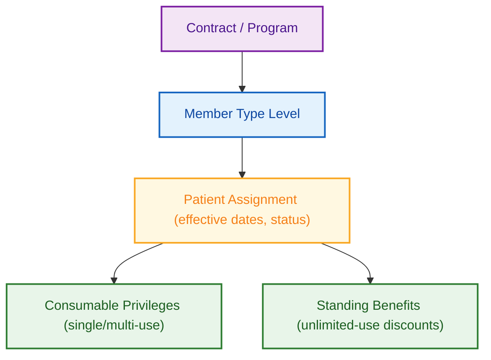

**Each member type can have its own distinct tier structure:**

| Member Type | Tier Structure | Tier Basis |
|---|---|---|
| **VIP (Star)** | Connex / Cheva / VIP Insurance | Hospital assigns by contract |
| **Paid** | Based on cumulative package spend | 50k / 100k / 200k THB thresholds |
| **Engagement** | Silver / Gold / Platinum | Spending + visit frequency + behavior |
| **Corporate** | Executive / General / Other | Defined per company contract |
| **Insurance** | Premium / Standard / Basic | Insurer's policy tier |
| **Exclusive Partner** | High / General | Partner's own tier, may add tiers later |

---

### 2.1 Engagement / Tier-Based Membership

*TOR C3*

**Engagement tiers reward loyal patients with better earn rates, lower privilege costs, and exclusive benefits. Spending from all channels counts — hospital, marketplace, and E-Commerce.**

| Tier (illustrative) | Qualification | Earn Rate | Burn Rate | Benefits |
|---|---|---|---|---|
| Silver | Default | 1 coin / 100 THB | 1 coin = 0.25 THB | Base catalog |
| Gold | 50,000 THB / 12 months | 1.5 coins / 100 THB | 1 coin = 0.50 THB | 5% OPD, reduced privilege pricing |
| Platinum | 150,000 THB / 12 months | 2 coins / 100 THB | 1 coin = 1.00 THB | 10% OPD, priority booking, exclusive privileges |

**5 evaluation windows:** Rolling, fixed period, anniversary, calendar month, calendar quarter.

**Immediate upgrade** on qualification. **Non-adjacent progression** (skip tiers). **Multi-site** — all branches count. **E-commerce** spending included.

> 📱 **[Mockup: Tier Status — badge, progress bar to next tier, benefit comparison table, "You need 8,000 THB more for Platinum"]**

---

### 2.2 VIP Membership (Star with Entitlement)

*TOR C1*

**VIP members hold contractual benefits — assigned by the hospital, not earned. Benefits include consumable privileges AND standing discounts.**

VIP has its own tier structure (e.g. Connex, Cheva/BDMS, VIP Insurance) with distinct benefit packages per level. On assignment, the system auto-issues consumable privileges and activates standing benefit rules.

**At the billing counter:** HIS queries the Eligibility API → receives all active standing benefits → applies highest. VIP 30% beats Insurance 20% — automatically, every visit.

> 📱 **[Mockup: VIP Member Home — Connex badge, standing benefit summary (30% OPD, 20% pharmacy), lounge passes remaining, priority booking CTA]**

---

### 2.3 Paid Membership & Payment

*TOR C2*

**Patients purchase membership plans (e.g. Divine Elite) via Rocket backend. Three benefit categories per plan:**

| Category | Example (Divine Elite 1-Year) |
|---|---|
| **Mandatory privileges** | 12× monthly restaurant coupons, 2× parking, 1× annual checkup |
| **Elective privileges** | Choose 3 from 8 options (Spa, dental, eye exam, massage...) |
| **Standing benefits** | 15% off OPD, 10% off pharmacy, 10% off dental — for the year |

**Paid tier:** Cumulative spend across plans determines tier within the Paid member type (e.g. 50k → 100k → 200k levels with escalating benefits).

**Duplicate rule:** Buy two plans that include the same privilege → patient receives two copies (one per plan).

> 📱 **[Mockup: Membership Landing — Divine Elite benefits: mandatory, elective (pick 3), standing]**

> 📱 **[Mockup: Elective Selection — "เลือกสิทธิ์ 3 จาก 8 รายการ"]**

---

### 2.4 Corporate Membership

*TOR C4*

**B2B agreements where company employees receive healthcare benefits by employment level.**

1. Admin creates "Company ABC" contract → defines levels (Executive / General / Other)
2. HR sends employee roster (CSV or API) → batch import with validation
3. Employees auto-assigned → see "Corporate Member: Company ABC — Executive" in app
4. Benefits per level: consumable privileges + standing discounts
5. **Approval flow** for roster changes affecting >50 employees

**Corporate tier:** Each company contract can define its own internal levels (C-Level / Executive / General / Other) with distinct benefit packages per level.

**Reporting:** Usage per company, contract, and level — supporting renewal conversations.

> 📱 **[Mockup: Corporate Member Home — company badge "CRC Executive", standing benefits, remaining consult entitlements, company-specific deals]**

---

### 2.5 Insurance Membership

*TOR C5*

**Same contract → level → roster → benefits structure as Corporate, with two unique features.**

**Auto-assignment:** When HIS records insurance data, the system auto-assigns the insurance member type — no manual roster needed for this source.

**Stackability rules per package:**

| Package | Stackability | Result |
|---|---|---|
| Annual Checkup | Insurance + Coins: **stackable** | 30% off → apply coins → additional discount |
| Premium Surgery | Insurance only: **non-stackable** | 20% off → coins blocked |

**Insurance tier:** Per insurer (Premium / Standard / Basic), with distinct benefits per level.

---

### 2.6 Exclusive Partner Membership

*TOR C6*

**Strategic partners (Marriott, airlines) send member lists. These members see dedicated health deals on partner-specific landing pages.**

**Partner activity events:** Partner sends "user completed 10 stays" via API → system upgrades level → new deals unlocked.

**Partner tier:** Per partner (Gold / Platinum), configurable. Future tiers addable without system changes.

> 📱 **[Mockup: Partner Landing — Marriott × Samitivej, tier-specific deals]**

---

### 2.7 Standing Benefits & Cross-Type Rules

*TOR C1 note, C5.6, Shared Scope*

**Standing benefits are unlimited-use, period-based discounts — "25% off OPD for 1 year." They are NOT consumed on use. They apply at every visit for the entire validity period. HIS queries the Rocket Loyalty CRM Platform at billing time and receives the applicable discount.**

**How standing benefits differ from consumable privileges:**

| | Consumable Privilege | Standing Benefit |
|---|---|---|
| **Usage** | Depletes on use (single or multi-use) | Never depletes |
| **Tracking** | Uses remaining, usage history | Active/inactive status only |
| **Duration** | Until used or expired | For the membership/contract period |
| **Example** | "5 parking passes" — 4 remaining | "25% off OPD" — every visit |
| **Queried by** | Patient (shows in wallet) | HIS (at billing counter) |

**Precedence Engine:** When multiple member types grant the same category of standing benefit (e.g. OPD discount), the precedence engine evaluates all active benefits, ranks them, selects the highest value, and returns **full reasoning** to HIS. VIP 30% vs Corporate 25% vs Insurance 20% → **30% applied**, with the response including: `"reasoning": "VIP Connex 30% selected. Evaluated: Corporate CRC Executive 25%, Insurance AIA Premium 20%, Engagement Gold 5%. Rule: highest amount wins."` This reasoning is critical for audit and for HIS staff who need to explain billing to patients.

**Advanced Stackability Engine:** Configured per health package — determines which benefit types can combine and how. For example: a patient with VIP standing discount (30% off) AND a privilege coupon (500 THB off) — can they stack? The stackability engine evaluates per-package rules and returns the answer. Approval flow required for stackability rule changes.

**Audit:** Every precedence and stackability decision logged: which benefits were evaluated, which was selected, why, and what was excluded.

### TOR Coverage — Part II

| TOR Item | Covered |
|---|---|
| C1.1–C1.3 | VIP membership ✓ |
| C2.1–C2.3 | Paid membership ✓ |
| C3.1–C3.3 | Engagement/Tier ✓ |
| C4.1–C4.7 | Corporate ✓ |
| C5.1–C5.7 | Insurance (incl. stackability) ✓ |
| C6.1–C6.7 | Exclusive Partner ✓ |
| Shared | Precedence + stackability ✓ |
| Shared | Multi-membership ✓ |
| Shared | Single source of truth ✓ |
| Shared | Audit + maker-checker ✓ |

**Beyond TOR:** Per-member-type tier structures, partner activity API for auto-upgrades, batch roster validation.

---

## Part III: Marketing Automation

*TOR Section D*

**The Rocket Loyalty CRM Platform provides rule-based journey automation — as specified in the TOR — for lifecycle campaigns across LINE, SMS, Email, and Push. On top of this, an optional AI Decisioning layer adds individual-level intelligence, covered in Section 3.3.**

---

### 3.1 Single Customer View & Dynamic Segmentation

*TOR D1.1*

**The Single Customer View aggregates data from every touchpoint into one patient profile.**

| Source | How Data Arrives | What We Store |
|---|---|---|
| **HIS / Data Center** | HIS pushes events (purchases, visits, procedures) via API | Transaction records, visit history, department usage, insurance status |
| **Well App** | Our platform IS the loyalty backend — we own this data | Feature usage, login activity, purchase history |
| **Website** | JavaScript tracker sends events to our API | Article reads, likes, shares, page visits |
| **LINE** | LINE OAuth + LIFF events | Registration, message engagement |
| **E-commerce** | Marketplace webhooks push order data | Order history, product preferences |
| **CDP Hospital** | We consume master product/price catalog via API or batch | Service catalog for package building and earn rule configuration |

For data we need from HIS: the TOR specifies (A2.2, B3.4) that HIS sends events to us via API — purchase events, visit events, service delivery events. We do not read directly from HIS. HIS pushes; we receive and process. For patient history display on the Well app (TOR E2.3), we call HIS APIs to retrieve clinical data on-demand — we do not store or replicate medical records.

**Segmentation:**

| Mode | How It Works |
|---|---|
| **Static (Input)** | Admin imports patient list (CSV of 500 VIP patients for special campaign) |
| **Dynamic (Rule-based)** | Auto-populates and updates in real time. Example: "Gold tier + visited dermatology in last 90 days + coin balance > 500" — patients automatically enter/exit as their data changes |

> 📱 **[Mockup: Admin — Single Customer View with all member types, coin balance, privilege list, activity timeline, segment tags]**

> 📱 **[Mockup: Admin — Dynamic Segment Builder with condition rows, live patient count, save/export]**

---

### 3.2 Rule-Based Journey Automation

*TOR D1.2*

**Visual drag-and-drop journey builder for automated lifecycle campaigns. Each journey is a single trigger connected to a sequence of conditions, waits, messages, and actions. Messages deliver across multiple channels (LINE + SMS, LINE + Email, etc.) and every journey produces its own performance report. Guardrails — frequency cap and suppression — are configured per journey to prevent over-messaging.**

**Node types:** Trigger, Condition (branch on patient attributes), Wait (duration or event), Message (LINE / SMS / Email / Push), Action (award coins, issue privilege, assign tags).

#### Three Core Journeys

The client's marketing automation requirements center on three lifecycle journeys. Each is a single trigger journey that delivers across 2 channels and includes built-in reporting and guardrails.

---

**Journey 1: Welcome**

| Setting | Configuration |
|---|---|
| **Trigger** | New member registration (from Well app, LINE, or website) |
| **Channels** | LINE message + SMS fallback (if LINE not connected) |
| **Frequency cap** | 1 message per step per patient (journey runs once per registration) |
| **Suppression** | Skip if patient already completed welcome journey (re-registration scenario) |

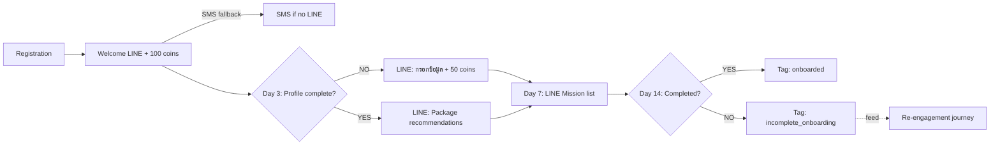

**Report:** Registration-to-onboard conversion rate, profile completion rate, first-purchase rate within 30 days, channel delivery breakdown (LINE vs SMS).

---

**Journey 2: Upsell (Post-Visit Cross-Sell)**

| Setting | Configuration |
|---|---|
| **Trigger** | OPD visit completed (from HIS event) |
| **Channels** | LINE message + Email |
| **Frequency cap** | Max 2 messages per patient per week across all upsell journeys |
| **Suppression** | Skip if patient received a message from any journey in the last 48 hours; skip if patient already purchased the recommended package |

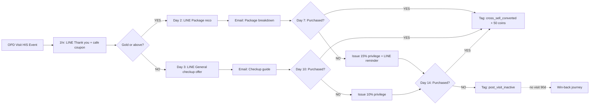

**Report:** Upsell conversion rate per department (e.g. OPD → Dental: 12%, OPD → Dermatology: 8%), revenue attributed to journey, message open/click rates by channel, privilege redemption rate.

---

**Journey 3: Win-Back**

| Setting | Configuration |
|---|---|
| **Trigger** | No hospital visit for 180 days (scheduled evaluation) |
| **Channels** | LINE message + SMS |
| **Frequency cap** | Max 1 message per patient per week; total max 4 messages per win-back cycle |
| **Suppression** | Skip if patient has booked a future appointment; skip if patient opted out of marketing; skip if patient is in an active upsell journey |

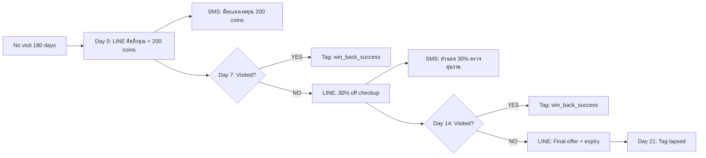

**Report:** Win-back conversion rate (returned within 30 days), average days to return, total revenue from returning patients, cost per win-back (coins + privilege value), channel effectiveness (LINE vs SMS open rates).

---

#### Journey-Level Guardrails: Frequency Cap & Suppression

Every journey includes configurable guardrails that prevent over-messaging and ensure patients are not contacted when they shouldn't be.

| Guardrail | How It Works | Example |
|---|---|---|
| **Frequency cap** | Maximum messages a patient can receive within a time window — enforced across all active journeys, not just the current one | Max 3 messages per week per patient (regardless of how many journeys the patient is in) |
| **Suppression list** | Patients excluded from this journey based on conditions — checked before every message step | Suppress if patient received any message in last 48 hours; suppress if patient is in an active win-back journey |
| **Consent enforcement** | Message only sent through channels the patient has explicitly consented to | Patient opted out of SMS → LINE only, even if journey specifies both |
| **Cooldown** | Minimum gap between messages from the same journey to the same patient | At least 48 hours between messages within this journey |
| **Global cap** | Organization-wide limit across all journeys | No patient receives more than 5 messages per week from Samitivej across all journeys combined |

**How frequency cap works in practice:** Patient คุณสมชาย is simultaneously in a Welcome journey and an Upsell journey. The Welcome journey wants to send a Day 3 message, and the Upsell journey wants to send a post-visit follow-up — both on the same day. With a global cap of 3 messages/week, and คุณสมชาย already received 2 messages this week, only 1 more can be sent. The system prioritizes the higher-value message (upsell, because the patient just visited). The Welcome message is deferred to the next available slot.

#### Journey Performance Reports

Each journey automatically generates a performance report accessible in the admin console:

| Metric | What It Shows |
|---|---|
| **Funnel** | How many patients entered → reached each step → converted |
| **Channel delivery** | Per-channel: sent, delivered, opened, clicked (LINE, SMS, Email) |
| **Conversion** | Percentage of patients who completed the desired action (purchase, visit, profile completion) |
| **Revenue attribution** | Revenue from purchases made by patients in this journey, within attribution window |
| **Drop-off** | Where patients exit the journey — which step loses the most people |
| **A/B results** | When A/B variants are configured, comparison of conversion rates between variants |
| **Cost** | Total coins awarded + privilege value + message costs for this journey |

#### Additional Journey Templates for Samitivej

| Journey | Trigger | Flow |
|---|---|---|
| **Birthday** | Birth month | Day 1: Birthday privilege → Day 15: Reminder → End of month: Last chance |
| **Post-surgery** | IPD discharge | Day 1: Care instructions → Day 7: Follow-up → Day 30: Recovery offer |
| **Chronic care** | Medication due | 7 days before: Refill reminder + pharmacy discount |
| **Tier maintenance** | 30 days before eval | Progress reminder → countdown messages |
| **Prenatal** | Pregnancy recorded | Trimester-appropriate: checkup packages, nutrition, delivery prep |
| **Coin expiry** | 30 days before expiry | Reminder → 7 days: urgency → 1 day: last chance |

---

### 3.3 AI Decisioning — A Personal Marketing Expert for Every Patient

*Not a TOR requirement — our optional offering*

**The first globally deployed AI system for mass retention marketing in a loyalty platform.** The AI agent evaluates each patient individually on every event and determines whether to act, wait, or skip — as if each patient had a dedicated marketing expert.

**How AI differs from rule-based:**

| | Rule-Based | AI Decisioning |
|---|---|---|
| Decision maker | Marketing defines if-then rules | AI evaluates full patient context |
| Personalization | Segment-level (same for all Gold) | Individual-level (different per patient) |
| Timing | Fixed (send on Day 3) | Optimized per patient (when they're most likely to engage) |
| Discovery | Only finds opportunities rules define | Discovers patterns rules would miss |

#### Three Building Blocks of AI Decisioning

The AI Decisioning system is configured through three building blocks that marketing sets up once:

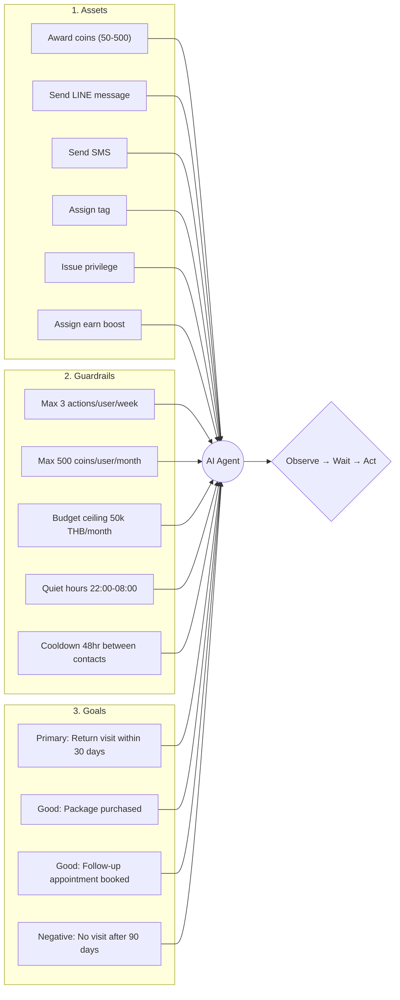

**Block 1 — Assets:** The marketing tools the AI can use. Marketing pre-configures each asset with variable ranges (e.g. "award 50–500 coins" not a fixed amount), eligibility conditions (e.g. "only for Gold+ patients"), and per-asset limits (e.g. "max 500 coins per execution"). The AI picks the right asset and amount for each individual patient.

**Block 2 — Guardrails:** Hard limits the AI cannot exceed. Frequency caps (max messages per patient per week), budget ceilings (total AI spend per month), quiet hours, cooldown periods, and channel consent. Enforced at two layers: the AI self-regulates based on its instructions, AND the system blocks any action that violates hard limits regardless of what the AI requests.

**Block 3 — Goals:** What success looks like for a hospital. Each goal has an event to track, an attribution window (e.g. "within 30 days of AI action"), and a classification (best/good/negative). The primary goal drives the AI's optimization — it learns which actions and timing drive return visits.

**Goal tracking — hospital-specific examples:**
- **Attribution:** Patient received a checkup offer via LINE → booked a follow-up within 30 days → attributed as a return visit driven by the AI
- **Per-action effectiveness:** "Award 200 coins + LINE reminder" drives 18% return visits; "Issue 10% off privilege only" drives 8% — the AI learns to combine actions
- **Conversion rate vs target:** Primary goal "return visit within 30 days" set at 25% target, actual running at 17% — dashboard shows the gap, AI adjusts strategy
- **Cross-department tracking:** AI sent a dermatology offer to an OPD patient → patient visited dermatology → tracked as a cross-sell conversion
- **Negative outcome monitoring:** "No visit after 90 days" rate tracked — if the AI's actions fail to drive return visits, it tries different approaches or escalates the offer

#### The Observe → Wait → Act Loop

The AI doesn't rush to act. On every patient event, it:

1. **Observes:** Full patient context — visit history, departments used, coin balance, active privileges, engagement patterns, member types, recent messages received
2. **Deliberates:** What action would be most effective? Is now the right time?
3. **Decides:**
   - **Act (~15-20%):** Sends a message, issues a privilege, awards bonus coins — only when confidence is high
   - **Wait (~60-70%):** Schedules a re-evaluation later. "Patient just visited — let me wait 48 hours and see if they book a follow-up before sending an upsell"
   - **Skip (~10-20%):** No action beneficial. "Patient already has 3 active privileges and received a message yesterday — additional contact would feel spammy"

#### Example AI Journey: Win-Back Retention

**Patient คุณมาลี** — Gold tier, used to visit every 6 weeks (OPD + dental alternating). Stopped coming 4 months ago. Rule-based win-back fires at Day 180 with "we miss you" + 200 coins. The AI sees a completely different picture.

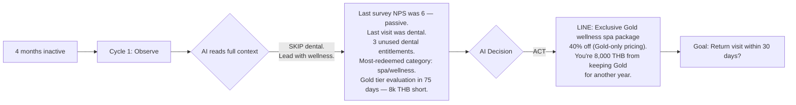

**What the AI reasoned — and why rules cannot replicate this:**

The AI read 5 signals from the patient's profile and made 3 decisions no rule could express:

| Signal the AI read | What it concluded |
|---|---|
| Last survey NPS = 6 (passive) | Something went wrong on the last visit — don't lead with a generic "come back" |
| Last visit was dental department | The issue may be related to dental — **avoid recommending dental** |
| 3 unused dental entitlements expiring | Don't mention these yet — reminding her of the department she left could backfire |
| Most-redeemed privilege category = spa/wellness | She responds to wellness offers — **lead with what she loves** |
| Gold tier, 8,000 THB short, evaluation in 75 days | She has something to lose — frame the offer around **keeping her status** |

| | Rule-Based Win-Back | AI Win-Back |
|---|---|---|
| **Offer** | Same for every lapsed patient: "we miss you" + 200 coins | Spa package at Gold-only pricing — chosen because she loves wellness, avoids the department she may be unhappy with |
| **Framing** | Backward-looking: "you haven't visited" | Forward-looking: "you're close to keeping Gold for another year" |
| **What it avoids** | Nothing — it doesn't know what went wrong | Avoids dental entirely. Doesn't mention unused entitlements. Doesn't say "we miss you." |
| **Intelligence** | None — a timer matched a condition | Cross-referenced NPS, department history, preference patterns, tier trajectory, and entitlement status to construct a message that addresses the real situation |

At scale — thousands of lapsing patients, each having left for a different reason, responding to different offers, with different tier/benefit stakes — a rule-based system sends the same message to all of them. The AI reads each patient's full context and constructs an individual approach — choosing not just *what* to send, but *what to deliberately avoid mentioning*.

---

### 3.4 Lifestage Detection & Automated Response

*TOR D2 (Optional)*

**Lifestage is not a standalone module — it is the combination of three platform features working together: tags (mark the patient's current stage), dynamic segments (group patients by stage), and journey automation (respond to stage transitions). HIS events are the triggers; platform features are the execution layer.**

**How lifestage detection works:**

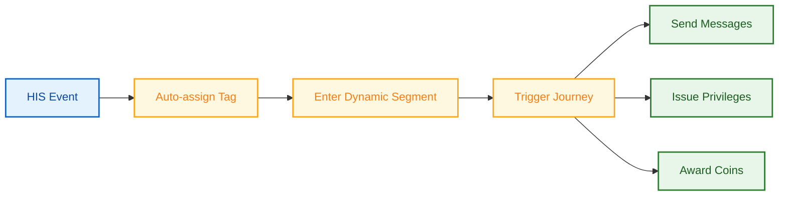

1. **HIS sends an event** (e.g. "pregnancy recorded", "IPD discharge", "appointment booked")
2. **Platform auto-assigns a tag** to the patient (e.g. `lifestage:prenatal_trimester_1`, `lifestage:post_surgical`, `lifestage:chronic_diabetes`)
3. **Patient enters a dynamic segment** defined by that tag + other conditions (e.g. "prenatal + first trimester + no nutrition consultation yet")
4. **Segment membership triggers a journey** — the patient receives stage-appropriate messages, privileges, and coin incentives automatically

| Lifestage | HIS Trigger | Tags Applied | Dynamic Segment | Journey Actions |
|---|---|---|---|---|
| **Pre-appointment** | Appointment booked, 3 days out | `upcoming_appointment`, `dept:{department}` | "Booked patients without prep completion" | Prep instructions + upsell add-on packages |
| **Post-discharge** | IPD discharge | `lifestage:post_surgical`, `procedure:{type}` | "Discharged patients without follow-up booking" | Care instructions → Day 7 follow-up reminder → Day 30 recovery offer |
| **Annual checkup due** | Last checkup > 11 months | `checkup_due` | "Members due for annual checkup" | Reminder + 10% off checkup package + coin incentive |
| **Prenatal** | Pregnancy recorded in HIS | `lifestage:prenatal`, `trimester:{N}` | "Prenatal patients by trimester" | Trimester-specific: checkup packages, nutrition, birth prep, pediatrician intro |
| **Chronic care** | Diagnosis tagged (diabetes, hypertension) | `lifestage:chronic`, `condition:{type}` | "Chronic patients approaching refill date" | Medication refill reminders, quarterly checkup nudge, pharmacy discount |
| **New patient** | First HIS visit recorded | `lifecycle:new_patient` | "First-visit patients who haven't returned in 30 days" | Welcome follow-up → department recommendation → checkup offer |

Lifestage is not a hardcoded list — it is extensible through tags and segments. When Samitivej adds a new care pathway (e.g. post-COVID recovery, elderly wellness), the team creates new tags, defines segments, and builds journeys. No system changes required.

**Persona assignment:** For longer-term patient classification (beyond transient tags), the Rocket Loyalty CRM Platform supports **persona assignment** — a single label per patient that represents their primary healthcare profile (e.g. "wellness seeker", "chronic care", "family care", "corporate executive"). Personas can be auto-assigned by AI Decisioning based on behavioral patterns or manually set by marketing. Personas drive homepage layout (Part IV, 4.1), privilege eligibility, and campaign targeting.

### TOR Coverage — Part III

| TOR Item | Covered |
|---|---|
| D1.1 | SCV + Dynamic Segmentation ✓ |
| D1.2a | Trigger-based journeys ✓ |
| D1.2b | Multi-channel delivery with personalization ✓ |
| D1.2c | Campaign performance tracking ✓ (Part VI) |
| D2 | Lifestage rules ✓ |

**Beyond TOR:** AI Decisioning (individual-level, observe-wait-act, guardrails), AI-driven adaptive survey questions, journey-level frequency cap/suppression, A/B testing, gradual rollout.

---

## Part IV: Omni-Channel Experience

*TOR Section E*

**Patients interact through four channel types — all reading from the same backend. One wallet, one tier, one set of benefits. The difference is what each channel optimizes for.**

### Channel Capability Matrix

| Capability | Well App | Website | LINE | E-commerce |
|---|---|---|---|---|
| Register / Login | SSO | LINE OAuth + OTP | LINE OAuth | — |
| View coins & tier | ✓ | ✓ | ✓ | — |
| Earn coins | ✓ | ✓ | ✓ | ✓ |
| Redeem privileges | ✓ Full | ✓ Full | ✓ Webview | Codes |
| Buy packages | ✓ Full commerce | ✓ Redirect to E-Commerce | ✓ Staff sends link | ✓ Marketplace |
| Missions & referral | ✓ | ✓ | ✓ Webview | — |
| Notifications | App push | Web push | LINE message | — |
| Multi-language | TH, EN, JA, ZH — additional languages (e.g. Arabic) at no extra cost | Same | Same | — |

---

### 4.1 Design Configuration — Member-Specific Homepages & Landing Pages

**The Rocket Loyalty CRM Platform uses a block-based design configuration system. Each page — homepage, landing page, partner page — is assembled from a library of building blocks. Different member types see entirely different page compositions without any code changes.**

#### Building Block Types

| Block Type | What It Displays | Example Use |
|---|---|---|
| **Hero banner** | Full-width image/video with CTA | Seasonal campaign, flash reward countdown |
| **Coin summary** | Balance, burn rate, expiry countdown | Always visible on homepage |
| **Tier status** | Badge, progress bar, next-tier benefits preview | Engagement tier progress |
| **Privilege carousel** | Scrollable privilege cards with eligibility badges | Tier-specific privilege highlights |
| **Package spotlight** | Featured health packages with pricing and promo badge | Department-specific upsell |
| **Standing benefits** | Active unlimited-use discounts for the member | VIP / Paid membership benefit summary |
| **Mission progress** | Active missions with completion bars | Cross-department engagement |
| **Content feed** | Health articles, tips, coin-earning content | Personalized by department history |
| **Partner deals** | Partner-specific offers (Marriott, airlines) | Exclusive Partner member type only |
| **Quick actions** | Shortcut buttons: scan QR, buy package, invite friend | Configurable per member type |
| **Corporate badge** | Company name, level, contract benefits | Corporate members only |
| **Referral banner** | Invite friends CTA with current reward stats | Engagement-tier members |

#### How Member Types See Different Homepages

The admin configures a **page layout per member type** by selecting and ordering blocks. When a patient with multiple member types logs in, the system resolves which layout applies using the same precedence logic as benefit resolution.

| Member Type | Homepage Composition |
|---|---|
| **VIP (Connex)** | Hero (VIP exclusive) → Standing benefits → Privilege carousel (VIP-only) → Package spotlight → Content feed |
| **Corporate** | Corporate badge → Standing benefits → Privilege carousel → Quick actions → Content feed |
| **Paid (Divine Elite)** | Tier status → Standing benefits → Elective selection reminder → Mission progress → Package spotlight |
| **Engagement (Gold)** | Coin summary → Tier progress → Privilege carousel → Mission progress → Referral banner → Content feed |
| **Exclusive Partner** | Partner deals → Coin summary → Privilege carousel → Content feed |
| **New member (Silver)** | Welcome hero → Quick actions → Package spotlight → Mission list → Referral banner |

**Landing pages** (campaign-specific, partner-specific, seasonal) use the same block system. Marketing creates a landing page by picking blocks, setting eligibility conditions, and publishing — no development required.

**Admin workflow:** Select page → choose blocks from library → arrange order → set eligibility (which member types see this layout) → preview → publish. Changes take effect immediately.

> 📱 **[Mockup: Home Dashboard — block-based layout showing coin balance, tier, package offer, privilege carousel]**

---

### 4.2 Well by Samitivej — Full Loop

*TOR E1*

Well is the primary frontend. The Rocket Loyalty CRM platform is the backend. All loyalty features served via API and embedded webview.

**SSO:** Well authenticates → passes token → our system validates → session established. No second login.

**Identity architecture:** Primary matching keys are **National ID / Passport** and **Phone (OTP)**. HN is the unique identifier once created at the hospital. Well ID is interim for patients who haven't visited yet. LINE ID stored for future linking. Sukhumvit and Srinakarin share HN; other branches have separate HNs.

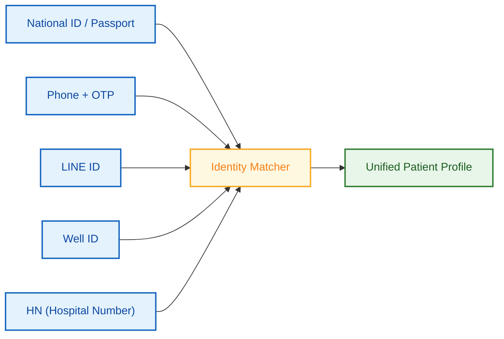

| Registration Scenario | What Happens |
|---|---|
| Patient uses Well first | Has HN → SSO → CRM user linked to HN |
| Registers on LINE/website first | CRM user with LINE ID → later visits hospital → HN created → linked |
| Corporate employee (no visit yet) | Roster import → CRM user → first visit → HN → linked |
| No HN or Well ID yet | LINE ID stored → future linking when HN created |

> 📱 **[Mockup: Home — member card, tier badge, coin balance, package offer, privilege carousel]**

> 📱 **[Mockup: Home — Corporate variant with company badge, standing benefits]**

---

### 4.3–4.5 Website, LINE, E-Commerce

**Website** *(TOR E2):* Loyalty pages added to existing hospital website. Login, wallet, privileges, article tracking (JS snippets on existing articles), consent. Initially 2 branches; Phase 3 adds loyalty pages to additional branch websites (e.g. Chonburi).

> 📱 **[Mockup: Website — loyalty widget embedded on hospital site, coin balance, quick redeem, article with coin-earning toast]**

**LINE** *(TOR E3):* LIFF web app inside LINE. Register, check balances, redeem via webview. Initially 2 branch LINE OAs.

> 📱 **[Mockup: LINE LIFF — rich menu with wallet shortcut, webview showing coin balance, privilege list, redeem CTA]**

**E-commerce** *(TOR E4):* Shopee (webhook operational), Lazada, LINE MyShop. Earn coins from purchases. Tier benefits applied. Marketplace privilege flow: email voucher → hospital verification → privileges in wallet.

> 📱 **[Mockup: My QR — member QR code for staff scanning at hospital counter, patient name, member type badge]**

### TOR Coverage — Part IV

| TOR Item | Covered |
|---|---|
| E1.1–E1.8 | Well full loop ✓ |
| E2.1–E2.9 | Website ✓ |
| E3.1–E3.4 | LINE ✓ |
| E4.1–E4.3 | E-commerce ✓ |

**Beyond TOR:** Block-based design configuration system for member-type-specific homepages and landing pages.

---

## Part V: Back Office Console

*TOR Section F*

**The Back Office Console is where Samitivej's marketing, operations, and clinical teams manage the entire loyalty program — from configuring coin rules and building packages to managing member contracts and monitoring approval queues. Below are the key admin experiences organized by function.**

---

### 5.1 Earn Studio — Coin Rule Configuration

*TOR B2.4, F1.4*

The Earn Studio is the visual interface for defining how coins are earned across the entire program. Marketing configures rules here; the engine executes them in real-time whenever a qualifying event arrives.

**Rule builder workflow:**

1. **Select earn trigger:** purchase event, activity event, form completion, referral, marketplace order
2. **Define qualifying conditions:** which branches, departments, member types, tiers, time periods, minimum spend
3. **Set earn calculation:** base rate (coins per THB), multiplier, fixed bonus, or tiered (e.g. first 5,000 THB at 1×, next 5,000 at 1.5×)
4. **Configure stacking:** when multiple rules match, do they compound or does the highest win?
5. **Set safeguards:** maximum coins per transaction, per patient per day, per campaign budget, delayed award period
6. **Approval:** maker-checker required for any rule change affecting >1,000 patients or modifying base rates

**Admin sees:** rule list with status (active/draft/expired), affected patient count estimate, campaign association, last modified by, approval status.

> 📱 **[Mockup: Earn Studio — visual rule builder with conditions, calculation, stacking toggle, safeguards panel]**

**Example configurations:**

| Rule | Trigger | Conditions | Calculation | Safeguard |
|---|---|---|---|---|
| Base hospital earn | HIS purchase event | All members, all branches | 1 coin per 100 THB | Max 5,000 coins/day |
| Gold tier bonus | HIS purchase event | Gold+ tier | 1.5× multiplier on base | Stacks with base |
| Dermatology promo | HIS visit event | Dermatology dept, May 2026 | +50 bonus coins per visit | Max 3 per patient |
| Weekend surge | HIS purchase event | Sat–Sun only | 2× multiplier | Non-stack (highest wins) |
| Article engagement | Website activity event | Logged-in members | 5 coins per article read | Max 5 articles/day |

---

### 5.2 Privilege Management

*TOR F1.1, F1.2, B2.1–B2.3, B2.6*

Privilege management covers the full lifecycle: creation, eligibility configuration, pricing, stock, scheduling, code management, and issuance tracking.

**Creating a privilege:**

1. **Basic info:** Name (multi-language), description, image, category (hospital service / partner reward / lifestyle / flash)
2. **Type:** Single-use, multi-use (set total uses), or unlimited (standing benefit → routes to standing benefit engine)
3. **Fulfillment:** Digital (QR/barcode), shipping (physical gift), pickup (hospital counter), printed (PDF)
4. **Eligibility:** Who can see and receive this privilege — by tier, member type, persona, tag, segment, or specific patient list
5. **Coin pricing:** Dynamic by dimension — e.g. Gold: 400 coins, Platinum: 250 coins. Or free (auto-issued, admin-only)
6. **Stock:** Total quantity, per-patient limit, per-day limit
7. **Scheduling:** Start/end date, visibility window, flash reward countdown
8. **Promo codes:** Single pool or bulk import from partner (CSV upload with partner attribution)
9. **Approval:** Manager approval required before privilege goes live

**Bulk operations:** Import partner promo codes (10,000+ codes in one CSV), batch issuance to a segment (e.g. issue birthday coupon to all members born in June), clone existing privilege as template.

> 📱 **[Mockup: Privilege creation — multi-step form with eligibility builder, dynamic pricing table, stock config, code upload]**

> 📱 **[Mockup: Privilege list — status filters, stock indicators, redemption counts, partner attribution badges]**

---

### 5.3 Package Builder

*TOR F3.1–F3.2*

The Package Builder lets marketing assemble health packages from individual privileges and publish them to the online store (Well App, Hospital E-Commerce).

**Building a package:**

1. **Package info:** Name, description, images, category (ตรวจสุขภาพ / ทันตกรรม / กายภาพ / etc.), branch availability
2. **Pricing:** Base price, promotional price, coin discount allowance (e.g. max 2,000 coins applicable)
3. **Mandatory privileges (คูปองบังคับ):** Select from privilege catalog → these auto-issue on purchase. Example: 1× blood test + 1× X-ray + 3× café 100 THB
4. **Elective privileges (คูปองเลือก):** Define pool size and pick count. Example: patient chooses 3 from 8 wellness options
5. **Standing benefits:** Assign period-based unlimited-use discounts that activate on purchase. Example: 10% off pharmacy for 1 year
6. **Eligibility:** Which member types / tiers can purchase, visibility rules
7. **Channel availability:** Well App, Hospital E-Commerce, staff-assisted (counter), LINE (staff sends link)
8. **Scheduling:** Sale period, early access for higher tiers, stock limit
9. **Auto-issuance rules:** On payment confirmation → issue all mandatory privileges + activate standing benefits + open elective selection for patient

**Package catalog view:** Cards with price, promo badge, branch tags, stock remaining, active/draft/expired status.

> 📱 **[Mockup: Package Builder — multi-step form with mandatory/elective privilege selection, pricing, channel config]**

> 📱 **[Mockup: Package catalog management — card view with status, stock, sales count, channel indicators]**

---

### 5.4 Member Type & Contract Management

*TOR C1–C6 (Back Office), F1.3*

This is the admin interface for managing all six member types — creating contracts, defining benefit levels, importing rosters, and tracking utilization.

**Contract creation (Corporate / Insurance / Partner):**

1. **Contract info:** Company/insurer/partner name, contact person, effective dates, status (active/suspended/expired)
2. **Define levels:** Executive / General / Other — each level gets its own benefit package
3. **Benefit mapping per level:**
   - Consumable privileges: select from privilege catalog (e.g. 5× specialist consults, 3× parking)
   - Standing benefits: define unlimited-use discounts (e.g. 25% off OPD for Executive level)
   - Coin earning: custom earn rate per contract if applicable
4. **Roster management:** Upload CSV (employee list with name, phone, national ID, level) → batch validation → assignment with effective dates. Delta import for quarterly updates (new hires → assign, terminations → deactivate).
5. **Approval:** Roster changes affecting >50 members require manager approval

**VIP assignment:**
- Select patient → assign VIP level (Connex / Cheva / BDMS) → system auto-issues consumable privileges + activates standing benefits
- Hospital-initiated (admin assigns), not self-service

**Paid membership configuration:**
- Define plan (e.g. Divine Elite) → set price, mandatory privileges, elective pool, standing benefits, duration
- Plan links to payment gateway (patient purchases via Well App or counter)

**Contract dashboard:** Active contracts list, member count per level, utilization rate, approaching renewal, deactivated count.

> 📱 **[Mockup: Contract creation — company info, level definition, benefit mapping with privilege picker, roster upload]**

> 📱 **[Mockup: Contract dashboard — utilization heatmap, member count by level, renewal timeline]**

---

### 5.5 Marketing Automation Console — Campaign & Journey Management

*TOR F1.1–F1.3*

**This is the back office interface for the Marketing Automation engine described in Part III. Marketers use this console to create campaigns, build automated journeys, define target audiences, and manage the full approval workflow — all without developer involvement.**

**Campaign creation:**

1. **Define campaign:** Name, objective, period, budget
2. **Target audience:** Select existing segment or build inline (dynamic rule or static import)
3. **Associated privileges:** Pick or create privileges issued as part of this campaign
4. **Journey attachment:** Link to an automated journey (welcome, post-visit, win-back) or run as one-time blast
5. **Approval:** Campaign launch requires manager sign-off

**Journey builder:** Visual drag-and-drop interface for multi-step automated flows. Nodes: trigger, condition (branch on patient data), wait (duration or event), message (LINE / SMS / Email / Push), action (award coins, issue privilege, assign tag). Each journey includes built-in frequency cap, suppression rules, and performance reporting. This is the operational interface for the journeys designed in Part III, Section 3.2.

**Approval queue:** All pending actions across the console — privilege launches, campaign activations, coin rule changes, roster imports, package publishes — in one dashboard. Approve/reject with comments. Full audit trail.

> 📱 **[Mockup: Campaign creation — audience builder, privilege picker, journey link, approval step]**

> 📱 **[Mockup: Journey builder — drag-and-drop canvas with trigger, conditions, messages, actions]**

> 📱 **[Mockup: Approval queue — pending items across all functions, approve/reject with comments]**

---

### 5.6 Mission & Gamification Management

*TOR B1.3b*

**Mission builder:**

| Setting | Options |
|---|---|
| **Type** | Standard (single goal) or Milestone (multi-level with overflow) |
| **Conditions** | Purchase at department X, complete form, refer friend, visit N times — AND/OR logic |
| **Reward per level** | Coins, privilege, tag assignment, tier boost |
| **Progress source** | Purchase events, activity events, form submissions, referral completions |
| **Display** | Progress bar, level indicators, reward preview |
| **Scheduling** | Start/end date, recurring (monthly reset), always-on |

**Milestone example:** "Health Champion" — Level 1: 3 checkups → 200 coins. Level 2: 5 checkups → 500 coins + café voucher. Level 3: 10 checkups → 1,000 coins + spa privilege. Overflow: patient completes 6 checkups → Level 1 auto-completes at 3, remaining 3 counts toward Level 2 (3/5 progress).

> 📱 **[Mockup: Mission builder — multi-level configuration with conditions, rewards per level, overflow toggle]**

---

### 5.7 Referral Program Management

**Configuration:**

| Setting | Details |
|---|---|
| **Invitee reward** | Configurable: coins, privilege, or both on registration |
| **Inviter reward** | Configurable: coins, privilege, or both — triggered on invitee's first visit/purchase |
| **Limits** | Max referrals per inviter per period, total program budget |
| **Sharing channels** | LINE share, Facebook share, copy link, QR code |
| **Code format** | Auto-generated (lazy creation) or custom prefix |
| **Tracking** | Referral funnel: codes shared → registrations → first visits → rewards issued |

> 📱 **[Mockup: Referral dashboard — funnel metrics, top referrers, share channel breakdown]**

---

### 5.8 Exclusive Partner Landing Pages

*TOR F2*

Marketing creates a dedicated landing page per partner without development. The page builder uses the same block system as consumer homepages (Part IV, 4.1).

| Setting | Details |
|---|---|
| **Page layout** | Select blocks: hero banner, partner deals, standing benefits, coin summary |
| **Eligibility** | Content shown by partner level (Gold vs Platinum see different deals) |
| **Privilege mapping** | Marketing picks privileges from central pool → assigns per deal slot |
| **Partner activity** | Partners send events via API → level updates → page auto-refreshes |
| **Match API** | Partner queries "what does this user qualify for?" → system returns benefits |
| **Approval** | New partner page requires manager approval before publish |

> 📱 **[Mockup: Partner landing page builder — block selection, deal assignment, level-based visibility rules]**

---

### 5.9 Cross-Cutting Console Features

| Feature | Details |
|---|---|
| **Role-based access** | Superadmin, Marketing Manager, Department Admin, Viewer — each sees only what they're permitted |
| **MFA** | Required for all admin accounts |
| **Maker-checker** | Two-admin sign-off for: bulk point adjustments, earn rule changes, privilege extensions, manual overrides, roster imports >50 |
| **Audit trail** | Every action logged: who, when, what, why, before/after state. Searchable, exportable. |
| **Form builder** | Surveys with conditional logic, NPS, ratings, open text — responses feed into patient profile and trigger journeys |
| **Multi-language admin** | Console operates in Thai; privilege/campaign content managed in TH, EN, JA, ZH (additional languages at no extra cost) |
| **Department-scoped access** | Central team creates master templates; department staff (50+ departments) pick from the pool and issue to patients within their scope |

### TOR Coverage — Part V

| TOR Item | Covered |
|---|---|
| F1.1–F1.7 | Full console with campaign, privilege, coin rules, approval, audit ✓ |
| F2.1–F2.3 | Partner landing pages with activity API + match API ✓ |
| F3.1–F3.2 | Health package builder + online store (also Part I, 1.6) ✓ |
| F4.1–F4.3 | Reward pool with 2,000+ SKU (moved to Part XI — Reward Sourcing) ✓ |
| B1.3b | Mission & gamification with milestone overflow ✓ |
| B2.4 | Earn Studio (coin rule configuration) ✓ |
| C1–C6 (back office) | Member type & contract management ✓ |

**Beyond TOR:** Milestone missions with overflow, visual earn rule builder (Earn Studio), package builder with mandatory/elective/standing benefit composition, flash reward management, partner activity API for auto-upgrades.

---

## Part VI: Dashboards & Analytics

*TOR B2.5, F1.5, F1.6*

**The Rocket Loyalty CRM Platform includes standard dashboards for daily operations plus up to 20 custom dashboards tailored to Samitivej's needs — included at no additional charge.**

### Standard Dashboards

| # | Dashboard | Key Metrics |
|---|---|---|
| 1 | **Member Overview** | Total members, active vs inactive, registration by channel, member type distribution, new vs returning |
| 2 | **Coin Economy** | Earned / burned / expired, net circulation, earn by channel, burn by category, average balance |
| 3 | **Privilege & Redemption** | Top redeemed, redemption by tier/member type, stock levels, partner performance |
| 4 | **Package Sales** | By type, branch, channel; conversion funnel; revenue trend; average order value |
| 5 | **Tier Movement** | Upgrades/downgrades, tier distribution, at-risk members, tier velocity |
| 6 | **Campaign Performance** | Per-campaign: reach, open, click, conversion; A/B results; cost-per-acquisition |
| 7 | **Department Usage** | Visits by department, cross-department usage, coupon usage by dept; cross-sell paths |
| 8 | **Corporate & Insurance** | Usage per company/insurer/level, utilization rate, renewal indicators |
| 9 | **Entitlement Tracking** | Active entitlements, avg usage rate, approaching expiry, branch distribution |
| 10 | **Marketing Automation** | Journey completion/drop-off, message delivery/open/click by channel, best journeys |

### Samitivej-Specific Insights

- **Cross-Department Flow:** "Of 5,000 checkup patients this quarter, 23% also used dental, 15% dermatology, 8% ophthalmology. Top cross-sell path: Checkup → Dental → Dermatology."
- **Package Conversion by Channel:** "Executive Checkup conversion: Well App 4.2%, Hospital E-Commerce 3.1%, Shopee 1.8%."
- **Corporate Contract Health:** "CRC: 85% activation, 320 OPD visits, 45 lounge passes. AIA: 92% claim rate, top benefit: OPD discount."

### Custom Dashboards (Up to 20 Included)

Designed to Samitivej's specifications: patient lifetime value, seasonal patterns, branch comparison, partner page performance, VIP utilization — whatever the business requires.

All dashboards: date filters, drill-down, scheduled auto-generation, Excel/CSV export.

### Rocket MCP — AI-Powered Data Assistant

For high-permission users (Marketing Director, Superadmin), the Rocket Loyalty CRM Platform includes **Rocket MCP** — an AI assistant that answers natural-language questions about loyalty data directly in the admin console.

**Example queries:**
- "How many Gold members redeemed a privilege last month?"
- "Which department has the highest cross-sell rate?"
- "Show me the top 10 corporate contracts by utilization"
- "What's the average time between registration and first hospital visit?"

Rocket MCP queries the analytics layer and returns answers with supporting data — no SQL, no report building required. This gives executives instant access to operational intelligence without waiting for scheduled reports.

> 📱 **[Mockup: Dashboard — Coin Economy overview with earn/burn charts, channel breakdown]**

> 📱 **[Mockup: Dashboard — Department cross-sell flow Sankey diagram]**

> 📱 **[Mockup: Admin — Rocket MCP AI data assistant interface]**

---

## Part VII: Technical Architecture & Security

*TOR Section G*

### System Architecture

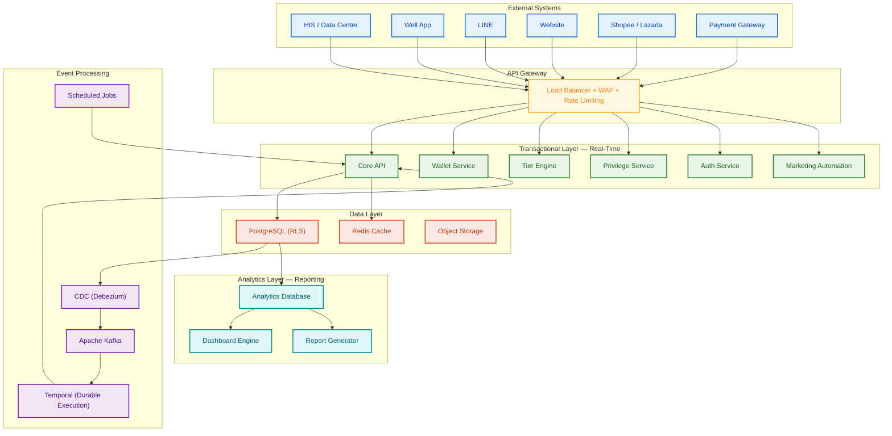

### Two-Layer Separation

| Layer | Purpose | Performance |
|---|---|---|
| **Transactional** | Real-time: earn, burn, redeem, eligibility | < 100ms reads, < 500ms writes |
| **Analytics** | Dashboards, reports, trend analysis | Runs independently — never impacts transactional |

### Core Technology Stack

| Capability | What It Means | Example |
|---|---|---|
| **Real-time event processing** | Every action triggers immediate downstream reactions — no overnight batch jobs | Patient pays → coins appear in wallet within 1 second |
| **In-memory caching** | Frequently-read data (catalogs, rules, tier definitions) served in under 50ms. Eligibility computed live to avoid stale data at billing. | HIS asks "what discount?" → answer in 50ms |
| **Always-current data** | Segments, dashboards, and eligibility update continuously as data changes | Patient upgrades to Gold → immediately appears in Gold segments |
| **Durable execution** | State-of-the-art workflow orchestration adopted by Netflix, Stripe, and Uber. Multi-step operations that span days or weeks are guaranteed to complete — even through server restarts, deployments, and failures. | 30-day birthday journey completes fully. Patient who pays always receives their package. 100,000 expiring entitlements all processed — never partially. |

### Data Isolation & Multi-Tenant Architecture

Each client's data is fully isolated through database sharding and Row-Level Security (RLS). Samitivej's data lives in its own dedicated shard — physically separated from other clients at the infrastructure level. Even within the application layer, every query is scoped by RLS policies, meaning no code path can accidentally access another client's data.

> 📊 **[Diagram: Database Sharding & Client Isolation — visual showing dedicated database shards per client, RLS enforcement at query level, and infrastructure-level separation. Samitivej shard highlighted.]**

This is the same isolation model used by enterprise SaaS platforms serving regulated industries (healthcare, financial services). It satisfies both data sovereignty requirements and audit compliance — Samitivej's data is never co-mingled with other tenants.

### Performance Guarantees

| Metric | Target |
|---|---|
| System uptime | **99.9%** |
| Concurrent active users | **10,000+** |
| Wallet / eligibility query | **< 50ms** |
| Coin earn end-to-end | **< 1 second** |
| Flash reward concurrency | **10,000+** users, fair first-come-first-served |

### Security

Seven-layer defense-in-depth — every request passes through perimeter, application, and data security before reaching the database. Monitoring spans all layers continuously.

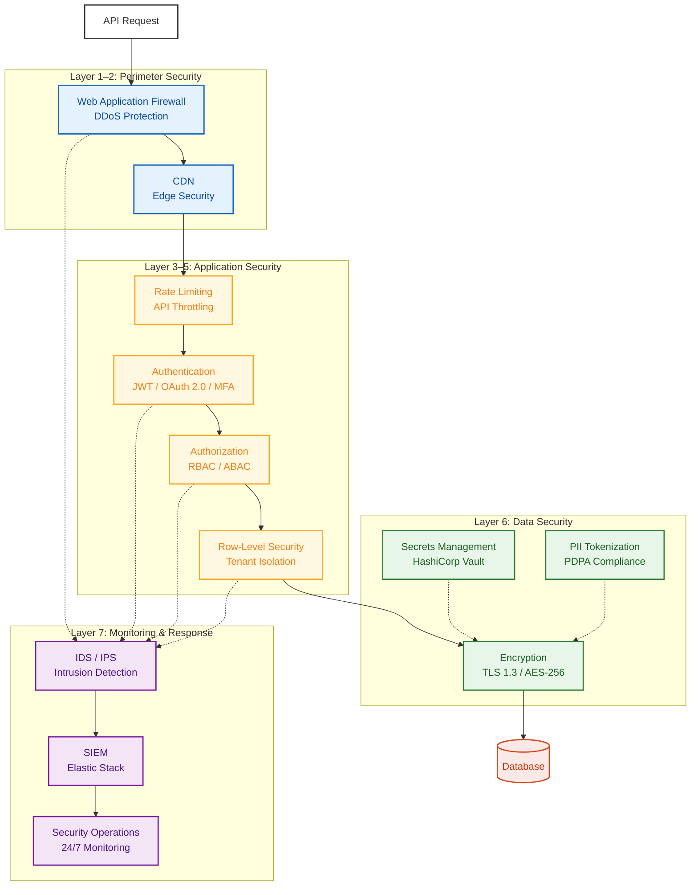

| Layer | Protection |
|---|---|
| **Perimeter** | WAF, DDoS protection, CDN edge security, TLS 1.3 |
| **Rate Control** | API throttling, velocity checks, anti-abuse |
| **Authentication** | JWT, OAuth 2.0, MFA for admin |
| **Authorization** | Row-Level Security, RBAC, API key scoping |
| **Data** | AES-256 at rest, TLS in transit, PII tokenization, secrets management |
| **Fraud** | Idempotency keys, anti-double-spend, rate limiting, velocity checks |
| **Monitoring** | IDS/IPS, SIEM (Elastic Stack), 24/7 security operations |
| **Audit** | All mutations logged: actor, timestamp, action, before/after |
| **PDPA** | Per-channel/per-purpose consent, data subject access, right to erasure |

---

## Part VIII: Integration Architecture & Open API

### Integration Scenarios

#### Scenario 1: Coin Earning from Hospital Visit

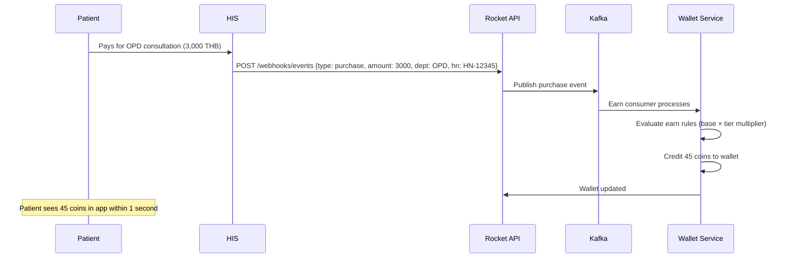

#### Scenario 2: Eligibility Query at Billing Counter

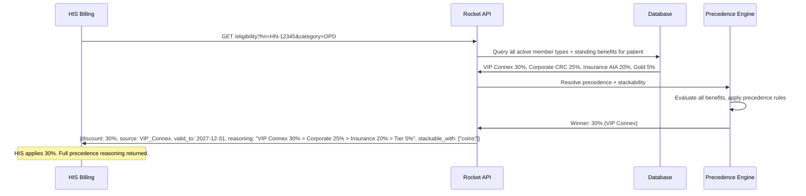

**Why not cached?** Eligibility is computed live on every query — patient benefit data changes frequently (new member type assigned, privilege expired, tier upgraded). Caching individual eligibility would risk serving stale data. The query is optimized at the database level with indexed lookups and returns within 50ms without caching.

**What the response includes:**
- **Winning discount** with source and validity
- **Precedence reasoning** — full ranked list of all evaluated benefits explaining why the winner was selected
- **Stackability** — which other benefit types can combine with the winning discount for this specific package/service
- **All active standing benefits** — HIS receives the complete picture, not just the winner

#### Scenario 3: Privilege Mark-Use (Staff Scans QR)

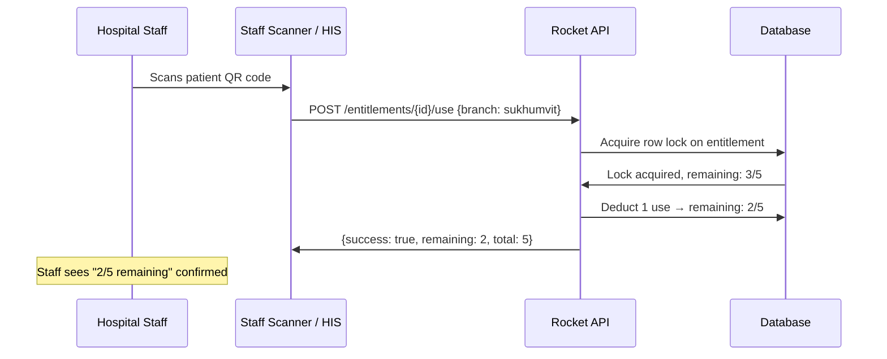

#### Scenario 4: Package Purchase via Well App

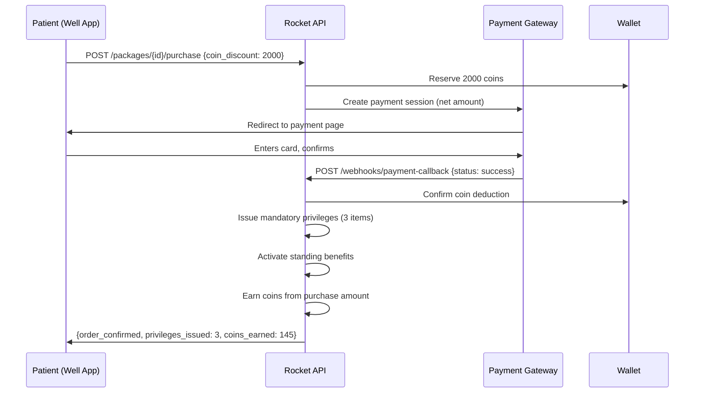

#### Scenario 5: Marketplace Order → Hospital Verification → eCoupon Issuance

The existing marketplace flow is preserved: patient receives an email voucher from Shopee/Lazada. The loyalty system adds a digital layer — once the hospital verifies the OrderSet and creates HN, eCoupons (privileges) are automatically issued to the patient's wallet.

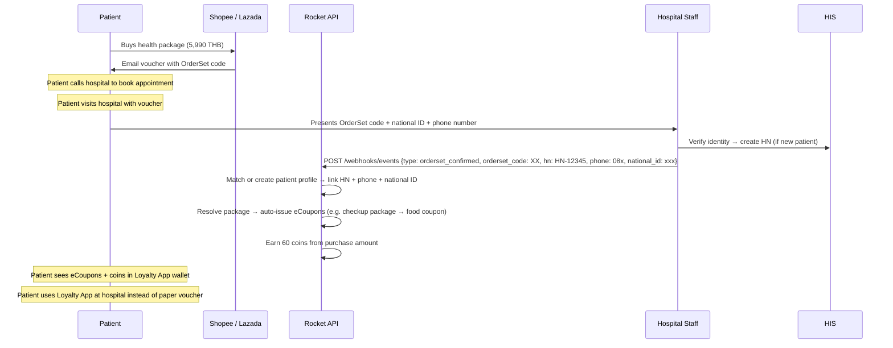

**Key alignment with current process:** The email voucher journey stays as-is (buy on marketplace → receive email voucher → call to book → visit hospital). The loyalty platform adds value *after* hospital verification: eCoupons appear in the patient's digital wallet, coins are earned, and future privileges can be tracked digitally. Over time, the paper voucher becomes redundant as patients use the app.

#### Scenario 6: Marketing Automation Trigger

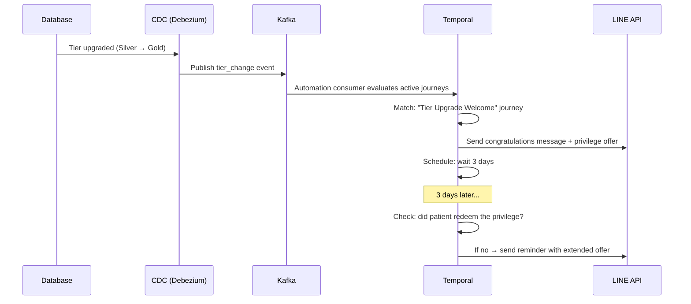

#### Scenario 7: Partner Member Import & Level Update

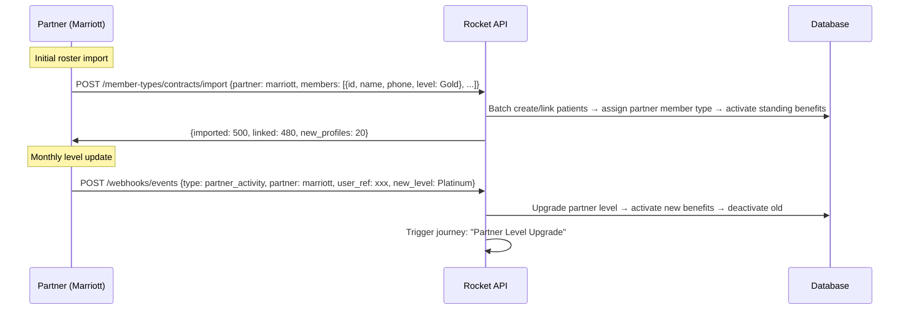

#### Scenario 8: Package Assignment Changes (Extend, Branch Transfer, Swap)

```mermaid
sequenceDiagram
    participant ADMIN as Admin Console
    participant API as Rocket API
    participant DB as Database
    participant APPROVAL as Approval Engine

    Note over ADMIN: Extend package validity
    ADMIN->>API: POST /packages/{id}/extend {new_expiry: 2027-06-30, reason: "Patient request"}
    API->>APPROVAL: Requires manager approval (extension > 30 days)
    APPROVAL->>API: Approved by Manager A
    API->>DB: Extend package + all child entitlements → log before/after

    Note over ADMIN: Transfer to different branch
    ADMIN->>API: POST /packages/{id}/transfer {new_branch: chonburi, reason: "Patient relocated"}
    API->>DB: Reassign package + entitlements to new branch → audit logged

    Note over ADMIN: Swap package
    ADMIN->>API: POST /packages/{id}/swap {new_package_id: xyz, reason: "Upgrade request"}
    API->>APPROVAL: Requires manager approval
    APPROVAL->>API: Approved
    API->>DB: Cancel old entitlements (remaining logged) → issue new package entitlements with adjusted balance
```

#### Scenario 9: Corporate Roster Import & Update

```mermaid
sequenceDiagram
    participant HR as Company HR
    participant ADMIN as Admin Console
    participant API as Rocket API

    HR->>ADMIN: Uploads employee CSV (500 rows)
    ADMIN->>API: POST /member-types/contracts/{id}/roster {file: employees.csv}
    API->>API: Validate: duplicate check, format validation, phone verification
    API->>API: Batch assign corporate member type → issue benefits per employment level
    API->>ADMIN: {processed: 500, assigned: 485, errors: 15, error_details: [...]}

    Note over HR: Quarterly roster update
    HR->>ADMIN: Uploads delta CSV (new hires + terminations)
    ADMIN->>API: POST /member-types/contracts/{id}/roster/update {file: delta.csv}
    API->>API: New employees → assign. Terminated → deactivate benefits, log reason.
```

### Integration Map

| System | Direction | Method | Data |
|---|---|---|---|
| **HIS** | Bidirectional | REST API | In: purchases, visits, service delivery, insurance, OrderSet. Out: eligibility, entitlements, member status. |
| **CDP Hospital** | Inbound | API / Batch | Service catalog, product/price master |
| **Well App** | Bidirectional | REST API + SSO | In: SSO token. Out: all loyalty data. |
| **LINE** | Bidirectional | Messaging API + LIFF | In: auth, events. Out: messages, webview. |
| **Shopee** | Inbound | Webhook | Order data |
| **Lazada** | Inbound | Webhook / API | Order data |
| **Payment Gateway** | Bidirectional | Payment API | Out: payment requests. In: callbacks, confirmation. |
| **Partners** | Bidirectional | REST API | Activity events in; eligibility queries out. |
| **Website** | Inbound | REST API + JS SDK | Article tracking events, auth (OTP/LINE OAuth) |
| **SMS Provider** | Outbound | REST API | Journey-triggered SMS messages |
| **Email Provider** | Outbound | REST API | Journey-triggered emails |
| **FCM / APNs** | Outbound | Push API | App push notifications to Well App |
| **Partner Loyalty** | Inbound | REST API | Point transfer (The1, M Card, K Point) — when partnerships signed |

### Integration Detail List

> **Refer to attached file: `SAMITIVEJ_INTEGRATION_DETAIL_LIST.csv` for the complete integration detail list (13 integration groups, 30+ individual integration points with API endpoints, data direction, and frequency).**

### Reliability

API calls use retry with exponential backoff. Circuit breaker prevents cascading failures — if one system is unavailable, events are queued and processed on recovery. Idempotency keys ensure no duplicate processing.

### Open API — Endpoint Catalog

The Rocket Loyalty CRM Platform exposes a comprehensive REST API. **Full API documentation with payload specifications, authentication details, and sandbox access will be shared after project confirmation.**

| Endpoint | Purpose |
|---|---|
| **Users** | |
| `/users` | Member registration and listing |
| `/users/{id}` | Profile retrieval and update |
| `/users/match` | Identity matching (national ID, phone, HN) |
| `/users/merge` | Merge duplicate profiles |
| **Wallet** | |
| `/wallet/balance` | Current coin balance |
| `/wallet/transactions` | Transaction history with filters |
| `/wallet/credit` | Credit coins (earn) |
| `/wallet/debit` | Debit coins (burn) |
| `/wallet/transfer` | Inbound point transfer from partner loyalty (The1 / M Card / K Point) |
| `/wallet/expiry-preview` | Upcoming coin expirations for a patient |
| **Privileges** | |
| `/privileges` | Privilege catalog (browse, filter) |
| `/privileges/{id}/redeem` | Redeem a privilege with coins |
| `/privileges/issue` | Issue privilege to a patient |
| `/privileges/bulk-issue` | Bulk issuance (package bundles) |
| **Entitlements** | |
| `/entitlements/{id}` | Entitlement status and remaining uses |
| `/entitlements/{id}/use` | Deduct one use (mark-use) |
| `/entitlements/{id}/adjust` | Add/remove uses (admin or HIS) |
| **Tiers** | |
| `/tiers/status` | Patient tier status |
| `/tiers/evaluate` | Trigger tier evaluation |
| `/tiers/benefits` | Benefits for a given tier |
| **Member Types** | |
| `/member-types/assign` | Assign patient to a member type |
| `/member-types/status` | All member types for a patient |
| `/member-types/contracts` | Contract management (corporate/insurance/partner) |
| `/member-types/contracts/{id}/roster` | Batch roster import (corporate/insurance/partner) |
| `/member-types/contracts/{id}/roster/update` | Delta roster update (new hires, terminations) |
| **Eligibility** | |
| `/eligibility` | All active benefits for a patient — returns winner + full precedence reasoning + stackability |
| `/eligibility/standing-benefits` | Standing discounts with precedence resolution and ranked reasoning |
| `/eligibility/stackability` | Stackability check for a specific package — which benefits combine and how |
| **Campaigns** | |
| `/campaigns` | Campaign CRUD |
| `/campaigns/{id}/metrics` | Campaign performance metrics |
| **Missions** | |
| `/missions` | Mission catalog |
| `/missions/{id}/progress` | Patient progress on a mission |
| `/missions/{id}/claim` | Claim mission reward |
| **Audiences** | |
| `/audiences` | Segment management |
| `/audiences/{id}/members` | Members in a segment |
| `/audiences/{id}/export` | Export segment for external use |
| **Packages** | |
| `/packages` | Package catalog |
| `/packages/{id}/purchase` | Initiate package purchase |
| `/packages/{id}/entitlements` | Entitlements issued for a package |
| `/packages/{id}/extend` | Extend package validity (with approval) |
| `/packages/{id}/transfer` | Transfer package to another branch |
| `/packages/{id}/swap` | Swap package (cancel old, issue new) |
| **Activities** | |
| `/activities/track` | Track behavioral events (article read/like/share, form completion) |
| **Webhooks** | |
| `/webhooks/register` | Register webhook endpoint |
| `/webhooks/events` | Receive external events (HIS, marketplace) |
| **Reports** | |
| `/reports/generate` | Generate report on demand |
| `/reports/scheduled` | Schedule recurring reports |
| `/reports/export` | Export report data (CSV/Excel) |
| **Auth** | |
| `/auth/sso/validate` | Validate Well SSO token |
| `/auth/otp/send` | Send OTP to phone |
| `/auth/otp/verify` | Verify OTP |
| **Admin** | |
| `/admin/approvals` | Approval queue (pending/approve/reject) |
| `/admin/audit-log` | Audit trail query |
| `/admin/roles` | Role and permission management |

Authentication: OAuth 2.0. Rate limiting: 1,000 req/min reads, 100 req/min writes (configurable).

---

## Part IX: Pre-Go-Live & Migration

### Project Timeline

*[See separate weekly project timeline — inserted below]*

> **[INSERT: Weekly Project Timeline image from SAMITIVEJ_PROJECT_TIMELINE.csv]**

### Go-Live Checklist

**Technical:**
- [ ] HIS integration: all event types verified (purchase, visit, service delivery, insurance, OrderSet)
- [ ] Well SSO: token validation working for all user scenarios
- [ ] Rocket payment: successful test transactions with refund flow
- [ ] Shopee/Lazada: webhook processing verified, order matching tested
- [ ] Performance: all targets met (50ms eligibility, 1s earn, 10k concurrent)
- [ ] Security: pentest passed, no critical/high findings
- [ ] Monitoring: dashboards, alerts, log aggregation configured
- [ ] Disaster recovery: backup verified, failover tested

**Business:**
- [ ] Tier thresholds and benefits approved by marketing
- [ ] Earn rules signed off (all departments, all channels)
- [ ] Privilege catalog populated: hospital-owned + partner (initial stock loaded)
- [ ] Member type configurations: VIP levels, Corporate contracts, Insurance policies
- [ ] Communication templates: approved content for LINE, SMS, Email in TH/EN
- [ ] Admin users created with correct roles and permissions
- [ ] Department staff trained on privilege issuance and patient lookup

### Data Migration

If existing member/patient data needs to migrate:

| Phase | Duration | Activities |
|---|---|---|
| **Discovery** | 1 week | Source system inventory, schema mapping, data quality assessment, field-by-field mapping document |
| **Development** | 2 weeks | Migration scripts with validation rules, duplicate detection (by national ID + phone), delta sync for incremental changes during transition |
| **Test Migration** | 1 week | Full load to staging, automated validation (record counts, balance checksums, member type verification), gap analysis report |
| **Production** | 1 week | Zero-downtime migration during low-activity window. Iterative delta sync narrows changes from thousands to near-zero before final cutover. |

**Validation criteria:** 100% records migrated, zero data loss, coin balances match exactly, all member type assignments verified, every identity link (HN, phone, national ID) confirmed.

---

## Part X: Operations & Support

### Support Model

| Layer | Coverage | Handles | Team |
|---|---|---|---|
| **L1 — Technical Support** | Mon–Sat, 8:00–20:00 | Configuration issues, integration errors, data corrections, campaign adjustments | Technical specialists |
| **L2 — Engineering** | Mon–Fri, 9:00–18:00 (on-call for P1) | Critical bugs, infrastructure incidents, security events, HIS integration failures | Engineering team |

### SLA Targets

| Severity | Definition | Response | Resolution |
|---|---|---|---|
| **P1 — Critical** | Platform down, patients cannot use loyalty, HIS integration failed | 15 min | 4 hours |
| **P2 — High** | Major feature broken (e.g. privilege redemption failing), workaround exists | 30 min | 8 hours |
| **P3 — Medium** | Minor feature issue, limited patient impact | 2 hours | 24 hours |
| **P4 — Low** | Cosmetic, enhancement request | 8 hours | 72 hours |

### Incident Management

**Escalation path:** L1 → L2 with automatic escalation on SLA breach. War room protocol for P1 incidents with dedicated communication channel.

**Post-incident:** Root cause analysis within 48 hours. Corrective action plan. Monthly incident summary report.

### Ongoing Campaign Support

New campaigns are configured within a **3-day cycle**:

| Day | Activity |
|---|---|
| 1 | Receive campaign brief → configure earn rules, privileges, journey |
| 2 | Internal testing + review |
| 3 | Deploy to production + monitoring |

Recurring campaigns (birthday, welcome, post-visit, tier maintenance) are configured once and run automatically — no ongoing setup needed.

### Monthly Operations

| Activity | Details |
|---|---|
| **Monthly reports** | Member analytics, transaction summary, coin economy, campaign performance, redemption, operations — with executive summary |
| **System health review** | Uptime, response times, error rates, capacity forecasting |
| **Campaign review** | Performance of active journeys, segment health, A/B test results |
| **Privilege stock check** | Partner code inventory, reorder triggers, expiry alerts |
| **Security review** | Access log audit, permission review, vulnerability scan |

### Marketing Execution Support

**4-week monthly cycle:**

| Week | Activities |
|---|---|
| 1 | Previous month review + next month campaign planning |
| 2 | Campaign configuration, privilege creation, creative preparation |
| 3 | Testing, UAT, approval flow completion |
| 4 | Launch + daily monitoring + real-time optimization |

### Change Management

1. **Request:** Samitivej submits change request with requirements
2. **Assessment:** Scope, effort, timeline, impact analysis within 3 business days
3. **Approval:** Both parties sign off (minor: PM; structural: steering committee)
4. **Implementation:** Dev → test → staging → UAT → production
5. **Post-deployment:** Monitoring period, confirmation of success

---

## Part XI: Reward Sourcing

### Reward Pool — Pay-per-Use

*TOR F4*

Over 2,000 SKUs in the partner reward network. Samitivej pays only when a patient redeems. Digital e-vouchers deliver instantly; physical rewards ship in 2–5 business days. Hospital-owned privileges (discounts, service vouchers) have zero procurement cost.

**Admin operations:** Browse partner catalog, select rewards for Samitivej program, set coin pricing per tier, monitor stock levels, view redemption reports, trigger reorder when stock drops below threshold.

---

### Reward Strategy for Hospital Loyalty

Hospital loyalty differs from retail — patients visit periodically, not daily. Rewards must serve three objectives:

1. **Drive return visits:** Privileges that bring patients back (follow-up discounts, checkup offers, pharmacy vouchers)
2. **Cross-sell services:** Introduce patients to new departments (dental privilege for OPD regular, spa for checkup patient)
3. **Daily life integration:** Keep the brand present between visits (café chains, lifestyle rewards, wellness products)

### Reward Categories

| Category | Examples | Source | Typical Coin Range |
|---|---|---|---|
| **Hospital services** | Consultation discount, specialist referral, pharmacy, lab tests | Samitivej-owned | 500–5,000 coins |
| **Hospital amenities** | Parking, cafeteria credit, lounge access | Samitivej-owned | 100–500 coins |
| **Wellness** | Spa, fitness, vitamins, IV drip, massage | Samitivej + partners | 500–3,000 coins |
| **Dining** | Starbucks, After You, Café Amazon, MK, S&P | Partner network | 200–1,000 coins |
| **Lifestyle** | Grab, Shopee gift cards, cinema, beauty | Partner network | 500–3,000 coins |
| **Health products** | Supplements, skincare, health devices | Partner network | 1,000–5,000 coins |
| **Premium / Flash** | Dyson, Apple, luxury wellness retreats | Partner network | 10,000–50,000 coins |

### Sourcing & Fulfillment

| Type | Process | SLA |
|---|---|---|
| **Digital e-vouchers** | Real-time API procurement from partner networks. Code delivered to wallet instantly on redemption. | Instant |
| **Physical rewards** | Order routed to fulfillment partner. Pick, pack, ship with tracking number visible in app. | 2–5 business days standard, 14-day max |
| **Hospital-owned** | Configured directly in system. No procurement — these are discounts/services the hospital controls. | Instant |
| **Flash / limited** | Pre-loaded limited stock. Concurrent redemption handling (10k+ users). First-come-first-served with fairness guarantee. | Instant (digital) |

### Pay-Per-Use Model

Samitivej pays **only for redeemed rewards** — no upfront inventory cost for partner rewards. Hospital-owned privileges (discounts, service vouchers) have zero procurement cost.

### Partner Network

Our reward sourcing operation maintains relationships with **100+ partners** across dining, lifestyle, retail, and wellness. For Samitivej, we curate a subset focused on the hospital demographic — health-conscious, urban professionals who value convenience and quality.

**Partner onboarding:** New partners can be added within 5 business days (contract + code upload + catalog configuration). Seasonal partners (holiday campaigns, limited collaborations) supported with scheduling.

**Reconciliation:** Monthly reconciliation report per partner: codes distributed, redeemed, expired. Billing on redeemed count only.

---

## Appendix: Complete TOR Coverage Matrix

| TOR | Description | Section | Status |
|---|---|---|---|
| **B1.1** | Register/Login/OTP/SSO | Part IV | ✓ |
| **B1.2** | Coin balance + history | Part I, 1.3 | ✓ |
| **B1.3** | Earn from purchase + behavior | Part I, 1.1–1.2 | ✓ |
| **B1.4** | Redeem for privileges | Part I, 1.5 | ✓ |
| **B1.5** | Coin transfer | Part I, 1.4 | ✓ |
| **B1.6a–e** | eCoupon / entitlement / package | Part I, 1.5–1.6 | ✓ |
| **B2.1–B2.3** | Coupon auto-create + manual + dept access | Part I, 1.5, 1.7 | ✓ |
| **B2.4** | Coin rule engine | Part I, 1.1, 1.7 | ✓ |
| **B2.5** | Reports | Part VI | ✓ |
| **B2.6** | Privilege catalog management | Part I, 1.7 | ✓ |
| **B2.7** | Role/permission/MFA | Part I, 1.7 | ✓ |
| **B3.1–B3.5** | Channel integrations | Part IV, VIII | ✓ |
| **C1** | VIP (Star) membership | Part II, 2.2 | ✓ |
| **C2** | Paid membership | Part II, 2.3 | ✓ |
| **C3** | Engagement/Tier | Part II, 2.1 | ✓ |
| **C4** | Corporate | Part II, 2.4 | ✓ |
| **C5** | Insurance (incl. stackability) | Part II, 2.5 | ✓ |
| **C6** | Exclusive Partner | Part II, 2.6 | ✓ |
| **C shared** | Precedence, stackability, audit, RBAC | Part II, 2.7 | ✓ |
| **D1.1** | SCV + Segmentation | Part III, 3.1 | ✓ |
| **D1.2** | Journey automation | Part III, 3.2 | ✓ |
| **D2** | Lifestage | Part III, 3.4 | ✓ |
| **E1** | Well full loop | Part IV, 4.1 | ✓ |
| **E2** | Website | Part IV, 4.2 | ✓ |
| **E3** | LINE | Part IV, 4.3 | ✓ |
| **E4** | E-commerce | Part IV, 4.4 | ✓ |
| **F1** | Operations console | Part V, 5.1 | ✓ |
| **F2** | Partner landing pages | Part V, 5.2 | ✓ |
| **F3** | Health package purchase | Part I, 1.6 | ✓ |
| **F4** | Reward pool | Part XI | ✓ |
| **G1** | Data strategy | Part VII | ✓ |
| **G2** | Security / PDPA / Audit | Part VII | ✓ |
| **G3** | Support / SLA | Part X | ✓ |
| | | | |
| **Beyond TOR** | | | |
| — | Flash rewards (limited drops, 10k+ concurrency) | Part I, 1.5 | ✓ |
| — | Milestone missions with overflow | Part V, 5.3 | ✓ |
| — | AI Decisioning (individual-level, observe-wait-act) | Part III, 3.3 | ✓ |
| — | Delayed coin award | Part I, 1.1 | ✓ |
| — | Durable execution for guaranteed delivery | Part VII | ✓ |
| — | 20 custom dashboards included | Part VI | ✓ |
| — | Open API (50+ endpoints) | Part VIII | ✓ |
| — | Per-member-type tier structures | Part II | ✓ |
| — | A/B testing & gradual rollout | Part III, 3.2 | ✓ |
| — | Partner activity API for auto-upgrades | Part V, 5.2 | ✓ |
| — | Flash reward concurrency management | Part I, 1.5 | ✓ |
| — | Reward sourcing (2,000+ SKU, pay-per-use) | Part XI | ✓ |
| — | Rocket MCP (AI data assistant for admin) | Part VI | ✓ |
| — | Stream processing for real-time segments | Part VII | ✓ |
| — | AWS ECS auto-scaling (20k tasks) | Part VII | ✓ |
| — | Block-based design configuration (member-type-specific homepages) | Part IV, 4.1 | ✓ |
| — | AI-driven adaptive survey questions (profile completeness-based) | Part I, 1.2 + Part III, 3.3 | ✓ |
| — | Journey-level frequency cap & suppression guardrails | Part III, 3.2 | ✓ |

---

*Proposal prepared for Samitivej Hospital Group — Samitivej CRM Center. March 2026.*
