
<strong style="font-size: 28px;">Samitivej CRM Centre</strong>

<strong style="font-size: 20px;">Rocket Loyalty CRM 4.0</strong>

<strong style="font-size: 18px;">Loyalty Platform Proposal</strong>

&nbsp;

&nbsp;

&nbsp;

&nbsp;

<strong>อัปเดตล่าสุด:</strong> 18 มีนาคม 2026

<strong>จัดทำโดย:</strong> รางวัล ดุษฎีสุรพจน์ และ ภาวิณี เชี่ยนวิชัย

## สารบัญ

- [บทสรุปผู้บริหาร (Executive Summary)](#บทสรุปผู้บริหาร-executive-summary)
- [Part I: ระบบ Coin Economy & Privilege Platform](#part-i-ระบบ-coin-economy--privilege-platform) *(TOR Section B)*
- [Part II: โครงสร้าง Member Type & Benefits](#part-ii-โครงสร้าง-member-type--benefits) *(TOR Section C)*
- [Part III: Marketing Automation](#part-iii-marketing-automation) *(TOR Section D)*
- [Part IV: Omni-Channel Experience](#part-iv-omni-channel-experience) *(TOR Section E)*
- [Part V: Back Office Console](#part-v-back-office-console) *(TOR Section F)*
- [Part VI: Dashboards & Analytics](#part-vi-dashboards--analytics)
- [Part VII: สถาปัตยกรรมทางเทคนิค & Security](#part-vii-สถาปัตยกรรมทางเทคนิค--security) *(TOR Section G)*
- [Part VIII: Integration Architecture & Open API](#part-viii-integration-architecture--open-api)
- [Part IX: การเตรียมความพร้อมก่อน Go-Live & การย้ายข้อมูล](#part-ix-การเตรียมความพร้อมก่อน-go-live--การย้ายข้อมูล)
- [Part X: การดูแลระบบ & Support](#part-x-การดูแลระบบ--support)
- [Part XI: Reward Sourcing](#part-xi-reward-sourcing)
- [ภาคผนวก: TOR Coverage Matrix ฉบับสมบูรณ์](#ภาคผนวก-tor-coverage-matrix-ฉบับสมบูรณ์)

## บทสรุปผู้บริหาร (Executive Summary)

### แกนหลักของแพลตฟอร์ม

**1. ระบบจัดการ Member Type แบบรวมศูนย์**

|              |                                                                                                                                                                                                                                                                    |
| ------------ | ------------------------------------------------------------------------------------------------------------------------------------------------------------------------------------------------------------------------------------------------------------------ |
| **ปัจจุบัน** | ข้อมูลสมาชิกแต่ละประเภทกระจายอยู่ในหลายระบบ ข้อมูลผู้ป่วย, ข้อมูลประกัน, รายชื่อพนักงานองค์กร - เมื่อสิทธิ์จากหลายประเภทสมาชิกทับซ้อนกัน (เช่น คนไข้ที่เป็นทั้ง VIP และ Corporate) ยังไม่มีระบบที่ตัดสินใจอัตโนมัติว่าควรใช้สิทธิ์ใด                               |
| **อนาคต**    | สมาชิก 6 ประเภท (VIP, Paid, Engagement/Tier, Corporate, Insurance, Exclusive Partner) อยู่บน Profile ผู้ป่วยเดียวกัน เมื่อคนไข้มาใช้บริการ HIS เรียก API เพียงครั้งเดียว — ระบบคืนค่าสิทธิ์ทั้งหมดที่ active อยู่ พร้อมเลือกสิทธิ์ที่ให้ประโยชน์สูงสุดโดยอัตโนมัติ |
| **ผลลัพธ์**  | API call เดียวได้ส่วนลดที่ถูกต้องทุกครั้งที่มาใช้บริการ — ครอบคลุมทุก Member Type พร้อมกัน                                                                                                                                                                         |

**2. ระบบ Privilege & Package แบบรวมศูนย์**

|              |                                                                                                                                                                                                                                                                                                                                                                   |
| ------------ | ----------------------------------------------------------------------------------------------------------------------------------------------------------------------------------------------------------------------------------------------------------------------------------------------------------------------------------------------------------------- |
| **ปัจจุบัน** | eCoupon, Entitlement และ Service Package ถูกจัดการผ่าน workflow ที่แตกต่างกันในแต่ละช่องทาง การซื้อผ่าน Marketplace จะได้ voucher ทาง email มาใช้ที่เคาน์เตอร์ Multi-use Entitlement (เช่น กายภาพบำบัด 5 ครั้ง) ต้องติดตามแยกต่างหาก ไม่มี view เดียวที่แสดงสิทธิ์ทั้งหมดของคนไข้จากทุกแหล่ง                                                                      |
| **อนาคต**    | สิทธิ์ทุกรูปแบบ — eCoupon, Multi-use Entitlement, Partner Reward, คูปองตามฤดูกาล, Health Package Bundle — อยู่ในระบบเดียว คนไข้เห็นทุกอย่างใน Wallet พร้อม QR Code สำหรับใช้งาน Package คือชั้นของ Bundle: เมื่อซื้อแล้วระบบออกสิทธิ์ย่อยทั้งหมดโดยอัตโนมัติ ซื้อผ่าน Well App, Hospital E-Commerce, Shopee หรือที่เคาน์เตอร์ — สิทธิ์ปรากฏใน Wallet เหมือนกันหมด |
| **ผลลัพธ์**  | Wallet เดียวสำหรับทุกอย่าง — ซื้อ → รับสิทธิ์ → ใช้งาน → ติดตาม ทั้งหมดเป็นดิจิทัล ข้ามทุกช่องทาง                                                                                                                                                                                                                                                                 |

**3. Omni-Channel Coin Economy**

|              |                                                                                                                                                                                       |
| ------------ | ------------------------------------------------------------------------------------------------------------------------------------------------------------------------------------- |
| **ปัจจุบัน** | การมาโรงพยาบาล, การซื้อผ่าน Marketplace และพฤติกรรมออนไลน์ เป็นคนละระบบ ไม่มีสกุลเงินร่วมที่ให้รางวัลคนไข้จากทุก Touchpoint หรือกระตุ้นให้ใช้งานข้ามช่องทาง                           |
| **อนาคต**    | ยอด Coin เดียว สะสมจากการมาโรงพยาบาล, ซื้อผ่าน Shopee/Lazada, Hospital E-Commerce, การอ่านบทความ และกิจกรรมต่าง ๆ ใช้แลกสิทธิ์, ส่วนลด Package หรือ Partner Reward ผ่านช่องทางใดก็ได้ |
| **ผลลัพธ์**  | ทุก Interaction ของคนไข้กลายเป็นสิ่งที่วัดผลและให้รางวัลได้ ยอดซื้อจาก Marketplace สร้าง Loyalty กับโรงพยาบาล                                                                         |

**4. Marketing Automation — ผู้เชี่ยวชาญการตลาดส่วนตัวสำหรับคนไข้ทุกคน**

|              |                                                                                                                                                                                                                                                       |
| ------------ | ----------------------------------------------------------------------------------------------------------------------------------------------------------------------------------------------------------------------------------------------------- |
| **ปัจจุบัน** | Campaign ถูกวางแผนและดำเนินการด้วยมือ ความสามารถในการ Personalize ในระดับ Scale มีจำกัด การสื่อสารตาม Lifecycle (Follow-up หลังพบแพทย์, ส่วนลดวันเกิด, Win-back) ต้องอาศัยการประสานงานด้วยตนเอง                                                       |
| **อนาคต**    | ระบบ Journey Automation แบบ Rule-based จัดการ Lifecycle Campaign ข้ามช่องทาง LINE, SMS, Email และ Push นอกจากนี้ยังมี AI Decisioning Layer ที่ประเมินคนไข้แต่ละคนเป็นรายบุคคล แล้วเลือก Next-Best-Action แบบ Real-time เพื่อ Retention และ Engagement |
| **ผลลัพธ์**  | จาก Campaign ที่ทำเป็นครั้ง ๆ ด้วยมือ สู่การ Engage คนไข้แบบต่อเนื่อง อัจฉริยะ และเฉพาะบุคคล                                                                                                                                                          |

### จุดเด่นของแพลตฟอร์ม

#### 1. Deep Functionality — ครอบคลุม TOR ในระดับสูงจาก Standard Module

Rocket Loyalty CRM Platform เป็นระบบแบบ Modular ที่มี Feature เชิงลึกและ Configurable ได้ จาก **Functional Requirement กว่า 150 ข้อ** ใน TOR >**85% ตอบโจทย์ได้ด้วย Standard Module** ของแพลตฟอร์ม — ไม่ว่าจะเป็น Coin Earning, Wallet Management, Privilege System, Tier Progression, Member Type Management, Mission, Referral, Form Builder, Marketing Automation หรือ Multi-language Support ล้วนเป็น Module ที่พร้อมใช้งานจริงและ Configure ได้

ส่วนที่เหลือราว ~15% เป็น **Integration Adapter** (HIS Event Processing, Well SSO Token Validation, Rocket Payment Gateway) และ **Configuration เฉพาะสมิติเวช** (การ Mapping แผนก, กฎเกณฑ์ตามสาขา, Content) ส่วนของ Loyalty Logic หลักไม่ต้อง Custom Development

ผลที่ได้คือ Time-to-Market ที่เร็วขึ้น ความเสี่ยงในการ Implement ลดลง และแพลตฟอร์มที่ได้รับประโยชน์จากการพัฒนาผลิตภัณฑ์อย่างต่อเนื่อง — ไม่ใช่ระบบสั่งทำที่หยุดพัฒนาเมื่อส่งมอบ

#### 2. สถาปัตยกรรมที่รองรับ Scale ของโรงพยาบาล

Rocket Loyalty CRM Platform ทำงานบน Event-driven Stack ที่ทันสมัย พร้อม Performance Guarantee ที่ชัดเจน:

| Metric                     | Guarantee                                                       |
| -------------------------- | --------------------------------------------------------------- |
| System Uptime              | **99.9%** (Unplanned Downtime < 9 ชั่วโมงต่อปี)                 |
| Concurrent Active Users    | **10,000+** ใช้งานพร้อมกัน                                      |
| Wallet / Eligibility Query | **< 50ms** Response Time                                        |
| Coin Earning (End-to-End)  | **< 1 วินาที** จาก HIS Event ถึง Wallet Credit                  |
| Flash Reward Redemption    | **10,000+ คนพร้อมกัน** แย่ง Reward จำนวนจำกัดได้โดยระบบไม่กระทบ |

หลักการสำคัญ 4 ประการที่ทำให้แพลตฟอร์มแตกต่าง:

- **Event-Driven + Guaranteed Delivery ไม่ใช่ Batch** — ระบบทำงานแบบ Event-driven Architecture — เมื่อ HIS ส่ง Event ว่าคนไข้ชำระเงิน ระบบรับประกันว่า Event นั้นจะถูกประมวลผลจนสำเร็จ (Guaranteed Delivery) แม้เกิด Network Failure หรือ Service Restart ระหว่างทาง ทุก Event มี Retry, Dead Letter Queue และ Idempotency — ไม่มี Transaction สูญหาย ไม่มี Coin ตกหล่น ผลลัพธ์คือ Coin ปรากฏใน Wallet ภายใน 1 วินาที แต่สิ่งที่สำคัญกว่าความเร็วคือ **ความถูกต้อง 100% ของทุก Transaction**
- **Durable Execution** — เทคโนโลยี Workflow Orchestration ที่ถูกนำไปใช้โดยบริษัทชั้นนำระดับโลก (Netflix, Stripe, Uber) กระบวนการที่กินเวลาหลายวันหรือหลายสัปดาห์ — Marketing Journey, การออกสิทธิ์รายเดือน, Payment Flow — รับประกันว่าจะทำงานจนเสร็จสิ้น แม้ในระหว่าง Server Restart หรือ Deployment ไม่มี Transaction สูญหาย ไม่มีสิทธิ์ตกหล่น
- **ข้อมูลเป็นปัจจุบันเสมอ** — Segment ของคนไข้, Dashboard และ Eligibility อัปเดตอย่างต่อเนื่องตามข้อมูลที่เปลี่ยนแปลง — ไม่ใช่จาก Report ที่สร้างกลางคืนซึ่งล้าสมัยตั้งแต่เช้า
- **ตอบสนองทันที** — Wallet Balance และ Eligibility Query คืนค่าภายใน 50 มิลลิวินาที HIS ได้คำตอบเรื่องส่วนลดก่อนที่หน้าจอเรียกเก็บเงินจะโหลดเสร็จ

**Infrastructure:** API Service ทำงานบน **AWS ECS** พร้อม Auto-scaling สูงสุด **20,000 Tasks** — หนึ่งใน Task Allocation สูงสุดสำหรับ Startup ในประเทศไทย แต่ละ Task ทำงานที่ **4 vCPU / 8 GB RAM** เป็นมาตรฐาน Scaling Threshold ตั้งไว้ที่ **30% Utilization** — ออกแบบมาแบบ Conservative เพื่อรองรับ Traffic Spike (Flash Reward, Campaign Launch) PostgreSQL ใช้ **Sharding และ Row-Level Security (RLS)** แยกข้อมูลทั้งในระดับ Logic และ Infrastructure

#### 3. AI Decisioning — ผู้เชี่ยวชาญการตลาดส่วนตัวสำหรับคนไข้ทุกคน

นอกเหนือจาก Rule-based Automation แล้ว Rocket Loyalty CRM Platform ยังมี AI Decisioning Layer ที่ทำงานแบบ Event-driven — แทนที่ Marketing จะต้องกำหนด Campaign Path ทั้งหมดเอง AI Agent จะประเมินบริบทของคนไข้แต่ละคนในทุก Event แล้วเลือก Action ที่มีประสิทธิภาพสูงสุดสำหรับบุคคลนั้น

ระบบเรียนรู้จากผลลัพธ์: Action ใดที่ทำให้คนไข้กลับมาใช้บริการ, Offer ใดที่ Convert, ช่วงเวลาใดที่เหมาะสม สิ่งนี้เปลี่ยนการตลาดจาก Campaign ที่วางแผนเป็นช่วง ๆ ให้เป็นการ Engage คนไข้อย่างต่อเนื่อง อัจฉริยะ และเฉพาะบุคคล — เสมือนมีผู้เชี่ยวชาญด้านการตลาดคอยดูแลพฤติกรรมของคนไข้แต่ละคนตลอด 24 ชั่วโมง

### ภาพรวม Platform Journey

**Rocket Loyalty CRM Platform แบ่งเป็น 5 Layer โดยแต่ละ Layer มีบทบาทเฉพาะ แต่ไม่ได้ทำงานแยกกัน — ทุก Layer เชื่อมต่อกันเป็น Loop ต่อเนื่อง ที่ทุก Interaction ของคนไข้นำไปสู่ Engagement ที่ดีขึ้น ซึ่งนำไปสู่ Interaction ถัดไป**

**Layer 1 — Purchase Channels** (Hospital Visit, Well App, Shopee/Lazada, Website)
จุดที่กิจกรรมของคนไข้เข้าสู่ระบบ ไม่ว่าจะเป็นการมาโรงพยาบาล ซื้อสินค้าผ่าน Marketplace หรืออ่านบทความ — ทุก Touchpoint จากทุกช่องทางถูกส่งเข้าระบบเดียวกันในรูปแบบ Structured Event

**Layer 2 — Transactional Layer** (Package Engine, Privilege Engine, Coin Wallet)
หัวใจของระบบ Loyalty เมื่อ Event เข้ามา Layer นี้ประมวลผลทันที: คำนวณ Coin แล้วเครดิตเข้า Wallet, ออกสิทธิ์, เปิดใช้ Package, ตัด Entitlement — ที่นี่คือจุดที่การแลกเปลี่ยนคุณค่าเกิดขึ้น คนไข้ทำกิจกรรม แล้วได้รับสิ่งตอบแทนทันที แบบ Real-time

**Layer 3 — Functional Layer** (Member Type Engine, Tier Engine)
ตอบคำถามว่า *คนไข้คนนี้เป็นใคร* — ถือ Member Type อะไรบ้าง (VIP, Corporate, Insurance ฯลฯ), Tier ระดับไหน และมี Standing Benefit อะไร เมื่อ HIS ถามว่า "คนไข้คนนี้ได้ส่วนลดเท่าไร?" Layer นี้คือผู้ตอบ หากไม่มี Layer นี้ Transactional Layer จะไม่รู้ว่าคนไข้แต่ละคนควรได้รับสิทธิ์อะไร

**Layer 4 — Non-Transactional Layer** (Campaign Engine, Mission, Content)
รักษาความ Engage ของคนไข้ *ระหว่าง* การมาใช้บริการ Mission กำหนดเป้าหมายให้คนไข้ ("ตรวจสุขภาพครบ 3 ครั้ง รับ 500 Coin") Campaign ส่ง Content และ Offer ที่ตรงกับความต้องการ Layer นี้เปลี่ยนคนไข้ที่มาปีละครั้งให้กลายเป็นคนที่มีปฏิสัมพันธ์กับสมิติเวชทุกสัปดาห์ — และทุก Interaction สร้างข้อมูลที่ทำให้ Layer อื่น ๆ ฉลาดขึ้น

**Layer 5 — Personalized Automation** (Rules-Based Marketing, AI Decisioning)
Layer ที่ทำหน้าที่เป็น "สมอง" Rules-based Automation ดูแล Lifecycle Journey (Welcome, Post-visit Follow-up, Win-back) ส่วน AI Decisioning ไปไกลกว่านั้น — ประเมินคนไข้แต่ละคนเป็นรายบุคคลแล้วเลือก Action ที่ดีที่สุดสำหรับคนนั้น ณ เวลานั้น ทุก Action ที่ Layer นี้สั่งจะวน Loop กลับ: ให้ Coin (Layer 2), ออกสิทธิ์ (Layer 2), ติด Tag ที่เปลี่ยน Segment (Layer 3) และ Trigger Mission ใหม่ (Layer 4)

**ตัวอย่าง — คนไข้ 1 คน ครบทั้ง 5 Layer:**
คนไข้มาพบทันตแพทย์ที่สาขาสุขุมวิท Transactional Layer ให้ 150 Coin และตัดสิทธิ์ Entitlement 5 ครั้ง ไป 1 ครั้ง Functional Layer รู้ว่าเธอเป็น Corporate Gold Member ที่มี Standing Discount 15% — HIS นำไปใช้ตอนเรียกเก็บเงิน ตอนเย็นวันนั้น Automation Layer ส่ง LINE Message: "คุณมาใช้บริการทันตกรรม 3 ครั้งแล้วปีนี้ — มาอีก 2 ครั้ง รับฟอกสีฟันฟรี" นั่นคือ Mission จาก Non-Transactional Layer เธอจองนัดครั้งถัดไป วงจรดำเนินต่อไป

## Part I: ระบบ Coin Economy & Privilege Platform

*TOR Section B — eCoupon / Coin Management*

**ระบบ Coin Economy ของสมิติเวชครอบคลุมทุกช่องทาง — การมาโรงพยาบาล, การซื้อผ่าน Marketplace, การมีส่วนร่วมบนเว็บไซต์ และกิจกรรมเชิงพฤติกรรม — ทั้งหมดเครดิตเข้า Wallet เดียว ระบบ Privilege รวม eCoupon, Entitlement, Partner Reward และ Health Package Bundle ไว้ภายใต้กรอบเดียวกัน ส่วนนี้อธิบายว่า Coin สะสมอย่างไร เก็บรักษาอย่างไร ใช้อย่างไร และสิทธิ์ต่าง ๆ ไหลจากการออกจนถึงการใช้งานอย่างไร**

---

### 1.1 Omni-Channel Coin Earning

*TOR B1.3, B2.4, A2.1, A2.4*

**คนไข้สะสม Coin จากทุกปฏิสัมพันธ์กับสมิติเวช — มาโรงพยาบาล, ซื้อผ่าน Marketplace, Hospital E-Commerce และ Well App ทุกรายการเครดิตเข้า Wallet เดียวกัน ไม่ว่าจะผ่านช่องทางใด**

**Purchase-based** (ซ้าย) — การใช้จ่ายที่โรงพยาบาล, Marketplace, E-Commerce, App หรือ LINE จะได้ Coin ตามสัดส่วนยอดใช้จ่าย **Activity-based** (ขวา) — การอ่านบทความ, แชร์, ทำแบบสอบถาม, ทำ Mission สำเร็จ, แนะนำเพื่อน จะได้ Coin แบบ Fixed **Transfer** — การแปลงแต้มจาก Partner Loyalty Program (The1, M Card, K Point) ตาม Exchange Rate ที่กำหนด

**Integration Surface ตามช่องทาง:**

| Channel             | Integration Method                               |
| ------------------- | ------------------------------------------------ |
| Hospital Visit      | HIS API — Purchase Event, Service Delivery       |
| Shopee / Lazada     | Marketplace Webhook — Order Data                 |
| Hospital E-Commerce | E-Commerce API — Website Purchase Event          |
| Well App            | Well SSO + Rocket Backend — App Purchase         |
| LINE MyShop         | LINE Messaging API + LIFF — Engagement Event     |
| Partner Transfer    | Partner Transfer API — Point Conversion Endpoint |

#### Purchase-Based Earning

| Channel                 | วิธีการได้ Coin                                                                                                                                   | ตัวอย่าง                                             |
| ----------------------- | ------------------------------------------------------------------------------------------------------------------------------------------------- | ---------------------------------------------------- |
| **Hospital Visit**      | HIS ส่ง Purchase Event หลังชำระเงิน → Earning Engine คำนวณ                                                                                        | ตรวจ OPD 3,000 บาท → 45 Coin (Gold: 1.5 ต่อ 100 บาท) |
| **Shopee / Lazada**     | จับคู่ Order กับคนไข้ผ่าน: (1) เบอร์โทรหาก Marketplace ไม่ปิดบัง (2) รหัส OrderSet ที่เจ้าหน้าที่ตรวจสอบ หรือ (3) คนไข้กรอกเลขที่สั่งซื้อในแอปเอง | Health Package 5,990 บาท → 60 Coin                   |
| **Hospital E-Commerce** | Purchase Event ผ่าน API → เครดิต Coin                                                                                                             | สั่งซื้ออาหารเสริม 1,200 บาท → 12 Coin               |
| **Well App**            | ซื้อ Package ผ่าน Rocket Backend → เครดิต Coin                                                                                                    | Executive Checkup 14,500 บาท → 217 Coin (Platinum)   |

#### ตัวอย่าง Configuration — ใครได้อะไร

ระบบ Earning ถูก Configure ผ่าน Rule ที่กำหนด *ใครมีสิทธิ์* และ *ได้รับอะไร* ชื่อ Tier และ Member Type ด้านล่างเป็นตัวอย่าง — ชื่อและเกณฑ์จริงจะถูก Configure ตามโปรแกรมที่สมิติเวชออกแบบ

| Rule               | ผู้มีสิทธิ์                   | สิ่งที่ได้รับ                                    |
| ------------------ | ----------------------------- | ------------------------------------------------ |
| Base Earn Rate     | สมาชิกทุกคน                   | 1 Coin ต่อ 100 บาท                               |
| Higher-tier Bonus  | สมาชิก Tier สูง               | อัตราคูณ (เช่น 1.5× หรือ 2×)                     |
| Department Special | สมาชิกที่มาใช้บริการแผนกเฉพาะ | Bonus Multiplier สำหรับการเข้ารับบริการครั้งนั้น |
| Weekend Promo      | สมาชิกทุกคน วันเสาร์–อาทิตย์  | 2× Bonus ระหว่าง Campaign                        |
| New Branch Launch  | สมาชิกที่สาขาเฉพาะ            | 3× Bonus ช่วง Launch                             |

**Stacking:** เมื่อ Bonus หลายตัวเข้าเงื่อนไขพร้อมกัน สมิติเวชกำหนดได้ว่าจะให้ทบกันหรือใช้เฉพาะตัวที่สูงสุด — เป็น Configuration Toggle เดียวต่อ Campaign

**Cap และ Safeguard:** กำหนด Coin สูงสุดต่อ Transaction, ยอดขั้นต่ำ และจำกัดความถี่ (เช่น ไม่เกิน 1 Earning Event ต่อคนไข้ต่อวัน)

**Delayed Award (ตัวเลือก):** Coin ถูกพักไว้ช่วงเวลาที่กำหนด (เช่น 24 ชั่วโมง) ก่อนเข้า Wallet — ป้องกันกรณีสะสมแล้วยกเลิกบริการในวันเดียวกัน เนื่องจากค่าบริการอาจมีการปรับหลังการเรียกเก็บเงินครั้งแรก

### 1.2 Behavioral & Content Earning

*TOR B1.3a*

**นอกเหนือจากการซื้อ คนไข้ยังสะสม Coin จากการมีส่วนร่วมกับ Health Content ของสมิติเวชและการทำกิจกรรมต่าง ๆ — กระตุ้น Engagement ระหว่างการมาโรงพยาบาลแต่ละครั้ง**

| กิจกรรม                  | วิธีการ                                                                                                                                                                                                                                                                                                                                                                                                                                                                                                                                                                                                                                                                                                                                                        | Coin     |
| ------------------------ | -------------------------------------------------------------------------------------------------------------------------------------------------------------------------------------------------------------------------------------------------------------------------------------------------------------------------------------------------------------------------------------------------------------------------------------------------------------------------------------------------------------------------------------------------------------------------------------------------------------------------------------------------------------------------------------------------------------------------------------------------------------- | -------- |
| **อ่านบทความสุขภาพ**     | คนไข้ที่ Login แล้ว Scroll ผ่าน 75% ของบทความบนเว็บไซต์                                                                                                                                                                                                                                                                                                                                                                                                                                                                                                                                                                                                                                                                                                        | 5 Coin   |
| **แชร์ผ่าน LINE**        | แชร์บทความผ่าน LINE Share Dialog — ยืนยันการส่งผ่าน LIFF API                                                                                                                                                                                                                                                                                                                                                                                                                                                                                                                                                                                                                                                                                                   | 10 Coin  |
| **ทำแบบสอบถาม**          | แบบสอบถามความพึงพอใจหลังพบแพทย์ (NPS, Rating, Open Text) แบบสอบถามเชื่อมกับ Marketing Automation — คำตอบจะ Enrich โปรไฟล์คนไข้โดยอัตโนมัติและ Trigger Journey ต่อเนื่อง (เช่น NPS ต่ำ → เข้าสู่ Service Recovery Workflow) เมื่อเปิดใช้ AI Decisioning ระบบจะก้าวไปอีกขั้น: AI ประเมิน **ความสมบูรณ์ของโปรไฟล์** และ **เป้าหมาย Data Enrichment** ของคนไข้แต่ละคน แล้วตัดสินใจไม่เพียงว่า *จะส่งแบบสอบถามหรือไม่* และ *ส่งเมื่อไร* แต่ยังรวมถึง *ถามคำถามอะไร* คนไข้ที่ไม่มีข้อมูลด้านโภชนาการจะได้คำถามเกี่ยวกับอาหาร คนไข้ที่ไม่ทราบแผนกที่ชอบจะได้คำถามเกี่ยวกับความชอบแผนก ทำให้แบบสอบถามเปลี่ยนจากแบบฟอร์มทั่วไปเป็นเครื่องมือเก็บข้อมูลแบบเจาะจง ที่ค่อย ๆ สร้างโปรไฟล์ที่สมบูรณ์ — แบบสอบถามแต่ละชุดแตกต่างกันเพราะช่องว่างข้อมูลของคนไข้แต่ละคนต่างกัน | 50 Coin  |
| **แนะนำเพื่อน**          | แชร์ Referral Code → เพื่อนสมัครสมาชิกสำเร็จ                                                                                                                                                                                                                                                                                                                                                                                                                                                                                                                                                                                                                                                                                                                   | 200 Coin |
| **On-site Gamification** | ทำภารกิจเฉพาะแผนก (เข้า 3 แผนก, เข้าร่วม Workshop สุขภาพ)                                                                                                                                                                                                                                                                                                                                                                                                                                                                                                                                                                                                                                                                                                      | 500 Coin |
| **ทำ Health Assessment** | กรอกแบบสอบถามสุขภาพก่อนพบแพทย์ หรือประเมิน Lifestyle                                                                                                                                                                                                                                                                                                                                                                                                                                                                                                                                                                                                                                                                                                           | 30 Coin  |
| **First Purchase**       | ซื้อ Package ครั้งแรกผ่านช่องทางใดก็ได้                                                                                                                                                                                                                                                                                                                                                                                                                                                                                                                                                                                                                                                                                                                        | 100 Coin |

คนไข้ต้อง Login แล้วเท่านั้น Content Tracking จึงจะทำงานได้ กิจกรรมที่ไม่ระบุตัวตนไม่สามารถ Attribute ได้

### 1.3 Coin Wallet & Balance

*TOR B1.2*

**คนไข้ทุกคนมี Wallet หนึ่งใบ ยอด Coin หนึ่งยอด แสดงผลเหมือนกันทุกช่องทาง ทั้ง Well App, LINE และเว็บไซต์**

**สิ่งที่ Wallet แสดง:**

- ยอด Coin ปัจจุบัน (Real-time)
- ประวัติ Transaction ครบถ้วนพร้อม Source Attribution: "45 Coin จากตรวจ OPD วันที่ 15 มี.ค.", "200 Coin ใช้แลก Starbucks Privilege"
- รายการที่ใกล้หมดอายุพร้อม Countdown
- Burn Rate Context: "Coin ของคุณมีค่า 0.50 บาทต่อ Coin (Gold Tier)"

**Coin Expiry** — 3 โหมดที่ Configure ได้:

| โหมด                    | ตัวอย่าง                            |
| ----------------------- | ----------------------------------- |
| **Days After Earn**     | แต่ละ Batch หมดอายุ 365 วันหลังสะสม |
| **Fixed Calendar Date** | Coin ทั้งหมดหมดอายุ 31 ธันวาคมทุกปี |
| **End of Period**       | Coin ที่สะสมใน Q1 หมดอายุ 31 มีนาคม |

คนไข้ได้รับการแจ้งเตือนล่วงหน้า (30 วัน, 7 วัน, 1 วัน — Configure ได้) ผ่านช่องทางที่เลือก Expiry Processing ทำงานเป็น Scheduled Job รายวัน

### 1.4 Coin Transfer & Partner Point

*TOR B1.5*

**สมิติเวชรับ Inbound Coin/Point Transfer จาก Marketplace Platform และ Partner Loyalty Program เทคโนโลยีพร้อม — รับ Credit, ใช้ Conversion Rate, เครดิตเข้า Wallet แต่ละ Partner ต้องมีข้อตกลงทางธุรกิจ**

| แนวทาง                                               | สถานะ                             | วิธีการ                                                                           |
| ---------------------------------------------------- | --------------------------------- | --------------------------------------------------------------------------------- |
| **Purchase-based Earning** จาก Shopee/Lazada         | พร้อมใช้งาน                       | Order Data → เครดิต Coin ตามยอดใช้จ่าย                                            |
| **Direct Coin Transfer** จาก The1 / M Card / K Point | เทคโนโลยีพร้อม ต้องมี Partnership | Transfer Endpoint พร้อม Conversion Rate เฉพาะ Partner เปิดใช้งานเมื่อลงนามข้อตกลง |

**คำแนะนำ:** เริ่มต้นด้วย Purchase-based Earning (ใช้งานได้ทันที) แล้วเปิดใช้ Direct Transfer Endpoint เมื่อ Partnership ลงนาม The1 มีตัวอย่าง Partnership กับโรงพยาบาลที่มีอยู่แล้ว (The1 × Bumrungrad)

### 1.5 Privilege System

*TOR B1.4, B1.6, B2.1, B2.2, B2.6*

**ทุกสิ่งที่คนไข้ "ได้รับ" — ไม่ว่าจะแลกจาก Coin, ระบบออกให้อัตโนมัติหลังใช้บริการ หรือเป็นส่วนหนึ่งของ Membership — ล้วนเป็น Privilege ระบบ Privilege จัดการการออก, การติดตาม, การใช้งาน, การหมดอายุ และการแสดง QR อย่างเป็นมาตรฐานเดียวกันทุกประเภท**

#### Samitivej Terminology → Platform Mapping

| คำศัพท์ของสมิติเวช                        | Platform Concept                                              | Category           |
| ----------------------------------------- | ------------------------------------------------------------- | ------------------ |
| eCoupon (ใช้ครั้งเดียว)                   | Privilege — Single-use Mode                                   | Consumable         |
| eCoupon (ใช้ได้หลายครั้ง / Entitlement)   | Privilege — Multi-use Mode พร้อมหักต่อครั้ง                   | Consumable         |
| คูปองบังคับ (Package Mandatory Coupon)    | Privilege — Auto-issued ผ่าน Package Bundle                   | Consumable         |
| คูปองเลือก (Package Elective Coupon)      | Privilege — คนไข้เลือกจาก Package Pool                        | Consumable         |
| คูปองตามฤดูกาล (วันเกิด, ครบรอบ)          | Privilege — Trigger จาก Marketing Journey                     | Consumable         |
| Reward จากการแลก Coin                     | Privilege — Redeem จาก Catalog                                | Consumable         |
| Partner Reward (Starbucks ฯลฯ)            | Privilege — Partner Code Pool                                 | Consumable         |
| ของรางวัลจัดส่ง                           | Privilege — Shipping Fulfillment                              | Consumable         |
| Flash Reward                              | Privilege — จำกัดเวลา, จำกัดจำนวน                             | Consumable         |
| **ส่วนลดใช้ไม่จำกัด (Standing Discount)** | **Standing Benefit** — ใช้ได้ไม่จำกัด, ตามระยะเวลา, HIS Query | **Non-consumable** |

**Standing Benefit** (ส่วนลดแบบใช้ไม่จำกัด เช่น "ลด 15% OPD 1 ปี") แตกต่างจาก Consumable Privilege โดยพื้นฐาน — ไม่มีวันหมด ใช้ได้ทุกครั้ง สถาปัตยกรรมและการ Resolve สิทธิ์อธิบายใน **Part II, Section 2.7**

แทนที่จะสร้างระบบแยกสำหรับ eCoupon, Entitlement, Partner Reward และคูปองตามฤดูกาล ทุกประเภท Privilege ทำงานผ่าน Engine เดียวที่มี Eligibility Resolution, Pricing Logic, Stock Management และ Audit Trail ร่วมกัน ประเภทสิทธิ์ใหม่ที่สมิติเวชจะเพิ่มในอนาคต (Partner Program ใหม่, Campaign ตามฤดูกาลใหม่, โครงสร้าง Package ใหม่) ทำได้ด้วยการ Configure — ไม่ต้อง Develop ระบบรองรับทุกอย่างตั้งแต่ Restaurant Voucher ง่าย ๆ ไปจนถึง Multi-use Entitlement ข้ามสาขาที่ซับซ้อนพร้อม Stackability Rule

#### โครงสร้าง Privilege Engine

Privilege Engine คือระบบที่จัดการ Benefit ทุกรูปแบบของสมิติเวชแบบรวมศูนย์ Diagram ด้านล่างอ่านเป็น 4 Layer: ตัวอย่างอยู่บนสุด, แนวคิดของสมิติเวช, Configuration Layer และ Rocket Platform Object อยู่ล่างสุด — พร้อม Source ที่ป้อนเข้ามา

**Layer 1 — Samitivej Concept → ตัวอย่าง**

| #   | แนวคิดของสมิติเวช                   | ตัวอย่าง                                                                       |
| --- | ----------------------------------- | ------------------------------------------------------------------------------ |
| 1   | **Entitlement (Always on)**         | VIP ลด 30% OPD ทุกครั้ง 1 ปี; Divine Elite ลด 15% ร้านยา                       |
| 2   | **eCoupon (ใช้ครั้งเดียว)**         | ลด 100 บาทร้านกาแฟ; จอดรถฟรี 1 ครั้ง; ลด 10% ผิวหนังครั้งถัดไป                 |
| 3   | **Entitlement (ใช้ได้หลายครั้ง)**   | กายภาพบำบัด 5 ครั้ง; คูปองร้านอาหาร 12 เดือน; จอดรถ 3 ครั้ง                    |
| 4   | **Reward In-house (Burn Coin)**     | Voucher ขูดหินปูน (500 Coin); ตรวจสุขภาพประจำปีลด 20% (2,000 Coin)             |
| 5   | **Reward Partner (Burn Coin)**      | Starbucks 100 บาท (400 Coin); Grab 50 บาท (200 Coin); After You (600 Coin)     |
| 6   | **Flash Reward**                    | Dyson Hair Dryer (20,000 Coin, 50 ชิ้น); Executive Checkup ลด 50% (100 สิทธิ์) |
| 7   | **คูปองบังคับ (Package Mandatory)** | ซื้อ Executive Checkup → ได้อัตโนมัติ: 1× ตรวจเลือด + 1× X-ray + 3× ร้านกาแฟ   |
| 8   | **คูปองเลือก (Package Elective)**   | "เลือกสิทธิ์ 3 จาก 8 รายการ" — คนไข้เลือก: สปา, ทันตกรรม, ตรวจตา, นวด...       |
| 9   | **คูปองตามฤดูกาล / Journey**        | วันเกิด: Spa Voucher 500 บาท; หลังพบแพทย์: ลด 10% ภายใน 30 วัน                 |

**Layer 2 — Configuration ต่อ Concept**

| #   | Concept                    | Configuration                                                                                                                                      |
| --- | -------------------------- | -------------------------------------------------------------------------------------------------------------------------------------------------- |
| 1   | Entitlement (Always on)    | Category (OPD / Pharmacy / Dental), Discount Type (% / Fixed), Amount, Validity Period, Member Type Eligibility, Branch Scope                      |
| 2   | eCoupon (ใช้ครั้งเดียว)    | Discount Type (% / Fixed), Amount, Expiry Date, Eligible Branch, Min Spend, Usage Limit = 1                                                        |
| 3   | Entitlement (ใช้หลายครั้ง) | Total Uses, Per-use Value, Validity Period, Cross-branch Allowed (Y/N), Anti-double-spend Lock                                                     |
| 4   | Reward In-house            | Coin Price ต่อ Tier (Gold: 400, Platinum: 250), Stock Quantity, Eligibility (Tier / Member Type), Visibility Mode (Public / Campaign / Admin-only) |
| 5   | Reward Partner             | Coin Price ต่อ Tier, Partner Code Pool ID, Auto-procurement (Y/N), Code Expiry, Partner Reconciliation                                             |
| 6   | Flash Reward               | Stock Limit, Sale Window (Start / End Datetime), Coin Price, Max Per Person = 1, Concurrency Mode (First-come-first-served)                        |
| 7   | Package Mandatory          | Parent Package ID, Auto-issue on Purchase = Yes, Quantity Per Package, Expiry = Package Expiry                                                     |
| 8   | Package Elective           | Parent Package ID, Pool Size (เช่น 8 ตัวเลือก), Pick Count (เช่น 3), Selection Deadline, Expiry = Package Expiry                                   |
| 9   | Seasonal / Journey         | Trigger Journey ID, Issuing Condition (Birthday / Post-visit / Tier Upgrade), Expiry (เช่น สิ้นเดือน), One-time Per Trigger                        |

**Layer 3 — Rocket Platform Object**

| Rocket Object        | Mapping                              | รายละเอียด                                                                        |
| -------------------- | ------------------------------------ | --------------------------------------------------------------------------------- |
| **Standing Benefit** | Concept #1 (Entitlement Always on)   | ไม่มีวันหมด ตามระยะเวลา HIS Query ตอน Billing Precedence Engine เลือกสิทธิ์สูงสุด |
| **Privilege Engine** | Concept #2–#9 (Consumable ทุกประเภท) | หมดเมื่อใช้ ติดตาม Usage Count, Stock, Expiry Eligibility + Pricing Logic ร่วม    |

**Layer 4 — Source (สิ่งที่ Trigger การออกสิทธิ์)**

| Source                     | ทำอะไร                                                | ป้อน Concept                                                                 |
| -------------------------- | ----------------------------------------------------- | ---------------------------------------------------------------------------- |
| **Burn Coin**              | คนไข้แลก Coin จาก Catalog                             | #4 Reward In-house, #5 Reward Partner, #6 Flash Reward                       |
| **Package**                | การซื้อ Package Trigger การออกสิทธิ์อัตโนมัติ         | #7 Package Mandatory, #8 Package Elective                                    |
| **Automation**             | Marketing Journey ออกสิทธิ์ที่ขั้นตอนหนึ่ง            | #9 Seasonal/Journey Coupon, #2 eCoupon                                       |
| **Manual**                 | Admin ออกให้โดยตรง (VIP Gesture, Service Recovery)    | #2 eCoupon, #3 Entitlement                                                   |
| **HIS Event**              | Event จากโรงพยาบาล Trigger Rule การออกสิทธิ์อัตโนมัติ | #2 eCoupon (คูปองร้านกาแฟหลังพบแพทย์), #3 Entitlement (Follow-up หลังผ่าตัด) |
| **Member Type Assignment** | คนไข้ถูก Assign เป็น VIP / Paid / Corporate           | #1 Standing Benefit, #3 Entitlement (สิทธิ์ตามสัญญา)                         |

#### Privilege Lifecycle

#### 

#### Eligibility & Dynamic Pricing

Privilege ทุกตัวมี 2 Layer อิสระ:

**ใครรับได้** — เงื่อนไขตาม Tier, Member Type, Tag หรือ Segment สามารถจำกัดให้เฉพาะ Member Type ที่ระบุ (เช่น เฉพาะ Gold+ หรือเฉพาะ Corporate Executive)

**ใช้กี่ Coin** — Dynamic Pricing ตามมิติเดียวกัน Starbucks Voucher ราคา 400 Coin สำหรับ Tier ต่ำ และ 250 Coin สำหรับ Tier สูง ระบบใช้ราคาที่ดีที่สุดที่คนไข้มีสิทธิ์

#### Multi-Use Entitlement (Critical Requirement)

*TOR B1.6c*

Entitlement กายภาพบำบัด 5 ครั้ง คือ Privilege ในโหมด Multi-use โรงพยาบาลเข้ามาใช้บริการแต่ละครั้ง ตัดสิทธิ์ 1 ครั้ง:

1. คนไข้มารับบริการกายภาพบำบัดครั้งที่ 3
2. เจ้าหน้าที่บันทึกการเข้ารับบริการใน HIS
3. HIS ส่ง `service_delivered` Event → ระบบตรวจสอบ: มีอยู่? ไม่หมดอายุ? เหลือจำนวนครั้ง? ไม่มีการใช้งานพร้อมกัน?
4. ตัด 1 ครั้ง → คงเหลือ: 2/5
5. คนไข้เห็นในแอป: "เหลือ 2/5 ครั้ง ●●●○○"

**Anti-double-spend:** Row Lock ระดับ Database ป้องกันการตัดสิทธิ์พร้อมกัน รองรับการใช้ข้ามสาขา — Entitlement ติดตามคนไข้ไป

| Edge Case                  | การจัดการ                                                                                 |
| -------------------------- | ----------------------------------------------------------------------------------------- |
| **ย้ายสาขา**               | Entitlement ติดตามคนไข้ HIS Event มี Branch Code                                          |
| **ใช้พร้อมกัน 2 จุด**      | Row Lock — Request ที่สองล้มเหลว ต้อง Retry                                               |
| **แพทย์เพิ่มครั้งพิเศษ**   | HIS ส่ง Adjustment Event → เพิ่มจำนวนครั้ง                                                |
| **เปลี่ยน Package**        | Entitlement เดิมยกเลิก (บันทึกจำนวนคงเหลือ) ออกใหม่พร้อมยอดที่ปรับแล้ว มี Audit Trail ครบ |
| **ขยายอายุ**               | Admin ขยายพร้อมบันทึกเหตุผล ต้อง Approval สำหรับการขยายเกิน 30 วัน                        |
| **เปลี่ยนสาขาของ Package** | Admin Reassign สาขา — Entitlement ทั้งหมดใน Package ย้ายตาม มี Audit Log                  |

#### Auto-Issuance หลังใช้บริการ

| HIS Event              | Privilege ที่ออกอัตโนมัติ                                      |
| ---------------------- | -------------------------------------------------------------- |
| ซื้อ Executive Checkup | 1× ตรวจเลือด + 1× X-ray + 1× ปรึกษาแพทย์ + 3× ร้านกาแฟ 100 บาท |
| ตรวจ OPD เสร็จสิ้น     | 1× Café Voucher 50 บาท (Retention)                             |
| เข้ารับบริการผิวหนัง   | 1× ลด 10% ผิวหนังครั้งถัดไปภายใน 30 วัน                        |
| Discharge หลังผ่าตัด   | 1× Follow-up Consultation + 5× ส่วนลดร้านยา + 3× จอดรถ         |
| ฝากครรภ์ (ไตรมาสแรก)   | 1× ปรึกษาโภชนาการ + คู่มือสุขภาพครรภ์                          |

#### Privilege Visibility

| โหมด           | ใครเห็น                                      | กรณีใช้งาน                           |
| -------------- | -------------------------------------------- | ------------------------------------ |
| **Public**     | คนไข้เห็นใน Catalog และ Wallet               | Browse และ Redeem ด้วยตนเอง          |
| **Admin-only** | เจ้าหน้าที่ออกให้ คนไข้เห็นหลังจากได้รับแล้ว | VIP Gift, Patient Relation Gesture   |
| **Campaign**   | เฉพาะคนไข้ที่ตรงเงื่อนไข                     | Offer เฉพาะ Member Type หรือ Segment |

#### Flash Reward — Limited Drop

จากประสบการณ์ในตลาดต่าง ๆ เช่น จีน Flash Reward สร้าง Engagement อย่างมีนัยสำคัญ — สินค้าระดับ Premium (เช่น Dyson Hair Dryer, Exclusive Wellness Package) ที่เปิดให้แลกจำนวนจำกัดสร้างความตื่นเต้น คาดหวัง และ Viral คนเข้ามา Login ตามเวลาที่กำหนดเพื่อแย่งชิง

รูปแบบพฤติกรรมนี้เหมาะกับตลาดไทย ดังที่เห็นจากลูกค้าของ Rocket อย่าง **Pop Mart** ที่ Limited Drop สร้างกิจกรรมพร้อมกันจำนวนมาก Rocket Loyalty CRM Platform รองรับ **10,000+ Concurrent User** ที่แย่ง Privilege จำนวนจำกัดโดยระบบไม่กระทบ — รับประกัน First-come-first-served อย่างยุติธรรมแม้ใน Flash Event ที่มีคนเข้าใช้จำนวนมาก

สมิติเวชสามารถใช้ Flash Reward สำหรับ Exclusive Checkup Package, Premium Wellness Retreat หรือ Partner Luxury Item — สร้างกระแสและกระตุ้นการใช้งานแอป

### 1.6 Health Package Layer & Online Store

*TOR F3, B1.6e*

**Health Package คือ Bundle ที่สร้างบน Privilege System เมื่อซื้อ Package ระบบออก Privilege หลายตัวโดยอัตโนมัติ — คูปองบังคับ, คูปองเลือก และ Standing Benefit Package Layer จัดการ Bundling, Commerce (Browse, Pay, Confirm) และ Auto-Issuance**

****

#### Purchase Channel

| Channel                 | Flow                                                                                                                                         | Coin Earning               |
| ----------------------- | -------------------------------------------------------------------------------------------------------------------------------------------- | -------------------------- |
| **Well App**            | Browse Catalog → ชำระผ่าน Rocket Backend → ออก Privilege อัตโนมัติ                                                                           | ทันที                      |
| **Hospital E-Commerce** | ซื้อบนเว็บไซต์ → API Event → ออก Privilege                                                                                                   | เมื่อ Confirm              |
| **Shopee / Lazada**     | ซื้อบน Marketplace → Email Voucher → มาโรงพยาบาล → เจ้าหน้าที่ Verify OrderSet + เบอร์โทร + บัตรประชาชน → สร้าง HN → ออก Privilege ใน Wallet | หลัง Hospital Verification |
| **Hospital Counter**    | เจ้าหน้าที่ดำเนินการใน HIS → HIS ส่ง Event → ออก Privilege อัตโนมัติ                                                                         | ทันที                      |
| **LINE**                | เจ้าหน้าที่ส่งลิงก์ E-Commerce ทาง Chat → คนไข้สั่งซื้อ                                                                                      | เหมือน E-Commerce          |

หมายเหตุ: ช่องทางที่โรงพยาบาลต้องการส่งเสริมคือ Hospital E-Commerce (GP ต่ำสุด) ระบบ Earn Engine รองรับ **Earn Rate ที่แตกต่างกันตามช่องทาง** — เช่น สมิติเวชสามารถให้ Coin Rate สูงกว่าสำหรับ Hospital E-Commerce (2 Coin ต่อ 100 บาท) เทียบกับ Marketplace (1 Coin ต่อ 100 บาท) เพื่อจูงใจให้ใช้ช่องทางที่ต้องการ Well App (ใหม่) ใช้ Rocket Backend สำหรับ End-to-end Purchase

#### Package Online Store (ใน Well App / E-Commerce)

**Browse:** Filter ตามหมวดหมู่ (ตรวจสุขภาพ, ทันตกรรม, กายภาพบำบัด, ผิวหนัง, ตา), เพศ, ช่วงอายุ, ช่วงราคา, สาขา Sort ตาม Recommended / ราคา / ใหม่ล่าสุด

**Package Detail:** รายละเอียดบริการ (CBC, FBS, X-ray, Pap Smear ฯลฯ), ราคาพร้อม Promo Badge, Coin Discount Toggle พร้อมคำนวณราคาสุทธิแบบ Live, สาขาที่ใช้ได้, ระยะเวลา

**Checkout → Payment → Confirmation:** สรุปคำสั่งซื้อ → Payment Gateway (บัตรเครดิต/เดบิต) → เมื่อสำเร็จ: ออก Privilege ทั้งหมดอัตโนมัติ + ได้ Coin + ส่งการแจ้งเตือน

**การเปลี่ยนแปลง Package:** ขยายอายุ, ย้ายสาขา และเปลี่ยน Package จัดการผ่าน Admin Console พร้อม Approval Flow ทุกการเปลี่ยนแปลงมี Audit Log พร้อมเหตุผล, ผู้อนุมัติ และสถานะก่อน/หลัง

### 1.7 Back Office — Coin & Privilege Administration

*TOR B2.1–B2.7*

**Admin Console ให้ทีมของสมิติเวชควบคุม Coin Rule, Privilege Creation และ Monitoring ได้โดยตรง**

| ฟังก์ชัน                     | รายละเอียด                                                                                                                                    |
| ---------------------------- | --------------------------------------------------------------------------------------------------------------------------------------------- |
| **Coin Rule Configuration**  | Visual Rule Builder สำหรับ Earn Rate, Multiplier, Department-specific Rate, Cap, Exclusion                                                    |
| **Privilege Management**     | สร้าง, แก้ไข, จัดการ Stock, Scheduling, Bulk Import Promo Code พร้อม Partner Attribution                                                      |
| **Auto-Issuance Rule**       | Map HIS Event กับ Privilege Bundle ตั้งค่าครั้งเดียว ทำงานอัตโนมัติ                                                                           |
| **Department-scoped Access** | ทีมส่วนกลางสร้าง Template ทีมแผนกเลือกจาก Pool แล้วออกให้คนไข้                                                                                |
| **Approval Flow**            | Maker-Checker สำหรับ: Bulk Point Adjustment, Rule Change ที่กระทบ >1,000 คนไข้, Privilege Extension, Manual Override ต้อง Admin 2 คน Sign-off |
| **Role/Permission/MFA**      | Superadmin, Marketing Manager, Department Admin, Viewer — MFA สำหรับ Admin Account                                                            |
| **Audit Trail**              | ทุก Action ถูกบันทึก: ใคร, เมื่อไร, ทำอะไร, เหตุผล, สถานะก่อน/หลัง                                                                            |

### TOR Coverage — Part I

| TOR Item  | สถานะ                                        |
| --------- | -------------------------------------------- |
| B1.2      | Coin Balance + History ✓                     |
| B1.3      | Earn จาก Purchase + Behavior ✓               |
| B1.4      | Redeem เป็น Privilege ✓                      |
| B1.5      | Coin Transfer ✓                              |
| B1.6a–e   | eCoupon / Entitlement / Package / Seasonal ✓ |
| B2.1–B2.3 | Auto-create + Manual + Department Access ✓   |
| B2.4      | Coin Rule Engine ✓                           |
| B2.5      | Report → Part VI                             |
| B2.6      | Privilege Catalog Management ✓               |
| B2.7      | Role / Permission / MFA ✓                    |
| F3        | Health Package Purchase ✓                    |

**เกินกว่า TOR:** Flash Reward (Limited Drop พร้อม 10k+ Concurrency), Delayed Coin Award, Per-department Earn Rate, Milestone Mission พร้อม Overflow

## Part II: โครงสร้าง Member Type & Benefits

*TOR Section C — Membership Management*

**สมาชิก 6 ประเภทอยู่ร่วมกันบน Profile คนไข้เดียว แต่ละประเภทมีโครงสร้าง Tier อิสระพร้อม Rule ของตัวเอง Rocket Loyalty CRM Platform จัดการ Membership หลายมิติพร้อมกัน, Benefit Resolution อัตโนมัติ และ Standing Discount ที่ใช้ได้ทุกครั้งที่มาโรงพยาบาลโดยไม่ถูกตัด**

**ตัวอย่าง — คุณสมชายถือ 5 Member Type ที่ให้ส่วนลด OPD:**

| Member Type | Level         | ส่วนลด OPD |
| ----------- | ------------- | ---------- |
| VIP (Star)  | Connex        | 30%        |
| Corporate   | CRC Executive | 25%        |
| Insurance   | AIA Premium   | 20%        |
| Paid        | Divine Elite  | 15%        |
| Engagement  | Gold          | 5%         |

**→ Precedence Engine คืนค่า: 30% (VIP Connex) พร้อมเหตุผล: "VIP Connex 30% > Corporate CRC Executive 25% > Insurance AIA Premium 20% > Paid Divine Elite 15% > Engagement Gold 5%" HIS นำไปใช้ที่ Billing ไม่ต้องตัดสินใจด้วยมือ**

### สรุป Member Type

| Member Type           | รายละเอียด                                                            | วิธีเข้าสู่สมาชิก                                                           | Mandatory Privilege                                 | Elective Privilege                        | Standing Benefit                         | อื่น ๆ                                                        |
| --------------------- | --------------------------------------------------------------------- | --------------------------------------------------------------------------- | --------------------------------------------------- | ----------------------------------------- | ---------------------------------------- | ------------------------------------------------------------- |
| **Engagement (Tier)** | Tier แบบ Earn-based จากยอดใช้จ่ายทุกช่องทาง                           | อัตโนมัติ — ใช้จ่าย 50k/150k บาท ใน 12 เดือน → อัปเกรดเป็น Gold/Platinum    | —                                                   | —                                         | ส่วนลด OPD (5–10%)                       | Earn Rate สูงขึ้น, Privilege ราคาต่ำลง, เข้าถึง Catalog พิเศษ |
| **VIP (Star)**        | VIP ตามสัญญาที่โรงพยาบาลกำหนด — คนไข้ที่มีมูลค่าสูงสุด                | โรงพยาบาล Assign (Connex, Cheva, BDMS) — ไม่ได้มาจากการสะสม                 | Lounge Pass, จอดรถ, ตรวจสุขภาพประจำปี               | —                                         | OPD 30%, ร้านยา 20%, ทันตกรรม 15%        | จอง Priority, Coordinator เฉพาะ                               |
| **Paid**              | Membership Plan ที่ซื้อ พร้อม Benefit ที่รวมมาให้                     | คนไข้ซื้อ Plan (เช่น Divine Elite) ผ่าน Well App, E-Commerce หรือเคาน์เตอร์ | คูปองร้านอาหารรายเดือน 12×, จอดรถ 2×, ตรวจสุขภาพ 1× | เลือก 3 จาก 8 (สปา, ทันตกรรม, ตา, นวด...) | OPD 15%, ร้านยา 10%, ทันตกรรม 10%        | ยอดซื้อสะสม → Tier Upgrade ภายใน Paid Type                    |
| **Corporate**         | B2B Agreement — พนักงานบริษัทได้สิทธิ์ดูแลสุขภาพ                      | HR Import Employee Roster (CSV/API) → Auto-assign ตามระดับ                  | ตามสัญญา (เช่น ปรึกษาแพทย์เฉพาะทาง 5×)              | ตามสัญญา                                  | ตามสัญญา (เช่น OPD 25% สำหรับ Executive) | Usage Report สำหรับต่อสัญญา                                   |
| **Insurance**         | บริษัทประกันส่งข้อมูลกรมธรรม์ หรือ HIS ตรวจจับอัตโนมัติเมื่อ Check-in | Auto-assign เมื่อ HIS บันทึกข้อมูลประกัน หรือ Roster Import                 | ตามกรมธรรม์                                         | —                                         | ตามกรมธรรม์ (เช่น OPD 20%)               | Stackability Rule ตาม Package                                 |
| **Exclusive Partner** | สมาชิก Partner เชิงกลยุทธ์ (Marriott, สายการบิน) เห็น Deal เฉพาะ      | Partner ส่ง Member List ผ่าน API                                            | ตามข้อตกลง Partner                                  | —                                         | ตามข้อตกลง Partner                       | Partner Activity API → Auto-upgrade Level                     |

*ชื่อ Tier, เปอร์เซ็นต์ส่วนลด และตัวอย่าง Privilege ข้างต้นเป็นตัวอย่างเพื่อประกอบการอธิบาย — ค่าจริงจะถูก Configure ตามโปรแกรมที่สมิติเวชออกแบบ*

### สถาปัตยกรรม Member Type

แต่ละ Member Type มีโครงสร้างที่สอดคล้องกัน:

**แต่ละ Member Type มีโครงสร้าง Tier อิสระ:**

| Member Type           | Tier Structure                 | Tier Basis                                 |
| --------------------- | ------------------------------ | ------------------------------------------ |
| **VIP (Star)**        | Connex / Cheva / VIP Insurance | โรงพยาบาล Assign ตามสัญญา                  |
| **Paid**              | ตามยอดซื้อ Package สะสม        | เกณฑ์ 50k / 100k / 200k บาท                |
| **Engagement**        | Silver / Gold / Platinum       | Spending + ความถี่ + Behavior              |
| **Corporate**         | Executive / General / Other    | กำหนดตามสัญญาของแต่ละบริษัท                |
| **Insurance**         | Premium / Standard / Basic     | ตาม Tier กรมธรรม์ของผู้เอาประกัน           |
| **Exclusive Partner** | High / General                 | ตาม Tier ของ Partner อาจเพิ่ม Tier ในอนาคต |

### 2.1 Engagement / Tier-Based Membership

*TOR C3*

**Engagement Tier ให้รางวัลคนไข้ที่ภักดีด้วย Earn Rate ที่สูงขึ้น, Privilege ราคาถูกลง และ Benefit เฉพาะ การใช้จ่ายจากทุกช่องทางนับรวม — โรงพยาบาล, Marketplace และ E-Commerce**

| Tier (ตัวอย่าง) | เงื่อนไข               | Earn Rate          | Burn Rate         | Benefit                                   |
| --------------- | ---------------------- | ------------------ | ----------------- | ----------------------------------------- |
| Silver          | เริ่มต้น               | 1 Coin / 100 บาท   | 1 Coin = 0.25 บาท | Base Catalog                              |
| Gold            | 50,000 บาท / 12 เดือน  | 1.5 Coin / 100 บาท | 1 Coin = 0.50 บาท | ลด OPD 5%, Privilege ราคาพิเศษ            |
| Platinum        | 150,000 บาท / 12 เดือน | 2 Coin / 100 บาท   | 1 Coin = 1.00 บาท | ลด OPD 10%, จอง Priority, Privilege พิเศษ |

**5 รูปแบบ Evaluation Window:** Rolling, Fixed Period, Anniversary, Calendar Month, Calendar Quarter

**Upgrade ทันที** เมื่อถึงเกณฑ์ **ข้าม Tier ได้** (Non-adjacent Progression) **Multi-site** — ทุกสาขานับรวม **E-Commerce** Spending นับรวม

### 2.2 VIP Membership (Star with Entitlement)

*TOR C1*

**VIP Member ถือสิทธิ์ตามสัญญา — โรงพยาบาลเป็นผู้กำหนด ไม่ใช่จากการสะสม สิทธิ์ประกอบด้วยทั้ง Consumable Privilege และ Standing Discount**

VIP มีโครงสร้าง Tier ของตัวเอง (เช่น Connex, Cheva/BDMS, VIP Insurance) พร้อม Benefit Package เฉพาะแต่ละ Level เมื่อ Assign แล้ว ระบบออก Consumable Privilege อัตโนมัติและเปิดใช้ Standing Benefit Rule

**ที่เคาน์เตอร์ Billing:** HIS Query Eligibility API → ได้รับ Standing Benefit ทั้งหมดที่ Active → ใช้ตัวที่สูงสุด VIP 30% ชนะ Insurance 20% — อัตโนมัติ ทุกครั้ง

### 2.3 Paid Membership & Payment

*TOR C2*

**คนไข้ซื้อ Membership Plan (เช่น Divine Elite) ผ่าน Rocket Backend มี 3 หมวด Benefit ต่อ Plan:**

| หมวด                    | ตัวอย่าง (Divine Elite 1 ปี)                               |
| ----------------------- | ---------------------------------------------------------- |
| **Mandatory Privilege** | คูปองร้านอาหารรายเดือน 12×, จอดรถ 2×, ตรวจสุขภาพประจำปี 1× |
| **Elective Privilege**  | เลือก 3 จาก 8 (สปา, ทันตกรรม, ตรวจตา, นวด...)              |
| **Standing Benefit**    | ลด OPD 15%, ลดร้านยา 10%, ลดทันตกรรม 10% — ตลอดปี          |

**Paid Tier:** ยอดซื้อสะสมข้าม Plan กำหนด Tier ภายใน Paid Member Type (เช่น 50k → 100k → 200k Level พร้อม Benefit ที่เพิ่มขึ้น)

**กฎซ้ำ:** ซื้อ 2 Plan ที่มี Privilege ตัวเดียวกัน → คนไข้ได้รับ 2 ชุด (1 ชุดต่อ Plan)

### 2.4 Corporate Membership

*TOR C4*

**สัญญา B2B — พนักงานบริษัทได้รับ Benefit ด้านสุขภาพตามระดับตำแหน่ง**

1. Admin สร้าง Contract "บริษัท ABC" → กำหนด Level (Executive / General / Other)
2. HR ส่ง Employee Roster (CSV หรือ API) → Batch Import พร้อม Validation
3. พนักงานถูก Auto-assign → เห็น "Corporate Member: บริษัท ABC — Executive" ในแอป
4. Benefit ตาม Level: Consumable Privilege + Standing Discount
5. **Approval Flow** สำหรับ Roster Change ที่กระทบ >50 คน

**Corporate Tier:** แต่ละสัญญาบริษัทกำหนด Level ภายในตัวเอง (C-Level / Executive / General / Other) พร้อม Benefit Package เฉพาะแต่ละ Level

**Reporting:** Usage ตามบริษัท, สัญญา และ Level — สนับสนุนการเจรจาต่อสัญญา

### 2.5 Insurance Membership

*TOR C5*

**โครงสร้างเดียวกับ Corporate คือ Contract → Level → Roster → Benefit พร้อม 2 ฟีเจอร์เฉพาะ**

**Auto-assignment:** เมื่อ HIS บันทึกข้อมูลประกัน ระบบ Auto-assign Insurance Member Type — ไม่ต้อง Import Roster ด้วยมือจากแหล่งนี้

**Stackability Rule ตาม Package:**

| Package         | Stackability                            | ผลลัพธ์                     |
| --------------- | --------------------------------------- | --------------------------- |
| Annual Checkup  | Insurance + Coin: **ใช้ร่วมได้**        | ลด 30% → ใช้ Coin → ลดเพิ่ม |
| Premium Surgery | Insurance อย่างเดียว: **ใช้ร่วมไม่ได้** | ลด 20% → Coin ถูกบล็อก      |

**Insurance Tier:** ตามบริษัทประกัน (Premium / Standard / Basic) พร้อม Benefit เฉพาะแต่ละ Level

### 2.6 Exclusive Partner Membership

*TOR C6*

**Partner เชิงกลยุทธ์ (Marriott, สายการบิน) ส่ง Member List สมาชิกเหล่านี้เห็น Health Deal เฉพาะบน Partner-specific Landing Page**

**Partner Activity Event:** Partner ส่ง "User เข้าพัก 10 ครั้ง" ผ่าน API → ระบบ Upgrade Level → Deal ใหม่ถูกปลดล็อก

**Partner Tier:** ตาม Partner (Gold / Platinum) Configure ได้ เพิ่ม Tier ในอนาคตได้โดยไม่ต้องแก้ระบบ

### 2.7 Standing Benefit & Cross-Type Rule

*TOR C1 Note, C5.6, Shared Scope*

**Standing Benefit คือส่วนลดแบบใช้ไม่จำกัดตามระยะเวลา — "ลด 25% OPD 1 ปี" ไม่ถูกตัดเมื่อใช้ ใช้ได้ทุกครั้งที่มาตลอดอายุของสิทธิ์ HIS Query Rocket Loyalty CRM Platform ที่ Billing แล้วรับส่วนลดที่ใช้ได้กลับไป**

**Standing Benefit ต่างจาก Consumable Privilege อย่างไร:**

|               | Consumable Privilege                  | Standing Benefit                 |
| ------------- | ------------------------------------- | -------------------------------- |
| **การใช้งาน** | หมดเมื่อใช้ (ครั้งเดียวหรือหลายครั้ง) | ไม่มีวันหมด                      |
| **การติดตาม** | จำนวนคงเหลือ, ประวัติการใช้           | สถานะ Active/Inactive เท่านั้น   |
| **ระยะเวลา**  | จนกว่าจะใช้หมดหรือหมดอายุ             | ตลอดระยะเวลา Membership/Contract |
| **ตัวอย่าง**  | "จอดรถ 5 ครั้ง" — เหลือ 4             | "ลด OPD 25%" — ทุกครั้งที่มา     |
| **ใคร Query** | คนไข้ (แสดงใน Wallet)                 | HIS (ที่ Billing Counter)        |

**Precedence Engine:** เมื่อหลาย Member Type ให้ Standing Benefit หมวดเดียวกัน (เช่น ส่วนลด OPD) Precedence Engine ประเมินทุก Benefit ที่ Active, จัดลำดับ, เลือกค่าสูงสุด แล้วคืน **เหตุผลครบถ้วน** ให้ HIS — VIP 30% vs Corporate 25% vs Insurance 20% → **ใช้ 30%** พร้อม Response ที่ระบุ: `"reasoning": "VIP Connex 30% selected. Evaluated: Corporate CRC Executive 25%, Insurance AIA Premium 20%, Engagement Gold 5%. Rule: highest amount wins."` เหตุผลนี้สำคัญสำหรับ Audit และเพื่อให้เจ้าหน้าที่ HIS อธิบาย Billing ให้คนไข้ได้

**Advanced Stackability Engine:** Configure ตาม Health Package — กำหนดว่า Benefit ประเภทไหนใช้ร่วมกันได้อย่างไร เช่น คนไข้ที่มี VIP Standing Discount (ลด 30%) และ Privilege Coupon (ลด 500 บาท) — ใช้ซ้อนกันได้หรือไม่? Stackability Engine ประเมินตาม Rule ของ Package แล้วคืนคำตอบ การเปลี่ยนแปลง Stackability Rule ต้องผ่าน Approval Flow

**Audit:** ทุก Precedence และ Stackability Decision ถูกบันทึก: Benefit ไหนถูกประเมิน, ตัวไหนถูกเลือก, เหตุผล และตัวไหนถูกตัดออก

### TOR Coverage — Part II

| TOR Item  | สถานะ                          |
| --------- | ------------------------------ |
| C1.1–C1.3 | VIP Membership ✓               |
| C2.1–C2.3 | Paid Membership ✓              |
| C3.1–C3.3 | Engagement/Tier ✓              |
| C4.1–C4.7 | Corporate ✓                    |
| C5.1–C5.7 | Insurance (รวม Stackability) ✓ |
| C6.1–C6.7 | Exclusive Partner ✓            |
| Shared    | Precedence + Stackability ✓    |
| Shared    | Multi-membership ✓             |
| Shared    | Single Source of Truth ✓       |
| Shared    | Audit + Maker-checker ✓        |

**เกินกว่า TOR:** โครงสร้าง Tier อิสระต่อ Member Type, Partner Activity API สำหรับ Auto-upgrade, Batch Roster Validation

## Part III: Marketing Automation

*TOR Section D*

**Rocket Loyalty CRM Platform มี Rule-based Journey Automation ตามที่ระบุใน TOR สำหรับ Lifecycle Campaign ข้ามช่องทาง LINE, SMS, Email และ Push นอกจากนี้ยังมี AI Decisioning Layer ที่เพิ่มความฉลาดระดับบุคคล อธิบายใน Section 3.3**

---

### 3.1 Single Customer View & Dynamic Segmentation

*TOR D1.1*

**Single Customer View รวบรวมข้อมูลจากทุก Touchpoint ไว้ใน Profile คนไข้เดียว**

| Source                | ข้อมูลเข้ามาอย่างไร                                          | สิ่งที่เราเก็บ                                                        |
| --------------------- | ------------------------------------------------------------ | --------------------------------------------------------------------- |
| **HIS / Data Center** | HIS Push Event (Purchase, Visit, Procedure) ผ่าน API         | Transaction Record, Visit History, Department Usage, Insurance Status |
| **Well App**          | แพลตฟอร์มของเราคือ Loyalty Backend — เราเป็นเจ้าของข้อมูลนี้ | Feature Usage, Login Activity, Purchase History                       |
| **Website**           | JavaScript Tracker ส่ง Event เข้า API                        | Article Read, Like, Share, Page Visit                                 |
| **LINE**              | LINE OAuth + LIFF Event                                      | Registration, Message Engagement                                      |
| **E-Commerce**        | Marketplace Webhook Push Order Data                          | Order History, Product Preference                                     |
| **CDP Hospital**      | เรารับ Master Product/Price Catalog ผ่าน API หรือ Batch      | Service Catalog สำหรับ Package Building และ Earn Rule Configuration   |

สำหรับข้อมูลที่ต้องการจาก HIS: TOR ระบุ (A2.2, B3.4) ว่า HIS ส่ง Event มาหาเราผ่าน API — Purchase Event, Visit Event, Service Delivery Event เราไม่ได้อ่านจาก HIS โดยตรง HIS Push เราเป็นฝ่ายรับและประมวลผล สำหรับการแสดง Patient History บน Well App (TOR E2.3) เราเรียก HIS API เพื่อดึง Clinical Data แบบ On-demand — ไม่เก็บหรือทำสำเนาเวชระเบียน

**Segmentation:**

| โหมด                     | วิธีการ                                                                                                                                                           |
| ------------------------ | ----------------------------------------------------------------------------------------------------------------------------------------------------------------- |
| **Static (Input)**       | Admin Import รายชื่อคนไข้ (CSV ของ VIP 500 คนสำหรับ Campaign พิเศษ)                                                                                               |
| **Dynamic (Rule-based)** | Populate และ Update อัตโนมัติแบบ Real-time ตัวอย่าง: "Gold Tier + เข้ารับบริการผิวหนังใน 90 วัน + Coin Balance > 500" — คนไข้เข้า/ออกอัตโนมัติตามข้อมูลที่เปลี่ยน |

### 3.2 Rule-Based Journey Automation

*TOR D1.2*

**Visual Drag-and-drop Journey Builder สำหรับ Lifecycle Campaign อัตโนมัติ แต่ละ Journey คือ Trigger เดียวเชื่อมกับลำดับของ Condition, Wait, Message และ Action ส่งข้อความข้ามหลายช่องทาง (LINE + SMS, LINE + Email ฯลฯ) และทุก Journey สร้าง Performance Report ของตัวเอง Guardrail — Frequency Cap และ Suppression — Configure ได้ต่อ Journey เพื่อป้องกันการส่งข้อความมากเกินไป**

**Node Type:** Trigger, Condition (แยกตาม Patient Attribute), Wait (ตามเวลาหรือ Event), Message (LINE / SMS / Email / Push), Action (ให้ Coin, ออก Privilege, ติด Tag)

#### 3 Core Journey

ข้อกำหนด Marketing Automation ของลูกค้ามุ่งเน้นที่ 3 Lifecycle Journey แต่ละ Journey เป็น Single Trigger Journey ที่ส่งผ่าน 2 ช่องทางพร้อม Built-in Reporting และ Guardrail

---

**Journey 1: Welcome**

| Setting           | Configuration                                                  |
| ----------------- | -------------------------------------------------------------- |
| **Trigger**       | สมัครสมาชิกใหม่ (จาก Well App, LINE หรือ Website)              |
| **Channel**       | LINE Message + SMS Fallback (หาก LINE ไม่เชื่อม)               |
| **Frequency Cap** | 1 Message ต่อ Step ต่อคนไข้ (Journey ทำงาน 1 ครั้งต่อการสมัคร) |
| **Suppression**   | ข้ามหากคนไข้เคยผ่าน Welcome Journey แล้ว (กรณีสมัครซ้ำ)        |

**Report:** Conversion Rate จากสมัครถึง Onboard, Profile Completion Rate, First-purchase Rate ภายใน 30 วัน, Channel Delivery Breakdown (LINE vs SMS)

---

**Journey 2: Upsell (Post-Visit Cross-Sell)**

| Setting           | Configuration                                                                                          |
| ----------------- | ------------------------------------------------------------------------------------------------------ |
| **Trigger**       | ตรวจ OPD เสร็จสิ้น (จาก HIS Event)                                                                     |
| **Channel**       | LINE Message + Email                                                                                   |
| **Frequency Cap** | ไม่เกิน 2 ข้อความต่อคนไข้ต่อสัปดาห์ ข้ามทุก Upsell Journey                                             |
| **Suppression**   | ข้ามหากคนไข้ได้รับข้อความจาก Journey ใดก็ตามใน 48 ชั่วโมงล่าสุด; ข้ามหากคนไข้ซื้อ Package ที่แนะนำแล้ว |

**Report:** Upsell Conversion Rate ตามแผนก (เช่น OPD → Dental: 12%, OPD → Dermatology: 8%), Revenue ที่เกิดจาก Journey, Message Open/Click Rate ตามช่องทาง, Privilege Redemption Rate

---

**Journey 3: Win-Back**

| Setting           | Configuration                                                                                             |
| ----------------- | --------------------------------------------------------------------------------------------------------- |
| **Trigger**       | ไม่มาโรงพยาบาล 180 วัน (ประเมินตามกำหนด)                                                                  |
| **Channel**       | LINE Message + SMS                                                                                        |
| **Frequency Cap** | ไม่เกิน 1 ข้อความต่อคนไข้ต่อสัปดาห์; ไม่เกิน 4 ข้อความต่อ Win-back Cycle                                  |
| **Suppression**   | ข้ามหากคนไข้จอง Appointment ล่วงหน้าอยู่; ข้ามหาก Opt-out จากการตลาด; ข้ามหากอยู่ใน Active Upsell Journey |

**Report:** Win-back Conversion Rate (กลับมาภายใน 30 วัน), จำนวนวันเฉลี่ยก่อนกลับ, Revenue รวมจากคนไข้ที่กลับมา, Cost Per Win-back (Coin + Privilege Value), Channel Effectiveness (LINE vs SMS Open Rate)

---

#### Guardrail ระดับ Journey: Frequency Cap & Suppression

ทุก Journey มี Guardrail ที่ Configure ได้เพื่อป้องกันการส่งข้อความมากเกินไป และไม่ติดต่อคนไข้ในเวลาที่ไม่ควร

| Guardrail               | วิธีการทำงาน                                                                                              | ตัวอย่าง                                                                                      |
| ----------------------- | --------------------------------------------------------------------------------------------------------- | --------------------------------------------------------------------------------------------- |
| **Frequency Cap**       | จำนวนข้อความสูงสุดที่คนไข้ได้รับในช่วงเวลาหนึ่ง — บังคับข้ามทุก Active Journey ไม่ใช่แค่ Journey ปัจจุบัน | ไม่เกิน 3 ข้อความต่อสัปดาห์ต่อคนไข้ (ไม่ว่าจะอยู่ใน Journey กี่ตัว)                           |
| **Suppression List**    | คนไข้ที่ถูกตัดออกจาก Journey ตามเงื่อนไข — ตรวจสอบก่อนส่งทุก Message Step                                 | Suppress หากคนไข้ได้รับข้อความใน 48 ชั่วโมงล่าสุด; Suppress หากอยู่ใน Active Win-back Journey |
| **Consent Enforcement** | ส่งข้อความเฉพาะช่องทางที่คนไข้ให้ความยินยอมเท่านั้น                                                       | คนไข้ Opt-out จาก SMS → ส่งเฉพาะ LINE แม้ Journey กำหนดทั้ง 2 ช่อง                            |
| **Cooldown**            | ช่วงเว้นขั้นต่ำระหว่างข้อความจาก Journey เดียวกันไปยังคนไข้คนเดียวกัน                                     | อย่างน้อย 48 ชั่วโมงระหว่างข้อความภายใน Journey นี้                                           |
| **Global Cap**          | ขีดจำกัดระดับองค์กรข้ามทุก Journey                                                                        | คนไข้ไม่ได้รับเกิน 5 ข้อความต่อสัปดาห์จากสมิติเวช ข้ามทุก Journey                             |

**Frequency Cap ในทางปฏิบัติ:** คุณสมชายอยู่ใน Welcome Journey และ Upsell Journey พร้อมกัน Welcome Journey จะส่ง Day 3 Message และ Upsell Journey จะส่ง Post-visit Follow-up — ทั้งคู่ในวันเดียวกัน Global Cap 3 ข้อความ/สัปดาห์ คุณสมชายได้รับ 2 ข้อความแล้วสัปดาห์นี้ จึงส่งได้อีก 1 ระบบ Prioritize ข้อความที่มีมูลค่าสูงกว่า (Upsell เพราะคนไข้เพิ่งมาโรงพยาบาล) Welcome Message ถูกเลื่อนไปยัง Slot ถัดไป

#### Journey Performance Report

แต่ละ Journey สร้าง Performance Report อัตโนมัติ ดูได้ใน Admin Console:

| Metric                  | แสดงอะไร                                                                 |
| ----------------------- | ------------------------------------------------------------------------ |
| **Funnel**              | คนไข้เข้า Journey กี่คน → ถึงแต่ละ Step กี่คน → Convert กี่คน            |
| **Channel Delivery**    | ต่อช่องทาง: Sent, Delivered, Opened, Clicked (LINE, SMS, Email)          |
| **Conversion**          | เปอร์เซ็นต์คนไข้ที่ทำ Action ที่ต้องการ (ซื้อ, มาใช้บริการ, กรอกโปรไฟล์) |
| **Revenue Attribution** | Revenue จากการซื้อของคนไข้ใน Journey ภายใน Attribution Window            |
| **Drop-off**            | คนไข้ออกจาก Journey ที่ Step ไหน — Step ไหนเสียคนมากที่สุด               |
| **A/B Result**          | เมื่อ Configure A/B Variant เปรียบเทียบ Conversion Rate ระหว่าง Variant  |
| **Cost**                | รวม Coin ที่ให้ + Privilege Value + Message Cost สำหรับ Journey นี้      |

#### Journey Template เพิ่มเติมสำหรับสมิติเวช

| Journey              | Trigger               | Flow                                                                         |
| -------------------- | --------------------- | ---------------------------------------------------------------------------- |
| **Birthday**         | เดือนเกิด             | วันที่ 1: Birthday Privilege → วันที่ 15: Reminder → สิ้นเดือน: Last Chance  |
| **Post-Surgery**     | IPD Discharge         | วันที่ 1: Care Instruction → วันที่ 7: Follow-up → วันที่ 30: Recovery Offer |
| **Chronic Care**     | ยาใกล้หมด             | 7 วันก่อน: Refill Reminder + ส่วนลดร้านยา                                    |
| **Tier Maintenance** | 30 วันก่อน Evaluation | Progress Reminder → Countdown Message                                        |
| **Prenatal**         | บันทึกการตั้งครรภ์    | ตามไตรมาส: Checkup Package, โภชนาการ, เตรียมคลอด                             |
| **Coin Expiry**      | 30 วันก่อนหมดอายุ     | Reminder → 7 วัน: Urgency → 1 วัน: Last Chance                               |

### 3.3 AI Decisioning — ผู้เชี่ยวชาญการตลาดส่วนตัวสำหรับคนไข้ทุกคน

*ไม่ใช่ข้อกำหนดของ TOR — เป็น Optional Offering ของเรา*

AI Agent ประเมินคนไข้แต่ละคนเป็นรายบุคคลในทุก Event แล้วตัดสินใจว่าจะลงมือ, รอ หรือข้าม — เสมือนคนไข้แต่ละคนมีผู้เชี่ยวชาญด้านการตลาดคอยดูแล

**AI ต่างจาก Rule-based อย่างไร:**

|                 | Rule-Based                              | AI Decisioning                                 |
| --------------- | --------------------------------------- | ---------------------------------------------- |
| ผู้ตัดสินใจ     | Marketing กำหนด If-then Rule            | AI ประเมินบริบทคนไข้ครบถ้วน                    |
| Personalization | ระดับ Segment (เหมือนกันหมดสำหรับ Gold) | ระดับบุคคล (ต่างกันต่อคนไข้)                   |
| Timing          | กำหนดตายตัว (ส่งวันที่ 3)               | Optimize ต่อคนไข้ (เมื่อมีโอกาส Engage สูงสุด) |
| การค้นพบ        | หาได้เฉพาะโอกาสที่ Rule กำหนด           | ค้นพบ Pattern ที่ Rule ไม่เคยคิดถึง            |

#### 3 Building Block ของ AI Decisioning

ระบบ AI Decisioning ถูก Configure ผ่าน 3 Building Block ที่ Marketing ตั้งค่าครั้งเดียว:

**Block 1 — Asset:** เครื่องมือทางการตลาดที่ AI ใช้ได้ Marketing กำหนด Asset แต่ละตัวพร้อม Variable Range (เช่น "ให้ 50–500 Coin" ไม่ใช่จำนวนตายตัว), Eligibility Condition (เช่น "เฉพาะ Gold+") และ Per-asset Limit (เช่น "ไม่เกิน 500 Coin ต่อครั้ง") AI เลือก Asset และจำนวนที่เหมาะสมสำหรับคนไข้แต่ละคน

**Block 2 — Guardrail:** ขีดจำกัดตายตัวที่ AI ก้าวข้ามไม่ได้ Frequency Cap (ข้อความสูงสุดต่อคนไข้ต่อสัปดาห์), Budget Ceiling (งบ AI ต่อเดือน), Quiet Hour, Cooldown Period และ Channel Consent บังคับ 2 ชั้น: AI ควบคุมตัวเองตาม Instruction และระบบบล็อก Action ที่ละเมิดขีดจำกัดอัตโนมัติ ไม่ว่า AI จะ Request อะไรมา

**Block 3 — Goal:** ความสำเร็จดูเป็นอย่างไรสำหรับโรงพยาบาล แต่ละ Goal มี Event ที่ติดตาม, Attribution Window (เช่น "ภายใน 30 วันหลัง AI Action") และ Classification (Best/Good/Negative) Primary Goal ขับเคลื่อน Optimization ของ AI — เรียนรู้ว่า Action และ Timing ใดทำให้คนไข้กลับมา

**Goal Tracking — ตัวอย่างเฉพาะโรงพยาบาล:**

- **Attribution:** คนไข้ได้รับ Checkup Offer ทาง LINE → จอง Follow-up ภายใน 30 วัน → นับเป็น Return Visit ที่เกิดจาก AI
- **ประสิทธิภาพต่อ Action:** "ให้ 200 Coin + LINE Reminder" ทำให้กลับมา 18%; "ออก Privilege ลด 10% อย่างเดียว" ทำให้กลับมา 8% — AI เรียนรู้ที่จะผสม Action
- **Conversion Rate vs Target:** Primary Goal "Return Visit ภายใน 30 วัน" ตั้งเป้า 25%, ผลจริง 17% — Dashboard แสดง Gap, AI ปรับกลยุทธ์
- **Cross-department Tracking:** AI ส่ง Dermatology Offer ให้คนไข้ OPD → คนไข้มาใช้บริการ Dermatology → นับเป็น Cross-sell Conversion
- **Negative Outcome Monitoring:** "ไม่มาภายใน 90 วัน" ถูกติดตาม — หาก Action ของ AI ไม่ทำให้คนไข้กลับมา ระบบลองแนวทางอื่นหรือเพิ่ม Offer

#### Observe → Wait → Act Loop

AI ไม่รีบลงมือ ในทุก Patient Event ระบบ:

1. **Observe:** บริบทคนไข้ครบถ้วน — Visit History, แผนกที่ใช้, Coin Balance, Privilege ที่ Active, Engagement Pattern, Member Type, ข้อความที่เพิ่งได้รับ
2. **พิจารณา:** Action ใดจะได้ผลมากที่สุด? เป็นเวลาที่เหมาะหรือไม่?
3. **ตัดสินใจ:**
  - **Act (~15-20%):** ส่งข้อความ, ออก Privilege, ให้ Bonus Coin — เมื่อมั่นใจสูงเท่านั้น
  - **Wait (~60-70%):** กำหนด Re-evaluation ภายหลัง "คนไข้เพิ่งมา — รอ 48 ชั่วโมงดูว่าจะจอง Follow-up เองก่อนส่ง Upsell"
  - **Skip (~10-20%):** ไม่มี Action ที่เป็นประโยชน์ "คนไข้มี 3 Privilege ที่ Active และเพิ่งได้รับข้อความเมื่อวาน — ส่งเพิ่มจะดูรบกวนเกินไป"

#### ตัวอย่าง AI Journey: Win-Back Retention

**คุณมาลี** — Gold Tier เคยมาทุก 6 สัปดาห์ (สลับ OPD + ทันตกรรม) หยุดมา 4 เดือนแล้ว Rule-based Win-back ทำงานที่ Day 180 ด้วย "คิดถึงคุณ" + 200 Coin แต่ AI เห็นภาพที่แตกต่างอย่างสิ้นเชิง

**สิ่งที่ AI วิเคราะห์ — และเหตุผลที่ Rule ทำแบบนี้ไม่ได้:**

AI อ่าน 5 สัญญาณจากโปรไฟล์คนไข้แล้วตัดสินใจ 3 อย่างที่ไม่มี Rule ใดเขียนได้:

| สัญญาณที่ AI อ่าน                               | สิ่งที่ AI สรุป                                                           |
| ----------------------------------------------- | ------------------------------------------------------------------------- |
| NPS ล่าสุด = 6 (Passive)                        | มีบางอย่างผิดปกติในครั้งล่าสุด — อย่าเปิดด้วย "คิดถึง" ทั่วไป             |
| เข้ารับบริการล่าสุดที่แผนกทันตกรรม              | ปัญหาอาจเกี่ยวกับทันตกรรม — **หลีกเลี่ยงการแนะนำทันตกรรม**                |
| Dental Entitlement เหลือ 3 ครั้งใกล้หมดอายุ     | อย่าพูดถึงเรื่องนี้ก่อน — การเตือนเรื่องแผนกที่ทำให้ผิดหวังอาจสร้างผลเสีย |
| Privilege ที่ Redeem มากที่สุด = สปา/Wellness   | เธอตอบสนองต่อ Wellness Offer — **นำด้วยสิ่งที่เธอชอบ**                    |
| Gold Tier ยังขาด 8,000 บาท Evaluation ใน 75 วัน | เธอมีสิ่งที่จะเสีย — Frame Offer รอบ **การรักษาสถานะ**                    |

|                       | Rule-Based Win-Back                    | AI Win-Back                                                                                                                                   |
| --------------------- | -------------------------------------- | --------------------------------------------------------------------------------------------------------------------------------------------- |
| **Offer**             | เหมือนกันทุกคน: "คิดถึงคุณ" + 200 Coin | Spa Package ราคา Gold-only — เลือกเพราะเธอชอบ Wellness หลีกเลี่ยงแผนกที่อาจมีปัญหา                                                            |
| **Framing**           | มองย้อนหลัง: "คุณไม่ได้มานาน"          | มองไปข้างหน้า: "คุณใกล้จะรักษา Gold อีกปีแล้ว"                                                                                                |
| **สิ่งที่หลีกเลี่ยง** | ไม่มี — ไม่รู้ว่ามีปัญหาอะไร           | หลีกเลี่ยงทันตกรรมโดยสิ้นเชิง ไม่พูดถึง Entitlement ที่เหลือ ไม่พูดว่า "คิดถึง"                                                               |
| **Intelligence**      | ไม่มี — Timer จับคู่ Condition         | Cross-reference NPS, Department History, Preference Pattern, Tier Trajectory และ Entitlement Status เพื่อสร้างข้อความที่ตอบโจทย์สถานการณ์จริง |

ที่ Scale — คนไข้หลายพันคนที่หายไป แต่ละคนออกไปด้วยเหตุผลต่างกัน ตอบสนองต่อ Offer ต่างกัน มี Tier/Benefit Stake ต่างกัน — Rule-based ส่งข้อความเดียวกันให้ทุกคน AI อ่านบริบทของคนไข้แต่ละคนแล้วสร้างแนวทางเฉพาะบุคคล — เลือกไม่ใช่แค่ *จะส่งอะไร* แต่ *จะหลีกเลี่ยงการพูดถึงอะไร* ด้วย

### 3.4 Lifestage Detection & Automated Response

*TOR D2 (Optional)*

**Lifestage ไม่ใช่ Module แยก — แต่เป็นการทำงานร่วมกันของ 3 Feature: Tag (ระบุ Stage ปัจจุบันของคนไข้), Dynamic Segment (จัดกลุ่มคนไข้ตาม Stage) และ Journey Automation (ตอบสนองต่อ Stage Transition) HIS Event คือ Trigger ส่วน Feature ของแพลตฟอร์มคือ Execution Layer**

**Lifestage Detection ทำงานอย่างไร:**

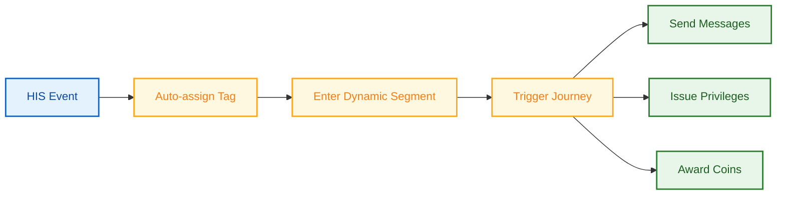

1. **HIS ส่ง Event** (เช่น "บันทึกการตั้งครรภ์", "IPD Discharge", "จอง Appointment")
2. **แพลตฟอร์ม Auto-assign Tag** ให้คนไข้ (เช่น `lifestage:prenatal_trimester_1`, `lifestage:post_surgical`, `lifestage:chronic_diabetes`)
3. **คนไข้เข้า Dynamic Segment** ที่กำหนดด้วย Tag + เงื่อนไขอื่น (เช่น "ฝากครรภ์ + ไตรมาสแรก + ยังไม่ได้ปรึกษาโภชนาการ")
4. **Segment Membership Trigger Journey** — คนไข้ได้รับข้อความ, สิทธิ์ และ Coin ที่เหมาะสมกับ Stage อัตโนมัติ

| Lifestage              | HIS Trigger                      | Tag ที่ Assign                                | Dynamic Segment                           | Journey Action                                                      |
| ---------------------- | -------------------------------- | --------------------------------------------- | ----------------------------------------- | ------------------------------------------------------------------- |
| **ก่อนนัดหมาย**        | จอง Appointment, อีก 3 วัน       | `upcoming_appointment`, `dept:{department}`   | "คนไข้จองแล้วยังไม่เตรียมตัว"             | คำแนะนำเตรียมตัว + Upsell Add-on Package                            |
| **หลัง Discharge**     | IPD Discharge                    | `lifestage:post_surgical`, `procedure:{type}` | "คนไข้ Discharge แล้วยังไม่จอง Follow-up" | Care Instruction → Day 7 Follow-up Reminder → Day 30 Recovery Offer |
| **ถึงเวลาตรวจประจำปี** | ตรวจครั้งล่าสุด > 11 เดือน       | `checkup_due`                                 | "สมาชิกที่ถึงเวลาตรวจสุขภาพ"              | Reminder + ลด 10% Checkup Package + Coin Incentive                  |
| **ฝากครรภ์**           | บันทึกการตั้งครรภ์ใน HIS         | `lifestage:prenatal`, `trimester:{N}`         | "คนไข้ฝากครรภ์ตามไตรมาส"                  | ตามไตรมาส: Checkup Package, โภชนาการ, เตรียมคลอด, แนะนำกุมารแพทย์   |
| **โรคเรื้อรัง**        | Diagnosis Tag (เบาหวาน, ความดัน) | `lifestage:chronic`, `condition:{type}`       | "คนไข้เรื้อรังใกล้ถึงเวลาเติมยา"          | Medication Refill Reminder, ตรวจรายไตรมาส, ส่วนลดร้านยา             |
| **คนไข้ใหม่**          | Visit แรกใน HIS                  | `lifecycle:new_patient`                       | "คนไข้ครั้งแรกที่ไม่กลับมาใน 30 วัน"      | Welcome Follow-up → แนะนำแผนก → Checkup Offer                       |

Lifestage ไม่ได้เป็นรายการตายตัว — ขยายได้ผ่าน Tag และ Segment เมื่อสมิติเวชเพิ่ม Care Pathway ใหม่ (เช่น Post-COVID Recovery, Elderly Wellness) ทีมสร้าง Tag ใหม่, กำหนด Segment และสร้าง Journey ไม่ต้องแก้ระบบ

**Persona Assignment:** สำหรับการจำแนกคนไข้ระยะยาว (เกินกว่า Transient Tag) Rocket Loyalty CRM Platform รองรับ **Persona Assignment** — Label เดียวต่อคนไข้ที่แทน Healthcare Profile หลัก (เช่น "Wellness Seeker", "Chronic Care", "Family Care", "Corporate Executive") Persona สามารถ Auto-assign โดย AI Decisioning ตาม Behavioral Pattern หรือ Marketing กำหนดเอง Persona ขับเคลื่อน Layout หน้าแรก (Part IV, 4.1), Privilege Eligibility และ Campaign Targeting

### TOR Coverage — Part III

| TOR Item | สถานะ                                          |
| -------- | ---------------------------------------------- |
| D1.1     | SCV + Dynamic Segmentation ✓                   |
| D1.2a    | Trigger-based Journey ✓                        |
| D1.2b    | Multi-channel Delivery พร้อม Personalization ✓ |
| D1.2c    | Campaign Performance Tracking ✓ (Part VI)      |
| D2       | Lifestage Rule ✓                               |

**เกินกว่า TOR:** AI Decisioning (ระดับบุคคล, Observe-Wait-Act, Guardrail), AI-driven Adaptive Survey Question, Journey-level Frequency Cap/Suppression, A/B Testing, Gradual Rollout

## Part IV: Omni-Channel Experience

*TOR Section E*

**คนไข้ใช้งานผ่าน 4 ประเภทช่องทาง — ทั้งหมดอ่านจาก Backend เดียว Wallet เดียว, Tier เดียว, Benefit ชุดเดียว สิ่งที่ต่างคือแต่ละช่องทาง Optimize เพื่ออะไร**

### Channel Capability Matrix

| ความสามารถ         | Well App                                                          | Website                  | LINE                  | E-Commerce    |
| ------------------ | ----------------------------------------------------------------- | ------------------------ | --------------------- | ------------- |
| Register / Login   | SSO                                                               | LINE OAuth + OTP         | LINE OAuth            | —             |
| ดู Coin & Tier     | ✓                                                                 | ✓                        | ✓                     | —             |
| Earn Coin          | ✓                                                                 | ✓                        | ✓                     | ✓             |
| Redeem Privilege   | ✓ Full                                                            | ✓ Full                   | ✓ Webview             | Code          |
| ซื้อ Package       | ✓ Full Commerce                                                   | ✓ Redirect ไป E-Commerce | ✓ เจ้าหน้าที่ส่งลิงก์ | ✓ Marketplace |
| Mission & Referral | ✓                                                                 | ✓                        | ✓ Webview             | —             |
| Notification       | App Push                                                          | Web Push                 | LINE Message          | —             |
| Multi-language     | TH, EN, JA, ZH — ภาษาเพิ่มเติม (เช่น Arabic) ไม่มีค่าใช้จ่ายเพิ่ม | เหมือนกัน                | เหมือนกัน             | —             |

### 4.1 Design Configuration — Homepage & Landing Page เฉพาะ Member Type

**Rocket Loyalty CRM Platform ใช้ระบบ Block-based Design Configuration แต่ละหน้า — Homepage, Landing Page, Partner Page — ประกอบจาก Building Block สำเร็จรูป Member Type ต่างกันเห็นหน้าที่ต่างกันโดยสิ้นเชิง โดยไม่ต้องแก้ Code**

#### ประเภท Building Block

| Block Type             | แสดงอะไร                                            | ตัวอย่างการใช้                            |
| ---------------------- | --------------------------------------------------- | ----------------------------------------- |
| **Hero Banner**        | ภาพ/วิดีโอเต็มจอพร้อม CTA                           | Seasonal Campaign, Flash Reward Countdown |
| **Coin Summary**       | Balance, Burn Rate, Expiry Countdown                | แสดงบน Homepage เสมอ                      |
| **Tier Status**        | Badge, Progress Bar, Preview Benefit ของ Tier ถัดไป | Engagement Tier Progress                  |
| **Privilege Carousel** | Scroll Privilege Card พร้อม Eligibility Badge       | Tier-specific Privilege Highlight         |
| **Package Spotlight**  | Health Package แนะนำพร้อมราคาและ Promo Badge        | Upsell เฉพาะแผนก                          |
| **Standing Benefit**   | ส่วนลดแบบใช้ไม่จำกัดที่ Active                      | VIP / Paid Membership Benefit Summary     |
| **Mission Progress**   | Mission ที่กำลังทำพร้อม Completion Bar              | Cross-department Engagement               |
| **Content Feed**       | บทความสุขภาพ, เคล็ดลับ, Content ที่ให้ Coin         | Personalize ตาม Department History        |
| **Partner Deal**       | Offer เฉพาะ Partner (Marriott, สายการบิน)           | เฉพาะ Exclusive Partner Member Type       |
| **Quick Action**       | ปุ่มลัด: Scan QR, ซื้อ Package, แนะนำเพื่อน         | Configure ตาม Member Type                 |
| **Corporate Badge**    | ชื่อบริษัท, Level, Benefit ตามสัญญา                 | เฉพาะ Corporate Member                    |
| **Referral Banner**    | CTA แนะนำเพื่อนพร้อมสถิติ Reward ปัจจุบัน           | Engagement Tier Member                    |

#### Homepage ที่ต่างกันตาม Member Type

Admin Configure **Page Layout ต่อ Member Type** โดยเลือกและจัด Block เมื่อคนไข้ที่มีหลาย Member Type Login ระบบ Resolve Layout ที่ใช้ด้วย Precedence Logic เดียวกับ Benefit Resolution

| Member Type             | Homepage Composition                                                                                       |
| ----------------------- | ---------------------------------------------------------------------------------------------------------- |
| **VIP (Connex)**        | Hero (VIP Exclusive) → Standing Benefit → Privilege Carousel (VIP-only) → Package Spotlight → Content Feed |
| **Corporate**           | Corporate Badge → Standing Benefit → Privilege Carousel → Quick Action → Content Feed                      |
| **Paid (Divine Elite)** | Tier Status → Standing Benefit → Elective Selection Reminder → Mission Progress → Package Spotlight        |
| **Engagement (Gold)**   | Coin Summary → Tier Progress → Privilege Carousel → Mission Progress → Referral Banner → Content Feed      |
| **Exclusive Partner**   | Partner Deal → Coin Summary → Privilege Carousel → Content Feed                                            |
| **สมาชิกใหม่ (Silver)** | Welcome Hero → Quick Action → Package Spotlight → Mission List → Referral Banner                           |

**Landing Page** (เฉพาะ Campaign, Partner, ฤดูกาล) ใช้ Block System เดียวกัน Marketing สร้าง Landing Page โดยเลือก Block, ตั้งเงื่อนไข Eligibility แล้ว Publish — ไม่ต้อง Develop

**Admin Workflow:** เลือกหน้า → เลือก Block จาก Library → จัดลำดับ → ตั้ง Eligibility (Member Type ไหนเห็น Layout นี้) → Preview → Publish เปลี่ยนแปลงมีผลทันที

### 4.2 Well by Samitivej — Full Loop

*TOR E1*

Well คือ Frontend หลัก Rocket Loyalty CRM Platform คือ Backend ทุก Loyalty Feature ให้บริการผ่าน API และ Embedded Webview

**SSO:** Well Authenticate → ส่ง Token → ระบบของเราตรวจสอบ → สร้าง Session ไม่ต้อง Login ซ้ำ

**Identity Architecture:** Primary Matching Key คือ **บัตรประชาชน / Passport** และ **เบอร์โทร (OTP)** HN คือ Unique Identifier เมื่อสร้างที่โรงพยาบาลแล้ว Well ID เป็น Interim สำหรับคนไข้ที่ยังไม่เคยมาโรงพยาบาล LINE ID เก็บไว้สำหรับ Linking ในอนาคต สุขุมวิทและศรีนครินทร์ใช้ HN ร่วม สาขาอื่นมี HN แยก

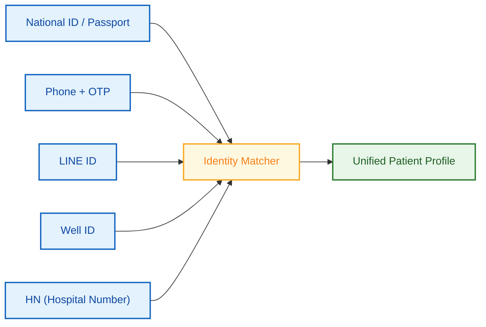

| สถานการณ์การสมัคร               | สิ่งที่เกิดขึ้น                                                 |
| ------------------------------- | --------------------------------------------------------------- |
| คนไข้ใช้ Well ก่อน              | มี HN → SSO → CRM User เชื่อมกับ HN                             |
| สมัครผ่าน LINE/Website ก่อน     | CRM User มี LINE ID → มาโรงพยาบาลภายหลัง → สร้าง HN → เชื่อมกัน |
| พนักงาน Corporate (ยังไม่เคยมา) | Roster Import → CRM User → มาครั้งแรก → สร้าง HN → เชื่อมกัน    |
| ยังไม่มี HN หรือ Well ID        | LINE ID ถูกเก็บ → Linking เมื่อสร้าง HN ในอนาคต                 |

### 4.3–4.5 Website, LINE, E-Commerce

**Website** *(TOR E2):* เพิ่มหน้า Loyalty บนเว็บไซต์โรงพยาบาลเดิม Login, Wallet, Privilege, Article Tracking (JS Snippet บนบทความเดิม), Consent เริ่มต้น 2 สาขา; Phase 3 เพิ่มหน้า Loyalty บนเว็บไซต์สาขาอื่น (เช่น ชลบุรี)

**LINE** *(TOR E3):* LIFF Web App ใน LINE Register, ดูยอด, Redeem ผ่าน Webview เริ่มต้น 2 สาขา LINE OA

**E-Commerce** *(TOR E4):* Shopee (Webhook ทำงานแล้ว), Lazada, LINE MyShop สะสม Coin จากการซื้อ Tier Benefit มีผล Marketplace Privilege Flow: Email Voucher → Hospital Verification → Privilege ใน Wallet

### TOR Coverage — Part IV

| TOR Item  | สถานะ            |
| --------- | ---------------- |
| E1.1–E1.8 | Well Full Loop ✓ |
| E2.1–E2.9 | Website ✓        |
| E3.1–E3.4 | LINE ✓           |
| E4.1–E4.3 | E-Commerce ✓     |

**เกินกว่า TOR:** ระบบ Block-based Design Configuration สำหรับ Homepage และ Landing Page เฉพาะ Member Type

## Part V: Back Office Console

*TOR Section F*

**Back Office Console คือที่ที่ทีม Marketing, Operation และ Clinical ของสมิติเวชจัดการ Loyalty Program ทั้งหมด — ตั้งแต่ Configure Coin Rule, สร้าง Package, จัดการ Member Contract ไปจนถึง Monitor Approval Queue ด้านล่างคือ Admin Experience หลักจัดตามฟังก์ชัน**

---

### 5.1 Earn Studio — Coin Rule Configuration

*TOR B2.4, F1.4*

Earn Studio คือ Visual Interface สำหรับกำหนดวิธีการสะสม Coin ของทั้งโปรแกรม Marketing Configure Rule ที่นี่ Engine ประมวลผลแบบ Real-time ทุกครั้งที่มี Event ที่ตรงเงื่อนไข

**Rule Builder Workflow:**

1. **เลือก Earn Trigger:** Purchase Event, Activity Event, Form Completion, Referral, Marketplace Order
2. **กำหนดเงื่อนไข:** สาขา, แผนก, Member Type, Tier, ช่วงเวลา, ยอดขั้นต่ำ
3. **ตั้ง Earn Calculation:** Base Rate (Coin ต่อ THB), Multiplier, Fixed Bonus หรือ Tiered (เช่น 5,000 บาทแรก 1×, ถัดไป 1.5×)
4. **Configure Stacking:** เมื่อหลาย Rule ตรงเงื่อนไข ทบกันหรือใช้ตัวสูงสุด?
5. **ตั้ง Safeguard:** Coin สูงสุดต่อ Transaction, ต่อคนไข้ต่อวัน, ต่อ Campaign Budget, Delayed Award Period
6. **Approval:** Maker-checker สำหรับ Rule Change ที่กระทบ >1,000 คนไข้ หรือแก้ Base Rate

**Admin เห็น:** Rule List พร้อม Status (Active/Draft/Expired), Patient Count ที่คาดว่าจะกระทบ, Campaign ที่เกี่ยวข้อง, แก้ไขล่าสุดโดยใคร, Approval Status

**ตัวอย่าง Configuration:**

| Rule               | Trigger                | เงื่อนไข              | Calculation              | Safeguard                |
| ------------------ | ---------------------- | --------------------- | ------------------------ | ------------------------ |
| Base Hospital Earn | HIS Purchase Event     | สมาชิกทุกคน ทุกสาขา   | 1 Coin ต่อ 100 บาท       | สูงสุด 5,000 Coin/วัน    |
| Gold Tier Bonus    | HIS Purchase Event     | Gold+ Tier            | 1.5× Multiplier บน Base  | Stack กับ Base           |
| Dermatology Promo  | HIS Visit Event        | แผนกผิวหนัง พ.ค. 2026 | +50 Bonus Coin ต่อ Visit | ไม่เกิน 3 ต่อคนไข้       |
| Weekend Surge      | HIS Purchase Event     | เสาร์–อาทิตย์เท่านั้น | 2× Multiplier            | Non-stack (ใช้ตัวสูงสุด) |
| Article Engagement | Website Activity Event | สมาชิกที่ Login       | 5 Coin ต่อบทความ         | ไม่เกิน 5 บทความ/วัน     |

### 5.2 Privilege Management

*TOR F1.1, F1.2, B2.1–B2.3, B2.6*

Privilege Management ครอบคลุม Lifecycle ครบ: สร้าง, Configure Eligibility, ตั้งราคา, จัดการ Stock, Scheduling, Code Management และติดตาม Issuance

**การสร้าง Privilege:**

1. **ข้อมูลพื้นฐาน:** ชื่อ (Multi-language), คำอธิบาย, ภาพ, หมวด (Hospital Service / Partner Reward / Lifestyle / Flash)
2. **ประเภท:** Single-use, Multi-use (กำหนดจำนวนครั้ง) หรือ Unlimited (Standing Benefit → ส่งไปยัง Standing Benefit Engine)
3. **Fulfillment:** Digital (QR/Barcode), Shipping (ของจัดส่ง), Pickup (เคาน์เตอร์โรงพยาบาล), Printed (PDF)
4. **Eligibility:** ใครเห็นและรับ Privilege นี้ได้ — ตาม Tier, Member Type, Persona, Tag, Segment หรือรายชื่อเฉพาะ
5. **Coin Pricing:** Dynamic ตามมิติ — เช่น Gold: 400 Coin, Platinum: 250 Coin หรือฟรี (Auto-issued, Admin-only)
6. **Stock:** Total Quantity, Per-patient Limit, Per-day Limit
7. **Scheduling:** Start/End Date, Visibility Window, Flash Reward Countdown
8. **Promo Code:** Single Pool หรือ Bulk Import จาก Partner (CSV Upload พร้อม Partner Attribution)
9. **Approval:** Manager Approval ก่อน Privilege ถูก Publish

**Bulk Operation:** Import Partner Promo Code (10,000+ Code ใน CSV เดียว), Batch Issuance ให้ Segment (เช่น ออกคูปองวันเกิดให้สมาชิกที่เกิดเดือนมิถุนายน), Clone Privilege เป็น Template

### 5.3 Package Builder

*TOR F3.1–F3.2*

Package Builder ให้ Marketing ประกอบ Health Package จาก Privilege แต่ละตัว แล้ว Publish ขึ้น Online Store (Well App, Hospital E-Commerce)

**การสร้าง Package:**

1. **ข้อมูล Package:** ชื่อ, คำอธิบาย, ภาพ, หมวด (ตรวจสุขภาพ / ทันตกรรม / กายภาพ / ฯลฯ), สาขาที่ให้บริการ
2. **ราคา:** ราคาปกติ, ราคาโปรโมชัน, Coin Discount Allowance (เช่น ใช้ Coin ลดได้ไม่เกิน 2,000 Coin)
3. **Mandatory Privilege (คูปองบังคับ):** เลือกจาก Privilege Catalog → ออกอัตโนมัติเมื่อซื้อ ตัวอย่าง: 1× ตรวจเลือด + 1× X-ray + 3× ร้านกาแฟ 100 บาท
4. **Elective Privilege (คูปองเลือก):** กำหนด Pool Size และ Pick Count ตัวอย่าง: เลือก 3 จาก 8 ตัวเลือก Wellness
5. **Standing Benefit:** กำหนดส่วนลดแบบใช้ไม่จำกัดตามระยะเวลา ที่เปิดใช้เมื่อซื้อ ตัวอย่าง: ลดร้านยา 10% เป็นเวลา 1 ปี
6. **Eligibility:** Member Type / Tier ไหนซื้อได้, Visibility Rule
7. **Channel Availability:** Well App, Hospital E-Commerce, เจ้าหน้าที่ช่วย (เคาน์เตอร์), LINE (เจ้าหน้าที่ส่งลิงก์)
8. **Scheduling:** Sale Period, Early Access สำหรับ Tier สูง, Stock Limit
9. **Auto-Issuance Rule:** เมื่อ Payment Confirm → ออก Mandatory Privilege ทั้งหมด + เปิดใช้ Standing Benefit + เปิดให้คนไข้เลือก Elective

**Package Catalog View:** Card พร้อมราคา, Promo Badge, Branch Tag, Stock คงเหลือ, Status Active/Draft/Expired

### 5.4 Member Type & Contract Management

*TOR C1–C6 (Back Office), F1.3*

Admin Interface สำหรับจัดการ 6 Member Type — สร้าง Contract, กำหนด Benefit Level, Import Roster และติดตาม Utilization

**การสร้าง Contract (Corporate / Insurance / Partner):**

1. **ข้อมูล Contract:** ชื่อบริษัท/บริษัทประกัน/Partner, ผู้ประสานงาน, Effective Date, Status (Active/Suspended/Expired)
2. **กำหนด Level:** Executive / General / Other — แต่ละ Level มี Benefit Package ของตัวเอง
3. **Benefit Mapping ต่อ Level:**
  - Consumable Privilege: เลือกจาก Privilege Catalog (เช่น ปรึกษาแพทย์เฉพาะทาง 5×, จอดรถ 3×)
  - Standing Benefit: กำหนดส่วนลดแบบใช้ไม่จำกัด (เช่น ลด OPD 25% สำหรับ Executive Level)
  - Coin Earning: Custom Earn Rate ต่อ Contract ถ้ามี
4. **Roster Management:** Upload CSV (รายชื่อพนักงาน พร้อมชื่อ, เบอร์โทร, บัตรประชาชน, Level) → Batch Validation → Assignment พร้อม Effective Date Delta Import สำหรับอัปเดตรายไตรมาส (พนักงานใหม่ → Assign, ลาออก → Deactivate)
5. **Approval:** Roster Change ที่กระทบ >50 คนต้อง Manager Approval

**VIP Assignment:**

- เลือกคนไข้ → Assign VIP Level (Connex / Cheva / BDMS) → ระบบออก Consumable Privilege อัตโนมัติ + เปิดใช้ Standing Benefit
- โรงพยาบาลเป็นผู้กำหนด (Admin Assign) ไม่ใช่ Self-service

**Paid Membership Configuration:**

- กำหนด Plan (เช่น Divine Elite) → ตั้งราคา, Mandatory Privilege, Elective Pool, Standing Benefit, ระยะเวลา
- Plan เชื่อมกับ Payment Gateway (คนไข้ซื้อผ่าน Well App หรือเคาน์เตอร์)

**Contract Dashboard:** รายการ Active Contract, จำนวนสมาชิกต่อ Level, Utilization Rate, สัญญาที่ใกล้ต่ออายุ, จำนวนที่ Deactivate

### 5.5 Marketing Automation Console — Campaign & Journey Management

*TOR F1.1–F1.3*

**Back Office Interface สำหรับ Marketing Automation Engine ที่อธิบายใน Part III Marketer ใช้ Console นี้สร้าง Campaign, สร้าง Automated Journey, กำหนดกลุ่มเป้าหมาย และจัดการ Approval Workflow ทั้งหมด — โดยไม่ต้องอาศัย Developer**

**การสร้าง Campaign:**

1. **กำหนด Campaign:** ชื่อ, วัตถุประสงค์, ระยะเวลา, งบประมาณ
2. **กลุ่มเป้าหมาย:** เลือก Segment ที่มีอยู่ หรือสร้าง Inline (Dynamic Rule หรือ Static Import)
3. **Privilege ที่เกี่ยวข้อง:** เลือกหรือสร้าง Privilege ที่ออกเป็นส่วนหนึ่งของ Campaign
4. **Journey Attachment:** เชื่อมกับ Automated Journey (Welcome, Post-visit, Win-back) หรือทำเป็น One-time Blast
5. **Approval:** Campaign Launch ต้อง Manager Sign-off

**Journey Builder:** Visual Drag-and-drop Interface สำหรับ Multi-step Automated Flow Node: Trigger, Condition (แยกตาม Patient Data), Wait (ตามเวลาหรือ Event), Message (LINE / SMS / Email / Push), Action (ให้ Coin, ออก Privilege, ติด Tag) แต่ละ Journey มี Built-in Frequency Cap, Suppression Rule และ Performance Reporting นี่คือ Operational Interface สำหรับ Journey ที่ออกแบบใน Part III, Section 3.2

**Approval Queue:** Pending Action ทั้งหมดจากทุกส่วนของ Console — Privilege Launch, Campaign Activation, Coin Rule Change, Roster Import, Package Publish — ใน Dashboard เดียว Approve/Reject พร้อม Comment มี Audit Trail ครบ

### 5.6 Mission & Gamification Management

*TOR B1.3b*

**Mission Builder:**

| Setting              | ตัวเลือก                                                              |
| -------------------- | --------------------------------------------------------------------- |
| **ประเภท**           | Standard (เป้าเดียว) หรือ Milestone (หลาย Level พร้อม Overflow)       |
| **เงื่อนไข**         | ซื้อที่แผนก X, ทำ Form สำเร็จ, แนะนำเพื่อน, มา N ครั้ง — AND/OR Logic |
| **Reward ต่อ Level** | Coin, Privilege, Tag Assignment, Tier Boost                           |
| **Progress Source**  | Purchase Event, Activity Event, Form Submission, Referral Completion  |
| **การแสดงผล**        | Progress Bar, Level Indicator, Reward Preview                         |
| **Scheduling**       | Start/End Date, Recurring (Reset รายเดือน), Always-on                 |

**ตัวอย่าง Milestone:** "Health Champion" — Level 1: ตรวจสุขภาพ 3 ครั้ง → 200 Coin Level 2: 5 ครั้ง → 500 Coin + Café Voucher Level 3: 10 ครั้ง → 1,000 Coin + Spa Privilege Overflow: คนไข้ทำ 6 ครั้ง → Level 1 สำเร็จอัตโนมัติที่ 3, อีก 3 นับต่อที่ Level 2 (Progress 3/5)

### 5.7 Referral Program Management

**Configuration:**

| Setting             | รายละเอียด                                                                               |
| ------------------- | ---------------------------------------------------------------------------------------- |
| **Invitee Reward**  | Configure ได้: Coin, Privilege หรือทั้งคู่ เมื่อสมัครสำเร็จ                              |
| **Inviter Reward**  | Configure ได้: Coin, Privilege หรือทั้งคู่ — Trigger เมื่อเพื่อนมาใช้บริการ/ซื้อครั้งแรก |
| **Limit**           | จำนวน Referral สูงสุดต่อผู้เชิญต่อช่วงเวลา, งบประมาณรวม                                  |
| **Sharing Channel** | LINE Share, Facebook Share, Copy Link, QR Code                                           |
| **Code Format**     | Auto-generated (Lazy Creation) หรือ Custom Prefix                                        |
| **Tracking**        | Referral Funnel: Code Shared → Registration → First Visit → Reward Issued                |

### 5.8 Exclusive Partner Landing Page

*TOR F2*

Marketing สร้าง Landing Page เฉพาะ Partner โดยไม่ต้อง Develop Page Builder ใช้ Block System เดียวกับ Consumer Homepage (Part IV, 4.1)

| Setting               | รายละเอียด                                                             |
| --------------------- | ---------------------------------------------------------------------- |
| **Page Layout**       | เลือก Block: Hero Banner, Partner Deal, Standing Benefit, Coin Summary |
| **Eligibility**       | Content แสดงตาม Partner Level (Gold vs Platinum เห็น Deal ต่างกัน)     |
| **Privilege Mapping** | Marketing เลือก Privilege จาก Central Pool → Assign ต่อ Deal Slot      |
| **Partner Activity**  | Partner ส่ง Event ผ่าน API → Level Update → หน้า Auto-refresh          |
| **Match API**         | Partner Query "User คนนี้มีสิทธิ์อะไร?" → ระบบคืน Benefit              |
| **Approval**          | Partner Page ใหม่ต้อง Manager Approval ก่อน Publish                    |

### 5.9 Cross-Cutting Console Feature

| Feature                      | รายละเอียด                                                                                                                   |
| ---------------------------- | ---------------------------------------------------------------------------------------------------------------------------- |
| **Role-based Access**        | Superadmin, Marketing Manager, Department Admin, Viewer — แต่ละ Role เห็นเฉพาะสิ่งที่ได้รับอนุญาต                            |
| **MFA**                      | บังคับสำหรับ Admin Account ทุกบัญชี                                                                                          |
| **Maker-checker**            | Admin 2 คน Sign-off สำหรับ: Bulk Point Adjustment, Earn Rule Change, Privilege Extension, Manual Override, Roster Import >50 |
| **Audit Trail**              | ทุก Action ถูกบันทึก: ใคร, เมื่อไร, ทำอะไร, เหตุผล, สถานะก่อน/หลัง ค้นหาและ Export ได้                                       |
| **Form Builder**             | แบบสอบถามพร้อม Conditional Logic, NPS, Rating, Open Text — คำตอบส่งเข้า Patient Profile และ Trigger Journey                  |
| **Multi-language Admin**     | Console ทำงานภาษาไทย Content ของ Privilege/Campaign จัดการได้ใน TH, EN, JA, ZH (ภาษาเพิ่มเติมไม่มีค่าใช้จ่ายเพิ่ม)           |
| **Department-scoped Access** | ทีมส่วนกลางสร้าง Master Template ทีมแผนก (50+ แผนก) เลือกจาก Pool แล้วออกให้คนไข้ภายในขอบเขตของตน                            |

### TOR Coverage — Part V

| TOR Item            | สถานะ                                                              |
| ------------------- | ------------------------------------------------------------------ |
| F1.1–F1.7           | Console ครบพร้อม Campaign, Privilege, Coin Rule, Approval, Audit ✓ |
| F2.1–F2.3           | Partner Landing Page พร้อม Activity API + Match API ✓              |
| F3.1–F3.2           | Health Package Builder + Online Store (ดู Part I, 1.6 ด้วย) ✓      |
| F4.1–F4.3           | Reward Pool พร้อม 2,000+ SKU (ย้ายไป Part XI — Reward Sourcing) ✓  |
| B1.3b               | Mission & Gamification พร้อม Milestone Overflow ✓                  |
| B2.4                | Earn Studio (Coin Rule Configuration) ✓                            |
| C1–C6 (Back Office) | Member Type & Contract Management ✓                                |

**เกินกว่า TOR:** Milestone Mission พร้อม Overflow, Visual Earn Rule Builder (Earn Studio), Package Builder พร้อม Mandatory/Elective/Standing Benefit Composition, Flash Reward Management, Partner Activity API สำหรับ Auto-upgrade

## Part VI: Dashboards & Analytics

*TOR B2.5, F1.5, F1.6*

**Rocket Loyalty CRM Platform มี Standard Dashboard สำหรับ Operation รายวัน พร้อม Custom Dashboard ได้สูงสุด 20 Dashboard ที่ออกแบบตามความต้องการของสมิติเวช — รวมอยู่ในราคาโดยไม่มีค่าใช้จ่ายเพิ่มเติม**

### Standard Dashboard

| #   | Dashboard                  | Key Metric                                                                                |
| --- | -------------------------- | ----------------------------------------------------------------------------------------- |
| 1   | **Member Overview**        | สมาชิกทั้งหมด, Active vs Inactive, สมัครตามช่องทาง, กระจายตาม Member Type, ใหม่ vs กลับมา |
| 2   | **Coin Economy**           | Earn / Burn / Expire, Net Circulation, Earn ตามช่องทาง, Burn ตามหมวด, Average Balance     |
| 3   | **Privilege & Redemption** | Top Redeem, Redemption ตาม Tier/Member Type, Stock Level, Partner Performance             |
| 4   | **Package Sales**          | ตามประเภท, สาขา, ช่องทาง; Conversion Funnel; Revenue Trend; Average Order Value           |
| 5   | **Tier Movement**          | Upgrade/Downgrade, Tier Distribution, At-risk Member, Tier Velocity                       |
| 6   | **Campaign Performance**   | ต่อ Campaign: Reach, Open, Click, Conversion; A/B Result; Cost-per-Acquisition            |
| 7   | **Department Usage**       | Visit ตามแผนก, Cross-department Usage, Coupon Usage ตามแผนก; Cross-sell Path              |
| 8   | **Corporate & Insurance**  | Usage ตามบริษัท/ประกัน/Level, Utilization Rate, Renewal Indicator                         |
| 9   | **Entitlement Tracking**   | Active Entitlement, Avg Usage Rate, ใกล้หมดอายุ, กระจายตามสาขา                            |
| 10  | **Marketing Automation**   | Journey Completion/Drop-off, Message Delivery/Open/Click ตามช่องทาง, Best Journey         |

### Insight เฉพาะสมิติเวช

- **Cross-Department Flow:** "จาก 5,000 คนไข้ตรวจสุขภาพไตรมาสนี้ 23% ใช้ทันตกรรมด้วย, 15% ผิวหนัง, 8% จักษุ Top Cross-sell Path: ตรวจสุขภาพ → ทันตกรรม → ผิวหนัง"
- **Package Conversion ตามช่องทาง:** "Executive Checkup Conversion: Well App 4.2%, Hospital E-Commerce 3.1%, Shopee 1.8%"
- **Corporate Contract Health:** "CRC: 85% Activation, 320 OPD Visit, 45 Lounge Pass AIA: 92% Claim Rate, Top Benefit: OPD Discount"

### Custom Dashboard (สูงสุด 20 Dashboard รวมอยู่ในราคา)

ออกแบบตาม Specification ของสมิติเวช: Patient Lifetime Value, Seasonal Pattern, Branch Comparison, Partner Page Performance, VIP Utilization — ตามที่ธุรกิจต้องการ

ทุก Dashboard: Date Filter, Drill-down, Scheduled Auto-generation, Excel/CSV Export

### Rocket MCP — AI-Powered Data Assistant

สำหรับผู้ใช้งานที่มีสิทธิ์สูง (Marketing Director, Superadmin) Rocket Loyalty CRM Platform มี **Rocket MCP** — AI Assistant ที่ตอบคำถามเกี่ยวกับข้อมูล Loyalty เป็นภาษาธรรมชาติใน Admin Console โดยตรง

**ตัวอย่างคำถาม:**

- "สมาชิก Gold กี่คนแลก Privilege เดือนที่แล้ว?"
- "แผนกไหนมี Cross-sell Rate สูงสุด?"
- "แสดง Top 10 Corporate Contract ตาม Utilization"
- "ระยะเวลาเฉลี่ยจากสมัครสมาชิกถึง Visit แรกเท่าไร?"

Rocket MCP Query Analytics Layer แล้วคืนคำตอบพร้อมข้อมูลสนับสนุน — ไม่ต้องเขียน SQL ไม่ต้องสร้าง Report ทำให้ผู้บริหารเข้าถึง Operational Intelligence ได้ทันทีโดยไม่ต้องรอ Scheduled Report

## Part VII: สถาปัตยกรรมทางเทคนิค & Security

*TOR Section G*

### System Architecture

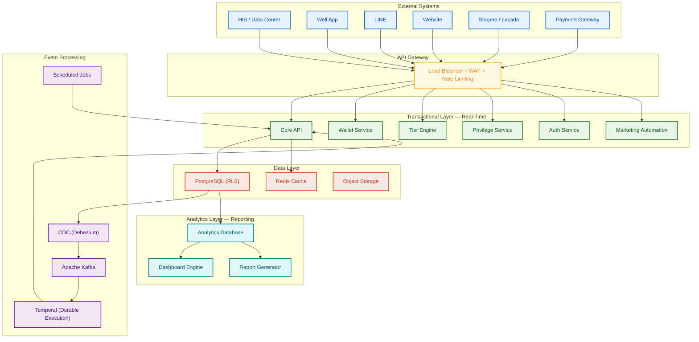

### การแบ่ง 2 Layer

| Layer             | วัตถุประสงค์                               | Performance                         |
| ----------------- | ------------------------------------------ | ----------------------------------- |
| **Transactional** | Real-time: Earn, Burn, Redeem, Eligibility | < 100ms Read, < 500ms Write         |
| **Analytics**     | Dashboard, Report, Trend Analysis          | ทำงานอิสระ — ไม่กระทบ Transactional |

### Core Technology Stack

| ความสามารถ                     | ความหมาย                                                                                                                                                                              | ตัวอย่าง                                                                                                                                    |
| ------------------------------ | ------------------------------------------------------------------------------------------------------------------------------------------------------------------------------------- | ------------------------------------------------------------------------------------------------------------------------------------------- |
| **Real-time Event Processing** | ทุก Action Trigger Downstream Reaction ทันที — ไม่มี Overnight Batch Job                                                                                                              | คนไข้ชำระเงิน → Coin ปรากฏใน Wallet ภายใน 1 วินาที                                                                                          |
| **In-memory Caching**          | ข้อมูลที่อ่านบ่อย (Catalog, Rule, Tier Definition) ให้บริการภายใน 50ms Eligibility คำนวณ Live เพื่อป้องกัน Stale Data ที่ Billing                                                     | HIS ถาม "ได้ส่วนลดเท่าไร?" → ตอบภายใน 50ms                                                                                                  |
| **ข้อมูลเป็นปัจจุบันเสมอ**     | Segment, Dashboard และ Eligibility Update ต่อเนื่องตามข้อมูลที่เปลี่ยน                                                                                                                | คนไข้ Upgrade เป็น Gold → ปรากฏใน Gold Segment ทันที                                                                                        |
| **Durable Execution**          | Workflow Orchestration ที่ใช้โดย Netflix, Stripe และ Uber Operation หลายขั้นตอนที่กินเวลาหลายวันหรือสัปดาห์รับประกันว่าจะทำงานจนเสร็จ — แม้มี Server Restart, Deployment หรือ Failure | Birthday Journey 30 วันทำงานครบ คนไข้ที่ชำระเงินได้รับ Package เสมอ Entitlement 100,000 รายการหมดอายุถูกประมวลผลครบ — ไม่มีทำครึ่ง ๆ กลาง ๆ |

### Data Isolation & Multi-Tenant Architecture

ข้อมูลของแต่ละลูกค้าแยกกันอย่างสมบูรณ์ผ่าน Database Sharding และ Row-Level Security (RLS) ข้อมูลของสมิติเวชอยู่ใน Dedicated Shard — แยกทาง Physical จากลูกค้าอื่นในระดับ Infrastructure แม้ใน Application Layer ทุก Query ถูก Scope ด้วย RLS Policy ทำให้ไม่มี Code Path ที่สามารถเข้าถึงข้อมูลของลูกค้าอื่นโดยบังเอิญ

นี่คือ Isolation Model เดียวกับที่ Enterprise SaaS Platform ใช้ในอุตสาหกรรมที่มีการกำกับดูแล (Healthcare, Financial Services) ตอบโจทย์ทั้ง Data Sovereignty และ Audit Compliance — ข้อมูลของสมิติเวชไม่ปนกับ Tenant อื่น

### Performance Guarantee

| Metric                     | เป้าหมาย                                       |
| -------------------------- | ---------------------------------------------- |
| System Uptime              | **99.9%**                                      |
| Concurrent Active User     | **10,000+**                                    |
| Wallet / Eligibility Query | **< 50ms**                                     |
| Coin Earn End-to-End       | **< 1 วินาที**                                 |
| Flash Reward Concurrency   | **10,000+** User, Fair First-come-first-served |

### Security

Defense-in-depth 7 ชั้น — ทุก Request ผ่าน Perimeter, Application และ Data Security ก่อนถึง Database โดย Monitoring ครอบคลุมทุกชั้นตลอดเวลา

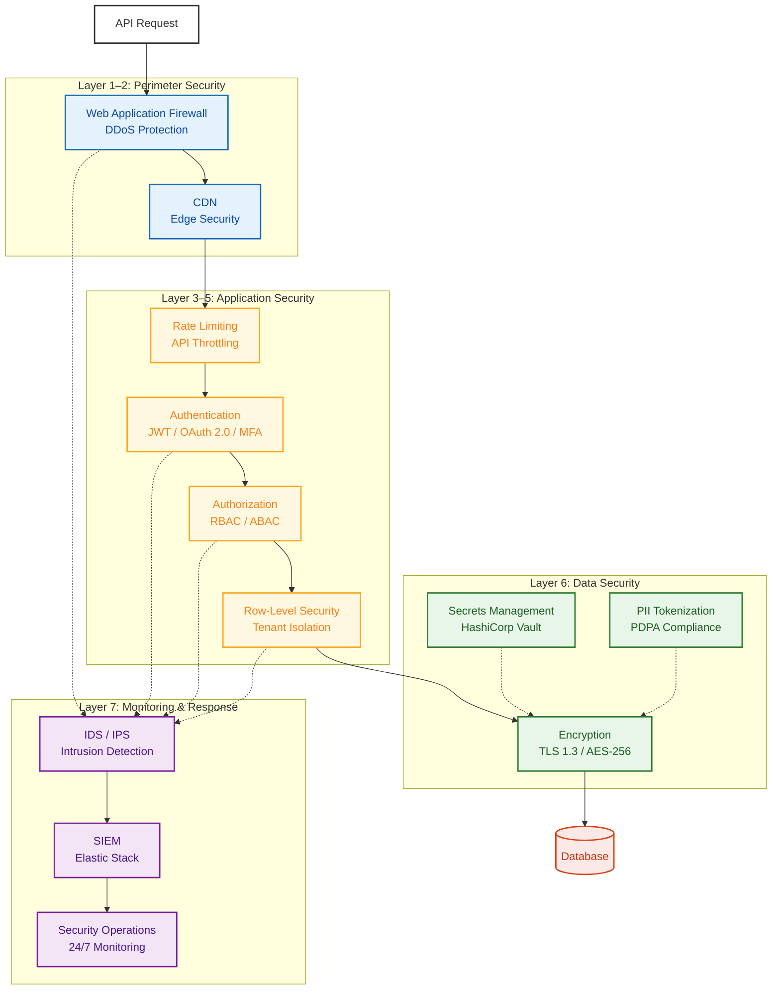

| Layer              | การป้องกัน                                                                |
| ------------------ | ------------------------------------------------------------------------- |
| **Perimeter**      | WAF, DDoS Protection, CDN Edge Security, TLS 1.3                          |
| **Rate Control**   | API Throttling, Velocity Check, Anti-abuse                                |
| **Authentication** | JWT, OAuth 2.0, MFA สำหรับ Admin                                          |
| **Authorization**  | Row-Level Security, RBAC, API Key Scoping                                 |
| **Data**           | AES-256 At Rest, TLS In Transit, PII Tokenization, Secrets Management     |
| **Fraud**          | Idempotency Key, Anti-double-spend, Rate Limiting, Velocity Check         |
| **Monitoring**     | IDS/IPS, SIEM (Elastic Stack), Security Operations 24/7                   |
| **Audit**          | ทุก Mutation ถูกบันทึก: Actor, Timestamp, Action, Before/After            |
| **PDPA**           | Consent ต่อช่องทาง/ต่อวัตถุประสงค์, Data Subject Access, Right to Erasure |

## Part VIII: Integration Architecture & Open API

### Integration Scenario

#### Scenario 1: Coin Earning จาก Hospital Visit

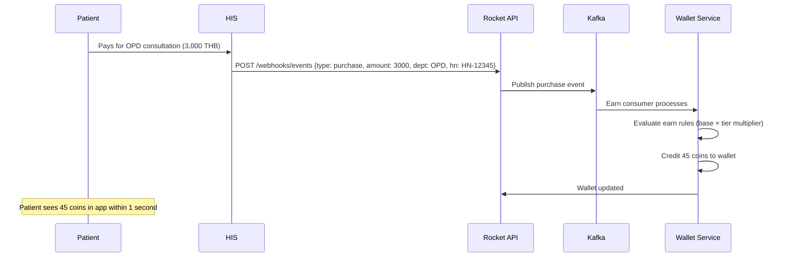

#### Scenario 2: Eligibility Query ที่ Billing Counter

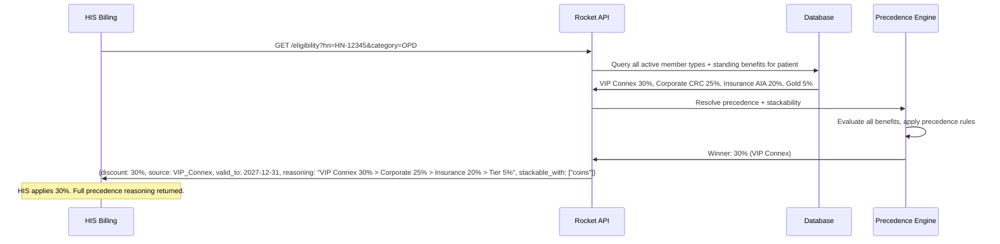

**ทำไมไม่ Cache?** Eligibility คำนวณ Live ทุก Query — ข้อมูล Benefit ของคนไข้เปลี่ยนบ่อย (Assign Member Type ใหม่, Privilege หมดอายุ, Tier Upgrade) การ Cache Eligibility รายบุคคลเสี่ยงต่อ Stale Data Query ถูก Optimize ที่ Database Level ด้วย Indexed Lookup คืนค่าภายใน 50ms โดยไม่ต้อง Cache

**สิ่งที่ Response มี:**

- **ส่วนลดที่ชนะ** พร้อม Source และ Validity
- **Precedence Reasoning** — รายการจัดลำดับของ Benefit ทั้งหมดที่ประเมิน อธิบายเหตุผลที่ตัวชนะถูกเลือก
- **Stackability** — Benefit ประเภทไหนใช้ร่วมกับส่วนลดที่ชนะสำหรับ Package/Service เฉพาะนี้ได้
- **Standing Benefit ทั้งหมดที่ Active** — HIS ได้ภาพครบ ไม่ใช่แค่ตัวชนะ

#### Scenario 3: Privilege Mark-Use (เจ้าหน้าที่ Scan QR)

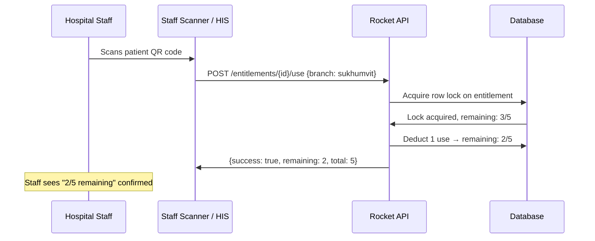

#### Scenario 4: Package Purchase ผ่าน Well App

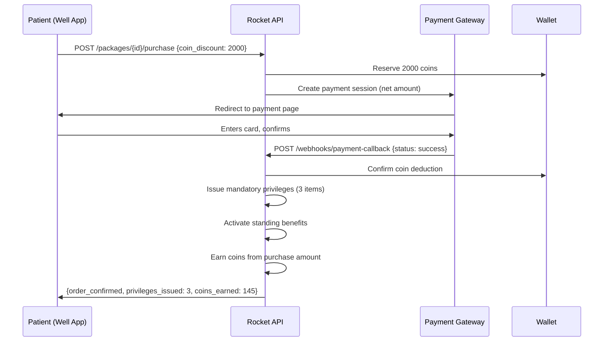

#### Scenario 5: Marketplace Order → Hospital Verification → eCoupon Issuance

Marketplace Flow เดิมยังคงเหมือนเดิม: คนไข้ได้ Email Voucher จาก Shopee/Lazada ระบบ Loyalty เพิ่ม Digital Layer — เมื่อโรงพยาบาล Verify OrderSet และสร้าง HN แล้ว eCoupon (Privilege) จะออกเข้า Wallet ของคนไข้โดยอัตโนมัติ

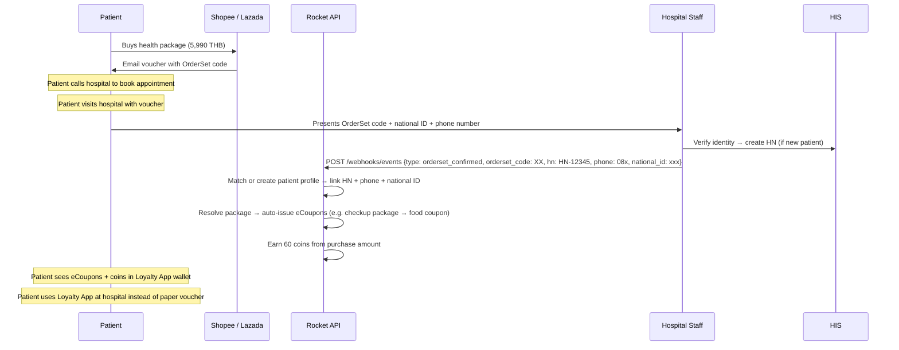

**สอดคล้องกับ Process ปัจจุบัน:** Email Voucher Journey เดิมยังคงอยู่ (ซื้อบน Marketplace → ได้ Email Voucher → โทรจอง → มาโรงพยาบาล) Loyalty Platform เพิ่มมูลค่า *หลัง* Hospital Verification: eCoupon ปรากฏใน Digital Wallet ของคนไข้, Coin ถูกสะสม และสิทธิ์ในอนาคตติดตามได้แบบ Digital เมื่อเวลาผ่านไป Paper Voucher จะไม่จำเป็นเพราะคนไข้ใช้แอปแทน

#### Scenario 6: Marketing Automation Trigger

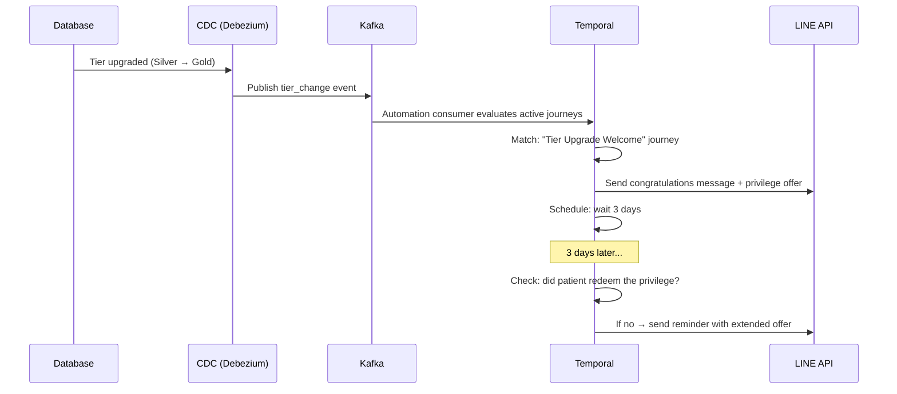

#### Scenario 7: Partner Member Import & Level Update

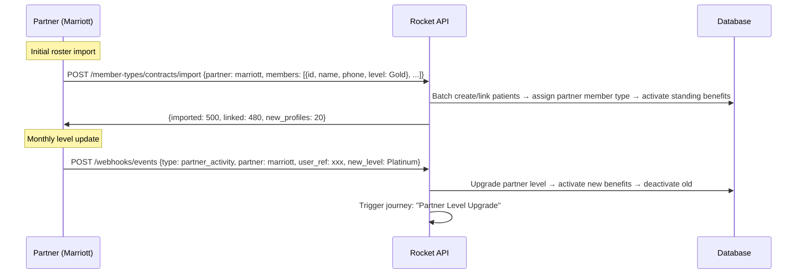

#### Scenario 8: Package Assignment Change (Extend, Branch Transfer, Swap)

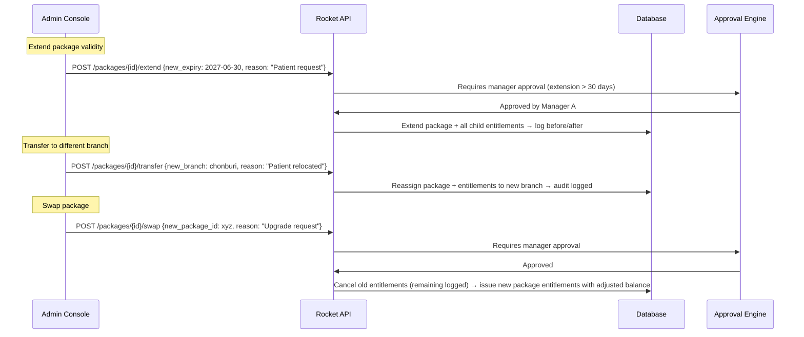

#### Scenario 9: Corporate Roster Import & Update

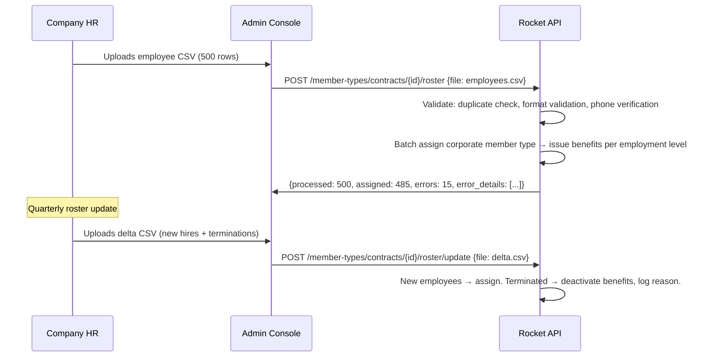

### Integration Map

| ระบบ                | ทิศทาง        | วิธีการ              | ข้อมูล                                                                                                    |
| ------------------- | ------------- | -------------------- | --------------------------------------------------------------------------------------------------------- |
| **HIS**             | Bidirectional | REST API             | เข้า: Purchase, Visit, Service Delivery, Insurance, OrderSet ออก: Eligibility, Entitlement, Member Status |
| **CDP Hospital**    | Inbound       | API / Batch          | Service Catalog, Product/Price Master                                                                     |
| **Well App**        | Bidirectional | REST API + SSO       | เข้า: SSO Token ออก: ข้อมูล Loyalty ทั้งหมด                                                               |
| **LINE**            | Bidirectional | Messaging API + LIFF | เข้า: Auth, Event ออก: Message, Webview                                                                   |
| **Shopee**          | Inbound       | Webhook              | Order Data                                                                                                |
| **Lazada**          | Inbound       | Webhook / API        | Order Data                                                                                                |
| **Payment Gateway** | Bidirectional | Payment API          | ออก: Payment Request เข้า: Callback, Confirmation                                                         |
| **Partner**         | Bidirectional | REST API             | เข้า: Activity Event ออก: Eligibility Query                                                               |
| **Website**         | Inbound       | REST API + JS SDK    | Article Tracking Event, Auth (OTP/LINE OAuth)                                                             |
| **SMS Provider**    | Outbound      | REST API             | Journey-triggered SMS                                                                                     |
| **Email Provider**  | Outbound      | REST API             | Journey-triggered Email                                                                                   |
| **FCM / APNs**      | Outbound      | Push API             | App Push Notification ไปยัง Well App                                                                      |
| **Partner Loyalty** | Inbound       | REST API             | Point Transfer (The1, M Card, K Point) — เมื่อลงนาม Partnership                                           |

### Integration Detail List

> **ดูไฟล์แนบ: excel สำหรับรายการ Integration Detail ฉบับสมบูรณ์ (13 Integration Group, 30+ Integration Point พร้อม API Endpoint, Data Direction และ Frequency)**

### Reliability

API Call ใช้ Retry พร้อม Exponential Backoff Circuit Breaker ป้องกัน Cascading Failure — หากระบบใดไม่พร้อม Event ถูกจัดคิวและประมวลผลเมื่อ Recovery Idempotency Key ป้องกันการประมวลผลซ้ำ

### Open API — Endpoint Catalog

Rocket Loyalty CRM Platform เปิด REST API ครบถ้วน **API Documentation ฉบับสมบูรณ์พร้อม Payload Specification, Authentication Detail และ Sandbox Access จะส่งมอบหลังยืนยันโครงการ**

| Endpoint                                     | วัตถุประสงค์                                                                                |
| -------------------------------------------- | ------------------------------------------------------------------------------------------- |
| **Users**                                    |                                                                                             |
| `/users`                                     | สมัครสมาชิกและแสดงรายชื่อ                                                                   |
| `/users/{id}`                                | ดูและอัปเดต Profile                                                                         |
| `/users/match`                               | Identity Matching (บัตรประชาชน, เบอร์โทร, HN)                                               |
| `/users/merge`                               | รวม Profile ซ้ำ                                                                             |
| **Wallet**                                   |                                                                                             |
| `/wallet/balance`                            | ยอด Coin ปัจจุบัน                                                                           |
| `/wallet/transactions`                       | ประวัติ Transaction พร้อม Filter                                                            |
| `/wallet/credit`                             | เครดิต Coin (Earn)                                                                          |
| `/wallet/debit`                              | หัก Coin (Burn)                                                                             |
| `/wallet/transfer`                           | Inbound Point Transfer จาก Partner Loyalty (The1 / M Card / K Point)                        |
| `/wallet/expiry-preview`                     | Coin ที่ใกล้หมดอายุของคนไข้                                                                 |
| **Privileges**                               |                                                                                             |
| `/privileges`                                | Privilege Catalog (Browse, Filter)                                                          |
| `/privileges/{id}/redeem`                    | Redeem Privilege ด้วย Coin                                                                  |
| `/privileges/issue`                          | ออก Privilege ให้คนไข้                                                                      |
| `/privileges/bulk-issue`                     | Bulk Issuance (Package Bundle)                                                              |
| **Entitlements**                             |                                                                                             |
| `/entitlements/{id}`                         | สถานะ Entitlement และจำนวนคงเหลือ                                                           |
| `/entitlements/{id}/use`                     | ตัด 1 ครั้ง (Mark-use)                                                                      |
| `/entitlements/{id}/adjust`                  | เพิ่ม/ลดจำนวนครั้ง (Admin หรือ HIS)                                                         |
| **Tiers**                                    |                                                                                             |
| `/tiers/status`                              | สถานะ Tier ของคนไข้                                                                         |
| `/tiers/evaluate`                            | Trigger Tier Evaluation                                                                     |
| `/tiers/benefits`                            | Benefit ของ Tier ที่กำหนด                                                                   |
| **Member Types**                             |                                                                                             |
| `/member-types/assign`                       | Assign คนไข้เป็น Member Type                                                                |
| `/member-types/status`                       | Member Type ทั้งหมดของคนไข้                                                                 |
| `/member-types/contracts`                    | Contract Management (Corporate/Insurance/Partner)                                           |
| `/member-types/contracts/{id}/roster`        | Batch Roster Import (Corporate/Insurance/Partner)                                           |
| `/member-types/contracts/{id}/roster/update` | Delta Roster Update (พนักงานใหม่, ลาออก)                                                    |
| **Eligibility**                              |                                                                                             |
| `/eligibility`                               | Benefit ทั้งหมดที่ Active ของคนไข้ — คืนค่าตัวชนะ + Precedence Reasoning ครบ + Stackability |
| `/eligibility/standing-benefits`             | Standing Discount พร้อม Precedence Resolution และเหตุผลจัดลำดับ                             |
| `/eligibility/stackability`                  | Stackability Check สำหรับ Package เฉพาะ — Benefit ไหนใช้ร่วมกันได้อย่างไร                   |
| **Campaigns**                                |                                                                                             |
| `/campaigns`                                 | Campaign CRUD                                                                               |
| `/campaigns/{id}/metrics`                    | Campaign Performance Metric                                                                 |
| **Missions**                                 |                                                                                             |
| `/missions`                                  | Mission Catalog                                                                             |
| `/missions/{id}/progress`                    | Progress ของคนไข้ใน Mission                                                                 |
| `/missions/{id}/claim`                       | Claim Mission Reward                                                                        |
| **Audiences**                                |                                                                                             |
| `/audiences`                                 | Segment Management                                                                          |
| `/audiences/{id}/members`                    | สมาชิกใน Segment                                                                            |
| `/audiences/{id}/export`                     | Export Segment สำหรับใช้ภายนอก                                                              |
| **Packages**                                 |                                                                                             |
| `/packages`                                  | Package Catalog                                                                             |
| `/packages/{id}/purchase`                    | เริ่ม Package Purchase                                                                      |
| `/packages/{id}/entitlements`                | Entitlement ที่ออกสำหรับ Package                                                            |
| `/packages/{id}/extend`                      | ขยายอายุ Package (พร้อม Approval)                                                           |
| `/packages/{id}/transfer`                    | ย้าย Package ไปสาขาอื่น                                                                     |
| `/packages/{id}/swap`                        | เปลี่ยน Package (ยกเลิกเดิม ออกใหม่)                                                        |
| **Activities**                               |                                                                                             |
| `/activities/track`                          | Track Behavioral Event (อ่านบทความ/Like/Share, Form Completion)                             |
| **Webhooks**                                 |                                                                                             |
| `/webhooks/register`                         | ลงทะเบียน Webhook Endpoint                                                                  |
| `/webhooks/events`                           | รับ External Event (HIS, Marketplace)                                                       |
| **Reports**                                  |                                                                                             |
| `/reports/generate`                          | สร้าง Report On Demand                                                                      |
| `/reports/scheduled`                         | Schedule Recurring Report                                                                   |
| `/reports/export`                            | Export Report Data (CSV/Excel)                                                              |
| **Auth**                                     |                                                                                             |
| `/auth/sso/validate`                         | Validate Well SSO Token                                                                     |
| `/auth/otp/send`                             | ส่ง OTP ไปเบอร์โทร                                                                          |
| `/auth/otp/verify`                           | ตรวจสอบ OTP                                                                                 |
| **Admin**                                    |                                                                                             |
| `/admin/approvals`                           | Approval Queue (Pending/Approve/Reject)                                                     |
| `/admin/audit-log`                           | Audit Trail Query                                                                           |
| `/admin/roles`                               | Role และ Permission Management                                                              |

## Part IX: การเตรียมความพร้อมก่อน Go-Live & การย้ายข้อมูล

### Project Timeline

*ภาพ Weekly Project Timeline — ดูไฟล์ excel แนบ สำหรับรายละเอียดครบถ้วน*

### Go-Live Checklist

**ด้าน Technical:**

- HIS Integration: Verify Event Type ทั้งหมด (Purchase, Visit, Service Delivery, Insurance, OrderSet)
- Well SSO: Token Validation ทำงานสำหรับทุก User Scenario
- Rocket Payment: Test Transaction สำเร็จพร้อม Refund Flow
- Shopee/Lazada: Webhook Processing Verify แล้ว, Order Matching Test แล้ว
- Performance: ทุก Target ผ่าน (50ms Eligibility, 1s Earn, 10k Concurrent)
- Security: Pentest ผ่าน ไม่มี Finding ระดับ Critical/High
- Monitoring: Dashboard, Alert, Log Aggregation Configure แล้ว
- Disaster Recovery: Backup Verify แล้ว, Failover Test แล้ว

**ด้านธุรกิจ:**

- Tier Threshold และ Benefit ได้รับอนุมัติจาก Marketing
- Earn Rule Sign-off แล้ว (ทุกแผนก ทุกช่องทาง)
- Privilege Catalog ครบ: Hospital-owned + Partner (Stock เริ่มต้นโหลดแล้ว)
- Member Type Configuration: VIP Level, Corporate Contract, Insurance Policy
- Communication Template: Content อนุมัติแล้วสำหรับ LINE, SMS, Email ใน TH/EN
- Admin User สร้างพร้อม Role และ Permission ที่ถูกต้อง
- เจ้าหน้าที่แผนกผ่านการอบรมการออก Privilege และค้นหาคนไข้

### Data Migration

หากต้องย้ายข้อมูลสมาชิก/คนไข้ที่มีอยู่:

| Phase              | ระยะเวลา  | กิจกรรม                                                                                                                                           |
| ------------------ | --------- | ------------------------------------------------------------------------------------------------------------------------------------------------- |
| **Discovery**      | 1 สัปดาห์ | สำรวจ Source System, Schema Mapping, ประเมินคุณภาพข้อมูล, เอกสาร Field-by-field Mapping                                                           |
| **Development**    | 2 สัปดาห์ | Migration Script พร้อม Validation Rule, Duplicate Detection (ด้วยบัตรประชาชน + เบอร์โทร), Delta Sync สำหรับ Incremental Change ระหว่าง Transition |
| **Test Migration** | 1 สัปดาห์ | Full Load ไปยัง Staging, Automated Validation (Record Count, Balance Checksum, Member Type Verification), Gap Analysis Report                     |
| **Production**     | 1 สัปดาห์ | Zero-downtime Migration ในช่วง Low-activity Window Iterative Delta Sync ลด Change จากหลายพันเหลือใกล้ศูนย์ก่อน Final Cutover                      |

**เกณฑ์ Validation:** 100% Record ย้ายครบ, ไม่มี Data Loss, Coin Balance ตรงทุกราย, Member Type Assignment ทั้งหมด Verify แล้ว, Identity Link ทุกรายการ (HN, เบอร์โทร, บัตรประชาชน) Confirm แล้ว

## Part X: การดูแลระบบ & Support

### Support Model

| Layer                      | เวลาทำการ                            | รับผิดชอบ                                                                      | ทีม                  |
| -------------------------- | ------------------------------------ | ------------------------------------------------------------------------------ | -------------------- |
| **L1 — Technical Support** | 7 วัน 9:00–21:00                     | Configuration Issue, Integration Error, Data Correction, Campaign Adjustment   | Technical Specialist |
| **L2 — Engineering**       | จ.–ศ. 9:00–18:00 (On-call สำหรับ P1) | Critical Bug, Infrastructure Incident, Security Event, HIS Integration Failure | Engineering Team     |

### SLA Target

| Severity          | คำจำกัดความ                                                           | Response  | Resolution |
| ----------------- | --------------------------------------------------------------------- | --------- | ---------- |
| **P1 — Critical** | แพลตฟอร์มล่ม คนไข้ใช้ Loyalty ไม่ได้ HIS Integration ล้มเหลว          | 15 นาที   | 4 ชั่วโมง  |
| **P2 — High**     | Feature หลักเสียหาย (เช่น Privilege Redemption ล้มเหลว) มี Workaround | 30 นาที   | 8 ชั่วโมง  |
| **P3 — Medium**   | Feature รองมีปัญหา กระทบคนไข้จำกัด                                    | 2 ชั่วโมง | 24 ชั่วโมง |
| **P4 — Low**      | ปัญหาด้าน Cosmetic, Enhancement Request                               | 8 ชั่วโมง | 72 ชั่วโมง |

### Incident Management

**Escalation Path:** L1 → L2 พร้อม Auto Escalation เมื่อ SLA Breach War Room Protocol สำหรับ P1 Incident พร้อมช่องทางสื่อสารเฉพาะ

**Post-incident:** Root Cause Analysis ภายใน 48 ชั่วโมง Corrective Action Plan Monthly Incident Summary Report

### Ongoing Campaign Support

Campaign ใหม่ถูก Configure ภายใน **3-day Cycle:**

| วัน | กิจกรรม                                                      |
| --- | ------------------------------------------------------------ |
| 1   | รับ Campaign Brief → Configure Earn Rule, Privilege, Journey |
| 2   | Internal Testing + Review                                    |
| 3   | Deploy ขึ้น Production + Monitoring                          |

Recurring Campaign (Birthday, Welcome, Post-visit, Tier Maintenance) Configure ครั้งเดียวแล้วทำงานอัตโนมัติ — ไม่ต้องตั้งค่าซ้ำ

### Monthly Operation

| กิจกรรม                   | รายละเอียด                                                                                                                 |
| ------------------------- | -------------------------------------------------------------------------------------------------------------------------- |
| **Monthly Report**        | Member Analytics, Transaction Summary, Coin Economy, Campaign Performance, Redemption, Operation — พร้อม Executive Summary |
| **System Health Review**  | Uptime, Response Time, Error Rate, Capacity Forecasting                                                                    |
| **Campaign Review**       | Performance ของ Active Journey, Segment Health, A/B Test Result                                                            |
| **Privilege Stock Check** | Partner Code Inventory, Reorder Trigger, Expiry Alert                                                                      |
| **Security Review**       | Access Log Audit, Permission Review, Vulnerability Scan                                                                    |

### Marketing Execution Support

**4-week Monthly Cycle:**

| สัปดาห์ | กิจกรรม                                                  |
| ------- | -------------------------------------------------------- |
| 1       | Review เดือนก่อน + วางแผน Campaign เดือนถัดไป            |
| 2       | Configuration Campaign, สร้าง Privilege, เตรียม Creative |
| 3       | Testing, UAT, Approval Flow Completion                   |
| 4       | Launch + Daily Monitoring + Real-time Optimization       |

### Change Management

1. **Request:** สมิติเวชส่ง Change Request พร้อมรายละเอียดข้อกำหนด
2. **Assessment:** Scope, Effort, Timeline, Impact Analysis ภายใน 3 วันทำการ
3. **Approval:** ทั้ง 2 ฝ่าย Sign-off (เรื่องเล็ก: PM; เรื่องโครงสร้าง: Steering Committee)
4. **Implementation:** Dev → Test → Staging → UAT → Production
5. **Post-deployment:** Monitoring Period, ยืนยันความสำเร็จ

## Part XI: Reward Sourcing

### Reward Pool — Pay-per-Use

*TOR F4*

SKU กว่า 2,000 รายการในเครือข่าย Partner Reward สมิติเวชจ่ายเมื่อคนไข้ Redeem เท่านั้น Digital E-voucher ส่งทันที ของรางวัล Physical จัดส่งภายใน 2–5 วันทำการ Hospital-owned Privilege (ส่วนลด, Service Voucher) ไม่มีต้นทุนจัดซื้อ

**Admin Operation:** Browse Partner Catalog, เลือก Reward สำหรับโปรแกรมสมิติเวช, ตั้ง Coin Pricing ต่อ Tier, Monitor Stock Level, ดู Redemption Report, Trigger Reorder เมื่อ Stock ต่ำกว่า Threshold

### Reward Strategy สำหรับ Hospital Loyalty

Hospital Loyalty ต่างจาก Retail — คนไข้มาเป็นช่วง ไม่ได้มาทุกวัน Reward ต้องตอบ 3 วัตถุประสงค์:

1. **กระตุ้นการกลับมา:** Privilege ที่ดึงคนไข้กลับ (ส่วนลด Follow-up, Checkup Offer, Pharmacy Voucher)
2. **Cross-sell Service:** แนะนำคนไข้ให้รู้จักแผนกใหม่ (Dental Privilege สำหรับคนไข้ OPD ประจำ, Spa สำหรับคนไข้ตรวจสุขภาพ)
3. **เชื่อมชีวิตประจำวัน:** ให้แบรนด์อยู่ในชีวิตประจำวันระหว่างการมาโรงพยาบาล (ร้านกาแฟ, Lifestyle Reward, ผลิตภัณฑ์สุขภาพ)

### Reward Category

| หมวด                 | ตัวอย่าง                                            | แหล่ง               | Coin Range โดยทั่วไป |
| -------------------- | --------------------------------------------------- | ------------------- | -------------------- |
| **Hospital Service** | ส่วนลดปรึกษาแพทย์, ส่งต่อแพทย์เฉพาะทาง, ร้านยา, Lab | Samitivej-owned     | 500–5,000 Coin       |
| **Hospital Amenity** | จอดรถ, ร้านอาหารในโรงพยาบาล, Lounge Access          | Samitivej-owned     | 100–500 Coin         |
| **Wellness**         | สปา, ฟิตเนส, วิตามิน, IV Drip, นวด                  | Samitivej + Partner | 500–3,000 Coin       |
| **Dining**           | Starbucks, After You, Café Amazon, MK, S&P          | Partner Network     | 200–1,000 Coin       |
| **Lifestyle**        | Grab, Shopee Gift Card, โรงภาพยนตร์, ความงาม        | Partner Network     | 500–3,000 Coin       |
| **Health Product**   | อาหารเสริม, Skincare, Health Device                 | Partner Network     | 1,000–5,000 Coin     |
| **Premium / Flash**  | Dyson, Apple, Luxury Wellness Retreat               | Partner Network     | 10,000–50,000 Coin   |

### Sourcing & Fulfillment

| ประเภท                | กระบวนการ                                                                                                           | SLA                                   |
| --------------------- | ------------------------------------------------------------------------------------------------------------------- | ------------------------------------- |
| **Digital E-voucher** | Real-time API Procurement จาก Partner Network Code ส่งเข้า Wallet ทันทีเมื่อ Redeem                                 | ทันที                                 |
| **Physical Reward**   | Order ส่งไป Fulfillment Partner Pick, Pack, Ship พร้อม Tracking Number แสดงในแอป                                    | 2–5 วันทำการ (มาตรฐาน), สูงสุด 14 วัน |
| **Hospital-owned**    | Configure ในระบบโดยตรง ไม่มีต้นทุนจัดซื้อ — เป็นส่วนลด/บริการที่โรงพยาบาลควบคุมเอง                                  | ทันที                                 |
| **Flash / Limited**   | Pre-load Stock จำนวนจำกัด รองรับ Concurrent Redemption (10k+ User) First-come-first-served พร้อม Fairness Guarantee | ทันที (Digital)                       |

### Pay-Per-Use Model

สมิติเวชจ่าย **เฉพาะ Reward ที่ถูก Redeem** — ไม่มีต้นทุน Inventory ล่วงหน้าสำหรับ Partner Reward Hospital-owned Privilege (ส่วนลด, Service Voucher) ไม่มีต้นทุนจัดซื้อ

### Partner Network

ฝ่าย Reward Sourcing ของเราดูแลความสัมพันธ์กับ **Partner กว่า 100 ราย** ครอบคลุม Dining, Lifestyle, Retail และ Wellness สำหรับสมิติเวช เราคัดเลือกส่วนที่เหมาะกับกลุ่มคนไข้โรงพยาบาล — คนรักสุขภาพ มืออาชีพในเมือง ที่ให้ความสำคัญกับความสะดวกและคุณภาพ

**Partner Onboarding:** เพิ่ม Partner ใหม่ได้ภายใน 5 วันทำการ (Contract + Code Upload + Catalog Configuration) รองรับ Seasonal Partner (Holiday Campaign, Limited Collaboration) พร้อม Scheduling

**Reconciliation:** Monthly Reconciliation Report ต่อ Partner: Code ที่ส่งออก, Redeem แล้ว, หมดอายุ เรียกเก็บตามจำนวนที่ Redeem เท่านั้น

## ภาคผนวก: TOR Coverage Matrix ฉบับสมบูรณ์

| TOR              | รายละเอียด                                                    | Section                     | สถานะ |
| ---------------- | ------------------------------------------------------------- | --------------------------- | ----- |
| **B1.1**         | Register/Login/OTP/SSO                                        | Part IV                     | ✓     |
| **B1.2**         | Coin Balance + History                                        | Part I, 1.3                 | ✓     |
| **B1.3**         | Earn จาก Purchase + Behavior                                  | Part I, 1.1–1.2             | ✓     |
| **B1.4**         | Redeem เป็น Privilege                                         | Part I, 1.5                 | ✓     |
| **B1.5**         | Coin Transfer                                                 | Part I, 1.4                 | ✓     |
| **B1.6a–e**      | eCoupon / Entitlement / Package                               | Part I, 1.5–1.6             | ✓     |
| **B2.1–B2.3**    | Coupon Auto-create + Manual + Dept Access                     | Part I, 1.5, 1.7            | ✓     |
| **B2.4**         | Coin Rule Engine                                              | Part I, 1.1, 1.7            | ✓     |
| **B2.5**         | Report                                                        | Part VI                     | ✓     |
| **B2.6**         | Privilege Catalog Management                                  | Part I, 1.7                 | ✓     |
| **B2.7**         | Role/Permission/MFA                                           | Part I, 1.7                 | ✓     |
| **B3.1–B3.5**    | Channel Integration                                           | Part IV, VIII               | ✓     |
| **C1**           | VIP (Star) Membership                                         | Part II, 2.2                | ✓     |
| **C2**           | Paid Membership                                               | Part II, 2.3                | ✓     |
| **C3**           | Engagement/Tier                                               | Part II, 2.1                | ✓     |
| **C4**           | Corporate                                                     | Part II, 2.4                | ✓     |
| **C5**           | Insurance (รวม Stackability)                                  | Part II, 2.5                | ✓     |
| **C6**           | Exclusive Partner                                             | Part II, 2.6                | ✓     |
| **C Shared**     | Precedence, Stackability, Audit, RBAC                         | Part II, 2.7                | ✓     |
| **D1.1**         | SCV + Segmentation                                            | Part III, 3.1               | ✓     |
| **D1.2**         | Journey Automation                                            | Part III, 3.2               | ✓     |
| **D2**           | Lifestage                                                     | Part III, 3.4               | ✓     |
| **E1**           | Well Full Loop                                                | Part IV, 4.1                | ✓     |
| **E2**           | Website                                                       | Part IV, 4.2                | ✓     |
| **E3**           | LINE                                                          | Part IV, 4.3                | ✓     |
| **E4**           | E-Commerce                                                    | Part IV, 4.4                | ✓     |
| **F1**           | Operations Console                                            | Part V, 5.1                 | ✓     |
| **F2**           | Partner Landing Page                                          | Part V, 5.2                 | ✓     |
| **F3**           | Health Package Purchase                                       | Part I, 1.6                 | ✓     |
| **F4**           | Reward Pool                                                   | Part XI                     | ✓     |
| **G1**           | Data Strategy                                                 | Part VII                    | ✓     |
| **G2**           | Security / PDPA / Audit                                       | Part VII                    | ✓     |
| **G3**           | Support / SLA                                                 | Part X                      | ✓     |
|                  |                                                               |                             |       |
| **เกินกว่า TOR** |                                                               |                             |       |
| —                | Flash Reward (Limited Drop, 10k+ Concurrency)                 | Part I, 1.5                 | ✓     |
| —                | Milestone Mission พร้อม Overflow                              | Part V, 5.3                 | ✓     |
| —                | AI Decisioning (ระดับบุคคล, Observe-Wait-Act)                 | Part III, 3.3               | ✓     |
| —                | Delayed Coin Award                                            | Part I, 1.1                 | ✓     |
| —                | Durable Execution สำหรับ Guaranteed Delivery                  | Part VII                    | ✓     |
| —                | 20 Custom Dashboard รวมอยู่ในราคา                             | Part VI                     | ✓     |
| —                | Open API (50+ Endpoint)                                       | Part VIII                   | ✓     |
| —                | โครงสร้าง Tier อิสระต่อ Member Type                           | Part II                     | ✓     |
| —                | A/B Testing & Gradual Rollout                                 | Part III, 3.2               | ✓     |
| —                | Partner Activity API สำหรับ Auto-upgrade                      | Part V, 5.2                 | ✓     |
| —                | Flash Reward Concurrency Management                           | Part I, 1.5                 | ✓     |
| —                | Reward Sourcing (2,000+ SKU, Pay-per-use)                     | Part XI                     | ✓     |
| —                | Rocket MCP (AI Data Assistant สำหรับ Admin)                   | Part VI                     | ✓     |
| —                | Stream Processing สำหรับ Real-time Segment                    | Part VII                    | ✓     |
| —                | AWS ECS Auto-scaling (20k Task)                               | Part VII                    | ✓     |
| —                | Block-based Design Configuration (Homepage เฉพาะ Member Type) | Part IV, 4.1                | ✓     |
| —                | AI-driven Adaptive Survey Question (ตาม Profile Completeness) | Part I, 1.2 + Part III, 3.3 | ✓     |
| —                | Journey-level Frequency Cap & Suppression Guardrail           | Part III, 3.2               | ✓     |

---

*Proposal จัดทำสำหรับเครือโรงพยาบาลสมิติเวช — Samitivej CRM Centre มีนาคม 2026*

<em>หน้านี้เว้นว่างไว้โดยตั้งใจ</em>
