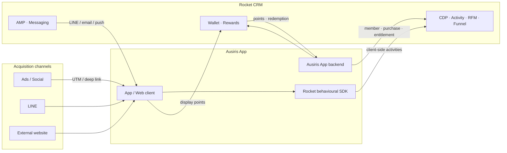
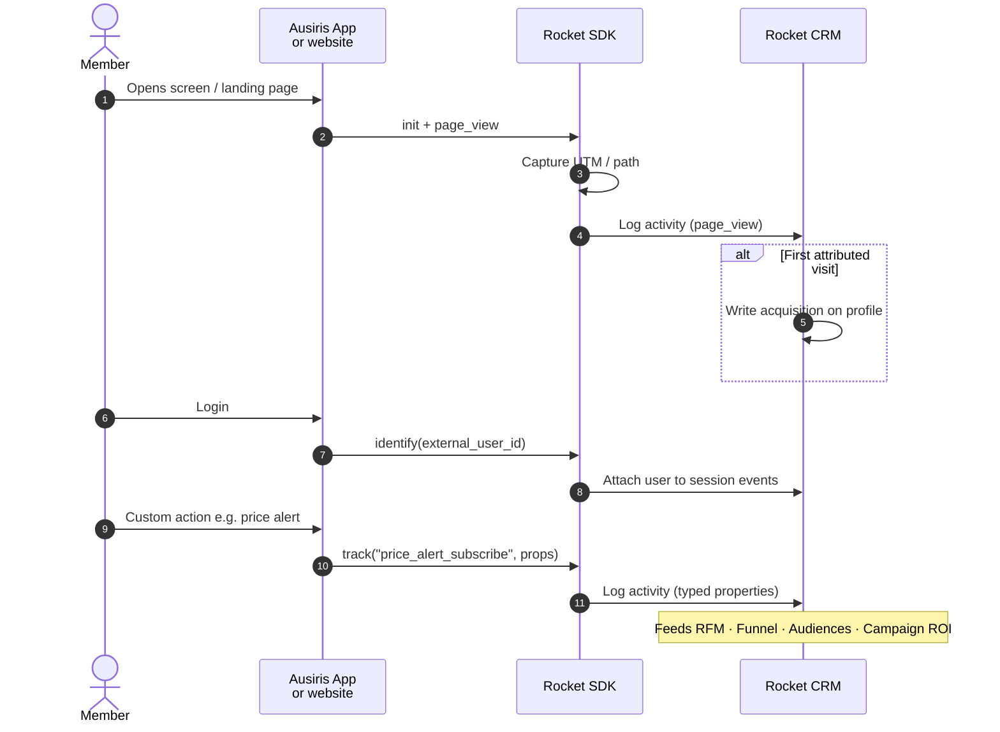
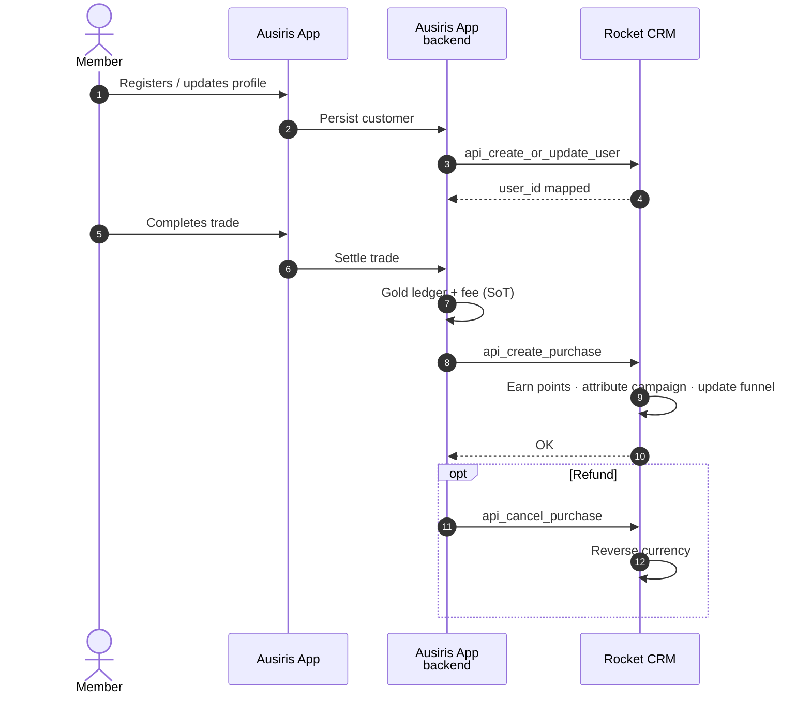
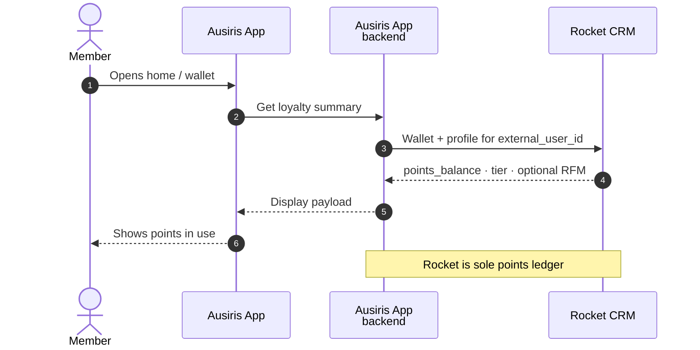
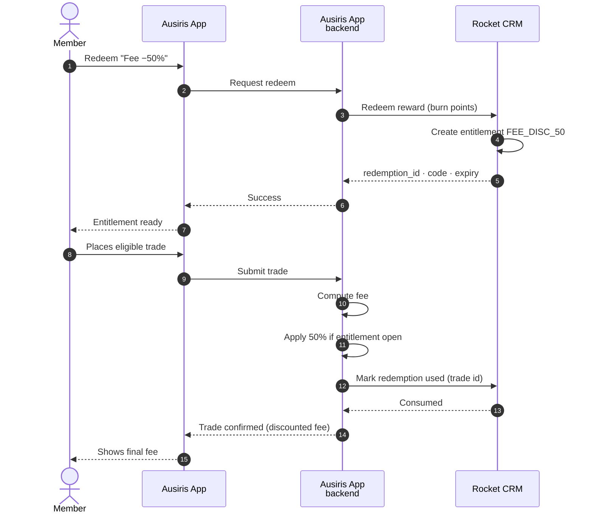
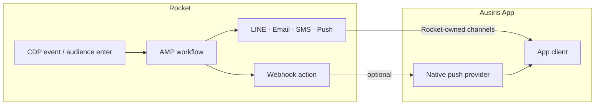

# Ausiris × Rocket CRM — Platform Proposal

**Audience:** Ausiris commercial / product / tech stakeholders  
**Date:** 2026-07-14  
**Source materials:** Ausiris Retail CRM RFP (B2C gold / silver / saving / small bar / jewelry); Rocket gap-feature plan & implementation (2026-07-13/14); Rocket product catalog  

**Controlling idea:** Rocket CRM is the CDP + loyalty + journey engine for Ausiris. The **Ausiris App** (and its trading backend) remain the systems of record for trades and fee calculation; Rocket records behaviour (via SDK + server APIs), scores members, runs campaigns, and issues entitlements (including in-house benefits such as trading-fee discounts) that the Ausiris App consumes and fulfils.

---

## 1. Glossary

| Ausiris / RFP term | Meaning in Ausiris framing | Rocket note (only where names differ) |
|---|---|---|
| CDP / Customer Activity Log | Single place that stores omnichannel member behaviour | Activity ledger + purchase ledger + Customer 360 |
| Tier (RFM) | Behavioural segment that updates from touchpoints (VIP / at-risk / etc.) | **RFM segment** — not loyalty Tier. Loyalty Tier is a separate status ladder |
| Sales Pipeline / Journey Stage | Lead → engaged → KYC → first buy → repeat, auto-updated | **Funnel** — ordered stages; member sits in the highest matching stage |
| Lead Source / Campaign ROI | Know which ad or campaign brought or converted a member | Acquisition stamp on profile + marketing campaign attribution on purchases |
| Touchpoints | LINE, social, marketplace, app (e.g. My Gold Plus / Express), POS, vending | Events logged as activities, purchases, or channel messages |
| Loyalty / Points | Earn and spend currency across channels | Wallet (points) + rewards catalog |
| In-house reward | Benefit funded by Ausiris (e.g. trading-fee discount), not a third-party voucher | Merchant-owned reward → redemption entitlement → app applies the discount |
| Ausiris App | Member-facing app + trading backend that owns trades, balances, and fee logic | Integrates with Rocket via behavioural **SDK**, server APIs, and outbound wallet / redemption APIs |

**Concept split — “Tier” in the RFP**

| Pattern | What it is | Rocket construct |
|---|---|---|
| Behavioural RFM “Tier” | Scores from recency / frequency / monetary value | RFM scores + audiences / workflows |
| Loyalty Tier | Status ladder with upgrade / maintain rules and burn benefits | Existing Tier programme (unchanged by RFM build) |

---

## 2. How this maps to the RFP

| RFP ask (paraphrase / Thai intent) | Coverage | How Rocket addresses it |
|---|---|---|
| CDP with activity log from all touchpoints | **Supported** (shipped for Ausiris gap) | Custom + standard activity types; typed properties; API write path |
| Auto-update Tier (RFM) from touchpoints | **Supported** (shipped) | Daily RFM scoring; audiences and workflows filter on R/F/M / segment |
| Sales pipeline / journey stages + conversion | **Supported** (shipped) | Funnels as ordered stages; transition metrics; hourly reconcile |
| Lead source + campaign ROI | **Supported** (shipped) | Write-once acquisition UTM; marketing campaigns + U-shape (etc.) attribution; ROI reports |
| Churn prevention | **Supported** (existing + RFM) | RFM “At Risk” audiences → AMP workflows → LINE / push / email |
| Sales conversion (chat / salespage / LINE close) | **Supported** (existing) | Customer Service AI + omnichannel inbox |
| AI personalized campaign | **Supported** (existing) | AMP AI Decisioning inside workflows |
| Loyalty cross-channel | **Supported** (existing) | Points earn on purchase / activity; redeem in app or catalog; marketplace connectors available |
| Exec / ROI dashboard UI | **Supported** (analytics serving shipped) | Native admin reports: campaigns, acquisition, funnels, RFM, activity, exec overview |
| Deep connector / historical migration | **Scoped separately** | Integration design in §5; migration volume TBD in discovery |

---

## 3. What Ausiris gets on the platform

### 3.1 CDP and journey intelligence

**Activity log.** Every meaningful app or channel event can be recorded as an activity: page view, price-alert subscribe, KYC complete, gold-bar view, link click, campaign touch. Merchants define custom activity types and typed fields; those fields are usable in audiences and workflows when exposed to conditions.

**Acquisition.** First attributed touch writes UTM / campaign onto the member profile once (lead source). Later touches stay on the activity timeline for multi-touch analysis.

**Marketing campaigns & ROI.** Named campaigns carry budget, channel, schedule, and tracking keys (UTM values, LINE params, vouchers, custom tokens). Nightly attribution assigns purchase value (default U-shape lookback). Admin sees lifetime and date-ranged ROI.

**RFM.** Configurable windows and segment labels; daily recompute of R/F/M scores. Marketers build audiences such as Champions / At Risk without sales manually tagging VIPs.

**Funnels.** Example gold journey: Lead (added LINE) → Engaged → First purchase → Repeat → Program member. Stages are rule-based; conversion rates come from stage-transition history. Latest-stage-wins (member appears in one stage per funnel).

**Customer 360.** One member view: profile, RFM badge, acquisition line, activity stream, purchases, wallet, redemptions, funnel stage.

### 3.2 Loyalty loop (existing product)

| Capability | Role for Ausiris |
|---|---|
| **Currency / wallet** | Earn points from trades and qualifying activities; single points balance with full ledger history |
| **Earn rules** | THB→points rates, multipliers, product / channel / tier filters; optional delayed award |
| **Loyalty Tier** | Status ladder (e.g. Silver → Gold → Platinum) with upgrade / maintain conditions — complementary to RFM |
| **Rewards catalog** | Browse / redeem partner vouchers **and** merchant-owned privileges (fee discount, workshop seats, etc.) |
| **Missions / referral / check-in** | Engagement mechanics on top of earn/burn |
| **PDPA consent** | Channel- and topic-level consent before outbound |

### 3.3 Marketing automation and messaging (existing)

- **Audiences** — dynamic segments on profile, purchase, activity, RFM, acquisition, tags, persona.
- **AMP Workflows** — event-driven journeys (welcome, win-back on RFM At Risk, post-first-trade nurture).
- **AMP AI Decisioning** — per-member ACT / WAIT / SKIP under marketer guardrails.
- **Outbound channels** — LINE, email, SMS, push (as connected); CS covers live conversation on LINE / social.

### 3.4 Admin and reports (including Ausiris gap analytics)

Marketing: campaigns, funnels, RFM settings, activity types.  
Reports: marketing-campaigns, acquisition, funnels, RFM, activity, exec overview — plus standard loyalty wallet / tier / redemption reports.

---

## 4. End-to-end journeys (Ausiris-shaped)

### 4.1 New member from Facebook → LINE → first gold purchase

1. Ad link carries UTM / campaign token into LINE or app landing.
2. Member registers; Rocket writes **acquisition** (source = facebook, campaign = Mothers Day Gold).
3. Ausiris App / SDK logs subsequent `page_view` / `campaign_touch` activities with the same keys.
4. Funnel moves Lead → Engaged as activity rules match.
5. First trade posts as a **purchase** into Rocket → points earn + funnel First Purchase + campaign attribution for ROI.
6. Workflow may send a thank-you / education LINE message.

### 4.2 Cooling VIP → win-back

1. Daily RFM marks the member **At Risk** (high M historically, poor R).
2. Audience membership updates; AMP workflow enters.
3. Message + optional points or fee-discount reward offer.
4. If they trade again, RFM and funnel recover; campaign ROI credits the win-back campaign if identifiers match.

### 4.3 Member spends points on a trading-fee discount (see §5.5)

1. Member sees points balance in the Ausiris App (pulled from Rocket via Ausiris App).
2. Redeems “Trading fee −50% (next trade)” from catalog or deep link.
3. Rocket burns points and creates a **redemption entitlement**.
4. Ausiris App reads open entitlements; on next eligible trade, applies the fee discount and marks the entitlement used.

---

## 5. Integration architecture

Rocket does not replace Ausiris trading systems. It sits beside the **Ausiris App** (client + trading backend). Behavioural measurement on the app and on external websites uses a **Rocket behavioural SDK**; durable business events (member sync, trade settle, fee fulfilment) use server-to-server APIs.

### 5.0 Landscape

| Layer | Role |
|---|---|
| **Rocket behavioural SDK** | Captures client-side behaviour in the Ausiris App and on external websites (page/screen views, clicks, UTM, custom events) and posts into Rocket’s activity log |
| **Ausiris App backend** | Owns trades, gold/silver ledger, and fee math; pushes purchases / member updates; applies in-house reward privileges |
| **Rocket CRM** | CDP, wallet, rewards, RFM, funnels, campaigns, AMP / CS |

### 5.1 Source of truth

| Data | Source of truth | Who writes | Who reads |
|---|---|---|---|
| Trade / order / gold balance / fee calculation | Ausiris App backend | Ausiris App | Ausiris App; Rocket consumes summaries as purchases / activities |
| Client-side behavioural events | Rocket activity ledger | SDK (and optional server mirror) | RFM, funnels, audiences, attribution |
| Member loyalty profile, wallet, RFM, funnel, campaigns | Rocket CRM | Rocket (+ inbound APIs) | Admin; Ausiris App via Rocket APIs |
| Live chat / CS tickets | Rocket CS | Agents / AI | Admin CS workspace |
| Marketing consent | Rocket (PDPA) | Member / admin | AMP before send |

---

### 5.2 Behavioural SDK — app and external website

**Purpose.** Measure what members do in the Ausiris App and on Ausiris marketing / landing sites *before* (and between) trades — without waiting for server-side trade events. The SDK is the primary path for CDP activity volume: screen views, product interest, price-alert taps, campaign link opens, and custom events.

**What the SDK does**

| Capability | Detail |
|---|---|
| Auto page / screen view | Path or screen name + optional product context |
| UTM / deep-link capture | Reads query params / deferred deep links; stamps attribution on the event (and acquisition on first touch) |
| Identify | Binds anonymous device session → `external_user_id` / phone after login |
| Track | Named custom events with typed properties (aligned to Rocket activity types) |
| Consent-aware | Respects PDPA / analytics consent before send |
| Surfaces | Native Ausiris App (iOS / Android) and JS snippet on external websites |

Events land on Rocket via the same activity chokepoint as server logs (`api_log_user_activity` / ingest edge), so RFM, funnels, and campaigns treat SDK and server events uniformly.

**Illustrative activity codes (SDK or server)**

| Activity code | Properties | Used for |
|---|---|---|
| `page_view` | path, product_sku | Funnel Engaged; RFM recency-by-activity |
| `price_alert_subscribe` | metal, threshold | Audience “price-alert subscribers” |
| `kyc_completed` | level | Funnel stage |
| `trade_intent` | metal, notional | High-intent unpaid audience |
| `campaign_touch` | identifier keys | Attribution |

---

### 5.3 Inbound — Ausiris App backend → Rocket

**Purpose.** Keep loyalty and CDP correct for durable business events the SDK cannot own: member master data, settled trades, refunds, consent.

| Event / data | Rocket API / path | Notes |
|---|---|---|
| Member create / update | `api_create_or_update_user` / `api_update_user` | Match on `external_user_id` (Ausiris customer id) and/or phone |
| Completed trade (earn-eligible) | `api_create_purchase` | Amount, SKU class (gold bar, silver, saving, jewelry), channel, status |
| Trade cancel / refund | `api_cancel_purchase` / purchase update | Reverses currency when configured |
| Consent / profile fields | User update + forms / PDPA APIs | Required before outbound |
| Optional server-side activity | `api_log_user_activity` | For events only the backend can see (e.g. KYC pass from core banking) |

Auth: merchant API key. Idempotency via `external_ref` / purchase transaction numbers.

---

### 5.4 Outbound — points balance in the Ausiris App

The Ausiris App treats Rocket as the **wallet authority** for loyalty points. Display balance and history in-app; do not keep a second points balance on the Ausiris App backend.

| Need | Approach |
|---|---|
| Show points on home / trade confirm | App (or backend BFF) calls Rocket wallet summary for `external_user_id` |
| Show earn / burn history | Wallet ledger from Rocket |
| Show tier / RFM badge (optional) | Profile + RFM fields from member get / 360-shaped payload |

Refresh after trade settle and after redemption. Brief client cache is fine; dual ledgers are not.

---

### 5.5 In-house rewards — trading-fee discount

**Business rule (example):** “500 points → 50% off trading fee on the next eligible spot trade (gold/silver), expires in 30 days, once.”

**Configuration in Rocket**

1. Merchant-owned reward (not partner SKU): points cost, visibility `user` or `campaign`, `relative_days = 30`.
2. Eligibility filters as needed (tier, persona, audience / workflow issue).
3. Privilege code Ausiris understands, e.g. `FEE_DISC_50`.

**Split of responsibility:** Rocket burns points and issues the entitlement; the Ausiris App backend applies fee math and consumes the entitlement.

| Step | System | Responsibility |
|---|---|---|
| Price reward in points | Rocket | Catalog + dynamic pricing |
| Burn points | Rocket | Wallet chokepoint; fail closed if insufficient |
| Decide fee discount eligibility | **Ausiris App backend** | Fee schedule + trade rules |
| Apply discounted fee | **Ausiris App backend** | Trading ledger stays in Ausiris |
| Consume entitlement | Rocket (`api_mark_redemption_used` / `api_use_entitlement`) | One-time use; ties to trade id |
| Cancel unused redemption | Rocket | Restores points per policy |

Same pattern for other in-house benefits (workshop seat, saving top-up fee waiver, polishing voucher): change the privilege code and the Ausiris App fulfilment rule.

---

### 5.6 Messaging and automation

AMP workflows send LINE / email / push via Rocket channel connectors. The Ausiris App does not need to send marketing messages unless Ausiris prefers native app push from its own provider — then AMP calls a webhook into the Ausiris App backend.

---

### 5.7 Integration matrix

| Touchpoint | Direction | Method | Real-time | Notes |
|---|---|---|---|---|
| Ausiris App / website behaviour | In | **Rocket behavioural SDK** | Real-time | Primary CDP activity path |
| Member sync | In | User APIs | Near-real-time | `external_user_id` join key |
| Trade settle | In | `api_create_purchase` | On settle | Earn + ROI + funnel |
| Backend-only activity | In | `api_log_user_activity` | Real-time | KYC / system events SDK cannot see |
| Points display | Out | Wallet / user get | On screen load | Rocket is wallet SoT |
| Fee-discount redeem | Out then In | Redeem → mark used | At redeem + at trade | Privilege code contract |
| LINE OA | Bi | CS + AMP connectors | Real-time | Existing CS / AMP |
| Marketplace / POS | In | Purchase + activity APIs | At sale | Same purchase contract; optional phase |

---

### 5.8 Identity and security

- Prefer **Ausiris customer id** as `external_user_id` on every call; SDK `identify` after login.
- Phone / LINE user id as secondary match keys where registration order differs.
- SDK write key is client-safe (scoped, rate-limited); **server API keys** stay only on the Ausiris App backend.
- Entitlement consume is server-to-server — never trust the client alone to “mark used” or skip burn.
- API keys per environment; no shared production keys with staging.

---

### 5.9 Assumptions to confirm in technical design

1. Ausiris App backend can push purchases on settle (or emit an equivalent event Rocket can ingest).
2. Fee schedules and “eligible trade” rules live entirely in the Ausiris App; Rocket only stores privilege codes and redemptions.
3. Points are not cash on the trading ledger — they never alter gold gram balances directly.
4. SDK event taxonomy (activity codes + properties) is agreed before instrumentation.
5. Historical backfill (past trades → purchases / activities) is a separate migration workstream.

## 6. Delivery posture

| Layer | Status relative to Ausiris RFP |
|---|---|
| Activity log, acquisition, marketing campaigns + ROI, RFM, funnels, admin + reports | **Built** (2026-07 gap programme) |
| Loyalty wallet, tiers, rewards, missions, AMP, CS | **Existing platform** — configure + integrate |
| Ausiris App ↔ Rocket (SDK instrumentation, purchases, wallet read, fee-discount redeem) | **Implementation project** — activity APIs exist; SDK embed + app UX + contracts to build |
| Marketplace / POS deep connectors, historical migration | **Optional / phased** |

---

## 7. Suggested next steps

1. **Technical workshop** — confirm SDK event taxonomy, identity keys, purchase payloads, and fee-discount privilege codes.
2. **Contract sheet** — SDK + backend payloads ↔ Rocket activity codes / purchase fields; privilege code table.
3. **Sandbox** — embed SDK on one screen + one website page; wire one purchase + points display + one fee-discount redeem/mark-used loop.
4. **Demo** — walk CDP → RFM → funnel → campaign ROI on seeded merchant, then show the live Ausiris App integration path on a test member.

---

## Appendix — Internal references (Rocket)

| Doc | Role |
|---|---|
| `.cursor/plans/ausiris-rfp-gap-features-plan-20260713.md` | RFP gap intent and locked product direction |
| `docs/AUSIRIS_RFP_GAP_FEATURES_IMPLEMENTATION.md` | What shipped (schema, BFFs, admin, crons, reports) |
| `.cursor/plans/ausiris-analytics-dashboard-plan-20260714.md` | Analytics serving plan |
| `.cursor/plans/ausiris-demo-seed-cheatsheet-20260714.md` | Demo seed walkthrough |
| `docs/PRODUCT_FEATURE_CATALOG.md` | Full platform capability catalog |
| `requirements/Activity_Attribution.md`, `RFM_Scoring.md`, `Funnel.md` | Domain detail for gap features |
