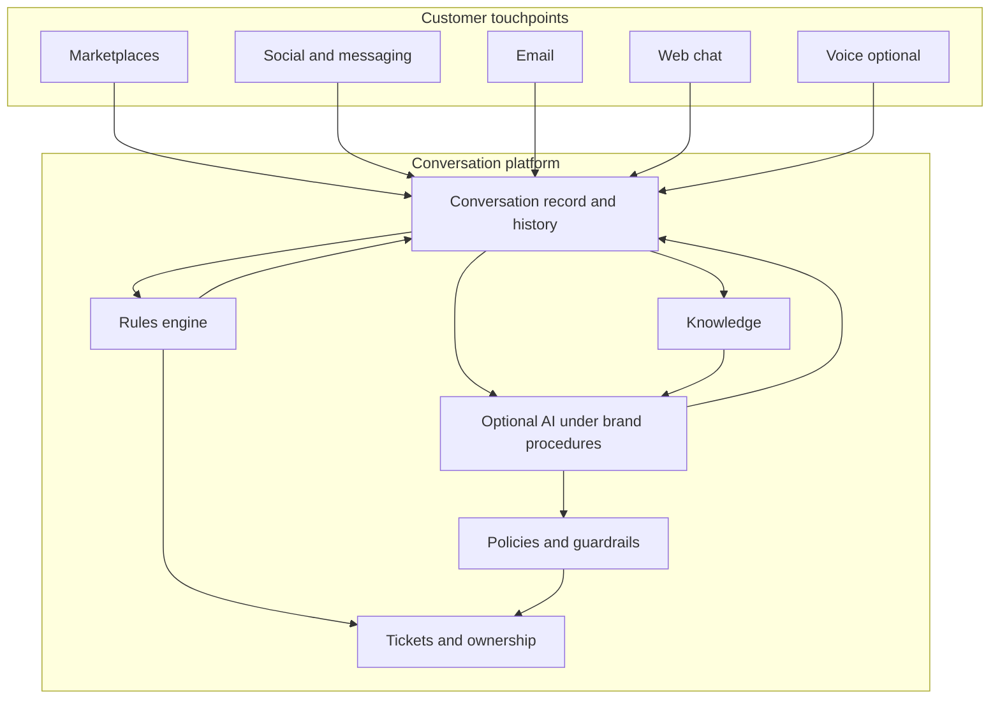

# Product design overview — omnichannel customer service platform

This document describes **what the product is designed to do**, **how work and information move through it**, and **which problems it is meant to solve**—at a product and logical level. It is suitable for partner programs, marketplace applications, or enterprise security reviews that ask for a **design narrative** covering data flow, key features, and use cases.

It intentionally **does not** describe implementation stack, proprietary algorithms, integration wire formats, or internal system topology. Those belong in separate technical and security documentation.

---

## Executive summary

The platform is designed for brands that receive customer inquiries across **many chat and messaging channels** (including e‑commerce marketplaces and consumer messaging apps) and need **one operational hub** for their teams. The core design choice is to treat **rules-based operations** (routing, queues, SLAs, tagging, macros, scheduled actions) as the **primary control plane**, and to offer **optional AI** only as a **governed layer** that follows **brand-authored procedures**—not as a replacement for policy, ownership, or auditability.

---

## 1. Design goals

| Goal | What it means in practice |
|------|---------------------------|
| **Unified operations** | Agents and supervisors work from shared queues, shared customer context, and shared history—not parallel tools per channel. |
| **Separation of concerns** | **Rules** encode “what must always happen” (routing, SLAs, compliance steps). **AI procedures** encode “how the model may assist” when enabled—two different layers, not one blended engine. |
| **Channel reality** | Each surface has different capabilities and constraints; the product **adapts** outbound behavior per channel instead of pretending all channels are identical. |
| **Human control** | Handoff from automation or AI to a person is first-class; agents can override, approve, or take over without losing thread context. |
| **Traceability** | Enough structure exists to answer: who was responsible, which policy fired, what was sent to the customer, and how a ticket moved through states. |
| **Gradual adoption** | A brand can start with **rules + humans only**, then add knowledge depth, then add AI in narrow scopes—without redesigning the whole operating model. |

---

## 2. Primary personas (who the design serves)

- **Frontline agent** — Needs a clear queue, full conversation history, customer-safe reply tools, internal collaboration, and fast access to policies and knowledge.
- **Team lead / supervisor** — Needs workload visibility, SLA risk, quality sampling, and the ability to adjust routing or staffing assumptions.
- **Administrator** — Needs to configure brands or business units, channels, rules, knowledge, AI enablement and boundaries, and integration credentials—without engineering for every change.
- **Customer** — Experiences consistent tone and policy, reasonable response times, and continuity when switching between bot, automation, and human—without repeating their story unnecessarily.

---

## 3. Data flow (conceptual)

### 3.1 End-to-end lifecycle

1. **Customer contact**  
   A user initiates or continues a dialog on a supported channel. The system records each message as part of a **conversation** with explicit rules for **threading** (same issue vs new conversation, idle reopen vs new session—configurable per brand and channel family).

2. **Ingestion and normalization**  
   Channel-specific payloads are mapped into a **canonical conversation model**: participants, text and rich content where supported, timestamps, read/delivery signals when available, and references to commerce context when the channel provides them (e.g. order or product context on a marketplace).

3. **Identity and context (logical)**  
   Where possible, the conversation is associated with a **customer profile** or platform identity so history and attributes can inform routing. The design allows for **partial identity** (guest web chat, marketplace pseudonyms) and later enrichment when the customer identifies themselves.

4. **Rules evaluation**  
   A **rules layer** evaluates the current state: channel, language, topic signals, customer segment, business hours, backlog, and explicit brand policy. Outputs include **queue**, **priority**, **tags**, **SLA timers**, **macros or canned paths**, **notifications to staff**, and other **deterministic automations**. This layer is **not** defined as “the AI workflow”—it is the operational backbone.

5. **Handling strategy**  
   Per brand configuration, the conversation may be:  
   - **Agent-only** — sits in a queue until a human responds.  
   - **Automation-first** — rules send acknowledgements, collect structured data, or route before human eyes.  
   - **AI-assisted** — a model may **draft** replies or, where allowed, **send** replies under **procedures** and **guardrails** defined by the brand.  
   - **Hybrid** — AI or automation handles early turns; explicit triggers move the case to a human with preserved context.

6. **Procedure-bound AI (when enabled)**  
   If AI participates, it is constrained by **step-by-step brand procedures**: what to verify first, when to look up knowledge, when to refuse or escalate, and which categories of action require a human. This is intentionally separate from the **rules engine** that routes and schedules work.

7. **Tickets and structured work**  
   When an issue needs tracking beyond a quick chat, the design supports **tickets** (or equivalent records) with lifecycle states, ownership, categories, and links back to the **conversation transcript**. One conversation can relate to one or more tickets when the customer raises multiple issues.

8. **Outbound delivery**  
   Replies are composed for the **target channel’s rules** (length limits, template requirements, rich cards where supported). The system tracks send outcomes at the level each channel exposes.

9. **Time and reliability**  
   Waits for customer reply, SLA breaches, reminders, CSAT prompts, and reopen logic are handled by **durable, scheduled automation** so that “conversation went quiet” does not mean “work disappeared.”

10. **Closure and learning loop (product intent)**  
    Resolved conversations and tickets feed **operational reporting** and, where the product provides it, **quality review**—without prescribing a specific ML architecture in this document.

### 3.2 Illustrative sub-flows (narrative)

**New inbound message (typical)**  
Customer message arrives → normalized into conversation → rules assign queue / SLA / tags → agent or AI path selected per policy → response path executes → outbound to channel → state updated.

**Escalation to human**  
Keyword, sentiment policy, customer request, failed verification, or procedure step marked “human required” → conversation flagged in supervisor views → assigned agent receives **full prior context** and any **internal notes**.

**Proactive outbound (where channel permits)**  
Campaign or event triggers a permitted outbound (e.g. shipment delay, appointment reminder) → rules ensure eligibility and quiet hours → message sent via channel-appropriate mechanism → replies land in the same conversation model.

### 3.3 Logical flow diagram

---

## 4. Key features (comprehensive view)

Features are grouped by **problem area** the product is designed to cover. Wording stays at **capability level**; it does not commit to a specific roadmap date or proprietary method.

### 4.1 Channels and conversations

- **Multi-channel intake** — Marketplaces, consumer messaging apps, email, embeddable web chat, and optionally voice, as first-class channel types with appropriate limitations called out in product configuration.
- **Threading and session semantics** — Brand-configurable logic for when a **new conversation** starts versus continuing a prior one, respecting channel-specific session behavior where the platform dictates it.
- **Rich and structured content** — Support, where channels allow, for images, files, product or order cards, quick replies, and templates—without flattening everything to plain text when the channel can do better.
- **Delivery and read awareness** — Surface channel-provided delivery or read states to agents when available for better prioritization.

### 4.2 Unified inbox and collaboration

- **Single queueing model** — Conversations appear in team queues with filters by channel, topic, SLA risk, language, and custom dimensions.
- **Internal collaboration** — Internal notes, @mentions or equivalent, and visibility rules so agents can coordinate without exposing draft confusion to the customer.
- **Assignment** — Manual pull, auto-assignment rules, and load-balancing intent (exact algorithm is implementation detail).
- **Status model** — Open, pending customer, pending internal, resolved, closed—or brand-aligned variants—so reporting and automations share a common vocabulary.

### 4.3 Rules-based workflows (non-AI control plane)

- **Conditional routing** — If/then style routing based on explicit inputs (channel, tags, keywords, customer attributes, schedules).
- **SLA management** — Timers, breach warnings, escalations, and priority bumps driven by policy.
- **Tagging and classification** — Consistent labels for analytics, routing, and automation triggers.
- **Macros and structured shortcuts** — Reusable agent actions that enforce consistency and reduce handle time.
- **Scheduled and event-driven actions** — Follow-ups, reminders, and post-resolution surveys triggered by rules, independent of AI.

### 4.4 Tickets and case management

- **Ticket creation from chat** — One-click or rule-driven creation with pre-filled context from the conversation.
- **Lifecycle and fields** — Types, priorities, custom fields, resolution reasons—aligned to how CX teams actually report internally.
- **Linking** — Clear links between ticket and conversation so audits and disputes are navigable.

### 4.5 Knowledge

- **Central content** — FAQs, policies, product facts, and procedural articles maintained by the brand.
- **Agent consumption** — Search and surfacing inside the agent workspace.
- **AI grounding (when AI is on)** — Procedures can require consultation of approved sources before answering sensitive topics—reducing fabricated or off-brand replies.

### 4.6 Optional AI (governed layer)

- **Brand procedures** — Stepwise instructions the AI must follow; distinct from routing rules.
- **Scoped autonomy** — Modes such as suggest-only vs send-within-boundaries, per brand and per use case.
- **Guardrails** — Topic boundaries, refusal behavior, escalation triggers, and limits on what the AI may claim or promise.
- **Tool use (conceptual)** — Where the design allows, the AI may request **approved lookups** (e.g. order status) through controlled interfaces rather than improvising from memory.

### 4.7 Administration and governance

- **Multi-brand or multi-entity** — Separate configuration spaces where a partner manages multiple end customers.
- **Roles and permissions** — Who can edit rules, knowledge, AI settings, and channel credentials.
- **Versioning and change awareness (intent)** — Critical configuration should be traceable to **who changed what and when** for operational safety.

### 4.8 Analytics, quality, and compliance support (product intent)

- **Operational dashboards** — Volume, backlog, SLA performance, channel mix, and agent productivity at a high level.
- **Conversation and ticket history** — Export or reporting hooks for downstream BI (details depend on product packaging).
- **Audit narrative** — Enough logged structure to support internal quality programs and external questions—without describing storage technology here.

---

## 5. Key use cases (expanded)

Each use case states **who**, **trigger**, **how the design helps**, and **outcome**.

1. **High-volume marketplace commerce**  
   **Who:** Seller ops teams on one or more marketplaces. **Trigger:** Steady stream of buyer chats tied to orders and listings. **Design:** Rules segment by shop, topic, and urgency; SLAs reflect marketplace expectations; optional AI handles repetitive status questions only inside approved procedures. **Outcome:** Shorter wait times, fewer mis-routes, and tickets only when policy requires structured follow-up.

2. **Omnichannel retail**  
   **Who:** Brand CX across social DMs, email, and web. **Trigger:** Same shopper switches channels mid-journey. **Design:** Conversations and customer context converge in one hub; rules reduce duplicate tickets; agents see prior turns. **Outcome:** Less customer repetition, more consistent answers.

3. **Seasonal or campaign spikes**  
   **Who:** Marketing-heavy brands. **Trigger:** Sudden 10x message volume. **Design:** Rules-based prioritization and queue segmentation; optional AI for first-line triage where brand allows; SLAs highlight risk early for supervisors. **Outcome:** Controlled degradation (important cases first) instead of uniform delays.

4. **Policy-heavy or regulated industries**  
   **Who:** Financial services, insurance, healthcare-adjacent, or strict brand legal teams. **Trigger:** Messages that require identity checks, disclosures, or human approval. **Design:** Mandatory human steps and fixed routing; AI limited to non-binding drafts or disallowed on sensitive intents. **Outcome:** Defensible process, not ad-hoc model improvisation.

5. **B2B or high-touch sales support**  
   **Who:** Account teams supporting fewer, larger customers. **Trigger:** Long threads, multiple stakeholders, formal cases. **Design:** Tickets track obligations; conversations preserve nuance; rules assign by account or tier. **Outcome:** Clear ownership and handoff between frontline and specialists.

6. **Human-first with AI assist**  
   **Who:** Brands that want speed without full automation. **Trigger:** Agent opens conversation. **Design:** AI suggests replies from knowledge and procedures; agent edits and sends. **Outcome:** Higher throughput with human sign-off.

7. **After-hours and global coverage**  
   **Who:** Brands spanning time zones. **Trigger:** Messages arrive outside staffed hours. **Design:** Rules send accurate expectations; optional AI answers only within safe scopes; queue for morning staff with full transcript. **Outcome:** Customers are not left silent; day team picks up cleanly.

8. **SLA-driven escalation**  
   **Who:** Operations managers. **Trigger:** Conversation nears breach or customer is VIP. **Design:** Rules elevate priority, notify backup teams, or reassign—deterministically. **Outcome:** Fewer missed deadlines and visible accountability.

9. **Post-resolution feedback**  
   **Who:** CX quality teams. **Trigger:** Ticket resolved or conversation closed. **Design:** Rules schedule satisfaction prompts where the channel allows; responses attach to the case. **Outcome:** Measurable quality loop without manual chasing.

10. **Abuse, spam, or off-topic volume**  
    **Who:** Large public-facing brands. **Trigger:** Spam or malicious traffic. **Design:** Rules detect patterns (keywords, repetition, blocklists), route to low-priority queues or auto-close with policy—reducing agent cognitive load. **Outcome:** Agents focus on real customers.

---

## 6. Design principles and non-functional intent

- **Reliability over cleverness** — Core routing and SLAs should behave predictably even when AI is unavailable or turned off.
- **Least privilege for automation** — Automation and AI receive only the minimum scope needed for the task the brand configured.
- **Privacy-aware by design** — Customer data is handled for service delivery; retention and access align with brand policy and applicable regulations (specific controls are documented elsewhere).
- **Extensibility** — New channels and new “approved lookup” types should plug in without rewriting the entire conversation model (how is an engineering concern).

---

## 7. Boundaries of this document

The following are **out of scope** here and are covered in other materials: concrete technology stack, data center locations, encryption standards, subprocessors, API specifications, pricing, and roadmap commitments.

---

*Document type: product design summary for external or semi-external readers. Not a technical specification.*
