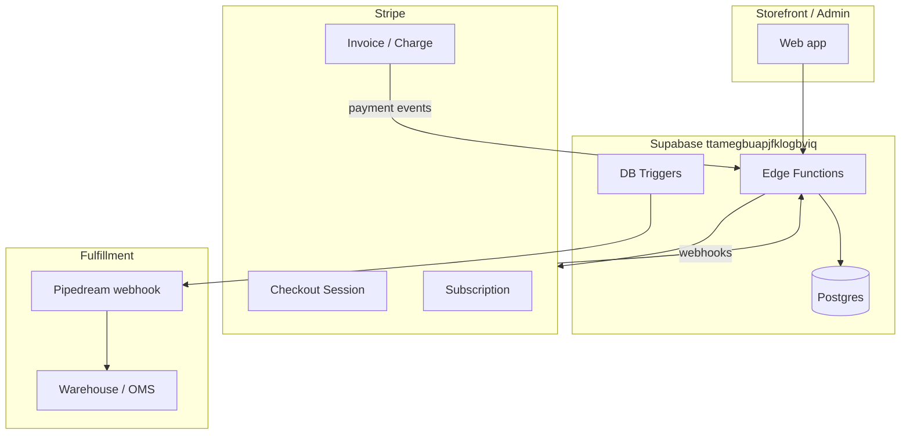
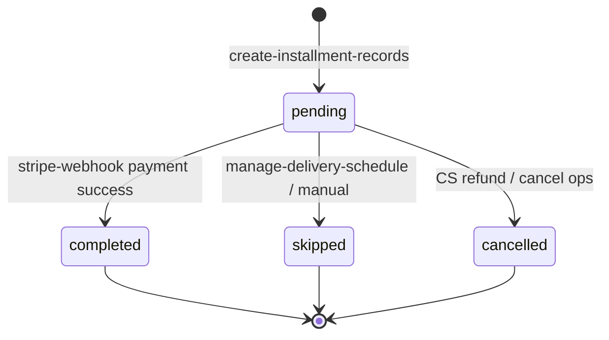

# Ecom Subscription Project — Architecture & Requirements

> **Supabase project:** `ttamegbuapjfklogbviq`  
> **Domain:** Merries (Thailand) diaper subscription — monthly installments, Stripe billing, warehouse fulfillment  
> **Source of truth for code:** Deployed edge functions (originally from `Supabase_cl` on another machine). **Not** in the CRM repo (`wkevmsedchftztoolkmi`).  
> **Status doc:** Reverse-engineered from live schema + deployed functions (July 2026).

---

## 1. Purpose

Enable customers to subscribe to **Merries diaper packages** on a **fixed-term monthly plan** (typically **24 cycles**):

1. Customer selects package(s), delivery address, optional freebie picks.
2. System creates **installment schedule** (price, SKUs, delivery dates) with **per-installment promotions**.
3. **Stripe** charges the net price each cycle.
4. **Fulfillment** (Pipedream → OMS) ships when installment rows are created/updated.
5. Subscription **ends automatically** after the configured cycle count, or via **cancel**.

This is **not** CRM loyalty, Shopify marketplace sync, or platform plan entitlements.

---

## 2. System context



| Integration | Role |
|---|---|
| **Stripe** | Checkout, recurring charges, pause/retry, cancel |
| **Supabase Auth** | `auth.users` linked via `subscriptions.userid` |
| **Pipedream** | Installment INSERT/UPDATE → enriched payload for shipping |
| **BigCommerce** | Legacy migration path (`migrate-bigcommerce-user`, `big_commerce_id` on `user_data`) |

---

## 3. Data model

### 3.1 Core entities

| Table | Purpose |
|---|---|
| `user_data` | Customer profile: email, name, `stripe_customer_id`, legacy `big_commerce_id` |
| `package` | Sellable bundle: code, name, base `price_per_installment`, `frequency`, `installment_no_options` |
| `package_items` | SKUs + qty per package |
| `sku_master` | Product catalog |
| `promotionrules` | Per-package, per-installment discounts and promo freebies |
| `subscriptions` | Master subscription row |
| `subscription_packages` | Multi-package cart (package_code + quantity) |
| `subscription_freebie_selections` | Customer-chosen freebie SKU per installment # |
| `installments` | One billing + delivery cycle |
| `installment_items` | Line items (regular + promo + selected freebies) |
| `freebie_options` | Admin catalog of selectable freebies for UI |
| `Province`, `District`, `Sub-district` | Thai address reference |

### 3.2 Key columns — `subscriptions`

| Column | Meaning |
|---|---|
| `subscription_code` | `SUB{YYYYMMDD}{####}` |
| `userid` | UUID → `auth.users` |
| `package_code` | Primary package (legacy; multi-package uses `subscription_packages`) |
| `stripe_subscription_id` | Stripe `sub_…` |
| `session_id` | Stripe Checkout `cs_…` |
| `subscription_status` | See §4 |
| `interval` | Total billing cycles (usually **24**) |
| `frequency` | `month` / `monthly` |
| `current_installment` | Updated by trigger when installment → `completed` |
| `next_payment_date` | Next charge (mirrors Stripe scheduling) |
| `address` | JSONB delivery address |

### 3.3 Key columns — `installments`

| Column | Meaning |
|---|---|
| `installment_no` | Cycle 1…N |
| `installment_code` | `IN{YYYYMMDD}{####}` |
| `price_per_installment` | Pre-discount total |
| `discount` | Total amount discounted |
| `net_price` | **Amount Stripe should charge** |
| `scheduled_delivery_date` | Customer delivery date |
| `scheduled_date` | **Payment date** (= delivery − 5 days) |
| `one_time_skip_date` | One-off reschedule marker |
| `order_status` | Payment: `pending`, `completed`, `skipped`, `cancelled` |
| `shipment_status` | Fulfillment: `pending` → `shipped` → `delivered` → … |
| `tracking_no` | Set via `update_installment_tracking()` |

### 3.4 Enums

**`order_status`:** `pending`, `cancelled`, `skipped`, `completed`  
**`shipping_status`:** `pending`, `awaiting_fullfilment`, `shipped`, `delivered`, `complete`  
**`discount_type`:** `percentage`, `amount`, `freebie`

### 3.5 View

**`installments_detail_view`** — installments joined to subscription, package, user email, aggregated items (used for reporting).

---

## 4. Subscription & installment lifecycle

### 4.1 Subscription statuses (observed)

| Status | Meaning |
|---|---|
| `pending` | Row created; checkout not completed |
| `waiting_for_payment` | Checkout session created |
| `ongoing` | At least one successful payment |
| `completed` | All cycles finished |
| `cancel` / `end` | Terminated (inconsistent naming in code vs data) |

### 4.2 Installment lifecycle



### 4.3 Scheduling rules

| Rule | Value |
|---|---|
| First delivery default | **Now + 7 days** (if not provided) |
| Payment vs delivery | `scheduled_date` = `scheduled_delivery_date` − **5 days** |
| Subsequent delivery | Previous delivery **+ 1 calendar month** (same day-of-month when possible) |
| Term length | `subscriptions.interval` (typically 24); hardcoded **24** in `dynamic-subscription` regardless of request |

### 4.4 Pricing & promotions

Applied in **`create-installment-records`** when an installment row is created:

1. Sum `package.price_per_installment × quantity` across all packages.
2. Match `promotionrules` where `package_code` ∈ cart AND `period === installment_no`.
3. Apply **percentage** discounts first, then **amount** discounts.
4. Add **freebie** SKUs from matching rules to `installment_items`.
5. Add **customer-selected** freebies from `subscription_freebie_selections` for that installment #.

**Example (P17):** 24 rows of tiered `amount` discounts — month 9 net ≈ ฿2,100 from base ฿2,556.

---

## 5. Edge functions (deployed)

| Function | Auth | Responsibility |
|---|---|---|
| `dynamic-subscription` | Public | Signup: save packages/freebies, create installment #1, Stripe Checkout |
| `create-installment-records` | Public | Create installment + items + apply promotions |
| `stripe-webhook` | Public | Payment success/failure, next installment, Stripe price/trial_end updates |
| `stripe-payment` | Public | Legacy checkout helper |
| `create-stripe-customer` | Public | Stripe customer creation |
| `get-subscriptions` | Public | User subscription list (uses caller JWT + RLS) |
| `get-stripe-subscription` | Public | Read Stripe sub state |
| `cancel-subscription` | Public | Stripe cancel + DB `end` |
| `resume-subscription` | Public | Unpause Stripe sub |
| `manage-delivery-schedule` | Public | Reschedule / skip delivery; updates `trial_end` |
| `update-subscription-package` | Public | Change package mid-subscription |
| `update-freebie-selections` | JWT | Customer freebie picks |
| `get-packages-with-promotions` | JWT | Catalog + promos for FE |
| `simulate-installment-pricing` | Public | Price preview |
| `simulate-package-pricing` | Public | Price preview |
| `installment-webhook` / `installments-webhook` | JWT | Alternate fulfillment paths |
| `migrate-bigcommerce-user` | Public | Legacy import |
| `migrate-subscription-packages` | Public | Backfill multi-package table |
| **`stripe-refund`** | **Service role** | Refund charge/PI + optional Supabase sync (v1, Jul 2026) |

### 5.1 DB functions & triggers

| Object | Role |
|---|---|
| `update_subscription_current_installment` | Trigger: on installment `completed` → update `subscriptions.current_installment` |
| `send_installment_webhook_to_pipedream` | Trigger: installment INSERT/UPDATE → Pipedream |
| `update_installment_tracking(installment_code, tracking_no)` | RPC for logistics |
| `get_complete_schema()` | Schema export helper |

---

## 6. Stripe integration model

### 6.1 Design pattern

**Not a fixed-price monthly sub.** Each cycle:

1. Installment row defines **net_price** for that month.
2. Stripe Subscription carries **one line item** whose **Price is swapped** after each payment.
3. **Next charge timing** uses `trial_end` (not billing_cycle_anchor alone).
4. Subscription intended to **auto-cancel** when `installment_no >= interval`.

### 6.2 Signup flow

```
dynamic-subscription
  → create-installment-records (#1)
  → stripe.checkout.sessions.create({ mode: "subscription", line_items: [net_price #1] })
  → store session_id on subscriptions
```

### 6.3 Renewal flow (`stripe-webhook`)

On `checkout.session.completed` (paid) or trial-end / resume paths:

1. Set subscription `ongoing`.
2. Mark **latest** installment `order_status = completed`.
3. If `installment_no >= interval` → cancel Stripe sub, mark subscription `completed`.
4. Else → `create-installment-records` for next #, create new Stripe Price, update sub item, set `trial_end` to next `scheduled_date`.

### 6.4 Failure handling

`invoice.payment_failed` → pause collection **1 day**, auto-retry.

### 6.5 Delivery rescheduling

`manage-delivery-schedule` recalculates payment date and sets Stripe `trial_end`.

### 6.6 Credentials

All Stripe functions use **`STRIPE_SECRET_KEY`** from Supabase Edge Function secrets (project-level). Verified working via live `get-stripe-subscription` calls.

---

## 7. Fulfillment

On installment INSERT/UPDATE, trigger **`send_installment_webhook_to_pipedream`** POSTs to:

`https://eoztbgymjdxkuc1.m.pipedream.net`

Payload includes installment row, subscription (with address), and enriched `installment_items` (SKU details).

**Implication:** Creating or updating installments may trigger warehouse picks — coordinate with ops before bulk DB changes.

---

## 8. Security & RLS

| Table | RLS |
|---|---|
| Most tables | Enabled |
| **`subscription_packages`** | **Disabled** (critical exposure if using anon key) |

Many **mutating edge functions are `verify_jwt: false`** (public if URL is known): `cancel-subscription`, `stripe-webhook`, `dynamic-subscription`, etc.

**Exception:** `stripe-refund` requires **service_role** Bearer token (v1).

---

## 9. Known gaps & technical debt

| Issue | Impact |
|---|---|
| **`invoice.payment_succeeded` no-op** for installment completion | Recurring Stripe charges may not mark installments `completed` in DB |
| **Multiple active Stripe subs per user** | Duplicate billing; CS reports miss charges when filtering one `sub_…` |
| **`current_installment` vs completed rows** | Counter can diverge after skips/reschedules |
| **`cancel-subscription` writes `canceled_at`** | Column **does not exist** in live schema → DB update may fail after Stripe cancel |
| **`manage-delivery-schedule` references `total_installments`** | Column **does not exist** → last-installment guard broken |
| **`dynamic-subscription` ignores `interval_count`** | Always uses 24 |
| **Status naming inconsistency** | `cancel` vs `end` vs `completed` |
| **`user_data.stripe_customer_id` drift** | May not match Stripe customer on active subs |
| **Refund CS flow** | `stripe-refund` v1 deployed Jul 2026; first case: Pim Charusrini (3 Jul 2026) — see `ECOM_SUBSCRIPTION_CANCEL_REFUND_PLAN.md` §11 |
| **Source not in CRM repo** | Changes require MCP deploy or `Supabase_cl` project |

---

## 10. Non-functional requirements (inferred)

| Area | Requirement |
|---|---|
| **Currency** | THB; amounts in DB as decimal baht; Stripe as **satang** (×100) |
| **Multi-package** | Supported via `subscription_packages`; items merged by SKU |
| **Idempotency** | Stripe Price creation per cycle; refund function supports Idempotency-Key |
| **Audit** | Stripe metadata carries installment_id, package_codes; refund metadata supports `cs_reference` |
| **Migration** | BigCommerce mid-subscription import via `current_installment_no` parameter |

---

## 11. Package catalog (sample)

| Code | Product | Base price/mo |
|---|---|---|
| P17 | Merries First Premium Pants **L 36×4** | ฿2,556 |
| P18 | Merries First Premium Pants **XL 32×4** | ฿2,556 |
| P18 ×3 | XL ×3 qty | ฿7,327 net (after promos) |

Full catalog: 20 packages (P01–P20), 433 promotion rules.

---

## 12. Related CRM workspace docs

These describe **different** systems — do not confuse:

| Doc | Scope |
|---|---|
| `requirements/Ecommerce_Marketplace_Integration.md` | Shopee/Lazada/TikTok → loyalty points |
| `requirements/Platform_Plan_Feature_Registry.md` | CRM Shopify SaaS plan tiers |
| `docs/QUOTATION_SHOPIFY_LINE_ITEM.md` | Brand.com + loyalty plugin quotation |

---

## 13. Registry reference (live counts, Jul 2026)

| Entity | Rows |
|---|---|
| `subscriptions` | ~168 |
| `installments` | ~203 |
| `user_data` | ~921 |
| `promotionrules` | ~433 |

**Project URL:** `https://ttamegbuapjfklogbviq.supabase.co`
