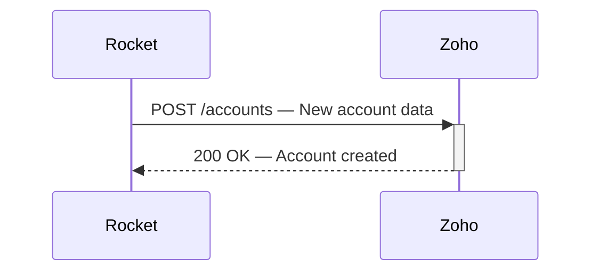
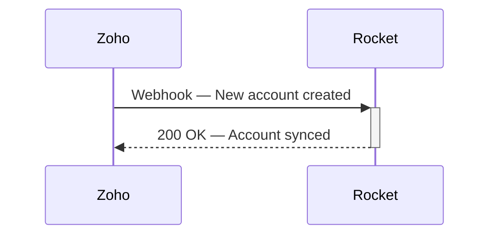
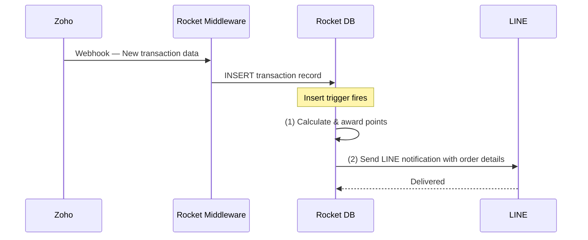
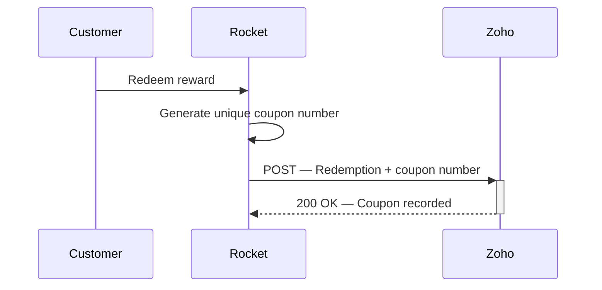

# Integration Details — The Next Optical

## 1. Account

### 1.1 New Account on Rocket → Create Account on Zoho

| Field | Value |
|---|---|
| Type | POST |
| Data From | Rocket |
| Data To | Zoho |
| Frequency | Real-time |
| Mandays | 5 |

When a new customer account is created on Rocket, the system sends a POST request to Zoho CRM to create a matching account record. This ensures Zoho always has an up-to-date customer directory synced from Rocket in real-time.

---

### 1.2 New Account on Zoho → Create Account on Rocket

| Field | Value |
|---|---|
| Type | Webhook |
| Data From | Zoho |
| Data To | Rocket |
| Frequency | Real-time |
| Mandays | 5 |

When a new account is created directly in Zoho (e.g. by a sales rep), Zoho fires a webhook to Rocket so the account is mirrored on the loyalty platform side. This keeps both systems in bidirectional sync.

---

## 2. Purchase Transaction

### 2.1 New Transaction on Zoho → Create Transaction on Rocket

| Field | Value |
|---|---|
| Type | Webhook & Rocket Middleware |
| Data From | Zoho |
| Data To | Rocket |
| Frequency | Real-time |
| Mandays | 10 |

When a new purchase transaction is recorded in Zoho, a webhook sends the transaction data to Rocket middleware, which creates the transaction record in Rocket. Upon insert, a database trigger fires to:

1. **Points Award** — Calculate and award the correct loyalty points to the customer based on the purchase amount.
2. **LINE Notification** — Send a LINE message to the customer with order details and points earned.

---

## 3. Coupons

### 3.1 User Redemption on Rocket → Insert to Zoho with Unique Coupon Number

| Field | Value |
|---|---|
| Type | POST |
| Data From | Rocket |
| Data To | Zoho |
| Frequency | Real-time |
| Mandays | 5 |

When a customer redeems a reward on Rocket, the system generates a unique coupon number and sends it to Zoho via POST. This allows Zoho to track coupon issuance and validate redemptions on the retail/POS side.

