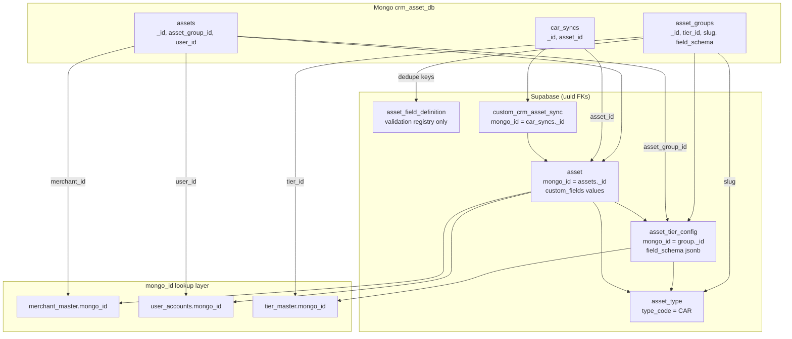

# MongoDB → Supabase CRM: Asset Domain Mapping Architecture

**Scope:** `crm_asset_db` (MongoDB) → Supabase `public` asset domain  
**Project:** `wkevmsedchftztoolkmi`  
**Last verified:** 2026-06-15 (live schema + Mongo MCP)

---

## 1. Design principles

### 1.1 Identity model

| Layer | Rule |
|---|---|
| **Supabase primary key** | Always a new `uuid` (`gen_random_uuid()`). Never reuse Mongo `ObjectId` as `id`. |
| **Cross-system reference** | Store the Mongo `_id` string in a dedicated `mongo_id text` column on the Supabase row. |
| **Foreign keys in Supabase** | Always `uuid` FKs (`merchant_id`, `user_id`, `asset_type_id`, …). Resolve Mongo string refs at ingest time via `mongo_id` lookup — do not store Mongo IDs in FK columns. |
| **Idempotent migration** | Upsert by `(merchant_id, mongo_id)` or unique partial index on `mongo_id WHERE mongo_id IS NOT NULL`. |

### 1.2 Lookup pattern (all ingest jobs)

```
mongo_ref (string)  →  SELECT id FROM <table> WHERE mongo_id = mongo_ref  →  supabase uuid FK
```

If lookup returns no row → skip, dead-letter, or create stub (policy per entity).

### 1.3 Table naming (confirmed)

| Concept | Table / column name |
|---|---|
| Tier-scoped asset group config | **`asset_tier_config`** |
| FK on `asset` | **`asset_tier_config_id`** |
| Legacy car sync tracking | **`custom_crm_asset_sync`** (`custom_` prefix — bespoke migration/integration table, same convention as `custom_futurepark_receipt_crm_sync_runs`) |

---

## 2. Source: MongoDB `crm_asset_db`

| Collection | Documents (approx.) | Role |
|---|---:|---|
| `assets` | 18,325 | Member-owned asset instances (cars) |
| `asset_groups` | 12 | **Tier-scoped** asset category config (fields, limits, tags) |
| `car_syncs` | 14,436 | External sync state per asset |
| `tag` | 0 (empty) | Unused in this DB; tags embedded in `asset_groups` |

### 2.1 `assets`

| Mongo field | Type | Notes |
|---|---|---|
| `_id` | ObjectId | Stable external key → `asset.mongo_id` |
| `asset_group_id` | ObjectId | → `asset_tier_config` (see §4.2) |
| `merchant_id` | string | → `merchant_master.mongo_id` |
| `user_id` | string | → `user_accounts.mongo_id` |
| `priority` | number | Display order |
| `custom_fields` | `[{ slug, value }]` | Transform to jsonb object on `asset.custom_fields` |
| `is_active` | boolean | Map to `status` |
| `created_at`, `updated_at` | Date | Direct |
| `created_by`, `updated_by` | string | No Supabase column today |
| `deleted_at`, `deleted_by` | Date / string | Soft delete — no Supabase column today |

### 2.2 `asset_groups`

| Mongo field | Type | Notes |
|---|---|---|
| `_id` | ObjectId | Stable external key → **`asset_tier_config.mongo_id`** |
| `merchant_id` | string | → `merchant_master.mongo_id` |
| `tier_id` | string | → `tier_master.mongo_id` |
| `name` | string | Display label (e.g. "Car Gold:VIP") |
| `slug` | string | Category code (e.g. `car`) → `asset_type.type_code` |
| `sort` | number | Tier display order |
| `asset_limit_per_user` | number | `0` = tier cannot register assets |
| `tags` | `[{ id, name }]` or null | VIP tag refs (Mongo tag id strings) |
| `custom_fields` | embedded schema array | Full schema → **`asset_tier_config.field_schema`** jsonb (see §4.2 C) |
| `version` | number | Schema version |
| `created_at`, `created_by` | audit | Partial |

**Important:** `asset_groups` is **not** a 1:1 `asset_type`. Multiple groups share `slug: "car"` but differ by `tier_id`. Supabase `asset_type` is unique on `(merchant_id, type_code)`.

### 2.3 `car_syncs`

| Mongo field | Type | Notes |
|---|---|---|
| `_id` | ObjectId | → **`custom_crm_asset_sync.mongo_id`** |
| `merchant_id` | string | → `merchant_master.mongo_id` |
| `asset_id` | string | → `asset.mongo_id` |
| `is_sync` | boolean | Sync flag |
| `created_at`, `updated_at` | Date | Direct |

---

## 3. Target: Supabase asset domain (existing)

| Table | Purpose | `mongo_id` today |
|---|---|---|
| `merchant_master` | Tenant | ✅ + unique partial index |
| `user_accounts` | Members | ✅ + unique partial index |
| `tier_master` | Loyalty tiers | ✅ + unique partial index |
| `asset_type` | Merchant-level type catalog | ✅ column exists, **no unique index yet** |
| `asset` | Asset instances | ✅ column exists, **no unique index yet** |
| `asset_field_definition` | Minimal field registry for validation | ❌ no `mongo_id` (not needed — see §4.2 C) |
| `asset_relation` | Asset-to-asset links | ❌ not used in car domain |
| `tag_master` | Tags | ❌ **`mongo_id` to add** (approved) |

**Not asset domain (do not use for this mapping):**

| Table | Why unrelated |
|---|---|
| `integration_field_definitions` | Integration Hub admin forms (`field_order`, `select_options`) — different feature |
| `form_field_options` | Forms & surveys module |

---

## 4. Entity mapping architecture

### 4.1 Reference entities (already wired)

These are **lookup-only** during asset migration. Do not create duplicate rows; resolve `uuid` from `mongo_id`.

| Mongo ref | Supabase table | Resolution |
|---|---|---|
| `*.merchant_id` | `merchant_master` | `WHERE mongo_id = <string>` |
| `assets.user_id` | `user_accounts` | `WHERE mongo_id = <string>` |
| `asset_groups.tier_id` | `tier_master` | `WHERE mongo_id = <string>` |

**Index status (verified):** `merchant_master`, `user_accounts`, `tier_master` each have  
`CREATE UNIQUE INDEX … ON (mongo_id) WHERE mongo_id IS NOT NULL`.

---

### 4.2 `asset_groups` → split across three Supabase surfaces

```
Mongo asset_groups._id
        │
        ├─► asset_tier_config.mongo_id      (NEW — tier rules, limits, tags, field order)
        │         ├─ tier_id       → tier_master.id
        │         ├─ asset_type_id → asset_type.id
        │         ├─ field_schema  → asset_groups.custom_fields[] (jsonb, preserves sort/options)
        │         └─ asset_limit_per_user, sort, tags, version, name
        │
        ├─► asset_type                        (one row per merchant + slug)
        │         type_code = slug ("CAR")
        │
        └─► asset_field_definition              (minimal deduped registry — validation only)
                  field_key / field_label / field_type
```

#### A. `asset_type` (exists — extend usage)

| Mapping | Detail |
|---|---|
| Grain | One row per `(merchant_id, type_code)` e.g. `CAR` |
| Source | Dedupe `asset_groups.slug` per merchant |
| `mongo_id` | **Do not** store `asset_groups._id` here (many groups → one type). Store slug (`car`) or leave null. Tier-specific identity belongs on `asset_tier_config`. |
| `type_name` | From slug, e.g. `"Car"` |

#### B. `asset_tier_config` (**CREATE**)

Holds what Mongo encodes per tier in `asset_groups`.

| Proposed column | Source (Mongo) | Notes |
|---|---|---|
| `id` | — | uuid PK |
| **`mongo_id`** | `asset_groups._id` | **Required** — primary cross-ref |
| `merchant_id` | `asset_groups.merchant_id` | uuid FK |
| `tier_id` | `asset_groups.tier_id` | uuid FK via `tier_master.mongo_id` |
| `asset_type_id` | derived from `slug` | uuid FK |
| `name` | `asset_groups.name` | e.g. "Car Gold:VIP" |
| `sort` | `asset_groups.sort` | Tier config display order |
| `asset_limit_per_user` | `asset_groups.asset_limit_per_user` | |
| `tags` | `asset_groups.tags` | jsonb until `tag_master` migration |
| **`field_schema`** | `asset_groups.custom_fields` | **jsonb array** — preserves `sort`, `is_unique`, `options` from Mongo |
| `version` | `asset_groups.version` | |
| `is_active` | — | default true |
| `created_at` | `asset_groups.created_at` | |

**Unique constraint (recommended):** `(merchant_id, mongo_id)` and `(merchant_id, tier_id, asset_type_id)`.

**Field sort / options home:** `field_schema` on this table — **not** on `asset_field_definition`. UI reads tier config ordered by each entry's `sort` inside the jsonb (same as legacy Mongo service).

#### C. `asset_field_definition` — migration scope (no extension needed now)

**What exists today:** `field_key`, `field_label`, `field_type`, `(merchant_id, asset_type_id)`.

**What consumes it:** `validate_asset_custom_fields()` — checks that keys exist and values match coarse types (`number`, `date`, `boolean`). It does **not** read options, uniqueness, or sort order.

| Mongo field metadata | Where it lives for migration | Extend `asset_field_definition`? |
|---|---|---|
| `slug`, `name`, `type` | Rows in `asset_field_definition` (deduped per type) | ✅ already covered |
| `sort` | `asset_tier_config.field_schema[].sort` | ❌ **not needed** on definition table |
| `options[]` | `asset_tier_config.field_schema[].options` | ❌ **not needed for migration** |
| `is_unique` | `asset_tier_config.field_schema[].is_unique` | ❌ **not needed for migration** |
| Instance **values** | `asset.custom_fields` jsonb object | N/A — no values table |

**Why options are not required for migration:**

1. Mongo stores **values as plain strings** in `assets.custom_fields` — province, brand, plate are already materialized, not option IDs.
2. `SELECT_STRING` options in Mongo were for **registration UI** — historical data migrates as-is into `asset.custom_fields`.
3. No separate "asset field values" table exists or is needed; the instance payload is `asset.custom_fields`.

**When options on `asset_field_definition` would matter later (post-migration / greenfield):**

| Use case | Needed? |
|---|---|
| One-time Mongo → Supabase data move | **No** |
| Admin UI to build dynamic registration forms from DB | **Yes** — add `field_options jsonb` then |
| Server-side validation that SELECT values ∈ allowed set | **Yes** — extend `validate_asset_custom_fields` then |
| Cross-tier single field catalog without reading tier jsonb | **Maybe** — normalize from `field_schema` in a later pass |

**Migration seeding rule:** Insert one row per distinct `(merchant_id, asset_type_id, field_key)` into `asset_field_definition` from a canonical `asset_groups` template. Copy the **full** embedded array (including sort, options, is_unique) into `asset_tier_config.field_schema` per tier row.

---

### 4.3 `assets` → `asset`

| Mongo `assets` | Supabase `asset` | Resolution |
|---|---|---|
| `_id` | **`mongo_id`** | Store as text; generate new `id` uuid |
| `merchant_id` | `merchant_id` | Lookup `merchant_master.mongo_id` |
| `user_id` | `user_id` | Lookup `user_accounts.mongo_id` |
| `asset_group_id` | **`asset_tier_config_id`** | Lookup `asset_tier_config.mongo_id` |
| — | `asset_type_id` | From `asset_tier_config.asset_type_id` or slug |
| — | `name` | **Required in PG** — derive e.g. `"{car_plate} · {brand} {car_model}"` |
| `custom_fields[]` | `custom_fields` | `[{slug,value}]` → `{ "car_plate": "…", … }` |
| `is_active` | `status` | `true` → `"Active"`, `false` → `"Inactive"` |
| `priority` | — | Add `priority integer` or `custom_fields.priority` |
| `deleted_at` | — | Add `deleted_at timestamptz` or exclude from migrate |
| `created_at`, `updated_at` | same | Direct |
| `created_by`, `updated_by` | — | Optional `custom_fields` or audit columns |

**Recommended index (missing today):**

```sql
CREATE UNIQUE INDEX idx_asset_mongo_id
  ON asset (merchant_id, mongo_id)
  WHERE mongo_id IS NOT NULL;
```

---

### 4.4 `car_syncs` → `custom_crm_asset_sync` (**CREATE**)

Legacy integration table — uses **`custom_`** prefix per platform convention.

| Proposed column | Source (Mongo) |
|---|---|
| `id` | uuid PK |
| **`mongo_id`** | `car_syncs._id` |
| `merchant_id` | `car_syncs.merchant_id` → uuid FK |
| `asset_id` | `car_syncs.asset_id` → `asset.id` via `asset.mongo_id` |
| `is_sync` | `car_syncs.is_sync` |
| `created_at`, `updated_at` | direct |

**Unique constraint:** `(merchant_id, mongo_id)`.

---

### 4.5 Tags (embedded in `asset_groups`)

| Mongo | Supabase today | Action |
|---|---|---|
| `asset_groups.tags[].id` | — | Tag id strings (e.g. `5f3c8c6b48e7e2b4176f459f`) |
| `crm_asset_db.tag` | empty | No source rows in asset DB |
| `tag_master` | exists | **Add `mongo_id text`** + unique partial index (**approved**) |

**Near-term:** keep tag payload on `asset_tier_config.tags` jsonb during migration; resolve to `tag_master.id` once tags are migrated from source Mongo DB.

---

## 5. `mongo_id` inventory — exists vs must create

### 5.1 Already has `mongo_id` (use as-is)

| Supabase table | Mongo source | Unique index on `mongo_id` |
|---|---|---|
| `merchant_master` | `merchants._id` / string ids in asset DB | ✅ |
| `user_accounts` | `users._id` | ✅ |
| `tier_master` | tier `_id` | ✅ |
| `asset` | `assets._id` | ❌ **add** `(merchant_id, mongo_id)` |
| `asset_type` | slug-level, not group `_id` | ❌ **add** if storing slug; optional |

### 5.2 Missing `mongo_id` — schema work required

| Entity | Recommended action |
|---|---|
| **`asset_tier_config`** (new table) | **Create table + `mongo_id`** ← maps `asset_groups._id` |
| **`custom_crm_asset_sync`** (new table) | **Create table + `mongo_id`** ← maps `car_syncs._id` |
| **`tag_master`** | **Add `mongo_id text`** + unique partial index (**approved**) |
| **`asset_field_definition`** | No `mongo_id` — natural key `(merchant_id, asset_type_id, field_key)`; **no column extensions for migration** |
| **`asset`** | Column exists; **add unique index** on `(merchant_id, mongo_id)` |
| **`asset_type`** | Column exists; optional slug in `mongo_id`; **add unique index** if populated |

### 5.3 Not applicable for car migration

| Table | Reason |
|---|---|
| `asset_relation` | Salesforce maintenance-plan links; no Mongo car equivalent |
| `stg_mongo_*` | Staging only — not runtime target |

---

## 6. End-to-end resolution flow



---

## 7. Ingest order (dependency-safe)

1. **Reference data** (must exist before assets): `merchant_master`, `tier_master`, `user_accounts` — all via existing `mongo_id`.
2. **`asset_type`** — upsert `CAR` per merchant from deduped `asset_groups.slug`.
3. **`asset_field_definition`** — seed minimal rows (key / label / type) from canonical group template.
4. **`asset_tier_config`** — one row per `asset_groups` document; `mongo_id = _id`; `field_schema = custom_fields` array as jsonb.
5. **`asset`** — `mongo_id = _id`; resolve all uuid FKs via lookup; skip rows with missing user/tier/group.
6. **`custom_crm_asset_sync`** — resolve `asset_id` via `asset.mongo_id`.
7. **`tag_master`** — when tag source DB identified; add `mongo_id` and backfill.

---

## 8. Transform rules (quick reference)

### 8.1 Instance `custom_fields` shape (values)

```json
// Mongo assets.custom_fields
[{ "slug": "car_plate", "value": "4กบ4433" }, { "slug": "brand", "value": "HONDA" }]

// Supabase asset.custom_fields
{ "car_plate": "4กบ4433", "brand": "HONDA" }
```

### 8.2 Tier `field_schema` shape (definition + order — unchanged from Mongo)

```json
// asset_tier_config.field_schema ← copy of asset_groups.custom_fields
[
  { "name": "License plate", "slug": "car_plate", "type": "STRING", "sort": 1, "is_unique": true },
  { "name": "Province", "slug": "car_plate_province", "type": "SELECT_STRING", "sort": 2, "is_unique": true, "options": ["กรุงเทพมหานคร", "..."] }
]
```

### 8.3 `name` derivation (required column)

```
name = COALESCE(
  custom_fields->>'car_plate' || ' · ' || custom_fields->>'brand' || ' ' || custom_fields->>'car_model',
  custom_fields->>'car_plate',
  'Car asset'
)
```

### 8.4 Soft-deleted Mongo assets

If `deleted_at IS NOT NULL`: either migrate with `deleted_at` column (recommended) or filter out and keep `mongo_id` in a dead-letter log.

---

## 9. Schema DDL backlog (for approval)

| # | Change | Priority |
|---|---|---|
| 1 | `CREATE TABLE asset_tier_config (… mongo_id, field_schema jsonb …)` | **P0** |
| 2 | `CREATE TABLE custom_crm_asset_sync (… mongo_id …)` | **P0** |
| 3 | `CREATE UNIQUE INDEX idx_asset_mongo_id ON asset (merchant_id, mongo_id) WHERE mongo_id IS NOT NULL` | **P0** |
| 4 | `ALTER TABLE asset ADD asset_tier_config_id uuid REFERENCES asset_tier_config(id)` | **P0** |
| 5 | `ALTER TABLE tag_master ADD mongo_id text` + unique partial index | **P1** (approved) |
| 6 | `ALTER TABLE asset ADD priority int, deleted_at timestamptz` | **P2** (optional) |
| ~~7~~ | ~~`asset_field_definition` options / sort / is_unique columns~~ | **Deferred** — covered by `asset_tier_config.field_schema` for migration |

---

## 10. Out of scope (different product line)

Supabase today also holds **Euro Creations / Salesforce** assets (`type_code` `ASSET`, `MAINTENANCE_PLAN`) with no Mongo counterpart in `crm_asset_db`. Those rows use the same core tables but a different `asset_type` grain. Car migration adds `CAR` types alongside — no collision if `type_code` is merchant-scoped.

---

## 11. Verification queries (post-migration)

```sql
-- Row counts vs Mongo
SELECT COUNT(*) FROM asset WHERE mongo_id IS NOT NULL;
SELECT COUNT(*) FROM asset_tier_config WHERE mongo_id IS NOT NULL;
SELECT COUNT(*) FROM custom_crm_asset_sync WHERE mongo_id IS NOT NULL;

-- Orphan check: assets whose user mongo ref didn't resolve
SELECT a.mongo_id FROM asset a
LEFT JOIN user_accounts u ON u.id = a.user_id
WHERE a.mongo_id IS NOT NULL AND a.user_id IS NOT NULL AND u.id IS NULL;

-- Duplicate mongo_id guard
SELECT merchant_id, mongo_id, COUNT(*) FROM asset
WHERE mongo_id IS NOT NULL GROUP BY 1, 2 HAVING COUNT(*) > 1;
```

---

## 12. Summary

| Mongo collection | Supabase target | `mongo_id` home |
|---|---|---|
| — | `merchant_master` | ✅ exists |
| — | `user_accounts` | ✅ exists |
| — | `tier_master` | ✅ exists |
| `asset_groups` | **`asset_tier_config`** (create) | **`asset_tier_config.mongo_id`** |
| `asset_groups.slug` | `asset_type` | optional slug on `asset_type.mongo_id` |
| `asset_groups.custom_fields` (schema) | **`asset_tier_config.field_schema`** | jsonb — sort/options/is_unique preserved |
| `asset_groups.custom_fields` (keys) | `asset_field_definition` | natural key only — validation registry |
| `assets` (values) | `asset.custom_fields` | ✅ **`asset.mongo_id`** (index missing) |
| `car_syncs` | **`custom_crm_asset_sync`** (create) | **`custom_crm_asset_sync.mongo_id`** |
| embedded tags | `asset_tier_config.tags` → `tag_master` | **`tag_master.mongo_id`** to add (approved) |

**Never** write Mongo ObjectIds into Supabase uuid PK or FK columns. Always resolve through `mongo_id` lookup, then persist the resulting uuid.
