# Currency (Points & Tickets) - Calculation & Award Engine

## Executive Summary
This document specifies a comprehensive **currency rewards system** for purchase transactions. The system enables merchants to create flexible **loyalty programs** that award **multiple currency types** (points and tickets) based on customer purchases, with support for both public reward mechanisms and personalized offers.

The architecture consists of two primary services:
1. **Currency Calculation Engine** - Determines reward amounts without affecting balances
2. **Currency Award Service** - Processes and records rewards to customer wallets

**Architecture (v2.0)**: CDC → Render Consumer → Inngest (matching Tier architecture)

## Table of Contents
- [Glossary of Terms](#glossary-of-terms)
- [Business Requirements](#business-requirements)
  - [Loyalty Program Configuration Model](#loyalty-program-configuration-model)
  - [Public Earning Rules vs Personalized Offers](#public-earning-rules-vs-personalized-offers)
  - [Tier Integration and Benefits](#tier-integration-and-benefits---one-of-many-attributes)
  - [Currency Expiry Management](#currency-expiry-management)
    - [Daily Expiry Processing](#daily-expiry-processing)
  - [Currency Reversal Management](#currency-reversal-management)
- [Currency Calculation Engine](#1-currency-calculation-engine)
- [Currency Award Service](#2-currency-award-service)
  - [Durable Execution Architecture](#durable-execution-architecture)
  - [Merchant Configuration for Delayed Awards](#merchant-configuration-for-delayed-awards)
  - [Award Process (Inngest Workflow)](#award-process-inngest-workflow)
  - [Workflow Observability](#workflow-observability)
  - [Currency Reversal Handling](#currency-reversal-handling)
- [System Operations](#system-operations)
- [Business Rules Summary](#business-rules-summary)
- [Implementation Examples](#implementation-examples)
- [API Integration](#api-integration)
- [Complete Transaction Flow](#currency---complete-transactions-to-currency-flow)
- [Architecture Components](#architecture-components)
- [Appendix: Technology Stack](#appendix-technology-stack)

---

## Glossary of Terms

### Core Concepts

**Currency Types**: The system supports multiple reward currencies:
- **Points**: Standard fungible loyalty currency for general rewards (all points are interchangeable)
- **Tickets**: Non-fungible special event currency where each ticket type is distinct and tracked separately
  - Examples: "Raffle Tickets", "Birthday Vouchers", "VIP Access Passes", "Parking Passes"
  - Each ticket type maintains independent balances
  - Cannot be exchanged between types

**Earn Factor**: A rule that determines how customers earn currency. There are two types:
- **Rate Factor**: Converts purchase amount to currency (e.g., "Spend 100 THB, get 1 point" or "Spend 500 THB, get 1 ticket")
  - For tickets: Must specify which ticket type via `target_entity_id`
- **Multiplier Factor**: Increases currency by a multiplication factor (e.g., "Triple points on shoes", "Double tickets for VIP")
  - Applies to specific currency and ticket type combinations

**Earn Factor Group**: A container that bundles related earn factors together, defining shared properties like validity period and whether multipliers can stack

**Entity**: The type of condition that triggers an earn factor. Examples:
- `product_sku`: Specific product variants
- `product_product`: Product types
- `product_brand`: Brand-based loyalty rewards
- `product_category`: Category-wide earning rules
- `tier`: Customer loyalty tier benefits

**Earn Conditions**: Qualifying criteria that must be met for an earn factor to apply (e.g., "only for Gold tier members" or "only for Nike products")

**UOM (Unit of Measure)**: Standardized measurement units for products, supporting multi-tier quantity tracking:
- **Primary UOM**: Standard retail units (e.g., BAG, PIECE, BOTTLE, SACHET)
- **Secondary UOM**: Bulk/wholesale units (e.g., TON, PALLET, CARTON, CASE)
- Enables quantity-based thresholds for B2B and bulk purchase scenarios

**Threshold**: Minimum or maximum quantity/amount requirements for earn factors:
- Can be based on primary quantity, secondary quantity, or purchase amount
- Enables rules like "Buy ≥50 units" or "Spend ≥5000 THB"
- Supports caps to prevent abuse (e.g., "Max 1000 units eligible")

**Stackable**: A group property determining if multiple multipliers combine (stackable) or if only the best one applies (non-stackable)

**Operator**: A condition-level setting that determines how multiple entities in an earn condition are evaluated:
- **OR (Aggregate)**: Sum quantities/amounts across all matching entities, check threshold on total
- **AND (All Required)**: All entities must be present in purchase, each checked individually against threshold
- **EACH (Independent)**: Each entity evaluated independently, only those meeting threshold are included
- Only relevant for product/store entities (tier/persona use implicit OR since user has single value)

**Multiplier Calculation Mode**: A merchant-level config (`multiplier_additive`) that determines how multiplier bonuses are calculated:
- **false (Total Rate, default)**: Multiplier represents total earning rate - bonus = base × (M - 1)
  - Example: 5x multiplier on 10K base = 10K + (10K × 4) = 50K total (5× base)
- **true (Additive)**: Multiplier is pure addition on top of base - bonus = base × M
  - Example: 5x multiplier on 10K base = 10K + (10K × 5) = 60K total (6× base)
- Allows merchants to choose their business model for multiplier semantics

**Currency Components**: How currency is categorized in the wallet:
- **Base** (`base`): Currency earned from the standard rate conversion
- **Bonus** (`bonus`): Additional currency from multipliers
- **Adjustment** (`adjustment`): Manual corrections by administrators
- **Reversal** (`reversal`): Currency deducted due to refunds or corrections

**Transaction Types**:
- **Earn** (`earn`): Currency awarded to user
- **Burn** (`burn`): Currency spent/redeemed by user

**Signed Amount vs Amount**:
- **Amount**: Always positive, represents the absolute value
- **Signed Amount**: Directional value (+positive for earn, -negative for burn/reversal)

**Ticket Type**: A distinct, non-fungible ticket entity with its own balance tracking:
- Each ticket type has unique ID, name, and validity period
- Examples: "Christmas Raffle 2024", "VIP Concert Access", "Free Parking Pass"
- Defined in `ticket_type` table

**Target Entity ID**: Reference to specific ticket type for non-fungible tracking:
- Required (`NOT NULL`) for all ticket transactions
- Must be `NULL` for points transactions (fungible)
- Links to `ticket_type.id`

**Source Types**: The origin of a wallet transaction (unified across all award paths):
- `purchase`: Currency from buying products
- `referral`: Rewards from referral program (inviter/invitee bonuses)
- `mission`: Currency earned from completing missions/tasks
- `campaign`: Special loyalty program awards (fixed amounts via metadata)
- `manual`: Admin adjustments (fixed amounts via metadata)

**Currency Expiry**: Mechanism to automatically invalidate unused currency after a specified period, reducing financial liability and encouraging timely redemption.

**Expiry Modes**:
- **TTL (Time-To-Live)**: Currency expires X months after being earned
- **Fixed Frequency**: Currency expires at regular fiscal periods (monthly, quarterly, semi-annual, annual)
- **Absolute Date**: All currency of a type expires on a specific date (tickets only)

**Fiscal Period**: Merchant-defined accounting period for expiry alignment (e.g., fiscal year ending June 30)

**Minimum Period Protection**: Ensures currency remains valid for a minimum duration before expiry, even in fixed frequency mode

**Deductible Balance**: The remaining usable amount of currency that can expire (original amount minus any redemptions)

**Expired Amount**: The portion of currency that has been processed as expired and deducted from user balance

---

## Business Requirements

### Overview
When a customer completes a purchase, the system calculates rewards based on active **loyalty program rules**. These rules can range from simple conversion rates ("100 THB = 1 point") to complex multi-layered earning mechanisms with product-specific bonuses and customer tier benefits.

### Loyalty Program Configuration Model

#### How Currency Award Mechanisms Work
Merchants create **loyalty earning rules** using earn factors organized into earn factor groups. This two-level structure provides both flexibility and consistency:

1. Groups define program-wide settings: Duration, stacking rules, general activation
2. Individual factors define specific rewards: Rates, multipliers, conditions, exceptions

#### Property Inheritance System
To simplify loyalty program management, individual earn factors automatically inherit settings from their parent group unless explicitly overridden. This works like company-wide policies with department exceptions:

**Program Duration (Window Period)**:
- When a merchant sets a group to run from June 1-30, all factors in that group automatically run for the same period
- Individual factors can override this (e.g., "Flash bonus ends June 15")
- If neither group nor factor specifies dates, the earning rule runs indefinitely
- Business Benefit: Set once at program level, manage by exception

**Activation Status**:
- Merchants can pause entire earning mechanisms by deactivating the group
- Individual factors can be turned on/off independently
- If not specified, factors are active by default
- Business Benefit: Emergency stop for entire programs or selective factor control

**Example: Seasonal Loyalty Program**
```
Group: "Q2 2024 Earning Rules" (Apr 1 - Jun 30, Active)
├── Factor 1: "Standard earning rate" → Inherits Apr 1 - Jun 30
├── Factor 2: "Category multiplier" → Inherits Apr 1 - Jun 30
└── Factor 3: "Flash weekend bonus" → Override to specific weekends only
```

### Public Earning Rules vs Personalized Offers

The system supports two distribution strategies that work together:

#### Public Earning Rules
Available to all eligible customers automatically. Examples:
- "Standard loyalty earning rate"
- "Gold members permanent 2x multiplier"
- "Category-based earning multipliers"

These are configured with `public = true` in the earn_factor table.

#### Personalized Offers
Exclusive rewards assigned to specific customers through the earn_factor_user table. Examples:
- "Birthday month: 5x currency for you"
- "Welcome back: Triple points on your next purchase"
- "VIP exclusive: 10x points this week"

**How Personalized Offers Work**:
1. Loyalty team creates a private earn factor (public = false)
2. System assigns it to selected customers via earn_factor_user table
3. Each assignment includes an expiration date (window_end)
4. During purchase, both public and private factors are evaluated
5. Customer receives the best applicable combination

**Real-World Example**: Sarah makes a 1,000 THB purchase on her birthday (June 15):
- Public rule: 2x points for Gold members (she qualifies)
- Private offer: 5x birthday points (assigned only to her)
- System selects the 5x birthday bonus (better value)
- Other Gold members only get 2x on the same day

### Tier Integration and Benefits - One of Many Attributes

**IMPORTANT**: Customer tier is **NOT** the primary determinant of earn rates. It's just **one attribute among many** in our modular loyalty system.

#### The Modular Attribute System

The currency earn rate calculation considers multiple independent attributes that can combine, compete, or override each other:

**1. Customer Tier** (e.g., Gold = 1.5x)
- One factor among many
- Can be overridden by campaigns or promotions

**2. Product Category** (e.g., Electronics = 2x, Groceries = 1x)
- Independent of customer tier
- Category-specific promotions can exceed tier benefits

**3. Store Location** (e.g., Airport = 3x, Outlet = 0.8x)
- Location-based multipliers
- High-margin locations may offer better rates than tier benefits

**4. Campaign Participation** (e.g., Double Points Weekend = 2x)
- Time-bound promotions
- Often exceeds tier multipliers to drive urgency

**5. Payment Method** (e.g., Store Card = 1.5x, Cash = 1x)
- Transaction-type incentives
- Encourages preferred payment methods

**6. Customer Persona** (e.g., New Customer = 3x first purchase)
- Behavioral/demographic targeting
- Acquisition offers often beat loyalty tier rates

**7. Special Occasions** (e.g., Birthday Month = 5x)
- Personalized temporal bonuses
- Typically the highest multipliers in the system

#### Real-World Flexibility Examples

**Example 1: Campaign Overrides Tier**
```
Bronze Tier Customer during Flash Sale:
- Tier multiplier: 1x (no bonus)
- Flash Sale multiplier: 4x
- Result: Bronze customer earns MORE than Gold tier (2x) during sale
```

**Example 2: Multiple Attributes Combining**
```
Silver Tier Customer:
- Tier: 1.2x
- Store Location (Airport): 2x
- Payment (Store Card): 1.3x
- Final: Depends on stacking rules (multiplicative, additive, or best-of)
```

**Example 3: New Customer vs Loyal Customer**
```
New Customer First Purchase: 5x points (acquisition offer)
Platinum Tier Regular Purchase: 2.5x points
Result: New customers earn DOUBLE the rate of top-tier members
```

#### Configuration Independence

Each attribute system operates independently:
- **Tiers**: Managed in `tier_master` and `tier_conditions`
- **Campaigns**: Separate `campaign_master` system
- **Product Rules**: Independent `earn_factor` configurations
- **Location Rules**: Store-specific multipliers
- **Persona Rules**: Behavioral segmentation engine

This modular architecture ensures:
- Marketing can run promotions without affecting tier logic
- New attributes can be added without modifying existing ones
- Merchants control how attributes combine (stack, override, or best-of)
- Maximum flexibility for business strategy changes

### Currency Expiry Management

#### Business Rationale
Merchants need to manage the financial liability of outstanding loyalty currency while encouraging timely customer engagement. The expiry system provides flexible options to:
- Reduce long-term financial obligations
- Drive urgency in customer redemption behavior
- Align with accounting periods and fiscal reporting
- Support time-limited promotional campaigns

#### Expiry Configuration Model

**Dual-Level Configuration**:
1. **Points Expiry**: Configured at merchant level, applies uniformly to all customers
2. **Ticket Expiry**: Configured per ticket type, allowing different validity periods

**Supported Expiry Modes**:

1. **TTL (Time-To-Live) Mode**:
   - Each currency unit expires individually after a set period
   - Example: "Points expire 12 months after earning"
   - Benefits: Simple to understand, predictable for customers
   - Use Case: Standard loyalty programs with rolling validity

2. **Fixed Frequency Mode**:
   - Currency expires at regular fiscal intervals
   - Supports: Monthly, Quarterly, Semi-Annual, Annual
   - Aligns with merchant's fiscal year-end (configurable month)
   - Includes minimum period protection
   - Example: "Points expire quarterly, but guaranteed 3 months minimum"
   - Benefits: Aligns with financial reporting, batch processing efficiency
   - Use Case: Retailers with seasonal inventory cycles

3. **Absolute Date Mode** (Tickets Only):
   - All tickets of a type expire on a specific date
   - Example: "Christmas raffle tickets expire Dec 31, 2024"
   - Benefits: Clear deadline for event-based campaigns
   - Use Case: Time-bound promotions, event tickets

#### Minimum Period Protection
To ensure fairness, the system enforces minimum validity periods:
- Prevents currency earned near period-end from immediate expiry
- Configurable per merchant/ticket type
- Example: Points earned in November with quarterly expiry and 6-month minimum won't expire until June (not December)

#### Customer Communication
The system provides data for merchants to:
- Notify customers of upcoming expiries (7, 30, 60 days)
- Display expiry dates in customer portals
- Include expiry information in transaction receipts
- Generate expiry reminder campaigns

#### Daily Expiry Processing

The system automatically processes currency expiries through a daily automated routine, ensuring consistent and timely removal of expired currency from customer balances.

**Processing Schedule**:
- Runs automatically every day at 2:00 AM (merchant's local timezone)
- Time chosen to minimize impact on customer transactions
- Processes all currencies that reached expiry date as of midnight
- Completes before business hours to ensure clean daily reporting

**Intelligent Processing**:
The system employs smart optimization to minimize resource usage:

1. **Pre-Check Phase**:
   - System first checks if any currency is due to expire that day
   - If no expiries exist, processing completes in under 1 second
   - Avoids unnecessary database operations on non-expiry days

2. **Batch Processing**:
   - When expiries exist, processes them in manageable batches
   - Prevents system slowdown during high-volume expiry periods
   - Example: End of quarter when many fixed-frequency expiries occur

3. **Atomic Updates**:
   - Each expiry is processed as a complete transaction
   - Customer balance and expiry record updated simultaneously
   - Ensures data consistency even if processing is interrupted

**Business Benefits of Daily Processing**:

1. **Financial Accuracy**:
   - Daily processing ensures financial liabilities are current
   - Expired currency removed from books promptly
   - Supports accurate daily financial reporting

2. **Customer Experience**:
   - Consistent expiry at predictable times (midnight)
   - Clear cutoff for last-minute redemptions
   - No confusion about partial-day validity

3. **Operational Efficiency**:
   - Automated process requires no manual intervention
   - Handles millions of expiries without performance impact
   - Scales automatically with business growth

4. **Audit Compliance**:
   - Complete logging of all expiry operations
   - Timestamped records for regulatory review
   - Traceable history of every expired currency unit

**Expiry Processing Examples**:

*TTL Mode Processing*:
- January 15: Customer earns 100 points (12-month TTL)
- January 15 next year at 2 AM: Daily job expires these 100 points
- Customer wakes up to updated balance

*Fixed Frequency (Quarterly) Processing*:
- Q1 earnings: All expire on March 31 at 2 AM
- Q2 earnings: All expire on June 30 at 2 AM
- Bulk processing of thousands of customers simultaneously

*Absolute Date (Event Tickets)*:
- All Christmas raffle tickets expire December 31 at 2 AM
- Single batch operation removes all expired tickets
- Clean slate for new year's campaigns

**Monitoring and Alerts**:
The daily processing includes comprehensive monitoring:
- Success/failure notifications to operations team
- Detailed logs of currencies processed
- Alerts for unusual patterns (e.g., excessive expiries)
- Daily summary reports for finance team

**Customer Protection**:
Despite automated expiry, the system includes safeguards:
- Grace period configuration (optional merchant setting)
- Expiry reversal capability for customer service
- Detailed expiry history for dispute resolution
- Pre-expiry notifications to encourage redemption

### Currency Reversal Management

#### Business Rationale
When customers return products or transactions are cancelled, the loyalty currency awarded for those purchases must be reversed to maintain program integrity and financial accuracy. The reversal system ensures:
- Fair treatment of customers during refunds
- Protection against loyalty program abuse
- Accurate financial liability tracking
- Consistency with the original earning rules

#### Reversal Principles

**Proportional Fairness**:
- Partial refunds trigger proportional currency reversals
- Full refunds reverse all currency from that transaction
- Example: 50% refund = 50% currency reversal

**Original Terms Honored**:
- Reversals respect the original earning multipliers and rates
- If customer earned 3x points during a promotion, reversal is also 3x
- Ensures mathematical consistency in the loyalty program

**Historical Calculation Preservation**:
- System uses the exact calculation from purchase time, not current rules
- Protects customers from rule changes affecting their reversals
- Example: If earn rate changed from 100:1 to 200:1, reversal still uses 100:1

**Balance Protection**:
- System prevents negative balances by default (configurable)
- If insufficient balance, reverses up to available amount
- Tracks "unreversed" amounts for audit purposes

#### Reversal Scenarios

1. **Full Product Return**:
   - Customer returns entire purchase
   - All points and tickets from that transaction reversed
   - Tier progress adjusted accordingly

2. **Partial Return**:
   - Customer returns some items from order
   - Currency reversed proportionally to return value
   - Example: Return 2 of 5 items (40% value) = 40% currency reversal

3. **Order Cancellation**:
   - Transaction cancelled before shipment
   - Full reversal if currency already awarded
   - No reversal needed if award was pending

4. **Disputed Transaction**:
   - Payment dispute or chargeback initiated
   - Automatic reversal triggered by payment system
   - Maintains audit trail for compliance

#### Reversal Calculation Method

The system recalculates reversals based on the original transaction's historical data rather than current earning rules. This ensures fairness and consistency:

**Why Historical Data Matters**:
1. **Promotional Integrity**: A customer who earned during a "Triple Points Weekend" receives triple points reversal, even if that promotion ended
2. **Tier Fairness**: Uses the customer's tier status at purchase time, not their current tier
3. **Deleted Campaigns**: Works even if the original campaign or earning rule no longer exists
4. **Rate Changes**: Protects against earn rate modifications affecting past transactions

**Calculation Process**:
1. System retrieves the original currency award record
2. Extracts the exact factors and multipliers used at purchase time
3. Calculates reversal amount proportional to refund percentage
4. Creates reversal entry maintaining full audit trail

**Example**:
- January: Customer earns 500 points (special 5x New Year promotion)
- March: Customer returns 40% of purchase
- System reverses: 200 points (40% of original 500)
- Current rate (2x) is irrelevant - original 5x rate is honored

#### Multi-Currency Reversal
When a transaction earned multiple currency types:
- Each currency type reversed independently
- Points reversed to points balance
- Each ticket type reversed to its specific balance
- Example: Original earned 100 points + 5 concert tickets + 10 parking passes
  - 50% refund reverses: 50 points, 3 concert tickets, 5 parking passes

#### Tier Impact
Reversals automatically trigger tier re-evaluation:
- Reduces progress toward next tier
- May cause tier downgrade if below maintenance threshold
- Historical tier changes preserved for audit

#### Reversal Timing
Two operational modes supported:

1. **Immediate Reversal**:
   - Currency deducted instantly upon refund
   - Real-time balance updates
   - Preferred for online/digital transactions

2. **Batch Reversal**:
   - Reversals queued and processed periodically
   - Useful for high-volume retail operations
   - Reduces system load during peak hours

#### Customer Experience
The reversal process maintains transparency:
- Clear explanation in transaction history
- Shows original earn and reversal amounts
- Links reversal to original purchase and refund
- Separate line items for each currency type reversed

#### Merchant Controls
Configurable reversal policies:
- Allow/prevent negative balances
- Set maximum reversal period (e.g., 90 days)
- Define partial reversal calculation methods
- Override automatic reversal for special cases

#### Audit and Compliance
Complete reversal tracking for:
- Financial reconciliation
- Loyalty program audits
- Customer dispute resolution
- Regulatory compliance reporting

---

## (1) Currency Calculation Engine

### Overview
The calculation engine determines how much currency (points and tickets) a customer should earn from their purchase. It evaluates all applicable earning rules, applies business logic, and returns the calculated amounts without modifying any balances.

### System Architecture Diagram

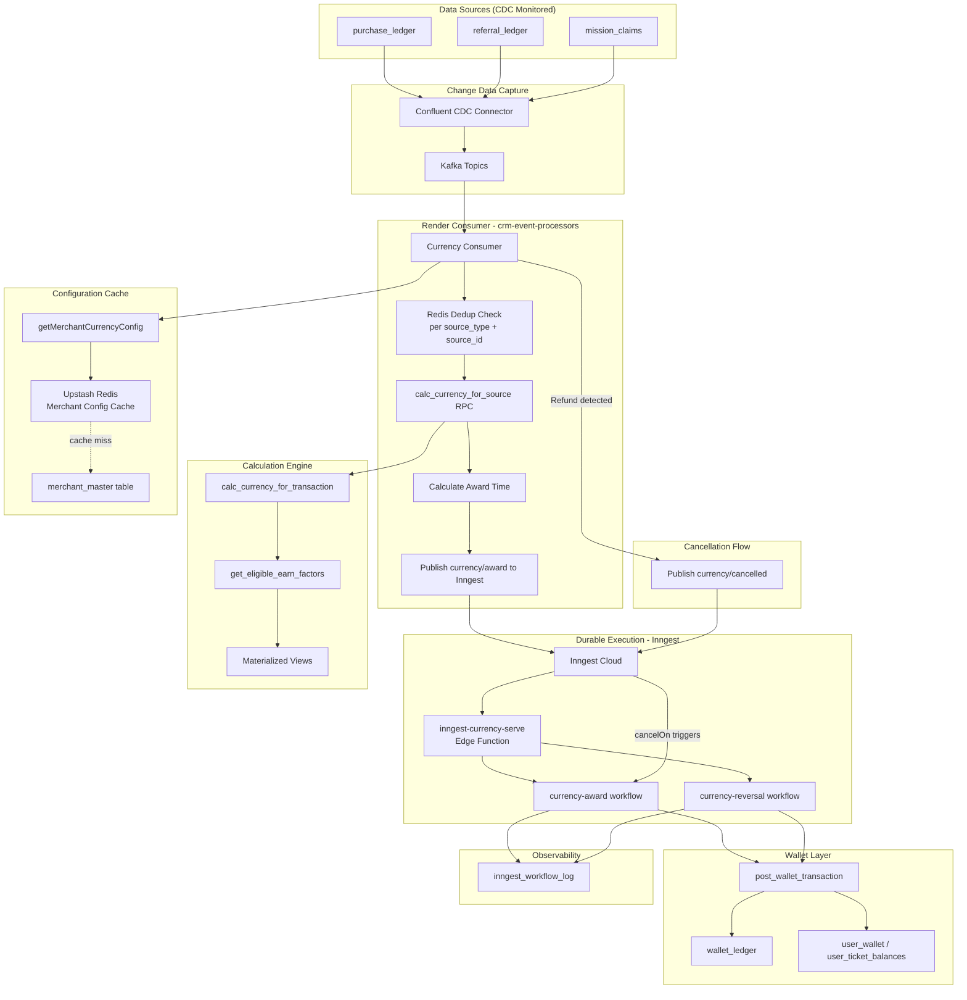

> **Architecture Note (v2.0)**: Currency now uses CDC → Render Consumer → Inngest pattern, matching Tier architecture. No pending table needed - Inngest workflow state IS the pending state.

### Calculation Process

#### Step 1: Gather Applicable Earning Rules
The system identifies all earning rules that could apply to this transaction:

**Public Earning Rules Query**:
- Find all factors where public = true
- Check merchant matches
- Verify currently within window period (considering inheritance)
- Confirm active status (considering inheritance)

**Personalized Offers Query**:
- Look up customer's assigned offers in earn_factor_user table
- Verify assignments haven't expired
- Get factor details from earn_factor table
- Apply same window and active status checks

Both sets combine into a single pool of candidates for evaluation.

**Performance Note**: The system uses the `get_eligible_earn_factors()` function which leverages materialized views for sub-50ms response times.

#### Step 2: Check Qualifying Conditions
Each earning rule may have conditions that must be met, stored in the earn_conditions table:

**Condition Types**:
- Product Conditions: Specific SKUs, brands, or categories (with optional quantity/amount thresholds)
- Customer Conditions: Tier level requirements
- Store Conditions: Store attribute set requirements
- Combined Conditions: Must meet ALL conditions in a group

**Threshold Configuration** (v2.1 Feature):
Product conditions can include minimum and maximum thresholds measured in three ways:

1. **`quantity_primary`**: Check primary quantity field (standard units)
   - Examples: bags, pieces, bottles, boxes, sachets
   - Defined in `product_sku_master.uom_primary`
   - Measured in `purchase_items_ledger.quantity`
   - Use case: "Buy ≥50 bags of cement → 5x points"

2. **`quantity_secondary`**: Check secondary quantity field (bulk units)
   - Examples: tonnes, pallets, cartons, cases, trays
   - Defined in `product_sku_master.uom_secondary`
   - Measured in `purchase_items_ledger.quantity_secondary`
   - Use case: "Buy ≥2 tonnes of steel → 10x points"

3. **`amount`**: Check line total value in currency
   - Measured in `purchase_items_ledger.line_total`
   - Use case: "Spend ≥5000 THB on electronics → 3x points"

**Threshold Fields** (in `earn_conditions` table):
- **`threshold_unit`** (TEXT): Which measurement to check
  - Values: `quantity_primary`, `quantity_secondary`, `amount`, or `NULL` (no threshold)
- **`min_threshold`** (NUMERIC): Minimum value required to qualify
  - If not met, earn factor does not apply
- **`max_threshold`** (NUMERIC): Maximum eligible value (cap)
  - Prevents abuse on very large purchases
  - Example: "Max 1000 units" caps bonus even if customer buys 5000
- **`apply_to_excess_only`** (BOOLEAN): Multiplier application mode
  - `false` (default): **Full Line Mode** - Multiplier applies to entire matched line value
  - `true`: **Excess Only Mode** - Multiplier applies only to quantity/value above minimum threshold

**Multiplier Application Modes**:

*Full Line Mode* (`apply_to_excess_only = false`):
```
Customer buys 60 bags (min threshold: 50)
→ 5x multiplier applies to ALL 60 bags
```

*Excess Only Mode* (`apply_to_excess_only = true`):
```
Customer buys 60 bags (min threshold: 50)
→ 5x multiplier applies ONLY to 10 bags (60 - 50 = 10 excess)
```

**Scope Determination**:
- Rules with product conditions → Apply only to matching items
- Rules with only tier conditions → Apply to entire transaction
- Rules with no conditions → Apply to entire transaction
- Rules with thresholds → Must meet minimum to activate, capped at maximum if specified

**Condition Evaluation Process**:
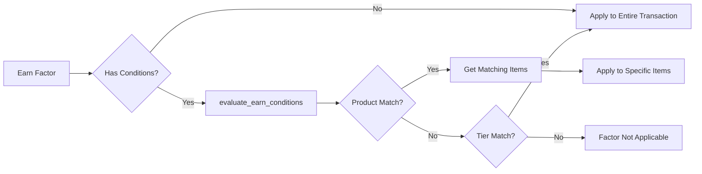

#### Step 3: Calculate Base Currency (Rates)
Rate factors define the basic conversion from spending to currency:

**Critical Rule**: Only ONE rate per currency type can apply
- If multiple rates qualify, the best rate (lowest THB per currency unit) wins
- Example: If both "100 THB = 1 point" and "50 THB = 1 point" qualify, use 50 (better for customer)
- For tickets: The rate applies to the specific ticket type defined by `target_entity_id`

**Calculation**:
```
Base Points = Transaction Amount ÷ Rate Value (target_entity_id = NULL)
Base Tickets = Transaction Amount ÷ Rate Value (target_entity_id = ticket_type.id)
```

**Important**: The calculation returns `target_entity_id` for each reward:
- Points: Always `NULL` (fungible currency)
- Tickets: Specific `ticket_type.id` (non-fungible, distinct types)

**Rate Selection Algorithm**:
1. Filter all rate factors by currency type
2. Sort by earn_factor_amount ascending (lower = better rate)
3. Select first (best) rate
4. Apply FLOOR() function to ensure whole numbers

#### Step 4: Apply Bonus Multipliers
Multipliers increase the base currency, following group stacking rules:

**Stackable Groups (stackable = true)**:
- All multipliers apply together
- Example: 2x for Gold tier + 1.5x for weekend = 3x total

**Non-Stackable Groups (stackable = false)**:
- Only the best multiplier per scope applies
- Important Exception: Can have one product-specific AND one transaction-wide multiplier

**Why Product-Specific and Transaction-Wide Can Coexist**:

The key insight is that these multipliers operate on **mutually exclusive portions** of the transaction amount:

1. **Amount Isolation**: Product-specific multipliers consume their portion of the transaction
   - Example: Shoes (300 THB) gets 3x multiplier
   - This 300 THB is "consumed" and removed from further calculation
   - The multiplier affects ONLY these specific items

2. **Remainder Principle**: Transaction-wide multipliers apply to what's left
   - After product-specific: 1,000 THB - 300 THB = 700 THB remainder
   - Transaction-wide multiplier (e.g., 5x birthday bonus) applies to this 700 THB
   - No double-counting occurs since amounts are segregated

3. **Business Logic Rationale**:
   - **Product Promotions**: Merchants want to promote specific categories (shoes at 3x)
   - **Customer Recognition**: Also reward the customer's status (birthday 5x)
   - **Fair Calculation**: Customer gets BOTH benefits without double-dipping
   - **Clear Accounting**: Each baht of spending gets exactly one multiplier path

4. **Mathematical Proof of Non-Overlap**:
   ```
   Total Transaction: 1,000 THB
   ├── Product-Specific Portion: 300 THB × 3x = 9 points
   └── Remainder Portion: 700 THB × 5x = 35 points
   Total: 44 points (no amount was multiplied twice)
   ```

This design allows merchants to run product promotions AND customer-level incentives simultaneously without creating exponential rewards that would break the economics.

**Selection Logic**:
- For product-specific: Choose multiplier giving highest currency gain
- For transaction-wide: Choose highest multiplier value
- Apply product multipliers first, then transaction multipliers on remainder

**Multiplier Application Flow**:
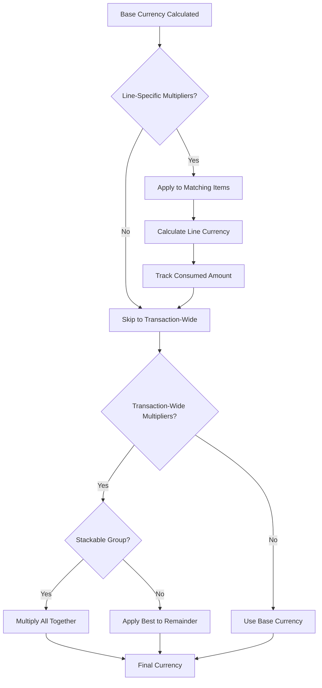

### Performance Architecture - Materialized Views

To handle thousands of transactions per second, the system uses materialized views - pre-computed tables that eliminate complex database lookups:

#### Why Materialized Views?

Materialized Views (MVs) are **pre-computed, cached database tables** that solve a critical performance problem in the currency calculation system:

##### The Problem Without MVs
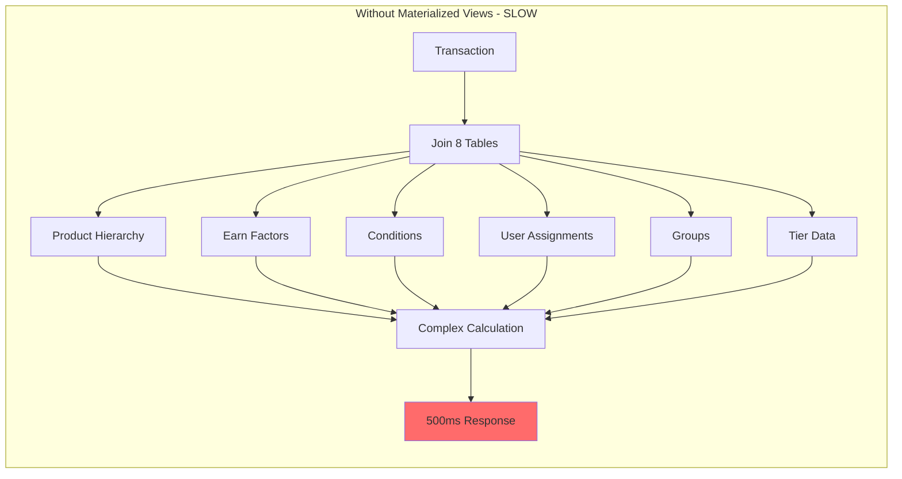

##### The Solution With MVs
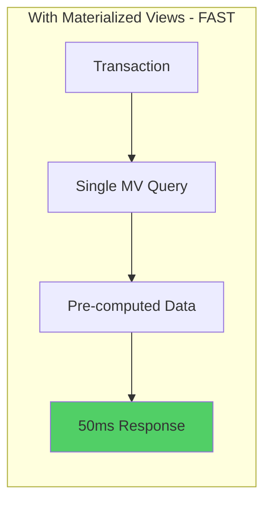

#### How Materialized Views Work

1. **Pre-computation**: Complex joins and calculations are done in advance
2. **Storage**: Results are stored as physical tables
3. **Refresh**: Updated periodically (every 5-15 minutes)
4. **Query**: Simple SELECT from pre-computed table

#### Our Materialized Views

**Primary Materialized View (`mv_earn_factors_complete`)**
- Contains: All active factors with inheritance already resolved
- Pre-computed: Product hierarchies, condition arrays, window validations
- Refresh: Every 5-15 minutes via `refresh_earn_factors_complete()`
- Benefit: Reduces calculation time from 500ms to 50ms

**User Assignments View (`mv_earn_factor_users`)**
- Contains: Active personalized offer assignments
- Refresh: Every minute via `refresh_earn_factor_users()`
- Benefit: Isolates volatile user data from stable factor data

**Calculation Caching Strategy**:
- Results cached for 60 seconds per transaction
- Cache key: transaction_id + user_id + timestamp
- Invalidated on: Factor changes, user tier changes, transaction modifications

#### Materialized View Lifecycle

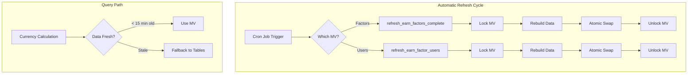

---

## (2) Currency Award Service

### Overview
Once currency is calculated, the award service records it to customer wallets. The system uses a **durable execution architecture** with QStash for event distribution and Inngest for workflow orchestration, ensuring reliable processing with built-in retries, delays, and cancellation support.

### Durable Execution Architecture

#### Why Durable Execution?
Traditional queue-based systems have limitations for complex currency award scenarios:
- **Delayed Awards**: Merchants may want to award points the next day at a specific time
- **Cancellation**: Refunds should cancel pending awards before they process
- **Multi-Step Workflows**: Award calculation, delay, award execution, logging
- **Observability**: Need to track workflow state for debugging

#### Technology Stack (v2.0 - CDC Architecture)

**Change Data Capture (Confluent CDC)**:
- Debezium-based PostgreSQL source connector
- Monitors source tables: `purchase_ledger`, `referral_ledger`, `mission_claims`
- Publishes changes to Kafka topics with guaranteed ordering and durability

**Render Consumer (`crm-event-processors`)**:
- Consumes CDC events from Kafka
- Deduplicates at source level via Redis (per `source_type + source_id`)
- Calculates currency via `calc_currency_for_source` RPC
- Determines award timing from merchant configuration
- Publishes to Inngest for durable execution
- Handles refund detection and cancellation event publishing

**Inngest (Durable Workflow Execution)**:
- Orchestrates multi-step workflows with state persistence
- **Inngest workflow state IS the pending state** - no pending table needed
- Supports `sleepUntil` for delayed awards based on merchant configuration
- Provides automatic retries at the step level (not entire workflow)
- Enables workflow cancellation via `cancelOn` events with precise matching (`source_type + source_id`)
- Maintains execution history for debugging

**Upstash Redis**:
- **Deduplication**: 5-minute window per source event in Render consumer
- **Configuration Cache**: Merchant config with TTL-based refresh
- Reduces database load for hot paths

#### Unified Source Types
All currency awards flow through the same pipeline regardless of source:

| Source Type | Trigger | Example |
|-------------|---------|---------|
| `purchase` | CDC on `purchase_ledger` | Customer completes checkout |
| `referral` | CDC on `referral_ledger` | Invitee makes first purchase |
| `mission` | CDC on `mission_claims` | User completes a task |
| `campaign` | API call with fixed amount | Bulk award to segment |
| `manual` | Admin action with fixed amount | Customer service adjustment |

#### Central Calculation Dispatcher
The `calc_currency_for_source` function routes calculation based on source type:

```sql
FUNCTION calc_currency_for_source(
    p_source_type,  -- 'purchase', 'referral', 'mission', 'campaign', 'manual'
    p_source_id,    -- UUID of source record
    p_merchant_id,
    p_user_id,
    p_metadata      -- For campaign/manual: contains amount, currency_type, component
)
RETURNS TABLE(currency_type, component, amount, earn_factor_id, target_entity_id)
```

**Routing Logic**:
- `purchase` → Calls `calc_currency_for_transaction()` (earn factor evaluation)
- `referral` → Queries `referral_invitee_outcomes` for configured rewards
- `mission` → Queries `mission_outcomes` for mission completion rewards
- `campaign/manual` → Extracts fixed amount from `p_metadata`

### Merchant Configuration for Delayed Awards

Merchants can configure when currency is awarded via `merchant_master` columns:

| Column | Type | Description |
|--------|------|-------------|
| `currency_award_delay_days` | INTEGER | Calendar days to delay (0 = no delay) |
| `currency_award_delay_minutes` | INTEGER | Rolling minutes to delay (0 = no delay) |
| `currency_award_time` | TIME | Time of day to award (e.g., '08:00:00') |
| `currency_award_timezone` | TEXT | Timezone for interpretation (e.g., 'Asia/Bangkok') |

**Delay Precedence Logic**:
1. **delay_days > 0** → Calendar mode: Award on `today + delay_days` at `award_time`
2. **delay_minutes > 0** → Rolling mode: Award `now + delay_minutes` (ignores award_time)
3. **award_time set only** → Same/next day at that specific time
4. **Nothing set** → Immediate award

**Example Configurations**:
- `delay_days=1, award_time='08:00:00'` → Next day at 8 AM local time
- `delay_minutes=120` → 2 hours after purchase (rolling)
- `award_time='21:00:00'` → Today at 9 PM, or tomorrow if already past

### Award Process Flow Diagram (CDC + Render Consumer + Inngest)

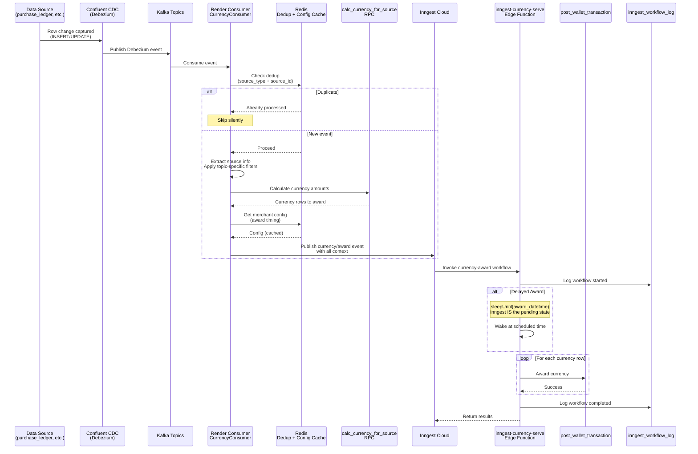

> **Key Architecture Change**: Consumer handles calculation and publishes pre-calculated currency rows to Inngest. Inngest workflow simply waits (if delayed) and awards. No pending table - workflow state IS the pending state.

### Award Process (CDC + Render Consumer + Inngest)

#### Step 1: CDC Captures Change
- Confluent CDC (Debezium) monitors source tables (`purchase_ledger`, `referral_ledger`, `mission_claims`)
- Changes published to Kafka topics with guaranteed ordering

#### Step 2: Render Consumer Processes Event
The `CurrencyConsumer` in `crm-event-processors`:
- Consumes CDC event from Kafka
- Parses Debezium message format
- Extracts source info based on topic (source_type, source_id, user_id, merchant_id)
- Applies topic-specific filtering (e.g., only completed purchases)
- Deduplicates via Redis (5-minute window per `source_type + source_id`)

#### Step 3: Calculate Currency (In Consumer)
Consumer calls `calc_currency_for_source` RPC:
- Routes to appropriate calculation logic based on source type
- For purchases: Evaluates earn factors and applies best rate/multipliers
- Returns array of currency rows to award

#### Step 4: Determine Award Timing
Consumer fetches merchant configuration and calculates award datetime:
- `delay_days > 0`: Award on `today + delay_days` at `award_time`
- `delay_minutes > 0`: Award at `now + delay_minutes`
- `award_time` only: Today/tomorrow at that specific time
- Nothing set: Immediate award (now)

#### Step 5: Publish to Inngest
Consumer publishes `currency/award` event with all context:
- Pre-calculated currency rows (no recalculation in workflow)
- Award datetime (workflow just waits if delayed)
- Source info for `cancelOn` matching

#### Step 6: Inngest Workflow Executes
The `currency-award` workflow in `inngest-currency-serve`:
- Logs workflow start to `inngest_workflow_log`
- If `award_datetime > now`: `sleepUntil(award_datetime)` - **Inngest IS the pending state**
- Can be cancelled during sleep via `currency/cancelled` event with matching `source_type + source_id`

#### Step 7: Award Each Currency
For each row from pre-calculated currency_rows:
- Calls `post_wallet_transaction` RPC
- Creates ledger entry and updates balance atomically

#### Step 8: Log Completion
Updates `inngest_workflow_log` with final status and results.

> **No Pending Table**: Inngest workflow state replaces need for a database pending table. Cancellation uses `cancelOn` with event matching, not database queries.

**Duplicate Detection Logic**:
```sql
-- Unique constraint prevents duplicates (includes currency type)
UNIQUE(merchant_id, source_type, source_id, currency, component, transaction_type)
```

**Ledger Entry Structure**:
```json
{
  "user_id": "uuid",
  "merchant_id": "uuid",
  "currency": "points|tickets",
  "target_entity_id": null,  // NULL for points, ticket_type.id for tickets
  "transaction_type": "earn",
  "component": "base|bonus|reversal",
  "amount": 100,
  "signed_amount": 100,
  "balance_before": 500,
  "balance_after": 600,
  "source_type": "purchase",
  "source_id": "transaction_uuid",
  "metadata": {
    "calculation_details": {...},
    "applied_factors": [...],
    "ticket_type_name": "Monthly Raffle"  // For tickets only
  }
}
```

#### Step 4: Update Wallet
Atomically increases customer's balance based on currency type:

**Balance Storage Architecture**:
- **Points (Fungible)**: Updates `user_accounts.points_balance` field
- **Tickets (Non-fungible)**: Updates/creates entry in `user_ticket_balances` table for specific ticket type

**Atomic Update Process**:
1. Begin transaction
2. Lock appropriate row (SELECT FOR UPDATE)
   - Points: Lock `user_accounts` row
   - Tickets: Lock/create `user_ticket_balances` row for specific `ticket_type_id`
3. Calculate new balance
4. Update balance
5. Create ledger entry with proper `target_entity_id`
6. Commit or rollback

### Ticket Type Architecture

The system distinguishes between fungible and non-fungible currencies through careful architectural separation:

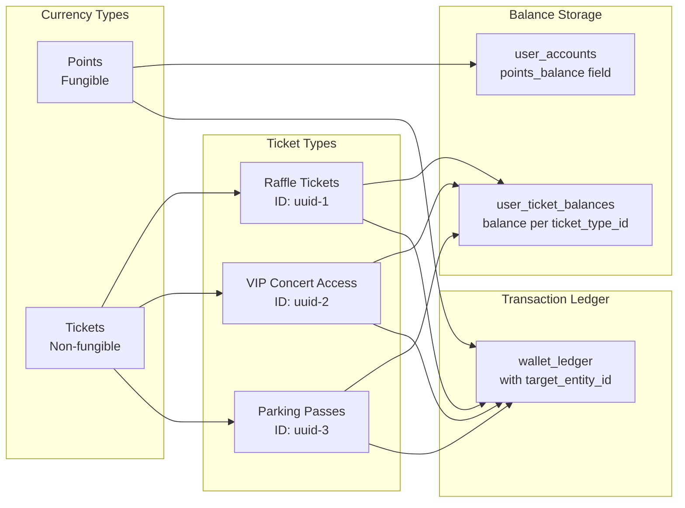

**Key Architectural Decisions**:
- Points remain in existing `user_accounts.points_balance` (no migration needed)
- Each ticket type gets separate balance tracking in `user_ticket_balances`
- All transactions recorded in `wallet_ledger` with proper `target_entity_id`
- Ticket types can have validity periods and expiration dates
- System prevents earning expired ticket types

### Idempotency Protection
The system prevents duplicate awards at multiple levels:

**Level 1: Kafka Consumer Offset**
- Kafka tracks consumer offset per partition
- Messages not reprocessed after commit (unless reset)

**Level 2: Redis Deduplication (Consumer)**
- Each source event has unique key: `currency_dedup:{source_type}:{source_id}`
- 5-minute TTL window
- Consumer skips if key exists (already processing)

**Level 3: Inngest Event ID**
- Each Inngest event has unique ID used as workflow run identifier
- Prevents duplicate workflow execution for same event

**Level 4: Database Constraint**
```sql
-- Unique constraint on wallet_ledger (includes currency type for multi-currency support)
UNIQUE(merchant_id, source_type, source_id, currency, component, transaction_type)
```
- If same award attempted twice, second insert safely fails
- Handles race conditions and retry scenarios

**Idempotency Flow**:
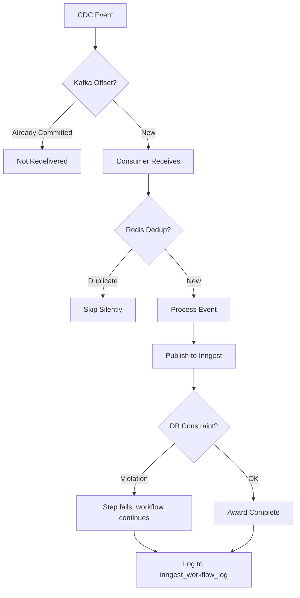

### Workflow Observability

#### inngest_workflow_log Table
All Inngest workflows log their execution for debugging and monitoring:

| Column | Type | Description |
|--------|------|-------------|
| `id` | UUID | Primary key |
| `inngest_run_id` | TEXT | Inngest's run ID (for dashboard lookup) |
| `workflow_type` | TEXT | 'currency_award', 'currency_reversal', 'tier_evaluation' |
| `event_name` | TEXT | 'currency/award', 'currency/reverse' |
| `status` | TEXT | 'started', 'completed', 'failed', 'cancelled' |
| `source_type` | TEXT | Event source type |
| `source_id` | UUID | Source record ID |
| `user_id` | UUID | User being processed |
| `merchant_id` | UUID | Merchant context |
| `metadata` | JSONB | Results, amounts, applied factors |
| `error_message` | TEXT | Error details if failed |
| `started_at` | TIMESTAMPTZ | Workflow start time |
| `completed_at` | TIMESTAMPTZ | Workflow end time |

**Indexed For**:
- `inngest_run_id` - Cross-reference with Inngest dashboard
- `(merchant_id, source_type, source_id)` - Find logs by source
- `(user_id, workflow_type)` - User history
- `(status, created_at)` - Monitor failed workflows

### Currency Reversal Handling

The system supports full and partial reversals for refunds through the `currency-reversal` Inngest workflow. This workflow handles both pending award cancellation (via `cancelOn`) and already-awarded currency reversal.

#### Reversal Workflow (`currency-reversal`)

**Step 1: Cancel Pending Award (via cancelOn)**
- Sends `currency/cancelled` event with matching `source_type + source_id`
- If award workflow is in `sleepUntil` state, Inngest's `cancelOn` terminates it automatically
- **No database lookup needed** - Inngest matches the event data directly
- Prevents awarding currency that will immediately need reversal

**Step 2: Check Existing Awards**
- Queries `wallet_ledger` for completed awards for this source
- If no awards found, workflow completes (award was cancelled in time)

**Step 3: Verify Balances**
- For each awarded currency type, checks current balance
- If insufficient balance, logs and skips that reversal

**Step 4: Create Reversal Entries**
- For each currency with sufficient balance
- Calls `post_wallet_transaction` with `component='reversal'`
- Links reversal to original via metadata

> **Key Architecture**: The `cancelOn` uses precise matching on `source_type + source_id`, ensuring only the specific pending award for that source is cancelled - not all currency events for the user.

#### Historical Data Architecture

When currency is awarded, the system preserves complete calculation details in the `wallet_ledger.metadata` JSONB field:

```json
{
  "calculation_details": {
    "base_amount": 10000,
    "currency_calculations": {
      "points": {
        "rate_factor_id": "uuid-123",
        "rate_value": 100,
        "base_earned": 100,
        "multiplier_factor_ids": ["uuid-456"],
        "multiplier_values": [3],
        "final_amount": 300
      },
      "tickets": {
        "ticket_type_id": "uuid-789",
        "ticket_name": "Raffle Ticket",
        "base_earned": 5,
        "multiplier_values": [2],
        "final_amount": 10
      }
    }
  },
  "applied_factors": [
    {
      "id": "uuid-123",
      "name": "Standard Points Rate",
      "type": "rate",
      "value": 100
    },
    {
      "id": "uuid-456",
      "name": "New Year 3x Promotion",
      "type": "multiplier",
      "value": 3,
      "active_period": "2024-01-01 to 2024-01-31"
    }
  ],
  "transaction_context": {
    "customer_tier": "gold",
    "store_location": "store-001",
    "payment_method": "credit_card"
  }
}
```

This metadata enables accurate reversal calculation without re-evaluating current earn factors.

#### Why Not Re-evaluate Current Earn Factors?

The system deliberately uses historical data instead of re-running calculations through current earn factors for several critical reasons:

1. **Temporal Consistency**: Earn factors change over time (promotions end, rates adjust, tiers change)
2. **Deleted Factors**: Campaign-specific factors may no longer exist in the database
3. **Customer Fairness**: Ensures reversals match what customer actually earned
4. **Calculation Integrity**: Prevents discrepancies between earn and reversal amounts
5. **Performance**: Avoids complex recalculation logic and multiple table joins
6. **Audit Compliance**: Maintains exact historical record for financial reconciliation

**Technical Implementation**:
- Original calculation stored in `wallet_ledger.metadata` as JSONB
- Includes all factor IDs, values, and multipliers applied
- Reversal function reads metadata, not `earn_factor` tables
- Proportional calculation: `original_amount × (refund_amount ÷ purchase_amount)`

#### Complete Reversal Process

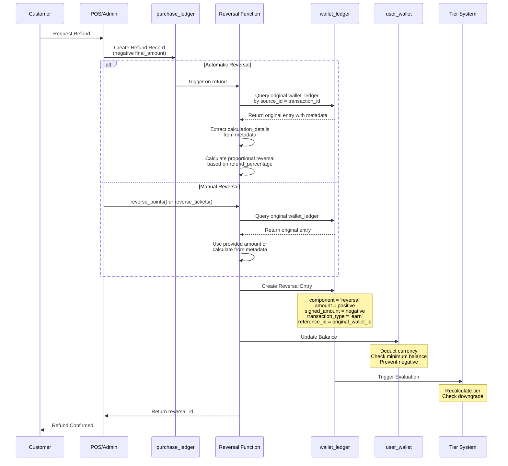

#### Reversal Data Structure

```json
{
  "wallet_ledger_entry": {
    "id": "uuid",
    "user_id": "uuid",
    "merchant_id": "uuid",
    "currency": "points|tickets",
    "target_entity_id": null,         // NULL for points, ticket_type.id for tickets
    "transaction_type": "earn",
    "component": "reversal",
    "amount": 100,                    // Always positive
    "signed_amount": -100,            // Negative for reversal
    "source_type": "purchase",
    "source_id": "refund_transaction_uuid",
    "reference_id": "original_transaction_uuid",
    "description": "Refund for Order #12345",
    "metadata": {
      "original_amount": 200,
      "refund_percentage": 50,
      "reason": "Product return",
      "ticket_type_name": "Monthly Raffle"  // For tickets only
    }
  }
}
```

#### Reversal Business Rules

1. **Proportional Reversal**: Currency reversed proportionally to refund amount
2. **Original Multipliers Honored**: Reversal considers original earning multipliers
3. **Balance Protection**: Cannot reverse more than available balance (configurable)
4. **Audit Trail**: Complete linkage between original and reversal transactions
5. **Tier Impact**: Automatic tier re-evaluation after reversal

**Reversal Process**:
- Query original wallet_ledger entry by transaction ID
- Extract historical calculation_details from metadata
- Calculate reversal amount based on refund percentage
- Apply reversal to exact factors used at purchase time
- Create reversal entry with negative signed_amount
- Update wallet balance (deduct currency)
- Link reversal to original via reference_id

**Reversal Safeguards**:
- Cannot reverse more than originally awarded
- Prevents negative balances (configurable)
- Maintains complete audit trail
- Triggers tier re-evaluation if needed

### Currency Expiry Processing

#### Inline Expiry Calculation
The system calculates expiry dates atomically during currency award to ensure data integrity:

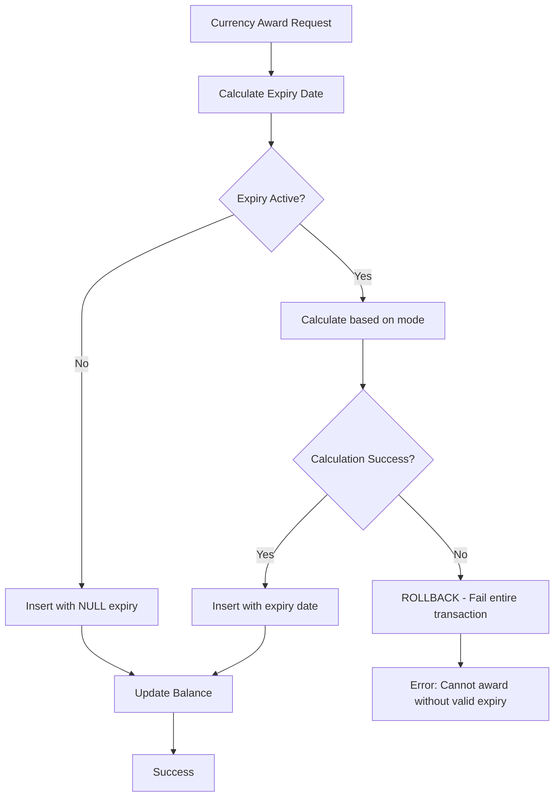

**Critical Design Decision**: Expiry calculation happens BEFORE the wallet_ledger INSERT. If expiry is configured but calculation fails, the entire transaction rolls back, preventing orphaned currency without proper expiry dates.

#### Expiry Date Calculation Logic

```sql
-- For Points (merchant-level config)
CASE 
    WHEN mode = 'ttl' THEN 
        CURRENT_DATE + (ttl_months || ' months')::INTERVAL
    WHEN mode = 'fixed_frequency' THEN 
        get_next_fiscal_period_end(
            CURRENT_DATE, 
            frequency, 
            fiscal_year_end_month, 
            minimum_period_months
        )
END

-- For Tickets (ticket-type-level config)
CASE 
    WHEN mode = 'ttl' THEN 
        CURRENT_DATE + (ttl_months || ' months')::INTERVAL
    WHEN mode = 'fixed_frequency' THEN 
        get_next_fiscal_period_end(...)
    WHEN mode = 'absolute_date' THEN 
        absolute_expiry_date
END
```

#### Expiry Processing Architecture

**Smart Cron Scheduling**:
- Daily check via `should_run_expiry_today()`
- Only processes when expiries exist for current date
- Skips processing on non-relevant days (performance optimization)

**Batch Processing Strategy**:
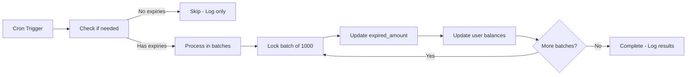

**Performance Optimizations**:
- Batch size: 1000 records (configurable)
- Row-level locking with SKIP LOCKED
- Optimized indexes on expiry_date
- Separate processing for points vs tickets

---

## System Operations

### Automated Maintenance
The system automatically maintains optimal performance through scheduled jobs:

**Materialized View Refresh**:
- Main calculation data: Refreshes every 5 minutes
- User assignments: Refreshes every minute
- Ensures calculations use recent data without manual intervention

**Health Monitoring**:
- Tracks refresh success/failure via `currency_system_health_check()`
- Monitors calculation performance
- Alerts on anomalies

**Workflow Monitoring**:
- `inngest_workflow_log` table tracks all executions
- Query by status to find failed workflows
- Inngest dashboard provides detailed execution traces
- QStash logs show event delivery status

**Flow Control Settings** (configured in `publish-currency-event`):
- Rate: 50 requests/second per merchant
- Parallelism: 10 concurrent per merchant
- Adjustable based on downstream capacity

### Handling Schema Changes
When business requirements change and database structure is modified:

**Recovery Process**: Run `rebuild_mv_after_schema_change()` function

**Schema Change Protocol**:
1. Deploy schema changes
2. Pause materialized view refresh
3. Run rebuild function
4. Verify view integrity
5. Resume automated refresh

### System Monitoring Dashboard

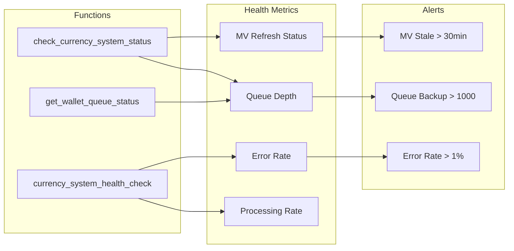

### Expiry Processing Operations

#### Automated Expiry Management

**Daily Cron Job**:
```sql
-- Runs at 2 AM daily
SELECT process_expiry_if_needed();
```

This function:
1. Checks if expiry processing needed via `should_run_expiry_today()`
2. Processes expiries in batches to avoid long locks
3. Updates both `wallet_ledger` and user balances atomically
4. Logs results to `expiry_processing_log` table

**Monitoring Views**:
- `v_upcoming_expiries`: Shows currency expiring in next 30 days
- `v_merchant_expiry_summary`: Merchant-level expiry overview
- `v_expiry_processing_history`: Audit trail of all expiry runs
- `v_user_expiry_summary`: Per-user expiry details for customer service

**Performance Targets**:
- Expiry calculation overhead: < 2ms per transaction
- Batch processing: 10,000 expiries/minute
- Smart cron overhead: < 100ms when no processing needed

---

## Business Rules Summary

### Core Principles
1. **No Double-Counting**: Each baht of spending earns currency exactly once
2. **Customer-Favorable Selection**: When multiple earning rules qualify, customer gets the best rate ("best rate wins")
3. **Inheritance Hierarchy**:
   - Explicit factor settings override group settings
   - NULL values inherit from group
   - System defaults apply when both are NULL
4. **Currency Combination**:
   - Public and private offers evaluate together
   - One rate per currency type (best rate selected)
   - Multiple multipliers follow stacking rules per group
5. **Scope Isolation**: Product-specific and transaction-wide multipliers can coexist even in non-stackable groups
   - Product multipliers consume their portion of the transaction amount
   - Transaction multipliers apply only to the unconsumed remainder
   - Prevents double-multiplying while allowing dual incentives
   - Enables simultaneous product promotions and customer recognition
6. **Unified Source Processing**:
   - All sources (purchase, referral, mission, campaign, manual) use same pipeline
   - `calc_currency_for_source` routes to appropriate calculation
   - Single observability layer via `inngest_workflow_log`
7. **Durable Execution Guarantees**:
   - Inngest persists workflow state across restarts
   - **Inngest workflow state IS the pending state** - no database pending table needed
   - Step-level retries (3 attempts per step)
   - Workflows cancelled via `currency/cancelled` event with `cancelOn` matching (`source_type + source_id`)
   - Delayed awards survive system restarts
8. **Processing Guarantees**:
   - Four-level idempotency: Kafka offset, Redis dedup, Inngest event ID, Database constraint
   - Exactly-once award processing
   - Atomic wallet updates with row-level locking
   - Complete audit trail in `wallet_ledger` and `inngest_workflow_log`
9. **Precise Cancellation**:
   - Refund cancels only the specific source's pending award (not all user awards)
   - `cancelOn` matches `source_type + source_id` for precision
   - No database lookup needed for cancellation
9. **Fungible vs Non-fungible Separation**:
   - Points transactions always have `target_entity_id = NULL`
   - Ticket transactions always have `target_entity_id = ticket_type.id`
   - Each ticket type tracked independently with separate balances
   - Unique constraint includes `currency` for multi-currency support
10. **Currency Expiry Rules**:
    - Expiry dates are immutable once set (no retroactive changes)
    - Only unused currency expires (deductible balance protection)
    - Expiry calculation must be atomic with currency award
    - Failed expiry calculation prevents currency award (data integrity)
    - Points expiry applies uniformly to all users per merchant
    - Ticket expiry can vary by ticket type
    - Minimum period protection overrides fiscal period boundaries

### Edge Cases and Handling

**Zero-Value Transactions**:
- Transactions with 0 THB amount earn 0 currency
- System still creates ledger entry for audit

**Partial Refunds**:
- Currency reversed proportionally to refund amount
- Original multipliers considered in reversal calculation

**Tier Changes Mid-Transaction**:
- Tier at transaction start time is used
- Prevents gaming through rapid tier changes

**Expired Personalized Offers**:
- Checked at calculation time, not assignment time
- Graceful fallback to public offers

### Performance Targets
- Calculation response: Under 100ms for 95% of requests
- System throughput: 1,200+ transactions per second
- Availability: 99.9% uptime
- Queue processing latency: < 5 minutes average
- Materialized view staleness: < 15 minutes maximum

---

## Implementation Examples

### Example 1: Standard Purchase
**Scenario**: Customer buys 1,000 THB of products
- Base rate: 100 THB = 1 point
- No multipliers apply

**Result**:
- Base: 1,000 ÷ 100 = 10 points
- Final: 10 points awarded

### Example 2: Tiered Customer with Loyalty Benefits
**Scenario**: Gold tier customer with permanent tier benefits
- Base rate: 100 THB = 1 point
- Gold tier multiplier: 2x (transaction-wide)
- Weekend multiplier: 1.5x (transaction-wide)
- Group setting: Stackable

**Result**:
- Base: 1,000 ÷ 100 = 10 points
- Multipliers: 2x × 1.5x = 3x
- Final: 10 × 3 = 30 points awarded

### Example 3: Complex Multi-Product Scenario
**Scenario**: 1,000 THB purchase with mixed products
- Shoes (300 THB): Eligible for 3x category multiplier
- Clothing (700 THB): Regular items
- Customer: Has personalized 5x birthday offer
- Group: Non-stackable

**Calculation with Amount Isolation**:
```
Step 1: Base Calculation
- Total: 1,000 THB ÷ 100 = 10 base points
- Shoes portion: 300 THB ÷ 100 = 3 base points
- Clothing portion: 700 THB ÷ 100 = 7 base points

Step 2: Apply Product-Specific Multiplier (Shoes)
- Shoes: 3 points × 3x = 9 points
- Amount consumed: 300 THB (removed from further multipliers)

Step 3: Apply Transaction-Wide Multiplier (Birthday) to Remainder
- Remaining amount: 700 THB (clothing only)
- Clothing: 7 points × 5x = 35 points

Step 4: Final Total
- Product-specific: 9 points (shoes)
- Transaction-wide: 35 points (clothing with birthday bonus)
- Total: 44 points
```

**Why This Works (Non-Stackable Logic)**:
- Each THB amount gets exactly ONE multiplier path
- 300 THB → Shoes category multiplier (3x)
- 700 THB → Birthday multiplier (5x)
- No amount gets both multipliers (non-stackable preserved)

**What Would Happen Without Amount Isolation** (Incorrect):
```
If multipliers stacked on same amount:
- Shoes: 3 points × 3x × 5x = 45 points (wrong!)
- Clothing: 7 points × 5x = 35 points
- Total: 80 points (too generous, breaks economics)
```

Note: Despite non-stackable group, both multipliers apply because they affect different portions (product-specific vs transaction-wide).

### Example 4: Multi-Ticket Type Scenario
**Scenario**: Customer spends 2,000 THB at event venue
- Eligible for points: 2% rate = 40 points
- Eligible for VIP Concert tickets: 1 per 100 THB = 20 tickets
- Eligible for Parking passes: 1 per 20 THB = 100 passes

**Result**:
- 40 points earned → Updates `user_accounts.points_balance` (target_entity_id = NULL)
- 20 VIP Concert tickets → Creates/updates row in `user_ticket_balances` for ticket_type_id: uuid-concert
- 100 Parking passes → Creates/updates separate row in `user_ticket_balances` for ticket_type_id: uuid-parking
- Three separate ledger entries created, each with appropriate `target_entity_id`

### Example 5: Refund Scenario with Mixed Currencies (Historical Data Usage)
**Original Purchase (January 1, 2024)**:
- Transaction: 2,000 THB purchase
- Earn factors at that time:
  - Points: 50 THB = 1 point, Gold tier 2x multiplier
  - Concert tickets: Flash promo 100 THB = 1 ticket, 5x weekend multiplier
  - Parking passes: Standard 20 THB = 1 pass
- Earned: 40 points, 20 concert tickets, 100 parking passes
- Stored in wallet_ledger.metadata with all calculation details

**Refund Request (March 15, 2024)**:
- Refund amount: 1,000 THB (50% return)
- Current earn factors (NOT USED):
  - Points: Changed to 100 THB = 1 point, Customer now Bronze tier (1x)
  - Concert ticket promo: Ended
  - Parking: Changed to 50 THB = 1 pass

**Reversal Calculation Using Historical Data**:
1. System queries wallet_ledger for original transaction
2. Retrieves metadata showing exact calculation from January 1
3. Applies 50% reversal to historical amounts:
   - Points: 40 × 0.5 = 20 points reversed (uses original Gold 2x rate)
   - Concert tickets: 20 × 0.5 = 10 tickets reversed (uses expired promo rate)
   - Parking passes: 100 × 0.5 = 50 passes reversed (uses old 20:1 rate)
4. Creates three reversal entries with reference_id linking to originals
5. Current earn factors are completely ignored

**Critical Point**: If system re-ran through current factors, customer would only reverse 5 points (not 20), zero concert tickets (promo ended), and 20 parking passes (not 50) - unfair to customer!

### Example 6: TTL Expiry Scenario
**Configuration**: Points expire 6 months after earning
**Scenario**: Customer earns 100 points on January 15, 2024

**Result**:
- Points awarded with expiry_date: July 15, 2024
- On July 15: Automated process expires unused portion
- If customer used 60 points: Only 40 points expire
- Customer notified at 30, 7, and 1 day before expiry

### Example 7: Fixed Frequency with Fiscal Year
**Configuration**: 
- Quarterly expiry
- Fiscal year ends June 30
- Minimum period: 3 months

**Scenario**: Points earned throughout Q4 (Apr-Jun)
- April 1 earn → Expires June 30 (meets 3-month minimum)
- May 15 earn → Expires September 30 (next quarter due to minimum)
- June 25 earn → Expires September 30 (minimum period protection)

### Example 8: Absolute Date Tickets
**Configuration**: Christmas raffle tickets expire December 31, 2024
**Scenario**: Customer earns tickets on various dates

**Result**:
- All tickets expire December 31, regardless of earn date
- System prevents earning after expiry date
- Bulk expiry processing on January 1, 2025

### Example 9: UOM Threshold with Primary Quantity (Full Line Mode)
**Configuration**: 
- Product: Ajinomoto MSG Cement SKU
- UOM Primary: "BAG", UOM Secondary: "TON"
- Threshold: 50 bags minimum (quantity_primary)
- Multiplier: 5x points
- Mode: Full line (`apply_to_excess_only = false`)

**Scenario**: Customer purchases cement
- Quantity: 60 bags (primary)
- Quantity Secondary: 3 tonnes
- Line Total: 6000 THB
- Base rate: 100 THB = 1 point

**Calculation**:
```
Step 1: Check threshold
- threshold_unit = 'quantity_primary'
- Compare quantity (60) ≥ min_threshold (50) → ✅ Qualifies

Step 2: Apply 5x multiplier to full line value (6000 THB)
- Base: 6000 ÷ 100 = 60 points
- Bonus: 60 × (5-1) = 240 points

Step 3: Total
- Base: 60 points
- Bonus: 240 points  
- Total: 300 points awarded
```

### Example 10: UOM Threshold with Secondary Quantity (Excess Only Mode)
**Configuration**:
- Product: Steel SKU
- UOM Primary: "PIECE", UOM Secondary: "TON"
- Threshold: 2 tonnes minimum (quantity_secondary)
- Max cap: 10 tonnes
- Multiplier: 10x points
- Mode: Excess only (`apply_to_excess_only = true`)

**Scenario**: Customer purchases steel
- Quantity: 800 pieces (primary)
- Quantity Secondary: 3 tonnes
- Line Total: 15000 THB
- Base rate: 100 THB = 1 point

**Calculation**:
```
Step 1: Check threshold
- threshold_unit = 'quantity_secondary'
- Compare quantity_secondary (3) ≥ min_threshold (2) → ✅ Qualifies
- Check max: 3 < 10 → No cap applied

Step 2: Calculate excess quantity
- Excess: 3 - 2 = 1 tonne
- Proportional value: (1 / 3) × 15000 = 5000 THB

Step 3: Apply multiplier
- Base (full amount): 15000 ÷ 100 = 150 points
- Bonus (excess only): (5000 ÷ 100) × (10-1) = 50 × 9 = 450 points

Step 4: Total
- Base: 150 points
- Bonus: 450 points (only on the 1 tonne excess)
- Total: 600 points awarded
```

**Why Excess Mode?**
- Encourages customers to exceed threshold
- Rewards incremental purchases beyond minimum
- More cost-effective for merchant than full line mode

### Example 11: Amount-based Threshold with Cap
**Configuration**:
- Product Category: Electronics
- Threshold: 5000 THB minimum, 50000 THB maximum (amount-based)
- Multiplier: 3x points
- Mode: Full line

**Scenario A - Under Cap**: Purchase 6000 THB of electronics
```
Step 1: Check threshold
- threshold_unit = 'amount'
- Compare line_total (6000) ≥ min_threshold (5000) → ✅ Qualifies
- Check max: 6000 < 50000 → No cap, use full amount

Step 2: Apply multiplier
- Base: 6000 ÷ 100 = 60 points
- Bonus: 60 × (3-1) = 120 points
- Total: 180 points
```

**Scenario B - Over Cap**: Purchase 80000 THB of electronics
```
Step 1: Check threshold
- Compare line_total (80000) ≥ min_threshold (5000) → ✅ Qualifies
- Check max: 80000 > 50000 → ⚠️ Cap at 50000

Step 2: Apply multiplier
- Base (actual): 80000 ÷ 100 = 800 points
- Bonus (capped): (50000 ÷ 100) × (3-1) = 500 × 2 = 1000 points
- Total: 1800 points (not 2400 - prevented abuse)
```

**Why Caps Matter:**
- Without cap: 80000 THB → 2400 points
- With cap: 80000 THB → 1800 points
- Prevents exploitation on very large orders

### Example 12: Multi-Product with Different UOM Thresholds
**Configuration**:
- Product A (Cement): 50 bags minimum (primary UOM) → 5x multiplier
- Product B (Steel): 2 tonnes minimum (secondary UOM) → 10x multiplier
- Both: Full line mode, non-stackable groups

**Scenario**: Single transaction with both products
```
Product A (Cement):
- 60 bags, 0 tonnes, 6000 THB
- Check: 60 ≥ 50 → ✅ Qualifies for 5x
- Base: 6000 ÷ 100 = 60 points
- Bonus: 60 × (5-1) = 240 points

Product B (Steel):
- 800 pieces, 3 tonnes, 15000 THB
- Check: 3 ≥ 2 → ✅ Qualifies for 10x
- Base: 15000 ÷ 100 = 150 points
- Bonus: 150 × (10-1) = 1350 points

Total Transaction: 21000 THB
- Base: 210 points
- Cement bonus: 240 points
- Steel bonus: 1350 points
- Total: 1800 points
```

**Key Insight**: Both multipliers apply independently because they target different products. The system tracks matched items separately and applies rules accordingly.

---

## API Integration

### Calculate Currency (Preview)
```http
GET /api/currency/calculate/{transaction_id}
```

**Response**:
```json
{
  "currencies": {
    "points": {
      "base": 10,
      "final": 44,
      "target_entity_id": null,
      "breakdown": {
        "base_calculation": "1000 THB ÷ 100 = 10 points",
        "multipliers_applied": [
          {
            "type": "line_specific",
            "factor": 3,
            "amount_affected": 300,
            "currency_added": 9
          },
          {
            "type": "transaction_wide",
            "factor": 5,
            "amount_affected": 700,
            "currency_added": 35
          }
        ]
      }
    },
    "tickets": {
      "types": [
        {
          "ticket_type_id": "c0000000-0000-0000-0000-000000000001",
          "ticket_name": "Monthly Raffle",
          "ticket_code": "RAFFLE_2024",
          "base": 5,
          "final": 5
        },
        {
          "ticket_type_id": "c0000000-0000-0000-0000-000000000004",
          "ticket_name": "Free Parking Pass",
          "ticket_code": "PARKING",
          "base": 10,
          "final": 20
        }
      ]
    }
  },
  "applied_factors": {
    "rates": [
      {
        "id": "uuid",
        "name": "Standard Rate",
        "value": 100
      }
    ],
    "multipliers": [
      {
        "id": "uuid",
        "name": "Birthday Bonus",
        "value": 5,
        "scope": "transaction"
      }
    ]
  }
}
```

### Award Currency (Process)
```http
POST /api/currency/award/{transaction_id}
```

**Request Body** (optional overrides):
```json
{
  "processing_method": "direct|queue",
  "delay_seconds": 0
}
```

**Response**:
```json
{
  "status": "awarded|queued",
  "points_awarded": 44,
  "tickets_awarded": [
    {
      "ticket_type_id": "c0000000-0000-0000-0000-000000000001",
      "ticket_name": "Monthly Raffle",
      "amount": 5,
      "balance_after": 15
    },
    {
      "ticket_type_id": "c0000000-0000-0000-0000-000000000004",
      "ticket_name": "Free Parking Pass",
      "amount": 20,
      "balance_after": 120
    }
  ],
  "points_balance_after": 544,
  "queue_message_id": "msg_123",
  "estimated_processing_time": "2024-01-15T10:30:00Z",
  "message": "Currency successfully added to wallet"
}
```

### Check Currency Status
```http
GET /api/currency/status/{transaction_id}
```

**Response**:
```json
{
  "transaction_id": "uuid",
  "status": "pending|processed|failed",
  "points_calculated": 44,
  "tickets_calculated": 2,
  "points_awarded": 44,
  "tickets_awarded": 2,
  "processed_at": "2024-01-15T10:25:00Z",
  "error": null
}
```

### Reverse Currency
```http
POST /api/currency/reverse
```

**Request**:
```json
{
  "user_id": "uuid",
  "merchant_id": "uuid",
  "currency": "points|tickets",
  "amount": 100,
  "reason": "Order refund #12345",
  "reference_id": "original_transaction_uuid"
}
```

### Get Upcoming Expiries
```http
GET /api/currency/expiries/upcoming
```

**Query Parameters**:
- `user_id`: Filter by specific user
- `days`: Number of days ahead (default: 30)
- `currency`: Filter by points or tickets

**Response**:
```json
{
  "expiries": [
    {
      "currency": "points",
      "amount": 500,
      "expiry_date": "2024-03-31",
      "days_until_expiry": 15,
      "origin": "Purchase on 2023-09-30"
    },
    {
      "currency": "tickets",
      "ticket_type": "Monthly Raffle",
      "amount": 10,
      "expiry_date": "2024-04-30",
      "days_until_expiry": 45
    }
  ],
  "summary": {
    "total_expiring_points": 500,
    "total_expiring_tickets": 10,
    "next_expiry_date": "2024-03-31"
  }
}
```

### Configure Expiry Settings
```http
PUT /api/merchant/{merchant_id}/expiry-config
```

**Request Body**:
```json
{
  "points": {
    "mode": "fixed_frequency",
    "frequency": "quarterly",
    "fiscal_year_end_month": 6,
    "minimum_period_months": 3,
    "active": true
  }
}
```

### Get Expiry Configuration
```http
GET /api/merchant/{merchant_id}/expiry-config
```

**Response**:
```json
{
  "points": {
    "mode": "ttl",
    "ttl_months": 12,
    "active": true,
    "statistics": {
      "upcoming_30_days": 15000,
      "users_affected": 234
    }
  },
  "tickets": [
    {
      "ticket_type_id": "uuid",
      "ticket_name": "VIP Pass",
      "mode": "absolute_date",
      "absolute_date": "2024-12-31",
      "upcoming_expiries": 50
    }
  ]
}
```

---

## Currency - Complete Transactions to Currency Flow

### 🎯 Core Architecture: Unified Durable Execution

**Single Path for All Sources**:
Data Change → CDC → Kafka → Render Consumer → Inngest → Wallet

All currency awards (purchase, referral, mission, campaign, manual) flow through the same pipeline, ensuring consistent processing, delays, and observability.

### Complete System Flow Diagram

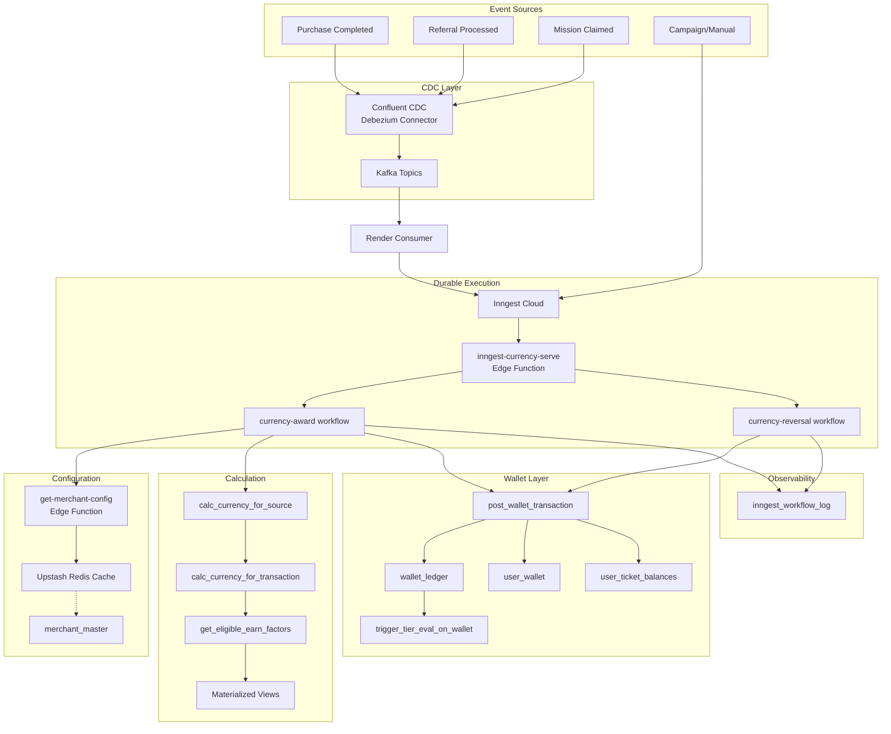

### Step-by-Step Flow

#### Step 1: CDC Captures Data Changes

**Purchase Events**:
- Confluent CDC (Debezium) captures INSERT/UPDATE on `purchase_ledger`
- Publishes to Kafka topic `crm.public.purchase_ledger`

**Referral Events**:
- Confluent CDC captures INSERT/UPDATE on `referral_ledger`
- Publishes to Kafka topic `crm.public.referral_ledger`

**Mission Events**:
- Confluent CDC captures INSERT/UPDATE on `mission_claims`
- Publishes to Kafka topic `crm.public.mission_claims`

#### Step 2: Render Consumer Processes Events

**CurrencyConsumer** in `crm-event-processors`:
- Consumes CDC events from Kafka
- Parses Debezium message format
- Extracts source info (source_type, source_id, user_id, merchant_id)
- Applies topic-specific filtering (e.g., only completed purchases)
- Deduplicates via Redis (5-minute window per `source_type + source_id`)
- Calculates currency via `calc_currency_for_source` RPC
- Determines award timing from merchant config
- Publishes `currency/award` event to Inngest

#### Step 3: Inngest Workflow Execution

**Workflow**: `currency-award` in `inngest-currency-serve`

1. **Log Start**:
   - Insert to `inngest_workflow_log` with status='started'
   - Store `inngest_run_id` for cross-reference

2. **Get Merchant Config**:
   - Call `get-merchant-config` Edge Function
   - Returns cached config from Redis (5-min TTL)
   - Falls back to `merchant_master` table on cache miss

3. **Calculate Currency**:
   - Call `calc_currency_for_source` RPC
   - Routes to appropriate calculation based on source_type
   - Returns array of currency rows (currency_type, component, amount, etc.)

4. **Apply Delay (if configured)**:
   - Calculate `award_datetime` based on merchant delay settings
   - If delay needed: `step.sleepUntil('wait-for-award-time', award_datetime)`
   - Workflow state persisted by Inngest during sleep
   - Can be cancelled via `currency/cancelled` event

5. **Award Each Currency**:
   - For each row from calculation
   - Call `post_wallet_transaction` RPC
   - Each award is a separate Inngest step (individually retriable)

6. **Log Completion**:
   - Update `inngest_workflow_log` with status='completed'
   - Store results in metadata JSONB

#### Step 4: Wallet Update

**Function**: `post_wallet_transaction()`

This is the financial engine that:

1. **Creates/Updates Wallet**:
   - Inserts into `user_wallet` if not exists
   - Uses row-level locking (SELECT FOR UPDATE) for concurrency

2. **Calculates Expiry Date**:
   - For points: Based on merchant's `points_expiry_*` settings
   - For tickets: Based on ticket type's expiry configuration
   - Expiry must succeed for award to proceed (atomic)

3. **Updates Balance**:
   - Calculates signed amount (+ for earn, - for burn)
   - Points: Updates `user_wallet.points_balance`
   - Tickets: Updates specific row in `user_ticket_balances`
   - Prevents negative balances

4. **Creates Ledger Entry**:
   - Records in `wallet_ledger` with full metadata
   - Includes `workflow_run_id` for Inngest traceability
   - Stores balance before/after for audit

5. **Idempotency Protection**:
   - Unique constraint includes `currency` column
   - Allows same purchase to award both points AND tickets
   - Prevents double-awarding same currency type

---

## Architecture Components

### Render Consumer (`crm-event-processors`)

#### CurrencyConsumer
**Purpose**: Consumes CDC events and orchestrates currency awards
- Subscribes to Kafka topics: `purchase_ledger`, `referral_ledger`, `mission_claims`
- **Deduplication**: Redis-based, 5-minute window per `source_type + source_id`
- **Calculation**: Calls `calc_currency_for_source` RPC
- **Timing**: Fetches merchant config and calculates award datetime
- **Publishing**: Sends `currency/award` event to Inngest with all context

**Source Extraction by Topic**:
| Topic | Source Type | User Field | Filters |
|-------|-------------|------------|---------|
| `purchase_ledger` | purchase | user_id | status='completed', earn_currency=true |
| `referral_ledger` | referral | invitee_user_id | reward_status='completed' |
| `mission_claims` | mission | user_id | status='approved' |

### Edge Functions

#### inngest-currency-serve
**Purpose**: Hosts Inngest workflows for currency processing
- `currency-award` workflow: Handles all award scenarios
- `currency-reversal` workflow: Handles refund/cancellation reversals
- Includes step-level retries (3 attempts per step)
- `cancelOn` with precise matching (`source_type + source_id`) for aborting pending awards
- **No pending table**: Inngest workflow state IS the pending state

#### get-merchant-config (or cached in consumer)
**Purpose**: Provides cached merchant configuration
- Redis cache with TTL-based refresh
- Returns currency delay settings, expiry config, etc.

### Database Functions

#### calc_currency_for_source
**Purpose**: Central dispatcher for currency calculation
- Routes to appropriate calculation based on source_type
- Handles all unified source types (purchase, referral, mission, campaign, manual)

#### calc_currency_for_transaction
**Purpose**: Purchase-specific calculation with earn factors
- Evaluates eligible earn factors via materialized views
- Applies "best rate wins" logic for rate factors
- Handles stackable/non-stackable multiplier groups

#### post_wallet_transaction
**Purpose**: Atomic wallet update with ledger entry
- Updates balance with row-level locking
- Calculates expiry dates inline
- Creates audit trail in wallet_ledger

### External Services

#### Confluent Cloud (CDC)
**Purpose**: Change Data Capture
- Debezium-based PostgreSQL source connector
- Captures INSERT/UPDATE operations on source tables
- Publishes to Kafka topics with guaranteed ordering

#### Kafka
**Purpose**: Durable event streaming
- Topics per source table (e.g., `crm.public.purchase_ledger`)
- Consumer group management for parallel processing
- Message replay capability for recovery

#### Inngest
**Purpose**: Durable workflow execution
- Orchestrates multi-step award workflows
- **Workflow state IS the pending state** - no database table needed
- Provides `sleepUntil` for delayed awards
- `cancelOn` enables workflow cancellation via event matching
- Maintains execution history

#### Upstash Redis
**Purpose**: Deduplication + Configuration caching
- **Consumer dedup**: 5-minute window per source event
- **Config cache**: Merchant settings with TTL
- Reduces database load for hot paths

### Supporting Components

#### Materialized Views (Performance Optimization)
- `mv_earn_factors_complete` - Pre-computed eligible factors with inheritance resolved
- `mv_earn_factor_users` - Active personalized offer assignments
- Refreshed every 5-15 minutes via scheduled jobs

#### Observability Table
- `inngest_workflow_log` - Tracks all workflow executions with Inngest run IDs

### Why This Architecture Works

#### Single Responsibility:
1. `CurrencyConsumer` (Render) - Consumes CDC events, calculates currency, publishes to Inngest
2. `inngest-currency-serve` - ONLY orchestrates workflow, waits if delayed, awards via RPC
3. `calc_currency_for_source` - ONLY calculates, doesn't award
4. `post_wallet_transaction` - ONLY updates wallet, doesn't calculate

#### Separation of Concerns:
- Event Capture (CDC) separate from Event Processing (Consumer)
- Calculation (Consumer + RPC) separate from Award Execution (Inngest)
- Pending State (Inngest workflow) separate from Business State (Database)
- Configuration (Redis cache) separate from Source of Truth (Postgres)

#### Benefits:
- **Durability**: Inngest persists workflow state, survives restarts
- **No Pending Table**: Inngest workflow state IS the pending state - simpler architecture
- **Observability**: Every workflow logged with run ID for debugging
- **Flexibility**: Delayed awards, cancellation via `cancelOn`, retries all supported
- **Scalability**: Kafka + Consumer handles high throughput
- **Consistency**: All sources use same CDC → Consumer → Inngest pipeline
- **Precise Cancellation**: `cancelOn` matches `source_type + source_id` - cancels only the specific award

### Business Benefits Achieved

1. ✅ **Unified Award Pipeline**
   - All sources (purchase, referral, mission, campaign, manual) use same flow
   - Consistent processing, delays, and observability
   - Single point of monitoring and debugging

2. ✅ **Flexible Loyalty Programs**
   - Rate factors and multipliers configured in database
   - No code changes needed for new earning rules
   - "Best rate wins" logic handles multiple qualifying factors

3. ✅ **Delayed Awards**
   - Configurable per merchant (delay_days, delay_minutes, award_time)
   - Supports "next day at 8 AM" or "2 hours after purchase" scenarios
   - Workflows can be cancelled during delay period

4. ✅ **Durable Execution**
   - Inngest persists workflow state across restarts
   - Step-level retries (3 attempts per step)
   - Cancellation support for pending awards on refund

5. ✅ **Flow Control**
   - QStash rate limits per merchant (50/sec default)
   - Prevents thundering herd during high-volume periods
   - Parallelism limits protect downstream services

6. ✅ **Full Observability**
   - `inngest_workflow_log` tracks every workflow execution
   - Inngest run ID enables dashboard cross-reference
   - Complete audit trail in wallet_ledger

7. ✅ **Idempotency Protection**
   - Three-level protection: QStash, Inngest, Database constraint
   - No double-awarding possible even with retries
   - Supports multi-currency (points + tickets) from single purchase

8. ✅ **Performance**
   - Redis caching for merchant config (< 10ms lookups)
   - Materialized views for earn factor evaluation (< 50ms)
   - QStash handles burst traffic smoothly

### Usage Examples

#### High-Volume Scenario (Black Friday)
```
1000 purchases/minute → QStash flow control → Inngest processes steadily → No service overload
```

#### Delayed Award Scenario
```
Purchase at 10 PM → Merchant config: delay_days=1, award_time='08:00:00'
→ Inngest sleepUntil(next day 8 AM) → Award points at scheduled time
```

#### Refund with Pending Award
```
Purchase → Award workflow starts → sleepUntil tomorrow
→ Customer requests refund → currency/cancelled event sent
→ Workflow cancelled before award → No reversal needed
```

#### Refund After Award
```
Purchase → Points awarded immediately → Customer requests refund
→ currency-reversal workflow starts → Checks balance → Creates reversal entry
```

#### Multi-Source Awards
```
User completes purchase → purchase source → 100 points
User claims mission → mission source → 50 bonus points  
User completes referral → referral source → 75 points
All flow through same pipeline with full traceability
```

#### Failed Step Recovery
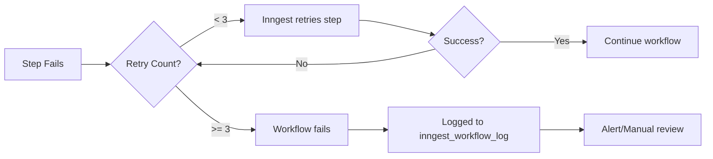

---

## Conclusion

This currency rewards system provides merchants with a powerful, flexible platform for multi-currency loyalty programs. The architecture ensures accuracy through three-level idempotency protection (QStash, Inngest, Database), scales via durable execution with flow control, and maintains complete audit trails for all currency movements including reversals.

The **durable execution architecture** (QStash + Inngest) enables:
- **Delayed awards**: Schedule points for next day at specific times
- **Cancellation**: Abort pending awards when refunds occur
- **Observability**: Track every workflow with Inngest run IDs
- **Reliability**: Step-level retries survive system restarts

The **unified source pipeline** ensures all award sources (purchase, referral, mission, campaign, manual) flow through the same processing path with consistent behavior, delays, and logging.

The separation of calculation and award services enables real-time currency previews during checkout while ensuring reliable currency awards post-payment. The system's support for multiple currency types (points, tickets) with independent rate and multiplier configurations allows merchants to execute sophisticated multi-dimensional loyalty strategies that drive customer engagement and repeat purchases.

## Further Notes

### For Stackable Groups:
- Transaction-wide multipliers apply to the entire amount
- Line-specific multipliers apply as additional bonuses on top of that for matching items

### For Non-Stackable Groups:
- Line-specific multipliers apply to their matching items
- Transaction-wide multipliers apply to the remainder

### Testing Utilities
The system includes comprehensive testing functions:
- `test_currency_calculation()` - Validates calculation logic
- `test_currency_flow()` - End-to-end transaction testing
- `test_wallet_system()` - Wallet update verification
- `test_points_compatibility()` - Ensures points remain fungible
- `validate_ticket_migration()` - Verifies ticket type migration integrity

### Migration from Fungible to Non-fungible Tickets

For systems migrating from a single ticket balance to multiple ticket types:

**Migration Strategy**:
1. **Legacy Preservation**: Existing ticket balances become "LEGACY_TICKET" type
2. **Historical Integrity**: All past transactions updated with appropriate `target_entity_id`
3. **Backward Compatibility**: APIs support both old (single ticket balance) and new (per-type) responses
4. **Zero Downtime**: Migration scripts designed for live system updates

**Key Migration Steps**:
- Create `ticket_type` table for defining distinct ticket entities
- Create `user_ticket_balances` table for per-type balance tracking
- Update `wallet_ledger` to include `target_entity_id` field
- Modify `earn_factor` to require `target_entity_id` for ticket rewards
- Update all wallet functions to handle ticket types appropriately

**Post-Migration Benefits**:
- Support unlimited distinct ticket types
- Independent validity periods per ticket type
- Granular tracking and reporting per ticket type
- Automatic expiration handling
- Enhanced loyalty program flexibility

---

## Architectural Decisions

### Earning Method Configuration Strategy

**Decision Date**: January 2026  
**Status**: Implemented

#### Context

The system supports multiple earning methods for customers to accumulate currency:
- Code claiming (promotional codes)
- Marketplace integration (Shopee, Lazada, TikTok)
- Receipt uploads (photo submission with approval)
- POS integration (point-of-sale systems)
- Referrals (invite friends)
- Missions (complete challenges)

#### Decision: Configuration-Based Enablement (Not Explicit Flags)

**We decided NOT to add global enable/disable flags** for each earning method in `merchant_master`.

#### Rationale

**1. Natural Gating Through Configuration**
- **Marketplace**: Works if credentials configured in `merchant_credentials`, otherwise disabled
- **Code claiming**: Works if codes exist in system, otherwise disabled
- **Receipt upload**: Controlled via `earning_channels.active` flag
- **POS**: Works if API credentials configured
- Each method naturally disabled if not set up

**2. Avoid Widespread Function Updates**
Adding explicit flags would require updating:
- 8+ edge functions (claim-codes, upload-receipts, marketplace processors, etc.)
- Currency calculation RPC (`calc_currency_for_source`)
- Validation logic in each entry point
- Risk of inconsistency if some functions not updated

**3. UI Control via earning_channels Table**
- `earning_channels.active` controls frontend display
- Merchants can hide/show earning methods from users
- Operational state implicit (configured = enabled)

**4. Source Tracking Already Exists**
- `wallet_ledger.source_type` tracks earning method
- Reporting by method already possible
- No schema changes needed

#### Implementation

**UI Visibility:**
```sql
-- Control what users see
UPDATE earning_channels SET active = false WHERE channel_code = 'code_claiming';
```

**Operational State:**
- Marketplace: Check if `merchant_credentials` has platform credentials
- Codes: Check if active codes exist for merchant
- Receipt: Check if OCR/upload configured
- Natural enablement through presence of configuration

#### Benefits

- ✅ Simpler schema (no new flags)
- ✅ No function updates required
- ✅ Configuration-driven (explicit over implicit)
- ✅ Less coupling between systems
- ✅ Easier maintenance

#### Trade-offs

- Admin must configure/remove credentials to disable (not just toggle)
- No single "master switch" for each method
- Requires configuration understanding

#### Alternative Considered (Rejected)

**Explicit enable flags in merchant_master:**
```sql
code_claiming_enabled BOOLEAN
receipt_upload_enabled BOOLEAN
marketplace_enabled BOOLEAN
```

**Rejected because:**
- Requires 8+ function updates
- Adds validation complexity
- Duplicate control (both flags + configuration)
- More moving parts to maintain

#### Current Fields (Minimal)

**Only marketplace status config:**
- `marketplace_claim_from_status` - Which order status triggers claim

**No other earning method flags** - Controlled through configuration presence.

---

## Appendix: Schema Changes (v2.1)

### Overview
Version 2.1 introduces UOM (Unit of Measure) threshold support for quantity-based and amount-based loyalty rules, enabling B2B and bulk purchase scenarios.

### New Columns Added

#### product_sku_master
```sql
ALTER TABLE product_sku_master 
ADD COLUMN IF NOT EXISTS uom_primary TEXT,
ADD COLUMN IF NOT EXISTS uom_secondary TEXT;

COMMENT ON COLUMN product_sku_master.uom_primary 
  IS 'Primary unit of measure code (e.g., STD, BAG, PIECE, KG)';
COMMENT ON COLUMN product_sku_master.uom_secondary 
  IS 'Secondary/bulk unit of measure code (e.g., TON, PALLET, CONTAINER)';
```

**Purpose**: Define measurement units for products
**Examples**: 
- Primary: BAG, PIECE, BOTTLE, SACHET, CUP, BOX, JAR
- Secondary: TON, PALLET, CARTON, CASE, TRAY

#### purchase_items_ledger
```sql
ALTER TABLE purchase_items_ledger 
ADD COLUMN IF NOT EXISTS quantity_secondary NUMERIC;

COMMENT ON COLUMN purchase_items_ledger.quantity_secondary 
  IS 'Quantity in secondary UOM. The existing quantity field represents primary UOM.';
```

**Purpose**: Store both primary and secondary measurements for same purchase line item
**Note**: Existing `quantity` field unchanged (backward compatible)

#### earn_conditions
```sql
ALTER TABLE earn_conditions 
ADD COLUMN IF NOT EXISTS threshold_unit TEXT 
  CHECK (threshold_unit IN ('quantity_primary', 'quantity_secondary', 'amount')),
ADD COLUMN IF NOT EXISTS min_threshold NUMERIC,
ADD COLUMN IF NOT EXISTS max_threshold NUMERIC,
ADD COLUMN IF NOT EXISTS apply_to_excess_only BOOLEAN DEFAULT false;

COMMENT ON COLUMN earn_conditions.threshold_unit 
  IS 'What to check for threshold: quantity_primary (check quantity field), quantity_secondary (check quantity_secondary field), amount (check line_total)';
COMMENT ON COLUMN earn_conditions.min_threshold 
  IS 'Minimum value required to qualify (quantity or amount depending on threshold_unit)';
COMMENT ON COLUMN earn_conditions.max_threshold 
  IS 'Maximum eligible value cap (prevents abuse on very large purchases)';
COMMENT ON COLUMN earn_conditions.apply_to_excess_only 
  IS 'When true: multiplier applies only to quantity/value above min_threshold. When false (default): multiplier applies to full matched item line value.';
```

**Purpose**: Configure threshold rules for conditional loyalty bonuses

### Function Updates

#### evaluate_earn_conditions()
**Changes**:
- Added threshold checking logic for product conditions
- Supports quantity_primary, quantity_secondary, and amount thresholds
- Checks min_threshold before approving condition
- Applies max_threshold cap if specified
- Returns matched items with calculated totals

**Backward Compatible**: NULL thresholds = original behavior (no threshold check)

#### calc_currency_for_transaction()
**Changes**:
- Maintains existing calculation logic
- Now references threshold-validated conditions from evaluate_earn_conditions()
- No breaking changes to multiplier application

**Backward Compatible**: Works unchanged with existing earn factors

### Migration Safety

**Additive Changes Only**:
- ✅ All new columns are nullable with sensible defaults
- ✅ Existing earn factors without thresholds work unchanged
- ✅ Functions handle null threshold values gracefully
- ✅ No breaking changes to existing functionality

**Rollback Available**:
- Functions can be restored to original versions
- New columns can be dropped if needed
- See: `/migrations/rollback_uom_thresholds.sql`

### Configuration Examples

#### Example 1: Quantity Threshold (Primary UOM)
```sql
-- Product with UOMs
UPDATE product_sku_master 
SET uom_primary = 'BAG', uom_secondary = 'TON'
WHERE sku_code = 'CEMENT-001';

-- Condition: Buy ≥50 bags
INSERT INTO earn_conditions (
  entity, entity_ids, threshold_unit, min_threshold, apply_to_excess_only
) VALUES (
  'product_sku', ARRAY['<sku_uuid>'], 
  'quantity_primary', 50, false
);

-- Result: 5x multiplier applies to full line value if qty ≥ 50
```

#### Example 2: Secondary UOM with Excess Mode
```sql
-- Condition: Buy ≥2 tonnes, bonus on excess only
INSERT INTO earn_conditions (
  entity, entity_ids, threshold_unit, min_threshold, apply_to_excess_only
) VALUES (
  'product_sku', ARRAY['<steel_sku_uuid>'], 
  'quantity_secondary', 2, true
);

-- Result: If buy 3 tonnes, 10x multiplier applies only to 1 tonne excess
```

#### Example 3: Amount Threshold with Cap
```sql
-- Condition: Spend ≥5000 THB, max 50000 THB
INSERT INTO earn_conditions (
  entity, entity_ids, threshold_unit, min_threshold, max_threshold
) VALUES (
  'product_category', ARRAY['<electronics_uuid>'], 
  'amount', 5000, 50000
);

-- Result: 3x multiplier applies, but capped at 50k even if spend 80k
```

---

## Appendix: Technology Stack

### Core Infrastructure
- **Database**: Supabase (PostgreSQL)
- **Edge Functions**: Supabase Edge Functions (Deno runtime)
- **Event Bus**: QStash (Upstash) - HTTP-based message delivery with flow control
- **Workflow Engine**: Inngest - Durable execution for serverless
- **Cache**: Upstash Redis - Merchant configuration caching

### Key Dependencies
- `@upstash/qstash` - QStash client for event publishing
- `inngest` - Inngest SDK for workflow definition
- `@supabase/supabase-js` - Supabase client for database operations

### Environment Variables (Edge Functions)

**publish-currency-event**:
- `QSTASH_TOKEN` - QStash authentication
- `INNGEST_EVENT_KEY` - Inngest event key for URL construction

**inngest-currency-serve**:
- `SUPABASE_URL` - Supabase project URL
- `SUPABASE_SERVICE_ROLE_KEY` - Service role for RPC calls
- `INNGEST_SIGNING_KEY` - Verifies requests from Inngest

**get-merchant-config**:
- `UPSTASH_REDIS_MERCHANT_CONFIG_URL` - Redis REST URL
- `UPSTASH_REDIS_MERCHANT_CONFIG_TOKEN` - Redis authentication

### Database Secrets (Vault)
- `supabase_url` - Used by triggers for HTTP calls
- `service_role_key` - Used by triggers for authentication

---

*Document Version: 4.1*  
*Last Updated: January 2026*  
*System: Supabase CRM - Currency Rewards Engine with CDC + Render Consumer + Inngest Architecture*  
*Architecture: CDC → Render Consumer → Inngest (matching Tier v4.0 architecture)*
*Feature Update: v2.1 - UOM Threshold Support for Quantity/Amount-based Rules*
