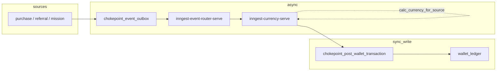

# Currency

Points and tickets earned from purchases, missions, referrals, campaigns, and manual adjustments — calculated from earn rules, awarded asynchronously with optional delay, tracked in wallet lots with expiry and reversal.

Owner surfaces: loyalty-admin, loyalty-user, rewarding-shopify (embedded earn configuration)

## Concept

**Currency** — Loyalty value a member holds: fungible **points** or non-fungible **tickets** (each ticket type is its own balance).

**Earn rule** — Merchant configuration that maps eligible spend or events to currency. Rules are built from **earn factor groups** (program window, stackable flag, optional UI mode) and **earn factors** (rate, multiplier, or fixed grant) with optional **earn conditions** (tier, product, store, persona, thresholds, exclusions).

**Calculation** — Read-only evaluation: given a source (usually a purchase), determine how much of each currency type to grant and which factors applied. Does not change balances.

**Award** — Durable write path: after calculation, insert **wallet ledger** rows and update balances, usually via Inngest so delays and cancellations survive restarts.

**Wallet lot** — A ledger earn row with optional **expiry date**, **deductible balance** (FIFO burn tracking), and lifecycle fields (redeemed, expired). Reversals and burns reference lots.

**Public vs personalized earn** — Public factors (`public = true`) apply to all eligible members; personalized offers (`public = false`) attach to specific members via assignment rows with their own validity window.

**Source type** — Why currency moved: purchase, purchase item, referral, mission, campaign, manual adjustment, redemption burn, expiry, import, etc. Each award row records source type and source id for idempotency and reversal.

**Simple vs Advanced earn UI (Shopify embedded admin)** — Same backend rows; Simple is a constrained editor when the merchant config satisfies detection rules; Advanced exposes the full earn engine.

Tier, persona, product category, store, payment method, and campaigns are **independent attributes** in condition evaluation — tier is one gate among many, not the sole rate driver.

## Rules

### Configuration and inheritance

- If an earn factor group is inactive → no factor in that group participates in calculation.
- If a factor’s active flag or window is null → inherit active/window from the parent group; if both null → factor is active with no end date unless conditions fail.
- If a merchant edits a **shared earn conditions group** → every linked factor’s eligibility changes together; two **rate** factors for the same `(target_currency, target_entity_id)` must not share a group intent — only one rate wins (best for member).
- If **public** and **personalized** factors both qualify → they are evaluated in one pool; one best **rate** per currency target; multipliers follow group **stackable** rules.

### Calculation (purchases and routed sources)

- If transaction amount is zero → calculated earn is zero; award path may still record audit when invoked.
- For each target currency (points or a specific ticket type): among qualifying **rate** factors, **lowest spend-per-unit wins** (member-favorable); result is floored to whole units.
- If **stackable = true** on the group → all qualifying multipliers in scope combine (typically multiplicative per product design).
- If **stackable = false** → at most one multiplier per scope; **product-scoped** and **transaction-remainder** multipliers may both apply because they operate on disjoint portions of the basket.
- **Product include** conditions → factor applies only to matching line items; **exclude** conditions (product entities only) → remove matching lines from the eligible set after includes; if the eligible set is empty → factor does not apply.
- **Threshold** on a condition (`quantity_primary`, `quantity_secondary`, `amount`) → factor applies only when min met; **max_threshold** caps eligible quantity/value; **apply_to_excess_only = true** → multiplier applies only above the minimum (excess-only mode).
- If personalized assignment is past **window_end** at calculation time → that offer is ignored; public rules still apply.
- **calc_currency_for_source** routes by source: purchase → transaction engine; referral → referral outcome config; mission → mission outcomes; campaign/manual → fixed amounts from metadata.
- Reversal amounts use **historical award rows** for the same source (rates/multipliers at earn time), scaled by refund proportion — not current earn rules.

### Award timing and cancellation

- Merchant delay settings on **merchant_master** (`currency_award_delay_days`, `currency_award_delay_minutes`, `currency_award_time`, `currency_award_timezone`, `currency_award_delay_type`) determine scheduled award time in the async worker.
- Precedence: **delay_days > 0** → calendar date + award time in merchant timezone; else **delay_minutes > 0** → rolling delay from event time; else **award_time** only → next occurrence of that clock time; else immediate.
- Pending delayed awards live in **Inngest workflow state** (no separate pending table); **currency/cancelled** with matching `source_type` + `source_id` cancels sleep via `cancelOn`.
- If the same source is awarded twice with the same `(merchant_id, source_type, source_id, currency, component, transaction_type)` → second write is rejected by ledger uniqueness (idempotent skip).

### Wallet write and balances

- All balance-changing wallet inserts go through **chokepoint_post_wallet_transaction**; direct inserts on **wallet_ledger** are forbidden by convention and grants.
- **Points** balance is stored on **user_wallet.points_balance**; each **ticket type** has its own balance row; ledger **target_entity_id** is null for points and ticket type id for tickets.
- **Earn** increases balance; **burn** / **reversal** / **expiry** decrease or mark lots; reversals cannot exceed originally awarded amounts for that source (policy may clamp when balance insufficient).

### Expiry

- **Points expiry** is configured per merchant (`points_expiry_active`, `points_expiry_mode`, TTL months, fixed frequency, fiscal year-end month, minimum period months on **merchant_master**).
- **Ticket expiry** is configured per **ticket_type** (TTL, fixed frequency, or absolute date mode for event tickets).
- Modes: **ttl** (per-lot date from earn date + months); **fixed_frequency** (next fiscal period end with minimum-period protection); **absolute_date** (tickets only — all lots share configured calendar end).
- Expiry date must be computable before earn insert when expiry is active; if calculation fails → entire wallet transaction rolls back (no lot without expiry when policy requires it).
- Only **unused** lot balance expires (respects deductible / redeemed portions).
- Daily batch: **should_run_expiry_today** gates work; **process_currency_expiry_batch** processes in chunks; results logged to **expiry_processing_log**. Scheduled on Render **currency-expiry-daily** (replaces retired pg_cron `daily-currency-expiry`, 2026-09-02). Legacy **process_expiry_if_needed** remains callable but is not the primary scheduler.
- **Expiry reminders** (LINE/email content) are **not** the notification outbox — Render cron **expiry-reminder-batch** lists due merchants, runs finder RPCs, delivers via shared notification engine, marks **fn_mark_expiry_reminder_ran** (replaced Inngest expiry tick, 2026-09-03).

### Reversal and refunds

- Full refund/cancel on a purchase → reverse earned currency for that purchase source (or cancel pending Inngest award if not yet posted).
- Partial refund → proportional reversal per currency component using historical ledger metadata.
- Shopify **refunds/create** → purchase cancel path with best-effort reversal policy (see **Shopify** under System).

*Example (rate selection):* Two public rates qualify — 100 THB/point and 50 THB/point — member receives the 50 THB/point rate.

## Journeys

### Admin journey

| Page | Owning repo | BFF / RPC |
| --- | --- | --- |
| Earn rules (hub) | loyalty-admin | `bff_get_currency_config`, `bff_get_basic_currency_config`, studio summary loaders |
| Earn rules — Basic | loyalty-admin | `bff_get_basic_currency_config`, `bff_upsert_basic_currency_config` |
| Earn rules — Studio (Advanced) | loyalty-admin | `bff_get_currency_config`, `bff_upsert_currency_config` |
| Earn rules — dimensional rate rows | loyalty-admin | `bff_upsert_activity_currency_matrix` (activity-linked rates where enabled) |
| Ticket types | loyalty-admin | ticket type BFFs on **merchant-currency-settings/ticket-types** |
| Customer 360 — wallet history / lots | loyalty-admin | `bff_admin_get_member_wallet_history`, `bff_admin_get_member_wallet_lots` |
| Manual wallet adjustment | loyalty-admin | admin wallet / adjustment RPCs (via member ops flows) |
| Reports — points | loyalty-admin | reporting BFFs (aggregates from ledger) |

| Setting | Effect on behaviour |
| --- | --- |
| Earn rate (Baht per point or per ticket unit) | Creates **rate** earn factors per currency target |
| Different rate per tier | One rate factor per tier with tier **earn_condition** |
| Product exclusions | **exclude** product conditions; two-pass eval |
| Multipliers + stackable | **multiplier** factors; **earn_factor_group.stackable** |
| Allowed purchase statuses (basic config) | Which purchase statuses may earn when wired on create/update paths |
| Points expiry fields on merchant | TTL vs fixed frequency, fiscal alignment, minimum period, active flag |
| Per ticket type expiry | Ticket TTL / frequency / absolute end date |
| Award delay fields on merchant | When Inngest schedules **currency/award** after source event |
| Simple vs Advanced (Shopify) | Which embedded editor loads; does not change engine semantics |

1. Open **Earn rules** — hub shows Basic, Studio, lifecycle, and channel shortcuts; standalone admin defaults to full Studio when not Simple-eligible.
2. Configure **Basic** earn rate and multipliers (or **Studio** for multi-group, personas, thresholds, fixed grants, time conditions).
3. Set **points expiry** and **award timing** on merchant currency settings (same hub area / linked settings).
4. Define **ticket types** (names, credit vs raffle, Shopify store credit flag) before ticket earn factors.
5. Save — upsert BFFs rewrite factor groups/factors/conditions for that editor scope.
6. On **Customer 360**, inspect **wallet history** and **lots** (expiry dates, deductible balance, reversals).

Common pitfalls: shared condition group edits affecting multiple factors; two rates on same currency silently collapsing to best rate; enabling expiry without valid mode fields blocks earns; mixing Simple UI after Advanced save sticks on Advanced (`ui_mode`).

### Member journey

| Page / surface | Owning repo | BFF / RPC |
| --- | --- | --- |
| Wallet / points balance | loyalty-user | wallet summary RPCs, transaction list |
| Earn on purchase | loyalty-user / marketplace | purchase completion → async award (member sees balance after workflow) |
| Store credit history (when ticket is Shopify credit) | loyalty-admin front-line / member views | `bff_store_credit` |

1. Member completes an eligible purchase or mission — app may show projected earn from preview APIs where integrated.
2. Balance updates after async award (or immediately for synchronous manual/API paths).
3. Wallet shows ledger lines with descriptions by source type; lots show expiry when configured.
4. On refund, member sees reversal lines linked to original earn; balance may not go negative depending on merchant policy.

| Error (typical) | Cause |
| --- | --- |
| No earn posted | Purchase not in earn-eligible status, earn disabled on order, or workflow cancelled |
| Lower than expected points | Best-rate selection, non-stackable multiplier scope, or exclusions removed lines |
| Missing expiry on row | Merchant/ticket expiry inactive at earn time |

### Shopify

Embedded **Earn rules** uses **Simple** or **Advanced** mode (detection at load):

| Simple constraint | Rule |
| --- | --- |
| Earn factor groups | Exactly one group |
| Currencies | Points and/or designated Shopify **store credit** ticket (`is_credit`, `credit_platform = shopify`) |
| Rate windows | No window on rate factors |
| Condition entities | Only tier + product SKU/product/brand/category |
| Forbidden | Persona, store attributes, extra ticket types, multiple groups |

Simple **Earn rate** maps to **rate** factors; **Points multiplier** maps to **multiplier** factors with optional tier/product/time pills; **stackable** maps to group flag. Store credit parallels points with `target_currency = ticket`. **Advanced** removes constraints (multi-group, thresholds, personalized offers, personas, multiple ticket types). First save from Advanced sets `earn_factor_group.ui_mode = advanced` and does not auto-revert.

Storefront **points display** (product badge, balance widget) is configured in **Display_Settings.md** — not duplicated here.

## System

### Data model

| Artifact | Role |
| --- | --- |
| `earn_factor_group` | Program container: merchant, stackable, optional window, `ui_mode` (simple/advanced) |
| `earn_factor` | Rate, multiplier, or fixed; target currency (points/ticket) and ticket type id |
| `earn_conditions_group` / `earn_conditions` | Eligibility gates, thresholds, exclusions |
| `earn_factor_user` | Personalized offer assignments |
| `merchant_master` | Points expiry columns; currency award delay/time/timezone columns |
| `ticket_type` | Ticket metadata, expiry config, Shopify store credit flags |
| `user_wallet` | Points balance per user/merchant |
| User ticket balance table | Per ticket type quantity (see live schema) |
| `wallet_ledger` | Immutable movements; expiry_date, deductible_balance, source_type/id, dedup key |
| `expiry_processing_log` | Batch expiry run audit |
| `inngest_workflow_log` | Currency workflow execution audit |
| `chokepoint_event_outbox` | Deliberate event emission for purchase (and other) chains → Inngest routers |
| Materialized views backing eligibility | Fast **get_eligible_earn_factors** paths (refreshed on schedule) |

Triggers on **wallet_ledger** (preserved through wallet chokepoint migration): dedup key, FIFO burn tracking, Shopify store credit issue enqueue — data-integrity and side-effect enqueue, not alternate writers.

### Functions

| Function | Role |
| --- | --- |
| `calc_currency_for_transaction` | Purchase calculation from transaction id |
| `calc_currency_for_source` | Router for purchase, referral, mission, campaign, manual |
| `get_eligible_earn_factors` / `_optimized` / `_core` | Eligible factor discovery (MV-backed or core inputs) |
| `chokepoint_post_wallet_transaction` | **Wallet chokepoint** — sole canonical ledger writer |
| `enqueue_wallet_transaction` / `enqueue_bulk_wallet_transactions` | Queue-shaped entry points that delegate to chokepoint |
| `api_post_wallet_transaction` | API-key wallet post (delegates to chokepoint) |
| `bff_get_currency_config` / `bff_upsert_currency_config` | Advanced earn editor JSON |
| `bff_get_basic_currency_config` / `bff_upsert_basic_currency_config` | Simple earn editor JSON |
| `bff_admin_get_member_wallet_history` / `bff_admin_get_member_wallet_lots` | Admin member wallet views |
| `api_get_wallet_transactions` | External/history reads |
| `should_run_expiry_today` | Gate daily expiry job |
| `process_currency_expiry_batch` | Batch expire lots for a run date |
| `process_expiry_if_needed` | Legacy wrapper (prefer Render cron loop) |
| `fn_list_due_expiry_reminder_merchants` / `fn_mark_expiry_reminder_ran` | Reminder cron gate and dedup |
| `fn_emit_inngest_event` | DB-side Inngest publish helper where used |
| `fn_chokepoint_emit_event` | Outbox insert for event routers |

### Flows

**Preview (sync)** — Admin or edge **currency-calculator-direct** / purchase preview calls **calc_currency_for_transaction** or **calc_currency_core** without wallet writes.

**Purchase earn (async, primary)** — **chokepoint_post_purchase_event** writes purchase ledger → **chokepoint_event_outbox** → OutboxPublisher → **inngest-event-router-serve** (`currency-purchase-router` and related routers) → **inngest-currency-serve** (`currency-award` workflow) → **calc_currency_for_source** (if not precomputed) → optional Inngest sleep for merchant delay → **chokepoint_post_wallet_transaction** per currency row → **inngest_workflow_log**. Router predicates respect purchase status and `earn_currency` on the order (see **Order_Booking.md**).

**Other sources (async)** — Referral, mission, campaign, and manual paths publish into the same Inngest currency serve pattern with appropriate source_type; calculation via **calc_currency_for_source**.

**CDC parallel path** — Debezium still publishes **purchase_ledger**, **referral_ledger**, **mission_claims** (and wallet) to Kafka; **crm-event-processors** **CurrencyConsumer** may calculate and publish **currency/award** to Inngest with Redis dedup. Operational deployments may run outbox-first for purchases; treat duplicate consumer + outbox as a **Known gaps** migration area — idempotency relies on Redis, Inngest, and ledger uniqueness.

**Sync wallet writes** — Imports, admin adjustments, marketplace claim credits, redemption burns, and expiry batches call **chokepoint_post_wallet_transaction** (or enqueue helpers) directly without Inngest when configured for immediate execution.

**Reversal** — Refund/cancel on purchase triggers **currency-reversal** workflow or proportional chokepoint posts with `component = reversal`; Shopify refund webhook uses **api_cancel_purchase** with reversal mode.

**Expiry batch** — Render **currency-expiry-daily** loops **process_currency_expiry_batch** until complete; **should_run_expiry_today** skips idle days.

```mermaid
flowchart LR
  subgraph sources
    PL[purchase / referral / mission]
  end
  subgraph async
    OB[chokepoint_event_outbox]
    IR[inngest-event-router-serve]
    IC[inngest-currency-serve]
  end
  subgraph sync_write
    CP[chokepoint_post_wallet_transaction]
    WL[wallet_ledger]
  end
  PL --> OB --> IR --> IC --> CP --> WL
  IC -.->|calc_currency_for_source| IC
```

### External services

| Service | Role |
| --- | --- |
| **inngest-currency-serve** (Edge) | Durable award/reversal workflows |
| **inngest-event-router-serve** (Edge) | Routes outbox/Kafka-shaped events to domain Inngest functions |
| **crm-event-processors** (Render) | Kafka consumers including CurrencyConsumer; expiry-reminder-batch job |
| **currency-expiry-daily** (Render cron) | Nightly expiry loop |
| **currency-calculator-direct** (Edge) | JWT preview calculator |
| **wallet-api** / **wallet-transactions** (Edge) | External wallet API surfaces |
| Confluent CDC + Redis | Legacy/event-bus dedup and merchant config cache on consumer path |

Retired from primary architecture: pg_cron **daily-currency-expiry** (2026-09-02); QStash as the main currency event bus (superseded by Inngest + outbox/consumer); **`post_wallet_transaction`** name (replaced by **chokepoint_post_wallet_transaction**, 2026-05-13).

### Shopify

| Path | Role |
| --- | --- |
| Order webhooks → **shopify-webhooks** | Normalize order; marketplace claim → purchase + wallet credit when claimable |
| **refunds/create** | **api_cancel_purchase** with best-effort full reversal |
| **trg_enqueue_shopify_store_credit_issue** on **wallet_ledger** | After earn on Shopify credit ticket type → **shopify-issue-store-credit** edge (idempotent issue; not redemption burn) |
| Onboarding | Seeds credit **ticket_type** (`is_credit`, `credit_platform = shopify`) |
| **bff_get_basic_currency_config** / **bff_upsert_basic_currency_config** | Embedded Simple earn editor |

Platform webhook map: **Shopify.md**. Marketplace claim: **Marketplace.md**. Store credit product rules: **Store_Credit.md**.

### Known gaps

- **Dual ingest:** Outbox → Inngest and CDC → CurrencyConsumer may both exist; confirm per-environment flags (`CHOKEPOINT_EVENTS_ENABLED`, consumer subscriptions) before assuming a single path.
- **Open API** HTTP shapes in older doc sections were illustrative; contract truth is **Open_API.md** and live Edge **wallet-***/**currency-*** functions.
- **ui_mode** on **earn_factor_group** — confirm column shipped everywhere Simple detection relies on it (detection logic also inspects factor shape).

## Related

- **Purchase_Transaction.md** — Purchase ledger, item completion, refund semantics feeding calc and reversal.
- **Order_Booking.md** — Pending-order earn via outbox router predicates and `earn_currency`.
- **Earn_Channel.md** — Where members can earn (channels, receipts, activities) adjacent to rate configuration.
- **Tier.md** — Tier as earn condition and tier change side effects (not the rate owner).
- **Central_Outcome_Dispatcher.md** — Missions, check-in, referral grants that call currency calc/award primitives.
- **Bulk_Import_Currency.md** — Import batches through wallet chokepoint with dedup.
- **Store_Credit.md** — Shopify credit ticket redemption vs earn issue trigger.
- **architecture/event-chokepoints.md** — Wallet chokepoint migration status and rules.
- **CRM_Event_Driven_Architecture.md** — CDC topology (parallel to outbox until decommissioned).
