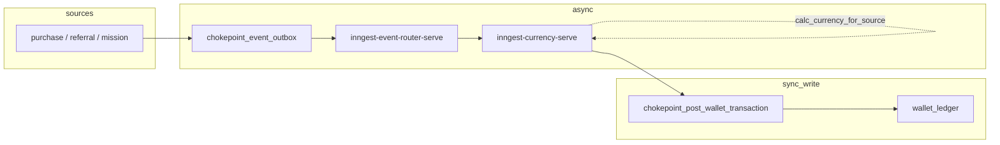

# Currency

Points and tickets earned from purchases, missions, referrals, campaigns, and manual adjustments — calculated from earn rules, awarded asynchronously with optional delay, tracked in wallet lots with expiry and reversal.

Owner surfaces: loyalty-admin, loyalty-user, rewarding-shopify (embedded earn configuration)

## Concept

**Currency** — Loyalty value a member holds: fungible **points** or non-fungible **tickets** (each ticket type is its own balance).

**Earn rule** — Merchant configuration that turns eligible spend into currency. Read any promo sign as a rule: *"Gold members get 2× points on skincare this weekend."* "2× points" is what the member gets (the **factor**); "Gold members", "skincare", "this weekend" are the gates (the **conditions**); the **program** it sits in decides whether it combines with other bonuses.

An earn rule has four levels, outermost first:

| Level | Answers | Holds |
| --- | --- | --- |
| **Earn factor group** (program) | How do rewards combine, and when does the program run? | Active flag, date window, **stackable** switch for multipliers |
| **Earn factor** | What does the member get? | **Rate** (฿10 = 1 point — the base earning), **multiplier** (2× on top of the rate), or **fixed** grant (+50 points), for one target currency |
| **Condition set** (conditions group) | Which gates does this factor need? | One or more conditions — usually exactly one; several factors may share one set |
| **Earn condition** | Does this purchase and member qualify? | One attribute plus the values that match |

A factor with no condition set applies to every eligible purchase — that is the base rate. Day-of-week and hour windows (weekends, 18:00–21:00) belong to the factor itself, not to its condition set.

**Condition attributes** — tier is one gate among many, not the owner of the rate:

- **The purchase — what was bought:** product category, brand, product, SKU. Include ("only skincare") or exclude ("not gift cards").
- **The purchase — where it was bought:** store, store attribute (sales channel, region, …).
- **The member — who:** tier, persona.
- **How much:** a minimum spend or quantity (**threshold**) that unlocks a multiplier.

**Engine vs editor** — The engine always stores all four levels. Merchant editors hide the program and condition-set levels:

- **Basic** — one program; one rate, flat or per tier; bonus multipliers on tier, product, or date/day windows; one "allow multiplier stacking" switch.
- **Advanced Earn** — platform super admin enables it per merchant and picks which condition attributes become columns. The merchant edits a row table; each row is one rate or multiplier. Still one program and one stacking switch.
- **Earn Studio** (legacy, planned removal) — full editor: several programs with their own stacking and windows, shared condition sets. Shown only to merchants whose setup Basic cannot hold, until they move to Advanced Earn.

Several programs with different stacking exist only from Earn Studio or legacy data; neither simplified editor creates them.

**Calculation** — Read-only evaluation: given a source (usually a purchase), determine how much of each currency type to grant and which factors applied. Does not change balances.

**Award** — Durable write path: after calculation, insert **wallet ledger** rows and update balances, usually via Inngest so delays and cancellations survive restarts.

**Wallet lot** — A ledger earn row with optional **expiry date**, **deductible balance** (FIFO burn tracking), and lifecycle fields (redeemed, expired). Reversals and burns reference lots.

**Public vs personalized earn** — Public factors (`public = true`) apply to all eligible members; personalized offers (`public = false`) attach to specific members via assignment rows with their own validity window.

**Source type** — Why currency moved: purchase, purchase item, referral, mission, campaign, manual adjustment, redemption burn, expiry, import, etc. Each award row records source type and source id for idempotency and reversal.

**Simple vs Advanced earn UI (Shopify embedded admin)** — Same backend rows; Simple is a constrained editor when the merchant config satisfies detection rules; Advanced exposes the full earn engine. Not the same switch as loyalty-admin **Advanced Earn**.

## Rules

### Configuration and inheritance

- If an earn factor group is inactive → no factor in that group participates in calculation.
- If a factor’s active flag or window is null → inherit active/window from the parent group; if both null → factor is active with no end date unless conditions fail.
- If a merchant edits a **shared earn conditions group** → every linked factor’s eligibility changes together; two **rate** factors for the same `(target_currency, target_entity_id)` must not share a group intent — only one rate wins (best for member).
- If **public** and **personalized** factors both qualify → they are evaluated in one pool; one best **rate** per currency target; multipliers follow group **stackable** rules.

### Conditions and matching

- A factor links to at most one condition set. Every condition belongs to exactly one set; a condition never links to a factor directly.
- If a factor has no condition set → it applies to every eligible purchase.
- The factor group is not part of eligibility: it only switches the whole program on or off (active, window) and sets stacking.
- All conditions in a set must pass (ALL). Several values on one condition match if any of them is present ("skincare or haircare lines").
- "Buy A **and** B" → two conditions in the same set. Merchants do not pick AND / OR / EACH; a stored operator is ignored.
- If a factor has a day/hour window → it applies only inside that window (factor timezone), on top of its condition set.

*Example (combo):* "2× when the receipt has ≥ 10 of brand A and ≥ 10 of brand B" = one multiplier, one set, two brand conditions each with a quantity threshold.

### Calculation (purchases and routed sources)

- If transaction amount is zero → calculated earn is zero; award path may still record audit when invoked.
- For each target currency (points or a specific ticket type): among qualifying **rate** factors, **lowest spend-per-unit wins** (member-favorable); result is floored to whole units.
- If **stackable = true** on the group → all qualifying multipliers in scope combine (typically multiplicative per product design).
- If **stackable = false** → at most one multiplier per scope; **product-scoped** and **transaction-remainder** multipliers may both apply because they operate on disjoint portions of the basket.
- **Product include** conditions → factor applies only to matching line items; **exclude** conditions (product entities only) → remove matching lines from the eligible set after includes; if the eligible set is empty → factor does not apply.
- **Threshold** on a condition (spend, primary quantity, or secondary quantity) → evaluated on **multipliers only**, per listed value (each brand or SKU must clear its own minimum); saving a threshold on a **rate** is rejected. **max_threshold** caps eligible quantity/value; **apply_to_excess_only = true** → multiplier applies only above the minimum (excess-only mode).
- If personalized assignment is past **window_end** at calculation time → that offer is ignored; public rules still apply.
- **calc_currency_for_source** routes by source: purchase → transaction engine; referral → referral outcome config; mission → mission outcomes; campaign/manual → fixed amounts from metadata.
- Reversal amounts use **historical award rows** for the same source (rates/multipliers at earn time), scaled by refund proportion — not current earn rules.

### Award timing and cancellation

- Merchant delay settings on **merchant_master** (`currency_award_delay_days`, `currency_award_delay_minutes`, `currency_award_time`, `currency_award_timezone`, `currency_award_delay_type`) determine scheduled award time in the async worker.
- Precedence: **delay_days > 0** → calendar date + award time in merchant timezone; else **delay_minutes > 0** → rolling delay from event time; else **award_time** only → next occurrence of that clock time; else immediate.
- Pending delayed awards live in **Inngest workflow state** (no separate pending table); **currency/cancelled** with matching `source_type` + `source_id` cancels sleep via `cancelOn`.
- If the same source is awarded twice with the same `(merchant_id, source_type, source_id, currency, component, transaction_type)` → second write is rejected by ledger uniqueness (idempotent skip).

### Wallet write and balances

- All balance-changing wallet inserts go through **chokepoint_post_wallet_transaction**; direct inserts on **wallet_ledger** are forbidden by convention and grants.
- **Points** balance is stored on **user_wallet.points_balance**; each **ticket type** has its own balance row; ledger **target_entity_id** is null for points and ticket type id for tickets.
- **Earn** increases balance; **burn** / **reversal** / **expiry** decrease or mark lots; reversals cannot exceed originally awarded amounts for that source (policy may clamp when balance insufficient).

### Expiry

- **Points expiry** is configured per merchant (`points_expiry_active`, `points_expiry_mode`, TTL months, fixed frequency, fiscal year-end month, minimum period months on **merchant_master**).
- **Ticket expiry** is configured per **ticket_type** (TTL, fixed frequency, or absolute date mode for event tickets).
- Modes: **ttl** (per-lot date from earn date + months); **fixed_frequency** (next fiscal period end with minimum-period protection); **absolute_date** (tickets only — all lots share configured calendar end).
- Expiry date must be computable before earn insert when expiry is active; if calculation fails → entire wallet transaction rolls back (no lot without expiry when policy requires it).
- Only **unused** lot balance expires (respects deductible / redeemed portions).
- Daily batch: **should_run_expiry_today** gates work; **process_currency_expiry_batch** processes in chunks; results logged to **expiry_processing_log**. Scheduled on Render **currency-expiry-daily** (replaces retired pg_cron `daily-currency-expiry`, 2026-09-02). Legacy **process_expiry_if_needed** remains callable but is not the primary scheduler.
- **Expiry reminders** (LINE/email content) are **not** the notification outbox — Render cron **expiry-reminder-batch** lists due merchants, runs finder RPCs, delivers via shared notification engine, marks **fn_mark_expiry_reminder_ran** (replaced Inngest expiry tick, 2026-09-03).

### Reversal and refunds

- Full refund/cancel on a purchase → reverse earned currency for that purchase source (or cancel pending Inngest award if not yet posted).
- Partial refund → proportional reversal per currency component using historical ledger metadata.
- Shopify **refunds/create** → purchase cancel path with best-effort reversal policy (see **Shopify** under System).

*Example (rate selection):* Two public rates qualify — 100 THB/point and 50 THB/point — member receives the 50 THB/point rate.

## Journeys

### Admin journey

| Page | Owning repo | BFF / RPC |
| --- | --- | --- |
| Earn rules (hub) | loyalty-admin | `bff_get_currency_config`, `bff_get_basic_currency_config`, studio summary loaders |
| Earn rules — Basic earn config / Points settings | loyalty-admin | `bff_get_basic_currency_config`, `bff_upsert_basic_currency_config` |
| Earn rules — Advanced earn (row table, Uncovered stores) | loyalty-admin | `merchant_master.advanced_earn_config` columns; `bff_upsert_earn_factor_group`, `admin_delete_earn_factor`; pickers `bff_search_earn_rule_entities` |
| Earn rules — Earn Studio (legacy, not_basic only) | loyalty-admin | `bff_get_currency_config`, `bff_upsert_currency_config` |
| Super admin — Advanced Earn | loyalty-admin | `merchant_master.advanced_earn_enabled`, `advanced_earn_config` |
| Ticket types | loyalty-admin | ticket type BFFs on **merchant-currency-settings/ticket-types** |
| Customer 360 — wallet history / lots | loyalty-admin | `bff_admin_get_member_wallet_history`, `bff_admin_get_member_wallet_lots` |
| Manual wallet adjustment | loyalty-admin | admin wallet / adjustment RPCs (via member ops flows) |
| Reports — points | loyalty-admin | reporting BFFs (aggregates from ledger) |

| Setting | Effect on behaviour |
| --- | --- |
| Earn rate (Baht per point or per ticket unit) | Creates **rate** earn factors per currency target |
| Different rate per tier | One rate factor per tier with tier **earn_condition** |
| Product exclusions | **exclude** product conditions; two-pass eval |
| Multipliers + "allow multiplier stacking" | **multiplier** factors; **earn_factor_group.stackable** on the merchant's one program |
| Advanced Earn on + columns (super admin) | Merchant gets the **Advanced earn** row table; each chosen attribute is a column on every row; Basic tab becomes **Points settings**; Earn Studio hidden |
| Allowed purchase statuses (basic config) | Which purchase statuses may earn when wired on create/update paths |
| Points expiry fields on merchant | TTL vs fixed frequency, fiscal alignment, minimum period, active flag |
| Per ticket type expiry | Ticket TTL / frequency / absolute end date |
| Award delay fields on merchant | When Inngest schedules **currency/award** after source event |
| Simple vs Advanced (Shopify) | Which embedded editor loads; does not change engine semantics |

1. Open **Earn rules**. Tabs follow the merchant's mode:
   - **Basic** — **Basic earn config**: earn rate (flat or per tier), bonus multipliers, stacking switch, qualifying purchase statuses, expiry, award timing, lifecycle.
   - **Advanced Earn** — **Advanced earn** (Earn rates, Bonus multipliers, Qualifying purchases; **Uncovered stores** when a store column is on) plus **Points settings** (award timing, expiry, lifecycle). Earn Studio hidden.
   - **not_basic** without Advanced Earn — **Earn Studio** replaces the Basic earn card.
2. There is no merchant **Dimensions** or **Rates** tab; only super admin chooses condition columns (Advanced Earn).
3. Add rates and multipliers. Tier, store, product, and persona pickers open with a first page and filter as you type.
4. Set **points expiry** and **award timing** on merchant currency settings (same hub area / linked settings).
5. Define **ticket types** (names, credit vs raffle, Shopify store credit flag) before ticket earn factors.
6. Save — upsert BFFs rewrite factor groups/factors/conditions for that editor scope.
7. On **Customer 360**, inspect **wallet history** and **lots** (expiry dates, deductible balance, reversals).

Common pitfalls: shared condition group edits affecting multiple factors; two rates on same currency silently collapsing to best rate; enabling expiry without valid mode fields blocks earns; mixing Simple UI after Advanced save sticks on Advanced (`ui_mode`).

### Member journey

| Page / surface | Owning repo | BFF / RPC |
| --- | --- | --- |
| Wallet / points balance | loyalty-user | wallet summary RPCs, transaction list |
| Earn on purchase | loyalty-user / marketplace | purchase completion → async award (member sees balance after workflow) |
| Store credit history (when ticket is Shopify credit) | loyalty-admin front-line / member views | `bff_store_credit` |

1. Member completes an eligible purchase or mission — app may show projected earn from preview APIs where integrated.
2. Balance updates after async award (or immediately for synchronous manual/API paths).
3. Wallet shows ledger lines with descriptions by source type; lots show expiry when configured.
4. On refund, member sees reversal lines linked to original earn; balance may not go negative depending on merchant policy.

| Error (typical) | Cause |
| --- | --- |
| No earn posted | Purchase not in earn-eligible status, earn disabled on order, or workflow cancelled |
| Lower than expected points | Best-rate selection, non-stackable multiplier scope, or exclusions removed lines |
| Missing expiry on row | Merchant/ticket expiry inactive at earn time |

### Shopify

Embedded **Earn rules** uses **Simple** or **Advanced** mode (detection at load):

| Simple constraint | Rule |
| --- | --- |
| Earn factor groups | Exactly one group |
| Currencies | Points and/or designated Shopify **store credit** ticket (`is_credit`, `credit_platform = shopify`) |
| Rate windows | No window on rate factors |
| Condition entities | Only tier + product SKU/product/brand/category |
| Forbidden | Persona, store attributes, extra ticket types, multiple groups |

Simple **Earn rate** maps to **rate** factors; **Points multiplier** maps to **multiplier** factors with optional tier/product/time pills; **stackable** maps to group flag. Store credit parallels points with `target_currency = ticket`. **Advanced** removes constraints (multi-group, thresholds, personalized offers, personas, multiple ticket types). First save from Advanced sets `earn_factor_group.ui_mode = advanced` and does not auto-revert.

Storefront **points display** (product badge, balance widget) is configured in **Display_Settings.md** — not duplicated here.

## System

### Data model

| Artifact | Role |
| --- | --- |
| `earn_factor_group` | Program: merchant, name, active, window, stackable. Parent of factors; not on the eligibility path |
| `earn_factor` | Rate, multiplier, or fixed; target currency (points/ticket) and ticket type id; `earn_factor_group_id` (program) and nullable `earn_conditions_group_id` (condition set — null = unconditional); purchase/item status gates, award scope |
| `earn_conditions_group` | Condition set a factor points at; usually one condition; shareable across factors |
| `earn_conditions` | One gate: entity + `entity_ids` (any-of), include/exclude, optional threshold (multiplier-only). Always has a `group_id` |
| `earn_factor_time_conditions` | Day-of-week / hour window attached directly to a factor (`has_time_conditions`) |
| `merchant_master.advanced_earn_enabled` / `advanced_earn_config` | Super-admin switch and chosen condition columns for the Advanced earn row table |
| `earn_factor_user` | Personalized offer assignments |
| `merchant_master` | Points expiry columns; currency award delay/time/timezone columns |
| `ticket_type` | Ticket metadata, expiry config, Shopify store credit flags |
| `user_wallet` | Points balance per user/merchant |
| User ticket balance table | Per ticket type quantity (see live schema) |
| `wallet_ledger` | Immutable movements; expiry_date, deductible_balance, source_type/id, dedup key |
| `expiry_processing_log` | Batch expiry run audit |
| `inngest_workflow_log` | Currency workflow execution audit |
| `chokepoint_event_outbox` | Deliberate event emission for purchase (and other) chains → Inngest routers |
| Materialized views backing eligibility | Fast **get_eligible_earn_factors** paths (refreshed on schedule) |

Triggers on **wallet_ledger** (preserved through wallet chokepoint migration): dedup key, FIFO burn tracking, Shopify store credit issue enqueue — data-integrity and side-effect enqueue, not alternate writers.

### Functions

| Function | Role |
| --- | --- |
| `calc_currency_for_transaction` | Purchase calculation from transaction id |
| `calc_currency_for_source` | Router for purchase, referral, mission, campaign, manual |
| `get_eligible_earn_factors` / `_optimized` / `_core` | Eligible factor discovery (MV-backed or core inputs) |
| `chokepoint_post_wallet_transaction` | **Wallet chokepoint** — sole canonical ledger writer |
| `enqueue_wallet_transaction` / `enqueue_bulk_wallet_transactions` | Queue-shaped entry points that delegate to chokepoint |
| `api_post_wallet_transaction` | API-key wallet post (delegates to chokepoint) |
| `bff_get_currency_config` / `bff_upsert_currency_config` | Earn Studio editor JSON (full engine shape) |
| `bff_get_basic_currency_config` / `bff_upsert_basic_currency_config` | Basic / Shopify Simple editor JSON; picks or creates the merchant's one points program; returns `not_basic` when the config exceeds Basic |
| `bff_upsert_earn_factor_group` / `admin_delete_earn_factor` | Advanced earn row saves and deletes (no direct table writes from the admin) |
| `bff_search_earn_rule_entities` | Tier / store / product / persona picker search; empty query browses with offset paging |
| `bff_admin_get_member_wallet_history` / `bff_admin_get_member_wallet_lots` | Admin member wallet views |
| `api_get_wallet_transactions` | External/history reads |
| `should_run_expiry_today` | Gate daily expiry job |
| `process_currency_expiry_batch` | Batch expire lots for a run date |
| `process_expiry_if_needed` | Legacy wrapper (prefer Render cron loop) |
| `fn_list_due_expiry_reminder_merchants` / `fn_mark_expiry_reminder_ran` | Reminder cron gate and dedup |
| `fn_emit_inngest_event` | DB-side Inngest publish helper where used |
| `fn_chokepoint_emit_event` | Outbox insert for event routers |

### Flows

**Preview (sync)** — Admin or edge **currency-calculator-direct** / purchase preview calls **calc_currency_for_transaction** or **calc_currency_core** without wallet writes. Shopify product page uses **api_get_product_earn_preview** (see `Display_Settings.md`); with no user it sets transaction-local `rocket.preview_tier_id`, which **evaluate_earn_conditions_core** accepts for `tier` conditions only when `p_user_id IS NULL`.

**Purchase earn (async, primary)** — **chokepoint_post_purchase_event** writes purchase ledger → **chokepoint_event_outbox** → OutboxPublisher → **inngest-event-router-serve** (`currency-purchase-router` and related routers) → **inngest-currency-serve** (`currency-award` workflow) → **calc_currency_for_source** (if not precomputed) → optional Inngest sleep for merchant delay → **chokepoint_post_wallet_transaction** per currency row → **inngest_workflow_log**. Router predicates respect purchase status and `earn_currency` on the order (see **Order_Booking.md**).

**Other sources (async)** — Referral, mission, campaign, and manual paths publish into the same Inngest currency serve pattern with appropriate source_type; calculation via **calc_currency_for_source**.

**CDC parallel path** — Debezium still publishes **purchase_ledger**, **referral_ledger**, **mission_claims** (and wallet) to Kafka; **crm-event-processors** **CurrencyConsumer** may calculate and publish **currency/award** to Inngest with Redis dedup. Operational deployments may run outbox-first for purchases; treat duplicate consumer + outbox as a **Known gaps** migration area — idempotency relies on Redis, Inngest, and ledger uniqueness.

**Sync wallet writes** — Imports, admin adjustments, marketplace claim credits, redemption burns, and expiry batches call **chokepoint_post_wallet_transaction** (or enqueue helpers) directly without Inngest when configured for immediate execution.

**Reversal** — Refund/cancel on purchase triggers **currency-reversal** workflow or proportional chokepoint posts with `component = reversal`; Shopify refund webhook uses **api_cancel_purchase** with reversal mode.

**Expiry batch** — Render **currency-expiry-daily** loops **process_currency_expiry_batch** until complete; **should_run_expiry_today** skips idle days.

```mermaid
flowchart LR
  subgraph sources
    PL[purchase / referral / mission]
  end
  subgraph async
    OB[chokepoint_event_outbox]
    IR[inngest-event-router-serve]
    IC[inngest-currency-serve]
  end
  subgraph sync_write
    CP[chokepoint_post_wallet_transaction]
    WL[wallet_ledger]
  end
  PL --> OB --> IR --> IC --> CP --> WL
  IC -.->|calc_currency_for_source| IC
```

### External services

| Service | Role |
| --- | --- |
| **inngest-currency-serve** (Edge) | Durable award/reversal workflows |
| **inngest-event-router-serve** (Edge) | Routes outbox/Kafka-shaped events to domain Inngest functions |
| **crm-event-processors** (Render) | Kafka consumers including CurrencyConsumer; expiry-reminder-batch job |
| **currency-expiry-daily** (Render cron) | Nightly expiry loop |
| **currency-calculator-direct** (Edge) | JWT preview calculator |
| **wallet-api** / **wallet-transactions** (Edge) | External wallet API surfaces |
| Confluent CDC + Redis | Legacy/event-bus dedup and merchant config cache on consumer path |

Retired from primary architecture: pg_cron **daily-currency-expiry** (2026-09-02); QStash as the main currency event bus (superseded by Inngest + outbox/consumer); **`post_wallet_transaction`** name (replaced by **chokepoint_post_wallet_transaction**, 2026-05-13).

### Shopify

| Path | Role |
| --- | --- |
| Order webhooks → **shopify-webhooks** | Normalize order; marketplace claim → purchase + wallet credit when claimable |
| **refunds/create** | **api_cancel_purchase** with best-effort full reversal |
| **trg_enqueue_shopify_store_credit_issue** on **wallet_ledger** | After earn on Shopify credit ticket type → **shopify-issue-store-credit** edge (idempotent issue; not redemption burn) |
| Onboarding | Seeds credit **ticket_type** (`is_credit`, `credit_platform = shopify`) |
| **bff_get_basic_currency_config** / **bff_upsert_basic_currency_config** | Embedded Simple earn editor |

Platform webhook map: **Shopify.md**. Marketplace claim: **Marketplace.md**. Store credit product rules: **Store_Credit.md**.

### Known gaps

- **Dual ingest:** Outbox → Inngest and CDC → CurrencyConsumer may both exist; confirm per-environment flags (`CHOKEPOINT_EVENTS_ENABLED`, consumer subscriptions) before assuming a single path.
- **Open API** HTTP shapes in older doc sections were illustrative; contract truth is **Open_API.md** and live Edge **wallet-***/**currency-*** functions.
- **ui_mode** — live `earn_factor_group` has no `ui_mode` column; Simple/Advanced detection relies on factor shape. The Shopify "Advanced save sticks" claim under Journeys › Shopify needs re-verification.
- **Earn-table RLS** checks the member account's `admin` role, which no portal staff login has. Admin writes must go through the SECURITY DEFINER BFFs above; any direct `earn_*` table write from loyalty-admin fails.
- **Earn without factors** — at least one merchant (Pornmaya, Sep 2026) receives purchase points with zero `earn_factor` rows, so a fallback path awards outside configured rules. Untraced.
- **Earn Studio removal** — pending for the not_basic merchants (multiple programs, rate time windows, per-line-item rates, unsupported condition types) until they move to Advanced Earn.

## Related

- **Purchase_Transaction.md** — Purchase ledger, item completion, refund semantics feeding calc and reversal.
- **Order_Booking.md** — Pending-order earn via outbox router predicates and `earn_currency`.
- **Earn_Channel.md** — Where members can earn (channels, receipts, activities) adjacent to rate configuration.
- **Tier.md** — Tier as earn condition and tier change side effects (not the rate owner).
- **Central_Outcome_Dispatcher.md** — Missions, check-in, referral grants that call currency calc/award primitives.
- **Bulk_Import_Currency.md** — Import batches through wallet chokepoint with dedup.
- **Store_Credit.md** — Shopify credit ticket redemption vs earn issue trigger.
- **architecture/event-chokepoints.md** — Wallet chokepoint migration status and rules.
- **CRM_Event_Driven_Architecture.md** — CDC topology (parallel to outbox until decommissioned).
