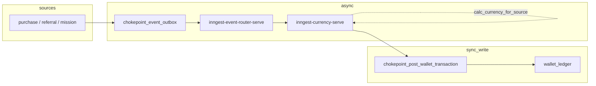

# Currency

Points and tickets earned from purchases, missions, referrals, campaigns, and manual adjustments — calculated from earn rules, awarded asynchronously with optional delay, tracked in wallet lots with expiry and reversal.

Owner surfaces: loyalty-admin, loyalty-user, rewarding-shopify (embedded earn configuration)

## Concept

Currency is how a brand decides what a member gets for buying, and how long they keep it. Most brands want one flat rate or a rate per tier; a few want rules like "Gold students buying vitamins (except omega-3) at Watsons outside Bangkok get ×5". One earn engine serves both: every rule, simple or advanced, is stored as **what the member gets** mapped to **the condition that earns it**, so hard cases are configuration, not custom code. After earning, each grant becomes a lot that is spent first-expiring-first and expires on the merchant's policy.

**Currency** — Loyalty value a member holds: fungible **points** or **tickets** (each ticket type is its own balance).

**Earn factor** — What the member gets: a **rate** (spend per unit, e.g. 100 THB = 1 point) or a **multiplier** (bonus on the rate-derived base, e.g. ×2), targeting points or one ticket type.

**Earn condition** — One requirement a purchase or member must meet. Two families: **purchase attributes** — what was bought (product category, brand, product, SKU; include or exclude) and where (store, store attribute such as sales channel or region); and **member attributes** — tier, persona, birth month. Thresholds and time windows (dates, days of week, hours) qualify conditions and factors.

**Earn condition group** — The unit a factor attaches to. Conditions inside a group are all required (AND); values listed inside one condition are alternatives (Gold *or* Platinum). A factor with no group applies to every eligible purchase. "Either A or B earns ×2" is two factors, each with its own group.

**Earn factor group** — Container that sets **stackability** for the multipliers inside it (combine all, or keep only the best). Winners from different groups always combine. The admin UI keeps one group per currency; multi-group setups are built by the team on the backend.

**Basic vs Advanced mode** — Per-merchant editor mode chosen in Super Admin. Basic: flat or per-tier rate, product exclusions, multipliers conditioned only on product and tier. Advanced: rates and multipliers on any property Super Admin enables for that merchant. Same engine and data either way.

**Calculation** — Read-only evaluation of a source (usually a purchase) into amounts per currency and the factors that produced them. **Award** — the durable write that follows, optionally after a merchant **award delay**.

**Wallet lot** — Each earn row in the ledger: amount, optional **expiry date** (fixed at earn time), and **deductible balance** — the part not yet spent or expired. A member's balance equals the sum of deductible balances across their live lots.

**Expiry policy** — None, **rolling** (each lot lives N months), or **fixed frequency** (all lots expire on shared period ends, with a minimum lifetime so late earns roll to the next period).

**Public vs personalized earn** — Public factors apply to every eligible member; personalized offers attach to specific members with their own validity window.

**Source type** — Why currency moved (purchase, referral, mission, campaign, manual, redemption, expiry, import, …); recorded with the source id for idempotency and reversal.

## Rules

### Configuration and inheritance

- If an earn factor group is inactive → no factor in that group participates in calculation.
- If a factor’s active flag or window is null → inherit active/window from the parent group; if both null → factor is active with no end date unless conditions fail.
- If a merchant edits a **shared earn conditions group** → every linked factor’s eligibility changes together; two **rate** factors for the same `(target_currency, target_entity_id)` must not share a group intent — only one rate wins (best for member).
- If **public** and **personalized** factors both qualify → they are evaluated in one pool; one best **rate** per currency target; multipliers follow group **stackable** rules.

### Calculation (purchases and routed sources)

- If transaction amount is zero → calculated earn is zero; award path may still record audit when invoked.
- For each target currency (points or a specific ticket type): among qualifying **rate** factors across all groups, **lowest spend-per-unit wins** (member-favorable); result is floored to whole units.
- Conditions in one condition group are ANDed; values inside one condition are ORed; a factor qualifies only if its whole group passes.
- A factor earns only when the purchase status is in that factor's **allowed purchase statuses** (pending / processing / completed; default completed). Claim- and receipt-created purchases are always completed.
- Each qualifying multiplier adds a **bonus** of `base × (multiplier − 1)` on the base units of the lines it covers. Multipliers **add, they do not compound**.
- Backend-only merchant option **additive multiplier** → bonus is `base × multiplier` instead (×2 adds 2× base on top). Not exposed in the admin UI.
- If **stackable = true** on the group → every qualifying multiplier in the group adds its bonus (line-overlap caveat under **Known gaps**).
- If **stackable = false** → per group, only the highest **product-scoped** multiplier and the highest **basket-level** multiplier apply; the basket-level one covers only lines the product-scoped one did not.
- Across factor groups there is no switch: each group's surviving multipliers always add together.
- Multiplier **window** (start/end) and **time conditions** (days of week, hour range) → outside them the multiplier does not qualify.
- **Product include** conditions → factor applies only to matching line items; **exclude** conditions (product entities only) → remove matching lines from the eligible set after includes; if the eligible set is empty → factor does not apply.
- **Store attribute** condition → matches a purchase at any store holding **any** of the listed attribute values (OR); it cannot require two store dimensions at once (e.g. region = North **and** channel = Mall). For that, pin the qualifying stores directly with a **store** condition.
- **Birth month** condition (`birth_month`, months 1–12 in `entity_values`) → factor applies only when the member's `user_accounts.birth_date` month is listed; no birth date or no member (anonymous preview) → factor does not apply.
- **Threshold** on a condition (`quantity_primary`, `quantity_secondary`, `amount`) → factor applies only when min met; **max_threshold** caps eligible quantity/value; **apply_to_excess_only = true** → multiplier applies only above the minimum (excess-only mode).
- If personalized assignment is past **window_end** at calculation time → that offer is ignored; public rules still apply.
- **calc_currency_for_source** routes by source: purchase → transaction engine; referral → referral outcome config; mission → mission outcomes; campaign/manual → fixed amounts from metadata.
- Reversal amounts use **historical award rows** for the same source (rates/multipliers at earn time), scaled by refund proportion — not current earn rules.

### Award timing and cancellation

- Merchant delay settings on **merchant_master** (`currency_award_delay_days`, `currency_award_delay_minutes`, `currency_award_time`, `currency_award_timezone`, `currency_award_delay_type`) determine scheduled award time in the async worker.
- Award-on-status is set per factor (Calculation above); what pending / processing / completed mean is decided by the merchant's integration mapping (`Purchase_Transaction.md`), so the same setting can fire at different real-world moments per merchant.
- Precedence: **delay_days > 0** → calendar date + award time in merchant timezone; else **delay_minutes > 0** → rolling delay from event time; else **award_time** only → next occurrence of that clock time; else immediate.
- Pending delayed awards live in **Inngest workflow state** (no separate pending table); **currency/cancelled** with matching `source_type` + `source_id` cancels sleep via `cancelOn`.
- If the same source is awarded twice with the same `(merchant_id, source_type, source_id, currency, component, transaction_type)` → second write is rejected by ledger uniqueness (idempotent skip).

### Wallet write and balances

- All balance-changing wallet inserts go through **chokepoint_post_wallet_transaction**; direct inserts on **wallet_ledger** are forbidden by convention and grants.
- **Points** balance is stored on **user_wallet.points_balance**; each **ticket type** has its own balance row; ledger **target_entity_id** is null for points and ticket type id for tickets.
- **Earn** increases balance; **burn** / **reversal** / **expiry** decrease or mark lots; reversals cannot exceed originally awarded amounts for that source (policy may clamp when balance insufficient).

### Deduction order (FIFO)

- Every earn lot starts with deductible balance = amount earned.
- Any burn other than expiry (redemption, refund reversal, manual deduction) → deducts from the member's live lots of that currency with deductible balance > 0, ordered **soonest expiry date first**, lots with **no expiry last**, ties by earliest earn. A lot is drained before the next is touched.
- Under a single rolling or fixed policy this equals oldest-first; it differs when lots carry different policies (e.g. no-expiry lots from before expiry was enabled are spent after newer expiring lots).
- Expiry → removes only the lot's **remaining** deductible balance and marks the lot processed; a fully spent lot expires nothing.
- Balance = sum of deductible balances on unexpired earn lots. If the wallet balance exceeds lots (legacy/import gap), the burn still posts, the unallocated part is logged as a reconciliation issue, and a burn may never widen that gap.

*Example:* Lots of 50 (Jan) and 100 (Feb); redeem 80 → Jan lot 0, Feb lot 70. Under 12-month rolling, the Jan lot's expiry next January deducts nothing.

### Expiry

- **Points expiry** is configured per merchant (`points_expiry_active`, `points_expiry_mode`, TTL months, fixed frequency, fiscal year-end month, minimum period months on **merchant_master**).
- **Ticket expiry** is configured per **ticket_type** (TTL, fixed frequency, or absolute date mode for event tickets).
- Modes: **ttl** / rolling (lot date = award date + N months); **fixed_frequency** (monthly, quarterly, semi-annual, or annual period ends aligned to the fiscal year-end month); **absolute_date** (tickets only — all lots share configured calendar end).
- **Minimum period** (fixed frequency) → a lot expires at the first period end at least N months after award; otherwise it rolls to the next. *E.g.* annual, December year-end, 6-month minimum: October earn expires December of the following year.
- Expiry date is stamped on the lot at award time from the policy then in force; later policy changes do not re-date existing lots. Delayed awards take the award date, not the purchase date.
- Expiry date must be computable before earn insert when expiry is active; if calculation fails → entire wallet transaction rolls back (no lot without expiry when policy requires it).
- If lots due on a date exceed the member's current balance → that member's expiry is skipped and logged as a reconciliation issue instead of driving the balance negative.
- Daily batch: **should_run_expiry_today** gates work; **process_currency_expiry_batch** processes in chunks; results logged to **expiry_processing_log**. Scheduled on Render **currency-expiry-daily** (replaces retired pg_cron `daily-currency-expiry`, 2026-09-02). Legacy **process_expiry_if_needed** remains callable but is not the primary scheduler.
- **Expiry reminders** (LINE/email content) are **not** the notification outbox — Render cron **expiry-reminder-batch** lists due merchants, runs finder RPCs, delivers via shared notification engine, marks **fn_mark_expiry_reminder_ran** (replaced Inngest expiry tick, 2026-09-03).

### Reversal and refunds

- Full refund/cancel on a purchase → reverse earned currency for that purchase source (or cancel pending Inngest award if not yet posted).
- Partial refund → proportional reversal per currency component using historical ledger metadata.
- Shopify **refunds/create** → purchase cancel path with best-effort reversal policy (see **Shopify** under System).

*Example (rate selection):* Two public rates qualify — 100 THB/point and 50 THB/point — member receives the 50 THB/point rate.

*Example (stacking):* 1,000 THB at 100 THB/point = 10 base points. Stackable ×2 and ×3 both qualify → 10 + 10 + 20 = **40**, not 60. Non-stackable → only ×3 → 10 + 20 = **30**. Backend grouping (×5 and ×3 in a non-stackable group, ×2 in another group) → 10 + 40 + 10 = **60**.

## Journeys

### Admin journey

| Page | Owning repo | BFF / RPC |
| --- | --- | --- |
| Earn rules (hub) | loyalty-admin | `bff_get_currency_config`, `bff_get_basic_currency_config`, studio summary loaders |
| Earn rules — Basic | loyalty-admin | `bff_get_basic_currency_config`, `bff_upsert_basic_currency_config` |
| Earn rules — Studio (Advanced) | loyalty-admin | `bff_get_currency_config`, `bff_upsert_currency_config` |
| Earn rules — dimensional rate rows | loyalty-admin | `bff_upsert_activity_currency_matrix` (activity-linked rates where enabled) |
| Ticket types | loyalty-admin | ticket type BFFs on **merchant-currency-settings/ticket-types** |
| Customer 360 — wallet history / lots | loyalty-admin | `bff_admin_get_member_wallet_history`, `bff_admin_get_member_wallet_lots` |
| Manual wallet adjustment | loyalty-admin | admin wallet / adjustment RPCs (via member ops flows) |
| Reports — points | loyalty-admin | reporting BFFs (aggregates from ledger) |

| Setting | Where | Effect on behaviour |
| --- | --- | --- |
| Advanced earn on/off | Super Admin → merchant | Off = Basic editor; on = Advanced editor. Engine unchanged |
| Advanced properties | Super Admin → merchant | Which condition columns the merchant sees: store attribute categories (e.g. sales channel), store, product category / brand / product / SKU, tier, persona, birth month. Unselected properties are hidden |
| Earn rate — flat | Basic | One rate for every member |
| Different rate per tier | Basic | One rate per tier (tier condition on each) |
| Exclude products | Basic | Excluded lines earn nothing (loss-leader or low-margin items) |
| Multiplier (value + product and/or tier) | Basic | Bonus on matching purchases; Basic allows only product and tier conditions |
| Multiplier window + days of week / hours | Basic, Advanced | Multiplier applies only inside the window and on the chosen days/hours |
| Stackable | Basic (merchant); Advanced (Super Admin) | Combine all qualifying multipliers vs keep only the best (see Rules) |
| Rate / multiplier rows on enabled properties | Advanced | One row per rate or multiplier; filled columns form the row's AND condition; empty column = any |
| Award on status | Basic, Advanced | Purchase status(es) that earn: pending / processing / completed. Meaning of each status is whatever the merchant's integration maps |
| Factor groups with separate stackability; additive multiplier | Backend only (team) | Mixed stacking (best-of within a group, combined across groups); bonus = base × multiplier |
| Points expiry: none / rolling months / fixed frequency (frequency, fiscal year-end month, minimum period) | Points settings | Expiry date stamped on each new lot |
| Per ticket type expiry | Ticket types | Ticket TTL / frequency / absolute end date |
| Award delay: minutes, or days + time of day (merchant timezone) | Points settings | Points post after the delay instead of on the event, so they cannot be spent in the same visit |
| Show expiring points | Display Settings → Profile card | Member home shows next expiring lot, next-30-days, end-of-month, or end-of-year expiring amount |
| Simple vs Advanced (Shopify) | Embedded admin | Which embedded editor loads; does not change engine semantics |

1. **Super Admin** (our CS, at merchant setup): choose Basic or Advanced; for Advanced, tick only the properties this brand will use, and the stackable flag.
2. Open **Earn rules**. **Basic** merchants get one earn config tab: flat or per-tier rate, excluded products, multipliers with timing, stackable, award-on-status. Merchants flagged not-basic see **Earn Studio** instead of the Basic card. **Advanced** merchants get **Points settings** (expiry, delay, lifecycle) as the first tab and build rates on the **Advanced earn** tab.
3. On **Advanced earn**, choose **Add rate** or **Add multiplier**, fill the enabled property columns that should gate it, and set the value.
4. Set **points expiry** and **award timing** on **Points settings** (Basic: same earn config tab).
5. Define **ticket types** (names, credit vs raffle, Shopify store credit flag) before ticket earn factors.
6. Save — upsert BFFs rewrite factor groups/factors/conditions for that editor scope.
7. On **Customer 360**, inspect **wallet history** and **lots** (expiry dates, deductible balance, reversals).

Common pitfalls: shared condition group edits affecting multiple factors; two rates on same currency silently collapsing to best rate; enabling expiry without valid mode fields blocks earns; mixing Simple UI after Advanced save sticks on Advanced (`ui_mode`).

### Member journey

| Page / surface | Owning repo | BFF / RPC |
| --- | --- | --- |
| Wallet / points balance | loyalty-user | wallet summary RPCs, transaction list |
| Earn on purchase | loyalty-user / marketplace | purchase completion → async award (member sees balance after workflow) |
| Store credit history (when ticket is Shopify credit) | loyalty-admin front-line / member views | `bff_store_credit` |

1. Member completes an eligible purchase or mission — app may show projected earn from preview APIs where integrated.
2. Balance updates after async award — after the merchant's award delay if set, otherwise within moments (immediately for synchronous manual/API paths). A purchase earns only once it reaches an award-on status.
3. Wallet shows ledger lines with descriptions by source type; lots show expiry when configured. Home profile card shows expiring points in the format chosen in Display Settings (e.g. "800 points expire 30 Sep").
4. On redemption, points come off the soonest-expiring lots first; the balance shown drops by the redeemed amount.
5. On an expiry date, only the unspent remainder of each due lot is deducted, as an expiry line.
6. On refund, member sees reversal lines linked to original earn; balance may not go negative depending on merchant policy.

| Error (typical) | Cause |
| --- | --- |
| No earn posted | Purchase not in an award-on status, earn disabled on order, or workflow cancelled |
| Points not yet visible | Award delay still running |
| Lower than expected points | Best-rate selection, multipliers add rather than compound, non-stackable scope, or exclusions removed lines |
| "My points disappeared" | Expiry of an unspent lot remainder — check lot deductible balances against expiry dates |
| Missing expiry on row | Merchant/ticket expiry inactive at earn time |

### Shopify

Embedded **Earn rules** uses **Simple** or **Advanced** mode (detection at load):

| Simple constraint | Rule |
| --- | --- |
| Earn factor groups | Exactly one group |
| Currencies | Points and/or designated Shopify **store credit** ticket (`is_credit`, `credit_platform = shopify`) |
| Rate windows | No window on rate factors |
| Condition entities | Only tier + product SKU/product/brand/category |
| Forbidden | Persona, store attributes, extra ticket types, multiple groups |

Simple **Earn rate** maps to **rate** factors; **Points multiplier** maps to **multiplier** factors with optional tier/product/time pills; **stackable** maps to group flag. Store credit parallels points with `target_currency = ticket`. **Advanced** removes constraints (multi-group, thresholds, personalized offers, personas, multiple ticket types). First save from Advanced sets `earn_factor_group.ui_mode = advanced` and does not auto-revert.

Storefront **points display** (product badge, balance widget) is configured in **Display_Settings.md** — not duplicated here.

## System

### Data model

| Artifact | Role |
| --- | --- |
| `earn_factor_group` | Program container: merchant, stackable, optional window, `ui_mode` (simple/advanced) |
| `earn_factor` | Rate, multiplier, or fixed; target currency (points/ticket) and ticket type id |
| `earn_conditions_group` / `earn_conditions` | Eligibility gates, thresholds, exclusions; `entity_ids` (uuid refs) or `entity_values` (int, e.g. birth months) |
| `earn_factor_user` | Personalized offer assignments |
| `merchant_master` | Points expiry columns; currency award delay/time/timezone columns; `advanced_earn_enabled` + `advanced_earn_config` (enabled properties, stackable; set by `superadmin_upsert_advanced_earn`, which syncs `stackable` to all the merchant's factor groups); `multiplier_additive` (backend-only bonus formula) |
| `ticket_type` | Ticket metadata, expiry config, Shopify store credit flags |
| `user_wallet` | Points balance per user/merchant |
| User ticket balance table | Per ticket type quantity (see live schema) |
| `wallet_ledger` | Immutable movements; expiry_date, deductible_balance, source_type/id, dedup key |
| `expiry_processing_log` | Batch expiry run audit |
| `inngest_workflow_log` | Currency workflow execution audit |
| `chokepoint_event_outbox` | Deliberate event emission for purchase (and other) chains → Inngest routers |
| Materialized views backing eligibility | Fast **get_eligible_earn_factors** paths (refreshed on schedule) |

Triggers on **wallet_ledger**: dedup key and Shopify store credit issue enqueue — data-integrity and side-effect enqueue, not alternate writers. FIFO lot deduction is not a trigger: **chokepoint_post_wallet_transaction** runs it inline for every non-expiry burn via `util.fn_allocate_fifo_burn` (order: expiry date, nulls last, then created_at), guarded by `util.fn_allocatable_lot_balance`; shortfalls go to **wallet_reconciliation_issue**. Expiry batches zero lot deductible balance directly and post one expiry burn per member and date.

### Functions

| Function | Role |
| --- | --- |
| `calc_currency_for_transaction` | Purchase calculation from transaction id |
| `calc_currency_for_source` | Router for purchase, referral, mission, campaign, manual |
| `get_eligible_earn_factors` / `_optimized` / `_core` | Eligible factor discovery (MV-backed or core inputs) |
| `chokepoint_post_wallet_transaction` | **Wallet chokepoint** — sole canonical ledger writer |
| `enqueue_wallet_transaction` / `enqueue_bulk_wallet_transactions` | Queue-shaped entry points that delegate to chokepoint |
| `api_post_wallet_transaction` | API-key wallet post (delegates to chokepoint) |
| `bff_get_currency_config` / `bff_upsert_currency_config` | Advanced earn editor JSON |
| `bff_get_basic_currency_config` / `bff_upsert_basic_currency_config` | Simple earn editor JSON |
| `bff_upsert_earn_factor` | Add or edit **one** rate or multiplier in a group (see Earn factor saves) |
| `bff_upsert_earn_factor_group` | Save a **whole** group; factors missing from the list are deleted |
| `bff_admin_get_member_wallet_history` / `bff_admin_get_member_wallet_lots` | Admin member wallet views |
| `api_get_wallet_transactions` | External/history reads |
| `get_user_burn_rate` | Member burn rate + checkout cap; **available_points** / **max_discount** read **user_wallet.points_balance** (same balance **chokepoint_post_wallet_transaction** enforces), not a raw **wallet_ledger** sum |
| `should_run_expiry_today` | Gate daily expiry job |
| `process_currency_expiry_batch` | Batch expire lots for a run date |
| `process_expiry_if_needed` | Legacy wrapper (prefer Render cron loop) |
| `fn_list_due_expiry_reminder_merchants` / `fn_mark_expiry_reminder_ran` | Reminder cron gate and dedup |
| `fn_emit_inngest_event` | DB-side Inngest publish helper where used |
| `fn_chokepoint_emit_event` | Outbox insert for event routers |

### Earn factor saves — single rate vs whole group

Two admin BFFs write `earn_factor`. Both go through one internal row write, `fn_upsert_earn_factor_row(p_merchant_id, p_group_id, p_factor)` (not callable by clients), so column mapping and defaults live in one place.

| BFF | Use for | What it does |
|---|---|---|
| `bff_upsert_earn_factor(p_factor, p_language)` | Adding or editing **one** rate or multiplier (loyalty-admin **Advanced earn → Add rule / edit**, **Uncovered stores → Add earn rule**) | `p_factor.earn_factor_group_id` is required and must belong to the merchant. No `id` → inserts and returns the new `earn_factor_id` (`created: true`). With `id` → updates that factor in that group (`created: false`). Touches no other factor in the group. |
| `bff_upsert_earn_factor_group(p_group_data, p_language)` | Saving a **whole group** (Earn Studio, bulk save) | Upserts the group, then each factor in `factors[]`; factors in the group but missing from the list are **deleted**. |

**Rules**

- New factors are sent **without** an `id`; the server assigns it. A client-made id is treated as an update.
- `bff_upsert_earn_factor` returns `NOT_FOUND` when the group is missing, or when an `id` is sent that is not a factor in that group (e.g. deleted meanwhile) — it never reports success without a write.
- `bff_upsert_earn_factor_group` keeps its list semantics: an `id` that matches no factor in the group is skipped, and anything not kept is deleted. Do not use it to add a single row to a large group — re-sending every factor is slow and a concurrent save can delete another admin's new row.
- Both validate `award_scope` (`INVALID_AWARD_SCOPE`) and reject a **rate** linked to a conditions group with a minimum threshold (`RATE_THRESHOLD_NOT_ALLOWED`).
- Edits through either BFF replace the factor's window/time fields with what is sent (omitted → cleared); `allowed_purchase_statuses`, `award_scope`, `allowed_item_statuses` keep the existing value when omitted.

**Journey — Uncovered stores:** a store with no store-scoped rate appears on Earn rules → **Uncovered stores**. **Add earn rule** writes the store condition (`bff_upsert_earn_conditions_group`), then one rate via `bff_upsert_earn_factor`; the store then resolves a rate (`fn_get_futurepark_baht_per_point` for FuturePark) and leaves the list.

### Flows

**Preview (sync)** — Admin or edge **currency-calculator-direct** / purchase preview calls **calc_currency_for_transaction** or **calc_currency_core** without wallet writes.

**Purchase earn (async, primary)** — **chokepoint_post_purchase_event** writes purchase ledger → **chokepoint_event_outbox** → OutboxPublisher → **inngest-event-router-serve** (`currency-purchase-router` and related routers) → **inngest-currency-serve** (`currency-award` workflow) → **calc_currency_for_source** (if not precomputed) → optional Inngest sleep for merchant delay → **chokepoint_post_wallet_transaction** per currency row → **inngest_workflow_log**. Router predicates respect purchase status and `earn_currency` on the order (see **Order_Booking.md**).

**Other sources (async)** — Referral, mission, campaign, and manual paths publish into the same Inngest currency serve pattern with appropriate source_type; calculation via **calc_currency_for_source**.

**CDC parallel path** — Debezium still publishes **purchase_ledger**, **referral_ledger**, **mission_claims** (and wallet) to Kafka; **crm-event-processors** **CurrencyConsumer** may calculate and publish **currency/award** to Inngest with Redis dedup. Operational deployments may run outbox-first for purchases; treat duplicate consumer + outbox as a **Known gaps** migration area — idempotency relies on Redis, Inngest, and ledger uniqueness.

**Sync wallet writes** — Imports, admin adjustments, marketplace claim credits, redemption burns, and expiry batches call **chokepoint_post_wallet_transaction** (or enqueue helpers) directly without Inngest when configured for immediate execution.

**Reversal** — Refund/cancel on purchase triggers **currency-reversal** workflow or proportional chokepoint posts with `component = reversal`; Shopify refund webhook uses **api_cancel_purchase** with reversal mode.

**Expiry batch** — Render **currency-expiry-daily** loops **process_currency_expiry_batch** until complete; **should_run_expiry_today** skips idle days.

```mermaid
flowchart LR
  subgraph sources
    PL[purchase / referral / mission]
  end
  subgraph async
    OB[chokepoint_event_outbox]
    IR[inngest-event-router-serve]
    IC[inngest-currency-serve]
  end
  subgraph sync_write
    CP[chokepoint_post_wallet_transaction]
    WL[wallet_ledger]
  end
  PL --> OB --> IR --> IC --> CP --> WL
  IC -.->|calc_currency_for_source| IC
```

### External services

| Service | Role |
| --- | --- |
| **inngest-currency-serve** (Edge) | Durable award/reversal workflows |
| **inngest-event-router-serve** (Edge) | Routes outbox/Kafka-shaped events to domain Inngest functions |
| **crm-event-processors** (Render) | Kafka consumers including CurrencyConsumer; expiry-reminder-batch job |
| **currency-expiry-daily** (Render cron) | Nightly expiry loop |
| **currency-calculator-direct** (Edge) | JWT preview calculator |
| **wallet-api** / **wallet-transactions** (Edge) | External wallet API surfaces |
| Confluent CDC + Redis | Legacy/event-bus dedup and merchant config cache on consumer path |

Retired from primary architecture: pg_cron **daily-currency-expiry** (2026-09-02); QStash as the main currency event bus (superseded by Inngest + outbox/consumer); **`post_wallet_transaction`** name (replaced by **chokepoint_post_wallet_transaction**, 2026-05-13).

### Shopify

| Path | Role |
| --- | --- |
| Order webhooks → **shopify-webhooks** | Normalize order; marketplace claim → purchase + wallet credit when claimable |
| **refunds/create** | **api_cancel_purchase** with best-effort full reversal |
| **trg_enqueue_shopify_store_credit_issue** on **wallet_ledger** | After earn on Shopify credit ticket type → **shopify-issue-store-credit** edge (idempotent issue; not redemption burn) |
| Onboarding | Seeds credit **ticket_type** (`is_credit`, `credit_platform = shopify`) |
| **bff_get_basic_currency_config** / **bff_upsert_basic_currency_config** | Embedded Simple earn editor |

Platform webhook map: **Shopify.md**. Marketplace claim: **Marketplace.md**. Store credit product rules: **Store_Credit.md**.

### Known gaps

- **Dual ingest:** Outbox → Inngest and CDC → CurrencyConsumer may both exist; confirm per-environment flags (`CHOKEPOINT_EVENTS_ENABLED`, consumer subscriptions) before assuming a single path.
- **Open API** HTTP shapes in older doc sections were illustrative; contract truth is **Open_API.md** and live Edge **wallet-***/**currency-*** functions.
- **Stacking order quirk:** `calc_currency_core` applies multipliers highest-value first and a product-scoped multiplier consumes its lines; a lower-valued basket-level multiplier processed later skips those lines even in a stackable group, so same-line stacking depends on value order.
- **ui_mode** on **earn_factor_group** — confirm column shipped everywhere Simple detection relies on it (detection logic also inspects factor shape).

## Related

- **Purchase_Transaction.md** — Purchase ledger, item completion, refund semantics feeding calc and reversal.
- **Order_Booking.md** — Pending-order earn via outbox router predicates and `earn_currency`.
- **Earn_Channel.md** — Where members can earn (channels, receipts, activities) adjacent to rate configuration.
- **Tier.md** — Tier as earn condition and tier change side effects (not the rate owner).
- **Central_Outcome_Dispatcher.md** — Missions, check-in, referral grants that call currency calc/award primitives.
- **Bulk_Import_Currency.md** — Import batches through wallet chokepoint with dedup.
- **Store_Credit.md** — Shopify credit ticket redemption vs earn issue trigger.
- **architecture/event-chokepoints.md** — Wallet chokepoint migration status and rules.
- **CRM_Event_Driven_Architecture.md** — CDC topology (parallel to outbox until decommissioned).
