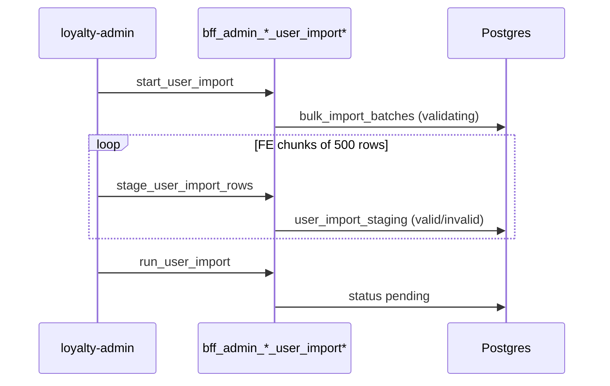
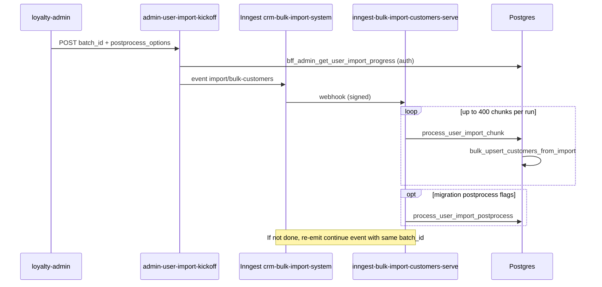

# Customer Import System

Bulk **CSV import and export** of members: field-selected two-row-header CSV, row staging in Postgres, chunked async processing via Inngest, and optional migration mode that suppresses CDC and trigger side-effects.

Owner surfaces: loyalty-admin (`/imports`), admin BFFs (`bff_admin_*_user_import*`), Edge `admin-user-import-kickoff` (JWT), Edge `inngest-bulk-import-customers-serve` (Inngest app `crm-bulk-import-system`), export via Edge `admin-user-export-csv` (Inngest app `crm-user-export`)

## Concept

Merchants load or extract member profiles in bulk without hand-editing Customer 360. An **import batch** is a tracked job (`bulk_import_batches`) with mode, match keys, field schema snapshot, and progress counters. Each CSV row becomes a **staging row** (`user_import_staging`) validated before commit. **Upsert** means match an existing member by configured keys and merge non-empty cells, or insert a new `user_accounts` row plus related address, wallet target balance, tier/persona fields, and optional form responses. **Export batch** uses the same batch table with `import_type = users_export` and produces a download in Storage (separate Inngest worker). **Field schema** covers machine column keys (`user_accounts_*`, `user_address_*`, `form_<code>_*`, …), saved presets (`user_io_schemas`), and per-form opt-in (`form_templates.allow_bulk_import`). **Ongoing** imports behave like normal signups for triggers and CDC; **migration** imports suppress per-row fan-out so large historical loads finish in bounded time, with optional postprocess backfills.

## Rules

### Import modes

| Mode | Use | CDC on writes | Trigger side-effects (tier progress, persona auto-assign, mission enqueue, etc.) |
| --- | --- | --- | --- |
| `ongoing` | Day-to-day CSV uploads | Published normally | Fire normally |
| `migration` | Large CRM migration (10k–1M+ rows) | Suppressed (`skip_cdc=true` on CDC tables) | Suppressed via session `app.skip_side_effects=true` during chunk upsert |

Migration postprocess (optional, default off at kickoff): `backfill_tier_progress`, `grant_persona_benefits`, `enqueue_mission_eval` — passed from admin UI to `admin-user-import-kickoff` and run by Inngest after the chunk loop completes.

### Match keys

- `bulk_import_batches.match_on` is a ordered whitelist: `tel`, `line_id`, `email`, `external_user_id`, `member_code`, `mongo_id`.
- Every key in `match_on` must appear in the batch `field_selection` at start; else `MATCH_KEY_NOT_IN_TEMPLATE` (no batch). Empty `match_on` → `NO_MATCH_KEY_CONFIGURED`.
- Each data row must populate at least one configured key; else staging marks `invalid` with `NO_MATCH_KEY`.
- Match resolution uses `fn_bulk_import_match_user_id` / member-code validation where applicable; first hit in priority order wins.

### Batch and row state

**Batch `status` (import):** `validating` (staging rows) → `pending` (ready for worker) → `processing` → terminal `completed` | `failed` | `cancelled` | `rolled_back`. Cancel is allowed while worker has not finished; rollback is migration-only and deletes **inserted** users only.

**Staging `row_status`:** `pending` → `valid` | `invalid` (format validation at stage) → `processing` → `imported` | `updated` | `skipped` | `failed`.

### Validation and commit

- **Stage-time:** `bff_admin_stage_user_import_rows` validates cell shapes (tel `+CC…`, UUIDs, `DD-MM-YYYY`, non-negative integer points, importable forms).
- **Chunk-time:** `bulk_upsert_customers_from_import` validates the whole chunk before any write; if any row in the chunk fails validation, **no row in that chunk commits** (in addition to per-row stage errors).
- Wallet balance uses **idempotent target** via `fn_import_wallet_balance` (earn or burn-adjust to target; re-import with same value is a no-op).
- Updates use COALESCE merge: empty CSV cells do not null out existing profile data.
- Form imports always **insert** a new `form_submissions` row per run (`source='bulk_import'`, `submission_number` includes batch and CSV row); history is preserved. `USER_PROFILE` is always importable; other forms require `allow_bulk_import=true` and published status.

### Permissions (admin)

| Action | Capability |
| --- | --- |
| Start, stage, run, cancel, postprocess, save schema | `user.create` |
| List, progress poll | `user.read` |
| Start export | `user.export` |
| Rollback migration batch, delete schema | `user.delete` |

### Out of scope (product)

Imported users do not get `auth.users` login until they sign up; `auth_user_id` placeholder convention applies. No PDPA consent capture, no diff preview before commit, no per-table selective CDC within one batch. Address geo cross-validation between province/district/subdistrict codes is best-effort only — see **Customer_Import.md** for code vs name storage.

## Journeys

### Admin journey

| Knob | Effect |
| --- | --- |
| Import mode (`ongoing` / `migration`) | CDC + trigger side-effects as in Rules |
| Field selection | Columns in CSV template and staging `row_data` |
| `match_on` | Dedup key priority; must intersect field selection |
| `validate_only` / staging | Invalid rows never enter worker queue |
| Migration postprocess checkboxes | Optional tier progress, persona benefits, mission eval after import completes |
| `form_templates.allow_bulk_import` | Gates non–USER_PROFILE survey columns |
| Export `p_source` (AMP) | Server-resolved audience/workflow/condition export — no pasted user id lists |

| Page | Owning repo | Entry |
| --- | --- | --- |
| Imports hub | loyalty-admin | `bff_admin_list_user_imports` (`p_type`: users / users_export / all) |
| New customer import (4-step wizard) | loyalty-admin | `bff_admin_get_importable_fields`, template CSV, `bff_admin_start_user_import`, `bff_admin_stage_user_import_rows`, `bff_admin_run_user_import`, then Edge `admin-user-import-kickoff` |
| Import detail | loyalty-admin | `bff_admin_get_user_import_progress` (poll ~2s while active), cancel / rollback / postprocess |
| Customer export wizard | loyalty-admin | `bff_admin_start_user_export` → Inngest `export/users-csv` via `admin-user-export-csv` |
| Survey import toggle | loyalty-admin | `bff_upsert_form` `allow_bulk_import` |

1. **Mode** — Choose ongoing vs migration; migration shows postprocess options for later kickoff.
2. **Fields** — Pick columns (and optional saved schema from `user_io_schemas`); download two-row-header template.
3. **Match keys** — Select `match_on` from keys that have columns in the selection (mode-specific defaults in UI).
4. **Upload** — Parse CSV in browser; `startUserImport` creates batch (`validating`, `chunk_size` default 250); stream rows to staging in FE chunks of 500.
5. **Run** — `bff_admin_run_user_import` sets `pending`; kickoff edge emits Inngest `import/bulk-customers` with `{ batch_id, postprocess_options }` (admin JWT forwarded for progress RPC).
6. **Monitor** — Detail page until terminal status; inspect per-row errors on staging; optional postprocess or rollback (migration).

### Member journey

None — back-office and export download only (signed URL, expiry per export metadata).

## System

### Data model

| Object | Role |
| --- | --- |
| `bulk_import_batches` | Job header: `import_type` `users` \| `users_export`, `import_mode`, `match_on`, `field_selection`, `chunk_size`, `last_processed_row_num`, `processed_count`, `imported_users`, `failed_count`, `skipped_count`, `status`, timestamps, `file_url`, `metadata` |
| `user_import_staging` | One JSONB row per CSV line; `row_status`, `row_errors`, `matched_user_id`, `csv_row_num` |
| `user_io_schemas` | Named field-selection presets (unique per merchant name) |
| `form_templates.allow_bulk_import` | Opt-in for `form_<code>_*` columns |
| `user_accounts`, `user_address`, `user_wallet`, `form_submissions`, `form_responses` | Upsert targets (wallet via `fn_import_wallet_balance`) |

Shared batch table also serves purchase/currency/redemption import types — this doc covers `import_type = users` and export `users_export` only.

### Functions

| Function | Role |
| --- | --- |
| `bff_admin_get_importable_fields` | Field picker catalog |
| `bff_admin_get_user_import_template_csv` | Two-row-header template for selected keys |
| `bff_admin_list_import_schemas` / `save_import_schema` / `delete_import_schema` | Schema presets |
| `bff_admin_start_user_import` | Create batch (`validating`) |
| `bff_admin_stage_user_import_rows` | Insert staging + format validation |
| `bff_admin_run_user_import` | `validating` → `pending` |
| `bff_admin_get_user_import_progress` | Poll envelope + row status counts |
| `bff_admin_list_user_imports` | History |
| `bff_admin_cancel_user_import` | Cancel at chunk boundary |
| `bff_admin_rollback_user_import` | Delete users inserted by batch (migration) |
| `bff_admin_run_user_import_postprocess` | Manual postprocess entry |
| `bff_admin_start_user_export` | Create `users_export` batch |
| `process_user_import_chunk` | Drain next `valid` rows (`FOR UPDATE SKIP LOCKED`), call upsert, update progress |
| `bulk_upsert_customers_from_import` | Chunk validate + transactional upsert; `p_options` carries `match_on`, `skip_side_effects`, `skip_cdc`, form defaults |
| `process_user_import_postprocess` | Tier progress / persona / mission backfills |
| `fn_bulk_import_match_user_id`, `fn_bulk_import_validate_member_code` | Match key resolution |
| `fn_resolve_user_address_for_import`, `fn_upsert_user_address_from_import` | Address path (see **Customer_Import.md**) |
| `fn_import_wallet_balance` | Target balance idempotency |

Event registration imports share kickoff + the same Inngest serve host with `import/bulk-event-registrations` → `process_event_registration_import_chunk` (out of scope here except shared edge).

### Flows

**Synchronous path (admin browser → Postgres)**

**Async path (Inngest chunk worker)**

Verified worker behaviour (live edge `inngest-bulk-import-customers-serve` v76): Inngest function `bulk-import-customers`, `idempotency: event.data.batch_id`, timeout 60m, retries 2; each step calls `process_user_import_chunk` with default batch `chunk_size`; partial runs self-continue via another `import/bulk-customers` event; optional 5s sleep when chunk returns zero rows but work remains (locked rows).

Kickoff edge (`admin-user-import-kickoff` v53): requires admin `Authorization`; accepts only `pending` or `processing`; publishes to `INNGEST_BASE_URL/e/{INNGEST_EVENT_KEY}` with payload `{ batch_id, postprocess_options }` only — **no CSV in the event** (retired pattern).

**Export path**

`bff_admin_start_user_export` creates `users_export` batch → separate Inngest app **`crm-user-export`** on Edge `admin-user-export-csv`, event `export/users-csv`, function `export-users-csv` (customer CSV to Storage + email via messaging service). Not handled by `crm-bulk-import-system`.

**Migration safety (triggers)**

When `app.skip_side_effects=true` during upsert, tier progress creation, persona auto-assign side paths, and mission enqueue triggers no-op for that transaction. Migration also sets `skip_cdc` on CDC-published tables so logical replication does not emit per-row events. `app.import_batch_id` is set for traceability.

### External services

| Service | Role |
| --- | --- |
| Inngest app `crm-bulk-import-system` | Customer + event-registration import chunk orchestration |
| Edge `inngest-bulk-import-customers-serve` | Inngest serve endpoint (`verify_jwt=false`); signing key `INNGEST_SIGNING_KEY` |
| Edge `admin-user-import-kickoff` | Emit `import/bulk-customers` or `import/bulk-event-registrations` (`verify_jwt=true`) |
| Inngest app `crm-user-export` | Customer CSV export worker (serve on `admin-user-export-csv`) |
| Supabase Storage | Export files; optional `file_url` on import batch |

**Retired / incorrect in older docs:** Render service `crm-bulk-import` with `POST /api/import/customers`, multipart upload, and full `csv_data` on the Inngest event — not the live customer import path (purchase import may still use a separate bulk-import stack; see **Purchase_Import_System.md**).

### Known gaps

- Domain index once implied the customer export worker shared `inngest-bulk-import-customers-serve`; live export is `crm-user-export` on `admin-user-export-csv`.
- `requirements/domains/customer-import.md` references Edge `admin-user-import-upload`; staging is via `bff_admin_stage_user_import_rows` from loyalty-admin (no upload edge in `REGISTRY_RENDER.md`).
- Persona/tier FKs in CSV are format-validated but not always existence-checked before insert — bad UUIDs may fail at commit with `PROCESSING_ERROR`.
- Survey reward triggers should treat `form_submissions.source = bulk_import` as non-rewarding; confirm downstream workers if adding new form automations.

## Related

- **Customer_Import.md** — Thai address code resolution and `acquisition_source` on event-registration imports.
- **Bulk_Import_Currency.md** — Points/ticket bulk (separate Inngest event and RPCs).
- **Purchase_Import_System.md** — Purchase CSV import (atomic batch model).
- **Forms.md** — `allow_bulk_import`, submission semantics.
- **Tag_and_Persona.md** — Persona columns on import.
- **Signup_Login.md** — Profile field templates and USER_PROFILE behaviour.
- **domains/customer-import.md** — Per-domain index (keyword map); keep in sync when changing this spine.
