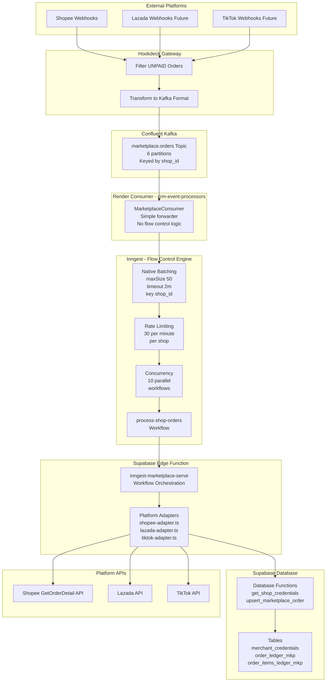
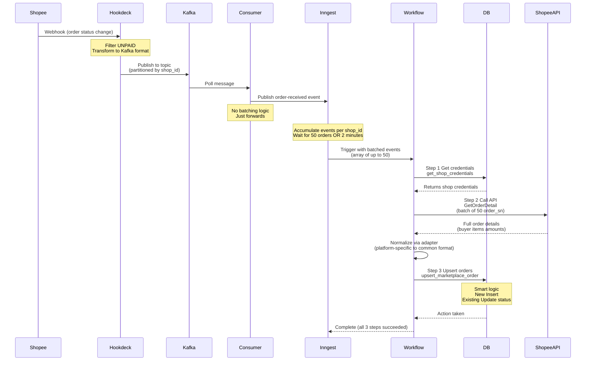

# E-commerce Marketplace Integration - Claim Points from Orders

**Version**: 2.0  
**Last Updated**: December 2025  
**Architecture**: Hookdeck → Kafka → Render Consumer → Inngest (Event-Driven with Native Batching)

## Overview

This system enables automatic loyalty point distribution for orders placed through e-commerce marketplaces (Shopee, Lazada, TikTok Shop). Orders are accumulated from webhook notifications, batched by merchant shop, and processed to award points to customers.

### Core Concept

Marketplace webhooks arrive in real-time as orders change status. Instead of processing each order individually (expensive API calls), the system accumulates orders and processes them in batches of 50 per shop with a 2-minute cooldown between batches. This reduces API costs by 50x while maintaining near-real-time point distribution.

**Key Architectural Change (v2.0):** Replaced polling-based Redis architecture with event-driven Kafka + Inngest pattern, matching Currency and Tier systems for unified infrastructure and zero manual state management.

---

## Business Requirements

### Batching Rules

**Batch Size:** 50 orders per shop
**Cooldown:** 2 minutes between batches per shop
**Trigger Conditions:** Process when shop reaches 50 orders AND cooldown elapsed

**Example:**
- Shop A accumulates 50 orders over 30 minutes → Processes immediately
- Shop A's 51st order arrives 10 seconds later → Waits 2 minutes before next batch
- Shop B accumulates independently with its own threshold and cooldown

### Multi-Tenant Isolation

**Shop-Level Processing:**
- Each merchant shop processes independently
- Shop A reaching threshold doesn't affect Shop B
- Each shop uses its own marketplace API credentials
- Batches are isolated per shop (no cross-shop batching)

### Supported Marketplaces

**Phase 1:** Shopee (Thailand, Singapore, other regions)
**Future:** Lazada, TikTok Shop, other marketplaces

---

## System Architecture

### Component Overview

```
Marketplace Webhooks
  ↓
Hookdeck (filtering, rate limiting, retries)
  ↓
Supabase Edge Function: webhook-receiver
  ↓
Upstash Redis (message queue + counters)
  ↓
Supabase Cron (every 2 minutes)
  ↓
Supabase Edge Function: batch-checker
  ↓
Supabase Edge Function: process-shop-orders
  ↓
Supabase Database (order storage)
```

### Technology Stack

**Message Queue:** Upstash Redis Streams
**Scheduler:** Supabase pg_cron
**Functions:** Supabase Edge Functions (Deno runtime)
**Database:** Supabase PostgreSQL
**Webhook Gateway:** Hookdeck

---

## Data Flow

### Phase 1: Order Ingestion (Real-Time)

**Trigger:** Marketplace sends webhook when order status changes

**Flow:**
1. Shopee sends webhook: `{ shop_id, order_sn, order_status, update_time }`
2. Hookdeck filters out UNPAID orders (not eligible for points)
3. Hookdeck forwards to webhook-receiver Edge Function
4. Webhook-receiver adds order to Redis Stream with shop_id
5. Webhook-receiver increments counter for this shop_id
6. Returns 200 OK to Hookdeck (completes within 20-30ms)

**Result:** Order safely stored in Redis, webhook acknowledged

### Phase 2: Accumulation (Passive)

**What Happens:**
- Orders continue arriving via Phase 1
- Redis Stream grows with all orders from all shops
- Each shop's counter increases independently
- No processing occurs during accumulation

**Example State:**
```
Redis Stream: 450 total orders
Shop 123456: 52 orders (ready for processing)
Shop 789012: 15 orders (accumulating)
Shop 345678: 88 orders (ready for processing)
```

### Phase 3: Batch Detection (Every 2 Minutes)

**Trigger:** Supabase pg_cron runs every 2 minutes

**Flow:**
1. Cron invokes batch-checker Edge Function
2. Checker queries Redis Sorted Set: "Which shops have ≥50 orders?"
3. Checker queries Redis Hash: "When was each shop last processed?"
4. Checker filters for shops where cooldown elapsed (≥2 minutes)
5. For each ready shop: Invoke process-shop-orders function
6. Returns summary of triggered processors

**Decision Logic:**
- Shop has ≥50 orders: YES
- Cooldown elapsed (≥2 min): YES
- → Trigger processing

### Phase 4: Batch Processing (Per Shop)

**Trigger:** Invoked by batch-checker with shop_id parameter

**Flow:**

**Step 1: Get Shop Credentials**
- Query Supabase: `SELECT merchant_id, access_token, partner_id FROM merchant_shopee_config WHERE shop_id = ?`
- Retrieves marketplace API credentials for this shop
- One database query per batch

**Step 2: Read Orders from Redis**
- Read 100-500 messages from Redis Stream using consumer group
- Filter messages to keep only those matching this shop_id
- Take first 50 orders (batch size)
- Extract order_sn list

**Step 3: Call Marketplace API**
- Use shop's access_token for authentication
- Call GetOrderDetail API with list of 50 order_sn values
- Marketplace returns full order details (buyer, items, amounts, addresses)

**Step 4: Transform and Store**
- Transform marketplace response to database schema
- Bulk insert 50 rows to `shopee_orders_raw` table
- Include merchant_id, order data, and metadata
- Handle duplicates via unique constraint on order_sn

**Step 5: Acknowledge and Cleanup**
- XACK messages in Redis (mark as processed)
- Decrement shop counter by 50
- Update last_processed timestamp for cooldown
- Trim messages older than 24 hours

**Result:** 50 orders processed, saved to database, ready for point calculation

---

## Redis Data Structures

### Stream: `shopee:orders:pending`

**Purpose:** Single stream containing all orders from all shops

**Message Structure:**
```json
{
  "shop_id": "123456",
  "order_sn": "240112ABCDEFGH",
  "order_status": "READY_TO_SHIP",
  "timestamp": 1735689600000
}
```

**Properties:**
- Auto-creates on first use
- Messages persist until acknowledged
- Consumer group prevents duplicate processing
- Trimmed after 24 hours (configurable)

### Sorted Set: `shopee:orders:counters`

**Purpose:** Track pending order count per shop

**Structure:**
```
shop-123456: 52
shop-789012: 15
shop-345678: 88
```

**Operations:**
- ZINCRBY: Increment when order arrives (+1)
- ZINCRBY: Decrement when batch processed (-50)
- ZRANGEBYSCORE: Query shops with ≥50 orders

### Hash: `shopee:orders:last_processed`

**Purpose:** Track last processing timestamp per shop for cooldown

**Structure:**
```
shop-123456: 1735689600000
shop-789012: 1735689540000
```

**Operations:**
- HGET: Check when shop was last processed
- HSET: Update timestamp after processing
- Used to enforce 2-minute cooldown

---

## Database Schema

### Table: `merchant_shopee_config`

**Purpose:** Store marketplace API credentials per shop

```sql
CREATE TABLE merchant_shopee_config (
  id UUID PRIMARY KEY DEFAULT gen_random_uuid(),
  merchant_id UUID NOT NULL REFERENCES merchants(id),
  
  -- Marketplace identifiers
  shop_id TEXT NOT NULL UNIQUE,
  partner_id TEXT NOT NULL,
  
  -- API credentials
  access_token TEXT NOT NULL,
  refresh_token TEXT,
  token_expires_at TIMESTAMPTZ,
  
  -- Processing configuration
  batch_size INTEGER DEFAULT 50,
  cooldown_seconds INTEGER DEFAULT 120,
  
  -- Metadata
  is_active BOOLEAN DEFAULT true,
  region TEXT DEFAULT 'TH',
  created_at TIMESTAMPTZ DEFAULT NOW(),
  updated_at TIMESTAMPTZ DEFAULT NOW()
);

CREATE INDEX idx_merchant_shopee_shop_id ON merchant_shopee_config(shop_id);
CREATE INDEX idx_merchant_shopee_active ON merchant_shopee_config(is_active) WHERE is_active = true;
```

### Table: `shopee_orders_raw`

**Purpose:** Store full order details from marketplace API

```sql
CREATE TABLE shopee_orders_raw (
  id BIGSERIAL PRIMARY KEY,
  
  -- Identifiers
  merchant_id UUID NOT NULL REFERENCES merchants(id),
  shop_id TEXT NOT NULL,
  order_sn TEXT NOT NULL UNIQUE,
  
  -- Order details
  order_status TEXT NOT NULL,
  order_data JSONB NOT NULL,
  
  -- Extracted fields for indexing
  buyer_username TEXT,
  total_amount NUMERIC(10,2),
  currency TEXT DEFAULT 'THB',
  
  -- Timestamps
  order_create_time TIMESTAMPTZ,
  order_update_time TIMESTAMPTZ,
  processed_at TIMESTAMPTZ DEFAULT NOW(),
  
  -- Metadata
  webhook_received_at TIMESTAMPTZ,
  created_at TIMESTAMPTZ DEFAULT NOW()
);

CREATE INDEX idx_shopee_orders_merchant ON shopee_orders_raw(merchant_id);
CREATE INDEX idx_shopee_orders_shop ON shopee_orders_raw(shop_id);
CREATE INDEX idx_shopee_orders_status ON shopee_orders_raw(order_status);
CREATE INDEX idx_shopee_orders_created ON shopee_orders_raw(created_at);
```

---

## Marketplace API Integration

### Shopee API

**Base URL:** `https://partner.shopeemobile.com`

**Authentication:** OAuth 2.0 with access tokens per shop

**Key Endpoints:**

**GetOrderDetail** (used for batch processing)
```
POST /api/v2/order/get_order_detail
Authorization: Bearer {access_token}
Body: {
  "order_sn_list": ["SH001", "SH002", ..., "SH050"],
  "response_optional_fields": ["buyer_user_id", "item_list", "recipient_address"]
}
```

**Rate Limits:**
- 50 order_sn per request (max)
- Recommended: 2-minute cooldown between batches
- Partner-level rate limits apply

**Order Statuses:**
- `UNPAID`: Not eligible (filtered by Hookdeck)
- `READY_TO_SHIP`: Eligible for processing
- `SHIPPED`: Eligible for processing
- `COMPLETED`: Eligible for processing
- `CANCELLED`: May need point reversal
- `RETURNED`: May need point reversal

### Webhook Configuration

**Hookdeck Setup:**
- Source: Shopee Webhooks
- Transformation: Filter `order_status != "UNPAID"`
- Destination: Webhook-receiver Edge Function URL
- Retry: Exponential backoff (3 attempts)

---

## Edge Functions

### Function: `shopee-webhook-receiver`

**Purpose:** Receive and store orders in Redis

**Trigger:** HTTP POST from Hookdeck

**Input:**
```json
{
  "shop_id": "123456",
  "order_sn": "240112ABCDEFGH",
  "order_status": "READY_TO_SHIP",
  "update_time": 1735689600
}
```

**Process:**
1. Validate webhook payload
2. XADD to Redis Stream with MAXLEN ~10000
3. ZINCRBY counter for shop_id (+1)
4. Return 200 OK

**Response Time:** 20-30ms target

**Environment Variables:**
- `UPSTASH_REDIS_REST_URL`
- `UPSTASH_REDIS_REST_TOKEN`

### Function: `shopee-batch-checker`

**Purpose:** Identify shops ready for batch processing

**Trigger:** Supabase pg_cron every 2 minutes

**Process:**
1. ZRANGEBYSCORE to get shops with ≥50 orders
2. HGET last_processed timestamp for each shop
3. Filter shops where `now - last_processed >= 120000ms`
4. For each ready shop: Invoke `shopee-process-orders` asynchronously
5. Return summary of triggered batches

**Configuration:**
- `BATCH_THRESHOLD`: 50 orders
- `COOLDOWN_MS`: 120000 (2 minutes)

### Function: `shopee-process-orders`

**Purpose:** Process batch of orders for one shop

**Trigger:** Invoked by batch-checker with `{ shop_id }`

**Process:**
1. Query Supabase for shop credentials
2. Ensure consumer group exists (idempotent)
3. XREADGROUP to read 500 messages from stream
4. Filter messages for target shop_id
5. Take first 50 orders
6. Call Shopee GetOrderDetail API
7. Transform response to database schema
8. Bulk INSERT to `shopee_orders_raw`
9. XACK processed messages
10. ZINCRBY counter (-50)
11. HSET last_processed timestamp
12. XTRIM old messages (>24h)

**Error Handling:**
- API failure: Don't XACK, messages stay for retry
- Database failure: Don't XACK, messages stay for retry
- Partial success: XACK only successful messages

**Environment Variables:**
- `UPSTASH_REDIS_REST_URL`
- `UPSTASH_REDIS_REST_TOKEN`
- `SUPABASE_URL`
- `SUPABASE_SERVICE_ROLE_KEY`

---

## Cron Configuration

### Batch Checker Schedule

```sql
SELECT cron.schedule(
  'shopee-batch-checker',
  '*/2 * * * *', -- Every 2 minutes
  $$
  SELECT net.http_post(
    url := 'https://[project-ref].supabase.co/functions/v1/shopee-batch-checker',
    headers := jsonb_build_object(
      'Authorization', 'Bearer [service-role-key]',
      'Content-Type', 'application/json'
    ),
    body := '{}'::jsonb
  );
  $$
);
```

**Monitoring:**
```sql
SELECT * FROM cron.job_run_details 
WHERE jobname = 'shopee-batch-checker' 
ORDER BY start_time DESC 
LIMIT 10;
```

---

## Error Handling and Reliability

### Webhook Ingestion Failures

**Scenario:** Webhook receiver unavailable

**Handling:**
- Hookdeck automatic retry (exponential backoff)
- 3 retry attempts over 5 minutes
- If all fail, DLQ (Dead Letter Queue) in Hookdeck
- Manual review and replay via Hookdeck dashboard

### Redis Unavailability

**Scenario:** Redis connection fails

**Handling:**
- Webhook receiver returns 500 error
- Hookdeck retries webhook
- No data loss (webhooks queued in Hookdeck)

### Processing Failures

**Scenario:** Processor function crashes mid-processing

**Handling:**
- Messages stay in PENDING state (not ACKed)
- Consumer group marks as unclaimed after timeout
- Next processor run will reclaim and retry
- Idempotent processing (duplicate insert ignored by unique constraint)

### API Rate Limit Exceeded

**Scenario:** Shopee API returns 429 Too Many Requests

**Handling:**
- Processor implements exponential backoff (3 attempts)
- If all fail, don't XACK messages
- Messages retry on next batch cycle
- Cooldown prevents rapid retry

### Duplicate Order Processing

**Prevention:**
- Consumer groups ensure no two processors claim same message
- Database unique constraint on order_sn prevents duplicate storage
- XACK only after successful database insert

---

## Monitoring and Observability

### Key Metrics

**Stream Health:**
- Stream length (XLEN): Should stay under 1000 for healthy system
- Pending messages (XPENDING): Should be close to 0
- Lag time: Time between webhook arrival and processing

**Processing Metrics:**
- Batches processed per hour
- Success rate (successful / attempted)
- Average batch processing time
- Failed batches count

**Shop Metrics:**
- Shops with pending orders ≥50
- Shops currently in cooldown
- Average time to process 50 orders per shop

### Alerts

**Critical:**
- Stream length >5000 (backlog building)
- No processing for >10 minutes (system stuck)
- Processing failure rate >20%

**Warning:**
- Stream length >1000 (accumulating faster than processing)
- Redis connection errors
- Shopee API errors

### Logging

**Log Events:**
- Webhook received (info)
- Batch triggered (info)
- Processing started (info)
- API call success/failure (info/error)
- Database insert success/failure (info/error)
- Unexpected errors (error)

**Log Format:** Structured JSON for easy querying

---

## Performance Considerations

### Scalability

**Current Design Supports:**
- 100+ merchant shops simultaneously
- 10,000 orders per hour system-wide
- 1000+ orders per shop per day

**Bottlenecks:**
- Redis memory (50MB per 10K orders, easily scales)
- Supabase Edge Function concurrency (default: 50 concurrent)
- Shopee API rate limits (shop-specific)

**Scaling Strategy:**
- Horizontal: Multiple processor instances (consumer groups handle distribution)
- Vertical: Increase Redis memory if needed
- Rate limiting: Cooldown prevents API limit issues

### Latency

**Target Latencies:**
- Webhook acknowledgment: <50ms
- Order stored in Redis: <100ms from webhook
- Batch processing trigger: <2 minutes after threshold
- Batch processing complete: <5 seconds per batch
- End-to-end: Order arrives → Saved in database within 2-5 minutes

### Cost Optimization

**Redis Costs:**
- Upstash Pro tier: ~$10/month
- Handles 10K+ orders/day easily
- Memory usage: ~50MB for typical workload

**Supabase Costs:**
- Edge Functions: Free tier covers 500K invocations/month
- Database: Included in existing plan
- Cron: Free (built-in feature)

**Marketplace API Costs:**
- Batching reduces API calls by 50x
- 1000 orders = 20 API calls (vs 1000 individual calls)
- Significant cost savings on rate-limited or paid APIs

---

## Future Enhancements

### Multi-Marketplace Support

**Lazada Integration:**
- Same architecture, different API endpoints
- Separate config table or extend existing
- Unified processing logic

**TikTok Shop Integration:**
- Similar webhook pattern
- Reuse Redis infrastructure
- Shop-level batching applies equally

### Advanced Features

**Dynamic Batch Sizing:**
- Adjust batch size based on order value
- VIP customers: smaller batches (faster processing)
- Bulk orders: larger batches (more efficient)

**Priority Processing:**
- High-value orders bypass accumulation
- Process immediately for premium experience

**Point Calculation Integration:**
- Trigger currency calculation after order insert
- Integrate with existing wallet system
- Award points based on order value and tier

**Order Status Tracking:**
- Update orders when status changes in marketplace
- Handle cancellations and returns
- Reverse points if needed

---

## Implementation Checklist

### Phase 1: Infrastructure Setup
- [ ] Create Upstash Redis database (region: ap-southeast-1)
- [ ] Configure consumer group in Redis
- [ ] Set up Hookdeck account and source
- [ ] Configure Supabase pg_cron

### Phase 2: Database Setup
- [ ] Create `merchant_shopee_config` table
- [ ] Create `shopee_orders_raw` table
- [ ] Add indexes for performance
- [ ] Seed test merchant data

### Phase 3: Edge Functions
- [ ] Implement `shopee-webhook-receiver`
- [ ] Implement `shopee-batch-checker`
- [ ] Implement `shopee-process-orders`
- [ ] Deploy to Supabase

### Phase 4: Integration
- [ ] Configure Hookdeck webhook forwarding
- [ ] Set up Shopee app and get test credentials
- [ ] Configure environment variables
- [ ] Test with sandbox orders

### Phase 5: Monitoring
- [ ] Set up logging
- [ ] Create monitoring dashboard
- [ ] Configure alerts
- [ ] Document runbooks

### Phase 6: Production
- [ ] Test with real merchant
- [ ] Monitor for 1 week
- [ ] Optimize based on metrics
- [ ] Onboard additional merchants

---

## Security Considerations

### API Credentials

**Storage:**
- Access tokens stored encrypted in Supabase
- Service role key for Edge Functions (server-side only)
- Redis tokens in environment variables (not exposed to client)

**Rotation:**
- Shopee tokens expire (refresh mechanism needed)
- Redis tokens can be rotated without downtime
- Service role key rotation via Supabase dashboard

### Webhook Verification

**Hookdeck:**
- Verifies Shopee webhook signatures
- Rate limiting prevents DDoS
- Only forwards validated webhooks

**Edge Function:**
- Additional validation of payload structure
- Reject malformed requests
- Log suspicious activity

### Data Privacy

**PII Handling:**
- Order data contains buyer information
- Store only necessary fields
- Follow PDPA (Thailand) / GDPR requirements
- Implement data retention policies

---

## Troubleshooting Guide

### Orders Not Processing

**Check:**
1. Stream length (XLEN) - Are orders accumulating?
2. Counter values (ZRANGE) - Which shops are ready?
3. Last processed times (HGETALL) - Cooldown blocking?
4. Cron job logs - Is checker running?
5. Edge Function logs - Any errors?

### Processing But Not Saving

**Check:**
1. Shopee API response - Successful?
2. Database logs - Insert errors?
3. Unique constraint violations - Duplicates?
4. XACK called - Messages acknowledged?

### Slow Processing

**Check:**
1. Shopee API latency - Slow responses?
2. Database performance - Index usage?
3. Redis latency - Network issues?
4. Edge Function cold starts - Frequent?

---

## Architecture v2.0 - Event-Driven with Inngest Batching

**Deployed:** December 28, 2025  
**Status:** Production (processing real orders)

### Key Changes from v1.0

| Aspect | v1.0 (Old) | v2.0 (New) |
|--------|------------|------------|
| **Queue** | Redis Streams | Kafka (partitioned by shop_id) |
| **Trigger** | Cron polling (every 2 min) | Event-driven (immediate) |
| **Batching** | Manual counters in Redis | Inngest native batchEvents |
| **Flow Control** | Manual (counters + cooldown) | Inngest declarative config |
| **State** | 3 Redis structures | Kafka + Inngest workflow state |
| **Edge Functions** | 3 functions | 1 function (with adapters) |
| **Observability** | Scattered logs | Unified Inngest dashboard |
| **Wasted Cycles** | ~95% (cron checks) | 0% (event-driven) |

---

### Architecture Diagram v2.0



---

### Component Details v2.0

#### 1. Hookdeck Gateway (Unchanged)

**Purpose:** Webhook ingestion, filtering, transformation

**Configuration:**
- **Filter:** Exclude UNPAID orders (`$not: { data: { status: "UNPAID" } }`)
- **Transformation:** Convert Shopee format to Kafka REST API format
  - Extract: `webhook.data.ordersn` → `order_sn`
  - Extract: `webhook.shop_id` → `shop_id`
  - Format: Kafka record with key and value structure

**Destination:** Confluent Kafka REST Proxy

---

#### 2. Kafka Topic (NEW - Replaces Redis Streams)

**Topic:** `marketplace.orders`  
**Partitions:** 6 (distributes shops across partitions)  
**Partition Key:** `shop_id` (ensures same shop goes to same partition)  
**Retention:** 7 days  

**Benefits over Redis Streams:**
- ✅ No filtering waste (partitioned by shop)
- ✅ Better consumer group management
- ✅ Automatic retention management
- ✅ Built-in replay capability

---

#### 3. Render Consumer (NEW - Replaces Cron)

**Service:** `crm-event-processors`  
**Consumer:** `MarketplaceConsumer`  
**Consumer Group:** `crm-event-processors-marketplace`

**Code:** Ultra-simple (30 lines)
```typescript
// Just forwards each order to Inngest
await publishOrderReceived({
  shop_id: order.shop_id,
  order_sn: order.order_sn,
  order_status: order.order_status,
  platform: order.platform
});
```

**No flow control logic:**
- ❌ No counters
- ❌ No cooldown tracking
- ❌ No threshold checking
- ✅ Just forwards events (Inngest handles batching)

**Benefits:**
- Event-driven (0% wasted cycles vs 95% with cron)
- Immediate detection when order arrives
- Simpler code (no manual state management)

---

#### 4. Inngest Workflow (NEW - Replaces Multiple Edge Functions)

**Workflow:** `process-shop-orders`  
**Edge Function:** `inngest-marketplace-serve`  
**App ID:** `marketplace-serve`

**Flow Control (All Declarative):**
```typescript
batchEvents: {
  maxSize: 50,        // Batch up to 50 orders
  timeout: '2m',      // Or wait 2 minutes (cooldown)
  key: 'event.data.shop_id'  // Per-shop batching
}

rateLimit: {
  limit: 30,          // Max 30 API calls per minute
  period: '1m',
  key: 'event.data.shop_id'  // Per shop
}

concurrency: {
  limit: 10,          // Max 10 shops processing in parallel
  key: 'event.data.shop_id'
}

retries: 3            // Automatic step-level retries
```

**Replaces:**
- Redis Sorted Set (counters) → `batchEvents.maxSize`
- Redis Hash (cooldown) → `batchEvents.timeout`  
- Manual threshold checking → Inngest automatic
- Cron polling → Event-driven batching

---

#### 5. Platform Adapters (NEW)

**Location:** `supabase/functions/inngest-marketplace-serve/adapters/`

**Files:**
- `types.ts` - Shared interfaces
- `shopee-adapter.ts` - Shopee API integration
- `lazada-adapter.ts` - Future
- `tiktok-adapter.ts` - Future

**Purpose:** Abstract platform-specific API differences

**Shopee Adapter Handles:**
```typescript
1. buildGetOrderDetailsRequest()
   - Shopee authentication (HMAC-SHA256 signature)
   - Request format (GET with query params)
   - Field naming (order_sn_list, response_optional_fields)

2. parseOrdersResponse()
   - Extract order_list from response
   - Error handling

3. normalizeOrder()
   - Map Shopee fields → Common format
   - Calculate totals from items
   - Convert timestamps
   - Normalize item details
```

**Benefits:**
- Add new platform = just add new adapter file
- Workflow code unchanged for all platforms
- Testable in isolation

---

#### 6. Database Functions (NEW)

**Functions:**

**get_shop_credentials(shop_id, platform):**
- Queries `merchant_credentials` table
- Filters by `external_id` (shop_id) and `service_name` (platform)
- Returns credentials JSONB as structured object
- Used in Step 1 of workflow

**upsert_marketplace_order(order_data):**
- **Smart logic:**
  - If order exists: UPDATE status only (no API re-fetch needed)
  - If new order: INSERT full details + items
- **Handles:**
  - Order header insert/update
  - Order items insert (for new orders)
  - Returns action taken (inserted/updated)
- Used in Step 3 of workflow

---

### Workflow Execution Flow v2.0



---

### Data Storage v2.0

**Credentials:**
```
Table: merchant_credentials
Lookup: external_id = shop_id, service_name = platform
Structure: {
  "shop_id": "1391650466",
  "partner_id": "2013698",
  "access_token": "...",
  "refresh_token": "...",
  "region": "TH",
  "batch_size": 50,
  "cooldown_seconds": 120
}
```

**Orders:**
```
Table: order_ledger_mkp
Primary Key: id (UUID)
Unique: order_sn
Indexes: merchant_id, shop_id, order_status
```

**Order Items:**
```
Table: order_items_ledger_mkp  
Foreign Key: order_id → order_ledger_mkp.id
```

---

### State Management Comparison

**v1.0 (Manual State):**
```
Redis Stream: Queue of order notifications
Redis Sorted Set: Counter per shop (track accumulation)
Redis Hash: Last processed time per shop (cooldown)
Manual coordination between 3 data structures
```

**v2.0 (Zero Manual State):**
```
Kafka: Durable queue (automatic partition management)
Inngest: Workflow state (batching, rate limiting, concurrency)
No counters, no cooldown tracking, no manual sync
```

---

### Performance Metrics v2.0

**Latency:**
- Webhook to Kafka: ~50ms
- Consumer forward to Inngest: ~20ms
- Batch trigger detection: Immediate (vs 0-2 min with cron)
- Total webhook to database: ~2-5 minutes (batching time)

**Efficiency:**
- Wasted polling cycles: 0 (vs 720/day with cron)
- Filtering waste: 0% (partitioning vs 90% with single stream)
- API calls: 1 per 50 orders (same as v1.0)

**Reliability:**
- Step-level retries: 3 attempts per step
- Automatic backoff: Exponential
- State durability: Inngest persists workflow state
- Replay capability: Kafka offset management

---

### Deployment Architecture v2.0

**Infrastructure:**
```
Hookdeck (webhook gateway)
  ↓
Confluent Kafka (lkc-6r72k2 cluster)
  ├─ Topic: marketplace.orders
  └─ 6 partitions
  ↓
Render Web Service (crm-event-processors)
  ├─ TierConsumer
  ├─ CurrencyConsumer
  ├─ RewardConsumer
  └─ MarketplaceConsumer ← NEW
  ↓
Inngest Cloud (marketplace-serve app)
  └─ process-shop-orders function
       ↓
Supabase Edge Function (inngest-marketplace-serve)
  ├─ Workflow orchestration
  ├─ Platform adapters
  └─ Database function calls
       ↓
Supabase Database
  ├─ merchant_credentials (shop credentials)
  ├─ order_ledger_mkp (orders)
  └─ order_items_ledger_mkp (items)
```

---

### Adding New Platforms (v2.0)

**To add Lazada or TikTok:**

**1. Create adapter file:**
```typescript
// supabase/functions/inngest-marketplace-serve/adapters/lazada-adapter.ts
export class LazadaAdapter implements MarketplaceAdapter {
  buildGetOrderDetailsRequest() { /* Lazada-specific */ }
  parseOrdersResponse() { /* Lazada-specific */ }
  normalizeOrder() { /* Lazada-specific */ }
}
```

**2. Register adapter:**
```typescript
// index.ts
const adapters = {
  shopee: new ShopeeAdapter(),
  lazada: new LazadaAdapter(),  // ← Add
  tiktok: new TikTokAdapter(),  // ← Add
};
```

**3. Configure Hookdeck:**
- Add new connection for Lazada webhooks
- Same Kafka destination
- Platform-specific transformation

**No changes needed:**
- ❌ Consumer code (platform-agnostic)
- ❌ Inngest batching (same config)
- ❌ Database functions (normalized format)

**Estimated time:** 3-4 hours per platform

---

### Monitoring v2.0

**Unified Observability:**

**Hookdeck Dashboard:**
- Webhook delivery status
- Transformation results
- Kafka publish success

**Confluent Console:**
- Topic message count
- Consumer lag
- Partition distribution

**Render Logs:**
- Consumer processing
- Event forwarding rate
- Errors

**Inngest Dashboard (Primary):**
- Batched events count
- Workflow executions
- Step-level traces
- Success/failure rates
- Timing per step

**Database:**
```sql
-- Orders processed per hour
SELECT 
  DATE_TRUNC('hour', transaction_date) as hour,
  COUNT(*) as orders,
  COUNT(DISTINCT shop_id) as shops
FROM order_ledger_mkp
WHERE transaction_date >= NOW() - INTERVAL '24 hours'
GROUP BY 1
ORDER BY 1 DESC;
```

---

### Production Status v2.0

**Go-Live Date:** December 28, 2025

**Verified Working:**
- ✅ Real Shopee webhooks processing
- ✅ Orders saved to database (5+ orders processed)
- ✅ Platform adapter pattern functional
- ✅ Database upsert logic working (new vs update)
- ✅ All 4 consumers running (Tier, Currency, Reward, Marketplace)

**Shops Connected:**
- Shop 1391650466 (production) - Active ✅
- Shop 226166444 (test) - Active ✅

**Sample Orders Processed:**
- 251228HP3B67G4 (READY_TO_SHIP) ✅
- 251228HJRPY1KC (READY_TO_SHIP) ✅

---

### Migration from v1.0

**Completed:**
- ✅ Kafka topic created
- ✅ Hookdeck reconfigured (Kafka destination)
- ✅ Render consumer deployed
- ✅ Inngest workflow deployed
- ✅ Database functions created
- ✅ Platform adapters implemented

**To Cleanup (After 1 Week Stable):**
```bash
# Remove old Edge Functions
supabase functions delete marketplace-batch-checker
supabase functions delete marketplace-process-orders

# Remove cron job
SELECT cron.unschedule('shopee-batch-checker');

# Archive old code
mv supabase/functions/marketplace-* archive/marketplace-v1/
```

**Rollback Plan (If Needed):**
- Old functions still deployed (disabled)
- Can revert Hookdeck destination
- Can disable new consumer
- Zero data loss (Kafka retains messages)

---

### Cost Impact v2.0

**Removed:**
- ❌ Edge Function invocations: -700/day (cron polling eliminated)

**Added:**
- ✅ Kafka storage: $0 (reusing existing cluster)
- ✅ Render compute: $0 (existing service)
- ✅ Inngest workflows: Free tier (within limits)

**Net Impact:** Cost neutral or slight reduction

---

### Future Enhancements

**Short Term (Next 3 Months):**
1. Add Lazada integration (3-4 hours)
2. Add TikTok Shop integration (3-4 hours)
3. Implement graceful "order not found" handling
4. Add order status update webhooks (SHIPPED, COMPLETED)

**Medium Term (6 Months):**
1. Currency calculation integration (award points for orders)
2. Customer matching (link marketplace buyer to CRM user)
3. Inventory sync (update stock levels from marketplace)

**Long Term (12 Months):**
1. Multi-currency support (SGD, MYR, etc.)
2. Cross-platform analytics dashboard
3. Automated token refresh workflow
4. Order reconciliation reports

---

*Document Version: 2.0*  
*Created: 2025-01-03*  
*Updated: 2025-12-28*  
*Architecture: Event-Driven with Kafka + Render Consumer + Inngest Native Batching*  
*System: Supabase CRM - E-commerce Marketplace Integration*


