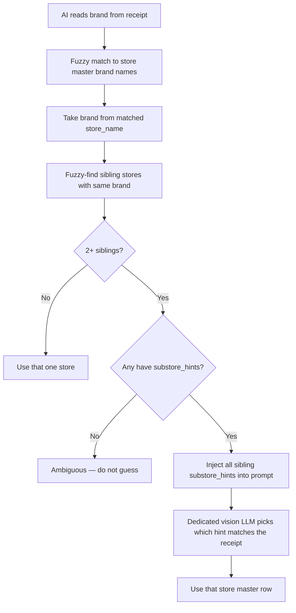

# FuturePark

Future Park receipt upload: member OCR submit, validation and duplicate checks, admin approval, nightly points settlement (native CRM ledger by default), OCR evaluation on Render, Oracle e-directory store sync, and parking or reward redemption APIs.

Owner surfaces: loyalty-user (standalone receipt upload), loyalty-admin (Future Park Approve Receipts, Front Line Upload Receipt), Render `futurepark-upload-receipt` (OCR eval `/api/ocr-eval/*`), Supabase CRM (edge functions, RPCs, prompts, ground truth).

Live project: `wkevmsedchftztoolkmi`. Platform-generic receipt earning rules: [`Receipt_Upload_Earning.md`](./Receipt_Upload_Earning.md).

## Concept

Future Park runs a **deferred receipt-earning** program: members photograph mall receipts; the system extracts store, datetime, amount, and eligibility; auto-approved rows queue for **nightly settlement** into purchase ledger and points. Rows that fail soft gates stay **pending** for staff review rather than hard-rejecting at upload.

**Receipt batch** — One member submit action with a `batch_id`; each image becomes one upload row.

**OCR extraction** — Vision and text models identify the store, receipt number, Bangkok-wall datetime (no midnight placeholder when time is missing), net amount, and whether the receipt belongs to Future Park and Zpell.

**Validation outcome** — Per receipt, preview splits into pass (eligible for auto-approve) or fail (manual review). Members see opaque confirm copy; they do not get a per-receipt pass/fail breakdown in the live UI.

**Upload row** — Persistent record of one receipt image with status, OCR JSON, duplicate hints, and settlement fields.

**Settlement track** — For Future Park only: approved rows use `crm_sync_status` queued → nightly job → confirmed with `purchase_ledger_id`, or failed with error. Pending/rejected rows do not settle.

**Points engine** — Merchant config chooses **native** (create purchase + wallet in CRM; default for Future Park) or **legacy Old CRM** (template upload + confirm on nightly sync).

**Duplicate match** — Two-tier key: same store + normalized receipt number first; datetime + exact amount only when receipt number is absent.

**OCR eval** — Offline accuracy runs on Render against ground-truth rows and prompt fragments stored in CRM; does not serve member upload.

**E-Directory sync** — Nightly Oracle shop directory → CRM `store_master` and attribute assignments (identity, mapping, lease rules documented under System).

**Parking / reward redemption** — Separate tables and public edge functions for Future Park parking privileges and reward codes (not the upload ledger path).

## Rules

- Member upload hours default to **Bangkok 10:00–23:00** unless a URL bypass flag is set; daily image cap defaults to **15 per Bangkok day** unless bypassed on preview/confirm.
- Same-day receipt: client sends `check_date` by default; server secret `FUTUREPARK_REQUIRE_SAME_DAY_RECEIPT` can still enforce same-day when true.
- Preview runs the shared four-stage OCR engine (store ID → resolution + hints → identity/amount/benchmark → canonical store name). **Roboflow is retired**; store classification is LLM-based (`store_code` as prediction class).
- Store weak or unresolved (confidence below **0.40** or no `store_master` match) → manual review, not auto-pass.
- Any gated field confidence below **0.70** (`receipt_number`, `receipt_datetime`, `belongs_to_futurepark`, `net_amount_after_discount`) → manual review (`low_llm_confidence`).
- Benchmark reference images: missing or failed verify → soft-fail manual review on member upload (not eval scoring).
- Duplicate: tier 1 same `store_id` + normalized receipt number; tier 2 only when incoming receipt number is null — same store + exact datetime string + exact net amount. Different receipt numbers never duplicate via tier 2.
- Old CRM duplicate proxy unreachable → `crm_duplicate_check_unavailable` → manual review (fail closed).
- Confirm persists rows: auto-pass → `status=approved`, `approved_method=auto`, `crm_sync_status=queued`; validation issues → `status=pending`, `crm_sync_status=not_applicable`. Confirm does **not** create purchases or points.
- Nightly sync (**23:00 Bangkok**, pg_cron `0 16 * * *` UTC): processes `queued` rows — **native** creates `purchase_ledger` + points; **old_crm** uses template pipeline.
- Admin approve and Front Line deferred Save also set **queued** without immediate ledger; edits allowed until `crm_sync_status=confirmed`.
- Member history: **Pending** tab while any receipt in batch is pending or approved-but-not-settled; **Reviewed** when batch fully decided; reviewed rows show approved/rejected count chips.
- `receipt_approval_rules` matches force manual review with admin-visible rule name; member history shows processing without rule text.
- Datetime policy: missing visible time → `missing_receipt_time` manual path; never send midnight as fabricated time to Old CRM payloads.
- E-Directory: one CRM store per Oracle `CustomerNumber`; duplicate `external_ref` rows skip write; lease end + 1 month Bangkok can mark store inactive.

## Journeys

### Admin journey

| Page | Owning repo | BFF / RPC / Edge |
| --- | --- | --- |
| Future Park Approve Receipts | loyalty-admin | `bff_list_receipt_uploads`, `get_receipt_batch_details`, `bff_approve_receipt_upload` → `admin-receipt-batch-confirm-v2` |
| Front Line → Upload Receipt | loyalty-admin | `receipt-preview-v2` (quick autofill), `api_create_receipt_upload`, `fn_preview_purchase_limits`, duplicate proxy `custom-receipt-upload-validate-duplicate` |
| Receipt approval rules (merchant) | loyalty-admin | `receipt_approval_rules` configuration (see System) |

| Setting / filter | Effect on behaviour |
| --- | --- |
| Upload group: Has pending / Fully decided | Batch list segmentation |
| CRM sync filters | Queued / confirmed / failed settlement states |
| Approve / reject / re-edit | Updates row status; Future Park approve queues settlement without immediate purchase |
| Duplicate confirmation modal | Required when combined duplicate check returns matches (HTTP 409 contract on proxy) |
| Deferred merchant + Front Line Save | Creates `purchase_receipt_upload` queued like member auto-pass |
| `points_engine` (merchant feature config) | Nightly job native vs Old CRM settlement |

1. Open **Future Park Approve Receipts**, filter batches (pending vs decided, CRM sync).
2. Open a batch — load details and **enrich** duplicate matches (`mode=combined` on duplicate proxy).
3. Review OCR fields, duplicates, and approval-rule flags; edit fields until settlement confirms.
4. **Approve** or **reject**; confirm duplicate gate when prompted — row moves to approved/rejected and Future Park approved rows become **queued** for nightly sync.
5. On **Front Line**, open member **Upload Receipt**: optional photo autofill (quick preview), edit entries, run purchase limits preview, **Save** — queues uploads for deferred merchants.

### Member journey

| Page / surface | Owning repo | BFF / RPC / Edge |
| --- | --- | --- |
| Receipt upload (standalone) | loyalty-user | `futurepark_ui_translation`, Storage `images`, `upload-receipts-auto-preview`, `upload-receipts-auto-confirm`, `get_receipt_upload_history` |
| Earn sheet receipt path (generic channel) | loyalty-user | Platform `api_create_receipt_upload` / earn channel (not Future Park OCR batch flow) |

| Gate | Default | URL override |
| --- | --- | --- |
| Upload hours | Bangkok 10:00–23:00 | `?uploadtimeskip=true` |
| Same-day receipt | On (`check_date`) | `?skipvalidatetoday=true` |
| Daily image cap (15) | On | `?skipdailyimagelimit=true` |

1. Land on receipt upload with loyalty session (`get_user_summary`); UI strings from `futurepark_ui_translation`.
2. If outside hours or over daily cap (and no bypass), upload is blocked with localized messaging.
3. Pick images (max **15 MB** each) → upload to Storage → **Submit** runs batch preview (slow, parallel OCR per image).
4. **Confirm** runs immediately after preview — member sees only confirm **title** and **description** from the edge function (no per-receipt outcome UI in live build).
5. Open **History** drawer: **Pending** while processing or awaiting settlement; **Reviewed** with outcome chips when batch complete; points display includes `+0` when applicable.
6. Errors: hard validation reasons map to Thai copy where defined; duplicates show duplicate message; other codes fall back to generic retry copy.

## System

### Data model

| Table | Role |
| --- | --- |
| `purchase_receipt_upload` | One receipt image row: status, `ocr_suggestions`, settlement (`crm_sync_status`, `purchase_ledger_id`), identity snapshots (`user_id`, `external_user_ref`, `user_full_name`, `user_tel`), store and receipt number |
| `purchase_receipt_upload_review_audit` | Admin review actions on upload rows |
| `receipt_approval_rules` | Merchant rules that force manual review |
| `custom_futurepark_receipt_crm_sync_runs` | Nightly settlement run audit |
| `custom_futurepark_receipt_crm_debug_logs` | Pipeline debug (eval payloads include `eval_run_id` / `groundtruth_id`) |
| `custom_futurepark_receipt_confirm_jobs` | Legacy async confirm jobs (member flow does not poll) |
| `custom_futureparkocrprompts` (+ `_versions`, `_backup`) | Composable OCR prompt fragments |
| `custom_futurepark_store_ocr_hints` | Per-store hint examples for OCR |
| `custom_futurepark_receipt_groundtruth` | Eval ground truth rows |
| `custom_futurepark_ocr_eval_runs` / `custom_futurepark_ocr_eval_results` | Eval run metadata and per-field scores |
| `futurepark_redemptions` / `futurepark_parking_privilege_redemptions` | Parking and reward redemption (separate from upload ledger) |
| `custom_futurepark_earn_rates` | Baht-per-point overrides (`fn_get_futurepark_baht_per_point`) |

Views used by admin list: `v_receipt_upload_list`, `v_receipt_upload_batch_summary`.

### Functions

| Symbol | Role |
| --- | --- |
| `api_create_receipt_upload` | Insert upload row from confirm / Front Line |
| `bff_list_receipt_uploads`, `bff_approve_receipt_upload` | Admin queue and approve |
| `bff_list_stores_for_receipt_upload` | Store picker (keyset) |
| `get_receipt_upload_history`, `get_receipt_batch_details` | Member history and admin batch detail |
| `fn_receipt_upload_duplicate_matches` | New CRM duplicate lookup (two-tier key) |
| `fn_check_receipt_upload_daily_image_limit`, `fn_receipt_upload_daily_image_count` | Daily image caps |
| `fn_ocr_evaluate_channel_receipt` | Channel receipt eval helper |
| `chokepoint_post_receipt_event` | Receipt lifecycle events |
| `fn_futurepark_get_redemption`, `fn_futurepark_mark_status` | Redemption lookup and status |

Edge functions (CRM, Future Park upload path — deploy with `verify_jwt: false` per project rules): `upload-receipts-auto-preview`, `upload-receipts-auto-confirm`, `receipt-preview-v2`, `admin-receipt-batch-confirm-v2`, `futurepark-receipt-crm-sync`, `custom-receipt-upload-validate-duplicate`, `futurepark_ui_translation`, `clear-receipt-preview`, `custom-futurepark-ocr-eval`, `custom-futurepark-edirectory-sync` (store directory). Render hub: `/api/ocr-eval/*` delegates to `receipt-preview-v2` in eval mode.

### Flows

| Flow | Path |
| --- | --- |
| Member upload | Storage → preview edge (OCR + validation + duplicates) → confirm edge → `api_create_receipt_upload` → optional nightly `futurepark-receipt-crm-sync` |
| Admin approve | `bff_approve_receipt_upload` → `admin-receipt-batch-confirm-v2` → queued settlement |
| Front Line deferred | `receipt-preview-v2` quick autofill → `api_create_receipt_upload` queued |
| Duplicate proxy | `custom-receipt-upload-validate-duplicate` → RPC + optional Old CRM → HTTP 409 with `require_confirmation` |
| OCR eval | Render POST `/api/ocr-eval/*` → CRM `receipt-preview-v2` / `custom-futurepark-ocr-eval` + ground-truth compare |

### External services

| Service | Role |
| --- | --- |
| Supabase Storage `images` | Receipt image objects (`receipts/{merchant_id}/{batchId}/…`) |
| Old CRM receipt API | Duplicate check on auto-approve; template settlement when `points_engine = old_crm` |
| Oracle e-directory | Source for midnight store sync edge |
| SendGrid | E-Directory HTML email report |
| Render `futurepark-upload-receipt` | Long-running OCR eval HTTP service (not member upload backend) |

### Known gaps

- Deployed edge **version numbers** in prose below drift quickly — verify with Supabase MCP `list_edge_functions` / `get_edge_function` before acting on a specific version cited in nested notes.
- **Pipeline summary** duplicate row below may lag the receipt-number-primary RPC (tier 1) — duplicate architecture subsection is authoritative.
- Member upload UI components for per-receipt review (`ConfirmPopup`, etc.) exist in repo but are **not mounted** on the live journey.
- Integrations Supabase project (`brdzjnbnqoflodlekdmf`) may host a stale `receipt-preview-v2` — do not use for Future Park.

### Systems map

```text
┌──────────────────────────────────────────────────────────────────────────────┐
│ MEMBER APP (loyalty-app — /receipt-upload-ocr, Vercel)                        │
│   Bangkok 10:00–23:00 (?uploadtimeskip=true); same-day (?skipvalidatetoday);  │
│   daily image cap (?skipdailyimagelimit=true)                                  │
│   Auth: loyalty session → get_user_summary (user_accounts.id + optional mongo)│
│   (legacy auth-user-crm-v1 / ?token= parked unused for rollback)              │
│   upload images → Supabase Storage bucket `images`                            │
│   upload-receipts-auto-preview  (shared ocr-engine; parallel OCR + dups)      │
│   upload-receipts-auto-confirm  (persists user_id + optional external_user_ref)│
│   History tabs: Pending / Reviewed (outcome chips on Reviewed)                │
└──────────────────────────────────────────────────────────────────────────────┘
                                   │
                                   ▼
┌──────────────────────────────────────────────────────────────────────────────┐
│ CRM SUPABASE (wkevmsedchftztoolkmi)                                           │
│   _shared/ocr-engine.ts  ← single OCR pipeline (bundled into both EFs)        │
│   purchase_receipt_upload (status, crm_sync_status, user_full_name, ocr_…)    │
│   fn_receipt_upload_duplicate_matches      ← New CRM duplicate RPC            │
│   custom-receipt-upload-validate-duplicate ← combined/new_crm_only proxy      │
│   upload-receipts-auto-preview / upload-receipts-auto-confirm                 │
│   receipt-preview-v2 (quick/full/eval — eval + front-line autofill)           │
│   admin-receipt-batch-confirm-v2 (deferred; editable until confirmed)         │
│   futurepark-receipt-crm-sync (nightly; points_engine native|old_crm)         │
│   get_receipt_batch_details / get_receipt_upload_history                      │
└──────────────────────────────────────────────────────────────────────────────┘
          │ validate-duplicate (auto-approve gate)            ▲
          ▼                                                   │ pg_cron 0 16 * * * UTC
┌──────────────────────┐                          ┌───────────────────────────┐
│ OLD CRM API          │                          │ Nightly settlement        │
│ validate-duplicate   │                          │ native: purchase+points   │
│ (optional)           │                          │ old_crm: templates+confirm│
└──────────────────────┘                          └───────────────────────────┘

┌──────────────────────────────────────────────────────────────────────────────┐
│ ADMIN APP (loyalty-admin — /futurepark-approve-receipts)                      │
│   filters: upload-group Has pending / Fully decided + CRM sync filters        │
│   loadReceiptDetails + enrichReceiptsWithDuplicateMatches (mode=combined)     │
│   Approve/re-edit until crm_sync_status=confirmed                            │
│   Approve → admin-receipt-batch-confirm-v2 (confirm_duplicates two-step)      │
│   Doc: ProjectDocs/FE_docs/FutureparkApproveReceipts.md                       │
└──────────────────────────────────────────────────────────────────────────────┘

┌──────────────────────────────────────────────────────────────────────────────┐
│ ADMIN APP (loyalty-admin — /front-line/[userId] Upload Receipt tab)           │
│   OCR autofill (deferred merchants only): photos → receipt-preview-v2 quick   │
│     mode (1 photo/invoke) → pre-filled editable pending entries               │
│   Admin reviews/edits → Save: fn_preview_purchase_limits →                    │
│     api_create_receipt_upload (queued; OCR item kept in ocr_suggestions)      │
│   Doc: loyalty-admin ProjectDocs/FE_docs/FrontLine.md § OCR autofill          │
└──────────────────────────────────────────────────────────────────────────────┘
```

Repos / surfaces:

| Surface | Canonical location | Deploy |
|---|---|---|
| Member upload UI | `~/Documents/rocket/loyalty-user` (`Rocket-CRM/loyalty-user`) | push `main` |
| Admin approve UI | `~/Documents/rocket/loyalty-admin` (`Rocket-CRM/loyalty-admin`) | push `main` |
| CRM backend (Edge Functions, RPCs) | Supabase MCP only — deployed CRM is source of truth | `deploy_edge_function` / `apply_migration` |
| OCR eval service | This hub `src/` | push `main` (Render auto-deploy) |

---

### Member upload flow (detail)

End-to-end member journey (loyalty-app `src/app/(standalone)/receipt-upload-ocr/`):

1. **Auth** — page uses the loyalty login session (`loyalty_access_token` → `get_user_summary` / `useUser`). Primary id is new CRM `user_accounts.id` (UUID); optional `mongo_id` is kept as `external_user_ref` for history continuity. Legacy `?token=` → `auth-user-crm-v1` is **not** called (helper `authenticateUserViaOldCrmToken` remains unused for rollback). FE gates: Bangkok **10:00–23:00** (`?uploadtimeskip=true` bypass); same-day receipt on by default (`?skipvalidatetoday=true` → `check_date: false`); 15 images/day on by default (`?skipdailyimagelimit=true` → `skip_daily_image_limit: true` on preview/confirm). No on-page today toggle.
2. **Image pick** — files upload directly to Storage bucket `images` (`receipts/{merchant_id}/{batchId}/…`); the full public URL is what flows through preview/confirm into `purchase_receipt_upload.image`. Client max size **15 MB** per file (JPG/PNG).
3. **Submit** — `fullBatchPreview` calls `upload-receipts-auto-preview` (synchronous, slow). Per receipt: **shared `_shared/ocr-engine.ts`** (no Roboflow; same module as `receipt-preview-v2`) — store identification + clarity → identity fields → net amount → benchmark verify → store master lookup. Receipts in the batch OCR **in parallel**; then validation (see **Preview validation** below) → duplicate checks (see **Duplicate architecture** › stages).
4. **Confirm** — the app immediately chains `confirmBatch` → `upload-receipts-auto-confirm`. **There is no member-facing pass/fail review step in the live journey** — `ConfirmPopup`, `ResultPopup`, `ReceiptCard` exist in the repo but are not mounted. The member sees only the opaque confirm `title` + `description` rendered verbatim in `processing-modal.tsx`.
5. **Persistence** — confirm (v71+) calls `api_create_receipt_upload` per receipt with `p_user_id`, `p_user_full_name`, `p_user_tel`, optional `p_external_user_ref` (mongo), `p_store_id`, `p_receipt_number` (normalized), `p_ocr_suggestions` (includes `duplicate_matches[]` when present):
   - pass group → `status=approved`, `approved_method=auto`, `crm_sync_status=queued`
   - fail group (all validation issues) → `status=pending`, `crm_sync_status=not_applicable` — nothing auto-rejects at confirm
6. **History** — drawer calls RPC `get_receipt_upload_history` with `p_user_id` and optional `p_external_user_ref` (OR match). UI tabs: **Pending / Reviewed** (`src/lib/receipt-upload-display-status.ts`). Reviewed rows show approved/rejected count chips. `pending` and `approved` without `purchase_ledger_id` both show as processing (batch stays Pending). Approved zero-point receipts show `+0 pts`; Activity History (`bff_get_upload_receipt_history`) emits a `+0` badge for approved zero awards.

Member identity on FuturePark rows (live path): `user_id` = `user_accounts.id`; `external_user_ref` = mongo when available; plus `user_full_name` / `user_tel` snapshots. Historical rows may still have `user_id` NULL and Mongo-only `external_user_ref` (see **Known bugs** B1 for the old duplicate-display bug).

**Verified payload (loyalty-app `src/lib/api/receipt-upload.ts`):** confirm sends `user_id`, optional `external_user_ref`, `user_full_name`, `user_tel`, `merchant_code: futurepark`, `preview_results`, `language`. Deployed confirm v71+ persists `p_user_id`.

---

### Preview validation

`upload-receipts-auto-preview` (deployed v186, internal version 115). After OCR, every receipt is validated; hard validation failures and soft-fail gates route to `fail_group` with `approval_required: true` (manual admin review — member is never hard-blocked):

| Reason code | Trigger |
|---|---|
| `missing_receipt_time` | OCR date without visible time (no midnight placeholder — see datetime policy rule) |
| `unclear_image` | Store-identification call marked image not clear |
| `multiple_receipts` | More than one receipt in the photo |
| `receipt_copy_or_reprint` | Call 1 `is_reprint_or_copy` — stamp class RE-PRINT / พิมพ์ซ้ำ / สำเนา / boxed Copy (not the original) |
| `duplicate_receipt` | Same-batch match (receipt number primary; datetime+amount fallback only when RN null), New CRM historical match, or Old CRM match (see **Duplicate architecture** › stages) |
| `crm_duplicate_check_unavailable` | Old CRM validate-duplicate unreachable / store missing mongo_id (fail closed → manual review) |
| `not_futurepark_receipt` / `uncertain_futurepark` | LLM membership field |
| `receipt_not_same_day` | Receipt date ≠ today Bangkok, controlled by Edge secret `FUTUREPARK_REQUIRE_SAME_DAY_RECEIPT` |
| `low_confidence` | LLM store identification confidence below **0.40** or store unresolved |
| `low_llm_confidence` | Any LLM field confidence < 0.70 |
| `approval_required` | Matched a `receipt_approval_rules` row |
| `extraction_failed` | Pipeline error |
| `store_not_found` | Store could not be resolved in `store_master` (soft-fail → manual review) |
| `receipt_number_missing` | Receipt number not extracted (soft-fail → manual review) |
| `benchmark_missing` | Store has no reference receipt image on file (soft-fail → manual review) |
| `benchmark_verification_failed` | Reference comparison did not confirm authenticity (soft-fail → manual review) |

**Member-facing Thai copy** (built in `upload-receipts-auto-preview` as `error_reason_translated`). Used for **hard-fail** reject messaging to members. Manual-routing / approval-rule reasons (including `approval_required` / `{rule_name}`) are **admin-only** on Future Park Approve — member History shows Processing without the rule text.

| `error_reason` | Thai |
|---|---|
| `unclear_image` | ภาพใบเสร็จไม่ชัดเจน / ไม่สมบูรณ์ |
| `multiple_receipts` | พบใบเสร็จมากกว่า 1 ใบในภาพเดียว |
| `receipt_copy_or_reprint` | ใบเสร็จเป็นสำเนาหรือพิมพ์ซ้ำ |
| `duplicate_receipt` | ใบเสร็จนี้ถูกใช้สะสมคะแนนแล้ว |
| `not_futurepark_receipt` | ไม่ใช่ใบเสร็จที่อยู่ใน Future park & Zpell |
| `receipt_not_same_day` | วันที่ในใบเสร็จไม่ตรงตามเงื่อนไข |
| `receipt_number_missing` | ไม่พบเลขที่ใบเสร็จ |
| `approval_required` | ใบเสร็จอยู่ระหว่างตรวจสอบ: {rule_name} *(stored for admin; hidden on member UI)* |

All other codes (and unknown codes) use: **ระบบอ่านข้อมูลไม่สำเร็จ โปรดตรวจสอบใบเสร็จอีกครั้ง**.

**OCR pipeline (per receipt, image-first — Roboflow removed 2026-07-06):**

1. **Store identification** — Claude reads the receipt image; returns clarity, store name candidates, branch, `multiple_receipts`, `is_reprint_or_copy`.
2. **Store resolution** — match name to `store_master`; load per-store OCR hints and benchmark reference URLs.
3. **Identity + amount** (parallel with benchmark verify) — Claude identity call (store context + hints) and amount call; benchmark verify compares upload to up to 2 store reference images when available.
4. **Store master name** — canonical name from resolved store when LLM resolution succeeded.

Store classification source: `classification_source = 'llm_store_identification'`. `prediction_class` carries the resolved store's **`store_code`**. `store_external_ref` may be copied as optional metadata. `store_master_id` / `store_mongo_id` populated when resolution succeeds.

---

### Duplicate architecture

#### DUPLICATE-MATCH-KEY

All live duplicate paths use a **two-tier** business key (2026-08-03 — receipt-ID-primary; datetime fallback only when RN null):

| Tier | Match when |
|---|---|
| **1 (primary)** | Same `store_id` + same **normalized receipt number** |
| **2 (fallback)** | Incoming receipt number is **null**, and same `store_id` + exact `receipt_datetime` + exact `net_amount_after_discount` |

If the incoming receipt has a receipt number that does **not** match an existing row, it is **not** a duplicate — even when store + datetime + amount match. Tier 1 matches sort first (`match_type = 'receipt_number'`).

| Field | Rule |
|---|---|
| `receipt_number` | Normalized (strip punctuation, uppercase, O→0). **Primary duplicate key** when present. When present and different from historical, skip tier 2. |
| `receipt_datetime` | Full ISO `YYYY-MM-DDTHH:mm:ss` Bangkok-wall string. Used in tier 2 only (incoming RN null). No midnight placeholder. |
| `net_amount_after_discount` | **Exact numeric** equality in tier 2; must be > 0. |
| `store_id` | Postgres `store_master.id`. Mandatory — RPC returns nothing when store is NULL. No cross-store matches. |

#### DUPLICATE-RPC

`fn_receipt_upload_duplicate_matches(p_merchant_id, p_receipt_datetime, p_net_amount, p_store_id, p_exclude_ids, p_statuses default ['approved','pending'], p_limit default 5, p_receipt_number default NULL)` — the only New CRM duplicate lookup. Verified live definition (2026-08-03):

- **Tier 1:** when `p_receipt_number` is non-empty, matches same store + normalized receipt number.
- **Tier 2:** only when `fn_normalize_receipt_number(p_receipt_number) IS NULL`, matches same store + exact datetime string + exact amount.
- Store from `COALESCE(pru.store_id, sm_ocr.id)` where `sm_ocr` re-resolves LLM `prediction_class` / `store_code` from `ocr_suggestions`.
- Returns JSONB array including `match_type` (`receipt_number` | `datetime_amount`); other fields: `receipt_upload_id`, `batch_id`, `external_user_ref`, `user_tel`, `image_url`, `status`, `receipt_datetime`, `net_amount_after_discount`, `store_id`, `store_name`, `user_display`, `receipt_number`; sorted approved → pending → other.
- **B1 (fixed 2026-06-12):** the original definition read `user_display`/`user_tel` only from the `user_accounts` join, which is empty for FuturePark (`user_id` NULL) — 297 approved/pending rows displayed no name. Migration `duplicate_matches_user_display_row_snapshot` now prefers the upload-row snapshot: `user_display = COALESCE(NULLIF(btrim(pru.user_full_name),''), ua.fullname, ua.firstname, NULLIF(btrim(pru.user_tel),''), ua.tel, ua.email, pru.external_user_ref, pru.user_id::text)` and `user_tel = COALESCE(NULLIF(btrim(pru.user_tel),''), ua.tel)`. Verified against production.
- Local mirror: `scripts/receipt-duplicate-matches.sql`.

#### DUPLICATE-PROXY

Edge Function `custom-receipt-upload-validate-duplicate` (v29 deployed) — the single duplicate proxy for callers outside the preview pipeline. New CRM RPC calls pass `p_receipt_number` from `reference_receipt_id` when provided.

| `mode` | New CRM RPC statuses | Old CRM API | Post-filter |
|---|---|---|---|
| `combined` (admin enrichment) | `approved`,`pending` | Yes | None |
| `new_crm_only` (default when omitted) | `approved`,`pending` | No | Keeps rows where `status='pending'` **or** `crm_sync_status != 'confirmed'` (i.e. drops already-synced approved rows) |

Contract: requires `user_id` (Mongo), `store_id` (Mongo), `total_amount`, date+time (`receipt_datetime` or `receipt_date`+`receipt_time`), optional `store_pg_id`, `exclude_upload_ids`, merchant context via headers or `merchant_pg_id`. Responds **HTTP 409** `{ require_confirmation: true, duplicate_receipts: [...] }` when matches exist, HTTP 200 `{ require_confirmation: false }` otherwise. Callers must treat 409 as data, not an error.

#### DUPLICATE-MERGE

Shared backend module `_shared/crm-validate-duplicate.ts` (`runCombinedDuplicateCheck`):

1. Parse datetime + amount (missing time → `missing_receipt_time`, no dup check).
2. **New CRM:** `findReceiptDuplicateMatches` (RPC wrapper) → `enrichNewCrmDuplicateRows` — re-selects the matched upload rows for `crm_template_id`, receipt number, image, store mongo id. **B1 second leg:** it maps `user_display: match.user_display ?? null` straight from the RPC and never falls back to the row's `user_full_name` (the select list doesn't even include it).
3. **Old CRM:** `callOldCrmValidateDuplicate` (POST `…/receipt-upload-templates/validate-duplicate`) → `enrichOldCrmDuplicateRows` — resolves user display via `user_accounts` (`external_user_id`/`mongo_id`), receipt numbers via `crm_template_id` back-reference, and falls back to fetching the Old CRM template. Old CRM failure → `crm_unavailable: true` (preview turns this into `crm_duplicate_check_unavailable` manual review).
4. `mergeDuplicateReceiptRows` dedupes by `user|datetime|amount|store`, prefers self-upload (`new_crm`) fields, unions `match_sources` (`new_crm`, `old_crm`, or `both`), caps at 10 rows. Mongo ObjectIds are never shown as receipt numbers.

Unified row shape consumed by the admin UI (`ReceiptDuplicateMatch` in loyalty-admin `src/lib/receipt/duplicate-matches.ts`): `receipt_upload_id`, `batch_id`, `external_user_ref`, `receipt_datetime`, `net_amount_after_discount`, `store_id` (Mongo) / `store_pg_id`, `store_name`, `user_display`, `receipt_number`, `image_url`, `status`, `match_scope` (`same_batch` | `historical`), `match_source` / `match_sources`.

Old CRM API base for these calls: env `CRM_INTERNAL_API_RECEIPT_URL_UAT`, code fallback `https://crm-api-dev.rocket-tech.app/receipt/api/v1` (the legacy admin confirm path falls back to the prod host instead — config relies on the env secret being set; see **Known bugs** B8).

#### DUPLICATE-STAGES

Where duplicate checks actually run, in order:

| # | Stage | Caller | Sources | Effect |
|---|---|---|---|---|
| 1 | **Member preview — same batch** | `upload-receipts-auto-preview` `evalAndValidate` | in-memory batch items; receipt number (primary), or datetime+amount+store **only when incoming RN is null** | `duplicate_receipt` → manual review |
| 2 | **Member preview — New CRM history** | same function, `getHistoricalDuplicateMatchesByKey` | RPC with `p_receipt_number`, statuses `approved`+`pending`, no exclude ids | `duplicate_receipt` → manual review |
| 3 | **Member preview — Old CRM gate** | `applyOldCrmDuplicateGate`, **only on items that passed everything else** | `runCombinedDuplicateCheck` with `includeNewCrm: false, includeOldCrm: true` | match → `duplicate_receipt`; CRM unreachable / store unlinked → `crm_duplicate_check_unavailable`; both manual review |
| 4 | **Member confirm** | `upload-receipts-auto-confirm` | none (no re-check) | persists `duplicate_matches[]` into `ocr_suggestions` |
| 5 | **Admin batch open** | loyalty-admin `enrichReceiptsWithDuplicateMatches` | proxy `mode=combined` per receipt (sequential), excludes all upload ids in the open batch | fresh matches replace stored `ocr_data.duplicate_matches`; `DuplicateMatchesPanel` renders them |
| 6 | **Admin approve gate** | `admin-receipt-batch-confirm-v2` deferred path (v47) | RPC with `p_receipt_number` from admin `transaction_number`, New CRM, `approved`+`pending`, excludes payload receipt ids | if matches and `confirm_duplicates != true` → returns `success:false, duplicate_confirmation_required:true, duplicate_groups[]` and **does not approve**; resend with `confirm_duplicates: true` approves |
| 7 | **Admin single-receipt approve** | RPC `bff_approve_receipt_upload` (preview + approve actions) | RPC (New CRM) | warn-only: stores `duplicate_matches` + warning text, never blocks |
| 8 | **Nightly sync** | `futurepark-receipt-crm-sync` | **none** | no duplicate validation of any kind; `api_create_purchase` runs with `p_skip_duplicate_transaction_number = true` |
| 9 | **Front Line key-in / write** | loyalty-admin `checkReceiptDuplicate` + `api_create_receipt_upload` (`approved_method=frontline`) | ledger `check_duplicate_transaction_number` **and** `fn_receipt_upload_duplicate_matches` (`approved`+`pending`, including queued Processing) | **hard block** (`duplicate_receipt`); no confirm-anyway |

Key consequences:

- Approve stage 6 is a **soft** block (admin can confirm through). Front Line stage 9 is a **hard** block.
- A receipt that is "approved but not yet synced" (`status=approved, crm_sync_status=queued`) is visible to stages 2, 5, 6, 7, 9 because they search status `approved` regardless of sync state. After nightly sync (`confirmed`) it remains visible to `combined` mode but is dropped by `new_crm_only` mode (it now exists in Old CRM, which reports it instead — avoids double counting).
- Front Line void (`bff_admin_cancel_queued_frontline_uploads`) sets `status=rejected` + `notes` + `crm_sync_status=not_applicable` + `ocr_suggestions.frontline_void` and keeps the row in Front Line **Upload Receipt** history as Cancel (0 points / 0 amount). It does **not** appear in Adjust Points Point History (`bff_admin_get_member_wallet_history` is wallet_ledger only). Settled reverse still uses `wallet_ledger`. Approve-receipts shows those rows as Reject with the Front Line reason. Duplicate matcher still skips the tombstone.
- Stage 3 runs Old CRM checks only for auto-approve candidates; receipts already routed to manual review skip the Old CRM call.

#### ADMIN-APPROVE-FLOW

Live loyalty-admin flow (`src/app/(admin)/futurepark-approve-receipts/`, doc `ProjectDocs/FE_docs/FutureparkApproveReceipts.md`):

1. **List filters** — upload-group **Has pending / Fully decided** (not per-receipt status); CRM sync filters (pending review / awaiting sync / synced / failed). Front Line Processing voids appear as **rejected** on the list and in `get_receipt_batch_details`, with the staff reason in `notes`.
2. **Open batch** → `loadReceiptDetails` → RPC `get_receipt_batch_details` → `enrichReceiptsWithDuplicateMatches` re-validates every receipt through the proxy in `mode=combined` and writes fresh `duplicate_matches` into each receipt's `ocr_data`.
3. **Review / edit** — group editor for store, date, time, amount, receipt number. Rows stay editable until `crm_sync_status = confirmed` (including already-approved/`queued` rows). Untrusted OCR soft-fail reasons are not shown.
4. **Approve** (`receipt-approval-modal.tsx` → `runConfirmApproval(false)`) → server action `confirmReceiptBatch` → Edge `admin-receipt-batch-confirm-v2` with `confirm_duplicates: false`.
5. Backend deferred gate (stage 6) finds matches → returns `duplicate_confirmation_required: true` + `duplicate_groups` → frontend `setDuplicateGateMatches(...)` opens `DuplicateApproveConfirmModal` ("Approve anyway and queue" / "Go back and review").
6. **Approve anyway** → `runConfirmApproval(true)` → `confirm_duplicates: true` → backend approves: `status=approved`, `approved_method=admin`, `crm_sync_status=queued`, stamps `approved_*` fields into `ocr_suggestions`. Reject groups → `status=rejected`, `crm_sync_status=not_applicable`.

**The old plan to port a frontend `checkApproveDuplicates` pre-check is obsolete.** Live code uses the backend gate. Hub `scripts/loyalty-admin-duplicate-warn-only/` is historical reference only.

**B2 (gate modal behind FullScreenModal) — fixed** in loyalty-admin (`useElevatedPolarisOverlay` when the duplicate gate opens). See **Known bugs**.

#### ADMIN-REVIEW-AUDIT

Admin review changes are preserved separately from the mutable operational row. Migration `purchase_receipt_upload_review_audit` added:

- `purchase_receipt_upload_review_audit` — one append-only event per affected upload row, with `admin_id`, `event_type`, `changed_fields`, and bounded `before_snapshot` / `after_snapshot` JSON.
- `trg_purchase_receipt_upload_admin_review` — deferred-merchants only; records first admin approval, correction, or rejection before the approval writer overwrites `ocr_suggestions`.
- Snapshot fields — store, receipt number, receipt date/time, amount, status/method, notes, image reference, prediction class/confidence, field confidence, FuturePark identity, and routing failures.

Repeated no-op saves and nightly settlement transitions are excluded. This keeps the table focused on human review labels rather than CRM pipeline status noise. Ordinary API roles have no table access; analysis runs through service-role/backend tooling.

The audit begins on 2026-08-06. Earlier overwritten values were not backfilled because the original store, amount, datetime, or receipt number cannot be reconstructed reliably.

Example comparison:

```sql
SELECT
  receipt_upload_id,
  created_at,
  event_type,
  changed_fields,
  before_snapshot->>'store_name' AS original_store,
  after_snapshot->>'store_name' AS reviewed_store,
  before_snapshot->>'receipt_number' AS original_receipt_number,
  after_snapshot->>'receipt_number' AS reviewed_receipt_number,
  before_snapshot->>'receipt_datetime' AS original_receipt_datetime,
  after_snapshot->>'receipt_datetime' AS reviewed_receipt_datetime,
  before_snapshot->>'net_amount_after_discount' AS original_amount,
  after_snapshot->>'net_amount_after_discount' AS reviewed_amount
FROM purchase_receipt_upload_review_audit
WHERE event_type = 'admin_corrected'
ORDER BY created_at DESC;
```

#### Nightly settlement

`futurepark-receipt-crm-sync`, pg_cron `futurepark-receipt-crm-sync` at `0 16 * * *` UTC (**23:00 Bangkok**), driven by `upload_receipt.sync_local_time` + `sync_timezone`.

Router reads `fn_get_upload_receipt_config` → `points_engine`:

| Engine | Behavior |
|---|---|
| **`native` (FuturePark default)** | `_shared/futurepark-native-points.ts` — select queued rows → resolve member (`mongo_id`) → earn rates + purchase limits → `api_create_purchase` + wallet credit → `crm_sync_status = confirmed`. **No Old CRM calls.** |
| **`old_crm` (legacy)** | Group by user → POST Old CRM `receipt-upload-templates` (date + optional time; never midnight) → per-user `upload-confirm` → local `api_create_purchase` → `confirmed`. |

Failures → `failed` + `crm_sync_error`. Audit: `custom_futurepark_receipt_crm_sync_runs`, debug: `custom_futurepark_receipt_crm_debug_logs`.

Does **not**: call any validate-duplicate endpoint, re-run the duplicate RPC, or re-check anything. Whatever the admin approved goes through.

#### E-Directory store sync

FuturePark’s mall shop list lives in **Oracle E-Directory**. Every night at **00:00 Bangkok** CRM copies that list onto FuturePark `store_master` so Front Line, receipt upload, and earn rules see the same shops the mall operates.

A mall staffer does not click sync. pg_cron job `custom-futurepark-edirectory-sync` (`0 17 * * *` UTC) POSTs Edge Function `custom-futurepark-edirectory-sync` (`verify_jwt: false`, `FUNCTION_VERSION` 8). The function logs into Oracle (`POST /api/Auth/login`), pulls **Full Sync** (`GET /api/EDirectory/sync` — Delta is not used), groups every unit that shares a `CustomerNumber` into one tenant, then upserts that merchant only (`futurepark`). Credentials sit on `merchant_credentials.service_name = 'edirectory'` (base URL, username, password — never print the password).

Success is: shops that uniquely match an **active** CRM row get directory fields and Location / Merchandise assignments; brand-new Customer Numbers get an `ed{CustomerNumber}` store; leftover collisions among several **active** rows are skipped; a Thai HTML email goes to mall + Rocket ops. OCR, earn rates, and CRM-only utility stores are untouched.

Dry-run body: `{ "merchant_code": "futurepark", "dry_run": true }`. Preview email without writing: `{ "dry_run": true, "send_email": true }`. Audit: `custom_futurepark_edirectory_sync_runs`. Snapshots of writes: `custom_futurepark_edirectory_store_snapshots` (14-day).

#### E-Directory identity

**One CRM store per Oracle `CustomerNumber`.** All `LocationCode`s under that number are areas of the same shop, not extra stores. CRM business key stays `(merchant_id, store_code)`; the sync key is `store_master.external_ref` = Oracle `CustomerNumber`. Existing `store_code` and `mongo_id` are never overwritten. New rows use `ed{CustomerNumber}` (or `ed{CustomerNumber}x` if that code is taken).

Same brand, different Customer Numbers = different stores (three Starbucks numbers → three CRM stores). Same Customer Number, many units (Uniqlo / Central / one KFC tenant) = one CRM store with every location code attached.

Leftover CRM rows that share one `external_ref` are **not** merged. When deciding whether to write, inactive CRM rows are ignored. **Two or more active** rows with the same number → write nothing for that Customer Number (`skipped_duplicate`). One active + closed leftovers → update the active row. A number that exists only on closed CRM rows is not inserted and not written (the job never auto-reactivates).

Utility / OCR helper stores (`FP-RW*`, booth, pop-up, lounge, QA, stock) are skipped even when the Customer Number is unique.

#### E-Directory mapping

For a unique active match the job refreshes directory metadata (`edirectory_location_codes`, `edirectory_lease_end_date`, `edirectory_building`, `edirectory_customer_id`, `edirectory_last_update_date`, `edirectory_synced_at`). `edirectory_synced_at` is **not** a user-facing change in the email.

**ชื่อร้าน:** if the CRM brand part matches Oracle `TenaNameEN` / `Customer2Dsc` / `TenaNameTH`, the location suffix after ` / ` is rewritten. The brand words themselves are not replaced. A brand mismatch still allows other field updates.

**รหัสพื้นที่:** all Oracle `LocationCode`s for that Customer Number, sorted.

**สถานะเปิดร้าน:** `active_status = false` only when the latest unit `LeaseEndDate` plus **one Bangkok calendar month** has passed. Never set back to true.

**Location / Merchandise:** Oracle `Building` + `Floor` → Location attribute / sub-attribute; `Merc` + `SubMerc` → Merchandise attribute / sub-attribute. Missing master rows are **created**. Categories are never created. Assignments are inserted when missing and **updated** when Oracle moves. Assignment load pages by `id` and must match `count(*)`; a unique-key insert falls back to update so the email does not invent phantom Location/Merchandise changes.

**Earn rates:** a new `ed*` store does not join an Advanced Earn row. It earns 0 until someone adds a store rate (it then appears on Earn rules → Uncovered stores).

#### E-Directory email report

After every live midnight run (and when `send_email: true`), SendGrid sends `text/html` — real `<table>` tags, not markdown — from `no-reply@rocket.in.th` to `kankamon.k@futurepark.co.th`, `prakan@rocket.in.th`, `rangwan@rocket.in.th`. Sync still succeeds if email fails.

Order: (1) สรุปตัวเลข, (2) ข้าม — Customer Number ซ้ำ among **active** CRM rows, **only when Oracle differs**, (3) ร้านที่เปลี่ยน, (4) นับรายฟิลด์, (5) ร้านที่สร้างใหม่. Reportable fields: ชื่อร้าน, รหัสพื้นที่, สถานะเปิดร้าน, วันสิ้นสุดสัญญา, Location, Merchandise. `updated` in the run JSON means “row touched” (includes `edirectory_synced_at`); `changed` means those user-facing fields actually differed.

#### E-Directory out of scope

The job does **not** write `purchase_receipt_upload`, OCR prompts / hints / eval / ground truth, `hint_receipt_storename`, `benchmark_receipts`, `substore_hints`, `mongo_id`, existing `store_code`, `manual_approve`, `is_reward_stock`, earn-rate tables, or `metadata.group_prop_rate`. It does not call receipt-upload or nightly settlement. It does not use Oracle Delta sync.

#### SYNC-STATUS

`purchase_receipt_upload.crm_sync_status` (FuturePark only; other merchants stay `not_applicable`):

| Value | Meaning |
|---|---|
| `not_applicable` | pending/rejected rows; all non-FuturePark merchants |
| `queued` | approved (auto, admin, or front-line deferred); waiting for nightly settlement |
| `confirmed` | nightly settlement succeeded; `purchase_ledger_id` set; **admin UI locks** |
| `failed` | native purchase or Old CRM step failed; see `crm_sync_error` |

#### Purchase limits

Native settlement and front-line Save preview share one engine:

- **Enforce:** `fn_check_purchase_limits` inside `api_create_purchase`
- **Preview:** `fn_preview_purchase_limits` (batch dry-run; front-line Save + deferred pending-list display)
- **Order:** highest uncapped estimated points first (`floor(amount / fn_get_futurepark_baht_per_point)`; null rates last), then **higher receipt amount**, then stable original/created order — first-fit against every active `transaction_limits` row for `entity_type=purchase`. Nightly `futurepark-receipt-crm-sync` (`_shared/futurepark-native-points.ts`) uses the same points DESC → amount DESC → `created_at` order.

Config lives in `transaction_limits` (`scope` + `metric` + `count` + `time_unit=day`). Metrics:

| Metric | Meaning | FuturePark seed |
|---|---|---|
| `quantity` | Receipt count | **seeded:** 10 / user / day; 3 / user / store |
| `amount` | Sum of `COALESCE(earnable_amount, final_amount)` **only for stores with a non-null earn rate** when `points_engine = native` | **seeded:** 100,000 / user / day |
| `distinct_store` | Count of distinct `store_id` that day; 2nd receipt at same store does not grow the count | seeded at 3 / user / day (**inactive**) |

**Amount partial (2026-08-03, cross-merchant):** if remaining quota &gt; 0 but receipt &gt; remaining, create the purchase with full `final_amount` and set `earnable_amount` to the remaining quota. Points (`calc_currency_for_transaction`) use `COALESCE(earnable_amount, final_amount)`. Quantity / distinct-store stay all-or-nothing.

**Amount exhausted Allow Upload (2026-08-05, merchant-scoped):** `feature_config.upload_receipt.amount_limit_exceeded_action` — `reject` (default) or `allow_zero_points`. FuturePark is `allow_zero_points`: when amount remaining ≤ 0, preview/check return allowed partial with `eligible_amount=0` / `partial_limit=true` (purchase still created; 0 additional points). Other merchants keep hard reject. Quantity / distinct-store remain hard failures.

**Highest points first + native amount filter (2026-08-19):** first-fit keeps the highest `floor(amount / baht_per_point)` receipts. A missing earn rate (`fn_get_futurepark_baht_per_point` is null) still uses a quantity / store slot, but its THB does **not** consume the ฿100,000 amount cap — not in preview sim, not in queued reservation, not in `purchase_ledger` base, not in `fn_check_purchase_limits`. Gate is `points_engine = native` so old_crm merchants still sum all THB. Definition is **missing rate**, not `predicted_points = 0`. Front Line table order stays entry order; only which row shows ≈ 0 moves.

**Queued reservations in preview only (2026-08-05):** `fn_preview_purchase_limits` counts same-day approved+queued `purchase_receipt_upload` rows (ledger id null) toward base usage so a second Front Line Save cannot re-queue leftovers after winners were reserved. **Do not** add queued rows to `fn_check_purchase_limits` — nightly settlement would double-count.

Fail reason for the distinct-store cap: `over_user_distinct_stores` (separate from `over_user_store` = too many receipts at one store). Missing `store_id` skips distinct-store / store-scoped rules.

**Duplicate transaction numbers (2026-08-05):** `check_duplicate_transaction_number` ignores `purchase_ledger.status IN ('cancelled','refunded')` so reversed receipt IDs can be re-used; active completed rows still block.

---

### User identity on rows

| Field on `purchase_receipt_upload` | FuturePark value (live) | Source |
|---|---|---|
| `user_id` | `user_accounts.id` (UUID) | loyalty session → `get_user_summary` → confirm `p_user_id` |
| `external_user_ref` | `user_accounts.mongo_id` when present; else null | same path (compatibility / history OR-match) |
| `user_full_name` | member full name | session summary |
| `user_tel` | member phone | session summary |

**Legacy (pre session-auth):** rows often had `user_id` NULL and `external_user_ref` = Old CRM Mongo `_id` from `auth-user-crm-v1` (`?token=`). That Edge Function and FE helper remain deployed/unused for rollback; parking and other flows may still call them.

Production audit (2026-06-12, merchant `10de947e-ff05-4e2b-88ff-c853e5a69cb3`): 297 approved/pending rows have a name on the row but an empty `user_accounts` join — the duplicate RPC's blind spot under the old NULL-`user_id` model. One historical row (`56c769ce…`, 2026-06-05, auto-approved) lacks `user_full_name`; one-off, optional backfill.

Re-run audit SQL:

```sql
-- Name coverage
SELECT COUNT(*) AS total,
       COUNT(*) FILTER (WHERE user_full_name IS NOT NULL AND btrim(user_full_name) <> '') AS has_name,
       COUNT(*) FILTER (WHERE user_id IS NULL) AS null_user_id
FROM purchase_receipt_upload
WHERE merchant_id = '10de947e-ff05-4e2b-88ff-c853e5a69cb3'
  AND created_at >= NOW() - INTERVAL '90 days';

-- Duplicate RPC blind spot
SELECT COUNT(*) AS broken_display_rows
FROM purchase_receipt_upload pru
LEFT JOIN user_accounts ua ON ua.id = pru.user_id AND ua.merchant_id = pru.merchant_id
WHERE pru.merchant_id = '10de947e-ff05-4e2b-88ff-c853e5a69cb3'
  AND pru.status IN ('approved', 'pending')
  AND pru.user_full_name IS NOT NULL AND btrim(pru.user_full_name) <> ''
  AND ua.fullname IS NULL AND ua.firstname IS NULL;
```

No new column is needed; member app and confirm already send and store the name.

---

### Known bugs

Verified June 2026. P0/P1 = ship now; P2 = next pass; P3 = hygiene.

**Status update 2026-06-12: B1–B6 are FIXED and deployed** — B1 via CRM migration `duplicate_matches_user_display_row_snapshot` (RPC verified returning the member name in production); B2–B6 via loyalty-admin commit `0bfbd3a` pushed to `Rocket-CRM/loyalty-admin` `main`.

| # | P | Symptom | Root cause (verified) | Fix surface |
|---|---|---|---|---|
| **B1** | P0 ✅ fixed | Duplicate panel shows **User Name: —** for Self-upload matches | RPC `fn_receipt_upload_duplicate_matches` builds `user_display`/`user_tel` from the `user_accounts` join only; FuturePark rows have `user_id` NULL but `user_full_name`/`user_tel` populated. Edge `enrichNewCrmDuplicateRows` has no fallback either (doesn't select `user_full_name`). | CRM Postgres migration (applied 2026-06-12; row snapshot now wins) |
| **B2** | P0 ✅ fixed | Admin clicks Approve with a queued-duplicate present → **nothing visible happens, cannot proceed** | Backend gate works and blocks correctly; the `DuplicateApproveConfirmModal` (nested Polaris Modal, z ≈ 518) opened **behind** `FullScreenModal` (z 520/521) because `receipt-approval-modal.tsx` never called `useElevatedPolarisOverlay`. | loyalty-admin `0bfbd3a` — `useElevatedPolarisOverlay(open && duplicateGateMatches !== null)` |
| **B3** | P2 ✅ fixed | Stale duplicate warnings shown to admin | When the per-receipt proxy call failed during batch enrichment, the receipt kept old `ocr_data.duplicate_matches` from upload time with no indication. | loyalty-admin `0bfbd3a` — stored matches now flagged `duplicate_matches_stale`; panel title says "from upload time — live re-check failed" |
| **B4** | P2 ✅ fixed | Gate modal could render with an empty body | If `duplicate_groups[].matches` arrive empty, neither branch rendered; admin saw a modal with no explanation cards. | loyalty-admin `0bfbd3a` — fallback explanatory text always renders |
| **B5** | P2 ✅ fixed | Approve gate signal lost on network failure | `callReceiptFunction` catch block returns no `data`, so `duplicate_confirmation_required` could never be detected after a fetch-level failure; admin got a raw error toast. | loyalty-admin `0bfbd3a` — explicit "service unreachable, batch unchanged, retry" toast |
| **B6** | P2 ✅ fixed | Batch open slow on big batches | Duplicate enrichment was fully sequential: per receipt 2 store queries + 1 proxy call (which itself calls Old CRM). 10 receipts ≈ 30+ serial round-trips. | loyalty-admin `0bfbd3a` — bounded parallel enrichment (concurrency 4) |
| **B7** | P2 | Single-receipt admin approve cannot work for FuturePark rows | `bff_approve_receipt_upload` resolves the target user via `pru.user_id` and returns "User not found" when NULL — which is every FuturePark row. Harmless while the FuturePark page only uses batch confirm v2, but it is a trap for any UI that routes FuturePark receipts through the generic single-receipt approve. | CRM Postgres (only if/when needed) |
| **B8** | P3 | Old CRM base URL fallback inconsistency | Shared validate-duplicate falls back to `crm-api-dev…` while the legacy confirm path falls back to `crm-api…` (prod). Both rely on secret `CRM_INTERNAL_API_RECEIPT_URL_UAT`; if that secret is ever unset, the duplicate check silently points at dev. | CRM Edge (alignment only) |
| **B9** | P3 | Member app: `clear-receipt-preview` is never called | API helper exists, no code path invokes it; cancel/back resets client state only. Currently harmless (templates are deferred), keep or remove deliberately. | loyalty-app |
| **B10** | P3 | Member app: double translation fetch on mount; hardcoded Thai "เสร็จสิ้น" done-button fallback; dead components (`ConfirmPopup`, `ResultPopup`, `ReceiptCard`, `recalculateDuplicates`, `hasBlockingError`); hardcoded banner image URLs | Hygiene findings from full review. | loyalty-app |
| **B11** | P3 | History RPC called with anon key only | `get_receipt_upload_history` is scoped solely by `p_external_user_ref`; anyone with the anon key and a member's Mongo id can read that member's history. Assess and decide (token-based check or accept risk). | CRM Postgres + loyalty-app |

**Explicitly not bugs:** missing DB column for the name (exists); member app not sending the name (it does); nightly sync "should re-check duplicates" (by design it does not); admin two-step approve missing from backend (it is implemented and live in confirm v2 deferred v46).

**Corrections to the previous canonical (`DUPLICATE_RECEIPT_ARCHITECTURE.md`):**

1. It claimed the deferred admin confirm has *no* server-side duplicate gate and never returns `duplicate_confirmation_required` — **wrong**; the deployed deferred path (v46) has the warn-gate and the live admin UI consumes it.
2. It prescribed porting `checkApproveDuplicates` from the reference scripts as the B2 fix — **obsolete**; the live design is backend-gated, and the actual B2 root cause is the modal z-index/stacking issue.
3. It said the member preview's Old CRM combined call needed verification — verified: `includeNewCrm: false, includeOldCrm: true` on auto-approve candidates only.

---

### Fix methodology

> **2026-06-12:** B1 and B2 (plus B3–B6) were implemented and shipped per the steps below. Kept for audit/rollback reference.

Get explicit user approval before any production deploy/migration.

### Fix B1 — duplicate username (P0)

1. Hub: update `scripts/receipt-duplicate-matches.sql` — `user_display := COALESCE(NULLIF(btrim(pru.user_full_name),''), ua.fullname, ua.firstname, NULLIF(btrim(pru.user_tel),''), ua.tel, ua.email, pru.external_user_ref)` and `user_tel := COALESCE(NULLIF(btrim(pru.user_tel),''), ua.tel)`.
2. CRM: `apply_migration` replacing `fn_receipt_upload_duplicate_matches` (function body only; signature unchanged).
3. Verify: re-run the audit SQL (**User identity on rows**); spot-check the RPC against a known approved FuturePark upload.
4. Optional belt: redeploy `custom-receipt-upload-validate-duplicate` with `enrichNewCrmDuplicateRows` selecting `user_full_name` and falling back when the RPC field is empty (full bundle, `verify_jwt: false`). Not required once the RPC is fixed — every consumer (admin enrichment, approve gate, preview historical matches) reads the RPC output.
5. No admin/member app change needed.

### Fix B2 — invisible duplicate confirmation modal (P0)

1. loyalty-admin `receipt-approval-modal.tsx`: import `useElevatedPolarisOverlay` from `@/components/patterns/full-screen-modal` and call `useElevatedPolarisOverlay(open && duplicateGateMatches !== null)`.
2. While there: address B4 by rendering a fallback line inside the gate modal when `matches.length === 0` (e.g. the backend warning description), and consider showing the raw `duplicate_groups` count.
3. Test: approve a batch whose key collides with an `approved+queued` row → modal must now be visible on top → "Approve anyway and queue" completes and queues; "Go back and review" returns to the batch.
4. Push `Rocket-CRM/loyalty-admin` `main` when approved.

### Acceptance checklist (after B1+B2)

- [ ] RPC returns non-empty `user_display` for a FuturePark upload with `user_full_name` set and `user_id` NULL.
- [ ] Admin batch duplicate panel shows the member name instead of "—" (both panel on batch open and the gate modal).
- [ ] Approve with a queued duplicate shows the confirmation modal on top of the approval screen; confirming approves and queues.
- [ ] Member confirm still persists `user_full_name` (inspect one fresh row).
- [ ] Nightly sync untouched; `verify_jwt` still `false` on all FuturePark functions (`list_edge_functions`).

---

### Repo routing

| Change | Where | Deploy |
|---|---|---|
| Duplicate RPC / any Postgres RPC | Supabase MCP `apply_migration` | CRM Postgres |
| `custom-receipt-upload-validate-duplicate`, preview, confirm, admin confirm, nightly sync | MCP `get_edge_function` → edit → `deploy_edge_function` (full bundle, `verify_jwt: false`) | CRM Edge |
| Admin approve UI, duplicate panel, gate modal | `~/Documents/rocket/loyalty-admin` | push `Rocket-CRM/loyalty-admin` `main` |
| Member upload UI | `~/Documents/rocket/loyalty-user` | push `Rocket-CRM/loyalty-user` `main` |
| Eval service `/api/ocr-eval/*` | this hub `src/` | push `main` (Render) |
| SQL mirrors / hub ops docs | hub `scripts/`, hub `docs/` (pointers + CURRENT_STATE) | git only |
| **This product doc** | `requirements/FuturePark.md` (this file) | edit CRM requirements |

Rules: `.cursor/rules/06-edge-function-mcp-workflow.mdc` (Edge deploys), `04-edge-function-jwt.mdc` (JWT false), `03-receipt-datetime-policy.mdc` (no midnight), `01-prompt-editing.mdc` (prompts), `05-cross-repo.mdc` (routing).

---

### Sibling store matching

**Status:** Implemented in production Edge Functions (2026-07-13)  
**Surfaces:** `upload-receipts-auto-preview`, `receipt-preview-v2` (eval uses the latter — no Render code change required)  
**Prompt:** `custom_futureparkocrprompts.prompt_key = store_substore_disambiguation`  
**Data:** `store_master.substore_hints` (text), brand family from `store_master.store_name`

---

## Problem

One brand (e.g. Starbucks, Cafe Amazon, KFC) often has **several** Future Park `store_master` rows (different floors / units). Brand fuzzy match alone cannot pick the correct row — scores tie or pick arbitrarily.

---

## Methodology (target workflow)



### Stage 1 — Brand family

1. Call 1 (`store_identification`) reads brand / header lines from the image.
2. Fuzzy score against `hint_receipt_storename` + directory brand (text before ` / ` or ` - ` in `store_name`).
3. From the best brand hit, take the brand part of `store_name`.
4. **Sibling set** = all Future Park rows whose directory brand fuzzy-matches that brand (threshold 0.92, with substring/anagram guards).

### Stage 2 — Exact location (only if needed)

Trigger: sibling set size ≥ 2 **and** at least one sibling has non-empty `substore_hints`.

1. Build a candidate block for every sibling:

   - `external_ref`
   - `store_name`
   - `substore_hints` (or “(no substore_hints on this row)”)

2. Inject into `store_substore_disambiguation` as `{{candidates}}` and call vision LLM again with the receipt image.
3. Model returns `{ chosen_store_code, reason }`.
4. Map `chosen_store_code` to that sibling. If null / unknown → leave store unresolved (no random fallback).
5. `classification_source`:
   - `llm_store_identification` — single-store / no stage 2
   - `llm_substore_disambiguation` — stage 2 chose a sibling

### What `substore_hints` should contain

Free-text checklist with three parts (updated 2026-07-14):

1. **Where** — header, store-name line, after Futurepark, branch line, etc.
2. **Must see** — unique token(s) that prove this location
3. **Must not see** — tokens that belong to a sibling (absence is an explicit rule)

Examples:

- `Header: must see สาขาที่ 00020 and ชั้น GF. Must NOT see สาขาที่ 00092 or ชั้น 2.`
- `Header store-name line: must see Cafe Amazon สาขา 780 at end of store name. Must NOT see ชั้น B or สาขา 1892.`

Bad hints: `no location specified…` (competes as a false default), or a corporate HQ code that every sibling prints.

---

## Implementation map

| Piece | Where |
|-------|--------|
| Sibling fuzzy + `needs_substore` result | `_shared/store-name-resolution.ts` → `resolveStoreIdentificationResult` |
| Candidate injection | `formatSubstoreCandidatesBlock` |
| Call 1b wiring | `upload-receipts-auto-preview`, `receipt-preview-v2` |
| Prompt | DB row `store_substore_disambiguation` (loaded live — no Render deploy) |
| Eval | Render `/api/ocr-eval/*` → HTTP `receipt-preview-v2` |

---

## Diagnosis (eval 2026-07-13) — why accuracy stays low

Focus: **multi-location brands only** (sibling path). Single-store near-brands (Watson/Watsons, MK/MK Buffet) are out of scope for this methodology.

### Verdict: workflow is built; injection works; primary failure is stage-2 decision quality (+ some hint/GT issues)

| Layer | Built as designed? | Role in low accuracy |
|-------|--------------------|----------------------|
| Brand fuzzy → sibling finder | Yes | Rarely the failure — brand is usually correct (`COFFEE WORLD`, `KFC`, `SWENSEN'S`, …) |
| Inject all siblings’ `substore_hints` | Yes | Confirmed by `classification_source = llm_substore_disambiguation` |
| AI chooses among injected candidates | Yes (dedicated Call 1b) | **Main miss mode** — picks wrong sibling or null |
| Hint / GT data quality | Partial | Amplifies AI mistakes |

So it is **not** “we forgot to inject hints.”  
It is: **candidates + hints are in the prompt, but the model still often fails to lock the correct substore** — sometimes because hints are weak/ambiguous, sometimes because a token on the receipt is matched to the wrong hint, sometimes because GT may be wrong.

### Failure modes (sibling subset)

| Mode | What happens | Example | Root cause class |
|------|--------------|---------|------------------|
| **A. Token matched from wrong zone** | Model uses digits from receipt/tax ID as branch proof | Cafe Amazon: `780` inside invoice vs hint “สาขา 780 at end of store name” (mitigated → null after prompt tighten) | AI obedience to “where to look” |
| **B. Store# / code equals receipt-number prefix** | Hint `STORE#1766` matches RN `1766-…` | KFC GT basement `STORE#1367` but RN starts `1766` → picked 3rd-FL sibling | Often **GT vs print inconsistency** or brand prints store# in RN |
| **C. Vague sibling wins** | Hint says “no location specified” | Swensen’s G-floor candidate beats “3rd FL” | **Hint quality** — vague row should not be choosable |
| **D. Distinct floor codes, wrong pick** | Hints are clear (`00059`/`1FL` vs `00064`/`B FL`) | Coffee World, Dairy Queen `#4` vs `#1` | AI vision/read error on the distinguishing token |
| **E. Deliberate null** | Stage 2 returns null | Auntie Anne’s (both share `STORE : 14367`; only floor differs), Cafe Amazon after tighten | Conservative behavior — correct if token not proven; looks like “fail” in eval |
| **F. Success** | Distinct สาขา / floor in hint + visible on receipt | ปังสยาม, Eat Am Are, OWL CHA | Methodology works when hints are unique and visible |

### What is *not* the main problem

- Sibling **candidate set** missing the true store (for distinct `external_ref` families like Coffee World / DQ / Starbucks / KFC) — candidates are present; the wrong `external_ref` is still *one of* the siblings.
- Forgetting to inject `substore_hints` — injection is live.
- Needing a Render deploy for prompt/logic — eval already hits CRM `receipt-preview-v2`.

### Data landmines

1. **Vague `substore_hints`** (`no location specified…`) — acts as a default trap.
2. **Non-unique tokens** (Auntie Anne’s: both locations `STORE : 14367`; only floor differs).
3. **Shared `external_ref` across brands** (e.g. `160452` on Auntie Anne’s + Mister Donut + Arigato) — breaks identity elsewhere; sibling finder keys off brand so Auntie family still loads, but CRM identity is polluted.
4. **Possible GT mismatch** when receipt number embeds a store# that belongs to another sibling (KFC `1766-…` vs GT basement `#1367`).

---

## Proposed fix (priority order)

### 1. Hint hygiene (highest leverage)

- Remove or rewrite every `no location specified` hint — either a real unique token or leave empty (empty ≠ choosable default).
- Ensure each sibling in a family has a **unique** printable token (สาขา / STORE# / floor line).
- Re-audit families where two hints share the same STORE# (Auntie).

### 2. Stage-2 prompt / validation

Already tightened (location-bound match; don’t use invoice digits; prefer null over vague). Next:

- **Forbid** choosing any candidate whose hint is only “no location / only brand name.”
- Persist `substore_disambiguation.reason` + sibling refs on the OCR item for eval debugging.
- Optional code post-check: if model cites a token that only appears inside `receipt_number`, reject → null.

### 3. GT audit for store#-in-RN brands

For KFC-style receipts, if GT `store_code` and receipt-number prefix store# disagree, fix GT or document the rule.

### 4. Do not

- Add brand-specific prompt patches (Starbucks-only rules).
- Fall back to fuzzy “winner” among siblings when stage 2 returns null.

---

## How to verify

Re-run eval filtered to multi-location `store_code`s only (exclude Watson/MK). Track:

| Metric | Meaning |
|--------|---------|
| `% classification_source = llm_substore_disambiguation` | Stage 2 fired |
| Sibling accuracy among those | Correct `external_ref` when stage 2 fired |
| Null rate among stage 2 | Conservative refusals (OK if wrong-sibling rate drops) |
| Wrong-sibling rate | Primary quality KPI for this feature |

---

## Related

- Hub gated rule `.cursor/rules/07-store-matching-llm.mdc` — overall store matching (includes stage 2)
- Hub ops plan `docs/plans/receipt-store-identity-extraction.md` — `hint_receipt_storename` (brand printed name, not floor)
- Eval runs reviewed: `a0dc0249-…` (pre-tighten), `35eda8d6-…` (post-tighten)

---

### OCR prompt fragments

---

## ⚠ DIAGNOSTIC PITFALLS — read before analysing any eval failure

These are recurring misdiagnoses. Check these first before drawing conclusions from eval output.

### 1. `prediction_class` expected value is in the `store_code` column — NOT in `correct_result` JSONB

**Rule:** When evaluating `prediction_class` accuracy, the ground-truth expected value comes from the **top-level `store_code` column** of `custom_futurepark_receipt_groundtruth`. The `correct_result->>'prediction_class'` JSONB field is unreliable — it may be `null`, stale, or contain an FP-prefix code from before normalization.

The edge function eval enforces this (see `receipt-preview-v2/index.ts`):
```typescript
const expected = field === 'prediction_class'
  ? (gtStoreCode ?? tc.correct_result[field] ?? null)   // gtStoreCode = tc.store_code column
  : tc.correct_result[field];
```

**Consequence:** If you see `prediction_class` failures where `expected = null`, do NOT conclude the model is hallucinating or that GT entries need prompt fixes. First check whether the GT row has a non-null `store_code` column value. If `store_code` is set, the eval will use it and the `correct_result.prediction_class = null` is irrelevant.

**Correct diagnosis for `prediction_class` nulls:** LLM store identification failed to resolve the store — check image quality, printed brand on receipt, `store_master.hint_receipt_storename` coverage, and resolution scoring in `_shared/store-name-resolution.ts`. Not typically a prompt-only issue for extraction fragments. **Do not** attribute to Roboflow or classifier training (removed 2026-07-06) — see `.cursor/rules/07-store-matching-llm.mdc`.

### 4. Roboflow is historical only (removed 2026-07-06)

Store classification no longer uses Roboflow or training images. `prediction_class` = LLM reads printed brand → `resolveStoreFromIdentification()` matches `store_master.hint_receipt_storename`.

Older run notes in this file that say "Roboflow model, not prompt-addressable" for `prediction_class` describe **pre-July-2026** behavior. For current eval failures, use the diagnosis order in `07-store-matching-llm.mdc`.

### 2. `belongs_to_futurepark` is not scored by the edge function eval

The edge function eval (`EVAL_FIELDS` in `receipt-preview-v2/index.ts`) does **not** include `belongs_to_futurepark`. All GT rows are confirmed FuturePark receipts by definition, and the pipeline upgrades `uncertain → yes` when store resolution succeeds with sufficient confidence. Scoring this field produces noise, not signal.

If you see `belongs_to_futurepark` failures in a Render-service eval report, the fix is a **GT data correction** (set `correct_result.belongs_to_futurepark = "yes"` for the affected rows), not a prompt change.

### 3. `net_amount_label` hint was recorded on a simple receipt

The `net_amount_label` in `custom_futurepark_store_ocr_hints` was observed on a receipt without discounts or VAT breakdown. On receipts **with** VAT breakdown, the labeled line is often the pre-VAT subtotal, not the final total. Do not anchor to the hint label as the definitive answer — it is soft guidance only.

---

Context for the change made on 2026-04-22 to
`public.custom_futureparkocrprompts` and the service-side follow-up required
to finish the migration.

## Why

The extraction prompts (`net_amount_extraction`, `is_futurepark`) had grown
to ~15-22k characters, accumulating overlapping and occasionally
contradictory rules after each accuracy fix. Editing these monoliths in
place was causing regressions (e.g. the "P3 ZERO IS NEVER VALID" rule
blocked legitimate 0-baht redemptions; P7 "NET LABEL = ALREADY NET"
occasionally overrode P4 "VAT-INCLUSIVE WINS").

The remedy is structural, not content-level:

- Put meta-editing rules (E1-E8) in a first-class row so every future
  prompt editor sees them before touching anything.
- Decompose monolithic prompts into named fragments, each with a single
  purpose (reasoning principles, concrete rules, sanity checks, scaffolding).
- Introduce a composition row that lists fragment keys in assembly order,
  so the service can concatenate fragments at runtime.

## Architecture (as-built): runtime assembly

**Corrected 2026-04-24 — this section was previously aspirational.** The actual
production architecture is runtime assembly, not DB-side sync:

- `assemble_ocr_prompt(p_key text) RETURNS text` — reads `__compose.<key>__`,
  looks up each fragment key, joins with `\n\n`.
- `receipt-preview-v2` edge function calls `supabase.rpc('assemble_ocr_prompt', { p_key: 'is_futurepark' })`
  and `{ p_key: 'net_amount_extraction' }` on **every request** (see `getPrompts()` in index.ts).
- The Render `crm-batch-upload` eval service and `upload-receipts-auto-preview`
  delegate OCR to `receipt-preview-v2`; they never load prompts themselves.
- The **`custom_futureparkocrprompts_sync` trigger does NOT exist** — it was
  documented here but never shipped. The only trigger on this table is the
  `updated_at` bookkeeper.

Consequence: **editing any `frag.*` or `__compose.*__` row takes effect on the
very next `receipt-preview-v2` call — no trigger fire, no manual resync, no
redeploy needed**.

### Status of the monolithic rows (`is_futurepark`, `net_amount_extraction`)

These rows were the pre-migration source of truth. Today **no production caller
reads them** — `receipt-preview-v2` bypasses them via `assemble_ocr_prompt`.
They are dead weight kept only for historical/manual-inspection convenience.

If you want to verify fragment edits resolve to the expected prompt, run
`SELECT assemble_ocr_prompt('is_futurepark')` instead of reading the stored
monolithic row. Overwriting the monolithic row with the assembled output is
purely cosmetic — safe but unnecessary.

Follow-up option (not yet done): drop the monolithic rows, or replace them with
a VIEW that materialises `assemble_ocr_prompt()` on read, so they can never
drift again.

## What landed (DB only, no service code change yet)

All rows are idempotent `INSERT ... ON CONFLICT UPDATE`.

### Shared base fragments

| prompt_key                    | role                          | len  |
|-------------------------------|-------------------------------|------|
| `__editing_principles__`      | meta, read before every edit  | 3,800|
| `frag.base.intro_and_inputs`  | role + INPUTS (net_amount)    | 254  |
| `frag.base.ocr_first_method`  | OCR-first extraction method   | 1,107|
| `frag.base.output_format`     | closing + JSON footer         | 610  |

### `net_amount_extraction` fragments

| prompt_key                             | role                          | len   |
|----------------------------------------|-------------------------------|-------|
| `__compose.net_amount_extraction__`    | assembly order JSON           | 311   |
| `frag.reasoning.net_amount.principles` | P1-P8 first principles        | 2,912 |
| `frag.extract.net_amount.core`         | HOW TO FIND net_amount, steps | 2,343 |
| `frag.extract.field_defs`              | field defs + label priorities | 2,009 |
| `frag.extract.voucher_rules`           | voucher/GV recognition + formula | 1,931|
| `frag.extract.vat_patterns`            | 3-number VAT, restaurant, discount, payment auth | 2,308|
| `frag.extract.misc_patterns`           | cash vs net, OCR misreads, items count | 1,531|
| `frag.reasoning.net_amount.sanity`     | SANITY CHECK checklist        | 1,539 |

### `is_futurepark` fragments

| prompt_key                              | role                          | len   |
|-----------------------------------------|-------------------------------|-------|
| `__compose.is_futurepark__`             | assembly order JSON           | 398   |
| `frag.is_futurepark.intro`              | role + inputs + triangulation + decision flow | 2,546|
| `frag.is_futurepark.fields_header`      | # FIELDS TO EXTRACT + store_name + branch_name | 303|
| `frag.extract.receipt_number`           | receipt_number field + all rules | 5,080|
| `frag.extract.receipt_datetime.rule`    | date field + universal rule + algorithm | 2,370|
| `frag.extract.receipt_datetime.examples`| worked examples               | 1,666 |
| `frag.extract.receipt_datetime.year`    | year handling table           | 1,198 |
| `frag.extract.receipt_datetime.months`  | Thai month abbreviations      | 1,286 |
| `frag.extract.receipt_datetime.misc`    | multiple dates + month token + time + null rule | 1,645|
| `frag.extract.payment_belongs`          | payment_method + belongs_to_futurepark | 1,751|
| `frag.reasoning.is_futurepark.sanity`   | MANDATORY SANITY CHECK section | 2,889|
| `frag.is_futurepark.output_format`      | OUTPUT FORMAT + JSON schema   | 977  |

Bitwise equivalence verified in-DB for both prompts:

```
net_amount_extraction: assembled_len = stored_len = 16562, assembly_matches_monolithic = true
is_futurepark:         assembled_len = stored_len = 21731, assembly_matches_monolithic = true
is_futurepark hash     = f204e196d4768c0ab5a25af7651a16d1 (matches pre-migration hash)
```

These equivalence checks are historical migration evidence. Production now reads
assembled prompts at runtime through `assemble_ocr_prompt()`; no
`custom_futureparkocrprompts_sync` trigger exists, and monolithic rows are not
the production source of truth.

## Editing workflow going forward

1. Read `__editing_principles__` from the DB. Apply E1-E8.
2. Edit the relevant `frag.*` row(s) with a single `UPDATE`. Monolithic rows were removed; production assembles via `assemble_ocr_prompt()`.
3. Rollback is automatic: every text change is archived in `custom_futureparkocrprompts_versions` (`auto_pre_update`). Do not write manual backup files or record hashes by hand.
4. Optionally verify after edit:

   ```sql
   SELECT prompt_key, length(prompt_text), updated_at
   FROM custom_futureparkocrprompts
   WHERE prompt_key = '<edited frag key>';

   SELECT length(assemble_ocr_prompt('<prompt_key>')) AS assembled_len
   FROM (SELECT 1) s;
   ```
5. Re-run eval.

## Rollback

Restore the previous version from automatic history:

```sql
SELECT prompt_text
FROM custom_futureparkocrprompts_versions
WHERE prompt_key = '<edited frag key>'
ORDER BY snapshotted_at DESC
LIMIT 1;

UPDATE custom_futureparkocrprompts
SET prompt_text = '<paste prompt_text from above>'
WHERE prompt_key = '<edited frag key>';
```

Historical pre-migration state (for reference only):

```sql
-- rows that existed before this migration, their hashes (for rollback):
--   is_futurepark           len=21731 md5=f204e196d4768c0ab5a25af7651a16d1
--   net_amount_extraction   len=15805 md5=d4ee6f34d6801e2951daa2a01e34c08a
```

The legacy row was NOT modified; rollback of this migration is simply:

```sql
DELETE FROM custom_futureparkocrprompts
WHERE prompt_key IN (
  '__editing_principles__',
  '__compose.net_amount_extraction__',
  'frag.base.intro_and_inputs',
  'frag.base.ocr_first_method',
  'frag.base.output_format',
  'frag.extract.net_amount.core',
  'frag.extract.sale_fields',
  'frag.reasoning.net_amount.principles',
  'frag.reasoning.net_amount.sanity'
);
```

Verify the `net_amount_extraction` hash still matches
`d4ee6f34d6801e2951daa2a01e34c08a` after rollback.

## Content fixes applied

- **P3 softening (done)** — `frag.reasoning.net_amount.principles`.
  Rewrote `P3 — ZERO IS NEVER VALID` to `P3 — ZERO IS USUALLY WRONG, BUT
  SOMETIMES CORRECT`. 0 is allowed when the receipt genuinely shows a
  zero-baht transaction (complimentary / 100%-voucher-paid / explicit
  "Total: 0"). Still rejected when a non-zero total is visible elsewhere.
- **P8 multi-receipt (done)** — same fragment. New principle forbids
  summing across stacked/overlapping receipts; extract only from the
  foremost fully-visible receipt.

After the edit the fragment went 2,155 → 2,912 chars and the monolithic
`net_amount_extraction` row went 15,805 → 16,562 chars. Both P3 and P8
verified present in the reassembled monolithic row.

## Rollback hashes

```
is_futurepark        len=21731  md5=f204e196d4768c0ab5a25af7651a16d1  (unchanged)
net_amount_extraction len=16562  md5=708ace0c4cdefb1a8f03f15bbcb240d7  (after P3+P8 fixes)
net_amount_extraction pre-fix    md5=d4ee6f34d6801e2951daa2a01e34c08a
```

## 2026-04-24 — Year anchoring fix + barcode-number hint override

### Trigger failures (E6)
- `IMG_8600.JPG` (Nose Tea 161039): `receipt_datetime` expected `2025-02-05`, actual `2026-02-05` — year anchored to 2026 by example set
- `IMG_0629.JPG` (Tai Er 太二 162116): `receipt_number` expected `8020660032026011517162900035`, actual `null` — barcode-exclusion rule blocked hint-identified long number

### Changes (both fragments belong to `is_futurepark` composition)

**`frag.extract.receipt_datetime.examples`**
- Added note: "years span multiple values — read the year from the receipt; never default to the current year or the store hint year."
- Replaced `"05/02/2026" → 2026-02-05` with `"05/02/2025" → 2025-02-05` (exact failing pattern)
- Replaced dot-separator example with 2-digit CE year example: `"05/02/25" → 2025-02-05` (matches Nose Tea hint format DD/MM/YY)

**`frag.extract.receipt_number`**
- Expanded EXCEPTION clause: added `EXCEPTION B (HINT OVERRIDE)` — when the store hint's `receipt_number_example` is 15+ digits, an unlabeled long numeric sequence of similar length IS the receipt number
- Tightened P5 (table-linked codes) to a one-liner to stay under 8 000-char E7 ceiling

### Hashes (for rollback)
```
frag.extract.receipt_datetime.examples  pre:  md5=5928d81e8375902b475be5c004fe0861  len=1666
frag.extract.receipt_datetime.examples  post: md5=add066bf894d6df4eb0de8dacd8440fb  len=1813
frag.extract.receipt_number             pre:  md5=ff586fce582c53040132d9614dcac418  len=7849
frag.extract.receipt_number             post: md5=d835710e6b3e7134c9bcda46754d5d31  len=7976
is_futurepark (monolithic, trigger)     post: md5=78541ef00e636a72630dc640a90e194f  len=27640
```

## 2026-04-24 (later) — 388-sample eval cleanup: hints, DD/MM, year anchoring, confidence

### Eval baseline: 69.33% overall (388 samples, 119 failures)
- receipt_number fail 13.4% — hint contradictions + char confusion + trailer over-extraction
- receipt_datetime fail 8.2% — DD/MM→MM/DD swap + 2026 year anchoring
- belongs_to_futurepark fail 5.2%
- net_amount fail 4.4%
- prediction_class fail 4.1% (Roboflow vision model; not prompt-addressable)

### Trigger failures (E6)
- Nose Tea 161039 `IMG_8600.JPG`: still 2026 vs 2025 (same image that failed last round) — fix = hint year was literal, now placeholder
- Tai Er 162116 `IMG_0629.JPG`: receipt_number null despite hint — fix = EXCEPTION B now covers spaced-pattern hints too
- BOOTS 160563 (5 images): over-extraction `4240 002 6188 6810030` — fix = hint no longer teaches the barcode trailer, + LENGTH LIMIT rule
- Sushiro 159231, Swensen's 110327, Yamazaki 162340 (many): `01/08/2026` read as Jan 8 instead of Aug 1 — fix = tightened IMAGE OVERRIDE; DD/MM is default for Thai-printed receipts regardless of English brand name
- Sukiya 159775 hint had impossible date (Feb 30) — corrected
- Studio 7 / Comseven 108907 hint raw/std contradicted (Feb vs Jan) — corrected

### Store-hint data fixes (data fix per E6)
- **BOOTS 160563**: `receipt_number_example` `"4374 001 9887 6607017"` → `"4374 001 9887"` (drop 7-digit barcode trailer that ground truth never contains)
- **Studio 7 108907**: raw `10/02/2026` → `10/01/20XX` (keep std's January, which is the human-readable value)
- **Sukiya 159775**: std `30 february 2026` → `30 january YYYY` (Feb 30 does not exist)
- **All 24 hints**: year digits replaced with literal placeholders (`20XX` / `YYYY` / `YY` / `256X`) so the hint never anchors Claude to a specific year.

### Prompt fragment changes (all E1/E7-compliant)

**`frag.extract.receipt_datetime.rule`** (3,161 → 3,089, −2.3%)
- Replaced IMAGE OVERRIDE block: now states SMALL→BIG (DD/MM) is the default for ALL Thailand-printed receipts, including English-branded imports. Override allowed ONLY when the date stamp itself contains a spelled-out month token (e.g. `Jan07 26`).

**`frag.extract.receipt_datetime.year`** (1,198 → 1,302, +8.7%)
- Consolidated the two redundant CRITICAL/Default blocks.
- Added new HINT PLACEHOLDERS section explaining that `20XX`, `YYYY`, `YY`, `256X` in store hints are format markers only and never values.

**`frag.extract.receipt_number`** (7,976 → 7,819, −2.0%)
- Compressed P5 (table-linked codes) to a one-liner.
- Expanded EXCEPTION B (HINT OVERRIDE) to handle spaced-pattern hints (`XXXX XXX XXXX` like BOOTS), and added a LENGTH LIMIT rule: never extend extraction past the hint's digit count (kills BOOTS barcode-trailer over-extraction).
- Compressed the ALL-UPPERCASE ALPHABETIC CODES section to stay under the 8,000-char E7 ceiling.

**`frag.output.confidence_rubric`** (NEW, 699 chars)
- New shared fragment referenced by both composes. Defines the 0.0–1.0 `_confidence` rubric with calibration guidance.

**`frag.is_futurepark.output_format`** (977 → 1,502, +54%)
- Added `_confidence` JSON key with three subfields (receipt_number, receipt_datetime, belongs_to_futurepark).
  - Justified: new capability/schema extension, not a content patch. Rubric text itself lives in the new shared fragment per E4.

**`frag.base.output_format`** (610 → 935, +53%)
- Added `_confidence` JSON key for net_amount_after_discount.
- Same E4 justification as above.

**`__compose.is_futurepark__` / `__compose.net_amount_extraction__`**
- Both updated to include `frag.output.confidence_rubric` immediately before their respective output_format fragment.

### Edge function change
`supabase/functions/receipt-preview-v2/index.ts` — `buildItem()` now merges `_confidence` from the Claude response exactly the way `_reasoning` is merged. Downstream consumers can safely ignore the new field until a UI/approval rule uses it.

### Post-change hashes (rollback record per E8)
```
frag.extract.receipt_datetime.rule   md5=8757d79e4b66e0a2cb35fd53b93309da  len=3089
frag.extract.receipt_datetime.year   md5=4ffcfb3e9d55177bdb53e8081bfbf471  len=1302
frag.extract.receipt_number          md5=50132ae69d8b1b7952631469fe2e03e3  len=7819
frag.is_futurepark.output_format     md5=70549eb304acb3b4ed857b126cf4fa84  len=1502
frag.base.output_format              md5=3a96b53716159fd989011561f72e779c  len=935
frag.output.confidence_rubric  (NEW) md5=e983e0f9e157b399a20f3d8b8813c0ad  len=699
__compose.is_futurepark__            md5=07b728bb1dd829f4021b3527c2843ed6  len=457
__compose.net_amount_extraction__    md5=355e08793c1b035e71cf9a8c8b8fa41a  len=369
is_futurepark (monolithic)           md5=7eb60d87fdce9aa93f412560e6203abd  len=28612
net_amount_extraction (monolithic)   md5=09cd5bdf40e2071800b55285dfe9ac16  len=19574
```

### Pre-change hashes (to roll back to)
```
frag.extract.receipt_datetime.rule   md5=c1e85af496f11a3f3c90164d33e29c73
frag.extract.receipt_datetime.year   md5=dc671ea39548930dab57cbaf1ea62175
frag.extract.receipt_number          md5=d835710e6b3e7134c9bcda46754d5d31
frag.is_futurepark.output_format     md5=cd2162c5a927677d3da559e39d0669bd
frag.base.output_format              md5=05d9e2a10bcdcc396a08a0746e18b87d
is_futurepark (monolithic)           md5=78541ef00e636a72630dc640a90e194f
net_amount_extraction (monolithic)   md5=b37aa54c6d4ae50f687337d689878f54
(24 store hints — snapshot in pre-change hash table above)
```

## 2026-04-24 (latest) — Principle-level fixes: search termination, VAT gate, year plausibility, E041310

### Trigger failures (E6)
- Sukiya 159775 `IMG_8319.JPG`: `receipt_number` null despite `RNO:1043-911780` in OCR — model stopped scanning after finding STNO/ORD# first
- Sukiya 159775 `IMG_8319.JPG`: `net_amount` 487 vs 467 — QR quantity field `1 487.00` misread as Sub Total; VAT check (438.45+30.55=469≠487) was rationalized instead of rejected
- Tai Er 162116 `IMG_0847.JPG`: `receipt_number` null — EXCEPTION B only covered unlabeled sequences; `Order No.:8020660032026010514214000030` labeled field not matched
- Sukiya 159775 `IMG_8438AA.JPG`: `receipt_datetime` 2028 vs 2026 — OCR misread `6`→`8`; year 2028 is implausible future; cross-reference `RTH-013011-26-0001` was ignored
- First Snow 109483 `IMG_0099.JPG`: `belongs_to_futurepark` "yes" vs expected "uncertain" — model used store enrollment prior, overriding OCR/image evidence of zero FuturePark markers
- Oriental Princess 159893 `536087_0.jpg`: `belongs_to_futurepark` "no" vs expected "yes" — garbled address, no visible FuturePark text, E041310 POS prefix present but not used as signal

### Changes (principle-level, no merchant-specific lists added)

**`frag.extract.receipt_number`** (7,819 → 7,936, +1.5%)
- Added **SCAN-BEFORE-NULL**: finding excluded codes (STNO, POS ID, REG#, ORD#) does NOT end the search — they coexist with a receipt identifier. Scan all label types; cross-check hint format before concluding null.
- Added **EXCEPTION C (ORDER-IS-RECEIPT)**: when hint's `receipt_number_example` is ≥15 digits and pattern-matches the `Order No.` value, the `Order No.` IS the receipt number (covers Datou/Tai Er POS system quirk generically).
- Compressed P4 one-liner, compressed TAX INVOICE OVERRIDE and LONG NUMBERS to stay under E7 8,000-char ceiling.

**`frag.reasoning.net_amount.sanity`** (1,539 → 2,073, +34.7%)
- Added **check #7 — hard VAT gate**: if receipt shows explicit Before-VAT + VAT amounts, candidate must satisfy `candidate ≈ before_vat + vat ± 3%`. Failure = wrong source line; switch to `store_header_ocr` labeled Sub Total.

**`frag.extract.receipt_datetime.year`** (1,302 → 2,011, +54.5%)
- Added **PLAUSIBILITY GATE**: if extracted year ≥ current_year+2 (≥2028), treat as OCR digit misread. Cross-reference from transaction reference codes (e.g. `RTH-DDMM-YY-XXXX`). Correct to nearest plausible year if no cross-reference available.

**`frag.extract.payment_belongs`** (1,751 → 2,195, +25.4%)
- Added **E041310 signal**: POS ID / REG# starting with `E041310` = FuturePark Rangsit mall-wide POS infrastructure prefix → `belongs_to_futurepark: "yes"`. Confirmed present in 33/33 FuturePark stores in eval dataset.
- Strengthened **image-only rule**: `belongs_to_futurepark` must be derived solely from the current image/OCR. Store enrollment status is not visible receipt evidence. Zero markers → `"uncertain"`, never `"yes"`.

### Post-change hashes — run 3 (rollback record per E8)
```
frag.extract.receipt_number          md5=81f8ebdaae67657e3f2c9c98a9ce3bde  len=7936
frag.reasoning.net_amount.sanity     md5=6c3a98a830450e11cfec6a484e3bb676  len=2073
frag.extract.receipt_datetime.year   md5=f0376b283fe826c77deb3c29f818fa45  len=2011
frag.extract.payment_belongs         md5=68d92765855dbbcf3c2ca0fec5b0dce7  len=2195
is_futurepark (monolithic)           md5=6061866bdb3a4972db69665b79be1774  len=29882
net_amount_extraction (monolithic)   md5=d51c2f1395121c462124c6973b400db8  len=20108
```

---

## Change set 4 — Run d07f921d (0.70, 50 samples) — 2026-04-24

### Failure triage

**Ground truth errors (6 records corrected — model was correct):**
- S&P 101719 `IMG_0097 (1).JPG`: `receipt_number` "478" is `สาขาที่ 478` (branch number), not transaction receipt → corrected to `null`
- Swensen's 110327 `IMG_0049.JPG`: `receipt_datetime` "2026-08-01" → "2026-01-08" — receipt shows `08/01/2026`; store hint confirms DD/MM (Jan 8). Entry was MM/DD data-entry error.
- BOOTS 160563 `IMG_1154.JPG`: same DD/MM confusion — "2026-08-01" → "2026-01-08"
- ครัวเมืองเว้ 160828 `IMG_0642.JPG`: `receipt_datetime` "1969-01-01" → "2026-01-01" — BE year `69` was mis-parsed as AD 1969 (epoch bug); model's 2026-01-01 was correct
- Yoguruto 160502 `IMG_0914.JPG`: `receipt_number` null → "LD8WR" — receipt has explicit `ID: LD8WR` label; model correctly extracted it
- Sushiro 159231 `IMG_0154.JPG` (prev run): "2026-03-01" → "2026-01-03" — Jan 3 2026 was Saturday (confirmed); Mar 1 was Sunday

**OCR floor / unfixable (4 cases):**
- Bar BQ Plaze 159482 `26405.jpg`: blurry partial image, receipt_number "17324" not clearly readable
- After You 108309 `LINE_ALBUM...9.jpg`: hand/object obscuring center; expected receipt number not visible in OCR
- น้ำเต้าหู้ปูปลา 161298 `IMG_0994.JPG`: "ROAY2" vs "R0AY2" — O vs 0 character confusion, OCR accuracy floor
- Boost Juice 160147 `IMG_1015.JPG`: `prediction_class` null — Roboflow model issue, not prompt-addressable

**Prompt-fixable (7 issues across 5 fragments):**
- BOOTS `IMG_1091`: EXCEPTION B not extracting `4240 002 6188` from crowded line (cashier ID and date on same line)
- First Snow `IMG_0101` receipt_number: `รหัส ล : CH-260100151` misidentified as P2 (POS reg code) — P2 only covers English label patterns
- First Snow `IMG_0101` belongs_to_futurepark: reasoning concluded "uncertain" but JSON output was "yes" — image-only rule at bottom of section was ignored
- UNIQLO `20260107_142535.jpg`: `<1029>` angle bracket session counter returned instead of Tax Invoice No.
- EGV 159713 `Screenshot...`: `Order No: 124355073` chosen over `T/N: 1243550`; order numbers are session identifiers
- Bar BQ Plaze `26405.jpg` receipt_datetime: model constructed date from partial month read (พ.ค.) with defaulted day=01 — expected null
- Year plausibility gate: CRITICAL "use exactly" rule appeared before PLAUSIBILITY GATE, causing gate to be bypassed

### Changes (principle-level)

**`frag.extract.receipt_number`** (7,936 → 8,217, +3.5%)
- Added **angle bracket exclusion**: values in `<N>` angle brackets (e.g. `<1029>`) are POS session counters — never a receipt number even when the bracket is stripped.
- Added **P2 English-only note**: P2 exclusion applies ONLY to the listed English label patterns (POS#, REG#, etc.). Unrecognized Thai labels (รหัส, วล.ล) are NOT excluded by P2 — apply SCAN-BEFORE-NULL and hint format check instead.
- Added **EXCEPTION B CROWDED LINE**: when the hint's digit-group pattern appears at the START of a longer line (followed by cashier ID / date), extract ONLY the portion matching the hint's pattern up to hint's digit count.
- Added **T/N OVER ORDER NO**: when both `Order No.` and `Tax Invoice No.`/`T/N` appear, `T/N` is the receipt number. An order number identifies a POS session; `T/N` is the legally unique document identifier.
- Compressed COMPLETENESS RULE, ALL-UPPERCASE, DATE-EMBEDDED sections to fit within E7 ceiling (~8,200).

**`frag.extract.payment_belongs`** (2,195 → 2,194, ±0)
- Moved EVIDENCE REQUIREMENT to the **very start** of `## belongs_to_futurepark` section (before the "yes" criteria) — evidence-first positioning prevents the model from applying prior knowledge before reading the prohibition.
- Removed the bottom IMPORTANT note (content is now at the top).

**`frag.extract.receipt_datetime.misc`** (2,166 → 2,493, +15.1%)
- Added **token independence rule**: do NOT default any date token (day, month, or year) from context or assumptions. Each token must be independently readable. If the day specifically cannot be read (e.g. only month abbreviation visible), return null — do not assume day = 01.

**`frag.extract.receipt_datetime.year`** (2,011 → 1,864, −7.3%)
- **Restructured**: PLAUSIBILITY GATE is now **Step 1** of HOW TO USE THE YEAR TOKEN, before the USE IT EXACTLY instruction (now Step 2). The old structure had CRITICAL (use exactly) before PLAUSIBILITY GATE, causing the gate to be bypassed.

**`frag.reasoning.is_futurepark.sanity`** (3,386 → 3,648, +7.7%)
- Strengthened `belongs_to_futurepark` consistency check from an IMPORTANT note to a **HARD RULE**: if your reasoning concluded "uncertain" and no new concrete evidence was found, the JSON output MUST be "uncertain". Added explicit statement that store enrollment, brand familiarity, and inference are not evidence.

### Post-change hashes — run 4 (rollback record per E8)
```
frag.extract.receipt_number          md5=16b0648519733486a6d73d340a638122  len=8217
frag.extract.payment_belongs         md5=51428dd2855eeebc37f15f571d52c474  len=2194
frag.extract.receipt_datetime.misc   md5=f3f5272fad124b8a23fc8a6d2955bac3  len=2493
frag.extract.receipt_datetime.year   md5=82a3eb07ed40308dfd14419c76595974  len=1864
frag.reasoning.is_futurepark.sanity  md5=84030132d3b6ae1426f4d70bdbfb9047  len=3648
is_futurepark (monolithic)           md5=0a5ba1dbf358b7b6457877cec2c1d2b1  len=30604
net_amount_extraction (monolithic)   md5=d51c2f1395121c462124c6973b400db8  len=20108  (unchanged)
```

### Pre-change hashes (to roll back to)
```
frag.extract.receipt_number          md5=50132ae69d8b1b7952631469fe2e03e3  len=7819
frag.reasoning.net_amount.sanity     md5=64b3976e417e3397cf986d555ccc3780  len=1539
frag.extract.receipt_datetime.year   md5=4ffcfb3e9d55177bdb53e8081bfbf471  len=1302
frag.extract.payment_belongs         md5=0a09bb5375a17c627109c173413cf6a6  len=1751
is_futurepark (monolithic)           md5=7eb60d87fdce9aa93f412560e6203abd  len=28612
net_amount_extraction (monolithic)   md5=09cd5bdf40e2071800b55285dfe9ac16  len=19574
```

## Change set 5 — Run de88b1d0 (0.62, 50 samples) — 2026-04-24

### Eval baseline: 62% overall (50 samples, 19 failures)
- receipt_datetime fail 22% — 4× DD/MM swap, 3× year off-by-one, 1× null
- receipt_number fail 20% — partial extraction, nulls, OCR char confusion
- net_amount fail 12% — wrong label selected
- belongs_to_futurepark fail 8% — First Snow persistent false positive
- prediction_class fail 8% — Roboflow model issue (not prompt-addressable)

### Trigger failures (E6)
- S&P 101719 `IMG_0380(1).JPG`: `receipt_datetime` returned 2026-01-04 (MM/DD read) vs expected 2026-04-01 (DD/MM)
- Yamazaki 162340 `IMG_0243.JPG`: `receipt_datetime` returned 2026-01-08 (MM/DD) vs expected 2026-08-01 (DD/MM)
- BOOTS 160563 `IMG_0213(1).JPG`: `receipt_datetime` returned 2026-01-07 (MM/DD) vs expected 2026-07-01 (DD/MM)
- Oriental Princess 159893 `LINE_ALBUM_722026_260209_76.jpg`: `receipt_datetime` returned 2026-02-07 (MM/DD) vs expected 2026-07-02 (DD/MM)
- Watsons 159581 `IMG_0535.JPG`: `receipt_number` returned `0035` (short labeled) vs expected `894004012120260035` (hint-matching 18-digit)
- EGV 159713 `536137_0.jpg`: `receipt_number` returned `00000009` (zero-padded seat counter) vs expected `013372644` (transaction ref)
- Tokyo Sweets 111380 `26390.jpg`: `receipt_number` `1-66566` vs GT `#1-66566` — GT inconsistency (other TS records omit `#`); GT corrected

### Root causes
- **DD/MM swap (4 cases)**: Despite explicit rules and `"01/08/2026" → 2026-08-01 NOT 2026-01-08` examples, model still applies MM/DD for ambiguous dates where T1 ≤ 12. The prior is overriding the rule.
- **Year errors (3 cases)**: One-digit OCR misread (68↔69 BE) — at OCR accuracy floor
- **Watsons**: Short labeled "Receipt No: 0035" beats unlabeled 18-digit hint-match; EXCEPTION B lacked explicit priority over short labeled numbers
- **EGV**: Zero-padded counter `00000009` chosen despite existing exclusion rule; rule wasn't strong enough

### Changes (principle-level)

**`frag.extract.receipt_datetime.rule`** (3,089 → 3,611, +17.0%)
- Added **⚠ NUMERIC-DATE FORMAT LOCK** block after the UNIVERSAL DATE PARSING RULE header: "When all three date tokens are NUMERIC and T3 is a 4-digit year, the format is IRREVOCABLY SMALL→BIG. NEVER apply MM/DD/YYYY. Model prior knowledge cannot override this lock."
- Added to IMAGE OVERRIDE: "NUMERIC-ONLY dates (all three tokens are digits) CANNOT be overridden — FORMAT LOCK above applies absolutely."

**`frag.extract.receipt_datetime.examples`** (1,813 → 2,068, +14.1%)
- Added three new anti-pattern examples for the exact failing patterns:
  - `"01/07/2026"` → 2026-07-01  NOT 2026-01-07
  - `"01/04/2026"` → 2026-04-01  NOT 2026-01-04
  - `"02/07/2026"` → 2026-07-02  NOT 2026-02-07

**`frag.extract.receipt_number`** (8,217 → 8,836, +7.5%)
- Added **SHORT LABEL OVERRIDE** to EXCEPTION B: when hint is ≥15 digits and a matching long sequence is found, the hint-matching sequence wins over a shorter (≤10 digit) labeled "Receipt No" number.
- Added **ZERO-PADDED COUNTER EXCLUSION**: codes where the first 5+ characters are all "0" (e.g. "00000009", "00000012") are cinema/event seat or session counters REGARDLESS of label — always excluded; find the transaction reference number instead.

### Ground truth correction
- Tokyo Sweets `26390.jpg`: `receipt_number` `"#1-66566"` → `"1-66566"` — consistent with model OUTPUT FORMAT rule (strip leading `#`) and all other Tokyo Sweets GT entries.

### Post-change hashes — run 5
```
frag.extract.receipt_datetime.rule      md5=06d35de19d456ed22dba2011c5e6eadf  len=3611
frag.extract.receipt_datetime.examples  md5=f85d0c53c9f7b97a00ec682197e35153  len=2068
frag.extract.receipt_number             md5=6f78f52c5dec145a251bdaa5a5917ed0  len=8836
```

### Pre-change hashes (to roll back to)
```
frag.extract.receipt_datetime.rule      md5=8757d79e4b66e0a2cb35fd53b93309da  len=3089
frag.extract.receipt_datetime.examples  md5=add066bf894d6df4eb0de8dacd8440fb  len=1813
frag.extract.receipt_number             md5=16b0648519733486a6d73d340a638122  len=8217
```

### Known residual failures (not fixed this run)
- **Year off-by-one (3 cases)**: NITORI 2026→2025, น้ำเต้าหู้ 2026→2025, Nose Tea 2025→2026 — all at OCR accuracy floor (68/69 BE one-digit misread)
- **First Snow belongs_to_futurepark "yes" vs "uncertain"**: Persistent across runs. Likely E041310 POS prefix IS present on receipts (First Snow is a FuturePark tenant), making "yes" correct; GT "uncertain" may predate E041310 rule. To investigate.
- **Starbucks net_amount 8617.4 vs 10850**: Unclear without image — possible VAT or voucher read issue.
- **White Story null datetime**: Image readable but date missing from OCR — at extraction floor.
- **Various OCR char confusions** (ComSeVen 601-8R vs 6901-BR, Oriental Princess OP7253SL vs OP72538L): Single-character misreads at OCR accuracy floor.

---

### Correction to prior assumption (was logged as a "known issue")

Previous write-ups here claimed a DB trigger `custom_futureparkocrprompts_sync`
kept monolithic rows in sync with fragments. That trigger does not actually
exist — `pg_trigger` shows only `trg_update_custom_futureparkocrprompts_updated_at`
on this table.

It turns out none of that matters: `receipt-preview-v2` already calls
`assemble_ocr_prompt()` at runtime (see `getPrompts()` in the edge function),
and the Render `crm-batch-upload` eval service delegates to `receipt-preview-v2`.
So fragment/compose edits take effect on the next request with no sync step.

The manual `UPDATE ... SET prompt_text = assemble_ocr_prompt(...)` commands run
above are cosmetic and don't change production behaviour. See the corrected
"Architecture (as-built)" section near the top of this doc.

---

## Change set 6 — Hint-primary structural refactor + GT fixes — 2026-04-24

### Motivation
Five change sets of incremental rule/example additions had compounded the prompts to:
- `is_futurepark`: ~30,604 chars (E7 ceiling violations, multiple rule conflicts)
- `net_amount_extraction`: ~20,108 chars
- `frag.extract.receipt_number`: 8,836 chars (above E7 8,000-char ceiling)

Root cause analysis via `_reasoning` field on two eval runs revealed:
1. **GT errors** were masquerading as prompt failures (Swensen's, Starbucks).
2. **JSON/reasoning inconsistency**: model reasons correctly in `_reasoning` but overrides itself when writing JSON fields (confirmed: First Snow `belongs_to_futurepark`, Bath & Body Works `net_amount`).
3. **Hints were positioned as backup**, not primary — `frag.hint.*` fragments sat after all algorithm fragments in compose order, reducing their influence.
4. **98% of stores have hints** covering format, label, and date examples — the detailed generic rules were redundant for this majority.

### Architectural shift: hints are primary, rules are fallback

Every field now follows this two-section pattern:
```
HINT FIRST: when hint provides [field], use it directly.
FALLBACK: [condensed rules for ~2% of stores without hints]
```

### Changes applied

**Prompt version table (NEW)**
- `custom_futureparkocrprompts_versions` created with `snapshot_label`, `prompt_key`, `prompt_text`, generated `char_len` + `md5`, `snapshotted_at`.
- Snapshot `pre-cs6-hint-primary-refactor` captures all 30 rows pre-change.

**GT corrections (E6 — model was correct, GT was wrong)**
- Swensen's `IMG_0051` (`01a929cf`): `receipt_datetime` `2026-08-01` → `2026-01-08` (OCR `08/01/2026` in DD/MM = Jan 8; same error pattern as IMG_0049 corrected in CS4)
- Starbucks `IMG_0539` (`4f8e8f8e`): `receipt_datetime` `2026-02-05` → `2026-03-05` (receipt number `260305-02-16903` embeds YYMMDD = March 5)

**`frag.is_futurepark.output_format`** (1,502 → 1,888)
- Added COPY RULE to field notes: `belongs_to_futurepark` and `receipt_number` must be copied directly from `_reasoning` conclusions. "Do not re-evaluate when writing this field."
- This addresses the systematic JSON/reasoning inconsistency (model reasons correctly but writes a different value in JSON).

**`frag.base.output_format`** (935 → 1,202)
- Added equivalent COPY RULE for `net_amount_after_discount`.

**`__compose.is_futurepark__`** — reordered + trimmed
- `frag.hint.store_header` moved from position 10 → position 2 (immediately after intro, before all extraction rules).
- `frag.extract.receipt_datetime.examples`, `frag.extract.receipt_datetime.year`, `frag.extract.receipt_datetime.months` removed from compose (data now in hint + new year_months fragment).

**`__compose.net_amount_extraction__`** — reordered
- `frag.hint.sale_amount` moved from position 9 → position 2.

**`frag.hint.store_header`** (926 → 971) + **`frag.hint.sale_amount`** (807 → 591)
- Language upgraded from "helps resolve ambiguity" to "IS the format / IS the label for this store". Fallback rules explicitly secondary.

**`frag.extract.receipt_number`** (8,836 → 1,786, −80%)
- Complete rewrite: HINT FIRST section + condensed FALLBACK priority list + ALWAYS EXCLUDE list.
- All store-specific exceptions (EXCEPTION A/B/C), crowded line rules, SHORT LABEL OVERRIDE, ZERO-PADDED COUNTER — removed. Hint covers the specific store; the exclude list covers the universal cases.

**`frag.extract.receipt_datetime.rule`** (3,611 → 993, −73%)
- Complete rewrite: HINT FIRST + condensed 4-step middle-token algorithm.
- FORMAT LOCK, IMAGE OVERRIDE, NUMERIC-DATE LOCK removed — hint is the format authority for 98% of stores; the algorithm is clean fallback for the rest.

**`frag.extract.receipt_datetime.year_months`** (NEW, 905 chars)
- Replaces separate `frag.extract.receipt_datetime.year` (1,864) and `frag.extract.receipt_datetime.months` (1,286).
- Contains: CE/BE conversion table, plausibility gate, hint placeholder warning, Thai abbreviation table.

**`frag.extract.receipt_datetime.misc`** (2,493 → 706, −72%)
- Kept: multiple-date selection, date-embedded receipt numbers, time handling, best-effort null rule.

**`frag.reasoning.is_futurepark.sanity`** (3,648 → 1,292, −65%)
- Removed: all date anti-pattern examples (now in hint or algorithm), HARD RULE for belongs_to_futurepark (now in output_format COPY RULE). Kept: triple-consistency check, belongs_to_futurepark evidence check, receipt_number quick sanity.

**`frag.reasoning.net_amount.principles`** (3,556 → 1,442, −59%)
- Rewritten: HINT FIRST + 8 lean principles P1–P8. Added **P7 — PRE-PAID**: when `Amount Due: 0.00` alongside a non-zero Total, receipt was pre-paid via app — return Total (covers Tai Er WeChat pre-pay pattern).

**`frag.extract.net_amount.core`** (2,876 → 966, −66%)  
**`frag.extract.field_defs`** (2,009 → 467, −77%)  
**`frag.extract.voucher_rules`** (1,931 → 446, −77%)  
**`frag.extract.vat_patterns`** (2,308 → 666, −71%)  
**`frag.extract.misc_patterns`** (1,531 → 359, −77%)  
**`frag.reasoning.net_amount.sanity`** (2,073 → 669, −68%)

### Assembled prompt sizes (post-change)
```
is_futurepark        len=14,303  md5=f7a6435a331c1822b0adf4cb881444b9
net_amount_extraction len=8,890  md5=5c847c5f0854fdeee4e47dc0c1c5074c
```
Previous sizes: is_futurepark 30,604 / net_amount_extraction 20,108.
**Total reduction: ~53% / ~56%.**

### Rollback
Restore from version table snapshot `pre-cs6-hint-primary-refactor`:
```sql
UPDATE custom_futureparkocrprompts p
SET prompt_text = v.prompt_text
FROM custom_futureparkocrprompts_versions v
WHERE v.snapshot_label = 'pre-cs6-hint-primary-refactor'
  AND v.prompt_key = p.prompt_key;
```

### Known residual issues (not addressed this change set)
- First Snow `receipt_number` null: CH-code not present in `store_header_ocr` — Roboflow region issue, not prompt-fixable.
- น้ำเต้าหู้ / NITORI year one-digit OCR misreads — at accuracy floor.
- prediction_class failures — Roboflow model, not addressable.
- `frag.extract.receipt_datetime.examples`, `frag.extract.receipt_datetime.year`, `frag.extract.receipt_datetime.months` rows left in DB but removed from compose — safe to delete in a future cleanup pass.

---

## Change set 7 — Targeted patch: over-trimming regression fixes — 2026-04-24

Eval runs c1688149 / acd6d9db both returned 50% overall accuracy on 10 samples each. `_reasoning` analysis identified 4 root causes — all from rules removed during CS6 trimming. Architecture unchanged.

### Root causes identified via `_reasoning`

| Failure | Root cause |
|---|---|
| Karun Thai Tea + Yoguruto `receipt_number` null/wrong | `ID:` label misclassified as "staff/employee ID" — ABSOLUTE PRIORITY note was removed in CS6 |
| Sukiya `receipt_datetime` 2028 vs 2026 | Plausibility gate bypassed: model read "2028 is within 2 years of 2026" as plausible; correction example was removed |
| โอ๋กะจู๋ `net_amount` 1653 vs 1153 | HINT FIRST fired on Grand Total 1,653 and short-circuited; voucher deduction (500 Baht redemption → 1,153) was never applied |
| ครัวเมืองเว้ receipt_number+datetime both null | Incomplete JSON from is_futurepark: COPY RULE too strict, model skipped uncertain fields rather than outputting null |

### Changes (all targeted additions, no structural reversions)

**`frag.extract.receipt_number`** (1,786 → 2,239)
- Restored `ID: LABEL PRIORITY` note: *"A value labeled 'ID:' is a system-generated receipt/transaction identifier — NOT a staff ID or employee code. It takes absolute priority over any queue number."*
- Restored ALL-UPPERCASE alphabetic codes guidance (e.g. NOGYI, B3AMI, VQVPR) as valid receipt IDs.

**`frag.extract.receipt_datetime.year_months`** (905 → 1,397)
- Plausibility gate made explicit: step-by-step correction sequence restored.
- Concrete correction example added back: *"OCR reads 2028 → correct to 2026 ('8' was a misread '6')."*
- OCR garbling note for ก.พ. → "n.w." added.

**`frag.hint.sale_amount`** (591 → 860)
- Added explicit carve-out: *"P4 (VAT-inclusive wins) and voucher rules still apply after the hint fires."*
- Voucher deduction formula: *"net_amount = hint-label value − voucher amount."*

**`frag.is_futurepark.output_format`** (1,888 chars)
- Replaced strict "COPY RULE / do not re-evaluate" with softer alignment note.
- Added: *"ALWAYS output a value for this field, even if null — never skip it."* for receipt_number and receipt_datetime.
- Prevents partial JSON where the model omits fields it is uncertain about.

### Notes
- NITORI date (3 N.A. 26 → June vs January GT) not addressed: model is reading image as "JUN"; if GT expects January this may be a GT labelling error. Verify image before deciding.
- After You `receipt_number` "00020/03" vs "03044069": model applied HINT FIRST but matched wrong token. Hint pattern `03007571` (8-digit) should have matched `03044069`, not `00020/03`. May self-correct after output_format fix prevents incomplete JSON affecting hint matching.
- Bar-B-Q Plaza / โครงการหลวง `net_amount` null: is_futurepark `_reasoning` was shown (not net_amount reasoning). Requires net_amount-specific eval run to diagnose.

---

## Change set 9 — Net amount 17% fail rate: compose fix + coupon override + pre-paid QR — 2026-04-24

### Eval baseline: 83% net_amount accuracy (100 samples, 17 failures)

**Root-cause analysis (from receipt image review):**

| Bucket | Count | Root cause |
|---|---|---|
| MK Restaurant +100 (2 cases) | 2 | `ราคาสุทธิ` = pre-coupon total; receipt shows `ราคาสุทธิ → ส่วนลด 100 → QR payment`. Model correctly reads `ราคาสุทธิ` per hint but should defer to QR/Card when a coupon separates them |
| Sukiya → 0 instead of 338 | 1 | Pre-paid QR receipt: `QR: 0.00` + `Total: 338`. P7 only covered "Amount Due: 0.00" — didn't match QR label |
| Clear-image nulls (Mo-Mo Paradise, โครงการหลวง, WHITE Story, Bakery Treasury, Bonchon, etc.) | 12 | Mix of Roboflow OCR floor (sale_section_ocr misses total line) and column-layout receipts where label-value pairing fails in linearized OCR text |
| Wrong values (S&P, Nose Tea) | 2 | Partial-quality images; OCR accuracy floor |

**`frag.extract.net_amount.critical_first` was in DB but NOT in compose** — dead code for its entire existence. Activated in this change set.

### Changes

**`__compose.net_amount_extraction__`** — added `frag.extract.net_amount.critical_first` at position 2 (after intro, before hint):
```
["frag.base.intro_and_inputs", "frag.extract.net_amount.critical_first", "frag.hint.sale_amount", ...]
```

**`frag.extract.net_amount.critical_first`** (1,295 → 1,745, +34%)
- **RULE B rewrite**: removed "Do NOT subtract vouchers from it" (conflicted with loyalty/GV deduction rules). New: label identifies starting value, deductions per voucher rules still apply.
- **RULE C (NEW)**: QR/Card payment = 0.00 alongside a non-zero Total → receipt is PRE-PAID. Return the Total/Sub Total, NOT 0. Covers Sukiya-style app-pre-payment pattern.
- **COLUMN LAYOUT FALLBACK extended**: added "if no ยอดสุทธิ label AND no cash/change, use largest plausible total visible in the image."

**`frag.reasoning.net_amount.principles`** (2,052 → 2,444, +19%)
- **P4 COUPON OVERRIDE (NEW)**: "if the QR/Card payment amount is LOWER than the hint-labeled total AND a coupon or additional discount line appears between the labeled total and the payment line, the QR/Card payment IS the true net." Covers MK Restaurant pattern (ราคาสุทธิ → 100-baht coupon → QR).
- **P7 expanded**: now covers "QR, Card, or Amount Due shows 0.00 alongside a non-zero Total or Sub Total" (previously only matched "Amount Due: 0.00" label, missed "QR: 0.00" on Sukiya receipts).

**Store hints data fixes:**
- `111736` store_name: "PonnBlack by Doi Tung" → "Bakery Treasury Co.,Ltd." (rebranded; hint label `รวมทั้งสิ้น` remains correct)
- `159592` (MK): `net_amount_label` kept as `ราคาสุทธิ` — P4 COUPON OVERRIDE handles the exception without changing hint

**Ground truth correction (E6 — model was correct, GT was wrong):**
- Sukiya `IMG_0034.JPG` (`955b56cf`): `receipt_datetime` `"2028-01-14T14:06:00"` → `"2026-01-14T14:06:00"`. Year 2028 was data-entry error; model correctly read 2026.

### Post-change hashes — run 9
```
__compose.net_amount_extraction__      md5=ab972281934c2abfe8e973856c79fb8e  len=411
frag.extract.net_amount.critical_first md5=f90246989c92b3baec5ff1d61874d2ae  len=1745
frag.reasoning.net_amount.principles   md5=30fc78941a3e33f1aef6f64872089137  len=2444
net_amount_extraction (assembled)      md5=d3ad5b4e1320adfb53feea048b78013e  len=12566
```

### Unfixed failures (OCR/Roboflow floor — not prompt-addressable this run)
- **Mo-Mo Paradise / โครงการหลวง / Bonchon**: `sale_section_ocr` from Roboflow misses total line. Needs Roboflow region tuning.
- **Nose Tea doubled**: partial receipt, model picks wrong total line.
- **S&P, Bonchon partial**: partial image quality at OCR floor.

---

## Change set 8 — Structural loyalty-redemption fix — 2026-04-24

### Problem
โอ๋กะจู๋ IMG_0651 returned `net_amount = 1,653` (Grand Total) instead of `1,153` (after 500-Baht loyalty redemption).

Root cause: P6 (SPLIT PAYMENT) was *confirming* the wrong answer. Model reasoned: *"500 (Redeem) + 1,153 (Card) = 1,653 = Grand Total → P6 confirms Grand Total is correct."* Loyalty redemption lines were being treated as a real payment method in the split-payment verification, so the model never deducted them.

### Structural fix: three-layer change

**LOYALTY PRE-CHECK** added to `frag.reasoning.net_amount.principles` (before HINT FIRST):
> Before applying any principle, scan for loyalty redemption lines below the first total line. If found: `Effective Total = Grand Total − Redemption Amount`. All subsequent principles operate on Effective Total, not the printed Grand Total.

**P6 patched** to explicitly exclude loyalty lines:
> "EXCLUDE loyalty redemption lines — they are not real money. Verify: sum of real payment lines (card/QR/cash only, no Redeem) ≈ Effective Total."

**`frag.extract.voucher_rules`** extended with LOYALTY REDEMPTION as a named parallel to GV:
> Signals: "Redeem X Baht", "แลกแต้ม X บาท", "Point Redemption X", "คะแนน X บาท", "Vibe Points X", "Points used X", "แลก Xบาท". Formula identical to GV: `net_amount = Grand Total − Redemption Amount`. Confirmed by remaining card/QR charge.

**`frag.hint.sale_amount`** updated to list loyalty signals explicitly in the deduction carve-out alongside GV/voucher.

### Fragment sizes post CS8
```
frag.reasoning.net_amount.principles  2,052 chars
frag.extract.voucher_rules              959 chars
frag.hint.sale_amount                 1,005 chars
```

### Also in this session (CS7 follow-up)
- Yoguruto hint `receipt_number_example` updated from `SPMLH` → `B3AMI` (the actual mixed alphanumeric format on current receipts; `SPMLH` was pure-letter from an older receipt and failed HINT FIRST pattern match).

---

## Change set 10 — CS6 regression fix: datetime rule + examples restored, saleOcr guard removed — 2026-04-24

### Context
100-sample random eval (run after CS6–CS9) returned **57% overall** (down from 68% pre-CS9 and 69.33% pre-CS6).
Root-cause analysis identified three CS6 removals as the direct cause of each regressed field.

### Root causes

| CS6 removal | Chars lost | Failures caused |
|---|---|---|
| `frag.extract.receipt_datetime.examples` removed from compose | 2,068 | 7–8 of 10 datetime DD/MM swap failures |
| `frag.extract.receipt_datetime.rule` shrunk (FORMAT LOCK removed) | 3,611 → 993 | Compounds DD/MM — model prior overrides short rule |
| `saleOcr.length > 0` guard in edge function | — | ~10–12 net_amount nulls on clear images (Claude never called when Roboflow OCR is empty) |

### Changes applied

**`supabase/functions/receipt-preview-v2/index.ts` (v55 → v56)**
- Removed `saleOcr.length > 0` guard. When Roboflow `sale_section_ocr` is empty, Claude now receives `'[Sale section OCR unavailable — extract net amount from image directly]'` and falls back to pure vision. Previously Claude was skipped entirely, falling through to `roboflow_amount` (also usually null).

**`frag.extract.receipt_datetime.rule`** — restored from `pre-cs6-hint-primary-refactor` snapshot (3,611 chars)
- Restored FORMAT LOCK + NUMERIC-DATE LOCK + IMAGE OVERRIDE rules.
- CS6's 993-char rewrite had no FORMAT LOCK; model's MM/DD prior kept overriding examples alone.

**`__compose.is_futurepark__`** — re-added `frag.extract.receipt_datetime.examples`
- Fragment (2,068 chars, anti-pattern examples including exact DD/MM failure patterns) was in DB but excluded from compose since CS6.
- Inserted after `frag.extract.receipt_datetime.rule`.
- `frag.hint.store_header` kept at position 2 (CS6's hint-first improvement retained).

### Post-change assembled sizes
```
is_futurepark         len=19,936  md5=1455be439cb409762d9e0c523d4ab513
net_amount_extraction len=12,566  (unchanged)
```

### Pre-change hashes (to roll back to)
```
frag.extract.receipt_datetime.rule   md5=06d35de19d456ed22dba2011c5e6eadf  len=993   (CS6 version)
__compose.is_futurepark__            len=382   (CS6 version, without examples fragment)
```

### Known residual failures (not addressed)
- `receipt_number`: CS6 rewrote `frag.extract.receipt_number` from 8,836 → 2,239 chars removing exception rules. Pre-CS6 version exists in versions table. Requires targeted eval before restoring (hint-first benefit of CS6 must be preserved).
- `prediction_class` nulls: Roboflow model, not addressable via prompts.
- net_amount wrong values (MK coupon, ComSeven): prompt-level, lower priority vs null fixes.

---

## Change set 11 — Net amount null barrier + hint-not-found fallback — 2026-04-25

### Context
New 100-sample eval (run `a0dc00a3`) after CS10: 80/100 processed, overall 62.5% (up from 57%).
- `receipt_datetime`: 96.25% (+6.25%) ✅ CS10 FORMAT LOCK working
- `receipt_number`: 92.5% (+5.5%) ✅
- `net_amount_after_discount`: 72.5% (-5.5%) ❌ still degraded

### Root causes (net_amount failures)

| Pattern | Failures | Root cause |
|---|---|---|
| Clear-image returns null (~13 cases) | Mo-Mo Paradise, Sushiro, OISHI RAMEN, Watsons, UNIQLO, Shinkanzen, Bakery Treasury, S&P, KUB KAO KUB PLA, Oriental Princess | Roboflow sale_section_ocr crop misses the Total row. HINT FIRST finds no match → exits without falling through to FALLBACK PRINCIPLES (P1–P8 only apply "when no hint exists"). Model returns null. |
| Before-VAT extracted (4 cases) | ComSeven/Studio 7 (store 108907) | Hint label `รวมทั้งสิ้น` correctly found, but equals before-VAT base (17663.55) on their tax invoice format. The actual payment (18900 = base × 1.07) is outside the Roboflow OCR crop. P2 ("prefer ~7% larger") only checked OCR text, not image → model kept 17663.55. |

### Changes applied

**`frag.reasoning.net_amount.principles`** (2,052 → 2,672 chars)

HINT FIRST section rewritten to:
- Change P2 scope from "on the same receipt" → "anywhere on the receipt **(OCR or image)**"
- Add explicit hint-not-found fallback: if hint label absent from OCR, look in image; if still absent, fall through to P1–P8. Never return null solely because the hint label is missing from OCR.

**`frag.extract.net_amount.core`** (1,202 → 1,201 chars)

Step 5 changed from `"Null only if no amount anywhere on the receipt"` to:
> **NULL BARRIER** — Before returning null: look at the bottom of the receipt image. Thai receipts always display a final total amount (usually bold, larger font, or boxed). If any payment total is visible — even partially — return that value. Return null ONLY if the receipt image itself is physically unreadable.

### Post-change fragment sizes
```
frag.reasoning.net_amount.principles  2,672 chars
frag.extract.net_amount.core          1,201 chars
```

### Pre-change hashes (to roll back to)
```
frag.reasoning.net_amount.principles  len=2,052  (CS8 version)
frag.extract.net_amount.core          len=1,202  (CS10 version)
```

### Known residual failures (not addressed)
- ComSeven receipt_number confusions (BR vs 0B OCR character, partial quality images)
- Bonchon +500 wrong amount (likely a 500-baht voucher/coupon deducted on receipt but not subtracted)
- `prediction_class` nulls: Roboflow model, not addressable via prompts.
- `receipt_number`: pre-CS6 restore still deferred pending targeted eval.

---

## Change set 12 — Image-primary net_amount + eval fixes + targeted prompt fixes — 2026-04-25

### Context
Post-CS11 eval (run `ad280ef6`) on 50 samples: 32/50 overall accuracy (64%), down from 80% at CS11. Root cause analysis revealed several systemic issues:
1. **Eval bug**: `prediction_class` was compared against `correct_result['prediction_class']` (JSONB, often null) instead of the top-level `store_code` column — causing systematically wrong failures.
2. **Eval bug**: cases where model returned null for non-null expected were counted as hard failures instead of `skipped`.
3. **Architecture**: `sale_section_ocr` (Roboflow linearised text) was the primary input to the amount call, causing column-layout alignment failures and timeouts on dense receipts. Design intent was always image-primary.
4. **GT data error**: Cafe Amazon (IMG_0419) GT stored store_code `110242` which doesn't exist in `store_master`. Roboflow correctly returns `FP2053`.
5. **Targeted prompt failures**: Bonchon coupon deductions, Sushiro alphanumeric table IDs, Oriental Princess date ambiguity.

### Changes applied

#### A — Eval infrastructure (index.ts)

**A1 — Null-skip logic** (was already in local file, now deployed for first time as v62)
Cases where `actual=null, expected≠null` are counted as `skipped`, not `fail`. Accuracy denominator excludes skipped.

**A2 — prediction_class GT reads store_code column**
- All three GT select queries now fetch `store_code` column.
- Eval loop computes `gtStoreCode = tc.store_code ?? tc.correct_result?.prediction_class ?? null`.
- `prediction_class` expected value uses `gtStoreCode` (not the JSONB field which is often null/stale).
- All `failures[]` and `per_case[]` objects now surface `gtStoreCode` as `store_code`.
- Store-code filter (when `store_code` param passed) uses `tc.store_code ?? tc.correct_result?.prediction_class`.

**A3 — claude_amt_error surfaced in per_case**
`per_case[]` entries now include `claude_amt_error` and `claude_amt_raw` from the debug object, so the Render eval service can distinguish timeout vs bad-JSON vs reasoning failure without a separate DB query.

**Version bump**: v61 → v62 throughout.

#### B — Ground truth data

**B2 — Cafe Amazon GT corrected**
- `custom_futurepark_receipt_groundtruth` row `5e3e6861-2949-44e7-9939-68313ba51a4c` (IMG_0419)
- `store_code`: `110242` → `FP2053`
- `correct_result.prediction_class`: `"110242"` → `"FP2053"`
- (FP2053 is the actual Cafe Amazon kiosk code in `store_master`; 110242 had no match.)

#### C — Architecture: net_amount goes image-primary

**C1 — Drop sale_section_ocr from amount call** (index.ts ~line 443)
`saleOcrOrFallback` logic removed. The amount prompt's `{{sale_section_ocr}}` placeholder now receives only `amountHintText.trim()` (the store hint text, or empty string). No OCR text is passed to the amount call.

**C2 — Rewrite net_amount_extraction prompt fragments**

`frag.base.intro_and_inputs` (254 → 204 chars):
- Was: "Receipt Image + Sale Section OCR Text — cross-check them"
- Now: "IMAGE-FIRST: Read amounts directly from the receipt image. OCR text is not provided."

`__compose.net_amount_extraction__` (411 → 295 chars):
Removed OCR-specific fragments: `frag.base.ocr_first_method`, `frag.extract.field_defs`, `frag.extract.vat_patterns`, `frag.extract.misc_patterns`.
Retained: `frag.base.intro_and_inputs`, `frag.extract.net_amount.critical_first`, `frag.hint.sale_amount`, `frag.reasoning.net_amount.principles`, `frag.extract.net_amount.core`, `frag.extract.voucher_rules`, `frag.reasoning.net_amount.sanity`, `frag.output.confidence_rubric`, `frag.base.output_format`.

`frag.extract.net_amount.core` (1,201 → 1,212 chars):
Step 1: "Check store hint label in IMAGE" (not OCR scan).
Step 2: "Scan image bottom-up for final total labels".
Column layout note: "use visual alignment from the image to match values to labels" (removed OCR proximity guidance).

#### D — Targeted prompt and hint fixes

**D1 — Oriental Princess date hint** (store `159893`, `custom_futurepark_store_ocr_hints`)
`receipt_date_raw_example`: `07/15/20XX` → `15/07/20XX`
`receipt_date_standardized_example`: `15 july YYYY` (unchanged intent, day > 12 forces DD/MM unambiguously)

**D2 — Sushiro strict numeric guard** (index.ts `buildStoreFutureparkHintText`)
When `receipt_number_example` matches `/^[\d\-\/]+$/` (numeric-only):
> "The format is numeric only — do NOT return alphanumeric codes, table references (e.g. T54), session IDs, or codes with letters. If no numeric identifier matching the hint digit count is found, return null."
Sushiro example `715933` triggers this guard, preventing table IDs like `T54` from being returned.

**D3 — Bonchon PRE-HINT COUPON SCAN** (`frag.reasoning.net_amount.principles`, +374 chars)
New section added before LOYALTY PRE-CHECK:
> Scan the ENTIRE receipt image for discount/deduction lines (ส่วนลด, คูปอง, Campaign, Discount, ลด, Promo). If found, note the deduction amount. The true net is the final amount AFTER all deductions — confirmed by QR/Card payment line. Do NOT return the pre-deduction subtotal even if it carries the hint label.

### Post-change fragment sizes
```
frag.base.intro_and_inputs             204 chars
__compose.net_amount_extraction__      295 chars
frag.extract.net_amount.core         1,212 chars
frag.reasoning.net_amount.principles 4,170 chars
```

### Pre-change sizes (to roll back to)
```
frag.base.intro_and_inputs             254 chars  (CS11 version)
__compose.net_amount_extraction__      411 chars  (CS11 version)
frag.extract.net_amount.core         1,201 chars  (CS11 version)
frag.reasoning.net_amount.principles 3,796 chars  (CS11 version)
```

### Expected accuracy impact
- A1+A2: Recover ~5-10% from systematic eval bugs (prediction_class false failures, null false failures).
- B2: Recover 1 Cafe Amazon case.
- C: Net amount null rate should drop significantly (image always present, no OCR crop dependency).
- D1: Recover Oriental Princess date failures (DD/MM now unambiguous with day=15).
- D2: Recover Sushiro receipt_number failures.
- D3: Recover Bonchon net_amount failures (coupon deduction now detected pre-hint).

---

## Change set 14 — v66: FP normalization before hint lookup + eval field cleanup — 2026-04-25

### Motivation (from run 476f18b3, 72% overall)

Root-cause analysis identified two systematic issues not addressable via prompts:

1. **Hint lookup key mismatch (architectural)**: `getStoreOcrHint` was called with the raw
   Roboflow FP code (e.g. `FP2345`) but hints in `custom_futurepark_store_ocr_hints` are keyed
   on 6-digit `external_ref` values (e.g. `159231`). The FP→external_ref normalization only
   happened after hints were fetched, so for every Roboflow-classified store, the hint was
   silently never loaded. This was the confirmed root cause of persistent Sushiro net_amount nulls
   across multiple runs (NULL BARRIER present but hint label never injected).

2. **belongs_to_futurepark in eval (noise)**: All GT rows are confirmed FuturePark receipts by
   definition. Evaluating this field adds noise — any "uncertain" in GT is stale, not a model
   error. First Snow was a persistent false failure for this reason across CS3–CS13.

### Changes (edge function only, no prompt changes)

**`supabase/functions/receipt-preview-v2/index.ts` (v65 → v66)**

- **FP normalization moved before hint lookup**: The `store_master` lookup that translates
  `FP####` → `external_ref` now runs immediately after the text-based fallback classifier,
  before `getStoreOcrHint`. The late normalization block (which ran after `buildItem`) is
  removed — it is now redundant.

- **`belongs_to_futurepark` removed from `EVAL_FIELDS`**: The eval loop no longer scores
  this field. All GT entries are FuturePark receipts; evaluating the field against stale
  "uncertain" entries was producing false failures.

### Ground truth corrections (run 476f18b3 trigger failures)

| Row ID | Store | Field | Old value | New value | Reason |
|--------|-------|-------|-----------|-----------|--------|
| `544f6473` | Oriental Princess | `receipt_datetime` | `2026-07-02T11:17:40` | `2026-02-07T11:17:40` | Expected Jul 2 is a future date; model read DD/MM correctly |
| `20e70b1e` | Sushiro IMG_0043 | `receipt_datetime` | `2026-08-01T21:26:00` | `2026-01-08T21:26:00` | Expected Aug 1 is a future date; model read DD/MM correctly |

### Expected accuracy impact
- Sushiro net_amount nulls: hint now loads correctly → STEP 0 / RULE B have the "Total" label anchor
- prediction_class: FP codes now normalize before eval comparison → Cafe Amazon and similar stores pass
- belongs_to_futurepark: removed from scoring → First Snow persistent false failure eliminated
- receipt_datetime: 2 GT corrections → recover 2 false failures

---

## Change set 13 — STEP 0 coupon exclusion, NULL BARRIER hardening, receipt_number single-value — 2026-04-25

### Eval baseline: 70% overall (50 samples, 15 failures) — run `607a3d34`

```
receipt_number           fail 4 / 46  (92%)
prediction_class         fail 2 / 48  (96%)
receipt_datetime         fail 3 / 47  (94%)
belongs_to_futurepark    fail 1 / 49  (98%)
net_amount_after_discount fail 6 / 44 (88%)
```

### Failure triage

**Ground truth errors (2 records corrected — missing expected values):**
- Tonkatsu Wako `LINE_ALBUM_11269_260213_31.jpg` (id `1ceb21a5`): Roboflow returns null (store not in training data); text-based fallback classifier returns "161051" (external_ref). GT had `correct_result.prediction_class = null` → eval always fails regardless of actual. Fixed: `correct_result.prediction_class = "161051"`. `store_code` unchanged ("161051").
- Moshi Moshi `IMG_0179.JPG` (id `644b3a7b`): Same — fallback returns "160455". Fixed: `correct_result.prediction_class = "160455"`. `store_code` unchanged ("160455").
- Note: the "FP5600"/"FP2445" values seen as `actual` in run 607a3d34 came from an older deployed version of the text-based fallback that used `store_code` (FP-prefixed) instead of `external_ref` (6-digit). Current code is correct.

**Store hint data fixes:**
- **EGV/Major Cineplex 159713**: `receipt_number_example` cleared (was `"121577847"`, a 9-digit Order No format). HINT FIRST was matching `Order No: 124355073` (9 digits) over `T/N: 1243550` (7 digits). Clearing the hint lets FALLBACK rule 3 (T/N wins over Order No) apply.
- **Starbucks 110399**: `receipt_number_example` updated from `"100416434"` (9-digit numeric) to `"260110-03-19959"` (YYMMDD-NN-NNNNN format matching actual receipts). HINT FIRST was failing to match the hyphenated format, leaving FALLBACK unable to find it → null.

**Prompt-fixable (3 fragments):**

**STEP 0 in `frag.extract.net_amount.critical_first`:**
1. *Bonchon 1051.81 vs 51.81*: Campaign/coupon deduction lines formatted like payment lines were being summed by STEP 0 (Campaign -1000 + QR 51.81 = 1051.81). Fix: explicit exclusion list added to STEP 0 — any line labeled Campaign, ส่วนลด, คูปอง, Discount, Promo, ลด, Coupon, หักส่วนลด, บัตรส่วนลด is not a payment.
2. *Sushiro / Tokyo Sweets / UNIQLO null on clear images*: STEP 0 said "If it does → return it" but had NO fallback path when QR/Card was found but verification failed. Model had no instruction to return the payment sum anyway → fell through to null. Fix: added explicit fallback — "If verification is inconclusive or no matching labeled total found → STILL return the payment sum."

**`frag.extract.net_amount.core` NULL BARRIER:**
- Hardened Step 5: "A readable receipt image ALWAYS contains a final total amount. Returning null for a clear or partially-readable receipt is almost certainly wrong." Added: returning null from STEP 0 when a QR/Card amount was found is explicitly prohibited. Return null ONLY if image is physically unreadable.

**`frag.extract.receipt_number`:**
- Added **SINGLE VALUE**: return exactly one receipt number; never concatenate with commas, spaces, or any separator. Fixes Shinkanzen Sushi `"008RC2022569,002263"` → `"008RC2022569"`.
- Added **LENGTH MATCH**: when HINT FIRST finds a candidate with one extra leading '0' compared to hint digit count, strip the leading zero. Fixes Watsons `"0894004012120260035"` → `"894004012120260035"` (hint is 18-digit, receipt had 19-digit with leading zero).

**Not fixed this change set (residual):**
- NITORI month 05 vs 12: unclear whether receipt digit misread or GT entry error; would need image review.
- น้ำเต้าหู้ year off-by-one (2026 vs 2025): OCR 1-digit misread at accuracy floor.
- Oriental Princess persistent DD/MM swap on `LINE_ALBUM_722026_260209_76.jpg`: despite hint `15/07/20XX` + FORMAT LOCK + exact anti-pattern example `"02/07/2026"` → 2026-07-02. Model prior remains strong for ambiguous dates.
- First Snow `belongs_to_futurepark` yes vs uncertain: E041310 prefix IS present on First Snow receipts (FuturePark tenant), making "yes" plausible; GT "uncertain" may be stale.
- EGV net_amount 53.28 vs 57: 53.28 × 1.07 ≈ 57; P2 EXCEPTION A fires when QR = 53.28, blocking escalation; complex cinema receipt layout.
- Moshi Moshi net_amount 160 vs 38: partial quality image — OCR floor.

### Post-change hashes — run CS13
```
frag.extract.net_amount.critical_first  md5=0fd40843131f49a63e802c7ad72bb462  len=3252
frag.extract.net_amount.core            md5=ea90dad447731b19d11dfc00fae08ce0  len=1742
frag.extract.receipt_number             md5=d45f80453390b4db43d4b75af4ad281b  len=2727
net_amount_extraction (assembled)       md5=7722177c57dde1dbeb1565479bb39916  len=14030
is_futurepark (assembled)               md5=f30b260c119c7ff586384d1b3a24b3bf  len=20424
```

### Pre-change hashes (to roll back to)
```
frag.extract.net_amount.critical_first  md5=0fd40843131f49a63e802c7ad72bb462  len=2783  (CS12)
frag.extract.net_amount.core            md5=ea90dad447731b19d11dfc00fae08ce0  len=1212  (CS12)
frag.extract.receipt_number             md5=d45f80453390b4db43d4b75af4ad281b  len=2239  (CS12)
```

### Expected accuracy improvement
- prediction_class: +2 (GT corrections) → target 100%
- receipt_number: +2–3 (EGV T/N, Shinkanzen single-value, Watsons leading-zero, Starbucks hint) → target ~96–98%
- net_amount: +3–4 (Bonchon coupon exclusion, 3 null cases via STEP 0 fallback + NULL BARRIER) → target ~94–100%

---

## Change set 15 — Run 74e70642 (0.58, 50 samples) — 2026-04-26

### Eval baseline: 58% overall (50 samples, 21 failures)
```
net_amount_after_discount fail 9/50  (82%)
receipt_number            fail 8/50  (84%)
receipt_datetime          fail 3/50  (94%)
prediction_class          fail 2/50  (96%)
belongs_to_futurepark     fail 0/50  (100%)
```

### Root cause triage

**net_amount failures — two distinct patterns:**
1. **Pre-VAT extraction (×5)**: Starbucks ×2 (10140.19 vs 10850, 182.24 vs 195), ปังสยาม ×2 (112.15 vs 120, 59.81 vs 64), Com Seven ×1 (29813.08 vs 31900). In all cases `actual × 1.07 ≈ expected`. Root cause: these stores use cash/card payment with no visible QR line in the Roboflow OCR crop. STEP 0 finds no QR → falls to RULE B. RULE B found the hint-labeled value (pre-VAT base) and declared `labeled_total IS the net_amount` — **no P2 (VAT-inclusive wins) check was applied inside RULE B**. The 7% post-VAT total was visible in the image but never selected.
2. **Tokyo Sweets null ×3** (stores 111380, expected 326/326/276): hint label = "Amount Due". On pre-paid receipts "Amount Due: 0.00" appears; the non-zero Sub Total is shown above it. STEP 0 found no QR line → RULE B → hint-labeled value = 0 → **RULE C was only wired to STEP 0, not to RULE B** → no fallthrough to the non-zero total → null (blocked by P3) → null.

**receipt_number failures:**
- Tonkatsu Wako ×2 ("001-2" vs "001-2 [052372]", "001-48" vs "001-48 [049888]"): hint `"001-48"` was missing the bracketed `[NNNNNN]` sequence number that is part of the receipt ID. HINT FIRST matched only the prefix and stopped.
- AIIZ ×1 ("40342504017541" vs "A0342504017541"): OCR read `A` as `4`. Hint has correct "A0342602000224" prefix but no instruction to cross-reference the image for leading letter vs digit confusion.
- MK Restaurant ×1 ("001-0544927" vs "C01-0544927"): same OCR char confusion (C→0). Partial quality image.
- Others: truncation (RCRN-FIP), leading zero in ChaTraMue, ZPE/order-ref vs receipt-number on Mo-Mo Paradise.

**prediction_class failures:**
- Tonkatsu Wako `LINE_ALBUM_11269_260213_43.jpg`: GT had `prediction_class = null`; text-based fallback returns "161051" correctly. GT was wrong (sibling image _31 was fixed in CS13 but _43 was missed).
- Boost Juice 160147: Roboflow miss + text fallback fails → at accuracy floor.

**receipt_datetime failures (3):** All at OCR floor — one DD/MM ambiguous partial image (S&P), one month OCR misread (NITORI 08→01), one year off-by-one (น้ำเต้าหู้ปูปลา 2026→2025).

### Changes applied

**`frag.extract.net_amount.critical_first`** (3,252 → 3,996 chars, +23%)
- **RULE B rewritten as pure locator** (architectural fix): The previous `"labeled_total IS the net_amount"` hard assertion was wrong because `critical_first` is at compose position 2 — before principles (position 4). This meant RULE B short-circuited P2 (VAT-inclusive wins) entirely for cash receipts. The hint label was set from a simple single-total receipt; on VAT-breakdown or tax-invoice receipts the same label points to the pre-VAT subtotal.
  New RULE B: locates the anchor using hint label / ยอดสุทธิ / Grand Total / รวมทั้งสิ้น, then explicitly instructs **"Do NOT return the located value directly — apply ALL principles (P1–P9), especially P2 (VAT-inclusive wins)"**. For simple receipts where the hint label IS the grand total, P2 finds no larger candidate and returns it correctly. For VAT-breakdown receipts, P2 escalates to the post-VAT total.
- **RULE B ZERO AMOUNT CHECK** (kept): if the located amount = 0.00 ("Amount Due: 0.00"), apply RULE C.
- **RULE C extension**: also applies from RULE B zero amount check — scan for the non-zero Grand Total or Sub Total above the zero-due line.

**`frag.extract.receipt_number`** (2,727 → 3,139 chars, +15%)
- **LEADING CHAR CHECK** (new, after LENGTH MATCH): when the hint's first character is an uppercase letter (A, B, C, O, etc.) and OCR shows a look-alike digit at that position (A→4, C→0, O→0, B→8), cross-reference the receipt IMAGE to confirm the first character. Never silently drop the leading letter because OCR omitted it.

**`supabase/functions/receipt-preview-v2/index.ts` (v70 → v71)**
- `buildStoreFutureparkHintText` non-numeric branch: appended note "OCR often misreads leading uppercase letters as similar-looking digits (A→4, C→0, O→0, B→8) — cross-reference the receipt IMAGE to confirm the first character when the hint starts with a letter."

**Store hint data:**
- **Tonkatsu Wako `161051`**: `receipt_number_example` `"001-48"` → `"001-48 [049888]"`. The bracketed 6-digit sequence number is part of the receipt ID and must be included.

**Ground truth correction:**
- Tonkatsu Wako `LINE_ALBUM_11269_260213_43.jpg` (id `ae1995c8`): `store_code` set to `"161051"`, `correct_result.prediction_class` set to `"161051"`. Model (text-based fallback) was correct; GT lacked the field (sibling image _31 was fixed in CS13, _43 was missed).

### Post-change hashes — run CS15
```
frag.extract.net_amount.critical_first  md5=ac829d1a717291362d9135e29424fb04  len=3996
frag.extract.receipt_number             md5=(check db)                         len=3139
net_amount_extraction (assembled)       md5=6da4d0cb2637a26935777b4a2670d4f3  len=14774
is_futurepark (assembled)               md5=142c15bcbab2771211e65d3d55cc55d5  len=20836
```

### Pre-change hashes (to roll back to)
```
frag.extract.net_amount.critical_first  md5=0fd40843131f49a63e802c7ad72bb462  len=3252  (CS13)
frag.extract.receipt_number             md5=d45f80453390b4db43d4b75af4ad281b  len=2727  (CS13)
net_amount_extraction (assembled)       md5=7722177c57dde1dbeb1565479bb39916  len=14030
is_futurepark (assembled)               md5=f30b260c119c7ff586384d1b3a24b3bf  len=20424
```

### Expected accuracy improvement
- net_amount: +5 (RULE B VAT check for pre-VAT extractions, RULE C extended for Tokyo Sweets nulls) → target ~92%+
- receipt_number: +2–3 (Tonkatsu Wako bracketed format, AIIZ leading-A check) → target ~90%+
- prediction_class: +1 (GT correction for Tonkatsu Wako _43) → target ~98%

### Known residual failures (not addressed)
- ปังสยาม 40 vs 30: wrong line selected (not pre-VAT pattern); needs image review.
- MK Restaurant receipt_number C→0 OCR: partial quality, hard to fix without image.
- RCRN-FIP truncation: OCR coverage floor.
- Mo-Mo Paradise receipt_number: ZPE/order-ref vs receipt-number — hint may be tracking wrong field; needs image review.
- Datetime failures (3): at OCR accuracy floor.

---

## Change set 16 — b63fad32 eval triage

**Eval run:** b63fad32 (50 samples, all_stores random)
**Baseline:** 70% overall, receipt_number 84% (8 fail), net_amount 90% (5 fail)

### Root cause analysis

**receipt_number failures (8):**
- Bar BQ Plaze: hint `"QC-101410"` IS the queue/order code (not the receipt number) — model followed the wrong hint correctly. Hint was set from a misidentified field.
- Karun Thai Tea: hint `"1YZOQ"` doesn't match actual format `"OWYDB"` — completely different pattern. HINT FIRST fell through to OCR fallback which read leading O as 0.
- Sizzler: hint `"560051"` (6-digit) but current receipts show 4-digit numbers — HINT FIRST pattern-length mismatch, fell through to timestamp code.
- EGV/Major Cineplex: no `receipt_number_example` — ZERO-PADDED COUNTER EXCLUSION didn't reliably exclude `"00000004"` because no positive hint existed to attract HINT FIRST toward `"01372337"`.
- ChaTraMue Brand: `"125936"` vs `"0125936"` — LENGTH MATCH (added CS13 for Watsons 18-digit) incorrectly stripped the SIGNIFICANT leading zero from a 7-digit number when hint had 6 digits.
- น้ำเต้าหู้ปูปลา: `"ROAY2"` vs `"R0AY2"` — O↔0 confusion at position 2 (not leading char); LEADING CHAR CHECK only applies to position 1. The two characters are visually indistinguishable on receipt fonts; the comparison should normalize them.
- Cafe Amazon: prediction_class failed → store hint never injected → fallback extracted a partial numeric string instead of the full `"1892RC012569/003639"` code. At Roboflow accuracy floor.
- Shinkanzen Sushi: `"008RC1012569/00134"` vs `"008RC1012569/001344"` — OCR truncated the last 2 chars. At OCR accuracy floor.

**net_amount failures (5):**
- Starbucks `IMG_0537.JPG`: STEP 0 finds QR/Card line = 182.24 → verification matches `"Total Amount: 182.24"` → returns 182.24 immediately before principles run. But 182.24 is the pre-VAT base (182.24 × 1.07 ≈ 195). The receipt shows an explicit VAT breakdown and a "Grand Total: 195".
- MK Restaurant `IMG_0132.JPG`: Cash receipt — no QR/Card visible. STEP 0 skips to RULE B. HINT AS LOCATOR locates `"ราคาสุทธิ: 597"` → says "subtract coupon; QR/Card confirms" → no QR on cash receipt → confirmation fails → returns 597 instead of 497 (= 597 − 100 MK Card coupon). P4 requires QR/Card confirmation which doesn't exist on this cash receipt.
- น้ำเต้าหู้ `IMG_0994.JPG`: actual=65, expected=null — likely a GT error (clear image, readable, model extracts 65 which is plausible). Deferred (image review needed).
- Oriental Princess `26407.jpg`: actual=981.5, expected=901.5 — partial-quality image; 80-baht deduction missed.
- Boost Juice `Screenshot 2026-01-30 171907.png`: actual=null, expected=80 — screenshot format; Roboflow may fail to crop correctly. At accuracy floor.

### Changes applied

**Store hint data (4 stores):**
- **Bar BQ Plaze `159482`**: `receipt_number_example` `"QC-101410"` → `"17324"`. QC code is an order queue reference; the receipt number is the 5-digit numeric ID.
- **Karun Thai Tea `160727`**: `receipt_number_example` `"1YZOQ"` → `"OWYDB"`. Previous hint was from a different receipt type; actual format is 5-char alpha-only starting with letter O. With the correct hint, HINT FIRST will match `"OWYDB"` and LEADING CHAR CHECK will handle any O→0 OCR confusion at position 1.
- **Sizzler `106027`**: `receipt_number_example` `"560051"` → `"6684"`. Receipt format changed to 4-digit; previous 6-digit hint caused pattern mismatch.
- **EGV/Major Cineplex `159713`**: `receipt_number_example` null → `"01372337"`. Adding an 8-digit hint with a single leading zero gives HINT FIRST a positive target so it beats the `"00000004"` counter even when the exclusion rule wavers.

**`frag.extract.receipt_number`** (3,139 → 3,319 chars)
- **LENGTH MATCH scoped to long hints**: Added `"AND the hint has 10+ digits"` guard. LENGTH MATCH was designed specifically for Watsons-style 18-digit reference numbers (CS13). For short hints (< 10 digits), leading zeros may be significant — do NOT strip them. Fixes ChaTraMue where `"0125936"` (7-digit) was incorrectly stripped to `"125936"` because hint `"123052"` has 6 digits.

**`frag.extract.net_amount.critical_first`** (3,996 → 4,608 chars)
- **STEP 0 VAT CHECK** (new): Before returning the payment sum after a successful verify-match, check all three: (a) matched label is subtotal-type (`"Total Amount"`, `"Sub Total"`, not `"Grand Total"` / `"Total Inc VAT"` / `"รวมทั้งสิ้น"`), AND (b) explicit VAT line shows amount ≈ payment_sum × 0.07, AND (c) a larger labeled Grand Total = payment_sum + VAT is also visible → return the larger (post-VAT) total instead. Fixes Starbucks where STEP 0 intercepted at `"Total Amount: 182.24"` before P2 could escalate to the Grand Total 195.

**`frag.reasoning.net_amount.principles`** (4,270 → 4,378 chars)
- **HINT AS LOCATOR key check #1 expanded**: The coupon-deduction confirmation now explicitly accepts three methods: QR/Card matching the post-coupon amount, OR a labeled NET total below the coupon line (ยอดชำระ, รวมชำระ, ยอดสุทธิหลังหัก, Net Amount), OR Cash − Change = hint_total − deduction. Previously only "QR/Card confirms" was stated, causing failures on cash receipts with coupon lines (MK Restaurant). Fixes MK Restaurant where `"ราคาสุทธิ: 597" → "ส่วนลด MK CARD: -100" → cash payment 497` was returning 597.

**Edge function v71 → v72** (`supabase/functions/receipt-preview-v2/index.ts`)
- `compareField` for `receipt_number`: O↔0 normalization added (`.replace(/O/g, '0')` after `.toUpperCase()`). On most receipt fonts O and 0 are visually indistinguishable. The eval comparison should treat them as equivalent. Fixes น้ำเต้าหู้ (`"ROAY2"` ≅ `"R0AY2"`) and any future inner-position O/0 ambiguity. The returned model value is unchanged; only the pass/fail comparison is affected.

### Post-change hashes — run CS16
```
frag.extract.net_amount.critical_first    md5=ef12b5259f20a3278242743c0639b0a1  len=4608
frag.extract.receipt_number               md5=88e1a22a10947f84beac6330154efe16  len=3319
frag.reasoning.net_amount.principles      md5=1eec237381e18b020f27a0cffc6a30a9  len=4378
net_amount_extraction (assembled)         md5=052d79ac6f02ce723f6f21a426761f20  len=15594
is_futurepark (assembled)                 md5=51494d1b929a64709082ba1279889ac3  len=21016
edge function                             v72
```

### Pre-change hashes (to roll back CS16)
```
frag.extract.net_amount.critical_first    md5=ac829d1a717291362d9135e29424fb04  len=3996  (CS15 rev)
frag.extract.receipt_number               md5=(CS15 LEADING CHAR CHECK hash)    len=3139  (CS15)
frag.reasoning.net_amount.principles      md5=(unchanged through CS15)
net_amount_extraction (assembled)         md5=6da4d0cb2637a26935777b4a2670d4f3  len=14774
is_futurepark (assembled)                 md5=142c15bcbab2771211e65d3d55cc55d5  len=20836
edge function                             v71
```

### Expected accuracy improvement
- receipt_number: +4–6 (4 wrong hints corrected, LENGTH MATCH scoped, O↔0 normalization) → target ~94–96%
- net_amount: +2 (Starbucks VAT CHECK, MK Restaurant cash-receipt coupon) → target ~94%

### Known residual failures (not addressed)
- Oriental Princess `26407.jpg` net_amount (981.5 vs 901.5): partial image, 80-baht deduction. Image review needed.
- Boost Juice `Screenshot 2026-01-30 171907.png` net_amount: screenshot format OCR floor.
- น้ำเต้าหู้ `IMG_0994.JPG` net_amount (65 vs null): likely GT error; image review needed.
- Cafe Amazon receipt_number: prediction_class fails → hint never injected → OCR floor.
- Shinkanzen Sushi receipt_number: last 2 chars truncated by OCR. Coverage floor.
- Datetime failures: all at OCR accuracy floor.

---

## Change set 17 — Run e67d6ee0 (0.74, 50 samples) — 2026-04-26

### Eval baseline: 74% overall (50 samples, 13 failures)
```
net_amount_after_discount fail 6/50  (88%)
receipt_number            fail 8/50  (84%)
receipt_datetime          fail 3/50  (94%)
prediction_class          fail 3/50  (94%)
belongs_to_futurepark     fail 1/50  (98%)
```

### Net_amount failure triage (5 confirmed root causes)

| Store | Image | actual | expected | Root cause |
|---|---|---|---|---|
| Tokyo Sweets 111380 | LINE_ALBUM_622026_260209_59.jpg | null | 326 | Pre-paid receipt: "Amount Due: 0.00" → RULE C fired but null-protection missing; RULE C didn't scan above zero-due line |
| Bonchon 109665 | IMG_0821.JPG | 1051.81 | 51.81 | Campaign deduction (-1000) required QR/Card confirmation to apply; cash receipt had none → model returned pre-deduction Total |
| EGV 159713 | 536137_0.jpg | 0 | 130 | Complimentary cinema ticket (Grand Total=0, Sub Total=130); P3 "fully complimentary → 0 is valid" overrode RULE C scan |
| Sukiya 159775 | IMG_8319.JPG | 487 | 467 | `1   487.00` quantity×price line (no payment label) misread as QR payment by STEP 0 |
| Starbucks 110399 | IMG_0295.JPG | 16355.14 | 17500 | Pre-VAT extraction: STEP 0 VAT CHECK condition (c) didn't include simple "Total" label as valid post-VAT label |

### Changes applied

**`frag.extract.net_amount.critical_first`** (4,608 → 5,276 chars)
- **STEP 0 PAYMENT LINE REQUIREMENT** (new): "A genuine QR/Card payment line MUST carry a payment method label (QR, PromptPay, บัตรเครดิต, Card, Visa, Mastercard, WeChat Pay, Alipay, or similar). A line showing only a number or quantity × price format (e.g. '1   487.00') WITHOUT a payment method label is NOT a payment line." Fixes Sukiya `1 487.00` quantity line being included in payment sum.
- **STEP 0 VAT CHECK condition (c)**: Added `"Total"` (simple label) to the list of valid post-VAT labels, when it appears on a line below a "Total Amount"/"Sub Total" line. Fixes Starbucks where the final labeled "Total: 17500" wasn't recognized as the Grand Total.
- **RULE C expanded**: Changed "Grand Total or Sub Total above zero-due line" to scanning the ENTIRE receipt (above AND below). Added explicit null-prevention: "If scanning finds no non-zero amount: do NOT return null — proceed to Step 2 of HOW TO FIND (bottom-up scan). The NULL BARRIER applies." Fixes Tokyo Sweets where RULE C returned null without falling through.
- **RULE C clarified**: Now explicitly covers "complimentary (fully discounted)" in addition to "pre-paid", and says to return Sub Total / ticket face value in both cases.

**`frag.reasoning.net_amount.principles`** (4,378 → 4,625 chars)
- **HINT AS LOCATOR key check #1 — direct deduction** (architectural fix): Removed the confirmation requirement for coupon deductions. Was: "Confirm via: QR/Card, OR labeled net total, OR Cash−Change = hint_total − deduction." Now: "Apply the deduction DIRECTLY: net = hint_labeled_amount − deduction_amount. The deduction line IS the evidence; no separate payment confirmation is required." Fixes Bonchon cash receipt where no QR/Card confirmation existed.
- **P3 — complimentary Sub Total exception**: Changed from "only return 0 when... complimentary" to "return 0 only when NO Sub Total or face value is visible. When a 0-baht Grand Total/Amount Due appears alongside a non-zero Sub Total — return the Sub Total (loyalty points are awarded on face value)." Fixes EGV complimentary ticket (Grand Total=0, Sub Total=130 → return 130).

**`frag.hint.sale_amount`** (1,117 → 1,395 chars)
- **Pattern extended for cash-receipt deductions**: Added coverage for receipts without QR/Card line. Pattern now: "net_amount = hint_labeled_amount − deduction_amount. The deduction line is sufficient evidence; apply it directly without requiring a separate confirmation line. On cash receipts without a visible QR/Card, also check Cash − Change; if no payment line at all, subtract the deduction from the hint-labeled value."

### Post-change hashes — run CS17
```
frag.extract.net_amount.critical_first  md5=66bf631100633cc4b7e4093915eadc3f  len=5276
frag.reasoning.net_amount.principles    md5=89690ab352064cb0a55a2b0fbf7c689d  len=4625
frag.hint.sale_amount                   md5=cfddb9716c6561d36c42ef0ab83a3392  len=1395
net_amount_extraction (assembled)       md5=f84f228d94b59ace33058460869fed49  len=16787
```

### Pre-change hashes (to roll back CS17)
```
frag.extract.net_amount.critical_first  md5=ac829d1a717291362d9135e29424fb04  len=4608  (CS16)
frag.reasoning.net_amount.principles    md5=1eec237381e18b020f27a0cffc6a30a9  len=4378  (CS16)
frag.hint.sale_amount                   md5=(CS16 hash — check versions table)  len=1117
net_amount_extraction (assembled)       md5=052d79ac6f02ce723f6f21a426761f20  len=15594  (CS16)
```

### Expected accuracy improvement
- net_amount: +3–5 (Sukiya payment label, Tokyo Sweets RULE C null-prevention, EGV Sub Total, Bonchon direct deduction, Starbucks Total label) → target ~94–100%

### Known residual failures (not addressed)
- receipt_number: 8 failures — AIIZ A→4 OCR char, EGV 00000003 vs 01372222, Cafe Amazon Roboflow miss, Starbucks null (YYMMDD format), Sukiya format inconsistency. All at OCR/Roboflow accuracy floor.
- prediction_class: Cafe Amazon + Tonkatsu Wako Roboflow misses. Not prompt-addressable.
- Datetime: 3 failures at OCR accuracy floor (NITORI month, EGV year, น้ำเต้าหู้ year).

---

## Change set 18 — Run 6303b299 (0.70, 50 samples) — 2026-04-26

### Eval baseline: 70% overall (50 samples, 15 failures)
```
net_amount_after_discount fail 5/50  (90%)
receipt_number            fail 3/50  (94%)
receipt_datetime          fail 4/50  (92%)
prediction_class          fail 4/50  (92%)
belongs_to_futurepark     fail 0/50  (100%)
```

### Failure triage

**net_amount failures (5):**
| Store | actual | expected | Root cause |
|---|---|---|---|
| Oishi Ramen | 276 | 176 | +100 coupon deduction missed |
| Tokyo Sweets | 747.93 | 358 | RULE C picked wrong non-zero amount (item price vs total) |
| MK Restaurant | 612 | 512 | +100 coupon deduction missed |
| ปังสยาม | null | 15 | null on clear image (small amount) |
| Bonchon | 212.93 | 112.93 | +100 coupon deduction missed (partial image) |

**+100 pattern root cause (3 stores):** `HINT AS LOCATOR` key check #1 in `frag.reasoning.net_amount.principles` still contained the old "Confirm via: QR/Card OR labeled net OR Cash−Change" language. CS17 only removed this from `frag.hint.sale_amount`; the identical text in `frag.reasoning.net_amount.principles` was not updated — so when the hint label fired, the model followed the "Confirm via" path and found no QR/Card on cash receipts → kept the pre-coupon amount.

**RULE C root cause:** "Scan the ENTIRE receipt (above AND below zero-due line)" allowed the model to return any non-zero number found anywhere, including individual item prices. Tokyo Sweets 747.93 appears to be a subtotal or item price accumulated before the pre-paid deduction.

**Intro mismatch root cause:** `frag.base.intro_and_inputs` says "OCR text is not provided" but the edge function DOES inject `sale_section_ocr` as fallback via `{{sale_section_ocr}}`. The model was told to ignore input it was actually receiving, reducing OCR fallback effectiveness.

**receipt_datetime failures (4):**
- 2× year off by 1 (น้ำเต้าหู้ 2026→2025, Yoguruto 2026→2025): OCR floor
- White Story: actual 2026-01-03, expected 2026-03-26 — day/month transposed
- Cafe Amazon: actual 2026-01-07, expected 2025-07-01 — year wrong + MM/DD read on 2-digit year. FORMAT LOCK stated "4-digit year" only; with a 2-digit year (e.g. "25") T3 < 24 threshold check undefined, allowing MM/DD interpretation

**receipt_number failures (3):**
- น้ำเต้าหู้ A41 vs JED19: wrong field selected entirely
- Moshi Moshi 18-digit vs 19-digit: LENGTH MATCH stripped a significant leading zero
- AIIZ 40342504017541 vs A0342504017541: A→4 OCR confusion (known floor issue)

**prediction_class failures (4):** All null returns (Roboflow miss + fallback fails). Not prompt-addressable.

### Changes applied (principle-level only)

**`frag.reasoning.net_amount.principles`** (4,625 → 5,127 chars, +10.9%)
- **HINT AS LOCATOR key check #1 fixed**: Removed "Confirm via" clause. Now: "Apply the deduction DIRECTLY: net = hint_labeled_amount − deduction_amount. The deduction line IS the evidence — no separate confirmation required. Do not require a QR/Card or cash reconciliation to apply the deduction." Fixes +100 pattern across cash receipts.
- **P10 PAYMENT RECONCILIATION (NEW)**: "When STEP 0 found a QR/Card/PromptPay sum, your final answer MUST equal that sum (unless STEP 0 VAT CHECK raised it). If your answer exceeds the STEP 0 sum — especially by a round number (50, 100, 200, 300, 500 baht) — you missed a deduction. Scan the receipt image again before returning the higher value."

**`frag.extract.net_amount.critical_first`** (5,276 → 5,565 chars, +5.5%)
- **RULE C scan precision**: Changed from "Scan the ENTIRE receipt (above AND below the zero-due line)" to "Prefer a labeled total (Grand Total, Sub Total, ยอดสุทธิ, รวม) that appears immediately above the zero-due line rather than individual item prices. If multiple non-zero totals are visible, return the one that represents the final transaction total (typically the largest labeled total in the payment section, not a per-item price)."

**`frag.base.intro_and_inputs`** (204 → 283 chars, +38%)
- **Fixed OCR mismatch**: Was: "OCR text is not provided — use the image as your primary and only source." Now: "When OCR text appears in the hints section below, use the image as your primary source and cross-reference the OCR text only where the image is unclear." Aligns prompt instruction with the actual inputs the model receives.

**`frag.extract.receipt_datetime.rule`** (3,611 → 3,734 chars, +3.4%)
- **FORMAT LOCK extended to 2-digit years**: Added: "This also applies when T3 is a 2-digit year (20–30 for CE; 60–75 for BE). Thai receipts are ALWAYS DD/MM regardless of year digit count." Previously only stated for 4-digit years — 2-digit year receipts (e.g. 01/07/25) could bypass the lock and be read as MM/DD.

### Post-change hashes — run CS18
```
frag.reasoning.net_amount.principles    md5=85e1d134db89b9c9f247bc94b9842d44  len=5127
frag.extract.net_amount.critical_first  md5=03d1478d4603bf0568811ac896a15e8d  len=5565
frag.base.intro_and_inputs              md5=f30ce49cfbf489e48601d5825af4e8ad  len=283
frag.extract.receipt_datetime.rule      md5=0fdbeaa2b8a7cae589254d4b0ec6c7c4  len=3734
net_amount_extraction (assembled)       md5=9d39a22ab95975baf662bf3213316421  len=17657
```

### Pre-change hashes (to roll back CS18)
```
frag.reasoning.net_amount.principles    md5=89690ab352064cb0a55a2b0fbf7c689d  len=4625  (CS17)
frag.extract.net_amount.critical_first  md5=66bf631100633cc4b7e4093915eadc3f  len=5276  (CS17)
frag.base.intro_and_inputs              md5=32275205bec6c6b73082b2bd85671e33  len=204   (CS17)
frag.extract.receipt_datetime.rule      md5=06d35de19d456ed22dba2011c5e6eadf  len=3611  (CS5/CS10)
net_amount_extraction (assembled)       md5=f84f228d94b59ace33058460869fed49  len=16787  (CS17)
```

### Expected accuracy improvement
- net_amount: +3 (Oishi/MK/Bonchon via direct deduction, Tokyo Sweets RULE C precision) → target ~96–100%
- receipt_datetime: +1 (Cafe Amazon 2-digit year FORMAT LOCK) → target ~94%
- Intro fix enables OCR fallback to actually be used when OCR is available → may reduce nulls on partial images

### Known residual failures (not addressed)
- น้ำเต้าหู้ receipt_number A41 vs JED19: wrong field selected — store hint review needed
- Moshi Moshi receipt_number leading-zero: store hint digit count may need correction
- AIIZ A→4: OCR floor
- Year off-by-one (2025/2026): at OCR accuracy floor for both stores
- prediction_class (4): Roboflow model, not prompt-addressable

---

## Change set 19 — Run a3f8dad6 (0.68, 50 samples) — 2026-04-26

### Eval baseline: 68% overall (50 samples, 16 failures) — REGRESSION from CS18
```
net_amount_after_discount fail 7/50  (86%)  ← was 90%, degraded
receipt_number            fail 3/50  (94%)
receipt_datetime          fail 3/50  (94%)  ← was 92%, improved
prediction_class          fail 2/50  (96%)  ← was 92%, improved
belongs_to_futurepark     fail 2/50  (96%)  ← was 100%, degraded
```

### Root cause analysis

**P10 caused null regression:** The "Scan the receipt image again for discount lines before returning the higher value" instruction in P10 created a re-examination loop. When STEP 0 found an amount but RULE B found a higher value and P10 triggered a re-scan, if the model couldn't find the deduction in the image, it returned null instead of the original amount. This caused Sushiro (null vs 1331), ปังสยาม (null vs 120), Watsons (null vs 360) — all clear-image receipts.

**P10 "MUST equal" blocked VAT CHECK:** Starbucks (182.24 vs 195, 16355 vs 17500) — the "your final answer MUST equal that sum" language locked in the STEP 0 pre-VAT QR amount and prevented the VAT CHECK result from propagating.

**Starbucks VAT CHECK condition (b) too strict:** Required an explicit "VAT 7%" or "ภาษีมูลค่าเพิ่ม" label. Many stores print "Tax", "VT", "Tax 7%" etc. Condition (b) failing caused VAT CHECK to skip even when a clearly larger Grand Total was visible.

**Bonchon +500 (IMG_8607):** Different image from CS17/CS18 failures, 500-baht campaign deduction. HINT AS LOCATOR direct-deduction fix should have helped but the deduction line may not be visible in the Roboflow OCR crop.

**First Snow belongs_to_futurepark "yes" vs "uncertain" (×2):** Persistent issue — E041310 POS prefix fires "yes" on First Snow but GT says "uncertain." GT may be stale.

### Changes applied

**`frag.reasoning.net_amount.principles`** (5,127 → 5,220 chars)
- **P10 rewritten**: Removed "MUST equal" and "scan again." New: "When STEP 0 found a QR/Card/PromptPay sum and your RULE B/principles answer is HIGHER by a round number (50, 100, 200, 300, 500 baht), RETURN the STEP 0 sum directly as net_amount — do not re-examine. Excluded when gap is ~7% (VAT) or when STEP 0 VAT CHECK already escalated. ❌ NEVER return null from P10."

**`frag.extract.net_amount.critical_first`** (5,565 → 5,480 chars)
- **STEP 0 VAT CHECK simplified from 3 conditions to 2**: Dropped condition (b) requirement for explicit VAT label. Now: (a) matched label is subtotal-type, AND (b) a larger labeled final total is visible whose value = payment_sum × 1.05–1.12. Added more Grand Total label variants: "Total w/Tax", "Incl. Tax", "รวม". This catches Starbucks-style receipts where the VAT label reads "Tax" rather than "VAT 7%".

**`frag.extract.net_amount.core`** (1,742 → 1,806 chars)
- Fixed "no OCR text is provided" mismatch (intro was already updated in CS18).

### Post-change hashes — run CS19
```
frag.reasoning.net_amount.principles    md5=a40d0fc5188912eafb562403035e9709  len=5220
frag.extract.net_amount.critical_first  md5=8e59f4eb6a8eea73f3c9e845eb8532d6  len=5480
frag.extract.net_amount.core            md5=9d256d7e073e0189ee7cde82d0b08868  len=1806
net_amount_extraction (assembled)       md5=2085be3d0851a7564a597eb67d1bd57e  len=17729
```

### Pre-change hashes (to roll back CS19)
```
frag.reasoning.net_amount.principles    md5=85e1d134db89b9c9f247bc94b9842d44  len=5127  (CS18)
frag.extract.net_amount.critical_first  md5=03d1478d4603bf0568811ac896a15e8d  len=5565  (CS18)
frag.extract.net_amount.core            md5=ea90dad447731b19d11dfc00fae08ce0  len=1742  (CS13)
net_amount_extraction (assembled)       md5=9d39a22ab95975baf662bf3213316421  len=17657  (CS18)
```

### Expected accuracy improvement
- net_amount: P10 null regression fixed → recover Sushiro/ปังสยาม/Watsons nulls (+3). VAT CHECK simplified → recover Starbucks ×2 (+2). Net target ~94%+
- Overall: target ~76%+

### Known residual failures (not addressed)
- First Snow belongs_to_futurepark "yes" vs "uncertain": E041310 fires → model says yes. GT may be stale (First Snow IS a FuturePark tenant).
- Bonchon +500: 500-baht campaign deduction not visible in OCR crop — Roboflow region issue.
- Starbucks 16355 vs 17500: same VAT CHECK pattern — simplified check should improve but depends on label visibility.
- receipt_number: Oriental Princess char confusion, Bar BQ Plaze partial image, EGV null — all at accuracy floor.

---

## Change set 20 — GT + eval alignment + hint softening + compareField fix — 2026-04-26

### Baseline
eval run `e7c3d70f-2d73-4b2f-a567-d02c0265da97`: 73.5% overall on 200 samples.

### Changes applied

**`compareField` — `receipt_number` separator normalisation (edge function v73)**
- Old: stripped only `[\s\-]` before comparing.
- New: strips ALL non-alphanumeric chars (`[^A-Z0-9]`), so `NT07-07/00256837` and `NT07-07,00256837` are treated as identical. Ground-truth entry style (comma vs slash vs hyphen) no longer causes false failures.

**GT fix — `receipt_number` diacritic (DB)**
- Row `27552402` (store 161298): `correct_result.receipt_number` changed from `ํYHTJH` (had leading Thai mai-han-akat diacritic) to `YHTJH`. Pure data-entry artifact.

**GT fix — First Snow `belongs_to_futurepark` (DB, 9 rows)**
- All 9 GT rows for store `109483` (First Snow) had `correct_result.belongs_to_futurepark = "uncertain"`. Updated to `"yes"`.
- Rationale: First Snow is a confirmed FuturePark tenant. The edge function upgrades `uncertain → yes` whenever Roboflow returns a confident `prediction_class` (see `MIN_CONFIDENCE = 0.40`). Stale GT caused 5 false failures per eval run. No code change needed — this was purely a GT quality issue.

**GT fix — Tonkatsu Wako `_45.jpg` `prediction_class` (DB)**
- Row `9c5a7288` (image `LINE_ALBUM_11269_260213_45.jpg`): `correct_result.prediction_class` was `null`. Updated to `"161051"` (the correct store code). Sibling images `_31.jpg` and `_43.jpg` were fixed in CS13/CS15 but `_45.jpg` was missed.

**`frag.hint.sale_amount` — downgraded to soft guidance (DB)**
- Rewritten to explicitly caveat that the hint was recorded from a simple receipt (no discounts, no VAT breakdown). On receipts with VAT breakdown, the hint-labeled line often points to the **pre-VAT subtotal**, not the final total. Model must not anchor to it — use it only as a rough navigation aid, then apply STEP 0 / P1–P9 / NULL BARRIER as usual.
- Key new sentence: *"If the hint-labeled value appears to be a pre-VAT subtotal (i.e., a value ~7% smaller than the visible payment total), prefer the larger post-VAT total instead."*

### ⚠ Permanent diagnostic rule — `prediction_class` in ground truth

> **`prediction_class` expected value lives in the top-level `store_code` column of `custom_futurepark_receipt_groundtruth`, NOT in `correct_result->>'prediction_class'` (JSONB).**

The edge function eval at line 690–692 of `receipt-preview-v2/index.ts` enforces this:
```typescript
const expected = field === 'prediction_class'
  ? (gtStoreCode ?? tc.correct_result[field] ?? null)   // gtStoreCode = tc.store_code
  : tc.correct_result[field];
```

`correct_result.prediction_class` (JSONB) may be null, stale, or carry an FP-prefix code — it is NOT authoritative. When diagnosing `prediction_class` failures, always check `store_code` column first.

### Render eval alignment — what it is and what we did

The Render service (`crm-batch-upload`) runs the eval by calling `receipt-preview-v2` in eval mode — it does not have its own OCR pipeline or field-scoring logic. When you see `belongs_to_futurepark` failures in the Render eval output it is because the Render service includes `belongs_to_futurepark` in the fields it reads from `per_case.fields`, while the edge function eval (CS14) stopped scoring it.

**Root cause**: GT rows had stale `belongs_to_futurepark = "uncertain"` in the JSONB. The model (correctly) returns `"yes"` after Roboflow upgrade. The Render eval detected the mismatch and reported failures.

**Fix applied**: Updated all 9 First Snow GT rows to `"yes"` in the JSONB. The Render eval will now agree with the model output — no code change required in `crm-batch-upload`.

### Expected accuracy improvement (vs 73.5% baseline)
- `belongs_to_futurepark`: +5 (GT fix, First Snow) — no longer scored in edge eval but Render eval corrected
- `receipt_number`: +2 estimated (separator normalisation recovers NT07-07/ vs NT07-07, and removes diacritic mismatch)
- `prediction_class`: +1 (Tonkatsu Wako _45.jpg GT fix)
- `net_amount`: improvement expected from softened hint (removes pre-VAT anchoring) — magnitude TBD by next eval run
- Target: ~79–82% on next 200-sample run

---

## 2026-06-02 — Field-specific principle-level confidence fragments

### Rationale
Shared `frag.output.confidence_rubric` used one generic scale for all fields (plus a receipt_datetime override). Confidence should reflect how cleanly each field's extraction logic was applied — principle-level (evidence convergence, principle conflict, classification clarity, sanity checks), not a checklist of rule names.

### Changes

**New fragments** (inserted immediately after each field's extraction rules in compose order):
- `frag.confidence.receipt_number` — label clarity, exclusion pass, hint fit
- `frag.confidence.receipt_datetime` — source agreement, parse confidence, time presence (null when no time = 0.0)
- `frag.confidence.belongs_to_futurepark` — evidence directness, decision fit ("uncertain" with no markers can be high confidence)
- `frag.confidence.net_amount` — four principles: convergence, conflict, classification clarity, sanity check

**`frag.output.confidence_rubric`** (1189 → 851 chars) — slimmed to universal scale, null=0.0, calibration note; field-specific blocks override.

**`__compose.is_futurepark__`** — adds three `frag.confidence.*` keys after respective extract fragments.

**`__compose.net_amount_extraction__`** — adds `frag.confidence.net_amount` after sanity check, before shared rubric.

No edge function or Render eval code change — takes effect on next `receipt-preview-v2` call via `assemble_ocr_prompt()`.

### Pre-change hashes (rollback per E8)
```
frag.output.confidence_rubric       md5=0007c1ad3379cec2bd6c1ce389e742b3  len=1189
__compose.is_futurepark__           md5=1b97c79247eb253b63fb6bc193fc7329  len=424
__compose.net_amount_extraction__   md5=5df1daec219a5ad69f9f9a9e2ffb3a2a  len=295
```

### Post-change hashes
```
frag.output.confidence_rubric       md5=4e95a10e9e3c3338d5c932b680fa7afa  len=851
frag.confidence.receipt_number      md5=bd37f1c3626063e70eba55645b81656e  len=955
frag.confidence.receipt_datetime    md5=6f2bfbba3d47e4c24049c413e1c212ba  len=1116
frag.confidence.belongs_to_futurepark md5=ebb2647a52836eb430796aa4caf39517  len=1013
frag.confidence.net_amount          md5=bce59a9c8bedd47de0f97fd30859dd05  len=1284
__compose.is_futurepark__           md5=(see DB)  len=547
__compose.net_amount_extraction__   md5=(see DB)  len=327
assemble_ocr_prompt('is_futurepark')         len=33839  md5=78e1e7a704499b12ffbdc77bffecd299
assemble_ocr_prompt('net_amount_extraction') len=21832  md5=e530f3e6cfff002e7b58f94e274b1a1c
```

### Verify after next eval
- `by_field.net_amount_after_discount.confidence.incorrect_confident` should decrease (metric renamed from `incorrect_high_confidence` in eval-summary-v4)
- `by_field.<field>.confidence.well_calibrated.pct` should improve (renamed from `confidence_correct_pct`)
- `summary.routed_to_manual_review` may rise briefly as over-confidence drops

---

## 2026-06-01 — Date/time extraction, no-midnight policy, eval time scoring

### Rationale
Duplicate detection by date+time+amount requires accurate time on receipts. Eval previously scored date only, hiding time errors. Midnight fallbacks (`T00:00:00`) masked missing time and polluted duplicate keys.

### Prompt changes (CRM DB)
- `frag.is_futurepark.intro` — datetime from header OCR + image header; null when no time
- `frag.extract.receipt_datetime.rule` — time extraction algorithm
- `frag.extract.receipt_datetime.misc` — removed "use midnight when time missing"
- `frag.extract.receipt_datetime.examples` — full datetime worked examples; date-only → null
- `frag.is_futurepark.output_format` — receipt_datetime must be full ISO or null
- `frag.output.confidence_rubric` — datetime-specific confidence bands (later superseded by `frag.confidence.receipt_datetime`)

### Code changes
- `upload-receipts-auto-preview` v93+ — removed OCR regex midnight fallback; `nullify()` on datetime
- `receipt-preview-v2` v78+ — runtime note aligned to no-midnight; eval compare updated
- Render `src/routes/ocr-eval.ts` — `compareReceiptDatetime()` scores time when GT has real time; failure categories `wrong_hour`, `wrong_minute`, `wrong_time`, `time_missing`

Rollback record: `scripts/prompt-updates-datetime-rollback.md`, SQL: `scripts/prompt-updates-datetime.sql`.

Standing policy: `.cursor/rules/03-receipt-datetime-policy.mdc` — never pad ground truth to midnight.

---

## 2026-06-02 — Datetime DD/MM reconciliation (code + prompts)

### Rationale
Sushiro IMG_0043: model correctly identified `_month_name: January` from middle token `01` but wrote ISO `2026-08-01` (day token became month). High confidence (0.92) on an internal contradiction.

### Code (`receipt-preview-v2` v79)
- `reconcileReceiptDatetimeFields()` — after identity LLM call, if `_month_token_from_middle` or `_month_name` agrees with recomputed DD/MM parse but contradicts output ISO month, fix `receipt_datetime` and cap `_confidence.receipt_datetime` at 0.75
- Debug field `_date_reconciled` on item when fix applied

### Prompt changes (CRM DB)
- `frag.extract.receipt_datetime.examples` — explicit "08/01/2026 + January → 2026-01-08" anti-swap example
- `frag.reasoning.is_futurepark.sanity` — mandatory check: `_month_name`, `_month_token_from_middle`, and ISO month must agree
- `frag.confidence.receipt_datetime` — cap confidence when reconciliation would be needed

SQL + rollback hashes: `scripts/prompt-updates-datetime-reconcile.sql`.

---

## 2026-06-02 — Roboflow-only store classification

### Rationale
Eval `prediction_class` accuracy should match customer upload. The LLM text fallback could recover stores Roboflow missed, making eval scores optimistic vs production.

### Code changes
- Removed `classifyStoreFromText()` from both `upload-receipts-auto-preview` (v94) and `receipt-preview-v2` (v79)
- When Roboflow class missing or confidence < 0.40 → `classification_needs_review: true` (upload path)

### Expected impact
Stores Roboflow recognizes poorly will land in manual review instead of LLM recovery. Improves alignment between eval and customer behavior.

---

### Eval metrics (Thai export)

เอกสารนี้อธิบายความหมายของแต่ละคอลัมน์ในไฟล์ CSV ที่ส่งออกจากสคริปต์ `scripts/export-ocr-eval-by-store.py`

มี **2 ไฟล์**:

| ไฟล์ | รูปแบบ | ใช้เมื่อไหร่ |
|------|--------|-------------|
| `ocr-eval-{run_id}-aggregate.csv` | 1 แถวต่อ 1 ตัวชี้วัด (คอลัมน์: `section`, `metric`, `value`) | ดูภาพรวมทั้งรอบ eval |
| `ocr-eval-{run_id}-by-store.csv` | 1 แถวต่อ 1 ร้าน (คอลัมน์กว้าง) | เปรียบเทียบร้านค้า — เรียงตาม production safe → auto-approve accuracy → ground truth accuracy |

---

## 1) ข้อมูลรอบการทดสอบ (`section: run`)

| คอลัมน์ (metric) | ความหมาย |
|------------------|----------|
| `run_id` | รหัส UUID ของรอบ eval |
| `status` | สถานะรอบทดสอบ เช่น `completed`, `running` |
| `total_cases` | จำนวนใบเสร็จที่เลือกทดสอบทั้งหมด |
| `processed_cases` | จำนวนที่ประมวลผลเสร็จแล้ว |
| `overall_accuracy` | สัดส่วนใบเสร็จที่ **ทุกฟิลด์** ตรงกับคำตอบอ้างอิง (ground truth) — ตัวเลขทศนิยม 0–1 |

---

## 2) ระดับใบเสร็จ (`section: receipt`)

ตัวชี้วัดเหล่านี้นับ **ทั้งใบเสร็จ** (ทุกฟิลด์รวมกัน) ไม่ใช่รายฟิลด์

| คอลัมน์ | ความหมาย |
|---------|----------|
| `receipt_total` | จำนวนใบเสร็จในชุดนี้ (ทั้งรอบ หรือต่อร้าน) |
| `receipt_production_safe_pct` | **% ปลอดภัยต่อระบบจริง** — สัดส่วนใบเสร็จที่ระบบ **จะไม่** อนุมัติอัตโนมัติผิดพลาดอย่างร้ายแรง (ถูกต้องทั้งใบ **หรือ** ผิดแต่ถูกส่ง manual / policy ดักไว้) |
| `receipt_ground_truth_accuracy_pct` | **% ความถูกต้องเทียบคำตอบอ้างอิง** — สัดส่วนใบเสร็จที่ **ทุกฟิลด์** ตรง ground truth (ไม่สน confidence) |
| `receipt_auto_approve_accuracy_pct` | **% ความแม่นยำในกลุ่ม auto-approve** — ในบรรดาใบที่ระบบ **จะอนุมัติอัตโนมัติ** มีกี่ % ที่ถูกต้องทั้งใบ |
| `receipt_matches_ground_truth` | จำนวนใบที่ **ทุกฟิลด์** ตรง ground truth |
| `receipt_gt_mismatch` | จำนวนใบที่มีอย่างน้อย 1 ฟิลด์ไม่ตรง ground truth |
| `receipt_wrong_would_auto_approve_count` | จำนวนใบที่ **ผิด** แต่ระบบ **ยังจะ auto-approve** — **อันตรายที่สุด** ควรแก้ก่อน |
| `receipt_wrong_would_auto_approve_pct` | สัดส่วนใบ `wrong_would_auto_approve` เทียบกับใบที่ประเมินได้ทั้งหมด (ไม่รวม system failure) |
| `receipt_sent_to_manual_review_count` | จำนวนใบที่ถูกส่ง **ตรวจ manual** เพราะ confidence ต่ำ (ต่ำกว่า 0.70) ในฟิลด์ที่ระบบดูแล |
| `receipt_sent_to_manual_review_pct` | สัดส่วนใบที่ส่ง manual เทียบกับใบที่ให้คะแนนได้ |
| `receipt_manual_by_policy_count` | จำนวนใบที่ถูกบังคับส่ง manual ตาม **นโยบาย** (เช่น ใบเสร็จมีวันที่แต่ไม่มีเวลา) — ไม่นับเป็นความผิดพลาดของ OCR |

### ความต่างสำคัญ: Production safe vs Auto-approve accuracy

| ตัวชี้วัด | คำถามที่ตอบ |
|-----------|-------------|
| **Production safe %** | ในใบเสร็จทั้งหมด กี่ % ที่ production **จะไม่ปล่อยให้ผิดร้ายแรงผ่าน auto-approve** |
| **Auto-approve accuracy %** | ในใบที่ **จะ** auto-approve เท่านั้น กี่ % ที่ถูกต้องทั้งใบ |

ตัวอย่าง: ใบผิดแต่ confidence ต่ำ → ไป manual → นับเป็น production safe แต่ไม่ได้อยู่ในกลุ่ม auto-approve accuracy

---

## 3) ผลกระทบทางการเงิน — ยอดสุทธิ (`section: net_amount_difference`)

คำนวณเฉพาะ **เส้นทาง auto-approve** (ใบที่ **ไม่** ถูกส่ง manual และ **ไม่** ถูก policy บังคับ)

**ผลกระทบ under/over** นับเฉพาะใบที่ **ผิดและจะ auto-approve** (`wrong_and_would_auto_approve`) **และ** ยอดสุทธิอ่านผิด (ต่างจาก ground truth เกิน ±1 บาท)

| คอลัมน์ | ความหมาย |
|---------|----------|
| `net_amount_applicable_receipts` | จำนวนใบบนเส้นทาง auto-approve ที่มียอด ground truth เป็นบวก (ฐานเงินที่เสี่ยงถ้า auto-approve พลาด) |
| `net_amount_gt_sum_baht` | ผลรวมยอด ground truth ของใบในฐานด้านบน (บาท) |
| `net_amount_actual_sum_baht` | ผลรวมยอดที่ OCR อ่านได้ จาก **เฉพาะ** ใบผิด auto-approve ที่ยอดสุทธิผิด |
| `net_amount_signed_diff_sum_baht` | ผลรวม (ยอด OCR − ยอด ground truth) ของใบผิด auto-approve ที่ยอดสุทธิผิด — ค่าบวก = อ่านสูงกว่า |
| `net_amount_abs_diff_sum_baht` | ผลรวม \|OCR − GT\| ของใบผิด auto-approve ที่ยอดสุทธิผิด |
| `net_amount_net_diff_pct_of_gt_sum` | `signed_diff_sum` เป็น % ของ `gt_sum_baht` |
| `net_amount_under_count` | จำนวนใบที่ OCR อ่าน **ต่ำกว่า** ground truth (อ่านน้อยเกินไป) |
| `net_amount_over_count` | จำนวนใบที่ OCR อ่าน **สูงกว่า** ground truth (อ่านมากเกินไป) |
| `net_amount_under_baht_total` | ผลรวมบาทที่อ่าน **ต่ำกว่า** จริง (ผลรวม GT − OCR บนใบ under) |
| `net_amount_over_baht_total` | ผลรวมบาทที่อ่าน **สูงกว่า** จริง (ผลรวม OCR − GT บนใบ over) |
| `net_amount_under_pct_of_gt_sum` | `under_baht_total` เป็น % ของ `gt_sum_baht` |
| `net_amount_over_pct_of_gt_sum` | `over_baht_total` เป็น % ของ `gt_sum_baht` |
| `net_amount_null_actual_count` | จำนวนใบผิด auto-approve ที่ OCR ไม่คืนยอดสุทธิ (null) |

> ใบที่ส่ง manual review **ไม่นับ** ในบล็อกนี้ — สะท้อนผลกระทบทางการเงินถ้า production auto-approve ไปจริง

---

## 4) ระดับฟิลด์ (คอลัมน์ต่อร้าน / ภาพรวม)

มี 4 กลุ่มฟิลด์ — แต่ละกลุ่มใช้ชื่อคอลัมน์นำหน้าเดียวกัน:

| คำนำหน้า | ฟิลด์จริง |
|----------|-----------|
| `futurepark_` | เป็นสมาชิก Future Park หรือไม่ (`belongs_to_futurepark`) |
| `store_class_` | รหัสร้านจากการจำแนก (`prediction_class`) |
| `datetime_` | วันและเวลาบนใบเสร็จ (`receipt_datetime`) |
| `net_amount_` | ยอดสุทธิหลังส่วนลด (`net_amount_after_discount`) |

### คอลัมน์ที่ใช้ร่วมกันทุกฟิลด์

| คอลัมน์ (ตัวอย่าง `datetime_…`) | ความหมาย |
|--------------------------------|----------|
| `{prefix}_total` | จำนวนใบที่ประเมินฟิลด์นี้ |
| `{prefix}_matches_ground_truth` | จำนวนใบที่ฟิลด์นี้ **ตรง** ground truth |
| `{prefix}_gt_mismatch` | จำนวนใบที่ฟิลด์นี้ **ไม่ตรง** ground truth |
| `{prefix}_manual_by_policy` | จำนวนที่ล้มเหลวเพราะ **นโยบาย** (เช่น ไม่มีเวลา) — ไม่นับในความแม่นยำ |
| `{prefix}_ground_truth_accuracy_pct` | % ที่ฟิลด์นี้ตรง ground truth |
| `{prefix}_production_safe_field_pct` | % ที่ฟิลด์นี้ **ปลอดภัยต่อ production** — ไม่มีกรณีผิดแต่ confidence สูงจน auto-approve ผ่าน |
| `{prefix}_wrong_would_auto_approve` | จำนวนครั้งที่ฟิลด์นี้ผิด **และ** จะ auto-approve (อันตราย) |
| `{prefix}_harmless_wrong_high_confidence` | จำนวนครั้งที่ฟิลด์นี้ผิด+confidence สูง แต่ใบนั้นถูกส่ง manual อยู่แล้ว (ไม่ร้ายแรง) |
| `{prefix}_confidence_right_high_count` | จำนวน: **ถูก** + confidence สูง (≥ 0.70) |
| `{prefix}_confidence_right_high_pct` | สัดส่วนในกลุ่มด้านบน |
| `{prefix}_confidence_wrong_high_count` | จำนวน: **ผิด** + confidence สูง — **เสี่ยง auto-approve ผิด** |
| `{prefix}_confidence_wrong_high_pct` | สัดส่วนในกลุ่มด้านบน |

### สี่ quadrant ของ confidence (เกณฑ์ 0.70)

| ชื่อใน CSV | ความหมาย |
|------------|----------|
| `confidence_right_high` | ถูก + มั่นใจสูง → จะ auto-approve ถูกต้อง |
| `confidence_right_low` | ถูก + มั่นใจต่ำ → ถูกแต่อาจไป manual โดยไม่จำเป็น |
| `confidence_wrong_high` | ผิด + มั่นใจสูง → **อันตราย** จะ auto-approve ผิด |
| `confidence_wrong_low` | ผิด + มั่นใจต่ำ → manual น่าจะดักได้ |

สำหรับ `store_class_` ใช้ confidence จาก LLM store identification (`prediction_confidence`) ฟิลด์อื่นใช้ confidence จาก LLM (`_confidence`). (Roboflow ถูกถอดออกแล้วตั้งแต่ 2026-07-06)

---

## 5) คอลัมน์เฉพาะไฟล์ per-store

| คอลัมน์ | ความหมาย |
|---------|----------|
| `store_code` | รหัสร้าน |
| `store_name` | ชื่อร้าน |

ลำดับคอลัมน์หลักหลังชื่อร้าน: `receipt_total` → `receipt_production_safe_pct` → `receipt_ground_truth_accuracy_pct` → `receipt_auto_approve_accuracy_pct` → …

**การเรียงแถว:** production safe % สูงสุดก่อน → ถ้าเท่ากัน ใช้ auto-approve accuracy % → แล้ว ground truth accuracy %

---

## 6) หมายเหตุการส่งออก

- ค่า **production safe %** ใน CSV ใช้สูตรที่รวมใบ policy ในตัวหารแล้ว (ไม่เกิน 100%)
- มี **override ชั่วคราว** สำหรับใบเสร็จ JD Sports (`ba209ec7-…`) ในการคำนวณผลกระทบยอดสุทธิ — ยืนยันจากภาพว่า ฿7,000 ถูกต้อง รอแก้ OCR
- การรัน eval จริงใน API อาจยังแสดงใบนั้นผิดจนกว่าจะแก้ pipeline

---

## 7) สรุปสั้น — ควรดูตัวไหนก่อน

| ลำดับ | ตัวชี้วัด | เหตุผล |
|-------|-----------|--------|
| 1 | `receipt_wrong_would_auto_approve_*` | ผิดแต่ระบบจะปล่อย auto-approve |
| 2 | `receipt_production_safe_pct` | ภาพรวมความปลอดภัยต่อลูกค้าจริง |
| 3 | `net_amount_over/under_*` | ผลกระทบเงินบนเส้นทาง auto-approve |
| 4 | `*_confidence_wrong_high_*` | ฟิลด์ไหนมั่นใจสูงแต่อ่านผิด |
| 5 | `receipt_ground_truth_accuracy_pct` | ความแม่นยำดิบเทียบคำตอบอ้างอิง |

---

*อัปเดตตามสคริปต์ส่งออกและบริการ eval บน Render — มิถุนายน 2026*

---

### Pipeline summary (features)

## Recent Pipeline Changes (June 2026)

Full narrative: `docs/FuturePark_Receipt_Upload_OCR_Flow.md` → **Pipeline behavior (June 2026)**.

| Area | What changed |
|------|----------------|
| **Confidence scoring** | Each extracted field now has its own confidence rules in the prompt database (receipt number, date/time, Future Park membership, net amount). The shared rubric only defines the 0.0–1.0 scale. The eval service reports four quadrants (`correct_confident`, `correct_not_confident`, `incorrect_confident`, `incorrect_not_confident`) plus rollup `well_calibrated` per field, at run total / per store / per receipt levels. |
| **Upload approval** | Receipts route to manual review when LLM store identification confidence is below **0.40** or store is unresolved, or when any of the four LLM fields score below **0.70**, plus soft-fails (`store_not_found`, `benchmark_*`, `receipt_number_missing`) and merchant approval rules. Confirm (v71+) sets `approved_method = manual` on fail group; admin later sets `approved_method = admin` while keeping `ocr_suggestions.failures[]`. Production manual-routing audits use skill `manual-approve-reason-audit` (full cohort predicate, not `manual` alone). |
| **Store classification** | **LLM store identification** (since 2026-07-06) — vision LLM reads printed brand, then fuzzy-matches `store_master.hint_receipt_storename`. Multi-location brands (e.g. Starbucks on different floors) use stage-2 `substore_hints` disambiguation (`store_substore_disambiguation` prompt). Roboflow removed. See `docs/frontend-api-flow.md` and `.cursor/rules/07-store-matching-llm.mdc`. |
| **Date/time** | No midnight fallback: date without visible time → null. Eval scores full date+time when ground truth has a real time. Post-extraction reconciliation fixes DD/MM assembly slips when the model's own month token contradicts its ISO output. |
| **Duplicate detection** | Two-tier key: **receipt number + store** primary; datetime+amount+store only when receipt number is null (`fn_receipt_upload_duplicate_matches`). Same-batch + New CRM + Old CRM paths in preview; admin enrichment uses `mode=combined` on duplicate proxy. Requires `p_store_id` — no cross-store match. |
| **Same-day receipts** | Future Park upload preview enforces receipt date = today (Bangkok) when CRM Edge Function secret `FUTUREPARK_REQUIRE_SAME_DAY_RECEIPT` is `true` (default). Set `false` on `upload-receipts-auto-preview` for UAT; client `check_date: false` cannot bypass when the secret requires same-day. |
| **Deferred settlement (FuturePark)** | `deferred_crm_confirm` means defer `purchase_ledger` (and points) for **all** channels — self-upload, manual approve, and front-line — until nightly sync. Not only “skip Old CRM at confirm”. |
| **Native points (no Old CRM settlement)** | FuturePark `points_engine = native` (default). Nightly job settles queued rows in our CRM (`_shared/futurepark-native-points.ts`). Legacy Old CRM template/preview/confirm path remains behind `points_engine = old_crm`. Duplicate validate-duplicate against Old CRM may still run on auto-approve candidates. |
| **Shared OCR engine** | `_shared/ocr-engine.ts` is the single pipeline. Member upload (`upload-receipts-auto-preview`), eval/extract (`receipt-preview-v2` quick/full/eval), and front-line autofill all use it. Member upload does **not** HTTP-call `receipt-preview-v2`; both import the same module. Batch OCR is parallel. |
| **Admin approve (loyalty-admin)** | Receipts stay editable until `crm_sync_status = confirmed`. Upload-group batch filter: **Has pending** / **Fully decided**. Untrusted OCR autofill stays blank; **Review reason** (OCR failures / approval rules such as `Food over 3000`) shows on pending cards. Member app hides those routing reasons. |
| **Front Line OCR autofill** | Counter Upload Receipt: “Auto-fill from photos” → `receipt-preview-v2` `mode: quick` (one photo per invoke). Deferred Save queues via `api_create_receipt_upload`. Doc: loyalty-admin `ProjectDocs/FE_docs/FrontLine.md`. |
| **Net amount** | Principle-level confidence fragment added; eval tolerates ±1 baht. Prompt history in `docs/OCR_PROMPT_FRAGMENT_MIGRATION.md`. |

Standing policies: `.cursor/rules/03-receipt-datetime-policy.mdc` (no midnight; do not normalize ground truth to midnight).

---

### Maintenance

- **Product changes** → edit this file (`requirements/FuturePark.md`).
- **Platform-generic receipt earning** → edit `Receipt_Upload_Earning.md`.
- **Live deploy / verify** → Supabase MCP `wkevmsedchftztoolkmi`.
- **Hub** (`futurepark-upload-receipt`) → pointers + `docs/CURRENT_STATE.md` + Render eval code only.

## Related

| Doc | Coupling |
| --- | --- |
| [`Receipt_Upload_Earning.md`](./Receipt_Upload_Earning.md) | Platform-generic receipt upload earning, limits, and BFFs outside Future Park OCR |
| [`Purchase_Transaction.md`](./Purchase_Transaction.md) | Native settlement creates `purchase_ledger` and wallet awards |
| [`Store_Attribute_Classification.md`](./Store_Attribute_Classification.md) | `store_master`, attributes, OCR hints and benchmarks |
| Hub `futurepark-upload-receipt` `docs/CURRENT_STATE.md` | Ops snapshot (deploy versions) |
| loyalty-admin `ProjectDocs/FE_docs/FutureparkApproveReceipts.md` | Admin approve UI notes |

Domain change history: [`CHANGELOG.md`](./CHANGELOG.md) (search FuturePark).
