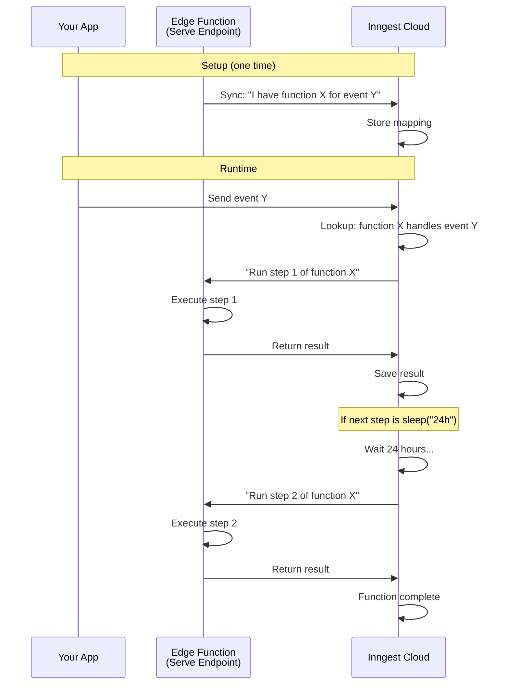

# Inngest Primer

## What Inngest Does

Inngest is a platform that runs your code step-by-step, handling retries, delays, and state between steps. You write functions that respond to events. Inngest coordinates when to run each step and remembers results.

**Key benefit:** You can write multi-step processes that pause (sleep for hours/days), retry on failure, and cancel mid-execution — without managing queues or state yourself.

---

## Core Concepts

### 1. Event

A message that says "something happened."

```json
{
  "name": "currency/award.requested",
  "data": {
    "user_id": "abc-123",
    "merchant_id": "xyz-789",
    "amount": 500
  }
}
```

- **name**: A label identifying what happened
- **data**: Details about the event

Events are sent to Inngest Cloud via HTTP. When Inngest receives an event, it checks if any function is listening for that event name.

<details>
<summary>Technical Details</summary>

Events are sent via HTTP POST to Inngest's Event API:
```
POST https://inn.gs/e/{EVENT_KEY}
Content-Type: application/json

{
  "name": "currency/award.requested",
  "data": { ... }
}
```

You can send events from:
- Your backend code using `inngest.send()`
- HTTP requests directly to the Event API
- Other Inngest functions using `step.sendEvent()`

Events can also include optional fields:
- `id`: Idempotency key (prevents duplicate processing)
- `ts`: Timestamp (defaults to now)
- `user`: User context for filtering in dashboard

</details>

---

### 2. Inngest Function

Code you write that does something when a specific event arrives.

It has three parts:

| Part | What It Is |
|------|-----------|
| **Config** | Settings: unique ID, retry count, cancellation rules |
| **Trigger** | Which event name (or schedule) starts this code |
| **Handler** | The actual code that runs, broken into steps |

**Where does this code live?** In your Edge Function file. You write it. You deploy it to Supabase. Inngest Cloud does not have a copy of your code — it only knows the function ID and what triggers it.

<details>
<summary>Technical Details</summary>

Function definition using the Inngest SDK:

```typescript
const currencyAward = inngest.createFunction(
  // Config
  { 
    id: "currency-award",
    retries: 3,
    concurrency: {
      limit: 10,
      key: "event.data.merchant_id"  // per-merchant limit
    },
    cancelOn: [
      { event: "purchase/refunded", match: "data.source_id" }
    ]
  },
  
  // Trigger
  { event: "currency/award.requested" },
  
  // Handler
  async ({ event, step }) => {
    // steps go here
  }
);
```

Config options include:
- `id`: Unique identifier (required)
- `retries`: Number of retry attempts per step (default: 3)
- `concurrency`: Limit concurrent executions
- `cancelOn`: Events that cancel in-flight runs
- `throttle`: Rate limiting
- `debounce`: Delay execution, reset on new events
- `priority`: Execution priority for queuing

</details>

---

### 3. Trigger

Tells Inngest when to run a function.

**Event trigger** — runs when a matching event arrives:
```typescript
{ event: "user/signup" }
```

**Cron trigger** — runs on a schedule:
```typescript
{ cron: "0 9 * * *" }  // Every day at 9am UTC
```

One function can have multiple triggers.

<details>
<summary>Technical Details</summary>

Multiple triggers example:
```typescript
inngest.createFunction(
  { id: "daily-report" },
  [
    { event: "report/requested" },     // On-demand
    { cron: "0 9 * * 1-5" }            // Weekdays at 9am
  ],
  async ({ event, step }) => { ... }
);
```

Cron expressions follow standard format: `minute hour day-of-month month day-of-week`

Event triggers can include filters:
```typescript
{ 
  event: "order/completed",
  if: "event.data.amount > 1000"  // Only high-value orders
}
```

</details>

---

### 4. Handler

The code inside a function that does the work. It receives context and is made up of steps.

```typescript
async ({ event, step }) => {
  // event = the triggering event data
  // step = helper to define retriable steps
}
```

---

### 5. Step

A single unit of work inside a handler. Each step can be retried independently.

| Step Type | What It Does |
|-----------|--------------|
| `step.run(id, fn)` | Run code, save the result |
| `step.sleep(id, duration)` | Wait for a time period ("1h", "7d") |
| `step.sleepUntil(id, timestamp)` | Wait until a specific date/time |
| `step.waitForEvent(id, opts)` | Wait until another event arrives |
| `step.invoke(id, opts)` | Call another Inngest function |
| `step.sendEvent(id, event)` | Send an event to Inngest |

**Why steps matter:**
- Inngest saves each step's result
- If step 3 fails, steps 1 and 2 don't run again
- Retries happen per step, not for the whole function
- During `sleep`, your code is not running — Inngest waits, then calls your code again

<details>
<summary>Technical Details</summary>

Step execution model:

```typescript
async ({ event, step }) => {
  // First execution: Inngest calls this function
  const amount = await step.run("calculate", async () => {
    return 500;  // Result saved by Inngest
  });
  // Function returns here, Inngest schedules next step

  // Second execution: Inngest calls again with previous results
  await step.sleep("delay", "24h");
  // Function returns, Inngest sets a 24h timer

  // Third execution: 24 hours later
  await step.run("award", async () => {
    return db.insert({ amount });  // 'amount' is restored from saved state
  });
}
```

The function is called multiple times. Each call:
1. Inngest provides results of completed steps (memoized)
2. Your code skips already-completed steps
3. Executes the next pending step
4. Returns to Inngest

This is why your handler code must be deterministic — same inputs should produce same step sequence.

Step IDs must be unique and stable. Don't generate dynamic IDs like:
```typescript
// BAD - ID changes each run
await step.run(`process-${Date.now()}`, ...)

// GOOD - stable ID
await step.run("process-order", ...)
```

Parallel steps:
```typescript
const [a, b, c] = await Promise.all([
  step.run("fetch-a", () => fetchA()),
  step.run("fetch-b", () => fetchB()),
  step.run("fetch-c", () => fetchC()),
]);
```

</details>

---

### 6. Serve Endpoint

A URL that Inngest can call.

You create this by:
1. Writing an Edge Function that uses the Inngest SDK
2. Using `serve()` from the SDK to create an HTTP handler
3. Deploying it to Supabase

This URL does two things:
- Tells Inngest what functions exist (when asked during sync)
- Runs your code (when Inngest tells it to execute a step)

<details>
<summary>Technical Details</summary>

Serve endpoint setup:

```typescript
import { Inngest } from "inngest";
import { serve } from "inngest/deno";

// Create client with app ID
const inngest = new Inngest({ id: "crm-workflows" });

// Define functions
const func1 = inngest.createFunction(...);
const func2 = inngest.createFunction(...);

// Create serve handler
const handler = serve({
  client: inngest,
  functions: [func1, func2],
  signingKey: Deno.env.get("INNGEST_SIGNING_KEY"),  // Verifies requests from Inngest
});

// Expose as HTTP endpoint
Deno.serve(handler);
```

The serve handler responds to:
- `GET` requests: Returns function metadata (for sync/discovery)
- `POST` requests: Executes function steps (signed by Inngest)

Environment variables needed:
- `INNGEST_EVENT_KEY`: For sending events to Inngest
- `INNGEST_SIGNING_KEY`: For verifying incoming requests from Inngest

</details>

---

### 7. App

A name Inngest gives to your serve endpoint after you register it.

- One serve endpoint URL = one app
- One app can have many functions inside it
- Apps appear in the Inngest dashboard

---

### 8. Sync

Telling Inngest about your serve endpoint URL.

How it works:
1. You enter your URL in the Inngest dashboard
2. Inngest calls your URL and asks: "What functions do you have?"
3. Your code responds: "I have function A listening for event X, function B listening for event Y"
4. Inngest saves this mapping

After sync, Inngest knows where to route events.

**Important:** Inngest only saves the function IDs and triggers. It does NOT save your handler code.

<details>
<summary>Technical Details</summary>

Sync can be triggered:
- Manually in the Inngest dashboard (Apps → Sync)
- Via CLI: `npx inngest-cli deploy --url https://your-endpoint`
- Automatically via CI/CD integration

During sync, Inngest makes a GET request to your serve endpoint. Your endpoint returns:

```json
{
  "functions": [
    {
      "id": "currency-award",
      "triggers": [{ "event": "currency/award.requested" }]
    }
  ],
  "url": "https://your-endpoint/inngest-serve"
}
```

After deployment, always resync to register new/updated functions.

</details>

---

### 9. Event Types

The list of all event names Inngest has seen.

Events appear automatically when:
- A function declares it listens to that event (during sync)
- An event is sent to Inngest

No manual event registration is required.

---

## How It All Works Together



---

## What Lives Where

| Thing | Where |
|-------|-------|
| Your code (functions, handlers, steps) | Your Edge Function on Supabase |
| Function IDs and trigger mappings | Inngest Cloud |
| Step results between executions | Inngest Cloud |
| Sleep timers and retry schedules | Inngest Cloud |

**Summary:** Your code runs on your infrastructure. Inngest coordinates when to call it and remembers the results between calls.

---

## Example: Currency Award Function

```typescript
const currencyAward = inngest.createFunction(
  {
    id: "currency-award",
    retries: 3,
    cancelOn: [
      { event: "purchase/refunded", match: "data.source_id" }
    ]
  },
  { event: "currency/award.requested" },
  async ({ event, step }) => {
    const { user_id, merchant_id, source_id } = event.data;

    // Step 1: Calculate how much to award
    const amount = await step.run("calculate", async () => {
      const result = await supabase.rpc("calc_currency_for_source", {
        p_source_id: source_id
      });
      return result.data;
    });

    // Step 2: Get merchant config for delay
    const config = await step.run("get-config", async () => {
      return await fetchMerchantConfig(merchant_id);
    });

    // Step 3: Sleep if delay is configured
    if (config.award_delay_hours > 0) {
      const awardTime = calculateAwardTime(config);
      await step.sleepUntil("delay-award", awardTime);
    }

    // Step 4: Award the currency
    await step.run("award", async () => {
      await supabase.rpc("post_wallet_transaction", {
        p_user_id: user_id,
        p_amount: amount
      });
    });

    return { success: true, amount };
  }
);
```

If a refund event (`purchase/refunded`) arrives with matching `source_id` while this function is sleeping, Inngest automatically cancels the run — the award never happens.

---

## Key Benefits

| Feature | How It Works |
|---------|--------------|
| **Durability** | Step results are saved. Failures resume from last successful step. |
| **Long Waits** | `step.sleep("7d")` doesn't consume compute — Inngest handles the waiting. |
| **Automatic Retries** | Failed steps retry based on your config. |
| **Cancellation** | Define `cancelOn` to abort in-flight runs when conditions change. |
| **Observability** | Dashboard shows every run, step, timing, and failure. |
| **No Queue Management** | Inngest handles all the infrastructure. |

