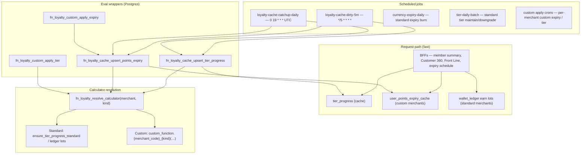

# Loyalty progress & points-expiry cache (eval wrappers)

**Objective:** Move bulk tier-progress and points-expiry calculations off the request path. BFFs and member/admin surfaces read precomputed cache rows; scheduled jobs refresh them and run apply logic.

**Shipped:** September 2026 on project `wkevmsedchftztoolkmi`.

---

## Architecture

**Fast calc (expiry envelope)** — `fn_loyalty_expiry_envelope` reads one bucket source and returns:

| Field | Meaning |
|-------|---------|
| `next` | Next expiry date + points |
| `within_30_days` | Points expiring in the next 30 days |
| `calendar_month` | Points expiring by end of current calendar month |
| `calendar_year` | Points expiring by end of current calendar year |
| `months` | Month-by-month schedule |

Bucket source is chosen by merchant mode: `fn_loyalty_expiry_buckets_for_user` reads `user_points_expiry_cache` when `points_expiry_mode = 'custom'`, otherwise aggregates live `wallet_ledger` earn lots.

---

## Standard vs custom merchants

| Concern | Standard | Custom |
|---------|----------|--------|
| **Tier evaluation mode** | `tier_program_config.evaluation_mode` absent or not `'custom'` | `evaluation_mode = 'custom'` |
| **Points expiry mode** | `merchant_master.points_expiry_mode` ≠ `'custom'` | `points_expiry_mode = 'custom'` |
| **Tier progress read** | `tier_progress` refreshed on event path via `ensure_tier_progress` → `ensure_tier_progress_standard` | `tier_progress` refreshed by cache cron; BFFs read cache only (no on-demand `evaluate_user_tier_status`) |
| **Tier apply (upgrade/downgrade)** | Inngest `process_tier_event` + Render `tier-daily-batch` | `fn_loyalty_custom_apply_tier(merchant, date, 'uptier' \| 'downtier')` |
| **Expiry display** | `wallet_ledger` deductible earn lots | `user_points_expiry_cache` |
| **Expiry burn** | `process_currency_expiry_batch` (Render `currency-expiry-daily`) | `fn_loyalty_custom_apply_expiry` |
| **Calculator function** | Built-in SQL paths | `custom_function.{merchant_code}_tier_progress(uuid, uuid[], date)` and/or `custom_function.{merchant_code}_points_expiry(uuid, uuid[], date)` |

**Examples:** FuturePark uses custom tier + custom expiry (`custom_function.futurepark_tier_progress`, `custom_function.futurepark_points_expiry`). Other merchants can opt in independently (custom tier only, custom expiry only, or both).

Gate helpers: `fn_loyalty_is_custom_tier(merchant_id)`, `fn_loyalty_is_custom_expiry(merchant_id)`.

---

## Cache tables

### `tier_progress` (tier display cache)

Used by all merchants for progress display. For custom-tier merchants, cron writers populate extended columns:

| Column | Purpose |
|--------|---------|
| `upgrade_metric_current` | Cached qualifying earn toward next tier |
| `upgrade_threshold` | Points (or metric amount) required for `next_tier_id` at eval time |

Readers (`fn_admin_get_tier_progress_enriched`, `get_user_summary`, OpenAPI member tier status) trust these rows and do **not** re-run evaluation on read.

### `user_points_expiry_cache` (custom expiry schedule)

One row per `(user_id, merchant_id, expiry_date)` with `amount > 0`. Populated only for `points_expiry_mode = 'custom'`. Unique on `(user_id, merchant_id, expiry_date)`.

---

## Eval wrappers

Wrappers orchestrate calculator resolution, temp-table staging, and cache upsert. They do not embed merchant-specific math.

| Wrapper | Role |
|---------|------|
| `fn_loyalty_resolve_calculator(merchant_id, kind)` | Resolves `kind` ∈ `tier_progress`, `points_expiry` to a `regprocedure`. Custom: `custom_function.{merchant_code}_{kind}`. Returns NULL if missing. |
| `fn_loyalty_cache_upsert_tier_progress` | Calls resolved tier calculator for user batch → upserts `tier_progress` |
| `fn_loyalty_cache_upsert_points_expiry` | Calls resolved expiry calculator → upserts/deletes `user_points_expiry_cache` rows |
| `fn_loyalty_cache_refresh_users` | Per merchant: runs tier and/or expiry upsert based on custom flags |
| `fn_loyalty_custom_apply_tier` | Batch: calculator → `apply_tier_change` for upgrades/downgrades → refresh tier cache |
| `fn_loyalty_custom_apply_expiry` | Batch: refresh expiry cache → `fn_expire_wallet_lots_for_users` for custom burn |

**Standard apply functions** (existing paths, unchanged contract):

- Tier: `process_tier_event`, `tier-daily-batch` → `tier_apply_due_pending_upgrades` / maintain-downgrade chunk RPCs
- Expiry: `process_currency_expiry_batch` via Render `currency-expiry-daily`

**Custom apply functions** use the same calculator as cache refresh so display and mutation stay aligned.

---

## Cron jobs

| Job | Schedule | Scope | RPC / command |
|-----|----------|-------|----------------|
| `loyalty-cache-dirty-5m` | `*/5 * * * *` | Merchants with custom tier **or** custom expiry | `fn_loyalty_cache_refresh_5m()` — scans wallet/purchase activity since last `cutoff_at` (5-minute overlap), refreshes dirty users in 500-user internal chunks |
| `loyalty-cache-catchup-daily` | `0 19 * * *` UTC (≈02:00 ICT) | Custom merchants only | Loops `fn_loyalty_cache_catchup_chunk(merchant, date, 5000)` until `has_more = false` per merchant — users missing tier progress and/or expiry cache rows |
| `currency-expiry-daily` | `0 19 * * *` UTC | Standard expiry merchants | `process_currency_expiry_batch` |
| `tier-daily-batch` | `0 2 * * *` UTC | Standard tier merchants | Pending upgrades + maintain/downgrade |
| Custom apply | Per merchant (Render / manual) | Custom tier and/or expiry | `fn_loyalty_custom_apply_tier`, `fn_loyalty_custom_apply_expiry` |

Progress cursors live in `system_cron` (`job_name` ∈ `loyalty_cache_refresh`, `loyalty_cache_daily_catchup`, `loyalty_custom_apply_tier_uptier`, `loyalty_custom_apply_tier_downtier`, `loyalty_custom_apply_expiry`).

**Invalidate:** `fn_loyalty_cache_invalidate_merchant(merchant_id)` sets catch-up `invalidate` flag so the next daily pass rescans all users (custom merchants only).

---

## Read-path BFFs

| Surface | Function | Data source |
|---------|----------|-------------|
| Member summary | `get_user_summary` | `tier_progress` cache; expiry envelope when display enabled |
| Member expiry schedule | `bff_get_points_expiry_schedule` | `fn_loyalty_expiry_envelope` |
| Admin Front Line / C360 tier card | `fn_admin_get_tier_progress_enriched` | `tier_progress` only |
| OpenAPI member tier | `openapi_user_member_tier_status` | `tier_progress` only |

Display gate for expiry UI: `fn_loyalty_expiry_display_enabled` — true when merchant expiry is active **or** custom expiry mode.

---

## Adding a custom merchant

1. Set `tier_program_config.evaluation_mode = 'custom'` and/or `merchant_master.points_expiry_mode = 'custom'`.
2. Deploy calculator functions in schema `custom_function` named `{merchant_code}_tier_progress` and/or `{merchant_code}_points_expiry` with signature `(p_merchant_id uuid, p_user_ids uuid[], p_as_of_date date)`.
3. Tier calculator returns rows: `user_id`, `point_earn`, `current_tier_id`, `recommended_tier_id`, `recommended_action`, `next_tier_id`, progress/deadline fields (same shape as `_loyalty_tier_calc` temp table).
4. Expiry calculator returns rows: `user_id`, `expiry_date`, `amount`.
5. Register Render crons for `loyalty-cache-dirty-5m` / `loyalty-cache-catchup-daily` (global jobs already scan all custom merchants) and wire custom apply jobs as needed.
6. After config or calculator changes, call `fn_loyalty_cache_invalidate_merchant` and run catch-up.

---

## Related requirements

- Tier event path and standard batch: `requirements/Tier.md`
- Inline expiry calculation and standard daily burn: `requirements/Currency.md`
- Render cron registry: `requirements/REGISTRY_RENDER.md` (`loyalty-cache-dirty-5m`, `loyalty-cache-catchup-daily`)
