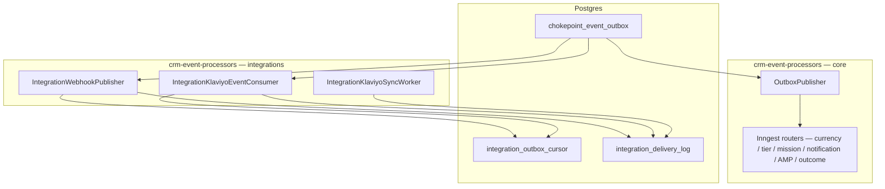

# Outbound Integrations

Rocket pushes canonical loyalty events and member snapshots to merchant-chosen partners after core writes commit. v1 ships **custom HTTPS webhook** (signed JSON) and **Klaviyo** (OAuth, profile properties, metrics, Sync all). Partner HTTP never runs inside wallet, member, redemption, or referral transactions.

Owner surfaces: loyalty-admin (connect, config, Sync all), Render `crm-event-processors` (delivery workers)

## Concept

**Outbound integration** — A merchant-connected destination that receives **Rocket → partner** traffic: either a merchant-owned HTTPS endpoint or Klaviyo’s API. Inbound partners (Judge.me reviews, Gorgias ticket tools) and platform plumbing (Shopify order webhooks) are out of scope here; see `Third_Party_Integrations.md`.

**Shared event bus** — After a loyalty chokepoint commits, the same database transaction inserts a row on the transactional outbox. Core automations and outbound partners both read from that bus, but through **different publishers** (see System).

**Public event** — A stable, versioned name (`event_key`) derived from an outbox row’s internal topic and payload. Partners consume this vocabulary, not raw `crm.events.*` topic strings.

**Member snapshot** — Current CRM state for one member (points, tier, referral URL, expiry hints, identity fields) resolved at delivery time. Klaviyo and the custom webhook attach snapshot data on every touch; the snapshot is not a replay of the stale outbox JSON body.

**Connection** — One active credential row per merchant per integration type (`webhook` or `klaviyo`) in `merchant_credentials`, plus registry-backed config fields (URL, secret, subscribed events, `sync_new_members`).

**Delivery cursor** — Per-consumer read position on the outbox (`integration_outbox_cursor`). Webhook and Klaviyo each advance their own cursor independently of the core Inngest publisher.

**Sync all (Klaviyo)** — Background job that bulk-imports **profile state only** for members with email; it does **not** replay historical metrics.

v1 limits: one custom webhook URL per merchant; events emitted while disconnected are **not** automatically replayed (Klaviyo: run Sync all for profiles; webhook: no backfill).

## Rules

- If the business change rolls back → no outbox row exists. If it commits → the outbox row exists (same-transaction invariant with chokepoints).
- Unmapped outbox rows (no `event_key`) → integration workers skip them; cursor still advances past them.
- Custom webhook → HTTPS only; private, loopback, and link-local hosts rejected at **save** (`fn_integration_webhook_url_is_public`) and again at **send** (DNS resolution check in the worker).
- Custom webhook → merchant selects subscribed `event_key` values; unsubscribed keys are not POSTed even if the outbox row maps.
- Custom webhook v1 → at most one active `service_name = webhook` credential per merchant.
- Delivery → up to **three in-process HTTP attempts** (1s then 2s backoff; honours `Retry-After` on 429). After final failure, `integration_delivery_log` records `failed`; cursor does **not** rewind for a later retry pass (v1).
- **Twenty consecutive failed deliveries** for one credential → `merchant_credentials.health_status = degraded`; worker stops selecting that credential until merchant **re-saves webhook config** or **reconnects Klaviyo** (resets health).
- `is_active = false` on a credential → merchant disconnect; no delivery attempts.
- Klaviyo → match members by **email** only; no email → skip (no profile write, no metric).
- Klaviyo → create profile if missing on each successful write path.
- Klaviyo **`member.created`** → emit **Rocket Member Activated** metric only when config **`sync_new_members`** is on (default **on** after connect).
- Klaviyo **`birthday.reward_issued`** → extra metric only when the wallet earn is distinguishable as birthday (source/description heuristic); otherwise only `points.earned` behaviour applies.
- Klaviyo profile-only events (no metric): `points.burned`, `points.expired`, `points.adjusted`, `member.updated`.
- Klaviyo Sync all → updates profiles via Bulk Import; **never** replays historical metrics.
- Outbox rows are visible to integration readers only after a **10 second lag** from `created_at` (avoids racing the committing transaction).
- Core **OutboxPublisher** (Inngest path) and integration workers are independent: partner outage must never block Inngest publish or core writes.

### Event vocabulary (`event_key`)

Canonical list and mapping logic live in `crm-event-processors` `src/integration/_shared/event-keys.ts`.

| `event_key` | Internal outbox source |
| --- | --- |
| `points.earned` | `crm.events.wallet` — earn, base component |
| `points.burned` | `crm.events.wallet` — burn |
| `points.expired` | `crm.events.wallet` — expire |
| `points.adjusted` | `crm.events.wallet` — adjustment earn component or adjustment transaction type |
| `reward.redeemed` | `crm.events.redemption` — `event = issued` |
| `tier.upgraded` | `crm.events.tier_change` — upgrade or initial tier |
| `tier.downgraded` | `crm.events.tier_change` — downgrade |
| `referral.friend_claimed` | `crm.events.referral` — claimed, friend role |
| `referral.completed` | `crm.events.referral` — settled, referrer/advocate role |
| `member.created` | `crm.events.user` — create |
| `member.updated` | `crm.events.user` — update |
| `birthday.reward_issued` | Classifier on birthday-shaped `points.earned` (Klaviyo extra metric) |

**Custom webhook envelope** — JSON body `{ id, type, version, occurred_at, merchant_id, data: { event, member } }` where `id` = `outbox_id:credential_id`. Headers: `X-Rocket-Event`, `X-Rocket-Delivery`, `X-Rocket-Signature: t=<unix>,v1=<hmac_sha256(secret, "<t>.<body>")>`.

**Klaviyo properties (every profile write)** — Rocket Points Balance; Rocket Points as Cash Balance (omit if no burn rate); Rocket Loyalty Status; Rocket Referral URL; Rocket VIP Tier Name / ID; Rocket Next VIP Tier Name; Rocket Amount Needed for Next VIP Tier; Rocket Date of Birth; Rocket Member Joined Date; Rocket Points Next Expiry Amount / Date; Rocket Points to Next Reward; plus standard `email`, `first_name`, `last_name`, `phone_number`. Intentionally **not** sent: store credit, membership billing, preference questions, credits-as-currency, SMS/email consent flags.

**Klaviyo metrics (v1)**

| Metric | When |
| --- | --- |
| Rocket Points Earned | `points.earned` |
| Rocket Reward Redeemed | `reward.redeemed` |
| Rocket VIP Tier Achieved / Downgraded | tier up / down |
| Rocket Referral Friend Claimed | `referral.friend_claimed` |
| Rocket Referral Completed | `referral.completed` |
| Rocket Member Activated | `member.created` when `sync_new_members` enabled |
| Rocket Birthday Reward Issued | distinguishable birthday earn |

### Shopify

Shopify app install does **not** change webhook or Klaviyo contracts. Shopify-channel members with email sync and receive metrics the same as other channels. Referral, Judge.me earn, and Gorgias goodwill wallet posts that emit wallet/referral outbox rows can still drive Klaviyo/webhook if those integrations are connected (`requirements/reference/SHOPIFY_REFERRALS_ONSITE_INTEGRATIONS.md` Part 3.5).

## Journeys

| Page / surface | Repo | Backend |
| --- | --- | --- |
| Integrations hub | loyalty-admin | `bff_get_merchant_credentials`, catalog match on `integration_key` |
| Klaviyo detail | loyalty-admin | `bff_integration_klaviyo_get_connection`, `_disconnect`, `_start_sync_all`; OAuth edges |
| Custom webhook config | loyalty-admin | `bff_get_integration_config` / `bff_upsert_integration_config`; modal from hub (`experience: modal`) |
| Delivery | Render `crm-event-processors` | Direct read `chokepoint_event_outbox` + cursors (not Inngest) |

### Admin journey

| Setting | Effect |
| --- | --- |
| Webhook URL + signing secret | Destination and HMAC key for custom webhook |
| Subscribed events | Filters which `event_key` values POST to the URL |
| Klaviyo OAuth connect | Stores tokens in `merchant_credentials`; enables live profile + metric push |
| **Sync new members** (`sync_new_members`) | When on, `member.created` fires **Rocket Member Activated**; when off, profile upsert still runs but metric suppressed |
| **Sync all** | Starts `integration_sync_jobs` row; worker bulk-imports profiles (no metric replay) |
| Disconnect | Sets credential inactive; delivery stops (no automatic replay on reconnect) |

1. Open **Integrations** hub — see connected partners and browse catalog (Klaviyo card → detail route; Custom Webhook → config modal per registry type `webhook`).
2. **Klaviyo** — On `/integrations/klaviyo`, choose **Connect** → OAuth (`integration-klaviyo-oauth-start`) → return banner `?klaviyo=connected` → optional **Sync new members** toggle → **Sync all** for backfill → build flows in Klaviyo using Rocket metrics/properties.
3. **Custom webhook** — Open webhook modal from hub → enter HTTPS URL (validated public) and secret → select subscribed events → save → verify receiver accepts signed POSTs.
4. On repeated delivery failures, connection shows **degraded** until merchant re-saves webhook or reconnects Klaviyo.

### Member journey

Members do not configure outbound integrations. They may receive Klaviyo emails or flows the merchant builds on Rocket metrics; they do not see webhook or Klaviyo connect state in the loyalty app.

## System

### Data model

| Artifact | Role |
| --- | --- |
| `chokepoint_event_outbox` | Transactional bus: `topic`, `partition_key`, `payload`, `created_at`; core publisher also uses `published_at`, `publish_attempts`, `last_error` |
| `integration_outbox_cursor` | `consumer_key` + `last_id` read position per integration worker |
| `integration_delivery_log` | Final per `(outbox_id, credential_id)` outcome: `event_key`, `status`, `attempts`, errors; pg_cron `integration_delivery_log_cleanup` deletes rows older than 30 days |
| `integration_sync_jobs` | Klaviyo Sync all progress counters and partner job ids |
| `integration_type_master` / `integration_field_definitions` | Registry types `webhook`, `klaviyo` and hub form fields |
| `merchant_credentials` | OAuth tokens, webhook URL/secret, `is_active`, `health_status`, `service_name` (`webhook` \| `klaviyo`) |
| `oauth_pending` (via OAuth kit) | PKCE / state parking during Klaviyo OAuth |

### Functions

| Function | Role |
| --- | --- |
| `fn_chokepoint_emit_event` | Inserts outbox row inside chokepoint transactions |
| `fn_integration_resolve_member_snapshot` | Live member snapshot for webhook envelope + Klaviyo profile map |
| `fn_integration_lock_credential` | Service-role credential lock during delivery |
| `fn_integration_webhook_url_is_public` | Validates webhook URL at config save |
| `bff_get_integration_config` / `bff_upsert_integration_config` | Registry-backed webhook/Klaviyo config fields |
| `bff_integration_klaviyo_get_connection` / `_disconnect` / `_start_sync_all` | Klaviyo admin connection + Sync all enqueue |
| `bff_get_merchant_credentials` | Hub connection chips |

Wallet, tier, user, redemption, and referral chokepoints emit the internal topics that map to public `event_key` values; see `Third_Party_Integrations.md` §3 for the shared chokepoint boundary table.

### Flows

**Two publishers on one outbox (do not conflate)**

| Path | Wake / read | Purpose |
| --- | --- | --- |
| **Core → Inngest** | `OutboxPublisher`: LISTEN/NOTIFY + polling; `FOR UPDATE SKIP LOCKED`; marks `published_at` | Internal automation only (notifications, currency engines, AMP, etc.) — **not** partner webhooks |
| **Integrations → partners** | Poll `chokepoint_event_outbox` where `id > cursor.last_id` and `created_at <= now() - 10s`; consumer keys `integration-webhook`, `integration-klaviyo` | Custom webhook POST + Klaviyo profile/metric API |

Legacy note: `REGISTRY_RENDER.md` still describes Kafka CDC consumers on the same Render service for historical CDC topics when `CHOKEPOINT_EVENTS_ENABLED=true`. Live **chokepoint** topics (`crm.events.wallet`, `crm.events.user`, `crm.events.tier_change`, `crm.events.redemption`, `crm.events.referral`, purchase streams) are outbox → Inngest for core engines; outbound integrations **never** subscribe to Kafka or Inngest for delivery.

**Custom webhook (async loop)** — Read batch → map row to `event_key` → load active non-degraded webhook credentials for merchant → filter by subscription → resolve snapshot → build envelope → sign → POST with retry → log delivery → advance cursor to max processed id.

**Klaviyo events (async loop)** — Same outbox read path → map `event_key` → load Klaviyo credentials → resolve snapshot → profile upsert + optional metric per `event-map.ts` → log → advance cursor.

**Klaviyo Sync all (async loop)** — `IntegrationKlaviyoSyncWorker` processes `integration_sync_jobs` queued by `bff_integration_klaviyo_start_sync_all`; bulk profile import only.

**Housekeeping** — Render cron `chokepoint_outbox_cleanup` deletes published outbox rows older than 7 days (`REGISTRY_RENDER.md`). Integration delivery log purge: pg_cron daily.

### External services

| Service | Role |
| --- | --- |
| Render **`crm-event-processors`** | Hosts `IntegrationWebhookPublisher`, `IntegrationKlaviyoEventConsumer`, `IntegrationKlaviyoSyncWorker` alongside core consumers and `OutboxPublisher`. Requires direct Postgres URL (`SUPABASE_DB_DIRECT_URL`). Feature flags default off: `INTEGRATION_WEBHOOK_ENABLED`, `INTEGRATION_KLAVIYO_ENABLED`. Klaviyo also needs `KLAVIYO_CLIENT_ID`, `KLAVIYO_CLIENT_SECRET` (Edge + Render). Optional `INTEGRATION_OAUTH_STATE_SECRET`, `LOYALTY_ADMIN_ORIGIN`. |
| Supabase Edge **`integration-klaviyo-oauth-start`** | Admin JWT; returns `{ authorization_url }` |
| Supabase Edge **`integration-klaviyo-oauth-callback`** | Public; exchanges code, stores tokens, redirects admin with `?klaviyo=connected` |
| Klaviyo OAuth redirect URI | `https://wkevmsedchftztoolkmi.supabase.co/functions/v1/integration-klaviyo-oauth-callback` |

Implementation reference: `crm-event-processors/src/integration/` (shared `event-keys.ts`, `outbox-read.ts`, `delivery-log.ts`; `webhook/deliver.ts`; `klaviyo/*`).

### Known gaps

- `REGISTRY_SUPABASE.md` does not yet list `integration_delivery_log`, `integration_outbox_cursor`, `integration_sync_jobs`, or `bff_integration_*` — live DB verified 2026-09-17; prefer MCP/`information_schema` until registry regenerate.
- `REGISTRY_RENDER.md` edge catalog omits `integration-klaviyo-oauth-*` slugs; live Edge deploys exist per reference MD appendix.
- v1 has **no** scheduled replay of failed partner deliveries after cursor advance; reconnect + Sync all covers Klaviyo profiles only.
- Purchase-domain `event_key` expansion (if product adds purchase.* public events) requires mapper change in `event-keys.ts`, not a new outbox table.

## Related

- **Third-Party Integrations** — Developer standard, two-publisher model, inbound partners (Judge.me, Gorgias); `Third_Party_Integrations.md`.
- **Referral** — Referral outbox topics feed `referral.*` keys; `Referral.md`.
- **Notification Service** — Shares chokepoint topics but uses Inngest notification routers, not integration workers; `Notification_Service.md`.
- **Shopify reference MD** — Embedded admin journeys and cross-feature table; `requirements/reference/SHOPIFY_REFERRALS_ONSITE_INTEGRATIONS.md` Part 3.
- **Shopify hub** — Platform OAuth and storefront plumbing only; `Shopify.md`.
- **Architecture** — Event pipeline narrative; `requirements/architecture/CRM_Event_Driven_Architecture.md`, `System_Map.md`.
