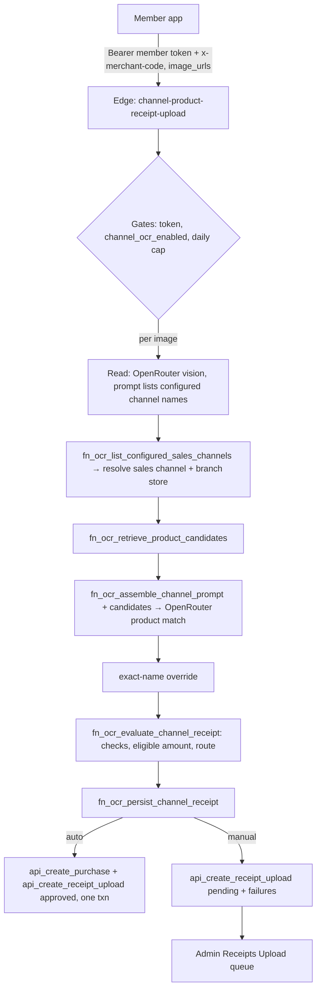

# Receipt Channel OCR Auto-Approve

Members upload a receipt photo; the system reads it, works out which sales channel it came from, keeps only the products that are allowed to earn, and either approves it on the spot (purchase + points) or sends it to the admin approval queue with the reasons. For non-FuturePark merchants.

Owner surfaces: loyalty-admin, loyalty-user, Supabase (edge function `channel-product-receipt-upload` + RPCs)

Standard receipt approval (manual queue, entry modes, preview/approve/reject) → [`Receipt_Upload_Earning.md`](./Receipt_Upload_Earning.md). FuturePark's mall OCR (store + receipt number + datetime + amount, deferred CRM sync) is a different pipeline → [`FuturePark.md`](./FuturePark.md).

## Concept

Standard receipt upload is a manual loop: member uploads, admin reads the photo, keys the lines, approves. Channel OCR puts a machine in front of that loop. It does the reading and the checks; when every check passes and the merchant allows it, it approves without a human. When anything is doubtful, the receipt lands in the **same** admin queue, pre-filled with what the machine read and labelled with why it stopped. Admins never work in a second tool.

The feature exists for brands whose products are sold through their own shops **and** third-party retailers (e.g. SKINPRO Rx clinics, Watsons). Only the brand's products on a receipt should earn, so the unit of judgement is the **product line**, not the bill.

**Channel OCR (switch)** — Platform-level on/off per merchant, set in Super Admin. Off: the merchant has plain manual receipt upload and sees none of this. On: member uploads go through receipt reading, and the admin pages grow the OCR settings, review reasons, and "Approved by" filter.

**Sales channel** — Where the receipt was issued (SKINPRO Rx, พรเกษมคลินิก, Watsons…). Modelled as a store attribute on a store-channel category. Each sales channel has its own product allow-list and reading hints. Not the same as the earn channel.

**Earn channel** — The member-facing "Upload receipt" card (`purchase:receipt_upload`). Every channel OCR receipt and purchase is attributed to it, whatever the sales channel.

**Receipt reading policy (OCR set)** — Rules shared by a group of sales channels (a store attribute set), typically one policy for 1st-party shops and one for 3rd-party retailers: minimum confidence, whether the receipt total must add up, how bill discounts are treated, duplicate check, and whether clean receipts may auto-approve.

**Product allow-list** — Per sales channel, the exact printed product names that earn, each optionally linked to a catalog SKU. Lines not on the list stay on the receipt but do not earn.

**Reading hints** — Per sales channel, free-text notes injected into the AI prompt (which number is the net amount, which label is the receipt number, Buddhist-year dates…).

**Eligible amount** — Baht of allow-listed product lines after line discounts (and, if the policy says so, a proportional share of bill discounts). This is the purchase amount; points come from the merchant's normal earn rules on that amount.

**Route** — `auto` (approved now) or `manual` (pending in the admin queue).

**Review reasons** — Codes explaining a manual route (duplicate, total mismatch, nothing eligible, low confidence, auto-approve off…). Shown to admins in plain language; never shown to members.

**Approved by** — System (auto route) or Admin (anyone who approved by hand).

### Configuration layers

| Layer | Who sets it | Where | What it decides |
| --- | --- | --- | --- |
| Channel OCR switch | Platform admin | Super Admin → Receipt upload | Whether the merchant uses this pipeline at all |
| Merchant auto-approve | Merchant admin | Upload Receipt settings → Auto-approve | Master switch: may *any* receipt auto-approve |
| Policy auto-approve + checks | Merchant admin | Upload Receipt settings → Receipt reading policies | Per group of sales channels: strictness and whether clean receipts auto-approve |
| Allow-list + hints | Merchant admin | Upload Receipt settings → Sales channels | Which products earn; how to read that channel's layout |
| Earn rules | Merchant admin | Currency / earn rules (unchanged) | Points per baht of eligible amount |

Status (2026-09-28): pipeline, admin UI, and member UI live. Policies configured for `skinprorx`, `herhynessreward`, `newcrm`; channel OCR switch not yet turned on for any merchant, merchant auto-approve unset (= off) everywhere.

### Relation to the rest of receipt upload

| | Standard receipt upload | Channel OCR (this doc) | FuturePark |
| --- | --- | --- | --- |
| Member entry | `upload_receipts` RPC | `channel-product-receipt-upload` edge | `upload-receipts-auto-preview` → `-confirm` edges |
| Who reads the receipt | Admin | AI (OpenRouter vision), admin on manual | AI (OpenRouter vision) |
| Judgement unit | Whole receipt | Product lines vs allow-list | Store, receipt number, datetime, amount |
| Purchase on approve | Admin approve → `api_create_purchase` | Auto: inside `fn_ocr_persist_channel_receipt`; manual: standard admin approve | Deferred nightly CRM sync / points engine |
| Admin queue | Receipts Upload | Same Receipts Upload page | Future Park Approve Receipts |

## Rules

### Gates before any reading

1. **Member identity** — Request must carry the member's loyalty access token (`Authorization: Bearer`, HS256, role `authenticated`) and `x-merchant-code` matching the token's merchant; the user must exist in `user_accounts` for that merchant. Anon key, missing or forged token → 401. Merchant and member come from the token only, never the body.
2. **Channel OCR switch** — Off → 403 `channel_ocr_disabled`. Resolution: merchant `feature_config` row's `channel_ocr_enabled` if the key is present, else the plan row's, else false.
3. **Daily image cap** — `fn_check_receipt_upload_daily_image_limit` (default 15 images/day per member). Over → 429 `daily_image_limit_exceeded` with limit/count/remaining. A check error is logged and does not block.
4. **Eval overrides** — `mock_ocr` and a forced sales channel (`store_attribute_id`) are honoured only with header `X-OCR-Eval-Secret` equal to `OCR_EVAL_SHARED_SECRET`. Members cannot use them.

### Per receipt

- Each image in a request is **one receipt**, processed in order, sharing one `batch_id`.
- Outcome per receipt: `approved` (purchase + approved row), `pending` (row in queue, with reasons), or `error` (nothing written except where noted). `rejected` is never produced automatically; only admins reject.
- **Unreadable** (AI says the photo is not clear) → `pending`, reason `unreadable`. No product match.
- **Sales channel** — resolved from the AI's `channel_class` against configured channels' code/name (case-insensitive, substring either way). Exactly one hit wins; zero, many, or none configured → `pending`, reason `channel_unknown`.
- **Branch / store** — best-effort match of the printed branch against active stores assigned to that sales channel (store name, receipt store-name hint, sub-store hints). No match leaves the store empty; it never forces manual.
- **Product match** — printed names → allow-list candidates (exact normalized name, else trigram similarity ≥ 0.30, top 5) → AI picks `matched_product_id` per line from candidates only → exact-name pass overrides with confidence 1.0.

### Checks (any failure → manual)

| Reason code | When | Admin label (EN / TH) |
| --- | --- | --- |
| `duplicate_receipt` | Same receipt number + same sales channel already `approved` or `pending` (policy duplicate check on) | Duplicate receipt number / ตรวจพบเลขที่ใบเสร็จซ้ำ |
| `reconciliation_failed` | Policy "receipt total must match" and sum of all product nets ≠ printed grand total (±1.00) | Item amounts don't match the receipt total / ยอดสินค้าไม่ตรงกับยอดรวมบนใบเสร็จ |
| `eligible_zero` | No allow-listed product amount | No eligible items found / ไม่พบรายการที่ให้คะแนนได้ |
| `invalid_product_id` | AI returned a product id not on this channel's list | No eligible items found / ไม่พบรายการที่ให้คะแนนได้ |
| `low_match_confidence` | A matched line's confidence < policy minimum (default 0.70) | Needs a closer check / ต้องการการตรวจสอบข้อมูลเพิ่มเติม |
| `low_field_confidence`, `low_overall_confidence` | Receipt number / date / lines / overall confidence present and < minimum | Needs a closer check / ต้องการการตรวจสอบข้อมูลเพิ่มเติม |
| `missing_receipt_number` | No receipt number read | Receipt number not found / ไม่พบเลขที่ใบเสร็จ |
| `channel_unknown`, `sales_channel_not_found`, `ocr_set_not_configured`, `ocr_set_ambiguous`, `unreadable` | Channel not resolvable, not in exactly one active policy, or photo unclear | Please check the receipt again / โปรดตรวจสอบใบเสร็จอีกครั้ง |
| `merchant_auto_approve_off` | Merchant auto-approve not on (unset counts as off) | Auto-approve is off / ปิดการอนุมัติอัตโนมัติ |
| `channel_auto_approve_off` | Policy's "auto-approve clean receipts" off | Auto-approve is off / ปิดการอนุมัติอัตโนมัติ |
| `purchase_failed` | Auto route but the purchase could not be created (e.g. purchase-level duplicate) | Purchase could not be created / สร้างรายการซื้อไม่สำเร็จ |

A missing confidence value is not a failure; only a present value below the minimum is.

### Auto-approve decision

`auto` ⇔ merchant auto-approve on **and** policy auto-approve on **and** zero reasons. Anything else is `manual`. Turning either switch off still runs the full reading, so admins get pre-filled rows with "Auto-approve is off" as the only reason on clean receipts.

### Eligible amount

1. Line net = product amount − its SKU discounts (always deducted).
2. Bill discount: policy `spread_proportional` → every product net × (1 − bill discount / product-net total); `ignore` → bill discount dropped.
3. `computed_total` = all product nets (matched or not); `eligible_amount` = matched nets only, 2 decimals.
4. Reconciliation (policy `strict` and a grand total read) compares `computed_total` to grand total, not the eligible amount — a partly eligible bill can still auto-approve for its eligible part.

### Points and writes

- Points shown to members and admins = `calc_currency_core(merchant, member, eligible_amount, store, lines)` points rows, stored on the row as `estimated_points` (points, not baht).
- **Auto** writes the purchase (`transaction_source = receipt_upload`, amount = eligible amount, transaction number = receipt number, line items with SKU codes where linked, `status completed`, `payment_status pending`, `processing_method queue`) and the upload row (`approved`, `approved_method = auto_ocr`, `purchase_ledger_id`) **in one database transaction**. If the upload insert fails after the purchase, the purchase rolls back. If the purchase fails, the receipt becomes `pending` with `purchase_failed`.
- **Manual** writes only the `pending` row: reading result in `ocr_suggestions`, reasons in `ocr_suggestions.failures`, pre-built admin lines in `ocr_suggestions.admin_receipt_items`.
- Admin approval of a manual row is the standard Receipts Upload approve (`bff_approve_receipt_upload`); nothing channel-specific.

## Journeys

### Platform admin journey

| Page | Owning repo | RPC |
| --- | --- | --- |
| Super Admin → Receipt upload | loyalty-admin | `superadmin_get_receipt_upload_config`, `superadmin_upsert_receipt_upload_config` |

1. Pick the merchant in the Super Admin merchant picker, open **Receipt upload**.
2. Toggle **Enable channel OCR (receipt reading)** and save. A warning shows if the merchant's upload receipt feature is disabled.

### Merchant admin journey — setup

| Page | Owning repo | RPC |
| --- | --- | --- |
| Upload Receipt settings | loyalty-admin | `bff_get_upload_receipt_config`, `bff_set_upload_receipt_config`, `bff_list_receipt_ocr_config` |
| Receipt reading policy (new / edit) | loyalty-admin | `bff_get_receipt_ocr_set_rule`, `bff_upsert_receipt_ocr_set_rule` |
| Sales channel (products + hints) | loyalty-admin | `bff_get_receipt_ocr_channel_products`, `bff_upsert_receipt_ocr_channel_products`, `bff_get_receipt_ocr_hints`, `bff_upsert_receipt_ocr_hints` |

| Setting | Effect on behaviour |
| --- | --- |
| Auto-approve clean receipts (merchant) | Master switch for auto route |
| Policy active | Channels in the set are "configured"; inactive → `ocr_set_not_configured` |
| Policy: Auto-approve clean receipts | Per-set switch for auto route |
| Minimum confidence | Threshold for match and field confidence checks |
| Receipt total (strict / skip) | Whether product nets must add up to the printed total |
| Bill discounts (spread proportional / ignore) | Eligible amount math |
| Check for duplicate receipt numbers | Enables `duplicate_receipt` |
| Receipt source (1st / 3rd party) | Label (`source_party`) stored on the reading result |
| Products (printed name + optional SKU) | Allow-list; full replace on save |
| Reading hints (key / value) | Prompt hints for that channel; full replace on save |

1. Open **Upload Receipt settings**. With channel OCR on, sections below Receipt entry: Auto-approve, Receipt reading policies (list of sets), Sales channels (list with product/hint counts, ambiguity warning when a channel sits in two active policies).
2. **New policy** — choose a store attribute set; its channels are listed; set approval and checks; save.
3. Open a **sales channel** — add printed product names (optionally pick a SKU), add reading hints; save.
4. Turn on **Auto-approve** when the policies have been trialled on the manual route.

### Merchant admin journey — daily review

1. **Receipts Upload** queue: pending channel OCR rows show the reason summary under Pending; approved rows show System approved / Approved by admin; All and Approved tabs have an **Approved by** filter (All / System / Admin). Channel column shows the sales channel.
2. Open a pending row: banner "Sent for manual review" (ส่งให้ตรวจด้วยมือ) lists reasons; form is pre-filled with channel, branch/store, receipt number, total, and matched lines with SKUs. Admin corrects, Previews, Approves or Rejects as standard.
3. Open a system-approved row: info banner that it was auto-approved; read-only like any approved row.

### Member journey

| Surface | Owning repo | Call |
| --- | --- | --- |
| Earn → Upload receipt (sheet and full screen) | loyalty-user | `bff_get_upload_receipt_config` (`channel_ocr_enabled`) → `channel-product-receipt-upload` |

1. Member opens the upload receipt card. If channel OCR is on, the app uses this pipeline; otherwise the standard upload.
2. Member picks images (each image = one receipt) and submits; images upload to Storage first, then URLs go to the edge.
3. Result: all approved → "approved, +N points"; all pending → standard "received, under review"; mixed → mixed summary; errors → retry message.
4. 401 → session expired / sign in again; 429 → daily limit message; 403 → feature not available.
5. History shows approved rows with points and pending rows as under review (standard history, `Receipt_Upload_Earning.md`).

## System

### Flow

### Edge function

`channel-product-receipt-upload` (Supabase, `verify_jwt = false`; auth is checked in code because the anon key is itself a valid JWT). Source is **not in git** — download with `supabase functions download channel-product-receipt-upload --project-ref wkevmsedchftztoolkmi`; deploy with `supabase functions deploy channel-product-receipt-upload --project-ref wkevmsedchftztoolkmi --no-verify-jwt --use-api` from a folder holding `supabase/config.toml` (`[functions.channel-product-receipt-upload] verify_jwt = false`). `FUNCTION_VERSION` in `index.ts` (54 as of 2026-09-28).

| File | Role |
| --- | --- |
| `index.ts` | HTTP handler: auth, switch, daily cap, loop images, summary response |
| `lib/request-auth.ts` | `verifyMemberRequest` (djwt HS256 with `SUPABASE_JWT_SECRET`/`JWT_SECRET`, role, merchant code, `user_accounts`), `hasEvalSecret`, `authError` |
| `lib/feature-flags.ts` | `isChannelOcrEnabled` (merchant key → plan key → false) |
| `lib/pipeline.ts` | `processOneReceipt`: extraction source choice, channel/store resolve, candidates, product match, evaluate, persist |
| `lib/llm-receipt-ocr.ts` | First read: extraction prompt (channel list, branch, line kinds, confidence) → normalized result |
| `lib/receipt-llm.ts` | OpenRouter call wrapper for vision/text; model choice; builds product-match prompt |
| `lib/openrouter.ts` | Shared OpenRouter client: key lookup, reasoning effort, JSON mode, 45 s timeout, 429 back-off |
| `lib/channel-resolve.ts` | Sales channel resolution, branch → store, earn channel id |
| `lib/roboflow.ts`, `lib/roboflow-stub.ts` | Legacy extractors, only when `USE_LIVE_ROBOFLOW=true` / `USE_OCR_STUB=true` |
| `lib/types.ts`, `lib/utils.ts`, `lib/llm-json-parse.ts` | Types, CORS/JSON helpers, tolerant JSON parse |

Request: `{ image_urls[], store_id?, user_tel?, user_full_name? }` (+ eval-only `mock_ocr`, `store_attribute_id`). Response: `{ success, batch_id, summary{total, approved, pending, rejected, error}, results[{index, status, points, eligible_amount, reasons, receipt_upload_id, purchase_ledger_id, error}] }`. Error codes: `unauthorized` 401, `channel_ocr_disabled` 403, `missing_images` 400, `daily_image_limit_exceeded` 429, `system_error` 500. Per-image failures (`image_resolve_failed`, `llm_ocr_failed`, `retrieve_failed`, `prompt_assemble_failed`, `llm_failed`, `evaluate_failed`, `upload_receipt_earn_channel_not_found`, `persist_failed`) stay in `results[]`.

### AI / OpenRouter

- Both AI calls (receipt read with image; product match text-only) go through OpenRouter, the same provider and key as FuturePark OCR.
- Model: env `RECEIPT_OPENROUTER_VISION_MODEL`, default `google/gemini-3.8-flash` — kept equal to FuturePark's production default (`_shared/vision-llm.ts` `getProductionLlmConfig` in `futurepark-upload-receipt`). Change both together unless deliberately diverging.
- Key: env `OPENROUTER_API_KEY`, else RPC `internal_knowledge_runtime_secret('openrouter_api_key')` (central platform secret).
- Reasoning effort `low` for Gemini 3.7–3.9 (retried without reasoning if the provider rejects it); JSON response mode; images fetched and sent inline as data URLs (OpenRouter does not fetch URLs).
- Prompts: first read is in code (`llm-receipt-ocr.ts`); product-match prompt is built in SQL by `fn_ocr_assemble_channel_prompt` from the channel's hints + fixed line-item rules, then the edge appends OCR text and `CANDIDATE_PRODUCTS`.

### Database functions

| Function | Role |
| --- | --- |
| `fn_ocr_list_configured_sales_channels` | Channels in exactly the active policy sets (edge read model) |
| `fn_ocr_retrieve_product_candidates` | Allow-list candidates per printed line (exact, else trigram ≥ 0.30, top 5) |
| `fn_ocr_assemble_channel_prompt` | Product-match prompt from hints |
| `fn_ocr_evaluate_channel_receipt` | Line verification, confidence, receipt number, eligible amount, reconciliation, duplicate, merchant + policy auto-approve → `{route, eligible_amount, reasons, ocr_suggestions, …}`; no writes |
| `fn_ocr_resolve_set_config_for_channel`, `fn_ocr_merge_set_rules`, `fn_ocr_compute_eligible_amount`, `fn_ocr_duplicate_by_receipt_id` | Evaluate helpers |
| `fn_ocr_persist_channel_receipt` | Service-role only. Points via `calc_currency_core`; auto → `api_create_purchase` + approved `api_create_receipt_upload` in one transaction; manual / purchase failure → pending row |
| `fn_check_receipt_upload_daily_image_limit` | Daily cap |
| `fn_earn_channel_effective_id` | `purchase:receipt_upload` earn channel |
| `bff_get_upload_receipt_config` / `bff_set_upload_receipt_config` | Merchant settings incl. `channel_ocr_enabled` (read) and `auto_approve` |
| `superadmin_get_receipt_upload_config` / `superadmin_upsert_receipt_upload_config` | Channel OCR switch; `assert_platform_admin`; shallow-merges into the merchant row |
| `bff_list_receipt_ocr_config` | Settings page: sets with rules and channels (product/hint counts, ambiguity) |
| `bff_get/upsert_receipt_ocr_set_rule`, `bff_get/upsert_receipt_ocr_channel_products`, `bff_get/upsert_receipt_ocr_hints` | Policy, allow-list, hints editors (upserts for lists are full replace) |
| `bff_list_receipt_uploads` | Admin queue; `p_approved_by`; `review_reasons` (stored `failures`, else legacy duplicate inference); `sales_channel_name` |
| `bff_approve_receipt_upload` | Standard manual approve/reject for pending rows |

### Data model

| Object | Role |
| --- | --- |
| `feature_config` (`earn_channel` / `upload_receipt`) | `channel_ocr_enabled` (Super Admin), `auto_approve` (merchant), plus standard keys. Merchant row overrides plan row per key |
| `receipt_ocr_set_rule` | One per (merchant, store attribute set): `rules` jsonb (`policy_code`, `bill_discount_mode`, `sku_discount_mode`, `reconciliation_mode`, `min_confidence`, `duplicate_check_enabled`, `auto_approve_enabled`), `is_active` |
| `receipt_ocr_channel_product` | Allow-list: (merchant, store attribute, `product_name`) unique, optional `product_sku_id` |
| `receipt_ocr_hints` | (merchant, store attribute, `hint_key`) → `hint_value` |
| `store_attributes`, `store_attribute_sets`, set members, `store_attribute_assignments`, `store_master` | Sales channels, policy grouping, branch stores (`Store_Attribute_Classification.md`) |
| `purchase_receipt_upload` | Result row: `status`, `approved_method` (`auto_ocr` for system), `ocr_suggestions` (`store_attribute_id`, `sales_channel_name`, `eligible_amount`, `source_party`, `ocr_set_*`, `confidence`, `line_items`, `receipt_number`, `grand_total`, `store_*`, `receipt_datetime`, `failures`, `admin_receipt_items`), `estimated_points`, `purchase_ledger_id`, `batch_id` |
| `purchase_ledger` / `purchase_items_ledger` | Purchase on auto route; currency via purchase triggers |

### Frontend — loyalty-admin

| Page | Files (`src/app/…`) |
| --- | --- |
| Receipts Upload queue + review | `(admin)/receipts-upload/page.tsx`, `receipts-list.tsx`, `receipt-review-modal.tsx`, `actions.ts`, `types.ts`, `review-reasons.ts` (codes, EN/TH fallbacks, translation page key `receipts_upload`) |
| Upload Receipt settings (`?view=settings`) | `(admin)/receipts-upload/settings/upload-receipt-settings-form.tsx`, `ocr-actions.ts` |
| Policy editor | `(admin)/receipts-upload/ocr-policies/new`, `[setId]`, `ocr-policy-form.tsx` |
| Sales channel editor | `(admin)/receipts-upload/ocr-channels/[storeAttributeId]`, `ocr-channel-form.tsx` |
| Super Admin toggle | `(superadmin)/superadmin/receipt-upload/*`, nav in `(superadmin)/_components/superadmin-topbar.tsx` |
| Shared block | `src/components/blocks/duplicate-matches-panel/` |

Polaris 2.0 web components (`s-*`); editors use `PageBack`, `AnnotatedSection`, `SaveBar`. Everything OCR-specific renders only when `channel_ocr_enabled`. Page doc: loyalty-admin `ProjectDocs/FE_docs/ReceiptUploads.md`.

### Frontend — loyalty-user

| Piece | File |
| --- | --- |
| API client | `src/lib/api/earn.ts` — `uploadReceiptsChannelOcr` (reads `loyalty_access_token` cookie, sends `x-merchant-code`), `ChannelOcrUploadError`, `channelOcrSuccessModalCopy` |
| Types | `src/types/earn.ts` |
| UI branches | `src/components/earn/earn-sheet.tsx` (`UploadReceiptBody`), `src/components/earn/screens/receipt-upload-screen.tsx` |
| Copy | `src/components/earn/earn-i18n.ts`, `use-earn-translation.ts` |

### Operations

- **Enable a merchant**: configure policies, allow-lists, and hints → Super Admin switch on → run on manual (auto-approve off) and review reasons → merchant turns Auto-approve on.
- **Test without a member**: call the edge with a real member token plus `X-OCR-Eval-Secret` to use `mock_ocr` or force `store_attribute_id`.
- **Logs**: Supabase edge logs for `channel-product-receipt-upload` print per-image stage lines (`Store resolved`, evaluate summary, `DONE … summary=`).
- **Change a threshold or policy**: data only (policy editor); no deploy.
- **Change reading behaviour**: hints (data) first; prompt code or model = edge redeploy.

### Known gaps

- `sku_discount_mode` is stored but ignored; SKU discounts are always deducted.
- Duplicate check is receipt number + sales channel only (no datetime/amount); purchase-level transaction-number duplicate surfaces as `purchase_failed`.
- A sales channel in two active policies is never evaluated (`ocr_set_ambiguous`); the settings page warns but does not block.
- Allow-list gaps silently reduce eligible amount (e.g. พรเกษม maps 30 of 41 SKINPRO SKUs).
- Edge source lives only on Supabase; keep a copy when editing (download before change).
- Legacy rows before 2026-09-28 may lack `failures`; the list infers only duplicates for them.
- Member token helper is duplicated in `earn.ts`, `receipt-upload.ts`, `outbound-handoff.ts`.

## Related

- **Receipt Upload Earning** — Admin queue, manual approve/reject, entry modes, history → `Receipt_Upload_Earning.md`.
- **Store Attribute Classification** — Sales channels are store attributes; policies are attribute sets → `Store_Attribute_Classification.md`.
- **Purchase Transaction** — Auto route creates a purchase via `api_create_purchase` → `Purchase_Transaction.md`.
- **Currency** — Points from earn rules on the eligible amount (`calc_currency_core`) → `Currency.md`.
- **Earn Channel** — `purchase:receipt_upload` card and visibility → `Earn_Channel.md`.
- **FuturePark** — Separate mall OCR pipeline sharing the OpenRouter client and model default → `FuturePark.md`.
