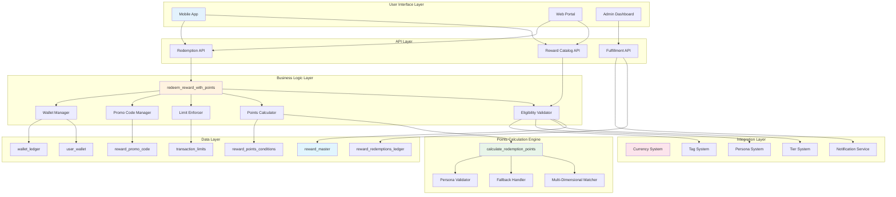
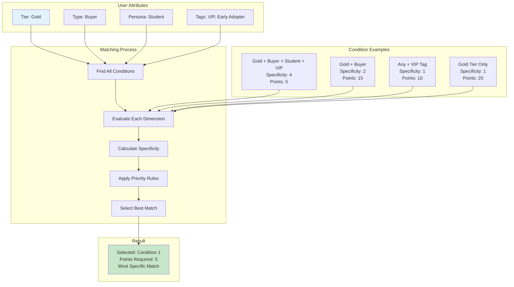
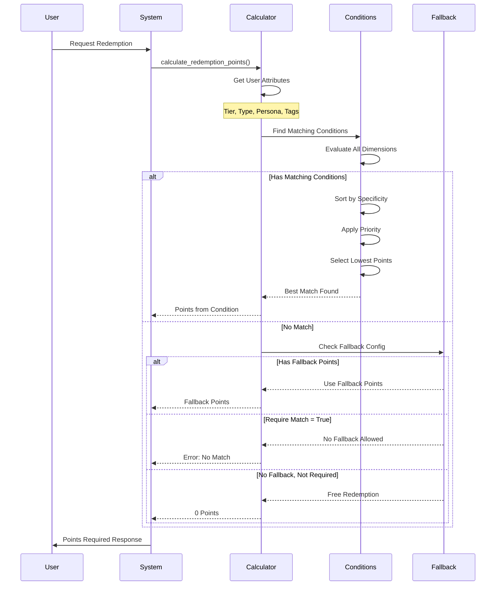
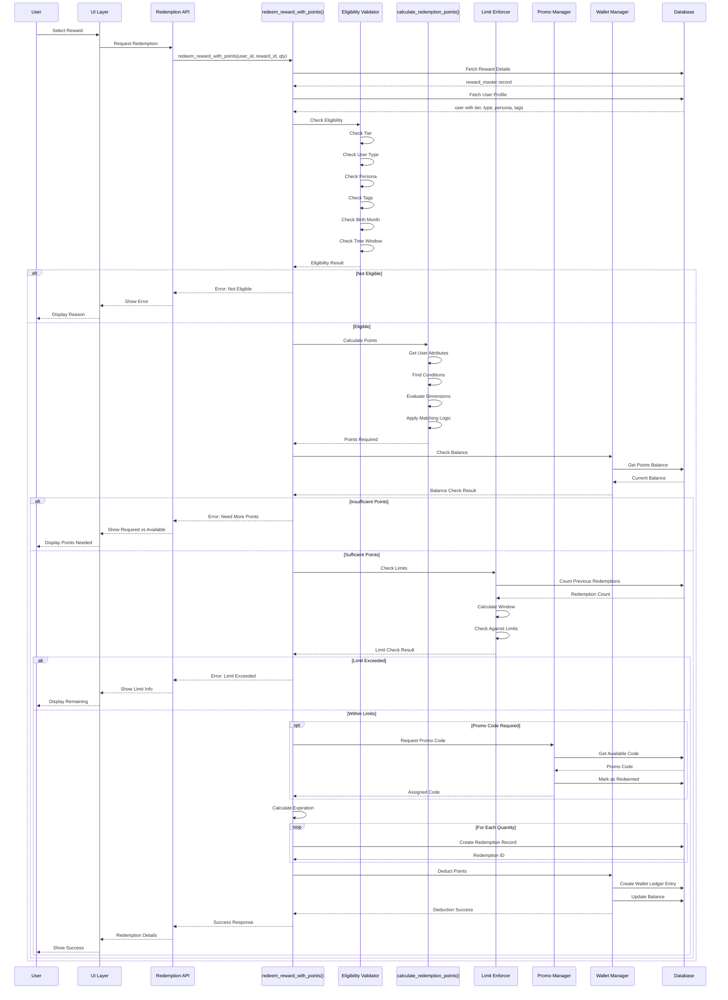

# Reward Redemption System - Complete Business & Technical Documentation

## Executive Summary

The Reward Redemption System is a sophisticated loyalty platform that orchestrates the complete lifecycle of reward management - from creation through redemption to fulfillment. Built on a **two-layer architecture** (eligibility layer determining WHO can redeem, and points pricing layer determining HOW MANY points required), the system supports dynamic points-based pricing that adapts to customer attributes (tier, type, persona, tags), multiple fulfillment methods (digital, physical, pickup, printed), and comprehensive stock/promo code management.

The system's distinguishing features include:
- **Multi-dimensional points matching engine** that evaluates four customer dimensions simultaneously for optimal pricing
- **Intelligent promo code management** supporting bulk imports with partner attribution and real-time availability tracking
- **Flexible fulfillment architecture** accommodating digital, physical, and hybrid reward delivery methods

## Table of Contents
- [Core Concepts & Glossary](#core-concepts--glossary)
- [Business Requirements](#business-requirements)
- [System Architecture](#system-architecture)
- [Database Schema](#database-schema)
- [Dynamic Points Calculation Engine](#dynamic-points-calculation-engine)
- [Reward Redemption Processing](#reward-redemption-processing)
- [Eligibility & Validation System](#eligibility--validation-system)
- [Promo Code Management](#promo-code-management)
- [Fulfillment & Delivery Management](#fulfillment--delivery-management)
- [Business Rules](#business-rules)
- [API Integration](#api-integration)
- [Implementation Examples](#implementation-examples)
- [System Operations & Monitoring](#system-operations--monitoring)


---

## Core Concepts & Glossary

### Reward Architecture Components

**Reward Master**: Central entity defining a redeemable benefit with all its properties, rules, and constraints. Each reward operates independently with its own eligibility criteria and pricing rules.

**Two-Layer System**: Architectural separation of concerns:
1. **Eligibility Layer**: Binary qualification check (WHO can see/redeem)
2. **Points Pricing Layer**: Dynamic cost calculation (HOW MANY points required)

**Multi-Dimensional Matching**: System evaluates four customer attributes simultaneously:
- **Tier**: Loyalty level (Bronze, Silver, Gold, Platinum, Diamond)
- **User Type**: Transactional role (buyer, seller)
- **Persona**: Business profile (Student, Corporate, SME)
- **Tags**: Behavioral markers (VIP, Early Adopter, Frequent Buyer)

### Reward Properties

**Visibility Types**:
- `user`: Public catalog - visible to all eligible end users
- `admin`: Administrative rewards - only visible in admin interfaces
- `campaign`: Campaign-specific - distributed through targeted campaigns

**Fulfillment Methods**:
- `digital`: Electronic delivery (codes, vouchers, downloads)
- `shipping`: Physical delivery requiring address
- `pickup`: Collection at designated store location
- `printed`: Self-print vouchers/certificates

**Expiration Modes**:
- `relative_days`: Expires X days after redemption
- `relative_mins`: Flash rewards expiring in minutes
- `absolute_date`: Fixed expiration for all redemptions

### Redemption States

**Redeemed Status** (`redeemed_status = true`): Points deducted, reward claimed by user

**Used Status** (`used_status = true`): Reward actually consumed (voucher used at store, product collected)

**Fulfillment Status**:
- `pending`: Awaiting processing
- `shipped`: Dispatched to customer
- `delivered`: Delivery confirmed
- `completed`: Fully fulfilled and closed
- `cancelled`: Redemption cancelled (points refunded)
- `reject`: Redemption rejected (failed validation)

### Points Calculation Concepts

**Specificity**: Number of dimensions specified in a condition (1-4)

**Match Score**: Number of dimensions that actually match user attributes

**Priority**: Tiebreaker when multiple conditions have same specificity

**Customer-Favorable Rule**: When all else equal, lowest points requirement wins

**Fallback Points**: Default cost when no conditions match (optional)

### Eligibility Dimensions

**Allowed Tier** (`allowed_tier[]`): Array of tier IDs permitted to redeem

**Allowed Type** (`allowed_type[]`): User types (buyer/seller) allowed

**Allowed Persona** (`allowed_persona[]`): Persona IDs permitted

**Allowed Tags** (`allowed_tags[]`): Required tag IDs (user must have at least one)

**Allowed Birth Month** (`allowed_birthmonth[]`): Month numbers (1-12) for birthday rewards

### Redemption Limits

**Scope Types**:
- `user`: Limit applies per individual user
- `total`: Global limit across all users

**Time Units**: `day`, `week`, `month`, `year` for frequency control

**Window Enforcement**: Optional date ranges for limit application

---

## Business Requirements

### Functional Requirements

#### 1. Reward Lifecycle Management
- **Creation**: Merchants define rewards with complete configuration
- **Activation**: Time-window based availability control  
- **Modification**: Update properties while maintaining redemption history
- **Deactivation**: Soft-delete preserving audit trail

#### 2. Multi-Dimensional Points Pricing
The system's core innovation - dynamic pricing based on customer attributes:

**Dimension-Based Pricing**:
- Different points for different customer segments
- Automatic best-price selection for customers
- Configurable fallback for unmatched users
- Optional free redemption support

**Matching Algorithm**:
1. Evaluate all active conditions for reward
2. Score by specificity (more dimensions = higher priority)
3. Apply priority weighting for business rules
4. Select lowest points at same specificity level

#### 3. Comprehensive Eligibility Control
**Mandatory Checks**:
- Tier qualification (if specified)
- User type compatibility
- Persona requirements
- Tag prerequisites
- Time window validation

**Optional Filters**:
- Birthday month restriction
- Stock availability
- Promo code pool status

#### 4. Redemption Limit Management
**User Limits**: Control individual redemption frequency
- Daily/weekly/monthly/yearly caps
- Lifetime maximum redemptions
- Window-specific restrictions

**Global Limits**: System-wide redemption control
- Total redemption cap
- Time-based global limits
- Campaign-specific quotas

#### 5. Inventory & Code Management
**Stock Control**: Optional inventory tracking
- Real-time availability checks
- Atomic stock deduction
- Oversell prevention

**Promo Code Assignment**:
- Pre-loaded unique code pools
- Automatic assignment on redemption
- Default codes for unlimited use
- One code per redemption transaction

#### 6. Multi-Channel Fulfillment
**Digital Fulfillment**:
- Immediate code delivery
- Email/SMS distribution
- In-app display

**Physical Fulfillment**:
- Address validation
- Shipping status tracking
- Delivery confirmation

### Non-Functional Requirements

#### Performance Requirements
- **Redemption Processing**: < 3 seconds end-to-end
- **Eligibility Check**: < 500ms for multi-dimensional evaluation
- **Points Calculation**: < 200ms with condition matching
- **Concurrent Handling**: Support 1000+ simultaneous redemptions

#### Reliability Requirements
- **Transaction Atomicity**: All-or-nothing redemption execution
- **Idempotency**: Duplicate request protection
- **Rollback Capability**: Automatic reversal on failure
- **Data Consistency**: ACID compliance for state changes

#### Scalability Requirements
- **Data Volume**: Support millions of redemptions
- **Condition Complexity**: Handle 100+ conditions per reward
- **User Base**: Scale to 10M+ active users
- **Merchant Growth**: Multi-tenant isolation

#### Security Requirements
- **Function Security**: SECURITY DEFINER for controlled access
- **Eligibility Validation**: Pre-redemption authorization checks
- **Code Protection**: Unique promo code enforcement
- **Data Isolation**: Merchant-specific data segregation

#### Auditability Requirements
- **Complete Audit Trail**: All state transitions logged
- **Point Tracking**: Full transaction history with metadata
- **User Actions**: Detailed redemption timeline
- **System Events**: Fulfillment status changes

---

## System Architecture

### Architectural Overview

The Reward Redemption System is architected as a modular, event-driven platform with clear separation of concerns:

1. **Presentation Layer**: User interfaces for reward browsing and redemption
2. **Service Layer**: Business logic orchestration and validation
3. **Calculation Engine**: Dynamic points pricing and condition matching
4. **Data Layer**: Transactional storage with audit trails
5. **Integration Layer**: Cross-system coordination with Currency, Tier, and Persona systems

### High-Level Architecture Diagram



### Component Relationships

#### Data Flow
1. **Catalog Browse**: User → API → Eligibility Check → Points Calculation → Display
2. **Redemption**: User → Validation → Points Deduction → Code Assignment → Ledger Entry
3. **Fulfillment**: Redemption → Status Update → Notification → Completion

#### Integration Points
- **Currency System**: Points balance and transaction management
- **Tier System**: Customer segmentation for eligibility
- **Persona System**: Business profile validation
- **Tag System**: Behavioral targeting
- **Notification Service**: Redemption confirmations

### Core Components

#### Redemption Service

**Function: `redeem_reward_with_points`**
- **Purpose**: Central orchestrator for reward redemption flow
- **Input**: User ID, Reward ID, optional delivery address
- **Processing**:
  1. Validate reward exists and is active
  2. Check comprehensive eligibility (tier, type, persona, tags)
  3. Calculate dynamic points using multi-dimensional matching
  4. Verify user has sufficient points
  5. Enforce redemption limits (user and global)
  6. Assign promo code from pool if required
  7. Deduct points via Currency System
  8. Create redemption ledger entry
  9. Initialize fulfillment tracking
- **Output**: Redemption ID, promo code (if applicable), points deducted

#### Points Calculation Engine

**Function: `calculate_redemption_points`**
- **Purpose**: Determine exact points required for specific user
- **Input**: Reward ID, User ID
- **Algorithm**:
  1. Gather user dimensions (tier, type, persona, tags)
  2. Retrieve all active conditions for reward
  3. Score conditions by specificity (4 dims > 3 dims > 2 dims > 1 dim)
  4. Apply priority weighting within same specificity
  5. Select lowest points at highest matched specificity
  6. Return fallback if no conditions match
- **Output**: Points required, matched condition ID, condition details

#### Eligibility Validator

**Function: `check_reward_eligibility_enhanced`**
- **Purpose**: Comprehensive eligibility verification
- **Input**: Reward ID, User ID
- **Validations**:
  - Tier membership (if restricted)
  - User type compatibility
  - Persona qualification with type consistency
  - Tag requirements (all required tags must be present)
  - Time window constraints
  - Birthday month (if applicable)
  - Stock availability
  - Promo code pool status
- **Output**: Eligibility status, rejection reasons, available quantity

#### Supporting Services

**Multi-Dimensional Matcher**:
- Evaluates conditions across tier, type, persona, and tag dimensions
- Implements specificity-based scoring algorithm
- Returns best match for user profile

**Promo Code Manager**:
- Atomic code assignment from pool
- Prevents duplicate assignment
- Handles default vs unique codes

**Limit Enforcer**:
- Validates against user redemption history
- Checks global redemption caps
- Enforces time-windowed restrictions

---

## Database Schema

### Schema Design Principles

1. **Separation of Concerns**: Rewards, conditions, and redemptions in separate tables
2. **Audit Trail**: Complete history in ledger tables
3. **Idempotency**: Natural keys prevent duplicate operations
4. **Consistency**: Foreign key constraints maintain referential integrity
5. **Performance**: Optimized indexes for common query patterns
6. **Two-Layer Architecture**: Materialized views for aggregation, regular views for real-time data

### Core Tables

#### Table: `reward_master`
**Purpose**: Central repository for all reward definitions with comprehensive configuration

```sql
CREATE TABLE reward_master (
    id UUID PRIMARY KEY DEFAULT gen_random_uuid(),
    merchant_id UUID NOT NULL,
    created_at TIMESTAMPTZ NOT NULL DEFAULT NOW(),
    
    -- Basic Information
    name TEXT,
    description_headline TEXT,
    description_body TEXT,
    description_tc TEXT,        -- Terms & Conditions
    description_slip TEXT,       -- Redemption slip text
    image TEXT[],               -- Array of image URLs
    
    -- Categorization
    group_id UUID[],            -- Reward groups
    category_id UUID[],         -- Reward categories
    ranking SMALLINT,           -- Display order
    
    -- Eligibility Rules (Layer 1: WHO can redeem)
    allowed_tier UUID[],        -- Eligible tier IDs
    allowed_type UUID[],        -- Eligible user type IDs
    allowed_persona UUID[],     -- Eligible persona IDs (NEW)
    allowed_tags UUID[],        -- Required tag IDs (NEW)
    allowed_birthmonth TEXT[],  -- Eligible birth months (1-12)
    
    -- Points Configuration (Layer 2: HOW MANY points)
    fallback_points NUMERIC,    -- Default points if no condition matches (NEW)
    require_points_match BOOLEAN DEFAULT false, -- If true, must match a condition (NEW)
    
    -- Redemption Configuration
    visibility reward_visibility,
    redeem_window_start TIMESTAMPTZ,
    redeem_window_end TIMESTAMPTZ,
    
    -- Inventory & Codes
    stock_control BOOLEAN,
    assign_promocode BOOLEAN,
    promo_code TEXT,            -- Default promo code if not unique
    
    -- Expiration Settings
    use_expire_mode reward_expire_mode,
    use_expire_date TIMESTAMPTZ,    -- For absolute_date mode
    use_expire_ttl NUMERIC,          -- For relative modes
    
    -- Fulfillment
    fulfillment_method reward_fulfillment_method
);
```

#### 2. `reward_points_conditions` (NEW)
Dynamic points pricing conditions based on customer attributes.

```sql
CREATE TABLE reward_points_conditions (
    id UUID PRIMARY KEY DEFAULT gen_random_uuid(),
    reward_id UUID NOT NULL REFERENCES reward_master(id) ON DELETE CASCADE,
    merchant_id UUID NOT NULL,
    
    -- Condition dimensions (all optional - NULL means any)
    tier_id UUID REFERENCES tier_master(id),
    user_type user_type,
    persona_id UUID REFERENCES persona_master(id),
    tag_ids UUID[],             -- Multiple tags can be required
    
    -- Points configuration
    points_required NUMERIC NOT NULL CHECK (points_required >= 0),
    priority INTEGER DEFAULT 100, -- Higher priority wins in conflicts
    
    -- Metadata
    condition_name TEXT,
    description TEXT,
    active_status BOOLEAN DEFAULT true,
    created_at TIMESTAMPTZ DEFAULT NOW(),
    updated_at TIMESTAMPTZ DEFAULT NOW(),
    
    -- Unique constraint to prevent duplicate conditions
    UNIQUE(reward_id, tier_id, user_type, persona_id, tag_ids)
);
```

#### Table: `reward_redemptions_ledger`
**Purpose**: Complete audit trail of all redemption transactions with status tracking

```sql
CREATE TABLE reward_redemptions_ledger (
    id UUID PRIMARY KEY DEFAULT gen_random_uuid(),
    merchant_id UUID NOT NULL,
    created_at TIMESTAMPTZ NOT NULL DEFAULT NOW(),
    
    -- Redemption Details
    reward_id UUID REFERENCES reward_master(id),
    user_id UUID REFERENCES users(id),
    code TEXT,                  -- Unique redemption code (RWD000001)
    qty NUMERIC DEFAULT 1,
    
    -- Points Information (NEW)
    points_deducted NUMERIC,    -- Total points deducted
    points_calculation JSONB,   -- Calculation details
    
    -- Status Tracking
    redeemed_status BOOLEAN DEFAULT FALSE,
    redeemed_at TIMESTAMPTZ,
    used_status BOOLEAN DEFAULT FALSE,
    used_at TIMESTAMPTZ,
    use_expire_date TIMESTAMPTZ,
    
    -- Promo Code
    promo_code TEXT,            -- Assigned promo code if applicable
    
    -- Fulfillment
    fulfillment_status rewards_redemption_fulfillment_status,
    delivery_address_code TEXT
);
```

#### Table: `wallet_ledger` Integration
**Purpose**: Points transaction recording for redemption burns

```sql
-- Example entry for redemption
{
    "user_id": "uuid",
    "merchant_id": "uuid", 
    "currency": "points",
    "transaction_type": "burn",
    "component": "base",
    "amount": 100,
    "signed_amount": -100,
    "source_type": "reward_redemption",
    "source_id": "redemption_uuid",
    "metadata": {
        "reward_id": "uuid",
        "points_calculation": {...}
    }
}
```

### Additional Tables

#### Table: `reward_promo_code`
**Purpose**: Storage for unique promotional codes assigned to rewards

```sql
CREATE TABLE reward_promo_code (
    id UUID PRIMARY KEY DEFAULT gen_random_uuid(),
    merchant_id UUID NOT NULL,
    created_at TIMESTAMPTZ NOT NULL DEFAULT NOW(),
    
    -- Code Information
    promo_code TEXT,                -- The unique code
    name TEXT,                       -- Batch name for grouping
    lot_code TEXT,                   -- Lot identifier
    
    -- Assignment
    reward_id UUID REFERENCES reward_master(id),
    source_id UUID,                  -- Partner merchant ID if applicable
    
    -- Status
    redeemed_status BOOLEAN DEFAULT FALSE,
    
    -- Unique constraint
    UNIQUE(promo_code, merchant_id)
);
```

#### Table: `reward_promo_code_staging`
**Purpose**: Temporary storage for bulk promo code uploads before processing

```sql
CREATE TABLE reward_promo_code_staging (
    id UUID PRIMARY KEY DEFAULT gen_random_uuid(),
    batch_id UUID NOT NULL,
    created_at TIMESTAMPTZ DEFAULT NOW(),
    
    -- Staging data
    promo_code TEXT,
    lot_code TEXT,
    name TEXT,
    
    -- Processing status
    processed BOOLEAN DEFAULT FALSE,
    error_message TEXT,
    
    -- Session tracking
    import_session_id UUID
);
```

#### Table: `partner_merchant`
**Purpose**: Partner/supplier information for promo code source tracking

```sql
CREATE TABLE partner_merchant (
    id UUID PRIMARY KEY DEFAULT gen_random_uuid(),
    merchant_id UUID NOT NULL,
    partner_name TEXT NOT NULL,
    partner_code TEXT NOT NULL,
    active_status BOOLEAN DEFAULT true,
    created_at TIMESTAMPTZ DEFAULT NOW(),
    updated_at TIMESTAMPTZ DEFAULT NOW(),
    
    UNIQUE(merchant_id, partner_code)
);
```

---

## Promo Code Management

### Overview

The promo code system manages both default codes (shared across users) and unique codes (individually assigned). This dual-mode approach supports various business scenarios from mass promotions to exclusive partner distributions.

### Promo Code Architecture

**Default Promo Codes**: Stored in `reward_master.promo_code`, shared by all users redeeming the reward

**Unique Promo Codes**: Managed in `reward_promo_code` table with individual tracking:
- Pre-loaded codes from partners or suppliers
- Individual redemption status tracking
- Partner attribution for source analysis
- Batch management for bulk operations

### Two-Stage Status Tracking

The system tracks promo codes through two distinct phases:

**Redeemed Status** (`reward_promo_code.redeemed_status`):
- Set when code is assigned to a user during redemption
- Prevents duplicate assignment
- Triggered by `redeem_reward_with_points()` function

**Used Status** (`reward_redemptions_ledger.used_status`):
- Set when reward is actually consumed
- Tracks fulfillment completion
- Enables usage analytics and expiry management

### Data Access Views

**Individual Code View** (`v_reward_promo_code_list`):
- **Joins**: `reward_promo_code` → `reward_master`, `partner_merchant`, `reward_redemptions_ledger`
- **Purpose**: Real-time tracking of individual promo codes with their current status
- **Use Cases**: Code lookup, availability checking, partner attribution analysis

**Reward Summary View** (`v_reward_promo_code_summary`):
- **Architecture**: Three-layer design for performance + security:
  1. `mv_reward_promo_code_summary_internal` (materialized view) - Pre-aggregates millions of codes
  2. `get_promo_code_summary()` (SECURITY DEFINER function) - Applies merchant RLS filtering
  3. `v_reward_promo_code_summary` (regular view) - Clean API endpoint
- **Why Three Layers**: PostgreSQL doesn't allow RLS on materialized views. The internal MV provides 3000x faster aggregations, the function applies secure merchant filtering via JWT token, and the view provides a clean queryable endpoint
- **Refresh Strategy**: Cron job refreshes materialized view every 5 minutes (`refresh-promo-code-summary`)
- **Grouping**: Aggregates all promo codes by reward (`id` column = reward_id) - shows total codes per reward across all batches
- **Purpose**: Dashboard summaries showing reward totals, redemption rates, batch names array
- **Use Cases**: Inventory management per reward, overall reward performance analytics
- **Query**: `SELECT * FROM v_reward_promo_code_summary` (automatically filtered by your merchant_id from JWT)

### Bulk Upload System

The promo code system supports massive batch imports through specialized upload functions:

**Upload Functions**:
- `bulk_upload_promo_codes()`: Standard batch import with deduplication
- `bulk_upload_promo_codes_validated()`: Enhanced validation with detailed error reporting

**Upload Process**:
1. Codes validated for duplicates within merchant
2. Partner attribution if source_id provided
3. Batch metadata (name, lot_code) assigned
4. Atomic insertion ensures all-or-nothing
5. Materialized view refreshes automatically (max 5 minutes delay via cron)

**Performance**: Handles 100,000 codes in ~15 seconds with full validation

**Refresh Schedule**:
- **Automatic**: Cron job refreshes `mv_reward_promo_code_summary_internal` every 5 minutes
- **Manual**: Can trigger immediate refresh via `REFRESH MATERIALIZED VIEW CONCURRENTLY mv_reward_promo_code_summary_internal`
- **Impact**: Summary view data may be up to 5 minutes stale (acceptable for inventory reporting)

---


### Upload Best Practices

1. **Validation First**: Always validate before insertion
2. **Duplicate Check**: Pre-check for existing codes
3. **Batch Naming**: Use descriptive batch names for tracking
4. **Partner Attribution**: Link codes to partner_merchant for source tracking
5. **Lot Codes**: Use for quality control and recall capability
6. **Progress Monitoring**: Implement progress callbacks for large uploads
7. **Error Recovery**: Save failed codes for retry
8. **Audit Trail**: Log all upload operations

### Performance Optimization

| Upload Size | Method | Processing Time | MV Refresh |
|------------|--------|-----------------|------------|
| < 1K codes | Direct | < 1 second | Immediate |
| 1K-10K | Chunked | 2-5 seconds | After completion |
| 10K-100K | Chunked | 10-30 seconds | Async queue |
| > 100K | Staging | 1-5 minutes | Scheduled |

---

## Cached Rewards API (`api_get_rewards_full_cached`)

### Overview

The `api_get_rewards_full_cached` function provides a high-performance endpoint for fetching complete reward catalog data with automatic Redis caching. This function is the primary consumer-facing API for reward browsing.

### Purpose

- **Single RPC call** returns all reward data including translations, stock, and redemption stats
- **5-minute Redis cache** per merchant for 99% cache hit rate in normal operation
- **Automatic invalidation** on any reward data change
- **Multi-language support** - all languages returned in single response for instant language switching
- **Transparent caching** - frontend unchanged, caching logic entirely backend-managed

### Function Design

**Signature:**
```sql
api_get_rewards_full_cached() → JSON
```

**Return Structure:**
```json
[
  {
    "id": "reward-uuid",
    "name": "Coffee Mug",
    "translations": {
      "en": { "name": "Coffee Mug", "headline": "...", "body": "..." },
      "th": { "name": "แก้ว", "headline": "...", "body": "..." },
      "ja": { "name": "マグカップ", "headline": "...", "body": "..." }
    },
    "points": { "fallback": 100 },
    "image": { "url": "https://..." },
    "availability": {
      "in_stock": true,
      "redeemed": 5
    },
    "promo_codes": {
      "enabled": false,
      "used": 0,
      "total": 0
    },
    "validity": {
      "start": "2025-01-01",
      "redemption_window_start": "2025-01-01",
      "redemption_window_end": "2026-12-31"
    },
    "visibility": "user"
  }
]
```

### Caching Strategy

**Cache Key:** `merchant:{merchant_id}:rewards:all_languages`

**TTL:** 5 minutes (300 seconds)

**Invalidation Triggers:**
- `reward_master` INSERT/UPDATE
- `translations` INSERT/UPDATE (reward type)
- `reward_stock` INSERT/UPDATE
- `reward_promo_code` INSERT/UPDATE
- `reward_redemptions_ledger` INSERT/UPDATE

### Frontend Usage

**REST API:**
```bash
curl -X POST https://project.supabase.co/rest/v1/rpc/api_get_rewards_full_cached \
  -H "Authorization: Bearer ANON_KEY" \
  -H "Content-Type: application/json" \
  -d '{}'
```

**JavaScript:**
```javascript
const { data, error } = await supabase
  .rpc('api_get_rewards_full_cached');

// All languages loaded in single call
// Switch language without new API call
const reward = data[0];
const name = reward.translations[userLanguage].name;
```

### Implementation Details

**Query Execution:**
1. Extract `merchant_id` from JWT token context
2. Check Redis for cache key
3. **Cache hit:** Return JSON immediately (2-5ms)
4. **Cache miss:** Execute complex PostgreSQL query:
   - Join `reward_master` with `translations`
   - Aggregate `reward_stock` for availability
   - Count `reward_redemptions_ledger` for redemption stats
   - Aggregate `reward_promo_code` usage
5. Store result in Redis with 5-min TTL
6. Return to frontend

**Performance:**
- Cache hit: 2-5ms
- Cache miss: 2-3ms (typical query)
- Effective response for 100+ merchants: ~3 DB queries/second (99.97% cache rate)

---

## Dynamic Points Calculation

### Multi-Dimensional Matching System

The system evaluates FOUR dimensions to determine points required:



### Matching Logic Rules

1. **Specificity First**: Conditions matching more dimensions take precedence
2. **Priority Tiebreaker**: When specificity is equal, higher priority wins
3. **Customer-Favorable**: When all else is equal, lowest points wins
4. **Fallback Mechanism**: When no conditions match, use fallback_points

### Calculation Flow



### Example Configurations

#### Tiered Pricing with Persona Bonuses

```sql
-- Base tier pricing
INSERT INTO reward_points_conditions (reward_id, tier_id, points_required, condition_name)
VALUES 
    ('reward_uuid', 'bronze_tier_uuid', 100, 'Bronze Rate'),
    ('reward_uuid', 'silver_tier_uuid', 80, 'Silver Rate'),
    ('reward_uuid', 'gold_tier_uuid', 60, 'Gold Rate'),
    ('reward_uuid', 'platinum_tier_uuid', 40, 'Platinum Rate');

-- Special persona rates
INSERT INTO reward_points_conditions (reward_id, persona_id, points_required, priority, condition_name)
VALUES 
    ('reward_uuid', 'student_persona_uuid', 50, 150, 'Student Discount'),
    ('reward_uuid', 'corporate_persona_uuid', 70, 150, 'Corporate Rate');

-- VIP override (highest priority)
INSERT INTO reward_points_conditions (reward_id, tag_ids, points_required, priority, condition_name)
VALUES 
    ('reward_uuid', ARRAY['vip_tag_uuid'], 30, 200, 'VIP Special');

-- Fallback for unmatched users
UPDATE reward_master 
SET fallback_points = 120, require_points_match = false
WHERE id = 'reward_uuid';
```

---

## Redemption Process Flow

### Complete Redemption Flow with Dynamic Points



---

## Implementation Details

### Core Algorithms

#### Multi-Dimensional Points Matching Algorithm
```
Algorithm: Calculate Redemption Points
Input: reward_id, user_id
Output: points_required, matched_condition_id, calculation_metadata

1. Load user profile with dimensions:
   - tier_id from user_accounts
   - user_type from users table
   - persona_id from persona mapping
   - tag_ids from user_tags

2. Load all active conditions for reward:
   SELECT * FROM reward_points_conditions
   WHERE reward_id = ? AND active_status = true

3. Score each condition by specificity:
   specificity_score = 0
   if condition.tier_id matches: specificity_score += 1000
   if condition.user_type matches: specificity_score += 100
   if condition.persona_id matches: specificity_score += 10
   if condition.tag_ids subset of user.tag_ids: specificity_score += 1

4. Group conditions by specificity_score
   Sort groups descending by score

5. Within highest scoring group:
   - Apply priority ordering
   - Select condition with lowest points_required

6. If no conditions match:
   - Return reward.fallback_points if defined
   - Return null if require_points_match = true
   - Return 0 for free redemption otherwise
```

#### Idempotency Protection
```
Algorithm: Prevent Duplicate Redemptions
Input: user_id, reward_id, request_id
Output: redemption_id (existing or new)

1. Check for existing redemption with request_id:
   SELECT id FROM reward_redemptions_ledger
   WHERE metadata->>'request_id' = ?
   AND user_id = ? AND reward_id = ?
   AND created_at > NOW() - INTERVAL '24 hours'

2. If exists:
   Return existing redemption_id

3. If not exists:
   Proceed with new redemption
   Store request_id in metadata
```

### Security Patterns

#### Function Security
- All RPC functions use `SECURITY DEFINER`
- Row-level security on master tables
- Merchant isolation via `merchant_id` checks
- User validation before any operation

#### Data Validation
- Foreign key constraints for referential integrity
- Check constraints for business rules
- Trigger-based validation for complex rules
- Application-level validation before database operations

---

## Business Rules

### Core Business Rules

#### Dynamic Points Rules
1. **Multi-Dimensional Evaluation**: All four dimensions (tier, type, persona, tags) evaluated
2. **Specificity Priority**: More specific conditions override general ones
3. **Customer-Favorable**: Lowest points when multiple conditions match
4. **Fallback Handling**: Configurable default or free redemption

#### Redemption Rules
1. **Single Promo Code Redemption**: Rewards with promo codes can only be redeemed one at a time
2. **Positive Quantity**: Redemption quantity must be greater than zero
3. **Window Enforcement**: Redemptions outside time windows are rejected
4. **Eligibility Priority**: All eligibility criteria must pass if specified
5. **Points Deduction**: Atomic wallet update with audit trail

#### Limit Rules
1. **Cumulative Counting**: Previous redemptions + new quantity checked against limit
2. **Window Calculation**: Time windows calculated from current time or specific dates
3. **Scope Independence**: User and global limits checked independently
4. **Remaining Disclosure**: System returns how many more redemptions allowed

#### Persona-Type Consistency
1. **Validation**: Persona must be compatible with user type
2. **Group Inheritance**: Persona groups can specify user type
3. **Conflict Prevention**: Incompatible combinations rejected

### Edge Cases & Handling

#### Concurrent Redemptions
- Row-level locking on promo codes
- Atomic wallet operations
- Transaction isolation for points deduction

#### Multiple Matching Conditions
- Specificity score calculation
- Priority-based selection
- Customer-favorable tiebreaker

#### No Matching Conditions
- Fallback points applied
- Free redemption if allowed
- Clear error if match required

---

## API Integration

### Calculate Points (Preview)
```http
GET /api/rewards/{reward_id}/points?user_id={user_id}
```

**Response**:
```json
{
  "reward_id": "uuid",
  "user_id": "uuid",
  "points_calculation": {
    "success": true,
    "points_required": 50,
    "match_type": "condition",
    "condition_name": "Gold VIP Rate",
    "match_details": {
      "tier_match": true,
      "type_match": false,
      "persona_match": false,
      "tags_match": true,
      "specificity": 2,
      "priority": 150
    },
    "user_attributes": {
      "tier": "Gold",
      "user_type": "buyer",
      "persona": "Student",
      "tags": ["VIP", "Early Adopter"]
    }
  },
  "user_eligible": true,
  "points_available": 500
}
```

### Redeem Reward
```http
POST /api/rewards/{reward_id}/redeem
```

**Request**:
```json
{
  "user_id": "uuid",
  "quantity": 1,
  "delivery_address_code": "addr_123"
}
```

**Response (Success)**:
```json
{
  "success": true,
  "message": "Successfully redeemed 1 reward(s)",
  "redemption_codes": ["RWD000123"],
  "points_deducted": 50,
  "points_remaining": 450,
  "promo_code": "SPECIAL50",
  "expires_at": "2024-02-01T23:59:59Z",
  "points_calculation": {
    "condition_matched": "Gold VIP Rate",
    "points_per_unit": 50,
    "total_points": 50
  }
}
```

**Response (Insufficient Points)**:
```json
{
  "success": false,
  "message": "Insufficient points. Required: 150, Available: 100",
  "points_required": 150,
  "points_available": 100,
  "points_calculation": {
    "condition_matched": "Silver Member Rate",
    "points_per_unit": 150
  }
}
```

### Preview User Rewards
```http
GET /api/users/{user_id}/rewards/available
```

**Response**:
```json
{
  "rewards": [
    {
      "reward_id": "uuid",
      "name": "Premium Voucher",
      "points_required": 50,
      "match_type": "condition",
      "condition_name": "Gold VIP Rate",
      "user_eligible": true,
      "can_afford": true
    },
    {
      "reward_id": "uuid", 
      "name": "Exclusive Item",
      "points_required": 200,
      "match_type": "fallback",
      "user_eligible": true,
      "can_afford": false
    }
  ],
  "user_points_balance": 150
}
```

---

## API Integration

### RPC Functions

#### Core Redemption Functions

**`redeem_reward_with_points(user_id, reward_id, qty)`**:
- Orchestrates complete redemption flow
- Validates eligibility, calculates points, deducts balance
- Assigns promo codes from pool if configured
- Returns redemption details including codes and expiry

**`calculate_redemption_points(user_id, reward_id)`**:
- Preview points required without redeeming
- Shows matched condition and calculation details
- Useful for shopping cart displays

**`check_reward_eligibility_enhanced(user_id, reward_id)`**:
- Comprehensive eligibility validation
- Returns specific rejection reasons
- Checks tier, persona, tags, time windows, stock

#### Promo Code Management Functions

**`bulk_upload_promo_codes(codes[], reward_id, batch_name)`**:
- Batch import with automatic deduplication
- Supports partner attribution and lot codes
- Returns upload statistics and duplicate report

**`get_promo_code_summary()`**:
- Aggregated view of promo code batches
- Shows availability, redemption rates, partner performance
- Filtered by merchant context automatically

### REST API Endpoints

#### Get Available Rewards
```http
GET /rewards/available
Authorization: Bearer {token}

Response:
{
    "rewards": [
        {
            "id": "reward_uuid",
            "name": "Premium Voucher",
            "description": "Exclusive access voucher",
            "image_urls": ["https://..."],
            "points_required": 50,
            "eligibility": {
                "is_eligible": true,
                "can_afford": true
            },
            "availability": {
                "stock_remaining": 100,
                "user_limit_remaining": 3,
                "expires_in_days": 30
            },
            "fulfillment_method": "digital"
        }
    ],
    "user_balance": {
        "points": 500,
        "tier": "Gold",
        "persona": "Corporate"
    }
}
```

#### Redeem Reward
```http
POST /rewards/{reward_id}/redeem
Authorization: Bearer {token}
Content-Type: application/json

{
    "quantity": 1,
    "delivery_address_code": "addr_123",
    "request_id": "req_abc123"  // For idempotency
}

Response:
{
    "success": true,
    "redemption_id": "red_uuid",
    "redemption_code": "RWD000001",
    "promo_code": "SPECIAL2024",
    "points_deducted": 50,
    "new_balance": 450,
    "expires_at": "2024-12-31T23:59:59Z",
    "fulfillment": {
        "method": "digital",
        "status": "pending",
        "instructions": "Code will be sent via email"
    }
}
```

#### Get Redemption History
```http
GET /users/{user_id}/redemptions
Authorization: Bearer {token}

Response:
{
    "redemptions": [
        {
            "id": "red_uuid",
            "reward_name": "Premium Voucher",
            "redeemed_at": "2024-01-15T10:30:00Z",
            "points_spent": 50,
            "status": "redeemed",
            "promo_code": "SPECIAL2024",
            "expires_at": "2024-12-31T23:59:59Z",
            "fulfillment_status": "completed"
        }
    ],
    "pagination": {
        "page": 1,
        "per_page": 20,
        "total_pages": 5,
        "total_count": 98
    }
}
```

---

## Implementation Examples

### Example 1: Multi-Tier Pricing
**Scenario**: Reward with different points for each tier
- Bronze: 100 points
- Silver: 75 points
- Gold: 50 points
- Platinum: 30 points
- VIP Tag Override: 20 points

**Configuration**:
```sql
-- Tier-based conditions
INSERT INTO reward_points_conditions (reward_id, tier_id, points_required, condition_name)
VALUES 
    ('reward_uuid', 'bronze_uuid', 100, 'Bronze Rate'),
    ('reward_uuid', 'silver_uuid', 75, 'Silver Rate'),
    ('reward_uuid', 'gold_uuid', 50, 'Gold Rate'),
    ('reward_uuid', 'platinum_uuid', 30, 'Platinum Rate');

-- VIP override with higher priority
INSERT INTO reward_points_conditions (reward_id, tag_ids, points_required, priority, condition_name)
VALUES ('reward_uuid', ARRAY['vip_tag_uuid'], 20, 200, 'VIP Special');
```

### Example 2: Persona-Based Student Discount
**Scenario**: Students get special pricing
- Regular users: 100 points
- Students: 50 points
- Student VIPs: 30 points

**Configuration**:
```sql
-- Default for all users
UPDATE reward_master SET fallback_points = 100 WHERE id = 'reward_uuid';

-- Student discount
INSERT INTO reward_points_conditions (reward_id, persona_id, points_required, condition_name)
VALUES ('reward_uuid', 'student_persona_uuid', 50, 'Student Discount');

-- Student VIP (most specific)
INSERT INTO reward_points_conditions (reward_id, persona_id, tag_ids, points_required, priority, condition_name)
VALUES ('reward_uuid', 'student_persona_uuid', ARRAY['vip_tag_uuid'], 30, 150, 'Student VIP Rate');
```

### Example 3: Complex Multi-Dimensional Scenario
**User Profile**:
- Tier: Gold
- Type: Buyer
- Persona: Corporate
- Tags: [VIP, Frequent Buyer]

**Available Conditions**:
1. Gold + Buyer + Corporate + VIP: 40 points (Specificity: 4)
2. Gold + Corporate: 60 points (Specificity: 2)
3. Gold: 70 points (Specificity: 1)
4. VIP: 50 points (Specificity: 1)
5. Fallback: 100 points

**Result**: Condition 1 selected (40 points) - Most specific match

### Example 4: Redemption with Points Calculation
```sql
-- User redeems reward
SELECT redeem_reward_with_points(
    'user_uuid',
    'reward_uuid',
    1  -- quantity
);

-- Response includes calculation details
{
  "success": true,
  "redemption_ids": ["uuid"],
  "points_deducted": 40,
  "points_calculation": {
    "points_required": 40,
    "match_type": "condition",
    "condition_name": "Gold Corporate VIP Rate",
    "match_details": {
      "tier_match": true,
      "type_match": true,
      "persona_match": true,
      "tags_match": true,
      "specificity": 4
    }
  }
}
```

---

## System Health & Monitoring

### Key Metrics to Monitor

#### Points Calculation Metrics
- Average calculation time
- Condition match rates
- Fallback usage frequency
- Most common condition matches

#### Redemption Metrics
- Total redemptions per day/hour
- Average points per redemption
- Points deducted by tier/persona
- Failed redemption attempts

#### Configuration Health
- Rewards without conditions
- Conditions without matches
- Conflicting persona-type configurations
- Unused conditions

### Health Check Queries

```sql
-- Check points configuration coverage
SELECT * FROM v_points_conditions_coverage;

-- Monitor points calculation performance
SELECT 
    reward_id,
    AVG(calculation_time_ms) as avg_time,
    COUNT(*) as calculations,
    SUM(CASE WHEN match_type = 'fallback' THEN 1 ELSE 0 END) as fallback_count
FROM redemption_metrics
WHERE created_at >= NOW() - INTERVAL '24 hours'
GROUP BY reward_id;

-- Analyze condition usage
SELECT 
    rpc.condition_name,
    COUNT(DISTINCT rrl.user_id) as unique_users,
    SUM(rrl.points_deducted) as total_points,
    AVG(rrl.points_deducted) as avg_points
FROM reward_redemptions_ledger rrl
JOIN reward_points_conditions rpc ON rpc.id = (rrl.points_calculation->>'condition_id')::uuid
WHERE rrl.created_at >= NOW() - INTERVAL '7 days'
GROUP BY rpc.condition_name
ORDER BY unique_users DESC;
```

---

## Conclusion

The enhanced Reward Redemption System with dynamic points calculation provides merchants with unprecedented flexibility in reward pricing strategies. The multi-dimensional matching system enables sophisticated customer segmentation while maintaining performance and simplicity. 

Key advantages of the new system:
1. **Personalized Pricing**: Different points for different customer segments
2. **Flexible Configuration**: Easy to add/modify conditions without code changes
3. **Customer-Favorable**: Automatic selection of best rates for customers
4. **Complete Integration**: Seamless integration with persona and tag systems
5. **Comprehensive Audit**: Full tracking of points calculations and deductions

The system's architecture ensures accuracy through atomic operations, scales via optimized queries and indexes, and maintains complete audit trails for all transactions including dynamic points calculations.

---

## Appendices

### A. Error Codes and Messages

| Code | Message | Description |
|------|---------|-------------|
| RWD001 | Reward not found | Invalid reward ID |
| RWD002 | User not found | Invalid user ID |
| RWD003 | Invalid quantity | Quantity <= 0 |
| RWD004 | Outside redemption window | Current time outside allowed period |
| RWD005 | Tier not eligible | User's tier not in allowed list |
| RWD006 | Type not eligible | User's type not in allowed list |
| RWD007 | Persona not eligible | User's persona not in allowed list |
| RWD008 | Tags not eligible | User missing required tags |
| RWD009 | Birth month not eligible | Not user's birthday month |
| RWD010 | User limit exceeded | Per-user redemption limit reached |
| RWD011 | Global limit exceeded | Total redemption limit reached |
| RWD012 | No promo codes available | Promo code pool exhausted |
| RWD013 | Multi-quantity not allowed | Promo code rewards require qty=1 |
| RWD014 | Insufficient points | Not enough points for redemption |
| RWD015 | No matching points configuration | Required match but no conditions met |
| RWD016 | Persona-type conflict | Persona incompatible with user type |

### B. Database Indexes

Recommended indexes for performance:

```sql
-- Redemption lookups
CREATE INDEX idx_redemptions_user_reward 
ON reward_redemptions_ledger(user_id, reward_id, created_at);

-- Points conditions
CREATE INDEX idx_rpc_reward ON reward_points_conditions(reward_id) 
WHERE active_status = true;
CREATE INDEX idx_rpc_lookup ON reward_points_conditions(reward_id, tier_id, user_type, persona_id);

-- Promo code availability
CREATE INDEX idx_promo_codes_available 
ON reward_promo_code(reward_id, redeemed_status) 
WHERE redeemed_status = false;

-- Limit checking
CREATE INDEX idx_limits_entity 
ON transaction_limits(entity_type, entity_id);

-- Fulfillment tracking
CREATE INDEX idx_redemptions_fulfillment 
ON reward_redemptions_ledger(fulfillment_status) 
WHERE fulfillment_status != 'completed';
```

---

## Conclusion

### System Strengths

1. **Multi-Dimensional Flexibility**: Dynamic points pricing adapts to any customer segmentation strategy
2. **Complete Lifecycle Management**: From creation through redemption to fulfillment tracking
3. **Merchant Autonomy**: Self-service configuration without technical intervention
4. **Audit Completeness**: Full transaction history with rollback capability
5. **Performance Optimization**: Sub-second redemption with concurrent handling

### Integration Benefits

- **Currency System**: Seamless points management with automatic balance updates
- **Tier System**: Deep integration for customer segmentation
- **Persona System**: Business profile-based targeting
- **Tag System**: Behavioral and preference-based personalization

### Future Considerations

#### Planned Enhancements
1. **Bundle Rewards**: Multiple items in single redemption
2. **Progressive Unlocking**: Staged reward availability based on achievements
3. **Social Redemptions**: Group or referral-based rewards
4. **Dynamic Inventory**: Real-time stock synchronization with external systems
5. **AI-Powered Recommendations**: Personalized reward suggestions

#### Scalability Roadmap
- **Distributed Caching**: Redis integration for condition matching
- **Event Streaming**: Kafka for real-time fulfillment updates
- **Microservice Extraction**: Separate fulfillment service
- **Global Distribution**: Multi-region deployment support

### Technical Debt Management
- Regular index optimization based on query patterns
- Archival strategy for historical redemption data
- Performance monitoring for multi-dimensional matching
- Periodic review of unused conditions and rewards

### Best Practices

1. **Condition Design**:
   - Start simple with tier-based conditions
   - Add dimensions incrementally based on business needs
   - Monitor condition effectiveness through analytics

2. **Points Strategy**:
   - Set clear fallback points for all rewards
   - Use priority wisely to control override behavior
   - Regular review of points economics

3. **Fulfillment Management**:
   - Clear SLAs for each fulfillment method
   - Automated status updates via webhooks
   - Proactive monitoring of failed fulfillments

4. **User Experience**:
   - Clear communication of points requirements
   - Real-time eligibility feedback
   - Transparent redemption limits

---

*Document Version: 2.0*  
*Last Updated: January 2025*  
*System: Supabase CRM - Reward Redemption System with Dynamic Points*