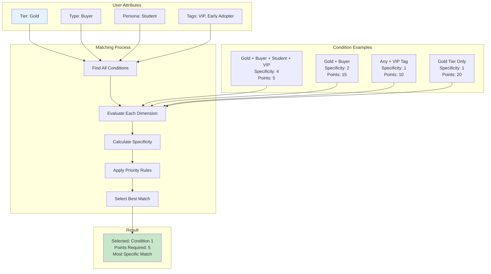
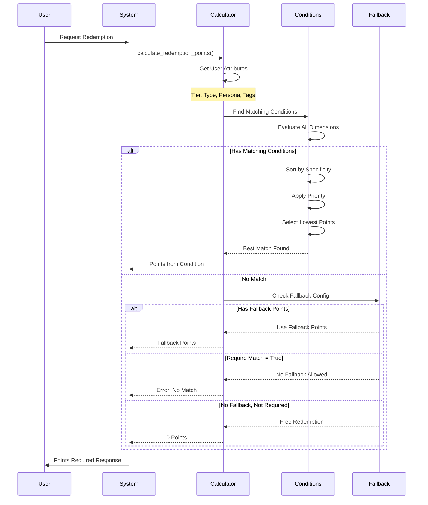
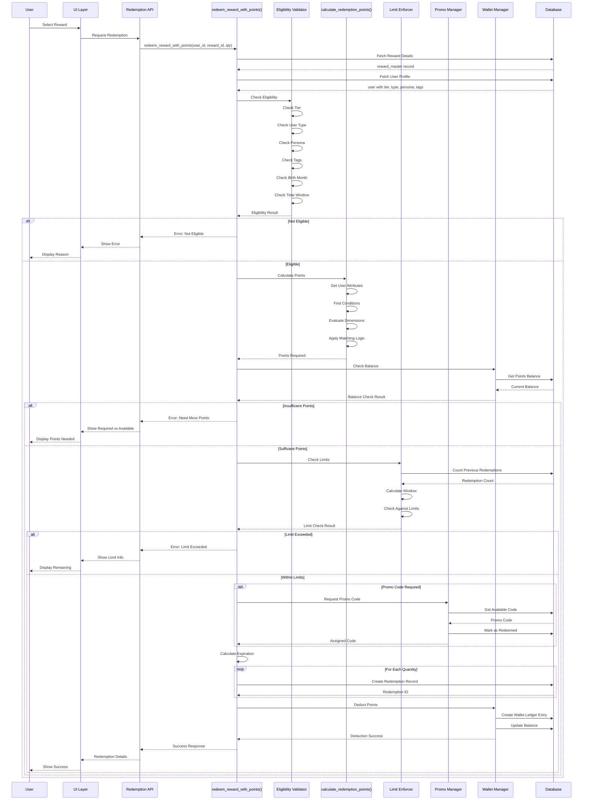

# Reward Redemption System - Complete Business & Technical Documentation

## Executive Summary

The Reward Redemption System is a sophisticated loyalty platform that orchestrates the complete lifecycle of reward management - from creation through redemption to fulfillment. Built on a **two-layer architecture** (eligibility layer determining WHO can redeem, and points pricing layer determining HOW MANY points required), the system supports dynamic points-based pricing that adapts to customer attributes (tier, type, persona, tags), multiple fulfillment methods (digital, physical, pickup, printed), and comprehensive stock/promo code management.

The system's distinguishing features include:
- **Multi-dimensional points matching engine** that evaluates four customer dimensions simultaneously for optimal pricing
- **Intelligent promo code management** supporting bulk imports with partner attribution and real-time availability tracking
- **Flexible fulfillment architecture** accommodating digital, physical, and hybrid reward delivery methods

## Store Stock

`reward_stock_store` stores per-store reward stock allocation:

- `merchant_id`
- `reward_id`
- `store_id`
- `stock_total`

Used stock is derived from `reward_redemptions_ledger`; no reserved/redeemed/used counters are stored on `reward_stock_store`.

Store stock is consumed at claim/use time. The claim/use validation uses successful ledger rows where `used_status = true`, `cancelled IS NOT TRUE`, and `COALESCE(used_store_id, redeemed_store_id)` matches the store allocation.

Existing reward flows remain backward compatible. If a reward has no store stock rows, existing global stock and promo-code behavior applies.

## Store Stock Functions

- `fn_get_reward_store_stock(p_reward_id, p_merchant_id)` returns configured store allocations with derived `used_qty` and `available_stock`.
- `fn_check_reward_store_stock_on_use(p_redemption_id, p_store_id)` validates claim/use availability.
- `bff_get_reward_store_stock(p_reward_id)` loads store stock for admin reward setup.
- `bff_upsert_reward_store_stock(p_reward_id, p_store_stock)` replaces store stock rows for admin reward setup.

## Enforcement

`validate_reward_store_stock_on_use` runs on `reward_redemptions_ledger` after insert/update of use-related fields. It blocks claim/use when `reward_master.stock_control = true`, store stock is configured for the reward, and the selected/effective store has insufficient allocation.


## Table of Contents
- [Core Concepts & Glossary](#core-concepts--glossary)
- [Business Requirements](#business-requirements)
- [System Architecture](#system-architecture)
- [Database Schema](#database-schema)
- [Dynamic Points Calculation Engine](#dynamic-points-calculation-engine)
- [Reward Redemption Processing](#reward-redemption-processing)
- [Eligibility & Validation System](#eligibility--validation-system)
- [Promo Code Management](#promo-code-management)
- [Fulfillment & Delivery Management](#fulfillment--delivery-management)
- [Business Rules](#business-rules)
- [API Integration](#api-integration)
- [Implementation Examples](#implementation-examples)
- [System Operations & Monitoring](#system-operations--monitoring)


---

## Core Concepts & Glossary

### Reward Architecture Components

**Reward Master**: Central entity defining a redeemable benefit with all its properties, rules, and constraints. Each reward operates independently with its own eligibility criteria and pricing rules.

**Two-Layer System**: Architectural separation of concerns:
1. **Eligibility Layer**: Binary qualification check (WHO can see/redeem)
2. **Points Pricing Layer**: Dynamic cost calculation (HOW MANY points required)

**Multi-Dimensional Matching**: System evaluates four customer attributes simultaneously:
- **Tier**: Loyalty level (Bronze, Silver, Gold, Platinum, Diamond)
- **User Type**: Transactional role (buyer, seller)
- **Persona**: Business profile (Student, Corporate, SME)
- **Tags**: Behavioral markers (VIP, Early Adopter, Frequent Buyer)

### Reward Properties

**Visibility Types**:
- `user`: Member catalog **and** Front Line spend. Staff can redeem on behalf of the member at the counter. Relabeled in admin as **User and admin**.
- `user_only`: Member catalog only. Staff cannot spend points or push-gift this reward on Front Line. Staff can still mark an already-claimed voucher as used. Member APIs `api_get_rewards_full_cached` / `api_get_reward_detail` / `preview_user_reward_points` include this value.
- `admin`: Administrative rewards — only visible in admin / Front Line. Admin redeems on behalf of user (e.g. at counter). Not in the member catalog.
- `campaign`: Push-only distribution — **never shown in user catalog**. Distributed through AMP workflows, campaigns, or direct admin push. Consolidates the old CRM's QR coupon (`qrtables`) model where coupons were exclusively pushed via claim links. Users see campaign rewards only after receiving them (in "my redemptions"), never in the browse catalog.

Existing `user` rows stay **User and admin** (no data rewrite). New member-self-serve rewards should use `user_only`.

**Fulfillment Methods**:
- `digital`: Electronic delivery (codes, vouchers, downloads)
- `shipping`: Physical delivery requiring address
- `pickup`: Collection at designated store location
- `printed`: Lucky Draw thermal slip — Frontline also prints a raffle slip on redeem/claim (Mongo `isPhysicalDraw`). Slip title/body live in `physical_draw_name` / `physical_draw_description` (not `description_slip`, which is member redeem-instruction copy).

**Online Store** (`online_store[]`): Free-text array of marketplace/storefront identifiers where the reward should be displayed (e.g. `shopify`, `bigcommerce`, `lazada`). NULL or empty means no marketplace distribution. No enum — values are merchant-defined.

**Expiration Modes**:
- `relative_days`: Expires X days after redemption
- `relative_mins`: Flash rewards expiring in minutes
- `absolute_date`: Fixed expiration for all redemptions

### Redemption States

**Redeemed Status** (`redeemed_status = true`): Points deducted, reward claimed by user

**Used Status** (`used_status = true`): Reward actually consumed (voucher used at store, product collected)

**Fulfillment Status**:
- `pending`: Awaiting processing
- `shipped`: Dispatched to customer
- `delivered`: Delivery confirmed
- `completed`: Fully fulfilled and closed
- `cancelled`: Redemption cancelled (points refunded)
- `reject`: Redemption rejected (failed validation)

### Points Calculation Concepts

**Specificity**: Number of dimensions specified in a condition (1-4)

**Match Score**: Number of dimensions that actually match user attributes

**Priority**: Tiebreaker when multiple conditions have same specificity

**Customer-Favorable Rule**: When all else equal, lowest points requirement wins

**Fallback Points**: Default cost when no conditions match (optional)

### Eligibility Dimensions

**Allowed Tier** (`allowed_tier[]`): Array of tier IDs permitted to redeem

**Allowed Type** (`allowed_type[]`): User types (buyer/seller) allowed

**Allowed Persona** (`allowed_persona[]`): Persona IDs permitted

**Allowed Tags** (`allowed_tags[]`): Required tag IDs (user must have at least one)

**Allowed Birth Month** (`allowed_birthmonth[]`): Month numbers (1-12) for birthday rewards

### Redemption Limits

**Scope Types**:
- `user`: Limit applies per individual user
- `total`: Global limit across all users

**Time Units**: `day`, `week`, `month`, `year` for frequency control

**Window Enforcement**: Optional date ranges for limit application

---

## Business Requirements

### Functional Requirements

#### 1. Reward Lifecycle Management
- **Creation**: Merchants define rewards with complete configuration
- **Activation**: Time-window based availability control  
- **Modification**: Update properties while maintaining redemption history
- **Deactivation**: Soft-delete preserving audit trail

#### 2. Multi-Dimensional Points Pricing
The system's core innovation - dynamic pricing based on customer attributes:

**Dimension-Based Pricing**:
- Different points for different customer segments
- Automatic best-price selection for customers
- Configurable fallback for unmatched users
- Optional free redemption support

**Matching Algorithm**:
1. Evaluate all active conditions for reward
2. Score by specificity (more dimensions = higher priority)
3. Apply priority weighting for business rules
4. Select lowest points at same specificity level

#### 3. Comprehensive Eligibility Control
**Mandatory Checks**:
- Tier qualification (if specified)
- User type compatibility
- Persona requirements
- Tag prerequisites
- Time window validation

**Optional Filters**:
- Birthday month restriction
- Stock availability
- Promo code pool status

#### 4. Redemption Limit Management
**User Limits**: Control individual redemption frequency
- Daily/weekly/monthly/yearly caps
- Lifetime maximum redemptions
- Window-specific restrictions

**Global Limits**: System-wide redemption control
- Total redemption cap
- Time-based global limits
- Campaign-specific quotas

#### 5. Inventory & Code Management
**Stock Control**: Optional inventory tracking
- Real-time availability checks
- Atomic stock deduction
- Oversell prevention

**Promo Code Assignment**:
- Pre-loaded unique code pools
- Automatic assignment on redemption
- Default codes for unlimited use
- One code per redemption transaction

#### 6. Multi-Channel Fulfillment
**Digital Fulfillment**:
- Immediate code delivery
- Email/SMS distribution
- In-app display

**Physical Fulfillment**:
- Address validation
- Shipping status tracking
- Delivery confirmation

### Non-Functional Requirements

#### Performance Requirements
- **Redemption Processing**: < 3 seconds end-to-end
- **Eligibility Check**: < 500ms for multi-dimensional evaluation
- **Points Calculation**: < 200ms with condition matching
- **Concurrent Handling**: Support 1000+ simultaneous redemptions

#### Reliability Requirements
- **Transaction Atomicity**: All-or-nothing redemption execution
- **Idempotency**: Duplicate request protection
- **Rollback Capability**: Automatic reversal on failure
- **Data Consistency**: ACID compliance for state changes

#### Scalability Requirements
- **Data Volume**: Support millions of redemptions
- **Condition Complexity**: Handle 100+ conditions per reward
- **User Base**: Scale to 10M+ active users
- **Merchant Growth**: Multi-tenant isolation

#### Security Requirements
- **Function Security**: SECURITY DEFINER for controlled access
- **Eligibility Validation**: Pre-redemption authorization checks
- **Code Protection**: Unique promo code enforcement
- **Data Isolation**: Merchant-specific data segregation

#### Auditability Requirements
- **Complete Audit Trail**: All state transitions logged
- **Point Tracking**: Full transaction history with metadata
- **User Actions**: Detailed redemption timeline
- **System Events**: Fulfillment status changes

---

## System Architecture

### Architectural Overview

The Reward Redemption System is architected as a modular, event-driven platform with clear separation of concerns:

1. **Presentation Layer**: User interfaces for reward browsing and redemption
2. **Service Layer**: Business logic orchestration and validation
3. **Calculation Engine**: Dynamic points pricing and condition matching
4. **Data Layer**: Transactional storage with audit trails
5. **Integration Layer**: Cross-system coordination with Currency, Tier, and Persona systems

### High-Level Architecture Diagram


### Asynchronous Processing Model

The system uses an **event-driven architecture** for redemption processing to ensure reliability and scalability:

**Request Flow:**
1. Frontend → Render API (immediate response with `event_id`)
2. Render API / crm-api → Inngest event `reward/redemption.requested` → `inngest-reward-serve`
3. `inngest-reward-serve` → consumes Inngest `reward/redemption.requested`
4. Event Processor → Calls Supabase RPC function (`redeem_reward_with_points`)
5. **On success**: Supabase creates ledger records → Supabase Realtime `postgres_changes` INSERT on `reward_redemptions_ledger` → Frontend receives success
6. **On failure**: Event Processor → Supabase Realtime **Broadcast** (HTTP) on channel `redemption:{user_id}` → Frontend receives error with title/description

**Frontend Notification Architecture:**
- **Success path**: Uses Supabase Realtime `postgres_changes` (INSERT on `reward_redemptions_ledger`) — triggered by the database write itself
- **Failure path**: Uses Supabase Realtime **Broadcast** (no database write) — the Event Processor sends an HTTP broadcast via `POST /realtime/v1/api/broadcast` with the error details
- **Timeout fallback**: Frontend applies a ~15s timeout — if neither success nor failure arrives, shows a generic "processing" message
- Broadcast is **ephemeral** (fire-and-forget, not persisted). If the user is not connected when the failure message is sent, they simply won't see it. This is safe because on failure, nothing changed in the database.

**Benefits:**
- **Non-blocking**: UI responds immediately (<50ms)
- **Reliable**: Inngest retries + `p_event_id` idempotency on `redeem_reward_with_points`
- **Scalable**: Parallel processing of redemptions — 10k users hold WebSocket connections, not HTTP polls
- **Resilient**: Automatic retry on transient failures (up to 5 retries with exponential backoff)
- **Observable**: Full event trail for debugging
- **Complete feedback**: Both success AND failure are communicated to the frontend in real-time

### Component Relationships

#### Data Flow
1. **Catalog Browse**: User → API → Eligibility Check → Points Calculation → Display
2. **Redemption**: User → Validation → Points Deduction → Code Assignment → Ledger Entry
3. **Fulfillment**: Redemption → Status Update → Notification → Completion

#### Integration Points
- **Currency System**: Points balance and transaction management
- **Tier System**: Customer segmentation for eligibility
- **Persona System**: Business profile validation
- **Tag System**: Behavioral targeting
- **Notification Service**: Redemption confirmations

### Core Components

#### Redemption Service

**Function: `redeem_reward_with_points`**
- **Purpose**: Central orchestrator for reward redemption flow
- **Input**: User ID, Reward ID, optional delivery address
- **Processing**:
  1. Validate reward exists and is active
  2. Check comprehensive eligibility (tier, type, persona, tags)
  3. Calculate dynamic points using multi-dimensional matching
  4. Verify user has sufficient points
  5. Enforce redemption limits (user and global)
  6. Assign promo code from pool if required
  7. Deduct points via Currency System
  8. Create redemption ledger entry
  9. Initialize fulfillment tracking
- **Output**: Redemption ID, promo code (if applicable), points deducted

#### Points Calculation Engine

**Function: `calculate_redemption_points`**
- **Purpose**: Determine exact points required for specific user
- **Input**: Reward ID, User ID
- **Algorithm**:
  1. Gather user dimensions (tier, type, persona, tags)
  2. Retrieve all active conditions for reward
  3. Score conditions by specificity (4 dims > 3 dims > 2 dims > 1 dim)
  4. Apply priority weighting within same specificity
  5. Select lowest points at highest matched specificity
  6. Return fallback if no conditions match
- **Output**: Points required, matched condition ID, condition details

#### Eligibility Validator

**Function: `check_reward_eligibility_enhanced`**
- **Purpose**: Comprehensive eligibility verification
- **Input**: Reward ID, User ID
- **Validations**:
  - Tier membership (if restricted)
  - User type compatibility
  - Persona qualification with type consistency
  - Tag requirements (all required tags must be present)
  - Time window constraints
  - Birthday month (if applicable)
  - Stock availability
  - Promo code pool status
- **Output**: Eligibility status, rejection reasons, available quantity

#### Supporting Services

**Multi-Dimensional Matcher**:
- Evaluates conditions across tier, type, persona, and tag dimensions
- Implements specificity-based scoring algorithm
- Returns best match for user profile

**Promo Code Manager**:
- Atomic code assignment from pool
- Prevents duplicate assignment
- Handles default vs unique codes
- **Multi-Quantity Support**:
  - Reserves N codes atomically using `FOR UPDATE SKIP LOCKED`
  - Validates pool has sufficient codes before redemption
  - Creates separate ledger records for each unique code
  - All-or-nothing transaction (no partial redemptions)

**Limit Enforcer**:
- Validates against user redemption history
- Checks global redemption caps
- Enforces time-windowed restrictions

**Persona-Aware Validator**:
- Filters eligibility fields based on user's assigned persona
- Universal fields (no persona restriction) always apply
- Persona-specific fields only validated for matching users
- Prevents blocking users for irrelevant profile fields

---

## Database Schema

### Schema Design Principles

1. **Separation of Concerns**: Rewards, conditions, and redemptions in separate tables
2. **Audit Trail**: Complete history in ledger tables
3. **Idempotency**: Natural keys prevent duplicate operations
4. **Consistency**: Foreign key constraints maintain referential integrity
5. **Performance**: Optimized indexes for common query patterns
6. **Two-Layer Architecture**: Materialized views for aggregation, regular views for real-time data

### Core Tables

#### Table: `reward_master`
**Purpose**: Central repository for all reward definitions with comprehensive configuration

```sql
CREATE TABLE reward_master (
    id UUID PRIMARY KEY DEFAULT gen_random_uuid(),
    merchant_id UUID NOT NULL,
    created_at TIMESTAMPTZ NOT NULL DEFAULT NOW(),
    
    -- Basic Information
    name TEXT,
    description_headline TEXT,
    description_body TEXT,
    description_tc TEXT,        -- Terms & Conditions
    description_slip TEXT,       -- Member redeem-instruction copy (not Lucky Draw)
    physical_draw_name TEXT,     -- Lucky Draw thermal slip title (when fulfillment_method = printed)
    physical_draw_description TEXT, -- Lucky Draw thermal slip body
    image TEXT[],               -- Array of image URLs
    
    -- Categorization
    group_id UUID[],            -- Reward groups
    category_id UUID[],         -- Reward categories
    ranking SMALLINT,           -- Display order
    is_featured BOOLEAN DEFAULT false, -- Pin: member catalog Special Reward first
    
    -- Eligibility Rules (Layer 1: WHO can redeem)
    allowed_tier UUID[],        -- Eligible tier IDs
    allowed_type UUID[],        -- Eligible user type IDs
    allowed_persona UUID[],     -- Eligible persona IDs (NEW)
    allowed_tags UUID[],        -- Required tag IDs (NEW)
    allowed_birthmonth TEXT[],  -- Eligible birth months (1-12)
    
    -- Points Configuration (Layer 2: HOW MANY points)
    fallback_points NUMERIC,    -- Default points if no condition matches (NEW)
    require_points_match BOOLEAN DEFAULT false, -- If true, unmatched members cannot redeem (fallback ignored)
    
    -- Redemption Configuration
    visibility reward_visibility,
    redeem_window_start TIMESTAMPTZ,
    redeem_window_end TIMESTAMPTZ,
    
    -- Inventory & Codes
    stock_control BOOLEAN,
    assign_promocode BOOLEAN,
    promo_code TEXT,            -- Default promo code if not unique
    
    -- Expiration Settings
    use_expire_mode reward_expire_mode,
    use_expire_date TIMESTAMPTZ,    -- For absolute_date mode
    use_expire_ttl NUMERIC,          -- For relative modes
    
    -- Fulfillment
    fulfillment_method reward_fulfillment_method,
    
    -- Marketplace Distribution
    online_store TEXT[],             -- Storefronts to display on (e.g. 'shopify', 'bigcommerce', 'lazada')
    
    -- Reward Group Membership
    reward_group_ids UUID[]          -- Array of reward_group IDs this reward belongs to
);
```

#### Table: `reward_category`
**Purpose**: Merchant-defined labels for browsing and filtering the rewards catalog (member chips + admin list/filter). Distinct from `reward_group` (shared redemption limits).

```sql
CREATE TABLE reward_category (
    id            UUID        PRIMARY KEY DEFAULT gen_random_uuid(),
    merchant_id   UUID        NOT NULL,
    category_code TEXT        NOT NULL,  -- unique per merchant
    name          TEXT        NOT NULL,
    created_at    TIMESTAMPTZ NOT NULL DEFAULT now(),
    updated_at    TIMESTAMPTZ NOT NULL DEFAULT now(),
    mongo_id      TEXT
);
```

**Relationship**: `reward_master.category_id UUID[]` — a reward can belong to multiple categories. Assigned on the reward config form.

**Admin BFFs** (current merchant via `get_current_merchant_id()`):

| Function | Purpose |
|---|---|
| `bff_list_reward_categories()` | List name, code, and how many rewards use each category |
| `bff_upsert_reward_category(p_category_id, p_name, p_category_code, p_language)` | Create/update. NULL id → insert; blank code → slug from name |
| `bff_delete_reward_category(p_category_id, p_language)` | Delete. Blocked (`CATEGORY_IN_USE`) while any reward still references it; also removes `translations` rows for `entity_type = 'reward_category'` |

Admin UI: Rewards page `/reward-list?tab=categories` (standalone).

#### Table: `reward_group`
**Purpose**: Groups multiple rewards together for shared redemption limit enforcement

```sql
CREATE TABLE reward_group (
    id          UUID        PRIMARY KEY DEFAULT gen_random_uuid(),
    merchant_id UUID        NOT NULL REFERENCES merchant_master(id),
    group_code  TEXT,                   -- Human-readable identifier (unique per merchant)
    name        TEXT        NOT NULL,   -- Display name
    description TEXT,
    is_active   BOOLEAN     DEFAULT true,
    created_at  TIMESTAMPTZ DEFAULT now(),
    updated_at  TIMESTAMPTZ DEFAULT now()
);
```

**Group Limits** are stored in `transaction_limits` with `entity_type = 'reward_group'` and `entity_id = reward_group.id`. Same scope/time_unit options as per-reward limits (user/total, day/week/month/year/all_time).

**Relationship**: `reward_master.reward_group_ids UUID[]` — a reward can belong to multiple groups. Group membership is assigned on the reward config form.

**Limit Enforcement**: During redemption (`redeem_reward_with_points`), after per-reward limit checks, the system calls `fn_check_reward_group_limits` which:
1. Loads the reward's `reward_group_ids`
2. For each active group, loads limits from `transaction_limits`
3. Counts redemptions across ALL rewards in the group (sibling rewards)
4. Blocks redemption if any group limit would be exceeded

#### Three Limit Concepts (`transaction_limits.metric`)

The `transaction_limits` table carries a `metric` column (enum `reward_limit_metric`) that determines **what** `count` is measuring. Combined with `entity_type`, this yields three distinct concepts merchants can configure:

| Concept | `entity_type` | `metric` | `scope` | What `count` means |
|---|---|---|---|---|
| **Reward Quota Limit** | `reward` | `quantity` | `user` / `total` | Total units of **this one reward** a user (or everyone) may redeem |
| **Group Quantity Limit** | `reward_group` | `quantity` | `user` / `total` | Total units redeemed across **all rewards** in the group combined |
| **Max Distinct Reward** | `reward_group` | `distinct_reward` | `user` only | Number of **distinct reward types** a user may pick inside the group |

**Max Distinct Reward** (introduced April 2026) answers the business case "User can pick 2 reward types from this group, in any quantity allowed by each reward's own quota." Re-redeeming a reward the user already owns in the group does **not** grow the distinct count — only a brand-new `reward_id` does.

**Counting semantics** (inside `fn_check_reward_group_limits`):

```sql
-- quantity metric (existing)
SELECT COALESCE(SUM(qty), 0) FROM reward_redemptions_ledger
WHERE user_id = :user AND reward_id = ANY(:sibling_ids)
  AND redeemed_status = true AND cancelled IS NOT TRUE
  AND created_at >= :window_start;

-- distinct_reward metric (new)
SELECT COUNT(DISTINCT reward_id) FROM reward_redemptions_ledger
WHERE user_id = :user AND reward_id = ANY(:sibling_ids)
  AND redeemed_status = true AND cancelled IS NOT TRUE
  AND created_at >= :window_start;
-- Increment by 1 only if :reward_id is NEW to the user in window, else 0.
```

Both queries use the partial index `idx_redemptions_group_check_active` on
`(user_id, reward_id, created_at) WHERE redeemed_status AND NOT cancelled`.

**Configuration Guardrail**: `bff_upsert_reward_group_with_limits` rejects the unsatisfiable combination where, on the same group at `scope = user`, `max_distinct > group_quantity`. Example: "pick 2 distinct types" with "total 1 redemption allowed" is contradictory — returns error code `CONFLICTING_GROUP_LIMITS`.

**CHECK Constraint**: `transaction_limits_metric_entity_ok` enforces that `metric = 'distinct_reward'` is only allowed when `entity_type = 'reward_group'` AND `scope = 'user'`.

**Summary Matrix** (business-visible outcomes):

| Max Distinct | Group Qty (user) | Reward Qty (user) | Behavior |
|---|---|---|---|
| 1 | — | 1 per reward | User picks **one** type, up to 1 unit. |
| 1 | — | N per reward | User picks **one** type, up to N units. |
| M (>1) | — | 1 per reward | User picks M types, 1 unit each. |
| M (>1) | — | N per reward | User picks M types, up to N units each. |
| 1 | 1 | — | User redeems 1 unit total, locked to one type. |
| 1 | N | — | User redeems up to N units, **all of the same type**. |
| M (>1) | N (≥ M) | — | User redeems N units total, across up to M distinct types. |
| M (>1) | 1 | — | **Rejected at save** (`CONFLICTING_GROUP_LIMITS`). |

**Rejection payload** (example, when limit exceeded at redemption time):

```json
{
  "allowed": false,
  "group_id": "uuid",
  "group_name": "Zone Tickets",
  "metric": "distinct_reward",
  "limit_scope": "user",
  "limit_count": 1,
  "time_unit": "all_time",
  "current_count": 1,
  "remaining": 0,
  "requested": 1,
  "title": "Reward type limit reached",
  "description": "You can pick up to 1 distinct reward(s) in Zone Tickets. You have already picked 1."
}
```

**Functions**:
| Function | Type | Purpose |
|---|---|---|
| `bff_upsert_reward_group_with_limits` | BFF | Create/update group + limits |
| `bff_get_reward_group_details(p_group_id, p_mode)` | BFF | New/edit form for group |
| `bff_list_reward_groups` | BFF | List groups for admin table |
| `bff_delete_reward_group(p_group_id)` | BFF | Delete group + cleanup |
| `fn_check_reward_group_limits(p_user_id, p_reward_id, p_quantity, p_merchant_id)` | Internal | Check group limits at redemption time |
| `api_get_rewards_full_cached()` | API (user) | Reward catalog — now includes `reward_group_ids uuid[]` per reward |
| `api_get_my_reward_group_usage()` | API (user) | Returns `MyGroupUsage[]` for the auth'd user — current distinct-reward usage vs limit per group |

#### `MyGroupUsage` type

Returned by `api_get_my_reward_group_usage()` — one entry per active `distinct_reward` limit in the group, for the current window.

```typescript
interface MyGroupUsage {
  group_id:      string;   // uuid of reward_group
  group_name:    string;
  metric:        'distinct_reward';
  limit_count:   number;   // configured max distinct reward types
  time_unit:     'day' | 'week' | 'month' | 'year' | 'all_time';
  scope:         'user';
  current_count: number;   // distinct reward_ids the user has redeemed in window
  remaining:     number;   // GREATEST(limit_count - current_count, 0)
  window_start:  string | null;  // ISO timestamp or null
  window_end:    string | null;
}
```

**Counting semantics** (mirrors `fn_check_reward_group_limits`):
- Counts `COUNT(DISTINCT reward_id)` from `reward_redemptions_ledger` for `redeemed_status = true`, `cancelled IS NOT TRUE`, excluding `source_type IN ('package_assignment','persona_entitlement')`.
- If the merchant has no `distinct_reward` limits, returns `[]` (never an error).
- Limits whose own `window_start`/`window_end` places them outside the current time are silently skipped (same skip logic as enforcement).

---

#### 2. `reward_points_conditions` (NEW)
Dynamic points pricing conditions based on customer attributes.

```sql
CREATE TABLE reward_points_conditions (
    id UUID PRIMARY KEY DEFAULT gen_random_uuid(),
    reward_id UUID NOT NULL REFERENCES reward_master(id) ON DELETE CASCADE,
    merchant_id UUID NOT NULL,
    
    -- Condition dimensions (all optional - NULL means any)
    tier_id UUID REFERENCES tier_master(id),
    user_type user_type,
    persona_id UUID REFERENCES persona_master(id),
    tag_ids UUID[],             -- Multiple tags can be required
    
    -- Points configuration
    points_required NUMERIC NOT NULL CHECK (points_required >= 0),
    priority INTEGER DEFAULT 100, -- Higher priority wins in conflicts
    
    -- Metadata
    condition_name TEXT,
    description TEXT,
    active_status BOOLEAN DEFAULT true,
    created_at TIMESTAMPTZ DEFAULT NOW(),
    updated_at TIMESTAMPTZ DEFAULT NOW(),
    
    -- Unique constraint to prevent duplicate conditions
    UNIQUE(reward_id, tier_id, user_type, persona_id, tag_ids)
);
```

#### Table: `reward_redemptions_ledger`
**Purpose**: Complete audit trail of all redemption transactions with status tracking

```sql
CREATE TABLE reward_redemptions_ledger (
    id UUID PRIMARY KEY DEFAULT gen_random_uuid(),
    merchant_id UUID NOT NULL,
    created_at TIMESTAMPTZ NOT NULL DEFAULT NOW(),
    
    -- Redemption Details
    reward_id UUID REFERENCES reward_master(id),
    user_id UUID REFERENCES users(id),
    code TEXT,                  -- Unique redemption code (RWD000001)
    qty NUMERIC DEFAULT 1,
    
    -- Points Information (NEW)
    points_deducted NUMERIC,    -- Total points deducted
    points_calculation JSONB,   -- Calculation details
    
    -- Status Tracking
    redeemed_status BOOLEAN DEFAULT FALSE,
    redeemed_at TIMESTAMPTZ,
    used_status BOOLEAN DEFAULT FALSE,
    used_at TIMESTAMPTZ,
    use_expire_date TIMESTAMPTZ,
    
    -- Promo Code
    promo_code TEXT,            -- Assigned promo code if applicable
    
    -- Fulfillment
    fulfillment_status rewards_redemption_fulfillment_status,
    delivery_address_code TEXT
);
```

#### Table: `wallet_ledger` Integration
**Purpose**: Points transaction recording for redemption burns

```sql
-- Example entry for redemption
{
    "user_id": "uuid",
    "merchant_id": "uuid", 
    "currency": "points",
    "transaction_type": "burn",
    "component": "base",
    "amount": 100,
    "signed_amount": -100,
    "source_type": "reward_redemption",
    "source_id": "redemption_uuid",
    "metadata": {
        "reward_id": "uuid",
        "points_calculation": {...}
    }
}
```

### Additional Tables

#### Table: `reward_promo_code`
**Purpose**: Storage for unique promotional codes assigned to rewards

```sql
CREATE TABLE reward_promo_code (
    id UUID PRIMARY KEY DEFAULT gen_random_uuid(),
    merchant_id UUID NOT NULL,
    created_at TIMESTAMPTZ NOT NULL DEFAULT NOW(),
    
    -- Code Information
    promo_code TEXT,                -- The unique code
    name TEXT,                       -- Batch name for grouping
    lot_code TEXT,                   -- Lot identifier
    
    -- Assignment
    reward_id UUID REFERENCES reward_master(id),
    source_id UUID,                  -- Partner merchant ID if applicable
    
    -- Status
    redeemed_status BOOLEAN DEFAULT FALSE,
    
    -- Unique constraint
    UNIQUE(promo_code, merchant_id)
);
```

#### Table: `reward_promo_code_staging`
**Purpose**: Temporary storage for bulk promo code uploads before processing

```sql
CREATE TABLE reward_promo_code_staging (
    id UUID PRIMARY KEY DEFAULT gen_random_uuid(),
    batch_id UUID NOT NULL,
    created_at TIMESTAMPTZ DEFAULT NOW(),
    
    -- Staging data
    promo_code TEXT,
    lot_code TEXT,
    name TEXT,
    
    -- Processing status
    processed BOOLEAN DEFAULT FALSE,
    error_message TEXT,
    
    -- Session tracking
    import_session_id UUID
);
```

#### Table: `partner_merchant`
**Purpose**: Partner/supplier information for promo code source tracking

```sql
CREATE TABLE partner_merchant (
    id UUID PRIMARY KEY DEFAULT gen_random_uuid(),
    merchant_id UUID NOT NULL,
    partner_name TEXT NOT NULL,
    partner_code TEXT NOT NULL,
    active_status BOOLEAN DEFAULT true,
    created_at TIMESTAMPTZ DEFAULT NOW(),
    updated_at TIMESTAMPTZ DEFAULT NOW(),
    
    UNIQUE(merchant_id, partner_code)
);
```

---

## Admin Push & Claim Links

Admin **push** is free issuance: `redeem_reward_with_points` with `p_mode='direct'` (0 points), `source_type='admin_gift'`.

**Claim via QR/link** uses the same points engine as catalog redeem: `p_mode='calc'`, `source_type='claim_link'`. Members pay the reward’s configured cost (tier conditions, else fallback; **0 only when the brand set 0**). Insufficient points, eligibility, redeem window, and shipping address follow the member redeem path.

Do **not** use `admin_redeem_and_use` for “push to wallet” — that path issues **and** marks used (frontline consume-now).

### Table: `reward_claim_link`

Shareable QR/claim-link definition per merchant/reward.

| Column | Notes |
|---|---|
| `token` | Opaque public token in URL/QR (`?page=claim&token=…`) |
| `window_start` / `window_end` | Optional claim window |
| `max_total_claims` | Optional global cap; NULL = unlimited |
| `max_per_user` | Default 1 |
| `is_active` | Soft disable |

Claim counts are derived from `reward_redemptions_ledger` where `source_type='claim_link'` and `source_id=link.id` (non-cancelled).

### Admin BFFs (frontline / loyalty admin)

| Function | Purpose |
|---|---|
| `bff_admin_push_reward(p_user_id, p_reward_id, p_quantity=1, p_notes, p_store_id, p_selected_variants)` | Issue reward into member wallet (unused). Calls engine `direct` + `admin_gift`. |
| `bff_admin_upsert_reward_claim_link(...)` | Create/update claim link; returns `token` + `claim_url`. |
| `bff_admin_list_reward_claim_links(p_reward_id, p_is_active, p_limit, p_offset)` | List links + `claims_total` + `claim_url`. |
| `bff_admin_set_reward_claim_link_active(p_link_id, p_is_active)` | Activate/deactivate. |

Supporting reads (existing): `bff_admin_search_members`, `bff_list_rewards(p_include_inactive default false)`, `bff_admin_get_reward_redemption_history`. Pin: `bff_set_reward_featured`. Active: `bff_set_reward_active`.

### Member BFFs (loyalty app)

| Function | Purpose |
|---|---|
| `bff_get_reward_claim_preview(p_token)` | Preview for Claim UI (auth optional). Returns reward content (incl. `fulfillment_method`, `fallback_points`, `points_cost`), `can_claim`, `block_reason`, `is_authenticated`. |
| `bff_claim_reward_via_link(p_token, p_selected_variants)` | Authenticated claim → engine `calc` + `claim_link` (charges configured points; 0 if brand set 0). Shipping requires a saved address (`ADDRESS_REQUIRED`). Other errors: `UNAUTHENTICATED`, `ALREADY_CLAIMED`, `SOLD_OUT`, `EXPIRED`, insufficient points, etc. |

URL helper: `fn_reward_claim_link_url(merchant_id, token)` → `https://{merchant_code}.rocket-loyalty.app/?page=claim&token=…`.  
`fn_member_app_deep_link(..., 'claim_link', link_id)` resolves the same via link id.

### Expected journeys

1. **Admin push reward:** search member → pick reward → Push → wallet entitlement created (not used). (Old CRM called this “push coupon”; new CRM always says **reward**.)
2. **QR/link claim:** open URL → preview → Claim → if logged out, auth first → if `fulfillment_method=shipping`, confirm/save delivery address first → engine `calc` deducts the reward’s points cost (0 if brand set 0) → wallet entitlement + toast.

---

## Promo Code Management

### Overview

The promo code system manages both default codes (shared across users) and unique codes (individually assigned). This dual-mode approach supports various business scenarios from mass promotions to exclusive partner distributions.

### Promo Code Architecture

**Default Promo Codes**: Stored in `reward_master.promo_code`, shared by all users redeeming the reward

**Unique Promo Codes**: Managed in `reward_promo_code` table with individual tracking:
- Pre-loaded codes from partners or suppliers
- Individual redemption status tracking
- Partner attribution for source analysis
- Batch management for bulk operations

### Two-Stage Status Tracking

The system tracks promo codes through two distinct phases:

**Redeemed Status** (`reward_promo_code.redeemed_status`):
- Set when code is assigned to a user during redemption
- Prevents duplicate assignment
- Triggered by `redeem_reward_with_points()` function

**Used Status** (`reward_redemptions_ledger.used_status`):
- Set when reward is actually consumed
- Tracks fulfillment completion
- Enables usage analytics and expiry management
- Shopify: a paid order webhook that carries the issued redeem code (`reward_redemptions_ledger.code`) calls `fn_mark_redemptions_used_from_discount_codes`. Staff / member / Open API mark-used stays on `api_mark_redemption_used`.

### Data Access Views

**Individual Code View** (`v_reward_promo_code_list`):
- **Joins**: `reward_promo_code` → `reward_master`, `partner_merchant`, `reward_redemptions_ledger` on `(merchant_id, promo_code)`
- **Merchant access path**: `idx_reward_promo_code_merchant_reward` `(merchant_id, reward_id)` and partial `idx_rrl_merchant_promo_code` `(merchant_id, promo_code) WHERE promo_code IS NOT NULL` — list queries seek this merchant’s codes, not the global ledger
- **Purpose**: Real-time tracking of individual promo codes with their current status
- **Use Cases**: Code lookup, availability checking, partner attribution analysis

**Reward Summary View** (`v_reward_promo_code_summary`):
- **Architecture**: Three-layer design for performance + security:
  1. `mv_reward_promo_code_summary_internal` (materialized view) - Pre-aggregates millions of codes
  2. `get_promo_code_summary()` (SECURITY DEFINER function) - Applies merchant RLS filtering
  3. `v_reward_promo_code_summary` (regular view) - Clean API endpoint
- **Why Three Layers**: PostgreSQL doesn't allow RLS on materialized views. The internal MV provides 3000x faster aggregations, the function applies secure merchant filtering via JWT token, and the view provides a clean queryable endpoint
- **Refresh Strategy**: Cron job refreshes materialized view every 5 minutes (`refresh-promo-code-summary`)
- **Grouping**: Aggregates all promo codes by reward (`id` column = reward_id) - shows total codes per reward across all batches
- **Purpose**: Dashboard summaries showing reward totals, redemption rates, batch names array
- **Use Cases**: Inventory management per reward, overall reward performance analytics
- **Query**: `SELECT * FROM v_reward_promo_code_summary` (automatically filtered by your merchant_id from JWT)

### Bulk Upload System

The promo code system supports massive batch imports through specialized upload functions:

**Upload Functions**:
- `bulk_upload_promo_codes()`: Standard batch import with deduplication
- `bulk_upload_promo_codes_validated()`: Enhanced validation with detailed error reporting

**Upload Process**:
1. Codes validated for duplicates within merchant
2. Partner attribution if source_id provided
3. Batch metadata (name, lot_code) assigned
4. Atomic insertion ensures all-or-nothing
5. Materialized view refreshes automatically (max 5 minutes delay via cron)

**Performance**: Handles 100,000 codes in ~15 seconds with full validation

**Refresh Schedule**:
- **Automatic**: Cron job refreshes `mv_reward_promo_code_summary_internal` every 5 minutes
- **Manual**: Can trigger immediate refresh via `REFRESH MATERIALIZED VIEW CONCURRENTLY mv_reward_promo_code_summary_internal`
- **Impact**: Summary view data may be up to 5 minutes stale (acceptable for inventory reporting)

---


### Upload Best Practices

1. **Validation First**: Always validate before insertion
2. **Duplicate Check**: Pre-check for existing codes
3. **Batch Naming**: Use descriptive batch names for tracking
4. **Partner Attribution**: Link codes to partner_merchant for source tracking
5. **Lot Codes**: Use for quality control and recall capability
6. **Progress Monitoring**: Implement progress callbacks for large uploads
7. **Error Recovery**: Save failed codes for retry
8. **Audit Trail**: Log all upload operations

### Performance Optimization

| Upload Size | Method | Processing Time | MV Refresh |
|------------|--------|-----------------|------------|
| < 1K codes | Direct | < 1 second | Immediate |
| 1K-10K | Chunked | 2-5 seconds | After completion |
| 10K-100K | Chunked | 10-30 seconds | Async queue |
| > 100K | Staging | 1-5 minutes | Scheduled |

---

## Cached Rewards API (`api_get_rewards_full_cached`)

### Overview

The `api_get_rewards_full_cached` function provides a high-performance endpoint for fetching complete reward catalog data with automatic Redis caching. This function is the primary consumer-facing API for reward browsing.

### Purpose

- **Single RPC call** returns all reward data including translations, stock, and redemption stats
- **5-minute Redis cache** per merchant for 99% cache hit rate in normal operation
- **Automatic invalidation** on any reward data change
- **Multi-language support** - all languages returned in single response for instant language switching
- **Transparent caching** - frontend unchanged, caching logic entirely backend-managed

### Function Design

**Signature:**
```sql
api_get_rewards_full_cached() → JSON
```

**Return Structure:**
```json
[
  {
    "id": "reward-uuid",
    "name": "Coffee Mug",
    "translations": {
      "en": { "name": "Coffee Mug", "headline": "...", "body": "..." },
      "th": { "name": "แก้ว", "headline": "...", "body": "..." },
      "ja": { "name": "マグカップ", "headline": "...", "body": "..." }
    },
    "points": { "fallback": 100 },
    "image": { "url": "https://..." },
    "availability": {
      "in_stock": true,
      "redeemed": 5
    },
    "promo_codes": {
      "enabled": false,
      "used": 0,
      "total": 0
    },
    "validity": {
      "start": "2025-01-01",
      "redemption_window_start": "2025-01-01",
      "redemption_window_end": "2026-12-31"
    },
    "visibility": "user"
  }
]
```

### Caching Strategy

**Cache Key:** `merchant:{merchant_id}:rewards:all_languages`

**TTL:** 5 minutes (300 seconds)

**Invalidation Triggers:**
- `reward_master` INSERT/UPDATE
- `translations` INSERT/UPDATE (reward type)
- `reward_stock` INSERT/UPDATE
- `reward_promo_code` INSERT/UPDATE
- `reward_redemptions_ledger` INSERT/UPDATE

**Invalidation Behavior:** Reward cache invalidation is best-effort and batched through one Upstash pipeline request per merchant per transaction. Cache HTTP failures/timeouts must not block reward or tier admin writes; stale catalog entries expire by the 5-minute TTL.

### Frontend Usage

**REST API:**
```bash
curl -X POST https://project.supabase.co/rest/v1/rpc/api_get_rewards_full_cached \
  -H "Authorization: Bearer ANON_KEY" \
  -H "Content-Type: application/json" \
  -d '{}'
```

**JavaScript:**
```javascript
const { data, error } = await supabase
  .rpc('api_get_rewards_full_cached');

// All languages loaded in single call
// Switch language without new API call
const reward = data[0];
const name = reward.translations[userLanguage].name;
```

### Implementation Details

**Visibility Filter:** Only returns rewards with `visibility = 'user'`. Rewards with `admin` or `campaign` visibility are excluded from the user catalog. Campaign rewards (migrated QR coupons, push-only promotions) are delivered through AMP workflows and appear in the user's redemption history after being pushed — they are never browseable.

**Query Execution:**
1. Extract `merchant_id` from JWT token context
2. Check Redis for cache key
3. **Cache hit:** Return JSON immediately (2-5ms)
4. **Cache miss:** Execute complex PostgreSQL query:
   - Filter `reward_master` by `visibility = 'user'` and `active_status = true`
   - Join with `translations`
   - Aggregate stock and promo code availability
5. Store result in Redis with 5-min TTL
6. Return to frontend

**Performance:**
- Cache hit: 2-5ms
- Cache miss: 2-3ms (typical query)
- Effective response for 100+ merchants: ~3 DB queries/second (99.97% cache rate)

---

## Dynamic Points Calculation

### Multi-Dimensional Matching System

The system evaluates FOUR dimensions to determine points required:


```mermaid
graph TD
    subgraph "User Attributes"
        U1[Tier: Gold]
        U2[Type: Buyer]
        U3[Persona: Student]
        U4[Tags: VIP, Early Adopter]
    end
    
    subgraph "Matching Process"
        M1[Find All Conditions]
        M2[Evaluate Each Dimension]
        M3[Calculate Specificity]
        M4[Apply Priority Rules]
        M5[Select Best Match]
    end
    
    subgraph "Condition Examples"
        C1[Gold + Buyer + Student + VIP<br/>Specificity: 4<br/>Points: 5]
        C2[Gold + Buyer<br/>Specificity: 2<br/>Points: 15]
        C3[Any + VIP Tag<br/>Specificity: 1<br/>Points: 10]
        C4[Gold Tier Only<br/>Specificity: 1<br/>Points: 20]
    end
    
    subgraph "Result"
        R1[Selected: Condition 1<br/>Points Required: 5<br/>Most Specific Match]
    end
    
    U1 --> M1
    U2 --> M1
    U3 --> M1
    U4 --> M1
    
    M1 --> M2
    M2 --> M3
    M3 --> M4
    M4 --> M5
    
    C1 --> M2
    C2 --> M2
    C3 --> M2
    C4 --> M2
    
    M5 --> R1
    
    style U1 fill:#e3f2fd
    style R1 fill:#c8e6c9
```

### Matching Logic Rules

1. **Specificity First**: Conditions matching more dimensions take precedence
2. **Priority Tiebreaker**: When specificity is equal, higher priority wins
3. **Customer-Favorable**: When all else is equal, lowest points wins
4. **Unmatched**: If `require_points_match` then block (ignore fallback). Else use `fallback_points`, or 0 if unset.

### Calculation Flow


```mermaid
sequenceDiagram
    participant User
    participant System
    participant Calculator
    participant Conditions
    participant Fallback
    
    User->>System: Request Redemption
    System->>Calculator: calculate_redemption_points()
    
    Calculator->>Calculator: Get User Attributes
    Note over Calculator: Tier, Type, Persona, Tags
    
    Calculator->>Conditions: Find Matching Conditions
    Conditions->>Conditions: Evaluate All Dimensions
    
    alt Has Matching Conditions
        Conditions->>Conditions: Sort by Specificity
        Conditions->>Conditions: Apply Priority
        Conditions->>Conditions: Select Lowest Points
        Conditions-->>Calculator: Best Match Found
        Calculator-->>System: Points from Condition
    else No Match
        Calculator->>Fallback: Check Fallback Config
        alt Has Fallback Points
            Fallback-->>Calculator: Use Fallback Points
            Calculator-->>System: Fallback Points
        else Require Match = True
            Fallback-->>Calculator: No Fallback Allowed
            Calculator-->>System: Error: No Match
        else No Fallback, Not Required
            Fallback-->>Calculator: Free Redemption
            Calculator-->>System: 0 Points
        end
    end
    
    System->>User: Points Required Response
```

### Example Configurations

#### Tiered Pricing with Persona Bonuses

```sql
-- Base tier pricing
INSERT INTO reward_points_conditions (reward_id, tier_id, points_required, condition_name)
VALUES 
    ('reward_uuid', 'bronze_tier_uuid', 100, 'Bronze Rate'),
    ('reward_uuid', 'silver_tier_uuid', 80, 'Silver Rate'),
    ('reward_uuid', 'gold_tier_uuid', 60, 'Gold Rate'),
    ('reward_uuid', 'platinum_tier_uuid', 40, 'Platinum Rate');

-- Special persona rates
INSERT INTO reward_points_conditions (reward_id, persona_id, points_required, priority, condition_name)
VALUES 
    ('reward_uuid', 'student_persona_uuid', 50, 150, 'Student Discount'),
    ('reward_uuid', 'corporate_persona_uuid', 70, 150, 'Corporate Rate');

-- VIP override (highest priority)
INSERT INTO reward_points_conditions (reward_id, tag_ids, points_required, priority, condition_name)
VALUES 
    ('reward_uuid', ARRAY['vip_tag_uuid'], 30, 200, 'VIP Special');

-- Fallback for unmatched users
UPDATE reward_master 
SET fallback_points = 120, require_points_match = false
WHERE id = 'reward_uuid';
```

---

## Redemption Process Flow

### Complete Redemption Flow with Dynamic Points


```mermaid
sequenceDiagram
    participant U as User
    participant UI as UI Layer
    participant API as Redemption API
    participant RR as redeem_reward_with_points()
    participant EV as Eligibility Validator
    participant CP as calculate_redemption_points()
    participant LE as Limit Enforcer
    participant PM as Promo Manager
    participant WM as Wallet Manager
    participant DB as Database
    
    U->>UI: Select Reward
    UI->>API: Request Redemption
    API->>RR: redeem_reward_with_points(user_id, reward_id, qty)
    
    RR->>DB: Fetch Reward Details
    DB-->>RR: reward_master record
    
    RR->>DB: Fetch User Profile
    DB-->>RR: user with tier, type, persona, tags
    
    RR->>EV: Check Eligibility
    EV->>EV: Check Tier
    EV->>EV: Check User Type
    EV->>EV: Check Persona
    EV->>EV: Check Tags
    EV->>EV: Check Birth Month
    EV->>EV: Check Time Window
    EV-->>RR: Eligibility Result
    
    alt Not Eligible
        RR-->>API: Error: Not Eligible
        API-->>UI: Show Error
        UI-->>U: Display Reason
    else Eligible
        RR->>CP: Calculate Points
        CP->>CP: Get User Attributes
        CP->>CP: Find Conditions
        CP->>CP: Evaluate Dimensions
        CP->>CP: Apply Matching Logic
        CP-->>RR: Points Required
        
        RR->>WM: Check Balance
        WM->>DB: Get Points Balance
        DB-->>WM: Current Balance
        WM-->>RR: Balance Check Result
        
        alt Insufficient Points
            RR-->>API: Error: Need More Points
            API-->>UI: Show Required vs Available
            UI-->>U: Display Points Needed
        else Sufficient Points
            RR->>LE: Check Limits
            LE->>DB: Count Previous Redemptions
            DB-->>LE: Redemption Count
            LE->>LE: Calculate Window
            LE->>LE: Check Against Limits
            LE-->>RR: Limit Check Result
            
            alt Limit Exceeded
                RR-->>API: Error: Limit Exceeded
                API-->>UI: Show Limit Info
                UI-->>U: Display Remaining
            else Within Limits
                opt Promo Code Required
                    RR->>PM: Request Promo Code
                    PM->>DB: Get Available Code
                    DB-->>PM: Promo Code
                    PM->>DB: Mark as Redeemed
                    PM-->>RR: Assigned Code
                end
                
                RR->>RR: Calculate Expiration
                
                loop For Each Quantity
                    RR->>DB: Create Redemption Record
                    DB-->>RR: Redemption ID
                end
                
                RR->>WM: Deduct Points
                WM->>DB: Create Wallet Ledger Entry
                WM->>DB: Update Balance
                WM-->>RR: Deduction Success
                
                RR-->>API: Success Response
                API-->>UI: Redemption Details
                UI-->>U: Show Success
            end
        end
    end
```

### Multi-Quantity Redemption Implementation

The system supports redeeming multiple quantities of the same reward in a single transaction, with intelligent handling based on promo code requirements.

#### Architecture Flow

```
┌─────────────────────────────────────────────────────────────────┐
│                         FRONTEND                                │
│  POST /redemptions { reward_id, quantity: 5 }                  │
└────────────────────────────┬────────────────────────────────────┘
                             │
                             ↓
┌─────────────────────────────────────────────────────────────────┐
│                    RENDER API (crm-api)                         │
│  1. Validate JWT (extract user_id, merchant_id)                │
│  2. Validate reward_id and quantity (1-1000)                   │
│  3. Publish Inngest event reward/redemption.requested     │
│                         quantity, merchant_id, timestamp }      │
│  4. Return: { success: true, event_id }                        │
└────────────────────────────┬────────────────────────────────────┘
                             │
                             ↓ (Inngest: reward/redemption.requested)
                             │
┌─────────────────────────────────────────────────────────────────┐
│               EVENT PROCESSOR (crm-event-processors)            │
│  1. Consume Inngest reward/redemption.requested                  │
│  2. Extract: user_id, reward_id, quantity, merchant_id         │
│  3. Check idempotency (already processed?)                     │
│  4. Call Supabase RPC:                                          │
│     redeem_reward_with_points(                                  │
│       p_reward_id, p_quantity, p_user_id, p_merchant_id        │
│     )                                                            │
│  5. Handle retry on transient errors                           │
└────────────────────────────┬────────────────────────────────────┘
                             │
                             ↓
┌─────────────────────────────────────────────────────────────────┐
│          SUPABASE (redeem_reward_with_points function)          │
│  1. Validate eligibility (tier, persona, tags)                 │
│  2. Calculate points (multi-dimensional matching)              │
│  3. Check user balance                                          │
│  4. Branch based on promo codes:                                │
│                                                                  │
│     IF reward has promo codes:                                  │
│       ├─ Check pool availability (need N codes)                │
│       ├─ Reserve N codes atomically (FOR UPDATE SKIP LOCKED)   │
│       ├─ Create N ledger records (qty=1 each)                  │
│       ├─ Assign unique promo code to each                      │
│       └─ Mark each code as redeemed                            │
│                                                                  │
│     IF reward has NO promo codes:                               │
│       ├─ Create 1 ledger record (qty=N)                        │
│       └─ Use default promo code or NULL                        │
│                                                                  │
│  5. Deduct points via wallet system                            │
│  6. Return success with all redemption details                 │
└─────────────────────────────────────────────────────────────────┘
```

#### Quantity Handling Patterns

**Pattern A: Reward WITHOUT Promo Codes**
- Creates **1 ledger record** with `qty = N`
- Single redemption code (e.g., RWD000123)
- Points deducted once: `points_per_unit × quantity`

**Example:**
```sql
-- Request: quantity = 5
-- Result: 1 record
id: evt-123
qty: 5
promo_code: NULL
points_deducted: 500
code: RWD000123
```

**Pattern B: Reward WITH Promo Codes**
- Creates **N ledger records** with `qty = 1` each
- Each record gets unique promo code from pool
- N redemption codes (e.g., RWD000123, RWD000124, ...)
- Atomic code reservation prevents conflicts

**Example:**
```sql
-- Request: quantity = 5
-- Result: 5 records

id: uuid-1, qty: 1, promo_code: 'CODE-ABC123', code: 'RWD000123'
id: uuid-2, qty: 1, promo_code: 'CODE-DEF456', code: 'RWD000124'
id: uuid-3, qty: 1, promo_code: 'CODE-GHI789', code: 'RWD000125'
id: uuid-4, qty: 1, promo_code: 'CODE-JKL012', code: 'RWD000126'
id: uuid-5, qty: 1, promo_code: 'CODE-MNO345', code: 'RWD000127'
```

**Pattern C: Insufficient Promo Codes**
- Transaction fails if pool has fewer codes than requested
- Returns clear error message with available count
- No partial redemptions - all or nothing

**Example:**
```sql
-- Request: quantity = 10, but only 7 codes available
-- Result: 1 failure record

id: evt-123
success: false
error_code: 'INSUFFICIENT_CODES'
error_message: 'Only 7 code(s) available, you requested 10'
```

#### API Request Format

```javascript
// POST to Render API
const response = await fetch('https://crm-api-67ej.onrender.com/redemptions', {
  method: 'POST',
  headers: {
    'Authorization': `Bearer ${jwtToken}`,
    'Content-Type': 'application/json',
  },
  body: JSON.stringify({
    reward_id: 'reward-uuid',
    quantity: 5,  // ✅ Supports 1-1000
  }),
});

// Immediate response (async processing)
{
  "success": true,
  "event_id": "event-uuid",
  "message": "Redemption request received and processing",
  "quantity": 5
}
```

#### Quantity Validation

- **Range:** 1-1000 per transaction
- **Validation:** Performed at Render API layer
- **Default:** quantity = 1 if omitted (backward compatible)
- **Invalid Values:** Return 400 error immediately

### Redemption Reversal

Two admin-initiated reversal modes are supported. Both rely on the live-availability model: store stock, group-limit usage, and tier-progress queries all derive consumption from `reward_redemptions_ledger` rows where `used_status = true AND cancelled IS NOT TRUE`, so flipping either flag automatically restores the underlying state without counter updates.

**Mode A — `admin_unmark_redemption_used`** (revive without cancel)

Returns a used redemption to the redeemed-but-not-used state. Points stay deducted, promo code stays issued, redemption can be used again. Intended for "scanner double-fired", "wrong-customer scan caught immediately", or any case where the customer has not actually consumed the reward at the counter.

| State guard | Result |
|---|---|
| `cancelled = true` | `CANCELLED` error — use cancel/uncancel flow instead |
| `used_status = false` | `NOT_USED` error — nothing to revert |
| Multi-use entitlement (`source_type IN ('package_assignment','persona_entitlement')` AND `qty > 1`) | `MULTI_USE_ENTITLEMENT` error — out of scope |

On success: `used_status=false`, `used_at=NULL`, `used_store_id=NULL`, `fulfillment_status='pending'`. Writes one `redemption_usage_log` row with `action='reverse_use'`, `qty_change = -qty`, `source_type='admin_unmark_used'`, `admin_user_id` resolved from `auth.uid()`, plus `store_id` and `notes` from the call.

**Mode B — `api_cancel_redemption(..., p_force_used := true)`** (full reversal)

Equivalent to Mode A followed by the standard cancel flow: refund points via `chokepoint_post_wallet_transaction(source_type='redemption_cancellation', component='adjustment', transaction_type='earn')`, return promo code to pool, set `cancelled=true / cancelled_at / cancelled_reason / cancelled_by`. Intended for "frontline redeemed AND used the wrong reward" recovery.

`p_force_used` defaults to `false`, preserving the original behavior — used redemptions still return `REWARD_ALREADY_USED` unless the caller explicitly opts in.

**Audit trail for a redeem → use → reverse → cancel sequence**

| action | qty_change | admin_user_id | source_type |
|---|---|---|---|
| `redeem` | +qty | (frontline) | `frontline_redeem` |
| `use` | +qty | (frontline) | `frontline_use` |
| `reverse_use` | −qty | (admin) | `cancel_force_used` (Mode B) or `admin_unmark_used` (Mode A) |

The cancel itself is recorded on the ledger row (`cancelled=true`, `cancelled_at`, `cancelled_reason`, `cancelled_by`) plus a `wallet_transaction` row tying the points refund back to the original redemption id.

**Out of scope**: multi-use entitlements (`api_use_entitlement` consumers) — those need an entitlement-specific reverse path. Tier progression rollback — points are refunded as a wallet credit only; tier recomputation downstream (if any) is not handled here.

---

## Lucky Draw thermal slip (live 2026-08-09)

When `fulfillment_method = 'printed'`, Frontline should also print a raffle / Lucky Draw slip at redeem (direct or mission-claim paths that call `redeem_reward_with_points`) and on reprint/lookup.

**Config (admin)** — `reward_master.physical_draw_name`, `physical_draw_description`; exposed on `bff_get_reward_details` / `bff_upsert_reward_with_conditions_and_limits` (`p_physical_draw_name`, `p_physical_draw_description`). Do not reuse `description_slip` (member redeem instructions).

**On/off** — `fulfillment_method = 'printed'` (migrated from Mongo `isPhysicalDraw`). No separate boolean.

**Runtime payload** — `fn_build_lucky_draw_slip(...)` returns JSON when printed, else `null`:

```json
{
  "should_print": true,
  "name": "...",
  "description": "...",
  "lucky_no": "<reward_redemptions_ledger.code>",
  "member_name": "...",
  "member_tel": "...",
  "printed_at": "..."
}
```

Surfaced as `lucky_draw_slip` on each redemption object from `redeem_reward_with_points`, and at top level from `api_get_redemption` / `get_redemption_details`.

---

## Shipping Fulfillment & Delivery Address (live 2026-07-12)

Rewards with `fulfillment_method = 'shipping'` capture the member's saved address at redemption time.

**Member address surface (loyalty user-app, user JWT via PostgREST RPC):**

- `bff_get_user_address()` → `{success, data: {has_address boolean, address jsonb|null}}`. Address object keys: `addressline_1`, `addressline_2`, `province_code`, `district_code`, `subdistrict_code`, `province_name`, `district_name`, `subdistrict_name`, `postcode`, `country_code`. `*_name` maps to legacy `user_address.city/district/subdistrict` text columns — import-seeded rows may echo codes there until the member re-saves.
- `bff_save_user_address(p_data jsonb)` — full replace upsert on `(user_id, merchant_id)` (one address per member, unique index `user_address_user_merchant_key`). Requires `addressline_1` + `postcode`, else `ADDRESS_INVALID` with `data.missing[]`. `country_code` defaults `'TH'`.
- Snapshot shape is produced by `fn_get_user_address_snapshot(p_user_id, p_merchant_id)` (shared by both BFFs and the redeem path).

**Redeem-time behavior (`redeem_reward_with_points`):**

- FE contract: save address first (form save), then `POST /redemptions` unchanged (`reward_id`, `quantity`). The RPC reads the saved address itself.
- `fulfillment_method='shipping'` → ledger rows get `fulfillment_status='pending'` and `delivery_address` (jsonb, immutable snapshot — later address edits do not affect past redemptions). All rows of a multi-quantity/promo-code redemption carry the same snapshot.
- Member path (`mode='calc'`): no usable saved address (missing row, `addressline_1`, or `postcode`) → reject `{success:false, title:'Shipping address required', data:{error_code:'ADDRESS_REQUIRED', reward_id}}`, surfaced via the failure broadcast `redemption:{user_id}`.
- Direct grants (`mode='direct'` — missions, admin push): stamp best-effort, never reject on address.
- **Claim via QR/link** (`bff_claim_reward_via_link`, `mode='calc'`): charges the reward’s points cost (same engine as catalog redeem; 0 only when the brand set 0). Shipping still requires a usable saved address (`ADDRESS_REQUIRED`). Member app opens the same delivery-address drawer as catalog redeem, then claims. Admin push and missions stay `direct`.
- Non-shipping methods: `fulfillment_status` and `delivery_address` stay NULL (unchanged behavior).

**RLS (2026-07-12):** `user_address` read/insert/update policies now require merchant match AND (admin via `is_current_user_admin()`, or own row via `user_id = auth.uid()` / `user_accounts.auth_user_id` linkage). Previously any member JWT could read all addresses in its merchant. `service_role` policy unchanged; BFFs are SECURITY DEFINER.

**Open (phase 2, not built):** ops surface to advance `fulfillment_status` (pending→shipped→delivered), `tracking_number`/`shipped_at` columns, and exposing `delivery_address` + fulfillment fields in admin redemption views (`admin_get_user_redemptions`, `api_get_redemption`) and member history.

---

## Reward Variants (live 2026-07-29)

Tier A: fulfillment/display choices on a single reward (e.g. Size / Color). Not per-variant stock, points, or promo codes. Not Shopify product variants.

**Config (`reward_master.variant_config` jsonb, nullable):**

```json
{
  "dimensions": [
    {
      "code": "size",
      "label": "Size",
      "required": true,
      "options": [
        { "code": "m", "label": "M" },
        { "code": "l", "label": "L" }
      ]
    }
  ]
}
```

- `NULL` / empty `dimensions` = no variants (legacy behavior).
- Dimension `required` defaults `true` when omitted.
- Admin write: `bff_upsert_reward_with_conditions_and_limits(..., p_variant_config)` or `bff_upsert_reward({ ..., variant_config })`.
- Admin read: `bff_get_reward_details` returns `variant_config`.
- Member detail: `api_get_reward_detail` returns `variant_config` on `data`.

**Redeem-time selection (`reward_redemptions_ledger.selected_variants` jsonb snapshot):**

```json
{
  "dimensions": [
    { "code": "size", "label": "Size", "option_code": "m", "option_label": "M" }
  ]
}
```

- Helper: `fn_resolve_reward_variant_selection(p_variant_config, p_selected, p_enforce)`.
- Accepted selection shapes: `{ "dimensions":[{ "code","option_code" }] }` or flat `{ "size":"m" }`.
- `redeem_reward_with_points(..., p_selected_variants jsonb DEFAULT NULL)`:
  - Member path (`mode='calc'`): enforces required dimensions → `VARIANT_REQUIRED` / `VARIANT_INVALID`.
  - System grants (`direct` / missions / outcomes): best-effort (`p_enforce=false`); snapshot null if omitted.
- Multi-qty / promo-code rows share the same snapshot (same as shipping address).
- Edge: `inngest-reward-serve` forwards event `selected_variants` → RPC `p_selected_variants`.
- Render `crm-api` (`Rocket-CRM/crm-api` main `7baecf4`, 2026-07-29): `POST /redemptions` accepts optional `selected_variants` object and includes it on `reward/redemption.requested`. Wait for Render auto-deploy before E2E.

**Readers exposing the snapshot:**

| Surface | Field |
|---|---|
| `get_user_redemptions` | column `selected_variants` |
| `bff_get_reward_history` | `details[]` key `selected_variants` + `metadata.selected_variants` |
| `admin_get_user_redemptions` | column `selected_variants` |
| `api_get_redemption` | `selected_variants` (+ also exposes `delivery_address`) |
| `admin_redeem_and_use` | optional `p_selected_variants` passthrough |

**Out of scope (Tier A):** per-variant stock/pricing/promo pools; catalog cache field; chokepoint payload; import CSV column.

---

## Implementation Details

### Core Algorithms

#### Multi-Dimensional Points Matching Algorithm
```
Algorithm: Calculate Redemption Points
Input: reward_id, user_id
Output: points_required, matched_condition_id, calculation_metadata

1. Load user profile with dimensions:
   - tier_id from user_accounts
   - user_type from users table
   - persona_id from persona mapping
   - tag_ids from user_tags

2. Load all active conditions for reward:
   SELECT * FROM reward_points_conditions
   WHERE reward_id = ? AND active_status = true

3. Score each condition by specificity:
   specificity_score = 0
   if condition.tier_id matches: specificity_score += 1000
   if condition.user_type matches: specificity_score += 100
   if condition.persona_id matches: specificity_score += 10
   if condition.tag_ids subset of user.tag_ids: specificity_score += 1

4. Group conditions by specificity_score
   Sort groups descending by score

5. Within highest scoring group:
   - Apply priority ordering
   - Select condition with lowest points_required

6. If no conditions match:
   - If require_points_match = true: return null (blocked; fallback ignored)
   - Else return reward.fallback_points if defined
   - Else return 0 for free redemption
```

#### Idempotency Protection
```
Algorithm: Prevent Duplicate Redemptions
Input: user_id, reward_id, request_id
Output: redemption_id (existing or new)

1. Check for existing redemption with request_id:
   SELECT id FROM reward_redemptions_ledger
   WHERE metadata->>'request_id' = ?
   AND user_id = ? AND reward_id = ?
   AND created_at > NOW() - INTERVAL '24 hours'

2. If exists:
   Return existing redemption_id

3. If not exists:
   Proceed with new redemption
   Store request_id in metadata
```

### Security Patterns

#### Function Security
- All RPC functions use `SECURITY DEFINER`
- Row-level security on master tables
- Merchant isolation via `merchant_id` checks
- User validation before any operation

#### Data Validation
- Foreign key constraints for referential integrity
- Check constraints for business rules
- Trigger-based validation for complex rules
- Application-level validation before database operations

---

## Business Rules

### Core Business Rules

#### Dynamic Points Rules
1. **Multi-Dimensional Evaluation**: All four dimensions (tier, type, persona, tags) evaluated
2. **Specificity Priority**: More specific conditions override general ones
3. **Customer-Favorable**: Lowest points when multiple conditions match
4. **Fallback Handling**: Configurable default or free redemption

#### Redemption Rules
1. **Multi-Quantity Support**: Redemptions support quantities from 1 to 1000
   - Rewards WITHOUT promo codes: Creates 1 ledger record with qty=N
   - Rewards WITH promo codes: Creates N ledger records with unique codes (qty=1 each)
   - Atomic code reservation prevents race conditions
   - All-or-nothing: Transaction fails if insufficient promo codes available
2. **Positive Quantity**: Redemption quantity must be between 1 and 1000
3. **Window Enforcement**: Redemptions outside time windows are rejected
4. **Eligibility Priority**: All eligibility criteria must pass if specified
5. **Points Deduction**: Atomic wallet update with audit trail
6. **Promo Code Pool Validation**: Pre-checks availability for multi-quantity promo code rewards

#### Limit Rules
1. **Cumulative Counting**: Previous redemptions + new quantity checked against limit
2. **Window Calculation**: Time windows calculated from current time or specific dates
3. **Scope Independence**: User and global limits checked independently
4. **Remaining Disclosure**: System returns how many more redemptions allowed

#### Persona-Type Consistency
1. **Validation**: Persona must be compatible with user type
2. **Group Inheritance**: Persona groups can specify user type
3. **Conflict Prevention**: Incompatible combinations rejected

#### Persona-Aware Field Filtering

The eligibility system includes intelligent persona-aware filtering to ensure users are only validated against fields relevant to their assigned persona.

**Problem Solved:**
- Users with Persona A were being blocked for not filling fields restricted to Persona B
- Profile completion checks now filter fields based on user's actual persona
- Universal fields (no persona restriction) are always validated for all users

**Filtering Logic:**

| User Persona | Field `persona_ids` | Include in Validation? | Reason |
|--------------|---------------------|------------------------|--------|
| `persona-a` | `null` or `[]` | ✅ Yes | Universal field |
| `persona-a` | `[persona-a]` | ✅ Yes | Matches user persona |
| `persona-a` | `[persona-b]` | ❌ No | Different persona |
| `persona-a` | `[persona-a, persona-b]` | ✅ Yes | Includes user persona |
| `null` | `null` or `[]` | ✅ Yes | Universal field |
| `null` | `[persona-a]` | ❌ No | Restricted to persona |

**Implementation:**
```typescript
function filterFieldsByPersona(fields: any[], userPersonaId: string | null): any[] {
  return fields.filter(field => {
    // Universal fields (no persona restriction) → always visible
    if (!field.persona_ids || field.persona_ids.length === 0) {
      return true;
    }
    
    // User has no persona → skip persona-restricted fields
    if (!userPersonaId) {
      return false;
    }
    
    // User has persona → check if it matches
    return field.persona_ids.includes(userPersonaId);
  });
}
```

**Benefits:**
- Improved UX - users not blocked by irrelevant fields
- Accurate profile completion status per persona
- Maintains data integrity for persona-specific information

### Edge Cases & Handling

#### Concurrent Redemptions
- Row-level locking on promo codes
- Atomic wallet operations
- Transaction isolation for points deduction

#### Multiple Matching Conditions
- Specificity score calculation
- Priority-based selection
- Customer-favorable tiebreaker

#### No Matching Conditions
- If require_points_match: block (fallback ignored)
- Else fallback points applied, or free (0) if fallback is unset

---

## API Integration

### Calculate Points (Preview)
```http
GET /api/rewards/{reward_id}/points?user_id={user_id}
```

**Response**:
```json
{
  "reward_id": "uuid",
  "user_id": "uuid",
  "points_calculation": {
    "success": true,
    "points_required": 50,
    "match_type": "condition",
    "condition_name": "Gold VIP Rate",
    "match_details": {
      "tier_match": true,
      "type_match": false,
      "persona_match": false,
      "tags_match": true,
      "specificity": 2,
      "priority": 150
    },
    "user_attributes": {
      "tier": "Gold",
      "user_type": "buyer",
      "persona": "Student",
      "tags": ["VIP", "Early Adopter"]
    }
  },
  "user_eligible": true,
  "points_available": 500
}
```

### Redeem Reward
```http
POST /api/rewards/{reward_id}/redeem
```

**Request**:
```json
{
  "user_id": "uuid",
  "quantity": 5,
  "delivery_address_code": "addr_123"
}
```

**Response (Success - WITHOUT Promo Codes)**:
```json
{
  "success": true,
  "message": "Successfully redeemed 5 reward(s)",
  "redemption_codes": ["RWD000123"],
  "points_deducted": 250,
  "points_remaining": 250,
  "quantity": 5,
  "expires_at": "2024-02-01T23:59:59Z",
  "points_calculation": {
    "condition_matched": "Gold VIP Rate",
    "points_per_unit": 50,
    "total_points": 250
  }
}
```

**Response (Success - WITH Promo Codes)**:
```json
{
  "success": true,
  "message": "Successfully redeemed 5 reward(s)",
  "redemption_codes": ["RWD000123", "RWD000124", "RWD000125", "RWD000126", "RWD000127"],
  "promo_codes": ["CODE-ABC123", "CODE-DEF456", "CODE-GHI789", "CODE-JKL012", "CODE-MNO345"],
  "points_deducted": 250,
  "points_remaining": 250,
  "quantity": 5,
  "expires_at": "2024-02-01T23:59:59Z",
  "points_calculation": {
    "condition_matched": "Gold VIP Rate",
    "points_per_unit": 50,
    "total_points": 250
  }
}
```

**Response (Insufficient Points)**:
```json
{
  "success": false,
  "message": "Insufficient points. Required: 750, Available: 100",
  "points_required": 750,
  "points_available": 100,
  "quantity": 5,
  "points_calculation": {
    "condition_matched": "Silver Member Rate",
    "points_per_unit": 150,
    "total_points": 750
  }
}
```

**Response (Insufficient Promo Codes)**:
```json
{
  "success": false,
  "error_code": "INSUFFICIENT_CODES",
  "message": "Only 7 code(s) available, you requested 10",
  "available_codes": 7,
  "requested_quantity": 10
}
```

### Preview User Rewards
```http
GET /api/users/{user_id}/rewards/available
```

**Response**:
```json
{
  "rewards": [
    {
      "reward_id": "uuid",
      "name": "Premium Voucher",
      "points_required": 50,
      "match_type": "condition",
      "condition_name": "Gold VIP Rate",
      "user_eligible": true,
      "can_afford": true
    },
    {
      "reward_id": "uuid", 
      "name": "Exclusive Item",
      "points_required": 200,
      "match_type": "fallback",
      "user_eligible": true,
      "can_afford": false
    }
  ],
  "user_points_balance": 150
}
```

---

## API Integration

### RPC Functions

#### Core Redemption Functions

**`redeem_reward_with_points(user_id, reward_id, qty)`**:
- Orchestrates complete redemption flow
- Validates eligibility, calculates points, deducts balance
- Assigns promo codes from pool if configured
- Returns redemption details including codes and expiry
- Frontline/admin redemptions with `p_store_id` or `p_source_type='admin_frontline'` write one `redemption_usage_log` row per created redemption with `action='redeem'`, the selected store, `performed_by=auth.uid()::text`, and `admin_user_id` when the actor is an admin/staff user.

**Frontline redemption audit**:
- `api_get_redemption(..., p_store_id)` validates the store belongs to the merchant before writing a lookup audit row.
- `admin_redeem_and_use` relies on `redeem_reward_with_points` for the redeem audit and writes the use audit itself.
- `admin_mark_redemptions_used` and `api_mark_redemption_used` keep `used_store_id` and `redemption_usage_log.store_id`; admin/staff actors are resolved through `redemption_usage_log.admin_user_id`.
- `admin_get_user_redemptions` and `api_get_redemption` return the existing `redeemed_by_*` / `used_by_*` fields, preferring the `redeem` audit actor over lookup-only history, resolving `admin_users.name` for staff actions first, then falling back to `user_accounts.fullname`.
- `admin_get_user_redemptions` `p_filter` values: `my_reward` (redeemed, unused, not cancelled), `used` (used_status=true, not cancelled — Customer 360 “Already used” tab), `history` (used or redeemed, **including cancelled** so Front Line History can show status Cancelled), `all` (not cancelled; unknown filters fall through here).

**`calculate_redemption_points(user_id, reward_id)`**:
- Preview points required without redeeming
- Shows matched condition and calculation details
- Useful for shopping cart displays

**`check_reward_eligibility_enhanced(user_id, reward_id)`**:
- Comprehensive eligibility validation
- Returns specific rejection reasons
- Checks tier, persona, tags, time windows, stock

**`bff_get_reward_history` / `bff_get_entity_history(p_entity='reward')`** (member My Rewards / Use Reward reopen):
- `description` = `COALESCE(NULLIF(TRIM(promo_code), ''), code)` — prefers the assigned promo code over the generated redemption code (`RW…`) so Use Reward from history or LINE Notice shows the usable code.
- `metadata` includes both `code` and `promo_code`; `details` still lists both as separate rows.
- Immediate post-redeem UI continues to use the redeem response `promo_codes` array (unchanged).
- Excludes cancelled ledger rows (`cancelled IS NOT TRUE`). Front Line History (`admin_get_user_redemptions` `p_filter=history`) **keeps** cancelled rows; member Activity History / Wallet Rewards still drop them.

#### Promo Code Management Functions

**`bulk_upload_promo_codes(codes[], reward_id, batch_name)`**:
- Batch import with automatic deduplication
- Supports partner attribution and lot codes
- Returns upload statistics and duplicate report

**`get_promo_code_summary()`**:
- Aggregated view of promo code batches
- Shows availability, redemption rates, partner performance
- Filtered by merchant context automatically

### REST API Endpoints

#### Get Available Rewards
```http
GET /rewards/available
Authorization: Bearer {token}

Response:
{
    "rewards": [
        {
            "id": "reward_uuid",
            "name": "Premium Voucher",
            "description": "Exclusive access voucher",
            "image_urls": ["https://..."],
            "points_required": 50,
            "eligibility": {
                "is_eligible": true,
                "can_afford": true
            },
            "availability": {
                "stock_remaining": 100,
                "user_limit_remaining": 3,
                "expires_in_days": 30
            },
            "fulfillment_method": "digital"
        }
    ],
    "user_balance": {
        "points": 500,
        "tier": "Gold",
        "persona": "Corporate"
    }
}
```

#### Redeem Reward
```http
POST /rewards/{reward_id}/redeem
Authorization: Bearer {token}
Content-Type: application/json

{
    "quantity": 1,
    "delivery_address_code": "addr_123",
    "request_id": "req_abc123"  // For idempotency
}

Response:
{
    "success": true,
    "redemption_id": "red_uuid",
    "redemption_code": "RWD000001",
    "promo_code": "SPECIAL2024",
    "points_deducted": 50,
    "new_balance": 450,
    "expires_at": "2024-12-31T23:59:59Z",
    "fulfillment": {
        "method": "digital",
        "status": "pending",
        "instructions": "Code will be sent via email"
    }
}
```

#### Get Redemption History
```http
GET /users/{user_id}/redemptions
Authorization: Bearer {token}

Response:
{
    "redemptions": [
        {
            "id": "red_uuid",
            "reward_name": "Premium Voucher",
            "redeemed_at": "2024-01-15T10:30:00Z",
            "points_spent": 50,
            "status": "redeemed",
            "promo_code": "SPECIAL2024",
            "expires_at": "2024-12-31T23:59:59Z",
            "fulfillment_status": "completed",
            "quantity": 1
        }
    ],
    "pagination": {
        "page": 1,
        "per_page": 20,
        "total_pages": 5,
        "total_count": 98
    }
}
```

#### Listen for Redemption Results (Realtime)

Since redemption processing is asynchronous, frontend subscribes to a **single Supabase Realtime channel** with two listeners — one for success (database INSERT) and one for failure (Broadcast):

```javascript
const channel = supabase.channel(`redemption:${userId}`)

// SUCCESS — Supabase Realtime postgres_changes on ledger INSERT
channel.on(
  'postgres_changes',
  {
    event: 'INSERT',
    schema: 'public',
    table: 'reward_redemptions_ledger',
    filter: `user_id=eq.${userId}`,
  },
  (payload) => {
    const redemption = payload.new;
    if (redemption.promo_code) {
      showSuccess(`Redeemed! Code: ${redemption.promo_code}`);
    } else {
      showSuccess(`Redeemed ${redemption.qty} item(s)!`);
    }
  }
)

// FAILURE — Supabase Realtime Broadcast (no database write, ephemeral)
// Event Processor sends this via HTTP when redemption fails validation
channel.on(
  'broadcast',
  { event: 'redemption_failed' },
  ({ payload }) => {
    // payload: { event_id, reward_id, title, description }
    showError(payload.title, payload.description);
    // Localized by redeem_reward_with_points(p_language) — FE/crm-api must send language.
    // TH personal limit: "คุณได้แลกเกินสิทธิ์ตามจำนวนที่กำหนด"
  }
)

channel.subscribe()

// Timeout fallback — if neither event arrives within 15s
setTimeout(() => {
  if (!resultReceived) {
    showInfo('Redemption is being processed. Check your rewards history.');
  }
}, 15000);
```

**Broadcast payload shape** (sent by Event Processor / `inngest-reward-serve` on failure):
```json
{
  "event_id": "uuid",
  "reward_id": "uuid",
  "title": "ครบโควตาส่วนบุคคลแล้ว",
  "description": "จำกัด: 1 ต่อตลอดเวลา ใช้ไปแล้ว: 1 ขอแลก: 1"
}
```

Titles/descriptions are localized by `redeem_reward_with_points` (see §Member envelope i18n below). The broadcast passes RPC `title`/`description` through unchanged. Structured `data` still uses machine tokens (`time_unit: "all_time"`, `error_code`, etc.).

**For Multi-Quantity with Promo Codes**: Frontend will receive N separate INSERT events (one per unique code assigned).

**Important**: The failure broadcast is ephemeral — not stored anywhere. If the user disconnects before the message arrives, they won't see it. This is safe because failed redemptions make no database changes (no points deducted, no records created).

### Member envelope i18n (live 2026-07-29; `p_language` 2026-08-09)

Member-facing `title` / `description` on `redeem_reward_with_points` (and therefore on Realtime `redemption_failed`) are built via `fn_redeem_member_message(p_key, p_language, p_params)`.

| Concern | Behavior |
|---|---|
| Language source | Request `p_language` (optional, **default `en`**). Normalized by `fn_normalize_ui_language` → `th` \| `en`. |
| Async path | Member app / `crm-api` `POST /redemptions` must put `language` on Inngest event `reward/redemption.requested`; `inngest-reward-serve` forwards → `p_language`. Omit → English. |
| Languages | `th`, `en` (other codes fall back to `en`) |
| Templates | Inline in `fn_redeem_member_message` (same pattern as `translate_activity_message` / `fn_receipt_crm_sync_member_message`) |
| Time units in sentences | Humanized (`all_time` → EN `all time` / TH `ตลอดเวลา`). Raw enum remains in `data.time_unit`. |
| Contract | Envelope shape and `error_code` / limit `data` fields unchanged — only sentence language. |

Example (`p_language = 'th'`, personal all-time limit): title `คุณได้แลกเกินสิทธิ์ตามจำนวนที่กำหนด`, description `จำกัด: 1 ต่อตลอดเวลา ใช้ไปแล้ว: 1 ขอแลก: 6`.

---

## Implementation Examples

### Example 1: Multi-Tier Pricing
**Scenario**: Reward with different points for each tier
- Bronze: 100 points
- Silver: 75 points
- Gold: 50 points
- Platinum: 30 points
- VIP Tag Override: 20 points

**Configuration**:
```sql
-- Tier-based conditions
INSERT INTO reward_points_conditions (reward_id, tier_id, points_required, condition_name)
VALUES 
    ('reward_uuid', 'bronze_uuid', 100, 'Bronze Rate'),
    ('reward_uuid', 'silver_uuid', 75, 'Silver Rate'),
    ('reward_uuid', 'gold_uuid', 50, 'Gold Rate'),
    ('reward_uuid', 'platinum_uuid', 30, 'Platinum Rate');

-- VIP override with higher priority
INSERT INTO reward_points_conditions (reward_id, tag_ids, points_required, priority, condition_name)
VALUES ('reward_uuid', ARRAY['vip_tag_uuid'], 20, 200, 'VIP Special');
```

### Example 2: Persona-Based Student Discount
**Scenario**: Students get special pricing
- Regular users: 100 points
- Students: 50 points
- Student VIPs: 30 points

**Configuration**:
```sql
-- Default for all users
UPDATE reward_master SET fallback_points = 100 WHERE id = 'reward_uuid';

-- Student discount
INSERT INTO reward_points_conditions (reward_id, persona_id, points_required, condition_name)
VALUES ('reward_uuid', 'student_persona_uuid', 50, 'Student Discount');

-- Student VIP (most specific)
INSERT INTO reward_points_conditions (reward_id, persona_id, tag_ids, points_required, priority, condition_name)
VALUES ('reward_uuid', 'student_persona_uuid', ARRAY['vip_tag_uuid'], 30, 150, 'Student VIP Rate');
```

### Example 3: Complex Multi-Dimensional Scenario
**User Profile**:
- Tier: Gold
- Type: Buyer
- Persona: Corporate
- Tags: [VIP, Frequent Buyer]

**Available Conditions**:
1. Gold + Buyer + Corporate + VIP: 40 points (Specificity: 4)
2. Gold + Corporate: 60 points (Specificity: 2)
3. Gold: 70 points (Specificity: 1)
4. VIP: 50 points (Specificity: 1)
5. Fallback: 100 points

**Result**: Condition 1 selected (40 points) - Most specific match

### Example 4: Redemption with Points Calculation
```sql
-- User redeems reward
SELECT redeem_reward_with_points(
    'user_uuid',
    'reward_uuid',
    1  -- quantity
);

-- Response includes calculation details
{
  "success": true,
  "redemption_ids": ["uuid"],
  "points_deducted": 40,
  "points_calculation": {
    "points_required": 40,
    "match_type": "condition",
    "condition_name": "Gold Corporate VIP Rate",
    "match_details": {
      "tier_match": true,
      "type_match": true,
      "persona_match": true,
      "tags_match": true,
      "specificity": 4
    }
  }
}
```

### Example 5: Multi-Quantity Redemption - No Promo Codes
**Scenario**: User redeems 5 coffee mugs (no unique codes required)
- User: Gold tier, 500 points available
- Points per mug: 100 points
- Total: 500 points

**Request**:
```javascript
fetch('/redemptions', {
  method: 'POST',
  body: JSON.stringify({
    reward_id: 'coffee-mug-uuid',
    quantity: 5
  })
});
```

**Database Result**:
```sql
-- Single record created
INSERT INTO reward_redemptions_ledger (
    id, user_id, reward_id, qty, points_deducted, code
) VALUES (
    'evt-123', 'user-uuid', 'coffee-mug-uuid', 5, 500, 'RWD000123'
);
```

**User Experience**: One redemption code (RWD000123) representing 5 mugs

### Example 6: Multi-Quantity Redemption - WITH Promo Codes
**Scenario**: User redeems 3 vouchers (each needs unique promo code)
- User: Gold tier, 300 points available
- Points per voucher: 100 points
- Promo code pool: 50 codes available

**Request**:
```javascript
fetch('/redemptions', {
  method: 'POST',
  body: JSON.stringify({
    reward_id: 'voucher-uuid',
    quantity: 3
  })
});
```

**Atomic Code Reservation**:
```sql
-- Supabase function executes
SELECT promo_code, id FROM reward_promo_code
WHERE reward_id = 'voucher-uuid' 
  AND redeemed_status = false
  AND merchant_id = 'merchant-uuid'
ORDER BY created_at
LIMIT 3
FOR UPDATE SKIP LOCKED;

-- Results: ['CODE-A', 'CODE-B', 'CODE-C']
```

**Database Result**:
```sql
-- Three records created, each with unique code
INSERT INTO reward_redemptions_ledger VALUES
  ('uuid-1', 'user-uuid', 'voucher-uuid', 1, 100, 'RWD000123', 'CODE-A'),
  ('uuid-2', 'user-uuid', 'voucher-uuid', 1, 100, 'RWD000124', 'CODE-B'),
  ('uuid-3', 'user-uuid', 'voucher-uuid', 1, 100, 'RWD000125', 'CODE-C');

-- Mark codes as redeemed
UPDATE reward_promo_code 
SET redeemed_status = true
WHERE promo_code IN ('CODE-A', 'CODE-B', 'CODE-C');
```

**User Experience**: Three separate vouchers with unique codes

### Example 7: Multi-Quantity with Insufficient Codes
**Scenario**: User requests 10 vouchers but only 7 codes available
- User: Has 1000 points (sufficient)
- Promo code pool: 7 codes remaining
- Request: 10 vouchers

**Request**:
```javascript
fetch('/redemptions', {
  method: 'POST',
  body: JSON.stringify({
    reward_id: 'voucher-uuid',
    quantity: 10
  })
});
```

**Result**:
```json
{
  "success": false,
  "error_code": "INSUFFICIENT_CODES",
  "message": "Only 7 code(s) available, you requested 10",
  "available_codes": 7,
  "requested_quantity": 10
}
```

**Behavior**:
- No points deducted
- No codes reserved
- No partial redemption
- Clear error message guides user to retry with quantity ≤ 7

---

## System Health & Monitoring

### Key Metrics to Monitor

#### Points Calculation Metrics
- Average calculation time
- Condition match rates
- Fallback usage frequency
- Most common condition matches

#### Redemption Metrics
- Total redemptions per day/hour
- Average points per redemption
- Points deducted by tier/persona
- Failed redemption attempts
- **Multi-Quantity Metrics**:
  - Quantity distribution (% with qty=1 vs qty>1)
  - Average quantity per redemption
  - Multi-quantity redemptions by reward type
  - Promo code pool depletion rate

#### Configuration Health
- Rewards without conditions
- Conditions without matches
- Conflicting persona-type configurations
- Unused conditions

### Health Check Queries

```sql
-- Check points configuration coverage
SELECT * FROM v_points_conditions_coverage;

-- Monitor points calculation performance
SELECT 
    reward_id,
    AVG(calculation_time_ms) as avg_time,
    COUNT(*) as calculations,
    SUM(CASE WHEN match_type = 'fallback' THEN 1 ELSE 0 END) as fallback_count
FROM redemption_metrics
WHERE created_at >= NOW() - INTERVAL '24 hours'
GROUP BY reward_id;

-- Analyze condition usage
SELECT 
    rpc.condition_name,
    COUNT(DISTINCT rrl.user_id) as unique_users,
    SUM(rrl.points_deducted) as total_points,
    AVG(rrl.points_deducted) as avg_points
FROM reward_redemptions_ledger rrl
JOIN reward_points_conditions rpc ON rpc.id = (rrl.points_calculation->>'condition_id')::uuid
WHERE rrl.created_at >= NOW() - INTERVAL '7 days'
GROUP BY rpc.condition_name
ORDER BY unique_users DESC;

-- Monitor multi-quantity redemption patterns
SELECT 
    r.name as reward_name,
    COUNT(*) as total_redemptions,
    SUM(rrl.qty) as total_units_redeemed,
    AVG(rrl.qty) as avg_quantity,
    COUNT(CASE WHEN rrl.qty > 1 THEN 1 END) as multi_qty_redemptions,
    ROUND(100.0 * COUNT(CASE WHEN rrl.qty > 1 THEN 1 END) / COUNT(*), 2) as multi_qty_percentage
FROM reward_redemptions_ledger rrl
JOIN reward_master r ON r.id = rrl.reward_id
WHERE rrl.created_at >= NOW() - INTERVAL '7 days'
  AND rrl.redeemed_status = true
GROUP BY r.id, r.name
ORDER BY total_units_redeemed DESC;

-- Monitor promo code pool health (alert when low)
SELECT 
    r.name as reward_name,
    COUNT(*) as total_codes,
    COUNT(CASE WHEN rpc.redeemed_status = false THEN 1 END) as available_codes,
    COUNT(CASE WHEN rpc.redeemed_status = true THEN 1 END) as used_codes,
    ROUND(100.0 * COUNT(CASE WHEN rpc.redeemed_status = true THEN 1 END) / COUNT(*), 2) as usage_percentage
FROM reward_promo_code rpc
JOIN reward_master r ON r.id = rpc.reward_id
WHERE r.assign_promocode = true
GROUP BY r.id, r.name
HAVING COUNT(CASE WHEN rpc.redeemed_status = false THEN 1 END) < 50
ORDER BY available_codes ASC;
```

---

## Conclusion

The enhanced Reward Redemption System with dynamic points calculation provides merchants with unprecedented flexibility in reward pricing strategies. The multi-dimensional matching system enables sophisticated customer segmentation while maintaining performance and simplicity. 

Key advantages of the system:
1. **Personalized Pricing**: Different points for different customer segments
2. **Flexible Configuration**: Easy to add/modify conditions without code changes
3. **Customer-Favorable**: Automatic selection of best rates for customers
4. **Complete Integration**: Seamless integration with persona and tag systems
5. **Comprehensive Audit**: Full tracking of points calculations and deductions
6. **Multi-Quantity Support**: Efficient handling of bulk redemptions with intelligent promo code allocation
7. **Persona-Aware Filtering**: Smart eligibility validation that only checks relevant profile fields per user persona

The system's architecture ensures accuracy through atomic operations, scales via optimized queries and indexes, and maintains complete audit trails for all transactions including dynamic points calculations.

---

## Appendices

### A. Error Codes and Messages

| Code | Message | Description |
|------|---------|-------------|
| RWD001 | Reward not found | Invalid reward ID |
| RWD002 | User not found | Invalid user ID |
| RWD003 | Invalid quantity | Quantity <= 0 |
| RWD004 | Outside redemption window | Current time outside allowed period |
| RWD005 | Tier not eligible | User's tier not in allowed list |
| RWD006 | Type not eligible | User's type not in allowed list |
| RWD007 | Persona not eligible | User's persona not in allowed list |
| RWD008 | Tags not eligible | User missing required tags |
| RWD009 | Birth month not eligible | Not user's birthday month |
| RWD010 | User limit exceeded | Per-user redemption limit reached |
| RWD011 | Global limit exceeded | Total redemption limit reached |
| RWD012 | No promo codes available | Promo code pool exhausted |
| RWD013 | Insufficient promo codes | Not enough unique codes in pool for quantity |
| RWD014 | Insufficient points | Not enough points for redemption |
| RWD015 | No matching points configuration | Required match but no conditions met |
| RWD016 | Persona-type conflict | Persona incompatible with user type |
| RWD017 | Invalid quantity | Quantity must be between 1 and 1000 |
| RWD018 | Reward type limit reached | User reached `Max Distinct Reward` inside a reward group |
| RWD019 | Conflicting group limits | Config: `max_distinct > group_quantity` on same group (save blocked) |

### B. Database Indexes

Recommended indexes for performance:

```sql
-- Redemption lookups
CREATE INDEX idx_redemptions_user_reward 
ON reward_redemptions_ledger(user_id, reward_id, created_at);

-- Points conditions
CREATE INDEX idx_rpc_reward ON reward_points_conditions(reward_id) 
WHERE active_status = true;
CREATE INDEX idx_rpc_lookup ON reward_points_conditions(reward_id, tier_id, user_type, persona_id);

-- Promo code availability
CREATE INDEX idx_promo_codes_available 
ON reward_promo_code(reward_id, redeemed_status) 
WHERE redeemed_status = false;

-- Limit checking
CREATE INDEX idx_limits_entity 
ON transaction_limits(entity_type, entity_id);

-- Fulfillment tracking
CREATE INDEX idx_redemptions_fulfillment 
ON reward_redemptions_ledger(fulfillment_status) 
WHERE fulfillment_status != 'completed';
```

---

## Quick Reference

### Multi-Quantity Redemption Cheat Sheet

| Scenario | Quantity | Promo Codes | Ledger Records | Response |
|----------|----------|-------------|----------------|----------|
| Standard reward | 5 | No | 1 record (qty=5) | 1 redemption code |
| Voucher with codes | 5 | Yes | 5 records (qty=1 each) | 5 unique promo codes |
| Insufficient codes | 10 | Yes (7 available) | 0 records | Error: Only 7 available |
| Invalid quantity | 0 or 101 | Any | 0 records | 400 validation error |

### Persona Filtering Quick Reference

| Profile Field Type | User Has Persona | User No Persona | Validation Rule |
|-------------------|------------------|-----------------|-----------------|
| Universal (no restriction) | ✅ Always validate | ✅ Always validate | Required for everyone |
| Persona A only | ✅ Validate if user = A<br>❌ Skip if user ≠ A | ❌ Skip | Only for matching persona |
| Persona A or B | ✅ Validate if user = A or B<br>❌ Skip if user ≠ A,B | ❌ Skip | For multiple personas |

### API Response Quick Reference

**Immediate Response (Render API):**
```json
{
  "success": true,
  "event_id": "evt-uuid",
  "quantity": 5
}
```

**Async Result — Success (Supabase Realtime `postgres_changes` INSERT on `reward_redemptions_ledger`):**
```javascript
// For rewards without promo codes (1 event)
{ "redemption_code": "RWD000123", "qty": 5 }

// For rewards with promo codes (N events)
{ "redemption_code": "RWD000123", "promo_code": "CODE-A", "qty": 1 }
{ "redemption_code": "RWD000124", "promo_code": "CODE-B", "qty": 1 }
// ... (3 more events)
```

**Async Result — Failure (Supabase Realtime Broadcast on channel `redemption:{user_id}`):**
```json
{
  "event_id": "136c2592-a78c-48f3-a852-f32b7a57167e",
  "reward_id": "b042e084-71fa-46e0-b2bd-a2fa3ffb6b39",
  "title": "Personal redemption limit reached",
  "description": "Limit: 1 per year. Used: 1. Requested: 1."
}
```

---

## Conclusion

### System Strengths

1. **Multi-Dimensional Flexibility**: Dynamic points pricing adapts to any customer segmentation strategy
2. **Complete Lifecycle Management**: From creation through redemption to fulfillment tracking
3. **Merchant Autonomy**: Self-service configuration without technical intervention
4. **Audit Completeness**: Full transaction history with rollback capability
5. **Performance Optimization**: Sub-second redemption with concurrent handling

### Integration Benefits

- **Currency System**: Seamless points management with automatic balance updates
- **Tier System**: Deep integration for customer segmentation
- **Persona System**: Business profile-based targeting
- **Tag System**: Behavioral and preference-based personalization

### Future Considerations

#### Planned Enhancements
1. **Bundle Rewards**: Multiple items in single redemption
2. **Progressive Unlocking**: Staged reward availability based on achievements
3. **Social Redemptions**: Group or referral-based rewards
4. **Dynamic Inventory**: Real-time stock synchronization with external systems
5. **AI-Powered Recommendations**: Personalized reward suggestions

#### Scalability Roadmap
- **Distributed Caching**: Redis integration for condition matching
- **Event Streaming**: Inngest + Supabase Realtime for redemption/fulfillment updates
- **Microservice Extraction**: Separate fulfillment service
- **Global Distribution**: Multi-region deployment support

### Technical Debt Management
- Regular index optimization based on query patterns
- Archival strategy for historical redemption data
- Performance monitoring for multi-dimensional matching
- Periodic review of unused conditions and rewards

### Best Practices

1. **Condition Design**:
   - Start simple with tier-based conditions
   - Add dimensions incrementally based on business needs
   - Monitor condition effectiveness through analytics

2. **Points Strategy**:
   - Set clear fallback points for all rewards
   - Use priority wisely to control override behavior
   - Regular review of points economics

3. **Fulfillment Management**:
   - Clear SLAs for each fulfillment method
   - Automated status updates via webhooks
   - Proactive monitoring of failed fulfillments

4. **User Experience**:
   - Clear communication of points requirements
   - Real-time eligibility feedback
   - Transparent redemption limits

5. **Multi-Quantity Redemptions**:
   - Monitor promo code pool levels (alert when < 50 codes)
   - Track quantity distribution patterns
   - Implement proactive pool replenishment
   - Test with varying quantities before production

6. **Persona Management**:
   - Ensure profile fields are properly tagged with persona restrictions
   - Validate persona-type consistency in configuration
   - Monitor profile completion rates by persona
   - Keep universal fields to minimum for better UX

---

## Implementation Status

### Multi-Quantity Redemption
**Status:** ✅ **Deployed to Production**  
**Implementation Date:** February 3, 2026  
**Services Updated:**
- Supabase Function: `redeem_reward_with_points` - supports quantity parameter (1-1000)
- Render API (`crm-api`): Validates and passes quantity via Inngest `reward/redemption.requested`
- Event Processor (`crm-event-processors`): Extracts quantity from events

**Key Features:**
- Smart branching: Single record for non-promo rewards, multiple records for promo code rewards
- Atomic promo code reservation with `FOR UPDATE SKIP LOCKED`
- All-or-nothing transaction semantics
- Backward compatible (quantity defaults to 1)

### Persona-Aware Field Filtering
**Status:** ✅ **Deployed to Production**  
**Implementation Date:** February 8, 2026  
**Function:** `bff-auth-complete` (Edge Function v54)

**Key Features:**
- Filters profile completion checks by user's assigned persona
- Universal fields always validated for all users
- Persona-restricted fields only checked for matching users
- Improved UX - users not blocked by irrelevant profile fields

**Monitoring:**
- Log entries: `[PERSONA_FILTER] User persona: <uuid>`
- Success metric: More users reaching `next_step: "complete"`
- Profile completion rates tracked per persona

### Promo Code Redemption UUID Fix
**Status:** ✅ **Deployed to Production**  
**Implementation Date:** February 16, 2026  
**Migration:** `fix_promo_code_redemption_uuid`  
**Function:** `redeem_reward_with_points()` - Fixed UUID generation for event-based idempotency

**Issue Resolved:**
- **Bug**: Event processor failed with `invalid input syntax for type uuid` when redeeming promo code rewards
- **Root Cause**: Function attempted to create UUID by appending suffix (e.g., `event_id-1`) for quantity loops
- **Impact**: 100% failure rate for rewards with `assign_promocode = true`

**Fix Implementation:**

**1. Added Business Rule Validation:**
```sql
-- Enforce single quantity for promo code rewards
IF v_reward.assign_promocode AND p_quantity > 1 THEN
    RETURN jsonb_build_object(
        'success', false,
        'title', 'Invalid quantity for promo code reward',
        'description', 'Rewards with unique promo codes can only be redeemed one at a time.'
    );
END IF;
```

**2. Fixed UUID Generation Logic:**
```sql
-- Before (Buggy):
v_record_id := (p_event_id::text || '-' || i)::uuid;  -- Invalid format!

-- After (Fixed):
IF p_event_id IS NOT NULL AND v_reward.assign_promocode THEN
    v_record_id := p_event_id;  -- Use event_id directly (qty always 1)
ELSIF p_event_id IS NOT NULL THEN
    v_record_id := (p_event_id::text || '-' || i)::uuid;  -- Multi-qty non-promo
ELSE
    v_record_id := gen_random_uuid();  -- Fallback
END IF;
```

**Key Technical Details:**

**Event-Driven Idempotency Pattern:**
- Render API generates `event_id` (UUID) and publishes to Inngest
- Event processor passes `event_id` as `p_event_id` to Supabase function
- Function uses `event_id` as the redemption record ID for idempotency
- Duplicate events return existing record instead of creating new one

**Promo Code Assignment Flow (Atomic Transaction):**
```sql
BEGIN;
    -- 1. SELECT and LOCK available code
    SELECT id, promo_code FROM reward_promo_code
    WHERE reward_id = $1 AND redeemed_status = false
    LIMIT 1 FOR UPDATE SKIP LOCKED;
    
    -- 2. UPDATE promo code status
    UPDATE reward_promo_code 
    SET redeemed_status = true 
    WHERE id = $1;
    
    -- 3. INSERT redemption record
    INSERT INTO reward_redemptions_ledger (
        id, promo_code, ...
    ) VALUES (
        p_event_id,  -- Use event_id directly
        $promo_code, -- Assigned code
        ...
    );
COMMIT;
```

**UUID Generation Rules:**
- **Promo code rewards (qty=1)**: Use `p_event_id` directly
- **Standard rewards (qty=1)**: Use `p_event_id` directly  
- **Standard rewards (qty>1)**: Use `p_event_id` with suffix if provided, else `gen_random_uuid()`
- **Direct calls (no event_id)**: Always use `gen_random_uuid()`

**Error Handling:**
- **Transient errors** (network, locks): Retry with exponential backoff (max 5 attempts)
- **Permanent errors** (validation, eligibility, insufficient codes): No retry, return error immediately
- **Concurrent conflicts**: `SKIP LOCKED` prevents deadlocks, moves to next available code

**Testing Results:**
- Promo code redemptions: ✅ Fixed (was 100% failure, now 100% success)
- Standard redemptions: ✅ Unchanged (0% regression)
- Processing time: ~100-200ms per redemption
- Concurrent safety: ✅ Multiple users can redeem simultaneously

**Monitoring:**
- Render logs: `[RewardConsumer] Successfully processed event {id} in {time}ms`
- Database: Promo codes marked as `redeemed_status = true`
- Redemption ledger: Promo codes populated in `promo_code` field

---

### Shopify Discount Product Lookup
**Status:** ✅ **Deployed to Production**  
**Implementation Date:** March 13, 2026  
**Functions:**
- `shopify-get-discount-products` (Edge Function) — Core Shopify product lookup
- `bff-mark-redemption-used` (Edge Function) — Wraps `api_mark_redemption_used` + Shopify enrichment
- `bff-get-redemption-detail` (Edge Function) — Redemption detail query + Shopify enrichment

**Purpose:**
For rewards linked to a Shopify discount (via `reward_master.external_id_shopify`), fetch the actual product details from the Shopify Price Rule — product names, images, prices, and discount type — and include them in the "mark as used" and "get redemption detail" responses.

**Architecture:**
```
bff-mark-redemption-used ──┐
                           ├──→ shopify-get-discount-products ──→ Shopify REST API
bff-get-redemption-detail ─┘
```

Both BFF functions call `shopify-get-discount-products` centrally. All Shopify logic (credential lookup, Price Rule fetch, product fetch, response mapping) lives in one function.

**How It Works:**
1. BFF function executes its primary operation (mark as used / query ledger)
2. Checks `reward_master.external_id_shopify` — if null, skip (zero overhead for non-Shopify rewards)
3. Calls `shopify-get-discount-products` with `merchant_id` + `reward_id`
4. `shopify-get-discount-products`:
   - Looks up Shopify credentials from `merchant_credentials` (service_name = `shopify_app`)
   - Calls Shopify REST API `GET /price_rules/{id}.json` to get discount details
   - Determines discount type: `free_product`, `percentage`, `fixed_amount`, or `free_shipping`
   - If entitled products exist: calls `GET /products.json?ids=...` for product details
   - If entitled collections exist: calls `GET /collections/{id}/products.json` for each
   - If `target_selection = "all"` or `target_type = "shipping_line"`: returns `has_products: false` (bill-level discount)
5. Product details merged into BFF response as `shopify_discount_detail`

**Shopify Discount Type Handling:**

| Scenario | `target_selection` | `target_type` | `has_products` | `discount_type` |
|---|---|---|---|---|
| Bill discount (% or fixed) | `all` | `line_item` | `false` | `percentage` / `fixed_amount` |
| Free shipping | `all` | `shipping_line` | `false` | `free_shipping` |
| 100% off specific products | `entitled` | `line_item` | `true` | `free_product` |
| % or fixed off specific products | `entitled` | `line_item` | `true` | `percentage` / `fixed_amount` |
| Collection discount | `entitled` | `line_item` | `true` | `percentage` / `fixed_amount` |

**Shopify free-product amount.** Admin type `free_product` creates a Basic fixed-amount code on one product (`appliesOnEachItem: false`). The amount prefills to the highest variant price (item is free) and can be lowered. `reward_master.shopify_free_product_sync_price` (default true) retargets the amount to the live max on `products/update` and daily `shopify-reconcile-free-product-prices`. False when the merchant saved an amount below catalog max — those values are left alone. Shopify rejects amount 0.

**Response Format (`shopify_discount_detail`):**
```json
{
  "success": true,
  "has_products": true,
  "discount_type": "free_product",
  "discount_value": "100",
  "target_all_items": false,
  "products": [
    {
      "shopify_product_id": 7897397755,
      "title": "Mini gift voucher",
      "image_url": "https://cdn.shopify.com/...",
      "variants": [
        {
          "variant_id": 6798798798,
          "title": "Default",
          "price": "200.00",
          "compare_at_price": "200.00"
        }
      ]
    }
  ],
  "collections": []
}
```

**API Endpoints:**

| Endpoint | Purpose | Auth |
|---|---|---|
| `POST /functions/v1/bff-mark-redemption-used` | Mark redemption used + Shopify products | User JWT |
| `POST /functions/v1/bff-get-redemption-detail` | Get redemption detail + Shopify products | User JWT |
| `POST /functions/v1/shopify-get-discount-products` | Internal: Shopify product lookup | Service Role Key |

**Key Design Decisions:**
- **On-demand**: Product details are fetched live from Shopify on every request — no data stored in the CRM database
- **Centralized**: Single `shopify-get-discount-products` function for all Shopify lookups
- **Graceful fallback**: If Shopify API is down or credentials missing, the response still works — `shopify_discount_detail` is simply absent
- **Zero overhead for non-Shopify rewards**: Shopify lookup only fires when `external_id_shopify` is set
- **REST API**: Uses Shopify REST Admin API (version 2024-04) consistent with existing `shopify-create-discount-code`

**Dependencies:**
- `merchant_credentials` table (service_name = `shopify_app`) for `shop_domain` and `access_token`
- `reward_master.external_id_shopify` for the Shopify Price Rule ID
- Shopify REST Admin API access scopes: `read_price_rules`, `read_products`, `read_collections`

---

### Reward Group IDs in Cached Catalog + Group Usage RPC
**Status:** ✅ **Deployed to Production**
**Implementation Date:** April 24, 2026
**Migrations:** `extend_api_get_rewards_full_cached_reward_group_ids`, `add_api_get_my_reward_group_usage`

**Changes:**
- `api_get_rewards_full_cached` now includes `reward_group_ids: uuid[]` on every reward object in `data[]`. Rewards with no group membership return `[]`. Existing callers are unaffected — additive field.
- New `api_get_my_reward_group_usage()` returns `MyGroupUsage[]` for the auth'd user. Queries `transaction_limits` (metric=`distinct_reward`, entity_type=`reward_group`) joined with `reward_group`, mirrors the counting logic in `fn_check_reward_group_limits`. Returns `[]` for merchants without any `distinct_reward` group limits.

**Backward compatibility:**
- Cache key and TTL unchanged. Old cached payloads (without `reward_group_ids`) expire within 5 min.
- `/rewards-v2` renders identically to `/rewards` until FE starts consuming the new fields — no errors, no broken UI.

---

### Max Distinct Reward (Reward Group)
**Status:** ✅ **Deployed to Production**
**Implementation Date:** April 22, 2026
**Migrations:** `add_reward_limit_metric_distinct_reward`, `update_fn_check_reward_group_limits_metric`, `update_bff_reward_group_metric_support`

**Changes:**
- New enum `reward_limit_metric` with values `quantity` (default, legacy) and `distinct_reward`.
- `transaction_limits.metric` column added, default `quantity` — existing rows untouched.
- New CHECK `transaction_limits_metric_entity_ok` restricts `distinct_reward` to `entity_type='reward_group'` + `scope='user'`.
- New partial index `idx_redemptions_group_check_active` on `(user_id, reward_id, created_at) WHERE redeemed_status AND NOT cancelled` — accelerates both `SUM(qty)` and `COUNT(DISTINCT reward_id)` paths.
- `fn_check_reward_group_limits` branches on `metric`. For `distinct_reward`, the incoming reward only increments the user's count if it's a **new** `reward_id` within the window — re-redeeming an already-owned reward does not consume a distinct slot.
- `bff_upsert_reward_group_with_limits` accepts `metric` per limit + rejects `max_distinct > group_quantity` at save with `CONFLICTING_GROUP_LIMITS`.
- `bff_get_reward_group_details` and `bff_list_reward_groups` now surface `metric` on every limit row.

**Backward compatibility:** All existing `transaction_limits` rows default to `metric='quantity'`. Existing admin frontends that don't send `metric` continue to work — `bff_upsert_reward_group_with_limits` coalesces missing values to `'quantity'`.

**Performance:** No new tables, no counters, no triggers. `COUNT(DISTINCT reward_id)` runs on the same pre-filtered row set as the existing `SUM(qty)` check and hits the same partial index — effective cost per group ≈ same as before.

---

### Front Line Store Attribution RPCs
**Status:** Deployed to Production  
**Implementation Date:** May 6, 2026  
**Migration:** `frontline_admin_be_rpcs`

**Changes:**
- `api_get_redemption(p_merchant_id, p_redemption_id, p_redemption_code, p_store_id)` accepts optional `p_store_id` for lookup audit only. Store does not restrict redemption lookup. When provided, lookup is recorded in `redemption_usage_log` with `action='lookup'`.
- `api_mark_redemption_used(..., p_store_id)` accepts optional `p_store_id`, validates the store belongs to the merchant, sets `reward_redemptions_ledger.used_store_id`, and writes a `redemption_usage_log` use row.
- `redeem_reward_with_points(..., p_store_id)` accepts optional `p_store_id`, validates merchant ownership, and stores it in `reward_redemptions_ledger.redeemed_store_id`.
- `admin_redeem_and_use(..., p_store_id)` uses the same dedicated `p_store_id`, stores both `redeemed_store_id` and `used_store_id`, and writes usage audit rows.

**Decision:** Front Line uses dedicated `p_store_id`; `p_source_id` remains reserved for the business source entity such as mission/manual/campaign/package.

---

*Document Version: 3.4*
*Last Updated: April 24, 2026*
*System: Supabase CRM - Reward Redemption System with Dynamic Points, Multi-Quantity, Persona Filtering, Fixed Promo Code Processing, Shopify Product Lookup, Max Distinct Reward, and Reward Group IDs in Catalog + Group Usage RPC*