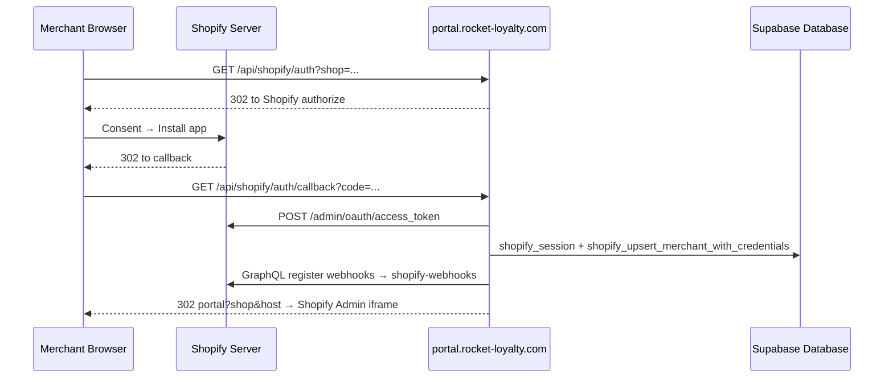
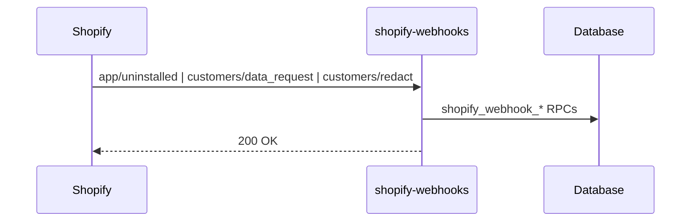
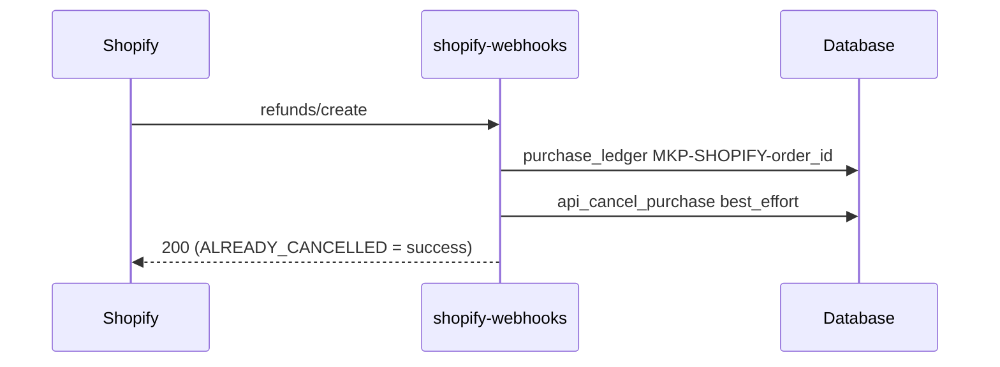
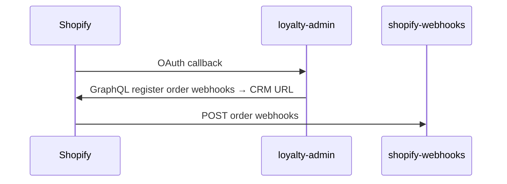

# Shopify — embedded admin, storefront packaging, and platform plumbing

Rocket loyalty for Shopify merchants: the same **loyalty-admin** portal runs standalone or inside Shopify Admin; **rewarding-shopify** ships theme/checkout extensions and the widget build; Supabase CRM holds credentials, webhooks, billing sync, and member APIs.

Owner surfaces: loyalty-admin (`portal.rocket-loyalty.com`), rewarding-shopify (Shopify app + extensions), Supabase Edge (`auth-shopify-admin`, `shopify-webhooks`, `shopify-proxy`, `shopify-extension-api`)

**Ops snapshot:** hub `docs/CURRENT_STATE.md` in `/Users/rangwan/shopify-loyalty`. **Live objects:** Supabase project `wkevmsedchftztoolkmi` (MCP). **Reference MD (referrals + on-site + integrations narrative):** [`reference/SHOPIFY_REFERRALS_ONSITE_INTEGRATIONS.md`](./reference/SHOPIFY_REFERRALS_ONSITE_INTEGRATIONS.md).

## Feature Shopify deltas (routing)

Platform plumbing stays in this file. Per-feature behaviour on Shopify lives in the domain doc as **`### Shopify`** under the spine section it changes (delta only).

| Feature | Canonical doc | Shopify subsection |
| --- | --- | --- |
| Referrals (purchase claim, share surfaces, embedded admin gating) | [`Referral.md`](./Referral.md) | Journeys › Shopify · System › Shopify |
| On-site content (widget, landing, hub, product block, wishlist, setup hub) | [`Display_Settings.md`](./Display_Settings.md) | Journeys › Shopify · System › Shopify |
| Third-party connect (Judge.me, Gorgias, Klaviyo OAuth) | [`Third_Party_Integrations.md`](./Third_Party_Integrations.md) | Journeys › Shopify · System › Shopify |
| Outbound events (webhook URL, Klaviyo profile + metrics) | [`Outbound_Integrations.md`](./Outbound_Integrations.md) | System › Shopify |
| Earn channel CMS card vs program gate | [`Earn_Channel.md`](./Earn_Channel.md) | Rules › Shopify |
| Reward (catalog, redeem, discount enrich) | [`Reward.md`](./Reward.md) | Journeys › Shopify · System › Shopify |
| Signup / storefront member identity | [`Signup_Login.md`](./Signup_Login.md) | Journeys › Shopify · System › Shopify |
| Credentials (admin JWT, member session, API key, `issueMemberSession`) | [`Authentication.md`](./Authentication.md) | Rules › Shopify · Journeys › Shopify · System › Shopify |
| Currency (earn UI, wallet, store-credit sync, refund reversal detail) | [`Currency.md`](./Currency.md) | Journeys › Shopify · System › Shopify |
| Tier (landing VIP, per-tier earn in widget, hub VIP card) | [`Tier.md`](./Tier.md) | Journeys › Shopify · System › Shopify |
| Store credit ticket | [`Store_Credit.md`](./Store_Credit.md) · [`Currency.md`](./Currency.md) | System › Shopify |
| Shared marketplace claim / ledger | [`Marketplace.md`](./Marketplace.md) | Order→points semantics; **Rules** and **System** below (thin Shopify path) |
| Platform plan feature keys (embedded gates) | [`Platform_Plan_Feature_Registry.md`](./Platform_Plan_Feature_Registry.md) | Shopify plan handles + `fn_merchant_shopify_feature_enabled` |
| Partner-neutral integration architecture | [`Third_Party_Integrations.md`](./Third_Party_Integrations.md) | Cross-channel patterns; Shopify examples in reference MD Part 3 |

---

## Concept

**Dual mode** — One admin codebase serves **standalone** merchants (email/password at the portal) and **embedded** merchants (Shopify Admin iframe). Both modes end in Supabase-compatible JWTs for the same BFF/RPC surface.

**Install vs daily use** — OAuth install runs in a **full browser window** (Shopify consent only). After install, daily merchant work is the portal UI **inside the iframe**, authenticated via App Bridge session tokens—not a second OAuth per day.

**Storefront package** — **rewarding-shopify** is the thin Shopify app shell: `shopify.app.toml`, theme embed, checkout/customer-account UI extensions, discount function, widget assets. It does not own CRM admin, OAuth, or webhook ingestion after the thin-shell cutover.

**Webhook receiver** — All Shopify server-to-server topics hit one Supabase Edge Function (`shopify-webhooks`). **loyalty-admin registers** subscriptions after OAuth; it never receives webhook POSTs.

**Marketplace order path** — Shopify orders join Shopee/Lazada/TikTok on the shared marketplace pipeline (real-time webhooks, not batch Kafka). Earn/wallet product rules live under Currency; shared claim semantics under Marketplace.

**Billing alignment** — Shopify App Pricing plans map to CRM `merchant_plan` rows and **order quotas**; feature entitlements gate embedded UI and runtime earn/burn/redeem. Volume grace/limited modes are designed for Smile-parity enforcement (see Rules).

**Member identity on storefront** — Theme widget uses **signed app proxy** at panel open; customer-account UI extensions use **Shopify session token** → `shopify-extension-api`. Both mint the same Rocket member JWT family (see Signup_Login › Shopify).

---

## Rules

- OAuth install MUST run outside the iframe; embedded auth MUST NOT redirect merchants to standalone `/login` when iframe signals are present.
- Cold Shopify install creates or attaches a merchant via `shopify_upsert_merchant_with_credentials`; **attach** intent links an existing Rocket merchant without renaming `merchant_code` or overwriting core `plan_id`. Shop already linked elsewhere → `SHOP_ALREADY_LINKED`.
- Embedded JWT MUST carry merchant context in both `user_metadata` and `app_metadata.active_merchant_id` so `get_current_merchant_id()` and BFF RPCs resolve consistently.
- Webhook POSTs MUST verify `X-Shopify-Hmac-Sha256` on the **raw body** with the merchant `api_secret`; compliance and customer topics stay synchronous; heavy order paths may fast-ack `200` and finish in `waitUntil`.
- Duplicate delivery MUST be safe: store `X-Shopify-Webhook-Id` for dedup; `ALREADY_CANCELLED` on refund reversal MUST return success so Shopify stops retrying.
- **Refunds:** subscribe to **`refunds/create` only**; any refund event triggers **full** points reversal for the order via `api_cancel_purchase` with `reverse_mode = best_effort` (no proportional partial clawback). No purchase row → no-op success with `no_purchase_found`.
- **Order earn:** claim when buyer matches and order status is claimable (default threshold **paid**); transaction number contract `MKP-SHOPIFY-<order_id>` links refunds to purchases.
- **Billing:** Shopify `plan_handle` maps to `merchant_plan.shopify_plan_handle` via `merchant_plan_assignment` (`platform_id = shopify`); do **not** mirror Shopify entitlements into `merchant_master.plan_id`.
- **Entitlements:** off-plan features are ignored at runtime while settings remain stored for upgrade/downgrade; locked UI shows Shopify plan picker (handles `free`, `essential`, `standard`, `growth`).
- **Product-linked earn:** earn rules on Shopify surface pick **live Shopify catalog** variants; rules store CRM UUIDs only after `bff_link_product_external_ref`—never raw Shopify ids on save.
- **UI hiding:** embedded surface hides standalone-only nav and settings (promo lots, Earn Studio, marketplace import on customers, etc.); lifecycle actions on Shopify are a reduced set (points award, push reward, tags)—see Journeys › Admin › Embedded surface rules.
- **Volume / limited mode (design):** when `billing_mode = limited`, new earn/redeem may pause while ledger upsert continues; exact enforcement touchpoints follow `shopify_sync_merchant_plan` + monthly order count on `order_ledger_mkp` (see System › Billing).

---

## Journeys

### Admin journey

| Knob | Effect |
| --- | --- |
| Shopify install / Connect Shopify | OAuth + credential storage + post-install webhook registration + loyalty discount activation |
| App Bridge session (embedded) | Short-lived Shopify JWT → portal token exchange → CRM JWT in memory + `Authorization` interceptor |
| Plan & billing | Shopify App Pricing ↔ `shopify_sync_merchant_plan`; Welcome `plan_handle` hint with Partner API verification |
| On-site content hub | Routes merchants to widget editor, landing CMS, hub/product/checkout setup cards (detail: Display_Settings › Shopify) |
| Integrations hub | Connect partners; points for reviews configured under Earn from activities, not on connect page (Third_Party_Integrations) |
| Entity picker (earn rules) | Shopify Resource Picker → `bff_link_product_external_ref` → CRM product/SKU ids on save |

| Page / flow | Owning repo | API |
| --- | --- | --- |
| OAuth start/callback | loyalty-admin | `/api/shopify/auth`, `/api/shopify/auth/callback` |
| Token exchange | loyalty-admin → Edge | `/api/shopify/token-exchange` → `auth-shopify-admin` |
| Embedded shell | loyalty-admin | `ShopifyEmbeddedProvider`, `AdminShellEmbedded`, App Bridge `<s-app-nav>` |
| Widget / landing CMS | loyalty-admin | Display settings routes; RPCs in Display_Settings › System |
| Referral settings (embedded) | loyalty-admin | `/referral-settings` — purchase tab + gating (Referral › Shopify) |
| Plan sync | loyalty-admin | `/welcome`, `/api/shopify/sync-plan` → `shopify-sync-plan` |

1. **Cold install** — Merchant installs from Shopify → portal OAuth → consent → callback upserts merchant + credentials → post-install registers order/customer webhooks to `shopify-webhooks` → redirect with `?shop=` & `?host=` → App Bridge enters Admin iframe.
2. **Connect existing Rocket merchant** — Integrations → Connect Shopify with `intent=attach` → callback attaches credentials to `p_target_merchant_id` → return to `/integrations` (not embedded).
3. **Daily embedded open** — Iframe loads → `idToken()` → token exchange → `setSession` → admin pages; on `SIGNED_OUT`, repeat exchange (custom refresh tokens).
4. **Cookie-free path** — `shop`/`host` in sessionStorage; middleware forwards iframe headers; same-origin fetches stamped with Bearer JWT; standalone cookies unchanged.
5. **Configure storefront** — On-site content cards deep-link to Shopify theme/checkout editors or in-app landing/widget editors (Display_Settings).
6. **Upgrade plan** — Locked feature → Shopify pricing plans URL → `/welcome` sync → entitlements refresh in embedded nav.

#### Embedded surface rules (summary)

Rewards: hide promo/settings tabs; force digital fulfillment. Earn rules: **Earn from orders** + **Earn from activities** (lifecycle picker + Judge.me row when connected); hide Earn Studio. Customers: read-only profile; hide import/export and marketplace demo card. Settings: Email-only customer notifications entry from General Settings; hide Languages and ticket types on global currency. Full matrix lived in legacy UI-HIDING audit—extend in loyalty-admin `settings-visibility.ts` when adding sections.

### Member journey

| Surface | Owning repo | API |
| --- | --- | --- |
| Theme widget (drawer) | rewarding-shopify + loyalty-user patterns | App proxy `shopify-proxy`; `api_get_widget_settings_cached('shopify')` |
| Loyalty hub / balance / order points / wishlist | rewarding-shopify UI extensions | `shopify-extension-api` (session token) |
| Points on product | Theme block | Anon widget settings + earn rate overlay (no member JWT) |
| Landing page | Theme app extension + proxy | `api_get_shopify_landing_page_cached` (Display_Settings › Shopify) |
| Referral claim (friend purchase) | Storefront | App proxy claim path (Referral › Shopify) |

1. Shopper opens widget → signed proxy → find/create member → Rocket JWT for panel (Signup_Login › Shopify).
2. Logged-in Shopify customer opens **Loyalty hub** → extension session token → hub view-model JSON (redemption polling, activity modals)—detail Display_Settings › Shopify.
3. Places order → webhooks upsert marketplace order → match user → claim points when paid (Marketplace + Currency).
4. Friend claims referral offer → unique discount code → order attributes to open claim (Referral).

---

## System

### Data model

| Object | Role |
| --- | --- |
| `shopify_session` | OAuth session row per shop install |
| `shopify_auth_nonces` | CSRF nonces for OAuth |
| `merchant_credentials` (`service_name = shopify_app`) | Offline/expiring Admin API token JSON, webhook endpoint stamp, health fields |
| `shopify_associated_user`, `shopify_online_access_info` | Staff user linkage for embedded admin |
| `shopify_subscription_state`, `shopify_plan_change_log`, `shopify_subscription_job_cursor` | Billing mirror + reconciliation cursor |
| `shopify_webhook_requests` | Delivery id audit / dedup |
| `merchant_plan` + `merchant_plan_assignment` | Shopify plan handle + order quota (not `merchant_master.plan_id`) |
| `order_ledger_mkp` | Monthly order counting (`platform = shopify`) |
| `product_sku_external_ref` | Shopify variant id ↔ CRM SKU for line-item earn resolution |
| `purchase_ledger` | `transaction_number = MKP-SHOPIFY-<order_id>` for awards and refund reversal |
| `merchant_widget_settings` | `shopify` + `shopify_hub` widget JSON (storefront + hub images) |
| `merchant_shopify_landing_page_settings` | Landing page theme/SEO/publish (sections in `display_settings` with `page = shopify_loyalty_landing`) |

Landing section shapes, enrichment, and admin RPC names: **Display_Settings** technical reference § Shopify loyalty landing—not duplicated here.

### Functions

| Name | Role |
| --- | --- |
| `shopify_upsert_merchant_with_credentials` | Install/attach merchant + credential blob |
| `shopify_resolve_merchant_id` | Shop domain → merchant (credentials first, then `merchant_code`) |
| `auth-shopify-admin` (Edge) | Verify session token, bootstrap offline token, register webhooks, mint CRM JWT |
| `shopify-register-webhooks` (Edge) | Idempotent Admin GraphQL subscription to `shopify-webhooks` URL |
| `shopify-webhooks` (Edge) | HMAC verify, topic router, marketplace + GDPR + refund paths |
| `shopify-proxy` (Edge) | Storefront signed proxy: member find/create + JWT |
| `shopify-extension-api` (Edge) | Customer account UI extension routes (hub, balance, order points, wishlist) |
| `shopify-token-refresh` (Edge) + pg_cron | Refresh expiring offline tokens; health check |
| `shopify_sync_merchant_plan` | Plan handle → assignment + subscription state |
| `shopify_apply_pending_plan_changes`, `shopify_record_pending_plan_change` | Scheduled downgrades |
| `shopify_find_or_create_member`, `shopify_webhook_*` | Customer lifecycle from webhooks |
| `upsert_marketplace_order`, `fn_match_marketplace_user`, `fn_claim_marketplace_order_service` | Shared order→points pipeline |
| `api_cancel_purchase` | Refund-driven reversal |
| `fn_merchant_shopify_feature_enabled` | Runtime entitlement gate |
| `bff_link_product_external_ref` | Shopify picker → CRM product/SKU ids |
| `admin_get_widget_settings` / `admin_upsert_widget_settings` | Widget editor (Display_Settings) |
| `trg_enqueue_shopify_store_credit_issue` | Wallet earn → `shopify-issue-store-credit` (Currency › Shopify) |

Registry: grep `REGISTRY_SUPABASE.md` / `REGISTRY_RENDER.md` for `shopify_*` and Edge names above.

### Flows

**Ownership**

| Layer | Repo | Role |
| --- | --- | --- |
| Embedded + standalone admin | `loyalty-admin` | OAuth, token exchange, embedded UI, billing UI, display editors |
| Storefront extensions + widget build | `rewarding-shopify` | `shopify.app.toml`, extensions, widget-builder |
| CRM runtime | Supabase MCP | Sessions, webhooks, proxy, RPCs, RLS |

**URL ownership**

| URL | Owner |
| --- | --- |
| `portal.rocket-loyalty.com/api/shopify/*` | loyalty-admin |
| `…/functions/v1/auth-shopify-admin`, `shopify-webhooks`, `shopify-proxy`, `shopify-extension-api` | Supabase CRM |
| Shopify OAuth + Admin iframe | Shopify |

**Auth contract** — FE sends `session_token`; Edge expects `shopify_admin_token` + `merchant_code`; response `access_token` / `refresh_token`. Verify App Bridge JWT with deployed `SHOPIFY_API_SECRET`; sync stale per-merchant `api_key`/`api_secret` on success.

**Webhook topic map**

| Topic | Handler |
| --- | --- |
| `customers/data_request` | `shopify_webhook_export_customer_data` |
| `customers/redact` | `shopify_webhook_redact_customer` |
| `shop/redact`, `app/uninstalled` | `shopify_webhook_deactivate_shop` |
| `customers/create` | `shopify_webhook_create_customer` (app config; avoid duplicate DEFAULT_TOPICS) |
| `customers/update` / `delete` | sync / delete member |
| `orders/*` | Marketplace upsert + claim + loyalty discount consume + reward code mark-used |
| `refunds/create` | `api_cancel_purchase` best_effort |

**Shopify order status → canonical** — `pending`/`authorized`/`partially_paid` → pending; `paid`/`fulfilled`/`partially_refunded` → completed; `refunded` → refunded; `voided`/`cancelled` → cancelled.

**Billing sync** — Welcome / `shopify-sync-plan` / hourly reconcile → `shopify_sync_merchant_plan`. Partner `activeSubscription` authoritative when configured. Plan picker: `https://admin.shopify.com/store/{store_handle}/charges/rocket-loyalty-crm/pricing_plans` (`NEXT_PUBLIC_SHOPIFY_APP_HANDLE`).

**Entitlement keys (vary by plan)** — `earn.multiplier`, `currency.multiplier_by_product`, `currency.expiry`, lifecycle `lifecycle.*`, `reward.max_active_rewards`, `reward.tier_reward_eligibility`, `tier.per_tier_earn_rate`, `tier.per_tier_burn_rate`, `tier.conditions_by_spend_orders`, `display.shopify_landing_page` — full matrix in Platform_Plan_Feature_Registry; runtime via `fn_merchant_shopify_feature_enabled`.

**rewarding-shopify target shape**

```
rewarding-shopify/
├── extensions/           # widget, discount, checkout, customer account
├── widget-builder/       # Vite → widget assets
├── shopify.app.toml      # portal URL + Supabase webhooks + app proxy apps/rewards
└── (no OAuth/Prisma admin duplicate)
```

Preferred: `application_url = https://portal.rocket-loyalty.com` (portal is iframe content). Partner Dashboard compliance webhooks → `shopify-webhooks`; app proxy subpath `rewards`, prefix `apps`.

#### Sequence diagrams

Paste into any Mermaid renderer (e.g. mermaid.live).

**Phase 1 — Installation (OAuth)**



**Phase 2 — Daily embedded auth**

```mermaid
sequenceDiagram
    participant B as Browser (iframe)
    participant AB as App Bridge
    participant V as portal
    participant EF as auth-shopify-admin
    participant DB as Database

    B->>AB: idToken()
    AB-->>B: Shopify session JWT
    B->>V: POST /api/shopify/token-exchange
    V->>EF: shopify_admin_token + merchant_code
    EF->>DB: merchant + credentials; verify HMAC; admin_users
    EF-->>V: access_token + refresh_token
    V-->>B: CRM JWT
    B->>B: supabase.auth.setSession
```

**Phase 3 — Uninstall / GDPR**



**Phase 3d — Refund → points reversal**



**loyalty-admin registers webhooks (does not receive)**



### External services

- **Shopify Admin API / GraphQL** — OAuth, webhooks, Resource Picker, App Pricing, discount/metafield reads for redemption consume path.
- **Shopify App Bridge** — Embedded nav, `idToken()`, top-window OAuth for integrations.
- **Render `crm-event-processors`** — Outbound integration workers (Klaviyo, signed webhook) fed from chokepoint outbox—see Outbound_Integrations.
- **Vercel** — loyalty-admin portal deployment.

### Known gaps

- Refund before award race: reversal no-ops if purchase row missing; reconciliation hardening not shipped.
- Phone search on Customers limited when Shopify Protected Customer Data redacts phone from Admin API/webhooks.
- Billing volume `limited` enforcement: design documented; confirm live touchpoints in `docs/CURRENT_STATE.md` before relying on pause behaviour.
- Checkout points estimate extension excluded from packaging (`loyalty-checkout-ext` not in `extension_directories`).

---

## Related

- **[`Display_Settings.md`](./Display_Settings.md)** — Widget, loyalty landing sections, hub/product/checkout setup, wishlist surfaces, enrichment pipeline.
- **[`Referral.md`](./Referral.md)** — Purchase/signup referral program, claim proxy, embedded gating, SMART attribution.
- **[`Third_Party_Integrations.md`](./Third_Party_Integrations.md)** · **[`Outbound_Integrations.md`](./Outbound_Integrations.md)** — Connect layer vs outbound events (Judge.me, Klaviyo, Gorgias).
- **[`Marketplace.md`](./Marketplace.md)** · **[`Currency.md`](./Currency.md)** — Shared order claim, wallet, store credit, earn UI on Shopify.
- **[`Authentication.md`](./Authentication.md)** — `issueMemberSession` shared with app proxy and extensions.
- **[`Multi_Channel_Product_Reference.md`](./Multi_Channel_Product_Reference.md)** — External ref linking beyond Shopify picker.
