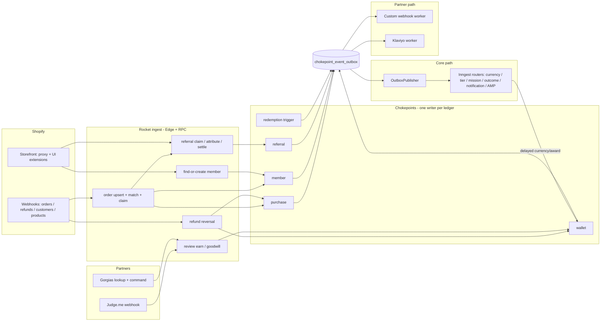
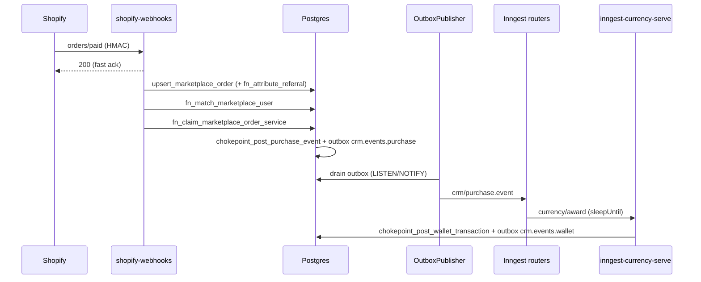
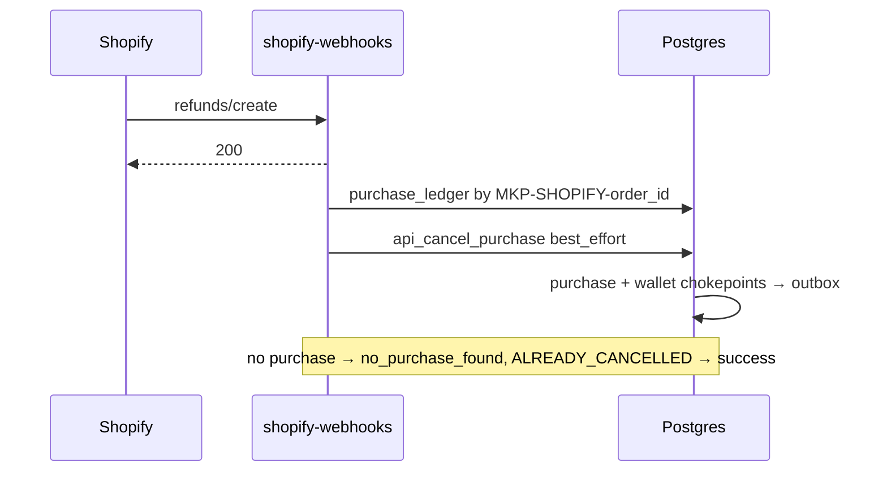
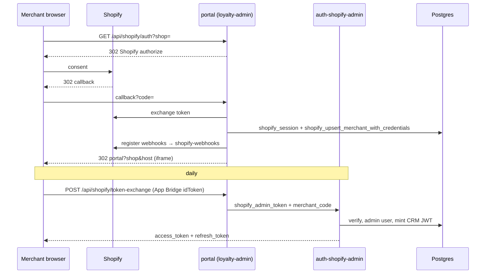
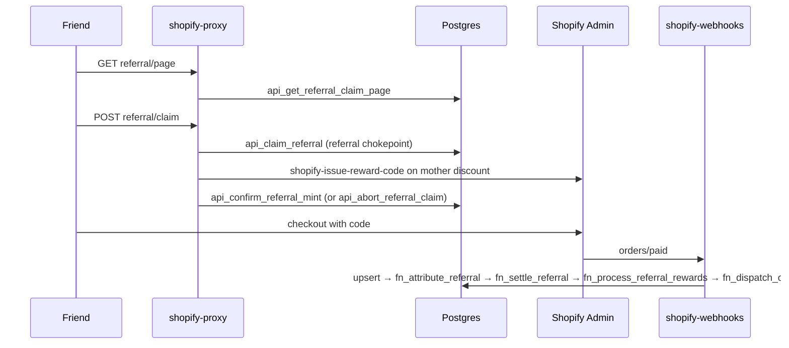
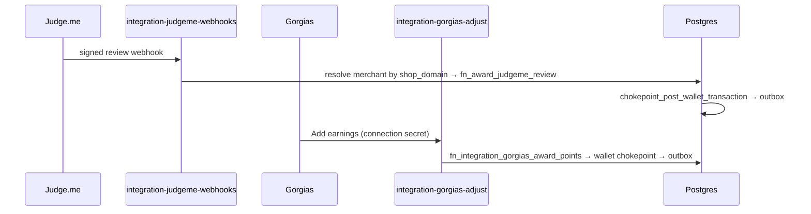
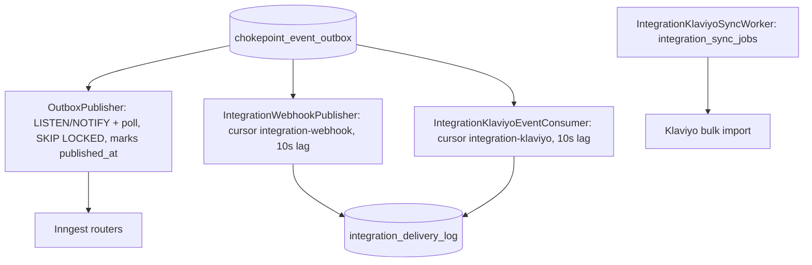

# Shopify

How Rocket loyalty plugs into Shopify end to end: app connection, embedded admin, storefront touchpoints, order ingest, commerce write-back, partner integrations (Judge.me, Stamped.io, Gorgias, Klaviyo, custom webhook), and outbound delivery. It also covers where each path hands off to the shared chokepoint and outbox engines.

Owner surfaces: loyalty-admin (`portal.rocket-loyalty.com`, standalone + Shopify Admin iframe), rewarding-shopify (Shopify app shell, theme + UI extensions, widget build), Supabase Edge (`auth-shopify-admin`, `shopify-webhooks`, `shopify-proxy`, `shopify-extension-api`, `integration-*`), Render `crm-event-processors` (outbox publishers + partner workers)

## Concept

Shopify is the brand's own online store, and in the retention journey it is the **convert** step. A shopper typically first buys on a marketplace, joins the program on LINE, and collects points, rewards, and tier there; the brand then wants the next purchase on its own store, where margin and first-party data are highest. Rocket therefore ships as a native Shopify app (listed as **1to1**), not as an order feed. An order feed only turns store orders into points, which moves value out of the store. The plugin moves value into it: whatever the member earned anywhere is visible and spendable at Shopify checkout.

**Order sync vs native plugin**: the mental model for what this integration adds.

| Group | Order sync only | Rocket plugin |
| --- | --- | --- |
| **Earn** | Store orders earn points | Same, plus store-scoped earn rules, so the store can out-earn marketplaces (e.g. 80 THB = 1 point online vs 100 THB = 1 point on Shopee) |
| **See** | Balance lives only on LINE | One balance shown inside the store: widget, landing page, account hub, points on product, points after purchase |
| **Burn** | Nothing to spend in the store | Points → checkout discount; rewards → unique Shopify codes with Apply to cart; tier-only rewards and per-tier earn / burn rates |
| **Refer** | None | Members invite friends to buy on the store; the referrer is paid when the friend's order qualifies |
| **Operate** | A separate CRM | The same admin, standalone or embedded in Shopify Admin |

Earn is table stakes; See and Burn are the reason for the plugin. LINE and the storefront are two front doors onto one member, one wallet, one tier, and one reward catalog. There is no Shopify-only point balance.

From install, Shopify is both a **source** of facts (orders, refunds, customers, products) and a **destination** for loyalty value (discount codes, store credit, checkout discounts). Rocket keeps all loyalty truth in the CRM. Shopify never writes a Rocket ledger directly, and Rocket never stores program truth in Shopify metafields. Every inbound fact goes through the same canonical writers that LINE, POS, and marketplace channels use, so currency, tier, missions, notifications, AMP, and partner integrations react identically regardless of channel.

The integration is seven layers. Each depends only on the layer below it or on the shared engines:

| Layer | What it is |
| --- | --- |
| **Shop connection** | One install links a Shopify shop to one Rocket merchant: Admin API credentials, webhook subscriptions, billing plan. Can create a new merchant or attach to an existing one. |
| **Admin surface** | The same Rocket portal, standalone or embedded in Shopify Admin. Embedded mode hides standalone-only sections and swaps Rocket plan tiers for Shopify plan tiers. |
| **Storefront touchpoints** | Where shoppers see loyalty: widget drawer, loyalty landing page, customer-account Loyalty Hub, points on product, order-list balance banner, points after purchase, wishlist. All content is composed server-side from program truth at read time. |
| **Commerce ingest** | Shopify orders, refunds, and customer changes arrive as signed webhooks and join the shared marketplace order pipeline (same claim semantics as Shopee / Lazada / TikTok). |
| **Shared engines** | The chokepoint writers (purchase, wallet, member, tier, referral, redemption) and the transactional outbox. Downstream engines react to outbox events, never to Shopify directly. |
| **Commerce write-back** | Rocket pushes value into Shopify: unique reward / referral discount codes, Shopify store credit, points-to-discount checkout entitlements, free-product price sync. |
| **Partner integrations** | Merchant-connected tools in the same embedded admin: reviews (Judge.me, Stamped.io), support (Gorgias), marketing (Klaviyo), and a merchant-owned HTTPS endpoint (custom webhook). Contracts are channel-agnostic: LINE-only merchants use the same partner and outbound paths. |

**Nouns**

- **Shop connection**: the credential row that says "this shop belongs to this merchant." Everything else resolves merchant from the verified shop, never from a request body.
- **Embedded session**: the short-lived Shopify token the iframe gets each day, exchanged for a Rocket admin session. Install uses a full-window OAuth; daily use never repeats OAuth.
- **Member identity gateway**: the only two ways a shopper becomes a signed-in Rocket member on Shopify. The signed app proxy serves theme surfaces; the verified customer-account session token serves UI extensions. Both mint the same member session server-side.
- **Touchpoint**: one storefront surface with a packaging (theme block, theme page, or UI extension), a Rocket config home, and a Shopify install step.
- **Marketplace order**: the normalized Shopify order Rocket tracks through a status ladder. It becomes a Rocket purchase only when claimed.
- **Claim threshold**: the order status at which points are earned. The default is paid; merchants can require completed, where completion comes from shopper confirmation or auto-complete N days after delivery.
- **Chokepoint**: the single function allowed to write a canonical ledger (purchase, wallet, member, tier, referral). It also writes the matching outbox row in the same transaction.
- **Outbox**: the durable event bus. Two independent readers drain it. The core publisher feeds Inngest routers (currency, tier, mission, notification, AMP). Partner workers feed the custom webhook and Klaviyo.
- **Public event**: the stable partner vocabulary (`points.earned`, `reward.redeemed`, `tier.upgraded`, …) mapped from internal outbox topics.
- **Member snapshot**: live CRM state for one member (points, tier, referral URL, expiry hints), resolved at delivery time rather than taken from the stale event body.
- **Plan entitlement**: a feature key switched on or off by the merchant's Shopify plan (Free / Essential / Standard / Growth). It is enforced inside the engines as well as in the UI.
- **Partner connection**: one merchant credential per partner, with health (disconnected / connected / degraded).

**Status** — Checkout points-estimate extension (planned; excluded from the deploy manifest). Volume-limited billing mode (design; enforcement touchpoints not confirmed live). Account link from Shopify `customers/create` (planned; handler exists but the topic is not routed). Guaranteed partner delivery with replay (not shipped).

## Rules

### Shop connection and admin auth

- OAuth install MUST run outside the iframe. Embedded auth MUST NOT redirect to standalone login when iframe signals (`shop`, `host`, App Bridge) are present.
- A cold install creates or attaches a merchant. **Attach** links an existing Rocket merchant without renaming its code or overwriting its core plan. If the shop is already linked to another merchant, the result is `SHOP_ALREADY_LINKED`.
- After a successful install, post-install registers order, refund, customer, and product webhooks to the CRM receiver and activates the loyalty discount. loyalty-admin registers webhooks but never receives them.
- The embedded admin session MUST carry merchant context in both user metadata and `app_metadata.active_merchant_id` so every BFF resolves the same merchant.
- Expiring offline Admin API tokens are refreshed every 30 minutes. Refresh failure marks the connection unhealthy; it does not delete it.
- `app/uninstalled` or `shop/redact` deactivates the shop connection. Loyalty data stays until GDPR redact topics require removal.

### Webhook ingest

- Every POST MUST verify `X-Shopify-Hmac-Sha256` on the **raw body** with the merchant's app secret before any parse or side effect. An unknown shop returns `404` on order, refund, and product topics.
- Compliance topics (`customers/data_request`, `customers/redact`, `shop/redact`, `app/uninstalled`) and customer topics (`customers/update`, `customers/delete`) run synchronously so a failure gets Shopify retries.
- Order, refund, and product topics ack `200` immediately and finish in the background. A background failure is logged and does not trigger a Shopify retry.
- Duplicate delivery MUST be safe through business keys: the order upserts by shop + order id, a claim is once per order, and a reversal that finds `ALREADY_CANCELLED` returns success. The webhook delivery id is read but not used for dedup (see Known gaps).

### Orders, points, and refunds

Order status ladder (monotonic; a later webhook never moves an order backwards):

| Shopify signal | Rocket order status |
| --- | --- |
| `cancelled_at` set, or financial `voided` | cancelled |
| financial `refunded` | refunded |
| Order metafield `loyalty_store.member_received_at` set | completed |
| Any fulfillment `shipment_status = delivered` | delivered |
| fulfillment `fulfilled` | fulfilled |
| financial `paid` or `partially_refunded` | paid |
| other financial status | that status (e.g. `authorized`, `partially_paid`) |
| nothing | pending |

- **Buyer match**: linked Shopify customer id, then normalized email, then phone. There is no auto-create from an order.
- **Claim threshold**: the merchant's Shopify claim-from status (default **paid**) decides when a matched order is claimed. When set to **completed**, the order earns only after the shopper taps "order received", or after auto-complete N days past delivery (hourly job). A terminal status (cancelled / refunded / voided) never completes.
- **Claim** = one Rocket purchase with transaction number `MKP-SHOPIFY-<order_id>`. Earn is **asynchronous**: the purchase event drives the currency engine, which posts the wallet line. Points are never written inline in the webhook.
- **Refunds**: subscribe to `refunds/create` only. Any refund reverses the **whole** order's points (best effort; no proportional partial clawback). No purchase row means a no-op success (`no_purchase_found`). An order already cancelled means success (`already_cancelled`).
- **Discount-code orders**: codes on the order mark matching Shopify-backed Rocket redemptions as used (single-use only; multi-use entitlements and cancelled redemptions are skipped).
- **Points-to-discount checkout**: a consumed "Loyalty Redemption" discount on the order consumes the member's pending checkout entitlement exactly once, matched by intent id.
- **Product updates**: `products/update` re-syncs free-product reward discounts whose tracked price changed. A daily job reconciles drift.

### Billing and entitlements

- The Shopify plan handle maps to a Rocket plan through a Shopify-platform plan assignment. Shopify entitlements are **never** mirrored into the merchant's core plan.
- Plan sync runs on Welcome, on explicit sync, hourly, and daily for pending changes. Partner `activeSubscription` is authoritative when configured. Scheduled downgrades apply at their effective date.
- An off-plan feature is ignored at runtime while its settings stay stored, so upgrade and downgrade are lossless. Locked UI shows the Shopify plan picker (`free`, `essential`, `standard`, `growth`).
- Entitlements are enforced **inside the engines** (wallet chokepoint, earn factor resolution, burn rate, redemption quote, AMP matching and scheduling), not only in the UI.
- Order quotas: Free 200, Essential 500, Standard 2,500, Growth 7,500 orders / month, counted from Shopify marketplace orders. Limited mode on overage is design only.

| Feature key | Free | Essential | Standard | Growth |
| --- | --- | --- | --- | --- |
| `display.shopify_landing_page` | off | on | on | on |
| `reward.max_active_rewards` | 5 | 10 | 25 | 100 |
| `earn.multiplier`, `currency.multiplier_by_product`, `currency.expiry` | off | off | on | on |
| `lifecycle.signup`, `lifecycle.birthday` | off | off | on | on |
| `lifecycle.anniversary`, `lifecycle.tier_change` | off | off | off | on |
| `tier.per_tier_earn_rate`, `tier.per_tier_burn_rate`, `reward.tier_reward_eligibility` | off | off | on | on |
| `tier.conditions_by_spend_orders` | off | off | off | on |

Hub, widget, points on product, balance banner, points after purchase, and wishlist are on **all** plans. Full registry: `Platform_Plan_Feature_Registry.md`.

### Storefront identity and composition

- A member session on Shopify is minted **only** server-side after a verified Shopify customer: an HMAC app proxy with `logged_in_customer_id`, or a verified customer-account session token (`aud`, `exp`, `dest`). The client stores only the token it is handed.
- A verified Shopify customer resolves to a member by linked Shopify customer id, then email, then phone. A match links the Shopify id onto that member (typically one who joined on LINE), so both surfaces share one balance. No match creates a member with acquisition source Shopify; with no email, no member is created.
- UI extensions MUST NOT call the app proxy (the sandbox cannot). They use the extension API.
- The widget opens its proxy call at **panel open**, not page load. If a cached session disagrees with the proxy (no customer, or a different customer id), the cache is cleared and the panel re-authenticates.
- Points on product is identity-free: one anonymous cached widget-settings read, and the earn estimate uses base + per-tier rate with floor rounding.
- Hub, landing, and earn tiles are **composed** from live program state (earn channels, rewards, tiers, referral offers) at read time. Changes to program, reward, referral, or display settings invalidate the landing cache.
- Earn rules picking Shopify products store CRM product / SKU ids only, after linking the Shopify variant. Raw Shopify ids are never saved on rules.

### Rewards and commerce write-back

- A reward saved with Shopify enabled creates or updates a Shopify discount (`percentage`, `fixed_amount`, `free_shipping`, `free_product`) and stores its id on the reward. Building the discount from Rocket is the main path; the merchant may instead link an existing Shopify discount. Either way each redemption mints a unique code, and an order using that code marks the reward used (feature detail: `Reward.md` › Journeys › Shopify).
- A redemption of a Shopify-backed reward gets a unique Shopify redeem code on that discount. The code is written back to the redemption once and never re-minted (`already_synced`). Expired unused codes are swept every 15 minutes.
- A wallet **earn** on the merchant's Shopify store-credit ticket queues one Shopify store-credit issue for that ledger line. Burns, and lines already queued or issued, are skipped.
- Points-to-discount burns points through the wallet chokepoint first, then writes the checkout entitlement. If the entitlement write fails, the burn is reversed with a compensating earn.

### Referrals on Shopify

- Purchase referral friends claim through the HMAC app proxy (page + claim). The claim mints a unique code on the program's mother discount. If the mint fails, the claim aborts; if it succeeds, the mint is confirmed.
- The claim rejects shoppers with existing Shopify customer or order history (`EXISTING_CUSTOMER`).
- Settlement: the order ingest attributes the order to an open claim (discount code, buyer identity, 30-day window). A qualifying order settles the referral and pays referrer outcomes through the central outcome dispatcher. Missed timing is reconciled later.
- The embedded admin shows the purchase referral path only. Signup referral, the program master switch, and the earn-channel banner are hidden by surface gating, not by plan.

### Shared-engine invariants

- Shopify code paths MUST call the domain chokepoint. They never INSERT or UPDATE purchase, wallet, member, tier, or referral ledgers directly.
- If the business change commits, its outbox row exists. If it rolls back, no row exists. Downstream engines and partners react only from the outbox.
- Partner HTTP MUST NOT run inside a wallet, member, purchase, referral, or redemption transaction. (Two live Shopify write-backs violate this; see Known gaps.)
- Partner payloads are never the source of truth for points, tier, rewards, or member status.
- Backfills and imports set skip-emit so historical Shopify data does not re-fire earn, tier, or partner events.

### Partner integrations

**Design gate** — Every new integration first completes: *When **[event]** in **[source]**, send or request **[data]** through **[flow]** so **[purpose]**.* OAuth is permission, not a flow type. Connecting a partner never implies points, tiers, or campaigns by itself.

| Flow pattern | Direction | Use when | Live example |
| --- | --- | --- | --- |
| Outbound event | Rocket → partner | A business event should trigger partner automation | Klaviyo metrics, custom webhook |
| Snapshot sync | Rocket → partner | The partner needs current state for many members | Klaviyo Sync all |
| Inbound fact webhook | Partner → Rocket | The partner reports a completed fact | Judge.me or Stamped.io review published |
| On-demand lookup | Partner → Rocket → partner | The partner UI needs live loyalty context | Gorgias ticket sidebar |
| Inbound command | Partner → Rocket | A verified user action requests a core mutation | Gorgias Add earnings |

- **Inbound**: verify the signature on the raw body. Resolve the merchant from the verified shop, account, or connection secret, never from unsigned JSON. **Facts** normalize, dedupe, then call a feature boundary (review earn decides points). **Commands** validate limits, then call the wallet chokepoint. **Lookups** return a partner view model from the live snapshot.
- **Identity** for partner facts: linked platform customer id, then verified external id, then normalized email, then phone where policy allows. No auto-create.
- **Duplicates**: a repeat delivery returns success with no second side effect. An upgrade to the same object may pay only the delta (e.g. a photo added to a text review).
- **OAuth**: start requires an admin session. State binds merchant + integration + expiry + nonce, with PKCE where supported. Tokens never appear in browser URLs. The callback redirects with `?partner=connected|error` as a notification only; the page renders authoritative state from BFFs. In the embedded app, partner authorization opens in the top window.
- **Admin boundary**: integration pages show connection health, sync, and data/event docs. Point amounts, tier matrices, limits, and refund policy live under Earn, Rewards, and Tiers. Judge.me or Stamped.io connect alone awards zero points.
- **Health**: disconnected (no active credential), connected, degraded (repeated delivery or provisioning failure). Disconnect deactivates the credential and stops traffic. Feature rules elsewhere stay.

### Outbound delivery (custom webhook + Klaviyo)

- Unmapped outbox rows (no public event) are skipped, and the cursor still advances.
- Outbox rows become visible to partner workers only **10 seconds** after creation, so workers never race the committing transaction.
- The core publisher and partner workers are independent: a partner outage never blocks core writes or Inngest publish.
- Delivery: up to **3** in-process attempts (1 s, then 2 s backoff; `Retry-After` honoured on 429). After the final failure the delivery is logged `failed` and the cursor does **not** rewind.
- **20** consecutive failures on one credential mark it **degraded**. The worker skips it until the merchant re-saves the webhook or reconnects Klaviyo.
- Events emitted while disconnected are not replayed. Klaviyo Sync all repairs profile **state** only and never replays historical metrics.
- **Custom webhook**: HTTPS only. Private, loopback, and link-local hosts are rejected at save and again at send (DNS check). One active endpoint per merchant. Only subscribed events POST.
- **Klaviyo**: members match by **email** only; no email means skip, with the reason logged. A profile is created if missing. `member.created` fires a metric only when **Sync new members** is on (default on).

| Public event | Internal source | Klaviyo |
| --- | --- | --- |
| `points.earned` | wallet earn (base component) | Rocket Points Earned |
| `points.burned` / `points.expired` / `points.adjusted` | wallet burn / expire / adjustment | Profile only |
| `reward.redeemed` | redemption issued | Rocket Reward Redeemed |
| `tier.upgraded` / `tier.downgraded` | tier change (incl. initial tier) | Rocket VIP Tier Achieved / Downgraded |
| `referral.friend_claimed` | referral claimed, friend role | Rocket Referral Friend Claimed |
| `referral.completed` | referral settled, referrer role | Rocket Referral Completed |
| `member.created` / `member.updated` | member create / update | Rocket Member Activated (gated) / profile only |
| `birthday.reward_issued` | birthday-shaped earn (classifier) | Rocket Birthday Reward Issued |

**Custom webhook envelope**: `{ id, type, version, occurred_at, merchant_id, data: { event, member } }`, where `id` = `<outbox_id>:<credential_id>`. Headers: `X-Rocket-Event`, `X-Rocket-Delivery`, `X-Rocket-Signature: t=<unix>,v1=<hmac_sha256(secret, "<t>.<body>")>`.

**Klaviyo profile properties (every write)**: Points Balance; Points as Cash Balance (omitted without a burn rate); Loyalty Status; Referral URL; VIP Tier Name / ID; Next VIP Tier Name; Amount Needed for Next VIP Tier; Date of Birth; Member Joined Date; Points Next Expiry Amount / Date; Points to Next Reward; plus `email`, `first_name`, `last_name`, `phone_number`. All custom properties carry the `Rocket` prefix. Intentionally **not** sent: store credit, membership billing, preference answers, consent flags.

### Example (non-obvious)

A Judge.me review with video is published for a Shopify customer. The receiver verifies HMAC and resolves the merchant by shop domain. Review earn classifies it video (video > photo > text), matches the member by Shopify customer id then email, and applies the active review rule's frequency limit. It dedupes by review id and posts points through the wallet chokepoint. That commit writes a `crm.events.wallet` outbox row. The core publisher sends it to Inngest (tier, mission, notification, AMP react), and, separately, the Klaviyo worker maps it to `points.earned` 10 s later, refreshes the profile snapshot, and fires **Rocket Points Earned**. If the photo is added later, only the delta is paid.

## Journeys

Shopify is the last leg of a longer member journey: acquire on a marketplace or offline, collect on LINE, then convert on the store. The admin journey sets up what that member finds when they arrive (store earn rate, Shopify-backed rewards, purchase referral, storefront touchpoints). The member journey starts when a shopper opens a Rocket surface in the store. An existing LINE member signed in to Shopify with the same email or phone is linked to their member record and sees the balance they already have; a store-first shopper becomes a new member.

### Admin journey

| Knob | Effect |
| --- | --- |
| Install / Connect Shopify (Online Store card) | OAuth → merchant created or attached → credentials → webhooks → loyalty discount active |
| Plan & billing (Welcome, plan picker) | Shopify plan → Rocket plan assignment → entitlements refresh in embedded nav |
| Earn rules › Earn from orders | Order earn rate / multipliers / per-tier rates (Simple vs Advanced editor: `Currency.md` › Shopify) |
| Claim-from status + auto-complete days | Earn at paid (default) or at completed; auto-complete N days after delivery |
| Earn rules › Earn from activities | Lifecycle templates plus **Write a product review** (Judge.me or Stamped.io matrix: type × VIP tier, frequency) |
| Rewards (Shopify discount type) | Creates / updates the Shopify discount; redemptions mint unique codes |
| Store credit ticket | Earning onto it issues Shopify store credit |
| Referral settings (purchase tab) | Friend offer = mother discount; referrer outcomes; invite limits |
| On-site content cards | Deep-link to the Shopify theme / checkout editor or the Rocket landing / widget editors |
| Integrations hub | Connect Judge.me / Stamped.io / Gorgias / Klaviyo (detail pages) or the custom webhook / LINE (modal) |
| Klaviyo Sync new members / Sync all | Gates the `member.created` metric; bulk profile backfill (state only) |
| Custom webhook URL + secret + events | Destination, signing key, subscription filter |

| Page / flow | Owning repo | API |
| --- | --- | --- |
| OAuth start / callback | loyalty-admin | `/api/shopify/auth`, `/api/shopify/auth/callback` |
| Embedded token exchange | loyalty-admin → Edge | `/api/shopify/token-exchange` → `auth-shopify-admin` |
| Embedded shell | loyalty-admin | `ShopifyEmbeddedProvider`, `AdminShellEmbedded`, App Bridge `<s-app-nav>` |
| Plan sync | loyalty-admin → Edge | `/welcome`, `/api/shopify/sync-plan` → `shopify-sync-plan` |
| On-site content hub + setup pages | loyalty-admin | `/on-site-content/*`; `editor-deep-links.ts` (Admin GraphQL checkout profile) |
| Landing CMS / widget / hub images | loyalty-admin | `/display-settings/shopify-*`; landing + widget RPCs (`Display_Settings.md`) |
| Earn rules (embedded) | loyalty-admin | `bff_get_basic_currency_config` / `bff_upsert_basic_currency_config`; Resource Picker → `bff_link_product_external_ref` |
| Rewards | loyalty-admin → Edge | Reward save → `shopify-upsert-reward-discount` |
| Referral settings | loyalty-admin | `/referral-settings`; `bff_upsert_referral_reward_atomic`, `bff_attach_campaign_reward` |
| Integrations hub | loyalty-admin | `/integrations`; `bff_get_merchant_credentials`; catalog `integration-catalog.ts` |
| Judge.me / Stamped.io / Klaviyo / Gorgias detail | loyalty-admin → Edge | `/integrations/{partner}`; `bff_integration_{partner}_*`; Judge.me / Klaviyo / Gorgias OAuth; Stamped.io store hash + API key + manual review webhook (`integration-stamped-connect`, `integration-stamped-webhooks`) |
| Custom webhook / registry modals | loyalty-admin → Edge | `bff_get_integration_config` / `bff_upsert_integration_config`, `integration-config-api` |

1. **Cold install**: the merchant installs from Shopify → portal OAuth (full window) → consent → the callback creates the merchant + credentials → webhooks registered → redirect with `?shop=&host=` → App Bridge enters the Admin iframe.
2. **Attach existing Rocket merchant**: **Integrations → Online Store → Connect Shopify** with attach intent → credentials attach to the current merchant → return to **Integrations** (standalone).
3. **Daily open**: iframe loads → session token → token exchange → Rocket admin session in memory. On sign-out, the exchange repeats silently. Cookie-free: shop / host live in session storage and every same-origin fetch carries the bearer token.
4. **Set up storefront**: **On-site content** → pick a touchpoint → the walkthrough page → primary CTA opens the Shopify theme or checkout & accounts editor focused on the Rocket block. The landing page opens the Rocket CMS (sections, brand scheme, SEO) → **Publish**. Free plan sees an upgrade gate on the landing page.
5. **Configure earn**: **Earn from orders** (rate, multipliers, per-tier and product conditions per plan). **Earn from activities** for lifecycle and review earn. Product conditions use the Shopify Resource Picker.
6. **Configure rewards**: create a reward with a Shopify discount type → save creates the Shopify discount → it appears in hub spend tiles.
7. **Configure purchase referral**: **Referral settings → Purchase** → friend offer (mother discount) + referrer outcome (points / tickets / reward via campaign slot) → share copy → **History**. Without a Shopify connection, the tab shows an empty state pointing to Connect Shopify.
8. **Connect Judge.me**: **Integrations → Judge.me** → OAuth or private token (shop domain prefilled from the Shopify connection) → review webhooks registered (a failure shows **degraded**) → CTA to **Earn from activities → Write a product review**.
9. **Connect Stamped.io**: **Integrations → Stamped.io** → store hash + private API key (shop domain prefilled) → copy Rocket payload URL + secret into Stamped **Reviews** webhook → first verified webhook moves health from **degraded** to **connected** → CTA to **Earn from activities → Write a product review** (Stamped provider).
10. **Connect Gorgias**: **Integrations → Gorgias** → subdomain → OAuth → the ticket sidebar + Add earnings form are provisioned (a failure shows **degraded** with a repair path).
11. **Connect Klaviyo**: **Integrations → Klaviyo** → OAuth → the return banner → toggle **Sync new members** → **Sync all** to backfill → build flows on Rocket metrics and properties.
12. **Connect custom webhook**: hub → webhook modal → public HTTPS URL + secret → select events → save. After 20 failures the connection shows **degraded** until re-saved.
13. **Upgrade**: a locked feature → Shopify pricing plans → return to **Welcome** → sync → nav unlocks.

**Embedded surface rules** (loyalty-admin `settings-visibility.ts`): Rewards hides promo / settings tabs and forces digital fulfillment. Earn rules shows Earn from orders + Earn from activities and hides Earn Studio. Customers is a read-only profile with no import / export or marketplace demo card. Referral is purchase-only. Settings shows email-only customer notifications and hides Languages and ticket types on global currency. Lifecycle actions are reduced to points award, push reward, and tags.

### Member journey

| Surface | Owning repo | API |
| --- | --- | --- |
| Widget drawer | rewarding-shopify (`widget-builder`) | App proxy → `shopify-proxy`; `loyalty-cache-api` `/v1/widget-settings` |
| Loyalty landing page | rewarding-shopify theme extension | `api_get_shopify_landing_page_cached` (+ member overlay) |
| Loyalty Hub (customer account page) | rewarding-shopify `loyalty-hub` | `shopify-extension-api` `/hub`, `/hub/activity`, `/hub/redeem` |
| Points balance banner (order list) | rewarding-shopify `loyalty-points-balance` | `shopify-extension-api` `/balance` |
| Points after purchase (thank-you / order status) | rewarding-shopify `loyalty-points-earned` | `shopify-extension-api` `/order-points` |
| Points on product | rewarding-shopify theme block | Anonymous widget settings (`loyalty-cache-api` `/v1/widget-settings`) |
| Wishlist | theme heart + `loyalty-wishlist` | Proxy (theme) or `/wishlist` (account) |
| Referral claim | storefront via proxy | `shopify-proxy` `/referral/page`, `/referral/claim` |

1. **Join / sign in**: the shopper opens the widget. A logged-in Shopify customer is signed in silently and sees member home. A guest sees **Join** → Shopify login → returns signed in. A Shopify account created at checkout is picked up on the next panel open.
2. **Browse**: points on product shows "Earn N points" (member tier rate when known). The landing page shows earn / spend / VIP / referral sections, with a member overlay when logged in.
3. **Buy**: at order time the order is tracked. After purchase shows **pending** until the claim threshold is met, then **awarded** with points. A refund shows **reversed**. Guest checkout shows a guest state without balance.
4. **Confirm receipt** (merchants earning at completed): the shopper marks the order received, or waits for auto-complete. Points then award. Errors: `ORDER_NOT_FOUND`, `ORDER_NOT_OWNED`, `ORDER_TERMINAL`.
5. **Hub**: balance, tier card, categorized earn / spend / referrals, activity history. **Redeem** → confirmation → pending (up to ~8 s poll, dismissible without a double submit) → an issued code with **Copy** and **Apply to cart**. With no member-visible rewards, the spend section is hidden.
6. **Use points at checkout** (points-to-discount): points burn → the "Loyalty Redemption" discount applies at checkout → it is consumed when the order arrives. If issuing fails, points are refunded automatically.
7. **Refer a friend**: copy the share link from the hub, landing, or widget. The friend opens the claim page → enters email / phone → receives a unique code → orders. The referrer is rewarded when the order qualifies. Friend errors: `REFERRAL_INACTIVE`, `INVALID_INVITE_CODE`, `SELF_REFERRAL`, `EXISTING_CUSTOMER`, `NO_MOTHER_DISCOUNT`, `MINT_FAILED`.
8. **Review**: publishing a Judge.me review earns points when the review rule is active and the identity matches.
9. **Messages**: points, tier, and referral moments may trigger LINE / email notifications (core path) and Klaviyo flows the merchant builds (partner path). Members never see integration connect state.

## System

### Data model

| Object | Role |
| --- | --- |
| `merchant_credentials` | One row per connection: `shopify_app` (Admin token JSON, webhook stamp, health), `judgeme`, `gorgias`, `klaviyo`, `webhook`. Holds `is_active`, `health_status`, `external_id`. |
| `shopify_session`, `shopify_auth_nonces` | OAuth session per install; CSRF nonces |
| `shopify_associated_user`, `shopify_online_access_info` | Staff linkage for embedded admin |
| `shopify_subscription_state`, `shopify_plan_change_log`, `shopify_subscription_job_cursor` | Billing mirror, change history, reconcile cursor |
| `merchant_plan` + `merchant_plan_assignment` | Shopify plan handle, order quota, entitlement deltas (`platform_id = shopify`) |
| `merchant_master` (`marketplace_claim_from_status`, `marketplace_auto_complete_after_days`) | Per-platform claim threshold and auto-complete days |
| `order_ledger_mkp` (`platform = shopify`) | Normalized Shopify orders: status ladder, buyer identity, delivered time, synced-to-purchase flag, monthly quota count |
| `purchase_ledger` / `purchase_items_ledger` | Claimed purchase `MKP-SHOPIFY-<order_id>` (chokepoint-only writes) |
| `wallet_ledger` | Points / ticket / store-credit lines (chokepoint-only). Shopify store-credit issue status lives in line metadata. |
| `user_accounts` (`marketplace_external_ids.shopify`) | Member with linked Shopify customer id (chokepoint-only) |
| `reward_master` (`external_id_shopify`, `shopify_discount_type`, free-product fields) | Reward ↔ Shopify discount binding |
| `reward_redemptions_ledger` (`external_ref_id`) | Redemption with the minted Shopify redeem-code GID |
| `referral_program` (`shopify_mother_discount_id`), `referral_claim`, `referral_code`, `referral_ledger`, `referral_outcomes` | Purchase referral program, open claims, minted codes, relationship ledger |
| `product_sku_external_ref` | Shopify variant ↔ CRM SKU for line-item earn |
| `ticket_type` (`is_credit`, `credit_platform = shopify`) | Store-credit currency that syncs to Shopify |
| `merchant_widget_settings` (`shopify`, `shopify_hub`), `merchant_shopify_landing_page_settings`, `display_settings` (`page = shopify_loyalty_landing`), `merchant_display_settings` (brand scheme) | Storefront config: widget, hub images, landing shell, sections, brand |
| `wishlist_item` | Shopper wishlist |
| `chokepoint_event_outbox` | Transactional bus: `topic`, `partition_key`, `payload`. The core publisher sets `published_at`, `publish_attempts`, `last_error`. |
| `integration_outbox_cursor` | Per partner worker read position (`integration-webhook`, `integration-klaviyo`) |
| `integration_delivery_log` | Final outcome per (outbox row, credential); 30-day purge |
| `integration_sync_jobs` | Klaviyo Sync all progress and partner job ids |
| `integration_type_master`, `integration_field_definitions` | Integration catalog types and registry-driven modal fields |
| `judgeme_review_award` | Review earn dedupe and audit |
| `oauth_pending` | PKCE / state parking during partner OAuth |

### Functions

| Group | Name | Role |
| --- | --- | --- |
| Connection | `shopify_upsert_merchant_with_credentials` | Install / attach merchant + credential blob |
| | `shopify_resolve_merchant_id` | Shop domain → merchant (credentials first, then merchant code) |
| | `shopify_reactivate_staff_after_install` | Restore staff access on reinstall |
| | `shopify_webhook_deactivate_shop`, `shopify_webhook_export_customer_data`, `shopify_webhook_redact_customer` | Uninstall + GDPR |
| | `shopify_webhook_sync_customer`, `shopify_webhook_delete_customer` | Customer profile sync / delete |
| Billing | `shopify_sync_merchant_plan`, `shopify_record_pending_plan_change`, `shopify_apply_pending_plan_changes` | Plan handle → assignment; scheduled downgrades |
| | `fn_merchant_shopify_feature_enabled` | Runtime entitlement gate, called from `chokepoint_post_wallet_transaction`, `get_eligible_earn_factors_core`, `fn_resolve_burn_rate`, `fn_reward_redemption_quote`, `redeem_reward_with_points`, `fn_get_active_triggers_cached`, AMP matching / scheduling |
| Ingest | `upsert_marketplace_order` | Upsert normalized order; runs purchase referral attribution |
| | `fn_match_marketplace_user` | Buyer → member (Shopify id → email → phone) |
| | `fn_claim_marketplace_order_service` → `claim_marketplace_order` | Claim → `api_create_purchase`; links the Shopify id on the member via the member chokepoint |
| | `fn_shopify_complete_order_for_loyalty` | Force completed + claim (terminal statuses rejected) |
| | `bff_shopify_member_order_received` | Shopper "order received" (ownership by email or Shopify id) |
| | `fn_shopify_auto_complete_delivered_orders` | Auto-complete delivered orders past N days (claim-at-completed merchants) |
| | `api_cancel_purchase` | Refund reversal (purchase + wallet chokepoints) |
| | `fn_mark_redemptions_used_from_discount_codes` | Order discount codes → mark Shopify-backed redemptions used |
| Shared engines | `chokepoint_post_purchase_event` | Purchase + line items → `crm.events.purchase`, `crm.events.purchase_item` |
| | `chokepoint_post_wallet_transaction` | Every points / ticket / credit line → `crm.events.wallet` |
| | `chokepoint_post_user_event` | Member create / update → `crm.events.user` |
| | `chokepoint_post_tier_change` | Tier ledger → `crm.events.tier_change` |
| | `chokepoint_post_referral_event` | Referral claim / settle → `crm.events.referral` |
| | `trigger_emit_redemption_event` | Redemption lifecycle → `crm.events.redemption` |
| | `fn_chokepoint_emit_event` | Outbox insert + `pg_notify` |
| | `fn_dispatch_outcome` | Central outcome payout (points / tickets / reward) for referral, tier entry, missions, AMP, spin, check-in |
| Storefront | `shopify_find_or_create_member` | Proxy / extension identity → member (member chokepoint) |
| | `bff_user_get_shopify_hub`, `fn_compose_shopify_hub` | Hub view model (member / guest) |
| | `bff_user_get_order_points`, `fn_get_shopify_order_points` | Points after purchase state |
| | `api_get_shopify_landing_page_cached`, `fn_enrich_shopify_landing_sections`, `fn_overlay_shopify_landing_member_state` | Landing read path |
| | `trigger_invalidate_shopify_landing_page_cache`, `trigger_invalidate_shopify_landing_program_cache` | Landing cache busts on display / program / reward / referral changes |
| | `fn_shopify_wishlist_*`, `bff_user_get_wishlist`, `bff_user_toggle_wishlist_item` | Wishlist |
| | `shopify_seed_default_earn_channel`, `shopify_seed_default_landing_page` | Onboarding seeds |
| Write-back | `fn_sync_shopify_codes_for_redeem_result` → `fn_shopify_issue_reward_code_sync` | Mint Shopify redeem code for outcome-granted redemptions (synchronous HTTP to `shopify-issue-reward-code`) |
| | `fn_backfill_shopify_redemption_codes` | Backfill codes for unsynced redemptions |
| | `trigger_enqueue_shopify_store_credit_issue` (on `wallet_ledger`) | Store-credit earn → async `pg_net` POST to `shopify-issue-store-credit` |
| | `bff_link_product_external_ref` | Resource Picker → CRM product / SKU ids |
| Referral | `api_get_referral_claim_page`, `api_claim_referral`, `api_confirm_referral_mint`, `api_abort_referral_claim` | Storefront claim + mint lifecycle |
| | `fn_attribute_referral`, `fn_settle_referral`, `fn_process_referral_rewards`, `fn_reconcile_missed_referral_purchases` | Attribution → settle → outcomes; reconciliation |
| | `bff_upsert_referral_reward_atomic`, `bff_attach_campaign_reward`, `bff_detach_campaign_reward` | Friend offer + mother discount; outcome reward slots |
| Partners | `fn_award_judgeme_review` | Review classify, limit, dedupe → wallet chokepoint |
| | `fn_integration_gorgias_resolve_by_email`, `fn_integration_gorgias_map_snapshot`, `fn_integration_gorgias_award_points` | Ticket lookup; widget JSON; Add earnings → wallet chokepoint |
| | `fn_integration_resolve_member_snapshot` | Live partner-safe member snapshot |
| | `fn_integration_lock_credential`, `fn_integration_webhook_url_is_public` | Delivery credential lock; SSRF guard at save |
| | `bff_get_merchant_credentials`, `bff_get_integration_config`, `bff_upsert_integration_config` | Hub chips; registry modal config |
| | `bff_integration_judgeme_*`, `bff_integration_klaviyo_*` (incl. `_start_sync_all`), `bff_integration_gorgias_*` | Partner admin state, disconnect, sync |

### Flows

**Shared-engine linkage**: every Shopify path, and where it enters the engines.

```mermaid
flowchart LR
  subgraph shopify [Shopify]
    WH[Webhooks: orders / refunds / customers / products]
    SF[Storefront: proxy + UI extensions]
  end
  subgraph partners [Partners]
    JM[Judge.me webhook]
    GR[Gorgias lookup + command]
  end
  subgraph ingest [Rocket ingest - Edge + RPC]
    MKP[order upsert + match + claim]
    REF[refund reversal]
    ID[find-or-create member]
    RCL[referral claim / attribute / settle]
    FEAT[review earn / goodwill]
  end
  subgraph cp [Chokepoints - one writer per ledger]
    CPP[purchase]
    CPW[wallet]
    CPU[member]
    CPR[referral]
    CPD[redemption trigger]
  end
  OUT[(chokepoint_event_outbox)]
  subgraph core [Core path]
    OP[OutboxPublisher] --> ING[Inngest routers: currency / tier / mission / outcome / notification / AMP]
  end
  subgraph ext [Partner path]
    WHP[Custom webhook worker]
    KV[Klaviyo worker]
  end
  WH --> MKP --> CPP
  WH --> REF --> CPP
  REF --> CPW
  MKP --> CPU
  MKP --> RCL
  SF --> ID --> CPU
  SF --> RCL --> CPR
  JM --> FEAT --> CPW
  GR --> FEAT
  CPP --> OUT
  CPW --> OUT
  CPU --> OUT
  CPR --> OUT
  CPD --> OUT
  OUT --> OP
  OUT --> WHP
  OUT --> KV
  ING -- delayed currency/award --> CPW
```

| Shopify path | Entry | Chokepoint | Outbox topic | Reacts downstream |
| --- | --- | --- | --- | --- |
| Order claimed | `shopify-webhooks` → `upsert_marketplace_order` → `fn_match_marketplace_user` → `fn_claim_marketplace_order_service` → `api_create_purchase` | purchase (+ member when the Shopify id is linked) | `crm.events.purchase`, `purchase_item` | Currency router → `inngest-currency-serve` → wallet chokepoint → `crm.events.wallet` → tier / mission / notification / AMP; partners (`points.earned`) |
| Order completed (claim-at-completed) | `bff_shopify_member_order_received` or hourly `shopify-mkp-auto-complete` → `fn_shopify_complete_order_for_loyalty` → claim | same as above | same | same |
| Refund | `refunds/create` → `api_cancel_purchase` (best effort) | purchase (cancel) + wallet (reversal) | `purchase`, `wallet` | Tier re-evaluation, notifications, `points.adjusted` / profile refresh |
| Member linked | `shopify-proxy` / `shopify-extension-api` → `shopify_find_or_create_member` | member | `crm.events.user` | Entry tier, signup lifecycle, `member.created` → Klaviyo |
| Referral claim | `shopify-proxy` `/referral/claim` → `api_claim_referral` → `shopify-issue-reward-code` | referral | `crm.events.referral` | `referral.friend_claimed` |
| Referral settle | order upsert → `fn_attribute_referral` → `fn_settle_referral` → `fn_process_referral_rewards` → `fn_dispatch_outcome` | referral + wallet | `referral`, `wallet` | Referral notification, `referral.completed`, `points.earned` |
| Redeem in hub | `shopify-extension-api` `/hub/redeem` → CRM redemptions API (Render `crm-api`) → status poll | wallet (burn) + redemption trigger | `wallet`, `redemption` | `reward.redeemed`, notifications |
| Outcome-granted reward | `fn_dispatch_outcome` → `fn_sync_shopify_codes_for_redeem_result` → `shopify-issue-reward-code` (sync HTTP) | redemption trigger | `redemption` | `reward.redeemed` |
| Store credit earn | wallet chokepoint → `trg_enqueue_shopify_store_credit_issue` → `shopify-issue-store-credit` | wallet | `wallet` | Shopify store credit issued; partners also receive `points.earned` (mapper is currency-blind) |
| Points-to-discount | `shopify-points-to-discount` → wallet burn → checkout entitlement; the order webhook consumes it | wallet | `wallet` | `points.burned` |
| Judge.me review | `integration-judgeme-webhooks` → `fn_award_judgeme_review` | wallet | `wallet` | `points.earned` → Klaviyo; tier / mission |
| Stamped.io review | `integration-stamped-webhooks` → `fn_integration_stamped_award_review` | wallet | `wallet` | `points.earned` → Klaviyo; tier / mission |
| Gorgias Add earnings | `integration-gorgias-adjust` → `fn_integration_gorgias_award_points` | wallet | `wallet` | Profile refresh in Klaviyo |

**Webhook topic map (live `shopify-webhooks`)**

| Topic | Mode | Handler |
| --- | --- | --- |
| `customers/data_request`, `customers/redact` | Sync | `shopify_webhook_export_customer_data`, `shopify_webhook_redact_customer` |
| `shop/redact`, `app/uninstalled` | Sync | `shopify_webhook_deactivate_shop` |
| `customers/update`, `customers/delete` | Sync | `shopify_webhook_sync_customer`, `shopify_webhook_delete_customer` |
| `orders/create`, `orders/paid`, `orders/updated`, `orders/fulfilled`, `orders/cancelled` | Fast-ack | Normalize → upsert → match → claim (when claimable) → mark discount-code redemptions used → consume points-to-discount entitlement |
| `refunds/create` | Fast-ack | Find `MKP-SHOPIFY-<order_id>` → `api_cancel_purchase` best effort |
| `products/update` | Fast-ack | Free-product reward price change → `shopify-upsert-reward-discount` |
| anything else | — | `200`, logged as unhandled |

**Order → points (async)**

```mermaid
sequenceDiagram
  participant S as Shopify
  participant WH as shopify-webhooks
  participant DB as Postgres
  participant OP as OutboxPublisher
  participant IG as Inngest routers
  participant CS as inngest-currency-serve

  S->>WH: orders/paid (HMAC)
  WH-->>S: 200 (fast ack)
  WH->>DB: upsert_marketplace_order (+ fn_attribute_referral)
  WH->>DB: fn_match_marketplace_user
  WH->>DB: fn_claim_marketplace_order_service
  DB->>DB: chokepoint_post_purchase_event + outbox crm.events.purchase
  OP->>DB: drain outbox (LISTEN/NOTIFY)
  OP->>IG: crm/purchase.event
  IG->>CS: currency/award (sleepUntil)
  CS->>DB: chokepoint_post_wallet_transaction + outbox crm.events.wallet
```

**Refund → reversal**

```mermaid
sequenceDiagram
  participant S as Shopify
  participant WH as shopify-webhooks
  participant DB as Postgres
  S->>WH: refunds/create
  WH-->>S: 200
  WH->>DB: purchase_ledger by MKP-SHOPIFY-order_id
  WH->>DB: api_cancel_purchase best_effort
  DB->>DB: purchase + wallet chokepoints → outbox
  Note over WH,DB: no purchase → no_purchase_found, ALREADY_CANCELLED → success
```

**Install and daily auth**

```mermaid
sequenceDiagram
  participant B as Merchant browser
  participant S as Shopify
  participant V as portal (loyalty-admin)
  participant EF as auth-shopify-admin
  participant DB as Postgres

  B->>V: GET /api/shopify/auth?shop=
  V-->>B: 302 Shopify authorize
  B->>S: consent
  S-->>B: 302 callback
  B->>V: callback?code=
  V->>S: exchange token
  V->>DB: shopify_session + shopify_upsert_merchant_with_credentials
  V->>S: register webhooks → shopify-webhooks
  V-->>B: 302 portal?shop&host (iframe)
  Note over B,EF: daily
  B->>V: POST /api/shopify/token-exchange (App Bridge idToken)
  V->>EF: shopify_admin_token + merchant_code
  EF->>DB: verify, admin user, mint CRM JWT
  EF-->>B: access_token + refresh_token
```

Auth contract: the frontend sends `session_token`; the Edge function expects `shopify_admin_token` + `merchant_code` and returns `access_token` / `refresh_token`. It verifies the App Bridge JWT with the deployed `SHOPIFY_API_SECRET` and resyncs stale per-merchant `api_key` / `api_secret` on success.

**Purchase referral**

```mermaid
sequenceDiagram
  participant F as Friend
  participant P as shopify-proxy
  participant DB as Postgres
  participant SA as Shopify Admin
  participant WH as shopify-webhooks
  F->>P: GET referral/page
  P->>DB: api_get_referral_claim_page
  F->>P: POST referral/claim
  P->>DB: api_claim_referral (referral chokepoint)
  P->>SA: shopify-issue-reward-code on mother discount
  P->>DB: api_confirm_referral_mint (or api_abort_referral_claim)
  F->>SA: checkout with code
  SA->>WH: orders/paid
  WH->>DB: upsert → fn_attribute_referral → fn_settle_referral → fn_process_referral_rewards → fn_dispatch_outcome
```

**Partner inbound (Judge.me) and command (Gorgias)**

```mermaid
sequenceDiagram
  participant JM as Judge.me
  participant JE as integration-judgeme-webhooks
  participant GR as Gorgias
  participant GE as integration-gorgias-adjust
  participant DB as Postgres
  JM->>JE: signed review webhook
  JE->>DB: resolve merchant by shop_domain → fn_award_judgeme_review
  DB->>DB: chokepoint_post_wallet_transaction → outbox
  GR->>GE: Add earnings (connection secret)
  GE->>DB: fn_integration_gorgias_award_points → wallet chokepoint → outbox
```

Gorgias lookup: ticket open → `integration-gorgias-member` (secret + email) → `fn_integration_gorgias_resolve_by_email` → `fn_integration_gorgias_map_snapshot` (points, tier, referral URL, store credit).

**Partner OAuth**: `integration-{partner}-oauth-start` (admin JWT) parks signed state / PKCE → top-window partner consent → `integration-{partner}-oauth-callback` exchanges the code, stores tokens + health, provisions webhooks or widgets → redirect `/integrations?{partner}=connected|error` → the client `*-oauth-handler.tsx` forwards to the detail page, shows one toast, strips the query, and refreshes.

**Outbound: two publishers, one outbox**

```mermaid
flowchart TB
  CP[(chokepoint_event_outbox)]
  CP --> OP[OutboxPublisher: LISTEN/NOTIFY + poll, SKIP LOCKED, marks published_at] --> ING[Inngest routers]
  CP --> WHP[IntegrationWebhookPublisher: cursor integration-webhook, 10s lag]
  CP --> KV[IntegrationKlaviyoEventConsumer: cursor integration-klaviyo, 10s lag]
  SYNC[IntegrationKlaviyoSyncWorker: integration_sync_jobs] --> KAPI[Klaviyo bulk import]
  WHP --> LOG[(integration_delivery_log)]
  KV --> LOG
```

Partner loop: read batch past cursor → map to public event (`event-keys.ts`) → load active, non-degraded credentials → filter subscriptions → `fn_integration_resolve_member_snapshot` → build and sign (webhook) or profile upsert + optional metric (Klaviyo, `event-map.ts`) → retry → log → advance cursor to the max processed id.

Core publisher: only topics in `OUTBOX_PUBLISH_TOPICS` go to Inngest. `crm.events.referral` must be set explicitly (not in the code default). Each Inngest event uses id `chokepoint-outbox-<row-id>` for dedupe.

**Scheduled jobs**

| Job | Schedule | Target |
| --- | --- | --- |
| `shopify-token-refresh` | `*/30 * * * *` | Refresh expiring offline tokens + health |
| `shopify-subscription-reconcile-hourly` | `20 * * * *` | Billing reconcile |
| `shopify-subscription-pending-daily` | `5 0 * * *` | Apply scheduled plan changes |
| `shopify-mkp-auto-complete` | `0 * * * *` | Auto-complete delivered orders → claim |
| `shopify-sweep-expired-codes-hourly` | `*/15 * * * *` | Expire unused Shopify redeem codes |
| `reconcile-free-product-prices-daily` | `15 3 * * *` | Free-product discount price drift |
| `chokepoint_outbox_cleanup` | daily 03:00 | Delete published outbox rows > 7 days |
| `integration_delivery_log_cleanup` | daily | Delete delivery log > 30 days |

**Ownership**

| Layer | Repo / runtime | Owns |
| --- | --- | --- |
| Admin (standalone + embedded) | `loyalty-admin` (Vercel) | OAuth routes, token exchange, embedded shell, billing UI, editors, integrations hub |
| App shell + storefront | `rewarding-shopify` | `shopify.app.toml` (`application_url` = portal, webhooks → Supabase, app proxy `apps/rewards`), extensions, `widget-builder`; no OAuth or webhook ingest |
| CRM runtime | Supabase `wkevmsedchftztoolkmi` | Sessions, webhooks, proxy, extension API, RPCs, chokepoints, outbox, RLS |
| Async engines | Render `crm-event-processors` + Inngest + Edge serves | Outbox publishers, partner workers, currency / mission serves |

`rewarding-shopify` extensions: `loyalty-widget` (theme: landing sections, points-on-product, wishlist heart), `loyalty-account` collection (hub, balance banner, wishlist), `loyalty-checkout` collection (points-earned only), `loyalty-hub`, `loyalty-points-balance`, `loyalty-points-earned`, `loyalty-wishlist`, discount function. Customer Account UI extensions API `2026-07`, Polaris web components, 64 KB bundle budget per extension. `loyalty-checkout-ext` is held out of `extension_directories`.

### External services

| Service | Role |
| --- | --- |
| Edge `auth-shopify-admin` | Verify App Bridge token, bootstrap offline token, register webhooks, mint admin JWT |
| Edge `shopify-register-webhooks` | Idempotent Admin GraphQL subscription to `shopify-webhooks` |
| Edge `shopify-webhooks` | HMAC receiver + topic router (see topic map) |
| Edge `shopify-proxy` | App proxy: widget auth (`/auth/*`), landing storefront, `/referral/page`, `/referral/claim`, wishlist |
| Edge `shopify-extension-api` | UI extension gateway: `/hub`, `/hub/activity`, `/hub/redeem`, `/balance`, `/order-points`, `/wishlist` (`verify_jwt = false`; token verified in handler; CORS `*`) |
| Edge `shopify-sync-plan`, `shopify-subscription-reconcile` | Plan sync and reconcile |
| Edge `shopify-token-refresh` | Offline token refresh |
| Edge `shopify-upsert-reward-discount`, `shopify-get-reward-discount`, `shopify-list-discounts`, `shopify-create-discount-code` | Reward ↔ Shopify discount management |
| Edge `shopify-issue-reward-code` | Mint unique redeem code (rewards, referral mother discount) |
| Edge `shopify-get-discount-products` | On-demand product enrichment for mark-used / redemption detail |
| Edge `shopify-issue-store-credit` | Issue Shopify store credit for a wallet line |
| Edge `shopify-points-to-discount` | Burn points → checkout entitlement (compensating earn on failure) |
| Edge `shopify-sweep-expired-codes`, `shopify-reconcile-free-product-prices`, `shopify-mkp-auto-complete` | Scheduled jobs above |
| Edge `referral-claim` | Hosted / non-proxy referral claim (the storefront prefers the proxy) |
| Edge `integration-judgeme-oauth-start` (admin) / `-oauth-callback` (public) / `-connect` (admin) / `-webhooks` (public, HMAC) | Judge.me connect + inbound reviews |
| Edge `integration-gorgias-oauth-start` / `-oauth-callback` / `-member` (secret) / `-adjust` (secret) | Gorgias connect, lookup, command |
| Edge `integration-klaviyo-oauth-start` / `-oauth-callback` | Klaviyo connect (redirect URI `https://wkevmsedchftztoolkmi.supabase.co/functions/v1/integration-klaviyo-oauth-callback`) |
| Edge `integration-config-api` | Registry-backed integration config |
| Edge `inngest-event-router-serve`, `inngest-currency-serve`, `inngest-mission-serve` | Core engine routers and serves |
| Render `crm-event-processors` | `OutboxPublisher`, `IntegrationWebhookPublisher`, `IntegrationKlaviyoEventConsumer`, `IntegrationKlaviyoSyncWorker`. Env: `OUTBOX_PUBLISHER_ENABLED`, `OUTBOX_PUBLISH_TOPICS`, `INNGEST_EVENT_KEY`, `SUPABASE_DB_DIRECT_URL`, `INTEGRATION_WEBHOOK_ENABLED`, `INTEGRATION_KLAVIYO_ENABLED`, `KLAVIYO_CLIENT_ID` / `_SECRET`. Source: `crm-event-processors/src/integration/` |
| Render `crm-api` | Member redemption API used by hub redeem (`/redemptions`) |
| `loyalty-cache-api` | Anonymous widget settings for points on product / widget |
| Shopify Admin GraphQL / REST, App Bridge, Partner API | OAuth, webhooks, discounts, store credit, metafields, Resource Picker, App Pricing |

### Known gaps

- **Synchronous partner HTTP inside a transaction**: outcome-granted Shopify rewards mint the redeem code with a blocking HTTP call (`fn_shopify_issue_reward_code_sync`, 45 s timeout) inside `fn_dispatch_outcome`. A Shopify slowdown stalls or rolls back referral, tier-entry, mission, AMP, spin, and check-in payouts. It should move to an outbox-driven issuer on `crm.events.redemption`.
- **Logic-bearing trigger on the wallet ledger**: `trg_enqueue_shopify_store_credit_issue` does a side-channel `pg_net` POST instead of consuming `crm.events.wallet`. This bypasses the chokepoint rule that triggers carry no business logic, and has no retry beyond the metadata status. The fix is to move it behind an Inngest router.
- **Router doc drift**: `CRM_Event_Driven_Architecture.md` historically listed a `shopify-redemption-issue` Inngest router; the deployed `inngest-event-router-serve` has none. The member hub redeem mint runs via Render `crm-api`, which is not in `REGISTRY_RENDER.md`.
- **`customers/create` not routed**: the `rewarding-shopify` app config subscribes all installs to the topic and `shopify_webhook_create_customer` exists, but the deployed `shopify-webhooks` routes only `customers/update` / `customers/delete` and logs create as unhandled. Shopify accounts link only on the next widget / extension open.
- **No webhook-id dedup**: `X-Shopify-Webhook-Id` is read but not stored. Idempotency relies on business keys only.
- **Fast-ack loses retries**: background failures on order, refund, and product topics are not retried by Shopify. There is no in-house replay beyond referral reconciliation and the daily free-product reconcile.
- **Refund before award race**: a reversal is a no-op if the purchase row doesn't exist yet. There is no later reconcile.
- **Partial refunds**: any refund reverses the whole order's points.
- **Partner delivery not guaranteed**: the cursor advances after bounded retries, and disconnect-period events are not replayed. Strict delivery would need per-destination queues.
- **Phone search** is limited when Shopify Protected Customer Data redacts phone.
- **Volume `limited` mode**: designed, but enforcement touchpoints are not confirmed live.
- **Checkout points estimate** extension is not shipped.
- **Registries**: `REGISTRY_SUPABASE.md` lacks `integration_delivery_log`, `integration_outbox_cursor`, `integration_sync_jobs`, and `bff_integration_*`. `REGISTRY_RENDER.md` lacks the `integration-klaviyo-oauth-*` and newer `shopify-*` slugs. The live project is authoritative.
- **Currency-blind public events**: ticket and store-credit wallet lines map to `points.*` the same as points, so Klaviyo **Rocket Points Earned** also fires on store-credit earns.
- **Purchase public events**: adding `purchase.*` partner events needs a mapper change in `event-keys.ts`, not a new outbox.

### Feature Shopify deltas (routing)

Integration mechanics live above. Feature-behaviour detail on Shopify (editor modes, section shapes, UI copy) lives in each domain doc's `### Shopify` subsection.

| Feature | Doc › section |
| --- | --- |
| Earn editor Simple / Advanced, store-credit ticket | `Currency.md` › Journeys › Shopify · System › Shopify |
| Touchpoint editors, landing sections, brand scheme import | `Display_Settings.md` › Journeys › Shopify · System › Shopify (System) |
| Referral admin tabs, share hop, campaign slots | `Referral.md` › Journeys › Shopify · System › Shopify (engineering) |
| Reward discount types, product enrichment | `Reward.md` › Journeys › Shopify · System › Shopify |
| Widget / extension sign-in screens | `Signup_Login.md` › Journeys › Shopify · System › Shopify |
| Member session issuer | `Authentication.md` › Rules / Journeys / System › Shopify |
| Landing VIP, per-tier earn display | `Tier.md` › Journeys › Shopify · System › Shopify |
| Earn tiles, `shopify_store` channel | `Earn_Channel.md` › Rules / Journeys / System › Shopify |
| Plan matrix detail, section gating registries | `Platform_Plan_Feature_Registry.md` › Rules / Journeys › Shopify |
| Shared claim semantics | `Marketplace.md` › Shopify |

## Related

- **`CRM_Event_Driven_Architecture.md`** · **`architecture/event-chokepoints.md`**: the outbox bus, core publisher, and chokepoint writer convention this doc plugs into.
- **`Marketplace.md`** · **`Purchase_Transaction.md`** · **`Currency.md`**: shared order-claim semantics, purchase lifecycle, wallet / earn engine, and the embedded Simple / Advanced earn editor (`Currency.md` › Shopify).
- **`Referral.md`** · **`Central_Outcome_Dispatcher.md`**: referral program rules and outcome payout used by Shopify purchase referral.
- **`Display_Settings.md`**: touchpoint editors, brand scheme import, landing sections (feature UI detail).
- **`Signup_Login.md`** · **`Authentication.md`**: storefront member screens and the `issueMemberSession` issuer.
- **`Platform_Plan_Feature_Registry.md`** · **`Activity_Based_Earning.md`**: full entitlement taxonomy; Judge.me review earn matrix.
