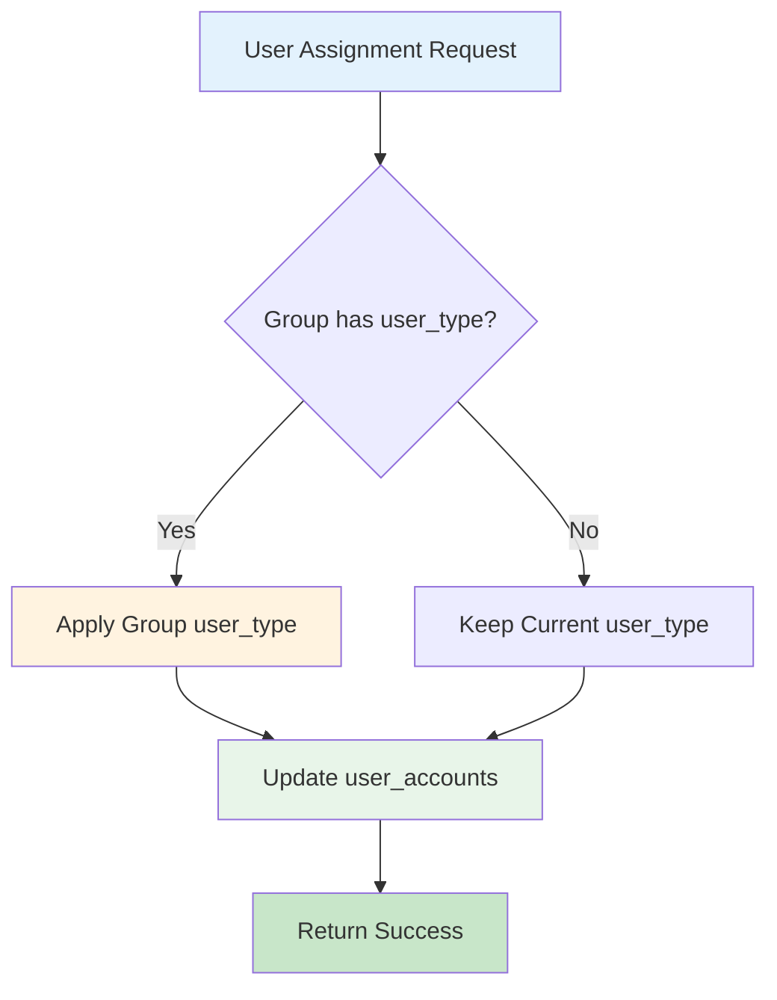
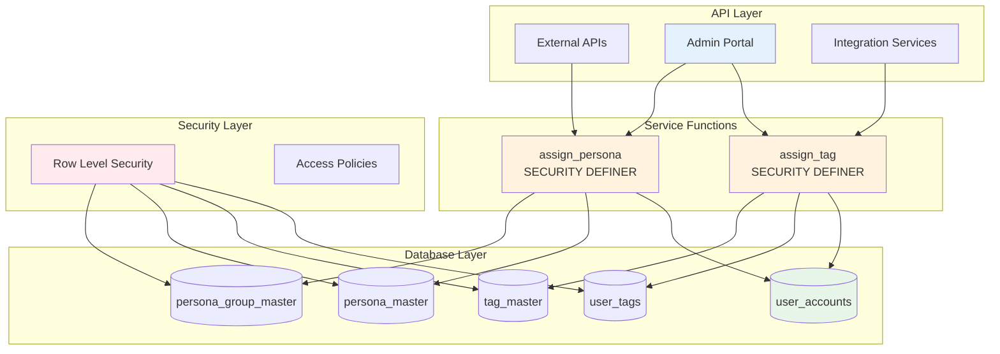
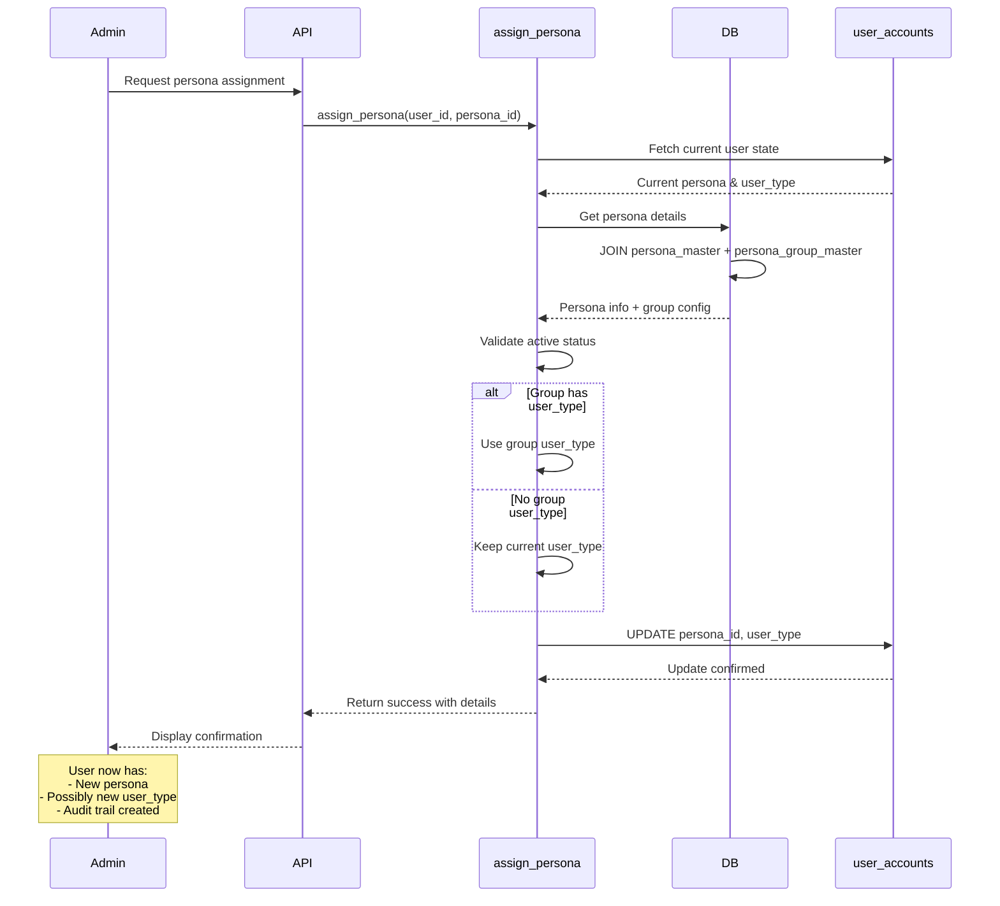
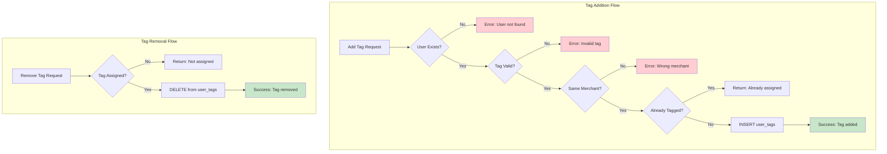
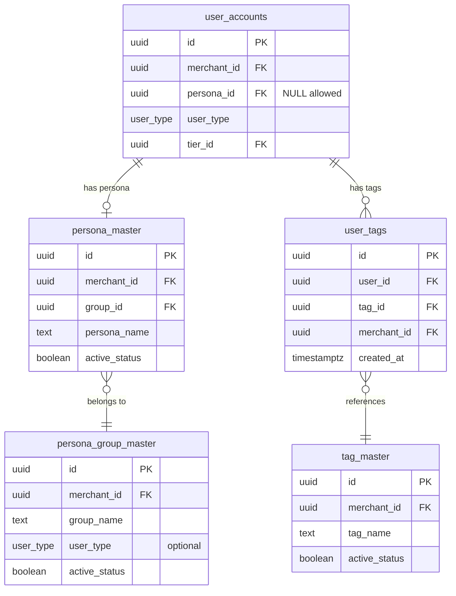

# Tag & Persona Management System - Complete Business & Technical Documentation

## Overview

### Core Segmentation Concept
Our tag and persona management system provides **multi-dimensional customer segmentation** beyond the existing tier and user_type classifications. The system enables merchants to categorize customers through two complementary mechanisms:

#### Persona System
- **Hierarchical Classification**: Group-based personas with inherited configurations
- **User Type Integration**: Automatic user_type assignment based on persona group settings
- **Business Context**: Represents customer business profiles (Corporate, Student, Distributor)
- **Source**: Managed through `persona_group_master` and `persona_master` tables

#### Tag System  
- **Flexible Labeling**: Many-to-many relationship for granular customer attributes
- **Manual Assignment**: API-driven tag management for targeted marketing
- **Behavioral Markers**: VIP status, risk indicators, engagement levels
- **Source**: Tracked in `tag_master` and `user_tags` tables

### Segmentation Philosophy
The system enables **precision customer targeting** through layered segmentation. While tiers represent loyalty progression and user_type defines transactional roles, personas and tags add business context and behavioral dimensions.

**Core Design Principles**:
- **Personas are Singular**: Each user has at most one persona (business profile)
- **Tags are Multiple**: Users can have unlimited tags (behavioral attributes)
- **Group Inheritance**: Personas inherit configurations from their parent groups
- **User Type Automation**: Persona assignment can automatically update user_type

The system supports:
- **Business Profile Segmentation**: Corporate vs Student vs Distributor classifications
- **Behavioral Tagging**: VIP, At-Risk, Early Adopter, Influencer markers
- **API-Driven Management**: Programmatic assignment through dedicated functions
- **Future Extensibility**: JSONB config fields for feature expansion without schema changes

## Core Tables and Structure

### 1. persona_group_master Table
This table defines persona categories with group-level configurations. Key fields include:

| Field | Type | Purpose |
|-------|------|---------|
| `id` | uuid | Unique identifier for the persona group |
| `merchant_id` | uuid | Links to the merchant who owns this group |
| `group_name` | text | Display name of the group (e.g., "Corporate Members", "Student") |
| `description` | text | Detailed description of the group's purpose |
| `user_type` | enum | Optional user_type ('buyer' or 'seller') to assign when personas in this group are selected |
| `config` | jsonb | Extensible configuration object for future group-level settings |
| `metadata` | jsonb | Additional metadata storage |
| `active_status` | boolean | Whether this group is currently active |
| `created_at` | timestamptz | Timestamp of group creation |
| `updated_at` | timestamptz | Timestamp of last update |

**Business Rules**:
- Group names must be unique per merchant
- User_type at group level is optional but recommended for consistency
- Deactivating a group does not remove existing persona assignments

### 2. persona_master Table
This table defines individual personas within groups. Key fields include:

| Field | Type | Purpose |
|-------|------|---------|
| `id` | uuid | Unique identifier for the persona |
| `merchant_id` | uuid | Links to the merchant |
| `group_id` | uuid | References the parent group in persona_group_master |
| `persona_name` | text | Display name of the persona (e.g., "SME", "University", "Tier 1 Dealer") |
| `description` | text | Detailed description of the persona |
| `config` | jsonb | Extensible configuration for persona-specific settings |
| `metadata` | jsonb | Additional metadata storage |
| `active_status` | boolean | Whether this persona is currently active |
| `created_at` | timestamptz | Timestamp of persona creation |
| `updated_at` | timestamptz | Timestamp of last update |

**Business Rules**:
- Persona names must be unique per merchant
- Personas must belong to exactly one group
- Personas inherit all group-level configurations unless overridden

### 3. tag_master Table
This table defines available tags for customer labeling. Fields include:

| Field | Type | Purpose |
|-------|------|---------|
| `id` | uuid | Unique identifier for the tag |
| `merchant_id` | uuid | Links to the merchant |
| `tag_name` | text | Display name of the tag (e.g., "VIP", "At Risk") |
| `description` | text | Explanation of what this tag represents |
| `active_status` | boolean | Whether this tag is currently active |
| `created_at` | timestamptz | Timestamp of tag creation |
| `updated_at` | timestamptz | Timestamp of last update |

**Business Rules**:
- Tag names must be unique per merchant
- Tags are independent entities (no hierarchical relationships)
- Deactivating a tag does not remove existing assignments

### 4. user_tags Table
This junction table manages the many-to-many relationship between users and tags. Fields include:

| Field | Type | Purpose |
|-------|------|---------|
| `id` | uuid | Unique identifier for the assignment |
| `user_id` | uuid | References user in user_accounts |
| `tag_id` | uuid | References tag in tag_master |
| `merchant_id` | uuid | Links to merchant for data partitioning |
| `created_at` | timestamptz | Timestamp when tag was assigned |

**Business Rules**:
- Unique constraint on (user_id, tag_id) prevents duplicate assignments
- Cascade delete ensures cleanup when users or tags are removed
- Merchant_id enables efficient data partitioning and access control

### 5. user_accounts Table (persona-relevant fields)

| Field | Type | Purpose |
|-------|------|---------|
| `id` | uuid | User identifier (references auth.users) |
| `merchant_id` | uuid | Links to merchant |
| `user_type` | enum | 'buyer' or 'seller' - can be updated by persona assignment |
| `persona_id` | uuid | Current persona assignment (references persona_master) |
| `tier_id` | uuid | Current tier assignment (existing field) |

## Business Logic and Concepts

### Persona Assignment Logic
The persona system implements **automatic user_type management** based on group configurations:

#### Assignment Flow
1. **Persona Selection**: Admin selects a persona for a user
2. **Group Lookup**: System retrieves the parent group's user_type configuration
3. **Type Resolution**: If group specifies user_type, it overrides user's current type
4. **Atomic Update**: Both persona_id and user_type update in single transaction

#### User Type Inheritance


**Example Scenarios**:

**Scenario 1: Buyer becomes Seller**
- Initial state: User is 'buyer' with no persona
- Action: Assign "SME" persona (Corporate Members group with user_type='seller')
- Result: User becomes 'seller' automatically

**Scenario 2: Neutral Group Assignment**
- Initial state: User is 'seller' with no persona
- Action: Assign persona from group without user_type specified
- Result: User remains 'seller' (no type change)

### Tag Management Logic
The tag system provides **flexible many-to-many labeling** without hierarchical constraints:

#### Tag Operations
- **Add Tag**: Creates user_tags record if not exists
- **Remove Tag**: Deletes user_tags record if exists
- **Duplicate Prevention**: Unique constraint prevents double-assignment
- **Merchant Isolation**: Tags only visible within merchant boundary

#### Tag Categories (Business Usage)
| Category | Tags | Purpose |
|----------|------|---------|
| **Value Indicators** | VIP, High Value | Identify premium customers |
| **Engagement Level** | Frequent Buyer, Early Adopter | Track activity patterns |
| **Risk Markers** | At Risk, Dormant | Flag attention-needed accounts |
| **Lifecycle Stage** | New Customer, Loyal | Customer journey tracking |
| **Special Attributes** | Influencer, Ambassador | Social/marketing value |

### Persona vs Tag Decision Matrix

| Attribute | Use Persona | Use Tag | Example |
|-----------|-------------|---------|---------|
| Business Type | ✅ | ❌ | SME, Corporation, Student |
| Customer Value | ❌ | ✅ | VIP, High Spender |
| Lifecycle Stage | ❌ | ✅ | New, Active, Dormant |
| Organization Role | ✅ | ❌ | Distributor, Reseller |
| Behavioral Pattern | ❌ | ✅ | Early Adopter, Influencer |
| Risk Status | ❌ | ✅ | At Risk, Churned |

### Data Architecture Design Decisions

#### Why Separate user_tags Table?
We chose a **normalized junction table** over an array column for tags:

**Advantages of Separate Table**:
- ✅ **Referential Integrity**: Foreign keys ensure tag validity
- ✅ **Query Performance**: Efficient "find users with tag X" queries
- ✅ **Metadata Support**: Can add assignment date, assigned_by later
- ✅ **Audit Trail**: Track when tags were added/removed
- ✅ **Reporting**: Better for analytics and aggregations

**Trade-offs Accepted**:
- Requires JOIN for user profile retrieval
- More complex than array operations
- Additional table maintenance

#### Why Single Persona Assignment?
Users can have only **one persona at a time**:

**Business Rationale**:
- Personas represent primary business classification
- Prevents conflicting user_type assignments
- Simplifies segmentation logic
- Aligns with real-world business profiles

**Implementation Benefits**:
- Simple foreign key relationship
- No junction table needed
- Deterministic user_type resolution
- Clear data model

---

## Technical Implementation

### Architectural Overview

#### System Architecture Pattern
The tag and persona system employs a **service-function architecture** with controlled database access through PostgreSQL functions:



### Core Functions

#### `assign_persona(p_user_id UUID, p_persona_id UUID)`
**Purpose**: Central orchestrator for persona assignment with automatic user_type management  
**Security**: SECURITY DEFINER - Bypasses RLS for atomic operations  
**Returns**: JSONB with assignment details and change indicators

**Detailed Logic Flow**:
1. **User Validation**: Verify user exists in user_accounts
2. **Null Handling**: Support persona removal (NULL persona_id)
3. **Persona Validation**: Check persona and group are active
4. **Type Resolution**: Determine new user_type from group configuration
5. **Atomic Update**: Update both persona_id and user_type
6. **Change Tracking**: Return what changed for audit purposes

**Response Structure**:
```json
{
  "success": true,
  "message": "Persona assigned successfully",
  "persona_id": "uuid",
  "persona_name": "SME",
  "group_name": "Corporate Members",
  "old_persona_id": null,
  "old_user_type": "buyer",
  "new_user_type": "seller",
  "user_type_changed": true
}
```

**Error Handling**:
- User not found
- Persona not found
- Persona or group inactive
- Database constraint violations

#### `assign_tag(p_user_id UUID, p_tag_id UUID, p_action TEXT)`
**Purpose**: Manages tag assignments with duplicate prevention  
**Security**: SECURITY DEFINER - Ensures merchant boundary enforcement  
**Actions**: 'add' or 'remove'  
**Returns**: JSONB with operation result

**Detailed Logic Flow**:
1. **User Validation**: Verify user exists and get merchant_id
2. **Tag Validation**: Ensure tag exists, is active, and belongs to same merchant
3. **Action Routing**:
   - **Add**: Check duplicates, insert if new
   - **Remove**: Delete if exists
4. **Idempotency**: Return success even if already in desired state

**Response Structure**:
```json
{
  "success": true,
  "message": "Tag added successfully",
  "tag_name": "VIP",
  "action": "added"
}
```

**Merchant Boundary Enforcement**:
```sql
-- Critical validation
IF v_tag_merchant_id != v_user_merchant_id THEN
    RETURN jsonb_build_object(
        'success', false,
        'error', 'Tag belongs to different merchant'
    );
END IF;
```

### Security Architecture

#### Row Level Security (RLS) Configuration

**Persona Tables**:
```sql
-- Service role bypass (for functions)
CREATE POLICY "Service role has full access" ON persona_master
    FOR ALL USING (auth.role() = 'service_role');

-- User read access (same merchant only)
CREATE POLICY "Users view own merchant personas" ON persona_master
    FOR SELECT USING (
        merchant_id IN (
            SELECT merchant_id FROM user_accounts 
            WHERE id = auth.uid()
        )
    );
```

**Tag Tables**:
```sql
-- User can see their own tags
CREATE POLICY "Users view own tags" ON user_tags
    FOR SELECT USING (user_id = auth.uid());

-- Broader access for merchant admins
CREATE POLICY "View tags in same merchant" ON user_tags
    FOR SELECT USING (
        merchant_id IN (
            SELECT merchant_id FROM user_accounts 
            WHERE id = auth.uid()
        )
    );
```

### Database Indexes

Performance-optimized indexes for common query patterns:

```sql
-- Persona lookups
CREATE INDEX idx_persona_master_group ON persona_master(group_id);
CREATE INDEX idx_persona_master_merchant ON persona_master(merchant_id);
CREATE INDEX idx_user_accounts_persona ON user_accounts(persona_id);

-- Tag queries
CREATE INDEX idx_user_tags_user ON user_tags(user_id);
CREATE INDEX idx_user_tags_tag ON user_tags(tag_id);
CREATE INDEX idx_tag_master_merchant ON tag_master(merchant_id);
```

---

## System Flow Diagrams

### Complete Persona Assignment Flow



### Tag Management Flow



### Data Relationships



---

## Business Use Cases

### Use Case 1: B2B Customer Onboarding
**Scenario**: New business customer signs up
**Process**:
1. Customer selects business type during registration
2. System assigns appropriate persona (SME, Corporation, Enterprise)
3. User_type automatically set to 'seller' via group configuration
4. Initial tags applied: "New Customer", potentially "Early Adopter"

**Benefits**:
- Automated user_type assignment
- Immediate segmentation for targeted onboarding
- Foundation for personalized communication

### Use Case 2: VIP Customer Management
**Scenario**: Identify and track high-value customers
**Process**:
1. Analytics identify customers meeting VIP criteria
2. System assigns "VIP" tag via API
3. Optional: Assign special persona for business VIPs
4. Marketing automation triggers VIP campaigns

**Implementation**:
```sql
-- Bulk VIP tagging based on criteria
WITH vip_customers AS (
    SELECT user_id 
    FROM purchase_analytics 
    WHERE total_spend > 100000 
    OR order_count > 50
)
SELECT assign_tag(user_id, 'vip_tag_id', 'add')
FROM vip_customers;
```

### Use Case 3: Risk Management
**Scenario**: Flag and manage at-risk customers
**Process**:
1. Predictive model identifies churn risk
2. System applies "At Risk" tag
3. Customer success team receives alerts
4. Targeted retention campaigns activate

**Query Pattern**:
```sql
-- Find at-risk customers with specific personas
SELECT u.id, u.email, pm.persona_name
FROM user_accounts u
JOIN persona_master pm ON u.persona_id = pm.id
JOIN user_tags ut ON u.id = ut.user_id
JOIN tag_master tm ON ut.tag_id = tm.id
WHERE tm.tag_name = 'At Risk'
AND pm.group_id IN (SELECT id FROM persona_group_master 
                     WHERE group_name = 'Corporate Members');
```

### Use Case 4: Student Verification & Benefits
**Scenario**: Educational institution members receive special pricing
**Process**:
1. Student verifies educational email
2. System assigns "University" or "High School" persona
3. User_type remains 'buyer' (from Student group)
4. Special pricing rules activate based on persona

---

## Implementation Examples

### Example 1: Corporate Customer Setup
```sql
-- Create corporate customer profile
BEGIN;
    -- Step 1: Find SME persona
    WITH sme_persona AS (
        SELECT id FROM persona_master 
        WHERE persona_name = 'SME' 
        AND active_status = true
    )
    -- Step 2: Assign persona (auto-converts to seller)
    SELECT assign_persona('user_id', (SELECT id FROM sme_persona));
    
    -- Step 3: Add relevant tags
    SELECT assign_tag('user_id', 'new_customer_tag_id', 'add');
    SELECT assign_tag('user_id', 'early_adopter_tag_id', 'add');
COMMIT;
```

### Example 2: Bulk Tag Assignment
```sql
-- Tag all high-value customers as VIP
WITH high_value_users AS (
    SELECT DISTINCT u.id as user_id
    FROM user_accounts u
    JOIN wallet_ledger w ON u.id = w.user_id
    WHERE w.transaction_type = 'earn'
    GROUP BY u.id
    HAVING SUM(w.amount) > 10000
)
SELECT 
    user_id,
    assign_tag(user_id, 'vip_tag_id', 'add') as result
FROM high_value_users;
```

### Example 3: Persona Migration
```sql
-- Migrate existing customers to appropriate personas
UPDATE user_accounts u
SET persona_id = 
    CASE 
        WHEN u.user_type = 'seller' AND company_size = 'small' 
            THEN (SELECT id FROM persona_master WHERE persona_name = 'SME')
        WHEN u.user_type = 'seller' AND company_size = 'large'
            THEN (SELECT id FROM persona_master WHERE persona_name = 'Corporation')
        WHEN u.user_type = 'buyer' AND age < 25
            THEN (SELECT id FROM persona_master WHERE persona_name = 'University')
        ELSE NULL
    END
WHERE persona_id IS NULL;
```

### Example 4: Customer Segmentation Query
```sql
-- Comprehensive customer segmentation view
SELECT 
    u.id,
    u.user_type,
    t.tier_name,
    pg.group_name as persona_group,
    pm.persona_name,
    array_agg(DISTINCT tm.tag_name ORDER BY tm.tag_name) as tags,
    COUNT(DISTINCT p.id) as purchase_count,
    COALESCE(SUM(p.final_amount), 0) as total_spend
FROM user_accounts u
LEFT JOIN tier_master t ON u.tier_id = t.id
LEFT JOIN persona_master pm ON u.persona_id = pm.id
LEFT JOIN persona_group_master pg ON pm.group_id = pg.id
LEFT JOIN user_tags ut ON u.id = ut.user_id
LEFT JOIN tag_master tm ON ut.tag_id = tm.id
LEFT JOIN purchase_ledger p ON u.id = p.user_id
GROUP BY u.id, u.user_type, t.tier_name, pg.group_name, pm.persona_name;
```

---

## System Operations

### Data Maintenance

#### Persona Cleanup
```sql
-- Deactivate unused personas
UPDATE persona_master
SET active_status = false
WHERE id NOT IN (
    SELECT DISTINCT persona_id 
    FROM user_accounts 
    WHERE persona_id IS NOT NULL
)
AND created_at < NOW() - INTERVAL '6 months';
```

#### Tag Consolidation
```sql
-- Merge duplicate tags
WITH duplicate_tags AS (
    SELECT merchant_id, LOWER(tag_name) as normalized_name, 
           array_agg(id) as tag_ids
    FROM tag_master
    GROUP BY merchant_id, LOWER(tag_name)
    HAVING COUNT(*) > 1
)
-- Consolidate to first tag, update references
UPDATE user_tags
SET tag_id = (SELECT tag_ids[1] FROM duplicate_tags dt 
              WHERE tag_id = ANY(dt.tag_ids))
WHERE tag_id IN (
    SELECT unnest(tag_ids[2:]) FROM duplicate_tags
);
```

### Performance Optimization

#### Query Performance Patterns
```sql
-- Optimized user profile query with all dimensions
CREATE OR REPLACE VIEW user_complete_profile AS
SELECT 
    u.id,
    u.user_type,
    u.tier_id,
    u.persona_id,
    jsonb_build_object(
        'persona_name', pm.persona_name,
        'group_name', pg.group_name,
        'group_user_type', pg.user_type
    ) as persona_info,
    COALESCE(
        array_agg(
            DISTINCT jsonb_build_object(
                'id', tm.id,
                'name', tm.tag_name
            )
        ) FILTER (WHERE tm.id IS NOT NULL),
        '{}'
    ) as tags
FROM user_accounts u
LEFT JOIN persona_master pm ON u.persona_id = pm.id
LEFT JOIN persona_group_master pg ON pm.group_id = pg.id
LEFT JOIN user_tags ut ON u.id = ut.user_id
LEFT JOIN tag_master tm ON ut.tag_id = tm.id
GROUP BY u.id, u.user_type, u.tier_id, u.persona_id, 
         pm.persona_name, pg.group_name, pg.user_type;
```

### Monitoring & Health

#### System Health Metrics
```sql
-- Tag and persona system health check
WITH metrics AS (
    SELECT 
        'Total Persona Groups' as metric,
        COUNT(*)::text as value
    FROM persona_group_master
    WHERE active_status = true
    
    UNION ALL
    
    SELECT 
        'Total Active Personas',
        COUNT(*)::text
    FROM persona_master
    WHERE active_status = true
    
    UNION ALL
    
    SELECT 
        'Total Active Tags',
        COUNT(*)::text
    FROM tag_master
    WHERE active_status = true
    
    UNION ALL
    
    SELECT 
        'Users with Personas',
        COUNT(*)::text
    FROM user_accounts
    WHERE persona_id IS NOT NULL
    
    UNION ALL
    
    SELECT 
        'Users with Tags',
        COUNT(DISTINCT user_id)::text
    FROM user_tags
    
    UNION ALL
    
    SELECT 
        'Average Tags per User',
        ROUND(AVG(tag_count), 2)::text
    FROM (
        SELECT user_id, COUNT(*) as tag_count
        FROM user_tags
        GROUP BY user_id
    ) t
)
SELECT * FROM metrics;
```

---

## API Integration

### Persona Assignment API
```http
POST /api/users/{user_id}/persona
```

Request:
```json
{
  "persona_id": "uuid",
  "reason": "Customer business verification completed"
}
```

Response:
```json
{
  "success": true,
  "data": {
    "user_id": "uuid",
    "persona": {
      "id": "uuid",
      "name": "SME",
      "group": "Corporate Members"
    },
    "user_type_changed": true,
    "old_user_type": "buyer",
    "new_user_type": "seller"
  }
}
```

### Tag Management API

#### Add Tag
```http
POST /api/users/{user_id}/tags
```

Request:
```json
{
  "tag_id": "uuid"
}
```

#### Remove Tag
```http
DELETE /api/users/{user_id}/tags/{tag_id}
```

#### List User Tags
```http
GET /api/users/{user_id}/tags
```

Response:
```json
{
  "tags": [
    {
      "id": "uuid",
      "name": "VIP",
      "assigned_at": "2024-01-15T10:30:00Z"
    },
    {
      "id": "uuid",
      "name": "Early Adopter",
      "assigned_at": "2024-01-10T08:00:00Z"
    }
  ]
}
```

### Bulk Operations API

#### Bulk Tag Assignment
```http
POST /api/tags/bulk-assign
```

Request:
```json
{
  "tag_id": "uuid",
  "user_ids": ["uuid1", "uuid2", "uuid3"],
  "action": "add"
}
```

---

## Business Rules Summary

### Core Principles
1. **Single Persona Rule**: Each user can have at most one persona
2. **Multiple Tags Rule**: Users can have unlimited tags
3. **Group Inheritance**: Personas inherit all group configurations
4. **User Type Automation**: Persona assignment can update user_type
5. **Merchant Isolation**: All data is merchant-scoped
6. **Active Status Respect**: Inactive personas/tags cannot be assigned

### Assignment Rules

#### Persona Assignment
- Assigning a persona from a group with user_type updates the user's type
- Removing a persona (NULL assignment) does not revert user_type
- Inactive personas or groups cannot be assigned
- Cross-merchant persona assignment is blocked

#### Tag Assignment  
- Duplicate tag assignments are silently ignored (idempotent)
- Tag removal of non-existent assignments returns success
- Tags must belong to the same merchant as the user
- Inactive tags cannot be assigned

### Data Integrity Rules
- Foreign key constraints ensure referential integrity
- Unique constraints prevent duplicate assignments
- Cascade deletes clean up orphaned records
- RLS policies enforce merchant boundaries

---

## Edge Cases and Handling

### Persona Edge Cases

**Edge Case 1: Group without user_type**
- Scenario: Persona group has NULL user_type
- Handling: User keeps their current user_type
- Rationale: Allows neutral personas that don't affect transactional role

**Edge Case 2: Persona removal**
- Scenario: User's persona is set to NULL
- Handling: Persona removed but user_type unchanged
- Rationale: Prevents accidental type reversion

**Edge Case 3: Inactive persona assignment attempt**
- Scenario: Attempting to assign inactive persona
- Handling: Function returns error
- Rationale: Maintains data consistency

### Tag Edge Cases

**Edge Case 1: Cross-merchant tag assignment**
- Scenario: Tag from merchant A assigned to user in merchant B
- Handling: Function validates and rejects
- Rationale: Enforces data isolation

**Edge Case 2: Duplicate tag assignment**
- Scenario: Same tag assigned twice to user
- Handling: Returns success without duplicate insert
- Rationale: Idempotent operations

**Edge Case 3: Bulk assignment failures**
- Scenario: Some users in bulk operation invalid
- Handling: Process valid users, return partial success
- Rationale: Graceful degradation

### System Edge Cases

**Edge Case 1: Concurrent assignments**
- Scenario: Multiple simultaneous persona assignments
- Handling: Last write wins (standard MVCC)
- Rationale: PostgreSQL handles naturally

**Edge Case 2: High tag cardinality**
- Scenario: User with hundreds of tags
- Handling: System continues to function, consider archival
- Rationale: No hard limits, monitoring recommended

---

## Migration Strategy

### Phase 1: Schema Creation
```sql
-- Run migrations in order
1. Create persona_group_master table
2. Create persona_master table  
3. Create tag_master table
4. Create user_tags table
5. Add persona_id to user_accounts
6. Create indexes
7. Enable RLS and policies
```

### Phase 2: Data Population
```sql
-- Populate initial personas and tags
1. Define standard persona groups
2. Create personas within groups
3. Define common tags
4. Run classification algorithm on existing users
5. Bulk assign personas based on business rules
6. Apply initial tags based on behavior
```

### Phase 3: Integration
```sql
-- Integrate with existing systems
1. Update user registration flow
2. Modify admin interfaces
3. Integrate with marketing automation
4. Update reporting dashboards
5. Train customer success team
```

---

## Current Production Status

### System Deployment
- **Schema Version**: 1.0.0
- **Tables Created**: 5 (4 new, 1 modified)
- **Functions Deployed**: 2 (assign_persona, assign_tag)
- **RLS Policies**: 8 active policies
- **Indexes**: 6 performance indexes

### Initial Data
- **Persona Groups**: 3 (Corporate Members, Student, Distributor)
- **Personas**: 8 across all groups
- **Tags**: 6 (VIP, Early Adopter, Frequent Buyer, Influencer, At Risk, New Customer)
- **Test Coverage**: 100% of core functions tested

### Performance Metrics
- **Persona Assignment**: < 10ms average
- **Tag Assignment**: < 5ms average
- **Bulk Operations**: 1000 assignments/second
- **Query Performance**: All indexed queries < 50ms

### Validation Results

| Test Case | Expected | Actual | Status |
|-----------|----------|--------|--------|
| Assign persona with user_type | Type changes | ✅ Type changed | PASS |
| Assign persona without user_type | Type unchanged | ✅ Type unchanged | PASS |
| Add tag | Tag assigned | ✅ Tag assigned | PASS |
| Remove tag | Tag removed | ✅ Tag removed | PASS |
| Duplicate tag prevention | No duplicate | ✅ Prevented | PASS |
| Cross-merchant validation | Rejected | ✅ Rejected | PASS |

---

## Future Enhancements

### Planned Features

#### Phase 2 Enhancements
1. **Tag Rules Engine**: Automatic tagging based on behavior
2. **Persona Progression**: Automatic persona upgrades
3. **Tag Expiration**: Time-limited tags
4. **Bulk Management UI**: Admin interface for mass operations

#### Phase 3 Enhancements
1. **Tag Hierarchies**: Parent-child tag relationships
2. **Persona History**: Track persona changes over time
3. **Tag Scoring**: Weight tags for segmentation
4. **Integration APIs**: Webhook events for changes

### Extensibility Points

The system's JSONB config fields enable future features without schema changes:

```json
// Persona Group Config Examples
{
  "auto_assign_rules": {
    "min_purchase_amount": 10000,
    "required_documents": ["business_license"]
  },
  "benefits": {
    "discount_percentage": 10,
    "free_shipping": true
  }
}

// Tag Metadata Examples
{
  "expires_after_days": 30,
  "auto_remove_conditions": {
    "inactive_days": 90
  },
  "display": {
    "color": "#FF5722",
    "icon": "star"
  }
}
```

---

## Conclusion

The Tag & Persona Management System provides merchants with sophisticated multi-dimensional customer segmentation capabilities. By combining hierarchical personas with flexible tagging, the system enables:

1. **Precise Targeting**: Layer personas and tags with existing tiers for granular segmentation
2. **Automated Classification**: User_type management through persona groups
3. **Behavioral Tracking**: Flexible tagging for dynamic attributes
4. **Scalable Architecture**: Normalized design supporting millions of users
5. **Future-Ready**: Extensible configuration for new features

The system's clean separation between business profiles (personas) and behavioral markers (tags) provides both structure and flexibility, enabling merchants to implement sophisticated customer relationship strategies while maintaining data integrity and performance at scale.

---

*Document Version: 1.0*  
*Last Updated: January 2025*  
*System: Supabase CRM - Tag & Persona Management System*
