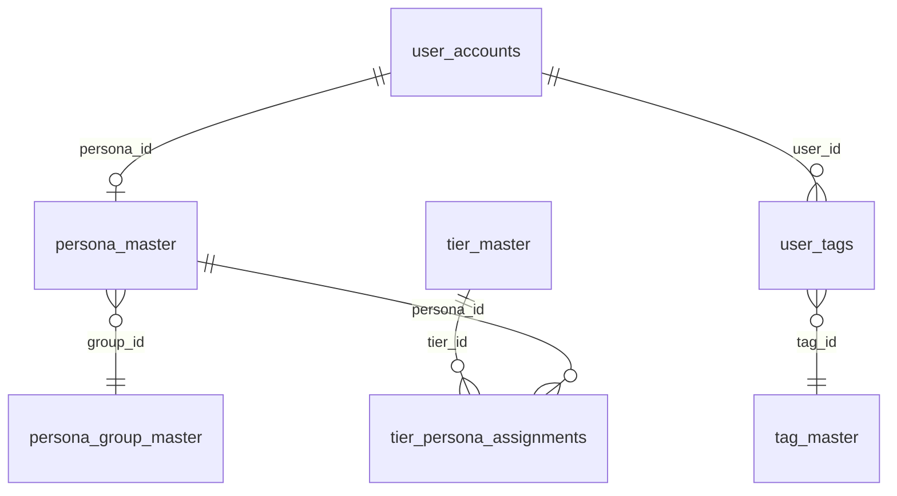

# Tag and Persona

Merchant-scoped **segmentation** layered on tier and `user_type`: at most one **persona** (primary business profile with optional group-level `user_type`) and zero or many **tags** (flexible labels for behavior and campaigns).

Owner surfaces: loyalty-admin (persona structure, tag catalog, member profile), loyalty-user (signup persona selection, persona-filtered content), AMP / lifecycle automations and server integrations (`assign_persona` / `assign_tag` RPCs)

## Concept

Members are already classified by **tier** (loyalty progression) and **user type** (`buyer` vs `seller` for transactional rules). Personas and tags add a second axis merchants use for eligibility, pricing, forms, and display.

**Persona group** — Named bucket of personas. May set a default **user type** applied when a member is assigned any persona in the group. Some merchants also store B2B **contract** metadata on the group (company, contact, contract dates).

**Persona** — The member’s single optional business profile (`user_accounts.persona_id`). Belongs to exactly one group. May have display **image**, optional signup **code**, and **active** flag.

**Tag** — Merchant-defined label in `tag_master`. Members hold many tags via `user_tags`; tags are flat (no hierarchy).

**Tier ↔ persona** — A tier may list allowed personas in `tier_persona_assignments`. Empty list means all personas; non-empty restricts which personas can hold or attain that tier (see `Tier.md`).

**Persona entitlement** — Separate product: automatic grants when persona is assigned (`Persona_Entitlement.md`).

**When to use persona vs tag**

| Dimension | Persona | Tag |
| --- | --- | --- |
| Primary business role (SME, student, distributor) | Yes | No |
| Behavioral or campaign labels (VIP, at-risk, influencer) | No | Yes |
| Drives `user_type` from group default | Yes | No |
| Multiple per member | No (at most one) | Yes (unlimited) |

Personas answer “what kind of customer is this?” Tags answer “what labels apply right now?” Both combine with tier and user type in reward rules, missions, check-in, forms, and display blocks.

## Rules

- **Single persona** — At most one `persona_id` per member; `NULL` means no persona.
- **Many tags** — No hard cap; duplicate `(user_id, tag_id)` rows are prevented at the database.
- **Active catalog** — Inactive persona, group, or tag cannot be newly assigned; existing assignments are not auto-cleared when catalog rows are deactivated.
- **User type on persona assign** — When assigning a persona whose group has `user_type` set, member `user_type` updates to that value in the same transaction. When the group has no `user_type`, member `user_type` is unchanged.
- **User type on persona clear** — Setting persona to `NULL` does **not** revert `user_type` (avoids accidental role flip).
- **Merchant boundary** — Personas, tags, and assignments are scoped by `merchant_id`; cross-merchant tag assignment is rejected.
- **Tag idempotency** — `assign_tag` with action `add` on an existing pair succeeds without a second row; `remove` on a missing pair succeeds without error.
- **Tag provenance** — Optional `source_type` / `source_id` on `user_tags` record what created the assignment (for example AMP or import).
- **Persona side-effects** — After a successful persona assign, `fn_auto_assign_on_persona` may run (packages / entitlements per `Persona_Entitlement.md`). Customer import in **migration** mode can defer these triggers until postprocess.
- **Tier persona gate** — `fn_tier_matches_persona` / `trigger_validate_tier_persona_assignment` enforce tier–persona consistency when tiers declare persona allowlists.
- **Type consistency** — `validate_persona_type_consistency` guards persona choice against member `user_type` where product rules require alignment.
- **Downstream filtering** — Rewards, missions, check-in, forms, and display blocks may filter on persona id, persona group, tag ids, or “any listed tag”; empty filters mean no restriction (each feature doc owns its AND/OR semantics).

## Journeys

### Admin journey

| Page | Owning repo | BFF / RPC |
| --- | --- | --- |
| Tier → **Personas** tab | loyalty-admin | `bff_get_persona_structure`, `upsert_persona_group_with_personas`, `admin_delete_persona_group`, `admin_delete_persona` |
| Tier → Persona onboarding card | loyalty-admin | `bff_get_general_config` / `bff_upsert_general_config` (`attain_persona`) |
| **User Tags** (catalog) | loyalty-admin | `bff_get_tags`, `bff_upsert_tag`, `admin_delete_tag` |
| Customer 360 → Edit profile | loyalty-admin | `bff_admin_change_member_persona`, `bff_admin_assign_member_tag`, `bff_get_tags` |
| AMP Workflow List / Lifecycle automations | loyalty-admin | Action nodes `assign_persona`, `assign_tag`, `remove_tag` → runtime calls `assign_persona` / `assign_tag` |
| Customer import (optional columns) | loyalty-admin | Staging may set persona; migration postprocess `grant_persona_benefits` — see `Customer_Import_System.md` |

| Setting | Effect on behaviour |
| --- | --- |
| Persona group name + optional group `user_type` | Default transactional role when members pick a persona in that group |
| Personas in group (name, image, code, active) | Choices at signup and on member profile |
| `attain_persona` (merchant config) | How/whether members must choose a persona during signup |
| Tag name, description, active | Catalog for assignment and targeting |
| Member profile persona change | Updates `persona_id` and possibly `user_type`; may trigger persona entitlements |
| Member profile tag chips | Add/remove tags without changing persona |

1. Open **Tier** → **Personas**: create groups, set optional buyer/seller default per group, add personas (name, image, optional deep-link **code**).
2. Configure **Persona onboarding** on the same tab when signup should require or offer persona selection (`attain_persona`).
3. Open **User Tags**: define tag catalog (unique name per merchant); deactivate tags that should not be assignable going forward.
4. On **Customer 360**, use **Edit profile** to change persona or add/remove tags for one member.
5. For automation, add **Assign persona** or **Assign tag** actions in AMP or lifecycle workflows; bulk operational tagging may also use SQL/API `assign_tag` from integrations.

Common pitfalls: clearing persona does not restore previous `user_type`; assigning inactive persona or tag returns an error; tier with persona allowlist rejects members outside the list; tag catalog page does not assign tags to members (profile only).

### Member journey

| Page / surface | Owning repo | BFF / RPC |
| --- | --- | --- |
| Signup / profile (when `attain_persona` enabled) | loyalty-user | Persona picker; `bff_validate_signup_code` when persona uses signup codes |
| Profile template fields | loyalty-user | `bff_admin_get_member_profile_form` / template filtered by `fn_filter_user_profile_template_by_persona`, `fn_profile_field_visible_for_persona` |
| Rewards, missions, check-in, display | loyalty-user | Reads member `persona_id` and tags from session/profile; server-side filters on list/detail RPCs |
| Display settings preview | loyalty-user | Preview tool filters blocks by persona id / guest |

1. During signup (if configured), member selects a persona (and may enter a persona **code** where required).
2. If the persona’s group defines `user_type`, member role updates to buyer or seller as part of assignment.
3. Member sees tiers, rewards, missions, forms, and content blocks only when their persona and tags satisfy each feature’s eligibility rules.
4. Members do not self-serve tag management in the standard app; tags are applied by admin, import, or automation.

| Error (typical) | Cause |
| --- | --- |
| Invalid or inactive persona | Catalog row inactive or wrong merchant |
| Persona code invalid | `bff_validate_signup_code` mismatch |
| Tier / reward / mission not visible | Persona or tag filter excludes member |
| Tag not applied | Inactive tag or wrong merchant (admin/API path) |

## System

### Data model

| Artifact | Role |
| --- | --- |
| `persona_group_master` | Group header: `group_name`, optional `user_type`, `active_status`, optional contract fields (`contract_type`, `company_name`, `contact_*`, `contract_*`, `contract_metadata`), legacy `mongo_id` |
| `persona_master` | Persona row: `group_id`, `persona_name`, `image`, optional `code`, `active_status`, `mongo_id` |
| `tag_master` | Tag definition: `tag_name`, `description`, `active_status` |
| `user_tags` | Junction: `user_id`, `tag_id`, `merchant_id`, `created_at`, optional `source_type`, `source_id` |
| `user_accounts` | Member `persona_id` FK (nullable), `user_type`, `tier_id` |
| `tier_persona_assignments` | Many-to-many tier ↔ allowed persona |
| `persona_entitlement` | Entitlement definitions tied to persona (see `Persona_Entitlement.md`) |

Unique constraints: persona and tag names per merchant; one row per `(user_id, tag_id)`.

Indexes support group/merchant lookups on personas, persona id on `user_accounts`, and user/tag lookups on `user_tags`.

RLS on master and junction tables enforces merchant isolation; `assign_persona` and `assign_tag` run as `SECURITY DEFINER` for atomic admin/API writes.

```mermaid
erDiagram
    user_accounts ||--o| persona_master : persona_id
    persona_master }o--|| persona_group_master : group_id
    user_accounts ||--o{ user_tags : user_id
    user_tags }o--|| tag_master : tag_id
    tier_master ||--o{ tier_persona_assignments : tier_id
    persona_master ||--o{ tier_persona_assignments : persona_id
```

### Functions

| Function | Role |
| --- | --- |
| `assign_persona` | Member persona assign/clear; resolves group `user_type`; returns change summary JSONB |
| `assign_tag` | Add/remove tag with merchant check; optional source metadata |
| `bff_get_persona_structure` | Admin load groups, personas, `merchant_config.persona_attain` |
| `upsert_persona_group_with_personas` | Admin save one group and its persona children |
| `bff_upsert_persona_master` | Bulk persona structure upsert (registry; not used by current loyalty-admin Tier UI) |
| `admin_delete_persona_group` / `admin_delete_persona` | Admin delete with validation |
| `bff_get_tags` / `bff_upsert_tag` / `admin_delete_tag` | Tag catalog CRUD |
| `bff_admin_change_member_persona` | Admin-wrapped `assign_persona` with auth |
| `bff_admin_assign_member_tag` | Admin-wrapped tag add/remove |
| `fn_auto_assign_on_persona` | Post-assign entitlements/packages |
| `fn_sync_tier_persona_assignments` / `fn_tier_persona_ids` / `fn_tier_matches_persona` | Tier allowlist maintenance and checks |
| `validate_persona_type_consistency` | Persona vs `user_type` guard |
| `fn_filter_user_profile_template_by_persona` / `fn_profile_field_visible_for_persona` | Signup/profile field visibility |
| `calculate_redemption_points_fast` | Reward points path accepts `p_user_persona_id` and `p_user_tag_ids` |

Triggers: `tier_persona_assignments` validated on write via `trigger_validate_tier_persona_assignment`.

### Flows

**Persona assign (sync):** validate user and merchant → load persona + group → reject if inactive → compute new `user_type` when group specifies it → update `user_accounts.persona_id` and `user_type` → call `fn_auto_assign_on_persona` when applicable → return JSONB with old/new persona and type-change flag.

**Tag assign (sync):** validate user and tag active and same merchant → insert or delete `user_tags` (idempotent) → optional source columns for automation audit.

**Admin structure save:** Tier Personas tab calls `upsert_persona_group_with_personas` per group edit; structure read uses `bff_get_persona_structure`.

**Segmentation read paths:** List/detail RPCs across rewards, missions, check-in, AMP audiences, and display settings join or pass `persona_id` and tag id arrays; exact predicate (AND vs OR, persona group expansion) is defined per feature.

**Import:** User import staging can set persona fields; migration mode suppresses per-row persona side-effects until optional `grant_persona_benefits` postprocess.

### External services

No dedicated Render/Inngest worker for tag/persona; bulk tag/persona changes run in-database or via admin/API RPCs. AMP and lifecycle workers invoke the same assign functions as Customer 360.

Programmatic partners call `assign_persona` / `assign_tag` with service role or documented API surfaces (see `Open_API.md` for gateway coverage; not all assign paths are exposed on the public Open API).

### Known gaps

- **`bff_upsert_persona_master`** — Present in registry and i18n lists but Tier Personas UI uses `upsert_persona_group_with_personas` only; confirm before building new admin flows on the bulk upsert RPC.
- **Legacy doc drift removed** — Prior prose referenced `description`/`config`/`metadata` on persona tables and a `user_personas` junction table; live schema uses contract fields on groups, `image`/`code` on personas, and persona on `user_accounts` only (verified via Supabase `information_schema`).
- **Fictional REST paths** — Older sections documented `POST /api/users/{id}/persona` style routes; member changes go through BFF/RPC above unless a specific gateway route is added to Open API.
- **Member tag self-service** — No loyalty-user UI for members to add/remove their own tags.
- **Persona history** — No first-class audit table for persona changes; rely on admin logs or external analytics if required.
- **Automatic tag rules** — No built-in rules engine for behavioral auto-tagging; use AMP, lifecycle automations, or integration jobs calling `assign_tag`.

## Related

- **Persona_Entitlement.md** — Grants triggered on persona assignment.
- **Tier.md** — Tier–persona allowlists and attainment.
- **Forms.md** — Persona-scoped fields and `validate_form_submission`.
- **Display_Settings.md** — Content blocks filtered by `persona_ids`.
- **Reward.md** — Visibility and point rules by persona and tags.
- **Customer_Import_System.md** — Bulk persona columns and migration postprocess.
- **AMP_Workflows.md** / lifecycle automations — `assign_tag` / `assign_persona` actions.
