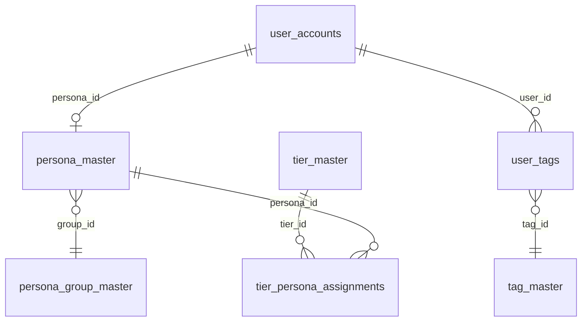

# Tag and Persona

Merchant-scoped **segmentation** layered on tier and `user_type`: at most one **persona** (primary business profile with optional group-level `user_type`) and zero or many **tags** (flexible labels for behavior and campaigns).

Owner surfaces: loyalty-admin (persona structure, tag catalog, member profile), loyalty-user (signup persona selection, persona-filtered content), AMP / lifecycle automations and server integrations (`assign_persona` / `assign_tag` RPCs)

## Concept

The system groups members along three independent dimensions, and one member holds all three. **Tier** groups by the value the member gives the brand (points, spend — `Tier.md`). **Persona** groups by who the member *is*: a student, an employee of a corporate partner, a dealer. Two students can sit in opposite tiers; persona does not move with spend. **Tag** covers any other marker neither captures.

Persona exists so a brand can give each kind of member a different experience, in three ways: **form data** (signup and profile fields shown only to relevant personas), **display** (home blocks, banners, and menus per persona), and **eligibility** (which rewards, campaigns, and surveys a persona can see or join, combinable with tier and tag). A merchant may use any subset — for example identical forms but persona-only rewards.

**Persona group** — Named bucket of personas (Students: Primary, Secondary, University). Optionally sets the **user type** for every persona in it. Some merchants also store B2B **contract** metadata on the group.

**Persona** — The member’s single optional identity segment. Belongs to one group; has an **icon** (shown on the persona picker), an optional **URL slug**, and an active flag.

**URL slug** — Value in a signup-link parameter that pre-assigns the persona, so the member skips the picker and sees only that persona's form. Used when a partner distributes its own link (e.g. Central sends staff a link with Central's slug), which prevents members choosing the wrong persona. Not a verification code: proving the member is entitled to a persona (a dealer code) is a code-validation signup field (`Signup_Login.md`).

**Attain method** — Merchant-wide setting for how members get a persona at signup: **on form** (persona picker is the first step of the signup form; choosing a persona reloads the form with that persona's fields), **before form** (planned — a separate persona step ahead of signup; not built in the member app), or **none** (sign up without persona; assigned later by admin on Customer 360 or by automation).

**User type** — Buyer or seller, taken from the persona group when the group defines one. Drives which tier program and earn rules apply. Seller groups let one program serve a whole trade ecosystem (see Rules › Buyer–seller ecosystem).

**Tag** — Merchant-defined flat label; a member holds many.

**Tier ↔ persona** — A tier may list allowed personas; empty means all. Lets each persona have its own ladder (`Tier.md`).

**Persona entitlement (shelved)** — Automatic grants on persona assignment; not launched (`Persona_Entitlement.md`).

**When to use persona vs tag**

| Dimension | Persona | Tag |
| --- | --- | --- |
| Primary business role (SME, student, distributor) | Yes | No |
| Behavioral or campaign labels (VIP, at-risk, influencer) | No | Yes |
| Drives `user_type` from group default | Yes | No |
| Multiple per member | No (at most one) | Yes (unlimited) |

Personas answer “what kind of customer is this?” Tags answer “what labels apply right now?” Both combine with tier and user type in reward rules, missions, check-in, forms, and display blocks.

Tier and persona are not audiences: they are primary groupings that other loyalty logic reads (earn rates, reward eligibility, homepage blocks), while an audience is a custom grouping for targeting and analysis that may use tier or persona as an input (`AMP_Workflows.md`).

## Rules

- **Single persona** — At most one `persona_id` per member; `NULL` means no persona.
- **Many tags** — No hard cap; duplicate `(user_id, tag_id)` rows are prevented at the database.
- **Active catalog** — Inactive persona, group, or tag cannot be newly assigned; existing assignments are not auto-cleared when catalog rows are deactivated.
- **User type on persona assign** — When assigning a persona whose group has `user_type` set, member `user_type` updates to that value in the same transaction. When the group has no `user_type`, member `user_type` is unchanged.
- **User type on persona clear** — Setting persona to `NULL` does **not** revert `user_type` (avoids accidental role flip).
- **Merchant boundary** — Personas, tags, and assignments are scoped by `merchant_id`; cross-merchant tag assignment is rejected.
- **Tag idempotency** — `assign_tag` with action `add` on an existing pair succeeds without a second row; `remove` on a missing pair succeeds without error.
- **Tag provenance** — Optional `source_type` / `source_id` on `user_tags` record what created the assignment (for example AMP or import).
- **Persona side-effects** — After a successful persona assign, `fn_auto_assign_on_persona` may run (packages / entitlements per `Persona_Entitlement.md`). Customer import in **migration** mode can defer these triggers until postprocess.
- **Tier persona gate** — `fn_tier_matches_persona` / `trigger_validate_tier_persona_assignment` enforce tier–persona consistency when tiers declare persona allowlists.
- **Type consistency** — `validate_persona_type_consistency` guards persona choice against member `user_type` where product rules require alignment.
- **Attain method** — `merchant_master.attain_persona`: `on_form` → persona picker is the first form step (skipped when a persona is already selected); on pick, the form reloads with that persona's scoped fields; `before_form` → (planned) not implemented in loyalty-user, which hides the picker for any value other than `on_form`; `NULL` (none) → no persona at signup. A valid URL slug in the signup link pre-assigns the persona and skips the picker.
- **Buyer–seller ecosystem** — A seller-group persona (e.g. sub-dealer) earns sell-out points when a buyer's approved receipt references the seller's **member code** (typed or scanned at upload). The code must belong to a member of user type `seller` and cannot be the buyer's own. Upstream dealers who never sell to end customers earn from brand sell-in data via import or Open API. Seller tiers and earn rules run on the seller program, separate from buyers (`Tier.md`).
- **Downstream filtering** — Rewards, missions, check-in, forms, and display blocks may filter on persona id, persona group, tag ids, or “any listed tag”; empty filters mean no restriction (each feature doc owns its AND/OR semantics).
- **Homepage block targeting** — A homepage display block may be restricted to personas; members with no persona (and logged-out visitors) resolve to `guest` and see only persona-unrestricted blocks (`Display_Settings.md` › Rules › Audience match).

## Journeys

### Admin journey

| Page | Owning repo | BFF / RPC |
| --- | --- | --- |
| Tier → **Personas** tab | loyalty-admin | `bff_get_persona_structure`, `upsert_persona_group_with_personas`, `admin_delete_persona_group`, `admin_delete_persona` |
| Tier → Persona onboarding card | loyalty-admin | `bff_get_general_config` / `bff_upsert_general_config` (`attain_persona`) |
| **User Tags** (catalog) | loyalty-admin | `bff_get_tags`, `bff_upsert_tag`, `admin_delete_tag` |
| Customer 360 → Edit profile | loyalty-admin | `bff_admin_change_member_persona`, `bff_admin_assign_member_tag`, `bff_get_tags` |
| AMP Workflow List / Lifecycle automations | loyalty-admin | Action nodes `assign_persona`, `assign_tag`, `remove_tag` → runtime calls `assign_persona` / `assign_tag` |
| Customer import (optional columns) | loyalty-admin | Staging may set persona; migration postprocess `grant_persona_benefits` — see `Customer_Import_System.md` |

| Setting | Effect on behaviour |
| --- | --- |
| Persona group name + optional group `user_type` | Buyer or seller role for every persona in the group; selects tier program and earn rules |
| Personas in group (name, icon, URL slug, active) | Picker choices (icon shown on the picker; missing icons look broken); slug enables a direct-signup link |
| `attain_persona` (merchant config) | Before form / on form / none — see Rules › Attain method |
| Persona scope on form fields, display blocks, rewards, campaigns | Set on each object's own config page, not here |
| Tag name, description, active | Catalog for assignment and targeting |
| Member profile persona change | Updates `persona_id` and possibly `user_type`; may trigger persona entitlements |
| Member profile tag chips | Add/remove tags without changing persona |

1. Open **Tier** → **Personas**: create groups, set buyer/seller per group, add personas (name, icon, optional URL slug).
2. Configure **Persona onboarding** on the same tab: choose the attain method.
3. Scope objects by persona on their own pages: form fields (`Forms.md`), display blocks (`Display_Settings.md`), rewards and campaigns (eligibility).
4. Open **User Tags**: define tag catalog (unique name per merchant); deactivate tags that should not be assignable going forward.
5. On **Customer 360**, use **Edit profile** to change persona or add/remove tags for one member (the only manual path when attain method is none).
6. For automation, add **Assign persona** or **Assign tag** actions in AMP or lifecycle workflows; bulk operational tagging may also use SQL/API `assign_tag` from integrations.

Common pitfalls: clearing persona does not restore previous `user_type`; assigning inactive persona or tag returns an error; tier with persona allowlist rejects members outside the list; tag catalog page does not assign tags to members (profile only).

### Member journey

| Page / surface | Owning repo | BFF / RPC |
| --- | --- | --- |
| Signup / profile (when `attain_persona` enabled) | loyalty-user | Persona picker or slug pre-assignment; code-validation fields via `bff_validate_signup_code` (`Signup_Login.md`) |
| Profile template fields | loyalty-user | `bff_admin_get_member_profile_form` / template filtered by `fn_filter_user_profile_template_by_persona`, `fn_profile_field_visible_for_persona` |
| Rewards, missions, check-in, display | loyalty-user | Reads member `persona_id` and tags from session/profile; server-side filters on list/detail RPCs |
| Display settings preview | loyalty-user | Preview tool filters blocks by persona id / guest |

1. Signup via a link carrying a persona slug: persona is pre-assigned, no picker, straight to that persona's form.
2. Signup via the general link: **on form** → first form step is the persona picker (icons); after picking, the member sees that persona's fields; **none** (or **before form**, not yet built) → no persona step.
3. Where a persona-scoped code-validation field exists (e.g. dealer code), the member must enter a valid code to finish (`Signup_Login.md`).
4. Group `user_type` sets the member's role to buyer or seller as part of assignment.
5. After login, home blocks, banners, and menus follow the persona; rewards, missions, and other objects appear only when persona, tier, and tags satisfy each object's eligibility.
6. Members do not self-serve tag management in the standard app; tags are applied by admin, import, or automation.

| Error (typical) | Cause |
| --- | --- |
| Invalid or inactive persona | Catalog row inactive or wrong merchant |
| Signup code invalid | Code-validation field rejects the entered code (`bff_validate_signup_code`) |
| Tier / reward / mission not visible | Persona or tag filter excludes member |
| Tag not applied | Inactive tag or wrong merchant (admin/API path) |

## System

### Data model

| Artifact | Role |
| --- | --- |
| `persona_group_master` | Group header: `group_name`, optional `user_type`, `active_status`, optional contract fields (`contract_type`, `company_name`, `contact_*`, `contract_*`, `contract_metadata`), legacy `mongo_id` |
| `persona_master` | Persona row: `group_id`, `persona_name`, `image` (picker icon), optional `code` (signup-link URL slug, e.g. `arcane-buyer`), `active_status`, `mongo_id` |
| `merchant_master` | `attain_persona` (`before_form` / `on_form` / NULL = none); legacy `persona_attain` column still present |
| `tag_master` | Tag definition: `tag_name`, `description`, `active_status` |
| `user_tags` | Junction: `user_id`, `tag_id`, `merchant_id`, `created_at`, optional `source_type`, `source_id` |
| `user_accounts` | Member `persona_id` FK (nullable), `user_type`, `tier_id` |
| `tier_persona_assignments` | Many-to-many tier ↔ allowed persona |
| `persona_entitlement` | Entitlement definitions tied to persona (see `Persona_Entitlement.md`) |

Unique constraints: persona and tag names per merchant; one row per `(user_id, tag_id)`.

Indexes support group/merchant lookups on personas, persona id on `user_accounts`, and user/tag lookups on `user_tags`.

RLS on master and junction tables enforces merchant isolation; `assign_persona` and `assign_tag` run as `SECURITY DEFINER` for atomic admin/API writes.

```mermaid
erDiagram
    user_accounts ||--o| persona_master : persona_id
    persona_master }o--|| persona_group_master : group_id
    user_accounts ||--o{ user_tags : user_id
    user_tags }o--|| tag_master : tag_id
    tier_master ||--o{ tier_persona_assignments : tier_id
    persona_master ||--o{ tier_persona_assignments : persona_id
```

### Functions

| Function | Role |
| --- | --- |
| `assign_persona` | Member persona assign/clear; resolves group `user_type`; returns change summary JSONB |
| `assign_tag` | Add/remove tag with merchant check; optional source metadata |
| `bff_get_persona_structure` | Admin load groups, personas, `merchant_config.persona_attain` |
| `upsert_persona_group_with_personas` | Admin save one group and its persona children |
| `bff_upsert_persona_master` | Bulk persona structure upsert (registry; not used by current loyalty-admin Tier UI) |
| `admin_delete_persona_group` / `admin_delete_persona` | Admin delete with validation |
| `bff_get_tags` / `bff_upsert_tag` / `admin_delete_tag` | Tag catalog CRUD |
| `bff_admin_change_member_persona` | Admin-wrapped `assign_persona` with auth |
| `bff_admin_assign_member_tag` | Admin-wrapped tag add/remove |
| `fn_auto_assign_on_persona` | Post-assign entitlements/packages |
| `fn_sync_tier_persona_assignments` / `fn_tier_persona_ids` / `fn_tier_matches_persona` | Tier allowlist maintenance and checks |
| `validate_persona_type_consistency` | Persona vs `user_type` guard |
| `fn_filter_user_profile_template_by_persona` / `fn_profile_field_visible_for_persona` | Signup/profile field visibility |
| `calculate_redemption_points_fast` | Reward points path accepts `p_user_persona_id` and `p_user_tag_ids` |

Triggers: `tier_persona_assignments` validated on write via `trigger_validate_tier_persona_assignment`.

### Flows

**Persona assign (sync):** validate user and merchant → load persona + group → reject if inactive → compute new `user_type` when group specifies it → update `user_accounts.persona_id` and `user_type` → call `fn_auto_assign_on_persona` when applicable → return JSONB with old/new persona and type-change flag.

**Tag assign (sync):** validate user and tag active and same merchant → insert or delete `user_tags` (idempotent) → optional source columns for automation audit.

**Admin structure save:** Tier Personas tab calls `upsert_persona_group_with_personas` per group edit; structure read uses `bff_get_persona_structure`.

**Segmentation read paths:** List/detail RPCs across rewards, missions, check-in, AMP audiences, and display settings join or pass `persona_id` and tag id arrays; exact predicate (AND vs OR, persona group expansion) is defined per feature.

**Import:** User import staging can set persona fields; migration mode suppresses per-row persona side-effects until optional `grant_persona_benefits` postprocess.

### External services

No dedicated Render/Inngest worker for tag/persona; bulk tag/persona changes run in-database or via admin/API RPCs. AMP and lifecycle workers invoke the same assign functions as Customer 360.

Programmatic partners call `assign_persona` / `assign_tag` with service role or documented API surfaces (see `Open_API.md` for gateway coverage; not all assign paths are exposed on the public Open API).

### Known gaps

- **`bff_upsert_persona_master`** — Present in registry and i18n lists but Tier Personas UI uses `upsert_persona_group_with_personas` only; confirm before building new admin flows on the bulk upsert RPC.
- **Legacy doc drift removed** — Prior prose referenced `description`/`config`/`metadata` on persona tables and a `user_personas` junction table; live schema uses contract fields on groups, `image`/`code` on personas, and persona on `user_accounts` only (verified via Supabase `information_schema`).
- **Fictional REST paths** — Older sections documented `POST /api/users/{id}/persona` style routes; member changes go through BFF/RPC above unless a specific gateway route is added to Open API.
- **Member tag self-service** — No loyalty-user UI for members to add/remove their own tags.
- **Persona history** — No first-class audit table for persona changes; rely on admin logs or external analytics if required.
- **Automatic tag rules** — No built-in rules engine for behavioral auto-tagging; use AMP, lifecycle automations, or integration jobs calling `assign_tag`.

## Related

- **Persona_Entitlement.md** — Grants triggered on persona assignment.
- **Tier.md** — Tier–persona allowlists and attainment.
- **Forms.md** — Persona-scoped fields and `validate_form_submission`.
- **Display_Settings.md** — Content blocks filtered by `persona_ids`.
- **Reward.md** — Visibility and point rules by persona and tags.
- **Customer_Import_System.md** — Bulk persona columns and migration postprocess.
- **AMP_Workflows.md** / lifecycle automations — `assign_tag` / `assign_persona` actions.
