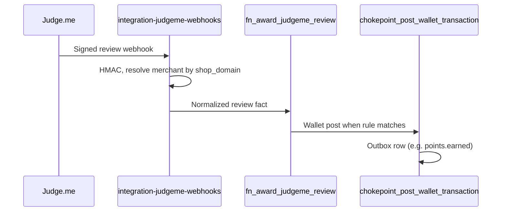

# Third-Party Integrations

Partner-neutral architecture for connecting Rocket CRM to merchant tools (reviews, marketing, support, messaging, storefronts). Patterns apply beyond Shopify; Shopify merchants use the same embedded admin hub.

Owner surfaces: loyalty-admin (`/integrations` and partner detail pages), Render `crm-event-processors` (outbound consumers), Supabase Edge (OAuth, inbound webhooks, Gorgias HTTP endpoints)

## Concept

Third-party integrations move verified data between Rocket and partner systems so merchants can automate marketing, show loyalty context in support, or earn from partner-originated activities. Every integration is described first with four questions — not with code:

| Question | Meaning |
| --- | --- |
| **Event** | What business moment triggers work? Who emits it — fact, command, or scheduled sync? |
| **Data** | Minimum payload and identity fields; what is immutable delta vs current snapshot? |
| **Flow** | Push, pull, signed webhook, on-demand lookup, or agent command — OAuth is permission only, not a flow type. |
| **Purpose** | Merchant or shopper outcome after delivery (automation, ticket context, points for a review). |

**Plumbing** covers connect/disconnect, credential storage, signature verification, delivery logging, consumer cursors, sync jobs, and the admin catalog. **Feature** covers loyalty policy: how many points for a video review, which Klaviyo metric fires, whether an agent may add goodwill points. Connecting a partner must never imply points, tiers, or campaigns by itself.

**Managed connector** — OAuth or token connect, branded admin detail page, partner-specific edge/runtime modules (Judge.me, Klaviyo, Gorgias). **Registry modal** — few fields saved through generic integration config (Custom Webhook URL, LINE channels, storefront credentials). **Custom Webhook** — canonical outbound firehose when the merchant owns the HTTPS endpoint; contract detail lives in `Outbound_Integrations.md`.

**Connection health** (merchant-visible): disconnected (no active permission), connected (healthy recent delivery or provisioning), degraded (permission exists but repeated delivery or partner provisioning failed). Disconnect deactivates credentials and stops traffic; feature rules elsewhere stay unless product says otherwise.

**Outbound bus** — after loyalty commits, a transactional outbox row exists in the same database transaction as the business change. External integrations tail that bus through per-consumer cursors; they do not block core writes. Core automations (tier, mission, notification) use a separate publisher path into Inngest from the same outbox.

## Rules

### Design gate (before implementation)

- Every new integration must complete the event/data/flow/purpose table and the sentence: *When **[event]** in **[source]**, send or request **[data]** through **[flow]** so **[purpose]**.*
- Core loyalty mutations use shared chokepoints only; partner HTTP must not run inside wallet, member, purchase, or redemption transactions.
- If the business change commits, its outbox event exists; if it rolls back, no event exists.
- Partner payloads are never source of truth for points, tier, rewards, or member status.
- Public partner event names (`points.earned`, `reward.redeemed`, …) are mapped centrally; new partners consume that vocabulary unless product adds a new canonical key.

### Flow patterns (choose one primary)

| Pattern | Direction | Use when |
| --- | --- | --- |
| Outbound event | Rocket → partner | Business event should trigger partner automation |
| Snapshot sync | Rocket → partner | Partner needs current state for many members |
| Inbound webhook | Partner → Rocket | Partner reports a completed fact (published review) |
| On-demand lookup | Partner → Rocket → partner | Partner UI needs live loyalty context |
| Inbound command | Partner → Rocket | Verified user action requests a core mutation (goodwill points) |

### Inbound handling

- Verify signature on raw body before parse or side effects; resolve merchant from verified shop/account or connection secret — never trust unsigned `merchant_id` or amounts in JSON.
- **Fact webhooks** normalize and dedupe, then call a feature boundary (review earn decides points). **Commands** validate limits and call wallet chokepoint. **Lookups** return a partner view model from live snapshot resolution.
- Identity preference: linked platform customer id → verified external id → normalized email → phone where policy allows. No auto-create unless the product explicitly allows it.
- Duplicate webhook delivery returns success with no second side effect. Upgrades to the same object may pay only the delta when product allows (e.g. photo added after text review).

### Outbound handling

- Resolve active credential for merchant; apply subscription/config; build payload from event delta plus **current** member snapshot where required (`fn_integration_resolve_member_snapshot` — live CRM, not stale event body).
- Missing email (or required external id) → skip with named reason, not silent failure.
- **Sync all** sends historical **state**, not historical **events** — replaying earn metrics would retrigger campaigns.
- Live v1 workers: bounded in-process retries, then log failure, advance consumer cursor, mark credential degraded after repeated failures. Events missed while disconnected are not replayed; reconnect + Sync all repairs profile state, not historical partner metrics.

### OAuth and admin callback

- OAuth start requires admin JWT; merchant context resolved server-side. State binds merchant, integration key, expiry, nonce; PKCE where supported. Tokens never appear in browser URLs.
- Callback redirects with `?partner=connected|error` (optional `provision=degraded`, safe `reason` code). Query string is a **notification** only; detail pages render authoritative state from BFFs after `router.refresh()`.
- Embedded Shopify: open partner authorization in top window; return via portal or Shopify Admin deep link when shop handle is recoverable.

### Admin UX boundaries

- Integration pages show connect health, sync, data/event documentation, and links to feature configuration — not point amounts, tier matrices, earn limits, or refund policy (those live under Earn, Rewards, Tiers, etc.).
- Judge.me connect alone awards zero points; earn rules under **Earn from activities** own amounts and limits.

### Example (non-obvious)

When a Judge.me review is **published** with video, the inbound receiver verifies HMAC and calls the review earn feature; the feature classifies video > photo > text, matches member by Shopify customer id then email, applies once-per-product/lifetime/unlimited from the active app-event rule, pays delta on media upgrade, dedupes by review id, and posts wallet through the chokepoint — which may independently emit `points.earned` for Klaviyo.

## Journeys

| Page / area | Repo | Backend |
| --- | --- | --- |
| Integrations hub | loyalty-admin | `bff_get_merchant_credentials`, catalog match on `integration_key` / `service_name` |
| `/integrations/judgeme` | loyalty-admin | `bff_integration_judgeme_*`, edges `integration-judgeme-*` |
| `/integrations/klaviyo` | loyalty-admin | `bff_integration_klaviyo_*`, `bff_upsert_integration_config`, edges `integration-klaviyo-oauth-*` |
| `/integrations/gorgias` | loyalty-admin | `bff_integration_gorgias_*`, edges `integration-gorgias-*` |
| Registry modal integrations | loyalty-admin | `bff_get_integration_config`, `bff_upsert_integration_config`, `integration-config-api` |
| Earn from activities (Judge.me) | loyalty-admin | App-event earn rules (not on integration page) |

### Admin journey

| Setting / control | Effect |
| --- | --- |
| Connect / Disconnect (partner panel) | Creates or deactivates `merchant_credentials`; inbound webhooks no-op when inactive |
| OAuth Connect | Top-window grant; tokens stored server-side; optional partner provisioning (Gorgias widget, Judge.me webhooks) |
| Judge.me private token + shop | Alternative to OAuth; validates before activate |
| Klaviyo **Sync new members** | Config flag via `bff_upsert_integration_config`; gates `member.created` outbound handling |
| Klaviyo **Sync all** | Starts `integration_sync_jobs` bulk profile import (state only) |
| Custom Webhook URL + event subscriptions | Saves endpoint and keys; outbound via webhook consumer + HMAC headers |
| LINE Messaging modal | Channel credentials + optional webhook fan-out destinations |
| Shopify card (Online Store) | Separate connect modal; storefront identity and orders — see `Shopify.md` |

**Integrations hub**

1. Open **Integrations**. **Your integrations** lists active credentials; **Browse** shows category rail (Reviews, Email & Marketing, Customer Service, Messaging, Online Store, Marketplace) and catalog cards.
2. Search and recommended cards filter the catalog; connection chips come from credentials matched to each card’s `integration_key`.
3. **Detail** experience (`experience: detail`) navigates to `/integrations/{partner}` (Judge.me, Klaviyo, Gorgias). **Modal** experience opens registry-driven config (LINE, Custom Webhook, Shopify, marketplaces).

**Judge.me**

1. Open **Integrations → Judge.me** (Reviews).
2. **Connect** via OAuth or paste private API token (shop domain prefilled from Shopify credential when present).
3. On success, Rocket registers review webhooks (`review/published`, `review/updated`, `review/unpublished`). If webhook registration fails, connection may show **degraded** — disconnect and reconnect.
4. Use CTA to **Earn from activities → Write a product review** for points matrix (type × VIP tier), frequency limit, and status — not on the integration page.

**Gorgias**

1. Open **Integrations → Gorgias** (Customer Service).
2. Enter Gorgias account subdomain → **Connect** (OAuth).
3. On success, Rocket provisions Gorgias HTTP integration and ticket sidebar via Gorgias API; tokens and `gorgias_integration_id` stored in credentials.
4. If OAuth succeeds but provisioning fails, status **degraded** — repair path shown on detail page.

**Klaviyo**

1. Open **Integrations → Klaviyo** → OAuth connect.
2. Toggle **Sync new members**; run **Sync all** when backfilling profiles after connect or drift.
3. Build flows in Klaviyo using Rocket metrics and profile properties — event key → metric mapping and delivery mechanics are specified in `Outbound_Integrations.md`.

**OAuth return (all managed OAuth partners)**

1. Partner callback edge redirects to `/integrations?{partner}=connected|error` (and optional flags).
2. Client `*-oauth-handler.tsx` forwards to `/integrations/{partner}`, shows one toast, strips query params, refreshes server data.

### Member journey

Members do not connect integrations. They experience outcomes: marketing messages when Klaviyo flows run, loyalty fields on Gorgias tickets (support sees; member sees normal ticket UX), points after a published Judge.me review when earn rules are active and identity matches.

### Shopify

- Integrations hub and partner detail pages run in the **same embedded loyalty-admin** as referrals and on-site content (`/integrations`, `/integrations/judgeme`, etc.).
- Judge.me shop domain resolution prefers an active **Shopify** storefront credential; review matching uses Shopify customer id from `reviewer.external_id` when present.
- Shopify app connect is the **Online Store** card (modal), not the marketing integration detail shell — platform OAuth, webhooks, and billing remain in `Shopify.md`.
- Klaviyo and Gorgias contracts are channel-agnostic; Shopify members with email sync like other channels.

## System

### Data model

| Store | Role |
| --- | --- |
| `merchant_credentials` | Per-merchant partner account: tokens/secrets in `credentials` jsonb, `service_name` (= integration key), `is_active`, `health_status`, `external_id`, `webhook_url`, expiry |
| `integration_type_master` | Registered integration types and display metadata |
| `integration_field_definitions` | Registry-driven merchant-editable fields (modal integrations) |
| `chokepoint_event_outbox` | Durable internal business events after chokepoint commits |
| `integration_outbox_cursor` | Per-consumer read position on the outbox (`consumer_key`, `last_id`) |
| `integration_delivery_log` | Final per-event/per-credential delivery outcome (30-day purge) |
| `integration_sync_jobs` | Klaviyo Sync all progress counters and partner job ids |
| `judgeme_review_award` | Dedupe and audit for review earn (review id, type, points, ledger refs) |

Use `service_name = integration_key` unless a platform intentionally splits products (e.g. Lazada chat vs marketplace scopes). Prefer partial unique index when only one partner account per merchant is allowed.

### Functions

| Function | Role |
| --- | --- |
| `chokepoint_post_wallet_transaction` | All currency awards/adjustments including Gorgias goodwill and Judge.me review pay |
| `chokepoint_post_user_event` | Canonical member lifecycle |
| `fn_match_marketplace_user` | Identity match from platform customer id / email / phone |
| `fn_integration_resolve_member_snapshot` | Partner-safe current member state for outbound and Gorgias map |
| `fn_award_judgeme_review` | Review classification, eligibility, limits, dedupe → wallet chokepoint |
| `fn_integration_gorgias_resolve_by_email` | Member lookup for ticket context |
| `fn_integration_gorgias_map_snapshot` | Widget JSON (points, tier, referral URL, store credit when present) |
| `fn_integration_gorgias_award_points` | Validates agent command → wallet chokepoint |
| `bff_get_merchant_credentials` | Admin hub connection list |
| `bff_get_integration_config` / `bff_upsert_integration_config` | Registry modal save/load (e.g. Klaviyo flags, webhook subscriptions) |
| `bff_integration_judgeme_get_connection` / `_disconnect` | Judge.me admin state |
| `bff_integration_klaviyo_get_connection` / `_disconnect` / `_start_sync_all` | Klaviyo admin state and sync job |
| `bff_integration_gorgias_get_connection` / `_disconnect` | Gorgias admin state |
| `fn_integration_webhook_url_is_public` | SSRF guard for merchant-supplied webhook URLs |
| `trigger_integration_webhook_credential` | Credential-side hooks for custom webhook integration |

Partner-specific OAuth helpers live in Edge `_shared/integration-oauth/` patterns (state, PKCE, token store).

### Flows

**Core vs external publishers**

- **Inngest path:** `OutboxPublisher` in `crm-event-processors` allowlists internal topics (`crm.events.wallet`, etc.) for shared engines (currency, tier, mission, notification, AMP).
- **Integration path:** `IntegrationWebhookPublisher` (Custom Webhook) and `IntegrationKlaviyoEventConsumer` tail `chokepoint_event_outbox` via independent cursors — not through Inngest. Feature flags: `INTEGRATION_WEBHOOK_ENABLED`, `INTEGRATION_KLAVIYO_ENABLED`.

**Public outbound event keys (representative)**

| Public key | Typical use |
| --- | --- |
| `points.earned` / `burned` / `expired` / `adjusted` | Klaviyo metric on earn; profile-only on others |
| `reward.redeemed` | Klaviyo metric |
| `tier.upgraded` / `downgraded` | Klaviyo tier metrics |
| `referral.friend_claimed` / `referral.completed` | Klaviyo referral metrics |
| `member.created` / `member.updated` | Profile sync; created gated by Klaviyo config |
| `birthday.reward_issued` | Klaviyo when distinguishable |

Custom Webhook envelope: `{ id, type, version, occurred_at, merchant_id, data }` with `data.event` delta and `data.member` snapshot; headers `X-Rocket-Event`, `X-Rocket-Delivery`, timestamped HMAC (`X-Rocket-Signature`). Endpoint must be public HTTPS (no loopback/private hosts).

**Judge.me inbound**



**Gorgias bidirectional**

- Lookup: Gorgias GET `integration-gorgias-member` (connection secret + customer email) → resolve → map snapshot.
- Command: Gorgias POST `integration-gorgias-adjust` → `fn_integration_gorgias_award_points` → wallet → optional Klaviyo via outbox.

**OAuth connect (managed partners)**

```mermaid
sequenceDiagram
  participant Admin
  participant Start as integration-*-oauth-start
  participant Partner
  participant CB as integration-*-oauth-callback
  participant DB as merchant_credentials

  Admin->>Start: JWT connect
  Start->>DB: Park signed state / PKCE
  Start-->>Admin: authorization_url
  Admin->>Partner: Top-level OAuth
  Partner->>CB: code + state
  CB->>Partner: Token exchange
  CB->>DB: Tokens + health; provision webhooks/widgets
  CB-->>Admin: Redirect ?partner=connected
```

**Cross-feature interactions (Shopify merchants)**

| Scenario | Behavior |
| --- | --- |
| Referral completes | Outbox referral keys may update Klaviyo if connected |
| Judge.me review earn | Wallet outbox → Klaviyo profile/metric; hub earn tiles when rules expose activity |
| Gorgias Add earnings | Goodwill wallet post → outbox → Klaviyo profile update |
| Referral URL in hub / Gorgias | Same member snapshot field mapped to partner attribute |

### External services

**Supabase Edge (live slugs, JWT verify flag)**

| Slug | JWT | Role |
| --- | --- | --- |
| `integration-klaviyo-oauth-start` | Admin | OAuth start |
| `integration-klaviyo-oauth-callback` | Public | OAuth callback |
| `integration-judgeme-oauth-start` | Admin | OAuth start |
| `integration-judgeme-oauth-callback` | Public | OAuth callback |
| `integration-judgeme-connect` | Admin | Private token connect |
| `integration-judgeme-webhooks` | Public | Inbound review HMAC |
| `integration-gorgias-oauth-start` | Admin | OAuth start |
| `integration-gorgias-oauth-callback` | Public | OAuth callback |
| `integration-gorgias-member` | Public | Ticket lookup (connection secret) |
| `integration-gorgias-adjust` | Public | Agent Add earnings |
| `integration-config-api` | Admin | Registry-backed config API |

**Render**

- `crm-event-processors` — `IntegrationWebhookPublisher`, `IntegrationKlaviyoEventConsumer`, core `OutboxPublisher` to Inngest.
- Storefront/order Shopify edges (`shopify-webhooks`, `shopify-register-webhooks`) are platform plumbing — `Shopify.md`.

**Admin implementation**

- Catalog: `loyalty-admin` `integration-catalog.ts` (categories, `experience: detail|modal`, hrefs).
- Hub: `integrations-hub.tsx`; detail shell: `integration-detail-shell.tsx`; partner panels and `*-oauth-handler.tsx` under `src/app/(admin)/integrations/`.

### Known gaps

- Guaranteed delivery of every outbound event is **not** implemented — cursor advances after bounded retries; persistent per-destination queues would be required for strict eventual delivery.
- `REGISTRY_RENDER.md` edge inventory may lag deploys; live Edge list on project `wkevmsedchftztoolkmi` is authoritative for integration slugs above.
- Klaviyo metric names, attribute list, and webhook signing detail are maintained in `Outbound_Integrations.md` to avoid duplicate drift.
- Shopify Flow extensions (bidirectional with Flow) follow same chokepoints but are documented under `Shopify.md`, not as separate partner backends here.

### Shopify

- Embedded admin routes above; Shopify connect modal separate from Klaviyo/Gorgias/Judge.me detail routes.
- Judge.me depends on Shopify shop linkage for domain and customer id matching when available.

## Related

- **`Outbound_Integrations.md`** — Custom Webhook contract, Klaviyo consumer behaviour, delivery log, signing headers, and sync job detail.
- **`Shopify.md`** — Storefront OAuth, `shopify-webhooks`, embedded admin shell, Shopify card on integrations hub, Flow extensions.
- **`Activity_Based_Earning.md`** (app events) — Judge.me review earn matrix and frequency limits.
- **`requirements/reference/SHOPIFY_REFERRALS_ONSITE_INTEGRATIONS.md`** — Part 3 (integrations on Shopify); product narrative cross-check for hub journeys.
- **`Platform_Plan_Feature_Registry.md`** — Plan gates when integrations or earn features are entitlement-scoped.
