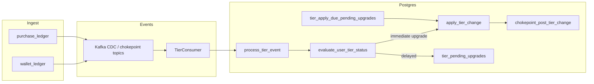

# Tier

Earn-over-period loyalty tiers: shared program clock per user type, amount-based ladder, upgrade and maintenance evaluation, tier-based earn/burn overrides, entry rewards, and member-facing display.

Owner surfaces: loyalty-admin, loyalty-user, Shopify (storefront widget, loyalty landing VIP, customer-account hub)

## Concept

**Tier program** — One measurement contract per merchant × user type (`tier_program_config`): which metric counts (points, tickets, sales, orders), how the evaluation window is shaped (calendar year vs rolling months), when upgrades apply (`immediate` vs end of month), and whether members must re-qualify each period or keep tier for life (`maintain_mode`).

**Tier rung** — Named level in `tier_master` with an optional upgrade **threshold** (`tier_conditions`, type `upgrade` only). Ladder order and “free entry” are **derived** from active upgrade amounts on the persona-effective ladder (`fn_tier_ladder_for_user` / `v_tier_ladder`), not from stored ranking or an `entry_tier` flag (removed).

**Progress** — `tier_progress` is the member-facing snapshot (current/next tier, progress percents, maintain deadline for display). Authoritative maintenance scheduling lives in `tier_evaluation_tracking` when `maintain_mode = period`.

**Tier change** — All ledger writes go through `chokepoint_post_tier_change` → `tier_change_ledger`; the apply path is `apply_tier_change` (upgrade, downgrade, maintain outcomes).

**Tier-conditioned earn/burn** — Order and activity earn rules may define per-tier rate columns (Shopify entitlements). Points→discount **burn** defaults on merchant currency settings; `tier_master.burn_rate` is an optional per-tier override resolved by `fn_resolve_burn_rate` / member `get_user_burn_rate`.

**Display layer** — Icon, color, benefit lines (`benefits` JSONB), and `card_design` are presentation-only; they do not affect qualification.

**Entry rewards** — Configured welcome lines on a tier (`tier_entry_rewards`); granted once per member per line on successful **upgrade** via `fn_grant_tier_entry_rewards` → `fn_dispatch_outcome` (`source_type = tier_entry_reward`). Independent of display “perks” and of earn-rules lifecycle automations.

**Persona scope** — Tiers may target personas via `tier_persona_assignments` (preferred). Legacy `tier_master.persona_id` remains for compatibility; matching uses persona-aware ladder helpers.

**Custom evaluation (beta)** — `tier_program_config.evaluation_mode = custom` routes progress and some apply side-effects through merchant-specific cache jobs (e.g. FuturePark); standard merchants use `standard`.

## Rules

- Program config must exist for a user type before tier thresholds save or evaluation runs; upsert via `bff_upsert_tier_program_config`.
- **Metric** — `points` / `ticket` sum `wallet_ledger` earn rows in the program window; `sales` / `orders` read `purchase_ledger` (sales sums signed amounts; orders count positive purchases; refunds reduce totals via ledger rows, not row deletion).
- **Window** — `period_type = calendar_year` uses `period_start_month`; `rolling` uses `rolling_months` (1–36). Optional `program_start_date` clamps window start. Legacy per-condition `window_type` / `frequency` on `tier_conditions` are retired.
- **Upgrade threshold** — At most one active `upgrade` condition per tier; unique active upgrade **amount** per merchant × user type. Multiple tiers = multiple rungs on the same program clock.
- **Qualification** — Member qualifies for the **highest** upgrade amount on their ladder they meet in the current window; **non-adjacent skips** allowed. If no rung has a null (free-entry) amount and the member meets no threshold, **current tier may be null** until they earn.
- **Free entry** — A rung with null upgrade amount is the default for matching personas; assigned on signup/create through the tier setup path when that rung exists.
- **Upgrade timing** — `immediate`: same evaluation that detects qualification calls `apply_tier_change`. `end_of_month` (and configured effective date): row in `tier_pending_upgrades`; **not** current tier until `tier_apply_due_pending_upgrades` (daily) re-evaluates and applies.
- **Pending upgrades** — One pending row per user × merchant (upsert). Superseded when a new qualification arrives. Re-check at `effective_at`; apply only if still qualified; clear pending on maintain/downgrade paths.
- **Maintain** — `maintain_mode = lifetime`: no automatic downgrade; maintenance deadlines not enforced. `maintain_mode = period`: each period the member must still meet their **current rung’s upgrade amount** in the program window; failure downgrades to the highest lower rung still qualified, or null tier if none (unless free-entry floor exists).
- **Maintain deadline** — For `period`, computed via `calculate_maintain_deadline` from program clock; stored on `tier_evaluation_tracking` and mirrored to `tier_progress.maintain_deadline` for UI.
- **Downgrade lock** — `user_accounts.tier_lock_downgrade` / `tier_locked_downgrade_until` block automatic downgrades; upgrades still apply.
- **Reversals** — Refunds and point reversals trigger re-evaluation when they affect the program metric (purchase/wallet chokepoint events → tier consumer).
- **Display** — `benefits` lines never gate earn, burn, or tier logic.
- **Entry rewards** — Fire only on `apply_tier_change` with `p_change_type = upgrade` and successful, non-skipped apply. Each `tier_entry_reward_id` grants at most once per user (`tier_entry_reward_grants` unique). Failed dispatch records `grant_status = failed` without blocking tier change.
- **Burn** — `tier_master.burn_rate` NULL → use merchant default; numeric override wins for that tier. `0` or disabled tier policy = no burn for that tier where product rules enforce it.
- **Shopify plan entitlements** — Runtime may hide admin knobs or ignore off-plan tier features while keeping dormant config (`fn_merchant_shopify_feature_enabled`); see System › Shopify.

## Journeys

### Admin journey

| Page / surface | Owning repo | BFF / RPC |
| --- | --- | --- |
| Tier list & program clock | loyalty-admin | `bff_get_tier_program_config`, `bff_upsert_tier_program_config` |
| Tier conditions (amounts) | loyalty-admin | `bff_upsert_tier_with_conditions`, `get_tier_conditions_by_type` |
| Tier display | loyalty-admin | `bff_upsert_tier_display`, `get_tier_display_config` |
| Entry rewards | loyalty-admin | `bff_get_tier_entry_rewards`, `bff_upsert_tier_entry_rewards` |
| Tier history | loyalty-admin | `bff_get_tier_history` |
| Per-tier order earn matrix | loyalty-admin | Earn rules UI; entitlement `tier.per_tier_earn_rate` |
| Per-tier burn override | loyalty-admin | Tier + currency settings; entitlement `tier.per_tier_burn_rate` |
| Sales/Orders metrics in program | loyalty-admin | Program `metric`; entitlement `tier.conditions_by_spend_orders` (Growth+) |

| Setting | Effect on behaviour |
| --- | --- |
| Program `metric` | What accumulates toward every rung in that user type |
| `period_type` / `period_start_month` / `rolling_months` | Shared evaluation window for all tiers |
| `upgrade_timing` | Immediate tier change vs queue until period end |
| `maintain_mode` | Lifetime status vs re-qualify each period |
| `program_start_date` | Optional lower bound on window start |
| `evaluation_mode` | `standard` vs `custom` loyalty apply/cache pipeline |
| Tier `upgrade` amount | Threshold for that rung; null = free entry |
| Persona assignments | Which members see which rungs |
| `burn_rate` on tier | Optional override of merchant default burn |
| Display tab fields | Icon, color, benefits, card design only |
| Entry reward rows | Points or reward grants on first attainment of rung |
| Downgrade lock on member | Blocks auto-downgrade until expiry |

1. Open **Tier conditions settings** for the merchant user type; save **program config** first.
2. Add or edit tiers: name, personas, upgrade amount (or leave null for free entry), optional burn override.
3. Optional **Display** tab: icon, color, benefit lines, card design; save independently from conditions.
4. Optional **Entry rewards**: add points or reward lines; save via entry-reward upsert (campaign slot `tier_entry` in reward relation layer).
5. Optional: configure per-tier earn columns on order/activity earn rules (Shopify embedded when entitled).
6. Publish; evaluation runs on wallet/purchase events and daily batch for pending upgrades and period maintenance.

### Member journey

| Page / surface | Owning repo | BFF / RPC |
| --- | --- | --- |
| Tier card / progress | loyalty-user | `get_user_tier_progress` |
| Points→discount quote | loyalty-user / checkout | `get_user_burn_rate` → `fn_resolve_burn_rate` |
| Tier change notifications | loyalty-user | Driven by tier change chokepoint / notification templates |

1. On join, receive free-entry rung when the ladder defines one for the member’s persona; otherwise no tier until first qualification.
2. Purchases and point earns update ledger → tier evaluation → immediate upgrade or pending row.
3. Progress UI shows current tier (nullable), next rung, percents, maintain deadline when `period` mode applies.
4. On upgrade, entry rewards dispatch; member may see new benefits on tier card (display only).
5. At period end, maintenance pass may downgrade if the member no longer meets their rung’s amount.

### Shopify

| Surface | What the member sees | Tier data source |
| --- | --- | --- |
| Loyalty landing **VIP** (`shopify_landing_vip`) | Program-fed tier columns (icon, benefits, checkmarks); not hand-edited per tier in CMS | `get_tier_display_config()` via `fn_enrich_shopify_landing_sections`; member overlay `fn_overlay_shopify_landing_member_state` (`{tier_name}` on hero) |
| **Points on product** / widget drawer | Earn estimate uses member tier when session cache holds tier id | `api_get_widget_settings_cached('shopify', shop)` → `resolved.earn_rate` (base + `per_tier`, floor rounding) |
| Customer account **Loyalty hub** | Balance + **tier card** beside introduction; VIP in activity/history | `bff_user_get_shopify_hub` / `fn_compose_shopify_hub` via `shopify-extension-api` `GET /hub` |
| Embedded admin | Tiers nav, program clock, entry rewards, per-tier earn grid | Same CRM tables; section visibility per [`Shopify.md`](./Shopify.md) § UI-HIDING |

Landing CMS does **not** store tier colors or per-tier earn overrides — VIP tiles are enriched from program truth. Merchant installs landing/hub via on-site content hub (`/on-site-content`); publish/cache plumbing: [`Display_Settings.md`](./Display_Settings.md), [`Shopify.md`](./Shopify.md). **Landing page** entitlement: `display.shopify_landing_page` (Essential+). Hub and product block are available on all plans per reference MD Part 2.

**Outbound (Klaviyo)** — Tier lifecycle metrics `tier.upgraded` / `tier.downgraded` (VIP achieved/downgraded) when outbound integration is configured; see [`Outbound_Integrations.md`](./Outbound_Integrations.md).

## System

### Data model

| Table | Role |
| --- | --- |
| `tier_program_config` | One row per merchant × `user_type`: `metric`, `period_type`, `period_start_month`, `rolling_months`, `upgrade_timing`, `maintain_mode`, `program_start_date`, `evaluation_mode` |
| `tier_master` | Rung identity: `tier_name`, `user_type`, optional `persona_id` (legacy), `burn_rate`, display JSON (`icon`, `color`, `benefits`, `card_design`) |
| `tier_conditions` | `condition_type` = `upgrade` only; `amount` threshold; `active_status` |
| `tier_persona_assignments` | Many-to-many tier ↔ persona |
| `tier_progress` | Per user × merchant display snapshot |
| `tier_evaluation_tracking` | Maintenance deadlines and processing metadata (`maintain_mode = period`) |
| `tier_pending_upgrades` | Delayed upgrades: `from_tier_id`, `to_tier_id`, `effective_at` |
| `tier_change_ledger` | Immutable tier changes; written only via `chokepoint_post_tier_change` |
| `tier_entry_rewards` | Welcome lines: `reward_kind` points or reward, sort order, active flag |
| `tier_entry_reward_grants` | Idempotency + status per user per line |
| `user_accounts` | `tier_id`, downgrade lock fields |

Member metric totals for the program window are computed in `calculate_tier_metric_value` / evaluation helpers reading `wallet_ledger` and `purchase_ledger` (buyer vs seller attribution on purchases).

### Functions

| Function | Role |
| --- | --- |
| `bff_get_tier_program_config` / `bff_upsert_tier_program_config` | Admin program clock |
| `bff_upsert_tier_with_conditions` | Tier + upgrade amount + persona sync |
| `bff_upsert_tier_display` | Display-only patch on `tier_master` |
| `bff_get_tier_entry_rewards` / `bff_upsert_tier_entry_rewards` | Entry reward CRUD |
| `get_tier_display_config` | All tiers with display payload (admin + landing enrichment) |
| `get_user_tier_progress` | Member card: progress + display fields for current/next tier |
| `evaluate_user_tier_status` | Recommendation engine: upgrade / downgrade / maintain / assign entry; does not write ledger |
| `process_tier_event` | Single RPC entry from event consumer: evaluate, apply immediate upgrade, upsert/clear pending, refresh progress |
| `apply_tier_change` | Apply tier move + entry rewards on upgrade; wraps core + custom progress refresh |
| `chokepoint_post_tier_change` | Sole `tier_change_ledger` writer; emits tier change domain events when not skipped |
| `tier_upsert_pending_upgrade` / `tier_cancel_pending_upgrade` / `tier_apply_due_pending_upgrades` | Pending queue lifecycle |
| `evaluate_and_apply_chunk` / `get_tier_evaluation_chunks` | Daily batch maintain/downgrade and reconciliation |
| `calculate_maintain_deadline` / `fn_tier_window` | Program-window and deadline math |
| `fn_tier_ladder_for_user` / `get_merchant_tiers` | Ladder resolution for UI and evaluation |
| `fn_resolve_burn_rate` / `get_user_burn_rate` | Effective burn for tier (member API) |
| `fn_grant_tier_entry_rewards` | Dispatch entry lines after upgrade |
| `ensure_tier_progress` | Progress row upkeep (invoked from apply path) |
| `fn_enrich_shopify_landing_sections` / `fn_overlay_shopify_landing_member_state` | Landing VIP + hero placeholders |
| `api_get_widget_settings_cached` | Storefront earn settings including `per_tier` rates |
| `fn_compose_shopify_hub` / `bff_user_get_shopify_hub` | Hub view model including tier card |

Triggers such as `trigger_invalidate_widget_cache_on_tier_change` refresh Shopify widget cache when tier config affects earn display.

### Flows

**Realtime upgrade path**

1. `wallet_ledger` or `purchase_ledger` change → CDC and/or chokepoint Kafka topics (`crm.events.wallet`, `crm.events.purchase` when enabled).
2. Render **`crm-event-processors`** `TierConsumer` dedupes by source row id → `process_tier_event(user, merchant)`.
3. `evaluate_user_tier_status` → if upgrade and `immediate`, `apply_tier_change` → `chokepoint_post_tier_change` → optional `fn_grant_tier_entry_rewards`.
4. If upgrade and delayed timing, `tier_upsert_pending_upgrade` with `effective_at`; member tier unchanged until daily apply.

**Daily batch**

1. pg_cron invokes `tier_apply_due_pending_upgrades` for due pending rows (re-verify before apply).
2. Maintain/downgrade chunk jobs use `get_tier_evaluation_chunks` + `evaluate_and_apply_chunk` for `maintain_mode = period` merchants.

**Display refresh**

- Progress fields updated on apply and on evaluation; custom merchants may additionally run `fn_loyalty_cache_upsert_tier_progress` after apply.

```mermaid
flowchart LR
  subgraph ingest [Ingest]
    WL[wallet_ledger]
    PL[purchase_ledger]
  end
  subgraph events [Events]
    K[Kafka CDC / chokepoint topics]
    TC[TierConsumer]
  end
  subgraph db [Postgres]
    PTE[process_tier_event]
    EV[evaluate_user_tier_status]
    APP[apply_tier_change]
    CP[chokepoint_post_tier_change]
    PND[tier_pending_upgrades]
    CRON[tier_apply_due_pending_upgrades]
  end
  WL --> K
  PL --> K
  K --> TC --> PTE --> EV
  EV -->|immediate upgrade| APP --> CP
  EV -->|delayed| PND
  CRON --> APP
```

### External services

| Service | Role |
| --- | --- |
| `crm-event-processors` (Render) | `TierConsumer` on purchase/wallet topics |
| pg_cron | Pending upgrade apply, tier evaluation chunks, ops recon on stale pending rows |
| `shopify-extension-api` / `shopify-proxy` | Hub, balance, landing cache for Shopify surfaces |
| `rewarding-shopify` | UI extensions (`loyalty-hub`, theme `loyalty-widget` blocks) |

**Retired paths (do not document as live)** — PGMQ `tier_evaluation_queue`, QStash bulk tier edge, Inngest `tier-upgrade` sleep workflows as the pending-state store, and per-condition `window_type` / maintain rows on `tier_conditions`. Pending state is **`tier_pending_upgrades` + daily apply**, not Inngest workflow state.

### Entry rewards

| Piece | Behaviour |
| --- | --- |
| Config | `tier_entry_rewards` rows per tier; kinds `points` or `reward` |
| Grant | `fn_grant_tier_entry_rewards` after successful upgrade in `apply_tier_change` |
| Dispatch | `fn_dispatch_outcome` with dedup keys; wallet source `tier_entry_reward` |
| Idempotency | `tier_entry_reward_grants` unique on `(merchant_id, tier_id, user_id, tier_entry_reward_id)` |
| Admin API | `bff_get_tier_entry_rewards`, `bff_upsert_tier_entry_rewards` |
| Reward catalog slots | Campaign relation layer `source = tier_entry` ties rewards to tier slots |

### Shopify

| Entitlement key | Effect |
| --- | --- |
| `display.shopify_landing_page` | Essential+ — landing CMS including VIP section |
| `tier.per_tier_earn_rate` | Standard+ — per-tier columns on order/activity earn (e.g. Judge.me matrix) |
| `tier.per_tier_burn_rate` | Standard+ — tier burn override UI |
| `tier.conditions_by_spend_orders` | Growth+ — program metric sales/orders |
| `lifecycle.tier_change` | Growth+ — lifecycle templates on tier change |
| `reward.tier_reward_eligibility` | Standard+ — reward eligibility by tier |

Earn factor storage for per-tier order rates: [`Currency.md`](./Currency.md) **Journeys › Shopify**. Plan matrix: [`Shopify.md`](./Shopify.md) § ENTITLEMENTS.

### Known gaps

- `bff_get_tier_entry_rewards` / `bff_upsert_tier_entry_rewards` may be absent from `REGISTRY_SUPABASE.md` until next registry regen — functions exist in DB migrations.
- `evaluation_mode = custom` is merchant-specific; standard docs above apply when `evaluation_mode` is null or `standard`. See `requirements/LOYALTY_PROGRESS_EXPIRY_CACHE.md`.
- Admin FE must not send retired fields (`ranking`, `entry_tier`, per-condition windows); see `docs/TIER_PROGRAM_CONFIG_FE_BRIEF.md` if present.
- Checkout points estimate UI extension remains **deferred** (not in production manifest per Shopify reference MD Part 2).

## Related

- **Currency** — Wallet earn, merchant default burn, per-tier earn factors on Shopify.
- **Reward** — Catalog rewards in entry lines; tier eligibility on rewards.
- **Display_Settings.md** — Landing section pipeline, widget cache, on-site content hub.
- **Shopify.md** — Embedded auth, entitlements, extension packaging, proxy routes.
- **Outbound_Integrations.md** — Klaviyo `tier.upgraded` / `tier.downgraded`.
- **Central_Outcome_Dispatcher.md** — `fn_dispatch_outcome` contract for entry rewards.
- **LOYALTY_PROGRESS_EXPIRY_CACHE.md** — Custom tier evaluation mode and cache jobs.
