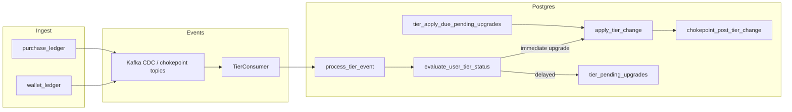

# Tier

Earn-over-period loyalty tiers: shared program clock per user type, amount-based ladder, upgrade and maintenance evaluation, tier-based earn/burn overrides, entry rewards, and member-facing display.

Owner surfaces: loyalty-admin, loyalty-user, Shopify (storefront widget, loyalty landing VIP, customer-account hub)

## Concept

A tier groups members by the **value they give the brand** — measured as points, tickets, spend, or order count — so higher tiers can be given a better experience. It is the "grow" stage of the retention journey (join → earn → burn → grow). Value is deliberately broader than spend: points also come from campaigns, referrals, and automations, so a points-based tier rewards engagement, not just purchases. Tier is one of three independent ways to group a member: **persona** groups by identity (student, corporate partner, dealer) and **tag** by ad-hoc markers (`Tag_and_Persona.md`); one member holds all three.

Settings live at two levels, and the split is the core design rule: everything about *how* value is measured is set once per program and applies to every tier; a tier itself only sets *how much*.

**Tier program** — The single measurement contract per merchant × user type (buyer, seller): which metric counts, the measurement window (rolling N months, or a program year), when upgrades take effect (immediately or at month end), whether tier is kept for life or must be maintained each period, and an optional date before which activity is ignored (for migrations with unreliable history). Buyers and sellers get separate programs because they create value differently — a seller program can measure sales over a short window while buyers are measured on purchases over 12 months. Mixed metrics or windows across tiers of one program are not supported.

**Tier** — A named rung with one **threshold amount** in the program's metric ("Gold = 10,000", meaning 10,000 of the program metric within the program window). A tier with no amount is the **starting tier**: members hold it without earning anything. Ladder order is derived from the amounts.

**Maintain** — Attain and maintain use the same rule: to keep a tier, the member must again reach that tier's amount within the window. There is no separate, lower maintain threshold in standard configuration; programs that need one (e.g. high-ticket, infrequent purchases) require custom evaluation.

**Persona ladder** — Tiers may be restricted to specific personas, so each persona can have its own ladder (dealers: Level 1–3; students: Silver–Platinum).

**Tier benefits** — Tier changes the member's experience in exactly two ways, both configured on the other feature: **earn** (per-tier earn rate or multiplier) and **eligibility** (rewards, or a cheaper point price on them, and campaigns reserved for certain tiers). Burn rate may also be overridden per tier.

**Display** — Name, icon, color, perk lines, card front/back, and background image. Presentation only; perks describe benefits but never grant them.

**Entry rewards** — Points or rewards granted once when a member is upgraded into a tier.

**Progress** — The member-facing snapshot: current tier, next tier, progress toward it, and maintain deadline.

**Custom evaluation (beta)** — Merchant-specific evaluation pipeline for programs the standard rules cannot express.

## Rules

- Program config must exist for a user type before tier thresholds save or evaluation runs; upsert via `bff_upsert_tier_program_config`.
- **Metric** — `points` / `ticket` sum `wallet_ledger` earn rows in the program window; `sales` / `orders` read `purchase_ledger` (sales sums signed amounts; orders count positive purchases; refunds reduce totals via ledger rows, not row deletion).
- **Window** — `period_type = calendar_year` uses `period_start_month`; `rolling` uses `rolling_months` (1–36). Optional `program_start_date` clamps window start. Legacy per-condition `window_type` / `frequency` on `tier_conditions` are retired. The window only decides which activity is summed; it never delays an upgrade (calendar year does not mean "upgrade at year end"). Rolling is the recommended default — calendar year discards progress at year rollover (990 of 1,000 earned in December counts for nothing in January) and is slated for removal from admin config (planned).
- **Upgrade threshold** — At most one active `upgrade` condition per tier; unique active upgrade **amount** per merchant × user type. Multiple tiers = multiple rungs on the same program clock.
- **Qualification** — Member qualifies for the **highest** upgrade amount on their ladder they meet in the current window; **non-adjacent skips** allowed. If no rung has a null (free-entry) amount and the member meets no threshold, **current tier may be null** until they earn.
- **Starting tier (free entry)** — A rung with null upgrade amount is the default for matching personas; assigned on signup/create through the tier setup path when that rung exists.
- **Upgrade timing** — `immediate`: same evaluation that detects qualification calls `apply_tier_change`. `end_of_month` (and configured effective date): row in `tier_pending_upgrades`; **not** current tier until `tier_apply_due_pending_upgrades` (daily) re-evaluates and applies.
- **Pending upgrades** — One pending row per user × merchant (upsert). Superseded when a new qualification arrives. Re-check at `effective_at`; apply only if still qualified; clear pending on maintain/downgrade paths.
- **Maintain** — `maintain_mode = lifetime`: no automatic downgrade; maintenance deadlines not enforced. `maintain_mode = period`: each period the member must still meet their **current rung’s upgrade amount** in the program window; failure downgrades to the highest lower rung still qualified, or null tier if none (unless free-entry floor exists).
- **Maintain deadline** — For `period`, stamped when the tier is achieved: rolling → achievement date + `rolling_months` (upgrade 24 Sep 2026 on 12 months → check 24 Sep 2027 against the 12 months before it); calendar year → last day of the program year containing the achievement date. Stored on `tier_evaluation_tracking`, mirrored to `tier_progress.maintain_deadline` for UI.
- **Direction** — Earn and purchase events only ever upgrade; a downgrade happens only at the maintain evaluation (deadline pass), never as a side effect of an individual event.
- **Manual change** — An admin tier change restarts the maintain clock from that day: the new deadline is computed from the change date, as for an earned achievement.
- **Maintain threshold** — Standard evaluation re-checks the tier's **upgrade** amount; `maintain` rows in `tier_conditions` are ignored. A different attain vs maintain rule is only possible through `evaluation_mode = custom`.
- **Downgrade lock** — `user_accounts.tier_lock_downgrade` / `tier_locked_downgrade_until` block automatic downgrades; upgrades still apply.
- **Reversals** — Refunds and point reversals trigger re-evaluation when they affect the program metric (purchase/wallet chokepoint events → tier consumer).
- **Display** — `benefits` lines never gate earn, burn, or tier logic.
- **Entry rewards** — Fire only on `apply_tier_change` with `p_change_type = upgrade` and successful, non-skipped apply. Each `tier_entry_reward_id` grants at most once per user (`tier_entry_reward_grants` unique). Failed dispatch records `grant_status = failed` without blocking tier change.
- **Burn** — `tier_master.burn_rate` NULL → use merchant default; numeric override wins for that tier. `0` or disabled tier policy = no burn for that tier where product rules enforce it.
- **Shopify plan entitlements** — Runtime may hide admin knobs or ignore off-plan tier features while keeping dormant config (`fn_merchant_shopify_feature_enabled`); see System › Shopify.
- **No automatic tier discount on Shopify** — Holding a tier never applies a discount to every order. Tier perks are delivered only as tier-restricted rewards, per-tier earn/burn rates, and entry rewards on tier-up.

## Journeys

### Admin journey

| Page / surface | Owning repo | BFF / RPC |
| --- | --- | --- |
| Tier list & program clock | loyalty-admin | `bff_get_tier_program_config`, `bff_upsert_tier_program_config` |
| Tier conditions (amounts) | loyalty-admin | `bff_upsert_tier_with_conditions`, `get_tier_conditions_by_type` |
| Tier display | loyalty-admin | `bff_upsert_tier_display`, `get_tier_display_config` |
| Entry rewards | loyalty-admin | `bff_get_tier_entry_rewards`, `bff_upsert_tier_entry_rewards` |
| Tier history | loyalty-admin | `bff_get_tier_history` |
| Per-tier order earn matrix | loyalty-admin | Earn rules UI; entitlement `tier.per_tier_earn_rate` |
| Per-tier burn override | loyalty-admin | Tier + currency settings; entitlement `tier.per_tier_burn_rate` |
| Sales/Orders metrics in program | loyalty-admin | Program `metric`; entitlement `tier.conditions_by_spend_orders` (Growth+) |

| Setting | Effect on behaviour |
| --- | --- |
| Program `metric` | What accumulates toward every rung in that user type |
| `period_type` / `period_start_month` / `rolling_months` | Shared evaluation window for all tiers |
| `upgrade_timing` | Immediate tier change vs queue until period end |
| `maintain_mode` | Lifetime status vs re-qualify each period |
| `program_start_date` | Optional lower bound on window start |
| `evaluation_mode` | `standard` vs `custom` loyalty apply/cache pipeline |
| Tier `upgrade` amount / **Starting tier** toggle | Amount of the program metric needed to attain and (in `period` mode) keep the tier; starting tier = no amount, held from signup |
| Persona assignments (persona type + personas) | Which members see and can hold which rungs |
| `burn_rate` on tier | Optional override of merchant default burn |
| Display tab fields | Name, icon (shown wherever the member's tier is shown), color (theme of the tier page), perk lines (header, description, icon), card front/back image (back enables flip), background image — presentation only |
| Per-tier earn rate, tier eligibility | Set on the earn rule, reward, or campaign — not on the tier |
| Entry reward rows | Points or reward grants on first attainment of rung |
| Downgrade lock on member | Blocks auto-downgrade until expiry |

1. Open **Tier conditions settings**, pick the user type (buyer or seller), and save the **program config** first — it defines what every amount below means.
2. Add or edit tiers: name, persona type and personas, starting tier or upgrade amount, optional burn override.
3. Optional **Display** tab: icon, color, benefit lines, card design; save independently from conditions.
4. Optional **Entry rewards**: add points or reward lines; save via entry-reward upsert (campaign slot `tier_entry` in reward relation layer).
5. Optional: configure per-tier earn columns on order/activity earn rules (Shopify embedded when entitled).
6. Publish; evaluation runs on wallet/purchase events and daily batch for pending upgrades and period maintenance.

### Member journey

| Page / surface | Owning repo | BFF / RPC |
| --- | --- | --- |
| Tier card / progress | loyalty-user | `get_user_tier_progress` |
| Points→discount quote | loyalty-user / checkout | `get_user_burn_rate` → `fn_resolve_burn_rate` |
| Tier change notifications | loyalty-user | Driven by tier change chokepoint / notification templates |

1. On join, receive the starting tier when the ladder defines one for the member’s persona; otherwise no tier until first qualification.
2. Purchases and point earns update ledger → tier evaluation → immediate upgrade or pending row.
3. Progress UI shows current tier (nullable), next rung, percents, maintain deadline when `period` mode applies.
4. On upgrade, entry rewards dispatch; the tier page (opened from profile) shows every tier's card, perks, and the member's position; the card flips when a back image exists. The new tier's earn rate and eligible rewards/campaigns apply from the next action.
5. At period end, maintenance pass may downgrade if the member no longer meets their rung’s amount.

### Shopify

| Surface | What the member sees | Tier data source |
| --- | --- | --- |
| Loyalty landing **VIP** (`shopify_landing_vip`) | Program-fed tier columns (icon, benefits, checkmarks); not hand-edited per tier in CMS | `get_tier_display_config()` via `fn_enrich_shopify_landing_sections`; member overlay `fn_overlay_shopify_landing_member_state` (`{tier_name}` on hero) |
| **Points on product** / widget drawer | Earn estimate uses member tier when session cache holds tier id | `api_get_widget_settings_cached('shopify', shop)` → `resolved.earn_rate` (base + `per_tier`, floor rounding) |
| Customer account **Loyalty hub** | Balance + **tier card** beside introduction; VIP in activity/history | `bff_user_get_shopify_hub` / `fn_compose_shopify_hub` via `shopify-extension-api` `GET /hub` |
| Embedded admin | Tiers nav, program clock, entry rewards, per-tier earn grid | Same CRM tables; section visibility per [`Shopify.md`](./Shopify.md) § UI-HIDING |

Landing CMS does **not** store tier colors or per-tier earn overrides — VIP tiles are enriched from program truth. Merchant installs landing/hub via on-site content hub (`/on-site-content`); publish/cache plumbing: [`Display_Settings.md`](./Display_Settings.md), [`Shopify.md`](./Shopify.md). **Landing page** entitlement: `display.shopify_landing_page` (Essential+). Hub and product block are available on all plans per `Shopify.md` › Rules › Billing and entitlements.

**Outbound (Klaviyo)** — Tier lifecycle metrics `tier.upgraded` / `tier.downgraded` (VIP achieved/downgraded) when outbound integration is configured; see [`Shopify.md`](./Shopify.md) › Rules › Outbound delivery.

## System

### Data model

| Table | Role |
| --- | --- |
| `tier_program_config` | One row per merchant × `user_type`: `metric`, `period_type`, `period_start_month`, `rolling_months`, `upgrade_timing`, `maintain_mode`, `program_start_date`, `evaluation_mode` |
| `tier_master` | Rung identity: `tier_name`, `user_type`, optional `persona_id` (legacy), `burn_rate`, display JSON (`icon`, `color`, `benefits`, `card_design`) |
| `tier_conditions` | `condition_type` = `upgrade` only; `amount` threshold; `active_status` |
| `tier_persona_assignments` | Many-to-many tier ↔ persona |
| `tier_progress` | Per user × merchant display snapshot |
| `tier_evaluation_tracking` | Maintenance deadlines and processing metadata (`maintain_mode = period`) |
| `tier_pending_upgrades` | Delayed upgrades: `from_tier_id`, `to_tier_id`, `effective_at` |
| `tier_change_ledger` | Immutable tier changes; written only via `chokepoint_post_tier_change` |
| `tier_entry_rewards` | Welcome lines: `reward_kind` points or reward, sort order, active flag |
| `tier_entry_reward_grants` | Idempotency + status per user per line |
| `user_accounts` | `tier_id`, downgrade lock fields |

Member metric totals for the program window are computed in `calculate_tier_metric_value` / evaluation helpers reading `wallet_ledger` and `purchase_ledger` (buyer vs seller attribution on purchases).

### Functions

| Function | Role |
| --- | --- |
| `bff_get_tier_program_config` / `bff_upsert_tier_program_config` | Admin program clock |
| `bff_upsert_tier_with_conditions` | Tier + upgrade amount + persona sync |
| `bff_upsert_tier_display` | Display-only patch on `tier_master` |
| `bff_get_tier_entry_rewards` / `bff_upsert_tier_entry_rewards` | Entry reward CRUD |
| `get_tier_display_config` | All tiers with display payload (admin + landing enrichment) |
| `get_user_tier_progress` | Member card: progress + display fields for current/next tier |
| `evaluate_user_tier_status` | Recommendation engine: upgrade / downgrade / maintain / assign entry; does not write ledger |
| `process_tier_event` | Single RPC entry from event consumer: evaluate, apply immediate upgrade, upsert/clear pending, refresh progress |
| `apply_tier_change` | Apply tier move + entry rewards on upgrade; wraps core + custom progress refresh |
| `chokepoint_post_tier_change` | Sole `tier_change_ledger` writer; emits tier change domain events when not skipped |
| `tier_upsert_pending_upgrade` / `tier_cancel_pending_upgrade` / `tier_apply_due_pending_upgrades` | Pending queue lifecycle |
| `evaluate_and_apply_chunk` / `get_tier_evaluation_chunks` | Daily batch maintain/downgrade and reconciliation |
| `calculate_maintain_deadline` / `fn_tier_window` | Program-window and deadline math |
| `fn_tier_ladder_for_user` / `get_merchant_tiers` | Ladder resolution for UI and evaluation |
| `fn_resolve_burn_rate` / `get_user_burn_rate` | Effective burn for tier (member API) |
| `fn_grant_tier_entry_rewards` | Dispatch entry lines after upgrade |
| `ensure_tier_progress` | Progress row upkeep (invoked from apply path) |
| `fn_enrich_shopify_landing_sections` / `fn_overlay_shopify_landing_member_state` | Landing VIP + hero placeholders |
| `api_get_widget_settings_cached` | Storefront earn settings including `per_tier` rates |
| `fn_compose_shopify_hub` / `bff_user_get_shopify_hub` | Hub view model including tier card |

Triggers such as `trigger_invalidate_widget_cache_on_tier_change` refresh Shopify widget cache when tier config affects earn display.

### Flows

**Realtime upgrade path**

1. `wallet_ledger` or `purchase_ledger` change → CDC and/or chokepoint Kafka topics (`crm.events.wallet`, `crm.events.purchase` when enabled).
2. Render **`crm-event-processors`** `TierConsumer` dedupes by source row id → `process_tier_event(user, merchant)`.
3. `evaluate_user_tier_status` → if upgrade and `immediate`, `apply_tier_change` → `chokepoint_post_tier_change` → optional `fn_grant_tier_entry_rewards`.
4. If upgrade and delayed timing, `tier_upsert_pending_upgrade` with `effective_at`; member tier unchanged until daily apply.

**Daily batch**

1. pg_cron invokes `tier_apply_due_pending_upgrades` for due pending rows (re-verify before apply).
2. Maintain/downgrade chunk jobs use `get_tier_evaluation_chunks` + `evaluate_and_apply_chunk` for `maintain_mode = period` merchants.

**Display refresh**

- Progress fields updated on apply and on evaluation; custom merchants may additionally run `fn_loyalty_cache_upsert_tier_progress` after apply.

```mermaid
flowchart LR
  subgraph ingest [Ingest]
    WL[wallet_ledger]
    PL[purchase_ledger]
  end
  subgraph events [Events]
    K[Kafka CDC / chokepoint topics]
    TC[TierConsumer]
  end
  subgraph db [Postgres]
    PTE[process_tier_event]
    EV[evaluate_user_tier_status]
    APP[apply_tier_change]
    CP[chokepoint_post_tier_change]
    PND[tier_pending_upgrades]
    CRON[tier_apply_due_pending_upgrades]
  end
  WL --> K
  PL --> K
  K --> TC --> PTE --> EV
  EV -->|immediate upgrade| APP --> CP
  EV -->|delayed| PND
  CRON --> APP
```

### External services

| Service | Role |
| --- | --- |
| `crm-event-processors` (Render) | `TierConsumer` on purchase/wallet topics |
| pg_cron | Pending upgrade apply, tier evaluation chunks, ops recon on stale pending rows |
| `shopify-extension-api` / `shopify-proxy` | Hub, balance, landing cache for Shopify surfaces |
| `rewarding-shopify` | UI extensions (`loyalty-hub`, theme `loyalty-widget` blocks) |

**Retired paths (do not document as live)** — PGMQ `tier_evaluation_queue`, QStash bulk tier edge, Inngest `tier-upgrade` sleep workflows as the pending-state store, and per-condition `window_type` / maintain rows on `tier_conditions`. Pending state is **`tier_pending_upgrades` + daily apply**, not Inngest workflow state.

### Entry rewards

| Piece | Behaviour |
| --- | --- |
| Config | `tier_entry_rewards` rows per tier; kinds `points` or `reward` |
| Grant | `fn_grant_tier_entry_rewards` after successful upgrade in `apply_tier_change` |
| Dispatch | `fn_dispatch_outcome` with dedup keys; wallet source `tier_entry_reward` |
| Idempotency | `tier_entry_reward_grants` unique on `(merchant_id, tier_id, user_id, tier_entry_reward_id)` |
| Admin API | `bff_get_tier_entry_rewards`, `bff_upsert_tier_entry_rewards` |
| Reward catalog slots | Campaign relation layer `source = tier_entry` ties rewards to tier slots |

### Shopify

| Entitlement key | Effect |
| --- | --- |
| `display.shopify_landing_page` | Essential+ — landing CMS including VIP section |
| `tier.per_tier_earn_rate` | Standard+ — per-tier columns on order/activity earn (e.g. Judge.me matrix) |
| `tier.per_tier_burn_rate` | Standard+ — tier burn override UI |
| `tier.conditions_by_spend_orders` | Growth+ — program metric sales/orders |
| `lifecycle.tier_change` | Growth+ — lifecycle templates on tier change |
| `reward.tier_reward_eligibility` | Standard+ — reward eligibility by tier |

Earn factor storage for per-tier order rates: [`Currency.md`](./Currency.md) **Journeys › Shopify**. Plan matrix: [`Shopify.md`](./Shopify.md) § ENTITLEMENTS.

### Known gaps

- `bff_get_tier_entry_rewards` / `bff_upsert_tier_entry_rewards` may be absent from `REGISTRY_SUPABASE.md` until next registry regen — functions exist in DB migrations.
- `evaluation_mode = custom` is merchant-specific; standard docs above apply when `evaluation_mode` is null or `standard`. See `requirements/LOYALTY_PROGRESS_EXPIRY_CACHE.md`.
- Admin FE must not send retired fields (`ranking`, `entry_tier`, per-condition windows); see `docs/TIER_PROGRAM_CONFIG_FE_BRIEF.md` if present.
- Checkout points estimate UI extension remains **deferred** (not in production manifest per `Shopify.md`).

## Related

- **Currency** — Wallet earn, merchant default burn, per-tier earn factors on Shopify.
- **Reward** — Catalog rewards in entry lines; tier eligibility on rewards.
- **Display_Settings.md** — Landing section pipeline, widget cache, on-site content hub.
- **Shopify.md** — Embedded auth, entitlements, extension packaging, proxy routes.
- **Shopify.md** (Outbound delivery) — Klaviyo `tier.upgraded` / `tier.downgraded`.
- **Central_Outcome_Dispatcher.md** — `fn_dispatch_outcome` contract for entry rewards.
- **LOYALTY_PROGRESS_EXPIRY_CACHE.md** — Custom tier evaluation mode and cache jobs.
