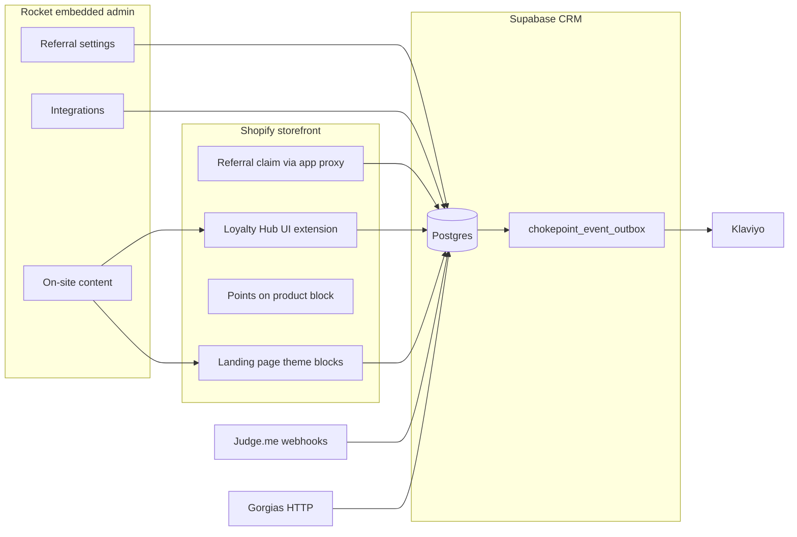
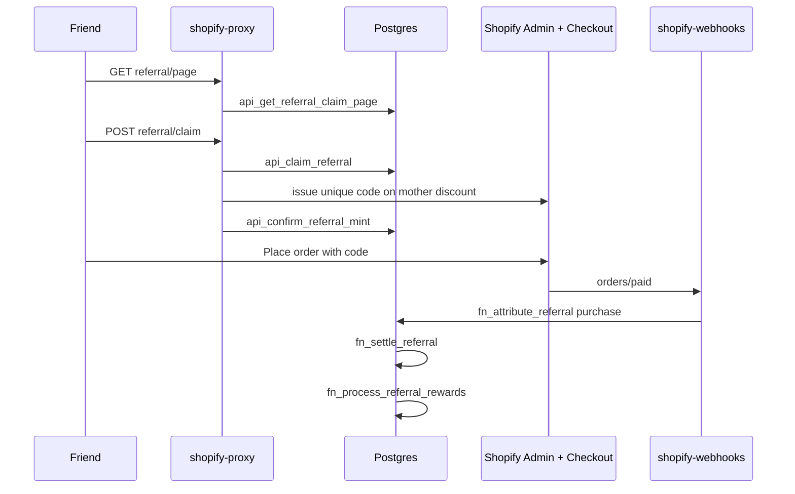
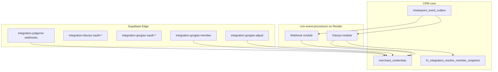

# Shopify — Referrals, on-site content, and integrations

**Audience:** Product and engineering  
**Last verified against code:** 2026-09-17  
**Systems:** `loyalty-admin` (embedded admin), `rewarding-shopify` (theme + UI extensions), Supabase CRM `wkevmsedchftztoolkmi`, Render worker `crm-event-processors` (outbound integrations)

This document describes how three major Shopify-facing capabilities work end to end: **referrals**, **on-site content**, and **third-party integrations** (Judge.me, Klaviyo, Gorgias). It is written as product truth for operators and builders, not as a documentation audit.

---

## How the three areas connect



- **Referrals** configure program rules and outcomes in admin; shoppers see share links on the **landing page**, **Loyalty Hub**, and **widget**; purchase friends **claim** through the **app proxy**; orders **attribute** through shared CRM logic.
- **On-site content** is the merchant mental model for *where* loyalty appears on Shopify; each touchpoint maps to a **theme block** or **UI extension** and a **config home** (Rocket CMS vs Shopify editor).
- **Integrations** reuse one **connection + credential** layer; **feature policy** (points for reviews, Klaviyo flows, Gorgias Add earnings) lives outside the connect page.

---

# Part 1 — Referrals on Shopify

## 1.1 Concept

Rocket runs **one referral program per merchant** with **two independent conversion types**:

| Conversion | Who the friend is | What binds the relationship | When the referrer is rewarded |
|------------|-------------------|-----------------------------|-------------------------------|
| **Signup** | Must become a loyalty **member** | Friend applies the referrer’s **member code** after registration | When apply succeeds (`referral_ledger` signup row settles) |
| **Purchase** | Does **not** need to be a member | Friend **claims** (email/phone) → receives a **unique Shopify discount code** from a **mother discount**; order is matched to an **open claim** | When a qualifying paid order is **attributed** and **settled** |

**Vocabulary**

- **Referrer / inviter** — existing member with a stable **member code** on `user_accounts`.
- **Friend / invitee** — person receiving the offer; on purchase path they are a commerce buyer, not necessarily a CRM user.
- **Referral program** — row in `referral_program`: master switch, `signup_enabled`, `purchase_enabled`, Shopify mother discount id, friend-offer config, share copy, attribution settings.
- **Outcomes** — rows in `referral_outcomes` (party inviter/invitee, conversion signup/purchase): points, tickets, or **catalog reward** grants. Paid through the **central outcome dispatcher** (`fn_dispatch_outcome`), not missions.
- **Purchase friend benefit** — the **commerce discount** (mother + unique code), not an extra inviter-style outcome on the friend unless signup outcomes configure invitee rewards.

**Earn channel** — CMS card `campaign:referral` is **marketing surface only**. Program gate is `fn_is_referral_program_active` / `referral_program.is_active`.

**SMART attribution (purchase)** — `fn_attribute_referral` matches an incoming order to an open `referral_claim` using discount codes on the order, buyer identity (email, phone, Shopify customer id), and program rules (first-order requirements, fraud gates, **30-day attribution window**). Friend code TTL and attribution window are **decoupled**: codes can expire while claims remain attributable until the window ends.

---

## 1.2 Merchant admin journey

**Route:** `/referral-settings` (standalone portal and Shopify embedded app).

**Tabs**

- **Standalone:** Signup | Purchase | History (initial tab from `?tab=signup|purchase|history`).
- **Shopify embedded:** Purchase | History — signup-specific blocks are hidden by design (see surface gating below).

**What merchants configure**

| Area | Purpose |
|------|---------|
| Program active + conversion toggles | Gates all invite, apply, claim, settle paths |
| Signup outcomes | Two cards: **referrer** and **friend** — points, tickets, or reward per row |
| Purchase outcomes | **Referrer** rewards only on Shopify card set when store is connected |
| Friend offer | Mother discount definition (Shopify discount types); saved with atomic referral reward RPCs |
| Share copy | Purchase share messaging resolved at runtime (`fn_referral_resolve_share_copy`, hub/landing labels) |
| Invite limits | Velocity via `transaction_limits` (referral method) |
| History | Ledger list with filters (`bff_list_referral_ledger`) |

**Shopify embedded surface gating** (`REFERRAL_SECTIONS` in `settings-visibility.ts`)

Embedded merchants **do not** see: program master switch, earn-channel banner, signup tab, signup outcomes, marketplace platform picker, shop cap. They **do** see: purchase tab, friend offer, Shopify wrapper copy, purchase outcomes, invite limits, history.

**Purchase tab without Shopify** — empty state directing merchant to **Integrations → Connect Shopify**.

### Campaign reward outcomes (unified pattern)

When an outcome type is **Reward**, the referral page does **not** embed the full reward editor. Flow:

1. Merchant chooses reward type → navigates to **reward settings** with a **campaign slot** in the URL: `from=referral`, `referral_kind=signup|purchase`, `referral_party=referrer|friend`.
2. Slot state is also mirrored in `sessionStorage` (`rocket.campaign-slot`) for App Bridge URL changes.
3. Merchant completes Shopify discount fields (for Shopify-native types) and saves.
4. Save path calls **`bff_attach_campaign_reward`** to link `reward_master` to the slot without duplicating reward rows.
5. **Changing** a reward on the referral row runs **`bff_detach_campaign_reward`** — removes the link; does **not** delete the catalog reward.

The same slot machinery is shared with **tier entry** and **lifecycle workflow** outcomes (`campaign-slot.ts`).

**Atomic Shopify save** — Friend offer + mother discount persistence uses `bff_upsert_referral_reward_atomic` (and related core) so referral settings and `shopify_mother_discount_id` stay consistent; reward editor save may call **`shopify-upsert-reward-discount`** before attach.

---

## 1.3 Member and shopper journeys

### Signup referral

1. Referrer shares link with `?invite={member_code}` (from `bff_user_get_invite`).
2. Friend registers on the member channel (loyalty-user / widget signup).
3. Friend calls **`bff_user_apply_referral(member_code)`** — visit alone never pays.
4. CRM runs **`fn_process_referral_signup`** → ledger + **`fn_process_referral_rewards`** for configured outcomes.
5. Notifications and outbound events fire (see §1.5).

### Purchase referral (Shopify)

1. Referrer shares **purchase hop** — `bff_user_get_invite` exposes nested URLs; public hop uses Rocket **`/r/{merchant}`** (Open Graph for crawlers, redirect for humans) per product routing.
2. Friend lands on storefront with referrer context.
3. **Claim UI** loads via app proxy:
   - `GET …/apps/rewards/referral/page?referrer_code=` → **`api_get_referral_claim_page`**
   - `POST …/apps/rewards/referral/claim` → **`api_claim_referral`** then mint
4. **Mint path (Shopify):** after claim RPC succeeds, proxy calls **`shopify-issue-reward-code`** with `shopify_mother_discount_id` and generated `commerce_code`; on failure **`api_abort_referral_claim`**; on success **`api_confirm_referral_mint`**.
5. Friend checks out with the unique code (optional but typical).
6. **Order webhooks** (`shopify-webhooks` → order upsert/claim pipeline) invoke **`fn_attribute_referral`** (`kind=purchase`) with order keys, buyer identity, discount codes, order counts.
7. On qualify → **`fn_settle_referral`** → **`fn_process_referral_rewards`** for referrer outcomes.
8. **Reconciliation** — `fn_reconcile_missed_referral_purchases` catches edge timing misses.

**Existing customer gate** — Before claim, proxy may call Shopify Admin API to reject emails that already have customer/order history (`EXISTING_CUSTOMER`), consistent with “new friend” positioning.

**Alternate claim edge** — `referral-claim` Edge Function serves marketplace-style hosted claim; Shopify storefront should prefer **HMAC app proxy** paths.

### Where shoppers see referral program content

| Surface | Behavior |
|---------|----------|
| **Loyalty Hub** | Copyable share link; “You get” / “They get” from live outcomes (`fn_compose_shopify_hub`) |
| **Landing page** | `shopify_landing_referrals` section; logged-in copy button label configurable |
| **Widget** | Invite / referral entry per widget settings |
| **Klaviyo** (if connected) | Profile **Rocket Referral URL**; metrics on friend claimed / completed |

---

## 1.4 Engineering reference

### Data model (core tables)

| Table | Role |
|-------|------|
| `referral_program` | Per-merchant config, flags, mother discount id, friend offer JSON |
| `referral_outcomes` | Inviter/invitee rewards per conversion |
| `referral_ledger` | One relationship per invitee; status lifecycle (signup/purchase) |
| `referral_claim` | Open purchase attribution session (friend identity) |
| `referral_code` | Minted commerce codes linked to claims |
| `campaign_reward_relation` | Slot → `reward_master` attachment |

### RPCs and BFFs

| Callable | Role |
|----------|------|
| `bff_get_referral_settings` / `bff_upsert_referral_settings` | Admin read/write |
| `bff_list_referral_ledger` | Admin history |
| `bff_attach_campaign_reward` / `bff_detach_campaign_reward` | Outcome reward slots |
| `bff_upsert_referral_reward_atomic` | Friend offer + Shopify discount cohesion |
| `bff_user_get_invite` | Member share URLs + code |
| `bff_user_apply_referral` | Signup apply |
| `bff_user_get_referral_status` | Hub referral activity modal |
| `api_get_referral_claim_page` | Anon claim landing payload |
| `api_claim_referral` | Create claim + issue code metadata |
| `api_confirm_referral_mint` / `api_abort_referral_claim` | Mint lifecycle |
| `fn_process_referral_signup` | Signup ledger + rewards |
| `fn_attribute_referral` | Signup or purchase attribution |
| `fn_settle_referral` | Close purchase loop + pay referrer |
| `fn_process_referral_rewards` | Outcome dispatcher entry |
| `fn_is_referral_program_active` | Gate |
| `fn_expire_stale_referral_codes` | TTL + 30-day claim expiry |
| `fn_reconcile_missed_referral_purchases` | Backfill |
| `chokepoint_post_referral_event` | Notifications + outbox |

### Edge functions

| Function | Role |
|----------|------|
| `shopify-proxy` | App proxy: landing liquid, **referral/page**, **referral/claim**, wishlist, widget API |
| `referral-claim` | Public claim for non-proxy contexts |
| `shopify-issue-reward-code` | Mint Shopify redeem code against mother discount GID |

### Purchase referral sequence



### Admin frontend (loyalty-admin)

| Path | Role |
|------|------|
| `src/app/(admin)/referral-settings/*` | Tabs, form, ledger |
| `referral-outcome-cards.tsx` | Outcome UI, Shopify friend/referrer cards |
| `src/lib/reward/campaign-slot.ts` | Slot query + return paths |
| `src/lib/reward/campaign-slot-actions.ts` | attach/detach server actions |

### Rules and fraud (summary)

- Program inactive → stable error codes for i18n.
- Self-referral blocked (member code, email canonical match).
- Disposable / existing-shopper gates on purchase path.
- One referral relationship per friend per merchant.
- Clawback path: `fn_clawback_referral` on reversals where product requires.

---

# Part 2 — On-site content on Shopify

## 2.1 Concept

**On-site content** is how merchants discover and install every loyalty **touchpoint** on Shopify. Rocket separates:

1. **What** shoppers see (program-composed data: points, tiers, rewards, referrals).
2. **How** it is packaged in Shopify (theme app extension vs checkout/customer account UI extension).
3. **Where** merchants configure it (Rocket CMS, Display settings, or Shopify’s theme/checkout editor).

**Design rule:** Program truth never lives in Shopify metafields for hub/landing. Servers **compose** view models from CRM (`fn_compose_shopify_hub`, `fn_enrich_shopify_landing_sections`, widget settings cache).

**Plan gating:** Customer account surfaces and wishlist are available on **all** Rocket plans including Free. **Landing page** requires entitlement **`display.shopify_landing_page`** (Essential+). **Checkout points estimate** is **not shipped** (extension directory excluded from deploy).

---

## 2.2 Touchpoint catalog

This is the abstraction merchants should use when planning rollout:

| Touchpoint | Shopify packaging | Block vs page | Merchant config in Rocket | Merchant install in Shopify |
|------------|-------------------|---------------|---------------------------|-----------------------------|
| **Loyalty landing page** | Theme app extension — `shopify_landing_*` sections | Full page (theme template) | CMS `/display-settings/shopify-landing-page`; overview `/on-site-content/landing-page` | Add theme page / app blocks to Online Store |
| **Loyalty Hub** | UI extension `loyalty-hub` in collection `loyalty-account` | **Full page** in customer accounts | Display → Loyalty Hub images; setup `/on-site-content/loyalty-hub` | Checkout & accounts editor → Customer account |
| **Points on product** | Theme block `points-on-product` in `loyalty-widget` | **Embedded block** on product template | Setup `/on-site-content/points-on-product` | Theme editor → product template |
| **Customer account points banner** | UI extension `loyalty-points-balance` | **Block** on order index (`ORDER_INDEX`) | Setup `/on-site-content/points-balance` | Checkout & accounts editor |
| **Points after purchase** | UI extension `loyalty-points-earned` in collection `loyalty-checkout` | **Block** on thank-you + order status | Setup `/on-site-content/points-earned` | Checkout & accounts editor |
| **Wishlist** | Theme `wishlist-heart` + UI `loyalty-wishlist` | Page + heart block | Setup `/on-site-content/wishlist` | Theme + accounts editor |
| **Widget panel** | Theme + `widget.js` launcher | Drawer | `/display-settings/shopify-widget` | Theme (launcher **coming soon** on hub) |
| **Checkout points estimate** | Would be checkout UI extension | Block during checkout | — | **Deferred** (Shopify Plus complexity; not in `extension_directories`) |

**Extension collections (rewarding-shopify)**

- `loyalty-account` includes: `loyalty-hub`, `loyalty-points-balance`, `loyalty-wishlist`.
- `loyalty-checkout` includes: **`loyalty-points-earned` only** (not balance banner).
- `loyalty-checkout-ext` held out of production app manifest so estimate never appears in editor.

---

## 2.3 Merchant admin journey

**Hub route:** `/on-site-content` (Shopify embedded only — gated layout).

**Sections on the hub page**

1. **Loyalty touchpoints** — Landing (status badge draft/published), Panel → widget editor, Launcher (disabled coming soon).
2. **Embedded content** — Loyalty Hub, points banner, points after purchase, Wishlist → each **Set up** opens an intermediate **SurfaceSetupPage** (Smile-style walkthrough: preview image, numbered steps, single primary CTA).
3. **Other touchpoints** — Points on product.

**Primary CTAs** open Shopify editors via **`editor-deep-links.ts`**:

- Resolves **published checkout profile** + app numeric id through Admin GraphQL (cached in sessionStorage).
- **Loyalty Hub** → checkout & accounts editor focused on `loyalty-account` / hub extension.
- **Points earned** → thank-you or order-status page context on `loyalty-checkout`.
- **Points balance** → order list context.
- **Points on product** → theme deep link with `addAppBlockId={api_key}/points-on-product`.
- Fallback URL pattern: `shopify:admin/settings/checkout/editor?context=apps`.

**Landing workflow**

1. On-site content → **Customize** → landing overview (publish state, URL hint).
2. **Edit** opens full-screen CMS at `/display-settings/shopify-landing-page` (sections, brand scheme modal, SEO, publish).
3. **Publish** transitions `merchant_shopify_landing_page_settings.publish_status` to `published`.
4. Storefront serves composed JSON/HTML via app proxy + theme extension (liquid bootstrap for shell).

**Display settings split**

| Concern | Where |
|---------|--------|
| Brand scheme v2.1 (`shopify_brand_scheme`), points name, symbol | `merchant_display_settings` (`primary_color` synced from `tokens.primary`; theme import via admin GraphQL — see **Display_Settings.md** › System › Shopify › Brand scheme and colours) |
| Hub hero / redeem modal / product fallback images | `merchant_widget_settings` row `widget_type = shopify_hub` |
| Landing page shell (padding, import meta), SEO, publish | `merchant_shopify_landing_page_settings` (no page-level CTA defaults; section CTAs fixed in storefront) |
| Landing sections order/content + per-section colours | `display_settings` where `page = shopify_loyalty_landing` (`surface`, `text_hex`, `heading_hex`; hero background/tint/content card) |

---

## 2.4 Shopper experience

### Loyalty Hub (customer account full page)

- **UI baseline:** Compact account layout — introduction, balance, tier as separate cards; categorized earn/spend/referrals; modals for activity and redeem confirmation.
- **Redeem:** POST to CRM redemptions API via gateway; poll **`bff_user_get_redemption_request_status`** by `event_id` (exact request, not “latest for reward”) up to ~8s; pending state dismissible without double POST.
- **Issued codes:** Copy + **Apply to cart** via `/discount/{code}?redirect=/cart` top-level navigation.
- **Referrals:** Live share link; you/they offer labels from composer (no placeholder generics).
- **Spend empty state:** Hide broken UI for shoppers; editor shows setup CTA when no member-visible rewards.

### Points on product

- **Identity-free:** one anonymous fetch to **`api_get_widget_settings_cached('shopify', shop)`** shared with widget (`window.__rocketLoyaltySettings`).
- Earn estimate uses `resolved.earn_rate` (base + per-tier, floor rounding). Guest vs member from widget session cache only.

### Points balance banner (orders list)

- Extension calls **`shopify-extension-api` `/balance`**.
- Includes **`has_affordable_reward`** so CTA toggles earn vs redeem.
- Merchant-editable message supports `{points}` and `{points_name}` tokens.

### Points after purchase

- **`/order-points`** with Shopify order id from extension context.
- Guest session → `{ status: 'guest' }` without leaking balance.
- Logged-in: awarded / pending / reversed / not_found from **`bff_user_get_order_points`**.

### Landing page

- Public cache RPC **`api_get_shopify_landing_page_cached`**; payload includes `brand_scheme` + slim `theme`; enrichment merges earn/spend/VIP/referral tiles and member overlay when logged in (no per-section `style_tokens` in cache).
- Section colours: merchant sets `surface` swatch (`background` \| `dark_surface` \| `primary` \| `custom`) and optional custom heading/body hex; storefront derives cards, links, and buttons from `brand_scheme` + section config (`widget-builder` `resolveSectionTokens`). **Widget panel** drawer uses fixed neutrals for chrome/cards; scheme tints hero, launcher, links, and accents only — see `Display_Settings.md` touchpoint table.
- Guest/member CTAs: fixed routing in storefront (guest → login; member → widget drawer page for that section); section config keeps `show` / `text` / `button_style` only; referrals member = copy-link; FAQ has no button.

### Wishlist

- **Theme:** app proxy HMAC + `logged_in_customer_id` + guest cookie.
- **Account page:** session token → `/wishlist` on extension API (never app proxy from UI extension sandbox).
- **Headless `/store`:** Supabase JWT path — documented in `Shopify.md` § WISHLIST.

---

## 2.5 Engineering reference

### Identity and gateways

| Surface | Auth | Gateway |
|---------|------|---------|
| UI extensions | Shopify **session token** (`shopify.sessionToken.get()`) | Edge **`shopify-extension-api`** verifies JWT (`aud`, `exp`, `dest`), resolves merchant, find/creates member, mints **member JWT server-side only** |
| Theme / app proxy | HMAC + `logged_in_customer_id` + cookies | **`shopify-proxy`** |
| Product block | None | Widget settings cache |

### `shopify-extension-api` routes (representative)

| Method | Path | Member required | Backend |
|--------|------|-----------------|--------|
| GET | `/hub` | No (guest composer) | `bff_user_get_shopify_hub` or `fn_compose_shopify_hub` |
| GET | `/balance` | Yes | Hub subset + affordable flag |
| GET | `/order-points` | No (guest-safe) | `bff_user_get_order_points` |
| GET | `/hub/activity` | Yes | Points/tier/referral history pages |
| POST | `/hub/redeem` | Yes | CRM redemptions + status poll |
| GET/POST | `/wishlist` | Yes | `bff_user_get_wishlist` / toggle |

CORS `*`; `verify_jwt = false` on Edge (token verified inside handler).

### Landing backend (representative)

| Kind | Names |
|------|--------|
| Page settings | `admin_get_shopify_landing_page_settings`, `admin_upsert_*`, `admin_publish_*`, `admin_unpublish_*` |
| Sections | `admin_batch_update_shopify_landing_sections`, `admin_enrich_shopify_landing_preview_sections` |
| Storefront | `api_get_shopify_landing_page_cached`, `fn_enrich_shopify_landing_sections`, `fn_overlay_shopify_landing_member_state` |
| Cache | `fn_invalidate_shopify_landing_page_cache` triggers |

**Section block types:** `shopify_landing_hero`, `how_it_works`, `ways_to_earn`, `ways_to_spend`, `referrals`, `vip`, `faq`.

### Packaging constraints

- Customer Account UI extensions API **`2026-07`**; Polaris web components (`s-page`, `s-section`, …).
- Bundle budget **64 KB** per UI extension (`check-extension-bundles` after `shopify app build`).

### rewarding-shopify layout

```
extensions/
  loyalty-widget/          ← theme blocks (landing sections, points-on-product, wishlist heart)
  loyalty-account/         ← collection manifest for hub, balance, wishlist
  loyalty-checkout/        ← collection manifest for points-earned only
  loyalty-hub/
  loyalty-points-balance/
  loyalty-points-earned/
  loyalty-wishlist/
```

---

# Part 3 — Integrations on Shopify

## 3.1 Concept

Integrations answer four questions before any code ships (**Third_Party_Integrations.md**):

| Question | Meaning |
|----------|---------|
| **Event** | What business moment triggers work? |
| **Data** | Minimum payload and identity fields |
| **Flow** | Push, pull, webhook, on-demand lookup, or command |
| **Purpose** | Merchant outcome (automation, support context, earn activity) |

**Plumbing vs feature**

- **Plumbing:** OAuth, `merchant_credentials`, verification, delivery log, cursors, admin catalog.
- **Feature:** e.g. how many points for a video review, which Klaviyo metric fires, whether Gorgias Add earnings is allowed.

Rocket’s **shared outbound bus** is `chokepoint_event_outbox`, consumed by Render **`crm-event-processors`** (not Inngest). Partner modules share cursors and `integration_delivery_log`; they do not share loyalty policy functions.

For Shopify merchants, integrations are configured in the **same embedded admin** as referrals and on-site content (`/integrations`).

---

## 3.2 Merchant admin journey

### Integrations hub (`/integrations`)

- **Catalog** defined in `integration-catalog.ts` — categories: Reviews, Email & Marketing, Customer Service, Messaging, Online Store, Marketplace.
- **Connected** integrations shown in a condensed row; **Browse** uses category rail + card grid.
- Connection state from **`bff_get_merchant_credentials`** matched to catalog `integration_key`.
- **Experience modes:**
  - **`detail`** — navigate to `/integrations/{partner}` (Judge.me, Klaviyo, Gorgias).
  - **`modal`** — legacy config modal (LINE, webhooks, etc.).
- **Shopify** appears as its own Online Store card (connect flow separate from marketing integrations).

### Dedicated detail pages (shared shell)

`IntegrationDetailShell` provides: provider header, connection status, overview, feature bullets, attribute/event tables, help links. Each route supplies connection UI as children.

| Partner | Route | Connect | After connect |
|---------|-------|---------|---------------|
| **Klaviyo** | `/integrations/klaviyo` | OAuth via `integration-klaviyo-oauth-start` | Toggle sync new members; **Sync all** job; build flows in Klaviyo |
| **Judge.me** | `/integrations/judgeme` | OAuth or private API token (`integration-judgeme-connect`) | CTA to **Earn from activities** → `/earn-rules/activities/judgeme-review` |
| **Gorgias** | `/integrations/gorgias` | OAuth with shop subdomain | Ticket sidebar + Add earnings form provisioned in Gorgias |

**OAuth return pattern** — Callback edges redirect to `/integrations?{partner}=connected|error`; client `*-oauth-handler.tsx` forwards to detail route, shows banner, strips query, **`router.refresh()`**.

---

## 3.3 Integration patterns by partner

### Klaviyo — outbound events + profile sync

**Flow type:** Rocket → Klaviyo (push).

**Connect:** OAuth stores tokens in `merchant_credentials` (`service_name` / hub type `klaviyo`).

**Runtime:**

1. Loyalty transactions commit → **`chokepoint_event_outbox`** row with canonical `event_key`.
2. Klaviyo worker reads **`integration_outbox_cursor`**, maps keys to:
   - **Profile upsert** with full snapshot from **`fn_integration_resolve_member_snapshot`** (live CRM state, not stale event body).
   - **Optional metric** for campaign-worthy moments.
3. Email required; no email → skip with reason.
4. **Sync all** — background `integration_sync_jobs`, bulk profile import (state only — does **not** replay historical metrics).

**Event keys (representative)**

| `event_key` | Typical Klaviyo metric? |
|-------------|-------------------------|
| `points.earned` | Rocket Points Earned |
| `points.burned` / `expired` / `adjusted` | Profile only |
| `reward.redeemed` | Rocket Reward Redeemed |
| `tier.upgraded` / `downgraded` | Rocket VIP Tier Achieved / Downgraded |
| `referral.friend_claimed` | Rocket Referral Friend Claimed |
| `referral.completed` | Rocket Referral Completed |
| `member.created` | Rocket Member Activated (if sync new members on) |
| `birthday.reward_issued` | Rocket Birthday Reward Issued (when distinguishable) |

**Admin BFFs:** `bff_integration_klaviyo_get_connection`, `bff_integration_klaviyo_disconnect`, `bff_integration_klaviyo_start_sync_all`; config fields via `bff_upsert_integration_config` (e.g. `sync_new_members`).

**Shopify relevance:** Shopify install does not change Klaviyo contract; Shopify members with email sync like any other channel.

---

### Judge.me — inbound review webhooks

**Flow type:** Judge.me → Rocket (partner fact webhook).

**Connect (Reviews category):**

1. Merchant opens `/integrations/judgeme`.
2. **Connect Judge.me** → OAuth grant **or** paste private token (shop domain from Shopify credential when available).
3. Rocket registers webhooks: `review/published`, `review/updated`, `review/unpublished`.
4. Credentials on `merchant_credentials` (`judgeme`); disconnect sets `is_active = false` → webhooks no-op.

**Receiver:** Edge **`integration-judgeme-webhooks`** — HMAC verify, resolve merchant by `shop_domain`, normalize payload.

**Feature function:** **`fn_award_judgeme_review`**

- Classify **video > photo > text** (one award per review).
- Award on published; upgrade pays delta if media added later.
- Match member: Shopify customer id (`reviewer.external_id`) then email (`fn_match_marketplace_user`); no auto-create.
- Read active **`app_event_earn_rule`** for Judge.me activity; enforce once-per-product / lifetime / unlimited.
- Pay via **`chokepoint_post_wallet_transaction`** (`source_type = activity`).
- Dedupe table **`judgeme_review_award`**.

**Earn config UI:** Single admin row **Write a product review** under App events — matrix of type × VIP tier points; not three separate Smile-style rows.

**Shopify relevance:** Requires Shopify store connection for shop domain; reviews tied to Shopify customers when ids exist.

---

### Gorgias — on-demand lookup + agent command

**Flow type:** Gorgias ↔ Rocket (bidirectional interaction, not profile sync).

**Connect (Customer Service category):**

1. Merchant enters Gorgias subdomain → OAuth.
2. Callback exchanges code, creates Gorgias **HTTP integration** + **ticket widget** via Gorgias API.
3. Stores tokens + `gorgias_integration_id` in credentials.

**Lookup (ticket sidebar)**

1. Ticket opens / updates → Gorgias GET Rocket **`integration-gorgias-member`** with customer email + inbound secret.
2. **`fn_integration_gorgias_resolve_by_email`** → snapshot.
3. **`fn_integration_gorgias_map_snapshot`** → widget JSON (points, tier, referral URL, status, store credit when present).

**Command (Add earnings)**

1. Agent submits form → Gorgias POST **`integration-gorgias-adjust`**.
2. **`fn_integration_gorgias_award_points`** validates amount, reason, ticket id, agent email → **`chokepoint_post_wallet_transaction`**.
3. Wallet chokepoint may emit outbox events → Klaviyo profile/metric updates independently.

**Admin BFFs:** `bff_integration_gorgias_get_connection`, `bff_integration_gorgias_disconnect`.

**Shopify relevance:** Positioned for Shopify brands; member resolution uses CRM identity, not Shopify session.

---

## 3.4 Shared integration infrastructure



| Artifact | Purpose |
|----------|---------|
| `chokepoint_event_outbox` | Canonical bus after loyalty commits |
| `integration_outbox_cursor` | Per-credential read position |
| `integration_delivery_log` | Final delivery outcome (30-day purge) |
| `integration_sync_jobs` | Klaviyo Sync all progress |
| `merchant_credentials` | OAuth tokens, secrets, `is_active`, health |
| `bff_get_merchant_credentials` | Admin hub connection chips |

**Custom webhook** (same processor family) — merchant HTTPS endpoint, HMAC signing headers `X-Rocket-Event`, `X-Rocket-Signature`, subscribed `event_key` list.

**Feature flags on worker** — `INTEGRATION_WEBHOOK_ENABLED`, `INTEGRATION_KLAVIYO_ENABLED`; degraded health after consecutive failures until reconnect or re-save.

---

## 3.5 How integrations interact with referrals and onsite content

| Scenario | Behavior |
|----------|----------|
| Friend completes purchase referral | `referral.friend_claimed` / `referral.completed` may hit Klaviyo if connected |
| Member earns from Judge.me review | `points.earned` → Klaviyo metric + profile; hub earn tiles may show activity when rules expose them |
| Agent adds points in Gorgias | Goodwill points → wallet → outbox → Klaviyo profile update |
| Hub shows referral URL | Same member field Gorgias maps to **Rocket Referral URL** attribute |
| Landing referrals section | Program-composed offers; independent of Klaviyo connect state |

---

# Appendix — Quick reference tables

## A. Referral error codes (representative)

Merchants and support see stable `code` values from RPC envelopes: `REFERRAL_INACTIVE`, `INVALID_INVITE_CODE`, `SELF_REFERRAL`, `EXISTING_CUSTOMER`, `NO_MOTHER_DISCOUNT`, `MINT_FAILED`, attribution failures on ledger, etc. Frontend maps to i18n.

## B. On-site content admin routes

| Route | Purpose |
|-------|---------|
| `/on-site-content` | Hub |
| `/on-site-content/landing-page` | Landing overview |
| `/on-site-content/loyalty-hub` | Hub setup |
| `/on-site-content/points-balance` | Banner setup |
| `/on-site-content/points-earned` | After-purchase setup |
| `/on-site-content/points-on-product` | Product block setup |
| `/on-site-content/wishlist` | Wishlist setup |
| `/display-settings/shopify-landing-page` | Full landing CMS |
| `/display-settings/shopify-widget` | Widget panel |
| `/display-settings/shopify-loyalty-hub` | Hub images |

## C. Integration edge functions

| Slug | JWT |
|------|-----|
| `integration-klaviyo-oauth-start` | Admin |
| `integration-klaviyo-oauth-callback` | Public |
| `integration-judgeme-oauth-start` | Admin |
| `integration-judgeme-oauth-callback` | Public |
| `integration-judgeme-connect` | Admin |
| `integration-judgeme-webhooks` | Public (HMAC) |
| `integration-gorgias-oauth-start` | Admin |
| `integration-gorgias-oauth-callback` | Public |
| `integration-gorgias-member` | Public (connection secret) |
| `integration-gorgias-adjust` | Public (connection secret) |

---

*End of document.*
