# Technical proposal

**Project:** การพัฒนาระบบบริหารจัดการความสัมพันธ์นักลงทุนและฐานข้อมูลกลาง (CRM & Database Management System)

**Buyer:** สำนักงานคณะกรรมการนโยบายเขตพัฒนาพิเศษภาคตะวันออก (สกพอ.)

**Bidder:** Rocket Innovation Co., Ltd.

**Document:** Part 2 — technical approach, system design, and delivery plan

# Company introduction

**Bidder:** Rocket Innovation Co., Ltd.

Rocket Innovation Co., Ltd. is one of Thailand's leading specialist providers of CRM and customer-engagement software. The company serves more than **100 corporate and enterprise clients** and is supported by a technical team of more than **30 people**. Its core disciplines cover CRM, B2C and B2B customer-service platforms, loyalty, and marketing automation.

Rocket was ranked among the **top three providers in multiple relevant categories** in the 2025 MarTech Report. The company's practical work in customer data, CRM, loyalty, and marketing technology is also presented regularly at industry events in Thailand.

*Rocket Innovation Co., Ltd. personnel presenting CRM, loyalty, customer-data, and marketing-technology practices at industry events in Thailand.*

<figure style="display:grid;grid-template-columns:1fr 1fr;gap:0.75rem;margin:1rem 0 0;">

</figure>

*Rocket Innovation Co., Ltd. delivery team and workspace — more than 30 technical staff supporting enterprise CRM programmes.*

## Suitability for the EECO CRM programme

Rocket's experience and delivery model align with the central requirements of this engagement:

| EECO project need | Rocket's relevant position |
|---|---|
| Central CRM database, activity history, and workflow tracking | CRM and customer-service systems are Rocket's primary software specialism. |
| A solution tailored to EECO without creating a rigid one-off system | Rocket combines a configurable CRM foundation with custom development. Reusable objects, stages, rules, permissions, and integrations are composed around EECO's Investment Journey and bureau processes. |
| Continued policy and process change after go-live | Administrators can adjust agreed workflow configuration without rebuilding the platform for every operational change, while project-specific integrations and controls remain maintained as explicit application components. |
| Capacity to design, build, test, migrate, train, and support the system | Rocket's technical organization exceeds the TOR's minimum project headcount, with the named delivery team and supporting specialists assigned in Section 6 and evidenced in Appendix B. |
| Architecture suitable for installation on the Authority-provided cloud | Rocket applies a layered web, API, and PostgreSQL design with auditable state changes and integration boundaries adapted to the infrastructure arranged by สกพอ. |

## Supporting bidder evidence

This profile summarizes suitability; formal qualification is established by the accompanying bid documents:

- company registration, financial, and e-GP documents for TOR 4.1–4.12;
- qualifying CRM / work-management contracts, scopes, and completion certificates for TOR 4.13 and Appendix D;
- the 2025 MarTech Report extract and approved company-scale evidence; and
- signed Appendix B personnel forms with degree and experience evidence for TOR 4.14 and 5.12.

# 1. Executive summary

Rocket Innovation Co., Ltd. will deliver สกพอ.’s **CRM & Database Management System** so promotion officers can conduct an **Investment Journey** in one place: create and match investors, record fieldwork, move cases through **pre-incentive stages**, escalate SLA breaches, protect LOI/NDA/financials, and view **EEC OSS** status without side spreadsheets.

The delivery model is **hybrid**: a configurable CRM product core (accounts, activities, tasks, tickets, pipelines, roles, audit) plus **custom development** for สกพอ.-specific journey rules, bureau escalation, SSO EECO, EEC OSS adapters, watermarking, and Excel migration.

## From today to the proposed CRM

{{diagram:executive-overview}}

### Investment Journey

**Current state.** Contact history and case notes sit in bureau Excel files and with individual officers. When staff rotate, the trail of who met whom and what was promised is hard to reconstruct. Pre-incentive progress is not a shared stage model.

**Future state.** Officers open one **investment case**, record activities and documents against it, and move configurable **pre-incentive** stages when exit evidence is complete. The same case carries sensitive files and OSS status.

**Impact.** Promotion history survives staff change; the next action on each case is visible; handoff toward **EEC OSS** does not require rebuilding the story from side spreadsheets.

### Executive visibility

**Current state.** Executives cannot reliably see which cases are delayed, which service levels are at risk, or which bureau owns the blocker until a weekly meeting.

**Future state.** A **heat map**, stage and ticket **SLA**, and escalation paths surface aging work. Dashboards filter by พ.ศ. and fiscal year from the same live cases.

**Impact.** Leaders intervene before breach; bureau ownership is explicit; board packs come from the CRM rather than offline status trackers.

### Integration and master data

**Current state.** The same company appears under near-duplicate names across spreadsheets. Officers re-key one-stop service status. There is no single named-user directory designed for ≥100 expandable accounts with strong remote access.

**Future state.** **SSO EECO** authenticates named users; **EEC OSS** status is pulled onto the case; migration produces a structured clean database with 1:N contacts.

**Impact.** One identity path for officers; no parallel password store; handover data is structured and deduplicated for ongoing use.

**Application stack:** Next.js · Node.js · PostgreSQL. **Production hosting** is arranged by สกพอ. with a cloud provider (for example GDCC). Rocket Innovation Co., Ltd. prepares the **vendor-agnostic minimum infrastructure specification**, then installs and configures the system on the hosts สกพอ. provides. Production edge protection and monitoring remain with สกพอ. (or its cloud MSP); Rocket emits application and audit logs for Authority use. **Development, test, and proof-of-concept** environments are Rocket-managed.

Officers receive form-based, mobile-friendly tools for at least **100 named users**. Rocket completes delivery within **210 days**, with major packages at days **60**, **180**, and **210** (Section 6), plus perpetual license, source code, train-the-trainer courses, and a one-year warranty with 24×7 intake (Section 7).

The proposed system keeps investor identity, promotion activity, stage progress, documents, and management reporting on the same case record. Rocket also proposes five practical enhancements beyond the minimum scope: guided duplicate merging, offline-tolerant field capture, configurable bureau escalation, reusable journey templates, and scheduled executive digests.

# 2. Operating context at สกพอ.

สกพอ. promotes investment across Chachoengsao, Chonburi, and Rayong. At present, contact history and case records remain in separate Excel workbooks and with individual officers. When officers change roles, continuity of the record is lost. Executives cannot reliably see which cases are delayed, which service levels are at risk, or which bureau owns the next action.

In line with the Authority’s policy of **Centralized Intelligence**, the proposed CRM provides one shared database in which the **investment activity / case** is the primary working record. Officers across units work from the same case and can see every related stakeholder without maintaining parallel contact lists.

## What officers and executives will be able to do

1. **Conduct a pre-incentive Investment Journey** — from first introduction through readiness for incentive-related government services, with stage history on every move, then align with **EEC OSS** without re-keying.
2. **Perform day-to-day work on that journey** — meetings, tasks, tickets, and documents — including from tablet outside the office.
3. **Identify pressure early** — heat map and SLA escalation when a case or ticket exceeds policy time limits.
4. **Retain operational knowledge** — who met whom, where, when, and with what outcome — remaining available after staff rotation.

## Who uses it

Internal named users only: officers and executives, **≥100 accounts**, expandable. Access from the office, elsewhere in Thailand, or abroad over HTTPS, under strong access control.

## Terms used in this proposal

Buyer-coined labels below match TOR wording (English terms as published in TOR 1–2 and modules). Product meaning is Rocket’s operating use of each label.

| TOR term (as published) | Meaning in the product |
|---|---|
| Centralized Intelligence (TOR 1) | One shared database and cross-silo working model instead of person-held Excel silos |
| Investment Journey / Pre-incentive (TOR 2.1) | Configurable stages a case moves through before incentive-related government services |
| Activity (TOR 1; 5.5) | Meeting, call, visit, or promotion event on the timeline — the working centre of the CRM |
| Heat Map / Escalation / SLA (TOR 2.2) | Executive view of workload and aging; alert and escalate when work exceeds policy time |
| SSO EECO (TOR 5.5.6; 5.7.1) | How officers sign in and obtain master profile |
| EEC OSS (TOR 2.1; 5.7.2) | Status pulled onto the case from one-stop service systems |
| Named Users (TOR 3.1) | Identified officer/executive accounts — ≥100, expandable |

Reference: TOR 1, 2, 3.

# 3. Delivery model and methodology

## What Rocket delivers

| Layer | What Rocket delivers |
|---|---|
| Configurable product core | Organizations, persons, cases, activities, tasks, tickets, pipelines, roles, audit, dashboards — administrators can change stages, checklists, and routing without a code release for every policy tweak |
| Custom build for สกพอ. | Pre-incentive journey semantics, bureau-crossing escalation, SSO EECO login, EEC OSS status pull, dynamic watermark on sensitive files, migration from bureau Excel |
| Handover | Perpetual license, source code, training, clean structured database |

## How the work runs

| Stage | Features / artefacts สกพอ. can use or review | TOR |
|---|---|---|
| Plan | Schedule and role coverage | 5.1 |
| BA | BRD; journey and ticket workflows | 5.2 |
| Design | SDD, ERD, UI designs, vendor-agnostic infra min specs, OSS API interface scope | 5.3 |
| Risk | Impact notes for OSS and related systems | 5.4 |
| Build | Working CRM modules below | 5.5–5.7 |
| Secure / migrate | Watermark, audit, RBAC; staging → clean DB | 5.8–5.9 |
| Prove | Joint UAT; OWASP-aligned hardening; สกพอ. SSL | 5.10 |
| Hand over | Admin/User TTT, manuals, license, source, backup/DR | 5.11, 7.3 |

## Application stack

| Layer | Choice |
|---|---|
| UI | Next.js — form-based, mobile-friendly |
| API | Node.js — rules, SLA, integrations (REST; SOAP if required) |
| Data | PostgreSQL |
| Login | SSO EECO |

The integrated delivery timeline is in **Section 6**; warranty intake and technical operations are in **Section 7**.

Reference: TOR 5.1–5.4, 10.2(4); ภาคผนวก ก 2.1.

# 4. System architecture and technical design

Officers use a browser (desktop or tablet). The user interface calls a Node.js application programming interface that enforces journey rules, service-level agreements, role-based access, and integrations. PostgreSQL is the system of record. Authentication is through **SSO EECO**.

**Production** runs on hosts that **สกพอ. procures** through a cloud service provider (TOR cites GDCC as an example). Rocket prepares the **minimum infrastructure specification** in vendor-agnostic terms, then installs and configures the application on the environment สกพอ. provides. **Development, test, and proof-of-concept** environments are Rocket-managed for build and demonstration.

## 4.1 Logical architecture

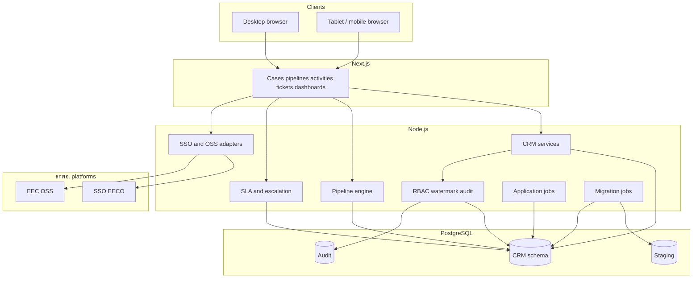

| Layer | Enables these features |
|---|---|
| Next.js | Customer 360, pipeline board, activity/task/ticket forms, heat map, role-aware screens |
| Node.js API | Stage moves, SLA timers, routing, watermark, audit write, bulk import, OSS pull — **one API** for all officer UIs so rules are not duplicated per client |
| Application jobs | SLA timers, scheduled digests, migration batches — inside the application/database, without a separate message-broker cluster |
| PostgreSQL | 1:N contacts, stage history, consent, sensitive docs, append-only audit |
| SSO EECO | Sign-in and basic profile for named users |
| EEC OSS adapter | Status panel on the investment case (endpoints agreed in BA) |

Background SLA timers, scheduled digests, and migration batches run as application and database jobs within the deployed stack, avoiding a separate messaging cluster on สกพอ. infrastructure.

## 4.2 Deployment architecture and environments

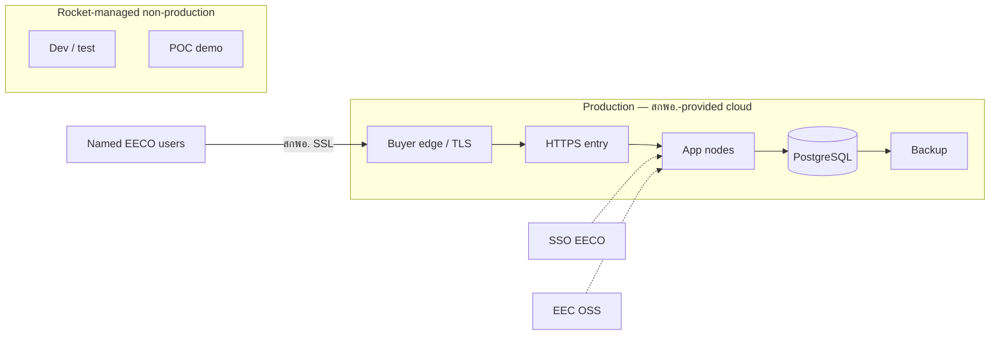

| Environment | Who provides hosts | Purpose |
|---|---|---|
| Production | สกพอ., via Cloud (e.g. GDCC) | Full CRM after go-live |
| Non-production | Rocket Innovation Co., Ltd. | Build and UAT rehearsal |
| POC demonstration | Rocket Innovation Co., Ltd. | Committee demonstration |

Cloud provider names in this proposal are **examples**. The production design is **vendor-agnostic**: capacity and topology are specified so สกพอ. can procure equivalent hosts from the provider it selects.

**Operations ownership.** Production edge protection (WAF/DDoS where the cloud offers it), host patching, backup scheduling on the platform, and any SIEM/SOC are **สกพอ. (or สกพอ.’s cloud MSP)** responsibilities. Rocket delivers the application, configures it on the provided hosts, and emits structured application and audit logs that สกพอ. can retain or forward into the Authority’s monitoring stack.

## 4.2.1 Minimum infrastructure specification (vendor-agnostic)

Per TOR 5.3.7, Rocket will submit detailed infrastructure documentation (database, network, and system architecture) in Phase 1. The following **indicative minima** support ≥100 named users in production and will be refined with สกพอ. after BRD and load assumptions are confirmed. Figures are capacity targets, not a commitment to any single cloud SKU.

| Component | Indicative minimum (production) | Notes |
|---|---|---|
| Application tier | 2 instances · ≥4 vCPU · ≥8 GB RAM each | Behind HTTPS load balancer; rolling restart without full outage preferred |
| Database | PostgreSQL-compatible · ≥4 vCPU · ≥16 GB RAM · ≥200 GB SSD | Automated daily backup; point-in-time recovery where the platform allows |
| Object / file storage | ≥200 GB encrypted | LOI, NDA, financials, activity attachments |
| Network | TLS 1.2+ HTTPS; private DB segment; allowlisted egress to SSO EECO and EEC OSS | สกพอ. SSL certificate on the public entry (TOR 5.10.2) |
| Availability | Target ≥99.5% monthly for application entry (subject to buyer cloud SLA) | Maintenance windows agreed in operations runbook |
| Backup / DR | Daily backup retained ≥30 days; documented restore drill | DR approach documented at go-live (TOR 5.9.3) |
| Observability handoff | Central application and audit logs (≥180 days application audit) | Exportable to สกพอ. monitoring tools |

Installation and configuration on the hosts สกพอ. provides are included in the contractor scope (TOR 7.3.2 with 5.3.7).

## 4.3 Database design

The model centers on the **investment case**, so one person can represent many organizations without duplicate person rows.

Three design patterns keep operational data trustworthy under concurrent officer work:

| Pattern | Role in this CRM | Examples |
|---|---|---|
| **Append-oriented history** | Prove what happened without rewriting the past | Pipeline stage history; application audit events (view/edit/download) |
| **Mutable current state** | Fast “where is this case now?” reads | Current pipeline stage; ticket status; assignment |
| **Staging / job queues** | Safe cutover and background work | Excel migration staging tables; SLA and digest jobs |

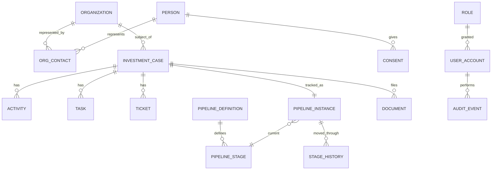

| Table | Features it supports |
|---|---|
| `organization` / `person` / `org_contact` | Create/match investors; one contact across many companies |
| `investment_case` | Open and maintain the primary journey record |
| `activity` / `task` / `ticket` | Log fieldwork; calendar; SLA requests |
| `pipeline_*` / `stage_history` | Move stages; prove who moved when |
| `consent` / `document` | PDPA consent; LOI/NDA/financials with sensitivity class |
| `user_account` / `role` / `permission` | Named users; need-to-know |
| `audit_event` | Who viewed/edited/downloaded what |
| `staging_*` | Safe Excel migration before production load |

**Integrity rules:** person uniqueness across orgs; org dedupe by Tax ID / legal name; stage moves only on configured edges; sensitive reads always authorized + logged; audit append-only from the application’s point of view; idempotent import keys on migration batches where retries are expected.

### 4.3.1 Transactional work vs reporting

Day-to-day case updates (stages, activities, tickets) are the **transactional** workload on PostgreSQL. Dashboards and the heat map (Section 5.4) run as **constrained read queries** on the same database at the scale of ≥100 named users — no separate data-warehouse cluster is proposed for go-live. Heavy or scheduled extracts (for example digest jobs) run as application jobs off the interactive path so reporting does not starve officers’ updates. If สกพอ. later requires a dedicated analytics store, it can be added under a change-controlled infrastructure revision; it is not required to meet TOR reporting at this user scale.

## 4.4 Stack security placement (defense in depth)

Security is applied in layers. Rocket implements roles, watermarking, and audit behavior in the application; สกพอ. or its cloud MSP operates the production perimeter and monitoring controls.

| Layer | Control | Who operates in production |
|---|---|---|
| Perimeter | HTTPS entry, buyer SSL certificate, cloud WAF/DDoS if offered | สกพอ. / cloud MSP |
| Application | Authentication via SSO EECO; RBAC and need-to-know on every API path; input validation; parameterized queries | Rocket-built software, configured with สกพอ. |
| Data | Private DB segment; encryption at rest where the platform provides it; secrets via สกพอ.-approved secret store / platform mechanism (not embedded in source) | Platform + install jointly; keys on buyer infra |
| Evidence | Application audit trail ≥180 days; structured app logs | Rocket emits; สกพอ. retains / forwards to SIEM if any |

Rocket and สกพอ. verify these controls through joint UAT and security testing before acceptance.

## 4.5 Design documents in Phase 1

Formal design packs under TOR 5.3 (first 60 days): legacy schema inventory, SDD, refined ERD, UI/UX designs, **vendor-agnostic infrastructure minimum specification** for สกพอ. cloud procurement, OSS API Interface Document (jointly scoped), risk/impact note, and the operations handoff for logs/backup alignment with สกพอ. IT.

Reference: TOR 5.3, 5.3.5–5.3.7, 5.7, 5.10.

# 5. Core features

The CRM is organized around one investment case. Investor records establish who is involved; activities, tasks, and tickets retain the work performed; the Investment Journey shows current stage and next action; dashboards expose workload and delay; SSO and EEC OSS connect the case to สกพอ. services; security controls protect sensitive records; and migration brings existing Excel history into the same model.

## 5.1 Create investors, import lists, and keep one clean master

สกพอ. cannot run an Investment Journey if every bureau keeps a private spreadsheet of “the same” company under a slightly different name. Officers therefore create and match organizations and people before opening a case, import roadshow lists through validation, and use a **Customer 360** that remains usable after staff rotation.

## Investor and master-data records

| Object | What it is | Why it matters |
|---|---|---|
| **Organization** | Juristic investor or stakeholder entity (legal name, Tax ID, industry, country) | The company สกพอ. is promoting or coordinating with |
| **Person** | Natural person stored once | Avoids cloning the same contact when they represent several companies |
| **Org–contact link** | Relationship between a person and an organization (role, primary flag) | Supports one person ↔ many organizations without duplicate person rows |
| **Channel source** | Tag for how the lead arrived (LINE OA, Facebook Messenger, email, call center, …) | Keeps provenance on the record, not in a private inbox |
| **Lead score** | Priority signal on a person or organization | Helps teams decide who needs attention next |
| **Master data row** | Reference value (e.g. target industry, country) | Stops free-text drift in reports and filters |
| **Consent record** | PDPA consent event (purpose, evidence, time, withdrawal) | Proves lawful basis before sensitive use of personal data |

Investment **cases**, **activities**, and **pipeline stages** are owned in Sections 5.2–5.3; they link to the organizations and people created here.

## Investor intake and data-quality controls

| Feature | What the officer or admin does | Includes (sub-capabilities) |
|---|---|---|
| Create / match organization | The officer searches before creating so the same juristic investor is not entered twice under a slightly different name. | Search by Tax ID and legal name; fuzzy near-match list with open-existing action; create only after confirm; industry, country, and status fields; inactive flag; field-level change history. |
| Create / match person | The officer stores a natural person once and links them as a contact on one or many organizations, instead of cloning the same person per company. | Name and identifiers agreed in BA; role and primary-contact flag on the org–contact link; merge-candidate warning when a similar person already exists. |
| Channel-tagged intake | The officer (or intake path) records how interest arrived so provenance is on the record, not only in a private inbox. | Channels include LINE OA, Facebook Messenger, email, call center, and others agreed in BRD; channel label and timestamp stored on the interaction or lead. |
| Bulk CSV / Excel import | The officer uploads a roadshow or bureau list, maps columns, and commits only after row-level validation passes. | Column mapping UI; required-field and format checks; error grid by row/field; Tax ID and legal-name duplicate warnings; reject or fix rows before commit so production stays clean. |
| Bulk export | The officer downloads a working set for offline prep when needed, without bypassing access rules. | Export respects current filters; sensitive columns follow RBAC (Section 5.6); audit of export events where policy requires. |
| Customer 360 | The officer opens one assembled view of the investor so identity, links, consent, and priority are visible without opening multiple spreadsheets. | Identity header; linked organizations (1:N); consent status; lead score; summary timeline; navigation into live investment cases (Section 5.3). |
| Master data admin | An administrator maintains reference lists so reports and filters do not drift into free-text variants. | Industry, country, and other BRD lists; add/edit/deactivate; used-by count; only active values offered on create/edit forms. |
| Lead scoring | The officer or rules raise or lower priority so the team knows which investors need attention next. | Manual adjust with reason; optional rule-based hints from BRD; score visible on Customer 360 and work queues. |
| Auto dedupe assist | During create and import, the system flags likely collisions so officers resolve them before polluting the master. | Exact Tax ID match; legal-name similarity; block or warn per policy; path into guided merge (recommended enhancement below). |
| Consent capture | Before sensitive use of personal data, the officer records consent so lawful basis is provable later. | Purpose, evidence/channel, and timestamp; withdrawals append to history rather than erasing prior consent events. |

Configurable CRM product features cover standard create/match, masters, scoring, and dedupe. Channel adapters and สกพอ.-specific consent wording are implemented in the custom layer where the BRD requires it.

### Recommended enhancement (beyond TOR minimum)

**Guided duplicate-merge workspace.** When Tax ID or legal-name collisions appear, officers open a side-by-side review (field-by-field keep/discard) before merge. This reduces the risk of silent data loss during consolidation.

## From intake to a trusted Customer 360

**Create or match.** An officer pastes a Tax ID or legal name. The system searches existing organizations and shows near-matches before creating a new row. The same pattern applies to persons (name + other identifiers agreed in BA). When a person already exists as the representative of Company A, linking them to Company B adds an **org–contact** row — it does not clone the person.

**Channel intake.** For LINE OA, Facebook Messenger, email, or call center, the intake path stores the channel on the interaction or lead record so later reporting can answer “where did this interest come from?” Exact adapter behavior for each channel is confirmed in the BRD; the CRM always retains the channel tag and timestamp.

**Bulk import.** Roadshow or bureau Excel files land in a validation grid: required fields, format checks, and duplicate warnings (Tax ID / name) appear **before** commit. Officers correct or reject invalid rows before production records are created. Ongoing imports use the same validation rules as migration staging, while historical cutover remains a separate controlled process.

**Customer 360.** Opening an organization or person assembles identity, linked companies, consent status, lead score, and a summary timeline. Full activity/task/ticket history for a live promotion effort is completed on the **investment case** (Section 5.3), which links back to these master records.

**Consent.** Before using personal data beyond the agreed purpose, officers record consent (purpose, evidence, time). Withdrawals append to history rather than erasing the audit of what was held when.

*M04: Bulk CSV / Excel import*

*M03: Customer 360*

*M05: Consent capture and history*

*M06: Master data admin*

Reference: TOR 5.5.1, 5.5.2.

## 5.2 Log fieldwork, assign work, and escalate blockers

Promotion work extends beyond stage updates. Officers meet investors, follow up on documents, and coordinate with other bureaus. **Activities**, **tasks**, and **tickets** remain attached to the investment case so the Journey retains the full working history.

## Fieldwork records

| Object | What it is | Why it matters |
|---|---|---|
| **Activity** | A dated interaction (meeting, call, visit, promotion event) with owner, place, purpose, attachments | Proves what happened inside a journey stage |
| **Task** | Calendar work item with assignee, due date, reminder | Turns “we should follow up” into tracked work |
| **Ticket** | Numbered service/request case with type, priority, routing, SLA timestamps | Handles cross-bureau blockers while retaining the link to the investment case |
| **Attachment / evidence** | Photo or file on an activity or ticket | Site visits and name cards become part of the record |
| **Escalation** | Automated or manual raise to a manager or another bureau when SLA or policy says so | Executives see stuck work in time (heat map in Section 5.4) |

**Investment case** and **pipeline stage** are defined in Section 5.3. **Organization** and **person** are defined in Section 5.1. Activities/tasks/tickets should link to a case whenever the work is part of a live promotion effort.

## Activities, tasks, and ticket controls

| Feature | What the officer does | Includes (sub-capabilities) |
|---|---|---|
| Log activity | The officer records a meeting, call, site visit, or promotion event against the investment case (or customer) so the interaction becomes part of the durable history. | Form captures recorded date/time, appointment date/time and place, travelers or attendees, purpose/agenda, owner, and links to the case and organization/person. Save appends the event to the case timeline and, where relevant, to the customer history. |
| Attach evidence | At the point of work, the officer attaches photos or files (name card, site photo, pack) so evidence stays with the activity rather than in a private device. | Desktop file upload and tablet/phone camera capture; allowed file types and size limits from BRD; attachments open from the timeline; same control pattern on ticket attachments. |
| Case timeline | The officer reviews the chronological trail of interactions on the case to see what already happened inside the current or prior stages. | Chronological list with type filter (meeting, call, visit, …); open attachment from the row; optional association to the stage period when the activity was logged. |
| Create task | The officer turns a follow-up into scheduled work with a clear owner and due date instead of an informal reminder. | Assignee, due date, reminder lead time; personal or team calendar views; always linkable to the investment case (or person/org when appropriate). |
| Complete task | The officer closes the task when the work is done so the calendar and case history stay accurate. | Completion timestamp and actor; optional short activity note written back to the timeline; overdue highlighting until complete. |
| Open ticket | When work is blocked (often across bureaus), the officer opens a numbered request that stays tied to the investment case. | Ticket type, priority, description, requester, and mandatory link to the investment case so the Journey board does not lose the thread. |
| Route ticket | The system or officer sends the ticket to the correct owning bureau or person according to routing rules. | Rule-based default routing by type/bureau; manual reassign with history; owning bureau and current assignee visible on the ticket and case. |
| Track ticket SLA | The officer and managers see how much time remains before the ticket breaches policy, with clear warning and breach states. | SLA clock starts on entry to a tracked state; configurable warning threshold; breach flag and timestamp; contributes to the executive heat map and SLA-at-risk list (Section 5.4). |
| Escalate / transfer | When the ticket is blocked or past SLA, the officer (or automation) raises it to a manager or transfers it to another bureau without removing the case from its pipeline stage. | Manager notification; transfer with comment; optional path from the bureau escalation matrix (recommended enhancement below); investment case remains on the Journey board. |
| Print activity (A4/PDF) | The officer produces a one-page activity summary for packs, handovers, or demonstration scenarios. | ISO A4 layout; readable type in PDF; includes key fields and attachment list as configured in BRD. |

### Recommended enhancements (beyond TOR minimum)

1. **Offline-tolerant field capture queue.** When connectivity drops during a site visit, the tablet queues the activity and attachment and syncs when online — so fieldwork is not lost.
2. **Bureau-specific escalation matrix (admin UI).** Supervisors maintain escalation paths per bureau in configuration screens rather than only in paper procedures.

## Fieldwork and escalation flow

**Activities on the case.** From the case workspace (Section 5.3) or from a customer 360 (Section 5.1), the officer opens **Create activity**, fills time/place/attendees/purpose, and attaches files. Saving appends the event to the case timeline and, where relevant, to the person/organization history. Mobile/tablet layouts use large controls and camera capture so a Chonburi site visit can be logged before the officer returns to Bangkok.

**Tasks.** A task is scheduled work linked to the same case (or to a person/org when appropriate). Reminders fire before due time; completing the task can optionally spawn a short activity note so the timeline stays complete.

**Tickets and SLA.** When work is blocked — for example utilities answers owed by another bureau — the officer opens a **ticket**, sets type/priority, and routing rules assign an owner. SLA timers start on entry to a state; warning and breach update the ticket and contribute to the executive heat map (Section 5.4). Escalation notifies the configured manager or transfers the ticket while the **investment case stage** remains visible on the pipeline board.

**Print.** For packs or evaluation scenarios, the officer prints an activity summary to A4/PDF with readable type (aligned with ภาคผนวก ก POC item 4.2 expectations).

*M07: Activity create / edit (desktop)*

*M08: Activity capture (mobile/tablet)*

*M09: Task and team calendar*

*M10: Ticket create / route / SLA*

*M11: Activity A4/PDF print preview*

Reference: TOR 5.5.3, 5.3.4.

## 5.3 Investment Journey — run pre-incentive cases on a pipeline

Officers **open an investment case**, record work against it, and move it through configurable pre-incentive stages when the required evidence is complete. The same case retains sensitive documents, SLA history, and EEC OSS status, so the promotion history does not have to be reconstructed from side spreadsheets.

The contact and organization masters identify *who* is involved; the Journey records *where the promotion effort stands* and *what must happen next*.

## Investment Journey records

| Object | What it is | Why it matters |
|---|---|---|
| **Investment case** | The primary record for one promotion / project effort; links org, contacts, pipeline instance, activities, tasks, tickets, documents | Day-to-day promotion work for a live case is recorded here |
| **Pipeline definition** | A template of stages, transitions, SLA policies, optional owning bureau, checklists | FDI vs domestic expansion can differ without a second product |
| **Pipeline stage** | A named step in that template (order, label, SLA days, required checklist) | Columns on the board; vocabulary สกพอ. can rename in admin |
| **Pipeline instance** | The live placement of one case on one definition (current stage, entered_at) | What the board card represents |
| **Stage history** | Append-only log of moves (actor, from, to, time, comment) | Proves who advanced or sent back a case |
| **Exit checklist / gate** | Required fields or items that must be true before a move is allowed | Prevents a stage change without supporting evidence |
| **Stage SLA** | Timer from stage entry with warning/breach | Feeds escalation and the heat map (Section 5.4) |
| **Case workspace** | Single UI for stepper, timeline, tasks, tickets, documents, OSS panel | Primary workspace for the case owner |
| **Sensitive document on case** | LOI, NDA, financials with sensitivity class | Need-to-know + watermark (controls in Section 5.6) |

## Case and pipeline controls

| Feature | What the officer or manager does | Includes (sub-capabilities) |
|---|---|---|
| Open investment case | From a matched organization, the officer opens a case that becomes the working record for one promotion effort and places it on a chosen journey template. | Pipeline template selection (including recommended template library); case title/code; key contacts; industry/country context; automatic start in stage 1 with a pipeline instance. |
| Assign owner | The officer or manager sets which bureau and named officer own the case so accountability is visible on the board. | Owning bureau and named officer; reassignment with history; owner shown on board cards and case header. |
| View pipeline board | Managers and officers see all cases as columns by stage and filter to the slice they are responsible for. | Filters for industry, country, owner, aging, พ.ศ., and fiscal year; aging color on cards; open the case workspace from a card. |
| Move stage | The officer advances or sends back a case only along allowed transitions, with a permanent history of who moved it. | Allowed transitions only; comment required on send-back; append-only stage history (actor, from, to, time, comment); optional approver on sensitive jumps. |
| Stage checklist / exit gate | The system blocks a stage move until required evidence or fields are complete, so stages are not theater. | Required fields and checklist items per stage; clear block message listing what is missing; gate configuration by administrators. |
| Stage SLA | The system tracks days in the current stage and signals warning or breach so pressure is visible before the weekly meeting. | Timer from stage entry; warning and breach thresholds; feeds heat map and SLA-at-risk list (Section 5.4) and escalation. |
| Case workspace | The owner works the case from one screen instead of jumping across disconnected tools. | Stage stepper; activity timeline; tasks; tickets; document list; EEC OSS status panel; role-aware modules (Section 5.6). |
| Upload sensitive docs | The officer attaches LOI, NDA, or financial packs to the case under need-to-know controls. | Sensitivity class on the file; RBAC before view/download; dynamic watermark and audit on open (Section 5.6). |
| Show EEC OSS status | The officer sees one-stop service status on the same case, without re-keying into a side spreadsheet. | Pull on open/refresh; last-sync time; empty and error states; endpoints only from the Phase 1 API Interface Document (Section 5.5). |
| Configure pipelines (admin) | Administrators change journey rules—stages, transitions, SLA, ownership—without a code release for every policy tweak. | Rename/add stages; allowed transitions; SLA days; owning bureau defaults; approval requirement on sensitive jumps; starting templates for FDI / domestic / aftercare (recommended enhancement). |

### Recommended enhancement (beyond TOR minimum)

**Journey template library (FDI / domestic / aftercare).** Administrators start from approved stage sets for common promotion patterns instead of building every pipeline from a blank form. Labels and checklists remain editable under สกพอ. policy.

## Moving a case through the Investment Journey

### Opening and owning a case

From a matched organization (Section 5.1), the officer chooses **Open investment case**, selects a **pipeline definition** (starting templates below; BRD may rename), links key contacts, and assigns an owner bureau/officer. The system creates a **pipeline instance** in stage 1 and shows the case on the **pipeline board**.

### Working inside a stage

While the case sits in a stage, officers use Section 5.2 features — **log activity**, **create task**, **open ticket** — always linked to this case. Evidence (site photos, packs) attaches to activities or to the case document list. The stage does not advance automatically when an activity is saved; advancement is an explicit **Move stage** (or an admin-configured automation only if สกพอ. later asks for it in BRD).

### Moving stage and exit gates

**Move stage** offers only **allowed transitions**. If an **exit checklist** is configured (e.g. Tax ID present, visit report logged, critical tickets closed or accepted), the move stays blocked until items pass. On success, **stage history** records actor, from/to, time, and comment; **stage SLA** for the new stage starts fresh.

Sensitive jumps (for example into *Pre-incentive readiness* or out of it) may require an **approver role** before the move commits.

### SLA, escalation, and management view

Days-in-stage drive warning and breach. Breached stage SLA and breached ticket SLA (Section 5.2) both contribute to the executive **heat map** and SLA-at-risk lists (Section 5.4). Escalation can notify a manager or ping another bureau without removing the case from its column.

### Documents and OSS on the same case

LOI/NDA/financials upload to the case with sensitivity class; view/download follows Section 5.6 (RBAC + dynamic watermark + audit). When pre-incentive readiness is met, the case workspace shows an **EEC OSS status** panel fed by the pull integration in Section 5.5 — endpoint list fixed jointly in analysis, not invented in this bid.

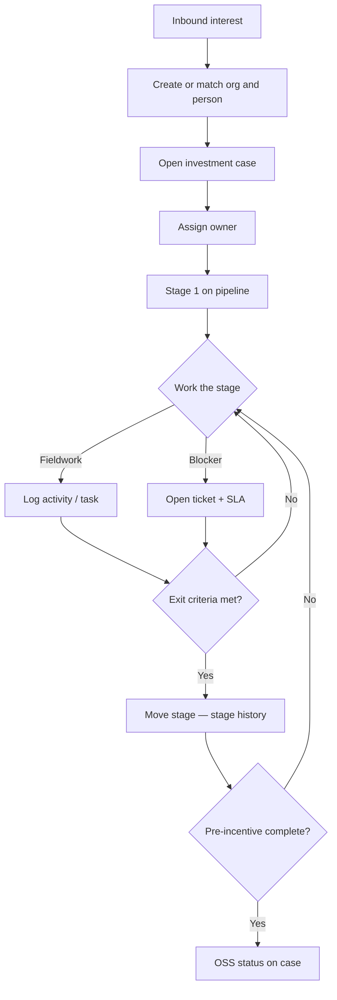

## Worked path — overseas manufacturer, Chonburi

Illustrative names only. Stage labels are the starting template; BRD may rename them.

**Setting.** After an overseas roadshow, a Japanese advanced-materials company asks about a plant site in Chonburi. A PSD officer owns the case. Another bureau must join a later site walkthrough. Incentive filing is not yet the job — complete pre-incentive history and a clean OSS-aligned handoff are.

| When | In the field | Features / objects used |
|---|---|---|
| Day 0 | LINE/email intro + name card | Section 5.1: create/match **organization** & **person** · **Open investment case** · channel source · **Assign owner** · *Early engagement* |
| Week 1 | First meeting in Bangkok | Section 5.2: **Log activity** · attach pack outline · **Create task** “send sector brief” · update **lead score** (Section 5.1) |
| Week 2–3 | Land / utility questions | Remain in *Qualify and information pack* until minimum data complete · **Open ticket** to supporting bureau with **ticket SLA** if blocked |
| Week 5 | Site walkthrough in Chonburi | **Move stage** to *Deep engagement / site* when gate allows · tablet **activity + photos** · close or accept ticket · multi-bureau **tasks** on same case |
| Week 8 | Ready for incentive-related next steps | *Pre-incentive readiness* · **checklist gate** · **upload LOI/NDA** · approver confirms **stage move** |
| After | Services proceed in one-stop channels | *OSS-aligned follow-through* · **EEC OSS status** on case (Section 5.5) · keep logging CRM activities |

If the utilities ticket or readiness checklist ages past SLA, the **pipeline board** and **heat map** show the delay; **escalation** can notify the manager or the other bureau while the case remains in its current Journey stage.

**Short contrast.** A domestic expansion case can use another **pipeline definition** (fewer overseas pack steps). Admins change stages and checklists — they do not need a second product.

## Stage model (configurable starting template)

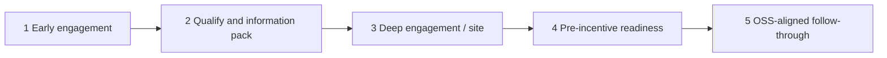

| Stage | Intent | Evidence on the case | Exit when |
|---|---|---|---|
| 1 Early engagement | Capture interest and owners | First activity, channel, rough industry/country | Owner set; org matched/created |
| 2 Qualify and information pack | Confirm seriousness; exchange packs | Pack send/receive, Q&A activities, score | Minimum data set complete |
| 3 Deep engagement / site | On-ground or deep dialogue | Site visit + attachments; multi-bureau tasks | Visit logged; critical tickets resolved or accepted |
| 4 Pre-incentive readiness | Package for incentive-related next steps | Checklist; LOI/NDA under RBAC; SLA clear | Configured role approves readiness |
| 5 OSS-aligned follow-through | Stay aligned while OSS runs | Pulled OSS status; continuing activities | Operating rhythm agreed with สกพอ. |

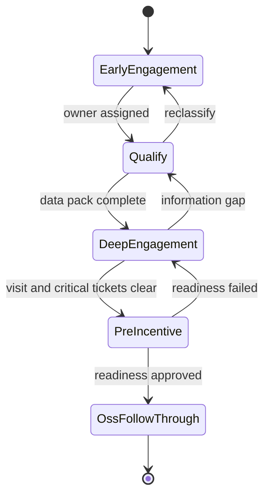

## How journey objects connect

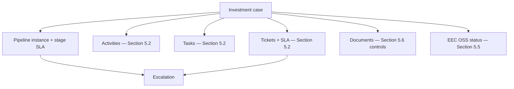

*M12: Investment Journey pipeline board*

*M13: Investment case workspace*

*M14: Move stage / readiness checklist*

*M15: EEC OSS status panel*

Reference: TOR 2.1, 5.5.4, 5.7.

## 5.4 See workload and export reports

Managers and directors need to see overdue work before the weekly meeting. After SSO login, their dashboards show **where work is concentrating** and **which cases or tickets are approaching or exceeding SLA**, using the same investment cases, stage timers, and tickets as the operational teams.

## Management views

| Object | What it is | Why it matters |
|---|---|---|
| **Dashboard / home** | Role-appropriate landing view after login | Different roles see different pressure widgets (see Section 5.6) |
| **Heat map cell** | Aggregation of open work by bureau/team (or other dimension agreed in BRD) | Shows concentration and overload at a glance |
| **SLA-at-risk row** | Case or ticket past warning/breach | Drill path into the case workspace (Section 5.3) or ticket (Section 5.2) |
| **Report view** | Saved or ad hoc breakdown (country, industry, value, …) | Board packs without a separate offline status tracker |
| **Export file** | Excel or PDF snapshot of a view | Offline sharing under existing access rules |

## Workload, SLA, and reporting controls

| Feature | What the user does | Includes (sub-capabilities) |
|---|---|---|
| Post-login dashboard | After SSO sign-in, the user lands on a home view sized to their role so pressure and work queues are visible immediately. | Role-specific widget set; deep links into case workspace or ticket; same data model as Sections 5.2–5.3 (no second status store). |
| Heat map | Managers and directors see where open work concentrates across bureaus or teams at a glance. | Dimension by bureau/team (or other BRD dimension); color by load; click-through to the underlying case/ticket list. |
| SLA-at-risk list | The user drills into cases or tickets that are in warning or breach so action can be taken before the next meeting. | Separate warning vs breach states; sort by age; open case workspace (Section 5.3) or ticket (Section 5.2) from the row. |
| Filter by พ.ศ. | The user constrains heat map and lists to a Buddhist Era calendar range used in สกพอ. reporting. | Range select on the shared filter bar; applies to heat map, SLA list, and report views. |
| Filter by fiscal year | The user aligns the same views to budget years for board and planning packs. | Fiscal-year control on the same filter bar as พ.ศ.; persists for the session or saved view. |
| Configurable report views | The user breaks down promotion work by dimensions such as country, industry, or investment value when the data supports it. | Ad hoc and saved views; dimensions from available case fields; reopen saved view without rebuilding filters. |
| Export Excel / PDF | The user exports the current filtered view for offline board packs without maintaining a separate status workbook. | Export respects active filters; sensitive columns follow RBAC (Section 5.6); Excel and PDF outputs. |
| Role-aware widgets | Staff, managers, and directors do not see the same sensitive slices of the same underlying cases. | Default widget packs by role; administrator can adjust; LOI/NDA/financial widgets hidden where RBAC denies. |

### Recommended enhancement (beyond TOR minimum)

**Scheduled executive digests.** Heat-map and aging summaries can be delivered on a schedule (for example weekly) so directors receive workload and delay updates without opening the dashboard each time. Recipients and cadence are configured by administrators.

## Reporting from live case data

Heat map and SLA lists use the same **stage SLA** and **ticket SLA** events as the investment cases; there is no second status store to reconcile. Filters constrain those records by พ.ศ. and fiscal year, and exports render the current filtered view. RBAC hides or redacts widgets that would expose LOI, NDA, or financial content to an unauthorized role.

Reporting is **native** by default on the same PostgreSQL system of record (Section 4.3.1): heat map and dashboards use constrained reads so they do not starve transactional case updates; scheduled digests run as application jobs off the interactive path. No separate warehouse is required at ≥100 named users. If BRD requires an external BI tool for unrestricted drill-down, Rocket funds licenses for all project named users for the period TOR 5.6.2 requires.

*M02: Executive heat map / dashboard*

Reference: TOR 5.5.5, 5.6, 2.2.

## 5.5 Sign in with SSO EECO and see EEC OSS on the case

Officers already use **SSO EECO**, and investment services already run through **EEC OSS**. The CRM uses those systems rather than creating a parallel password store or requiring officers to re-key OSS status into Excel. Current OSS status appears on the investment case where officers already manage the Journey.

## Integration records and contracts

| Object | What it is | Why it matters |
|---|---|---|
| **SSO session** | Authenticated browser session after EECO identity provider login | Named users (≥100) without a second password database |
| **Master profile attributes** | Agreed fields from SSO (e.g. name, org unit) written onto the CRM user | Keeps CRM user aligned with EECO directory — list fixed in BA |
| **Integration adapter** | Node.js component that talks REST (or SOAP if required) to an external system | Isolates contract changes from the UI |
| **OSS status payload** | Pulled service status for display on an investment case | Keeps current status on the case; empty and error states are visible |
| **API Interface Document** | Phase 1 spec: endpoints, auth, fields, errors, non-goals | Joint contract with สกพอ. — not invented in this bid |

## SSO and EEC OSS behavior

| Feature | What happens | Includes (sub-capabilities) |
|---|---|---|
| Sign in with SSO EECO | The named user authenticates through สกพอ.’s SSO EECO identity provider; the CRM starts a session without a separate password database. | Redirect or prompt to the EECO IdP; session bootstrap on return; logout; ≥100 named users expandable with directory growth. |
| Profile sync | Agreed master attributes from SSO are written onto the CRM user so the directory and CRM stay aligned. | Attribute list fixed in BA (for example name and organization unit); refresh on login; no invented fields beyond the agreed set. |
| Open case → OSS panel | Opening an investment case pulls current EEC OSS service status onto that case for display in the Journey workspace. | Trigger on open and on manual refresh; panel UI owned by Section 5.3; adapter call uses only endpoints in the API Interface Document. |
| Last-sync / error state | Officers see whether the OSS pull is fresh or failed, instead of trusting silent stale data. | Last successful sync timestamp; clear error when an endpoint is unavailable; retry without leaving the case. |
| Open API style | Integrations use open interfaces so สกพอ. is not locked into a closed proprietary bus. | REST by default; SOAP where an สกพอ. system still requires it; documented in the Phase 1 API Interface Document. |
| Adapter isolation | External contract changes are absorbed in the adapter layer so the officer UI does not need a rewrite for every OSS field change. | Node.js adapters for SSO and OSS; non-goals and error handling recorded in the API Interface Document; risk/impact note under TOR 5.4. |

## Login and status retrieval

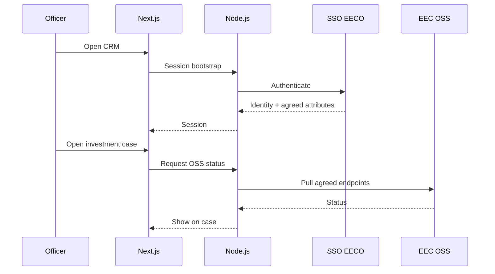

1. Officer hits the CRM URL → redirected or prompted to **SSO EECO** → session established; RBAC roles from Section 5.6 still decide what cases and documents they see.  
2. Opening an investment case triggers (or refreshes) an **OSS status pull** through the adapter using endpoints from the API Interface Document.  
3. The Section 5.3 case workspace renders the panel; failures show last-sync/error rather than silent stale data.  
4. Phase 1 risk/impact notes cover coexistence with OSS and related services (incentives, permits, advisory).

*M01: Login / SSO entry*

Reference: TOR 5.5.6, 5.7, 5.3.6, 5.4.

## 5.6 Control who sees LOI/NDA/financials and keep an audit trail

Investment cases accumulate documents that must not be open to the whole office. **Roles** and **need-to-know** rules limit access; **dynamic watermarking** identifies the viewer on sensitive copies; and the **audit trail** records view, edit, and download events. These controls apply to the same cases, activities, and documents used in daily work.

## Security records and evidence

| Object | What it is | Why it matters |
|---|---|---|
| **Role** | Named permission set (e.g. Staff, Manager, Director, plus สกพอ.-specific roles) | Same case, different visible modules |
| **Permission** | Allow/deny on actions and sensitivity classes | Enforced on every read/download path |
| **Sensitivity class** | Label on a document or field group (e.g. LOI/NDA/financial) | Drives need-to-know |
| **Watermark event** | Overlay of account + datetime on view/download | Deters casual leakage; ties copy to a person |
| **Audit event** | Who / what / when on view, edit, download | Investigation and POC history scenarios |

Consent records are described in Section 5.1; warranty intake and resolution times are in Section 7.

## Access, watermark, and audit controls

| Feature | What happens | Includes (sub-capabilities) |
|---|---|---|
| Role-based access | The same investment case presents different modules and fields depending on the signed-in role, so need-to-know is enforced in the product rather than by convention. | Default Staff / Manager / Director packs; additional สกพอ.-specific roles from BRD; module-level and action-level allow/deny enforced in the API on every sensitive route. |
| Need-to-know on sensitive docs | LOI, NDA, and financial statements are limited to senior roles and/or the project owner; Staff do not open them by default. | Sensitivity class on each file; deny list for Staff by default; grant path for project owner and configured senior roles. |
| Dynamic watermark | On view or download of a sensitive document, the system overlays the account identity and time so a leaked copy can be traced. | Account name and date/time overlay; applies to in-app viewer and download/PDF path; pairs with an audit event. |
| Application audit trail | The system records who viewed, edited, or downloaded which record or document and when, for investigation and demonstration. | View, edit, and download events; retention ≥180 days; export for investigation; append-oriented history from the application’s point of view. |
| Consent-linked access | Sensitive use of personal data is gated by consent history captured in Section 5.1. | Check purpose and withdrawal state before sensitive use; guidance messaging when consent is missing or withdrawn. |
| Data protection in the product path | Sensitive payloads travel and rest under TLS and platform encryption as specified in Section 4; the application never embeds production secrets in source or client bundles. | TLS on officer HTTPS paths; secrets via สกพอ.-approved mechanism at install; PII minimized in non-production copies used for build/UAT. |
| OWASP-aligned secure development | Delivery follows current OWASP-aligned secure development practice through build and review with สกพอ. before go-live. | OWASP Top 10 mitigation mindset; input validation and parameterized queries; dependency hygiene; secure error handling; security-focused review; findings from joint security testing closed before acceptance. |
| สกพอ. SSL in production | Production HTTPS uses the certificate supplied by สกพอ., as required for go-live. | Buyer-supplied certificate on the public entry (TOR 5.10.2); TLS on officer access paths. |
| Observability handoff | The application emits structured application and audit logs that สกพอ. can retain or forward into the Authority’s monitoring tools. | Log fields aligned with audit events; retention guidance in the operations runbook; export path for Authority monitoring. |
| Joint UAT + security scan | Controls are proven with สกพอ. officers in joint UAT and security testing before acceptance. | Scenario scripts covering RBAC, watermark, and audit; vulnerability/security scan findings tracked to closure before Phase 2/3 gates. |

## Sensitive-document access

When an officer opens a case workspace (Section 5.3), the API loads modules allowed for their **roles**. A Staff user may see timeline and tasks but not the LOI file list; a Director or project owner may open the PDF — the viewer applies a **dynamic watermark** and writes an **audit event**. The same rules apply to exports and downloads. Admin configuration of roles and sensitivity classes is done in the product admin area; defaults are set in BRD with สกพอ.

Secure development—input validation, authorization checks, and dependency hygiene—is part of every release that reaches UAT. Rocket implements and tests the application controls officers use; production perimeter and monitoring responsibilities follow the ownership model in Section 4.4.

*M16: RBAC difference (3 roles)*

*M17: Sensitive doc + watermark*

*M18: Audit / change-history report*

Reference: TOR 5.8, 5.10.

## 5.7 Bring Excel history into one structured database

Go-live only counts if bureau spreadsheets become a clean CRM, including one person linked to many companies. Rocket separates this one-time historical cutover from the day-to-day list import officers use after launch. Migration preparation runs before Phase 2 acceptance; the reconciled production load occurs in Phase 3.

## Migration methodology

| Phase | What Rocket runs | Includes (sub-capabilities) |
|---|---|---|
| Discover | Inventory bureau Excel/exports and stewards. | Source list per bureau; checksum; owner contact; quarantine until mapping starts. |
| Map | Align each file to the target CRM model. | Mapping sheet; unmapped-column report; sign-off before cleanse/load. |
| Cleanse | Normalize formats so dedupe and reports work. | Date and Tax ID formats; trim/encoding; reject or quarantine bad rows with a report. |
| Dedupe organizations | Merge preferring **Tax ID**, then legal name. | Collision report; steward keep/merge log; no silent overwrite of conflicts. |
| Dedupe / link persons | One person row; 1:N org links. | Merge candidates; org–contact links; no clone persons across companies. |
| Reconcile & load | Production commit only after counts signed off. | Count reconciliation; rollback plan; cutover window with สกพอ. |
| Preserve controls | Same audit/RBAC/watermark as new data. | Access logs ≥180 days; backup/DR docs; Section 5.6 controls on migrated sensitive files. |

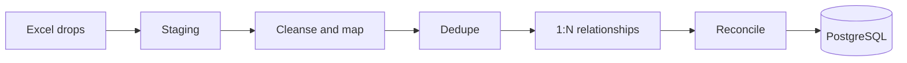

**Validation:** row counts and key totals (organizations, persons, cases) must match the signed reconcile sheet before go-live use. Failed rows remain in quarantine with a report — they are not silently dropped.

Migration **preparation** reports are Phase 2 deliverables; the **structured clean database** is a Phase 3 deliverable (Section 6).

Reference: TOR 5.9.

# 6. Delivery plan and integrated timeline

Rocket Innovation Co., Ltd. will complete the CRM & Database Management System within **210 calendar days** of contract signature (including public holidays). Major delivery packages land at **day 60**, **day 180**, and **day 210**, with working milestones and buffers underneath so UAT findings and environment readiness do not push past those dates.

Rocket assigns a named core team for the TOR 5.12 roles and adds specialists for product engineering, application development, user experience, and delivery coordination. Signed Appendix B forms and supporting education and experience evidence are submitted in the personnel package.

## Delivery team

| Proposed project role | Named personnel | Primary responsibility |
|---|---|---|
| Project Manager | Varapong Techapanichgul | Overall delivery lead; milestones, technical direction, and client-facing delivery ownership. |
| Business Analyst | Ekasit Jatupornwattana | BRD ownership, workflow definition, requirements traceability, and solution design. |
| Senior System Analyst | Thitawan Hirunurann | UI/UX design, mobile-friendly officer journeys, prototypes, and usability refinement. |
| Senior Developer | Thammarong Kikasemsri | Technical leadership, core CRM development, code review, APIs, and delivery quality. |
| Developer | Ratchapol Hengmongkolsakul | Feature development, unit testing, defect correction, installation, and handover support. |
| Tester | Nutnicha Jitruttanaarun | Test planning and execution, defect reporting, retesting, and delivery-quality evidence. |
| Senior Tester | Kritsana Tanwised | Test strategy, quality assurance, test oversight, and acceptance readiness. |
| Project Coordinator | Assadavoot Anukool | Meeting logistics, records, action tracking, and deployment coordination. |

## Additional delivery specialists

| Specialist role | Named personnel | Contribution |
|---|---|---|
| Programme Coordinator | Prakan Pojpienlert | Day-to-day programme governance, schedule, scope, risk, reporting, and coordination with สกพอ. |
| Support Business Analyst | Teerakarn Boriboonsub | Stakeholder workshops, EECO liaison, and requirements-session support. |
| Project Coordinator (operations) | Warinthon Aekjeen | Admin support, venue and logistics, and internal follow-up. |
| Project Coordinator Assistant | Niraphat Rakphong | Meeting logistics, records, follow-up, and submission support. |

## 6.1 Delivery commitments

| Milestone | By when | What Rocket delivers |
|---|---|---|
| Detailed plan | ≤ **15** days | Project schedule and role coverage |
| BRD and design | ≤ **45** days | Business requirements and workflows; system design including environment |
| Phase 1 package | ≤ **60** days | The above, plus risk and impact assessment for work with EECO systems |
| Phase 2 package | ≤ **180** days | Working Core features (Sections 5.1–5.7); security measures; migration preparation reports; joint UAT, system testing, and security scan |
| Phase 3 package | ≤ **210** days | Structured clean database; go-live on สกพอ.-provided cloud; perpetual license and source code; Admin and User train-the-trainer with manuals; backup and DR documentation; covered licenses for ≥3 years where applicable |

After award, Rocket will also lodge the formal spreadsheet work plan within 45 days, and a domestic materials plan if applicable.

## 6.2 Delivery sequence

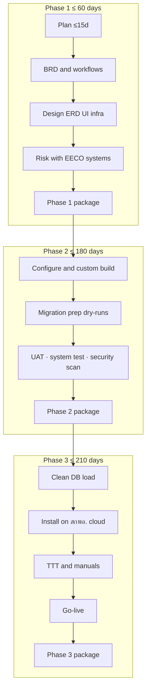

## 6.3 Integrated delivery schedule

Rocket plans each workstream to finish inside the contractual delivery date. The schedule includes explicit contingency for review comments, UAT findings, and production-host readiness.

| Days from signature | Rocket activity | Contingency / dependency | Contract milestone |
|---|---|---|---|
| 1–12 | Kick-off; draft detailed plan | Lodge by day 12 | Plan ≤ **15** |
| 13–15 | Plan buffer and lodge | — | |
| 16–38 | BRD, workflows, design drafts | Parallel tracks | |
| 39–45 | Design package freeze | — | BRD + design ≤ **45** |
| 46–55 | Risk and impact note; confirm environment with สกพอ. | — | |
| 56–60 | Assemble and lodge Phase 1 package | Comment buffer | Phase 1 ≤ **60** |
| 61–115 | Configure product core; custom journey, SSO, OSS, watermark | — | |
| 116–150 | Feature-complete for UAT; migration staging ready | — | |
| 120–165 | Migration prep dry-runs; steward reviews | Overlaps build | Prep → Phase 2 |
| 151–168 | Joint UAT, system test, security scan; fix criticals | Target finish ~168 | |
| 169–180 | **Buffer**; lodge Phase 2 package | Protects day 180 | Phase 2 ≤ **180** |
| 181–195 | Clean DB production load; reconcile sign-off | Depends on host readiness | |
| 196–205 | Install on สกพอ. cloud; smoke tests; Admin and User TTT | — | |
| 206–210 | **Buffer**; go-live; lodge Phase 3 package | Protects day 210 | Phase 3 ≤ **210** |

If สกพอ. cloud hosts are not ready by about day 181, Rocket continues clean-DB validation in a controlled environment and installs as soon as hosts are available, still targeting the day-210 go-live. Host delay is raised immediately under the communications path in Section 7.

## 6.4 Acceptance readiness

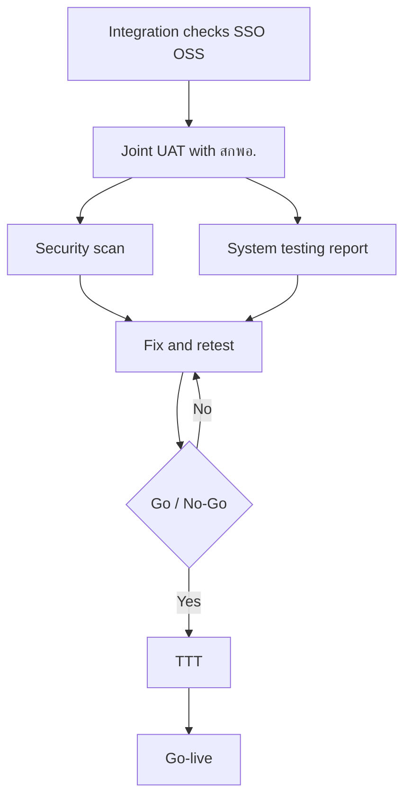

| Track | Rocket’s work |
|---|---|
| Integration checks | SSO EECO login path; EEC OSS pull against BA endpoints; visible error states |
| Joint UAT | Officer scenarios on Journey, tickets, heat map, RBAC, watermark, and audit |
| System testing | Functional regression on in-scope Core features |
| Security scan | Vulnerability scan; findings closed before Phase 2 and Phase 3 packages |
| Go / No-Go | No open criticals; UAT signed; scan accepted; rollback plan documented |

Before go-live Rocket also confirms: training completion (Section 6.6); migration reconcile signed for production load; rollback plan agreed; สกพอ. SSL on the public entry; backup and DR documented; application and audit log handoff ready (Section 4.4).

## 6.5 Migration and production cutover

How Excel becomes a clean CRM is in **Section 5.7**. On this schedule:

| When | Rocket’s migration work | Package |
|---|---|---|
| About days 120–165 | Preparation and dry-runs; steward decisions; preparation reports | Phase 2 |
| About days 181–195 | Production clean-DB load after reconcile | Phase 3 |

Source data are bureau Excel files, so Rocket does not propose a live CDC cutover.

## 6.6 Training and handover

| Course | Volume | Where |
|---|---|---|
| Admin TTT | 1× ≥6h, ≥8 people | Bangkok EECO or Burapha University, Chonburi |
| User TTT | 2× ≥6h, ≥30 people total | Same |
| Manuals | Admin + User | Approved with the training plan before delivery |

Meals follow TOR rates. Training is planned for days 196–205 so courses and manuals complete inside the Phase 3 package.

At final delivery Rocket hands over perpetual license and source code; IP follows TOR 17; covered cloud and software license documentation spans ≥3 years without extra annual fees to สกพอ. in years 1–3 where TOR 7.3.6 applies.

## 6.7 Cutover risks

| Risk | Impact | Mitigation |
|---|---|---|
| Late UAT findings | Medium | Buffer days 169–180; parallel fix tracks |
| สกพอ. hosts delayed | High | Early infrastructure minima; escalate per Section 7; install as soon as ready inside day 210 |
| Excel quality poorer than expected | Medium | Staging quarantine; steward decisions; unclean rows are not loaded |
| SSO or OSS endpoint change | Medium | Adapter isolation (Section 5.5); BA freeze dates |

Reference: TOR 5.1, 5.11, 5.12, 6–8, 17, 7.3. Warranty detail: Section 7 / TOR 14.

# 7. Operations and support

During the one-year warranty, named สกพอ. users can report questions and defects by phone, email, or application channel at any time. Rocket acknowledges each notice within 30 minutes, separates user guidance from technical incidents, and applies the contractual resolution times. สกพอ. or its cloud MSP continues to operate the production hosts; Rocket is responsible for diagnosing and correcting application defects.

## 7.1 Warranty frame

Buyer requirement text (TOR 14 — source extract):

> 14. การรับประกัน … ผู้รับจ้างต้องทาการบารุงรักษา ซ่อมแซมแก้ไขระบบงานให้อยู่ในสภาพที่ใช้งานได้ดีดังเดิมตลอดระยะเวลาที่รับประกันโดยระยะเวลาที่รับประกัน 1 ปี เริ่มนับถัดจากวันที่ผู้รับจ้างส่งมอบงานถูกต้องครบถ้วน และคณะกรรมการตรวจรับพัสดุของผู้ว่าจ้างทาการตรวจรับงานงวดสุดท้ายของโครงการเรียบร้อย …
>
> 14.1 … ผู้รับจ้างต้องสามารถรับแจ้งได้ตลอดทุกช่วงเวลาตลอด 24 ชั่วโมง ทางโทรศัพท์เคลื่อนที่หรือจดหมายอิเล็กทรอนิกส์ (E-mail) หรือทางโปรแกรมอานวยความสะดวกต่าง ๆ (Application) โดยหลังจากที่ผู้รับจ้างได้รับแจ้งเหตุแล้วจะต้องตอบกลับภายใน 30 นาที …
>
> 14.2.1 …ฟังก์ชันการทางานหลัก ของระบบไม่สามารถใช้งานได้ ผู้รับจ้างจะต้องดาเนินการแก้ไขให้เรียบร้อยภายใน 4 ชั่วโมง นับจากได้รับแจ้ง  
> 14.2.2 …ปัญหาในส่วนที่ไม่ใช่หน้าที่หลัก ของระบบผู้รับจ้างจะต้องดาเนินการแก้ไขให้เรียบร้อยภายใน 24 ชั่วโมง นับจากได้รับแจ้ง  
> 14.2.3 …ไม่มีผลกระทบต่อการรับบริการ ผู้รับจ้างจะต้องดาเนินการแก้ไขให้เรียบร้อยภายใน 48 ชั่วโมง นับจากได้รับแจ้ง  
> 14.2.7 …สามารถหาวิธีการให้ระบบใช้งานไปพลางก่อนได้ (Workaround) ผู้รับจ้างจะต้องดาเนินการแก้ไขให้เรียบร้อย ภายใน 7 วันทาการนับจากวันที่ได้รับแจ้ง

| How Rocket operates against the clause | Response |
|---|---|
| Warranty year after final Phase 3 acceptance | Application maintenance and defect repair for **1 year** from committee acceptance of the final delivery package |
| 24×7 intake; acknowledge ≤30 minutes | Named users report by phone, email, or application channel; Rocket acknowledges within **30 minutes** |
| Critical — core functions unusable (≤4 hours) | Severity clock starts at notice; fix target **4 hours** |
| Non-core defect (≤24 hours) | Fix target **24 hours** |
| Non-core, no service impact (≤48 hours) | Fix target **48 hours** |
| Workaround in place (≤7 business days) | Permanent fix ≤ **7 business days** from notice |
| Host hardware fault (not app) — TOR 14.2.4 | Investigate and **report** to สกพอ.; not treated as application defect |
| External / other-system fault — TOR 14.2.5 | Investigate and **report**; not treated as application defect |
| Force majeure delay — TOR 14.2.6 | Daily progress report until resolved |

## 7.2 Support operations (officers)

Named EECO users use the same warranty intake channels for:

| Request type | Handling |
|---|---|
| How-to / navigation | Guidance or point to manuals; escalate to short coaching if needed |
| Access / role question | Verify against RBAC config; route to สกพอ. admin if policy change |
| Suspected defect | Open technical ticket → Section 7.3 |
| Data correction request | Validate identity and authority → approve if required → execute → audit log |

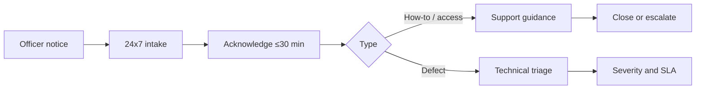

## 7.3 Incident response and escalation

Rocket classifies each application defect against the warranty commitments in Section 7.1, starts the relevant resolution clock, and escalates according to the technical depth required.

| Step | Target |
|---|---|
| Intake / L1 | Acknowledge; classify severity; reproduce |
| L2 application support | Diagnose; patch or config fix |
| L3 engineering | Code fix; emergency release if critical |
| Infra / cloud | If host or network — **สกพอ. MSP** with Rocket evidence report |

For host or network incidents, Rocket supplies application evidence to สกพอ. or its cloud MSP and continues application diagnosis in parallel.

| Phase | Actions |
|---|---|
| Before | Monitoring handoff of app/audit logs; change control; named on-call path for warranty |
| During | Severity clock; user communication; containment; avoid unreviewed changes that cascade |
| After | Root-cause note for significant incidents; update runbook; close ticket |

## 7.4 Change request management (warranty period)

| Step | What happens |
|---|---|
| Request | Logged via intake or สกพอ. project contact |
| Scope | Impact on Journey, integrations, data; effort estimate |
| Impact | Low / medium / high |
| Authority | Low: project manager with log; medium/high: joint review with สกพอ. before production change |
| Release | Test in non-prod; CAB-style approval for medium/high; rollback plan |

Contract variations and additional scope follow the contract. The process above governs technical assessment, approval, testing, and release during the warranty period.

## 7.5 Communications matrix

| Event | Deliverable | Channel | Frequency | Owner | Audience |
|---|---|---|---|---|---|
| Status (delivery) | Weekly status | Email + meeting | Weekly until go-live | Project manager | สกพอ. sponsors |
| Incident (P-critical) | Incident notice | Phone + email | ASAP | Support lead | Product owner / affected units |
| Change (medium/high) | Change brief | Email | Before deploy | Project manager | สกพอ. IT + business |
| Warranty monthly | Short service note | Email | Monthly in warranty year | Support lead | สกพอ. coordinator |

Reference: TOR 14; operations placement with Section 4.4 and Section 6.

# 8. Proof of Concept

Rocket Innovation Co., Ltd. will present a live Proof of Concept in accordance with ภาคผนวก ก, on the schedule set by the committee.

The demonstration runs in a **Rocket-managed environment** separate from production. Using representative data without real investor PII, Rocket will demonstrate:

- Create / match investor and organization
- Log activity with attachment from a tablet-class device
- Move an investment case through pre-incentive stages with history
- Open a ticket, show SLA, and show the escalation path
- Sign-in pattern consistent with SSO EECO (demonstration adapter if production SSO is not available in the room)
- Watermark and audit on a sensitive document sample
- Heat-map / dashboard filters

Each scenario ends with a visible system result—saved history, updated stage, SLA state, access decision, or dashboard change—so the committee can verify the behavior during the session.

Reference: ภาคผนวก ก §3.

# 9. Recommended enhancements (beyond TOR minimum) — summary

Rocket Innovation Co., Ltd. proposes the following enhancements beyond the TOR minimum to reduce manual correction, preserve fieldwork during poor connectivity, and give supervisors more direct control over journeys and escalation.

| Enhancement | Benefit for สกพอ. | Described in |
|---|---|---|
| Guided duplicate-merge workspace | Officers resolve Tax ID / legal-name conflicts field-by-field before merge | Section 5.1 |
| Offline-tolerant field capture queue | Site-visit activities and attachments sync when connectivity returns | Section 5.2 |
| Bureau-specific escalation matrix (admin UI) | Escalation paths maintained in the system, per bureau | Section 5.2 |
| Journey template library (FDI / domestic / aftercare) | Approved starting stage sets instead of blank pipelines | Section 5.3 |
| Scheduled executive digests | Periodic heat-map and aging summaries without opening the dashboard each time | Section 5.4 |

If สกพอ. adopts these items, Rocket will confirm them in the Phase 1 BRD and reflect them in the project plan without displacing the mandatory deliverables in TOR 5–8.
