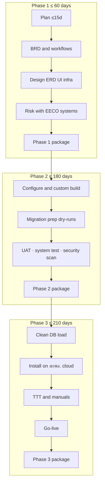
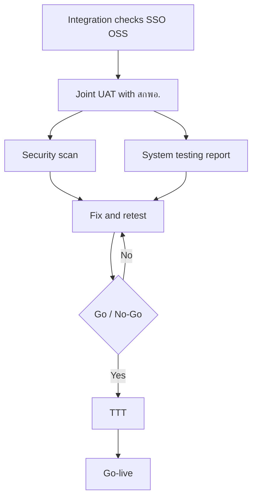

# 6. Delivery plan and integrated timeline

Rocket Innovation Co., Ltd. will complete the CRM & Database Management System within **210 calendar days** of contract signature (including public holidays). Major delivery packages land at **day 60**, **day 180**, and **day 210**, with working milestones and buffers underneath so UAT findings and environment readiness do not push past those dates.

Rocket assigns a named core team for the TOR 5.12 roles and adds specialists for product engineering, application development, user experience, and delivery coordination. Signed Appendix B forms and supporting education and experience evidence are submitted in the personnel package.

## Delivery team

| Proposed project role | Named personnel | Primary responsibility |
|---|---|---|
| Project Manager | Varapong Techapanichgul | Overall delivery lead; milestones, technical direction, and client-facing delivery ownership. |
| Business Analyst | Ekasit Jatupornwattana | BRD ownership, workflow definition, requirements traceability, and solution design. |
| Senior System Analyst | Thitawan Hirunurann | UI/UX design, mobile-friendly officer journeys, prototypes, and usability refinement. |
| Senior Developer | Thammarong Kikasemsri | Technical leadership, core CRM development, code review, APIs, and delivery quality. |
| Developer | Ratchapol Hengmongkolsakul | Feature development, unit testing, defect correction, installation, and handover support. |
| Tester | Nutnicha Jitruttanaarun | Test planning and execution, defect reporting, retesting, and delivery-quality evidence. |
| Senior Tester | Kritsana Tanwised | Test strategy, quality assurance, test oversight, and acceptance readiness. |
| Project Coordinator | Assadavoot Anukool | Meeting logistics, records, action tracking, and deployment coordination. |

## Additional delivery specialists

| Specialist role | Named personnel | Contribution |
|---|---|---|
| Programme Coordinator | Prakan Pojpienlert | Day-to-day programme governance, schedule, scope, risk, reporting, and coordination with สกพอ. |
| Support Business Analyst | Teerakarn Boriboonsub | Stakeholder workshops, EECO liaison, and requirements-session support. |
| Project Coordinator (operations) | Warinthon Aekjeen | Admin support, venue and logistics, and internal follow-up. |
| Project Coordinator Assistant | Niraphat Rakphong | Meeting logistics, records, follow-up, and submission support. |

## 6.1 Delivery commitments

| Milestone | By when | What Rocket delivers |
|---|---|---|
| Detailed plan | ≤ **15** days | Project schedule and role coverage |
| BRD and design | ≤ **45** days | Business requirements and workflows; system design including environment |
| Phase 1 package | ≤ **60** days | The above, plus risk and impact assessment for work with EECO systems |
| Phase 2 package | ≤ **180** days | Working Core features (Sections 5.1–5.7); security measures; migration preparation reports; joint UAT, system testing, and security scan |
| Phase 3 package | ≤ **210** days | Structured clean database; go-live on สกพอ.-provided cloud; perpetual license and source code; Admin and User train-the-trainer with manuals; backup and DR documentation; covered licenses for ≥3 years where applicable |

After award, Rocket will also lodge the formal spreadsheet work plan within 45 days, and a domestic materials plan if applicable.

## 6.2 Delivery sequence

## 6.3 Integrated delivery schedule

Rocket plans each workstream to finish inside the contractual delivery date. The schedule includes explicit contingency for review comments, UAT findings, and production-host readiness.

| Days from signature | Rocket activity | Contingency / dependency | Contract milestone |
|---|---|---|---|
| 1–12 | Kick-off; draft detailed plan | Lodge by day 12 | Plan ≤ **15** |
| 13–15 | Plan buffer and lodge | — | |
| 16–38 | BRD, workflows, design drafts | Parallel tracks | |
| 39–45 | Design package freeze | — | BRD + design ≤ **45** |
| 46–55 | Risk and impact note; confirm environment with สกพอ. | — | |
| 56–60 | Assemble and lodge Phase 1 package | Comment buffer | Phase 1 ≤ **60** |
| 61–115 | Configure product core; custom journey, SSO, OSS, watermark | — | |
| 116–150 | Feature-complete for UAT; migration staging ready | — | |
| 120–165 | Migration prep dry-runs; steward reviews | Overlaps build | Prep → Phase 2 |
| 151–168 | Joint UAT, system test, security scan; fix criticals | Target finish ~168 | |
| 169–180 | **Buffer**; lodge Phase 2 package | Protects day 180 | Phase 2 ≤ **180** |
| 181–195 | Clean DB production load; reconcile sign-off | Depends on host readiness | |
| 196–205 | Install on สกพอ. cloud; smoke tests; Admin and User TTT | — | |
| 206–210 | **Buffer**; go-live; lodge Phase 3 package | Protects day 210 | Phase 3 ≤ **210** |

If สกพอ. cloud hosts are not ready by about day 181, Rocket continues clean-DB validation in a controlled environment and installs as soon as hosts are available, still targeting the day-210 go-live. Host delay is raised immediately under the communications path in Section 7.

## 6.4 Acceptance readiness

| Track | Rocket’s work |
|---|---|
| Integration checks | SSO EECO login path; EEC OSS pull against BA endpoints; visible error states |
| Joint UAT | Officer scenarios on Journey, tickets, heat map, RBAC, watermark, and audit |
| System testing | Functional regression on in-scope Core features |
| Security scan | Vulnerability scan; findings closed before Phase 2 and Phase 3 packages |
| Go / No-Go | No open criticals; UAT signed; scan accepted; rollback plan documented |

Before go-live Rocket also confirms: training completion (Section 6.6); migration reconcile signed for production load; rollback plan agreed; สกพอ. SSL on the public entry; backup and DR documented; application and audit log handoff ready (Section 4.4).

## 6.5 Migration and production cutover

How Excel becomes a clean CRM is in **Section 5.7**. On this schedule:

| When | Rocket’s migration work | Package |
|---|---|---|
| About days 120–165 | Preparation and dry-runs; steward decisions; preparation reports | Phase 2 |
| About days 181–195 | Production clean-DB load after reconcile | Phase 3 |

Source data are bureau Excel files, so Rocket does not propose a live CDC cutover.

## 6.6 Training and handover

| Course | Volume | Where |
|---|---|---|
| Admin TTT | 1× ≥6h, ≥8 people | Bangkok EECO or Burapha University, Chonburi |
| User TTT | 2× ≥6h, ≥30 people total | Same |
| Manuals | Admin + User | Approved with the training plan before delivery |

Meals follow TOR rates. Training is planned for days 196–205 so courses and manuals complete inside the Phase 3 package.

At final delivery Rocket hands over perpetual license and source code; IP follows TOR 17; covered cloud and software license documentation spans ≥3 years without extra annual fees to สกพอ. in years 1–3 where TOR 7.3.6 applies.

## 6.7 Cutover risks

| Risk | Impact | Mitigation |
|---|---|---|
| Late UAT findings | Medium | Buffer days 169–180; parallel fix tracks |
| สกพอ. hosts delayed | High | Early infrastructure minima; escalate per Section 7; install as soon as ready inside day 210 |
| Excel quality poorer than expected | Medium | Staging quarantine; steward decisions; unclean rows are not loaded |
| SSO or OSS endpoint change | Medium | Adapter isolation (Section 5.5); BA freeze dates |

Reference: TOR 5.1, 5.11, 5.12, 6–8, 17, 7.3. Warranty detail: Section 7 / TOR 14.
