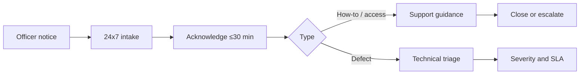

# 7. Operations and support

During the one-year warranty, named สกพอ. users can report questions and defects by phone, email, or application channel at any time. Rocket acknowledges each notice within 30 minutes, separates user guidance from technical incidents, and applies the contractual resolution times. สกพอ. or its cloud MSP continues to operate the production hosts; Rocket is responsible for diagnosing and correcting application defects.

## 7.1 Warranty frame

Buyer requirement text (TOR 14 — source extract):

> 14. การรับประกัน … ผู้รับจ้างต้องทาการบารุงรักษา ซ่อมแซมแก้ไขระบบงานให้อยู่ในสภาพที่ใช้งานได้ดีดังเดิมตลอดระยะเวลาที่รับประกันโดยระยะเวลาที่รับประกัน 1 ปี เริ่มนับถัดจากวันที่ผู้รับจ้างส่งมอบงานถูกต้องครบถ้วน และคณะกรรมการตรวจรับพัสดุของผู้ว่าจ้างทาการตรวจรับงานงวดสุดท้ายของโครงการเรียบร้อย …
>
> 14.1 … ผู้รับจ้างต้องสามารถรับแจ้งได้ตลอดทุกช่วงเวลาตลอด 24 ชั่วโมง ทางโทรศัพท์เคลื่อนที่หรือจดหมายอิเล็กทรอนิกส์ (E-mail) หรือทางโปรแกรมอานวยความสะดวกต่าง ๆ (Application) โดยหลังจากที่ผู้รับจ้างได้รับแจ้งเหตุแล้วจะต้องตอบกลับภายใน 30 นาที …
>
> 14.2.1 …ฟังก์ชันการทางานหลัก ของระบบไม่สามารถใช้งานได้ ผู้รับจ้างจะต้องดาเนินการแก้ไขให้เรียบร้อยภายใน 4 ชั่วโมง นับจากได้รับแจ้ง  
> 14.2.2 …ปัญหาในส่วนที่ไม่ใช่หน้าที่หลัก ของระบบผู้รับจ้างจะต้องดาเนินการแก้ไขให้เรียบร้อยภายใน 24 ชั่วโมง นับจากได้รับแจ้ง  
> 14.2.3 …ไม่มีผลกระทบต่อการรับบริการ ผู้รับจ้างจะต้องดาเนินการแก้ไขให้เรียบร้อยภายใน 48 ชั่วโมง นับจากได้รับแจ้ง  
> 14.2.7 …สามารถหาวิธีการให้ระบบใช้งานไปพลางก่อนได้ (Workaround) ผู้รับจ้างจะต้องดาเนินการแก้ไขให้เรียบร้อย ภายใน 7 วันทาการนับจากวันที่ได้รับแจ้ง

| How Rocket operates against the clause | Response |
|---|---|
| Warranty year after final Phase 3 acceptance | Application maintenance and defect repair for **1 year** from committee acceptance of the final delivery package |
| 24×7 intake; acknowledge ≤30 minutes | Named users report by phone, email, or application channel; Rocket acknowledges within **30 minutes** |
| Critical — core functions unusable (≤4 hours) | Severity clock starts at notice; fix target **4 hours** |
| Non-core defect (≤24 hours) | Fix target **24 hours** |
| Non-core, no service impact (≤48 hours) | Fix target **48 hours** |
| Workaround in place (≤7 business days) | Permanent fix ≤ **7 business days** from notice |
| Host hardware fault (not app) — TOR 14.2.4 | Investigate and **report** to สกพอ.; not treated as application defect |
| External / other-system fault — TOR 14.2.5 | Investigate and **report**; not treated as application defect |
| Force majeure delay — TOR 14.2.6 | Daily progress report until resolved |

## 7.2 Support operations (officers)

Named EECO users use the same warranty intake channels for:

| Request type | Handling |
|---|---|
| How-to / navigation | Guidance or point to manuals; escalate to short coaching if needed |
| Access / role question | Verify against RBAC config; route to สกพอ. admin if policy change |
| Suspected defect | Open technical ticket → Section 7.3 |
| Data correction request | Validate identity and authority → approve if required → execute → audit log |

## 7.3 Incident response and escalation

Rocket classifies each application defect against the warranty commitments in Section 7.1, starts the relevant resolution clock, and escalates according to the technical depth required.

| Step | Target |
|---|---|
| Intake / L1 | Acknowledge; classify severity; reproduce |
| L2 application support | Diagnose; patch or config fix |
| L3 engineering | Code fix; emergency release if critical |
| Infra / cloud | If host or network — **สกพอ. MSP** with Rocket evidence report |

For host or network incidents, Rocket supplies application evidence to สกพอ. or its cloud MSP and continues application diagnosis in parallel.

| Phase | Actions |
|---|---|
| Before | Monitoring handoff of app/audit logs; change control; named on-call path for warranty |
| During | Severity clock; user communication; containment; avoid unreviewed changes that cascade |
| After | Root-cause note for significant incidents; update runbook; close ticket |

## 7.4 Change request management (warranty period)

| Step | What happens |
|---|---|
| Request | Logged via intake or สกพอ. project contact |
| Scope | Impact on Journey, integrations, data; effort estimate |
| Impact | Low / medium / high |
| Authority | Low: project manager with log; medium/high: joint review with สกพอ. before production change |
| Release | Test in non-prod; CAB-style approval for medium/high; rollback plan |

Contract variations and additional scope follow the contract. The process above governs technical assessment, approval, testing, and release during the warranty period.

## 7.5 Communications matrix

| Event | Deliverable | Channel | Frequency | Owner | Audience |
|---|---|---|---|---|---|
| Status (delivery) | Weekly status | Email + meeting | Weekly until go-live | Project manager | สกพอ. sponsors |
| Incident (P-critical) | Incident notice | Phone + email | ASAP | Support lead | Product owner / affected units |
| Change (medium/high) | Change brief | Email | Before deploy | Project manager | สกพอ. IT + business |
| Warranty monthly | Short service note | Email | Monthly in warranty year | Support lead | สกพอ. coordinator |

Reference: TOR 14; operations placement with Section 4.4 and Section 6.
