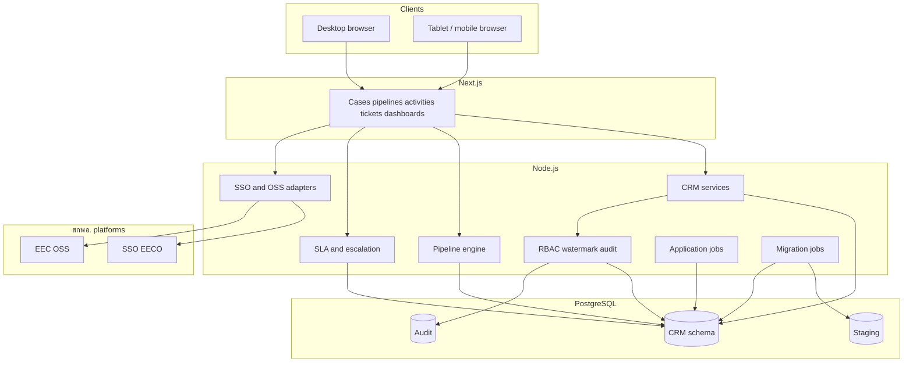
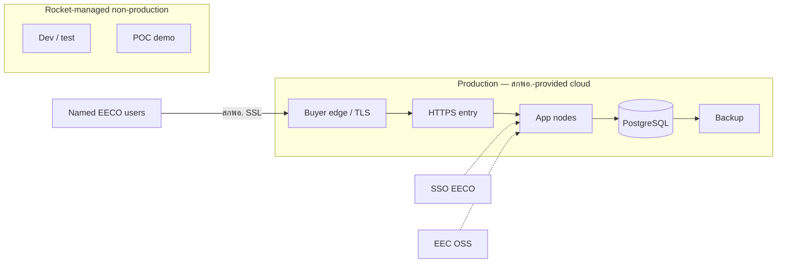
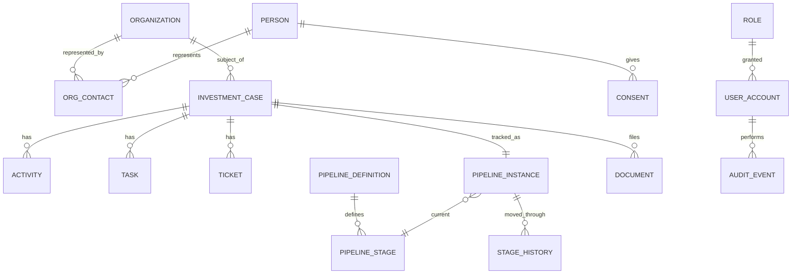

# 4. System architecture and technical design

Officers use a browser (desktop or tablet). The user interface calls a Node.js application programming interface that enforces journey rules, service-level agreements, role-based access, and integrations. PostgreSQL is the system of record. Authentication is through **SSO EECO**.

**Production** runs on hosts that **สกพอ. procures** through a cloud service provider (TOR cites GDCC as an example). Rocket prepares the **minimum infrastructure specification** in vendor-agnostic terms, then installs and configures the application on the environment สกพอ. provides. **Development, test, and proof-of-concept** environments are Rocket-managed for build and demonstration.

## 4.1 Logical architecture

| Layer | Enables these features |
|---|---|
| Next.js | Customer 360, pipeline board, activity/task/ticket forms, heat map, role-aware screens |
| Node.js API | Stage moves, SLA timers, routing, watermark, audit write, bulk import, OSS pull — **one API** for all officer UIs so rules are not duplicated per client |
| Application jobs | SLA timers, scheduled digests, migration batches — inside the application/database, without a separate message-broker cluster |
| PostgreSQL | 1:N contacts, stage history, consent, sensitive docs, append-only audit |
| SSO EECO | Sign-in and basic profile for named users |
| EEC OSS adapter | Status panel on the investment case (endpoints agreed in BA) |

Background SLA timers, scheduled digests, and migration batches run as application and database jobs within the deployed stack, avoiding a separate messaging cluster on สกพอ. infrastructure.

## 4.2 Deployment architecture and environments

| Environment | Who provides hosts | Purpose |
|---|---|---|
| Production | สกพอ., via Cloud (e.g. GDCC) | Full CRM after go-live |
| Non-production | Rocket Innovation Co., Ltd. | Build and UAT rehearsal |
| POC demonstration | Rocket Innovation Co., Ltd. | Committee demonstration |

Cloud provider names in this proposal are **examples**. The production design is **vendor-agnostic**: capacity and topology are specified so สกพอ. can procure equivalent hosts from the provider it selects.

**Operations ownership.** Production edge protection (WAF/DDoS where the cloud offers it), host patching, backup scheduling on the platform, and any SIEM/SOC are **สกพอ. (or สกพอ.’s cloud MSP)** responsibilities. Rocket delivers the application, configures it on the provided hosts, and emits structured application and audit logs that สกพอ. can retain or forward into the Authority’s monitoring stack.

## 4.2.1 Minimum infrastructure specification (vendor-agnostic)

Per TOR 5.3.7, Rocket will submit detailed infrastructure documentation (database, network, and system architecture) in Phase 1. The following **indicative minima** support ≥100 named users in production and will be refined with สกพอ. after BRD and load assumptions are confirmed. Figures are capacity targets, not a commitment to any single cloud SKU.

| Component | Indicative minimum (production) | Notes |
|---|---|---|
| Application tier | 2 instances · ≥4 vCPU · ≥8 GB RAM each | Behind HTTPS load balancer; rolling restart without full outage preferred |
| Database | PostgreSQL-compatible · ≥4 vCPU · ≥16 GB RAM · ≥200 GB SSD | Automated daily backup; point-in-time recovery where the platform allows |
| Object / file storage | ≥200 GB encrypted | LOI, NDA, financials, activity attachments |
| Network | TLS 1.2+ HTTPS; private DB segment; allowlisted egress to SSO EECO and EEC OSS | สกพอ. SSL certificate on the public entry (TOR 5.10.2) |
| Availability | Target ≥99.5% monthly for application entry (subject to buyer cloud SLA) | Maintenance windows agreed in operations runbook |
| Backup / DR | Daily backup retained ≥30 days; documented restore drill | DR approach documented at go-live (TOR 5.9.3) |
| Observability handoff | Central application and audit logs (≥180 days application audit) | Exportable to สกพอ. monitoring tools |

Installation and configuration on the hosts สกพอ. provides are included in the contractor scope (TOR 7.3.2 with 5.3.7).

## 4.3 Database design

The model centers on the **investment case**, so one person can represent many organizations without duplicate person rows.

Three design patterns keep operational data trustworthy under concurrent officer work:

| Pattern | Role in this CRM | Examples |
|---|---|---|
| **Append-oriented history** | Prove what happened without rewriting the past | Pipeline stage history; application audit events (view/edit/download) |
| **Mutable current state** | Fast “where is this case now?” reads | Current pipeline stage; ticket status; assignment |
| **Staging / job queues** | Safe cutover and background work | Excel migration staging tables; SLA and digest jobs |

| Table | Features it supports |
|---|---|
| `organization` / `person` / `org_contact` | Create/match investors; one contact across many companies |
| `investment_case` | Open and maintain the primary journey record |
| `activity` / `task` / `ticket` | Log fieldwork; calendar; SLA requests |
| `pipeline_*` / `stage_history` | Move stages; prove who moved when |
| `consent` / `document` | PDPA consent; LOI/NDA/financials with sensitivity class |
| `user_account` / `role` / `permission` | Named users; need-to-know |
| `audit_event` | Who viewed/edited/downloaded what |
| `staging_*` | Safe Excel migration before production load |

**Integrity rules:** person uniqueness across orgs; org dedupe by Tax ID / legal name; stage moves only on configured edges; sensitive reads always authorized + logged; audit append-only from the application’s point of view; idempotent import keys on migration batches where retries are expected.

### 4.3.1 Transactional work vs reporting

Day-to-day case updates (stages, activities, tickets) are the **transactional** workload on PostgreSQL. Dashboards and the heat map (Section 5.4) run as **constrained read queries** on the same database at the scale of ≥100 named users — no separate data-warehouse cluster is proposed for go-live. Heavy or scheduled extracts (for example digest jobs) run as application jobs off the interactive path so reporting does not starve officers’ updates. If สกพอ. later requires a dedicated analytics store, it can be added under a change-controlled infrastructure revision; it is not required to meet TOR reporting at this user scale.

## 4.4 Stack security placement (defense in depth)

Security is applied in layers. Rocket implements roles, watermarking, and audit behavior in the application; สกพอ. or its cloud MSP operates the production perimeter and monitoring controls.

| Layer | Control | Who operates in production |
|---|---|---|
| Perimeter | HTTPS entry, buyer SSL certificate, cloud WAF/DDoS if offered | สกพอ. / cloud MSP |
| Application | Authentication via SSO EECO; RBAC and need-to-know on every API path; input validation; parameterized queries | Rocket-built software, configured with สกพอ. |
| Data | Private DB segment; encryption at rest where the platform provides it; secrets via สกพอ.-approved secret store / platform mechanism (not embedded in source) | Platform + install jointly; keys on buyer infra |
| Evidence | Application audit trail ≥180 days; structured app logs | Rocket emits; สกพอ. retains / forwards to SIEM if any |

Rocket and สกพอ. verify these controls through joint UAT and security testing before acceptance.

## 4.5 Design documents in Phase 1

Formal design packs under TOR 5.3 (first 60 days): legacy schema inventory, SDD, refined ERD, UI/UX designs, **vendor-agnostic infrastructure minimum specification** for สกพอ. cloud procurement, OSS API Interface Document (jointly scoped), risk/impact note, and the operations handoff for logs/backup alignment with สกพอ. IT.

Reference: TOR 5.3, 5.3.5–5.3.7, 5.7, 5.10.
