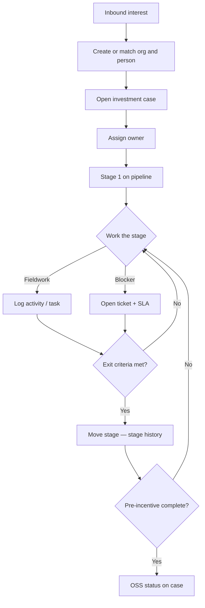
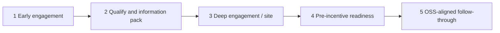
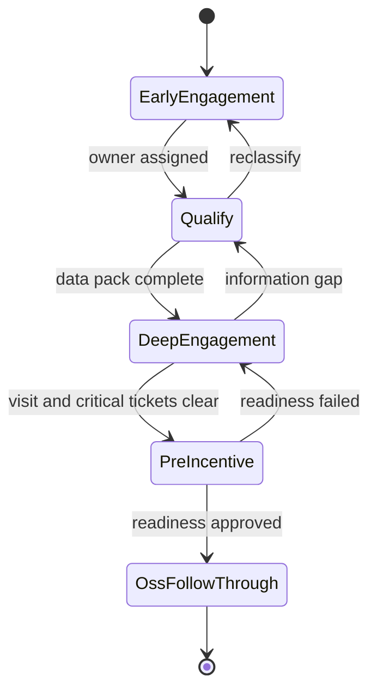
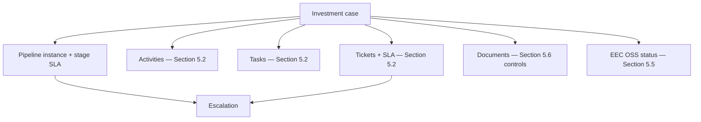

## 5.3 Investment Journey — run pre-incentive cases on a pipeline

Officers **open an investment case**, record work against it, and move it through configurable pre-incentive stages when the required evidence is complete. The same case retains sensitive documents, SLA history, and EEC OSS status, so the promotion history does not have to be reconstructed from side spreadsheets.

The contact and organization masters identify *who* is involved; the Journey records *where the promotion effort stands* and *what must happen next*.

## Investment Journey records

| Object | What it is | Why it matters |
|---|---|---|
| **Investment case** | The primary record for one promotion / project effort; links org, contacts, pipeline instance, activities, tasks, tickets, documents | Day-to-day promotion work for a live case is recorded here |
| **Pipeline definition** | A template of stages, transitions, SLA policies, optional owning bureau, checklists | FDI vs domestic expansion can differ without a second product |
| **Pipeline stage** | A named step in that template (order, label, SLA days, required checklist) | Columns on the board; vocabulary สกพอ. can rename in admin |
| **Pipeline instance** | The live placement of one case on one definition (current stage, entered_at) | What the board card represents |
| **Stage history** | Append-only log of moves (actor, from, to, time, comment) | Proves who advanced or sent back a case |
| **Exit checklist / gate** | Required fields or items that must be true before a move is allowed | Prevents a stage change without supporting evidence |
| **Stage SLA** | Timer from stage entry with warning/breach | Feeds escalation and the heat map (Section 5.4) |
| **Case workspace** | Single UI for stepper, timeline, tasks, tickets, documents, OSS panel | Primary workspace for the case owner |
| **Sensitive document on case** | LOI, NDA, financials with sensitivity class | Need-to-know + watermark (controls in Section 5.6) |

## Case and pipeline controls

| Feature | What the officer or manager does | Includes (sub-capabilities) |
|---|---|---|
| Open investment case | From a matched organization, the officer opens a case that becomes the working record for one promotion effort and places it on a chosen journey template. | Pipeline template selection (including recommended template library); case title/code; key contacts; industry/country context; automatic start in stage 1 with a pipeline instance. |
| Assign owner | The officer or manager sets which bureau and named officer own the case so accountability is visible on the board. | Owning bureau and named officer; reassignment with history; owner shown on board cards and case header. |
| View pipeline board | Managers and officers see all cases as columns by stage and filter to the slice they are responsible for. | Filters for industry, country, owner, aging, พ.ศ., and fiscal year; aging color on cards; open the case workspace from a card. |
| Move stage | The officer advances or sends back a case only along allowed transitions, with a permanent history of who moved it. | Allowed transitions only; comment required on send-back; append-only stage history (actor, from, to, time, comment); optional approver on sensitive jumps. |
| Stage checklist / exit gate | The system blocks a stage move until required evidence or fields are complete, so stages are not theater. | Required fields and checklist items per stage; clear block message listing what is missing; gate configuration by administrators. |
| Stage SLA | The system tracks days in the current stage and signals warning or breach so pressure is visible before the weekly meeting. | Timer from stage entry; warning and breach thresholds; feeds heat map and SLA-at-risk list (Section 5.4) and escalation. |
| Case workspace | The owner works the case from one screen instead of jumping across disconnected tools. | Stage stepper; activity timeline; tasks; tickets; document list; EEC OSS status panel; role-aware modules (Section 5.6). |
| Upload sensitive docs | The officer attaches LOI, NDA, or financial packs to the case under need-to-know controls. | Sensitivity class on the file; RBAC before view/download; dynamic watermark and audit on open (Section 5.6). |
| Show EEC OSS status | The officer sees one-stop service status on the same case, without re-keying into a side spreadsheet. | Pull on open/refresh; last-sync time; empty and error states; endpoints only from the Phase 1 API Interface Document (Section 5.5). |
| Configure pipelines (admin) | Administrators change journey rules—stages, transitions, SLA, ownership—without a code release for every policy tweak. | Rename/add stages; allowed transitions; SLA days; owning bureau defaults; approval requirement on sensitive jumps; starting templates for FDI / domestic / aftercare (recommended enhancement). |

### Recommended enhancement (beyond TOR minimum)

**Journey template library (FDI / domestic / aftercare).** Administrators start from approved stage sets for common promotion patterns instead of building every pipeline from a blank form. Labels and checklists remain editable under สกพอ. policy.

## Moving a case through the Investment Journey

### Opening and owning a case

From a matched organization (Section 5.1), the officer chooses **Open investment case**, selects a **pipeline definition** (starting templates below; BRD may rename), links key contacts, and assigns an owner bureau/officer. The system creates a **pipeline instance** in stage 1 and shows the case on the **pipeline board**.

### Working inside a stage

While the case sits in a stage, officers use Section 5.2 features — **log activity**, **create task**, **open ticket** — always linked to this case. Evidence (site photos, packs) attaches to activities or to the case document list. The stage does not advance automatically when an activity is saved; advancement is an explicit **Move stage** (or an admin-configured automation only if สกพอ. later asks for it in BRD).

### Moving stage and exit gates

**Move stage** offers only **allowed transitions**. If an **exit checklist** is configured (e.g. Tax ID present, visit report logged, critical tickets closed or accepted), the move stays blocked until items pass. On success, **stage history** records actor, from/to, time, and comment; **stage SLA** for the new stage starts fresh.

Sensitive jumps (for example into *Pre-incentive readiness* or out of it) may require an **approver role** before the move commits.

### SLA, escalation, and management view

Days-in-stage drive warning and breach. Breached stage SLA and breached ticket SLA (Section 5.2) both contribute to the executive **heat map** and SLA-at-risk lists (Section 5.4). Escalation can notify a manager or ping another bureau without removing the case from its column.

### Documents and OSS on the same case

LOI/NDA/financials upload to the case with sensitivity class; view/download follows Section 5.6 (RBAC + dynamic watermark + audit). When pre-incentive readiness is met, the case workspace shows an **EEC OSS status** panel fed by the pull integration in Section 5.5 — endpoint list fixed jointly in analysis, not invented in this bid.

## Worked path — overseas manufacturer, Chonburi

Illustrative names only. Stage labels are the starting template; BRD may rename them.

**Setting.** After an overseas roadshow, a Japanese advanced-materials company asks about a plant site in Chonburi. A PSD officer owns the case. Another bureau must join a later site walkthrough. Incentive filing is not yet the job — complete pre-incentive history and a clean OSS-aligned handoff are.

| When | In the field | Features / objects used |
|---|---|---|
| Day 0 | LINE/email intro + name card | Section 5.1: create/match **organization** & **person** · **Open investment case** · channel source · **Assign owner** · *Early engagement* |
| Week 1 | First meeting in Bangkok | Section 5.2: **Log activity** · attach pack outline · **Create task** “send sector brief” · update **lead score** (Section 5.1) |
| Week 2–3 | Land / utility questions | Remain in *Qualify and information pack* until minimum data complete · **Open ticket** to supporting bureau with **ticket SLA** if blocked |
| Week 5 | Site walkthrough in Chonburi | **Move stage** to *Deep engagement / site* when gate allows · tablet **activity + photos** · close or accept ticket · multi-bureau **tasks** on same case |
| Week 8 | Ready for incentive-related next steps | *Pre-incentive readiness* · **checklist gate** · **upload LOI/NDA** · approver confirms **stage move** |
| After | Services proceed in one-stop channels | *OSS-aligned follow-through* · **EEC OSS status** on case (Section 5.5) · keep logging CRM activities |

If the utilities ticket or readiness checklist ages past SLA, the **pipeline board** and **heat map** show the delay; **escalation** can notify the manager or the other bureau while the case remains in its current Journey stage.

**Short contrast.** A domestic expansion case can use another **pipeline definition** (fewer overseas pack steps). Admins change stages and checklists — they do not need a second product.

## Stage model (configurable starting template)

| Stage | Intent | Evidence on the case | Exit when |
|---|---|---|---|
| 1 Early engagement | Capture interest and owners | First activity, channel, rough industry/country | Owner set; org matched/created |
| 2 Qualify and information pack | Confirm seriousness; exchange packs | Pack send/receive, Q&A activities, score | Minimum data set complete |
| 3 Deep engagement / site | On-ground or deep dialogue | Site visit + attachments; multi-bureau tasks | Visit logged; critical tickets resolved or accepted |
| 4 Pre-incentive readiness | Package for incentive-related next steps | Checklist; LOI/NDA under RBAC; SLA clear | Configured role approves readiness |
| 5 OSS-aligned follow-through | Stay aligned while OSS runs | Pulled OSS status; continuing activities | Operating rhythm agreed with สกพอ. |

## How journey objects connect

{{mockup:M12}}

{{mockup:M13}}

{{mockup:M14}}

{{mockup:M15}}

Reference: TOR 2.1, 5.5.4, 5.7.
