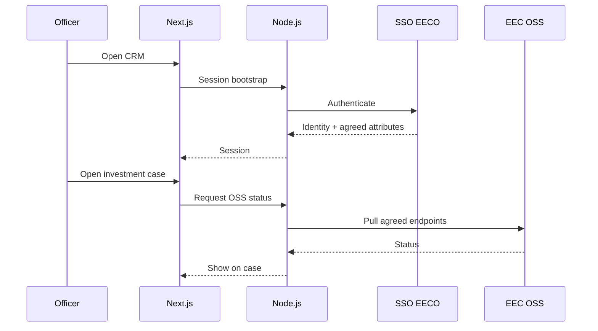

## 5.5 Sign in with SSO EECO and see EEC OSS on the case

Officers already use **SSO EECO**, and investment services already run through **EEC OSS**. The CRM uses those systems rather than creating a parallel password store or requiring officers to re-key OSS status into Excel. Current OSS status appears on the investment case where officers already manage the Journey.

## Integration records and contracts

| Object | What it is | Why it matters |
|---|---|---|
| **SSO session** | Authenticated browser session after EECO identity provider login | Named users (≥100) without a second password database |
| **Master profile attributes** | Agreed fields from SSO (e.g. name, org unit) written onto the CRM user | Keeps CRM user aligned with EECO directory — list fixed in BA |
| **Integration adapter** | Node.js component that talks REST (or SOAP if required) to an external system | Isolates contract changes from the UI |
| **OSS status payload** | Pulled service status for display on an investment case | Keeps current status on the case; empty and error states are visible |
| **API Interface Document** | Phase 1 spec: endpoints, auth, fields, errors, non-goals | Joint contract with สกพอ. — not invented in this bid |

## SSO and EEC OSS behavior

| Feature | What happens | Includes (sub-capabilities) |
|---|---|---|
| Sign in with SSO EECO | The named user authenticates through สกพอ.’s SSO EECO identity provider; the CRM starts a session without a separate password database. | Redirect or prompt to the EECO IdP; session bootstrap on return; logout; ≥100 named users expandable with directory growth. |
| Profile sync | Agreed master attributes from SSO are written onto the CRM user so the directory and CRM stay aligned. | Attribute list fixed in BA (for example name and organization unit); refresh on login; no invented fields beyond the agreed set. |
| Open case → OSS panel | Opening an investment case pulls current EEC OSS service status onto that case for display in the Journey workspace. | Trigger on open and on manual refresh; panel UI owned by Section 5.3; adapter call uses only endpoints in the API Interface Document. |
| Last-sync / error state | Officers see whether the OSS pull is fresh or failed, instead of trusting silent stale data. | Last successful sync timestamp; clear error when an endpoint is unavailable; retry without leaving the case. |
| Open API style | Integrations use open interfaces so สกพอ. is not locked into a closed proprietary bus. | REST by default; SOAP where an สกพอ. system still requires it; documented in the Phase 1 API Interface Document. |
| Adapter isolation | External contract changes are absorbed in the adapter layer so the officer UI does not need a rewrite for every OSS field change. | Node.js adapters for SSO and OSS; non-goals and error handling recorded in the API Interface Document; risk/impact note under TOR 5.4. |

## Login and status retrieval

1. Officer hits the CRM URL → redirected or prompted to **SSO EECO** → session established; RBAC roles from Section 5.6 still decide what cases and documents they see.  
2. Opening an investment case triggers (or refreshes) an **OSS status pull** through the adapter using endpoints from the API Interface Document.  
3. The Section 5.3 case workspace renders the panel; failures show last-sync/error rather than silent stale data.  
4. Phase 1 risk/impact notes cover coexistence with OSS and related services (incentives, permits, advisory).

{{mockup:M01}}

Reference: TOR 5.5.6, 5.7, 5.3.6, 5.4.
