# ข้อเสนอทางเทคนิค

**โครงการ:** การพัฒนาระบบบริหารจัดการความสัมพันธ์นักลงทุนและฐานข้อมูลกลาง (CRM & Database Management System)

**หน่วยงานผู้ว่าจ้าง:** สำนักงานคณะกรรมการนโยบายเขตพัฒนาพิเศษภาคตะวันออก (สกพอ.)

**ผู้ยื่นข้อเสนอ:** บริษัท ร็อคเก็ต อินโนเวชั่น จำกัด

**เอกสาร:** ส่วนที่ 2 — แนวทางเทคนิค การออกแบบระบบ และแผนการส่งมอบ

# แนะนำบริษัท

**ผู้ยื่นข้อเสนอ:** บริษัท ร็อคเก็ต อินโนเวชั่น จำกัด

บริษัท ร็อคเก็ต อินโนเวชั่น จำกัด เป็นผู้ให้บริการซอฟต์แวร์ CRM และระบบบริหารความสัมพันธ์ลูกค้าในประเทศไทย ให้บริการลูกค้าองค์กรมากกว่า **100** ราย และมีทีมเทคนิคมากกว่า **30** คน ขอบเขตงานหลักครอบคลุม CRM แพลตฟอร์มบริการลูกค้า B2C และ B2B ระบบสมาชิก (loyalty) และการตลาดอัตโนมัติ

บริษัทฯ มีผลงานด้านข้อมูลลูกค้า CRM ระบบสมาชิก และเทคโนโลยีการตลาด ซึ่งแสดงไว้ในหลักฐานประกอบคุณสมบัติและบทคัดจาก MarTech Report ปี 2025 ที่แนบมากับข้อเสนอ

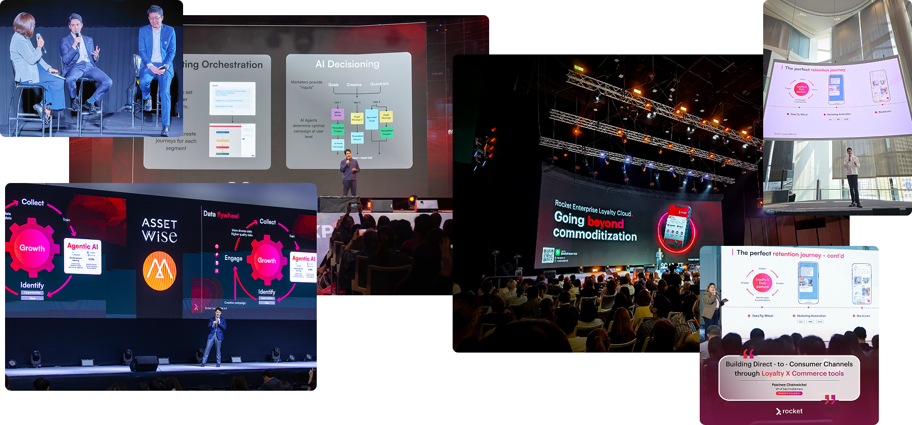

*บุคลากร บริษัท ร็อคเก็ต อินโนเวชั่น จำกัด นำเสนอแนวปฏิบัติด้าน CRM ระบบสมาชิก ข้อมูลลูกค้า และเทคโนโลยีการตลาดในงานอุตสาหกรรมในประเทศไทย*

<figure style="display:grid;grid-template-columns:1fr 1fr;gap:0.75rem;margin:1rem 0 0;">

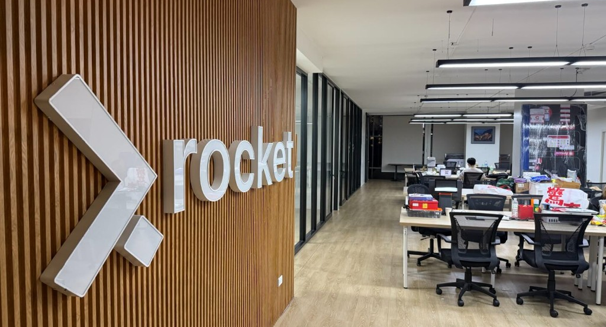
</figure>

*ทีมส่งมอบและพื้นที่ทำงานของ บริษัท ร็อคเก็ต อินโนเวชั่น จำกัด — ทีมเทคนิคกว่า 30 คนรองรับโครงการ CRM ระดับองค์กร*

## ความเหมาะสมกับโครงการ CRM ของ สกพอ.

บริษัทฯ นำประสบการณ์ด้าน CRM และระบบบริการลูกค้ามาใช้กับโครงการนี้ผ่านองค์ประกอบ 3 ส่วน

- **แกน CRM ที่ตั้งค่าได้** รองรับข้อมูลองค์กร บุคคล Activity, Task, Ticket, Pipeline, สิทธิ์ผู้ใช้ และ Audit Trail โดยผู้ดูแลปรับ Stage และ Workflow ตามนโยบายที่เปลี่ยนแปลงได้
- **การพัฒนาเฉพาะสำหรับ สกพอ.** ครอบคลุม Investment Journey การส่งต่อข้ามสำนัก SSO EECO การเชื่อมต่อ EEC OSS การควบคุมเอกสารลับ และการโอนย้ายข้อมูลจาก Excel
- **ทีมส่งมอบที่ระบุชื่อและความรับผิดชอบ** ครอบคลุมการวิเคราะห์ ออกแบบ พัฒนา ทดสอบ โอนย้าย อบรม และสนับสนุน รายชื่ออยู่ในข้อ 6 และหลักฐานคุณสมบัติอยู่ในภาคผนวก ข

## หลักฐานประกอบคุณสมบัติผู้ยื่นข้อเสนอ

เอกสารประกอบต่อไปนี้ใช้ยืนยันคุณสมบัติของบริษัทฯ และบุคลากรที่เสนอในโครงการ

- เอกสารจดทะเบียน เอกสารการเงิน และเอกสาร e-GP ตาม TOR ข้อ 4.1–4.12
- สัญญา ขอบเขตงาน และหนังสือรับรองผลงาน CRM / การบริหารงาน ที่เข้าข่ายตาม TOR ข้อ 4.13 และภาคผนวก ง
- บทคัดจาก MarTech Report ปี 2025 และหลักฐานขนาดองค์กรที่ได้รับอนุมัติ
- แบบฟอร์มภาคผนวก ข ที่ลงนาม พร้อมหลักฐานวุฒิและประสบการณ์ตาม TOR ข้อ 4.14 และ 5.12

# 1. สรุปผู้บริหาร

บริษัท ร็อคเก็ต อินโนเวชั่น จำกัด จะส่งมอบ**ระบบบริหารจัดการความสัมพันธ์นักลงทุนและฐานข้อมูลกลาง (CRM & Database Management System)** ให้ สกพอ. เพื่อให้เจ้าหน้าที่ส่งเสริมการลงทุนดำเนิน **Investment Journey** ในที่เดียว ได้แก่ สร้างและจับคู่ข้อมูลนักลงทุน บันทึกงานภาคสนาม เลื่อน Case ตาม **Stage ก่อนขอรับสิทธิประโยชน์ (Pre-incentive)** ส่งต่อเมื่อเกิน SLA คุ้มครองเอกสาร LOI/NDA/งบการเงิน และดูสถานะ **EEC OSS** โดยไม่ต้องพึ่งสเปรดชีตแยก

บริษัทฯ เสนอการส่งมอบแบบ**ผสม (Hybrid)** โดยใช้แกน CRM ที่ตั้งค่าได้สำหรับข้อมูลองค์กร บุคคล Case Activity Task Ticket Pipeline สิทธิ์ผู้ใช้ และ Audit Trail ควบคู่กับการพัฒนาเฉพาะสำหรับกฎของ Investment Journey การส่งต่อ Case ข้ามสำนัก การเชื่อมต่อ SSO EECO และ EEC OSS การประทับลายน้ำ และการโอนย้ายข้อมูลจาก Excel

## จากสถานะปัจจุบันสู่ CRM ที่เสนอ

{{diagram:executive-overview}}

### Investment Journey

**สถานะปัจจุบัน** ประวัติการติดต่อและบันทึก Case อยู่ในไฟล์ Excel ของแต่ละสำนักและติดตัวเจ้าหน้าที่ เมื่อมีการโยกย้ายบุคลากร การสืบว่าใครพบใครและสัญญาอะไรไว้จึงยาก ไม่มีโมเดล Stage ร่วมสำหรับงานก่อนขอรับสิทธิประโยชน์

**สถานะในอนาคต** เจ้าหน้าที่เปิด **Investment Case** เดียว บันทึก Activity และเอกสารต่อ Case นั้น และเลื่อน **Stage Pre-incentive** ที่ตั้งค่าได้เมื่อหลักฐานครบ Case เดียวกันเก็บเอกสารลับและสถานะ OSS

**ผลกระทบ** ประวัติการส่งเสริมยังคงอยู่เมื่อเปลี่ยนผู้รับผิดชอบ เจ้าหน้าที่เห็นงานถัดไปของแต่ละ Case และส่งต่องานสู่ **EEC OSS** ได้โดยไม่ต้องรวบรวมข้อมูลจากสเปรดชีตหลายชุด

### การมองเห็นของผู้บริหาร

**สถานะปัจจุบัน** ผู้บริหารมองเห็นได้ยากว่า Case ใดล่าช้า งานใดเสี่ยงเกิน SLA และสำนักใดรับผิดชอบประเด็นที่ติดขัด จนกว่าจะมีการประชุมรายสัปดาห์

**สถานะในอนาคต** **Heat Map** แสดง Case และ Ticket ที่ค้างหรือเสี่ยงเกิน SLA พร้อมเส้นทางส่งต่อไปยังผู้รับผิดชอบ Dashboard กรองข้อมูลตาม พ.ศ. และปีงบประมาณจากข้อมูล Case ชุดเดียวกัน

**ผลกระทบ** ผู้บริหารเข้าดำเนินการได้ก่อนงานเกินกำหนด SLA เห็นสำนักที่รับผิดชอบชัดเจน และใช้ข้อมูลจาก CRM จัดทำเอกสารประกอบการประชุมแทนการรวบรวมจากตัวติดตามสถานะแยกต่างหาก

### การเชื่อมต่อและข้อมูลหลัก

**สถานะปัจจุบัน** บริษัทเดียวกันปรากฏภายใต้ชื่อใกล้เคียงในหลายสเปรดชีต เจ้าหน้าที่คีย์สถานะบริการแบบเบ็ดเสร็จด้วยมือ ยังไม่มีไดเรกทอรี Named User ที่ออกแบบรองรับไม่น้อยกว่า 100 บัญชีและขยายได้พร้อมการเข้าถึงระยะไกลที่เข้มงวด

**สถานะในอนาคต** **SSO EECO** ใช้ยืนยันตัวตนของ Named Users สถานะ **EEC OSS** แสดงบน Case และการโอนย้ายทำให้ได้ฐานข้อมูลที่จัดโครงสร้างและลดข้อมูลซ้ำแล้ว พร้อมความสัมพันธ์ผู้ติดต่อแบบ 1:N

**ผลกระทบ** เจ้าหน้าที่ใช้บัญชีเดียวในการเข้าถึงระบบ ไม่ต้องมีคลังรหัสผ่านอีกชุด และได้รับข้อมูลที่มีโครงสร้างพร้อมใช้งานต่อหลังการส่งมอบ

**Application stack:** Next.js · Node.js · PostgreSQL โดย สกพอ. จัดหาโฮสต์ **Production** ผ่านผู้ให้บริการคลาวด์ เช่น GDCC บริษัทฯ จะจัดทำ**คุณสมบัติโครงสร้างพื้นฐานขั้นต่ำแบบไม่ผูก Vendor** และติดตั้งระบบบนโฮสต์ที่ สกพอ. จัดเตรียม สกพอ. หรือ MSP ของหน่วยงานรับผิดชอบการป้องกันทางเข้าระบบและการเฝ้าระวัง Production ส่วนบริษัทฯ จัดส่ง Application Log และ Audit Log ให้หน่วยงานนำไปจัดเก็บหรือติดตาม สภาพแวดล้อม**พัฒนา ทดสอบ และ POC** อยู่ภายใต้การบริหารของบริษัทฯ

เจ้าหน้าที่ได้รับเครื่องมือแบบฟอร์มที่ใช้งานบนอุปกรณ์เคลื่อนที่ได้ สำหรับผู้ใช้งานแบบระบุตัวตน (Named Users) ไม่น้อยกว่า **100** บัญชี Rocket ส่งมอบภายใน **210** วัน โดยชุดส่งมอบหลักที่วัน **60** **180** และ **210** (ข้อ 6) พร้อมสิทธิ์ขาด (Perpetual License) ซอร์สโค้ด (Source Code) หลักสูตร Train The Trainer และการรับประกัน 1 ปี พร้อมรับแจ้งตลอด 24 ชั่วโมง (ข้อ 7)

ระบบที่เสนอเก็บข้อมูลนักลงทุน กิจกรรมการส่งเสริม ความคืบหน้าตาม Stage เอกสาร และรายงานผู้บริหารไว้ใน Case เดียวกัน บริษัทฯ ยังเสนอส่วนเสริมเกินข้อกำหนดขั้นต่ำ 5 รายการ ได้แก่ หน้าจอรวมข้อมูลซ้ำแบบมีผู้ใช้ตรวจสอบ คิวบันทึกงานภาคสนามเมื่อออฟไลน์ หน้าจอกำหนดเส้นทางการส่งต่อรายสำนัก คลังเทมเพลต Journey และรายงานสรุปสำหรับผู้บริหารตามรอบเวลา

# 2. บริบทการปฏิบัติงานของ สกพอ.

สกพอ. ส่งเสริมการลงทุนในพื้นที่ฉะเชิงเทรา ชลบุรี และระยอง ปัจจุบันประวัติการติดต่อและ Case ยังกระจัดกระจายในไฟล์ Excel และอยู่ในความดูแลของเจ้าหน้าที่แต่ละคน เมื่อมีการโยกย้ายบุคลากร ความต่อเนื่องของบันทึกจึงขาดหาย ผู้บริหารมองเห็นได้ยากว่า Case ใดล่าช้า SLA ใดเสี่ยง และสำนักใดเป็นเจ้าของงานถัดไป

สอดคล้องกับนโยบาย **Centralized Intelligence** ของหน่วยงาน CRM ที่เสนอจัดให้มีฐานข้อมูลร่วม โดยใช้**กิจกรรม / Case การลงทุน**เป็นบันทึกหลักของการปฏิบัติงาน เจ้าหน้าที่ข้ามหน่วยทำงานจาก Case เดียวกันและเห็นผู้มีส่วนได้ส่วนเสียที่เกี่ยวข้องโดยไม่ต้องเก็บรายชื่อติดต่อซ้อนกัน

## สิ่งที่เจ้าหน้าที่และผู้บริหารจะทำได้

1. **ดำเนิน Investment Journey ในระยะ Pre-incentive** — ตั้งแต่การแนะนำครั้งแรกจนถึงความพร้อมสำหรับบริการภาครัฐที่เกี่ยวกับสิทธิประโยชน์ พร้อมประวัติ Stage ทุกครั้งที่ย้าย จากนั้นเชื่อมกับ **EEC OSS** โดยไม่ต้องคีย์ซ้ำ
2. **ทำงานประจำวันบน Journey เดียวกัน** — บันทึกการประชุม จัดการ Task และ Ticket และจัดเก็บเอกสาร รวมถึงใช้งานผ่านแท็บเล็ตนอกสำนักงาน
3. **เห็นงานค้างและความเสี่ยงก่อนเกิน SLA** — Heat Map แสดง Case หรือ Ticket ที่ใกล้หรือเกินเวลาตามนโยบาย พร้อมเส้นทางส่งต่อ
4. **รักษาความรู้จากการปฏิบัติงาน** — ใครพบใคร ที่ไหน เมื่อใด และผลเป็นอย่างไร — ยังคงอยู่ในระบบหลังมีการสับเปลี่ยนบุคลากร

## ผู้ใช้งาน

ใช้งานภายในองค์กรเท่านั้น: เจ้าหน้าที่และผู้บริหาร **ไม่น้อยกว่า 100 บัญชี** และขยายได้ เข้าถึงจากสำนักงาน จากที่อื่นในประเทศ หรือจากต่างประเทศผ่าน HTTPS ภายใต้การควบคุมการเข้าถึงที่เข้มงวด

## คำที่ใช้ในข้อเสนอนี้

คำต่อไปนี้ใช้ตามถ้อยคำที่ปรากฏใน TOR โดยตารางอธิบายว่าบริษัทฯ จะนำแต่ละคำมาใช้ในการปฏิบัติงานของระบบอย่างไร

| คำตาม TOR (ตามที่เผยแพร่) | ความหมายในผลิตภัณฑ์ |
|---|---|
| Centralized Intelligence (TOR 1) | ฐานข้อมูลร่วมและรูปแบบทำงานข้ามสายงาน แทน Excel ที่ยึดติดบุคคล |
| Investment Journey / Pre-incentive (TOR 2.1) | Stage ที่ตั้งค่าได้ซึ่ง Case เคลื่อนผ่านก่อนบริการภาครัฐที่เกี่ยวกับสิทธิประโยชน์ |
| Activity (TOR 1; 5.5) | การประชุม โทรศัพท์ ลงพื้นที่ หรือกิจกรรมส่งเสริมบน Timeline — แกนกลางการทำงานของ CRM |
| Heat Map / Escalation / SLA (TOR 2.2) | มุมมองผู้บริหารด้านภาระงานและความค้าง; แจ้งเตือนและส่งต่อเมื่องานเกินเวลานโยบาย |
| SSO EECO (TOR 5.5.6; 5.7.1) | วิธีเข้าสู่ระบบและดึง Master Profile ของเจ้าหน้าที่ |
| EEC OSS (TOR 2.1; 5.7.2) | สถานะที่ดึงมาแสดงบน Case จากระบบบริการแบบเบ็ดเสร็จ |
| Named Users (TOR 3.1) | บัญชีเจ้าหน้าที่/ผู้บริหารที่ระบุตัวตน — ไม่น้อยกว่า 100 บัญชี และขยายได้ |

อ้างอิง: TOR 1, 2, 3.

# 3. รูปแบบการส่งมอบและวิธีการดำเนินงาน

## สิ่งที่ Rocket ส่งมอบ

| ชั้น | สิ่งที่ Rocket ส่งมอบ |
|---|---|
| แกนผลิตภัณฑ์ที่ตั้งค่าได้ | ข้อมูลองค์กร บุคคล Case Activity Task Ticket Pipeline สิทธิ์ผู้ใช้ Audit Trail และ Dashboard ผู้ดูแลระบบปรับ Stage Checklist และเส้นทางการมอบหมายได้โดยไม่ต้องแก้ไขโค้ดทุกครั้งที่นโยบายเปลี่ยน |
| การพัฒนาเฉพาะสำหรับ สกพอ. | กฎของ Investment Journey ระยะ Pre-incentive การส่งต่อข้ามสำนัก การเข้าสู่ระบบด้วย SSO EECO การดึงสถานะ EEC OSS การประทับลายน้ำบนไฟล์ลับ และการโอนย้ายข้อมูลจาก Excel ของแต่ละสำนัก |
| การส่งมอบ | สิทธิ์ขาด (Perpetual License) ซอร์สโค้ด การอบรม และฐานข้อมูลที่จัดโครงสร้างและปรับปรุงคุณภาพแล้ว |

## ลำดับการดำเนินงาน

| ขั้น | งานและผลส่งมอบของบริษัทฯ | TOR |
|---|---|---|
| วางแผน | กำหนดการโครงการและการจัดสรรบุคลากรครบตามตำแหน่ง | 5.1 |
| BA | BRD; Workflow ของ Journey และ Ticket | 5.2 |
| ออกแบบ | SDD, ERD, ออกแบบ UI, คุณสมบัติ Infra ขั้นต่ำแบบไม่ผูก Vendor, ขอบเขต API Interface ของ OSS | 5.3 |
| ความเสี่ยง | บันทึกผลกระทบต่อ OSS และระบบที่เกี่ยวข้อง | 5.4 |
| พัฒนา | โมดูล CRM ที่ทำงานตามข้อ 5.1–5.7 | 5.5–5.7 |
| ความมั่นคง / โอนย้าย | Watermark Audit RBAC; Staging → Clean DB | 5.8–5.9 |
| ทดสอบและยืนยันผล | UAT ร่วมกับ สกพอ. การทดสอบความมั่นคงปลอดภัยตามแนวทาง OWASP และการใช้ SSL Certificate ของ สกพอ. | 5.10 |
| ส่งมอบ | Train the Trainer สำหรับผู้ดูแลและผู้ใช้ คู่มือ เอกสารสิทธิ์ใช้งาน ซอร์สโค้ด และเอกสาร Backup/DR | 5.11, 7.3 |

อ้างอิง: TOR 5.1–5.4, 10.2(4); ภาคผนวก ก 2.1.

# 4. สถาปัตยกรรมระบบและการออกแบบทางเทคนิค

เจ้าหน้าที่ใช้งานระบบผ่านเบราว์เซอร์บนเดสก์ท็อปหรือแท็บเล็ต ส่วนติดต่อผู้ใช้เชื่อมต่อกับ API บน Node.js ซึ่งควบคุมกฎของ Journey การนับ SLA สิทธิ์ตามบทบาท และการเชื่อมต่อระบบภายนอก โดยใช้ PostgreSQL เป็นฐานข้อมูลหลักและยืนยันตัวตนผ่าน **SSO EECO**

**Production** ทำงานบนโฮสต์ที่**สกพอ. จัดหา**ผ่านผู้ให้บริการคลาวด์ (TOR ยกตัวอย่าง GDCC) Rocket จัดทำ**คุณสมบัติโครงสร้างพื้นฐานขั้นต่ำ**แบบไม่ผูก Vendor จากนั้นติดตั้งและตั้งค่าแอปพลิเคชันบนสภาพแวดล้อมที่ สกพอ. จัดให้ สภาพแวดล้อม**พัฒนา ทดสอบ และ POC** บริหารโดย Rocket สำหรับการสร้างและสาธิต

## 4.1 สถาปัตยกรรมเชิงตรรกะ

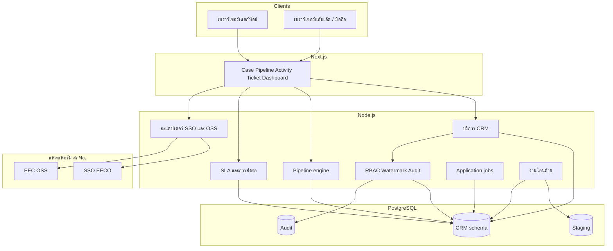

| ชั้น | รองรับความสามารถเหล่านี้ |
|---|---|
| Next.js | Customer 360 บอร์ด Pipeline แบบฟอร์ม Activity/Task/Ticket Heat Map หน้าจอตามบทบาท |
| Node.js API | ควบคุมการย้าย Stage การนับ SLA การมอบหมาย Watermark, Audit Trail, Bulk Import และการดึงข้อมูล OSS โดย API เดียวรองรับหน้าจอทุกช่องทาง ทำให้ทุกช่องทางใช้กฎธุรกิจชุดเดียวกัน |
| Application jobs | นาฬิกา SLA สรุปตามรอบเวลา แบตช์โอนย้าย — อยู่ในแอปพลิเคชัน/ฐานข้อมูล โดยไม่ต้องมีคลัสเตอร์ Message Broker แยก |
| PostgreSQL | ความสัมพันธ์ 1:N ประวัติ Stage Consent เอกสารลับ Audit แบบต่อท้าย |
| SSO EECO | เข้าสู่ระบบและโปรไฟล์พื้นฐานสำหรับ Named Users |
| อะแดปเตอร์ EEC OSS | แผงสถานะบน Investment Case (Endpoint ตกลงในขั้น BA) |

นาฬิกา SLA สรุปตามรอบเวลา และแบตช์โอนย้ายทำงานเป็นงานแอปพลิเคชันและฐานข้อมูลภายใน Stack ที่ติดตั้ง เพื่อหลีกเลี่ยงคลัสเตอร์ข้อความแยกบนโครงสร้างพื้นฐานของ สกพอ.

## 4.2 สถาปัตยกรรมการติดตั้งและสภาพแวดล้อม

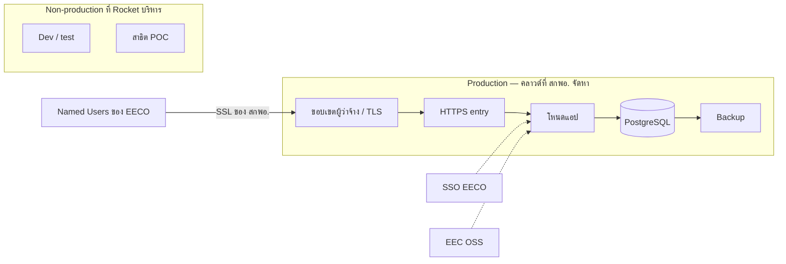

| สภาพแวดล้อม | ผู้จัดหาโฮสต์ | วัตถุประสงค์ |
|---|---|---|
| Production | สกพอ. ผ่าน Cloud (เช่น GDCC) | CRM เต็มรูปแบบหลัง Go-Live |
| Non-production | บริษัท ร็อคเก็ต อินโนเวชั่น จำกัด | พัฒนาและซ้อม UAT |
| สาธิต POC | บริษัท ร็อคเก็ต อินโนเวชั่น จำกัด | สาธิตต่อคณะกรรมการ |

ชื่อผู้ให้บริการคลาวด์ในข้อเสนอนี้เป็น**ตัวอย่าง** การออกแบบ Production **ไม่ผูก Vendor**: ระบุความจุและโทโพโลยีเพื่อให้ สกพอ. จัดหาโฮสต์เทียบเท่าจากผู้ให้บริการที่เลือก

**ความรับผิดชอบด้านการปฏิบัติการ** สกพอ. หรือ MSP ของหน่วยงานรับผิดชอบ WAF/DDoS หากบริการคลาวด์รองรับ การแพตช์โฮสต์ ตาราง Backup บนแพลตฟอร์ม และระบบ SIEM/SOC บริษัทฯ รับผิดชอบการติดตั้งและตั้งค่าแอปพลิเคชันบนโฮสต์ที่จัดเตรียม พร้อมส่งออก Application Log และ Audit Log แบบมีโครงสร้างให้หน่วยงานจัดเก็บหรือส่งต่อไปยังระบบเฝ้าระวัง

### 4.2.1 คุณสมบัติโครงสร้างพื้นฐานขั้นต่ำ (ไม่ผูก Vendor)

ตาม TOR ข้อ 5.3.7 บริษัทฯ จะส่งเอกสารโครงสร้างพื้นฐานโดยละเอียดด้านฐานข้อมูล เครือข่าย และสถาปัตยกรรมระบบในเฟสที่ 1 ตัวเลขด้านล่างเป็น**ค่าเบื้องต้น**สำหรับ Production ที่รองรับ Named Users ไม่น้อยกว่า 100 บัญชี และจะปรับร่วมกับ สกพอ. หลังยืนยัน BRD และปริมาณการใช้งานที่คาดการณ์ ตัวเลขดังกล่าวเป็นเป้าหมายด้านความจุและไม่ผูกกับ SKU ของผู้ให้บริการคลาวด์รายใด

| ส่วนประกอบ | ค่าขั้นต่ำเบื้องต้น (Production) | หมายเหตุ |
|---|---|---|
| Application tier | 2 instance · ≥4 vCPU · ≥8 GB RAM ต่อเครื่อง | หลัง Load Balancer แบบ HTTPS; รีสตาร์ทแบบหมุนเวียนโดยไม่หยุดทั้งระบบเป็นที่พึงประสงค์ |
| Database | เข้ากันได้กับ PostgreSQL · ≥4 vCPU · ≥16 GB RAM · ≥200 GB SSD | Backup อัตโนมัติรายวัน; Point-in-time recovery หากแพลตฟอร์มรองรับ |
| Object / file storage | ≥200 GB เข้ารหัส | LOI NDA งบการเงิน ไฟล์แนบ Activity |
| Network | TLS 1.2+ ผ่าน HTTPS ฐานข้อมูลอยู่ในเครือข่ายส่วนตัว และอนุญาตการเชื่อมต่อขาออกไปยัง SSO EECO และ EEC OSS ตาม Allowlist | ใบรับรอง SSL ของ สกพอ. ที่ทางเข้าสาธารณะ (TOR 5.10.2) |
| Availability | เป้าหมาย ≥99.5% ต่อเดือนที่ทางเข้าแอป (ขึ้นกับ SLA คลาวด์ของผู้ว่าจ้าง) | หน้าต่างบำรุงรักษาตกลงใน Runbook การปฏิบัติการ |
| Backup / DR | Backup รายวันเก็บอย่างน้อย 30 วัน; ซ้อมกู้คืนมีเอกสาร | แนวทาง DR จัดทำเอกสารตอน Go-Live (TOR 5.9.3) |
| ข้อมูลสำหรับการเฝ้าระวังระบบ | Application Log และ Audit Log แบบรวมศูนย์ โดยเก็บ Audit Log ระดับแอปพลิเคชันอย่างน้อย 180 วัน | ส่งออกไปยังเครื่องมือเฝ้าระวังของ สกพอ. ได้ |

การติดตั้งและตั้งค่าบนโฮสต์ที่ สกพอ. จัดให้อยู่ในขอบเขตผู้รับจ้าง (TOR 7.3.2 ร่วมกับ 5.3.7)

## 4.3 การออกแบบฐานข้อมูล

โมเดลยึด **Investment Case** เป็นศูนย์กลาง จึงให้บุคคลหนึ่งเป็นตัวแทนของหลายองค์กรได้โดยไม่สร้างแถวบุคคลซ้ำ

รูปแบบออกแบบ 3 แบบทำให้ข้อมูลปฏิบัติการน่าเชื่อถือภายใต้การทำงานพร้อมกันของเจ้าหน้าที่:

| รูปแบบ | บทบาทใน CRM นี้ | ตัวอย่าง |
|---|---|---|
| **ประวัติแบบต่อท้าย** | พิสูจน์สิ่งที่เกิดขึ้นโดยไม่เขียนทับอดีต | ประวัติ Stage ของ Pipeline; เหตุการณ์ Audit ของแอป (เปิดดู/แก้ไข/ดาวน์โหลด) |
| **สถานะปัจจุบันที่เปลี่ยนแปลงได้** | อ่านเร็วว่า “Case นี้อยู่ตรงไหน” | Stage ปัจจุบันของ Pipeline; สถานะ Ticket; ผู้รับมอบหมาย |
| **Staging / คิวงาน** | Cutover ที่ปลอดภัยและงานพื้นหลัง | ตาราง Staging ของการโอนย้าย Excel; งาน SLA และสรุปตามรอบ |

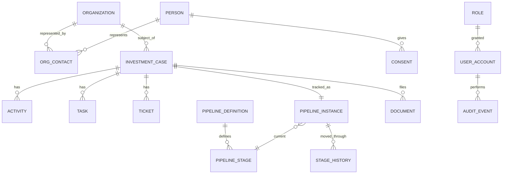

| ตาราง | ความสามารถที่รองรับ |
|---|---|
| `organization` / `person` / `org_contact` | สร้าง/จับคู่นักลงทุน; ผู้ติดต่อหนึ่งคนกับหลายบริษัท |
| `investment_case` | เปิดและดูแลบันทึก Journey หลัก |
| `activity` / `task` / `ticket` | บันทึกงานภาคสนาม; ปฏิทิน; คำขอที่มี SLA |
| `pipeline_*` / `stage_history` | ย้าย Stage; พิสูจน์ว่าใครย้ายเมื่อใด |
| `consent` / `document` | Consent ตาม PDPA; LOI/NDA/งบการเงินพร้อมชั้นความลับ |
| `user_account` / `role` / `permission` | Named Users; Need-to-know |
| `audit_event` | ใครเปิดดู/แก้ไข/ดาวน์โหลดอะไร |
| `staging_*` | โอนย้าย Excel อย่างปลอดภัยก่อนโหลด Production |

**กฎความถูกต้องของข้อมูล:** ระบบไม่สร้างข้อมูลบุคคลซ้ำเมื่อติดต่อกับหลายองค์กร ตรวจสอบองค์กรซ้ำด้วย Tax ID และชื่อนิติบุคคล ย้าย Stage ได้เฉพาะตามเส้นทางที่กำหนด การเข้าถึงข้อมูลลับต้องผ่านการอนุญาตและบันทึกทุกครั้ง Audit Trail ระดับแอปพลิเคชันเก็บเหตุการณ์แบบต่อท้าย และการนำเข้าข้อมูลซ้ำในแบตช์เดียวกันต้องไม่สร้างรายการใหม่ซ้ำ

### 4.3.1 งานธุรกรรมเทียบกับการรายงาน

การอัปเดต Case, Stage, Activity และ Ticket เป็นงานธุรกรรมบน PostgreSQL ส่วน Dashboard และ Heat Map อ่านข้อมูลเฉพาะขอบเขตที่ผู้ใช้เลือกจากฐานข้อมูลเดียวกัน สำหรับ Named Users ไม่น้อยกว่า 100 บัญชี ระบบจึงไม่จำเป็นต้องมีคลังข้อมูลแยกในวัน Go-Live งานสรุปที่ใช้เวลาประมวลผลมากหรือทำตามรอบเวลาจะทำเป็น Application Job เบื้องหลัง เพื่อไม่ให้กระทบการบันทึกงานของเจ้าหน้าที่ หาก สกพอ. ต้องการคลังข้อมูลสำหรับการวิเคราะห์เฉพาะทางในอนาคต สามารถพิจารณาเพิ่มเติมผ่านกระบวนการควบคุมการเปลี่ยนแปลง

## 4.4 การวางมาตรการความมั่นคงของ Stack (ป้องกันหลายชั้น)

บริษัทฯ แบ่งมาตรการความมั่นคงปลอดภัยออกเป็นหลายชั้น โดยติดตั้งการควบคุมสิทธิ์ Watermark และ Audit Trail ในแอปพลิเคชัน ส่วน สกพอ. หรือ MSP ของหน่วยงานรับผิดชอบการป้องกันทางเข้าระบบและการเฝ้าระวัง Production

| ชั้น | มาตรการ | ผู้ปฏิบัติการใน Production |
|---|---|---|
| ขอบเขต | ทางเข้า HTTPS ใบรับรอง SSL ของผู้ว่าจ้าง WAF/DDoS ของคลาวด์หากมี | สกพอ. / MSP คลาวด์ |
| แอปพลิเคชัน | Authentication ผ่าน SSO EECO; RBAC และ Need-to-know บนทุกเส้นทาง API; ตรวจสอบอินพุต; คิวรีแบบมีพารามิเตอร์ | ซอฟต์แวร์ที่ Rocket สร้าง ตั้งค่าร่วมกับ สกพอ. |
| ข้อมูล | ส่วน DB ส่วนตัว; เข้ารหัสขณะพักหากแพลตฟอร์มรองรับ; ความลับผ่านที่เก็บความลับที่ สกพอ. อนุมัติ / กลไกแพลตฟอร์ม (ไม่ฝังในซอร์ส) | แพลตฟอร์ม + ติดตั้งร่วม; คีย์อยู่บน Infra ของผู้ว่าจ้าง |
| หลักฐาน | Application Audit Trail ≥180 วัน; App Log แบบมีโครงสร้าง | Rocket ส่งออก; สกพอ. เก็บ / ส่งต่อไป SIEM หากมี |

Rocket และ สกพอ. ตรวจสอบมาตรการเหล่านี้ผ่าน UAT ร่วมและการทดสอบความมั่นคงก่อนการตรวจรับ

## 4.5 เอกสารออกแบบในเฟสที่ 1

ชุดออกแบบอย่างเป็นทางการตาม TOR ข้อ 5.3 ภายใน 60 วันแรกประกอบด้วยผลสำรวจ Schema เดิม SDD, ERD ฉบับละเอียด แบบ UI/UX **คุณสมบัติโครงสร้างพื้นฐานขั้นต่ำแบบไม่ผูก Vendor** สำหรับการจัดหาคลาวด์ของ สกพอ. เอกสาร API Interface ของ OSS บันทึกความเสี่ยงและผลกระทบ และเอกสารแนวทางส่งมอบ Application Log, Audit Log, Backup และ DR ให้สอดคล้องกับมาตรฐาน IT ของ สกพอ.

อ้างอิง: TOR 5.3, 5.3.5–5.3.7, 5.7, 5.10.

# 5. ฟังก์ชันหลักของระบบ

ระบบใช้ Investment Case เป็นบันทึกหลักของงานส่งเสริมการลงทุน ข้อมูลนักลงทุนระบุบุคคลและองค์กรที่เกี่ยวข้อง Activity, Task และ Ticket เก็บงานที่ดำเนินการแล้ว ส่วน Investment Journey แสดง Stage ปัจจุบันและงานที่ต้องทำต่อ Dashboard สรุปภาระงานและความล่าช้า ขณะที่ SSO EECO และ EEC OSS เชื่อม Case เข้ากับบริการเดิมของ สกพอ. ภายใต้มาตรการควบคุมข้อมูลลับและแผนโอนย้ายประวัติจาก Excel

## 5.1 สร้างนักลงทุน นำเข้ารายการ และรักษา Master ที่สะอาด

บริษัทฯ จะจัดข้อมูลนักลงทุนจากทุกสำนักให้อยู่ใน Master Data ชุดเดียว เจ้าหน้าที่ค้นหาและจับคู่องค์กรกับบุคคลก่อนเปิด Case ตรวจสอบรายการจากโรดโชว์ก่อนนำเข้า และใช้ **Customer 360** เป็นข้อมูลอ้างอิงร่วมแม้มีการเปลี่ยนผู้รับผิดชอบ

### การรับนักลงทุนและการควบคุมคุณภาพข้อมูล

| ความสามารถ | สิ่งที่เจ้าหน้าที่หรือผู้ดูแลทำ | ข้อมูลและการตรวจสอบ |
|---|---|---|
| สร้าง / จับคู่องค์กร | ค้นหาก่อนสร้าง เพื่อไม่ให้นิติบุคคลเดียวกันถูกบันทึกซ้ำภายใต้ชื่อต่างเล็กน้อย | ค้นด้วย Tax ID และชื่อนิติบุคคล; รายการใกล้เคียงพร้อมเปิดรายการเดิม; สร้างหลังยืนยัน; ฟิลด์อุตสาหกรรม ประเทศ สถานะ; ธงไม่ใช้งาน; ประวัติการเปลี่ยนระดับฟิลด์ |
| สร้าง / จับคู่บุคคล | เก็บข้อมูลบุคคลเพียงรายการเดียว แล้วเชื่อมเป็นผู้ติดต่อของหนึ่งหรือหลายองค์กร | ชื่อและตัวระบุที่ตกลงใน BA; บทบาทและสถานะผู้ติดต่อหลักบนความสัมพันธ์ org–contact; แจ้งรายการที่อาจเป็นบุคคลเดียวกันก่อนสร้างข้อมูลใหม่ |
| รับข้อมูลพร้อมแท็กช่องทาง | บันทึกว่าความสนใจมาจากช่องทางใด | ช่องทางรวม LINE OA Facebook Messenger อีเมล Call Center และอื่นที่ตกลงใน BRD; เก็บป้ายช่องทางและเวลาบน Interaction หรือ Lead |
| Bulk Import CSV / Excel | อัปโหลดรายการจากโรดโชว์หรือสำนัก จับคู่คอลัมน์ และยืนยันหลังข้อมูลแต่ละแถวผ่าน Validation | หน้าจอจับคู่คอลัมน์; ตรวจฟิลด์บังคับและรูปแบบ; ตารางข้อผิดพลาดรายแถวและฟิลด์; แจ้ง Tax ID หรือชื่อที่อาจซ้ำ; แก้ไขหรือปฏิเสธรายการก่อนนำเข้า |
| Bulk Export | ดาวน์โหลดข้อมูลตามขอบเขตสิทธิ์และตัวกรองที่เลือก | ส่งออกตามตัวกรองปัจจุบัน; ปิดบังคอลัมน์ลับตาม RBAC (ข้อ 5.6); บันทึกเหตุการณ์ส่งออกใน Audit Log |
| Customer 360 | เปิดมุมมองรวมของนักลงทุน ตัวตน ลิงก์ Consent และลำดับความสำคัญ | ส่วนหัวตัวตน; องค์กรที่เชื่อม (1:N); สถานะ Consent; Lead score; Timeline สรุป; นำทางเข้าสู่ Investment Case ที่ใช้งาน (ข้อ 5.3) |
| บริหาร Master Data | ผู้ดูแลรักษารายการอ้างอิง | อุตสาหกรรม ประเทศ และรายการตาม BRD; เพิ่ม/แก้ไข/ปิดใช้งาน; นับการใช้งาน; เสนอเฉพาะค่าที่ใช้งานบนฟอร์ม |
| Lead Scoring | เจ้าหน้าที่หรือกฎปรับลำดับความสำคัญ | ปรับด้วยเหตุผล; คำใบ้ตามกฎจาก BRD (ถ้ามี); แสดงคะแนนบน Customer 360 และคิวงาน |
| ช่วยตรวจข้อมูลซ้ำอัตโนมัติ | ระหว่างสร้างและนำเข้า ระบบแจ้งรายการที่อาจซ้ำ | จับคู่ Tax ID ตรงกัน; ตรวจความคล้ายของชื่อนิติบุคคล; บล็อกหรือเตือนตามนโยบาย; เปิดหน้าจอรวมข้อมูลซ้ำแบบมีผู้ใช้ตรวจสอบ |
| บันทึก Consent | ก่อนใช้ข้อมูลส่วนบุคคลที่อ่อนไหว บันทึก Consent | วัตถุประสงค์ หลักฐาน/ช่องทาง และเวลา; การถอนต่อท้ายประวัติโดยไม่ลบเหตุการณ์ Consent เดิม |

แกน CRM ที่ตั้งค่าได้รองรับการสร้างและจับคู่ Master Data, Lead Scoring และการตรวจสอบข้อมูลซ้ำ ส่วนอะแดปเตอร์ของแต่ละช่องทางและข้อความ Consent เฉพาะ สกพอ. จะพัฒนาเพิ่มตามข้อสรุปใน BRD

การนำเข้ารายการระหว่างใช้งานใช้กฎตรวจสอบฟิลด์ รูปแบบ และข้อมูลซ้ำชุดเดียวกับ Staging ของการโอนย้ายข้อมูล แต่การตัดย้ายประวัติครั้งแรกยังเป็นกระบวนการควบคุมแยกต่างหากตามข้อ 5.7

### ส่วนเสริมที่แนะนำ (เกินขั้นต่ำ TOR)

**หน้าจอรวมข้อมูลซ้ำแบบมีผู้ใช้ตรวจสอบ** เมื่อพบ Tax ID หรือชื่อนิติบุคคลที่อาจซ้ำ เจ้าหน้าที่เปรียบเทียบข้อมูล 2 รายการและเลือกค่าที่ต้องการเก็บในแต่ละฟิลด์ก่อนยืนยันการรวม เพื่อลดความเสี่ยงที่ข้อมูลสูญหายโดยไม่มีการแจ้งเตือน

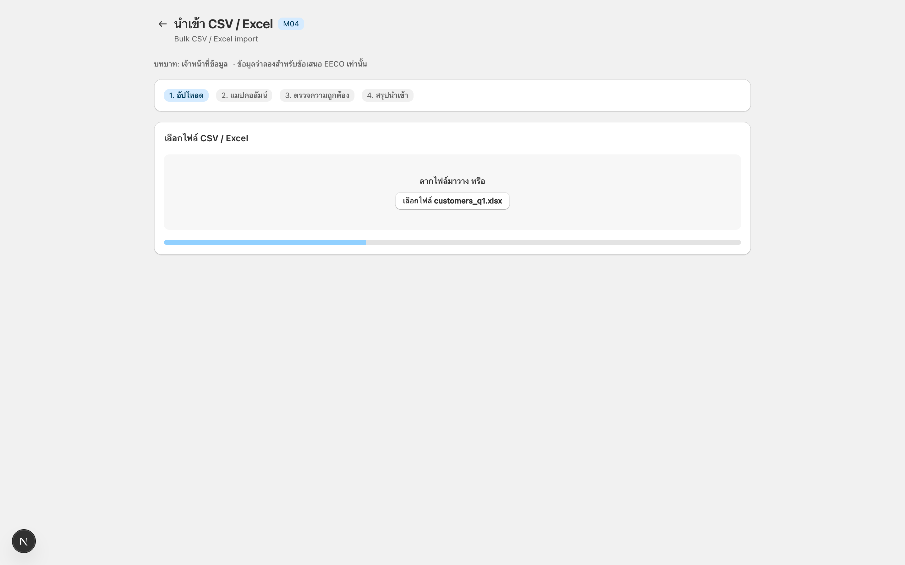

*M04: Bulk CSV / Excel import*

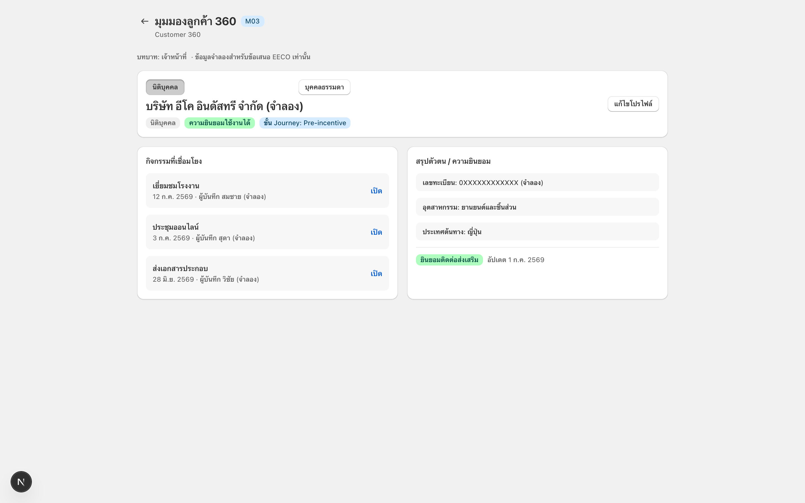

*M03: Customer 360*

อ้างอิง: TOR 5.5.1, 5.5.2.

## 5.2 บันทึกงานภาคสนาม มอบหมายงาน และส่งต่อเมื่อเกิดอุปสรรค

บริษัทฯ จะให้เจ้าหน้าที่บันทึกการประชุม การลงพื้นที่ งานติดตาม และประเด็นที่ต้องประสานข้ามสำนักไว้ใน **Activity** **Task** และ **Ticket** ที่เชื่อมกับ Investment Case เดียวกัน

### การควบคุม Activity, Task และ Ticket

| ความสามารถ | สิ่งที่เจ้าหน้าที่ทำ | รายละเอียดการติดตาม |
|---|---|---|
| บันทึก Activity | บันทึกการประชุม โทรศัพท์ ลงพื้นที่ หรือกิจกรรมส่งเสริมต่อ Investment Case (หรือลูกค้า) | ฟอร์มจับวันที่/เวลาที่บันทึก นัดหมาย สถานที่ ผู้ร่วมเดินทาง/ผู้เข้าร่วม วาระ เจ้าของ และลิงก์ Case/องค์กร/บุคคล การบันทึกต่อท้าย Timeline ของ Case และประวัติลูกค้าเมื่อเกี่ยวข้อง |
| แนบหลักฐาน | แนบรูปหรือไฟล์ ณ จุดปฏิบัติงาน | อัปโหลดเดสก์ท็อปและกล้องแท็บเล็ต/มือถือ; ประเภทไฟล์และขนาดตาม BRD; เปิดแนบจาก Timeline; รูปแบบควบคุมเดียวกันบน Ticket |
| Timeline ของ Case | ดูลำดับปฏิสัมพันธ์ตามเวลา | รายการตามเวลาพร้อมตัวกรองประเภท; เปิดแนบจากแถว; ผูกกับช่วง Stage เมื่อบันทึก (ถ้ามี) |
| สร้าง Task | เปลี่ยนการติดตามให้เป็นงานที่มีเจ้าของและวันครบกำหนด | ผู้รับมอบหมาย วันครบกำหนด เวลานำเตือน; มุมมองปฏิทินบุคคล/ทีม; ลิงก์กับ Case (หรือบุคคล/องค์กรเมื่อเหมาะสม) ได้เสมอ |
| ปิด Task | ปิดเมื่องานเสร็จ | เวลาและผู้ปิด; บันทึก Activity สั้นกลับ Timeline ได้; ไฮไลต์เกินกำหนดจนกว่าจะปิด |
| เปิด Ticket | เมื่องานติดขัด (มักข้ามสำนัก) เปิดคำขอมีเลขที่ยังผูกกับ Case | ประเภท ความสำคัญ คำอธิบาย ผู้ร้องขอ และลิงก์บังคับกับ Investment Case |
| จัดเส้นทาง Ticket | ระบบหรือเจ้าหน้าที่ส่งไปสำนัก/บุคคลเจ้าของตามกฎ | เส้นทางเริ่มต้นตามประเภท/สำนัก; มอบหมายใหม่ด้วยประวัติ; แสดงสำนักเจ้าของและผู้รับมอบหมายปัจจุบัน |
| ติดตาม SLA ของ Ticket | เห็นเวลาที่เหลือก่อนเกิน SLA | เริ่มนับเวลาเมื่อ Ticket เข้าสถานะที่ติดตาม; ตั้งเกณฑ์แจ้งเตือนได้; บันทึกเวลาเมื่อเกิน SLA; แสดงผลใน Heat Map และรายการงานเสี่ยงตามข้อ 5.4 |
| ส่งต่อหรือโอน Ticket | เมื่อ Ticket ติดขัดหรือเกิน SLA ระบบแจ้งผู้จัดการหรือโอนไปยังสำนักอื่น โดย Case ยังคงอยู่ใน Stage เดิม | แจ้งผู้จัดการ; โอนพร้อมความเห็น; ใช้เส้นทางที่กำหนดในหน้าจอการส่งต่อรายสำนัก; เก็บประวัติผู้รับผิดชอบ |
| พิมพ์ Activity (A4/PDF) | สรุป Activity หนึ่งหน้าสำหรับจัดเก็บหรือส่งต่อ | เลย์เอาต์ ISO A4; ตัวอักษรอ่านได้ใน PDF; รวมฟิลด์หลักและรายการแนบตาม BRD |

### ส่วนเสริมที่แนะนำ (เกินขั้นต่ำ TOR)

1. **คิวบันทึกงานภาคสนามเมื่อออฟไลน์** หากการเชื่อมต่อขาดระหว่างลงพื้นที่ แท็บเล็ตจะเก็บ Activity และไฟล์แนบไว้ในคิวและซิงก์เมื่อกลับมาออนไลน์
2. **หน้าจอกำหนดเส้นทางการส่งต่อรายสำนัก** ผู้บังคับบัญชากำหนดและปรับเส้นทางการส่งต่อของแต่ละสำนักในระบบได้

### ขั้นตอนงานภาคสนามและการส่งต่อ

ระหว่างลงพื้นที่ เจ้าหน้าที่บันทึก Activity และภาพประกอบผ่านแท็บเล็ตได้ทันที หากประเด็นต้องรอคำตอบจากสำนักอื่น ระบบจะเปิด Ticket มอบหมายผู้รับผิดชอบ เริ่มนับ SLA และส่งต่อเมื่อใกล้หรือเกินกำหนด โดย Investment Case ยังคงอยู่ใน Stage ปัจจุบัน

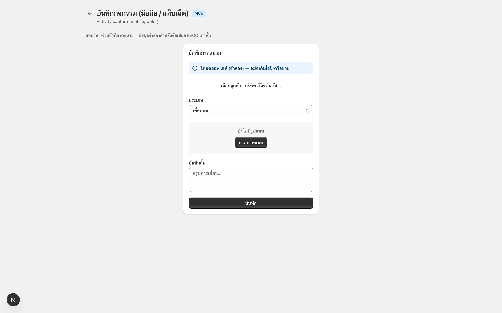

*M08: การบันทึก Activity ผ่านอุปกรณ์เคลื่อนที่*

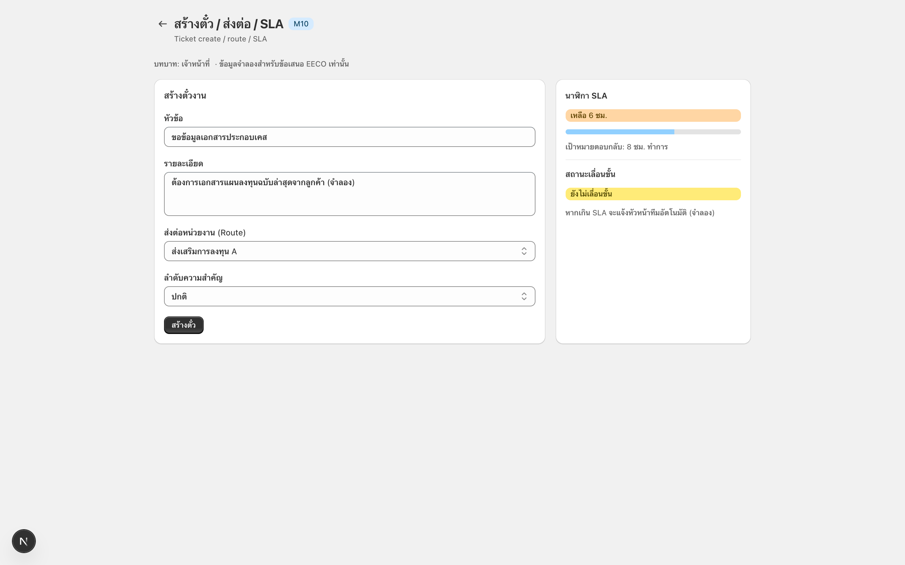

*M10: การเปิด Ticket การมอบหมาย และการติดตาม SLA*

อ้างอิง: TOR 5.5.3, 5.3.4.

## 5.3 Investment Journey — ดำเนิน Case ระยะ Pre-incentive บน Pipeline

เจ้าหน้าที่**เปิด Investment Case** บันทึกงานต่อ Case นั้น และเลื่อนผ่าน Stage Pre-incentive ที่ตั้งค่าได้เมื่อหลักฐานครบ Case เดียวกันเก็บเอกสารลับ ประวัติ SLA และสถานะ EEC OSS เพื่อไม่ต้องรวบรวมประวัติการส่งเสริมจากสเปรดชีตหลายชุด

Master ของผู้ติดต่อและองค์กรบอกว่า*ใคร*เกี่ยวข้อง Journey บันทึกว่า*ความพยายามส่งเสริมอยู่ตรงไหน* และ*ต้องทำอะไรต่อไป*

### องค์ประกอบของ Investment Journey

| วัตถุ | คืออะไร | เหตุใดจึงสำคัญ |
|---|---|---|
| **Investment case** | บันทึกหลักของความพยายามส่งเสริม/โครงการหนึ่ง; ลิงก์องค์กร ผู้ติดต่อ Pipeline instance Activity Task Ticket เอกสาร | งานส่งเสริมประจำวันของ Case ที่ใช้งานอยู่บันทึกที่นี่ |
| **Pipeline definition** | เทมเพลตของ Stage การเปลี่ยนผ่าน นโยบาย SLA สำนักเจ้าของ (ถ้ามี) Checklist | FDI กับขยายในประเทศต่างกันได้โดยไม่ต้องมีผลิตภัณฑ์ที่สอง |
| **Pipeline stage** | ขั้นที่มีชื่อในเทมเพลต (ลำดับ ป้าย วัน SLA Checklist ที่ต้องมี) | คอลัมน์บนบอร์ด; คำศัพท์ที่ สกพอ. เปลี่ยนชื่อใน Admin ได้ |
| **Pipeline instance** | สถานะของ Case แต่ละรายการภายใต้ Pipeline ที่เลือก รวม Stage ปัจจุบันและเวลาที่เข้าสู่ Stage | ข้อมูลที่แสดงบนการ์ดในบอร์ด Pipeline |
| **Stage history** | Log แบบต่อท้ายของการย้าย (ผู้กระทำ จาก ไป เวลา ความเห็น) | พิสูจน์ว่าใครเลื่อนหรือส่งกลับ Case |
| **Exit checklist / gate** | ฟิลด์หรือรายการที่ต้องเป็นจริงก่อนอนุญาตให้ย้าย | กันการเปลี่ยน Stage โดยไม่มีหลักฐานสนับสนุน |
| **Stage SLA** | เวลาที่นับตั้งแต่ Case เข้าสู่ Stage พร้อมเกณฑ์แจ้งเตือนและสถานะเกิน SLA | ใช้แสดงงานเสี่ยงใน Heat Map และกำหนดการส่งต่อ (ข้อ 5.4) |
| **Case workspace** | UI เดียวสำหรับ Stepper Timeline Task Ticket เอกสาร แผง OSS | พื้นที่ทำงานหลักของเจ้าของ Case |
| **เอกสารลับบน Case** | LOI NDA งบการเงินพร้อมชั้นความลับ | Need-to-know + Watermark (ควบคุมในข้อ 5.6) |

### การควบคุม Case และ Pipeline

| ความสามารถ | สิ่งที่เจ้าหน้าที่หรือผู้จัดการทำ | กฎและหลักฐาน |
|---|---|---|
| เปิด Investment Case | จากองค์กรที่จับคู่แล้ว เปิด Case เป็นบันทึกทำงานของความพยายามส่งเสริมหนึ่ง และวางบนเทมเพลต Journey ที่เลือก | เลือกเทมเพลต Pipeline (รวมคลังเทมเพลตที่แนะนำ); ชื่อ/รหัส Case; ผู้ติดต่อหลัก; บริบทอุตสาหกรรม/ประเทศ; เริ่มอัตโนมัติที่ Stage 1 พร้อม Pipeline instance |
| มอบหมายเจ้าของ | ตั้งสำนักและเจ้าหน้าที่ที่มีชื่อเป็นเจ้าของ Case | สำนักเจ้าของและเจ้าหน้าที่; มอบหมายใหม่พร้อมประวัติ; แสดงบนการ์ดบอร์ดและส่วนหัว Case |
| ดูบอร์ด Pipeline | เห็น Case เป็นคอลัมน์ตาม Stage และกรองตามความรับผิดชอบ | ตัวกรองอุตสาหกรรม ประเทศ เจ้าของ ความค้าง พ.ศ. และปีงบประมาณ; สีแสดงความค้างบนการ์ด; เปิดพื้นที่ทำงานจากการ์ด |
| ย้าย Stage | เลื่อนหรือส่งกลับ Case เฉพาะตามเส้นทางที่อนุญาต พร้อมบันทึกประวัติ | ต้องระบุความเห็นเมื่อส่งกลับ; เก็บประวัติ Stage แบบต่อท้าย; กำหนดผู้อนุมัติสำหรับการเปลี่ยน Stage ที่มีความเสี่ยงได้ |
| Checklist / Exit gate ของ Stage | ระบบบล็อกการย้ายจนกว่าหลักฐานหรือฟิลด์ที่ต้องมีครบ | ฟิลด์และรายการ Checklist ต่อ Stage; ข้อความบล็อกที่ระบุสิ่งที่ขาด; ผู้ดูแลตั้งค่าเกต |
| Stage SLA | ติดตามระยะเวลาใน Stage ปัจจุบัน พร้อมแจ้งเตือนและแสดงสถานะเกิน SLA | เริ่มนับเวลาเมื่อเข้า Stage; ตั้งเกณฑ์แจ้งเตือนได้; แสดงใน Heat Map และรายการงานเสี่ยงตามข้อ 5.4; ใช้กำหนดการส่งต่อ |
| พื้นที่ทำงานของ Case | เจ้าของทำงานจากหน้าจอเดียว | Stage stepper; Timeline ของ Activity; Task; Ticket; รายการเอกสาร; แผงสถานะ EEC OSS; โมดูลตามบทบาท (ข้อ 5.6) |
| อัปโหลดเอกสารลับ | แนบ LOI NDA หรือชุดงบการเงินภายใต้ Need-to-know | ชั้นความลับบนไฟล์; RBAC ก่อนเปิดดู/ดาวน์โหลด; Dynamic Watermark และ Audit เมื่อเปิด (ข้อ 5.6) |
| แสดงสถานะ EEC OSS | เห็นสถานะบริการแบบเบ็ดเสร็จบน Case เดียวกันโดยไม่คีย์ซ้ำ | ดึงเมื่อเปิด/รีเฟรช; เวลาซิงก์ล่าสุด; สถานะว่างและข้อผิดพลาด; Endpoint เฉพาะจากเอกสาร API Interface เฟสที่ 1 (ข้อ 5.5) |
| ตั้งค่า Pipeline (Admin) | ผู้ดูแลปรับ Stage เส้นทางการเปลี่ยน SLA และสำนักเจ้าของได้โดยไม่ต้องแก้ไขโค้ดทุกครั้ง | เปลี่ยนชื่อหรือเพิ่ม Stage; กำหนดเส้นทางที่อนุญาต; จำนวนวัน SLA; สำนักเจ้าของเริ่มต้น; ผู้อนุมัติสำหรับการเปลี่ยน Stage ที่มีความเสี่ยง; เทมเพลตเริ่มต้น FDI / ในประเทศ / Aftercare |

### ส่วนเสริมที่แนะนำ (เกินขั้นต่ำ TOR)

**คลังเทมเพลต Journey (FDI / ในประเทศ / Aftercare)** ผู้ดูแลเริ่มจากชุด Stage ที่อนุมัติสำหรับรูปแบบส่งเสริมทั่วไป แทนการสร้าง Pipeline ว่างทุกครั้ง ป้ายและ Checklist ยังแก้ได้ตามนโยบาย สกพอ.

### การเลื่อน Case ผ่าน Investment Journey

#### การเปิดและเป็นเจ้าของ Case

จากองค์กรที่จับคู่แล้ว (ข้อ 5.1) เจ้าหน้าที่เลือก **เปิด Investment Case** เลือก **Pipeline definition** (เทมเพลตเริ่มต้นด้านล่าง; BRD อาจเปลี่ยนชื่อ) ลิงก์ผู้ติดต่อหลัก และมอบหมายสำนัก/เจ้าหน้าที่เจ้าของ ระบบสร้าง **Pipeline instance** ที่ Stage 1 และแสดง Case บน **บอร์ด Pipeline**

#### การทำงานภายใน Stage

ขณะ Case อยู่ใน Stage เจ้าหน้าที่ใช้ความสามารถข้อ 5.2 — **บันทึก Activity** **สร้าง Task** **เปิด Ticket** — โดยลิงก์กับ Case นี้เสมอ หลักฐาน (รูปสถานที่ แฟ้ม) แนบกับ Activity หรือรายการเอกสารของ Case Stage ไม่เลื่อนอัตโนมัติเมื่อบันทึก Activity; การเลื่อนเป็นการ **ย้าย Stage** อย่างชัดเจน (หรือ Automation ที่ผู้ดูแลตั้งค่าเฉพาะเมื่อ สกพอ. ขอใน BRD ภายหลัง)

#### การย้าย Stage และ Exit gate

**ย้าย Stage** เสนอเฉพาะ**การเปลี่ยนผ่านที่อนุญาต** หากมี **Exit checklist** (เช่น มี Tax ID มีรายงานลงพื้นที่ Ticket สำคัญปิดหรือยอมรับแล้ว) การย้ายจะถูกบล็อกจนกว่ารายการผ่าน เมื่อสำเร็จ **ประวัติ Stage** บันทึกผู้กระทำ จาก/ไป เวลา และความเห็น; **Stage SLA** ของ Stage ใหม่เริ่มใหม่

การกระโดดที่อ่อนไหว (เช่น เข้าสู่ *ความพร้อม Pre-incentive* หรือออกจากนั้น) อาจต้องมี**บทบาทผู้อนุมัติ**ก่อนยืนยันการย้าย

#### SLA การส่งต่อและมุมมองผู้บริหาร

ระยะเวลาที่ Case อยู่ใน Stage ใช้คำนวณการแจ้งเตือนและสถานะเกิน Stage SLA ส่วน Ticket SLA ใช้กับงานที่ส่งไปยังสำนักหรือผู้รับผิดชอบตามข้อ 5.2 ข้อมูลทั้ง 2 ส่วนแสดงใน **Heat Map** และรายการงานเสี่ยงตามข้อ 5.4 เมื่อจำเป็น ระบบจะแจ้งผู้จัดการหรือส่งต่อไปยังสำนักอื่น โดย Case ยังคงอยู่ในคอลัมน์เดิมจนกว่าจะมีการย้าย Stage

#### เอกสารและ OSS บน Case เดียวกัน

LOI, NDA และงบการเงินจะจัดเก็บใน Case พร้อมชั้นความลับ การเปิดดูและดาวน์โหลดอยู่ภายใต้ RBAC, Dynamic Watermark และ Audit Trail ตามข้อ 5.6 พื้นที่ทำงานของ Case จะแสดง **สถานะ EEC OSS** ที่ดึงผ่าน Integration ตามข้อ 5.5 โดยบริษัทฯ จะยืนยัน Endpoint รูปแบบข้อมูล และการจัดการข้อผิดพลาดร่วมกับ สกพอ. ในขั้นวิเคราะห์

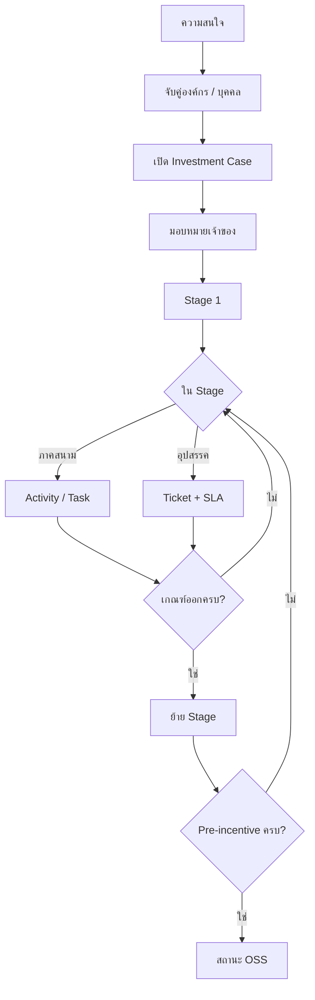

### เส้นทางตัวอย่าง — ผู้ผลิตต่างประเทศ จังหวัดชลบุรี

ชื่อเป็นตัวอย่างเท่านั้น ป้าย Stage เป็นเทมเพลตเริ่มต้น; BRD อาจเปลี่ยนชื่อ

**ฉาก** หลังโรดโชว์ต่างประเทศ บริษัทวัสดุขั้นสูงจากญี่ปุ่นสอบถามที่ตั้งโรงงานในชลบุรี เจ้าหน้าที่ PSD เป็นเจ้าของ Case สำนักอื่นต้องร่วมเดินดูสถานที่ในภายหลัง การยื่นสิทธิประโยชน์ยังไม่ใช่งานในขั้นนี้ — เป้าหมายคือประวัติ Pre-incentive ที่ครบและการส่งต่อที่สอดคล้อง OSS

| เมื่อ | ในภาคสนาม | ความสามารถ / วัตถุที่ใช้ |
|---|---|---|
| วัน 0 | แนะนำทาง LINE/อีเมล + นามบัตร | ข้อ 5.1: สร้าง/จับคู่ **องค์กร** และ **บุคคล** · **เปิด Investment Case** · แหล่งช่องทาง · **มอบหมายเจ้าของ** · *Early engagement* |
| สัปดาห์ 1 | ประชุมครั้งแรกที่กรุงเทพฯ | ข้อ 5.2: **บันทึก Activity** · แนบโครงแฟ้ม · **สร้าง Task** “ส่งสรุปภาค” · อัปเดต **Lead score** (ข้อ 5.1) |
| สัปดาห์ 2–3 | คำถามที่ดิน / สาธารณูปโภค | คงอยู่ใน *Qualify and information pack* จนข้อมูลขั้นต่ำครบ · **เปิด Ticket** ไปสำนักสนับสนุนพร้อม **Ticket SLA** หากติดขัด |
| สัปดาห์ 5 | เดินดูสถานที่ชลบุรี | **ย้าย Stage** ไป *Deep engagement / site* เมื่อเกตอนุญาต · **Activity + รูป** จากแท็บเล็ต · ปิดหรือยอมรับ Ticket · **Task** หลายสำนักบน Case เดียวกัน |
| สัปดาห์ 8 | พร้อมขั้นถัดไปที่เกี่ยวกับสิทธิประโยชน์ | *Pre-incentive readiness* · **เกต Checklist** · **อัปโหลด LOI/NDA** · ผู้อนุมัติยืนยัน **ย้าย Stage** |
| หลังจากนั้น | บริการเดินต่อในช่องทาง One-stop | *OSS-aligned follow-through* · **สถานะ EEC OSS** บน Case (ข้อ 5.5) · บันทึก Activity ใน CRM ต่อเนื่อง |

หาก Ticket ด้านสาธารณูปโภคหรือ Checklist ความพร้อมค้างเกิน SLA **บอร์ด Pipeline** และ **Heat Map** จะแสดงความล่าช้า พร้อมแจ้งผู้จัดการหรือส่งต่อไปยังสำนักที่เกี่ยวข้อง ขณะที่ Case ยังคงอยู่ใน Stage ปัจจุบัน

Case สำหรับการขยายการลงทุนในประเทศสามารถใช้ **Pipeline definition** ที่ต่างออกไป เช่น ลดขั้นตอนเอกสารต่างประเทศ ผู้ดูแลระบบปรับ Stage และ Checklist ได้โดยไม่ต้องแยกระบบอีกชุด

### โมเดล Stage เริ่มต้น

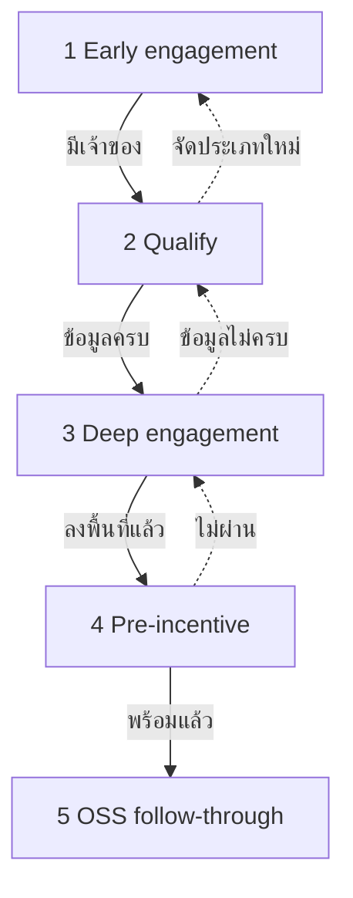

เส้นประ = การส่งกลับ Stage: จัดประเภทใหม่ / ข้อมูลยังไม่ครบ / ความพร้อมไม่ผ่าน

| Stage | เจตนา | หลักฐานบน Case | ออกเมื่อ |
|---|---|---|---|
| 1 Early engagement | บันทึกความสนใจและกำหนดผู้รับผิดชอบ | Activity แรก ช่องทาง อุตสาหกรรม/ประเทศโดยประมาณ | กำหนดเจ้าของ Case และจับคู่หรือสร้างองค์กรแล้ว |
| 2 Qualify and information pack | ยืนยันความสนใจและแลกเปลี่ยนเอกสาร | เอกสารที่ส่งและรับ Activity การถามตอบ และคะแนน | ชุดข้อมูลขั้นต่ำครบ |
| 3 Deep engagement / site | ลงพื้นที่หรือสนทนาเชิงลึก | ลงพื้นที่ + แนบ; Task หลายสำนัก | บันทึกลงพื้นที่แล้ว; Ticket สำคัญแก้หรือยอมรับแล้ว |
| 4 Pre-incentive readiness | เตรียมข้อมูลสำหรับขั้นถัดไปที่เกี่ยวกับสิทธิประโยชน์ | Checklist; LOI/NDA ภายใต้ RBAC; ไม่มีรายการสำคัญเกิน SLA | ผู้มีอำนาจตามบทบาทอนุมัติความพร้อม |
| 5 OSS-aligned follow-through | ดำเนินการต่อให้สอดคล้องกับกระบวนการของ EEC OSS | สถานะ OSS ที่ดึงมา; Activity ต่อเนื่อง | เป็นไปตามกระบวนการที่ตกลงร่วมกับ สกพอ. |

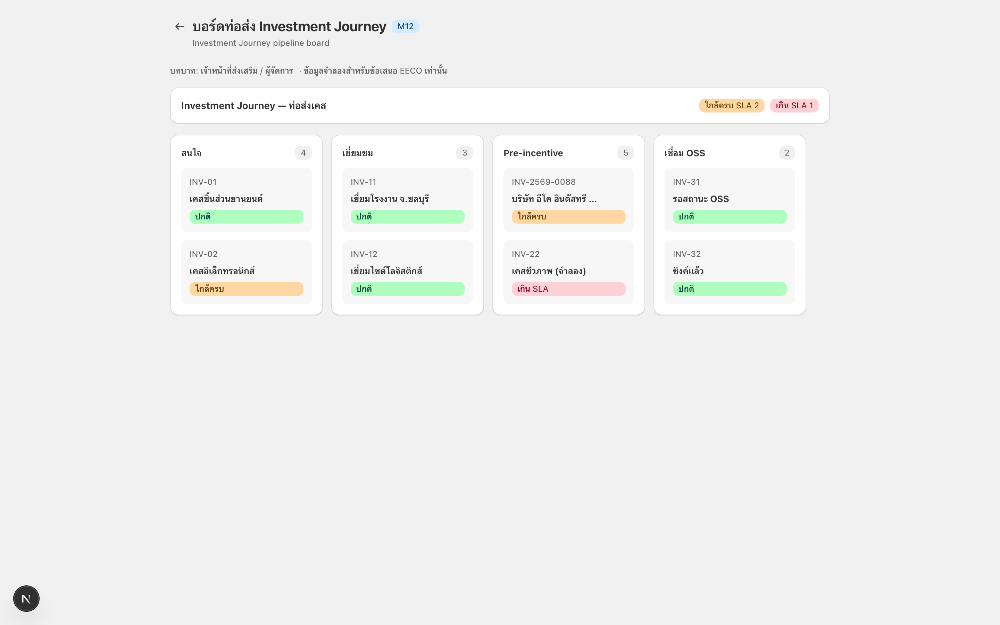

*M12: Investment Journey pipeline board*

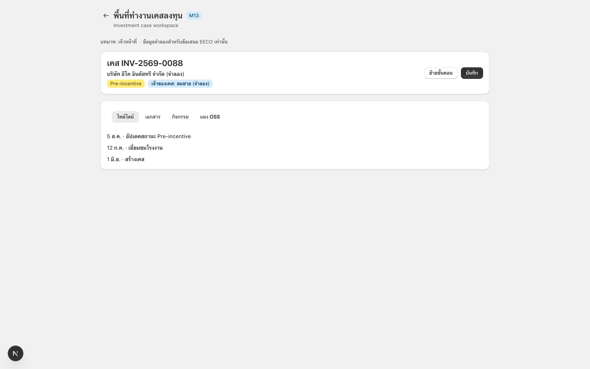

*M13: Investment case workspace*

อ้างอิง: TOR 2.1, 5.5.4, 5.7.

## 5.4 เห็นภาระงานและส่งออกรายงาน

Dashboard จะแสดง**จุดที่งานกระจุก** และ**Case หรือ Ticket ที่ใกล้หรือเกิน SLA** ทันทีหลังผู้จัดการหรือผู้บริหารเข้าสู่ระบบ โดยใช้ข้อมูล Investment Case, Stage SLA และ Ticket SLA ชุดเดียวกับทีมปฏิบัติการ

### การควบคุมภาระงาน SLA และการรายงาน

| ความสามารถ | สิ่งที่ผู้ใช้ทำ | ตัวกรองและผลลัพธ์ |
|---|---|---|
| Dashboard หลังเข้าสู่ระบบ | เปิดหน้าแรกที่เหมาะกับบทบาทของผู้ใช้ | ชุดวิดเจ็ตตามบทบาท; เปิด Case หรือ Ticket จากวิดเจ็ตได้; ใช้ข้อมูลเดียวกับข้อ 5.2–5.3 โดยไม่สร้างคลังสถานะอีกชุด |
| Heat Map | เห็นจุดที่งานเปิดกระจุกข้ามสำนัก/ทีม | มิติตามสำนัก/ทีม (หรือมิติ BRD อื่น); สีตามภาระ; คลิกไปยังรายการ Case/Ticket ต้นทาง |
| รายการเสี่ยง SLA | ตรวจสอบ Case หรือ Ticket ที่อยู่ในช่วงแจ้งเตือนหรือเกิน SLA | แยกสถานะเตือนและเกิน SLA; เรียงตามระยะเวลาค้าง; เปิดพื้นที่ทำงานของ Case หรือ Ticket จากรายการ |
| กรองตาม พ.ศ. | จำกัด Heat Map และรายการตามช่วงปฏิทินพุทธศักราช | เลือกช่วงบนแถบตัวกรองร่วม; ใช้กับ Heat Map รายการ SLA และรายงาน |
| กรองตามปีงบประมาณ | จัดมุมมองเดียวกันให้ตรงปีงบประมาณ | ตัวควบคุมปีงบประมาณบนแถบเดียวกับ พ.ศ.; คงสำหรับเซสชันหรือมุมมองที่บันทึก |
| มุมมองรายงานที่ตั้งค่าได้ | แยกงานส่งเสริมตามประเทศ อุตสาหกรรม หรือมูลค่าการลงทุนเมื่อข้อมูลรองรับ | มุมมอง ad hoc และที่บันทึก; มิติจากฟิลด์ Case ที่มี; เปิดมุมมองที่บันทึกโดยไม่สร้างตัวกรองใหม่ |
| ส่งออก Excel / PDF | ส่งออกมุมมองที่กรองแล้วเพื่อใช้จัดทำรายงานหรือเอกสารประกอบการประชุม | ใช้ตัวกรองปัจจุบัน; ปิดบังคอลัมน์ลับตาม RBAC (ข้อ 5.6); รองรับไฟล์ Excel และ PDF |
| วิดเจ็ตตามบทบาท | เจ้าหน้าที่ ผู้จัดการ และผู้บริหารไม่เห็นชิ้นส่วนลับเดียวกันของ Case เดียวกัน | ชุดวิดเจ็ตเริ่มต้นตามบทบาท; ผู้ดูแลปรับได้; ซ่อนวิดเจ็ต LOI/NDA/งบการเงินเมื่อ RBAC ปฏิเสธ |

### ส่วนเสริมที่แนะนำ (เกินขั้นต่ำ TOR)

**รายงานสรุปสำหรับผู้บริหารตามรอบเวลา** ระบบจัดส่งสรุป Heat Map และงานค้างตามรอบ เช่น รายสัปดาห์ เพื่อให้ผู้บริหารเห็นภาระงานและความล่าช้าโดยไม่ต้องเปิด Dashboard ทุกครั้ง ผู้ดูแลระบบกำหนดผู้รับและรอบการส่งได้

### การรายงานจากข้อมูล Case

รายงานมาตรฐานทำงานบน PostgreSQL ตามข้อ 4.3.1 ส่วนรายงานตามรอบเวลาประมวลผลเป็นงานเบื้องหลัง หาก BRD ระบุว่าต้องใช้เครื่องมือ BI ภายนอกสำหรับการเจาะดูรายละเอียดอย่างอิสระ บริษัทฯ จะรับผิดชอบค่า License สำหรับผู้ใช้งานโครงการทั้งหมดตาม TOR ข้อ 5.6.2

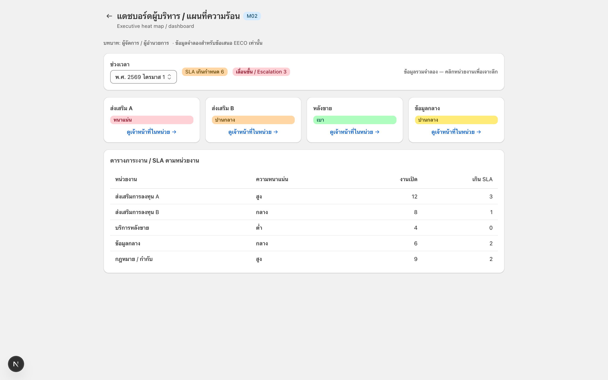

*M02: Heat Map และ Dashboard สำหรับผู้บริหาร*

อ้างอิง: TOR 5.5.5, 5.6, 2.2.

## 5.5 เข้าสู่ระบบด้วย SSO EECO และดู EEC OSS บน Case

เจ้าหน้าที่เข้าสู่ระบบผ่าน **SSO EECO** และกระบวนการบริการนักลงทุนดำเนินการผ่าน **EEC OSS** อยู่แล้ว CRM จึงเชื่อมต่อกับระบบทั้ง 2 แห่งแทนการสร้างคลังรหัสผ่านอีกชุดหรือให้เจ้าหน้าที่คีย์สถานะ OSS ซ้ำใน Excel

### พฤติกรรม SSO และ EEC OSS

| ความสามารถ | สิ่งที่เกิดขึ้น | พฤติกรรมการเชื่อมต่อ |
|---|---|---|
| เข้าสู่ระบบด้วย SSO EECO | Named User ยืนยันตัวตนผ่าน Identity Provider ของ สกพอ. และเริ่มเซสชัน CRM โดยไม่ต้องมีฐานรหัสผ่านอีกชุด | ระบบนำผู้ใช้ไปยัง IdP ของ EECO; เริ่มเซสชันเมื่อยืนยันตัวตนสำเร็จ; รองรับ Logout; ขยายจำนวน Named Users ตามไดเรกทอรีได้ |
| ซิงก์โปรไฟล์ | บันทึกข้อมูลโปรไฟล์ที่ตกลงจาก SSO ลงในบัญชีผู้ใช้ CRM | ยืนยันรายการข้อมูล เช่น ชื่อและหน่วยงานในขั้น BA; รีเฟรชเมื่อเข้าสู่ระบบ; ไม่ใช้ฟิลด์นอกชุดที่ตกลง |
| เปิด Case → แผง OSS | การเปิด Investment Case ดึงสถานะบริการ EEC OSS ปัจจุบันมาแสดงในพื้นที่ Journey | ดึงข้อมูลเมื่อเปิด Case หรือกดรีเฟรช; แสดงเวลาที่ซิงก์ล่าสุดและข้อผิดพลาด; เรียกเฉพาะ Endpoint ที่ระบุในเอกสาร API Interface |
| สถานะซิงก์ล่าสุด / ข้อผิดพลาด | เจ้าหน้าที่เห็นว่าข้อมูล OSS เป็นปัจจุบันหรือการเชื่อมต่อล้มเหลว | แสดงเวลาที่ซิงก์สำเร็จล่าสุด; แจ้งข้อผิดพลาดเมื่อ Endpoint ใช้งานไม่ได้; ลองใหม่ได้โดยไม่ออกจาก Case |
| รูปแบบ Open API | การเชื่อมต่อใช้ส่วนต่อประสานเปิด | REST เป็นค่าเริ่มต้น; SOAP เมื่อระบบ สกพอ. ยังต้องการ; เอกสาร API Interface เฟสที่ 1 ระบุ Endpoint วิธี Authentication ฟิลด์ข้อมูล และรูปแบบข้อผิดพลาด |
| แยกอะแดปเตอร์ | เมื่อ API ภายนอกเปลี่ยน บริษัทฯ ปรับเฉพาะ Adapter โดยไม่กระทบหน้าจอและกฎธุรกิจ | Adapter บน Node.js สำหรับ SSO และ OSS; ระบุขอบเขตและสิ่งที่อยู่นอกขอบเขตในเอกสาร API Interface; บันทึกความเสี่ยงและผลกระทบตาม TOR ข้อ 5.4 |

### การเข้าสู่ระบบและการดึงสถานะ

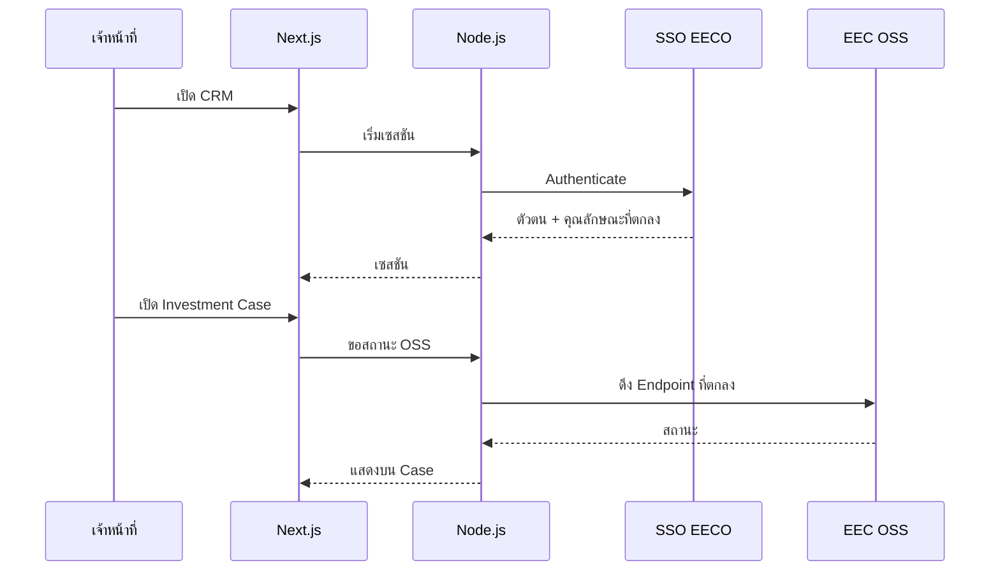

หลังยืนยันตัวตนผ่าน SSO EECO ระบบจะใช้ RBAC ตามข้อ 5.6 กำหนด Case และเอกสารที่ผู้ใช้เข้าถึงได้ เมื่อผู้ใช้เปิด Investment Case ระบบจะดึงสถานะ OSS ผ่าน Adapter ตาม Endpoint ที่ระบุในเอกสาร API Interface หากเชื่อมต่อไม่สำเร็จ ระบบจะแจ้งข้อผิดพลาดและเวลาที่ซิงก์ล่าสุด โดยไม่แสดงข้อมูลเดิมเสมือนเป็นข้อมูลปัจจุบัน

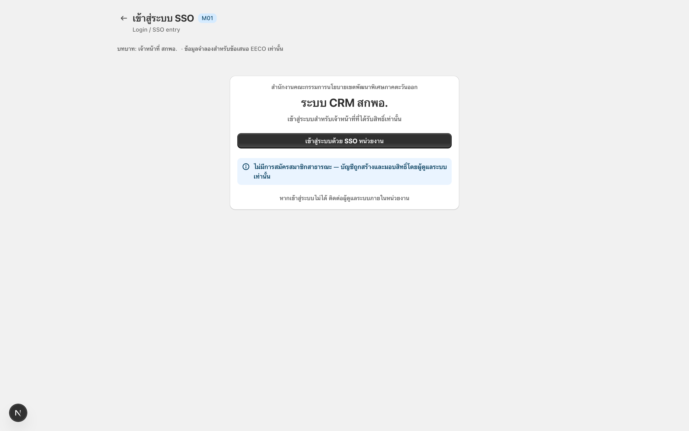

*M01: หน้าจอเข้าสู่ระบบผ่าน SSO EECO*

อ้างอิง: TOR 5.5.6, 5.7, 5.3.6, 5.4.

## 5.6 ควบคุมผู้เห็น LOI/NDA/งบการเงิน และเก็บ Audit Trail

บริษัทฯ จะควบคุมการเข้าถึง LOI, NDA และงบการเงินด้วย **บทบาท**และหลัก **Need-to-know** พร้อมประทับ **Dynamic Watermark** ที่ระบุผู้ใช้และเวลา และบันทึกการเปิดดู แก้ไข และดาวน์โหลดใน **Audit Trail**

### การควบคุมการเข้าถึง Watermark และ Audit

| ความสามารถ | สิ่งที่เกิดขึ้น | มาตรการควบคุม |
|---|---|---|
| สิทธิ์ตามบทบาท | Case เดียวกันแสดงโมดูลและฟิลด์ต่างกันตามบทบาทที่เข้าสู่ระบบ | ชุดเริ่มต้น Staff / Manager / Director; บทบาทเฉพาะ สกพอ. จาก BRD; อนุญาต/ปฏิเสธระดับโมดูลและการกระทำบังคับใน API บนทุกเส้นทางที่อ่อนไหว |
| Need-to-know บนเอกสารลับ | LOI NDA และงบการเงินจำกัดเฉพาะบทบาทอาวุโสและ/หรือเจ้าของโครงการ; Staff ไม่เปิดโดยค่าเริ่มต้น | ชั้นความลับบนแต่ละไฟล์; รายการปฏิเสธสำหรับ Staff โดยค่าเริ่มต้น; เส้นทางอนุญาตสำหรับเจ้าของโครงการและบทบาทอาวุโสที่ตั้งค่า |
| Dynamic Watermark | เมื่อเปิดดูหรือดาวน์โหลดเอกสารลับ ระบบทับตัวตนบัญชีและเวลา | ทับชื่อบัญชีและวันเวลา; ใช้กับตัวดูในแอปและเส้นทางดาวน์โหลด/PDF; คู่กับเหตุการณ์ Audit |
| Application Audit Trail | ระบบบันทึกว่าใครเปิดดู แก้ไข หรือดาวน์โหลดบันทึกหรือเอกสารใดเมื่อใด | เหตุการณ์เปิดดู แก้ไข ดาวน์โหลด; เก็บอย่างน้อย 180 วัน; Export เพื่อสอบสวน; ประวัติแบบต่อท้ายจากมุมมองแอป |
| การเข้าถึงที่ผูก Consent | ประวัติ Consent ตามข้อ 5.1 ใช้ประกอบการควบคุมการใช้ข้อมูลส่วนบุคคลที่อ่อนไหว | ตรวจวัตถุประสงค์และสถานะการถอนก่อนใช้; แจ้งผู้ใช้เมื่อไม่มี Consent หรือ Consent ถูกถอน |
| การคุ้มครองข้อมูลระหว่างส่งและจัดเก็บ | ข้อมูลสำคัญได้รับการเข้ารหัสทั้งระหว่างส่งและขณะจัดเก็บตามความสามารถของแพลตฟอร์ม | ใช้ TLS บน HTTPS; จัดเก็บความลับผ่านกลไกที่ สกพอ. อนุมัติ; ลดข้อมูลส่วนบุคคลในสำเนา Non-production ที่ใช้พัฒนาและ UAT |
| การพัฒนาตามแนวทาง OWASP | ใช้แนวทาง OWASP ตลอดการพัฒนาและทบทวนร่วมกับ สกพอ. ก่อน Go-Live | ตรวจสอบอินพุต; ใช้คิวรีแบบมีพารามิเตอร์; ตรวจสอบช่องโหว่และเวอร์ชันของ Dependencies; จัดการข้อผิดพลาดอย่างปลอดภัย; แก้ไขข้อค้นพบก่อนตรวจรับ |
| SSL ของ สกพอ. ใน Production | HTTPS Production ใช้ใบรับรองที่ สกพอ. จัดให้ตามที่กำหนดสำหรับ Go-Live | ใบรับรองผู้ว่าจ้างบนทางเข้าสาธารณะ (TOR 5.10.2); TLS บนเส้นทางเข้าถึงของเจ้าหน้าที่ |
| ข้อมูลสำหรับการเฝ้าระวังระบบ | แอปส่งออก Application Log และ Audit Log แบบมีโครงสร้างให้ สกพอ. จัดเก็บหรือส่งต่อไปยังเครื่องมือเฝ้าระวัง | ฟิลด์ Log สอดคล้องกับเหตุการณ์ Audit; ระบุแนวทางการจัดเก็บใน Runbook; ส่งออกข้อมูลเพื่อใช้เฝ้าระวังได้ |
| UAT ร่วม + Security Scan | ทดสอบมาตรการร่วมกับเจ้าหน้าที่ สกพอ. ผ่าน UAT และ Security Scan ก่อนตรวจรับ | สถานการณ์ทดสอบครอบคลุม RBAC, Watermark และ Audit Trail; ติดตามและแก้ไขผลการสแกนก่อนส่งมอบเฟสที่ 2 และ 3 |

### การเข้าถึงเอกสารลับ

เมื่อเจ้าหน้าที่เปิดพื้นที่ทำงานของ Case (ข้อ 5.3) API โหลดโมดูลที่**บทบาท**อนุญาต ผู้ใช้ Staff อาจเห็น Timeline และ Task แต่ไม่เห็นรายการไฟล์ LOI; Director หรือเจ้าของโครงการอาจเปิด PDF — ตัวดูใช้ **Dynamic Watermark** และเขียน **Audit event** กฎเดียวกันใช้กับการ Export และดาวน์โหลด การตั้งค่าบทบาทและชั้นความลับทำในพื้นที่ Admin ของผลิตภัณฑ์; ค่าเริ่มต้นตั้งใน BRD ร่วมกับ สกพอ.

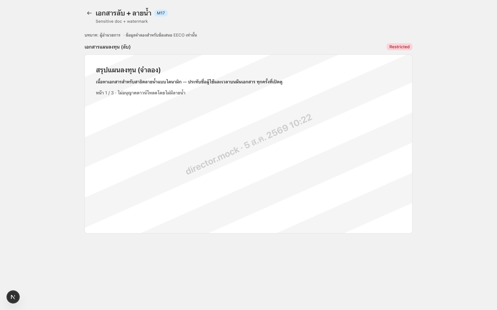

*M17: การเปิดเอกสารลับพร้อม Dynamic Watermark*

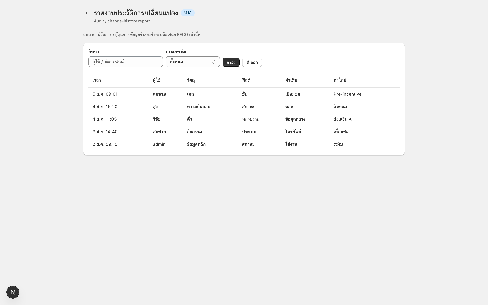

*M18: รายงาน Audit Trail และประวัติการเปลี่ยนแปลง*

อ้างอิง: TOR 5.8, 5.10.

## 5.7 นำประวัติ Excel เข้าสู่ฐานข้อมูลโครงสร้างเดียว

ก่อนเปิดใช้งานจริง บริษัทฯ จะโอนข้อมูลจากสเปรดชีตของแต่ละสำนักเข้าสู่ CRM ที่จัดโครงสร้างและตรวจสอบคุณภาพแล้ว โดยบุคคลหนึ่งรายเชื่อมโยงกับหลายบริษัทได้ การเตรียมโอนย้ายจะเสร็จก่อนตรวจรับเฟสที่ 2 และโหลดข้อมูลที่ผ่านการกระทบยอดเข้าสู่ Production ในเฟสที่ 3

### วิธีการโอนย้าย

| ขั้น | สิ่งที่บริษัทฯ ดำเนินการ | วิธีตรวจสอบและผลส่งมอบ |
|---|---|---|
| สำรวจ | สำรวจไฟล์ Excel และข้อมูลส่งออกของแต่ละสำนักร่วมกับผู้ดูแลข้อมูล | รายการแหล่งข้อมูลต่อสำนัก; Checksum; ผู้รับผิดชอบข้อมูล; เก็บข้อมูลแยกไว้จนเริ่มจัดทำ Mapping |
| Map | จับคู่แต่ละไฟล์กับโมเดล CRM เป้าหมาย | เอกสาร Mapping; รายงานคอลัมน์ที่ยังไม่จับคู่; ลงนามก่อนทำความสะอาดและโหลดข้อมูล |
| Cleanse | ปรับรูปแบบข้อมูลให้พร้อมตรวจซ้ำและจัดทำรายงาน | รูปแบบวันที่และ Tax ID; ตัดช่องว่างและแก้ Encoding; แยกรายการที่ไม่ผ่านพร้อมรายงานข้อผิดพลาด |
| Dedupe องค์กร | รวมข้อมูลโดยใช้ **Tax ID** เป็นหลัก แล้วตรวจชื่อนิติบุคคล | รายงานรายการที่อาจซ้ำ; บันทึกการตัดสินใจเก็บหรือรวมของผู้ดูแล; ไม่เขียนทับข้อมูลที่ขัดแย้งโดยไม่มีการแจ้งเตือน |
| Dedupe / ลิงก์บุคคล | เก็บข้อมูลบุคคลเพียงรายการเดียว และเชื่อมกับองค์กรแบบ 1:N | รายการที่อาจเป็นบุคคลเดียวกัน; ความสัมพันธ์ org–contact; ไม่สร้างข้อมูลบุคคลซ้ำข้ามบริษัท |
| กระทบยอดและโหลด | โหลดเข้าสู่ Production หลังผู้ดูแลลงนามรับรองผลกระทบยอด | กระทบยอดจำนวน; แผน Rollback; กำหนดช่วง Cutover ร่วมกับ สกพอ. |
| คงมาตรการควบคุม | Audit/RBAC/Watermark เดียวกับข้อมูลใหม่ | Access Log ≥180 วัน; เอกสาร Backup/DR; มาตรการข้อ 5.6 บนไฟล์ลับที่โอนย้าย |

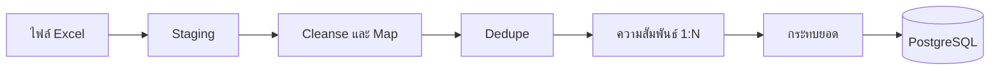

**การตรวจสอบ:** จำนวนองค์กร บุคคล และ Case ต้องตรงกับเอกสารกระทบยอดที่ลงนามก่อน Go-Live รายการที่ไม่ผ่านจะยังคงอยู่ในพื้นที่แยกพร้อมรายงานข้อผิดพลาดและไม่ถูกลบทิ้งโดยไม่มีการแจ้งเตือน

รายงาน**การเตรียม**โอนย้ายเป็นผลส่งมอบเฟสที่ 2 ส่วน**ฐานข้อมูลที่จัดโครงสร้างและปรับปรุงคุณภาพแล้ว**เป็นผลส่งมอบเฟสที่ 3 ตามข้อ 6

อ้างอิง: TOR 5.9.

# 6. แผนการส่งมอบและไทม์ไลน์แบบบูรณาการ

บริษัท ร็อคเก็ต อินโนเวชั่น จำกัด จะส่งมอบระบบบริหารจัดการความสัมพันธ์นักลงทุนและฐานข้อมูลกลางภายใน **210** วันปฏิทินนับจากวันลงนามในสัญญา โดยนับรวมวันหยุดราชการและวันหยุดนักขัตฤกษ์ ชุดส่งมอบหลักกำหนดไว้ที่**วัน 60** **วัน 180** และ**วัน 210** พร้อมไมล์สโตนย่อยและระยะเวลาสำรอง เพื่อไม่ให้ผล UAT หรือความพร้อมของสภาพแวดล้อมกระทบกำหนดส่งมอบดังกล่าว

Rocket มอบหมายทีมหลักตามตำแหน่ง TOR ข้อ 5.12 และเพิ่มผู้เชี่ยวชาญด้านวิศวกรรมผลิตภัณฑ์ การพัฒนาแอปพลิเคชัน ประสบการณ์ผู้ใช้ และการประสานงานส่งมอบ แบบฟอร์มภาคผนวก ข ที่ลงนามและหลักฐานวุฒิ/ประสบการณ์ส่งในชุดเอกสารบุคลากร

## ทีมส่งมอบ

| ตำแหน่งที่เสนอในโครงการ | บุคลากรที่มีชื่อ | ความรับผิดชอบหลัก |
|---|---|---|
| ผู้จัดการโครงการ | วราพงศ์ เตชะพานิชกุล | รับผิดชอบการส่งมอบโดยรวม ไมล์สโตน ทิศทางเทคนิค และการประสานงานกับ สกพอ. |
| นักวิเคราะห์ระบบ (Business Analyst) | เอกสิทธิ์ จตุพรวัฒนา | รับผิดชอบจัดทำ BRD นิยาม Workflow ติดตามข้อกำหนด และออกแบบแนวทางของระบบ |
| นักออกแบบระบบอาวุโส (Senior System Analyst) | ฐิตวันต์ หิรัณย์อุฬาร | ออกแบบ UI/UX Journey ของเจ้าหน้าที่ที่รองรับมือถือ ต้นแบบ และการปรับความใช้งานได้ |
| นักพัฒนาระบบอาวุโส | ธรรมรงค์ กีเกษมศรี | รับผิดชอบด้านเทคนิค การพัฒนาแกน CRM การทบทวนโค้ดและ API และคุณภาพการส่งมอบ |
| นักพัฒนาระบบ | รัชพล เฮงมงคลสกุล | พัฒนาฟีเจอร์ ทดสอบหน่วย แก้ข้อบกพร่อง ติดตั้ง และสนับสนุนการส่งมอบ |
| นักทดสอบระบบ | ณัฐณิชา จิตต์รัตนอรัญ | วางแผนและดำเนินการทดสอบ รายงานข้อบกพร่อง ทดสอบซ้ำ และหลักฐานคุณภาพ |
| นักทดสอบระบบอาวุโส | กฤษณะ ฐานวิเศษ | กลยุทธ์ทดสอบ การประกันคุณภาพ การกำกับทดสอบ และความพร้อมตรวจรับ |
| ผู้ประสานงานโครงการ | อัษฎาวุธ อนุกูล | โลจิสติกส์การประชุม บันทึก ติดตาม Action และการประสานการติดตั้ง |

## ผู้เชี่ยวชาญส่งมอบเพิ่มเติม

| ตำแหน่งผู้เชี่ยวชาญ | บุคลากรที่มีชื่อ | บทบาทสนับสนุน |
|---|---|---|
| Programme Coordinator | ปราการ พจน์เพียรเลิศ | กำกับโปรแกรมประจำวัน กำหนดการ ขอบเขต ความเสี่ยง การรายงาน และการประสานกับ สกพอ. |
| Support Business Analyst | ธีรกานต์ บริบูรณ์ทรัพย์ | เวิร์กช็อปผู้มีส่วนได้ส่วนเสีย ประสาน EECO และสนับสนุนเซสชันความต้องการ |
| ผู้ประสานงานโครงการ (ปฏิบัติการ) | วรินทร เอกจีน | สนับสนุนธุรการ สถานที่และโลจิสติกส์ และการติดตามภายใน |
| ผู้ช่วยผู้ประสานงานโครงการ | นิรภัฎ รักพงษ์ | โลจิสติกส์การประชุม บันทึก การติดตาม และการสนับสนุนการยื่นเอกสาร |

## 6.1 ข้อผูกพันการส่งมอบ

| ไมล์สโตน | ภายใน | สิ่งที่ Rocket ส่งมอบ |
|---|---|---|
| แผนรายละเอียดโครงการ | ≤ **15** วัน | กำหนดการโครงการและการจัดบุคลากรครบตามตำแหน่ง |
| BRD และการออกแบบ | ≤ **45** วัน | ความต้องการทางธุรกิจและ Workflow; การออกแบบระบบรวมสภาพแวดล้อม |
| ชุดเฟสที่ 1 | ≤ **60** วัน | สิ่งข้างต้น บวกการประเมินความเสี่ยงและผลกระทบต่อการทำงานกับระบบ EECO |
| ชุดเฟสที่ 2 | ≤ **180** วัน | ฟังก์ชันหลักที่ทำงานได้ (ข้อ 5.1–5.7); มาตรการความมั่นคง; รายงานเตรียมโอนย้าย; UAT ร่วม การทดสอบระบบ และ Security Scan |
| ชุดเฟสที่ 3 | ≤ **210** วัน | ฐานข้อมูลที่จัดโครงสร้างและปรับปรุงคุณภาพแล้ว; Go-Live บนคลาวด์ที่ สกพอ. จัดหา; สิทธิ์ขาดและซอร์สโค้ด; Train The Trainer สำหรับ Admin และ User พร้อมคู่มือ; เอกสาร Backup และ DR; เอกสาร Licensing ที่ครอบคลุมอย่างน้อย 3 ปีตามที่ใช้บังคับ |

นอกจาก Project Plan ตาม TOR ข้อ 7.1.1 ที่ส่งภายใน 15 วัน บริษัทฯ จะจัดทำแผนการทำงานตาม TOR ข้อ 20.1 ภายใน 45 วัน และแผนการใช้วัสดุภายในประเทศหากข้อกำหนดดังกล่าวใช้บังคับ

## 6.2 กำหนดการส่งมอบแบบบูรณาการ

บริษัทฯ วางแผนให้แต่ละสายงานเสร็จก่อนวันส่งมอบตามสัญญา และจัดระยะเวลาสำรองสำหรับการทบทวน ผล UAT และความพร้อมของโฮสต์ Production

| วันนับจากลงนาม | กิจกรรมของ Rocket | บัฟเฟอร์ / การพึ่งพา | ไมล์สโตนตามสัญญา |
|---|---|---|---|
| 1–12 | Kick-off; ร่างแผนละเอียด | ยื่นภายในวัน 12 | แผน ≤ **15** |
| 13–15 | บัฟเฟอร์แผนและยื่น | — | |
| 16–38 | ร่าง BRD Workflow การออกแบบ | ทำคู่ขนาน | |
| 39–45 | ตรึงชุดออกแบบ | — | BRD + ออกแบบ ≤ **45** |
| 46–55 | บันทึกความเสี่ยงและผลกระทบ; ยืนยันสภาพแวดล้อมกับ สกพอ. | — | |
| 56–60 | ประกอบและยื่นชุดเฟสที่ 1 | บัฟเฟอร์ความเห็น | เฟสที่ 1 ≤ **60** |
| 61–115 | ตั้งค่าแกนผลิตภัณฑ์; Journey SSO OSS Watermark เฉพาะ | — | |
| 116–150 | พัฒนาฟังก์ชันครบและพร้อมเข้า UAT; เตรียม Staging สำหรับการโอนย้ายเสร็จ | — | |
| 120–165 | ซ้อมเตรียมโอนย้าย; ทบทวนโดยผู้ดูแลข้อมูล | ดำเนินการคู่ขนานกับการพัฒนาระบบ | เตรียม → เฟสที่ 2 |
| 151–168 | UAT ร่วม ทดสอบระบบ Security Scan; แก้ Critical | เป้าจบประมาณวัน 168 | |
| 169–180 | **บัฟเฟอร์**; ยื่นชุดเฟสที่ 2 | คุ้มครองวัน 180 | เฟสที่ 2 ≤ **180** |
| 181–195 | โหลด Clean DB Production; ลงนามกระทบยอด | พึ่งความพร้อมโฮสต์ | |
| 196–205 | ติดตั้งบนคลาวด์ สกพอ.; Smoke test; Admin และ User TTT | — | |
| 206–210 | **บัฟเฟอร์**; Go-Live; ยื่นชุดเฟสที่ 3 | คุ้มครองวัน 210 | เฟสที่ 3 ≤ **210** |

หากโฮสต์คลาวด์ของ สกพอ. ยังไม่พร้อมประมาณวัน 181 บริษัทฯ จะตรวจสอบฐานข้อมูลที่ผ่านการทำความสะอาดในสภาพแวดล้อมควบคุม และติดตั้งทันทีเมื่อโฮสต์พร้อม โดยยังคงเป้าหมาย Go-Live ภายในวัน 210 ความล่าช้าของโฮสต์จะแจ้งไปยังผู้รับผิดชอบตามเส้นทางการสื่อสารในข้อ 7 ทันที

## 6.3 ความพร้อมตรวจรับ

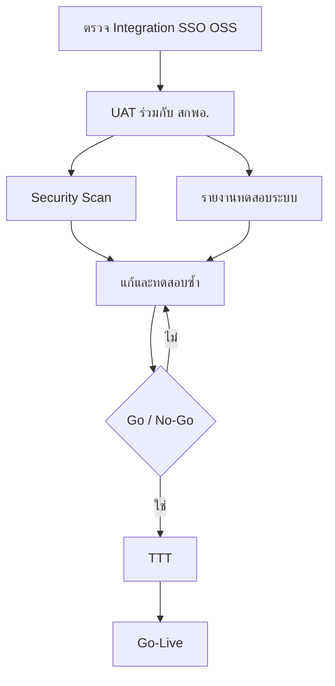

| สาย | งานของ Rocket |
|---|---|
| ตรวจ Integration | เส้นทางเข้าสู่ระบบ SSO EECO; การดึง EEC OSS ตาม Endpoint ใน BA; สถานะข้อผิดพลาดที่มองเห็น |
| UAT ร่วม | สถานการณ์เจ้าหน้าที่บน Journey Ticket Heat Map RBAC Watermark และ Audit |
| ทดสอบระบบ | Regression เชิงฟังก์ชันบนฟังก์ชันหลักในขอบเขต |
| Security Scan | สแกนช่องโหว่และแก้ไขข้อค้นพบก่อนส่งมอบชุดเฟสที่ 2 และ 3 |
| Go / No-Go | ไม่มี Critical ค้าง; UAT ลงนามแล้ว; สแกนยอมรับแล้ว; มีแผน Rollback |

ก่อน Go-Live บริษัทฯ จะยืนยันว่าการอบรมตามข้อ 6.5 เสร็จครบ ผลกระทบยอดข้อมูลสำหรับ Production ได้รับการลงนาม แผน Rollback ได้รับความเห็นชอบ ติดตั้ง SSL ของ สกพอ. ที่ทางเข้าสาธารณะ จัดทำเอกสาร Backup และ DR แล้ว และพร้อมส่งมอบ Application Log กับ Audit Log ตามข้อ 4.4

## 6.4 การโอนย้ายและ Cutover สู่ Production

การโอนย้ายข้อมูลจาก Excel ตามวิธีการใน**ข้อ 5.7** ดำเนินการตามกำหนดเวลาดังนี้

| เมื่อ | งานโอนย้ายของ Rocket | ชุดส่งมอบ |
|---|---|---|
| ประมาณวัน 120–165 | การเตรียมและซ้อม; การตัดสินใจของผู้ดูแลข้อมูล; รายงานเตรียม | เฟสที่ 2 |
| ประมาณวัน 181–195 | โหลด Clean DB Production หลังกระทบยอด | เฟสที่ 3 |

ข้อมูลต้นทางเป็นไฟล์ Excel ของสำนัก ดังนั้น Rocket ไม่เสนอ Cutover แบบ CDC สด

## 6.5 การอบรมและการส่งมอบ

| หลักสูตร | ปริมาณ | สถานที่ |
|---|---|---|
| Admin TTT | 1 ครั้ง ≥6 ชม. ผู้เข้าร่วม ≥8 คน | สกพอ. กรุงเทพฯ หรือ ม.บูรพา จ.ชลบุรี |
| User TTT | 2 ครั้ง ≥6 ชม. รวมผู้เข้าร่วม ≥30 คน | เช่นเดียวกัน |
| คู่มือ | Admin + User | อนุมัติพร้อมแผนอบรมก่อนจัดอบรม |

อาหารเป็นไปตามอัตรา TOR การอบรมวางไว้ช่วงวัน 196–205 เพื่อให้หลักสูตรและคู่มือจบภายในชุดเฟสที่ 3

ในการส่งมอบครั้งสุดท้าย บริษัทฯ จะส่งมอบสิทธิ์ขาดและซอร์สโค้ด โดยทรัพย์สินทางปัญญาเป็นไปตาม TOR ข้อ 17 พร้อมเอกสารสิทธิ์ใช้งานของคลาวด์และซอฟต์แวร์ที่ครอบคลุมอย่างน้อย 3 ปี และไม่มีค่าใช้จ่ายรายปีเพิ่มเติมจาก สกพอ. ในช่วง 3 ปีแรกตาม TOR ข้อ 7.3.6

## 6.6 ความเสี่ยง Cutover

| ความเสี่ยง | ผลกระทบ | การบรรเทา |
|---|---|---|
| ผล UAT มาช้า | ปานกลาง | บัฟเฟอร์วัน 169–180; สายแก้คู่ขนาน |
| โฮสต์ สกพอ. ล่าช้า | สูง | ส่งคุณสมบัติโครงสร้างพื้นฐานขั้นต่ำตั้งแต่ต้นโครงการ; แจ้งผู้รับผิดชอบตามข้อ 7; ติดตั้งทันทีเมื่อพร้อมโดยยังคงเป้าหมายวัน 210 |
| คุณภาพ Excel ต่ำกว่าคาด | ปานกลาง | กักกันใน Staging; การตัดสินใจของผู้ดูแล; แถวไม่สะอาดไม่ถูกโหลด |
| Endpoint SSO หรือ OSS เปลี่ยน | ปานกลาง | แยกอะแดปเตอร์ (ข้อ 5.5); วันที่ตรึง BA |

อ้างอิง: TOR 5.1, 5.11, 5.12, 6–8 และ 17; รายละเอียดการรับประกันอยู่ในข้อเสนอฯ ข้อ 7 และ TOR ข้อ 14

# 7. การปฏิบัติการและการสนับสนุน

ตลอดระยะเวลารับประกัน 1 ปี Named Users ของ สกพอ. สามารถแจ้งคำถามหรือข้อบกพร่องทางโทรศัพท์ อีเมล หรือช่องทางแอปพลิเคชันได้ตลอด 24 ชั่วโมง บริษัทฯ จะตอบรับภายใน 30 นาที แยกคำขอวิธีใช้งานออกจากเหตุขัดข้องทางเทคนิค และแก้ไขตามกรอบเวลาที่สัญญากำหนด สกพอ. หรือ MSP ของหน่วยงานรับผิดชอบโฮสต์ Production ส่วนบริษัทฯ รับผิดชอบการวินิจฉัยและแก้ข้อบกพร่องของแอปพลิเคชัน

## 7.1 กรอบการรับประกัน

บริษัทฯ รับแจ้งเหตุได้ตลอด 24 ชั่วโมง ตอบรับภายใน 30 นาที และแก้ไขเหตุแต่ละระดับภายใน 4 ชั่วโมง 24 ชั่วโมง 48 ชั่วโมง หรือ 7 วันทำการตามเงื่อนไขใน TOR ข้อ 14

| การปฏิบัติของบริษัทฯ | การตอบสนอง |
|---|---|
| ปีรับประกันหลังตรวจรับเฟสที่ 3 สุดท้าย | บำรุงรักษาแอปพลิเคชันและแก้ข้อบกพร่องเป็นเวลา **1 ปี** นับจากคณะกรรมการตรวจรับชุดส่งมอบสุดท้าย |
| รับแจ้ง 24×7; ตอบรับ ≤30 นาที | Named Users แจ้งทางโทรศัพท์ อีเมล หรือช่องทางแอป; Rocket ตอบรับภายใน **30 นาที** |
| Critical — ฟังก์ชันหลักใช้ไม่ได้ (≤4 ชั่วโมง) | เริ่มนับเวลาเมื่อได้รับแจ้งและแก้ไขภายใน **4 ชั่วโมง** |
| ข้อบกพร่องที่ไม่ใช่หน้าที่หลัก (≤24 ชั่วโมง) | แก้ไขภายใน **24 ชั่วโมง** |
| ไม่ใช่หน้าที่หลักและไม่มีผลกระทบต่อบริการ (≤48 ชั่วโมง) | แก้ไขภายใน **48 ชั่วโมง** |
| มี Workaround แล้ว (≤7 วันทำการ) | แก้ถาวร ≤ **7 วันทำการ** นับจากได้รับแจ้ง |
| ความผิดพลาดฮาร์ดแวร์โฮสต์ (ไม่ใช่แอป) — TOR 14.2.4 | สอบสวนและ**รายงาน**ให้ สกพอ.; ไม่ถือเป็นข้อบกพร่องแอป |
| ความผิดพลาดจากระบบภายนอก — TOR 14.2.5 | สอบสวนและ**รายงาน**; ไม่ถือเป็นข้อบกพร่องแอป |
| ความล่าช้าจากเหตุสุดวิสัย — TOR 14.2.6 | รายงานความคืบหน้ารายวันจนกว่าจะแก้เสร็จ |

## 7.2 การสนับสนุนเจ้าหน้าที่

Named Users ของ สกพอ. ใช้ช่องทางรับแจ้งเดียวกันสำหรับคำขอประเภทต่อไปนี้

| ประเภทคำขอ | การจัดการ |
|---|---|
| วิธีใช้ / การนำทาง | ให้คำแนะนำหรืออ้างอิงคู่มือ และส่งต่อผู้เชี่ยวชาญเมื่อจำเป็น |
| คำถามสิทธิ์ / บทบาท | ตรวจกับการตั้งค่า RBAC; ส่งต่อไป Admin ของ สกพอ. หากเป็นการเปลี่ยนนโยบาย |
| สงสัยว่าเป็นข้อบกพร่อง | เปิด Ticket เทคนิค → ข้อ 7.3 |
| ขอแก้ข้อมูล | ตรวจตัวตนและอำนาจ → อนุมัติหากจำเป็น → ดำเนินการ → Audit Log |

## 7.3 การตอบสนองเหตุการณ์และการส่งต่อ

บริษัทฯ จัดประเภทข้อบกพร่องของแอปพลิเคชันตามข้อผูกพันในข้อ 7.1 เริ่มนับเวลาแก้ไขเมื่อได้รับแจ้ง และส่งต่อไปยังผู้เชี่ยวชาญตามระดับความซับซ้อนของปัญหา

| ขั้น | เป้าหมาย |
|---|---|
| Intake / L1 | ตอบรับ; จัดระดับความรุนแรง; จำลองปัญหา |
| L2 สนับสนุนแอป | วินิจฉัย; แพตช์หรือแก้การตั้งค่า |
| L3 วิศวกรรม | แก้โค้ด; รีลีสฉุกเฉินหาก Critical |
| Infra / คลาวด์ | หากเป็นโฮสต์หรือเครือข่าย — **MSP ของ สกพอ.** พร้อมรายงานหลักฐานจาก Rocket |

สำหรับเหตุโฮสต์หรือเครือข่าย Rocket ส่งหลักฐานแอปให้ สกพอ. หรือ MSP คลาวด์ และวินิจฉัยแอปคู่ขนานต่อไป

| ช่วง | การกระทำ |
|---|---|
| ก่อน | ส่งมอบข้อมูลสำหรับการเฝ้าระวังจาก Application Log และ Audit Log; ควบคุมการเปลี่ยนแปลง; กำหนดช่องทาง On-call ตลอดปีรับประกัน |
| ระหว่าง | ติดตามเวลาตอบสนองตามระดับความรุนแรง; สื่อสารกับผู้ใช้; จำกัดผลกระทบ; หลีกเลี่ยงการเปลี่ยนแปลงที่ยังไม่ผ่านการทบทวน |
| หลัง | บันทึกสาเหตุรากสำหรับเหตุสำคัญ; อัปเดต Runbook; ปิด Ticket |

## 7.4 การจัดการคำขอเปลี่ยนแปลง (ช่วงรับประกัน)

| ขั้น | สิ่งที่เกิดขึ้น |
|---|---|
| คำขอ | บันทึกผ่านช่องทางรับแจ้งหรือผู้ประสานโครงการของ สกพอ. |
| ขอบเขต | ประเมินผลกระทบต่อ Journey การเชื่อมต่อ และข้อมูล พร้อมประมาณระยะเวลาและทรัพยากร |
| ผลกระทบ | ต่ำ / กลาง / สูง |
| อำนาจ | ต่ำ: ผู้จัดการโครงการพร้อมบันทึก; กลาง/สูง: ทบทวนร่วมกับ สกพอ. ก่อนเปลี่ยน Production |
| รีลีส | ทดสอบใน Non-prod; การอนุมัติแบบ CAB สำหรับกลาง/สูง; แผน Rollback |

การเปลี่ยนแปลงสัญญาหรืองานเพิ่มเติมนอกขอบเขตจะดำเนินการตามเงื่อนไขของสัญญา โดยผ่านการประเมินทางเทคนิค การอนุมัติ การทดสอบ และการนำขึ้นใช้งานในช่วงรับประกัน

## 7.5 เมทริกซ์การสื่อสาร

| เหตุการณ์ | สิ่งที่ส่ง | ช่องทาง | ความถี่ | เจ้าของ | ผู้รับ |
|---|---|---|---|---|---|
| สถานะ (ส่งมอบ) | สถานะรายสัปดาห์ | อีเมล + ประชุม | รายสัปดาห์จน Go-Live | ผู้จัดการโครงการ | ผู้สนับสนุนของ สกพอ. |
| เหตุการณ์ (P-critical) | แจ้งเหตุ | โทรศัพท์ + อีเมล | โดยเร็วที่สุด | หัวหน้าสนับสนุน | Product owner / หน่วยที่ได้รับผลกระทบ |
| การเปลี่ยนแปลง (กลาง/สูง) | สรุปการเปลี่ยนแปลง | อีเมล | ก่อน Deploy | ผู้จัดการโครงการ | IT + ธุรกิจของ สกพอ. |
| รายเดือนในช่วงรับประกัน | บันทึกบริการสั้น | อีเมล | รายเดือนในปีรับประกัน | หัวหน้าสนับสนุน | ผู้ประสานของ สกพอ. |

อ้างอิง: TOR 14; ความรับผิดชอบด้านการปฏิบัติการระบุร่วมกับข้อ 4.4 และข้อ 6

# 8. การทดสอบเชิงปฏิบัติการ (Proof of Concept)

บริษัท ร็อคเก็ต อินโนเวชั่น จำกัด จะสาธิต Proof of Concept แบบสดตามภาคผนวก ก ตามกำหนดการที่คณะกรรมการกำหนด

การสาธิตทำงานใน**สภาพแวดล้อมที่ Rocket บริหาร** แยกจาก Production โดยใช้ข้อมูลตัวแทนที่ไม่มีข้อมูลส่วนบุคคลจริงของนักลงทุน Rocket จะสาธิต:

- สร้าง / จับคู่นักลงทุนและองค์กร
- บันทึก Activity พร้อมไฟล์แนบจากอุปกรณ์ระดับแท็บเล็ต
- เลื่อน Investment Case ผ่าน Stage Pre-incentive พร้อมประวัติ
- เปิด Ticket แสดง SLA และเส้นทางการส่งต่อ
- รูปแบบเข้าสู่ระบบที่สอดคล้อง SSO EECO (อะแดปเตอร์สาธิตหาก SSO Production ไม่พร้อมในห้อง)
- Watermark และ Audit บนตัวอย่างเอกสารลับ
- ตัวกรอง Heat Map / Dashboard

แต่ละสถานการณ์จบด้วยผลลัพธ์ของระบบที่มองเห็นได้ — ประวัติที่บันทึก Stage ที่อัปเดต สถานะ SLA การตัดสินใจสิทธิ์ หรือการเปลี่ยน Dashboard — เพื่อให้คณะกรรมการตรวจพฤติกรรมระหว่างเซสชันได้

อ้างอิง: ภาคผนวก ก ข้อ 3

# 9. ส่วนเสริมที่แนะนำ (เกินขั้นต่ำ TOR) — สรุป

บริษัท ร็อคเก็ต อินโนเวชั่น จำกัด เสนอส่วนเสริมเกินข้อกำหนดขั้นต่ำของ TOR เพื่อลดขั้นตอนแก้ไขข้อมูลด้วยตนเอง รักษาบันทึกงานภาคสนามเมื่อการเชื่อมต่อไม่พร้อม และให้ผู้บังคับบัญชากำหนด Journey และเส้นทางการส่งต่อได้ชัดเจนขึ้น

| ส่วนเสริม | ประโยชน์ต่อ สกพอ. | อธิบายใน |
|---|---|---|
| หน้าจอรวมข้อมูลซ้ำแบบมีผู้ใช้ตรวจสอบ | เจ้าหน้าที่เปรียบเทียบ Tax ID และชื่อนิติบุคคล แล้วเลือกค่าที่ต้องการเก็บในแต่ละฟิลด์ก่อนรวม | ข้อ 5.1 |
| คิวบันทึกงานภาคสนามเมื่อออฟไลน์ | Activity และไฟล์แนบจากการลงพื้นที่ซิงก์เมื่อการเชื่อมต่อกลับมา | ข้อ 5.2 |
| หน้าจอกำหนดเส้นทางการส่งต่อรายสำนัก | กำหนดและปรับปรุงเส้นทางการส่งต่อของแต่ละสำนักในระบบ | ข้อ 5.2 |
| คลังเทมเพลต Journey (FDI / ในประเทศ / Aftercare) | ชุด Stage เริ่มต้นที่อนุมัติแทน Pipeline ว่าง | ข้อ 5.3 |
| สรุปผู้บริหารตามรอบเวลา | สรุป Heat Map และความค้างเป็นระยะโดยไม่ต้องเปิด Dashboard ทุกครั้ง | ข้อ 5.4 |

หาก สกพอ. รับรายการเหล่านี้ บริษัทฯ จะยืนยันรายละเอียดใน BRD เฟสที่ 1 และบรรจุไว้ในแผนโครงการ โดยไม่กระทบหรือทดแทนรายการส่งมอบภาคบังคับตาม TOR ข้อ 5–8
