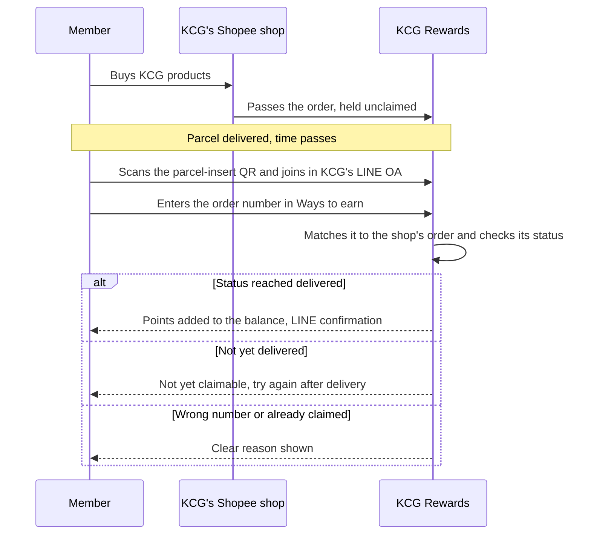
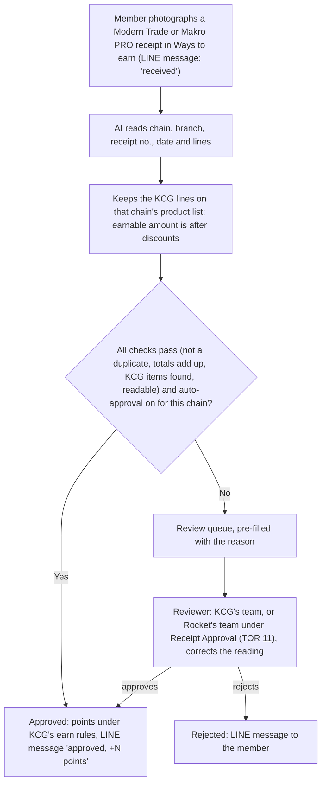

## 03 · Transaction Capturing: earn on every channel (Earn)

Every purchase on any of KCG's ten channels lands in one purchase history on the member, so the same points, tier and campaign rules apply wherever they bought (TOR 1.8, 1-P2). A Shopee order, a Lotus's receipt, a booth sale and a Brand.com order become the same kind of record. Channels differ only in how the purchase reaches KCG Rewards and how it is tied to the member.

### Four kinds of channel, one purchase history

KCG's channels sit on two axes: online or offline, and whether someone else makes the sale (third-party) or KCG does (first-party). Between them, the four quadrants cover every channel in TOR 7.

| | Third-party (someone else sells) | First-party (KCG sells) |
|---|---|---|
| **Online** | Shopee ×2, Lazada ×2, TikTok Shop ×2 (TOR 7.5–7.7) · Makro PRO (receipt upload) (TOR 7.9) | Brand.com (TOR 7.4) · Shopify (TOR 7.10) · LINE Official Account (TOR 7.8) |
| **Offline** | Modern Trade (TOR 7.2) | Flagship Store (TOR 7.1) · Event booths (TOR 7.3) |

The quadrants play different roles. On third-party channels the member does one small thing (claims an order, photographs a receipt), and that is the moment an anonymous buyer tells the brand who they are. On first-party channels points arrive with no effort, and KCG can pay a better earn rate there, so each reward nudges the next purchase toward a channel KCG owns.

One rule holds on every channel: a purchase earns only when it names the member, and the key is the mobile number captured at sign-up (§02). KCG's tills and booths ask for it, the online store matches the order by phone or email, and on marketplaces and at retailers, where the brand never sees the buyer, the member makes the link by claiming the order or uploading the receipt while signed in to KCG Rewards in LINE.

### Shopee, Lazada and TikTok Shop: six shops (TOR 7.5–7.7)

Marketplace buyers earn by typing their order number in KCG Rewards, which gives KCG what a marketplace never shares: who bought. KCG Rewards already holds every order from the connected shops, so there is no receipt to upload and nobody to review it.

[asset:screenshot;id=02ff3593-ec44-4618-b156-878450ad9243;title=Marketplace earn: members claim points with their order number]

A typical first claim: a parcel from a KCG Shopee shop carries an insert, "Collect KCG Rewards points on this order". The buyer scans it, joins in KCG's LINE OA, opens **Ways to earn**, picks Shopee and enters the order number. Once the order has reached the status KCG chose, the points land in their balance. If it hasn't, or the number is wrong or already claimed, they see why.



- **Six shops, six one-time connections.** KCG's team logs in to each shop once from the admin portal, and after that there is no work per order. One brand on Rocket runs 56 shops this way today (29 Shopee, 16 Lazada, 11 TikTok Shop).
- **KCG chooses when a claim succeeds**, per platform. We recommend *delivered*: points arrive while the purchase is fresh, and a refunded order's points can still be reversed. Waiting for *completed* (after the return window) blocks buy-spend-return abuse but makes every honest buyer wait; we would rather spot and freeze the few who abuse it.
- **Points go to buyers who claim**, so the points budget goes to the customers who chose a relationship with the brand.
- **Support lookup.** When a member says a claim failed, a KCG admin looks up the order number and sees its status, amount, items and whether it has been claimed.
- **A clean start.** Orders placed shortly before go-live can be loaded so early buyers can claim them too.

### Modern Trade and Makro PRO: receipt upload (TOR 7.2, 7.9)

Retail buyers earn by photographing their receipt in LINE, because the receipt is the only record that links a supermarket or Makro PRO purchase to a person. Makro PRO earns the same way from its receipt or tax invoice, set up as its own sales channel with its own KCG product list so its receipts stay separate from Modern Trade.

[asset:screenshot;id=fb794928-6640-46a4-9932-f2c6d1ace98d;title=Receipt upload: AI reads the receipt and keeps only KCG products]

AI reads every receipt: the chain and branch, receipt number, date and each line. It keeps only the lines on KCG's product list for that chain and ignores the rest of the basket. The earnable amount is the value of those KCG lines after their discounts, and points follow the normal earn rules (§04). Product-based rules and missions, such as bonus points on a new SKU, work on receipts too.

**Manual approval is the default.** Every receipt lands in the review queue already read: chain, branch, receipt number, total and the matched KCG lines are filled in, with the reason it needs a look. The reviewer checks the photo, corrects anything, and approves or rejects. The member hears on LINE when the receipt is received, approved or rejected. If KCG would rather not staff the queue, Rocket's Receipt Approval service can work it instead (TOR 11, §14).

**Auto approval is optional.** Once it is switched on, a clean receipt is approved on the spot and the member sees "approved, +N points". A receipt auto-approves only when every switch is on and it fails no check; anything doubtful goes to the same review queue with its reason, so the KCG team never works in a second tool. KCG controls:

```rocket-graphic
{
  "kind": "kv_table",
  "rows": [
    { "label": "1 · Master switch", "value": "Whether any receipt may auto-approve. Off means every receipt goes to review, still pre-filled by AI." },
    { "label": "2 · Reading policy per retailer group", "value": "One policy per group of chains (for example KCG's own shops, and Modern Trade with Makro PRO), each with its own auto-approve switch." },
    { "label": "3 · Minimum confidence", "value": "How sure the AI must be about each line and field before it may approve alone (default 70%)." },
    { "label": "4 · Receipt total must add up", "value": "Strict: line amounts must match the printed total. Skip: don't check." },
    { "label": "5 · Bill discounts", "value": "Spread across lines in proportion, or ignored when working out the earnable amount." },
    { "label": "6 · Duplicate check", "value": "A receipt number can earn only once per chain." },
    { "label": "7 · Product list per retailer", "value": "The KCG product names as each chain prints them, linked to KCG's SKUs. Only listed lines earn." },
    { "label": "8 · Reading hints per retailer", "value": "Short notes on each chain's layout, such as which figure is the net amount or that dates print in the Buddhist year." }
  ]
}
```

We recommend starting every chain on manual approval, comparing the AI's readings with what reviewers would have keyed in, and switching auto approval on group by group once the policies hold up. The queue can be filtered by who approved each receipt (system or admin), so the team can keep auditing auto approvals after launch.



The purchase date is the date printed on the receipt, so campaign windows are judged by when the member bought, not when the receipt was reviewed. A daily upload limit per member caps misuse. If KCG later wants a route that doesn't depend on the receipt, codes printed inside packs can be scanned to earn; we recommend launching on receipts, which need no packaging change.

### Flagship Store and event booths: POS (TOR 7.1, 7.3)

At KCG's own tills and booths the member earns by giving their phone number, and does nothing in the app. Every route below lands in the same member balance.

[asset:screenshot;id=e7e10bfb-94c6-43f2-ad8b-6fac994db93e;title=In-store purchases earn from any POS]

- **Front Line, from day one.** Staff open Front Line on a phone or tablet, pick the store or booth, find the member by phone number or by scanning their QR, and record the bill (receipt number, amount, optionally items). KCG Rewards calculates the points. It needs no POS change, which makes it the default for pop-up booths.
- **POS integration, when KCG's POS is ready.** The POS sends each paid bill with the member's phone number the moment it closes, and points follow with no staff step. Where the POS can't send bills itself, collecting them from it is a separate integration scoped with the POS vendor.
- **Sales file.** A POS that only exports reports can hand over its sales file, and our team imports it so points go out from that. The import is included in the licence.

We recommend opening the Flagship Store on Front Line and moving to the POS link once the POS vendor has added the member's phone number to each sale; we agree the route with the vendor during onboarding.

Events are also where the brand meets people who aren't members yet. A walk-in scans the booth QR to join in LINE, or staff register them in Front Line on the spot and push a welcome reward immediately. Every Front Line transaction is recorded against its store or booth, so the team can see what each event produced in new members and sales, and each staff member's role sets what they can see and do.

### Brand.com and Shopify: KCG's own online store (TOR 7.4, 7.10)

KCG's own store is where the programme pays back most: every order earns automatically with no claim, the brand keeps the full margin, and it can be made the best place to earn. The slide below shows the pattern: marketplace orders earn at the base rate, the brand's own store earns 25% more, and both land in one balance.

[asset:screenshot;id=920b242a-9e71-41e2-853f-3e361c1a4a75;title=Brand.com and Shopify: the brand's own store earns more, into one balance]

The Brand.com site sends each order to KCG Rewards through our Open API, included in the licence, as it completes; it is matched to the member by phone number or email and earns under KCG's rules. Refunds and cancellations reverse the points. Rates differ by channel because every channel, chain and shop is grouped once (for example "Marketplaces", "Modern Trade", "Own channels") and earn rules target a group; a new shop added to a group picks up its rate automatically (§04).

On Shopify, paid orders earn automatically, and Rocket's plugin, Thailand's only Shopify-native loyalty plugin, also lets members see and spend their points inside the store, on the balance they built on Shopee and at Modern Trade, and gives each tier its automatic checkout benefits, such as free shipping and 5% off for Gold. Section 12 compares it with order sync.

[asset:screenshot;id=01a64ba5-4336-43a4-9ec4-2c764c73aa41;title=Thailand's only Shopify-native loyalty plugin]

### LINE Official Account (TOR 7.8)

KCG's LINE OA is where members join, check their balance, find every way to earn and redeem (§02). Because every member there is already identified, an order taken through LINE earns like any first-party purchase, with no claim step: staff record it against the member in Front Line, or KCG's LINE order tool sends it in, matched by phone number.

### Every way to earn in one place

Members find every channel on one sheet, **Ways to earn**, with a tab per channel. It opens over whatever page they are on, so a "collect points" button can sit on the home page, a campaign banner or a LINE message. Marketplace claim and receipt upload open their form inside the tab; channels where points arrive on their own get an information card, such as "Buy at our Flagship Store or event booths: tell staff your phone number". The KCG team edits each tab's banners, participating stores and how-to steps, and hides any tab the brand doesn't use.

[asset:screenshot;id=9f2eae77-4a1f-4d96-aef4-cf67ed5c0b96;title=KCG's LINE OA home: every way to earn one tap away]

A member who comes to claim a Shopee order sees on the same sheet that the brand's own store earns more, and that is where the shift to KCG's own channels starts.

### Connections and volume (TOR 7, 3.3)

The marketplace shop connections, receipt upload, Front Line, a POS that sends its bills, the POS sales-file import by our team, and the Brand.com and Shopify connections are all included in the KCG Rewards licence. Collecting bills from a POS that can't send them is scoped with the POS vendor as a separate integration. Order processing is designed for 10,000 orders an hour and scales out beyond that. KCG's 100,000+ orders a month average around 140 an hour, so even an 11.11 peak many times a normal day stays well inside it (TOR 3.3). Connection methods are set out in the technical proposal.
