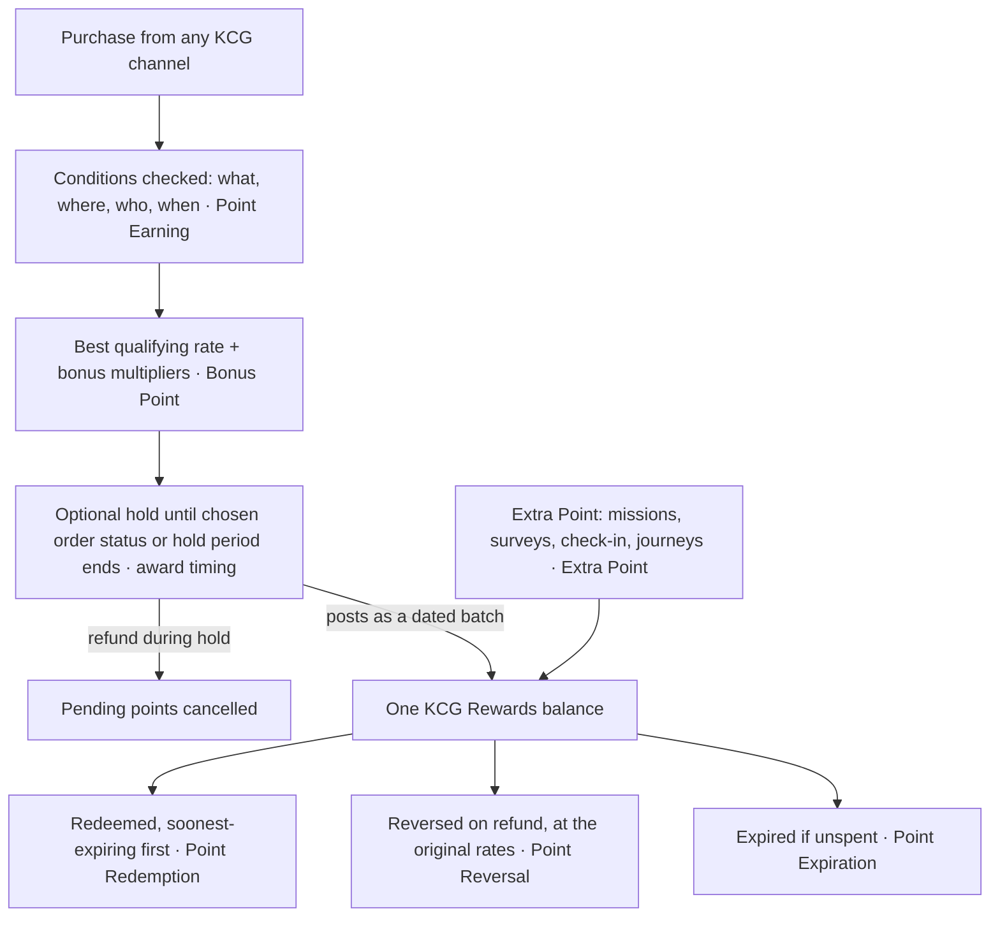

## 04 · Earn Logic: KCG Rewards Points

Earn logic decides what every purchase and every action is worth to a member, and KCG's team sets it: the rate, which products and channels earn more, which members get a bonus, and when points post and expire. The team changes any of it in the admin portal when the business changes, with no development (TOR 4.2, 4.2-P3). Section 03 brings each purchase in from every KCG channel; this section values it; Section 05 is where members spend it.

### Currency: points, and optional tickets (TOR 4.2-P1, 4.2-P2)

KCG Rewards runs on one point currency, carrying the programme's brand in LINE, in Thai and English. Points are **fungible**: every point is the same, whether it came from the flagship store, a Shopee order or a mission, and it sits in one balance that can be spent on any reward.

**Tickets** are **non-fungible**: each ticket type is its own balance with one purpose, such as entries for a lucky draw or tokens for a spin wheel. They power campaigns without touching points, so a draw never dilutes the balance or adds to KCG's points liability. The TOR doesn't require tickets, so they are optional: a ticket type is switched on when a campaign needs one (Sections 05 and 07).

| | Points | Tickets (optional) |
|---|---|---|
| Balance | One balance for the whole programme | One balance per ticket type |
| Earned from | Purchases on any channel, campaigns, adjustments | The same earn rules and campaigns, per ticket type |
| Used for | Any reward in the catalogue | The campaign the ticket type belongs to (e.g. a lucky draw) |
| Expiry | One programme policy (below) | Set per ticket type, including a fixed end date for an event |

### Point Earning: conditions, then rates (TOR 4.2.a)

An earn rule is a set of conditions plus what the member gets when a purchase meets them. A flat programme is one rule with no conditions; "×2 on the new product, at the flagship store, for Gold members, on weekdays" is the same rule with conditions filled in. Conditions come in four groups, combined freely:

- **What was bought**: category, brand, product or SKU. Include a product line, exclude low-margin or promotional items, or require a minimum (at least 300 THB on the line).
- **Where**: a store or a store group. Stores and channels are classified once at setup (Section 03), so a rule says "own channels" or "marketplaces" without listing outlets.
- **Who**: tier, persona (a member type KCG defines, such as KCG employees), birth month.
- **When**: start and end date, days of the week, hours of the day.

The member gets a **rate** (spend per point), a **multiplier** on that rate, or a **fixed amount**. When several rates qualify, the member gets the best one; nobody decides which rule wins. Product conditions work on every channel that reports what was bought (POS, marketplace orders, receipts read line by line), with KCG's product list mapped across channels at implementation.

**Basic Earn** covers most programmes on one page: the base rate or one rate per tier, which order statuses earn (a marketplace order only once delivered, a flagship sale once paid), excluded products, and bonus multipliers.

[asset:screenshot;id=5bfe8e90-e1aa-469f-bb6c-c2bfdabb040a;title=Basic Earn — base rate, rate per tier, earning order statuses and bonus multipliers]

**Earn Studio** is the full editor: rates and multipliers grouped into programmes, each linked to its conditions, so a new promotion is a new row rather than a new build.

[asset:screenshot;id=93613659-d0a0-435c-a618-f7f376d910e2;title=Earn Studio — rates and multipliers linked to the conditions that trigger them]

**The rate is KCG's to set** (TOR 4.2-P3): for example 25 THB = 1 point, changed at any time. A change applies to purchases from that moment; points already earned keep their value, and a later refund reverses at the rate that applied when they were earned.

### Bonus Point: public and personalised multipliers (TOR 4.2.d)

We read **Bonus Point** as extra points on a purchase, and **Extra Point** as points for something other than a purchase, consistent with "Extra Points from Mission" (TOR 6.2).

A bonus is a multiplier on the points a purchase earns at its rate: ×2 on a new SKU for its launch month, ×3 on weekdays, ×2 at the event booth during a fair, a higher multiplier for each tier (Section 06). Bonuses come in two kinds:

- **Public**: every member whose purchase meets the conditions gets it.
- **Personalised earn factor**: a rate or multiplier attached to chosen members, with its own validity window. Members who haven't bought in 60 days get ×2 on purchases in the next 14 days; once the window closes, the offer stops and public rules carry on. Automation journeys (Section 10) and the AI decisioning agent (Section 11) assign these to the members they pick, so the bonus goes where it changes behaviour instead of to everyone.

Public and personalised factors are evaluated together: the best rate wins, and KCG chooses whether qualifying multipliers stack or only the highest applies.

### Extra Point (TOR 4.2.e)

Extra points are a fixed amount for an action: a mission, survey, check-in or referral (Section 07), a welcome or birthday step in a journey (Section 10), or an offer from the AI agent (Section 11). Each campaign sets its own amount without touching the purchase rules. Bonus and extra points share one balance and one expiry, labelled by source in the member's history.

### Worked example: one basket, two channels

Illustrative settings, with the 25% own-channel uplift from Section 03: 25 THB = 1 point on marketplaces, Makro PRO and Modern Trade; 20 THB = 1 point on the flagship store, event booths, Brand.com and Shopify; ×2 on a new product for its launch month. A member buys a 500 THB basket with 200 THB of the new product:

| | Flagship store | Shopee |
|---|---|---|
| Best qualifying rate | 20 THB = 1 point | 25 THB = 1 point |
| Base points on 500 THB | 25 | 20 |
| ×2 on 200 THB of the new product | +10 | +8 |
| **Points earned** | **35** | **28** |

The same basket earns 25% more on KCG's own store, the Shopee buyer is still rewarded for claiming the order, and the new product gets its push on every channel at once.

### When points post

Points post moments after a purchase is recorded, unless the programme delays them. Two controls: the **order status** that earns (above), and a **programme-wide hold** of a set number of minutes or days, optionally posting at a chosen time of day. A refund during the hold cancels the pending points, so there is nothing to reverse. We recommend immediate earn at POS and Front Line, where seeing points at the counter is part of the reward, with reversal as the safety net; add a hold only if return abuse appears.

### Point Reversal and Point Adjustment (TOR 4.2.g, 4.2.c)

**Reversal.** Refunds and cancellations reverse the points that purchase earned, at the rates and bonuses of the original earn; a partial refund reverses the matching share. Each reversal is its own history line, linked to the original purchase. If the member has already spent the points, KCG chooses whether the balance may go below zero or stops at zero, and head office can freeze a member who repeatedly buys, redeems and returns (Section 02).

**Adjustment.** Authorised staff add or deduct points (or tickets) for one member to correct a missed purchase, recover a service failure or give a goodwill award. Every adjustment requires a reason and is recorded with the staff member, time and reason; a deduction can't exceed the balance. Head office adjusts from Customer 360 (Section 02), counter staff from Front Line (Section 03).

### Point Redemption (TOR 4.2.b)

A redemption deducts immediately, uses the soonest-expiring points first, and appears as a redemption line. The catalogue, pricing by tier and controls are in Section 05.

### Point Expiration (TOR 4.2.f)

Expiry bounds the points liability and gives members a reason to return. KCG chooses one policy:

| Policy | How it works |
|---|---|
| No expiry | Points last until spent |
| Rolling | Each earn lasts a set number of months from its earn date, e.g. 12 |
| Fixed schedule | Points due in a period expire together — annual, half-yearly, quarterly or monthly, aligned to KCG's financial year — with a minimum period so late earners aren't caught out |

Only unspent points expire, and redemptions always use the soonest-expiring first, so active members rarely lose anything. A policy change applies to new earns; existing points keep their dates. Members see the next amount due ("800 points expire 31 Dec") and get a LINE reminder ahead of the date; Section 10 turns that moment into a journey that brings them back to buy.

For a 1 January launch, we recommend annual expiry at financial year-end with a six-month minimum period: points earned in October roll to the following December, and finance closes the liability once a year. The final policy is agreed with the KCG finance team at implementation.

### Point Transaction History (TOR 4.2.h)

Members see in LINE their balance, every movement labelled by source (purchase, bonus, mission, redemption, reversal, adjustment, expiry) and when their points expire (Section 02). Customer 360 shows staff the same, plus each earned batch with its expiry and what is left of it, so "where did my points go?" is answered on one screen. Programme totals are in the points report (Section 08).
