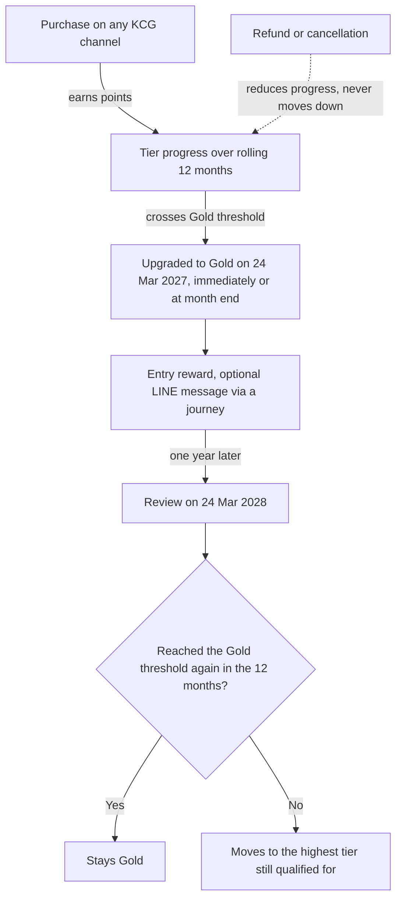

## 06 · Member Tier (Grow)

Tiers give members a status to reach and a reason to keep choosing KCG between one reward and the next (TOR 4.3). The purchases that earn points on every channel (§03, §04) also move a member up the ladder, and their tier becomes part of their status everywhere in KCG Rewards (§02).

Programme settings apply to every tier: what counts, over what window, when upgrades take effect, whether a tier must be kept. Each tier holds one number, its threshold. What a tier is worth lives on the earn rules, rewards and campaigns that serve it, so the KCG team can add a Gold-only offer next quarter without touching the ladder.

[asset:screenshot;id=3202aa84-c410-4d70-bc6e-aae889052688;title=Tier settings in the admin portal: the ladder, and the programme rules that apply to every tier]

### How members qualify

**What counts.** Each tier programme measures one thing, chosen by KCG: spend (THB), number of orders, points earned, or tickets earned (§04). Every member climbs on the same measure, so each knows exactly what the next tier takes. Behaviour and campaign participation count through the points or tickets awarded for them:

| TOR 4.3 criterion | How it counts toward tier |
|---|---|
| Spending | Spend in the window, across every channel |
| Purchase Frequency · Transaction | Number of orders in the window (one measure) |
| Customer Behavior | Points earned, which include points awarded for missions, surveys, check-ins, referrals and automated journeys |
| Campaign Participation | Tickets awarded per campaign completed (one per mission finished or survey answered), or the points earned from campaigns |

**We recommend points over a rolling 12 months.** Points already carry KCG's priorities — a richer rate on own channels, a multiplier on a new product, points for joining a campaign (§04) — so a points tier rewards the behaviour the brand wants, not just basket size. To reward how often members buy regardless of amount, order count is the simple alternative. Measure, number of tiers and thresholds are co-designed with KCG during implementation (TOR 4.3-P3).

**Window.** Rolling (1 to 36 months) or a calendar year starting in a chosen month. On a rolling 12 months every purchase counts for a full year, so nothing is wiped at year end: a member at 190 of 200 points in December doesn't restart in January. A programme start date keeps pre-launch history out of anyone's first tier.

**Upgrades.** Immediately on the qualifying purchase, or at month end to line up with KCG's monthly communication. A member who crosses two thresholds at once skips to the higher tier. Refunds and cancellations reduce progress, as they reverse points.

**Keeping a tier.** For life, or re-earned each period. On a rolling window, a member who reaches Gold on 24 March 2027 is reviewed on 24 March 2028: Gold threshold met again in the past 12 months, they stay; if not, they move to the highest tier they still qualify for. On a calendar year, the review falls at the end of the programme year. Members move down only at the review, never because of a refund or a quiet month. From Customer 360 (§02), the KCG team can move a member to another tier and protect them from moving down until a chosen date.



### What each tier is worth

Each tier gets its own benefits and its own campaigns (TOR 4.3-P2), set where each benefit takes effect:

- **Earn more** — a higher earn rate or multiplier for the tier on every purchase (§04).
- **Points go further** — rewards reserved for a tier, or the same reward at a lower points price for higher tiers (§05); the value of a point at checkout on the Shopify store can also differ by tier (§12).
- **Checkout benefits** — on the Shopify store, a tier can carry automatic checkout benefits, such as free shipping and 5% off every order for Gold members (§12).
- **Entry reward** — points or a reward granted once, the moment a member reaches the tier. The Automated Up-Tier Coupon (TOR 5.1.2) is set up in §07, as one automation per tier.
- **Tier-only campaigns** — missions and spin wheels shown only to chosen tiers (§07).
- **Tier-aware journeys** — an upgrade can start a LINE journey that congratulates the member and shows what the next tier takes; a move down can send a win-back offer; tier is a condition in any audience (§10).

An illustrative ladder on points over a rolling 12 months, at 25 THB = 1 point on third-party channels; members buying on KCG's own channels (20 THB = 1 point) climb faster.

```rocket-graphic
{
  "kind": "tier_stack",
  "tiers": [
    {
      "level": "1",
      "label": "Member",
      "threshold": "On joining",
      "benefits": ["Base earn on every channel", "Full reward catalogue", "Birthday-month bonus points"],
      "accent": "neutral"
    },
    {
      "level": "2",
      "label": "Silver",
      "threshold": "200 points in 12 months (about 5,000 THB)",
      "benefits": ["×1.1 points on every purchase", "Up-tier coupon on entry", "Silver-and-up rewards"],
      "accent": "silver"
    },
    {
      "level": "3",
      "label": "Gold",
      "threshold": "600 points in 12 months (about 15,000 THB)",
      "benefits": ["×1.25 points on every purchase", "Up-tier coupon and bonus points on entry", "Partner privileges and lower points price on selected rewards", "Gold-only missions"],
      "accent": "gold"
    },
    {
      "level": "4",
      "label": "Platinum",
      "threshold": "1,500 points in 12 months (about 37,500 THB)",
      "benefits": ["×1.5 points on every purchase", "Exclusive cooking experiences", "Platinum-only spin wheel and missions"],
      "accent": "platinum"
    }
  ]
}
```

### What members see

From their profile in KCG's LINE OA, members see a card for each tier, the benefit lines the KCG team writes, how far they are from the next tier and, where tiers are re-earned, the date to re-qualify by. Their tier also shows on the home screen, and progress moves with every purchase.

[asset:screenshot;id=bebfde47-ad06-4f23-b519-bb84147809bb;title=The tier page in KCG Rewards on LINE: current tier, benefits, progress and the date to re-qualify]
