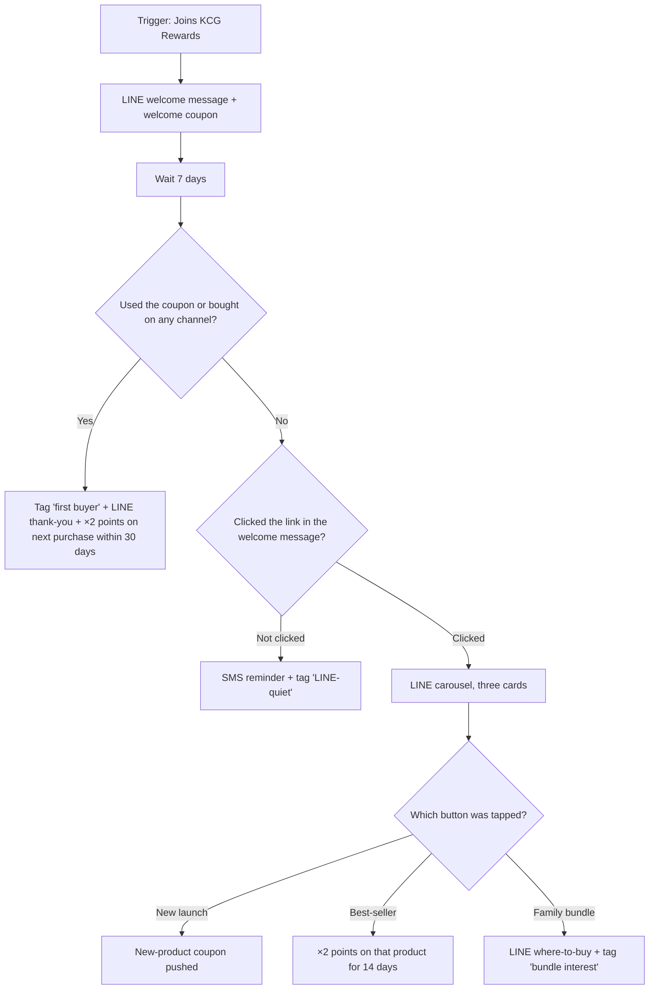
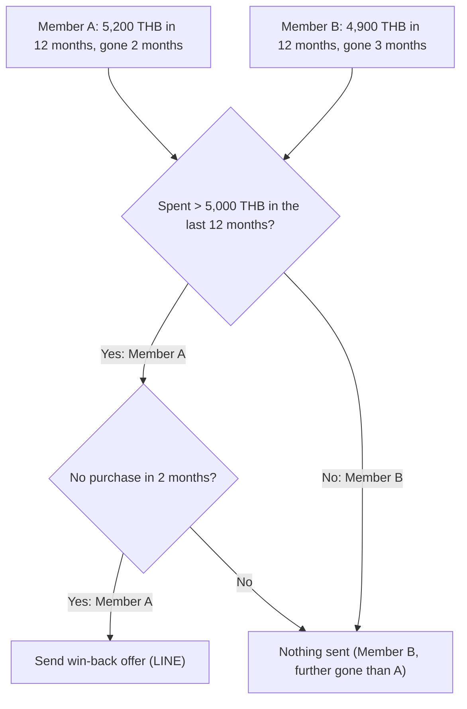

## 10 · Rule-based marketing automation (Activate)

KCG's team designs a journey once, and it runs for every member without anyone pulling a list: when something happens to a member, the journey waits, checks what they did, and sends the next LINE or SMS message or loyalty benefit. Every path is decided in advance, and members who meet the same conditions get the same treatment. This is the first of the two kinds of activation (Section 09), and it is how segmentation turns into personalised campaigns (TOR 1-P1b, 1.6). Journeys are built in the admin portal, with no development per campaign (TOR 5); the automated welcome, up-tier and birth-month coupons run on the same engine (TOR 5.1, Section 07).

### Example: from first order to second purchase

The second purchase is where one sale becomes a habit, so this welcome journey is built to get it. A shopper claims a Shopee order in KCG Rewards through LINE and becomes a member (Section 03). Joining starts the journey:

1. **Welcome.** A LINE message with the welcome coupon (TOR 5.1.1) and a "Ways to earn" link.
2. **Wait 7 days** — time to use the coupon before anything is decided.
3. **Condition split on loyalty data.** Used the coupon or bought on any channel since joining — flagship, Modern Trade receipt or marketplace order?
   - **Yes:** tag "first buyer" and send a LINE thank-you with ×2 points on the next purchase within 30 days. The journey now works on purchase two.
   - **No:** move to the interaction check.
4. **Interaction split on the link.** Did the member click "Ways to earn"?
   - **Didn't click:** switch channel — an SMS says the welcome coupon is waiting, and a "LINE-quiet" tag lets later campaigns reach them differently.
   - **Clicked:** they showed interest but didn't buy. Send a LINE carousel of three ranges KCG wants to push this month: a new launch, a best-seller and a family bundle, each card with its own button.
5. **Interaction split on the button tapped.** Each card leads to a different send: a coupon for the new launch; ×2 points on the best-seller for 14 days; or a where-to-buy message for the bundle plus a "bundle interest" tag that feeds the next family-pack campaign.

Once live, nobody touches it. Each member follows the path their own behaviour selects, and every step is logged against that member.

[asset:screenshot;id=40d97325-60b9-4e3a-b7d1-56aab4eeedd2;title=Journey Builder — triggers, waits, splits, messages and loyalty actions on one canvas]

### Journey building blocks

Every send answers three questions, each set up once and reused: **who** (a segment in the Audience Builder), **how and when** (a journey, or a one-off targeted broadcast), and **what** (reusable LINE content in the Content Library). A segment such as "members who bought at events" can start any number of journeys and broadcasts without re-entering its conditions.

[asset:screenshot;id=13a18464-2e16-4669-905b-6755f52d1464;title=Audience Builder — reusable segments that start journeys and broadcasts]

A journey is assembled from five kinds of block:

| Block | What it does | Examples for KCG Rewards |
|---|---|---|
| **Starting point** | When a member enters | Joins; tier up or down; birthday (on the day or with an offset); membership anniversary; purchase on any channel; points earned or used; reward redeemed; survey answered; enters a segment; a schedule (daily, weekly, monthly, once); a tap on a LINE message button; a manual "run now" for everyone who matches today |
| **Wait** | Pauses for minutes, days or months | 7 days to use a coupon before checking |
| **Condition split** | Yes/no branch on anything the programme knows about the member | Bought a product, or at a channel or store; spend or order count in a period; points balance; tier or recent tier change; tag, persona or segment; used a reward; completed a mission; checked in; a survey answer |
| **Interaction split** | Branches on how the member responded | Which button they tapped in a LINE card or carousel (one branch per button); whether they clicked a link in a LINE or SMS message, optionally which link |
| **Action** | What the member receives or what changes on their profile | LINE message (text, image, video, cards, carousels); SMS; award points; push a coupon or reward; a personal points multiplier for a set window (e.g. ×2 for 30 days); add or remove a tag; assign a persona; add to or remove from a segment |

Conditions work the same way in segments, entry rules and splits, so anyone who can build a segment can build a split. Before switching a journey on, the KCG team previews how many members match its entry rule today. A member goes through a journey once unless the journey allows repeat entry — for example, a monthly points-balance nudge.

In the Content Library, each button in a LINE card or carousel does one of four things: open a link, give a reward, open a survey, or continue the journey down a branch. That last option is what powers the button split in step 5.

### Targeted LINE broadcasts

When a message needs the right group but no follow-up logic, a targeted broadcast sends one LINE message, once, to a segment ("Gold members who bought at the flagship this year"), to all of KCG's LINE OA friends, or to **friends who aren't members yet** — the route for converting the brand's existing LINE audience into KCG Rewards members, alongside importing current members (Section 02). The team sends a test to staff first, then sends now or schedules it; afterwards the send log and clicks per link are there to review.

A broadcast can hand off to a journey: build a segment from the members who clicked, or tie a button to a journey so a tap enrols the member. A Songkran broadcast to all members can carry a "Show me the deals" button that starts a three-step offer journey for only those who tapped.

### Journeys to run from launch

Each is built from the blocks above; final designs are agreed with the KCG team during implementation.

| Journey | Starts when | What it does |
|---|---|---|
| **Welcome series** | A buyer joins, from any channel | The example above |
| **First-purchase nudge** | Joined at an event or through LINE, no purchase in 14 days | LINE coupon for a best-seller; after 7 more days with no purchase, an SMS reminder |
| **Points-expiry follow-through** | Monthly: members with a large balance | Adds to the built-in expiry reminder (Section 04) a LINE carousel of rewards they can afford now |
| **Win-back** | Spent over 5,000 THB in 12 months, no purchase in 2 months | LINE win-back offer; after 7 days with no purchase, a time-limited multiplier announced by SMS |
| **Post-redemption** | A member redeems a reward | After 3 days: coupon used → thank-you and a short survey with points (Section 07); not used → reminder |
| **LINE friends to members** | Scheduled broadcast to non-member friends | Join-now invitation; new members enter the welcome series |

[asset:screenshot;id=afd806ba-9274-4f7f-97f0-f63221b11007;title=Marketing automation — every journey, its status and entry rules in one list]

### Measuring each journey

Each journey reports step by step, so the team sees where members drop off: how many reached and completed each step and any that failed; clicks and click-through rate per link in every message; and each member's timeline of what they received and clicked. The tags and segments journeys create ("first buyer", "LINE-quiet", "bundle interest") flow into segment reports (Section 08), so one journey's results become the next journey's audience.

[asset:screenshot;id=64884bab-319b-439c-9311-94598e830bbf;title=Journey analytics — sends, clicks and conversions per step]

### Where rules stop

Rules do exactly what they are told. That makes them predictable, and it is also their limit. Take the win-back rule:

**The 4,900-THB member is missed.** Apply it to two members. Member A spent 5,200 THB and has been gone 2 months: the offer goes out. Member B spent 4,900 THB and has been gone 3 months — further along the way to being lost — and the rule never fires.

Rules remain the right tool for moments handled the same way every time. Moments that need judgment about one member go to AI decisioning (Section 11), inside these same journeys.
