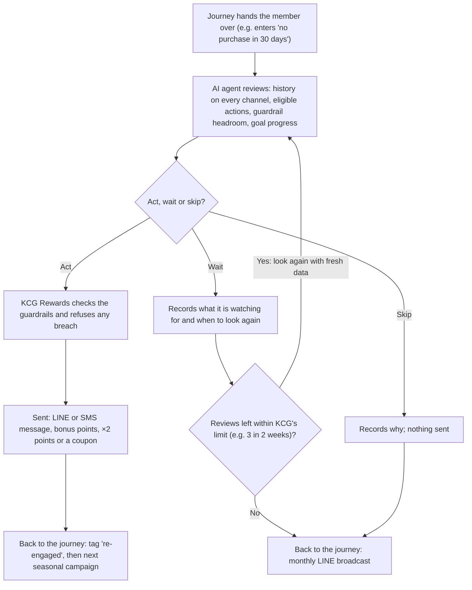

## 11 · AI decisioning: an expert marketer for every member (TOR 9.4)

Rule-based journeys (Section 10) handle the moments that are the same for everyone. Where members differ, rules fail in four ways:

- **They optimise for the average member.** Every threshold is drawn around a typical member, so whoever sits just outside it gets nothing.
- **They assume a fixed path.** A journey expects members to move in the order it was drawn. A loyal buyer who never opens LINE looks disengaged.
- **Every new behaviour needs a new rule.** Each exception is another branch, and across 200,000 members (TOR 3.2) the rules never catch up.
- **They send when triggered, not when it's worth it.** A rule fires the day its condition is met, including for the member who was about to buy anyway.

Section 10 ends on the cost: the 4,900-THB member the win-back rule never reaches.

### An expert marketer for every member

A good relationship manager doesn't work from thresholds. They look at one customer: what that person buys, where, how often, what is left in their account. Then they ask whether now is the moment, and what would bring this person back. Mass-market loyalty has always run on averages because that kind of attention needs one person per customer. AI decisioning gives every KCG Rewards member that attention, without a team to provide it. This is how first-party data becomes more frequent purchases and higher lifetime value, member by member (TOR 1.4, 1.6).

Rocket is one of only a few loyalty and B2C CRM companies in the world that can run AI decisioning for mass-market marketing. We offer it under Agentic AI, priced as its own line (TOR 9.4).

[asset:screenshot;id=0680aa25-d43e-46e4-b446-f97a581f4e27;title=AI decisioning agents: a goal and guardrails, then act, wait or skip for each member]

### What KCG sets: goal, actions, guardrails

KCG's team builds each agent in the admin portal. The agent can only work inside these settings.

**The goal.** The team chooses what the agent works towards: a purchase (such as a second or repeat purchase), win-back, re-engagement, redeeming points, moving up a tier or upsell. Success is defined as a main result, such as a purchase within 7 days of the agent's action, with a target rate for it. Other results can be counted too, including ones the brand wants to avoid. The team also sets the tone of its messages (friendly, urgent, exclusive or celebratory). A short note gives it context in plain language: "a new product launches this month", or "our members buy small baskets often; don't over-reward".

[asset:screenshot;id=f4a4e258-772e-4495-966c-e46b068df00c;title=AI agent: goal and configuration]

**The actions.** The agent uses KCG Rewards' own tools: coupons and rewards from a set KCG chooses, bonus points, time-limited point multipliers (×2 on everything for 14 days), lucky-draw entries, LINE and SMS messages, and tags or segment changes that hand the member to other journeys. Each action gets a range or a set of choices rather than a fixed value, such as 50–200 bonus points or three coupons to choose between, and a note of which members it suits. The agent picks within those limits. It never sees an action KCG hasn't enabled or one the member isn't eligible for.

[asset:screenshot;id=30d1b622-4bd0-4e81-81f0-40511c321b09;title=AI agent: the actions it may use]

**The guardrails.** Guardrails cap what the agent does per member and in total, per day, week or month: actions, messages, points, lucky-draw entries or baht spent. Timing controls sit alongside them: a minimum gap between actions for the same member, quiet hours and blackout dates. A win-back agent for KCG Rewards might run with:

```rocket-graphic
{"kind":"kv_table","rows":[
{"label":"Messages","value":"At most one per member per week"},
{"label":"Bonus points","value":"No more than 300 per member per month"},
{"label":"Budget","value":"50,000 THB a month for the agent"},
{"label":"Quiet hours","value":"No messages between 21:00 and 08:00"},
{"label":"Blackout dates","value":"No actions on KCG's marketplace mega-sale days, so offers don't stack"}
]}
```

Guardrails are checked twice. The agent plans within the headroom it has left, and KCG Rewards refuses any action that would break a limit. Where an agent-wide limit and a limit on one action both apply, the stricter wins.

[asset:screenshot;id=dcaf48d4-e760-4e1a-8b69-492ed0823dda;title=AI agent: guardrails]

### How the agent decides: act, wait or skip

KCG's journeys choose the moments that hand a member to the agent: a purchase on any channel, entering a segment such as "no purchase in 30 days", a tier change, a points change. At that moment the agent reviews the member's full history across Shopee, Lazada, TikTok Shop, Modern Trade receipts, the flagship store and events. It also checks the actions this member is eligible for, the guardrail headroom left, and how it is doing against its goal, including which actions have converted best so far. Then it decides:

- **Act:** send one or more allowed actions now, in the tone KCG set.
- **Wait:** not yet. It records what it is watching for ("an order in the next few days") and when it will look again, then reviews with fresh data.
- **Skip:** this member isn't a fit now. It records why and sends nothing.

Most decisions are "not yet", by design. A good marketer watches before stepping in, and an offer to someone about to buy anyway is money spent for nothing. The team sets how often the agent may look again and for how long, for example up to three reviews over two weeks. If it hasn't acted by then, it stops and the journey moves on.



### Worked example: one trigger, three members, three decisions

Say KCG runs a win-back agent. Its goal is a purchase within 7 days of any action. It can use bonus points (50–200), a ×2 multiplier for 14 days and a LINE message, within the guardrails above. An "overdue" journey hands over every member who enters "no purchase in 30 days", with no spend floor, because the agent, not the rule, decides who is really lapsing. One morning, three members enter.

**Khun Nok, a regular running late.** She joined by claiming a Shopee order in LINE and has bought every three to five weeks since, on Shopee and twice at a Modern Trade store by receipt upload. That comes to 4,900 THB in 12 months, 1,150 points unspent, last order 32 days ago. Section 10's win-back rule misses her twice: she is under its 5,000 THB line, and at 32 days it wouldn't look at her for another month.

1. **Day 0, wait.** Her gaps have run three to five weeks, so 32 days is still within her range. The agent waits four days, watching for an order. Nothing is sent or spent.
2. **Day 4, act.** No order has arrived. The agent sends a friendly LINE message saying her 1,150 points already cover a reward and anything she orders in the next 14 days earns double. It switches the ×2 on for her. This is her first message this week, within budget, so KCG Rewards lets it through.
3. **Day 7, result.** She orders on Shopee, claims in LINE and earns double. The order counts as a conversion for the agent, with its value.

**Khun Dao, not lapsed, just different.** She has spent over 12,000 THB this year, mostly at the flagship store, in large baskets every two months or so. Thirty days without a purchase is normal for her. The agent skips her and records why. A rule would have sent her an offer she didn't need.

**Khun Tee, joined once, never returned.** He signed up at an event booth a month ago, spent 180 THB, and hasn't been back. The agent acts small: 50 bonus points and a short LINE invitation to earn on his next order, wherever he buys.

No extra rules were written for any of them.

### Inside KCG's journeys

The agent is one step inside a rule-based journey, not a separate system. The journey decides who is handed over and when; the agent decides whether to act and what to send. Afterwards the journey carries on down one of two paths: the agent acted (tag the member "re-engaged" for the next seasonal campaign), or it didn't (return them to the monthly LINE broadcast). KCG keeps rules for predictable moments and hand only the judgment moments to the agent, in the same journey.

One agent can serve several journeys, with its results pooled so it learns from a larger base. We would expect a small set of agents along the KCG Rewards journey, shaped with the KCG team at implementation and changeable at any time:

| Agent | Goal | Typical actions | Example guardrail |
|---|---|---|---|
| First repeat purchase | A second purchase after the first earn (marketplace claim, receipt or event booth) | LINE message, coupon, small bonus points, ×2 for 14 days | One message per member per week |
| Points redemption | A first redemption from members with enough points | LINE message pointing to rewards within reach, coupon, lucky-draw entry | Two actions per member per month |
| Tier gap | An upgrade for members close to the next tier | Time-limited multiplier, bonus points | 300 bonus points per member per month |
| Win back | A purchase from members overdue against their own rhythm | LINE or SMS, coupon, bonus points, ×2 multiplier | Monthly budget; quiet hours |

### Seeing what the agent did and why

Every decision is recorded with its reasoning, including waits and skips. The AI results screen in the admin portal shows it at two levels:

- **Per member:** a timeline, such as "Day 0: waited, watching for an order. Day 4: ×2 points and a LINE message. Day 7: purchased."
- **Per agent:** members being watched, acted on and skipped; results against the target rate; which actions converted best; spend against budget; guardrail headroom left.

A result counts only when it happens within the window KCG sets after the agent's action. The KCG team judges the agent on what it changed, and adjusts its goal, actions or guardrails with evidence. The agent sees the same results and leans towards what has worked.

[asset:screenshot;id=855e7504-7d50-4de8-9cf9-13ff1437d740;title=AI agent: outcomes]

### Rules and AI decisioning side by side

| | Rule-based journeys | AI decisioning |
|---|---|---|
| What KCG defines | The exact trigger, conditions, waits and sends | The goal, allowed actions with ranges, guardrails |
| Who it decides for | Everyone matching a condition, the same way | Each member, from their own history |
| Timing | Fixed delays set in advance | Acts now, waits and looks again, or skips |
| The offer | One offer per branch | Chooses the action and its size within KCG's ranges |
| How it improves | The team edits the rules | It leans towards what converts; the team tunes goal and guardrails |
| Best for | Welcome, birthday, tier-up coupon, expiry reminder | First repeat purchase, win-back, redemption, tier gap |

Both run from go-live in the same journey builder: rule-based automation in the core scope, AI decisioning under TOR 9.4. Section 13 shows how AI decisioning and AI analysis work together.
