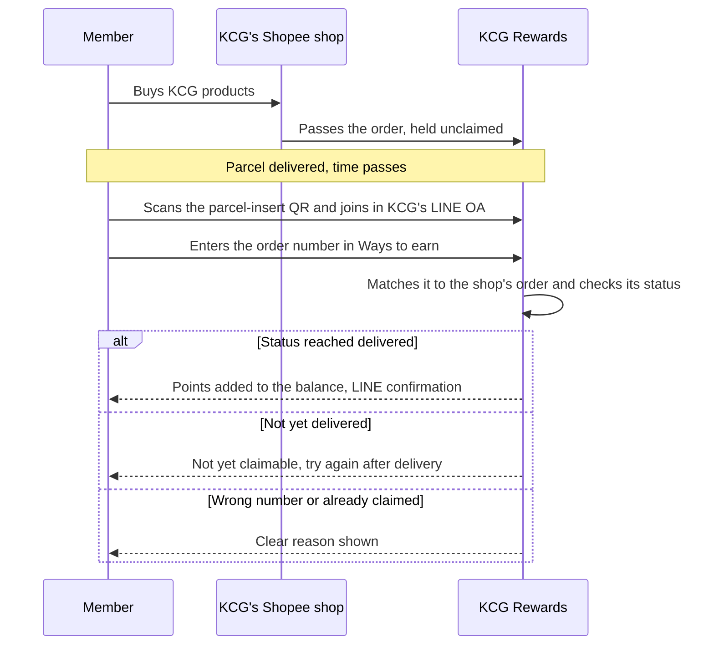
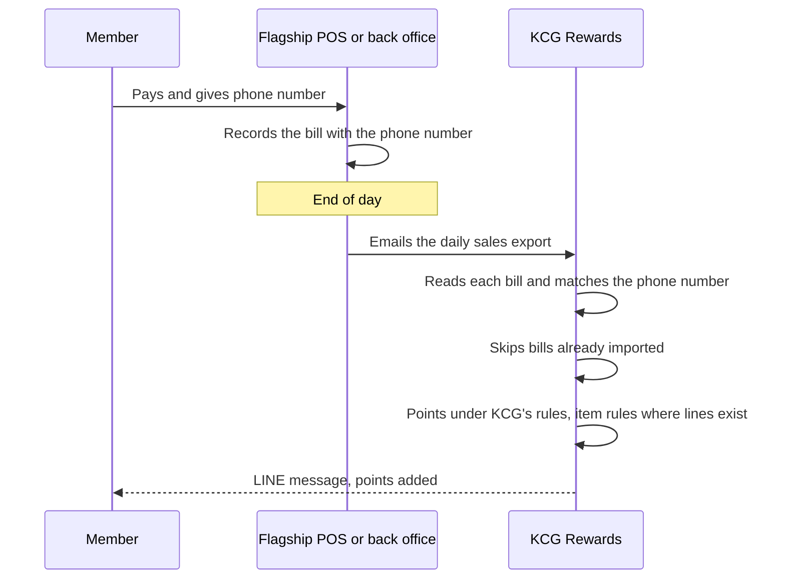
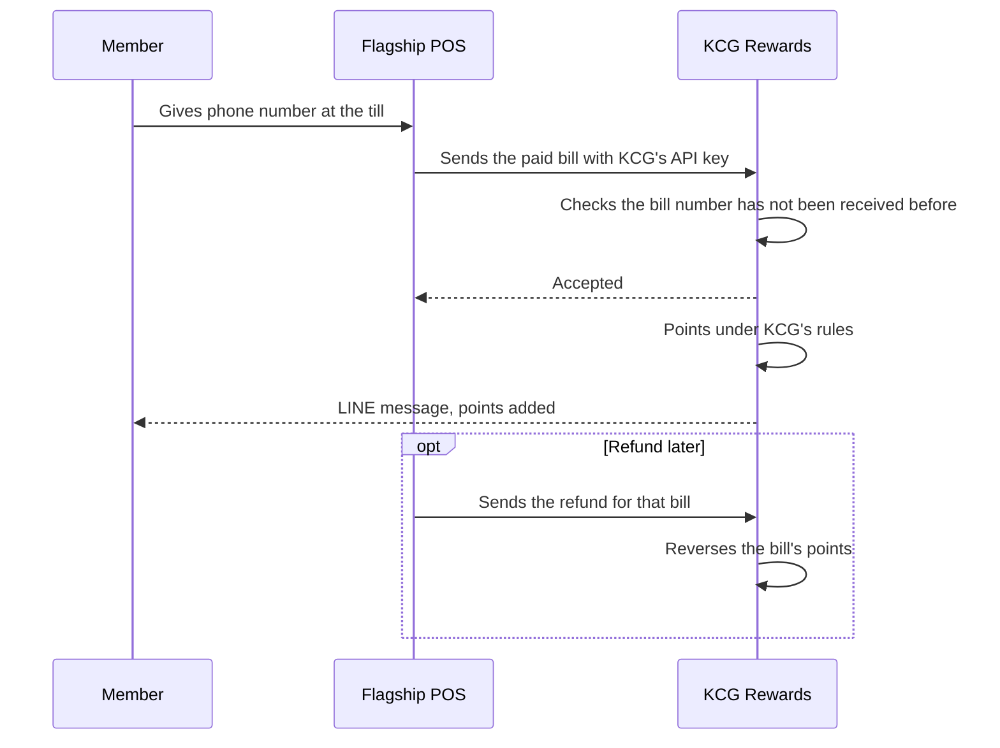
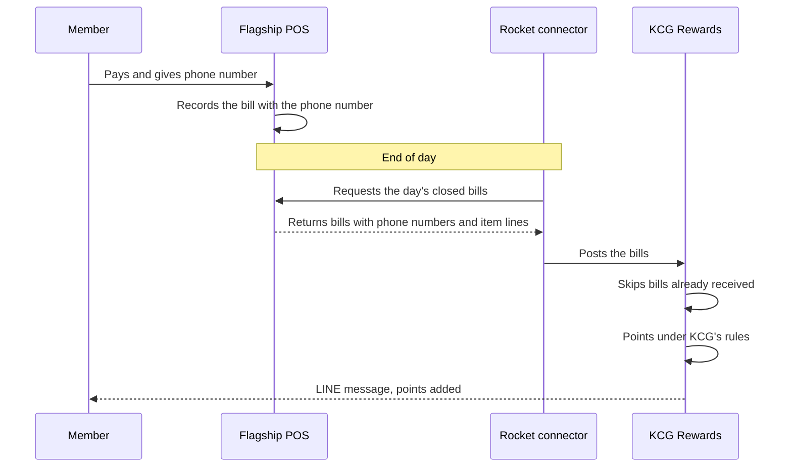
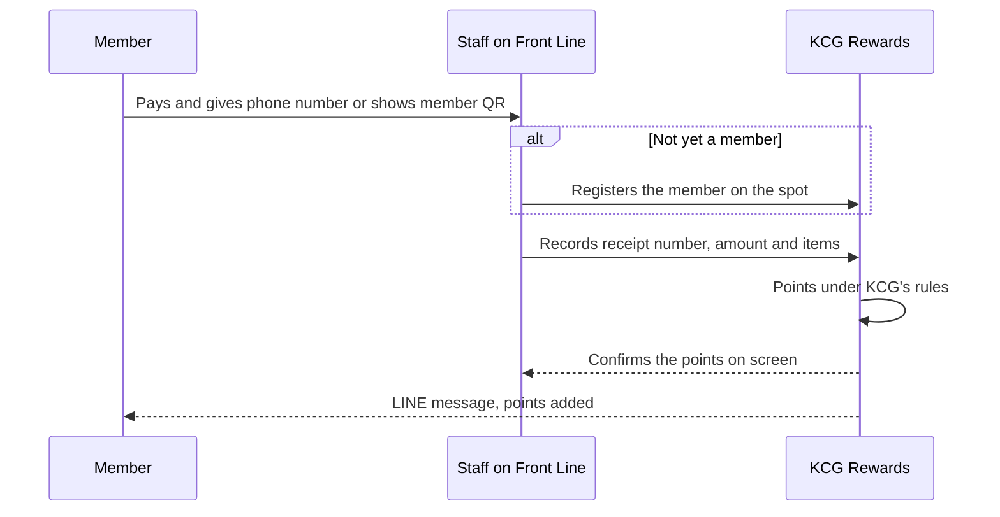
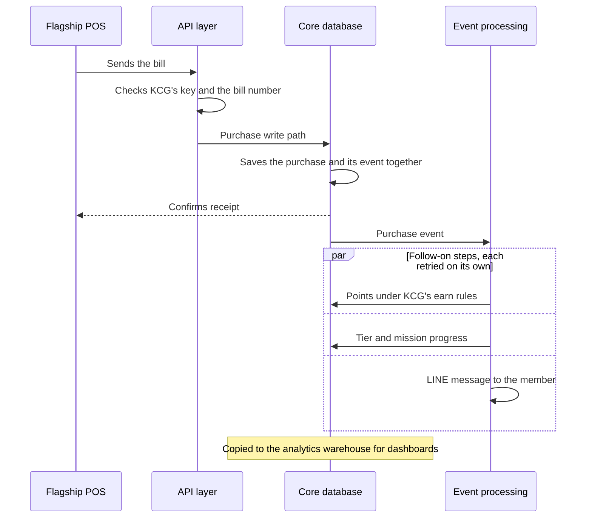

# KCG Corporation — KCG Rewards proposal

## Executive summary

Most of KCG's customers buy through channels KCG doesn't own. KCG Rewards turns each of those buyers into a member KCG knows, and then moves more of their repeat purchases to KCG's own channels: purchases on the marketplaces, Makro PRO and in Modern Trade earn at a lower rate, because those channels leave KCG a thin margin, while KCG's own channels keep the full margin and earn at a better rate, into the same balance (§03). The KCG team runs the programme from one admin portal, inside KCG's LINE Official Account, from go-live on 1 January 2027.

```rocket-graphic
{
  "kind": "pillar_matrix",
  "pillars": [
    {
      "objective": "One member profile across every channel (TOR 1.1, 1.8)",
      "current": [
        "Buyers on the marketplaces, Makro PRO and in Modern Trade are not known to KCG",
        "Each channel's sales sit in its own system"
      ],
      "future": [
        "All ten channels earn into one member profile in KCG's LINE OA",
        "Order claims and receipt uploads identify third-party buyers"
      ],
      "impact": [
        "▲ Share of sales linked to a known member",
        "▲ First-party customer data KCG owns"
      ]
    },
    {
      "objective": "Repeat purchases on KCG's own channels (TOR 1.4, 1.10)",
      "current": [
        "Repeat orders return to the channel of the first purchase",
        "Nothing makes buying direct more rewarding"
      ],
      "future": [
        "Own channels earn more points, into the same balance",
        "The balance is shown and spent at checkout on KCG's store"
      ],
      "impact": [
        "▲ Share of repeat orders on own channels",
        "▼ Commission and retailer margin on repeat orders"
      ]
    },
    {
      "objective": "Points, rewards, tiers and campaigns (TOR 1.3, 1.5, 1.7)",
      "current": [
        "A new campaign mechanic needs development work",
        "No shared currency or tiers across channels"
      ],
      "future": [
        "One point currency, one reward catalogue and tiers",
        "The KCG team builds campaigns in the admin portal"
      ],
      "impact": [
        "▲ Purchase frequency and lifetime value",
        "▼ Time and cost to launch a campaign"
      ]
    },
    {
      "objective": "Reports and activation for each member (TOR 1.6, 1.9, 9)",
      "current": [
        "Customer behaviour is hard to see across channels",
        "Messages go to broad lists, set up by hand"
      ],
      "future": [
        "14 dashboards, segments, RFM and AI analysis",
        "Journeys and AI decisioning on LINE and SMS"
      ],
      "impact": [
        "▲ Campaign conversion",
        "▼ Manual marketing work"
      ]
    }
  ]
}
```

**One member profile across every channel (TOR 1.1, 1.8, 4.1, 7).** Members join in KCG's LINE OA with LINE Login and a verified mobile number, and the LINE OA stays their home for their balance, coupons and every way to earn. Facebook and email sign-in can be added; we recommend always requiring LINE, the channel marketing automation reaches best. KCG's current LINE members are imported before go-live with their points balance (§02). All ten TOR 7 channels then earn into one purchase history (§03). Rocket's Shopee, Lazada and TikTok Shop connections are native and live today, so the six shops connect from the admin portal with no integration cost, and buyers claim with their order number. Makro PRO is its own channel: we build its order connection free of charge where Makro PRO offers one, and otherwise its buyers upload the receipt. Modern Trade receipts are read by AI and approved by a reviewer by default, from the KCG team or Rocket's Receipt Approval service, or on the spot once KCG switches auto approval on. Our POS routes cover any POS: for the flagship store we recommend the routine daily sales file, emailed to KCG Rewards with no integration work from KCG or the POS vendor, and the Front Line staff app for event booths; §11a sets out every route and its cost. Brand.com, Shopify and LINE orders earn with no claim step.

**Move repeat purchases to KCG's own channels (TOR 1.4, 1.10, 7.4, 7.10).** The earn rate is the main lever. KCG sets rates on channel groups, for example an illustrative 25 THB = 1 point on Marketplaces, Modern Trade and Makro PRO and 20 THB = 1 point on Own channels, which is 25% more per baht; a new shop or booth earns at its group's rate from its first order (§04). Because every purchase lands in one balance, a member claiming a Shopee order sees on the Ways to earn sheet that KCG's own store earns more (§03), and the own-channel nudge journey or an AI agent picks the moment to tell them, with a coupon for a first order there (§09). On KCG's online store, order sync, which is how Brand.com earns through our Open API, covers earning only. Rocket's Shopify plugin also shows the member's balance and each product's points inside the store, lets them spend points and rewards at checkout, and rewards them for referring friends, so the balance built on Shopee and at Lotus's can be used on the store where KCG wants the next order placed (§10). The Purchases report shows member spend on third-party channels against KCG's own, month by month, so the KCG team can see the shift as it happens (§08).

**Points, rewards, tiers and campaigns (TOR 1.3, 1.5, 1.7).** One point currency is earned on any channel and spent on any reward, with optional tickets for campaigns such as lucky draws; KCG sets the conditions, the rates, and public or personalised multipliers for chosen members (§04). One catalogue holds e-coupons, merchandise and extra points, each reward with its own audience, dates, limits and tier-based points price (§05). Each tier programme measures one thing KCG chooses. We recommend points over a rolling 12 months, so members who buy on KCG's own channels also climb faster, and each tier earns more, pays fewer points for selected rewards and gets its own campaigns (§06). The KCG team builds Welcome, Up-Tier and Birth Month coupons, spending missions, Friend Get Friend, surveys, lucky draws, spin wheels, daily check-in and leaderboards in the admin portal, with no development per campaign (TOR 5-P1, §07).

**Reports and activation for each member (TOR 1.6, 1.9, 9).** Analyze shows the KCG team who has stopped where: an executive overview and 14 report dashboards grouped by domain, segments and RFM, a live feed to KCG's data lake, and AI analysis in the portal or in Claude or ChatGPT, limited to what each admin may see (§08). Activate moves those members on, in four layers (§09). Audiences are built once from any programme data and reused by every activation tool. A targeted LINE broadcast sends one message to an audience on a date the team picks, including invitations to LINE friends who aren't members yet. A rule-based journey, in the core scope, runs continuously: each member enters when their own trigger happens, and the journey waits, checks what they bought and which button they tapped, and sends the next LINE or SMS message or benefit. AI decisioning, offered under TOR 9.4, gives every member the attention of an expert marketer: within the goal, actions and guardrails KCG sets, it decides for each member whether to act, wait or skip. On our estimates across customers, brands that pair their programme with activation see over 50% higher member engagement and conversion to next purchase than brands that run the programme alone. Receipt reading, AI analysis and AI decisioning work from the same member profile, and §11 shows how they fit together as one AI layer.

### Why Rocket, in brief

```rocket-graphic
{
  "kind": "kv_table",
  "rows": [
    { "label": "Everything on one platform", "value": "One of the only B2C CRMs with loyalty, mini CDP, marketing automation, AI and an e-commerce plugin on one member profile and one balance, so a buyer KCG first meets on Shopee stays one member through to a repeat purchase on KCG's own store (§13)." },
    { "label": "Thailand's only Shopify-native loyalty plugin", "value": "Live today on the Shopify App Store and ready the day KCG's store opens, on the members and balances KCG already runs in LINE (§10)." },
    { "label": "AI decisioning for each member", "value": "One of only a few loyalty and B2C CRM companies in the world running AI decisioning for mass-market marketing: the agent decides for each member whether to act, wait or skip, within KCG's guardrails (§09, §11)." },
    { "label": "Built for national-scale peaks", "value": "A claim, receipt or purchase updates points, tier and missions as it happens. Order processing is designed for 10,000 orders an hour; KCG's 100,000+ orders a month average around 140 an hour, so an 11.11 peak stays well inside it (§03, §13)." },
    { "label": "A team that knows KCG's programme", "value": "Two dedicated customer success staff, a loyalty strategist, committed service levels and regular campaign graphics at no charge, plus four optional services: platform management, receipt approval, loyalty consultation and partner rewards (TOR 10–13, §12)." },
    { "label": "Lower cost, passed on", "value": "AI has made software cheaper to build and run. We pass that saving to KCG in the price instead of keeping it as margin (§14)." }
  ]
}
```

## About Rocket

We launched Rocket in 2023, and it is now one of the top three B2C CRMs in Thailand, with more than 100 key accounts across retail, FMCG, beauty, automotive and building materials, and a team of more than 60 across engineering, customer success and support, and sales. We are a LINE Developer Partner, which matters for a programme whose home is KCG's LINE Official Account, and we partner with AWS and Com7.

[asset:screenshot;id=9d248e01-ca84-4110-9360-bdc6868ce0ad;title=About Rocket: launched 2023, 100+ key accounts, 60+ team, LINE Developer Partner]

Thailand's MarTech Report 2025 (Content Shifu × Hummingbirds) places Rocket CRM among the three most-used B2C CRMs, and of those three it had the highest intended use for 2025: 13%, up from 6%, the biggest jump in the group.

[asset:screenshot;id=0692af51-80c7-48b4-9a0f-41bde90fa85e;title=Thailand's MarTech Report 2025: Rocket CRM most likely to be used in 2025]

We also share what we learn. Our team speaks at Thailand's marketing and technology stages, including MarTech Expo 2025, on AI decisioning, the retention journey and building direct-to-consumer channels through loyalty and commerce.

[asset:screenshot;id=410de946-b0ac-40ab-b155-254f59c5500e;title=Leading innovation in Thailand]

## 01 · The KCG Rewards journey

The rest of this proposal follows one member from first sign-up to a repeat purchase on KCG's own channels, stage by stage. Most members will be won on channels KCG doesn't own, such as the marketplaces, Modern Trade and Makro PRO, and each stage after that gives them another reason to buy again on KCG's own; §03 explains how the per-channel earn rates make that work. Each section keeps the TOR heading and tags clauses inline, e.g. "(TOR 5.1.1)", so every requirement can be found where it is answered.

| Stage | What the member does | TOR clauses | Section |
|---|---|---|---|
| **Join** | Scans a QR code at the counter, event booth or on pack, or taps the KCG LINE OA rich menu; signs up in LINE with a phone OTP and gives consent. From then on the LINE OA is where they check points, coupons and ways to earn | 3.4, 4.1 | 02 |
| **Earn** | Earns KCG Rewards Points on every channel: six marketplace shops and Makro PRO by order claim, Modern Trade by receipt upload, flagship and event sales, Brand.com, Shopify and LINE OA orders | 4.2, 7.1–7.10 | 03, 04 |
| **Burn** | Redeems points for e-coupons or merchandise, and receives the privileges KCG pushes | 5.1.4, 5.1.5, 6.1, 6.2, 6.4 | 05 |
| **Grow** | Buys more, moves up a tier, and unlocks a better earn rate, tier-only rewards and tier-only campaigns | 4.3 | 06 |
| **Campaign** | Gets something new to do: welcome, up-tier and birth-month coupons, spending missions, friend-get-friend, surveys and lucky draws | 5.1.1–5.1.3, 5.2, 6.3 | 07 |
| **Analyze** | Every purchase, redemption and tap lands on one profile; the KCG team sees who did what in dashboards, reports, Customer 360 and AI analysis | 1.9, 9.1–9.4 | 08 |
| **Activate** | Receives the next nudge at the right moment, in LINE or by SMS: a targeted broadcast to an audience they belong to, a rule-based journey that reacts to what they did, or an AI decision made for them alone | 1.6, 9.4 | 09 |
| **Convert** | Buys again at the flagship store, on Brand.com or on Shopify, with the same member profile, and spends there the points earned on Shopee or at Lotus's | 7.4, 7.10, 8.6 | 10 |

[asset:screenshot;id=73016172-9090-4986-a455-2aa0e2d89d8c;title=KCG Rewards at a glance: acquire in LINE, engage with points and campaigns, analyse, retain with personalised messages]

§11 gathers the AI that runs under these stages, from reading receipts to deciding per member, and §11a sets out how each KCG system connects and what data moves (TOR 7, 8, 9.3). §12–14 cover services (TOR 10–13), why Rocket, and why our price looks low. Every stage depends on knowing who the member is, so the journey starts with how members join (§02).

## 02 · Member Management (Join)

Every stage in the journey map starts with a member KCG knows, and joining is where that happens. At the end of sign-up KCG holds a verified mobile number that links the member's purchases on every channel, a LINE connection the brand can message, and consent that records what KCG may send.

### KCG's LINE Official Account as the programme's home (TOR 3.4, 4.1)

KCG Rewards runs inside KCG's LINE Official Account, the programme's touchpoint at launch (TOR 3.4), so members have nothing to download and no new account to add. Everything a member does in the programme happens from that one chat: they join, check their points and tier, look back over their purchases and points history, keep their coupons, find how to earn on each channel, and redeem.

- **Rich menu entry points.** Each button on KCG's rich menu can open a KCG Rewards page directly, for example *Home*, *Earn points*, *Rewards* and *My Rewards*, so a member reaches the screen they want in one tap. The same page links can sit behind buttons in LINE messages.
- **Home screen.** Home opens on the member's card: points balance, tier and progress to the next tier. Below it the KCG team arranges banners, featured rewards, missions and quick actions. The team changes the layout in the admin portal without development, and can show different blocks to different member groups, such as business buyers and home cooks.
- **Earning and redeeming.** *Earn points* opens the Ways to earn sheet, which §03 introduces together with the channels; *Rewards* opens the reward catalogue (§05). Orders placed through LINE earn as purchases on KCG's own channel (§03).
- **Messages in the same chat.** When a purchase is recorded, points arrive, a reward is redeemed or the tier changes, KCG Rewards tells the member in the LINE chat, and it reminds them before points or rewards expire. The KCG team chooses which of these messages go out and edits their wording. They reach only members who allow LINE messages (consent, below).

[asset:mockup;id=loyalty.core.home.home;pitch=kcg-loyalty-crm;title=KCG+Rewards+home+in+LINE+-+balance%2C+tier+progress%2C+rewards+and+missions]

[asset:mockup;id=loyalty.admin.display-settings.core;title=Home+screen+layout%2C+set+by+the+KCG+team+in+the+admin+portal]

### Member Registration: one tap in LINE to a consented member

Members open KCG Rewards from the LINE OA rich menu, or from a QR code wherever they meet the brand: a card in marketplace parcels, on pack, at the flagship counter, at an event booth. Every entry point leads to the same flow and the same member record:

1. **LINE OA and LINE Login.** One tap opens KCG Rewards inside LINE; the member allows LINE login.
2. **Mobile number and OTP.** A 6-digit code by SMS verifies the number. The account is created here, before any form.
3. **Standard fields, then KCG's own questions**, on separate steps so neither feels long.
4. **Consent.** KCG's documents, plus the channels and topics the member agrees to.

[asset:screenshot;id=7abd9f62-7dd1-4e45-a892-6e5136fa9459;title=Sign-up — from one tap in LINE to a verified, consented member]

Creating the account at step 2 is deliberate. A member who verifies and then leaves at the form is still reachable on LINE and SMS, and sits in the "joined, profile incomplete" stage (below), where an automated nudge such as *"Finish your profile and get a welcome coupon"* can bring them back (§09). Returning members are recognised by LINE and land on the home screen. If KCG adds a required field or consent later, returning members are asked only for that item. Flagship and event staff can also register a member at the counter (§03).

### Member Login: LINE plus mobile number, with more channels available

Members can sign in with **LINE**, **mobile number and OTP** (TOR 4.1, "Member Login ด้วย Mobile Phone Number"), **Facebook** or **email**. KCG chooses which to offer, and can add a channel later without re-registering anyone.

**Our recommendation: whatever else KCG offers, always require LINE, with a verified mobile number.** LINE is the channel marketing automation reaches best. Messages arrive in the chat members already use, as rich cards with buttons, and the button a member taps tells the journey what to do next (§09). The mobile number is the member's identity across channels. It is stored in one format, so *081…* and *+6681…* are the same person, and it matches the member's purchases at the flagship and event POS, at the counter, and on Brand.com. Facebook and email are then additional ways in, mainly for web visitors who arrive outside LINE. If Brand.com moves to Shopify, we recommend also collecting email at sign-up, so a member's LINE account and their Shopify account resolve to the same KCG Rewards member (§10).

### Member Profile: the questions KCG chooses

KCG decides what to ask and can change it later without development (TOR 4.1, "Member Profile").

- **Standard fields**: name, email, birth date, gender, address, ID card. For each one the KCG team switches it on, makes it required or optional, and decides whether the member can change it later. Collecting birth date from day one matters because it drives the Birth Month Coupon (§07).
- **KCG's own questions**: free text, single or multiple choice, with follow-ups that appear only after a given answer. For example, *"What do you mostly use KCG products for?"* (home cooking · home baking · for my business), then only for business buyers, *"What type of business?"*. Answers feed reports, segments and journeys (§08, §09).
- **Later changes**: members edit their profile in KCG Rewards and staff edit it in Customer 360. A new required question is asked of existing members once, at their next visit. Every question, option and member-facing text can be translated, and members switch between Thai and English.

[asset:screenshot;id=1a4aa463-c4d8-418b-a5d6-6b7a2d35e9ca;title=Member profile — points, tier, rewards, history and consent settings in one place]

### Member Status: tier and journey stage

A member's status has two parts: **where they stand in the programme** and **where they are in their journey with KCG** (TOR 4.1, "Member Status").

**Tier** is the programme status members see: current tier and progress to the next, on the home screen and profile (§06).

**Journey stage** is the status the KCG team works with. The team defines the stages as conditions on the member's data. Each member sits at the furthest stage they match, and moves automatically as they act or stop acting, including backwards when a regular buyer lapses. A starting set for KCG Rewards:

```rocket-graphic
{"kind": "horizontal_stepper", "title": "KCG Rewards journey stages (illustrative, defined with KCG at implementation)", "steps": [
  {"label": "Joined", "sublabel": "LINE and phone verified, profile not finished", "accent": "neutral"},
  {"label": "Profiled", "sublabel": "Profile complete, no purchase yet", "accent": "secondary"},
  {"label": "Earner", "sublabel": "Has earned, never redeemed", "accent": "primary"},
  {"label": "Redeemer", "sublabel": "Redeemed, no repeat purchase yet", "accent": "primary"},
  {"label": "Repeat buyer", "sublabel": "Bought again, increasingly on KCG's own channels", "accent": "gold"},
  {"label": "Lapsed", "sublabel": "No purchase in the window KCG sets, e.g. 90 days", "accent": "warm"}
]}
```

Treating stage as status has three practical consequences:

- **Each stage is an audience the KCG team can target.** "Earned but never redeemed" can receive a broadcast, enter a journey or be handed to an AI agent directly (§09), without anyone exporting a list.
- **Moves are recorded**, so the team sees how many members reached each stage in a period and how many went on to the next.
- **Stage is visible wherever staff look**: on the member's Customer 360 and as a filter and column in the Members report.

[asset:mockup;id=loyalty.admin.reports-members.overview;title=Members+report+-+sign-ups%2C+profile+completion+and+retention]

Account status sits underneath. Head office can **freeze** a member suspected of abuse, such as refund-after-redeem on a marketplace order or repeated fake receipts. A frozen member can still open KCG Rewards but sees only a request to contact KCG, and can't redeem, spin or claim until staff lift it.

### What members see about themselves

Members find their own records in KCG Rewards in LINE; staff see the same records, with more detail, in Customer 360 (below).

| TOR 4.1 item | Member sees in KCG Rewards | Staff see in Customer 360 |
|---|---|---|
| **Member Activity** | Mission progress; points history labelled by source | One activity timeline across channels and campaigns, filterable by type |
| **Member Transaction History** | Purchases from every channel in one list | The same list, plus purchase search across members |
| **Point Balance** | Balance and the next points due to expire, e.g. *"800 points expire 31 Dec"* | Balance, earned and burned over time, points by source, expiry by batch |
| **Coupon / Reward History** | *My Rewards*: ready to use, used, expired | Every redemption and its status |

Point rules, expiry and reversal are in §04; reward rules in §05.

### Member Consent and Communication Preference

Consent is the last sign-up step and keeps KCG within PDPA (TOR 4.1, "Member Consent", "Member Communication Preference").

- **Documents.** KCG's privacy policy, terms and marketing consent, each set as a notice, required to join, or optional.
- **Channels.** LINE, SMS, email and push; the member chooses which KCG may use.
- **Topics.** Subjects KCG defines, such as new products, promotions, or recipes and tips. Hidden if not needed.

When KCG publishes a new version of a document, members aren't asked to re-register. At their next visit they see the new required version before the home screen. Every decision is kept against the exact version the member saw and is never overwritten, so KCG can show who agreed to what, and when. Members change their choices any time from their profile, and audiences respect them, so a promotions message goes only to members who opted in to *Promotions* (§09).

### KCG's current LINE members (TOR 4.1, LINE OA and LINE Current KCG)

- **Same LINE OA.** KCG Rewards opens from the existing rich menu (above), so KCG's LINE friends stay in the chat they already follow.
- **Existing members arrive with their points.** Before go-live we import KCG's member records with profile, point balance and tier, matched on mobile number, LINE account, email or the current member code, so no one is duplicated. If the current system stays live for a period, repeat imports keep the two in step. When an imported member first opens KCG Rewards and verifies their number, their balance is already there; they only complete the profile and consent. The exact sync approach is agreed with the KCG team during onboarding.
- **Friends who aren't members yet** can be sent a LINE invitation to join, addressed only to them and optionally timed with a welcome offer (§09 covers these targeted broadcasts).

### Customer 360: everything about one member, on one page

Customer 360 is where the KCG team sees one member across every part of the programme, over the period they choose (30 days to all time):

- **Identity**: profile, persona, tags, how and when they were acquired, RFM segment, and journey stage.
- **Points and currencies**: balance, earned and burned over time, points by source, and each batch with its expiry.
- **Tier**: current tier and progress to the next.
- **Rewards**: coupons ready to use and used, and every redemption.
- **Campaigns**: mission progress and active benefits.
- **Purchases and interactions**: one timeline of purchases from every channel, point movements, redemptions, mission activity and the touchpoints KCG records from LINE, web or store, filterable by type.

[asset:screenshot;id=375eff5e-6191-4f8a-aa8a-592c64017637;title=Customer 360 — one member's full relationship, then the next action]

From the same page, head office acts with that context in view: edit profile fields or the mobile number; unlink a LINE account when a member switches to a new LINE account, so the next login attaches the new one; add tags and staff notes; adjust points or tickets with a reason (§04); set a tier and lock it against downgrade; freeze or unfreeze. Each action is recorded. What each staff member can see and change follows their role.

[asset:mockup;id=loyalty.admin.customer-360.member;title=Customer+360+in+the+live+portal]

Customer 360 is the per-member view; reports across all members are in §08, and the counter version for flagship and event staff is in §03.

Once a member is known by LINE account and mobile number, a purchase on any KCG channel can be credited to them. §03 sets out how each channel, from Shopee to the flagship till, makes that link.

## 03 · Transaction Capturing: earn on every channel (Earn)

Once a buyer is a known member (§02), any purchase they make on any of KCG's ten channels can earn. Each one lands in the same purchase history on the member, so the same points, tier and campaign rules apply wherever they bought (TOR 1.8, 1-P2): a Shopee order, a Lotus's receipt, a booth sale and a Brand.com order become the same kind of record. What differs by channel is how the purchase reaches KCG Rewards, how it is tied to the member, and how much it earns.

### Four kinds of channel, one purchase history

KCG's channels sit on two axes: online or offline, and whether someone else makes the sale (third-party) or KCG does (first-party). Between them, the four quadrants cover every channel in TOR 7.

| | Third-party (someone else sells) | First-party (KCG sells) |
|---|---|---|
| **Online** | Shopee ×2, Lazada ×2, TikTok Shop ×2 (TOR 7.5–7.7) · Makro PRO: order claim, or receipt upload (TOR 7.9) | Brand.com (TOR 7.4) · Shopify (TOR 7.10) · orders taken through LINE (TOR 7.8) |
| **Offline** | Modern Trade (TOR 7.2) | Flagship Store (TOR 7.1) · Event booths (TOR 7.3) |

On third-party channels the member does one small thing, claiming an order or photographing a receipt, and that step is how an anonymous buyer becomes a known member. On first-party channels KCG already holds the sale, so points arrive with no effort from the member. The two halves of the table also earn at different rates, for the reason below.

### Why the channels earn at different rates

Most of KCG's customers first buy on a channel KCG doesn't own, where the brand never learns who bought. The programme has two jobs with those customers: identify them when they buy there, and then give them a reason to make their repeat purchases on KCG's own channels. The earn rate is the main lever for the second job, and it works as a chain:

1. **Third-party purchases earn at a lower rate.** After marketplace commission or the retailer's margin, KCG keeps a thin margin on a sale through Shopee, Lazada, TikTok Shop, Makro PRO or Modern Trade, so the points on those sales are set at what that margin can carry. The rate still has to be worth claiming, because the claim is what identifies the buyer.
2. **First-party purchases earn at a higher rate.** Sales at the flagship store, at event booths, on Brand.com, on Shopify and through LINE carry no commission or retailer margin, so KCG can return part of that difference to the member as extra points, along with benefits only KCG's own store can offer, such as spending points at checkout (§10).
3. **One balance shows the difference each time.** Because every purchase lands in the same balance, a member claiming a Shopee order sees in the same place what the same basket would have earned on KCG's own store. The Ways to earn sheet (next subsection) puts the channels side by side.
4. **Repeat purchases move.** A member who already has a balance, knows that KCG's store pays more, and can spend the balance there has a concrete reason to place the next order with KCG directly.

The illustrative rates in §04 are 25 THB = 1 point on marketplaces, Makro PRO and Modern Trade, and 20 THB = 1 point on KCG's own channels. That is 25% more points on first-party channels: a 500 THB basket earns 20 points on Shopee and 25 points on Brand.com. The slide shows the same pattern at 100 THB and 80 THB per point.

[asset:screenshot;id=920b242a-9e71-41e2-853f-3e361c1a4a75;title=Marketplace orders earn at the base rate, KCG's own store earns 25% more, into one balance]

```rocket-graphic
{
  "kind": "flow",
  "direction": "right",
  "zone_direction": "down",
  "groups": [
    {
      "id": "third",
      "label": "Third-party channels",
      "step": 1,
      "tone": "blue"
    },
    {
      "id": "bal",
      "label": "One balance",
      "step": 2,
      "tone": "amber"
    },
    {
      "id": "own",
      "label": "KCG's own channels",
      "step": 3,
      "tone": "red"
    }
  ],
  "nodes": [
    {
      "id": "n1",
      "label": "Buys on a third-party channel",
      "detail": "Shopee, Lazada, TikTok Shop, Makro PRO or Modern Trade",
      "icon": "shopping-bag",
      "tone": "blue",
      "group": "third"
    },
    {
      "id": "n2",
      "label": "Claims the order or uploads the receipt in LINE",
      "detail": "KCG learns who bought",
      "icon": "receipt",
      "tone": "blue",
      "group": "third"
    },
    {
      "id": "n3",
      "label": "Earns at the lower third-party rate",
      "detail": "Set by channel groups (§04)",
      "icon": "coins",
      "tone": "blue",
      "group": "third"
    },
    {
      "id": "n4",
      "label": "One KCG Rewards balance",
      "icon": "wallet",
      "tone": "amber",
      "group": "bal"
    },
    {
      "id": "n5",
      "label": "Ways to earn shows that own channels earn more",
      "icon": "eye",
      "tone": "amber",
      "group": "bal"
    },
    {
      "id": "n6",
      "label": "Own-channel nudge",
      "detail": "A journey or AI agent sends a LINE message and a first-order coupon (§09)",
      "icon": "send",
      "tone": "violet",
      "group": "bal"
    },
    {
      "id": "n7",
      "label": "Buys on KCG's own channels",
      "detail": "Flagship Store, event booths, Brand.com, Shopify, LINE orders",
      "icon": "store",
      "tone": "red",
      "group": "own"
    },
    {
      "id": "n8",
      "label": "Earns at the higher own-channel rate",
      "detail": "No claim step (§04)",
      "icon": "coins",
      "tone": "red",
      "group": "own"
    },
    {
      "id": "n9",
      "type": "end",
      "label": "Sees and spends the balance at checkout",
      "detail": "On KCG's Shopify store, once it is live (§10)",
      "icon": "shopping-cart",
      "tone": "green",
      "group": "own"
    }
  ],
  "edges": [
    {
      "from": "n1",
      "to": "n2"
    },
    {
      "from": "n2",
      "to": "n3"
    },
    {
      "from": "n3",
      "to": "n4"
    },
    {
      "from": "n4",
      "to": "n5"
    },
    {
      "from": "n5",
      "to": "n6"
    },
    {
      "from": "n6",
      "to": "n7"
    },
    {
      "from": "n7",
      "to": "n8"
    },
    {
      "from": "n8",
      "to": "n9"
    },
    {
      "from": "n8",
      "to": "n4",
      "label": "Into the same balance",
      "dashed": true
    }
  ]
}
```

Rocket supports each link in that chain. Claims and receipt uploads identify the third-party buyer (this section). Channel groups let KCG set one rate for all marketplaces and another for its own channels, and a new shop picks up its group's rate automatically (§04). Audiences, journeys and AI decisioning prompt the switch at the moment a member is most likely to make it (§09). The Shopify plugin lets members see and spend their balance on KCG's store (§10).

### Ways to earn: the member's one place to earn

Members find every channel on one sheet in LINE, **Ways to earn**, with a tab per channel. It opens over whatever page they are on, so a "collect points" button can sit on the home page, in the rich menu (§02), on a campaign banner or in a LINE message. Marketplace claim and receipt upload open their form inside the tab. Channels where points arrive on their own get an information card, such as "Buy at our Flagship Store or event booths: tell staff your phone number". Each card can show what that channel earns, so a member who comes to claim a Shopee order sees on the same sheet that KCG's own store earns more.

The KCG team edits each tab's banners, participating stores and how-to steps in the admin portal, and hides any tab KCG doesn't use.

[asset:screenshot;id=9f2eae77-4a1f-4d96-aef4-cf67ed5c0b96;title=KCG's LINE OA home: every way to earn one tap away]

### One rule on every channel: the purchase must name the member

A purchase earns only when it names the member, and the key is the mobile number captured at sign-up (§02). KCG's tills, sales files and booths carry it on the bill; the online store matches the order by phone or email; and on marketplaces, Makro PRO and at retailers, where the brand never sees the buyer, the member makes the link by claiming the order or uploading the receipt while signed in to KCG Rewards in LINE.

### Shopee, Lazada and TikTok Shop: six shops (TOR 7.5–7.7)

Rocket connects natively to Shopee, Lazada and TikTok Shop, and these connections are live today. The KCG team signs in to each shop once from the admin portal and approves access; from then on the shop's orders flow into KCG Rewards. There is no custom integration to build and no integration cost. Two shops per platform are simply two connections, six in all. One brand on Rocket runs 56 shops this way today (29 Shopee, 16 Lazada, 11 TikTok Shop).

Because KCG Rewards already holds every order from the connected shops, a marketplace buyer earns by typing their order number in Ways to earn: there is no receipt to upload and nobody to review it. The claim also tells KCG who bought, which the marketplace doesn't share with the brand.

[asset:screenshot;id=02ff3593-ec44-4618-b156-878450ad9243;title=Marketplace earn: members claim points with their order number]

A typical first claim: a parcel from a KCG Shopee shop carries an insert, "Collect KCG Rewards points on this order". The buyer scans it, joins in KCG's LINE OA, opens **Ways to earn**, picks Shopee and enters the order number. Once the order has reached the status KCG chose, the points land in their balance. If it hasn't, or the number is wrong or already claimed, they see why.



- **KCG chooses when a claim succeeds**, per platform, at setup. We recommend *delivered*: points arrive while the purchase is fresh, and a refunded order's points can still be reversed. Waiting for *completed* (after the return window) blocks buy-spend-return abuse but makes every honest buyer wait; we would rather spot and freeze the few who abuse it.
- **Points go to buyers who claim**, so the points budget is spent on customers who have chosen a relationship with the brand, and each claim adds a known member.
- **Support lookup.** When a member says a claim failed, a KCG admin looks up the order number and sees its status, amount, items and whether it has been claimed.
- **A clean start.** Orders placed shortly before go-live can be loaded, so early buyers can claim them too.

### Makro PRO: order claim, with receipt upload as the fallback (TOR 7.9)

Makro PRO is set up as its own channel, alongside the marketplaces. Where Makro PRO offers a seller connection for orders, we build that connection for KCG free of charge, and Makro PRO buyers earn exactly as marketplace buyers do: they enter the order number in Ways to earn, and the claim is matched against the orders from KCG's Makro PRO seller account. Where Makro PRO does not offer that connection, Makro PRO buyers upload their receipt or tax invoice instead, read and approved in the same way as Modern Trade receipts (next subsection).

Either way, Makro PRO keeps its own sales channel and its own KCG product list, so its purchases stay separate from Modern Trade in reports and can carry their own earn rate (§04).

### Modern Trade: receipt upload (TOR 7.2)

At Lotus's, Big C, Makro and other retailers, the receipt is the only record that links a purchase to a person, so Modern Trade buyers earn by photographing their receipt in Ways to earn.

[asset:screenshot;id=fb794928-6640-46a4-9932-f2c6d1ace98d;title=Receipt upload: AI reads the receipt and keeps only KCG products]

**AI reads every receipt.** It identifies the chain and branch, the receipt number, the date and each line, and keeps only the lines on KCG's product list for that chain; the rest of the basket is ignored. The reading is the same whichever way the receipt is then approved.

**There are two ways to approve a receipt.** Manual approval is the default: a KCG reviewer, or Rocket's team, looks at every receipt before it earns. Auto approval is optional: KCG can let clean receipts approve on the spot, while anything doubtful still goes to a reviewer.

**Once a receipt is approved**, by either route, the result is the same. The earnable amount is the value of the KCG lines after their discounts. That amount becomes a purchase in the member's history, dated by the receipt, and earns points under the Modern Trade rate and any other earn rule that applies (§04). Product-based rules and missions work on receipts too, such as bonus points on a new SKU, and the purchase counts toward the member's tier. The member receives a LINE message, "approved, +N points". If an approved receipt is later cancelled, its points are reversed.

```rocket-graphic
{
  "kind": "flow",
  "groups": [
    {
      "id": "ai",
      "label": "AI reads",
      "step": 1,
      "tone": "violet"
    }
  ],
  "nodes": [
    {
      "id": "a",
      "label": "Member photographs the receipt in Ways to earn",
      "detail": "Modern Trade or Makro PRO; LINE confirms it was received",
      "icon": "camera",
      "tone": "red"
    },
    {
      "id": "b",
      "label": "Reads the receipt",
      "detail": "Chain, branch, receipt number, date and every line",
      "icon": "scan",
      "tone": "violet",
      "group": "ai"
    },
    {
      "id": "c",
      "label": "Keeps only the KCG lines",
      "detail": "Those on that chain's product list; the rest of the basket is ignored",
      "icon": "filter",
      "tone": "violet",
      "group": "ai"
    },
    {
      "id": "d1",
      "type": "decision",
      "label": "Auto approval switched on for this retailer group?",
      "tone": "neutral"
    },
    {
      "id": "d2",
      "type": "decision",
      "label": "Auto approval: passes every check?",
      "detail": "Not a duplicate, total adds up, KCG lines found, AI confidence above the minimum",
      "tone": "blue"
    },
    {
      "id": "q",
      "label": "Manual review queue, pre-filled",
      "detail": "With the AI reading and the reason it needs a look",
      "icon": "list",
      "tone": "amber"
    },
    {
      "id": "g",
      "label": "Reviewer checks the photo and corrects",
      "detail": "KCG's team, or Rocket's team under Receipt Approval (TOR 11)",
      "icon": "user",
      "tone": "amber"
    },
    {
      "id": "ok",
      "label": "Approved",
      "detail": "A purchase in the member's history, dated by the receipt: KCG lines after discounts",
      "icon": "check",
      "tone": "green"
    },
    {
      "id": "x",
      "type": "end",
      "label": "Rejected",
      "detail": "LINE message to the member",
      "icon": "x",
      "tone": "red"
    },
    {
      "id": "e",
      "type": "end",
      "label": "Points under KCG's earn rules (§04)",
      "detail": "Product rules, missions and tier progress apply; LINE: \"approved, +N points\"",
      "icon": "coins",
      "tone": "green"
    }
  ],
  "edges": [
    {
      "from": "a",
      "to": "b"
    },
    {
      "from": "b",
      "to": "c"
    },
    {
      "from": "c",
      "to": "d1"
    },
    {
      "from": "d1",
      "to": "q",
      "label": "No (default)"
    },
    {
      "from": "d1",
      "to": "d2",
      "label": "Yes"
    },
    {
      "from": "d2",
      "to": "q",
      "label": "No"
    },
    {
      "from": "d2",
      "to": "ok",
      "label": "Yes"
    },
    {
      "from": "q",
      "to": "g"
    },
    {
      "from": "g",
      "to": "ok",
      "label": "Approves"
    },
    {
      "from": "g",
      "to": "x",
      "label": "Rejects"
    },
    {
      "from": "ok",
      "to": "e"
    }
  ]
}
```

#### Manual approval (default)

Every receipt lands in the review queue already read: chain, branch, receipt number, total and the matched KCG lines are filled in, with the reason it needs a look. The reviewer checks the photo against the reading, corrects anything the AI got wrong, and approves or rejects. The member hears on LINE when the receipt is received, approved or rejected. If KCG would rather not staff the queue, Rocket's Receipt Approval service can work it for KCG (TOR 11, §12).

#### Auto approval (optional)

With auto approval switched on, a clean receipt is approved the moment it is read and the member sees "approved, +N points" straight away. A receipt auto-approves only when every relevant switch is on and it fails no check. Anything doubtful goes to the same review queue with its reason, so the KCG team never works in a second tool. KCG controls eight settings:

```rocket-graphic
{
  "kind": "kv_table",
  "rows": [
    { "label": "1 · Master switch", "value": "Whether any receipt may auto-approve. Off means every receipt goes to review, still pre-filled by AI." },
    { "label": "2 · Reading policy per retailer group", "value": "One policy per group of chains (for example KCG's own shops, and Modern Trade with Makro PRO), each with its own auto-approve switch." },
    { "label": "3 · Minimum confidence", "value": "How sure the AI must be about each line and field before it may approve alone (default 70%)." },
    { "label": "4 · Receipt total must add up", "value": "Strict: line amounts must match the printed total. Skip: don't check." },
    { "label": "5 · Bill discounts", "value": "Spread across lines in proportion, or ignored when working out the earnable amount." },
    { "label": "6 · Duplicate check", "value": "A receipt number can earn only once per chain." },
    { "label": "7 · Product list per retailer", "value": "The KCG product names as each chain prints them, linked to KCG's SKUs. Only listed lines earn." },
    { "label": "8 · Reading hints per retailer", "value": "Short notes on each chain's layout, such as which figure is the net amount or that dates print in the Buddhist year." }
  ]
}
```

We recommend starting every chain on manual approval, comparing the AI's readings with what reviewers would have keyed in, and switching auto approval on group by group once the policies hold up. The queue can be filtered by who approved each receipt (system or admin), so the team can keep auditing auto approvals after launch.

#### Dates, limits and a later option

The purchase date is the date printed on the receipt, so campaign windows are judged by when the member bought, not when the receipt was reviewed. A daily upload limit per member (15 images by default) caps misuse. If KCG later wants a route that doesn't depend on the receipt, codes printed inside packs can be scanned to earn; we recommend launching on receipts, which need no packaging change.

### Flagship Store and event booths: points from any POS (TOR 7.1, 7.3)

At KCG's own tills and booths the member earns by giving their phone number and does nothing in the app. How the sale reaches KCG Rewards depends on what the POS can do and on how soon KCG wants points to show, and our routes cover every POS. Whichever route is used, the purchase lands in the same balance at the first-party rate. §11a sets out how each route works and what it costs.

| Route | What it needs | When points arrive | Cost |
|---|---|---|---|
| Email sales file | The POS or back office emails the daily sales export it already produces | When the file arrives, typically end of day | Included |
| File upload | The KCG team uploads the same export in the admin portal | When the file is uploaded | Included |
| Open API | The POS vendor sends each paid bill to KCG Rewards | At the till | Included |
| End-of-day connector | The POS or its back office has an API; Rocket's connector collects the day's bills | After the nightly run | Custom integration |
| Front Line staff app | A phone or tablet at the counter. No POS change | Immediately | Included |

[asset:screenshot;id=e7e10bfb-94c6-43f2-ad8b-6fac994db93e;title=In-store purchases earn from any POS]

**Email sales file.** Most POS systems and back offices can already email a daily sales export. KCG points that routine email at a dedicated KCG Rewards address, and each file is imported automatically: every bill carrying a member's phone number becomes a purchase on that member and earns under KCG's rules, and item lines, where the export includes them, let product rules apply too. The result is the same as a POS integration, with no integration work on KCG's side or the POS vendor's. The trade-off is timing: points arrive when the file does, typically at the end of the day, rather than while the member is at the till.

**Front Line.** Staff open Front Line on a phone or tablet, pick the store or booth, find the member by phone number or by scanning their QR, and record the bill (receipt number, amount, optionally items). KCG Rewards calculates the points at once. It needs no POS at all, which makes it the natural route for event booths and pop-ups.

**Open API.** Where the POS vendor can send each paid bill with the member's phone number the moment it closes, points follow at the till with no staff step.

We recommend opening the Flagship Store on the email sales file, because it needs nothing from the POS vendor beyond adding the member's phone number to each sale, and running booths on Front Line. If KCG later wants points to appear at the till, the flagship can move to the Open API once the vendor supports it; we agree the route with the vendor during onboarding.

Events are also where the brand meets people who aren't members yet. A walk-in scans the booth QR to join in LINE, or staff register them in Front Line on the spot and push a welcome reward immediately. Every Front Line transaction is recorded against its store or booth, so the team can see what each event produced in new members and sales, and each staff member's role sets what they can see and do.

### Brand.com and Shopify: KCG's own online store (TOR 7.4, 7.10)

KCG's own online store is where the conversion described above pays off: orders there earn at the first-party rate with no claim step, and KCG keeps the full margin on them.

**Brand.com earns through order sync.** The site sends each order to KCG Rewards through our Open API, included in the licence, as it completes. The order is matched to the member by phone number or email and earns under KCG's rules at the own-channel rate; refunds and cancellations reverse the points.

**Order sync covers earning only.** It is what most loyalty vendors mean when they say they integrate with an online store: orders go to the loyalty system and become points. The member still has to open LINE to see their balance, and has nothing from the programme to use while shopping. Rocket's Shopify plugin, Thailand's only Shopify-native loyalty plugin, adds three things order sync cannot:

- **See.** The member's balance, tier and rewards appear inside the store, and product pages show what each item earns at the store rate.
- **Burn.** Points and rewards are spent at checkout as a discount, so the balance built on Shopee and at Lotus's has somewhere to go on KCG's store.
- **Refer.** Members invite friends to buy on KCG's store and are rewarded when they do.

These three are what make the rate difference above effective: a member can see on KCG's store what they have earned everywhere else, spend it there, and earn more for buying there. When KCG's Shopify store opens (TOR 7.10), or if Brand.com moves to Shopify, the plugin is installed from the Shopify App Store and runs on the same members, balances, tiers and rewards KCG already runs in LINE. §10 goes through each of the four dimensions, earn, see, burn and refer, in detail.

[asset:screenshot;id=01a64ba5-4336-43a4-9ec4-2c764c73aa41;title=Shopify plugin vs order sync: earn, see, burn and refer]

### Orders taken through LINE (TOR 7.8)

Every member in KCG's LINE OA is already identified, so an order taken through LINE earns like any first-party purchase, with no claim step: staff record it against the member in Front Line, or KCG's LINE order tool sends it in through the Open API, matched by phone number. The LINE OA as the programme's home is covered in §02.

### Connections included in the licence, and order volume (TOR 7, 3.3)

Every route in this section is included in the KCG Rewards licence: the native Shopee, Lazada and TikTok Shop connections; the Makro PRO order connection, built by us at no charge; receipt upload with AI reading; the email sales-file import; Front Line; a real-time POS connection where the POS can send bills; the Brand.com Open API; and the Shopify plugin. Order processing is designed for 10,000 orders an hour and scales out beyond that. KCG's 100,000+ orders a month average around 140 an hour, so even an 11.11 peak many times a normal day stays well inside it (TOR 3.3). §11a sets out the connection method, the data exchanged and what KCG or its vendors do for each channel.

With every purchase arriving on the right member, §04 sets how much each one earns: the base rate, the channel groups behind the rates above, bonus and extra points, expiry and reversal.

## 04 · Earn Logic: KCG Rewards Points

Once §03 has brought a purchase in from a KCG channel, earn logic decides what it is worth to the member. The KCG team sets that logic in the admin portal: the rate, which channels and products earn more, which members get a bonus, and when points post and expire. Any of it can be changed when the business changes, with no development (TOR 4.2, 4.2-P3).

```rocket-graphic
{
  "kind": "flow",
  "groups": [
    {
      "id": "earn",
      "label": "Earn",
      "step": 1,
      "tone": "red"
    },
    {
      "id": "use",
      "label": "Spend, reverse or expire",
      "step": 2,
      "tone": "violet"
    }
  ],
  "nodes": [
    {
      "id": "p",
      "label": "Purchase from any KCG channel",
      "icon": "shopping-bag",
      "tone": "red",
      "group": "earn"
    },
    {
      "id": "c",
      "label": "Conditions checked",
      "detail": "What, where, who and when (Point Earning)",
      "icon": "filter",
      "tone": "red",
      "group": "earn"
    },
    {
      "id": "r",
      "label": "Best qualifying rate + bonus multipliers",
      "detail": "Bonus Point",
      "icon": "percent",
      "tone": "red",
      "group": "earn"
    },
    {
      "id": "h",
      "label": "Optional hold",
      "detail": "Until a chosen order status, or the hold period ends",
      "icon": "hourglass",
      "tone": "red",
      "group": "earn"
    },
    {
      "id": "x",
      "type": "end",
      "label": "Pending points cancelled",
      "icon": "x",
      "tone": "neutral",
      "group": "earn"
    },
    {
      "id": "e",
      "label": "Extra Point",
      "detail": "Missions, surveys, check-in and journeys",
      "icon": "star",
      "tone": "amber"
    },
    {
      "id": "b",
      "label": "One KCG Rewards balance",
      "detail": "Posted as a dated batch",
      "icon": "wallet",
      "tone": "amber"
    },
    {
      "id": "o1",
      "type": "end",
      "label": "Redeemed",
      "detail": "Soonest-expiring points first (Point Redemption)",
      "icon": "gift",
      "tone": "violet",
      "group": "use"
    },
    {
      "id": "o2",
      "type": "end",
      "label": "Reversed on refund",
      "detail": "At the original rates (Point Reversal)",
      "icon": "undo",
      "tone": "violet",
      "group": "use"
    },
    {
      "id": "o3",
      "type": "end",
      "label": "Expired if unspent",
      "detail": "Point Expiration",
      "icon": "clock",
      "tone": "violet",
      "group": "use"
    }
  ],
  "edges": [
    {
      "from": "p",
      "to": "c"
    },
    {
      "from": "c",
      "to": "r"
    },
    {
      "from": "r",
      "to": "h"
    },
    {
      "from": "h",
      "to": "x",
      "label": "Refund during hold"
    },
    {
      "from": "h",
      "to": "b",
      "label": "Hold ends"
    },
    {
      "from": "e",
      "to": "b"
    },
    {
      "from": "b",
      "to": "o1"
    },
    {
      "from": "b",
      "to": "o2"
    },
    {
      "from": "b",
      "to": "o3"
    }
  ]
}
```

### Currency: points, and optional tickets (TOR 4.2-P1, 4.2-P2)

KCG Rewards runs on one point currency, carrying the programme's brand in LINE, in Thai and English. Points are **fungible**: every point is the same, whether it came from the flagship store, a Shopee order or a mission, and it sits in one balance that can be spent on any reward.

**Tickets** are **non-fungible**: each ticket type is its own balance with one purpose, such as entries for a lucky draw or tokens for a spin wheel. They power campaigns without touching points, so a draw doesn't dilute the balance or add to KCG's points liability. The TOR doesn't require tickets, so they are optional: a ticket type is switched on when a campaign needs one (§07).

| | Points | Tickets (optional) |
|---|---|---|
| Balance | One balance for the whole programme | One balance per ticket type |
| Earned from | Purchases on any channel, campaigns, adjustments | The same earn rules and campaigns, per ticket type |
| Used for | Any reward in the catalogue | The campaign the ticket type belongs to (e.g. a lucky draw) |
| Expiry | One programme policy (below) | Set per ticket type, including a fixed end date for an event |

### Point Earning: conditions, then rates (TOR 4.2.a)

An earn rule is a set of conditions plus what the member gets when a purchase meets them. A flat programme is one rule with no conditions; "×2 on the new product, at the flagship store, for Gold members, on weekdays" is the same rule with conditions filled in. Conditions come in four groups, combined freely:

- **What was bought**: category, brand, product or SKU. Include a product line, exclude low-margin or promotional items, or require a minimum (at least 300 THB on the line).
- **Where**: a channel group, a store group or a single store (channel groups below).
- **Who**: tier, persona (a member type KCG defines, such as KCG employees), birth month.
- **When**: start and end date, days of the week, hours of the day.

The member gets a **rate** (spend per point), a **multiplier** on that rate, or a **fixed amount**. When several rates qualify, the member gets the best one, so the team never has to rank rules against each other. Product conditions work on every channel that reports what was bought (POS, marketplace orders, receipts read line by line), with KCG's product list mapped across channels at implementation.

**Basic Earn** covers most programmes on one page: the base rate or one rate per tier, which order statuses earn (a marketplace order only once delivered, a flagship sale once paid), excluded products, and bonus multipliers.

[asset:screenshot;id=5bfe8e90-e1aa-469f-bb6c-c2bfdabb040a;title=Basic Earn — base rate, rate per tier, earning order statuses and bonus multipliers]

**Earn Studio** is the full editor: rates and multipliers grouped into programmes, each linked to its conditions, so a new promotion is added as a new row in the editor with no development.

[asset:screenshot;id=93613659-d0a0-435c-a618-f7f376d910e2;title=Earn Studio — rates and multipliers linked to the conditions that trigger them]

**The rate is KCG's to set** (TOR 4.2-P3): for example 25 THB = 1 point, changed at any time. A change applies to purchases from that moment; points already earned keep their value, and a later refund reverses at the rate that applied when they were earned.

#### Rates by channel group

Channel rates are set on groups rather than on individual shops. At setup, every store, shop and retail chain is placed in a group, for example **Marketplaces** (the six Shopee, Lazada and TikTok Shop shops), **Modern Trade**, **Makro PRO** and **Own channels** (flagship store, event booths, Brand.com, Shopify, LINE orders). An earn rule targets the group, and a shop added to a group later, such as a new marketplace shop or a new booth, earns at that group's rate from its first order without the rule being edited. The same groups filter the reports in §08.

These groups carry the lower third-party rate and the higher own-channel rate that §03 explains as the programme's conversion logic.

### Bonus Point: public and personalised multipliers (TOR 4.2.d)

We read **Bonus Point** as extra points on a purchase, and **Extra Point** as points for something other than a purchase, consistent with "Extra Points from Mission" (TOR 6.2).

A bonus is a multiplier on the points a purchase earns at its rate: ×2 on a new SKU for its launch month, ×3 on weekdays, ×2 at the event booth during a fair, a higher multiplier for each tier (§06). Bonuses come in two kinds:

- **Public**: every member whose purchase meets the conditions gets it.
- **Personalised earn factor**: a rate or multiplier attached to chosen members, with its own validity window. Members who haven't bought in 60 days get ×2 on purchases in the next 14 days; once the window closes, the offer stops and public rules carry on. Rule-based journeys and the AI decisioning agent (§09) assign these to the members they select, so the cost of the bonus is spent only on the members whose buying it is meant to change.

Public and personalised factors are evaluated together: the best rate wins, and KCG chooses whether qualifying multipliers stack or only the highest applies.

### Extra Point (TOR 4.2.e)

Extra points are a fixed amount for an action: a mission, survey, check-in or referral (§07), a welcome or birthday step in a journey, or an offer from the AI decisioning agent (both §09). Each campaign sets its own amount without touching the purchase rules. Bonus and extra points share one balance and one expiry, labelled by source in the member's history.

### Worked example: one basket, two channels

Illustrative settings: Marketplaces, Modern Trade and Makro PRO earn 25 THB = 1 point; Own channels earn 20 THB = 1 point, which is 25% more per baht; the new product earns ×2 for its launch month. A member buys a 500 THB basket with 200 THB of the new product:

| | Flagship store | Shopee |
|---|---|---|
| Best qualifying rate | 20 THB = 1 point | 25 THB = 1 point |
| Base points on 500 THB | 25 | 20 |
| ×2 on 200 THB of the new product | +10 | +8 |
| **Points earned** | **35** | **28** |

The flagship buyer earns 35 points for the basket that earns 28 on Shopee, and the Shopee buyer is still rewarded for the claim that identifies them (§03). The new-product bonus applies on both channels because it is set on the product rather than on a channel.

### When points post

Points post moments after a purchase is recorded, unless the programme delays them. Two controls: the **order status** that earns (above), and a **programme-wide hold** of a set number of minutes or days, optionally posting at a chosen time of day. A refund during the hold cancels the pending points, so there is nothing to reverse. Purchases imported from a daily sales file post when the file arrives (§03). We recommend no hold on Front Line and real-time POS purchases, where seeing points at the counter is part of the reward, with reversal as the safety net; a hold can be added later if return abuse appears.

### Point Reversal and Point Adjustment (TOR 4.2.g, 4.2.c)

**Reversal.** Refunds and cancellations reverse the points that purchase earned, at the rates and bonuses of the original earn; a partial refund reverses the matching share. Each reversal is its own history line, linked to the original purchase. If the member has already spent the points, KCG chooses whether the balance may go below zero or stops at zero, and head office can freeze a member who repeatedly buys, redeems and returns (§02).

**Adjustment.** Authorised staff add or deduct points (or tickets) for one member to correct a missed purchase, recover a service failure or give a goodwill award. Every adjustment requires a reason and is recorded with the staff member, time and reason; a deduction can't exceed the balance. Head office adjusts from Customer 360 (§02), counter staff from Front Line (§03).

### Point Redemption (TOR 4.2.b)

A redemption deducts immediately, uses the soonest-expiring points first, and appears as a redemption line. The catalogue, pricing by tier and controls are in §05.

### Point Expiration (TOR 4.2.f)

Expiry bounds the points liability and gives members a reason to return. KCG chooses one policy:

| Policy | How it works |
|---|---|
| No expiry | Points last until spent |
| Rolling | Each earn lasts a set number of months from its earn date, e.g. 12 |
| Fixed schedule | Points due in a period expire together — annual, half-yearly, quarterly or monthly, aligned to KCG's financial year — with a minimum period so late earners aren't caught out |

Only unspent points expire, and redemptions always use the soonest-expiring first, so active members rarely lose anything. A policy change applies to new earns; existing points keep their dates. Members see the next amount due ("800 points expire 31 Dec") and get a LINE reminder ahead of the date; §09 shows how that date can start a journey that brings the member back to buy.

For a 1 January launch, we recommend annual expiry at financial year-end with a six-month minimum period: points earned in October roll to the following December, and finance closes the liability once a year. The final policy is agreed with the KCG finance team at implementation.

### Point Transaction History (TOR 4.2.h)

Members see in LINE their balance, every movement labelled by source (purchase, bonus, mission, redemption, reversal, adjustment, expiry) and when their points expire (§02). Customer 360 shows staff the same, plus each earned batch with its expiry and what is left of it, so a member's question about where their points went is answered on one screen. Programme totals are in the points report (§08), and §05 turns to what members spend them on.

## 05 · Reward & Privilege (Burn)

The balance members build on every channel (§04) is worth collecting because of what it buys, and rewards give members a reason to come back to KCG's own touchpoints to spend it. Every reward type in TOR 6 runs from one catalogue in the LINE OA, and each reward carries its own audience, dates, limits and tier-based points price, set by the KCG team in the admin portal (TOR 1.5, 6).

[asset:screenshot;id=7ce449a8-b347-4f80-8dd7-d072de8cea09;title=Rewards in LINE — each member sees only the rewards open to them, at their own points price]

### One catalogue, three ways in

A reward is defined once (name, picture, terms, fulfilment, rules) and reaches members by any of three routes:

- **Redeemed with points**, by the member from Rewards in LINE, or by KCG staff at the counter on Front Line, the staff app. Once KCG's Shopify store is live, members can also spend points and rewards at its checkout (§10).
- **Won** as the prize of a mission, referral, spin wheel, lucky draw or tier upgrade (§06, §07).
- **Given** free: pushed by an automated journey (§09) or by staff, or claimed from a link or QR code.

The second and third routes can use campaign-only rewards that never appear in the catalogue, so a privilege reaches only the members it is meant for.

### Reward types (TOR 6.1–6.4)

#### E-Coupon (TOR 6.1)

A coupon has two moments: **redeemed** (points deducted, coupon waiting in the member's My Rewards) and **used** (benefit consumed). At the counter, a booth or online checkout, the member opens it and the slip shows a code, barcode and QR code with the brand's instructions for staff. My Rewards keeps unused, used and expired coupons apart.

At the flagship: a member redeems 100 points for "฿100 off at the KCG Flagship Store". Two weeks later they tap Use at the till; the cashier checks the slip and applies the discount; the coupon moves to Used and counts in the redemption report (§08).

For each coupon, KCG decides:

- **Who marks it used.** The member, which suits partner and online codes; or staff only, on Front Line or a connected POS, so a counter coupon can't be spent by accident at home.
- **Where the code comes from.** Generated per redemption; one fixed code for everyone, such as a website promotion code; or an uploaded code list, such as partner vouchers, tracked by partner for reconciliation. On Shopify, the discount code is created automatically (§10).
- **How long it lasts.** Until a fixed date, to match a partner batch, or a set time from redemption: 30 days for a standard coupon, down to minutes for a flash offer at an event.

[asset:screenshot;id=35716bf9-8114-499c-b817-0c5c0b90cbff;title=From catalogue to slip — the member redeems, then shows the code, barcode or QR at the KCG counter]

#### Merchandise (TOR 6.4)

Gift sets, totes, aprons and seasonal hampers are each either **shipped** or **picked up**. For shipped items, the member confirms a delivery address at redemption, prefilled from their profile; the KCG team exports redemptions for the warehouse, and each shipment moves through pending, shipped, delivered or cancelled. For pickup, the member collects at the flagship and staff mark the handover on Front Line. Stock can be capped per item, and redemption stops when it runs out. A wider partner catalogue, sourced and fulfilled by Rocket, is an optional service (§12).

[asset:screenshot;id=40939c43-a616-4fa9-a718-8bba4848d971;title=Front Line — KCG staff redeem, hand over and mark rewards used at the counter or event booth]

#### Extra Points from Mission (TOR 6.2)

A mission can award points as its prize, for example for reaching a monthly spend goal or buying a featured product three times in a month. The points land in the member's one balance, follow the programme's usual expiry, and show in their history as a mission reward. A mission can award a coupon or merchandise instead, or as well. Missions are built in §07; how extra points differ from purchase bonuses is in §04.

#### Lucky Draw entry (TOR 6.3)

A lucky-draw entry can sit in the catalogue as a reward members redeem with points; how members collect entries and how KCG draws the winners is a campaign, set out in §07 under Lucky Draw.

### Controls on every reward (TOR 6-P1)

Each reward's rules fall into five groups of settings:

```rocket-graphic
{
  "kind": "kv_table",
  "rows": [
    { "label": "Who may redeem (Target Audience, เงื่อนไขการได้รับสิทธิ์)", "value": "Tier, persona (a member type KCG defines, such as KCG employees), tags and birth month. Left empty, it means everyone. A segment the KCG team builds reaches a reward through a tag a journey applies (§09)." },
    { "label": "When (วันเริ่มต้น, วันสิ้นสุด)", "value": "A redemption period: the reward can show ahead of it as a teaser and leaves the catalogue when it closes. Separately, a use period after redemption." },
    { "label": "How many (จำนวนสิทธิ์)", "value": "Limits per member and across all members, per day, week, month, year or all time, several at once, counted across every past redemption. Reward groups cap a set of rewards together: total units, and how many different rewards a member may pick." },
    { "label": "At what points price (TOR 4.2)", "value": "A base price, plus lower prices for chosen tiers, personas or tags. The most specific match wins; a tie goes to the lower price. A reward can also be restricted to members who match one of its prices." },
    { "label": "Where it appears", "value": "The LINE catalogue, the counter only (Front Line), both, or campaign-only." }
  ]
}
```

A worked example, with illustrative tiers (KCG's tier design is agreed at implementation, §06):

> **KCG Festive Gift Set**, 1–31 December. 400 points; 350 for Gold; 300 for Platinum. One per member, 500 in total. Shipped, with a choice of two flavours.
>
> A Gold member with 380 points sees it at 350 and redeems. A Silver member with 380 points sees it at 400, and the button says they need 20 more. After the 500th set, the button reads "limit reached".

The member always sees their own price, the dates and whether they can redeem; if not, the button says why (not enough points, limit reached, not yet open, not eligible).

### Point Redemption Campaign (TOR 5.1.4)

A Point Redemption Campaign offers a set of rewards for a limited time, with its own period, audience, prices and limits: a reward group featured at the top of Rewards for the campaign period. For example, **Redeem Month**, 1–30 September: five gift sets at reduced points, lower still for Gold and Platinum, one per member, 300 in total, announced by a LINE broadcast to members whose balance already covers a set (§09). Run just before a points-expiry date, it lets members spend points that would otherwise lapse.

### Privilege Campaign (TOR 5.1.5)

A privilege is a benefit selected members receive without spending points. It is built from campaign-only rewards, so it never shows in the public catalogue, and carries the same audience, period, conditions and entitlement controls as any reward (TOR 5.1). It reaches members in four ways: pushed to a tier or segment by a journey, once or on a schedule, such as a free drink at the flagship for every Platinum member on the first of each month (§09); pushed by staff on Front Line, to one member or a list; granted on reaching a tier (§06); or claimed from a link or QR code on a poster, a booth or a LINE message, which KCG can switch off at any time. Partner privileges (dining, beverages, fuel, lifestyle, TOR 13) come through the optional Privilege Acquisition service (§12), on the same catalogue and controls.

Tier-only rewards, lower tier prices and rewards granted on reaching a tier are the other form of privilege. All three depend on the tier ladder, which §06 sets out: what members qualify on, when they move up and how they keep a tier.

## 06 · Member Tier (Grow)

Tiers give members a status to reach and a reason to keep choosing KCG between one reward and the next (TOR 4.3). The purchases that earn points on every channel (§03, §04) also move a member up the ladder, and their tier becomes part of their status everywhere in KCG Rewards (§02).

Programme settings apply to every tier: what counts, over what window, when upgrades take effect, whether a tier must be kept. Each tier holds one number, its threshold. What a tier is worth lives on the earn rules, rewards and campaigns that serve it, so the KCG team can add a Gold-only offer next quarter without touching the ladder.

[asset:screenshot;id=3202aa84-c410-4d70-bc6e-aae889052688;title=Tier settings in the admin portal: the ladder, and the programme rules that apply to every tier]

### How members qualify

**What counts.** Each tier programme measures one thing, chosen by KCG: spend (THB), number of orders, points earned, or tickets earned (§04). Every member climbs on the same measure, so each knows exactly what the next tier takes. Behaviour and campaign participation count through the points or tickets awarded for them:

| TOR 4.3 criterion | How it counts toward tier |
|---|---|
| Spending | Spend in the window, across every channel |
| Purchase Frequency · Transaction | Number of orders in the window (one measure) |
| Customer Behavior | Points earned, which include points awarded for missions, surveys, check-ins, referrals and automated journeys |
| Campaign Participation | Tickets awarded per campaign completed (one per mission finished or survey answered), or the points earned from campaigns |

**We recommend points over a rolling 12 months.** Points already carry KCG's priorities — a richer rate on own channels, a multiplier on a new product, points for joining a campaign (§04) — so a points tier rewards the behaviour the brand wants as well as basket size. To reward how often members buy regardless of amount, order count is the simple alternative. Measure, number of tiers and thresholds are co-designed with KCG during implementation (TOR 4.3-P3).

**Window.** Rolling (1 to 36 months) or a calendar year starting in a chosen month. On a rolling 12 months every purchase counts for a full year, so nothing is wiped at year end: a member at 190 of 200 points in December doesn't restart in January. A programme start date keeps pre-launch history out of anyone's first tier.

**Upgrades.** Immediately on the qualifying purchase, or at month end to line up with KCG's monthly communication. A member who crosses two thresholds at once skips to the higher tier. Refunds and cancellations reduce progress, as they reverse points.

**Keeping a tier.** For life, or re-earned each period. On a rolling window, a member who reaches Gold on 24 March 2027 is reviewed on 24 March 2028: Gold threshold met again in the past 12 months, they stay; if not, they move to the highest tier they still qualify for. On a calendar year, the review falls at the end of the programme year. Members move down only at the review, never because of a refund or a quiet month. From Customer 360 (§02), the KCG team can move a member to another tier and protect them from moving down until a chosen date.

```rocket-graphic
{
  "kind": "flow",
  "groups": [
    {
      "id": "qualify",
      "label": "Qualify",
      "step": 1,
      "tone": "red"
    },
    {
      "id": "upgrade",
      "label": "Upgrade",
      "step": 2,
      "tone": "amber"
    },
    {
      "id": "review",
      "label": "Review",
      "step": 3,
      "tone": "blue"
    }
  ],
  "nodes": [
    {
      "id": "a",
      "label": "Purchase on any KCG channel",
      "icon": "shopping-bag",
      "tone": "red",
      "group": "qualify"
    },
    {
      "id": "r",
      "label": "Refund or cancellation",
      "detail": "Reduces progress; never moves a member down",
      "icon": "undo",
      "tone": "neutral",
      "group": "qualify"
    },
    {
      "id": "b",
      "label": "Tier progress",
      "detail": "Points over a rolling 12 months",
      "icon": "chart",
      "tone": "red",
      "group": "qualify"
    },
    {
      "id": "c",
      "label": "Upgraded to Gold on 24 Mar 2027",
      "detail": "Immediately, or at month end",
      "icon": "crown",
      "tone": "amber",
      "group": "upgrade"
    },
    {
      "id": "d",
      "label": "Entry reward",
      "detail": "Optional LINE message through a journey",
      "icon": "gift",
      "tone": "amber",
      "group": "upgrade"
    },
    {
      "id": "e",
      "label": "Review on 24 Mar 2028",
      "detail": "One year after the upgrade",
      "icon": "calendar",
      "tone": "blue",
      "group": "review"
    },
    {
      "id": "f",
      "type": "decision",
      "label": "Gold threshold reached again in the past 12 months?",
      "tone": "blue",
      "group": "review"
    },
    {
      "id": "g",
      "type": "end",
      "label": "Stays Gold",
      "icon": "crown",
      "tone": "amber",
      "group": "review"
    },
    {
      "id": "h",
      "type": "end",
      "label": "Moves to the highest tier still qualified for",
      "icon": "undo",
      "tone": "neutral",
      "group": "review"
    }
  ],
  "edges": [
    {
      "from": "a",
      "to": "b",
      "label": "Earns points"
    },
    {
      "from": "r",
      "to": "b",
      "dashed": true
    },
    {
      "from": "b",
      "to": "c",
      "label": "Crosses the Gold threshold"
    },
    {
      "from": "c",
      "to": "d"
    },
    {
      "from": "d",
      "to": "e",
      "label": "One year later"
    },
    {
      "from": "e",
      "to": "f"
    },
    {
      "from": "f",
      "to": "g",
      "label": "Yes"
    },
    {
      "from": "f",
      "to": "h",
      "label": "No"
    }
  ]
}
```

### What each tier is worth

Each tier gets its own benefits and its own campaigns (TOR 4.3-P2), set where each benefit takes effect:

- **Earn more** — a higher earn rate or multiplier for the tier on every purchase (§04).
- **Points go further** — rewards reserved for a tier, or the same reward at a lower points price for higher tiers (§05); the value of a point at checkout on the Shopify store can also differ by tier (§10).
- **Checkout benefits** — on the Shopify store, a tier can carry automatic checkout benefits, such as free shipping and 5% off every order for Gold members (§10).
- **Entry reward** — points or a reward granted once, the moment a member reaches the tier. The Automated Up-Tier Coupon (TOR 5.1.2) is set up in §07, as one automation per tier.
- **Tier-only campaigns** — missions and spin wheels shown only to chosen tiers (§07).
- **Tier-aware journeys** — an upgrade can start a LINE journey that congratulates the member and shows what the next tier takes; a move down can send a win-back offer; tier is a condition in any audience (§09).

An illustrative ladder on points over a rolling 12 months, at 25 THB = 1 point on third-party channels; members buying on KCG's own channels (20 THB = 1 point) climb faster.

```rocket-graphic
{
  "kind": "tier_stack",
  "tiers": [
    {
      "level": "1",
      "label": "Member",
      "threshold": "On joining",
      "benefits": ["Base earn on every channel", "Full reward catalogue", "Birthday-month bonus points"],
      "accent": "neutral"
    },
    {
      "level": "2",
      "label": "Silver",
      "threshold": "200 points in 12 months (about 5,000 THB)",
      "benefits": ["×1.1 points on every purchase", "Up-tier coupon on entry", "Silver-and-up rewards"],
      "accent": "silver"
    },
    {
      "level": "3",
      "label": "Gold",
      "threshold": "600 points in 12 months (about 15,000 THB)",
      "benefits": ["×1.25 points on every purchase", "Up-tier coupon and bonus points on entry", "Partner privileges and lower points price on selected rewards", "Gold-only missions"],
      "accent": "gold"
    },
    {
      "level": "4",
      "label": "Platinum",
      "threshold": "1,500 points in 12 months (about 37,500 THB)",
      "benefits": ["×1.5 points on every purchase", "Exclusive cooking experiences", "Platinum-only spin wheel and missions"],
      "accent": "platinum"
    }
  ]
}
```

### What members see

From their profile in KCG's LINE OA, members see a card for each tier, the benefit lines the KCG team writes, how far they are from the next tier and, where tiers are re-earned, the date to re-qualify by. Their tier also shows on the home screen, and progress moves with every purchase.

[asset:screenshot;id=bebfde47-ad06-4f23-b519-bb84147809bb;title=The tier page in KCG Rewards on LINE: current tier, benefits, progress and the date to re-qualify]

Tier progress builds across the whole qualifying window. Campaigns give members something to do in the meantime: §07 covers the coupons, missions, referral, surveys and lucky draws the KCG team runs, several of them keyed to tier.

## 07 · Campaign Management (Campaign)

Tier status (§06) is one of the things a campaign builds on: the Up-Tier coupon fires when a member moves up, and a mission or spin wheel can be shown only to Gold members. KCG's marketing team builds, changes and stops every campaign in the KCG Rewards admin portal, with no development per campaign (TOR 5-P1). Basic campaigns run on their own when a member reaches a moment such as joining, moving up a tier or a birthday. Advanced campaigns give members a goal they can see in LINE and a reward for reaching it: spending missions, Friend Get Friend and surveys (TOR 1.7). The Lucky Draw (TOR 6.3), spin wheel, daily check-in and leaderboard add further mechanics to rotate through the year. Every channel lands in one purchase history (§03), so a campaign counts a Shopee order, a Modern Trade receipt and a flagship-store sale the same way.

### Building blocks: action, condition, result

Every campaign combines the same three blocks, so the KCG team sets up a new campaign idea by choosing an action, a condition and a result, without a development request.

[asset:screenshot;id=3910a7f2-d4d8-4dc2-948c-3c0ace71ea89;title=Every campaign combines an action, a condition and a result]

A condition narrows the action to what KCG is paying for — a new SKU, the brand's own channels only, a minimum bill, a tier or segment. The result can include a points multiplier on that member's own purchases for a set period, alongside points, e-coupons and lucky-draw entries. Each campaign type sets the five controls of TOR 5.1-P1 on its own settings screen:

| Control (TOR 5.1-P1) | What KCG sets |
|---|---|
| Target Audience | Tier, segment or member tags. Missions can also be limited to members who joined within a date range |
| Period | Start and end dates. Missions can appear a set number of days early and keep a claim deadline after they end |
| Conditions | What counts: spend or number of purchases, products, channels or stores, minimum bill |
| Benefit | Points, e-coupon, lucky-draw entries or a time-limited multiplier |
| Number of entitlements | Caps per member and in total, per day, week, month or campaign |

### Basic campaigns: coupons on member moments (TOR 5.1)

The Welcome, Up-Tier and Birth Month coupons are lifecycle automations. The KCG team sets each one once; from then on KCG Rewards detects the moment every day at the chosen time and puts the coupon in the member's wallet in LINE. Each coupon is a standard KCG Rewards e-coupon, so KCG decides its value, validity and where it can be used (§05).

[asset:screenshot;id=2e146ee2-560e-4e2c-af22-c4b44b4257a8;title=Lifecycle automation: pick the moment, then the actions that follow]

| Campaign | Fires when | Example setup |
|---|---|---|
| Automated Welcome Coupon (TOR 5.1.1) | A member completes sign-up | A discount on the next purchase, valid 30 days, to turn a new member into a second purchase. Welcome points can be added as a second action |
| Automated Up-Tier Coupon (TOR 5.1.2) | A member is upgraded, optionally into a specific tier | One automation per tier, so reaching Gold earns a bigger coupon than reaching Silver |
| Automated Birth Month Coupon (TOR 5.1.3) | A set number of days before each member's birthday | Sent seven days ahead, valid 30 days, so it covers the birthday period. For one send per month, a scheduled journey on the 1st reaches every member born that month (§09) |

A missing birth date means no birthday coupon, which gives members a reason to complete the profile (§02). The same screen runs coupons or points on a tier downgrade and on a membership anniversary. To add a LINE message or a follow-up when the coupon goes unused, the KCG team runs the moment as a journey instead (§09).

**Point Redemption and Privilege Campaigns (TOR 5.1.4, 5.1.5)** are a time-boxed push of catalogue rewards at campaign points prices, and a benefit KCG gives rather than sells, pushed to a tier or claimed by QR at an event booth. Both use the reward controls set out in §05.

### Advanced campaigns: missions (TOR 5.2)

A mission turns a behaviour KCG wants into a goal the member can see, with a progress bar in KCG Rewards and a reward when it is complete. Points awarded by a mission are the Extra Points from Mission of TOR 6.2 (§05).

[asset:screenshot;id=adfd3f14-250c-4cbe-8cb5-765f96f52a4f;title=Missions in KCG Rewards: a goal, visible progress and a reward]

#### Mission – Spending (TOR 5.2.1)

A spending mission rewards a spend or purchase-count goal within a window. Purchase count builds the habit ("buy four times this month"); a spend goal lifts basket size. Six groups of settings:

- **Goal.** Total spend or number of purchases, and which purchases count: products, SKUs or categories; channels or store groups (for example, only the flagship store and website); a minimum bill.
- **Shape.** A standard mission tracks one or several goals at once ("spend 1,000 THB and buy the new product once"). A milestone mission is a staircase of levels; spend beyond one level carries into the next, and each level has its own reward.
- **Who sees it.** Only the tiers or segments KCG chooses (TOR 5.2.1), for example Silver and Gold, or members who haven't bought in 60 days. Members outside the audience never see it.
- **Joining and claiming.** Every eligible member is tracked automatically, or members tap Join first. Missions can sit in a group where each member picks one. Rewards arrive automatically or wait for the member to tap Claim.
- **Repeats and limits.** Progress can reset daily or monthly for a standing challenge. Caps on completions per member and in total, and on how many completions one bill can count toward.
- **Schedule.** Start and end dates, a preview period before the start, and a claim deadline that can run past the end.

[asset:screenshot;id=7329af69-5ee5-45aa-ae8f-a65da47df487;title=Mission list in the admin portal: type, status, join and claim mode at a glance]

**Worked example (illustrative): "Snack Streak – March".** A milestone mission shown only to members who bought once or twice in the last 90 days, the occasional buyers for whom a habit is worth most. Any purchase on any channel counts.

| Level | Goal | Result |
|---|---|---|
| 1 | First 2 purchases | 30 bonus points |
| 2 | 2 more purchases | 50 THB e-coupon |
| 3 | 2 more purchases | Double points on all the member's purchases for the next 30 days |

A member claims a Shopee order in LINE, then uploads a Modern Trade receipt: Level 1 is done and 30 points land. An event-booth sale recorded against her phone number and a website order bring the coupon. Two more purchases by month-end and her double points carry into April. Mission reports show joins, completions and claims per mission (§08).

#### Mission – Friend Get Friend (TOR 5.2.2)

Friend Get Friend turns members into an acquisition channel for KCG, and every friend who joins adds to the brand's first-party base (TOR 1.1).

[asset:screenshot;id=f8927a76-8bb7-44cf-b8dc-126dd2f7ee7e;title=Friend Get Friend: each member's permanent invite code and link]

1. A member opens Invite, copies a personal code or link and shares it in a LINE chat.
2. The friend adds KCG's LINE OA, signs up with a phone number and enters the code.
3. Once the code passes the checks — not the member's own code, a friend referred only once, within the invite cap — both sides receive the rewards KCG sets, for example 50 points for the member and a first-purchase coupon for the friend.

Friend Get Friend is one always-on programme whose offer KCG can change at any time: double the member's reward in the 2027 launch months, switch the friend's reward to a new-product coupon during a launch, then return to standard. Each change is a settings edit, so KCG can run as many referral offers as it wants, one after another, over the life of the programme (TOR 5.2.2). The team sets each side's reward (points, lucky-draw entries or a coupon) and the invite cap per day, week or month. The code is entered at sign-up, so existing members can't be claimed as new friends; referral history shows every referral and its status. Once KCG's Shopify store is live, the same programme gets a second route: a friend who follows the member's link receives a first-order discount on the store, and the member earns the reward set for that purchase (§10).

#### Mission – Survey (TOR 5.2.3)

A survey asks what purchases can't show — who members buy for, when they snack, what they think of a new product — and rewards the answer.

[asset:screenshot;id=8a5d953e-e5f4-400c-815a-47645e4d64b6;title=Survey with a completion reward, in KCG members' language]

The KCG team sets the questions (text, number, date, single or multiple choice), follow-ups that appear only after a matching answer, a submission limit (usually once per member), and the completion reward in points or lucky-draw entries. Members open it from the home screen or a LINE link sent to a segment, such as recent buyers of a new product. Answers become member data: "for my children's lunchboxes" can tag a member for the back-to-school offer, and a low rating can start a follow-up journey (§09).

### Lucky Draw (TOR 6.3)

A lucky draw rewards frequency: the more a member buys or takes part during the draw period, the more entries they hold, so a year-end draw gives members a reason to buy again before it closes. Entries are tickets (§04), kept apart from points, so KCG Rewards keeps its single point currency (TOR 4.2) and a draw adds nothing to the points liability.

[asset:screenshot;id=86b6c59a-7156-4ed4-ba0a-7e3cc7f8ea1c;title=A lucky draw in LINE — the prize, the entry period and how to take part]

Members collect entries in four ways, which the KCG team combines per draw:

- **From purchases**, such as one entry per ฿300 spent on a featured product, on any channel that earns. Because entries follow the same earn rules as points, a draw can give more entries per baht on KCG's own channels, in line with their better points rate (§03, §04).
- **From missions, surveys and daily check-in**, as the activity's prize.
- **By redeeming points** for an entry reward in the catalogue (§05).
- **At an event booth**, where staff redeem an entry on Front Line and print a paper slip for a physical draw box.

Entries can expire on the draw date, so each draw starts clean. When the draw closes, the KCG team exports members and their entries and draws the winners its own way: live on LINE, on stage at an event, or with a witness. Winners' prizes are pushed to their My Rewards or credited as points.

**Worked example (illustrative): "Year-end draw", 1 November – 31 December.** One entry per ฿300 on marketplaces, Modern Trade and Makro PRO, two per ฿300 on the flagship store and website; three entries for completing the November spending mission; one entry for 100 points in the catalogue. Entries expire on 31 December, and the KCG team draws the winners live on LINE in the first week of January.

For an instant result inside LINE, the spin wheel (next subsection) is the alternative that KCG Rewards runs itself: a member spends points or a ticket per spin and wins points, tickets or a reward on the spot.

### More campaign mechanics

Three more mechanics, built from the same blocks, give the KCG team further campaigns to rotate through the year:

| Mechanic | What the member does | What KCG controls |
|---|---|---|
| Spin the Wheel | Spins free, or spends points or tickets, for an instant prize | Prize odds by weight, limited stock per prize, eligibility by tier, tags or birth month, spins per day, week or month |
| Daily Check-in | Checks in daily or weekly and builds a streak, or hits a number of check-ins in a period | Rewards on every check-in and bigger ones on milestone days (for example day 7); eligibility; one check-in per day |
| Leaderboard | Competes for a ranked place, for example top spenders on a new product this month | Columns, ranking and top-N shown; we set up the ranking behind each board with the KCG team. Top ranks win prizes KCG delivers, such as a factory visit |

[asset:screenshot;id=6cecdd12-28d2-424b-96ec-cd98c2c4c7b5;title=Spin the Wheel: prize odds, spin cost and outcomes set by the KCG team]

### An example first year (illustrative)

We suggest running the always-on basics all year with one or two campaigns at a time on top, rotated so returning members find something new. The final calendar is planned with KCG's dedicated loyalty strategist (§12).

| When | Campaign | Mechanic | Purpose |
|---|---|---|---|
| All year | Welcome, Up-Tier and Birth Month coupons; Friend Get Friend | Lifecycle automation, referral | Always-on moments, no monthly work |
| Jan–Feb | Launch: double referral rewards; "first three purchases" for new members | Referral; spending mission for recent joiners | Build the base, turn first purchase into habit |
| Mar | Snack Streak | Milestone spending mission | Raise frequency among occasional buyers |
| Apr | Songkran spin | Spin the Wheel, paid in points | Use idle points; seasonal moment |
| May–Jun | Back-to-school check-in and a family snacking survey | Daily Check-in, survey | Visits between purchases; learn who they buy for |
| Jul–Aug | New product push | Spending mission on the new SKU, then a buyer survey | Trial, then feedback |
| Sep | Redeem Month | Point Redemption Campaign by tier | Use points before expiry |
| Oct | Own-channel month | Spending mission counting flagship and website only | Move repeat purchase to KCG's own channels |
| Nov–Dec | Year-end lucky draw | Entries from purchases and missions; top-spender leaderboard | Peak-season spend, big-prize moment |

Every campaign leaves a record of who took part and what they received — mission joins, completions and claims, referrals, survey answers, draw entries — and §08 reads those records back as campaign-participation reports beside the member, points and redemption data. Telling members about a campaign, and following up with those who don't act, is the work of the targeted broadcasts and journeys in §09.

## 08 · Reporting, Dashboard & Customer Insight (Analyze)

Every campaign in §07, like every purchase, point and redemption before it, is recorded against one member profile, whichever channel it came from. The KCG team reads that data back in 14 report dashboards grouped by domain, plus the Home KPI strip, drill-downs by segment, Customer 360, marketing analytics and AI analysis (TOR 1.9, 9.1–9.4).

### KCG's programme on one page (TOR 9.2)

The **Executive overview** puts members, purchases, points and redemptions for any date range on one page, with acquisition, campaign, journey-stage and RFM highlights beneath. Every figure opens the report behind it. The **Home** page opens on the last 30 days: members added, total members, points earned, members who redeemed, and revenue from members.

[asset:mockup;id=loyalty.admin.reports-exec.overview;title=Executive+overview+-+members%2C+purchases%2C+points+and+redemptions+on+one+page]

```rocket-graphic
{"kind": "kv_table", "title": "Where each TOR 9.2 KPI appears", "rows": [
  {"label": "Member Growth", "value": "Home (members added, total members) and the sign-up trend on the Executive overview"},
  {"label": "Active Member", "value": "KCG's definition of active, run as a live segment; count and trend on a dashboard page set up for KCG at implementation"},
  {"label": "Sales · Transaction · Average Spending", "value": "Executive overview and Purchases: net sales, orders and average order value, by channel, store and product"},
  {"label": "Point Earn / Burn", "value": "Executive overview and Points: earned, burned, expired and outstanding"},
  {"label": "Campaign Performance", "value": "Marketing campaigns (return per campaign), mission, survey and journey reports; headline figures on KCG's dashboard page"},
  {"label": "Redemption Rate", "value": "Home (members who redeemed against total members) and per reward in Redemptions"}
]}
```

**Active member is KCG's to define.** KCG sets the rule (for example, a purchase in the last 90 days) and we build it as a live segment. A member counts from the moment they buy and drops out when they stop buying, so the figure is always current.

### Report dashboards by domain (TOR 9.1)

Every report TOR 9.1 lists is a standard dashboard, and all 14 work the same way. Pick any period and view it by day, week, month or quarter. Filter before it counts: by channel group, store, product or points source. Open any figure to the rows behind it, down to the single purchase and the member who made it. Export with the current filters; large extracts of up to 200,000 rows arrive by email as a download link.

**Members** (TOR 9.1 Member Report, New Member, Active Member). *Members* shows the sign-up trend, age and gender, profile completion, and cohort retention: how each month's new members keep coming back. *Acquisition* shows new members by lead source (an event booth, a marketplace campaign, a LINE link), how many became active, and the revenue each joining cohort produced. *Activity* shows engagement volume by activity type. *Funnels* shows how many members sit at each journey stage KCG defines (§02) and how they move between stages. One member in full, across every domain, is Customer 360 (§02).

**Points and currencies** (Point Earn, Point Burn, Point Balance). *Points* shows points earned, burned and expired over time and by source (purchase, bonus, mission, adjustment), and each month's movement from opening to closing balance, for points and for each ticket type. *Points snapshot* gives the balance and outstanding liability on any chosen date, such as 31 December for year-end. *Wallet and discount reconciliation* serves KCG's finance team.

[asset:mockup;id=loyalty.admin.reports-points.overview;title=Points+-+earned%2C+burned%2C+expired+and+outstanding+liability]

**Tier.** Tier is a condition in every segment, so distribution and movement come from segments rather than a separate report: one segment per tier, compared side by side in the *Audiences* dashboard (below), and a segment such as "moved up to Gold this quarter" for movement.

**Redemption** (Reward / Coupon Redemption). *Redemptions* shows redemptions and points burned per reward, success rate and pending fulfilment, and for coupons, redeemed against actually used.

**Transactions** (Transaction, Sales). *Purchases* shows orders, net sales, average order value and buyers by channel, store and product. The channel split is how KCG measures the shift described in §03: member spend through Shopee, Lazada, TikTok Shop, Modern Trade and Makro PRO against the Flagship Store, event booths and Brand.com, month by month, using the same channel groups that set the earn rates in §04.

[asset:mockup;id=loyalty.admin.reports-transactions.overview;title=Purchases+-+sales%2C+orders+and+average+spend+by+channel%2C+store+and+product]

**Campaign participation** (Campaign Performance). Each mission reports joins, completions and claims; each survey, including event registrations, reports its answers question by question.

**Marketing interaction** (Campaign Performance). Each marketing campaign (a marketplace mega-sale push, an event, a LINE ad) is registered with its budget and identifiers: voucher code, LINE link, tracked link or UTM. Purchases are attributed to it daily, and *Marketing campaigns* shows the return on each campaign and across all of them. Journey analytics show, step by step, how many members each message reached, what they clicked and where they dropped off (§09).

### Segments and RFM: which members are where (TOR 1.6, 1-P1b)

Report totals say how many; segments say which members. A segment is a named group defined on any programme data: profile, purchases (amount, channel, store, SKU), points, tier and tier changes, missions, redemptions, survey answers, check-ins, tags and personas. A live segment keeps itself current as members qualify or drop out, so its size over time is a trend line the KCG team can watch.

Each segment gets its own dashboard in *Audiences* (size, purchase rate, average order, points balance), compared side by side with others and drilling into its members. The *RFM* dashboard does the same for RFM groups: every member is scored daily on how recently, how often and how much they buy, and placed in a group such as Champions, At risk or Lost. RFM shows which members are buying less often before they stop altogether.

[asset:mockup;id=loyalty.admin.reports-rfm.overview;title=RFM+-+who+is+buying+often%2C+cooling+off+or+lost]

Segments worth watching in KCG's programme:

- **Bought on a marketplace twice in six months, never on KCG's own channels.** Its size month by month shows how many members have yet to make the move to KCG's own channels.
- **Gold, no purchase in 60 days.** How many of the most valuable members are going quiet.
- **More than 500 points expiring next month.** Liability about to lapse, and members who have a reason to come back.

The same segments become audiences for LINE broadcasts, rule-based journeys and AI decisioning agents in §09, so the group the team watches here is the group it reaches there, with no list to export.

### Data lake (TOR 9.3)

We deliver KCG Rewards data to KCG's data lake as a live stream of member and loyalty events plus scheduled extracts, following the data architecture KCG sets. Format and schedule are agreed with the KCG data team at implementation; §11a compares the four delivery methods and gives our recommendation.

### AI analysis: questions in plain language (TOR 9.4)

AI analysis handles the questions no standard report was built for. The KCG team asks in plain language in the KCG Rewards portal, or connects Rocket's MCP connector (the open standard AI assistants use to reach business systems) to Claude or ChatGPT and asks there, alongside the rest of their work. Either way the AI works under that admin's access: it sees only the data that admin is permitted to see, so the role permissions KCG sets apply to the AI too.

- "Of members who joined in January, how many bought a second time, and through which channel?"
- "How many points expire next month, and which tier holds most of them?"
- "Which rewards do members who first bought on a marketplace redeem most?"

Answers come with a recommendation where one fits. For example (illustrative figures): *"412 Gold members have points expiring in 30 days and haven't bought in 45; send a reminder with a limited-time multiplier."* The recommendation becomes a draft the KCG team reviews and applies. AI analysis does not message or reward members itself; deciding what to do for each member is AI decisioning (§09), and §11 shows how the two fit together. AI analysis is offered under TOR 9.4.

[asset:mockup;id=loyalty.admin.ai-analysis.list;title=AI+analysis+-+ask+a+question%2C+get+an+answer+and+a+draft+to+apply]

### From analysis to activation

Reports, segments and AI analysis tell the KCG team which members are growing or slipping and which channels are working. Changing what those members do next takes a message or offer that reaches each of them when it matters, which is activation. §09 starts from the segments above and shows how the team reaches them: targeted LINE broadcasts, rule-based journeys and AI decisioning.

## 09 · Activation: marketing automation and AI decisioning (Activate)

§08 shows the KCG team who has stopped where in the programme. This section covers how KCG Rewards moves each of those members on, automatically and one member at a time. It is the part of the programme that turns sign-ups and balances into purchase frequency and lifetime value (TOR 1.3, 1.4).

### What activation does in KCG Rewards

The features in §02–07 give a member somewhere to go next: a first claim, a reward, a higher tier, a mission. None of them prompts a member who has stopped. Activation sends that prompt — a LINE or SMS message, an offer, bonus points — to a particular member when their data shows they have stalled.

[asset:screenshot;id=2b9dad9d-dfe8-4af7-94f0-785043cf740f;title=Newton's first law applied to the member journey: activation is what moves members between stages]

> "Every body persists in its state of rest unless it is compelled to change by forces impressed upon it."
> — Isaac Newton, First Law of Motion · Principia, 1687

#### The full member journey and where members leave it

In the programme's design, a member walks the whole path: **Join** in KCG's LINE OA (§02), **Earn** on every channel they buy through (§03), **Burn** points on a reward (§05), **Grow** into a higher tier (§06), **Engage and return** through campaigns (§07), and **Convert**: make the next purchase on KCG's own channels — the Flagship Store, event booths, Brand.com and, when it opens, KCG's Shopify store (§10).

Most members stop somewhere along that path. The table pairs the common stopping points with the prompt that moves each one on.

| Where members stop | The prompt that moves them on |
|---|---|
| Joined at an event booth for the welcome gift, never claimed a receipt or order | Bonus points on the first claim, sent on LINE a few days after sign-up |
| Earns from Shopee and Lazada, never redeems | A reminder before points expire, showing a reward already within reach |
| Redeemed once, then quiet for two months | A win-back offer timed to that member — triple points on a purchase in the next 30 days |
| A few points short of the next tier as the period closes | Extra points on the purchases that close the gap |
| Never heard about this month's mission | A LINE message sent only to the members the mission suits |
| Buys only on marketplaces and in Modern Trade | A LINE message showing the higher earn rate on KCG's own channels (§04), with a coupon for a first order there |

The last row is the programme's conversion strategy at work. Members won on third-party channels earn at a lower rate there, KCG's own channels pay more, and activation puts that difference in front of the member when they are deciding where to buy next (§03 sets out the full logic).

Each row describes a member whose data has changed, or has stopped changing: a sign-up with no claim, a balance with no redemption, a longer gap than usual since the last order. Activation watches for those changes and responds to each member, which is why it connects every stage of the programme to the next. It is also where personalised marketing and personalised campaigns actually reach individual members (TOR 1-P1b, 1.6). Without it, the programme mostly serves members who would have come back anyway. On our estimates across customers, brands that pair their programme with activation see over 50% higher member engagement and conversion to next purchase than brands that run the programme alone.

#### Four layers of activation

KCG Rewards activates members in four layers, each using the one before it.

```rocket-graphic
{"kind": "horizontal_stepper", "steps": [
  {"label": "Audiences", "sublabel": "Who to reach: groups of members, built once and reused", "accent": "neutral"},
  {"label": "Targeted LINE broadcasts", "sublabel": "One message, sent once, on a date the KCG team picks", "accent": "neutral"},
  {"label": "Rule-based journeys", "sublabel": "Always on: each member's behaviour selects the next step", "accent": "secondary"},
  {"label": "AI decisioning", "sublabel": "Judges, member by member, whether to act and what to send", "accent": "primary"}
]}
```

Audiences, broadcasts and rule-based journeys are part of the core scope; AI decisioning is offered under TOR 9.4. Broadcasts go out on LINE; journeys and AI agents send on LINE and SMS.

### Audiences: who to reach

An audience (segment) is a named group of members defined by conditions on any data in KCG Rewards (TOR 1-P1b, 5.1-P1). The KCG team builds it once and picks it wherever a group is needed: as the recipients of a broadcast, the entry rule of a journey, or the members an AI agent works on. Nobody exports a list or re-enters the conditions.

Conditions can use profile fields; tier and recent tier changes; purchases by channel, store and product, with spend and order counts over a period; points balance; rewards redeemed and coupons used; missions completed, check-ins and survey answers; tags and personas; and RFM group (§08). The journey stages defined in §02, such as "profile done, no first purchase" or "earned, never redeemed", are built as audiences, so the team can target any stage directly. Tier and persona are classifications that the programme's own rules read (earn rates, reward eligibility); an audience is a grouping for marketing and can use tier or persona as one of its conditions.

Each audience is one of three types, chosen by how its membership should change:

```rocket-graphic
{"kind": "kv_table", "rows": [
  {"label": "Live", "value": "Members enter the moment their data matches and leave when it no longer does. Built once, it keeps itself current, which suits journeys and AI agents."},
  {"label": "Fixed", "value": "A snapshot, refreshed when the team asks or daily at a set time, and automatically just before a broadcast goes out. Suits a one-off send or a list that should not change mid-campaign."},
  {"label": "Uploaded list", "value": "A file of existing members matched by phone, email or member code, for lists from outside the programme such as event attendees."}
]}
```

Before switching an audience on, the team previews how many members match today. In KCG's terms, audiences might be "joined at an event booth, no purchase in 14 days", "earned on Shopee, Lazada or TikTok Shop, never redeemed" or "Gold members who bought at the Flagship Store this year". Every audience also gets its own report — size, purchase rate, average order, points balance — covered in §08.

[asset:screenshot;id=13a18464-2e16-4669-905b-6755f52d1464;title=Audience Builder: conditions on any programme data, built once and used by broadcasts, journeys and AI agents]

### Targeted LINE broadcasts

A targeted broadcast is one LINE message, identical for every recipient, sent once at a moment the KCG team chooses. It suits news that belongs to KCG's marketing calendar: a Songkran promotion, a new product launch, a double-points weekend on Brand.com.

A broadcast goes to one of three groups:

- **An audience** — the members in it whose KCG Rewards account is linked to LINE.
- **All of KCG's LINE OA friends.**
- **LINE friends who are not yet members.** This is the route for turning KCG's existing LINE audience into KCG Rewards members, alongside importing current members before go-live (§02, TOR 4.1-P1).

The message is a card or carousel from the Content Library (the same content journeys use), a custom LINE Flex message, or text with quick-reply buttons. The team picks the recipients and sees how many can be reached on LINE, chooses the content, sends a test to up to five staff accounts, then sends now or schedules it. A fixed audience is refreshed just before sending, so members who qualified since the last refresh are included. The send log shows each batch as it goes out; afterwards, the broadcast page shows LINE's delivery and click statistics, and the team can turn the members who clicked into a new audience.

#### How a broadcast differs from a journey

A broadcast and a journey can both send a LINE message to an audience, so the difference is worth stating plainly. A broadcast follows KCG's calendar: the team sets the date, and everyone in the audience receives the same message at the same time, once. A journey runs continuously: each member enters on their own when their trigger happens — they sign up, earn, redeem, change tier or go quiet — and then moves through waits, conditions and branches, so what they receive next depends on what they did. The timing comes from the member's behaviour rather than from a date.

| | Targeted broadcast | Rule-based journey |
|---|---|---|
| What starts it | The KCG team, on a date it chooses | Each member's own trigger (sign-up, purchase, tier change, going quiet), or a recurring schedule |
| Who receives what | Everyone in the audience, the same message | Each member, on the path their own behaviour selects |
| Steps | One message | Waits, condition and interaction splits, several messages and loyalty actions (points, coupons, multipliers, tags) |
| How long it runs | Once | Until the team switches it off |
| Channels | LINE | LINE and SMS |
| Typical use | Songkran promotion, product launch, invitation to non-member LINE friends | Welcome series, points-expiry follow-through, win-back, own-channel nudge |

As a rule of thumb, when the date comes from KCG's marketing calendar, the team sends a broadcast; when the moment depends on something a member did or stopped doing, the team builds a journey.

The two also work together. A button in a broadcast can enrol whoever taps it in a journey: a Songkran broadcast to all members can carry a "Show me the deals" button that starts a three-step offer journey for only the members who tapped. The audience built from a broadcast's clickers can also be a journey's entry rule.

### Rule-based journeys (TOR 1.6)

A rule-based journey is designed once in the admin portal and then runs for every member without anyone pulling a list. When something happens to a member, the journey waits, checks what they did, and sends the next LINE or SMS message or loyalty benefit. Every path is decided in advance, so members who meet the same conditions get the same treatment. This is how segmentation becomes personalised campaigns (TOR 1-P1b, 1.6). Journeys need no development per campaign (TOR 5), and the automated welcome, up-tier and birth-month coupons in §07 run on the same engine (TOR 5.1).

#### Example: from first order to second purchase

The second purchase is where one sale becomes a habit, so this welcome journey is built to get it. A shopper claims a Shopee order in KCG Rewards through LINE and becomes a member (§03). Joining starts the journey:

1. **Welcome.** A LINE message with the welcome coupon (TOR 5.1.1) and a "Ways to earn" link.
2. **Wait 7 days** — time to use the coupon before anything is decided.
3. **Condition split on loyalty data.** Used the coupon or bought on any channel since joining — flagship, Modern Trade receipt or marketplace order?
   - **Yes:** tag "first buyer" and send a LINE thank-you with ×2 points on the next purchase within 30 days. The journey now works on purchase two.
   - **No:** move to the interaction check.
4. **Interaction split on the link.** Did the member click "Ways to earn"?
   - **Didn't click:** switch channel — an SMS says the welcome coupon is waiting, and a "LINE-quiet" tag lets later campaigns reach them differently.
   - **Clicked:** they showed interest but didn't buy. Send a LINE carousel of three ranges KCG wants to push this month: a new launch, a best-seller and a family bundle, each card with its own button.
5. **Interaction split on the button tapped.** Each card leads to a different send: a coupon for the new launch; ×2 points on the best-seller for 14 days; or a where-to-buy message for the bundle plus a "bundle interest" tag that feeds the next family-pack campaign.

```rocket-graphic
{
  "kind": "flow",
  "nodes": [
    {
      "id": "t",
      "label": "Joins KCG Rewards",
      "detail": "Starts the journey",
      "icon": "user-plus",
      "tone": "red"
    },
    {
      "id": "w1",
      "label": "LINE welcome message + welcome coupon",
      "icon": "message",
      "tone": "green"
    },
    {
      "id": "w2",
      "label": "Wait 7 days",
      "icon": "hourglass",
      "tone": "neutral"
    },
    {
      "id": "c1",
      "type": "decision",
      "label": "Used the coupon or bought on any channel?",
      "tone": "blue"
    },
    {
      "id": "y1",
      "type": "end",
      "label": "Tag \"first buyer\" + LINE thank-you",
      "detail": "×2 points on the next purchase within 30 days",
      "icon": "tag",
      "tone": "green"
    },
    {
      "id": "c2",
      "type": "decision",
      "label": "Clicked the link in the welcome message?",
      "tone": "blue"
    },
    {
      "id": "n1",
      "type": "end",
      "label": "SMS reminder + tag \"LINE-quiet\"",
      "icon": "smartphone",
      "tone": "amber"
    },
    {
      "id": "k1",
      "label": "LINE carousel, three cards",
      "icon": "message",
      "tone": "green"
    },
    {
      "id": "c3",
      "type": "decision",
      "label": "Which button was tapped?",
      "tone": "blue"
    },
    {
      "id": "b1",
      "type": "end",
      "label": "New-product coupon",
      "icon": "ticket",
      "tone": "violet"
    },
    {
      "id": "b2",
      "type": "end",
      "label": "×2 points on that product for 14 days",
      "icon": "coins",
      "tone": "violet"
    },
    {
      "id": "b3",
      "type": "end",
      "label": "Where-to-buy + tag \"bundle interest\"",
      "icon": "map-pin",
      "tone": "violet"
    }
  ],
  "edges": [
    {
      "from": "t",
      "to": "w1"
    },
    {
      "from": "w1",
      "to": "w2"
    },
    {
      "from": "w2",
      "to": "c1"
    },
    {
      "from": "c1",
      "to": "y1",
      "label": "Yes"
    },
    {
      "from": "c1",
      "to": "c2",
      "label": "No"
    },
    {
      "from": "c2",
      "to": "n1",
      "label": "Didn't click"
    },
    {
      "from": "c2",
      "to": "k1",
      "label": "Clicked"
    },
    {
      "from": "k1",
      "to": "c3"
    },
    {
      "from": "c3",
      "to": "b1",
      "label": "New launch"
    },
    {
      "from": "c3",
      "to": "b2",
      "label": "Best-seller"
    },
    {
      "from": "c3",
      "to": "b3",
      "label": "Family bundle"
    }
  ]
}
```

Once switched on, the journey runs without staff involvement. Each member follows the path their own behaviour selects, and every step is logged against that member.

[asset:screenshot;id=40d97325-60b9-4e3a-b7d1-56aab4eeedd2;title=Journey Builder — triggers, waits, splits, messages and loyalty actions on one canvas]

#### Journey building blocks

A journey takes its audience from the Audience Builder and its messages from the Content Library, so neither is rebuilt for each journey. The journey itself is assembled from five kinds of block:

| Block | What it does | Examples for KCG Rewards |
|---|---|---|
| **Starting point** | When a member enters | Joins; tier up or down; birthday (on the day or with an offset); membership anniversary; purchase on any channel; points earned or used; reward redeemed; survey answered; enters an audience; a schedule (daily, weekly, monthly, once); a tap on a LINE message button; a manual "run now" for everyone who matches today |
| **Wait** | Pauses for minutes, days or months | 7 days to use a coupon before checking |
| **Condition split** | Yes/no branch on anything the programme knows about the member | Bought a product, or at a channel or store; spend or order count in a period; points balance; tier or recent tier change; tag, persona or audience; used a reward; completed a mission; checked in; a survey answer |
| **Interaction split** | Branches on how the member responded | Which button they tapped in a LINE card or carousel (one branch per button); whether they clicked a link in a LINE or SMS message, optionally which link |
| **Action** | What the member receives or what changes on their profile | LINE message (text, image, video, cards, carousels); SMS; award points; push a coupon or reward; a personal points multiplier for a set window (e.g. ×2 for 30 days); add or remove a tag; assign a persona; add to or remove from an audience |

Conditions work the same way in audiences, entry rules and splits, so anyone who can build an audience can build a split. Before switching a journey on, the KCG team previews how many members match its entry rule today. A member goes through a journey once unless the journey allows repeat entry — for example, a monthly points-balance nudge.

In the Content Library, each button in a LINE card or carousel does one of four things: open a link, give a reward, open a survey, or continue the journey down a branch. That last option is what powers the button split in step 5.

#### Journeys to run from launch

Each is built from the blocks above; final designs are agreed with the KCG team during implementation.

| Journey | Starts when | What it does |
|---|---|---|
| **Welcome series** | A buyer joins, from any channel | The example above |
| **First-purchase nudge** | Joined at an event or through LINE, no purchase in 14 days | LINE coupon for a best-seller; after 7 more days with no purchase, an SMS reminder |
| **Points-expiry follow-through** | Monthly: members with a large balance | Adds to the built-in expiry reminder (§04) a LINE carousel of rewards they can afford now |
| **Own-channel nudge** | A purchase through a marketplace, Modern Trade or Makro PRO, from a member with at least two such purchases and none on KCG's own channels | LINE message showing the higher earn rate on KCG's own channels (§04) and a coupon for a first order there; after 14 days with no own-channel purchase, an SMS reminder that the coupon is waiting |
| **Win-back** | Spent over 5,000 THB in 12 months, no purchase in 2 months | LINE win-back offer; after 7 days with no purchase, a time-limited multiplier announced by SMS |
| **Post-redemption** | A member redeems a reward | After 3 days: coupon used → thank-you and a short survey with points (§07); not used → reminder |
| **LINE friends to members** | Weekly schedule: LINE friends who aren't members yet, each invited once | Join-now invitation; friends who join enter the welcome series |

[asset:screenshot;id=afd806ba-9274-4f7f-97f0-f63221b11007;title=Marketing automation — every journey, its status and entry rules in one list]

#### Measuring each journey

Each journey reports step by step, so the team sees where members drop off: how many reached and completed each step and any that failed; clicks and click-through rate per link in every message; and each member's timeline of what they received and clicked. The tags and audiences journeys create ("first buyer", "LINE-quiet", "bundle interest") flow into audience reports (§08), so one journey's results become the next journey's audience.

[asset:screenshot;id=64884bab-319b-439c-9311-94598e830bbf;title=Journey analytics — sends, clicks and conversions per step]

#### Where rules stop

A rule treats every member who meets its condition the same way and ignores everyone who doesn't. That makes journeys predictable, and it also causes four problems as the programme grows:

- **Rules are set for the average member.** Every threshold is drawn around a typical member, so whoever sits just outside it gets nothing.
- **They assume a fixed path.** A journey expects members to move in the order it was drawn. A loyal buyer who never opens LINE looks disengaged.
- **Every new behaviour needs a new rule.** Each exception is another branch, and across 200,000 members (TOR 3.2) the rules never catch up.
- **They send when triggered, whether or not it helps.** A rule fires the day its condition is met, including for the member who was about to buy anyway.

The first problem is easiest to see in the win-back journey above. Apply it to two members. Member A spent 5,200 THB and has been gone 2 months: the offer goes out. Member B spent 4,900 THB and has been gone 3 months — further along the way to being lost — and the rule never fires.

```rocket-graphic
{
  "kind": "flow",
  "nodes": [
    {
      "id": "a",
      "label": "Member A",
      "detail": "5,200 THB in 12 months, gone 2 months",
      "icon": "user",
      "tone": "blue"
    },
    {
      "id": "b",
      "label": "Member B",
      "detail": "4,900 THB in 12 months, gone 3 months",
      "icon": "user",
      "tone": "violet"
    },
    {
      "id": "c1",
      "type": "decision",
      "label": "Spent over 5,000 THB in the last 12 months?",
      "tone": "neutral"
    },
    {
      "id": "c2",
      "type": "decision",
      "label": "No purchase in 2 months?",
      "tone": "neutral"
    },
    {
      "id": "s",
      "type": "end",
      "label": "Win-back offer sent on LINE",
      "detail": "Member A",
      "icon": "send",
      "tone": "green"
    },
    {
      "id": "n",
      "type": "end",
      "label": "Nothing sent",
      "detail": "Member B is missed",
      "icon": "x",
      "tone": "red"
    }
  ],
  "edges": [
    {
      "from": "a",
      "to": "c1"
    },
    {
      "from": "b",
      "to": "c1",
      "label": "No: Member B, gone longer than A"
    },
    {
      "from": "c1",
      "to": "c2",
      "label": "Yes: Member A"
    },
    {
      "from": "c1",
      "to": "n",
      "label": "No: Member B"
    },
    {
      "from": "c2",
      "to": "s",
      "label": "Yes"
    },
    {
      "from": "c2",
      "to": "n",
      "label": "No"
    }
  ]
}
```

Rules remain the right tool for moments handled the same way every time: the welcome, the birthday coupon, the expiry reminder. Moments that need a judgment about one member go to AI decisioning, which works inside these same journeys.

### AI decisioning: an expert marketer for every member (TOR 9.4)

AI decisioning addresses the four problems just described: the member just outside a threshold, the member who doesn't follow the path the journey drew, the exceptions that would each need another branch, and the offer sent to a member who was about to buy anyway.

A good relationship manager doesn't work from thresholds. They look at one customer: what that person buys, where, how often, what is left in their account. Then they ask whether now is the moment, and what would bring this person back. Mass-market loyalty has always run on averages because that kind of attention needs one person per customer. AI decisioning gives every KCG Rewards member that attention, without a team to provide it. This is how first-party data becomes more frequent purchases and higher lifetime value, member by member (TOR 1.4, 1.6).

Rocket is one of only a few loyalty and B2C CRM companies in the world that can run AI decisioning for mass-market marketing. We offer it under Agentic AI, priced as its own line (TOR 9.4).

[asset:screenshot;id=0680aa25-d43e-46e4-b446-f97a581f4e27;title=AI decisioning agents: a goal and guardrails, then act, wait or skip for each member]

#### What KCG sets: goal, actions, guardrails

The KCG team builds each agent in the admin portal. The agent can only work inside these settings.

**The goal.** The team chooses what the agent works towards: a purchase (such as a second or repeat purchase), win-back, re-engagement, redeeming points, moving up a tier or upsell. Success is defined as a main result, such as a purchase within 7 days of the agent's action, with a target rate for it. Other results can be counted too, including ones the brand wants to avoid. The team also sets the tone of the agent's messages (friendly, urgent, exclusive or celebratory). A short note gives it context in plain language: "a new product launches this month", or "our members buy small baskets often; don't over-reward".

[asset:screenshot;id=f4a4e258-772e-4495-966c-e46b068df00c;title=AI agent: goal and configuration]

**The actions.** The agent uses KCG Rewards' own tools: coupons and rewards from a set KCG chooses, bonus points, time-limited point multipliers (×2 on everything for 14 days), lucky-draw entries, LINE and SMS messages, and tags or audience changes that hand the member to other journeys. Each action gets a range or a set of choices rather than a fixed value, such as 50–200 bonus points or three coupons to choose between, and a note of which members it suits. The agent picks within those limits. It never sees an action KCG hasn't enabled or one the member isn't eligible for.

[asset:screenshot;id=30d1b622-4bd0-4e81-81f0-40511c321b09;title=AI agent: the actions it may use]

**The guardrails.** Guardrails cap what the agent does per member and in total, per day, week or month: actions, messages, points, lucky-draw entries or baht spent. Timing controls sit alongside them: a minimum gap between actions for the same member, quiet hours and blackout dates. A win-back agent for KCG Rewards might run with:

```rocket-graphic
{"kind":"kv_table","rows":[
{"label":"Messages","value":"At most one per member per week"},
{"label":"Bonus points","value":"No more than 300 per member per month"},
{"label":"Budget","value":"50,000 THB a month for the agent"},
{"label":"Quiet hours","value":"No messages between 21:00 and 08:00"},
{"label":"Blackout dates","value":"No actions on KCG's marketplace mega-sale days, so offers don't stack"}
]}
```

Guardrails are checked twice. The agent plans within the headroom it has left, and KCG Rewards refuses any action that would break a limit. Where an agent-wide limit and a limit on one action both apply, the stricter wins.

[asset:screenshot;id=dcaf48d4-e760-4e1a-8b69-492ed0823dda;title=AI agent: guardrails]

#### How the agent decides: act, wait or skip

KCG's journeys choose the moments that hand a member to the agent: a purchase on any channel, entering an audience such as "no purchase in 30 days", a tier change, a points change. At that moment the agent reviews the member's full history across Shopee, Lazada, TikTok Shop, Modern Trade receipts, the Flagship Store and events. It also checks the actions this member is eligible for, the guardrail headroom left, and how it is doing against its goal, including which actions have converted best so far. Then it decides:

- **Act:** send one or more allowed actions now, in the tone KCG set.
- **Wait:** not yet. It records what it is watching for ("an order in the next few days") and when it will look again, then reviews with fresh data.
- **Skip:** this member isn't a fit now. It records why and sends nothing.

Most decisions are "not yet", by design. A good marketer watches before stepping in, and an offer to a member who was about to buy anyway costs KCG margin without changing what the member does. The team sets how often the agent may look again and for how long, for example up to three reviews over two weeks. If it hasn't acted by then, it stops and the journey moves on.

```rocket-graphic
{
  "kind": "flow",
  "groups": [
    {
      "id": "agent",
      "label": "AI agent",
      "tone": "violet"
    }
  ],
  "nodes": [
    {
      "id": "a",
      "label": "Journey hands the member over",
      "detail": "e.g. enters \"no purchase in 30 days\"",
      "icon": "users",
      "tone": "neutral"
    },
    {
      "id": "b",
      "label": "Reviews the member",
      "detail": "History on every channel, eligible actions, guardrail headroom, goal progress",
      "icon": "sparkles",
      "tone": "violet",
      "group": "agent"
    },
    {
      "id": "c",
      "type": "decision",
      "label": "Act, wait or skip?",
      "tone": "violet",
      "group": "agent"
    },
    {
      "id": "f",
      "label": "Records what to watch for and when to look again",
      "icon": "eye",
      "tone": "violet",
      "group": "agent"
    },
    {
      "id": "g",
      "type": "decision",
      "label": "Reviews left within KCG's limit?",
      "detail": "e.g. 3 in 2 weeks",
      "tone": "violet",
      "group": "agent"
    },
    {
      "id": "h",
      "label": "Records why; nothing sent",
      "icon": "clipboard",
      "tone": "violet",
      "group": "agent"
    },
    {
      "id": "d",
      "label": "Guardrails checked",
      "detail": "KCG Rewards refuses any action that breaks a limit",
      "icon": "shield",
      "tone": "blue"
    },
    {
      "id": "e",
      "label": "Sent",
      "detail": "LINE or SMS message, bonus points, ×2 points or a coupon",
      "icon": "send",
      "tone": "green"
    },
    {
      "id": "x1",
      "type": "end",
      "label": "Back to the journey",
      "detail": "Tag \"re-engaged\", then the next seasonal campaign",
      "icon": "repeat",
      "tone": "green"
    },
    {
      "id": "x2",
      "type": "end",
      "label": "Back to the journey",
      "detail": "Monthly LINE broadcast",
      "icon": "repeat",
      "tone": "neutral"
    }
  ],
  "edges": [
    {
      "from": "a",
      "to": "b"
    },
    {
      "from": "b",
      "to": "c"
    },
    {
      "from": "c",
      "to": "d",
      "label": "Act"
    },
    {
      "from": "d",
      "to": "e"
    },
    {
      "from": "e",
      "to": "x1"
    },
    {
      "from": "c",
      "to": "f",
      "label": "Wait"
    },
    {
      "from": "f",
      "to": "g"
    },
    {
      "from": "g",
      "to": "b",
      "label": "Yes: look again",
      "dashed": true
    },
    {
      "from": "g",
      "to": "x2",
      "label": "No"
    },
    {
      "from": "c",
      "to": "h",
      "label": "Skip"
    },
    {
      "from": "h",
      "to": "x2"
    }
  ]
}
```

#### Worked example: three members enter the same win-back journey

Say KCG runs a win-back agent. Its goal is a purchase within 7 days of any action. It can use bonus points (50–200), a ×2 multiplier for 14 days and a LINE message, within the guardrails above. An "overdue" journey hands over every member who enters "no purchase in 30 days", with no spend floor, because the agent, not the rule, decides who is really lapsing. One morning, three members enter.

**Khun Nok, a regular running late.** She joined by claiming a Shopee order in LINE and has bought every three to five weeks since, on Shopee and twice at a Modern Trade store by receipt upload. That comes to 4,900 THB in 12 months, 1,150 points unspent, last order 32 days ago. The rule-based win-back journey misses her twice: she is under its 5,000 THB line, and at 32 days it wouldn't look at her for another month.

1. **Day 0, wait.** Her gaps have run three to five weeks, so 32 days is still within her range. The agent waits four days, watching for an order. Nothing is sent or spent.
2. **Day 4, act.** No order has arrived. The agent sends a friendly LINE message saying her 1,150 points already cover a reward and anything she orders in the next 14 days earns double. It switches the ×2 on for her. This is her first message this week, within budget, so KCG Rewards lets it through.
3. **Day 7, result.** She orders on Shopee, claims in LINE and earns double. The order counts as a conversion for the agent, with its value.

**Khun Dao, not lapsed, just different.** She has spent over 12,000 THB this year, mostly at the Flagship Store, in large baskets every two months or so. Thirty days without a purchase is normal for her. The agent skips her and records why. A rule would have sent her an offer she didn't need.

**Khun Tee, joined once, never returned.** He signed up at an event booth a month ago, spent 180 THB, and hasn't been back. The agent acts small: 50 bonus points and a short LINE invitation to earn on his next order, wherever he buys.

The KCG team wrote no extra rule for any of the three; each treatment came from the member's own history.

#### Inside KCG's journeys

The agent runs as one step inside a rule-based journey. The journey decides who is handed over and when; the agent decides whether to act and what to send. Afterwards the journey carries on down one of two paths: the agent acted (tag the member "re-engaged" for the next seasonal campaign), or it didn't (return them to the monthly LINE broadcast). KCG can keep rules for predictable moments and hand only the moments that need judgment to the agent, in the same journey.

One agent can serve several journeys, with its results pooled so it learns from a larger base. We would expect a small set of agents along the KCG Rewards journey, shaped with the KCG team at implementation and changeable at any time:

| Agent | Goal | Typical actions | Example guardrail |
|---|---|---|---|
| First repeat purchase | A second purchase after the first earn (marketplace claim, receipt or event booth) | LINE message, coupon, small bonus points, ×2 for 14 days | One message per member per week |
| Points redemption | A first redemption from members with enough points | LINE message pointing to rewards within reach, coupon, lucky-draw entry | Two actions per member per month |
| Tier gap | An upgrade for members close to the next tier | Time-limited multiplier, bonus points | 300 bonus points per member per month |
| Win back | A purchase from members overdue against their own rhythm | LINE or SMS, coupon, bonus points, ×2 multiplier | Monthly budget; quiet hours |

#### Seeing what the agent did and why

Every decision is recorded with its reasoning, including waits and skips. The AI results screen in the admin portal shows it at two levels:

- **Per member:** a timeline, such as "Day 0: waited, watching for an order. Day 4: ×2 points and a LINE message. Day 7: purchased."
- **Per agent:** members being watched, acted on and skipped; results against the target rate; which actions converted best; spend against budget; guardrail headroom left.

A result counts only when it happens within the window KCG sets after the agent's action. The KCG team judges the agent on what it changed, and adjusts its goal, actions or guardrails with evidence. The agent sees the same results and leans towards what has worked.

[asset:screenshot;id=855e7504-7d50-4de8-9cf9-13ff1437d740;title=AI agent: outcomes]

#### Rules and AI decisioning side by side

| | Rule-based journeys | AI decisioning |
|---|---|---|
| What KCG defines | The exact trigger, conditions, waits and sends | The goal, allowed actions with ranges, guardrails |
| Who it decides for | Everyone matching a condition, the same way | Each member, from their own history |
| Timing | Fixed delays set in advance | Acts now, waits and looks again, or skips |
| The offer | One offer per branch | Chooses the action and its size within KCG's ranges |
| How it improves | The team edits the rules | It leans towards what converts; the team tunes goal and guardrails |
| Best for | Welcome, birthday, tier-up coupon, expiry reminder | First repeat purchase, win-back, redemption, tier gap |

Both run from go-live in the same journey builder: rule-based journeys in the core scope, AI decisioning under TOR 9.4. §11 gathers the AI that runs across the programme, including how AI analysis (§08) and AI decisioning work together.

Many of the prompts in this section — the own-channel nudge, the ×2 offers, the Songkran button — send members to KCG's own channels. §10 covers what members can do when they reach KCG's own online store: see their balance and what each product earns, spend points and rewards at checkout, and refer friends.

## 10 · Brand.com & Shopify Plugin (Convert)

The journeys and AI agents in §09 can invite a member to buy on KCG's own online store; this section covers what that member finds when they get there. Order sync, which is what most loyalty vendors mean by a Shopify integration and how Brand.com earns today (§03), covers Earn only. Rocket's Shopify plugin covers all four dimensions of a loyalty programme on a store, plus one for the team that runs the programme:

- **Earn**: orders on the store earn points under KCG's rules, into the same balance as every other channel.
- **See**: the member's balance, tier and rewards, and the points each product will earn, appear inside the store on the pages the member is already browsing.
- **Burn**: points and rewards are spent at the store's checkout as discounts, and tier benefits apply there.
- **Refer**: members invite friends to place a first order on the store.
- **Operations**: the KCG team runs the store's loyalty from Shopify admin as well as the KCG Rewards admin portal, with no integration project.

For KCG, See and Burn are what make the store worth choosing. A member who has built a balance on Shopee, at Lotus's or at the flagship store sees that balance as soon as they sign in on KCG's store, and can turn it into a discount on the order they are placing, while that order earns at the higher own-channel rate. This is the store's part in the conversion logic set out in §03: the rate difference gives members a reason to switch, and a balance they can spend on KCG's store makes the switch more likely.

The plugin is live today (TOR 3.4, 7.10, 8.6). It is Thailand's only Shopify-native loyalty plugin, built and run by Rocket and listed on the Shopify App Store as 1to1, and it is ready the day KCG's Shopify store opens. Nothing is rebuilt for it: the members, balances, tiers and rewards on the store are the ones KCG already runs in LINE.

### Order sync and the Rocket plugin, dimension by dimension

| Dimension | Capability | Order sync | Rocket Shopify plugin |
|---|---|---|---|
| **Earn** | Points for purchases on KCG's Shopify store | Yes | Yes |
| **Earn** | Points for purchases elsewhere: marketplaces, Modern Trade, Makro PRO, flagship store, events | Yes | Yes |
| **Earn** | Richer earn rules, such as a higher rate on KCG's own store than on marketplaces, or a multiplier on selected SKUs | Depends on the vendor | Yes |
| **See** | KCG Rewards inside the store as a loyalty widget | No | Yes |
| **See** | Points on product pages, in the customer account and on the thank-you page | No | Yes |
| **Burn** | Points spent as a discount at checkout | No | Yes |
| **Burn** | Rewards redeemed in LINE or on the store, used as store discounts | No | Yes |
| **Burn** | Automatic tier benefits at checkout, such as free shipping and 5% off every order for Gold | No | Yes |
| **Burn** | Tier-only rewards, and higher tier earn and burn rates, at checkout | No | Yes |
| **Refer** | Members invite friends to buy on KCG's store | No | Yes |
| **Operations** | Loyalty managed from both Shopify admin and the KCG Rewards admin portal | No | Yes |
| **Operations** | No custom integration work | No | Yes |

Order sync can match the plugin on the Earn rows when the loyalty system behind it supports per-channel rates. Every row from See down depends on software running inside the store itself, which is what the plugin is.

### One wallet across LINE and KCG's store

LINE and KCG's store give the member two ways into the same membership: one balance, one tier, one reward catalogue. There is no separate Shopify points balance to reconcile. One member's path shows how the four dimensions work together:

[asset:screenshot;id=ce0d1afd-3c5d-43eb-ac9e-7ac15328bbb5;title=A member's first order on a third-party channel and the next on KCG's own store, with one balance across LINE and Shopify]

1. **First order, on a marketplace.** She buys from one of KCG's Shopee shops, scans the QR code in the parcel, joins KCG Rewards in LINE and claims the order at the marketplace rate (§03).
2. **More purchases, same balance.** A Lotus's receipt and a flagship-store visit add to the same points and move her toward the next tier.
3. **An invitation to the store.** A LINE message tells her that her points work as a discount on KCG's online store and that orders there earn more. It comes from a rule-based journey, or from the AI agent choosing the moment she is most likely to act (§09).
4. **On the store.** She signs in and the widget recognises her: her balance, tier and rewards are already there. Product pages show what each item earns at the store rate.
5. **Checkout and earn-back.** She turns some points into a discount, or applies a reward she redeemed in LINE. The paid order earns at the store rate with no claim step, and the thank-you page shows the points. With the illustrative rates in §04 (25 THB = 1 point on marketplaces, 20 THB = 1 point on KCG's own channels), the same 500 THB basket earns 20 points on Shopee and 25 on the store.

Each later store order repeats steps 4 and 5. Her marketplace and Modern Trade purchases keep earning at their own rates into the same balance, so she can compare the two every time she earns.

### See: the programme inside KCG's store

The plugin places KCG Rewards on the store pages the shopper already uses:

- **Loyalty widget**: a button on every page that opens the member's balance, tier, ways to earn and rewards to redeem.
- **Loyalty landing page**: how to earn, spend, reach higher tiers and refer friends, with the member's own status shown when they are signed in.
- **Loyalty hub in the customer account**: balance, tier card, ways to earn and spend, referral link and activity history.
- **Points on product pages**: "Earn N points" on each product, at the store rate.
- **Points after purchase**: the thank-you and order-status pages show points as pending, awarded, or reversed after a refund. The order list in the customer account shows the balance.

Every touchpoint reads live from the programme. When the KCG team changes a reward, tier benefit or earn rate in the admin portal, the store shows the change without anyone editing the store.

[asset:screenshot;id=76bab2ee-6160-4b23-a955-467cc0c28a64;title=The KCG Rewards widget on KCG's Shopify store, showing coins, rewards and ways to earn without leaving the page]

### Burn: spend on KCG's store what was earned anywhere

- **Points as a checkout discount.** The member chooses how many points to use, at the points value KCG sets, and the discount applies to that order.
- **Rewards as store discounts.** Store rewards (an amount off, a percentage off, free delivery, a free product) sit in the same catalogue as the LINE rewards (§05). Each redemption issues a unique single-use code with **Copy** and **Apply to cart**, whether the member redeemed in LINE or on the store.
- **Tier privileges at checkout.** Each tier can carry automatic benefits at checkout with nothing to redeem: Gold members, for example, get free shipping and 5% off every order. Higher tiers can also have rewards only they can redeem, such as a free product for the top tier, a better earn rate, more discount per point, and a reward on moving up that they spend on the store (§06 sets out what each tier is worth).

### Refer: friends buy on KCG's store

A member copies their referral link from the widget, landing page or account hub. The friend opens it, enters an email or phone number and receives a unique discount code for a first order on KCG's store. When that order qualifies, the member earns points or a reward. The link works only for shoppers new to the store, so existing customers can't use it to collect a discount.

This is the store route of the Friend Get Friend programme KCG runs in LINE (§07). The LINE route rewards a friend who joins KCG Rewards; the store route rewards a friend's first order on KCG's highest-margin channel. The KCG team sets each route's rewards separately.

### Operations: one programme, no integration project

- **Installed from the App Store.** KCG connects its store by installing the app from the Shopify App Store. From then on, orders, refunds and customer changes flow in automatically. Setting up the store is configuration: the store earn rate, which rewards can be used on the store, and which touchpoints to show.
- **Run it where the team works.** The full programme stays in the KCG Rewards admin portal. KCG's e-commerce team can also manage the store's loyalty settings from inside Shopify admin, on the same screens they use for orders and products. Both edit the same programme and data.
- **KCG chooses when store orders earn.** By default, points land when the order is paid; they can be held until a later order status instead. A refund reverses the order's points.
- **One view of the member.** Store orders join the same purchase history as every other channel. They count toward tiers and missions, and appear on the member's Customer 360 page (§02) and in the reports (§08).

### Brand.com today, Shopify when KCG is ready (TOR 7.4, 7.10)

At go-live on 1 January 2027, members use KCG Rewards through KCG's LINE Official Account (TOR 3.4). Brand.com orders earn automatically from day one, sent by the Brand.com site through our Open API and matched to the member by phone or email (§03). If Brand.com runs on Shopify, the plugin applies to it directly, with everything in this section. If it runs on another platform, members see and spend their points in LINE until the store moves to Shopify, and the plugin then switches on with the same members and balances.

- **Existing members are recognised.** A member who signs in on the store is linked to their KCG Rewards profile by email, then by phone number. From then on LINE and the store show the same balance. We recommend collecting email at LINE sign-up (§02) well before the store opens, so most members link on their first visit.
- **New shoppers become members.** A shopper who comes to the store first becomes a KCG Rewards member when they sign in, so KCG's own store adds to its first-party data as well.
- **Set up together.** Our customer success team configures store rewards, earn rates and touchpoints with the KCG team (§12).

AI has appeared in several places on this path, from reading the Lotus's receipt (§03) to choosing when to invite the member to the store (§09). §11 brings those uses together.

## 11 · Rocket AI across KCG Rewards (TOR 9.4)

AI has already appeared at three points in this proposal. It reads every Modern Trade and Makro PRO receipt a member uploads and keeps only the KCG lines (§03). It answers the KCG team's questions in plain language, in the admin portal or in Claude and ChatGPT (§08). And it decides, for each member, whether to act, wait or skip, and what to send (§09). This section brings those together, because they are one layer rather than three separate features. All of it works from the same member profile, where every purchase, redemption and LINE interaction from every channel is recorded: a receipt the AI reads becomes, once approved, a purchase in that member's history, the analysis counts it, and the decisioning agent takes it into account the next time it looks at that member. There is no separate AI product to connect and no data to export to it. The layer's job across the journey is to keep members moving from one stage to the next.

That layer has two roles, both offered under TOR 9.4. **AI that analyses** helps the KCG team understand where members are and what is working (§08). **AI that acts** reaches each member within the goal, actions and guardrails the team sets (§09). Receipt reading is part of the Modern Trade receipt channel (TOR 7.2) and sits in the Earn row below.

| Stage | AI that analyses (§08) | AI that acts (§09) |
|---|---|---|
| **Join** | "How many members joined through LINE OA this month, and how many never finished the sign-up form?" | A member signs up at an event booth and doesn't buy. If they don't come back by themselves, the agent sends a first-purchase coupon. |
| **Earn** | "Which channels bring members who buy again: marketplaces, Modern Trade or KCG's own store?" | A regular buyer is taking longer than usual between purchases. The agent offers a short-term point multiplier before the habit breaks. AI also reads Modern Trade and Makro PRO receipts, keeps KCG's product lines and, where auto approval is on, approves clean ones (§03). |
| **Burn** | "What share of members redeemed this quarter, and which rewards did they choose?" | A member has enough points for a reward but has never redeemed. The agent sends a LINE reminder of what those points get them now. |
| **Grow** | "How many members are one or two purchases from the next tier?" | For those members, the agent gives bonus points or an offer that closes the gap. |
| **Engage & return** | "Which campaign brought back the most lapsed members, and at what cost?" | A member spent 4,900 THB last year and hasn't bought in three months, just under a 5,000 THB win-back rule. The agent judges them worth winning back and acts. |
| **Convert** | "How many members who first bought on a marketplace now buy on KCG's own channels?" | A member has only ever bought on Shopee. The agent chooses the moment to tell them that the same balance earns more on KCG's own store, and gives them a reason to try it (§03, §10). |

The two roles contribute to results in different ways. AI analysis shortens the time between a question and an answer, and where it fits, suggests a next step the KCG team reviews and applies. Nothing changes for a member until someone acts on that answer, and a marketing team can act on segments but not personally on every member every day. AI decisioning does that per-member work: it looks at each member when their journey hands them over, decides within the limits the team has set, and records why it acted, waited or skipped. Purchase frequency and customer lifetime value (TOR 1.4) rise when individual members buy again sooner, so we expect most of the AI's effect on those numbers to come from the acting role, with analysis making the team faster at setting its goals and judging what the agents changed.

Choosing those goals and reviewing the agents' results is work the KCG team can do with our loyalty strategist (§12). All of it runs on the data KCG's channels and systems send in, which §11a sets out connection by connection.

## 11a · System Integration and Data Flow (TOR 7, 8, 9.3)

The AI in §11, like every report and journey before it, works on data that KCG's channels and systems send in. §03 and §10 describe those channels as the member sees them; this section is the technical view of the same connections: for each KCG system, what data moves, in which direction, by what method, what KCG or its vendors have to do, and whether anything costs extra (TOR 7, 8). Most connections are live product that the KCG team switches on in the admin portal. A few need something from KCG's side: Brand.com's developer sends each order through the Open API, the flagship POS reaches KCG Rewards by whichever of our POS routes suits it (the emailed daily sales file is the usual one), and Makro PRO must offer seller access for the connection we build at no charge. SAP is the one connection we build and run as a custom integration: it brings SAP's product master in and posts the programme's transactions, points and redemptions to SAP, through the interfaces KCG's SAP team opens. The data lake method is chosen with KCG's data team.

### Integration architecture (TOR 8, 19.4, 19.5)

KCG Rewards sits between KCG's sales channels and KCG's own systems. Every channel feeds one member purchase history; SAP supplies the product master and receives the programme's transactions, points and redemptions; the data lake receives everything.

```rocket-graphic
{
  "kind": "flow",
  "direction": "right",
  "groups": [
    {"id": "offline", "label": "Offline channels", "tone": "amber"},
    {"id": "online", "label": "Online channels", "tone": "blue"},
    {"id": "systems", "label": "KCG systems", "tone": "violet"}
  ],
  "nodes": [
    {"id": "pos", "label": "Flagship Store POS", "detail": "Email file, upload, Open API or our connector", "icon": "store", "tone": "amber", "group": "offline"},
    {"id": "booth", "label": "Event booths", "detail": "Front Line staff app", "icon": "smartphone", "tone": "amber", "group": "offline"},
    {"id": "mt", "label": "Modern Trade", "detail": "Receipt upload in LINE, read by AI", "icon": "receipt", "tone": "amber", "group": "offline"},
    {"id": "mp", "label": "Shopee, Lazada, TikTok Shop", "detail": "Six shops, native connection", "icon": "shopping-bag", "tone": "blue", "group": "online"},
    {"id": "mk", "label": "Makro PRO", "detail": "Seller connection, or receipt upload", "icon": "package", "tone": "blue", "group": "online"},
    {"id": "web", "label": "Brand.com or Shopify", "detail": "Open API, or the Shopify plugin", "icon": "shopping-cart", "tone": "blue", "group": "online"},
    {"id": "line", "label": "KCG's LINE OA", "detail": "Sign-in, claims, messages", "icon": "message", "tone": "green", "group": "online"},
    {"id": "kr", "label": "KCG Rewards", "detail": "One member, one purchase history", "icon": "star", "tone": "red", "type": "end"},
    {"id": "sap", "label": "SAP ERP", "detail": "Product master in; transactions, points and redemptions out", "icon": "database", "tone": "violet", "group": "systems"},
    {"id": "lake", "label": "KCG data lake", "detail": "Events and daily files", "icon": "chart", "tone": "violet", "group": "systems"}
  ],
  "edges": [
    {"from": "pos", "to": "kr"},
    {"from": "booth", "to": "kr"},
    {"from": "mt", "to": "kr"},
    {"from": "mp", "to": "kr"},
    {"from": "mk", "to": "kr"},
    {"from": "web", "to": "kr"},
    {"from": "line", "to": "kr"},
    {"from": "sap", "to": "kr", "label": "Product master", "dashed": true},
    {"from": "kr", "to": "sap"},
    {"from": "kr", "to": "lake"}
  ]
}
```

### Every channel and system, with method and cost (TOR 7, 8)

| System | Direction and data | Method | What KCG or its vendor does | Extra cost |
|---|---|---|---|---|
| Shopee ×2, Lazada ×2, TikTok Shop ×2 (TOR 7.5–7.7, 8.3) | Platform → KCG Rewards: orders, status, items, refunds | Native connection, live today | Log in to each shop once from the admin portal | None |
| Makro PRO (TOR 7.9, 8.5) | Makro PRO → KCG Rewards: orders on KCG's seller account | Seller connection built by Rocket where Makro PRO offers one; receipt or tax-invoice upload otherwise | Grant access to the seller account | None |
| Modern Trade (TOR 7.2) | Member → KCG Rewards: receipt photo | Receipt upload in LINE, read by AI | Nothing; no retailer connection is needed | None. Receipt Approval service optional (TOR 11, §12) |
| Flagship Store POS (TOR 7.1, 8.1) | POS → KCG Rewards: bills with the member's phone number, items where available | Depends on the POS; five routes below | Add the member's phone number to each sale; the rest depends on the route (see POS routes) | Depends on the route: none for the email file, file upload, Open API and Front Line; our end-of-day connector is a custom integration (see POS routes) |
| Event booths (TOR 7.3) | Staff → KCG Rewards: bills | Front Line staff app | Nothing | None |
| Brand.com (TOR 7.4) | Site → KCG Rewards: orders, refunds, members | Open API | The site's developer sends each order as it completes | None |
| Shopify (TOR 7.10, 8.6) | Both ways: orders, refunds, customers in; balance, rewards, checkout discounts, referrals out | Rocket's Shopify plugin | Install the app from the Shopify App Store | None |
| LINE Official Account (TOR 3.4, 7.8, 8.4) | Both ways: sign-in, claims, receipts, member web app in LINE, messages | KCG's LINE channels connected in the admin portal | Provide the LINE Login and Messaging API channel credentials | None from Rocket. LINE's message charges stay on KCG's LINE OA plan |
| SAP ERP (TOR 8.2) | SAP → KCG Rewards: product master. KCG Rewards → SAP: transactions, points movements and redemptions | Connector built and run by Rocket | Open access to SAP's interfaces and a test system; agree the field mapping with KCG's SAP and finance teams | Custom integration: one-time build plus monthly maintenance, on the Custom Integration line of the commercial proposal |
| KCG data lake (TOR 9.3) | KCG Rewards → data lake: members, purchases, points, rewards, tiers, campaigns | Event stream and daily files, or one of the other methods below | Provide the landing location | Set out on the Data Lake line of the commercial proposal (TOR 21) |

### Shopify: installed from the App Store (TOR 7.10, 8.6)

Rocket's plugin is native to Shopify, so connecting KCG's store means installing the app from the Shopify App Store. Nothing has to be developed or waited for, and there is no integration fee. Once the app is installed, orders, refunds and customer records sync by themselves, and shoppers are linked to their KCG Rewards membership by email, then by phone number.

Most Shopify integrations stop at syncing orders and members, which covers earning only. The plugin also runs the programme inside the store: members **see** their balance, tier and the points on each product, **burn** points, rewards and tier benefits at checkout, and **refer** friends. §10 compares the two dimension by dimension.

If Brand.com does not run on Shopify, it sends orders through the Open API (described under POS route 3 below) until the store moves, and the plugin then switches on with the same members and balances.

### POS: a route for every POS (TOR 7.1, 7.3, 8.1)

POS integration takes different forms depending on what KCG needs (points at the till, or by the end of the day) and on what the POS can do today: produce a sales export, call an outside API, or expose an API of its own. Our routes cover every combination, so the choice follows the POS rather than holding up go-live. All five identify the member by the phone number given at the till and land in the same purchase history at the first-party rate.

| Route | Who moves the data | When points arrive | Needs from the POS vendor | Cost |
|---|---|---|---|---|
| 1 · Daily sales file by email | The POS or back office emails the export it already produces | When the file arrives, typically end of day | Nothing beyond the member's phone number on each sale | Included in the licence |
| 2 · File upload in the admin portal | The KCG team uploads the same export | When the file is uploaded | Nothing beyond the member's phone number on each sale | Included in the licence |
| 3 · Real-time bills through the Open API | The POS sends each paid bill to KCG Rewards | At the till | Development to send each bill as it closes | Included in the licence; the vendor's development is between KCG and its vendor |
| 4 · End-of-day connector built by Rocket | Our connector collects the day's closed bills from the POS | After the nightly run | Access to the API of the POS or its back office | Custom integration: one-time build plus monthly maintenance |
| 5 · Front Line staff app | Staff record the bill on a phone or tablet | Immediately | Nothing; no POS is involved | Included in the licence |

#### Route 1 · Daily sales file by email

Most POS systems and back offices already produce a daily sales export. KCG sends that routine email to a dedicated KCG Rewards address, and each file is imported automatically. Nobody at KCG or the POS vendor writes an integration. The file format (bill number, date, store, member phone, amount, and item lines where available) is agreed once during onboarding. Each bill number earns only once, so a file sent twice never pays twice. Where the flagship's bills and the member's phone number already reach SAP, the same daily file can be sent from SAP instead of the POS. The route is included in the licence.



#### Route 2 · File upload in the admin portal

The KCG team can upload the same sales export in the admin portal: when a day's email is late, for a pop-up store's sales kept on a separate till, or for back-dated sales. The file uses the Route 1 format, each bill number still earns only once, and members receive the same points they would have received by email. The route is included in the licence.

#### Route 3 · Real-time bills through the Open API

Where the POS vendor can send each paid bill the moment it closes, points follow at the till. The POS posts the bill to our Open API over HTTPS with KCG's API key: bill number, store, member phone, amounts and item lines. Refunds are sent the same way and reverse the bill's points. Rocket makes no charge for this route: the Open API is included in the licence, and its reference documentation is delivered at kick-off (TOR 19.9). The vendor's own development work to send the bills is agreed between KCG and its vendor.



#### Route 4 · End-of-day connector built by Rocket

Some POS systems, or their back offices, expose an API but can neither email a sales export nor send bills out. For those, we build and run a connector that requests the day's closed bills, with the member's phone number and item lines, on a schedule (typically each night) and posts them into KCG Rewards. The same one-earn-per-bill rule applies, so a bill collected twice earns once. The POS vendor gives access to its API; nothing is developed on the POS side. This is a custom integration: a one-time build plus monthly maintenance, on the Custom Integration line of the commercial proposal.



#### Route 5 · Front Line staff app

Front Line (§03) needs no POS and no connection of any kind. Staff find the member by phone number or member QR on a phone or tablet and record the bill, and each bill is stored against its booth and the staff member who entered it. Front Line is included in the licence.



#### Which route we recommend

We recommend the emailed sales file for the Flagship Store, because it needs nothing from the POS vendor beyond adding the member's phone number to each sale, and Front Line for event booths. If points at the till matter and the vendor can send bills, the flagship moves to the Open API. The connector is for a POS that can do neither but has an API. The route is agreed with the POS vendor during onboarding.

### Marketplaces and Makro PRO (TOR 7.5–7.7, 7.9, 8.3, 8.5)

Shopee, Lazada and TikTok Shop are native connections. The KCG team authorises each of the six shops once from the admin portal; from then on each platform notifies KCG Rewards of every order and status change, and KCG Rewards holds the orders until a member claims one. A refunded order reverses its points. No developer is involved on KCG's side, and the connections carry no fee.

For Makro PRO, we build the order connection to KCG's seller account at no charge where Makro PRO offers seller access to orders, and claims then work exactly as on the marketplaces. Where it doesn't, Makro PRO buyers earn by uploading the receipt or tax invoice (§03). Either way Makro PRO is its own sales channel with its own product list and earn rate.

### LINE Official Account (TOR 3.4, 4.1, 8.4)

KCG connects its LINE Login channel and Messaging API channel in the admin portal. LINE Login signs members in and ties their LINE account to the phone number they verify; the KCG Rewards web app opens inside LINE; notifications, broadcasts and journey messages go out from KCG's own OA; and button taps in those messages come back to KCG Rewards so journeys can respond. The OA and its friends stay KCG's. Message volume counts against KCG's LINE OA plan in the usual way.

For the members KCG already has in LINE (TOR 4.1), we import existing members and their balances before go-live and broadcast an invitation to LINE friends who are not yet members. How any ongoing sync with KCG's current LINE setup should work is agreed in onboarding.

### SAP ERP (TOR 8.2)

We build and run a connector between KCG Rewards and SAP that works in both directions, so neither KCG's product team nor its finance team re-keys anything between the two systems.

- **Product master into KCG Rewards.** The connector pulls SAP's product master on a schedule: SKU code, name, brand, category and status. A new SKU is recognised by product-based earn rules, missions and each retailer's receipt product list as soon as it launches, and a discontinued one stops appearing (TOR 10.4). The KCG team, or our team under the platform management service (TOR 10, §12), can still add a SKU in the admin portal when one is needed before SAP carries it.
- **Programme activity out to SAP.** The connector posts the programme's major activity to SAP: member transactions (purchases and refunds, with channel and store), points movements (earned, redeemed, expired and adjusted, together with the outstanding balance that makes up the points liability) and reward redemptions with their reward cost. The postings follow the structure KCG's SAP team specifies, either summary postings or line level, on a schedule agreed with finance, so finance posts the points liability and reward costs from what arrives. The same figures remain available at any time in the points reports, whose points snapshot gives the outstanding liability on any chosen date (§08).

The connector reaches SAP through the interfaces KCG's SAP team opens: SAP's standard APIs, or an agreed file exchange where an API isn't available. The field mapping is agreed with KCG's SAP and finance teams during onboarding and tested end to end in December's integration test. This is a custom integration, charged as a one-time build plus monthly maintenance on the Custom Integration line of the commercial proposal.

SAP's sales to Modern Trade and Makro are sales to the retailer, not to a member, so they don't earn points. Member earning comes from the channels above.

### Data lake (TOR 9.3)

There are four ways to get KCG Rewards data into KCG's data lake. They differ in how fresh the data is, who runs the pipeline, and what KCG's data platform needs to be. We deliver whichever KCG's data team chooses, and the first two can run together.

```rocket-graphic
{
  "kind": "flow",
  "direction": "right",
  "nodes": [
    {"id": "kr", "label": "KCG Rewards", "icon": "star", "tone": "red", "type": "end"},
    {"id": "ev", "label": "1 · Event stream", "detail": "As changes happen. Live today", "icon": "zap", "tone": "blue"},
    {"id": "fi", "label": "2 · Daily files", "detail": "Written to storage KCG owns", "icon": "clipboard", "tone": "blue"},
    {"id": "ld", "label": "3 · Direct load", "detail": "Into KCG's landing area", "icon": "database", "tone": "blue"},
    {"id": "vw", "label": "4 · Read access", "detail": "KCG queries its own view in our BigQuery", "icon": "eye", "tone": "violet"},
    {"id": "lake", "label": "KCG data lake", "icon": "chart", "tone": "violet", "type": "end"}
  ],
  "edges": [
    {"from": "kr", "to": "ev"},
    {"from": "kr", "to": "fi"},
    {"from": "kr", "to": "ld"},
    {"from": "kr", "to": "vw"},
    {"from": "ev", "to": "lake"},
    {"from": "fi", "to": "lake"},
    {"from": "ld", "to": "lake"},
    {"from": "vw", "to": "lake", "dashed": true}
  ]
}
```

| Method | How it works | Freshness | Suits |
|---|---|---|---|
| 1 · Event stream | KCG Rewards sends each member event to an HTTPS address KCG provides: member created or updated, points earned, redeemed, expired or adjusted, reward redeemed, tier up or down, referral completed. Each event carries the member's current balance and tier, and is signed so KCG can verify it came from us. Live today | Seconds after the change | Real-time dashboards, triggers in KCG's own systems |
| 2 · Daily files | Each night we write new and changed records, one file per data area, to storage KCG owns (for example Amazon S3, Azure Blob Storage, Google Cloud Storage or SFTP). KCG's pipelines load them on KCG's schedule | Daily, or hourly if needed | Any data lake. Complete, replayable history |
| 3 · Direct load | We run the pipeline and load the same data into a landing area of KCG's warehouse (for example BigQuery, Snowflake, Redshift, Azure Synapse or Databricks). KCG's team builds its own models from there | Daily, or hourly if needed | A data team that wants the tables to arrive ready to query |
| 4 · Read access | KCG Rewards' analytics already run on Google BigQuery. KCG's data team gets a view that contains only KCG's data and queries it, or copies it, from its own Google Cloud project | As fresh as the dashboards in §08 | A data platform already on Google Cloud |

We recommend methods 1 and 2 together. The event stream gives KCG's systems each change within seconds; the daily files are the complete record, so a missed event or a pipeline outage on KCG's side is filled the next morning, and any date range can be re-sent. If KCG's data platform is on Google Cloud, method 4 avoids copying data at all.

Whatever the method, the data covers members and their consents, purchases with item lines and channel, points movements, redemptions, tier changes, campaign and mission participation, and marketing interactions. The layout is documented and versioned, and a change is announced before it ships (TOR 19.8). Because the lake receives personal data, deletions travel with it: when a member's data is erased in KCG Rewards, the feed carries a deletion record so the same member can be erased in the lake (TOR 14.9).

### Security on every connection (TOR 2.4, 14.2–14.5)

- **Encrypted in transit.** Every connection runs over HTTPS. Outbound events go only to public HTTPS addresses that KCG registers.
- **Scoped keys.** The Open API key belongs to KCG's programme, and every call is limited to KCG's data by the key itself. The KCG team can revoke a key and issue a new one.
- **Signed events.** Each outbound event carries a signature KCG checks with a shared secret, so a forged event can't reach KCG's lake.
- **No double posting.** Every bill number, order and event is recorded once. A retried call, a re-sent file or a repeated webhook never earns twice.
- **Channel credentials under KCG's control.** LINE, marketplace and Shopify connections are authorised by KCG's own accounts and stop working the moment KCG disconnects them.

How the platform behind these connections is built, where KCG's data is stored and how each item of TOR 14 is met is in §11b.

### Documents and timing (TOR 16.4, 16.5, 19.4–19.9)

At kick-off we deliver the Open API reference, the sales-file layout, and the data lake event and file catalogue; the diagrams in this section are the starting integration architecture and data flow. Marketplace and LINE connections are set up during configuration in November; the Shopify plugin is installed whenever KCG's store opens (§10). The POS route and sales-file format, the SAP field mapping and the data lake method are agreed with KCG's POS, SAP, finance and data teams in the same month and tested end to end in December's integration test and UAT, ahead of go-live on 1 January 2027 (TOR 17).

## 11b · Platform architecture and security (TOR 2.5, 2.6, 14, 19.4)

Every connection in §11a lands in the same platform. This section describes that platform as a whole, for the system architecture TOR 19.4 and 25.5 ask for: how it is layered, how a purchase moves through it, where KCG's data is stored, the limits TOR 18 asks us to declare, and how data is protected under each item of TOR 14. The security of each individual connection (encryption, scoped keys, signed events, no double posting) is in §11a, and the AI layer is described in §11.

### System architecture (TOR 19.4, 25.5)

KCG Rewards has five layers. Members, the KCG team and KCG's systems reach it through one API layer, which identifies every caller and limits it to KCG's programme. Behind that, a transactional database holds the loyalty records. An event-processing layer carries out everything that follows from a change, and a separate analytics warehouse serves reporting and AI analysis. Outbound connections take data on to SAP and KCG's data lake.

```rocket-graphic
{
  "kind": "flow",
  "direction": "right",
  "groups": [
    {"id": "users", "label": "Channels and users", "step": 1, "tone": "blue"},
    {"id": "platform", "label": "KCG Rewards platform", "step": 2, "tone": "red"},
    {"id": "kcg", "label": "KCG systems", "step": 3, "tone": "violet"}
  ],
  "nodes": [
    {"id": "members", "label": "Members", "detail": "Member web app inside LINE, Shopify storefront", "icon": "smartphone", "tone": "blue", "group": "users"},
    {"id": "staff", "label": "KCG team and Front Line staff", "detail": "Admin portal and counter app", "icon": "users", "tone": "blue", "group": "users"},
    {"id": "partners", "label": "Sales channels and partner systems", "detail": "POS, Brand.com, Shopee, Lazada, TikTok Shop, Makro PRO", "icon": "store", "tone": "blue", "group": "users"},
    {"id": "api", "label": "API layer", "detail": "Identifies every caller and limits it to KCG's programme", "icon": "shield", "tone": "red", "group": "platform"},
    {"id": "core", "label": "Loyalty core database", "detail": "One write path per record type; each change saved with its event", "icon": "database", "tone": "red", "group": "platform"},
    {"id": "events", "label": "Event processing", "detail": "Points, tier, missions, messages and journeys in parallel, with retries", "icon": "zap", "tone": "red", "group": "platform"},
    {"id": "wh", "label": "Analytics warehouse", "detail": "Dashboards and AI analysis, apart from transactions", "icon": "chart", "tone": "red", "group": "platform"},
    {"id": "ai", "label": "AI layer", "detail": "Receipt reading, AI analysis, AI decisioning (§11)", "icon": "sparkles", "tone": "red", "group": "platform"},
    {"id": "sap", "label": "SAP ERP", "detail": "Product master in; transactions, points and redemptions out", "icon": "database", "tone": "violet", "group": "kcg"},
    {"id": "lake", "label": "KCG data lake", "detail": "Signed event stream and daily files", "icon": "chart", "tone": "violet", "group": "kcg"}
  ],
  "edges": [
    {"from": "members", "to": "api"},
    {"from": "staff", "to": "api"},
    {"from": "partners", "to": "api"},
    {"from": "api", "to": "core"},
    {"from": "core", "to": "events", "label": "Event"},
    {"from": "events", "to": "core", "label": "Points and tier updates", "dashed": true},
    {"from": "events", "to": "members", "label": "LINE messages", "dashed": true},
    {"from": "core", "to": "wh", "label": "Copied for reporting"},
    {"from": "wh", "to": "ai"},
    {"from": "core", "to": "sap", "label": "Scheduled files"},
    {"from": "events", "to": "lake"}
  ]
}
```

- **API layer.** Every request is authenticated before any data is read, and resolved to one programme. KCG staff sign in to the admin portal. Members sign in with LINE Login or a phone number and one-time code. Partner systems such as the POS and Brand.com call the Open API with a KCG API key. The same layer serves the member web app in LINE, the admin portal, the Front Line app, the Shopify plugin and the inbound connections from the marketplaces and LINE.
- **Loyalty core database.** Purchases, points, tiers, redemptions, member accounts, receipts and referrals live in one transactional PostgreSQL database. Each type of record has exactly one write path, which every channel, import and scheduled job goes through, so the same rules apply to a Shopee claim, a flagship bill and a bulk import. That write path saves the change and a record of it as an event in the same database transaction: if the change is rolled back, no event exists, and once it is committed, the event cannot be lost.
- **Event processing.** A durable workflow engine picks up each event and passes it, in parallel, to points, tier, missions, notifications and journeys. Each event is delivered at least once and duplicates are discarded, failed steps retry, and a step can be held for later, such as a points award released at 08:00 or a return-window hold. The member's transaction completes quickly, and the reactions to it follow within seconds.
- **Analytics warehouse.** The standard dashboards (§08) and AI analysis (§11) run on a separate analytics warehouse on Google BigQuery, so large reports and AI questions don't compete with members' transactions for the database. The AI layer (§11) works from the same member data.
- **Outbound.** Signed events and daily files go to KCG's data lake, and the SAP connector posts transactions, points and redemptions to SAP (§11a).

### How a purchase moves through the platform

Take a flagship bill sent through the Open API. The API layer checks KCG's key, confirms the bill number has not been received before, and hands the bill to the purchase write path, which saves the purchase and its event together and replies to the POS. Event processing then picks up the event. Points are calculated under KCG's earn rules and saved through the points write path, which records its own event, so the tier check and any points-based mission react to the new balance in turn. In parallel, purchase-based missions update and the member gets a LINE message. The analytics warehouse receives the purchase for the next dashboard refresh. If any of those steps fails, it retries on its own; the purchase itself is already saved and is never re-entered.



### Where KCG's data is stored

The loyalty core database runs on Amazon Web Services in Singapore (ap-southeast-1), and the analytics warehouse on Google Cloud in Singapore (asia-southeast1). KCG's member data is stored in Singapore.

KCG Rewards runs on Rocket's shared platform, and KCG's data is kept apart from every other programme's. Each record belongs to one programme. The API layer resolves each request to one programme, and the database restricts every query to that programme through row-level security and through the write paths every request passes through. A KCG API key or a KCG admin sign-in can therefore only ever reach KCG's data, and a caller cannot reach another programme by changing what it sends.

### Capacity and system limits (TOR 18, 25.16)

```rocket-graphic
{
  "kind": "kv_table",
  "title": "System limits",
  "rows": [
    {"label": "Members (18.1)", "value": "No cap on members in the licence or the platform. KCG's 200,000 members at launch, and any growth beyond them, run on the same system."},
    {"label": "Transaction volume (18.2)", "value": "Order processing is designed for 10,000 orders an hour. KCG's 100,000 orders a month average about 140 an hour, and 11.11 peaks sit well within the design (§03)."},
    {"label": "API calls", "value": "Rate limits apply per API key. They are agreed with KCG at onboarding to match each connected system's volume and documented in the Open API reference (TOR 19.9)."},
    {"label": "Storage", "value": "No cap on stored data within the contracted licence. Purchase, points and redemption history is kept for the contract term, subject to the retention periods agreed with KCG (TOR 14.8)."},
    {"label": "Concurrent users", "value": "Not capped by the licence. Peak load is planned against the 10,000-orders-an-hour design above."},
    {"label": "Growth (18.3)", "value": "More members, channels or orders run on the same platform with no migration. Any change to the licence is set out in the commercial proposal."}
  ]
}
```

The platform runs to a 99.9% monthly uptime target. Planned maintenance is scheduled outside KCG's peak trading hours and announced in advance. The full availability, maintenance and recovery commitments are in our service-level submission (§12).

### Security and data protection (TOR 2.5, 14, 25.10)

Protection is applied at each layer of the architecture above rather than at a single gate. Connections are encrypted and each caller is identified at the API layer. The database keeps KCG's data apart from every other programme's and allows each type of record to change only through its own write path. Inside the admin portal, roles decide what each KCG user can see and do, and every change is recorded. Consent and erasure are part of the member record itself. Rocket processes KCG's member data on KCG's behalf as data processor; KCG remains the data controller under PDPA.

```rocket-graphic
{
  "kind": "kv_table",
  "title": "How the platform meets TOR 14",
  "rows": [
    {"label": "PDPA compliance (14.1)", "value": "The KCG team publishes and versions its privacy notice, terms and marketing consent in the admin portal. Members accept at sign-up and later change their choices in the app by channel (LINE, SMS, email, push) and by topic; every acceptance and withdrawal is added to a consent record that can't be edited, and marketing sends follow each member's choices."},
    {"label": "Data encryption (14.2)", "value": "Every connection uses HTTPS (TLS), and stored data is encrypted at rest with AES-256 by the hosting infrastructure. Channel credentials such as marketplace tokens and LINE secrets are stored encrypted, and outbound events are signed."},
    {"label": "Access control (14.3)", "value": "KCG staff sign in with accounts the KCG team invites by email or phone. Members sign in with LINE Login or a six-digit SMS code valid for ten minutes, with three attempts; partner systems use a KCG API key the KCG team can revoke at any time."},
    {"label": "User permission (14.4)", "value": "Roles grant read, create, update, delete and approve permission per area of the portal, and a menu appears only to roles that can read it. KCG can create its own roles, such as marketing, store operations or finance read-only; Front Line staff see only counter functions, and approving receipts is a separate permission."},
    {"label": "Audit log (14.5)", "value": "Every change made through the admin portal is recorded in the same transaction as the change: who made it, when, the action, the details submitted and the values before and after. The log is append-only, kept for 24 months and visible to roles with audit permission."},
    {"label": "Backup and recovery (14.6)", "value": "The database is backed up automatically every day by the managed hosting platform. RTO and RPO are stated in our service-level submission (§12)."},
    {"label": "Disaster recovery (14.7)", "value": "Because each change is saved together with its event, an outage loses nothing already committed: events not yet processed stay queued and are processed when service resumes, so points, tiers and messages catch up without re-entry. The recovery plan and its RTO and RPO are in our service-level submission."},
    {"label": "Data retention (14.8)", "value": "Retention periods for each type of data are agreed with KCG during onboarding and applied from go-live. The admin audit log is kept for 24 months."},
    {"label": "Data deletion (14.9)", "value": "The KCG team removes a member in the admin portal: personal details are erased from the member profile, audiences and the audit log, sessions end and any balance is forfeited. Purchase and points history stays for accounting without personal details, a removal record (who, when, why) is kept, and the data lake feed carries the deletion (§11a)."},
    {"label": "Incident management (14.10)", "value": "A suspected security incident is contained by isolating the affected systems, then investigated with a documented timeline. We notify KCG promptly and supply the facts it needs, so that KCG, as controller, can notify the regulator within PDPA's 72-hour window and inform affected members."}
  ]
}
```

The points balance has its own protections, because points carry a liability on KCG's books. Every bill number, marketplace order and event earns only once (§11a). Points are spent only through the points write path, which checks the balance as it deducts, so the same points can't be spent twice, even when two redemptions arrive at the same moment. Uploaded receipts are checked for a repeated receipt number before they earn (§03). AI analysis works under each admin's own permissions, so the AI never shows a KCG user data their role can't see (§08).

### Standards and certification (TOR 2.6, 14, 25.11)

KCG Rewards runs on Amazon Web Services and Google Cloud, whose data centres and services are certified to ISO/IEC 27001 and audited under SOC 2. The information-security certificates TOR 14 and 25.11 ask for, with their scope, are provided with our submission documents.

The platform described here is operated day to day by the team in §12, which sets out who works with KCG, the optional services KCG can hand to us, and the service levels behind them.

## 12 · Services & partnership (TOR 10–13)

We stay with KCG Rewards after go-live. KCG gets a dedicated team that knows how its programme is set up and comes to each review with the next campaign to run, as well as answering the KCG team's support requests. Four optional services (TOR 10–13) let KCG hand us as much of the day-to-day work as it chooses, and take it back when its own team is ready. Every service runs in the same admin portal the KCG team uses, so each change we make is visible there.

```rocket-graphic
{"kind":"horizontal_stepper","steps":[
  {"label":"KCG's team runs it","sublabel":"Campaigns, rewards, rules and reports built in the portal, no development per campaign (§07)","accent":"neutral"},
  {"label":"Our team alongside","sublabel":"Dedicated success team and loyalty strategist who know KCG's setup, included","accent":"secondary"},
  {"label":"Our team does it","sublabel":"Optional services take named workloads: BPO, receipt approval, consultation, partner rewards","accent":"primary"}
]}
```

### Dedicated team (included)

- **Two dedicated customer success staff** — KCG's day-to-day contacts. They know how the programme is configured, help the KCG team set up and adjust campaigns, rewards and journeys, and take issues through to resolution.
- **One loyalty strategist** — the brand's standing adviser. The strategist watches how members behave (who joins and never earns, who earns and never redeems, who is drifting away) and proposes what to try next: a campaign, an earn-rule change, a new journey.
- **Committed service levels** on the team's support work, set out in our service-level submission.
- **Regular campaign graphics at no charge** — LINE campaign visuals, reward and mission images. TOR 10 leaves digital assets out of BPO; we include regular campaign graphics whether or not KCG takes BPO.

Customer success supports the KCG team in running the programme day to day, and the strategist advises on which campaigns and changes to make next. When KCG wants the strategist's advice as a scheduled, formal deliverable, that is Loyalty Consultation (TOR 12, below).

### BPO / Platform Management (TOR 10)

KCG sets direction and approves; our team does the setup and upkeep. Every TOR 10 task is something the portal already does, so under BPO our team does that work in the same portal, and nothing is built for it.

| TOR item | What our team does |
|---|---|
| Campaign Setup; Setup and Edit Campaign (10.1, 10.7) | Builds campaigns and automated journeys from KCG's brief, checks them before launch, and adjusts them live — extending a period, raising a quota, swapping a reward (§07, §09) |
| Survey Setup (10.2) | Builds surveys, sets the completion reward, and sets up follow-ups that react to members' answers (§07) |
| Report Management (10.3) | Prepares and shares the reports KCG's teams need from the standard reports, dashboards and exports (§08) |
| Update New SKU (10.4) | Adds each new product to KCG's product list, to the earn rules that reward it, and to every retailer's receipt product list — so a launch promotion such as double points works on every channel from day one on shelf, Modern Trade receipts included (§03, §04) |
| Manage / Operate Loyalty Platform (10.5) | Member status changes, point adjustments with a recorded reason, reward stock and catalogue upkeep, LINE broadcasts to segments, member-app content updates |
| Upload and Setup E-Coupon Code (10.6) | Loads coupon code pools from KCG or its partners, links them to rewards and campaigns, and watches remaining codes so a campaign never runs dry (§05) |

### Receipt Approval (TOR 11)

Our team works the receipt review queue for Modern Trade and Makro PRO, so KCG doesn't have to staff it. How receipts are read, manual approval, optional auto approval and the settings KCG controls are in §03; under this service we are the reviewer in whichever mode KCG runs.

For each queued receipt, the AI has already filled in the reading and the reason it stopped. Our reviewer checks it against the photo, corrects what's needed, and approves or rejects. The four TOR items are one step:

- **Check and Approve Receipt (11.1)** — the review queue itself.
- **Build Transaction Record, Build Point Record (11.2, 11.3)** — approval creates the purchase in the member's history and the points for it. Nobody re-keys a transaction or calculates points by hand.
- **Upload Transaction Record (11.4)** — an approved receipt is in the system the moment it is approved. Batches, such as purchase history at launch, our team imports in bulk.

If KCG switches on auto approval, we run the trial period §03 recommends — comparing the AI's readings with the photos and tuning each retailer's product list and reading hints — and KCG decides when each retailer goes automatic. The review team is sized to KCG's monthly receipt volume during onboarding. The fee and turnaround commitment (11-P1) are in our price proposal and service-level submission.

### Loyalty Consultation (TOR 12)

Consultation turns the strategist's work into a scheduled deliverable, priced separately from platform and implementation (12-P1). Inputs are the reports, RFM groups, segments and AI analysis in §08; outputs are plans the KCG team — or our BPO team — runs with the campaigns in §07 and the broadcasts, journeys and AI agents in §09.

**Loyalty Matrix Monitoring (12.1)**

```rocket-graphic
{"kind":"kv_table","rows":[
  {"label":"North-star metrics","value":"A short set agreed at kick-off, tied to first-party data (TOR 1.1) and purchase frequency and lifetime value (TOR 1.4) — e.g. active members as KCG defines active, repeat purchase rate, average spend, share of members buying on KCG's own channels"},
  {"label":"Member health scorecard","value":"How members move between new, active, at-risk and lapsed, and how many buy repeatedly"},
  {"label":"Weekly / monthly / quarterly reporting","value":"Weekly for campaign pace, monthly for programme health, quarterly for the trend"},
  {"label":"Monthly executive presentation","value":"Results against the north-star metrics, what worked, what didn't, what we recommend next"},
  {"label":"Quarterly strategy refresh","value":"Tiers, earn rules, reward mix and campaign calendar reviewed against the quarter's results"}
]}
```

**Loyalty Action Recommendation (12.2)** — the ten items fall into three questions:

- **Who to target** — Customer & Segmentation, Tier, Transactional and Behavioral Segmentation strategy. We define the segments that matter to KCG (marketplace-only buyers, flagship regulars, members close to the next tier, lapsed buyers) and how the tier ladder rewards them (§06).
- **What to run** — Mission & Campaign Planning, Always-on Campaign Calendar, Mission Design, Surprise & Delight, Seasonal Campaign. A year-round calendar of always-on mechanics and seasonal peaks, the missions within it, and unannounced rewards for chosen members (§07, §09).
- **What to offer** — Partner Offers, sourced through Privilege Acquisition (below).

Each campaign's results feed the next monthly scorecard; the quarterly refresh resets tiers, earn rules and the calendar from them.

### Privilege Acquisition (TOR 13)

We supply partner rewards, so points buy more than KCG's own products and privileges — from a catalogue of more than 2,000 SKUs.

[asset:screenshot;id=15368149-5ecd-4606-ad71-486dd970e240;title=More than 2,000 partner reward SKUs across dining, retail, lifestyle, travel and more]

- **One catalogue, same controls.** Partner rewards sit beside KCG's own coupons, merchandise and flagship privileges, with the same rules: who may redeem, when, how many, and at what points price by tier (§05).
- **No stock bought upfront.** KCG pays for a partner reward when a member redeems it, not before.
- **Mix chosen for KCG members.** Our reward strategy team builds the mix around members' everyday lives — restaurants, coffee and drinks, shopping, entertainment — giving them a reason to redeem and keeping KCG present between purchases.

[asset:screenshot;id=d096d22f-5f88-4918-b5cd-d4c5cd4c7ade;title=Partner rewards in the KCG Rewards catalogue, managed behind the scenes]

- **Fulfilment handled.** E-vouchers reach the member in the app at redemption. Physical rewards ship through our fulfilment partners nationwide, with damaged-item claims handled for the member.

[asset:screenshot;id=4cc8269d-dc23-4d43-97c3-61fb4f12bee6;title=How partner rewards reach KCG members, digital and physical]

The catalogue already covers restaurants, beverages, shopping, lifestyle and entertainment from TOR 13. Categories KCG wants that we don't stock today, such as fuel, we source for the programme; the partner brands in each category are agreed when we design the reward mix. The fee model TOR 13 asks for (monthly, annual, commission or other) is in our price proposal.

## 13 · Why Rocket

Six things set Rocket apart. Each has already appeared in the sections above; this section puts them side by side, with what each one changes for KCG Rewards day to day.

### One of the only B2C CRMs with everything on one platform

Loyalty, a customer data layer (mini CDP), marketing automation, AI and an e-commerce plugin run on one member profile, one points balance and one set of rules. Few platforms anywhere offer all of this in one product; most brands stitch it together from three or four vendors. On Rocket, a buyer who first meets KCG on Shopee stays one member with one history as she joins in LINE, earns from a modern-trade receipt and spends her points on KCG's own store (TOR 1.8). There is no second points ledger to reconcile, and the KCG team changes rules, rewards, audiences and campaigns in the admin portal with no development. §01 maps that journey stage by stage.

### Thailand's only Shopify-native loyalty plugin

Most loyalty vendors connect to Shopify by order sync, which sends store orders to the loyalty system so they earn points. Rocket's plugin also runs the programme inside the store: members see their balance and what each product earns, spend points and rewards at checkout, and refer friends, on the same balance they use in LINE, and get their tier's checkout benefits automatically. For KCG's future Shopify channel (TOR 3.4, 7.10) there is nothing to build: the plugin is live today and runs from the day the store opens. §10 compares it with order sync dimension by dimension.

### AI that decides for each member

Most AI in loyalty stops at answering questions about data. Rocket's also acts on it: KCG sets a goal, the actions the agent may use (coupons, point multipliers, bonus points, LINE and SMS messages) and the guardrails, and the agent decides for each member whether to act, wait or skip. We are one of only a few loyalty and B2C CRM companies in the world running AI decisioning for mass-market marketing. Every KCG member gets the nudge an expert marketer would choose for them, across the whole base. §09 sets out how the agent decides, and §11 shows how it works alongside AI analysis.

### A platform built for national-scale peaks, at lower running cost

Rocket processes each member action as it happens rather than in overnight batches: a marketplace claim or a receipt updates points, tier progress and missions straight away and can start a journey in the same moment. Order processing is designed for 10,000 orders an hour, well above KCG's 11.11 peaks (§03 gives the figures, TOR 3.3). Multi-step work, such as a return-window hold, a seven-day journey wait or a refund reversal, completes reliably even when it runs later. A member who claims a Shopee order during an 11.11 sale sees her points while KCG is still on her mind, and the lower cost of running this platform is part of why our price is what it is.

[asset:screenshot;id=f7183789-8836-41ed-a9c8-88a661b0dddc;title=Rocket's differentiation: deep functionality, event-driven architecture and AI at the core]

### A team that knows KCG's programme

KCG gets a dedicated team with the platform: two customer success staff, a loyalty strategist, committed service levels and regular campaign graphics at no charge (§12). There is always someone on our side who knows KCG's setup and is proposing the next campaign, rule change or journey.

### Lower cost, passed on to KCG

AI has made software much cheaper to build and run, for us and for everyone. We pass that saving to KCG in the price instead of keeping it as margin, so our price will look low next to others. §14 explains why, and what KCG is paying for.

## 14 · Why our price looks low

Software now costs far less to build and run than it did even two years ago, because AI does much of the work engineers used to do by hand. We pass that lower cost on to KCG in the price. That is why it sits well below what this scope usually costs. It isn't an introductory discount or a trade-off in quality.

### Software is cheaper to produce, so it should cost less

AI has cut the cost of writing, testing and running software, and the cost keeps falling. Every loyalty platform benefits from this, ours included.

Most vendors keep their prices where they were and turn the saving into margin. The old rule, "price to value", lets them: they charge what the customer will pay, not what the software now costs to deliver. We think that saving belongs in the customer's price.

### Three commitments

```rocket-graphic
{
  "kind": "numbered_steps",
  "steps": [
    {
      "title": "The saving goes into KCG's price from day one",
      "description": "We don't hold the price high and lower it only when pressed. KCG pays the lower price from the start, and neither side spends weeks negotiating toward it."
    },
    {
      "title": "We win on market share, not margin per customer",
      "description": "A lower price brings more brands onto the platform. We'd rather be the platform brands choose without deliberating than earn more from each one."
    },
    {
      "title": "Building in-house should never pay",
      "description": "Even with an engineering team ready, the total cost of building, hosting, securing and maintaining a loyalty platform in-house comes to more than Rocket."
    }
  ]
}
```

Cost isn't the only problem with building in-house. A system built in-house stays as it was at its first release, because every later change is another project. KCG Rewards keeps improving after go-live. New capabilities reach KCG's programme without a rebuild, and the KCG team keeps changing earn rules, rewards, campaigns and journeys without development (§04–§10).

### Why we can afford to

We are lean on both fixed and variable cost, and we get leaner every year. Talent density on our team goes up each year. The platform is also built to run at lower cost (§13 describes how it handles national-scale peaks). As we grow, the cost of serving each brand falls, and we pass that saving on too.

### What KCG is actually paying for

What KCG pays for, above the software, is the loyalty expertise built into it. Loyalty is the only thing we work on. Since we launched Rocket in 2023, more than 100 key accounts have run their programmes on it, and each lesson from that work has gone into the platform, which improves every week. Unlike the cost of writing software, that expertise does not fall each year, and it is what the price is for.
