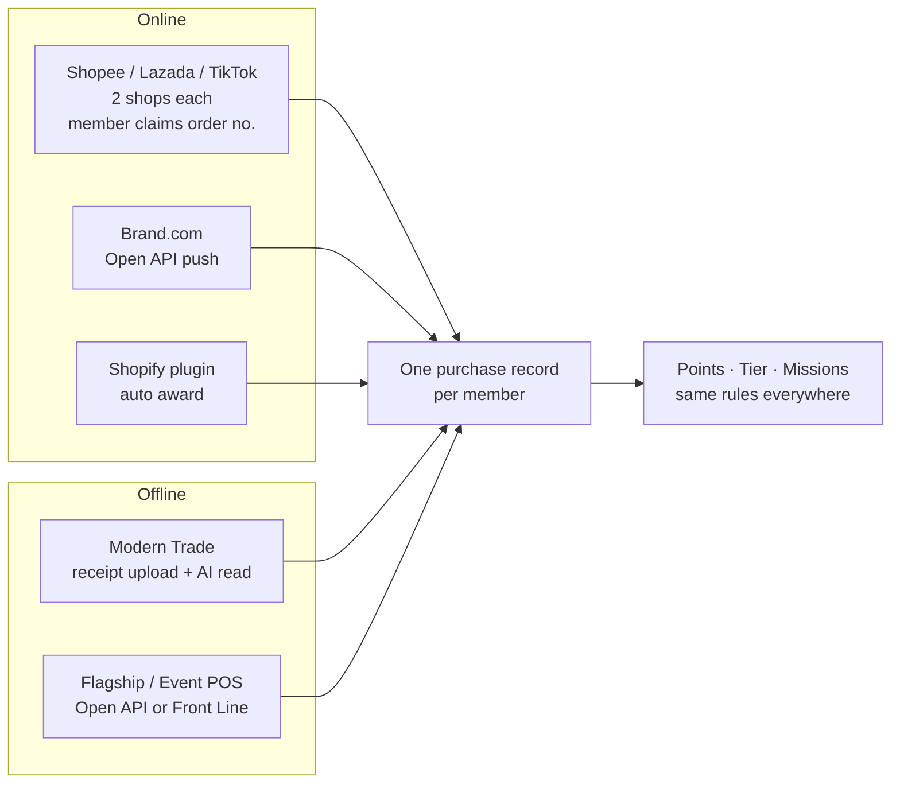
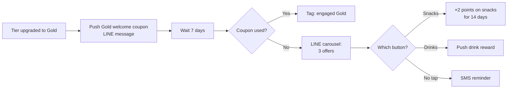

# Product fit — KCG Corporation, KCG Rewards (kcg-202609)

Researcher: proposal-researcher · Brief: product (catalog mode) · Date: 2026-09-29
Inputs: `research/sources.md` (TOR clause IDs + founder directives B-01..B-24), `slides.json`, `requirements/*.md`, `docs/PRODUCT_NARRATIVE.md`, `training/*.md`, live catalog/DB spot checks.

**Fit legend**
- **LIVE**: live as configured. A requirement doc heading describes it and it works without design choices.
- **CONFIG**: live with configuration choices. It works, but we pick a shape, and the shape needs one line in the proposal.
- **PARTIAL**: part of the ask is live; the rest needs a workaround, a service, or a build.
- **NOT**: not supported today.
- **NO-DOC**: claimed in the catalog, slides or founder narrative, but no `requirements/*.md` heading backs it. Don't sell it as live until a human confirms.

Evidence format: `requirements/<Doc>.md#<Heading>` plus the narrative anchor `NARR#<Section > Heading>` (NARR = `docs/PRODUCT_NARRATIVE.md`). Training files are the founder's Thai transcripts in `training/`. Mockup ids are slide ids in `slides.json`. Archive slides, `campaign.*` slides, `*.pricing` slides and `cs.*` slides are excluded.

Journey stages, using the founder's frame (B-13, `training/user-journey.md`): **Join** (Acquire) · **Earn · Burn · Grow** (Basic loyalty) · **Engage & Return** (Deep engagement) · **Analyze** · **Activate / Convert**.

---

## 0. Flags for the parent (read first)

**Not supported**
1. **A/B or percentage split in marketing automation.** No requirement doc mentions it. The founder's own training says it is missing: "สิ่งที่เราขาดคือพวก Advance Feature … AB Testing … อันนี้เรายังไม่มี" (`training/mini-cdp.md`, "สิ่งที่เรายังขาด"). B-09's "split in sending" must be framed as a **condition split** or a **LINE interaction router** (one branch per button tapped), not as a random or percentage split.
2. **Email as a workflow message channel.** Rule-based workflows send LINE and SMS only (`AMP - Rule Based.md#Messaging Provider Integration`: email "not yet implemented"). Email does exist for system notifications (`Notification_Service.md#Concept`).

**No requirement doc, so don't mark live**
3. **Point-of-sale earn by end-of-day pull or emailed daily sales file.** Only the slide `loyalty.basic.pos-earn` and the founder's training describe it. The training calls email the easiest route: "วิธีที่ง่ายที่สุด — ผ่านอีเมลสรุปออเดอร์" (`training/collect-points-method-admin-operations.md`, "ข้อสังเกตเรื่อง POS Integration"). No requirement doc covers ingesting POS email, SFTP or file transfer. The documented shapes are the Open API push (real time) and an ops-run purchase import (`Purchase_Import_System.md#Concept`, which has no admin UI).
4. **Dedicated "Mass Lucky Draw" campaign.** It exists in narrative and catalog only (`NARR#Campaigns > Mass Lucky Draw`). The live database has no lucky-draw engine. TOR 6.3 can still be met with live pieces (see §6).
5. **AI Analysis inside the admin portal.** It exists in narrative and catalog only (`NARR#Marketing Automation > AMP AI Analysis & Recommendations`), and the narrative calls it advisory analysis of workflow and agent performance. The slide `amp.admin.ai-analysis-merchant` promises more than that doc says ("Query membership, campaigns, and loyalty performance…Draft campaigns").
6. **B-11 "The AI will have access to the data that that admin has access to".** The docs say otherwise. External MCP access is authenticated by a **merchant API key**, scoped to the merchant, not to an admin's role (`AMP - AI Decisioning.md#Authentication`, `#Component 1: MCP Server`). The external read tools also cover member context, the action catalog, constraints and campaign performance, not general reporting. Soften the claim or get engineering to confirm.
7. **MAKRO PRO (7.9 / 8.5)** and **LINE OA as a sales channel (7.8)** have no connector doc (see §7).

**Partial**
8. **5.2.1 "แสดงเฉพาะสมาชิกบาง Tier หรือบาง Segment"** ("show only to some tiers or segments"). Mission visibility is gated by **persona** only. A tier filter on a mission condition only limits which purchases count; it does not hide the mission (`Mission.md#Rules`). This is a gap-commit candidate: it is general, an add-on and small.
9. **5.2.2 "ไม่จำกัดจำนวน Campaign"** ("unlimited number of campaigns"). Referral is **one always-on program per merchant**, "not a campaign type and has no schedule" (`Referral.md#Concept`). Also, referral as a *mission condition* doesn't advance in production (`Mission.md#Known gaps`).
10. **5.1.3 Birth Month Coupon.** The live trigger is **birthday (day) with a day offset**. There is no birth-month trigger field (`AMP_Workflows.md#Rules`; the condition contract says `birth_month` is not a real field). Birth-month *eligibility* does exist on rewards, earn rules and spin wheel.
11. **4.3.d "Customer Behavior" as a tier criterion.** Only through the **points** or **tickets** metric. A tier program uses one metric, and mixed criteria (for example, spend AND frequency) aren't supported (`Tier.md#Rules`).
12. **9.3 Data Lake.** The building blocks are live: signed outbound webhook events, CSV exports and Open API reads. There is no native data-lake connector, and the outbound webhook allows one URL per merchant with no replay.
13. **"Active Member" (9.1.c / 9.2).** No named active-member KPI in the fixed report set. It can be built from audiences, RFM or a custom Metabase dashboard.

**Founder claim vs docs**
14. **Shopify plugin slide row** "Tier checkout privileges, e.g. Gold tier free shipping + 5% off all orders" conflicts with `Tier.md#Rules`: "No automatic tier discount on Shopify". Tier perks only come as tier-restricted rewards, per-tier earn/burn rates or entry rewards. Fix the row or confirm with engineering before printing.
15. **Channel-level receipt OCR auto-approve** is fully built but, as of 2026-09-28, is "not switched on for any merchant" (`Receipt_Channel_OCR_Auto_Approve.md`, status line). KCG would be the first production merchant; the manual review queue is the proven path.
16. **TOR 3.4 says Shopify is "Future Integration", and B-01/B-18 make it a headline.** The plugin is live (§10), so it can be offered as ready now.

---

## 1. Fit counts

| Block | LIVE | CONFIG | PARTIAL | NOT | NO-DOC |
|---|---|---|---|---|---|
| 4.1 Member management (11) | 10 | 1 | – | – | – |
| 4.2 Points (10) | 7 | 3 | – | – | – |
| 4.3 Tier (7) | 4 | 2 | 1 | – | – |
| 5 Campaigns (10) | 5 | 3 | 2 | – | – |
| 6 Rewards (5) | 4 | 1 | – | – | – |
| 7 Transaction capture (10) | 4 | 4 | 2 | – | – |
| 8 Integration, brief (6) | 3 | 1 | 2 | – | – |
| 9.1 Reports (12) | 11 | – | 1 | – | – |
| 9.2 Dashboard (9) | 6 | 2 | 1 | – | – |
| 9.3 Data lake (1) | – | – | 1 | – | – |
| Marketing automation + AI (B-08..B-11, 9.4) (11) | 7 | – | 1 | 2 | 1 |
| **Total (92)** | **61** | **17** | **11** | **2** | **1** |

Optional services 10–13 are scored separately in §12 (product support vs service). Items 14, 15, 18 and 19 are notes only (§13).

---

## 2. Earn quadrant: KCG's channels (priority Q1)

The frame comes from `Purchase_Transaction.md#Concept`, `Earn_Channel.md#Concept`, `training/collect-points-methods-intro.md` and `training/collect-points-method-admin-operations.md` ("Two by Two Matrix"). Every channel lands in one purchase record, so earn rules, tier progress and missions react the same way whatever the source. The one rule: **the purchase must carry a member key** (phone, email or external id) to earn.

| | Third-party (brand doesn't own the sale) | First-party (brand owns the sale) |
|---|---|---|
| **Online** | 7.5 Shopee ×2 · 7.6 Lazada ×2 · 7.7 TikTok Shop ×2: **member claims with the order number**. 7.9 MAKRO PRO: closest shape is receipt upload (PARTIAL) | 7.4 Website / Brand.com: **Open API push**, or the **Shopify plugin** if the site is Shopify · 7.10 Shopify: **native plugin** · 7.8 LINE OA: touchpoint, see note |
| **Offline** | 7.2 Modern Trade: **receipt upload with AI reading plus review queue** (option: pack-code scan, Adjacent) | 7.1 Flagship POS · 7.3 Event POS: **Open API push from POS**, or **Front Line** staff entry |

### 7.1 "Flagship Store – POS": CONFIG (stage: Earn)
- **Capability.** The POS pushes each sale to the Open API with the member's phone. Points are queued and awarded automatically. If there's no POS integration, staff use **Front Line** at the counter: look up the member by phone or QR, then enter the bill or points.
- **Why CONFIG.** We choose between an API push (needs the POS vendor, who is unnamed per sources.md ambiguity 12) and Front Line. End-of-day pull and emailed daily file appear on the slide and in training but have **no requirement doc** (flag 3).
- **Evidence.** `Open_API.md#Concept`, `#Integrator journey`; `Frontline_Admin_Actions.md#Staff journey — Front Line`; `Purchase_Transaction.md#Earn and side effects`; NARR#Loyalty > Purchase Transactions.
- **Constraints.**
  - Open API v1 has no public purchase-cancel route; reversals go through admin cancel (`Open_API.md#Known gaps`).
  - Purchase earn is queued; wallet earn and burn are synchronous and use a dedup key.
  - The member key is required.
- **Mockups:** `loyalty.basic.pos-earn`, `loyalty.diagram.earnburn`.
- **Training:** `collect-points-methods-intro.md`, `collect-points-method-admin-operations.md`, `frontline.md`.

### 7.2 "Modern Trade": CONFIG (stage: Earn)
- **Capability.**
  - The member photographs the receipt in LINE.
  - AI reads it, identifies the chain (Makro, Lotus's, Big C… held as a store-channel attribute) and keeps only KCG product lines on the allow-list.
  - Auto-approve happens only when every check passes. Anything else goes to the admin review queue with plain-language reasons.
  - Eligible amount = the allow-listed lines, and earn rules apply to that amount.
- **Why CONFIG.** The manual queue is proven. Channel OCR auto-approve is built but not yet switched on for any merchant (flag 15). The per-chain SKU allow-list has to be built during implementation.
- **Evidence.** `Receipt_Upload_Earning.md#Concept`, `#Rules`; `Receipt_Channel_OCR_Auto_Approve.md#Concept`, `#Auto-approve decision`, `#Eligible amount`; `Store_Attribute_Classification.md#Concept`; NARR#Loyalty > Purchase Transactions.
- **Constraints.**
  - Duplicate receipt numbers are blocked (duplicate check = receipt number + sales channel).
  - Purchase date = the date printed on the receipt.
  - Default cap is 15 images per member per day.
  - Gaps in the allow-list silently reduce the eligible amount.
  - Cancelling an approved receipt reverses the points.
  - Receipt purchases don't drive referral (`Receipt_Channel_OCR_Auto_Approve.md#Known gaps`).
- **Mockups:** `loyalty.basic.upload-receipt`.
- **Training:** `collect-points-methods-intro.md`, `collect-points-method-admin-operations.md`.

### 7.3 "Event – POS": CONFIG (stage: Earn)
- **Capability.** Same two paths as 7.1. At booths, **Front Line** on a phone is the practical default: sign up a walk-in, record the purchase, push a welcome reward. **Event promotions** add event-scoped freebies and bill discounts (Adjacent A6).
- **Evidence.** `Frontline_Admin_Actions.md#Staff journey — Front Line`; `Event_Promotion.md#Concept`, `#Rules`.
- **Constraints.** Event promos are mapped per event or activity group; claim limits apply per rule.
- **Mockups:** `loyalty.basic.pos-earn`.
- **Training:** `frontline.md`.

### 7.4 "Website / Brand.com": CONFIG (stage: Earn / Convert)
- **Capability.** If Brand.com is Shopify, use the plugin (§10). Otherwise the site posts each order to the Open API, matched by phone or email, and points are awarded automatically.
- **Why CONFIG.** It depends on the platform (sources.md ambiguity 1).
- **Evidence.** `Open_API.md#Concept`; `Shopify.md#Orders, points, and refunds`; NARR#Loyalty > Purchase Transactions.
- **Mockups:** `loyalty.basic.brand-com-earn` (shows the per-channel rate: marketplace 100 THB = 1 pt vs own store 80 THB = 1 pt, "+25% points").
- **Training:** `collect-points-methods-intro.md`.

### 7.5–7.7 "Shopee จำนวน 2 Accounts" / "Lazada จำนวน 2 Accounts" / "TikTok Shop จำนวน 2 Accounts": LIVE (stage: Earn, the move from third-party to first-party)
- **Capability.**
  - Each shop connects to Rocket separately by marketplace login (OAuth), so two shops per platform are simply two connections. Each shop keeps its own credentials, batching and throttling.
  - The member types the marketplace order number in LINE. The order is verified against the shop, and points are awarded once the order reaches the status the brand chooses.
  - Orders from before go-live can be backfilled.
- **Why LIVE.** Multi-shop is proven in production: one merchant runs 29 Shopee, 16 Lazada and 11 TikTok shops.
- **Evidence.** `Marketplace.md#Concept`, `#Rules`, `#Member journey`; NARR#Loyalty > Purchase Transactions.
- **Constraints.**
  - Claims are member-initiated; SEA marketplaces don't auto-award.
  - The claim status threshold is set per platform ("delivered" recommended) and can't be edited later in the admin UI.
  - A refund after a claim is not auto-reversed; ops cancels the purchase.
  - A one-tap "claim my later orders" list is planned (backend live, member UI not).
- **Mockups:** `loyalty.basic.marketplace-earn`, `loyalty.perfectcustomerjourney1`.
- **Training:** `collect-points-methods-intro.md`, `collect-points-method-admin-operations.md`.

### 7.8 "LINE Official Account": PARTIAL (stage: Join / Activate; Earn only if orders exist)
- **Capability.** LINE OA is the member's home: rich menu → LINE login (LIFF) → member app, plus LINE messaging and notifications.
- **Why PARTIAL.** If KCG takes orders inside LINE (chat, LINE MyShop), no requirement doc covers a connector. The shape would be Open API push from their order tool, or Front Line manual entry.
- **Evidence.** `Signup_Login.md#Concept`; `AMP_Workflows.md#Targeted broadcast (one-shot LINE send)`; NARR#Platform > Authentication & Signup.
- **Mockups:** `loyalty.basic.signup`, `loyalty.basic.home`, `loyalty.high-level-flow`.
- **Training:** `signup-form-new.md`, `user-journey.md`.

### 7.9 "MAKRO PRO": PARTIAL (stage: Earn)
- **Capability.** There's no Makro PRO connector doc. The closest live shape is receipt or tax-invoice upload with AI reading and Makro as a sales channel (7.2). Ops purchase import is possible only if KCG's seller export carries a buyer phone.
- **Why PARTIAL.** Makro PRO buyers are largely B2B/wholesale, so matching buyers to members is unclear (sources.md ambiguity 13).
- **Evidence.** `Receipt_Channel_OCR_Auto_Approve.md#Concept`; `Purchase_Import_System.md#Concept`, `#Known gaps` (no admin UI).
- **Training:** `collect-points-methods-intro.md`.

### 7.10 "Future Channel / Shopify": LIVE (stage: Convert)
- **Detail:** §10.
- **Evidence.** `Shopify.md#Concept`.
- **Mockups:** `loyalty.basic.shopify-plugin`, `loyalty.basic.shopify-loyalty-widget`, `loyalty.line-shopify-flow`.
- **Training:** `shopify-intro.md`.

### Earn display (supporting)
The member sees one "how to earn" sheet listing every channel. Custom display-only entries are allowed (for example, "buy at the booth, give your phone number at the till").
- **Evidence.** `Earn_Channel.md#Concept`.
- **Mockups:** `loyalty.basic.home`.
- **Training:** `earn-channels-display.md`.

---

## 3. Member management 4.1 (priority Q12)

Stage: **Join**. Evidence for all rows: `Signup_Login.md#Concept`, `#Rules`, `#Member journey`; NARR#Platform > Authentication & Signup.

| TOR (verbatim) | Fit | Capability · evidence |
|---|---|---|
| "Member Registration" | LIVE | LINE rich menu → LINE login → phone OTP → profile form (default and custom fields, persona, consent). The account is created before the form, so members who drop out can still be reached (`Signup_Login.md#Concept`) |
| "Member Login ด้วย Mobile Phone Number" | LIVE | Phone plus 6-digit OTP (10 min, 3 attempts), numbers normalized to +66; LINE-only re-login after that (`Signup_Login.md#Rules`) |
| "Member Profile" | LIVE | Member edits their profile; admin edits in Customer 360 with per-field editability (`Frontline_Admin_Actions.md#4. Edit Member Profile`; `Forms.md#Default fields`, `#Custom fields (USER_PROFILE)`) |
| "Member Status" | LIVE | Tier status, plus account freeze (shown as `suspended` in the API) (`Member_Freeze.md#Concept`, `#Rules`; `Tier.md#Member journey`) |
| "Member Activity" | LIVE | Customer 360 timeline, mission progress, wallet history (`Frontline_Admin_Actions.md#Admin journey — Customer 360`) |
| "Member Transaction History" | LIVE | Purchases across all channels in one list: member purchase-history drawer and admin purchase search (`Purchase_Transaction.md#Journeys`) |
| "Point Balance" | LIVE | Balance plus soonest-expiring lots (`Currency.md#Wallet write and balances`, `#Member journey`) |
| "Coupon / Reward History" | LIVE | My Rewards wallet: redeemed, used and expired (`Reward.md#Member journey`) |
| "Member Consent" | LIVE | Consent documents (notice / required / optional); re-prompt on a new version; append-only ledger (`Consent.md#Concept`, `#Rules`); NARR#Loyalty > PDPA Consent |
| "Member Communication Preference" | LIVE | Channel opt-ins (LINE, SMS, email, push) and topics (`Consent.md#Concept`; `Forms.md#Consent and channels (profile template)`) |
| 4.1-P1 "Sync ข้อมูลสมาชิกกับ LINE Current KCG" ("sync member data with KCG's current LINE") | CONFIG | Signup runs on KCG's own LINE OA. Existing members are brought in by bulk member import (match on phone / LINE id / email / external id / member code; migration or ongoing mode; opening point balance). Targeted broadcast can reach LINE friends who aren't members yet. The choice is migration vs ongoing sync (`Customer_Import_System.md#Import modes`, `#Match keys`; `AMP_Workflows.md#Targeted broadcast (one-shot LINE send)`) |

- **Constraints.**
  - Email and social logins are not offered, by design (`Signup_Login.md#Concept`).
  - Member import has an admin UI with permission gates (`Customer_Import_System.md#Permissions (admin)`).
- **Mockups:** `loyalty.basic.signup`, `loyalty.basic.profile`, `loyalty.basic.home`, `loyalty.admin.signup-form`, `loyalty.reports.customer-360`.
- **Training:** `signup-form-new.md`, `consent-form.md`, `customer-360.md`, `persona-ecosystem.md`.

---

## 4. Points 4.2 (priority Q2)

Stage: **Earn · Burn**. Evidence base: `Currency.md#Concept`, `#Rules`; NARR#Loyalty > Currency.

| TOR (verbatim) | Fit | Capability · evidence |
|---|---|---|
| "Loyalty Program ภายใต้ 1 Brand คือ KCG / ชื่อ Loyalty Program: KCG Rewards" ("one brand, KCG; program name KCG Rewards") | LIVE | Single-merchant program with its own branding (`Display_Settings.md`; `Translation_System.md` TH/EN) |
| "รองรับ Point Currency เดียว" ("supports a single point currency") | LIVE | One points currency. Tickets are a separate, optional currency (`Currency.md#Concept`) |
| "Point Earning" | LIVE | Earn rules: base rate plus conditions on product, store/channel attribute, tier, persona, birth month and time windows (`Currency.md#Calculation (purchases and routed sources)`) |
| "Point Redemption" | LIVE | Reward catalog priced in points, FIFO burn from the soonest-expiring lots (`Currency.md#Deduction order (FIFO)`; `Reward.md#Concept`) |
| "Point Adjustment" | LIVE | Manual add/deduct with a reason from Customer 360 or Front Line, audit-logged (`Frontline_Admin_Actions.md#1. Adjust Currency`) |
| "Bonus Point" | CONFIG | Mapped to **multipliers** (for example ×2 on a SKU, a channel or a time window) and **personalized earn factors** (private offers). Multipliers add, they don't compound. Stackable groups (`Currency.md#Calculation (purchases and routed sources)`) |
| "Extra Point" | CONFIG | Mapped to **outcome awards**: points from missions, check-in, lifecycle triggers, workflows or AI decisioning (`Currency.md#Concept`; `Mission.md#Concept`). TOR 6.2 "Extra Points from Mission" supports this reading (sources.md ambiguity 6) |
| "Point Expiration" | LIVE | None / rolling N months / fixed schedule with a minimum period; FIFO; expiry reminders on LINE (`Currency.md#Expiry`; `Notification_Service.md#Concept`) |
| "Point Reversal" | CONFIG | Proportional reversal from the original award rows on refund or cancel (`Currency.md#Reversal and refunds`; `Purchase_Transaction.md#Refunds and admin cancel`). CONFIG because the reversal route depends on the channel: Shopify refunds auto-reverse; POS/API purchases reverse through admin cancel (no public cancel route in API v1); marketplace refunds need an ops cancel |
| "Point Transaction History" | LIVE | Ledger by source type, member-side and in Customer 360 (`Currency.md#Member journey`) |
| 4.2-P3 "อัตราการแลกยอดซื้อเป็นคะแนน … ต้องสามารถปรับเปลี่ยนเงื่อนไข" ("the spend-to-points rate … must be adjustable") | LIVE | Admin-editable rate; changes apply to new purchases (`Currency.md#Configuration and inheritance`) |

- **Constraints.** An award delay can hold points until the return window closes (`Currency.md#Award timing and cancellation`).
- **Mockups:** `loyalty.admin.basic-earn`, `loyalty.admin.earn-studio`, `loyalty.diagram.earnburn`, `loyalty.reports.points-liability`, `loyalty.basic.brand-com-earn`.
- **Training:** `earn-rule-core.md`, `earn-rule-semi-technical.md`, `point-expiry-delay-core.md`, `fifo-logic.md`.

---

## 5. Tier 4.3 (priority Q3)

Stage: **Grow**. Evidence base: `Tier.md#Concept`, `#Rules`; NARR#Loyalty > Tiers.

| TOR (verbatim) | Fit | How |
|---|---|---|
| 4.3-P1 "แบ่งสมาชิกเป็น Tier และสามารถกำหนดเงื่อนไขของแต่ละ Tier" ("split members into tiers with conditions per tier") | LIVE | Any number of tiers with a threshold each; rolling or calendar window; upgrade immediately or at month end; maintain for life or per period |
| "Spending" | LIVE | **Sales** metric (Growth package or above) |
| "Purchase Frequency" | LIVE | **Orders count** metric |
| "Transaction" | LIVE | The same orders-count metric. Frequency and transaction collapse into one metric; say so |
| "Customer Behavior" | PARTIAL | Only through the **points** metric (points from campaigns and activities count toward tier) or the **tickets** metric. No free-form behavior score |
| "Campaign Participation" | CONFIG | **Tickets** metric (award a ticket per mission, check-in or survey completed), or points earned from campaigns |
| 4.3-P2 "กำหนดสิทธิประโยชน์และ Campaign ที่แตกต่างกันในแต่ละ Tier" ("different benefits and campaigns per tier") | CONFIG | Per-tier earn rate or multiplier; per-tier burn override; tier-eligible rewards and dynamic points price; tier entry rewards; tier eligibility on spin wheel. Missions gate by persona, not tier (flag 8) (`Tier.md#Entry rewards`; `Reward.md#Rules`; `Spin_Wheel.md#Rules`) |

- **Constraints.**
  - **One metric per tier program.** Mixing (spend AND frequency) isn't supported; custom evaluation is beta.
  - There is no separate "maintain" threshold.
  - Benefits come only through the levers above.
  - No automatic tier discount on Shopify (`Tier.md#Rules`).
- **Mockups:** `loyalty.basic.tiers`, `loyalty.admin.tier-settings`.
- **Training:** `tier.md`, `persona-ecosystem.md`.

---

## 6. Campaigns 5 and Rewards 6 (priority Q4–Q6)

Stages: **Engage & Return** (campaigns) and **Burn** (rewards). 5-P1 "สร้างและบริหาร Campaign ได้ด้วยตนเอง โดยไม่จำเป็นต้องพัฒนาระบบใหม่ทุกครั้ง" ("create and manage campaigns yourself, without new development each time") is **LIVE**: every mechanic below is admin-configured (NARR#Admin Portal & Reports > Admin Portal — Configuration Surfaces).

### Basic 5.1

| TOR (verbatim) | Fit | Capability · evidence · constraint |
|---|---|---|
| "Automated Welcome Coupon" | LIVE | Lifecycle automation on the **signup** trigger → push a reward (`AMP_Workflows.md#Entry types`; catalog `signup_outcomes` ga). NARR#Marketing Automation > AMP Workflows |
| "Automated Up-Tier Coupon" | LIVE | **Tier upgraded** trigger (optionally a specific target tier) → push a reward. Alternative: tier **entry rewards** (`Tier.md#Entry rewards`) |
| "Automated Birth Month Coupon" | CONFIG | **Birthday** trigger (daily run, day offset, for example −7 days) → push a reward with a use window of about a month. No birth-month trigger (flag 10). For a birth-month *points* boost: earn condition on birth month (`Currency.md#Calculation (purchases and routed sources)`) |
| "Point Redemption Campaign" | CONFIG | A catalog reward with a redemption window, tier/persona/tag eligibility, per-user and global quotas, and dynamic points price (`Reward.md#Rules`); NARR#Loyalty > Rewards |
| "Privilege Campaign" | CONFIG | Campaign-visibility rewards pushed to an audience or tier via push, claim link or QR; or tier-eligible rewards (`Reward.md#Concept`, `#Admin journey`) |
| 5.1-P1 "กำหนด Target Audience, ระยะเวลา, เงื่อนไข, สิทธิประโยชน์ และจำนวนสิทธิ์" ("set target audience, period, conditions, benefit and number of entitlements") | LIVE | Audience = tier / persona / tag / birth month / saved audience; window start and end; quotas per user and global per period (`Reward.md#Rules`; `AMP_Workflows.md#Audience types`) |

- **Reward constraints.**
  - Stock control is partial (quota by transaction limits; no total-stock field yet) (`Reward.md#Known gaps`).
  - Promo-code pools are imported per partner.
- **Mockups:** `loyalty.admin.lifecycle-automation`, `loyalty.admin.rewards`, `loyalty.basic.rewards`, `loyalty.basic.rewards-screens`, `loyalty.core.coupon-claim`, `loyalty.core.coupon-redeem`.
- **Training:** `lifecycle-automation-full.md`, `reward1.md`, `reward2.md`.

### Advanced 5.2

| TOR (verbatim) | Fit | Capability · evidence · constraint |
|---|---|---|
| 5.2.1 "Mission – Spending / … แสดงเฉพาะสมาชิกบาง Tier หรือบาง Segment" ("show only to some tiers or segments") | PARTIAL | Spend or count missions with product, store and bill filters; standard or milestone; auto or manual join and claim; progress and claim limits (`Mission.md#Concept`, `#Rules`). **Visibility is by persona / persona group only.** A tier filter on the condition limits which purchases count, not who sees the mission. Workaround: a workflow assigns a persona to the segment. That is heavy-handed because persona is a member's identity; tier/segment visibility is a small build (gap-commit candidate) |
| 5.2.2 "Mission – Friend Get Friend / … ไม่จำกัดจำนวน Campaign" ("unlimited number of campaigns") | PARTIAL | **One always-on referral program**: the friend applies the member's code at signup (live on LINE); rewards for both sides; fraud withholding. Purchase-conversion referral is Shopify-centric (`Referral.md#Concept`, `#Signup`, `#Purchase`, `#Fraud and withholding`); NARR#Campaigns > Referral. It isn't N campaigns, and the referral mission condition doesn't advance (`Mission.md#Known gaps`). Frame as "always-on friend-get-friend, with rewards the brand can change any time" |
| 5.2.3 "Mission – Survey / สร้าง Survey และกำหนดเงื่อนไขหรือ Reward" ("create a survey and set conditions or a reward") | LIVE | **Surveys** (Forms): fields, conditions, submission limits, completion reward in points or tickets, survey report; workflows can react to answers (`Forms.md#Surveys`); NARR#Loyalty > Forms. Deliver as a survey, not as a mission condition (form condition doesn't advance, `Mission.md#Known gaps`) |

- **Mockups:** `loyalty.campaigns.missions`, `loyalty.admin.missions`, `loyalty.campaigns.referral`, `loyalty.campaigns.survey`, `loyalty.admin.survey`.
- **Training:** `mission.md`, `referral.md`, `survey.md`, `hierarchy-building-blocks.md` (Action / Condition / Outcome).

### Rewards 6

| TOR (verbatim) | Fit | Capability · evidence · constraint |
|---|---|---|
| "E-Coupon" | LIVE | Digital reward with a code slip: code pool per partner or a static code; use window (absolute or relative); used at the counter, via Front Line mark-used, or online (`Reward.md#Concept`, `#Rules`) |
| "Extra Points from Mission" | LIVE | Mission outcome = award points (`Mission.md#Concept`) |
| "Lucky Draw" | CONFIG | Live pieces: a **tickets** currency (raffle-type ticket earned from purchases, missions or check-in) as draw entries, exported for an offline draw; or a points-priced "entry" reward (digital, or a **printed slip** at Front Line) (`Currency.md#Admin journey` step 5; `Reward.md#Concept`, fulfillment `printed`). The dedicated Mass Lucky Draw page is NO-DOC (flag 4) |
| "Merchandise" | LIVE | Fulfillment by shipping (address captured at redeem) or store pickup (`Reward.md#Concept`). Sourcing >2,000 SKUs is an operational service (`Reward.md#Partner reward sourcing (operational service)`) |
| 6-P1 "กำหนดเงื่อนไขการได้รับสิทธิ์ วันเริ่มต้น วันสิ้นสุด จำนวนสิทธิ์ และ Target Audience" ("set eligibility, start date, end date, number of entitlements and target audience") | LIVE | Same controls as 5.1-P1 |

- **Mockups:** `loyalty.basic.rewards`, `loyalty.basic.rewards-screens`, `loyalty.admin.rewards`, `loyalty.campaigns.luckydraw`, `loyalty.raas.strategy-pillars`, `loyalty.raas.operation-flow`, `loyalty.raas.sku-breadth`, `loyalty.raas.categories`.
- **Training:** `reward1.md`, `reward2.md`.

---

## 7. Reports, Customer 360, segments, RFM, data lake (priority Q7)

Stage: **Analyze**. Evidence base: `Analytics.md#Concept`, `#Admin journey`; NARR#Admin Portal & Reports > Reports — What the Brand Sees Back. Catalog: "More than 30 reports". Every report has date filters, row drill-down and an **email CSV export of up to 200,000 rows** (`Analytics.md#Rules`).

### 9.1 Standard reports ("ไม่น้อยกว่า 10 Reports", "at least 10 reports"): LIVE, well above 10

| TOR report | Fit | Rocket report |
|---|---|---|
| Member Report | LIVE | Members: overview (sign-up trend, gender/age, profile completion, cohort retention) |
| New Member | LIVE | Members: acquisition (by source); Home KPI "members added" |
| Active Member | PARTIAL | No named KPI. Build from a dynamic audience ("purchased in last N days"), RFM segments, or a custom dashboard (`AMP_Workflows.md#Audience types`; `RFM_Scoring.md#Concept`; `Analytics.md#Concept` "Analytics dashboards") |
| Transaction | LIVE | Purchases: orders |
| Sales | LIVE | Purchases: net sales, average order value and buyers, by store, channel and product |
| Point Earn / Point Burn / Point Balance | LIVE ×3 | Points: overview, monthly movement (opening / earned / burned / expired / closing by tier), snapshot and liability |
| Campaign Performance | LIVE | Mission reports (`Mission.md#System`), marketing campaign ROI, funnel, workflow node analytics (`AMP_Workflows.md#Node stats and engagement`), survey report |
| Reward | LIVE | Redemptions report, per reward |
| Coupon Redemption | LIVE | Redemptions: redeemed vs used; code status |

### 9.2 Dashboard
- **LIVE:** Member Growth, Sales, Transaction, Average Spending (AOV), Point Earn, Burn. Source: Executive overview plus the Home KPI strip.
- **CONFIG:** Campaign Performance (sits in campaign reports, not on the exec page); Redemption Rate (redeemers ÷ members from Home KPIs, or a custom dashboard).
- **PARTIAL:** Active Member (as in 9.1).

### Customer 360 (supports 1.9, 4.1)
- **What it shows:** profile, tier, points and lots, purchases across channels, RFM, timeline, staff notes. Staff can edit, adjust points or tier, unlink LINE, or freeze the account.
- **Evidence:** `Frontline_Admin_Actions.md#Admin journey — Customer 360`.

### Segments and RFM (supports 1-P1b, 1.6)
- **Audiences:** dynamic, static or imported. Each has per-audience analytics (size, purchase rate, average order, wallet) and feeds broadcasts, workflows and AI agents (`AMP_Workflows.md#Audience types`, `#Audience membership`).
- **RFM:** scores in daily quintiles with a segment map; usable in audiences, workflows and Customer 360 (`RFM_Scoring.md#Concept`, `#Rules`).
- **Tags & Personas:** NARR#Loyalty > Tags & Personas.

### 9.3 "ส่งต่อหรือเชื่อมโยงข้อมูลไปยัง Data Lake ของบริษัทฯ ได้ตาม Data Architecture ที่บริษัทฯ กำหนด" ("forward or link data to the company's Data Lake per the company's data architecture"): PARTIAL
- **Live pieces:**
  - Signed outbound webhook of member and loyalty events plus a member snapshot. Documented in `Outbound_Integrations.md`, which is indexed in the Knowledge base but not in the local `requirements/` tree; `Shopify.md#Outbound delivery (custom webhook + Klaviyo)` also covers it.
  - Scheduled or manual CSV exports (`Customer_Export.md`; `Analytics.md#Rules`).
  - Open API reads.
- **Limits:** outbound webhook v1 allows one URL per merchant, with no replay or backfill. No native warehouse connector.
- **For the proposal:** keep it to "we deliver to your lake by event stream and scheduled extract per your architecture" (founder asked for no technical depth). The rest is implementation scope.

- **Mockups:** `loyalty.reports.control-center`, `loyalty.reports.members`, `loyalty.reports.customer-360`, `loyalty.reports.transactions`, `loyalty.reports.points-liability`, `loyalty.reports.rewards-redemption`, `loyalty.reports.rfm`, `amp.admin.audience-builder`, `loyalty.admin.personas`.
- **Training:** `dashboard.md`, `customer-360.md`, `mini-cdp.md`, `segment-broadcast.md`, `persona-ecosystem.md`.

---

## 8. Marketing automation (priority Q8)

Stage: **Activate / Convert**. This is the founder's core thesis (B-07, B-15): activation is the "fabric" that moves members from one stage to the next. TOR has no mandatory MA clause (sources.md ambiguity 3); the closest hooks are 1-P1b "Personalized Marketing", 1.6, and 5.1 "Automated … Coupon".

Evidence base: `AMP_Workflows.md#Concept`, `#Rules`, `#Journeys`; `AMP - Rule Based.md#Node Types`, `#Engagement Tracking (Link Clicks & Page Engagement) — Live 2026-07-05`, `#Messaging Provider Integration`; NARR#Marketing Automation > AMP Workflows.

| Element (B-09) | Fit | Detail |
|---|---|---|
| Triggers / entry | LIVE | Lifecycle events (signup, tier up/down, birthday, anniversary); data changes (purchase, points, and so on); audience entry; manual batch; schedule (`AMP_Workflows.md#Entry types`, `#Batch and scheduled dispatch`) |
| Time delay | LIVE | Minutes up to months (`training/mca-workflow.md` "Time Delay") |
| Condition split, including after a delay | LIVE | True/false branch on loyalty data. Admin guidance is to put a delay *before* a split so members have time to act (`AMP_Workflows.md#Condition evaluation (shared semantics)`) |
| Split on interaction | LIVE | (a) **LINE interaction router**: one branch per carousel button tapped. (b) **Engagement split**: clicked a link, time on page, scroll depth (live 2026-07-06, split only). LINE per-message open/delivery tracking was descoped |
| "Split in sending" as A/B or percentage | **NOT** | Flag 1 |
| Loyalty actions | LIVE | Award points or tickets; push reward; tag; persona; earn factor (for example ×5 if they buy within 30 days); audience add/remove; webhook |
| Channels | LIVE: LINE, SMS · **NOT: email** | LINE push (Flex / rich content from the content library), SMS. Email isn't a workflow channel (flag 2) |
| Targeted broadcast | LIVE | One-shot LINE send to a segment, all friends, or non-member friends (`AMP_Workflows.md#Targeted broadcast (one-shot LINE send)`) |

**Example to use (B-09).** This matches the founder's own training example in `training/mca-workflow.md`, "Assign Tag":

- **Mockups:** `amp.admin.rules-builder`, `amp.admin.audience-builder`, `loyalty.admin.lifecycle-automation`, `loyalty.high-level-flow`, `loyalty.perfectcustomerjourney2`.
- **Training:** `mca-workflow.md`, `lifecycle-automation-full.md`, `segment-broadcast.md`, `content.md`, `user-journey.md` ("Marketing Automation แบบ Rule Base และข้อจำกัด", rule-based marketing automation and its limits).

### AI decisioning (B-08, B-10, B-12; TOR 9.4 "Agentic AI – Optional"): LIVE
- **Capability.**
  - The brand sets a **goal** (re-engage, drive purchase, redeem points, tier upgrade, win back, upsell), a tone, the **allowed actions**, and **guardrails**.
  - Guardrails cover actions, points, tickets, messages and cost per member or per agent per day/week/month, plus cooldown, quiet hours and blackout dates.
  - On each member event the agent chooses **Act / Wait / Skip**. It is designed to mostly wait: roughly 15–20% act, 60–70% wait, 10–20% skip.
  - It keeps a deliberation history and tracks outcome attribution.
  - The agent lives as a node inside a workflow. Its actions are the same loyalty and messaging actions (LINE, SMS).
- **Evidence.** `AMP - AI Decisioning.md#How It Works`, `#Component 5: Goal & Objective Configuration`, `#Component 6: Constraint Configuration`, `#Two-Layer Enforcement`, `#Component 8: Deliberation Loop (Observe-Wait-Act)`, `#Outcome Attribution & Performance Tracking`; NARR#Marketing Automation > AMP AI Decisioning. Catalog `marketing_automation.ai_decisioning.agent` ga.
- **Constraints.** The agent node runs on the merchant's own model key ("merchant brings its own model key", `AMP_Workflows.md#Concept`). This is a pricing and commercial point.
- **Mockups:** `amp.admin.decisioning-agent`, `loyalty.perfectcustomerjourney3`, `loyalty.ai-journey-force`.
- **Training:** `user-journey.md` ("AI Decision", "ทำไมการ Act ถึงสำคัญ: กฎของ Newton" — why acting matters: Newton's law, "จุดต่างจากคู่แข่ง" — how we differ from competitors).

---

## 9. AI for analysis (priority Q9; B-11, B-17)

**What the docs support**
- **External MCP.** A merchant can connect external AI clients (n8n, Claude Desktop) using a merchant API key. The server "validates key, resolves merchant, scopes all queries/actions". Read tools cover member context, the merchant action catalog, constraints and campaign performance; action tools cover the loyalty actions.
  - Evidence: `AMP - AI Decisioning.md#Internal (AMP) vs External (n8n)`, `#Component 1: MCP Server (`crm-loyalty-actions`)`, `#Read Tools (context for AI)`, `#Authentication`.
  - Fit vs B-11: **PARTIAL**. It is merchant-wide, not "the data that that admin has access to", and it isn't a general reporting Q&A surface.
- **In-portal AI analysis.** Only the narrative covers it: advisory analysis of workflow and agent results with ranked recommendations that a human applies (NARR#Marketing Automation > AMP AI Analysis & Recommendations). The catalog marks it ga, but there is no `requirements/*.md` heading. **NO-DOC.**
- **ChatGPT.** B-11 names ChatGPT as an MCP client; the docs name n8n and Claude Desktop. Keep "Claude or ChatGPT" only if engineering confirms.

**What the founder claims (B-11):** "admin can ask a question of our AI on the portal or install our MCP and ask in their own AI environment (for example, Claude or ChatGPT). The AI will have access to the data that that admin has access to".

**Safe wording for writers:** "Ask questions about your program in plain language, in the portal or from your own AI assistant through Rocket's secure connector, and get recommendations your team can apply." Hold back the per-admin data-scope sentence until engineering confirms.

- **Mockups:** `amp.admin.ai-analysis-merchant` (it over-claims; see flag 5), `loyalty.perfectcustomerjourney3`.
- **Training:** `user-journey.md` ("AI ของเรา: ไม่ใช่แค่ Analyze แต่ Action ได้" — our AI doesn't just analyze, it acts).

---

## 10. Shopify plugin (priority Q10; B-18, B-20; TOR 7.10 / 8.6 "Future Integration")

Stage: **Convert**: the second order lands on the brand's own store, one wallet across LINE and the storefront.

Evidence: `Shopify.md#Concept`, `#Orders, points, and refunds`, `#Storefront identity and composition`, `#Rewards and commerce write-back`, `#Referrals on Shopify`; NARR#Buyer Story; catalog `shopify_orders`, `shopify_widget` and `shopify_burn` ga.

Slide `loyalty.basic.shopify-plugin` in full:
- Heading: "Rocket — Thailand's only Shopify native loyalty plugin"
- Description: "Standard order sync brings Shopify into your loyalty program. The Rocket plug-in brings your loyalty program into Shopify."

| Group | Row | Order sync | Rocket Shopify plugin |
|---|---|---|---|
| Earn | Shopify purchase → points | yes | yes |
| Earn | Off-Shopify purchase → points | yes | yes |
| Earn | Advanced earn rules, e.g. higher rate for Shopify vs other channels, multiplier for some SKUs | maybe | yes |
| See | Loyalty program app on Shopify as a widget | no | yes |
| See | See points on Shopify (product page, account, thank-you page) | no | yes |
| Burn | Spend points on the Shopify store for discounts | no | yes |
| Burn | Redeem rewards (on or off Shopify) and convert to discounts | no | yes |
| Burn | Tier checkout privileges, e.g. Gold tier free shipping + 5% off all orders | no | yes |
| Refer | Members refer friends to purchase on Shopify | no | yes |
| Operations | Manage loyalty from both Shopify admin and the standalone portal | no | yes |
| Operations | No custom integration work | no | yes |

- **Fit.** LIVE for every row except **"Tier checkout privileges … 5% off all orders"**, which conflicts with `Tier.md#Rules` (flag 14). Safe rewording: "Tier-only rewards and higher tier earn/burn rates at checkout".
- **Planned items, don't sell:** checkout points estimate; customer-create link (`Shopify.md#Known gaps`).
- **Mockups:** `loyalty.basic.shopify-plugin`, `loyalty.basic.shopify-loyalty-widget`, `loyalty.line-shopify-flow`, `loyalty.perfectcustomerjourney1`.
- **Training:** `shopify-intro.md`.

---

## 11. Why-Rocket support (B-19..B-22), product facts only

- **End to end, from third-party acquisition to first-party conversion.** Buyer Story: "first order comes from them; second order comes from Rocket" (NARR#Buyer Story). The pieces are marketplace claim → LINE membership → campaigns → workflows and AI → Shopify plugin.
  - Mockups: `company.differentiation`, `loyalty.diagram.modularity`, `loyalty.high-level-flow`.
- **B-22 "stack of the future…national level concurrency".** Leave out technical parts (B-04). If it's needed, one line under volumes (§13).

---

## 12. Optional services 10–13 (priority Q11)

| Clause (verbatim) | Product support | Fit | Evidence / note |
|---|---|---|---|
| 10 BPO: "Campaign Setup", "Survey Setup", "Report Management", "Update New SKU", "Manage / Operate Loyalty Platform", "Upload และ Setup E-Coupon Code", "Setup และ Edit Campaign" | Every task is an admin-portal action: campaigns, surveys, reports and exports, product/SKU master, promo-code import | Service, with product support LIVE | No requirement doc for BPO as a service; it's a staffing offer (founder B-23 "dedicated … strategist, free graphic"). Note 10-P1 excludes copywriting and digital assets, so B-23's "free graphic" is a differentiator (sources.md §9 tensions). Training: `collect-points-method-admin-operations.md` (setup vs operate) |
| 11 Receipt Approval: "Check and Approve Receipt", "Build Transaction Record", "Build Point Record", "Upload Transaction Record เข้าสู่ระบบ" ("upload transaction records into the system") | AI reading plus auto-approve takes the clean receipts; our team works the review queue. An approved receipt *is* the transaction and point record, with no separate "build" step. Bulk historical upload = ops purchase import | LIVE product + service | `Receipt_Channel_OCR_Auto_Approve.md#Merchant admin journey — daily review`; `Receipt_Upload_Earning.md#Admin journey`; `Purchase_Import_System.md#Concept`. 11-P1 asks for a fee and an SLA; the auto-approve share lowers staffing cost (flag 15: first production switch-on) |
| 12 Loyalty Consultation: 12.1 "North-star Metrics / Member Health Scorecard / … Reporting / Monthly Executive Presentation / Quarterly Strategy Refresh"; 12.2 strategy and campaign-planning items | Reports, RFM health, audiences and AI analysis feed the scorecards | Service | No requirement doc (a service). The data comes from §7. Training: `structuring-thoughts-expression.md`, `pain-point.md`, `user-journey.md` |
| 13 Privilege Acquisition: "ร้านอาหาร / เครื่องดื่ม / Fuel / Shopping / Lifestyle / Entertainment / Other Privileges" (restaurants / drinks / …) | Partner reward sourcing: Rocket-managed catalog (e-vouchers, physical goods), pay per redemption | Service, with product support LIVE | `Reward.md#Partner reward sourcing (operational service)`. Mockups: `loyalty.raas.strategy-pillars`, `loyalty.raas.operation-flow`, `loyalty.raas.sku-breadth` (">2,000 SKUs across all categories"), `loyalty.raas.categories`. Check category coverage (fuel?) with ops |
| 9.4 "Agentic AI – Optional" | AI decisioning (§8) plus AI analysis (§9) | LIVE / NO-DOC | Parent decides core vs optional pricing (sources.md ambiguity 3) |

Mockups for services: `company.our-services`, `company.about`.

---

## 13. Technical clauses, brief only (founder B-04)

| Clause | Fit | Doc heading |
|---|---|---|
| 8.1 "POS" | CONFIG | Open API push or Front Line: `Open_API.md#Concept`; see 7.1 |
| 8.2 "ERP – SAP" | PARTIAL | No SAP connector doc. Open API reads/writes and purchase import cover data exchange; purpose is unstated (sources.md ambiguity 11) |
| 8.3 "Marketplace" | LIVE | `Marketplace.md#Concept` |
| 8.4 "LINE Official Account" | LIVE | `Signup_Login.md#Concept`; `Notification_Service.md#Concept` |
| 8.5 "MAKRO PRO" | PARTIAL | See 7.9 |
| 8.6 "Shopify – Future Integration" | LIVE | `Shopify.md#Concept` |
| 14 security: "PDPA Compliance … Audit Log … Data Retention / Data Deletion …" | Product-side LIVE: consent ledger (`Consent.md#Rules`), admin audit log with 24-month retention (`Admin_Audit_Log.md#Storage`), member removal with PII scrub (`Remove_User.md#Overview`), role/permission gates (`Frontline_Admin_Actions.md#Access Control`). Encryption, backup, DR and incident management: **no requirement doc**; needs a security/infra owner and the certificate answer (2.6 / 14-P1) |
| 15 SLA (availability, severities, RTO/RPO) | No requirement doc | Commercial/ops answer, not product |
| 18 "สมาชิก จำนวน 200,000 Members" / "100,000 Orders / Month" ("200,000 members" / "100,000 orders per month") | No declared limits in docs | Proven multi-shop throughput (§2) is supporting evidence only; 18-P1 limits need an engineering statement |
| 19 "API Document" and manuals | Open API reference exists (`Open_API.md#HTTP endpoint reference`) | Manuals: `training/` is Thai video transcripts, not client manuals |

---

## 14. Adjacent capabilities KCG didn't ask for (U4)

| # | Capability | Why KCG (food, heavy third-party sales, LINE-first) | Stage | Evidence | Mockups | Training |
|---|---|---|---|---|---|---|
| A1 | **Pack-code earn** (QR or code inside the pack) | Captures Modern Trade and Makro buyers without a receipt. Strong fit for FMCG food | Earn | `Earn_from_Code.md#Feature Overview`, `#How It Works (Consumer Journey)` | – | `collect-points-methods-intro.md` (Offline × Third Party) |
| A2 | **Spin wheel** | Weighted prizes paid in points or tickets; eligibility by tier, persona, tag or birth month; stock per slice. Can be a lucky-draw alternative the platform runs itself | Engage & Return | `Spin_Wheel.md#Concept`, `#Rules`; NARR#Campaigns > Spin Wheel | `loyalty.campaigns.spinwheel`, `loyalty.admin.spin-wheel` | `spin-wheel.md` |
| A3 | **Check-in** (daily/weekly streak) | Habit loop between purchases in LINE; feeds tickets for tier "campaign participation" (§5) | Engage & Return | `Checkin.md#Concept`, `#Rules`; NARR#Campaigns > Check-in | `loyalty.campaigns.checkin` | – |
| A4 | **Leaderboard** | Top-spender or snack-fan competitions with offline prizes. Needs an engineering-built data view per board | Engage & Return | `Leaderboard.md#Concept`, `#Known gaps` | `loyalty.campaigns.leaderboard` | `leaderboard.md` |
| A5 | **Audiences + targeted LINE broadcast** | One-shot sends to a segment or non-member friends: converts LINE Current KCG friends into members (4.1-P1) | Activate | `AMP_Workflows.md#Targeted broadcast (one-shot LINE send)` | `amp.admin.audience-builder` | `segment-broadcast.md` |
| A6 | **Front Line + event promotions** | Booth sign-up, bill entry, event-only freebies and bill discounts with claim caps (7.3) | Join / Earn | `Frontline_Admin_Actions.md#Staff journey — Front Line`; `Event_Promotion.md#Concept` | `loyalty.basic.pos-earn` | `frontline.md` |
| A7 | **Channel-specific earn** (store attributes) | Reward the own channel more (for example Brand.com 80 THB = 1 pt vs marketplace 100 THB = 1 pt) to shift share to first-party | Earn / Convert | `Store_Attribute_Classification.md#Concept`; `Currency.md#Calculation (purchases and routed sources)` | `loyalty.basic.brand-com-earn`, `loyalty.admin.earn-studio` | `stores-store-attributes-channel.md`, `earn-rule-core.md` |
| A8 | **LINE event notifications** | Automatic "points received", "receipt approved" and expiry reminders build trust in third-party claims | Earn / Return | `Notification_Service.md#Concept`, `#Rules` | – | – |
| A9 | **RFM health** | Ready-made segments (champions, at risk) for 12.2 consultation and win-back workflows | Analyze | `RFM_Scoring.md#Concept` | `loyalty.reports.rfm` | `mini-cdp.md` |
| A10 | **TH/EN member app with AI translation** | Bilingual program copy without re-authoring | Join | `Translation_System.md`; NARR#Platform > Translation System | `loyalty.admin.display-settings` | `translation.md`, `display-settings.md` |
| A11 | **Personalized earn factors** | Private multiplier offers per member, which AI decisioning can grant | Activate | `Currency.md#Concept` | `loyalty.admin.earn-studio` | `earn-rule-core.md` |

---

## 15. Journey and diagram mockups (cross-cutting)

`loyalty.perfectcustomerjourney1`, `loyalty.perfectcustomerjourney2`, `loyalty.perfectcustomerjourney3`, `loyalty.ai-journey-force` (Newton quote, B-14), `loyalty.high-level-flow`, `loyalty.line-shopify-flow`, `loyalty.diagram.earnburn`, `loyalty.diagram.modularity`, `loyalty.basic.packages`, `company.title`, `company.about`, `company.our-services`, `company.differentiation`. Use `section.*` and `subsection.*` dividers as needed.

Training for the journey frame: `user-journey.md` (Join → Earn → Burn → Grow → Return; Analyze/Activate; Newton; AI decision), `pain-point.md`, `hierarchy-building-blocks.md`.
