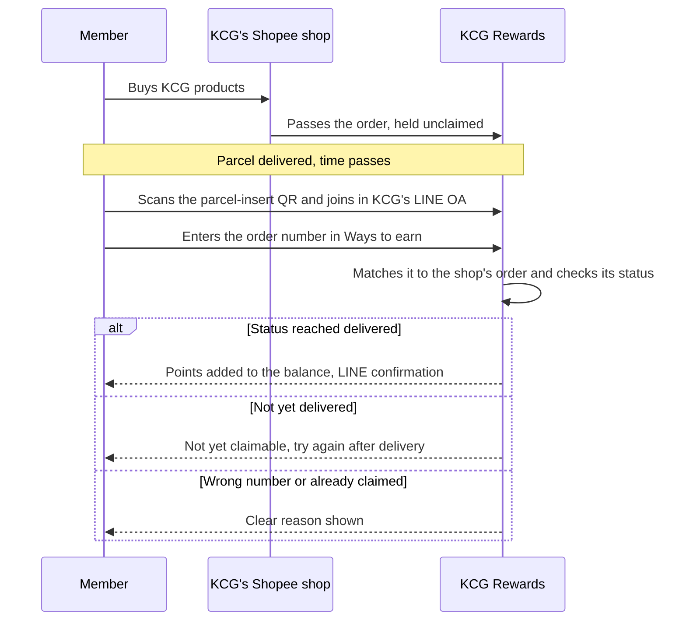

## 03 · Transaction Capturing: earn on every channel (Earn)

Once a buyer is a known member (§02), any purchase they make on any of KCG's ten channels can earn. Each one lands in the same purchase history on the member, so the same points, tier and campaign rules apply wherever they bought (TOR 1.8, 1-P2): a Shopee order, a Lotus's receipt, a booth sale and a Brand.com order become the same kind of record. What differs by channel is how the purchase reaches KCG Rewards, how it is tied to the member, and how much it earns.

### Four kinds of channel, one purchase history

KCG's channels sit on two axes: online or offline, and whether someone else makes the sale (third-party) or KCG does (first-party). Between them, the four quadrants cover every channel in TOR 7.

| | Third-party (someone else sells) | First-party (KCG sells) |
|---|---|---|
| **Online** | Shopee ×2, Lazada ×2, TikTok Shop ×2 (TOR 7.5–7.7) · Makro PRO: order claim, or receipt upload (TOR 7.9) | Brand.com (TOR 7.4) · Shopify (TOR 7.10) · orders taken through LINE (TOR 7.8) |
| **Offline** | Modern Trade (TOR 7.2) | Flagship Store (TOR 7.1) · Event booths (TOR 7.3) |

On third-party channels the member does one small thing, claiming an order or photographing a receipt, and that step is how an anonymous buyer becomes a known member. On first-party channels KCG already holds the sale, so points arrive with no effort from the member. The two halves of the table also earn at different rates, for the reason below.

### Why the channels earn at different rates

Most of KCG's customers first buy on a channel KCG doesn't own, where the brand never learns who bought. The programme has two jobs with those customers: identify them when they buy there, and then give them a reason to make their repeat purchases on KCG's own channels. The earn rate is the main lever for the second job, and it works as a chain:

1. **Third-party purchases earn at a lower rate.** After marketplace commission or the retailer's margin, KCG keeps a thin margin on a sale through Shopee, Lazada, TikTok Shop, Makro PRO or Modern Trade, so the points on those sales are set at what that margin can carry. The rate still has to be worth claiming, because the claim is what identifies the buyer.
2. **First-party purchases earn at a higher rate.** Sales at the flagship store, at event booths, on Brand.com, on Shopify and through LINE carry no commission or retailer margin, so KCG can return part of that difference to the member as extra points, along with benefits only KCG's own store can offer, such as spending points at checkout (§10).
3. **One balance shows the difference each time.** Because every purchase lands in the same balance, a member claiming a Shopee order sees in the same place what the same basket would have earned on KCG's own store. The Ways to earn sheet (next subsection) puts the channels side by side.
4. **Repeat purchases move.** A member who already has a balance, knows that KCG's store pays more, and can spend the balance there has a concrete reason to place the next order with KCG directly.

The illustrative rates in §04 are 25 THB = 1 point on marketplaces, Makro PRO and Modern Trade, and 20 THB = 1 point on KCG's own channels. That is 25% more points on first-party channels: a 500 THB basket earns 20 points on Shopee and 25 points on Brand.com. The slide shows the same pattern at 100 THB and 80 THB per point.

[asset:screenshot;id=920b242a-9e71-41e2-853f-3e361c1a4a75;title=Marketplace orders earn at the base rate, KCG's own store earns 25% more, into one balance]

```rocket-graphic
{
  "kind": "flow",
  "direction": "right",
  "zone_direction": "down",
  "groups": [
    {
      "id": "third",
      "label": "Third-party channels",
      "step": 1,
      "tone": "blue"
    },
    {
      "id": "bal",
      "label": "One balance",
      "step": 2,
      "tone": "amber"
    },
    {
      "id": "own",
      "label": "KCG's own channels",
      "step": 3,
      "tone": "red"
    }
  ],
  "nodes": [
    {
      "id": "n1",
      "label": "Buys on a third-party channel",
      "detail": "Shopee, Lazada, TikTok Shop, Makro PRO or Modern Trade",
      "icon": "shopping-bag",
      "tone": "blue",
      "group": "third"
    },
    {
      "id": "n2",
      "label": "Claims the order or uploads the receipt in LINE",
      "detail": "KCG learns who bought",
      "icon": "receipt",
      "tone": "blue",
      "group": "third"
    },
    {
      "id": "n3",
      "label": "Earns at the lower third-party rate",
      "detail": "Set by channel groups (§04)",
      "icon": "coins",
      "tone": "blue",
      "group": "third"
    },
    {
      "id": "n4",
      "label": "One KCG Rewards balance",
      "icon": "wallet",
      "tone": "amber",
      "group": "bal"
    },
    {
      "id": "n5",
      "label": "Ways to earn shows that own channels earn more",
      "icon": "eye",
      "tone": "amber",
      "group": "bal"
    },
    {
      "id": "n6",
      "label": "Own-channel nudge",
      "detail": "A journey or AI agent sends a LINE message and a first-order coupon (§09)",
      "icon": "send",
      "tone": "violet",
      "group": "bal"
    },
    {
      "id": "n7",
      "label": "Buys on KCG's own channels",
      "detail": "Flagship Store, event booths, Brand.com, Shopify, LINE orders",
      "icon": "store",
      "tone": "red",
      "group": "own"
    },
    {
      "id": "n8",
      "label": "Earns at the higher own-channel rate",
      "detail": "No claim step (§04)",
      "icon": "coins",
      "tone": "red",
      "group": "own"
    },
    {
      "id": "n9",
      "type": "end",
      "label": "Sees and spends the balance at checkout",
      "detail": "On KCG's Shopify store, once it is live (§10)",
      "icon": "shopping-cart",
      "tone": "green",
      "group": "own"
    }
  ],
  "edges": [
    {
      "from": "n1",
      "to": "n2"
    },
    {
      "from": "n2",
      "to": "n3"
    },
    {
      "from": "n3",
      "to": "n4"
    },
    {
      "from": "n4",
      "to": "n5"
    },
    {
      "from": "n5",
      "to": "n6"
    },
    {
      "from": "n6",
      "to": "n7"
    },
    {
      "from": "n7",
      "to": "n8"
    },
    {
      "from": "n8",
      "to": "n9"
    },
    {
      "from": "n8",
      "to": "n4",
      "label": "Into the same balance",
      "dashed": true
    }
  ]
}
```

Rocket supports each link in that chain. Claims and receipt uploads identify the third-party buyer (this section). Channel groups let KCG set one rate for all marketplaces and another for its own channels, and a new shop picks up its group's rate automatically (§04). Audiences, journeys and AI decisioning prompt the switch at the moment a member is most likely to make it (§09). The Shopify plugin lets members see and spend their balance on KCG's store (§10).

### Ways to earn: the member's one place to earn

Members find every channel on one sheet in LINE, **Ways to earn**, with a tab per channel. It opens over whatever page they are on, so a "collect points" button can sit on the home page, in the rich menu (§02), on a campaign banner or in a LINE message. Marketplace claim and receipt upload open their form inside the tab. Channels where points arrive on their own get an information card, such as "Buy at our Flagship Store or event booths: tell staff your phone number". Each card can show what that channel earns, so a member who comes to claim a Shopee order sees on the same sheet that KCG's own store earns more.

The KCG team edits each tab's banners, participating stores and how-to steps in the admin portal, and hides any tab KCG doesn't use.

[asset:screenshot;id=9f2eae77-4a1f-4d96-aef4-cf67ed5c0b96;title=KCG's LINE OA home: every way to earn one tap away]

### One rule on every channel: the purchase must name the member

A purchase earns only when it names the member, and the key is the mobile number captured at sign-up (§02). KCG's tills, sales files and booths carry it on the bill; the online store matches the order by phone or email; and on marketplaces, Makro PRO and at retailers, where the brand never sees the buyer, the member makes the link by claiming the order or uploading the receipt while signed in to KCG Rewards in LINE.

### Shopee, Lazada and TikTok Shop: six shops (TOR 7.5–7.7)

Rocket connects natively to Shopee, Lazada and TikTok Shop, and these connections are live today. The KCG team signs in to each shop once from the admin portal and approves access; from then on the shop's orders flow into KCG Rewards. There is no custom integration to build and no integration cost. Two shops per platform are simply two connections, six in all. One brand on Rocket runs 56 shops this way today (29 Shopee, 16 Lazada, 11 TikTok Shop).

Because KCG Rewards already holds every order from the connected shops, a marketplace buyer earns by typing their order number in Ways to earn: there is no receipt to upload and nobody to review it. The claim also tells KCG who bought, which the marketplace doesn't share with the brand.

[asset:screenshot;id=02ff3593-ec44-4618-b156-878450ad9243;title=Marketplace earn: members claim points with their order number]

A typical first claim: a parcel from a KCG Shopee shop carries an insert, "Collect KCG Rewards points on this order". The buyer scans it, joins in KCG's LINE OA, opens **Ways to earn**, picks Shopee and enters the order number. Once the order has reached the status KCG chose, the points land in their balance. If it hasn't, or the number is wrong or already claimed, they see why.



- **KCG chooses when a claim succeeds**, per platform, at setup. We recommend *delivered*: points arrive while the purchase is fresh, and a refunded order's points can still be reversed. Waiting for *completed* (after the return window) blocks buy-spend-return abuse but makes every honest buyer wait; we would rather spot and freeze the few who abuse it.
- **Points go to buyers who claim**, so the points budget is spent on customers who have chosen a relationship with the brand, and each claim adds a known member.
- **Support lookup.** When a member says a claim failed, a KCG admin looks up the order number and sees its status, amount, items and whether it has been claimed.
- **A clean start.** Orders placed shortly before go-live can be loaded, so early buyers can claim them too.

### Makro PRO: order claim, with receipt upload as the fallback (TOR 7.9)

Makro PRO is set up as its own channel, alongside the marketplaces. Where Makro PRO offers a seller connection for orders, we build that connection for KCG free of charge, and Makro PRO buyers earn exactly as marketplace buyers do: they enter the order number in Ways to earn, and the claim is matched against the orders from KCG's Makro PRO seller account. Where Makro PRO does not offer that connection, Makro PRO buyers upload their receipt or tax invoice instead, read and approved in the same way as Modern Trade receipts (next subsection).

Either way, Makro PRO keeps its own sales channel and its own KCG product list, so its purchases stay separate from Modern Trade in reports and can carry their own earn rate (§04).

### Modern Trade: receipt upload (TOR 7.2)

At Lotus's, Big C, Makro and other retailers, the receipt is the only record that links a purchase to a person, so Modern Trade buyers earn by photographing their receipt in Ways to earn.

[asset:screenshot;id=fb794928-6640-46a4-9932-f2c6d1ace98d;title=Receipt upload: AI reads the receipt and keeps only KCG products]

**AI reads every receipt.** It identifies the chain and branch, the receipt number, the date and each line, and keeps only the lines on KCG's product list for that chain; the rest of the basket is ignored. The reading is the same whichever way the receipt is then approved.

**There are two ways to approve a receipt.** Manual approval is the default: a KCG reviewer, or Rocket's team, looks at every receipt before it earns. Auto approval is optional: KCG can let clean receipts approve on the spot, while anything doubtful still goes to a reviewer.

**Once a receipt is approved**, by either route, the result is the same. The earnable amount is the value of the KCG lines after their discounts. That amount becomes a purchase in the member's history, dated by the receipt, and earns points under the Modern Trade rate and any other earn rule that applies (§04). Product-based rules and missions work on receipts too, such as bonus points on a new SKU, and the purchase counts toward the member's tier. The member receives a LINE message, "approved, +N points". If an approved receipt is later cancelled, its points are reversed.

```rocket-graphic
{
  "kind": "flow",
  "groups": [
    {
      "id": "ai",
      "label": "AI reads",
      "step": 1,
      "tone": "violet"
    }
  ],
  "nodes": [
    {
      "id": "a",
      "label": "Member photographs the receipt in Ways to earn",
      "detail": "Modern Trade or Makro PRO; LINE confirms it was received",
      "icon": "camera",
      "tone": "red"
    },
    {
      "id": "b",
      "label": "Reads the receipt",
      "detail": "Chain, branch, receipt number, date and every line",
      "icon": "scan",
      "tone": "violet",
      "group": "ai"
    },
    {
      "id": "c",
      "label": "Keeps only the KCG lines",
      "detail": "Those on that chain's product list; the rest of the basket is ignored",
      "icon": "filter",
      "tone": "violet",
      "group": "ai"
    },
    {
      "id": "d1",
      "type": "decision",
      "label": "Auto approval switched on for this retailer group?",
      "tone": "neutral"
    },
    {
      "id": "d2",
      "type": "decision",
      "label": "Auto approval: passes every check?",
      "detail": "Not a duplicate, total adds up, KCG lines found, AI confidence above the minimum",
      "tone": "blue"
    },
    {
      "id": "q",
      "label": "Manual review queue, pre-filled",
      "detail": "With the AI reading and the reason it needs a look",
      "icon": "list",
      "tone": "amber"
    },
    {
      "id": "g",
      "label": "Reviewer checks the photo and corrects",
      "detail": "KCG's team, or Rocket's team under Receipt Approval (TOR 11)",
      "icon": "user",
      "tone": "amber"
    },
    {
      "id": "ok",
      "label": "Approved",
      "detail": "A purchase in the member's history, dated by the receipt: KCG lines after discounts",
      "icon": "check",
      "tone": "green"
    },
    {
      "id": "x",
      "type": "end",
      "label": "Rejected",
      "detail": "LINE message to the member",
      "icon": "x",
      "tone": "red"
    },
    {
      "id": "e",
      "type": "end",
      "label": "Points under KCG's earn rules (§04)",
      "detail": "Product rules, missions and tier progress apply; LINE: \"approved, +N points\"",
      "icon": "coins",
      "tone": "green"
    }
  ],
  "edges": [
    {
      "from": "a",
      "to": "b"
    },
    {
      "from": "b",
      "to": "c"
    },
    {
      "from": "c",
      "to": "d1"
    },
    {
      "from": "d1",
      "to": "q",
      "label": "No (default)"
    },
    {
      "from": "d1",
      "to": "d2",
      "label": "Yes"
    },
    {
      "from": "d2",
      "to": "q",
      "label": "No"
    },
    {
      "from": "d2",
      "to": "ok",
      "label": "Yes"
    },
    {
      "from": "q",
      "to": "g"
    },
    {
      "from": "g",
      "to": "ok",
      "label": "Approves"
    },
    {
      "from": "g",
      "to": "x",
      "label": "Rejects"
    },
    {
      "from": "ok",
      "to": "e"
    }
  ]
}
```

#### Manual approval (default)

Every receipt lands in the review queue already read: chain, branch, receipt number, total and the matched KCG lines are filled in, with the reason it needs a look. The reviewer checks the photo against the reading, corrects anything the AI got wrong, and approves or rejects. The member hears on LINE when the receipt is received, approved or rejected. If KCG would rather not staff the queue, Rocket's Receipt Approval service can work it for KCG (TOR 11, §12).

#### Auto approval (optional)

With auto approval switched on, a clean receipt is approved the moment it is read and the member sees "approved, +N points" straight away. A receipt auto-approves only when every relevant switch is on and it fails no check. Anything doubtful goes to the same review queue with its reason, so the KCG team never works in a second tool. KCG controls eight settings:

```rocket-graphic
{
  "kind": "kv_table",
  "rows": [
    { "label": "1 · Master switch", "value": "Whether any receipt may auto-approve. Off means every receipt goes to review, still pre-filled by AI." },
    { "label": "2 · Reading policy per retailer group", "value": "One policy per group of chains (for example KCG's own shops, and Modern Trade with Makro PRO), each with its own auto-approve switch." },
    { "label": "3 · Minimum confidence", "value": "How sure the AI must be about each line and field before it may approve alone (default 70%)." },
    { "label": "4 · Receipt total must add up", "value": "Strict: line amounts must match the printed total. Skip: don't check." },
    { "label": "5 · Bill discounts", "value": "Spread across lines in proportion, or ignored when working out the earnable amount." },
    { "label": "6 · Duplicate check", "value": "A receipt number can earn only once per chain." },
    { "label": "7 · Product list per retailer", "value": "The KCG product names as each chain prints them, linked to KCG's SKUs. Only listed lines earn." },
    { "label": "8 · Reading hints per retailer", "value": "Short notes on each chain's layout, such as which figure is the net amount or that dates print in the Buddhist year." }
  ]
}
```

We recommend starting every chain on manual approval, comparing the AI's readings with what reviewers would have keyed in, and switching auto approval on group by group once the policies hold up. The queue can be filtered by who approved each receipt (system or admin), so the team can keep auditing auto approvals after launch.

#### Dates, limits and a later option

The purchase date is the date printed on the receipt, so campaign windows are judged by when the member bought, not when the receipt was reviewed. A daily upload limit per member (15 images by default) caps misuse. If KCG later wants a route that doesn't depend on the receipt, codes printed inside packs can be scanned to earn; we recommend launching on receipts, which need no packaging change.

### Flagship Store and event booths: points from any POS (TOR 7.1, 7.3)

At KCG's own tills and booths the member earns by giving their phone number and does nothing in the app. How the sale reaches KCG Rewards depends on what the POS can do and on how soon KCG wants points to show, and our routes cover every POS. Whichever route is used, the purchase lands in the same balance at the first-party rate. §11a sets out how each route works and what it costs.

| Route | What it needs | When points arrive | Cost |
|---|---|---|---|
| Email sales file | The POS or back office emails the daily sales export it already produces | When the file arrives, typically end of day | Included |
| File upload | The KCG team uploads the same export in the admin portal | When the file is uploaded | Included |
| Open API | The POS vendor sends each paid bill to KCG Rewards | At the till | Included |
| End-of-day connector | The POS or its back office has an API; Rocket's connector collects the day's bills | After the nightly run | Custom integration |
| Front Line staff app | A phone or tablet at the counter. No POS change | Immediately | Included |

[asset:screenshot;id=e7e10bfb-94c6-43f2-ad8b-6fac994db93e;title=In-store purchases earn from any POS]

**Email sales file.** Most POS systems and back offices can already email a daily sales export. KCG points that routine email at a dedicated KCG Rewards address, and each file is imported automatically: every bill carrying a member's phone number becomes a purchase on that member and earns under KCG's rules, and item lines, where the export includes them, let product rules apply too. The result is the same as a POS integration, with no integration work on KCG's side or the POS vendor's. The trade-off is timing: points arrive when the file does, typically at the end of the day, rather than while the member is at the till.

**Front Line.** Staff open Front Line on a phone or tablet, pick the store or booth, find the member by phone number or by scanning their QR, and record the bill (receipt number, amount, optionally items). KCG Rewards calculates the points at once. It needs no POS at all, which makes it the natural route for event booths and pop-ups.

**Open API.** Where the POS vendor can send each paid bill with the member's phone number the moment it closes, points follow at the till with no staff step.

We recommend opening the Flagship Store on the email sales file, because it needs nothing from the POS vendor beyond adding the member's phone number to each sale, and running booths on Front Line. If KCG later wants points to appear at the till, the flagship can move to the Open API once the vendor supports it; we agree the route with the vendor during onboarding.

Events are also where the brand meets people who aren't members yet. A walk-in scans the booth QR to join in LINE, or staff register them in Front Line on the spot and push a welcome reward immediately. Every Front Line transaction is recorded against its store or booth, so the team can see what each event produced in new members and sales, and each staff member's role sets what they can see and do.

### Brand.com and Shopify: KCG's own online store (TOR 7.4, 7.10)

KCG's own online store is where the conversion described above pays off: orders there earn at the first-party rate with no claim step, and KCG keeps the full margin on them.

**Brand.com earns through order sync.** The site sends each order to KCG Rewards through our Open API, included in the licence, as it completes. The order is matched to the member by phone number or email and earns under KCG's rules at the own-channel rate; refunds and cancellations reverse the points.

**Order sync covers earning only.** It is what most loyalty vendors mean when they say they integrate with an online store: orders go to the loyalty system and become points. The member still has to open LINE to see their balance, and has nothing from the programme to use while shopping. Rocket's Shopify plugin, Thailand's only Shopify-native loyalty plugin, adds three things order sync cannot:

- **See.** The member's balance, tier and rewards appear inside the store, and product pages show what each item earns at the store rate.
- **Burn.** Points and rewards are spent at checkout as a discount, so the balance built on Shopee and at Lotus's has somewhere to go on KCG's store.
- **Refer.** Members invite friends to buy on KCG's store and are rewarded when they do.

These three are what make the rate difference above effective: a member can see on KCG's store what they have earned everywhere else, spend it there, and earn more for buying there. When KCG's Shopify store opens (TOR 7.10), or if Brand.com moves to Shopify, the plugin is installed from the Shopify App Store and runs on the same members, balances, tiers and rewards KCG already runs in LINE. §10 goes through each of the four dimensions, earn, see, burn and refer, in detail.

[asset:screenshot;id=01a64ba5-4336-43a4-9ec4-2c764c73aa41;title=Shopify plugin vs order sync: earn, see, burn and refer]

### Orders taken through LINE (TOR 7.8)

Every member in KCG's LINE OA is already identified, so an order taken through LINE earns like any first-party purchase, with no claim step: staff record it against the member in Front Line, or KCG's LINE order tool sends it in through the Open API, matched by phone number. The LINE OA as the programme's home is covered in §02.

### Connections included in the licence, and order volume (TOR 7, 3.3)

Every route in this section is included in the KCG Rewards licence: the native Shopee, Lazada and TikTok Shop connections; the Makro PRO order connection, built by us at no charge; receipt upload with AI reading; the email sales-file import; Front Line; a real-time POS connection where the POS can send bills; the Brand.com Open API; and the Shopify plugin. Order processing is designed for 10,000 orders an hour and scales out beyond that. KCG's 100,000+ orders a month average around 140 an hour, so even an 11.11 peak many times a normal day stays well inside it (TOR 3.3). §11a sets out the connection method, the data exchanged and what KCG or its vendors do for each channel.

With every purchase arriving on the right member, §04 sets how much each one earns: the base rate, the channel groups behind the rates above, bonus and extra points, expiry and reversal.
