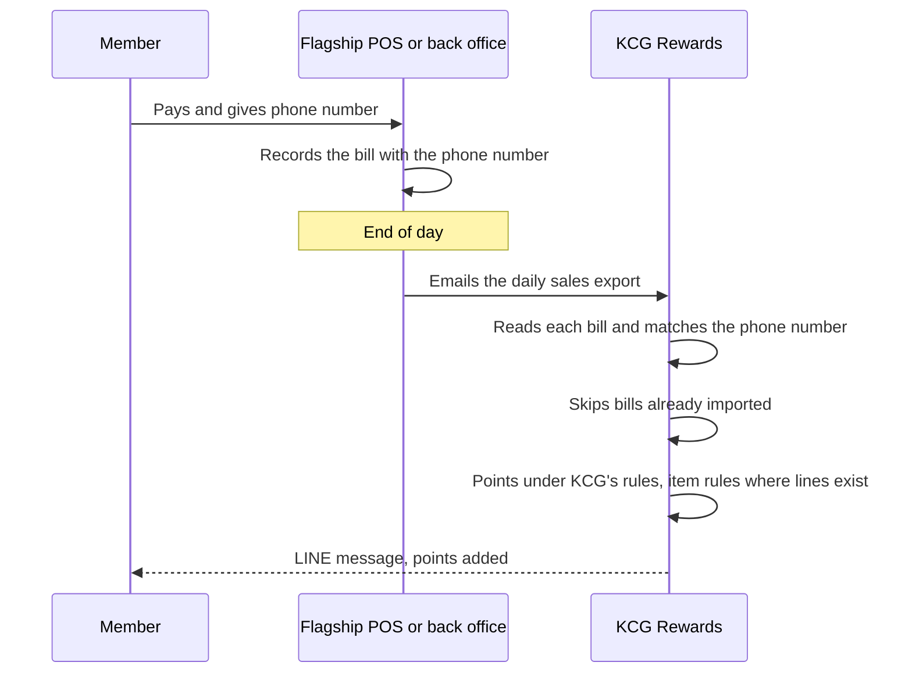
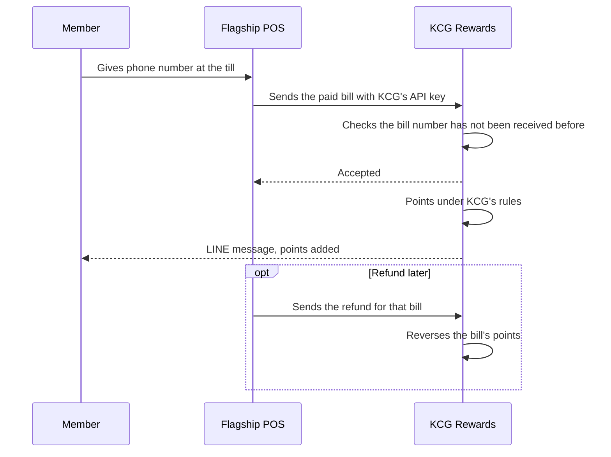
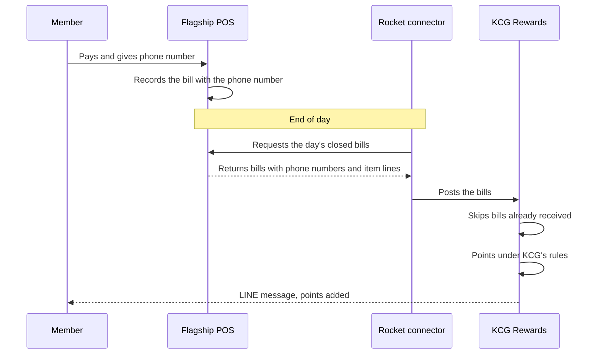
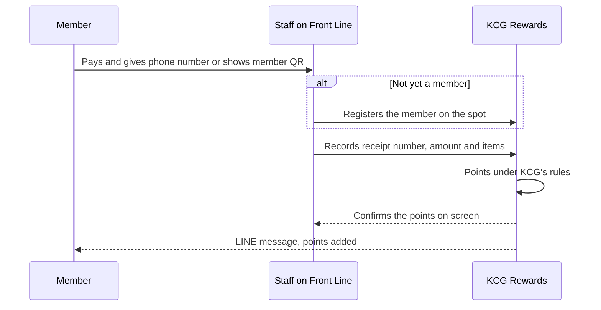

## 11a · System Integration and Data Flow (TOR 7, 8, 9.3)

The AI in §11, like every report and journey before it, works on data that KCG's channels and systems send in. §03 and §10 describe those channels as the member sees them; this section is the technical view of the same connections: for each KCG system, what data moves, in which direction, by what method, what KCG or its vendors have to do, and whether anything costs extra (TOR 7, 8). Most connections are live product that the KCG team switches on in the admin portal. A few need something from KCG's side: Brand.com's developer sends each order through the Open API, the flagship POS reaches KCG Rewards by whichever of our POS routes suits it (the emailed daily sales file is the usual one), and Makro PRO must offer seller access for the connection we build at no charge. SAP is the one connection we build and run as a custom integration: it brings SAP's product master in and posts the programme's transactions, points and redemptions to SAP, through the interfaces KCG's SAP team opens. The data lake method is chosen with KCG's data team.

### Integration architecture (TOR 8, 19.4, 19.5)

KCG Rewards sits between KCG's sales channels and KCG's own systems. Every channel feeds one member purchase history; SAP supplies the product master and receives the programme's transactions, points and redemptions; the data lake receives everything.

```rocket-graphic
{
  "kind": "flow",
  "direction": "right",
  "groups": [
    {"id": "offline", "label": "Offline channels", "tone": "amber"},
    {"id": "online", "label": "Online channels", "tone": "blue"},
    {"id": "systems", "label": "KCG systems", "tone": "violet"}
  ],
  "nodes": [
    {"id": "pos", "label": "Flagship Store POS", "detail": "Email file, upload, Open API or our connector", "icon": "store", "tone": "amber", "group": "offline"},
    {"id": "booth", "label": "Event booths", "detail": "Front Line staff app", "icon": "smartphone", "tone": "amber", "group": "offline"},
    {"id": "mt", "label": "Modern Trade", "detail": "Receipt upload in LINE, read by AI", "icon": "receipt", "tone": "amber", "group": "offline"},
    {"id": "mp", "label": "Shopee, Lazada, TikTok Shop", "detail": "Six shops, native connection", "icon": "shopping-bag", "tone": "blue", "group": "online"},
    {"id": "mk", "label": "Makro PRO", "detail": "Seller connection, or receipt upload", "icon": "package", "tone": "blue", "group": "online"},
    {"id": "web", "label": "Brand.com or Shopify", "detail": "Open API, or the Shopify plugin", "icon": "shopping-cart", "tone": "blue", "group": "online"},
    {"id": "line", "label": "KCG's LINE OA", "detail": "Sign-in, claims, messages", "icon": "message", "tone": "green", "group": "online"},
    {"id": "kr", "label": "KCG Rewards", "detail": "One member, one purchase history", "icon": "star", "tone": "red", "type": "end"},
    {"id": "sap", "label": "SAP ERP", "detail": "Product master in; transactions, points and redemptions out", "icon": "database", "tone": "violet", "group": "systems"},
    {"id": "lake", "label": "KCG data lake", "detail": "Events and daily files", "icon": "chart", "tone": "violet", "group": "systems"}
  ],
  "edges": [
    {"from": "pos", "to": "kr"},
    {"from": "booth", "to": "kr"},
    {"from": "mt", "to": "kr"},
    {"from": "mp", "to": "kr"},
    {"from": "mk", "to": "kr"},
    {"from": "web", "to": "kr"},
    {"from": "line", "to": "kr"},
    {"from": "sap", "to": "kr", "label": "Product master", "dashed": true},
    {"from": "kr", "to": "sap"},
    {"from": "kr", "to": "lake"}
  ]
}
```

### Every channel and system, with method and cost (TOR 7, 8)

| System | Direction and data | Method | What KCG or its vendor does | Extra cost |
|---|---|---|---|---|
| Shopee ×2, Lazada ×2, TikTok Shop ×2 (TOR 7.5–7.7, 8.3) | Platform → KCG Rewards: orders, status, items, refunds | Native connection, live today | Log in to each shop once from the admin portal | None |
| Makro PRO (TOR 7.9, 8.5) | Makro PRO → KCG Rewards: orders on KCG's seller account | Seller connection built by Rocket where Makro PRO offers one; receipt or tax-invoice upload otherwise | Grant access to the seller account | None |
| Modern Trade (TOR 7.2) | Member → KCG Rewards: receipt photo | Receipt upload in LINE, read by AI | Nothing; no retailer connection is needed | None. Receipt Approval service optional (TOR 11, §12) |
| Flagship Store POS (TOR 7.1, 8.1) | POS → KCG Rewards: bills with the member's phone number, items where available | Depends on the POS; five routes below | Add the member's phone number to each sale; the rest depends on the route (see POS routes) | Depends on the route: none for the email file, file upload, Open API and Front Line; our end-of-day connector is a custom integration (see POS routes) |
| Event booths (TOR 7.3) | Staff → KCG Rewards: bills | Front Line staff app | Nothing | None |
| Brand.com (TOR 7.4) | Site → KCG Rewards: orders, refunds, members | Open API | The site's developer sends each order as it completes | None |
| Shopify (TOR 7.10, 8.6) | Both ways: orders, refunds, customers in; balance, rewards, checkout discounts, referrals out | Rocket's Shopify plugin | Install the app from the Shopify App Store | None |
| LINE Official Account (TOR 3.4, 7.8, 8.4) | Both ways: sign-in, claims, receipts, member web app in LINE, messages | KCG's LINE channels connected in the admin portal | Provide the LINE Login and Messaging API channel credentials | None from Rocket. LINE's message charges stay on KCG's LINE OA plan |
| SAP ERP (TOR 8.2) | SAP → KCG Rewards: product master. KCG Rewards → SAP: transactions, points movements and redemptions | Connector built and run by Rocket | Open access to SAP's interfaces and a test system; agree the field mapping with KCG's SAP and finance teams | Custom integration: one-time build plus monthly maintenance, on the Custom Integration line of the commercial proposal |
| KCG data lake (TOR 9.3) | KCG Rewards → data lake: members, purchases, points, rewards, tiers, campaigns | Event stream and daily files, or one of the other methods below | Provide the landing location | Set out on the Data Lake line of the commercial proposal (TOR 21) |

### Shopify: installed from the App Store (TOR 7.10, 8.6)

Rocket's plugin is native to Shopify, so connecting KCG's store means installing the app from the Shopify App Store. Nothing has to be developed or waited for, and there is no integration fee. Once the app is installed, orders, refunds and customer records sync by themselves, and shoppers are linked to their KCG Rewards membership by email, then by phone number.

Most Shopify integrations stop at syncing orders and members, which covers earning only. The plugin also runs the programme inside the store: members **see** their balance, tier and the points on each product, **burn** points, rewards and tier benefits at checkout, and **refer** friends. §10 compares the two dimension by dimension.

If Brand.com does not run on Shopify, it sends orders through the Open API (described under POS route 3 below) until the store moves, and the plugin then switches on with the same members and balances.

### POS: a route for every POS (TOR 7.1, 7.3, 8.1)

POS integration takes different forms depending on what KCG needs (points at the till, or by the end of the day) and on what the POS can do today: produce a sales export, call an outside API, or expose an API of its own. Our routes cover every combination, so the choice follows the POS rather than holding up go-live. All five identify the member by the phone number given at the till and land in the same purchase history at the first-party rate.

| Route | Who moves the data | When points arrive | Needs from the POS vendor | Cost |
|---|---|---|---|---|
| 1 · Daily sales file by email | The POS or back office emails the export it already produces | When the file arrives, typically end of day | Nothing beyond the member's phone number on each sale | Included in the licence |
| 2 · File upload in the admin portal | The KCG team uploads the same export | When the file is uploaded | Nothing beyond the member's phone number on each sale | Included in the licence |
| 3 · Real-time bills through the Open API | The POS sends each paid bill to KCG Rewards | At the till | Development to send each bill as it closes | Included in the licence; the vendor's development is between KCG and its vendor |
| 4 · End-of-day connector built by Rocket | Our connector collects the day's closed bills from the POS | After the nightly run | Access to the API of the POS or its back office | Custom integration: one-time build plus monthly maintenance |
| 5 · Front Line staff app | Staff record the bill on a phone or tablet | Immediately | Nothing; no POS is involved | Included in the licence |

#### Route 1 · Daily sales file by email

Most POS systems and back offices already produce a daily sales export. KCG sends that routine email to a dedicated KCG Rewards address, and each file is imported automatically. Nobody at KCG or the POS vendor writes an integration. The file format (bill number, date, store, member phone, amount, and item lines where available) is agreed once during onboarding. Each bill number earns only once, so a file sent twice never pays twice. Where the flagship's bills and the member's phone number already reach SAP, the same daily file can be sent from SAP instead of the POS. The route is included in the licence.



#### Route 2 · File upload in the admin portal

The KCG team can upload the same sales export in the admin portal: when a day's email is late, for a pop-up store's sales kept on a separate till, or for back-dated sales. The file uses the Route 1 format, each bill number still earns only once, and members receive the same points they would have received by email. The route is included in the licence.

#### Route 3 · Real-time bills through the Open API

Where the POS vendor can send each paid bill the moment it closes, points follow at the till. The POS posts the bill to our Open API over HTTPS with KCG's API key: bill number, store, member phone, amounts and item lines. Refunds are sent the same way and reverse the bill's points. Rocket makes no charge for this route: the Open API is included in the licence, and its reference documentation is delivered at kick-off (TOR 19.9). The vendor's own development work to send the bills is agreed between KCG and its vendor.



#### Route 4 · End-of-day connector built by Rocket

Some POS systems, or their back offices, expose an API but can neither email a sales export nor send bills out. For those, we build and run a connector that requests the day's closed bills, with the member's phone number and item lines, on a schedule (typically each night) and posts them into KCG Rewards. The same one-earn-per-bill rule applies, so a bill collected twice earns once. The POS vendor gives access to its API; nothing is developed on the POS side. This is a custom integration: a one-time build plus monthly maintenance, on the Custom Integration line of the commercial proposal.



#### Route 5 · Front Line staff app

Front Line (§03) needs no POS and no connection of any kind. Staff find the member by phone number or member QR on a phone or tablet and record the bill, and each bill is stored against its booth and the staff member who entered it. Front Line is included in the licence.



#### Which route we recommend

We recommend the emailed sales file for the Flagship Store, because it needs nothing from the POS vendor beyond adding the member's phone number to each sale, and Front Line for event booths. If points at the till matter and the vendor can send bills, the flagship moves to the Open API. The connector is for a POS that can do neither but has an API. The route is agreed with the POS vendor during onboarding.

### Marketplaces and Makro PRO (TOR 7.5–7.7, 7.9, 8.3, 8.5)

Shopee, Lazada and TikTok Shop are native connections. The KCG team authorises each of the six shops once from the admin portal; from then on each platform notifies KCG Rewards of every order and status change, and KCG Rewards holds the orders until a member claims one. A refunded order reverses its points. No developer is involved on KCG's side, and the connections carry no fee.

For Makro PRO, we build the order connection to KCG's seller account at no charge where Makro PRO offers seller access to orders, and claims then work exactly as on the marketplaces. Where it doesn't, Makro PRO buyers earn by uploading the receipt or tax invoice (§03). Either way Makro PRO is its own sales channel with its own product list and earn rate.

### LINE Official Account (TOR 3.4, 4.1, 8.4)

KCG connects its LINE Login channel and Messaging API channel in the admin portal. LINE Login signs members in and ties their LINE account to the phone number they verify; the KCG Rewards web app opens inside LINE; notifications, broadcasts and journey messages go out from KCG's own OA; and button taps in those messages come back to KCG Rewards so journeys can respond. The OA and its friends stay KCG's. Message volume counts against KCG's LINE OA plan in the usual way.

For the members KCG already has in LINE (TOR 4.1), we import existing members and their balances before go-live and broadcast an invitation to LINE friends who are not yet members. How any ongoing sync with KCG's current LINE setup should work is agreed in onboarding.

### SAP ERP (TOR 8.2)

We build and run a connector between KCG Rewards and SAP that works in both directions, so neither KCG's product team nor its finance team re-keys anything between the two systems.

- **Product master into KCG Rewards.** The connector pulls SAP's product master on a schedule: SKU code, name, brand, category and status. A new SKU is recognised by product-based earn rules, missions and each retailer's receipt product list as soon as it launches, and a discontinued one stops appearing (TOR 10.4). The KCG team, or our team under the platform management service (TOR 10, §12), can still add a SKU in the admin portal when one is needed before SAP carries it.
- **Programme activity out to SAP.** The connector posts the programme's major activity to SAP: member transactions (purchases and refunds, with channel and store), points movements (earned, redeemed, expired and adjusted, together with the outstanding balance that makes up the points liability) and reward redemptions with their reward cost. The postings follow the structure KCG's SAP team specifies, either summary postings or line level, on a schedule agreed with finance, so finance posts the points liability and reward costs from what arrives. The same figures remain available at any time in the points reports, whose points snapshot gives the outstanding liability on any chosen date (§08).

The connector reaches SAP through the interfaces KCG's SAP team opens: SAP's standard APIs, or an agreed file exchange where an API isn't available. The field mapping is agreed with KCG's SAP and finance teams during onboarding and tested end to end in December's integration test. This is a custom integration, charged as a one-time build plus monthly maintenance on the Custom Integration line of the commercial proposal.

SAP's sales to Modern Trade and Makro are sales to the retailer, not to a member, so they don't earn points. Member earning comes from the channels above.

### Data lake (TOR 9.3)

There are four ways to get KCG Rewards data into KCG's data lake. They differ in how fresh the data is, who runs the pipeline, and what KCG's data platform needs to be. We deliver whichever KCG's data team chooses, and the first two can run together.

```rocket-graphic
{
  "kind": "flow",
  "direction": "right",
  "nodes": [
    {"id": "kr", "label": "KCG Rewards", "icon": "star", "tone": "red", "type": "end"},
    {"id": "ev", "label": "1 · Event stream", "detail": "As changes happen. Live today", "icon": "zap", "tone": "blue"},
    {"id": "fi", "label": "2 · Daily files", "detail": "Written to storage KCG owns", "icon": "clipboard", "tone": "blue"},
    {"id": "ld", "label": "3 · Direct load", "detail": "Into KCG's landing area", "icon": "database", "tone": "blue"},
    {"id": "vw", "label": "4 · Read access", "detail": "KCG queries its own view in our BigQuery", "icon": "eye", "tone": "violet"},
    {"id": "lake", "label": "KCG data lake", "icon": "chart", "tone": "violet", "type": "end"}
  ],
  "edges": [
    {"from": "kr", "to": "ev"},
    {"from": "kr", "to": "fi"},
    {"from": "kr", "to": "ld"},
    {"from": "kr", "to": "vw"},
    {"from": "ev", "to": "lake"},
    {"from": "fi", "to": "lake"},
    {"from": "ld", "to": "lake"},
    {"from": "vw", "to": "lake", "dashed": true}
  ]
}
```

| Method | How it works | Freshness | Suits |
|---|---|---|---|
| 1 · Event stream | KCG Rewards sends each member event to an HTTPS address KCG provides: member created or updated, points earned, redeemed, expired or adjusted, reward redeemed, tier up or down, referral completed. Each event carries the member's current balance and tier, and is signed so KCG can verify it came from us. Live today | Seconds after the change | Real-time dashboards, triggers in KCG's own systems |
| 2 · Daily files | Each night we write new and changed records, one file per data area, to storage KCG owns (for example Amazon S3, Azure Blob Storage, Google Cloud Storage or SFTP). KCG's pipelines load them on KCG's schedule | Daily, or hourly if needed | Any data lake. Complete, replayable history |
| 3 · Direct load | We run the pipeline and load the same data into a landing area of KCG's warehouse (for example BigQuery, Snowflake, Redshift, Azure Synapse or Databricks). KCG's team builds its own models from there | Daily, or hourly if needed | A data team that wants the tables to arrive ready to query |
| 4 · Read access | KCG Rewards' analytics already run on Google BigQuery. KCG's data team gets a view that contains only KCG's data and queries it, or copies it, from its own Google Cloud project | As fresh as the dashboards in §08 | A data platform already on Google Cloud |

We recommend methods 1 and 2 together. The event stream gives KCG's systems each change within seconds; the daily files are the complete record, so a missed event or a pipeline outage on KCG's side is filled the next morning, and any date range can be re-sent. If KCG's data platform is on Google Cloud, method 4 avoids copying data at all.

Whatever the method, the data covers members and their consents, purchases with item lines and channel, points movements, redemptions, tier changes, campaign and mission participation, and marketing interactions. The layout is documented and versioned, and a change is announced before it ships (TOR 19.8). Because the lake receives personal data, deletions travel with it: when a member's data is erased in KCG Rewards, the feed carries a deletion record so the same member can be erased in the lake (TOR 14.9).

### Security on every connection (TOR 2.4, 14.2–14.5)

- **Encrypted in transit.** Every connection runs over HTTPS. Outbound events go only to public HTTPS addresses that KCG registers.
- **Scoped keys.** The Open API key belongs to KCG's programme, and every call is limited to KCG's data by the key itself. The KCG team can revoke a key and issue a new one.
- **Signed events.** Each outbound event carries a signature KCG checks with a shared secret, so a forged event can't reach KCG's lake.
- **No double posting.** Every bill number, order and event is recorded once. A retried call, a re-sent file or a repeated webhook never earns twice.
- **Channel credentials under KCG's control.** LINE, marketplace and Shopify connections are authorised by KCG's own accounts and stop working the moment KCG disconnects them.

How the platform behind these connections is built, where KCG's data is stored and how each item of TOR 14 is met is in §11b.

### Documents and timing (TOR 16.4, 16.5, 19.4–19.9)

At kick-off we deliver the Open API reference, the sales-file layout, and the data lake event and file catalogue; the diagrams in this section are the starting integration architecture and data flow. Marketplace and LINE connections are set up during configuration in November; the Shopify plugin is installed whenever KCG's store opens (§10). The POS route and sales-file format, the SAP field mapping and the data lake method are agreed with KCG's POS, SAP, finance and data teams in the same month and tested end to end in December's integration test and UAT, ahead of go-live on 1 January 2027 (TOR 17).
