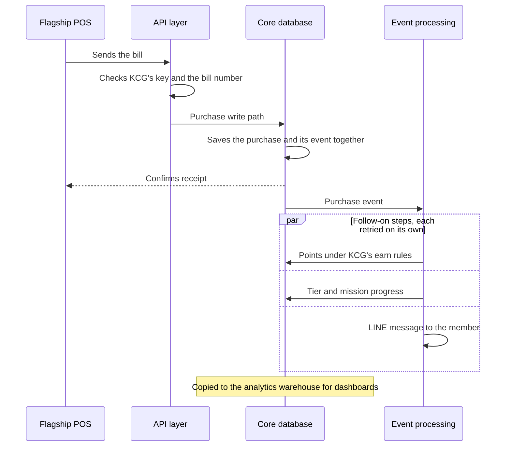

## 11b · Platform architecture and security (TOR 2.5, 2.6, 14, 19.4)

Every connection in §11a lands in the same platform. This section describes that platform as a whole, for the system architecture TOR 19.4 and 25.5 ask for: how it is layered, how a purchase moves through it, where KCG's data is stored, the limits TOR 18 asks us to declare, and how data is protected under each item of TOR 14. The security of each individual connection (encryption, scoped keys, signed events, no double posting) is in §11a, and the AI layer is described in §11.

### System architecture (TOR 19.4, 25.5)

KCG Rewards has five layers. Members, the KCG team and KCG's systems reach it through one API layer, which identifies every caller and limits it to KCG's programme. Behind that, a transactional database holds the loyalty records. An event-processing layer carries out everything that follows from a change, and a separate analytics warehouse serves reporting and AI analysis. Outbound connections take data on to SAP and KCG's data lake.

```rocket-graphic
{
  "kind": "flow",
  "direction": "right",
  "groups": [
    {"id": "users", "label": "Channels and users", "step": 1, "tone": "blue"},
    {"id": "platform", "label": "KCG Rewards platform", "step": 2, "tone": "red"},
    {"id": "kcg", "label": "KCG systems", "step": 3, "tone": "violet"}
  ],
  "nodes": [
    {"id": "members", "label": "Members", "detail": "Member web app inside LINE, Shopify storefront", "icon": "smartphone", "tone": "blue", "group": "users"},
    {"id": "staff", "label": "KCG team and Front Line staff", "detail": "Admin portal and counter app", "icon": "users", "tone": "blue", "group": "users"},
    {"id": "partners", "label": "Sales channels and partner systems", "detail": "POS, Brand.com, Shopee, Lazada, TikTok Shop, Makro PRO", "icon": "store", "tone": "blue", "group": "users"},
    {"id": "api", "label": "API layer", "detail": "Identifies every caller and limits it to KCG's programme", "icon": "shield", "tone": "red", "group": "platform"},
    {"id": "core", "label": "Loyalty core database", "detail": "One write path per record type; each change saved with its event", "icon": "database", "tone": "red", "group": "platform"},
    {"id": "events", "label": "Event processing", "detail": "Points, tier, missions, messages and journeys in parallel, with retries", "icon": "zap", "tone": "red", "group": "platform"},
    {"id": "wh", "label": "Analytics warehouse", "detail": "Dashboards and AI analysis, apart from transactions", "icon": "chart", "tone": "red", "group": "platform"},
    {"id": "ai", "label": "AI layer", "detail": "Receipt reading, AI analysis, AI decisioning (§11)", "icon": "sparkles", "tone": "red", "group": "platform"},
    {"id": "sap", "label": "SAP ERP", "detail": "Product master in; transactions, points and redemptions out", "icon": "database", "tone": "violet", "group": "kcg"},
    {"id": "lake", "label": "KCG data lake", "detail": "Signed event stream and daily files", "icon": "chart", "tone": "violet", "group": "kcg"}
  ],
  "edges": [
    {"from": "members", "to": "api"},
    {"from": "staff", "to": "api"},
    {"from": "partners", "to": "api"},
    {"from": "api", "to": "core"},
    {"from": "core", "to": "events", "label": "Event"},
    {"from": "events", "to": "core", "label": "Points and tier updates", "dashed": true},
    {"from": "events", "to": "members", "label": "LINE messages", "dashed": true},
    {"from": "core", "to": "wh", "label": "Copied for reporting"},
    {"from": "wh", "to": "ai"},
    {"from": "core", "to": "sap", "label": "Scheduled files"},
    {"from": "events", "to": "lake"}
  ]
}
```

- **API layer.** Every request is authenticated before any data is read, and resolved to one programme. KCG staff sign in to the admin portal. Members sign in with LINE Login or a phone number and one-time code. Partner systems such as the POS and Brand.com call the Open API with a KCG API key. The same layer serves the member web app in LINE, the admin portal, the Front Line app, the Shopify plugin and the inbound connections from the marketplaces and LINE.
- **Loyalty core database.** Purchases, points, tiers, redemptions, member accounts, receipts and referrals live in one transactional PostgreSQL database. Each type of record has exactly one write path, which every channel, import and scheduled job goes through, so the same rules apply to a Shopee claim, a flagship bill and a bulk import. That write path saves the change and a record of it as an event in the same database transaction: if the change is rolled back, no event exists, and once it is committed, the event cannot be lost.
- **Event processing.** A durable workflow engine picks up each event and passes it, in parallel, to points, tier, missions, notifications and journeys. Each event is delivered at least once and duplicates are discarded, failed steps retry, and a step can be held for later, such as a points award released at 08:00 or a return-window hold. The member's transaction completes quickly, and the reactions to it follow within seconds.
- **Analytics warehouse.** The standard dashboards (§08) and AI analysis (§11) run on a separate analytics warehouse on Google BigQuery, so large reports and AI questions don't compete with members' transactions for the database. The AI layer (§11) works from the same member data.
- **Outbound.** Signed events and daily files go to KCG's data lake, and the SAP connector posts transactions, points and redemptions to SAP (§11a).

### How a purchase moves through the platform

Take a flagship bill sent through the Open API. The API layer checks KCG's key, confirms the bill number has not been received before, and hands the bill to the purchase write path, which saves the purchase and its event together and replies to the POS. Event processing then picks up the event. Points are calculated under KCG's earn rules and saved through the points write path, which records its own event, so the tier check and any points-based mission react to the new balance in turn. In parallel, purchase-based missions update and the member gets a LINE message. The analytics warehouse receives the purchase for the next dashboard refresh. If any of those steps fails, it retries on its own; the purchase itself is already saved and is never re-entered.



### Where KCG's data is stored

The loyalty core database runs on Amazon Web Services in Singapore (ap-southeast-1), and the analytics warehouse on Google Cloud in Singapore (asia-southeast1). KCG's member data is stored in Singapore.

KCG Rewards runs on Rocket's shared platform, and KCG's data is kept apart from every other programme's. Each record belongs to one programme. The API layer resolves each request to one programme, and the database restricts every query to that programme through row-level security and through the write paths every request passes through. A KCG API key or a KCG admin sign-in can therefore only ever reach KCG's data, and a caller cannot reach another programme by changing what it sends.

### Capacity and system limits (TOR 18, 25.16)

```rocket-graphic
{
  "kind": "kv_table",
  "title": "System limits",
  "rows": [
    {"label": "Members (18.1)", "value": "No cap on members in the licence or the platform. KCG's 200,000 members at launch, and any growth beyond them, run on the same system."},
    {"label": "Transaction volume (18.2)", "value": "Order processing is designed for 10,000 orders an hour. KCG's 100,000 orders a month average about 140 an hour, and 11.11 peaks sit well within the design (§03)."},
    {"label": "API calls", "value": "Rate limits apply per API key. They are agreed with KCG at onboarding to match each connected system's volume and documented in the Open API reference (TOR 19.9)."},
    {"label": "Storage", "value": "No cap on stored data within the contracted licence. Purchase, points and redemption history is kept for the contract term, subject to the retention periods agreed with KCG (TOR 14.8)."},
    {"label": "Concurrent users", "value": "Not capped by the licence. Peak load is planned against the 10,000-orders-an-hour design above."},
    {"label": "Growth (18.3)", "value": "More members, channels or orders run on the same platform with no migration. Any change to the licence is set out in the commercial proposal."}
  ]
}
```

The platform runs to a 99.9% monthly uptime target. Planned maintenance is scheduled outside KCG's peak trading hours and announced in advance. The full availability, maintenance and recovery commitments are in our service-level submission (§12).

### Security and data protection (TOR 2.5, 14, 25.10)

Protection is applied at each layer of the architecture above rather than at a single gate. Connections are encrypted and each caller is identified at the API layer. The database keeps KCG's data apart from every other programme's and allows each type of record to change only through its own write path. Inside the admin portal, roles decide what each KCG user can see and do, and every change is recorded. Consent and erasure are part of the member record itself. Rocket processes KCG's member data on KCG's behalf as data processor; KCG remains the data controller under PDPA.

```rocket-graphic
{
  "kind": "kv_table",
  "title": "How the platform meets TOR 14",
  "rows": [
    {"label": "PDPA compliance (14.1)", "value": "The KCG team publishes and versions its privacy notice, terms and marketing consent in the admin portal. Members accept at sign-up and later change their choices in the app by channel (LINE, SMS, email, push) and by topic; every acceptance and withdrawal is added to a consent record that can't be edited, and marketing sends follow each member's choices."},
    {"label": "Data encryption (14.2)", "value": "Every connection uses HTTPS (TLS), and stored data is encrypted at rest with AES-256 by the hosting infrastructure. Channel credentials such as marketplace tokens and LINE secrets are stored encrypted, and outbound events are signed."},
    {"label": "Access control (14.3)", "value": "KCG staff sign in with accounts the KCG team invites by email or phone. Members sign in with LINE Login or a six-digit SMS code valid for ten minutes, with three attempts; partner systems use a KCG API key the KCG team can revoke at any time."},
    {"label": "User permission (14.4)", "value": "Roles grant read, create, update, delete and approve permission per area of the portal, and a menu appears only to roles that can read it. KCG can create its own roles, such as marketing, store operations or finance read-only; Front Line staff see only counter functions, and approving receipts is a separate permission."},
    {"label": "Audit log (14.5)", "value": "Every change made through the admin portal is recorded in the same transaction as the change: who made it, when, the action, the details submitted and the values before and after. The log is append-only, kept for 24 months and visible to roles with audit permission."},
    {"label": "Backup and recovery (14.6)", "value": "The database is backed up automatically every day by the managed hosting platform. RTO and RPO are stated in our service-level submission (§12)."},
    {"label": "Disaster recovery (14.7)", "value": "Because each change is saved together with its event, an outage loses nothing already committed: events not yet processed stay queued and are processed when service resumes, so points, tiers and messages catch up without re-entry. The recovery plan and its RTO and RPO are in our service-level submission."},
    {"label": "Data retention (14.8)", "value": "Retention periods for each type of data are agreed with KCG during onboarding and applied from go-live. The admin audit log is kept for 24 months."},
    {"label": "Data deletion (14.9)", "value": "The KCG team removes a member in the admin portal: personal details are erased from the member profile, audiences and the audit log, sessions end and any balance is forfeited. Purchase and points history stays for accounting without personal details, a removal record (who, when, why) is kept, and the data lake feed carries the deletion (§11a)."},
    {"label": "Incident management (14.10)", "value": "A suspected security incident is contained by isolating the affected systems, then investigated with a documented timeline. We notify KCG promptly and supply the facts it needs, so that KCG, as controller, can notify the regulator within PDPA's 72-hour window and inform affected members."}
  ]
}
```

The points balance has its own protections, because points carry a liability on KCG's books. Every bill number, marketplace order and event earns only once (§11a). Points are spent only through the points write path, which checks the balance as it deducts, so the same points can't be spent twice, even when two redemptions arrive at the same moment. Uploaded receipts are checked for a repeated receipt number before they earn (§03). AI analysis works under each admin's own permissions, so the AI never shows a KCG user data their role can't see (§08).

### Standards and certification (TOR 2.6, 14, 25.11)

KCG Rewards runs on Amazon Web Services and Google Cloud, whose data centres and services are certified to ISO/IEC 27001 and audited under SOC 2. The information-security certificates TOR 14 and 25.11 ask for, with their scope, are provided with our submission documents.

The platform described here is operated day to day by the team in §12, which sets out who works with KCG, the optional services KCG can hand to us, and the service levels behind them.
